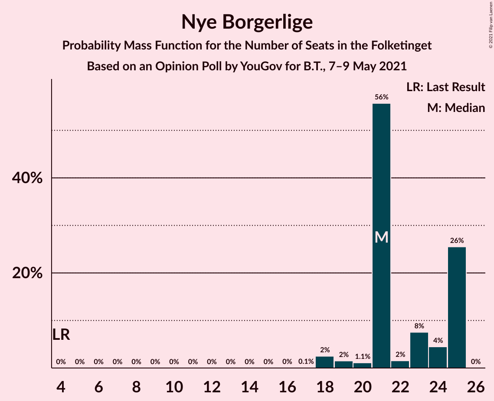
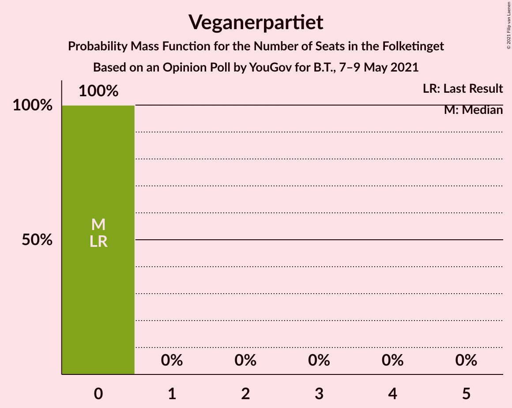

# Opinion Poll by YouGov for B.T., 7–9 May 2021

<a href="#voting-intentions">Voting Intentions</a> | <a href="#seats">Seats</a> | <a href="#coalitions">Coalitions</a> | <a href="#technical-information">Technical Information</a>

## Voting Intentions

### Confidence Intervals

| Party | Last Result | Poll Result | 80% Confidence Interval | 90% Confidence Interval | 95% Confidence Interval | 99% Confidence Interval |
|:-----:|:-----------:|:-----------:|:-----------------------:|:-----------------------:|:-----------------------:|:-----------------------:|
| Socialdemokraterne | 25.9% | 33.0% | 31.4–34.8% |30.9–35.2% |30.5–35.7% |29.7–36.5% |
| Det Konservative Folkeparti | 6.6% | 13.7% | 12.5–15.0% |12.2–15.4% |11.9–15.7% |11.4–16.4% |
| Nye Borgerlige | 2.4% | 11.6% | 10.5–12.9% |10.2–13.2% |10.0–13.5% |9.5–14.1% |
| Venstre | 23.4% | 10.7% | 9.6–11.9% |9.3–12.2% |9.1–12.5% |8.6–13.1% |
| Socialistisk Folkeparti | 7.7% | 7.8% | 6.9–8.9% |6.7–9.2% |6.5–9.5% |6.1–10.0% |
| Enhedslisten–De Rød-Grønne | 6.9% | 7.5% | 6.6–8.6% |6.4–8.9% |6.2–9.1% |5.8–9.6% |
| Dansk Folkeparti | 8.7% | 5.5% | 4.7–6.4% |4.5–6.6% |4.3–6.9% |4.0–7.3% |
| Radikale Venstre | 8.6% | 3.7% | 3.1–4.5% |2.9–4.7% |2.8–4.9% |2.5–5.3% |
| Liberal Alliance | 2.3% | 2.9% | 2.4–3.6% |2.3–3.8% |2.1–4.0% |1.9–4.4% |
| Kristendemokraterne | 1.7% | 1.7% | 1.3–2.2% |1.2–2.4% |1.1–2.5% |0.9–2.8% |
| Alternativet | 3.0% | 0.8% | 0.5–1.2% |0.5–1.3% |0.4–1.5% |0.3–1.7% |
| Veganerpartiet | 0.0% | 0.8% | 0.5–1.2% |0.5–1.3% |0.4–1.5% |0.3–1.7% |

*Note:* The poll result column reflects the actual value used in the calculations. Published results may vary slightly, and in addition be rounded to fewer digits.

## Seats

### Confidence Intervals

| Party | Last Result | Median | 80% Confidence Interval | 90% Confidence Interval | 95% Confidence Interval | 99% Confidence Interval |
|:-----:|:-----------:|:------:|:-----------------------:|:-----------------------:|:-----------------------:|:-----------------------:|
| <a href="#socialdemokraterne">Socialdemokraterne</a> | 48 | 60 | 56–60 |56–60 |55–61 |53–63 |
| <a href="#det-konservative-folkeparti">Det Konservative Folkeparti</a> | 12 | 25 | 24–25 |23–26 |23–29 |22–30 |
| <a href="#nye-borgerlige">Nye Borgerlige</a> | 4 | 21 | 21–25 |20–25 |18–25 |18–25 |
| <a href="#venstre">Venstre</a> | 43 | 20 | 18–20 |16–20 |16–21 |16–23 |
| <a href="#socialistisk-folkeparti">Socialistisk Folkeparti</a> | 14 | 13 | 13–14 |13–14 |13–15 |13–15 |
| <a href="#enhedslisten–de-rød-grønne">Enhedslisten–De Rød-Grønne</a> | 13 | 16 | 14–16 |14–16 |13–16 |11–16 |
| <a href="#dansk-folkeparti">Dansk Folkeparti</a> | 16 | 10 | 10 |10–11 |8–14 |7–14 |
| <a href="#radikale-venstre">Radikale Venstre</a> | 16 | 5 | 5–7 |5–7 |5–8 |5–9 |
| <a href="#liberal-alliance">Liberal Alliance</a> | 4 | 5 | 5 |4–6 |4–6 |4–7 |
| <a href="#kristendemokraterne">Kristendemokraterne</a> | 0 | 0 | 0 |0 |0–4 |0–5 |
| <a href="#alternativet">Alternativet</a> | 5 | 0 | 0 |0 |0 |0 |
| <a href="#veganerpartiet">Veganerpartiet</a> | 0 | 0 | 0 |0 |0 |0 |

### Socialdemokraterne

*For a full overview of the results for this party, see the [Socialdemokraterne](party-socialdemokraterne.html) page.*

| Number of Seats | Probability | Accumulated | Special Marks |
|:---------------:|:-----------:|:-----------:|:-------------:|
| 48 | 0% | 100% | Last Result |
| 49 | 0% | 100% |  |
| 50 | 0% | 100% |  |
| 51 | 0% | 100% |  |
| 52 | 0% | 100% |  |
| 53 | 1.4% | 100% |  |
| 54 | 0% | 98.6% |  |
| 55 | 3% | 98.5% |  |
| 56 | 27% | 96% |  |
| 57 | 6% | 69% |  |
| 58 | 0.6% | 63% |  |
| 59 | 4% | 63% |  |
| 60 | 56% | 58% | Median |
| 61 | 1.0% | 3% |  |
| 62 | 0.7% | 2% |  |
| 63 | 0.6% | 0.8% |  |
| 64 | 0.1% | 0.2% |  |
| 65 | 0% | 0% |  |

### Det Konservative Folkeparti

*For a full overview of the results for this party, see the [Det Konservative Folkeparti](party-detkonservativefolkeparti.html) page.*

| Number of Seats | Probability | Accumulated | Special Marks |
|:---------------:|:-----------:|:-----------:|:-------------:|
| 12 | 0% | 100% | Last Result |
| 13 | 0% | 100% |  |
| 14 | 0% | 100% |  |
| 15 | 0% | 100% |  |
| 16 | 0% | 100% |  |
| 17 | 0% | 100% |  |
| 18 | 0% | 100% |  |
| 19 | 0% | 100% |  |
| 20 | 0.2% | 100% |  |
| 21 | 0.1% | 99.8% |  |
| 22 | 1.2% | 99.7% |  |
| 23 | 4% | 98.5% |  |
| 24 | 27% | 95% |  |
| 25 | 61% | 68% | Median |
| 26 | 3% | 7% |  |
| 27 | 0.1% | 4% |  |
| 28 | 0.1% | 4% |  |
| 29 | 2% | 4% |  |
| 30 | 2% | 2% |  |
| 31 | 0% | 0% |  |

### Nye Borgerlige

*For a full overview of the results for this party, see the [Nye Borgerlige](party-nyeborgerlige.html) page.*

| Number of Seats | Probability | Accumulated | Special Marks |
|:---------------:|:-----------:|:-----------:|:-------------:|
| 4 | 0% | 100% | Last Result |
| 5 | 0% | 100% |  |
| 6 | 0% | 100% |  |
| 7 | 0% | 100% |  |
| 8 | 0% | 100% |  |
| 9 | 0% | 100% |  |
| 10 | 0% | 100% |  |
| 11 | 0% | 100% |  |
| 12 | 0% | 100% |  |
| 13 | 0% | 100% |  |
| 14 | 0% | 100% |  |
| 15 | 0% | 100% |  |
| 16 | 0% | 100% |  |
| 17 | 0.1% | 100% |  |
| 18 | 2% | 99.9% |  |
| 19 | 2% | 97% |  |
| 20 | 1.1% | 96% |  |
| 21 | 56% | 95% | Median |
| 22 | 2% | 39% |  |
| 23 | 8% | 38% |  |
| 24 | 4% | 30% |  |
| 25 | 26% | 26% |  |
| 26 | 0% | 0% |  |

### Venstre

*For a full overview of the results for this party, see the [Venstre](party-venstre.html) page.*

| Number of Seats | Probability | Accumulated | Special Marks |
|:---------------:|:-----------:|:-----------:|:-------------:|
| 15 | 0.1% | 100% |  |
| 16 | 6% | 99.9% |  |
| 17 | 1.2% | 94% |  |
| 18 | 27% | 93% |  |
| 19 | 5% | 66% |  |
| 20 | 57% | 61% | Median |
| 21 | 3% | 4% |  |
| 22 | 0.1% | 2% |  |
| 23 | 1.4% | 1.5% |  |
| 24 | 0% | 0% |  |
| 25 | 0% | 0% |  |
| 26 | 0% | 0% |  |
| 27 | 0% | 0% |  |
| 28 | 0% | 0% |  |
| 29 | 0% | 0% |  |
| 30 | 0% | 0% |  |
| 31 | 0% | 0% |  |
| 32 | 0% | 0% |  |
| 33 | 0% | 0% |  |
| 34 | 0% | 0% |  |
| 35 | 0% | 0% |  |
| 36 | 0% | 0% |  |
| 37 | 0% | 0% |  |
| 38 | 0% | 0% |  |
| 39 | 0% | 0% |  |
| 40 | 0% | 0% |  |
| 41 | 0% | 0% |  |
| 42 | 0% | 0% |  |
| 43 | 0% | 0% | Last Result |

### Socialistisk Folkeparti

*For a full overview of the results for this party, see the [Socialistisk Folkeparti](party-socialistiskfolkeparti.html) page.*

| Number of Seats | Probability | Accumulated | Special Marks |
|:---------------:|:-----------:|:-----------:|:-------------:|
| 11 | 0.2% | 100% |  |
| 12 | 0.3% | 99.8% |  |
| 13 | 61% | 99.6% | Median |
| 14 | 35% | 39% | Last Result |
| 15 | 3% | 3% |  |
| 16 | 0.1% | 0.2% |  |
| 17 | 0.1% | 0.1% |  |
| 18 | 0% | 0.1% |  |
| 19 | 0.1% | 0.1% |  |
| 20 | 0% | 0% |  |

### Enhedslisten–De Rød-Grønne

*For a full overview of the results for this party, see the [Enhedslisten–De Rød-Grønne](party-enhedslisten–derød-grønne.html) page.*

| Number of Seats | Probability | Accumulated | Special Marks |
|:---------------:|:-----------:|:-----------:|:-------------:|
| 9 | 0.2% | 100% |  |
| 10 | 0% | 99.8% |  |
| 11 | 0.8% | 99.8% |  |
| 12 | 0.3% | 99.0% |  |
| 13 | 2% | 98.7% | Last Result |
| 14 | 7% | 96% |  |
| 15 | 4% | 89% |  |
| 16 | 85% | 85% | Median |
| 17 | 0.2% | 0.2% |  |
| 18 | 0% | 0% |  |

### Dansk Folkeparti

*For a full overview of the results for this party, see the [Dansk Folkeparti](party-danskfolkeparti.html) page.*

| Number of Seats | Probability | Accumulated | Special Marks |
|:---------------:|:-----------:|:-----------:|:-------------:|
| 7 | 0.6% | 100% |  |
| 8 | 2% | 99.4% |  |
| 9 | 0.6% | 97% |  |
| 10 | 87% | 96% | Median |
| 11 | 6% | 10% |  |
| 12 | 1.0% | 4% |  |
| 13 | 0.2% | 3% |  |
| 14 | 3% | 3% |  |
| 15 | 0% | 0% |  |
| 16 | 0% | 0% | Last Result |

### Radikale Venstre

*For a full overview of the results for this party, see the [Radikale Venstre](party-radikalevenstre.html) page.*

| Number of Seats | Probability | Accumulated | Special Marks |
|:---------------:|:-----------:|:-----------:|:-------------:|
| 5 | 56% | 100% | Median |
| 6 | 9% | 44% |  |
| 7 | 30% | 35% |  |
| 8 | 4% | 5% |  |
| 9 | 0.1% | 0.5% |  |
| 10 | 0.4% | 0.5% |  |
| 11 | 0.1% | 0.1% |  |
| 12 | 0% | 0% |  |
| 13 | 0% | 0% |  |
| 14 | 0% | 0% |  |
| 15 | 0% | 0% |  |
| 16 | 0% | 0% | Last Result |

### Liberal Alliance

*For a full overview of the results for this party, see the [Liberal Alliance](party-liberalalliance.html) page.*

| Number of Seats | Probability | Accumulated | Special Marks |
|:---------------:|:-----------:|:-----------:|:-------------:|
| 0 | 0.2% | 100% |  |
| 1 | 0% | 99.8% |  |
| 2 | 0% | 99.8% |  |
| 3 | 0% | 99.8% |  |
| 4 | 5% | 99.8% | Last Result |
| 5 | 88% | 95% | Median |
| 6 | 6% | 6% |  |
| 7 | 0.2% | 0.7% |  |
| 8 | 0.5% | 0.5% |  |
| 9 | 0% | 0% |  |

### Kristendemokraterne

*For a full overview of the results for this party, see the [Kristendemokraterne](party-kristendemokraterne.html) page.*

| Number of Seats | Probability | Accumulated | Special Marks |
|:---------------:|:-----------:|:-----------:|:-------------:|
| 0 | 96% | 100% | Last Result, Median |
| 1 | 0% | 4% |  |
| 2 | 0% | 4% |  |
| 3 | 0% | 4% |  |
| 4 | 3% | 4% |  |
| 5 | 1.0% | 1.0% |  |
| 6 | 0% | 0% |  |

### Alternativet

*For a full overview of the results for this party, see the [Alternativet](party-alternativet.html) page.*

| Number of Seats | Probability | Accumulated | Special Marks |
|:---------------:|:-----------:|:-----------:|:-------------:|
| 0 | 99.9% | 100% | Median |
| 1 | 0% | 0.1% |  |
| 2 | 0% | 0.1% |  |
| 3 | 0% | 0.1% |  |
| 4 | 0.1% | 0.1% |  |
| 5 | 0% | 0% | Last Result |

### Veganerpartiet

*For a full overview of the results for this party, see the [Veganerpartiet](party-veganerpartiet.html) page.*

| Number of Seats | Probability | Accumulated | Special Marks |
|:---------------:|:-----------:|:-----------:|:-------------:|
| 0 | 100% | 100% | Last Result, Median |

## Coalitions

### Confidence Intervals

| Coalition | Last Result | Median | Majority? | 80% Confidence Interval | 90% Confidence Interval | 95% Confidence Interval | 99% Confidence Interval |
|:---------:|:-----------:|:------:|:---------:|:-----------------------:|:-----------------------:|:-----------------------:|:-----------------------:|
| Socialdemokraterne – Socialistisk Folkeparti – Enhedslisten–De Rød-Grønne – Radikale Venstre – Alternativet | 96 | 94 | 96% | 91–94 | 90–96 | 89–97 | 88–98 |
| Socialdemokraterne – Socialistisk Folkeparti – Enhedslisten–De Rød-Grønne – Radikale Venstre | 91 | 94 | 96% | 91–94 | 90–96 | 89–97 | 88–98 |
| Socialdemokraterne – Socialistisk Folkeparti – Enhedslisten–De Rød-Grønne – Alternativet | 80 | 89 | 1.5% | 85–89 | 84–89 | 83–89 | 81–92 |
| Socialdemokraterne – Socialistisk Folkeparti – Enhedslisten–De Rød-Grønne | 75 | 89 | 1.5% | 85–89 | 84–89 | 83–89 | 81–92 |
| Det Konservative Folkeparti – Nye Borgerlige – Venstre – Dansk Folkeparti – Liberal Alliance – Kristendemokraterne | 79 | 81 | 0% | 81–84 | 79–85 | 78–86 | 77–87 |
| Det Konservative Folkeparti – Nye Borgerlige – Venstre – Dansk Folkeparti – Liberal Alliance | 79 | 81 | 0% | 80–82 | 78–85 | 78–86 | 75–87 |
| Socialdemokraterne – Socialistisk Folkeparti – Radikale Venstre | 78 | 78 | 0% | 77–78 | 76–81 | 75–82 | 73–83 |
| Socialdemokraterne – Radikale Venstre | 64 | 65 | 0% | 63–65 | 62–67 | 61–68 | 60–69 |
| Det Konservative Folkeparti – Venstre – Dansk Folkeparti – Liberal Alliance – Kristendemokraterne | 75 | 60 | 0% | 57–61 | 57–63 | 55–66 | 55–68 |
| Det Konservative Folkeparti – Venstre – Dansk Folkeparti – Liberal Alliance | 75 | 60 | 0% | 57–60 | 56–61 | 55–66 | 55–68 |
| Det Konservative Folkeparti – Venstre – Liberal Alliance | 59 | 50 | 0% | 47–50 | 45–51 | 45–54 | 45–57 |
| Det Konservative Folkeparti – Venstre | 55 | 45 | 0% | 42–45 | 41–46 | 41–48 | 40–51 |
| Venstre | 43 | 20 | 0% | 18–20 | 16–20 | 16–21 | 16–23 |

### Socialdemokraterne – Socialistisk Folkeparti – Enhedslisten–De Rød-Grønne – Radikale Venstre – Alternativet

| Number of Seats | Probability | Accumulated | Special Marks |
|:---------------:|:-----------:|:-----------:|:-------------:|
| 87 | 0% | 100% |  |
| 88 | 1.4% | 99.9% |  |
| 89 | 2% | 98.6% |  |
| 90 | 3% | 96% | Majority |
| 91 | 4% | 93% |  |
| 92 | 0.4% | 89% |  |
| 93 | 27% | 89% |  |
| 94 | 55% | 62% | Median |
| 95 | 0.4% | 7% |  |
| 96 | 2% | 6% | Last Result |
| 97 | 4% | 5% |  |
| 98 | 0.6% | 0.6% |  |
| 99 | 0% | 0% |  |

### Socialdemokraterne – Socialistisk Folkeparti – Enhedslisten–De Rød-Grønne – Radikale Venstre

| Number of Seats | Probability | Accumulated | Special Marks |
|:---------------:|:-----------:|:-----------:|:-------------:|
| 87 | 0% | 100% |  |
| 88 | 1.4% | 99.9% |  |
| 89 | 2% | 98.6% |  |
| 90 | 3% | 96% | Majority |
| 91 | 4% | 93% | Last Result |
| 92 | 0.4% | 89% |  |
| 93 | 27% | 89% |  |
| 94 | 55% | 62% | Median |
| 95 | 0.4% | 7% |  |
| 96 | 2% | 6% |  |
| 97 | 4% | 5% |  |
| 98 | 0.6% | 0.6% |  |
| 99 | 0% | 0% |  |

### Socialdemokraterne – Socialistisk Folkeparti – Enhedslisten–De Rød-Grønne – Alternativet

| Number of Seats | Probability | Accumulated | Special Marks |
|:---------------:|:-----------:|:-----------:|:-------------:|
| 80 | 0% | 100% | Last Result |
| 81 | 1.4% | 99.9% |  |
| 82 | 0.1% | 98.6% |  |
| 83 | 2% | 98% |  |
| 84 | 3% | 96% |  |
| 85 | 3% | 92% |  |
| 86 | 28% | 90% |  |
| 87 | 0.4% | 61% |  |
| 88 | 0.4% | 61% |  |
| 89 | 59% | 61% | Median |
| 90 | 0.7% | 1.5% | Majority |
| 91 | 0% | 0.8% |  |
| 92 | 0.8% | 0.8% |  |
| 93 | 0% | 0% |  |

### Socialdemokraterne – Socialistisk Folkeparti – Enhedslisten–De Rød-Grønne

| Number of Seats | Probability | Accumulated | Special Marks |
|:---------------:|:-----------:|:-----------:|:-------------:|
| 75 | 0% | 100% | Last Result |
| 76 | 0% | 100% |  |
| 77 | 0% | 100% |  |
| 78 | 0% | 100% |  |
| 79 | 0% | 100% |  |
| 80 | 0% | 100% |  |
| 81 | 1.4% | 99.9% |  |
| 82 | 0.1% | 98.6% |  |
| 83 | 2% | 98% |  |
| 84 | 3% | 96% |  |
| 85 | 3% | 92% |  |
| 86 | 28% | 90% |  |
| 87 | 0.4% | 61% |  |
| 88 | 0.4% | 61% |  |
| 89 | 59% | 61% | Median |
| 90 | 0.7% | 1.5% | Majority |
| 91 | 0% | 0.8% |  |
| 92 | 0.8% | 0.8% |  |
| 93 | 0% | 0% |  |

### Det Konservative Folkeparti – Nye Borgerlige – Venstre – Dansk Folkeparti – Liberal Alliance – Kristendemokraterne

| Number of Seats | Probability | Accumulated | Special Marks |
|:---------------:|:-----------:|:-----------:|:-------------:|
| 77 | 0.6% | 100% |  |
| 78 | 4% | 99.4% |  |
| 79 | 2% | 95% | Last Result |
| 80 | 0.4% | 94% |  |
| 81 | 55% | 93% | Median |
| 82 | 27% | 38% |  |
| 83 | 0.4% | 11% |  |
| 84 | 4% | 11% |  |
| 85 | 3% | 7% |  |
| 86 | 2% | 4% |  |
| 87 | 1.4% | 1.4% |  |
| 88 | 0% | 0.1% |  |
| 89 | 0% | 0% |  |

### Det Konservative Folkeparti – Nye Borgerlige – Venstre – Dansk Folkeparti – Liberal Alliance

| Number of Seats | Probability | Accumulated | Special Marks |
|:---------------:|:-----------:|:-----------:|:-------------:|
| 74 | 0.3% | 100% |  |
| 75 | 0.2% | 99.6% |  |
| 76 | 0% | 99.4% |  |
| 77 | 0.6% | 99.4% |  |
| 78 | 4% | 98.8% |  |
| 79 | 2% | 95% | Last Result |
| 80 | 3% | 93% |  |
| 81 | 55% | 90% | Median |
| 82 | 27% | 35% |  |
| 83 | 0.4% | 8% |  |
| 84 | 0.5% | 7% |  |
| 85 | 3% | 7% |  |
| 86 | 2% | 4% |  |
| 87 | 1.4% | 1.4% |  |
| 88 | 0% | 0% |  |

### Socialdemokraterne – Socialistisk Folkeparti – Radikale Venstre

| Number of Seats | Probability | Accumulated | Special Marks |
|:---------------:|:-----------:|:-----------:|:-------------:|
| 73 | 1.4% | 100% |  |
| 74 | 0% | 98.6% |  |
| 75 | 3% | 98.6% |  |
| 76 | 3% | 95% |  |
| 77 | 27% | 92% |  |
| 78 | 57% | 65% | Last Result, Median |
| 79 | 0.3% | 8% |  |
| 80 | 0.9% | 8% |  |
| 81 | 4% | 7% |  |
| 82 | 0.5% | 3% |  |
| 83 | 2% | 2% |  |
| 84 | 0.1% | 0.2% |  |
| 85 | 0.1% | 0.1% |  |
| 86 | 0% | 0% |  |

### Socialdemokraterne – Radikale Venstre

| Number of Seats | Probability | Accumulated | Special Marks |
|:---------------:|:-----------:|:-----------:|:-------------:|
| 60 | 1.4% | 100% |  |
| 61 | 3% | 98.6% |  |
| 62 | 2% | 96% |  |
| 63 | 29% | 94% |  |
| 64 | 2% | 65% | Last Result |
| 65 | 55% | 63% | Median |
| 66 | 1.0% | 8% |  |
| 67 | 4% | 7% |  |
| 68 | 2% | 3% |  |
| 69 | 1.0% | 1.2% |  |
| 70 | 0% | 0.2% |  |
| 71 | 0% | 0.2% |  |
| 72 | 0.1% | 0.1% |  |
| 73 | 0% | 0% |  |

### Det Konservative Folkeparti – Venstre – Dansk Folkeparti – Liberal Alliance – Kristendemokraterne

| Number of Seats | Probability | Accumulated | Special Marks |
|:---------------:|:-----------:|:-----------:|:-------------:|
| 54 | 0.1% | 100% |  |
| 55 | 4% | 99.9% |  |
| 56 | 0.8% | 96% |  |
| 57 | 27% | 95% |  |
| 58 | 0.1% | 69% |  |
| 59 | 3% | 69% |  |
| 60 | 55% | 66% | Median |
| 61 | 5% | 11% |  |
| 62 | 0.2% | 6% |  |
| 63 | 2% | 6% |  |
| 64 | 0% | 4% |  |
| 65 | 2% | 4% |  |
| 66 | 0.1% | 3% |  |
| 67 | 0% | 2% |  |
| 68 | 2% | 2% |  |
| 69 | 0% | 0% |  |
| 70 | 0% | 0% |  |
| 71 | 0% | 0% |  |
| 72 | 0% | 0% |  |
| 73 | 0% | 0% |  |
| 74 | 0% | 0% |  |
| 75 | 0% | 0% | Last Result |

### Det Konservative Folkeparti – Venstre – Dansk Folkeparti – Liberal Alliance

| Number of Seats | Probability | Accumulated | Special Marks |
|:---------------:|:-----------:|:-----------:|:-------------:|
| 52 | 0.2% | 100% |  |
| 53 | 0.1% | 99.7% |  |
| 54 | 0.1% | 99.7% |  |
| 55 | 4% | 99.6% |  |
| 56 | 1.4% | 96% |  |
| 57 | 27% | 94% |  |
| 58 | 0.2% | 67% |  |
| 59 | 3% | 67% |  |
| 60 | 55% | 64% | Median |
| 61 | 5% | 9% |  |
| 62 | 0% | 4% |  |
| 63 | 2% | 4% |  |
| 64 | 0% | 3% |  |
| 65 | 0% | 3% |  |
| 66 | 0.1% | 3% |  |
| 67 | 0% | 2% |  |
| 68 | 2% | 2% |  |
| 69 | 0% | 0% |  |
| 70 | 0% | 0% |  |
| 71 | 0% | 0% |  |
| 72 | 0% | 0% |  |
| 73 | 0% | 0% |  |
| 74 | 0% | 0% |  |
| 75 | 0% | 0% | Last Result |

### Det Konservative Folkeparti – Venstre – Liberal Alliance

| Number of Seats | Probability | Accumulated | Special Marks |
|:---------------:|:-----------:|:-----------:|:-------------:|
| 43 | 0.2% | 100% |  |
| 44 | 0.1% | 99.7% |  |
| 45 | 5% | 99.6% |  |
| 46 | 2% | 95% |  |
| 47 | 28% | 93% |  |
| 48 | 0.8% | 65% |  |
| 49 | 0.7% | 64% |  |
| 50 | 55% | 63% | Median |
| 51 | 3% | 8% |  |
| 52 | 2% | 5% |  |
| 53 | 0.5% | 3% |  |
| 54 | 0.1% | 3% |  |
| 55 | 0% | 2% |  |
| 56 | 0% | 2% |  |
| 57 | 2% | 2% |  |
| 58 | 0% | 0% |  |
| 59 | 0% | 0% | Last Result |

### Det Konservative Folkeparti – Venstre

| Number of Seats | Probability | Accumulated | Special Marks |
|:---------------:|:-----------:|:-----------:|:-------------:|
| 38 | 0.2% | 100% |  |
| 39 | 0.2% | 99.8% |  |
| 40 | 0.2% | 99.6% |  |
| 41 | 6% | 99.4% |  |
| 42 | 29% | 93% |  |
| 43 | 0.9% | 64% |  |
| 44 | 0.5% | 63% |  |
| 45 | 57% | 63% | Median |
| 46 | 2% | 6% |  |
| 47 | 2% | 4% |  |
| 48 | 0% | 3% |  |
| 49 | 0% | 2% |  |
| 50 | 0% | 2% |  |
| 51 | 2% | 2% |  |
| 52 | 0% | 0% |  |
| 53 | 0% | 0% |  |
| 54 | 0% | 0% |  |
| 55 | 0% | 0% | Last Result |

### Venstre

| Number of Seats | Probability | Accumulated | Special Marks |
|:---------------:|:-----------:|:-----------:|:-------------:|
| 15 | 0.1% | 100% |  |
| 16 | 6% | 99.9% |  |
| 17 | 1.2% | 94% |  |
| 18 | 27% | 93% |  |
| 19 | 5% | 66% |  |
| 20 | 57% | 61% | Median |
| 21 | 3% | 4% |  |
| 22 | 0.1% | 2% |  |
| 23 | 1.4% | 1.5% |  |
| 24 | 0% | 0% |  |
| 25 | 0% | 0% |  |
| 26 | 0% | 0% |  |
| 27 | 0% | 0% |  |
| 28 | 0% | 0% |  |
| 29 | 0% | 0% |  |
| 30 | 0% | 0% |  |
| 31 | 0% | 0% |  |
| 32 | 0% | 0% |  |
| 33 | 0% | 0% |  |
| 34 | 0% | 0% |  |
| 35 | 0% | 0% |  |
| 36 | 0% | 0% |  |
| 37 | 0% | 0% |  |
| 38 | 0% | 0% |  |
| 39 | 0% | 0% |  |
| 40 | 0% | 0% |  |
| 41 | 0% | 0% |  |
| 42 | 0% | 0% |  |
| 43 | 0% | 0% | Last Result |

## Technical Information

### Opinion Poll

+ **Polling firm:** YouGov
+ **Commissioner(s):** B.T.
+ **Fieldwork period:** 7–9 May 2021

### Calculations

+ **Sample size:** 1263
+ **Simulations done:** 131,072
+ **Error estimate:** 2.55%

