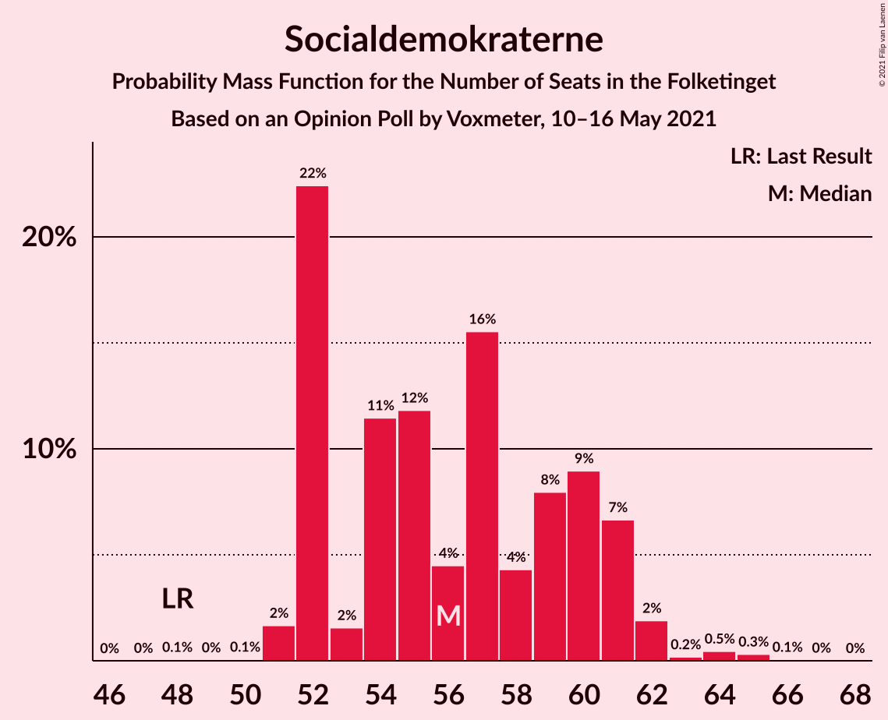
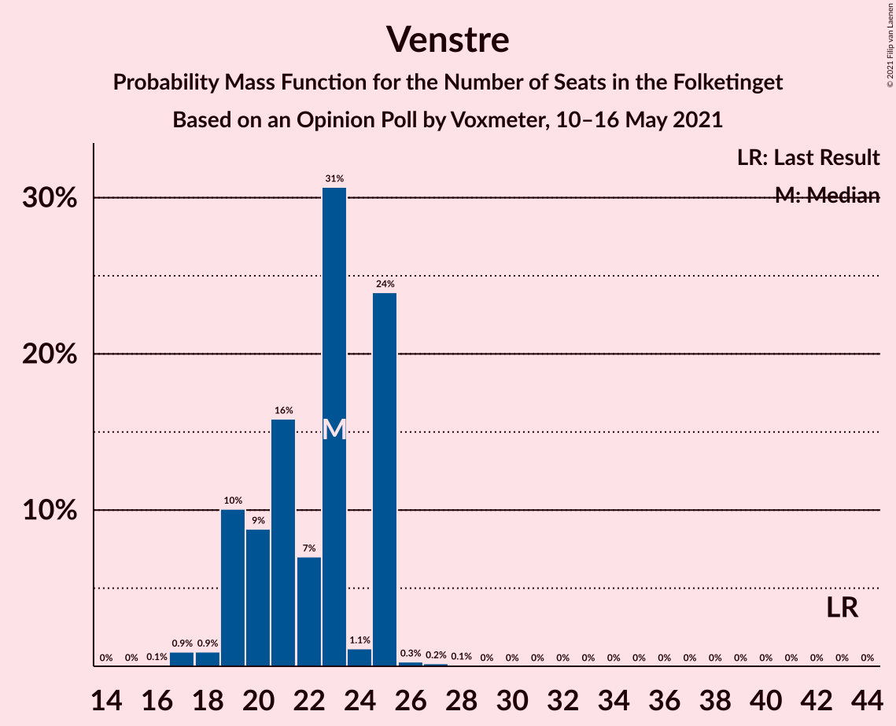
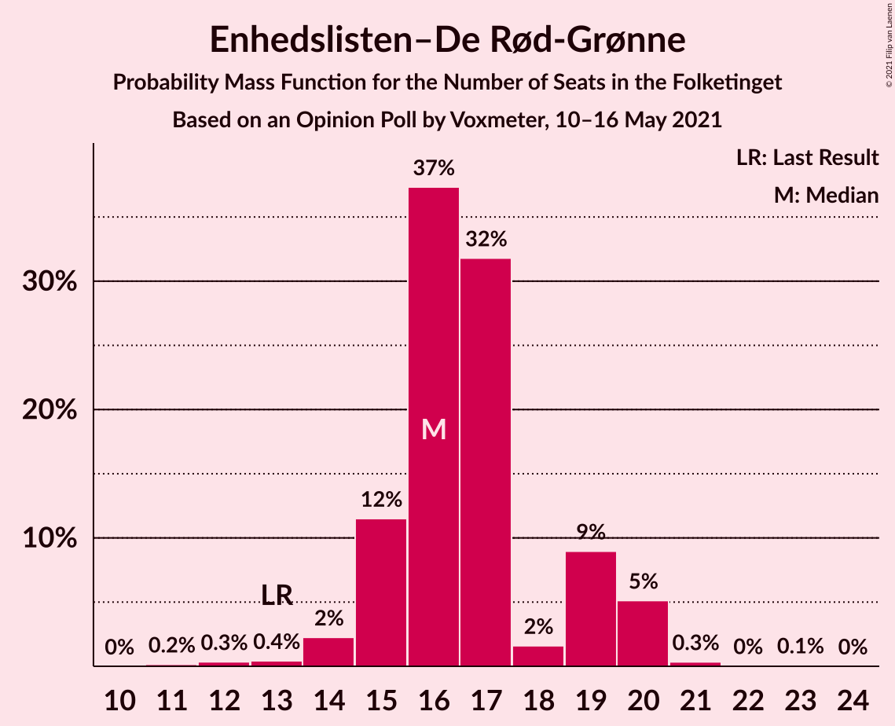
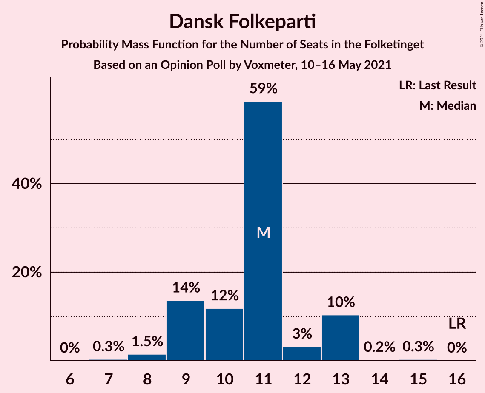
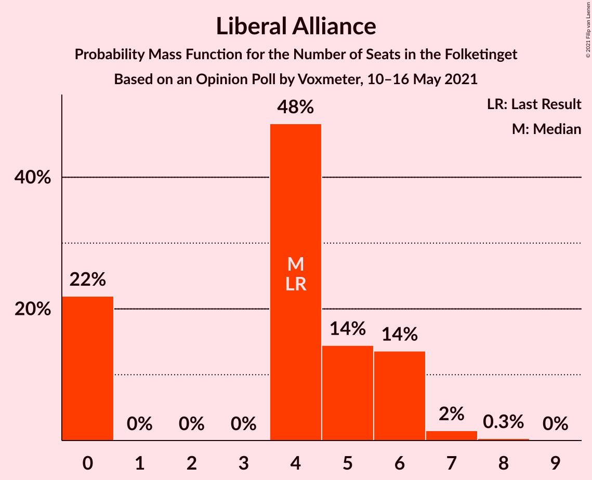
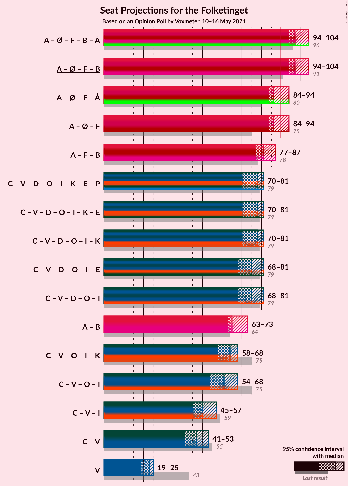
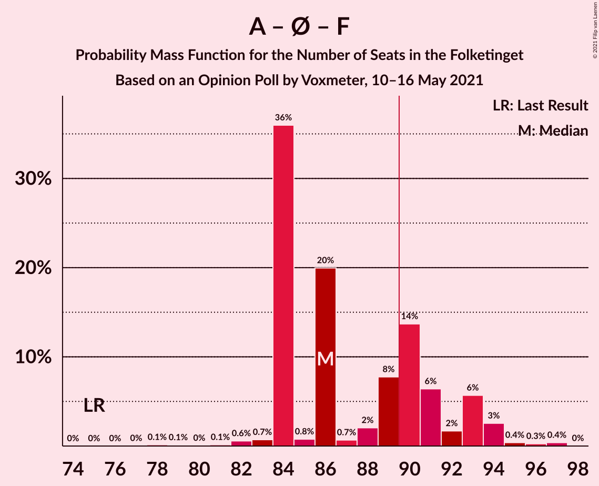
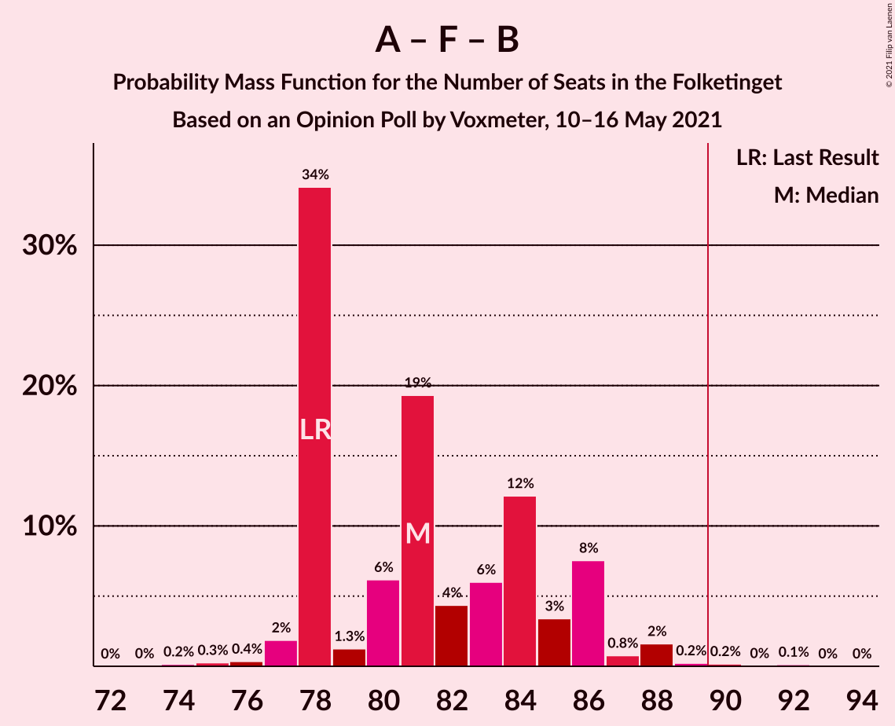
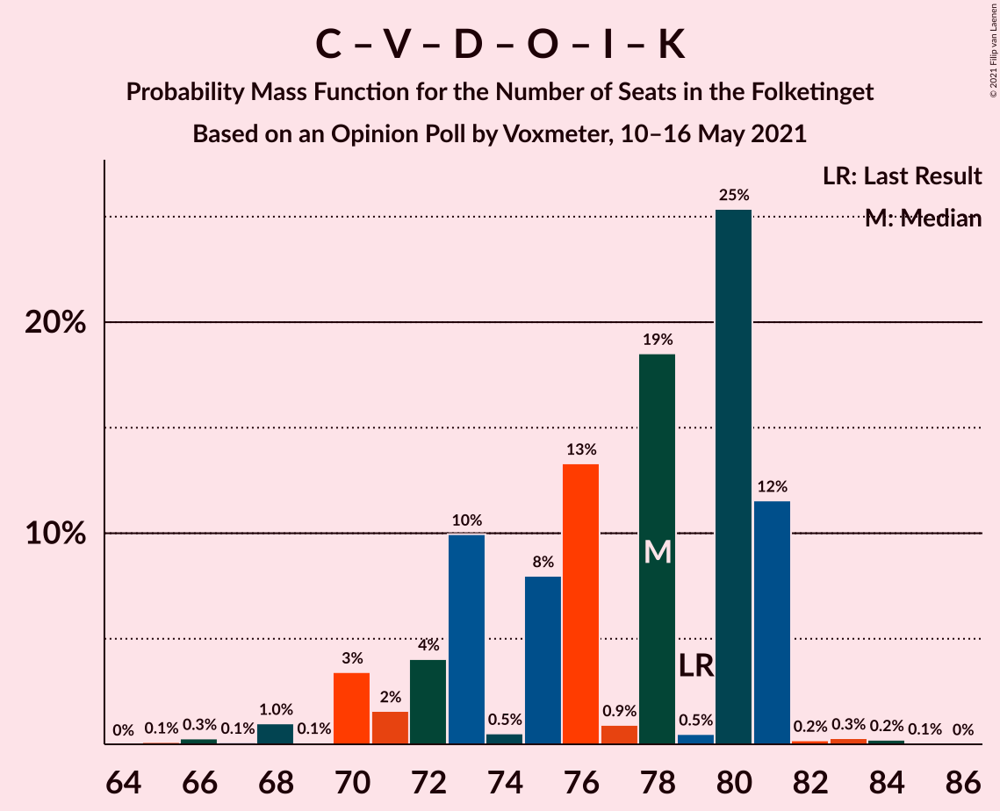

# Opinion Poll by Voxmeter, 10–16 May 2021

<a href="#voting-intentions">Voting Intentions</a> | <a href="#seats">Seats</a> | <a href="#coalitions">Coalitions</a> | <a href="#technical-information">Technical Information</a>

## Voting Intentions

### Confidence Intervals

| Party | Last Result | Poll Result | 80% Confidence Interval | 90% Confidence Interval | 95% Confidence Interval | 99% Confidence Interval |
|:-----:|:-----------:|:-----------:|:-----------------------:|:-----------------------:|:-----------------------:|:-----------------------:|
| Socialdemokraterne | 25.9% | 31.8% | 30.0–33.8% |29.5–34.3% |29.0–34.8% |28.2–35.7% |
| Det Konservative Folkeparti | 6.6% | 13.4% | 12.1–14.9% |11.7–15.3% |11.4–15.6% |10.8–16.4% |
| Venstre | 23.4% | 11.8% | 10.6–13.2% |10.2–13.6% |10.0–13.9% |9.4–14.6% |
| Enhedslisten–De Rød-Grønne | 6.9% | 9.2% | 8.2–10.5% |7.8–10.9% |7.6–11.2% |7.1–11.8% |
| Socialistisk Folkeparti | 7.7% | 7.9% | 6.9–9.1% |6.7–9.5% |6.4–9.8% |6.0–10.4% |
| Nye Borgerlige | 2.4% | 6.9% | 6.0–8.1% |5.7–8.4% |5.5–8.7% |5.1–9.3% |
| Dansk Folkeparti | 8.7% | 5.9% | 5.0–6.9% |4.8–7.2% |4.6–7.5% |4.2–8.0% |
| Radikale Venstre | 8.6% | 5.9% | 5.0–6.9% |4.8–7.2% |4.6–7.5% |4.2–8.0% |
| Liberal Alliance | 2.3% | 2.5% | 2.0–3.2% |1.8–3.4% |1.7–3.6% |1.5–4.0% |
| Kristendemokraterne | 1.7% | 1.9% | 1.4–2.6% |1.3–2.8% |1.2–2.9% |1.0–3.3% |
| Alternativet | 3.0% | 1.1% | 0.8–1.6% |0.7–1.8% |0.6–2.0% |0.5–2.3% |
| Veganerpartiet | 0.0% | 0.4% | 0.2–0.8% |0.2–0.9% |0.2–1.0% |0.1–1.2% |

*Note:* The poll result column reflects the actual value used in the calculations. Published results may vary slightly, and in addition be rounded to fewer digits.

## Seats

### Confidence Intervals

| Party | Last Result | Median | 80% Confidence Interval | 90% Confidence Interval | 95% Confidence Interval | 99% Confidence Interval |
|:-----:|:-----------:|:------:|:-----------------------:|:-----------------------:|:-----------------------:|:-----------------------:|
| <a href="#socialdemokraterne">Socialdemokraterne</a> | 48 | 52 | 52–55 |52–59 |52–60 |52–62 |
| <a href="#det-konservative-folkeparti">Det Konservative Folkeparti</a> | 12 | 24 | 24 |22–25 |20–25 |20–28 |
| <a href="#venstre">Venstre</a> | 43 | 25 | 22–25 |20–25 |17–25 |17–25 |
| <a href="#enhedslisten–de-rød-grønne">Enhedslisten–De Rød-Grønne</a> | 13 | 17 | 17 |16–19 |15–19 |11–20 |
| <a href="#socialistisk-folkeparti">Socialistisk Folkeparti</a> | 14 | 15 | 15 |15–16 |13–16 |11–17 |
| <a href="#nye-borgerlige">Nye Borgerlige</a> | 4 | 12 | 12 |12–14 |11–16 |10–16 |
| <a href="#dansk-folkeparti">Dansk Folkeparti</a> | 16 | 11 | 11 |10–11 |10–13 |8–13 |
| <a href="#radikale-venstre">Radikale Venstre</a> | 16 | 11 | 11 |10–11 |9–13 |8–13 |
| <a href="#liberal-alliance">Liberal Alliance</a> | 4 | 4 | 4 |4–5 |4–5 |0–7 |
| <a href="#kristendemokraterne">Kristendemokraterne</a> | 0 | 4 | 4 |0–4 |0–4 |0–5 |
| <a href="#alternativet">Alternativet</a> | 5 | 0 | 0 |0 |0 |0 |
| <a href="#veganerpartiet">Veganerpartiet</a> | 0 | 0 | 0 |0 |0 |0 |

### Socialdemokraterne

*For a full overview of the results for this party, see the [Socialdemokraterne](party-socialdemokraterne.html) page.*

| Number of Seats | Probability | Accumulated | Special Marks |
|:---------------:|:-----------:|:-----------:|:-------------:|
| 48 | 0.1% | 100% | Last Result |
| 49 | 0% | 99.9% |  |
| 50 | 0% | 99.9% |  |
| 51 | 0.2% | 99.8% |  |
| 52 | 86% | 99.7% | Median |
| 53 | 0.2% | 13% |  |
| 54 | 0.2% | 13% |  |
| 55 | 4% | 13% |  |
| 56 | 0.3% | 9% |  |
| 57 | 0.2% | 9% |  |
| 58 | 1.1% | 9% |  |
| 59 | 3% | 7% |  |
| 60 | 3% | 5% |  |
| 61 | 0.6% | 2% |  |
| 62 | 2% | 2% |  |
| 63 | 0% | 0.1% |  |
| 64 | 0% | 0.1% |  |
| 65 | 0% | 0.1% |  |
| 66 | 0% | 0.1% |  |
| 67 | 0% | 0% |  |

### Det Konservative Folkeparti

*For a full overview of the results for this party, see the [Det Konservative Folkeparti](party-detkonservativefolkeparti.html) page.*

| Number of Seats | Probability | Accumulated | Special Marks |
|:---------------:|:-----------:|:-----------:|:-------------:|
| 12 | 0% | 100% | Last Result |
| 13 | 0% | 100% |  |
| 14 | 0% | 100% |  |
| 15 | 0% | 100% |  |
| 16 | 0% | 100% |  |
| 17 | 0% | 100% |  |
| 18 | 0% | 100% |  |
| 19 | 0% | 100% |  |
| 20 | 3% | 99.9% |  |
| 21 | 0.1% | 97% |  |
| 22 | 4% | 97% |  |
| 23 | 0.4% | 93% |  |
| 24 | 87% | 93% | Median |
| 25 | 4% | 6% |  |
| 26 | 0.7% | 2% |  |
| 27 | 0.5% | 1.0% |  |
| 28 | 0.5% | 0.5% |  |
| 29 | 0% | 0% |  |

### Venstre

*For a full overview of the results for this party, see the [Venstre](party-venstre.html) page.*

| Number of Seats | Probability | Accumulated | Special Marks |
|:---------------:|:-----------:|:-----------:|:-------------:|
| 17 | 2% | 100% |  |
| 18 | 1.0% | 97% |  |
| 19 | 0.2% | 96% |  |
| 20 | 2% | 96% |  |
| 21 | 4% | 95% |  |
| 22 | 0.9% | 91% |  |
| 23 | 3% | 90% |  |
| 24 | 0.1% | 87% |  |
| 25 | 87% | 87% | Median |
| 26 | 0.2% | 0.3% |  |
| 27 | 0% | 0% |  |
| 28 | 0% | 0% |  |
| 29 | 0% | 0% |  |
| 30 | 0% | 0% |  |
| 31 | 0% | 0% |  |
| 32 | 0% | 0% |  |
| 33 | 0% | 0% |  |
| 34 | 0% | 0% |  |
| 35 | 0% | 0% |  |
| 36 | 0% | 0% |  |
| 37 | 0% | 0% |  |
| 38 | 0% | 0% |  |
| 39 | 0% | 0% |  |
| 40 | 0% | 0% |  |
| 41 | 0% | 0% |  |
| 42 | 0% | 0% |  |
| 43 | 0% | 0% | Last Result |

### Enhedslisten–De Rød-Grønne

*For a full overview of the results for this party, see the [Enhedslisten–De Rød-Grønne](party-enhedslisten–derød-grønne.html) page.*

| Number of Seats | Probability | Accumulated | Special Marks |
|:---------------:|:-----------:|:-----------:|:-------------:|
| 11 | 0.6% | 100% |  |
| 12 | 0% | 99.4% |  |
| 13 | 0.1% | 99.4% | Last Result |
| 14 | 0.3% | 99.3% |  |
| 15 | 4% | 99.1% |  |
| 16 | 1.3% | 95% |  |
| 17 | 87% | 94% | Median |
| 18 | 1.2% | 7% |  |
| 19 | 5% | 6% |  |
| 20 | 0.5% | 0.8% |  |
| 21 | 0% | 0.2% |  |
| 22 | 0% | 0.2% |  |
| 23 | 0.2% | 0.2% |  |
| 24 | 0% | 0% |  |

### Socialistisk Folkeparti

*For a full overview of the results for this party, see the [Socialistisk Folkeparti](party-socialistiskfolkeparti.html) page.*

| Number of Seats | Probability | Accumulated | Special Marks |
|:---------------:|:-----------:|:-----------:|:-------------:|
| 10 | 0.4% | 100% |  |
| 11 | 0.1% | 99.6% |  |
| 12 | 0.8% | 99.4% |  |
| 13 | 1.2% | 98.6% |  |
| 14 | 2% | 97% | Last Result |
| 15 | 90% | 96% | Median |
| 16 | 6% | 6% |  |
| 17 | 0.4% | 0.8% |  |
| 18 | 0.1% | 0.3% |  |
| 19 | 0% | 0.2% |  |
| 20 | 0.2% | 0.2% |  |
| 21 | 0% | 0% |  |

### Nye Borgerlige

*For a full overview of the results for this party, see the [Nye Borgerlige](party-nyeborgerlige.html) page.*

| Number of Seats | Probability | Accumulated | Special Marks |
|:---------------:|:-----------:|:-----------:|:-------------:|
| 4 | 0% | 100% | Last Result |
| 5 | 0% | 100% |  |
| 6 | 0% | 100% |  |
| 7 | 0% | 100% |  |
| 8 | 0% | 100% |  |
| 9 | 0.2% | 100% |  |
| 10 | 1.4% | 99.7% |  |
| 11 | 3% | 98% |  |
| 12 | 87% | 95% | Median |
| 13 | 3% | 9% |  |
| 14 | 2% | 6% |  |
| 15 | 0.5% | 4% |  |
| 16 | 3% | 3% |  |
| 17 | 0% | 0.1% |  |
| 18 | 0% | 0.1% |  |
| 19 | 0.1% | 0.1% |  |
| 20 | 0% | 0% |  |

### Dansk Folkeparti

*For a full overview of the results for this party, see the [Dansk Folkeparti](party-danskfolkeparti.html) page.*

| Number of Seats | Probability | Accumulated | Special Marks |
|:---------------:|:-----------:|:-----------:|:-------------:|
| 7 | 0.2% | 100% |  |
| 8 | 0.3% | 99.8% |  |
| 9 | 1.2% | 99.5% |  |
| 10 | 4% | 98% |  |
| 11 | 90% | 94% | Median |
| 12 | 1.0% | 4% |  |
| 13 | 3% | 3% |  |
| 14 | 0.1% | 0.2% |  |
| 15 | 0% | 0.1% |  |
| 16 | 0% | 0% | Last Result |

### Radikale Venstre

*For a full overview of the results for this party, see the [Radikale Venstre](party-radikalevenstre.html) page.*

| Number of Seats | Probability | Accumulated | Special Marks |
|:---------------:|:-----------:|:-----------:|:-------------:|
| 8 | 0.6% | 100% |  |
| 9 | 3% | 99.4% |  |
| 10 | 4% | 96% |  |
| 11 | 88% | 92% | Median |
| 12 | 1.0% | 5% |  |
| 13 | 3% | 4% |  |
| 14 | 0% | 0.3% |  |
| 15 | 0.2% | 0.2% |  |
| 16 | 0.1% | 0.1% | Last Result |
| 17 | 0% | 0% |  |

### Liberal Alliance

*For a full overview of the results for this party, see the [Liberal Alliance](party-liberalalliance.html) page.*

| Number of Seats | Probability | Accumulated | Special Marks |
|:---------------:|:-----------:|:-----------:|:-------------:|
| 0 | 2% | 100% |  |
| 1 | 0% | 98% |  |
| 2 | 0% | 98% |  |
| 3 | 0% | 98% |  |
| 4 | 93% | 98% | Last Result, Median |
| 5 | 4% | 5% |  |
| 6 | 1.0% | 2% |  |
| 7 | 0.4% | 0.6% |  |
| 8 | 0.2% | 0.2% |  |
| 9 | 0% | 0% |  |

### Kristendemokraterne

*For a full overview of the results for this party, see the [Kristendemokraterne](party-kristendemokraterne.html) page.*

| Number of Seats | Probability | Accumulated | Special Marks |
|:---------------:|:-----------:|:-----------:|:-------------:|
| 0 | 7% | 100% | Last Result |
| 1 | 0% | 93% |  |
| 2 | 0% | 93% |  |
| 3 | 0% | 93% |  |
| 4 | 92% | 93% | Median |
| 5 | 0.9% | 1.1% |  |
| 6 | 0.1% | 0.1% |  |
| 7 | 0% | 0% |  |

### Alternativet

*For a full overview of the results for this party, see the [Alternativet](party-alternativet.html) page.*

| Number of Seats | Probability | Accumulated | Special Marks |
|:---------------:|:-----------:|:-----------:|:-------------:|
| 0 | 99.8% | 100% | Median |
| 1 | 0% | 0.2% |  |
| 2 | 0% | 0.2% |  |
| 3 | 0% | 0.2% |  |
| 4 | 0.1% | 0.2% |  |
| 5 | 0.1% | 0.1% | Last Result |
| 6 | 0% | 0% |  |

### Veganerpartiet

*For a full overview of the results for this party, see the [Veganerpartiet](party-veganerpartiet.html) page.*

| Number of Seats | Probability | Accumulated | Special Marks |
|:---------------:|:-----------:|:-----------:|:-------------:|
| 0 | 100% | 100% | Last Result, Median |

## Coalitions

### Confidence Intervals

| Coalition | Last Result | Median | Majority? | 80% Confidence Interval | 90% Confidence Interval | 95% Confidence Interval | 99% Confidence Interval |
|:---------:|:-----------:|:------:|:---------:|:-----------------------:|:-----------------------:|:-----------------------:|:-----------------------:|
| Socialdemokraterne – Enhedslisten–De Rød-Grønne – Socialistisk Folkeparti – Radikale Venstre – Alternativet | 96 | 95 | 99.9% | 95 | 95–104 | 95–107 | 94–107 |
| Socialdemokraterne – Enhedslisten–De Rød-Grønne – Socialistisk Folkeparti – Radikale Venstre | 91 | 95 | 99.9% | 95 | 95–104 | 95–107 | 94–107 |
| Socialdemokraterne – Enhedslisten–De Rød-Grønne – Socialistisk Folkeparti – Alternativet | 80 | 84 | 8% | 84–86 | 84–94 | 84–94 | 82–95 |
| Socialdemokraterne – Enhedslisten–De Rød-Grønne – Socialistisk Folkeparti | 75 | 84 | 7% | 84–86 | 84–94 | 84–94 | 82–95 |
| Socialdemokraterne – Socialistisk Folkeparti – Radikale Venstre | 78 | 78 | 0.2% | 78–80 | 78–85 | 78–88 | 78–88 |
| Det Konservative Folkeparti – Venstre – Nye Borgerlige – Dansk Folkeparti – Liberal Alliance – Kristendemokraterne | 79 | 80 | 0% | 80 | 71–80 | 68–80 | 66–81 |
| Det Konservative Folkeparti – Venstre – Nye Borgerlige – Dansk Folkeparti – Liberal Alliance | 79 | 76 | 0% | 76 | 71–76 | 68–76 | 62–79 |
| Socialdemokraterne – Radikale Venstre | 64 | 63 | 0% | 63–66 | 63–71 | 63–72 | 63–73 |
| Det Konservative Folkeparti – Venstre – Dansk Folkeparti – Liberal Alliance – Kristendemokraterne | 75 | 68 | 0% | 64–68 | 58–68 | 57–68 | 56–68 |
| Det Konservative Folkeparti – Venstre – Dansk Folkeparti – Liberal Alliance | 75 | 64 | 0% | 60–64 | 58–64 | 57–64 | 52–64 |
| Det Konservative Folkeparti – Venstre – Liberal Alliance | 59 | 53 | 0% | 50–53 | 47–53 | 44–53 | 42–54 |
| Det Konservative Folkeparti – Venstre | 55 | 49 | 0% | 46–49 | 43–49 | 41–49 | 39–49 |
| Venstre | 43 | 25 | 0% | 22–25 | 20–25 | 17–25 | 17–25 |

### Socialdemokraterne – Enhedslisten–De Rød-Grønne – Socialistisk Folkeparti – Radikale Venstre – Alternativet

| Number of Seats | Probability | Accumulated | Special Marks |
|:---------------:|:-----------:|:-----------:|:-------------:|
| 89 | 0% | 100% |  |
| 90 | 0% | 99.9% | Majority |
| 91 | 0% | 99.9% |  |
| 92 | 0% | 99.9% |  |
| 93 | 0% | 99.9% |  |
| 94 | 0.6% | 99.8% |  |
| 95 | 90% | 99.3% | Median |
| 96 | 0.4% | 9% | Last Result |
| 97 | 0.6% | 9% |  |
| 98 | 0.1% | 8% |  |
| 99 | 0.4% | 8% |  |
| 100 | 0.3% | 8% |  |
| 101 | 0.1% | 7% |  |
| 102 | 0.1% | 7% |  |
| 103 | 0.2% | 7% |  |
| 104 | 3% | 7% |  |
| 105 | 2% | 4% |  |
| 106 | 0% | 3% |  |
| 107 | 3% | 3% |  |
| 108 | 0.1% | 0.1% |  |
| 109 | 0% | 0% |  |

### Socialdemokraterne – Enhedslisten–De Rød-Grønne – Socialistisk Folkeparti – Radikale Venstre

| Number of Seats | Probability | Accumulated | Special Marks |
|:---------------:|:-----------:|:-----------:|:-------------:|
| 89 | 0% | 100% |  |
| 90 | 0% | 99.9% | Majority |
| 91 | 0% | 99.9% | Last Result |
| 92 | 0% | 99.9% |  |
| 93 | 0% | 99.9% |  |
| 94 | 0.6% | 99.8% |  |
| 95 | 90% | 99.2% | Median |
| 96 | 0.5% | 9% |  |
| 97 | 0.6% | 9% |  |
| 98 | 0.1% | 8% |  |
| 99 | 0.4% | 8% |  |
| 100 | 0.3% | 8% |  |
| 101 | 0.1% | 7% |  |
| 102 | 0% | 7% |  |
| 103 | 0.1% | 7% |  |
| 104 | 3% | 7% |  |
| 105 | 2% | 4% |  |
| 106 | 0% | 3% |  |
| 107 | 3% | 3% |  |
| 108 | 0.1% | 0.1% |  |
| 109 | 0% | 0% |  |

### Socialdemokraterne – Enhedslisten–De Rød-Grønne – Socialistisk Folkeparti – Alternativet

| Number of Seats | Probability | Accumulated | Special Marks |
|:---------------:|:-----------:|:-----------:|:-------------:|
| 80 | 0.1% | 100% | Last Result |
| 81 | 0% | 99.9% |  |
| 82 | 0.6% | 99.9% |  |
| 83 | 0.4% | 99.3% |  |
| 84 | 87% | 98.9% | Median |
| 85 | 0.6% | 12% |  |
| 86 | 3% | 11% |  |
| 87 | 0.2% | 8% |  |
| 88 | 0.4% | 8% |  |
| 89 | 0.2% | 8% |  |
| 90 | 0.2% | 8% | Majority |
| 91 | 0.1% | 7% |  |
| 92 | 0.3% | 7% |  |
| 93 | 0.3% | 7% |  |
| 94 | 6% | 7% |  |
| 95 | 0.4% | 0.8% |  |
| 96 | 0.3% | 0.4% |  |
| 97 | 0.1% | 0.1% |  |
| 98 | 0% | 0% |  |

### Socialdemokraterne – Enhedslisten–De Rød-Grønne – Socialistisk Folkeparti

| Number of Seats | Probability | Accumulated | Special Marks |
|:---------------:|:-----------:|:-----------:|:-------------:|
| 75 | 0% | 100% | Last Result |
| 76 | 0% | 100% |  |
| 77 | 0% | 100% |  |
| 78 | 0% | 100% |  |
| 79 | 0% | 100% |  |
| 80 | 0.1% | 100% |  |
| 81 | 0% | 99.9% |  |
| 82 | 0.6% | 99.9% |  |
| 83 | 0.4% | 99.3% |  |
| 84 | 87% | 98.8% | Median |
| 85 | 0.6% | 12% |  |
| 86 | 3% | 11% |  |
| 87 | 0.3% | 8% |  |
| 88 | 0.4% | 8% |  |
| 89 | 0.2% | 8% |  |
| 90 | 0.2% | 7% | Majority |
| 91 | 0.1% | 7% |  |
| 92 | 0.2% | 7% |  |
| 93 | 0.3% | 7% |  |
| 94 | 6% | 7% |  |
| 95 | 0.4% | 0.8% |  |
| 96 | 0.3% | 0.4% |  |
| 97 | 0.1% | 0.1% |  |
| 98 | 0% | 0% |  |

### Socialdemokraterne – Socialistisk Folkeparti – Radikale Venstre

| Number of Seats | Probability | Accumulated | Special Marks |
|:---------------:|:-----------:|:-----------:|:-------------:|
| 74 | 0.1% | 100% |  |
| 75 | 0.1% | 99.9% |  |
| 76 | 0.1% | 99.8% |  |
| 77 | 0% | 99.7% |  |
| 78 | 87% | 99.6% | Last Result, Median |
| 79 | 0.3% | 13% |  |
| 80 | 3% | 13% |  |
| 81 | 0.2% | 9% |  |
| 82 | 0.6% | 9% |  |
| 83 | 0.1% | 8% |  |
| 84 | 0.6% | 8% |  |
| 85 | 4% | 8% |  |
| 86 | 0.3% | 4% |  |
| 87 | 1.1% | 4% |  |
| 88 | 2% | 3% |  |
| 89 | 0% | 0.3% |  |
| 90 | 0% | 0.2% | Majority |
| 91 | 0% | 0.2% |  |
| 92 | 0.2% | 0.2% |  |
| 93 | 0% | 0% |  |

### Det Konservative Folkeparti – Venstre – Nye Borgerlige – Dansk Folkeparti – Liberal Alliance – Kristendemokraterne

| Number of Seats | Probability | Accumulated | Special Marks |
|:---------------:|:-----------:|:-----------:|:-------------:|
| 66 | 1.0% | 100% |  |
| 67 | 0.1% | 98.9% |  |
| 68 | 3% | 98.8% |  |
| 69 | 0% | 96% |  |
| 70 | 0.7% | 96% |  |
| 71 | 3% | 96% |  |
| 72 | 0.2% | 93% |  |
| 73 | 0.1% | 93% |  |
| 74 | 0.2% | 93% |  |
| 75 | 0.3% | 92% |  |
| 76 | 0.3% | 92% |  |
| 77 | 0.2% | 92% |  |
| 78 | 0.6% | 92% |  |
| 79 | 0.4% | 91% | Last Result |
| 80 | 90% | 91% | Median |
| 81 | 0.5% | 0.6% |  |
| 82 | 0.1% | 0.1% |  |
| 83 | 0% | 0.1% |  |
| 84 | 0% | 0% |  |

### Det Konservative Folkeparti – Venstre – Nye Borgerlige – Dansk Folkeparti – Liberal Alliance

| Number of Seats | Probability | Accumulated | Special Marks |
|:---------------:|:-----------:|:-----------:|:-------------:|
| 62 | 1.0% | 100% |  |
| 63 | 0% | 98.9% |  |
| 64 | 0% | 98.9% |  |
| 65 | 0% | 98.9% |  |
| 66 | 0% | 98.9% |  |
| 67 | 0.3% | 98.8% |  |
| 68 | 3% | 98.6% |  |
| 69 | 0% | 96% |  |
| 70 | 0.8% | 96% |  |
| 71 | 3% | 95% |  |
| 72 | 0.1% | 92% |  |
| 73 | 0.2% | 92% |  |
| 74 | 0.4% | 92% |  |
| 75 | 0.7% | 91% |  |
| 76 | 89% | 91% | Median |
| 77 | 0.6% | 1.4% |  |
| 78 | 0.2% | 0.9% |  |
| 79 | 0.4% | 0.7% | Last Result |
| 80 | 0.2% | 0.3% |  |
| 81 | 0% | 0.1% |  |
| 82 | 0% | 0% |  |

### Socialdemokraterne – Radikale Venstre

| Number of Seats | Probability | Accumulated | Special Marks |
|:---------------:|:-----------:|:-----------:|:-------------:|
| 58 | 0.1% | 100% |  |
| 59 | 0.1% | 99.9% |  |
| 60 | 0% | 99.8% |  |
| 61 | 0.1% | 99.8% |  |
| 62 | 0.1% | 99.7% |  |
| 63 | 86% | 99.6% | Median |
| 64 | 3% | 13% | Last Result |
| 65 | 0.2% | 10% |  |
| 66 | 0.3% | 10% |  |
| 67 | 0.6% | 10% |  |
| 68 | 1.0% | 9% |  |
| 69 | 0.2% | 8% |  |
| 70 | 3% | 8% |  |
| 71 | 1.0% | 5% |  |
| 72 | 2% | 4% |  |
| 73 | 1.4% | 2% |  |
| 74 | 0% | 0.3% |  |
| 75 | 0% | 0.2% |  |
| 76 | 0% | 0.2% |  |
| 77 | 0.1% | 0.2% |  |
| 78 | 0% | 0.1% |  |
| 79 | 0% | 0.1% |  |
| 80 | 0% | 0% |  |

### Det Konservative Folkeparti – Venstre – Dansk Folkeparti – Liberal Alliance – Kristendemokraterne

| Number of Seats | Probability | Accumulated | Special Marks |
|:---------------:|:-----------:|:-----------:|:-------------:|
| 54 | 0% | 100% |  |
| 55 | 0.1% | 99.9% |  |
| 56 | 1.2% | 99.9% |  |
| 57 | 3% | 98.7% |  |
| 58 | 3% | 96% |  |
| 59 | 0.5% | 93% |  |
| 60 | 0.3% | 93% |  |
| 61 | 0.1% | 93% |  |
| 62 | 0.4% | 93% |  |
| 63 | 0.1% | 92% |  |
| 64 | 4% | 92% |  |
| 65 | 0.3% | 88% |  |
| 66 | 0.8% | 88% |  |
| 67 | 0.7% | 87% |  |
| 68 | 86% | 86% | Median |
| 69 | 0.1% | 0.1% |  |
| 70 | 0% | 0.1% |  |
| 71 | 0% | 0% |  |
| 72 | 0% | 0% |  |
| 73 | 0% | 0% |  |
| 74 | 0% | 0% |  |
| 75 | 0% | 0% | Last Result |

### Det Konservative Folkeparti – Venstre – Dansk Folkeparti – Liberal Alliance

| Number of Seats | Probability | Accumulated | Special Marks |
|:---------------:|:-----------:|:-----------:|:-------------:|
| 52 | 1.1% | 100% |  |
| 53 | 0% | 98.9% |  |
| 54 | 0% | 98.9% |  |
| 55 | 0.2% | 98.8% |  |
| 56 | 0.2% | 98.6% |  |
| 57 | 3% | 98% |  |
| 58 | 3% | 96% |  |
| 59 | 0.4% | 93% |  |
| 60 | 4% | 92% |  |
| 61 | 0.8% | 89% |  |
| 62 | 0.1% | 88% |  |
| 63 | 0.5% | 88% |  |
| 64 | 87% | 87% | Median |
| 65 | 0.1% | 0.4% |  |
| 66 | 0.1% | 0.4% |  |
| 67 | 0.2% | 0.3% |  |
| 68 | 0% | 0.1% |  |
| 69 | 0% | 0% |  |
| 70 | 0% | 0% |  |
| 71 | 0% | 0% |  |
| 72 | 0% | 0% |  |
| 73 | 0% | 0% |  |
| 74 | 0% | 0% |  |
| 75 | 0% | 0% | Last Result |

### Det Konservative Folkeparti – Venstre – Liberal Alliance

| Number of Seats | Probability | Accumulated | Special Marks |
|:---------------:|:-----------:|:-----------:|:-------------:|
| 41 | 0% | 100% |  |
| 42 | 1.1% | 99.9% |  |
| 43 | 0% | 98.9% |  |
| 44 | 2% | 98.9% |  |
| 45 | 0.3% | 96% |  |
| 46 | 0.3% | 96% |  |
| 47 | 3% | 96% |  |
| 48 | 0.8% | 93% |  |
| 49 | 0.2% | 92% |  |
| 50 | 4% | 92% |  |
| 51 | 0.4% | 88% |  |
| 52 | 0.5% | 88% |  |
| 53 | 86% | 87% | Median |
| 54 | 0.6% | 0.9% |  |
| 55 | 0% | 0.3% |  |
| 56 | 0% | 0.3% |  |
| 57 | 0% | 0.3% |  |
| 58 | 0.2% | 0.3% |  |
| 59 | 0% | 0% | Last Result |

### Det Konservative Folkeparti – Venstre

| Number of Seats | Probability | Accumulated | Special Marks |
|:---------------:|:-----------:|:-----------:|:-------------:|
| 39 | 2% | 100% |  |
| 40 | 0.1% | 98% |  |
| 41 | 0.5% | 98% |  |
| 42 | 1.4% | 97% |  |
| 43 | 3% | 96% |  |
| 44 | 0.9% | 93% |  |
| 45 | 0.2% | 92% |  |
| 46 | 4% | 92% |  |
| 47 | 0.2% | 87% |  |
| 48 | 0.3% | 87% |  |
| 49 | 87% | 87% | Median |
| 50 | 0% | 0.3% |  |
| 51 | 0.2% | 0.3% |  |
| 52 | 0% | 0% |  |
| 53 | 0% | 0% |  |
| 54 | 0% | 0% |  |
| 55 | 0% | 0% | Last Result |

### Venstre

| Number of Seats | Probability | Accumulated | Special Marks |
|:---------------:|:-----------:|:-----------:|:-------------:|
| 17 | 2% | 100% |  |
| 18 | 1.0% | 97% |  |
| 19 | 0.2% | 96% |  |
| 20 | 2% | 96% |  |
| 21 | 4% | 95% |  |
| 22 | 0.9% | 91% |  |
| 23 | 3% | 90% |  |
| 24 | 0.1% | 87% |  |
| 25 | 87% | 87% | Median |
| 26 | 0.2% | 0.3% |  |
| 27 | 0% | 0% |  |
| 28 | 0% | 0% |  |
| 29 | 0% | 0% |  |
| 30 | 0% | 0% |  |
| 31 | 0% | 0% |  |
| 32 | 0% | 0% |  |
| 33 | 0% | 0% |  |
| 34 | 0% | 0% |  |
| 35 | 0% | 0% |  |
| 36 | 0% | 0% |  |
| 37 | 0% | 0% |  |
| 38 | 0% | 0% |  |
| 39 | 0% | 0% |  |
| 40 | 0% | 0% |  |
| 41 | 0% | 0% |  |
| 42 | 0% | 0% |  |
| 43 | 0% | 0% | Last Result |

## Technical Information

### Opinion Poll

+ **Polling firm:** Voxmeter
+ **Commissioner(s):** —
+ **Fieldwork period:** 10–16 May 2021

### Calculations

+ **Sample size:** 1008
+ **Simulations done:** 131,072
+ **Error estimate:** 2.33%

