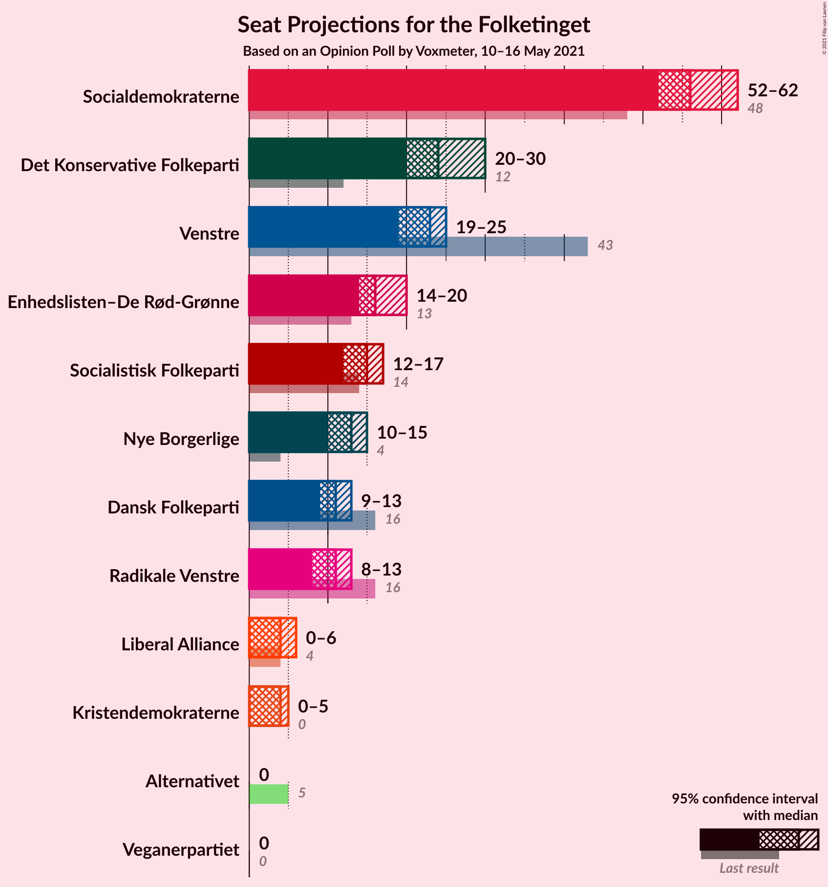
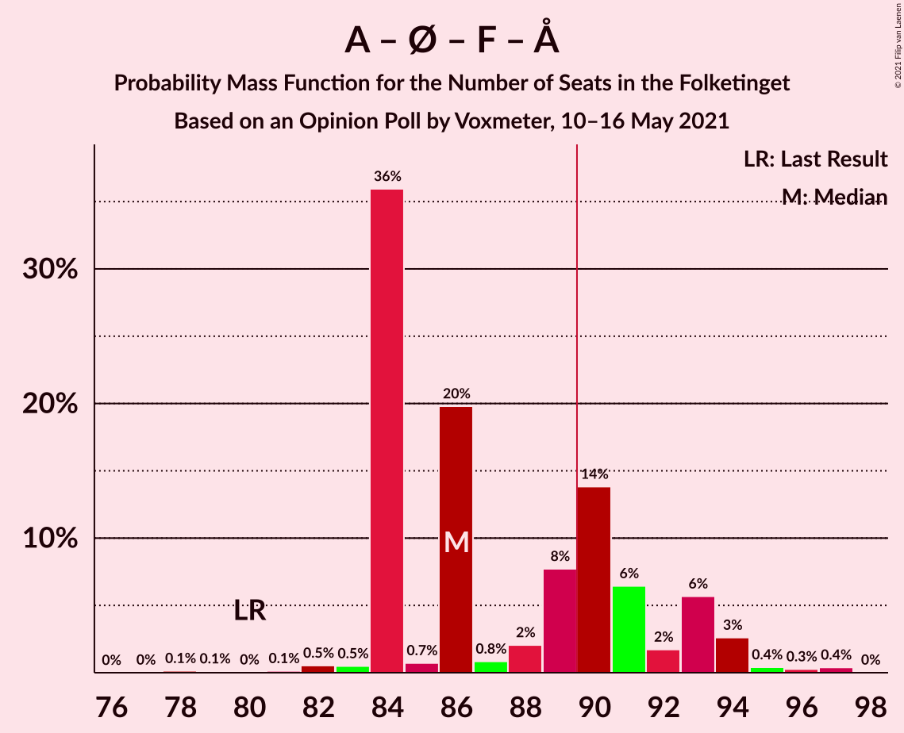
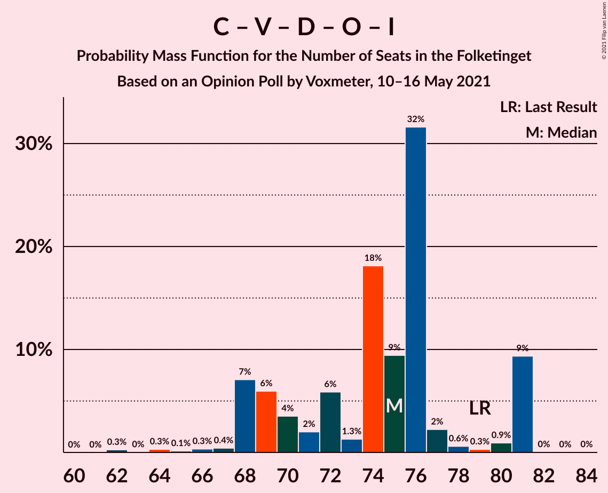
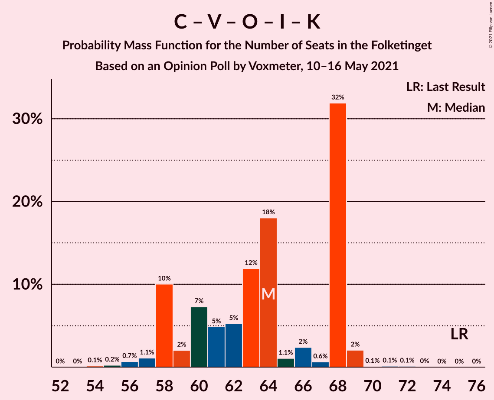
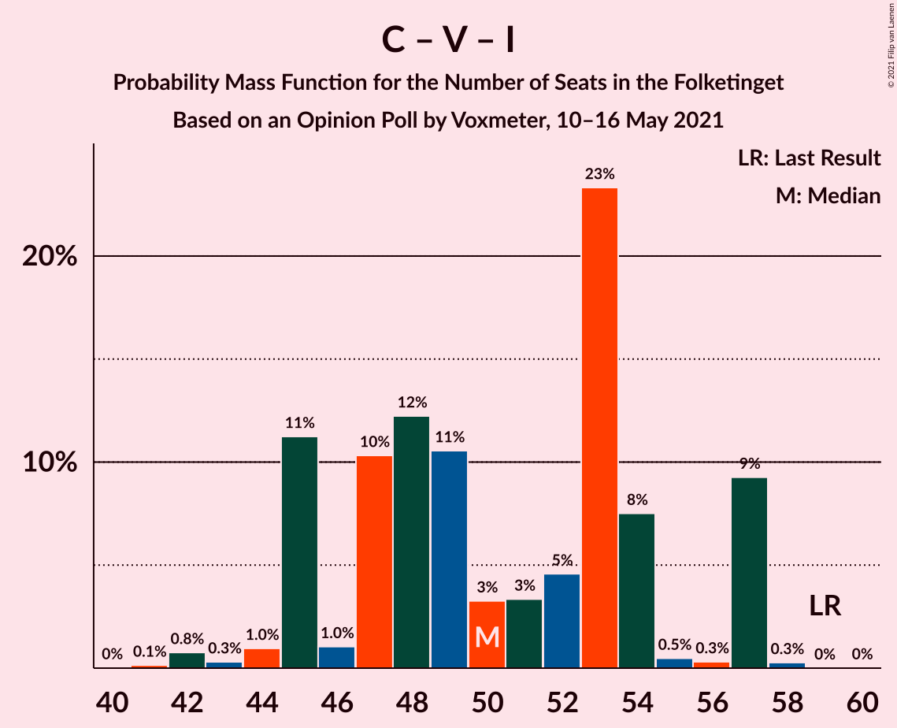

# Opinion Poll by Voxmeter, 10–16 May 2021

<a href="#voting-intentions">Voting Intentions</a> | <a href="#seats">Seats</a> | <a href="#coalitions">Coalitions</a> | <a href="#technical-information">Technical Information</a>

## Voting Intentions

### Confidence Intervals

| Party | Last Result | Poll Result | 80% Confidence Interval | 90% Confidence Interval | 95% Confidence Interval | 99% Confidence Interval |
|:-----:|:-----------:|:-----------:|:-----------------------:|:-----------------------:|:-----------------------:|:-----------------------:|
| Socialdemokraterne | 25.9% | 31.8% | 30.0–33.8% |29.5–34.3% |29.0–34.8% |28.2–35.7% |
| Det Konservative Folkeparti | 6.6% | 13.4% | 12.1–14.9% |11.7–15.3% |11.4–15.6% |10.8–16.4% |
| Venstre | 23.4% | 11.8% | 10.6–13.2% |10.2–13.6% |10.0–13.9% |9.4–14.6% |
| Enhedslisten–De Rød-Grønne | 6.9% | 9.2% | 8.2–10.5% |7.8–10.9% |7.6–11.2% |7.1–11.8% |
| Socialistisk Folkeparti | 7.7% | 7.9% | 6.9–9.1% |6.7–9.5% |6.4–9.8% |6.0–10.4% |
| Nye Borgerlige | 2.4% | 6.9% | 6.0–8.1% |5.7–8.4% |5.5–8.7% |5.1–9.3% |
| Dansk Folkeparti | 8.7% | 5.9% | 5.0–6.9% |4.8–7.2% |4.6–7.5% |4.2–8.0% |
| Radikale Venstre | 8.6% | 5.9% | 5.0–6.9% |4.8–7.2% |4.6–7.5% |4.2–8.0% |
| Liberal Alliance | 2.3% | 2.5% | 2.0–3.2% |1.8–3.4% |1.7–3.6% |1.5–4.0% |
| Kristendemokraterne | 1.7% | 1.9% | 1.4–2.6% |1.3–2.8% |1.2–2.9% |1.0–3.3% |
| Alternativet | 3.0% | 1.1% | 0.8–1.6% |0.7–1.8% |0.6–2.0% |0.5–2.3% |
| Veganerpartiet | 0.0% | 0.4% | 0.2–0.8% |0.2–0.9% |0.2–1.0% |0.1–1.2% |

*Note:* The poll result column reflects the actual value used in the calculations. Published results may vary slightly, and in addition be rounded to fewer digits.

## Seats

### Confidence Intervals

| Party | Last Result | Median | 80% Confidence Interval | 90% Confidence Interval | 95% Confidence Interval | 99% Confidence Interval |
|:-----:|:-----------:|:------:|:-----------------------:|:-----------------------:|:-----------------------:|:-----------------------:|
| <a href="#socialdemokraterne">Socialdemokraterne</a> | 48 | 56 | 52–60 |52–61 |52–62 |51–64 |
| <a href="#det-konservative-folkeparti">Det Konservative Folkeparti</a> | 12 | 24 | 22–28 |21–30 |20–30 |20–30 |
| <a href="#venstre">Venstre</a> | 43 | 23 | 19–25 |19–25 |19–25 |17–26 |
| <a href="#enhedslisten–de-rød-grønne">Enhedslisten–De Rød-Grønne</a> | 13 | 16 | 15–19 |15–20 |14–20 |12–20 |
| <a href="#socialistisk-folkeparti">Socialistisk Folkeparti</a> | 14 | 15 | 13–16 |12–17 |12–17 |11–19 |
| <a href="#nye-borgerlige">Nye Borgerlige</a> | 4 | 13 | 12–15 |11–15 |10–15 |9–17 |
| <a href="#dansk-folkeparti">Dansk Folkeparti</a> | 16 | 11 | 9–13 |9–13 |9–13 |8–14 |
| <a href="#radikale-venstre">Radikale Venstre</a> | 16 | 11 | 9–12 |8–12 |8–13 |8–14 |
| <a href="#liberal-alliance">Liberal Alliance</a> | 4 | 4 | 0–6 |0–6 |0–6 |0–7 |
| <a href="#kristendemokraterne">Kristendemokraterne</a> | 0 | 4 | 0–4 |0–5 |0–5 |0–5 |
| <a href="#alternativet">Alternativet</a> | 5 | 0 | 0 |0 |0 |0–4 |
| <a href="#veganerpartiet">Veganerpartiet</a> | 0 | 0 | 0 |0 |0 |0 |

### Socialdemokraterne

*For a full overview of the results for this party, see the [Socialdemokraterne](party-socialdemokraterne.html) page.*

| Number of Seats | Probability | Accumulated | Special Marks |
|:---------------:|:-----------:|:-----------:|:-------------:|
| 48 | 0.1% | 100% | Last Result |
| 49 | 0% | 99.9% |  |
| 50 | 0.1% | 99.9% |  |
| 51 | 2% | 99.8% |  |
| 52 | 22% | 98% |  |
| 53 | 2% | 76% |  |
| 54 | 11% | 74% |  |
| 55 | 12% | 63% |  |
| 56 | 4% | 51% | Median |
| 57 | 16% | 46% |  |
| 58 | 4% | 31% |  |
| 59 | 8% | 27% |  |
| 60 | 9% | 19% |  |
| 61 | 7% | 10% |  |
| 62 | 2% | 3% |  |
| 63 | 0.2% | 1.0% |  |
| 64 | 0.5% | 0.9% |  |
| 65 | 0.3% | 0.4% |  |
| 66 | 0.1% | 0.1% |  |
| 67 | 0% | 0% |  |

### Det Konservative Folkeparti

*For a full overview of the results for this party, see the [Det Konservative Folkeparti](party-detkonservativefolkeparti.html) page.*

| Number of Seats | Probability | Accumulated | Special Marks |
|:---------------:|:-----------:|:-----------:|:-------------:|
| 12 | 0% | 100% | Last Result |
| 13 | 0% | 100% |  |
| 14 | 0% | 100% |  |
| 15 | 0% | 100% |  |
| 16 | 0% | 100% |  |
| 17 | 0% | 100% |  |
| 18 | 0% | 100% |  |
| 19 | 0.3% | 100% |  |
| 20 | 2% | 99.7% |  |
| 21 | 3% | 97% |  |
| 22 | 17% | 94% |  |
| 23 | 7% | 76% |  |
| 24 | 32% | 69% | Median |
| 25 | 11% | 38% |  |
| 26 | 9% | 26% |  |
| 27 | 6% | 17% |  |
| 28 | 2% | 11% |  |
| 29 | 0.1% | 9% |  |
| 30 | 9% | 9% |  |
| 31 | 0% | 0.1% |  |
| 32 | 0% | 0% |  |

### Venstre

*For a full overview of the results for this party, see the [Venstre](party-venstre.html) page.*

| Number of Seats | Probability | Accumulated | Special Marks |
|:---------------:|:-----------:|:-----------:|:-------------:|
| 16 | 0.1% | 100% |  |
| 17 | 0.9% | 99.9% |  |
| 18 | 0.9% | 99.0% |  |
| 19 | 10% | 98% |  |
| 20 | 9% | 88% |  |
| 21 | 16% | 79% |  |
| 22 | 7% | 63% |  |
| 23 | 31% | 56% | Median |
| 24 | 1.1% | 26% |  |
| 25 | 24% | 25% |  |
| 26 | 0.3% | 0.6% |  |
| 27 | 0.2% | 0.3% |  |
| 28 | 0.1% | 0.1% |  |
| 29 | 0% | 0% |  |
| 30 | 0% | 0% |  |
| 31 | 0% | 0% |  |
| 32 | 0% | 0% |  |
| 33 | 0% | 0% |  |
| 34 | 0% | 0% |  |
| 35 | 0% | 0% |  |
| 36 | 0% | 0% |  |
| 37 | 0% | 0% |  |
| 38 | 0% | 0% |  |
| 39 | 0% | 0% |  |
| 40 | 0% | 0% |  |
| 41 | 0% | 0% |  |
| 42 | 0% | 0% |  |
| 43 | 0% | 0% | Last Result |

### Enhedslisten–De Rød-Grønne

*For a full overview of the results for this party, see the [Enhedslisten–De Rød-Grønne](party-enhedslisten–derød-grønne.html) page.*

| Number of Seats | Probability | Accumulated | Special Marks |
|:---------------:|:-----------:|:-----------:|:-------------:|
| 11 | 0.2% | 100% |  |
| 12 | 0.3% | 99.8% |  |
| 13 | 0.4% | 99.5% | Last Result |
| 14 | 2% | 99.1% |  |
| 15 | 12% | 97% |  |
| 16 | 37% | 85% | Median |
| 17 | 32% | 48% |  |
| 18 | 2% | 16% |  |
| 19 | 9% | 15% |  |
| 20 | 5% | 6% |  |
| 21 | 0.3% | 0.5% |  |
| 22 | 0% | 0.1% |  |
| 23 | 0.1% | 0.1% |  |
| 24 | 0% | 0% |  |

### Socialistisk Folkeparti

*For a full overview of the results for this party, see the [Socialistisk Folkeparti](party-socialistiskfolkeparti.html) page.*

| Number of Seats | Probability | Accumulated | Special Marks |
|:---------------:|:-----------:|:-----------:|:-------------:|
| 10 | 0.2% | 100% |  |
| 11 | 1.2% | 99.8% |  |
| 12 | 8% | 98.5% |  |
| 13 | 27% | 90% |  |
| 14 | 3% | 64% | Last Result |
| 15 | 31% | 60% | Median |
| 16 | 23% | 29% |  |
| 17 | 4% | 6% |  |
| 18 | 0.9% | 2% |  |
| 19 | 1.0% | 1.1% |  |
| 20 | 0.1% | 0.1% |  |
| 21 | 0% | 0% |  |

### Nye Borgerlige

*For a full overview of the results for this party, see the [Nye Borgerlige](party-nyeborgerlige.html) page.*

| Number of Seats | Probability | Accumulated | Special Marks |
|:---------------:|:-----------:|:-----------:|:-------------:|
| 4 | 0% | 100% | Last Result |
| 5 | 0% | 100% |  |
| 6 | 0% | 100% |  |
| 7 | 0% | 100% |  |
| 8 | 0.2% | 100% |  |
| 9 | 0.4% | 99.8% |  |
| 10 | 3% | 99.3% |  |
| 11 | 3% | 96% |  |
| 12 | 36% | 93% |  |
| 13 | 15% | 57% | Median |
| 14 | 19% | 41% |  |
| 15 | 21% | 23% |  |
| 16 | 1.2% | 2% |  |
| 17 | 0.7% | 0.9% |  |
| 18 | 0.1% | 0.1% |  |
| 19 | 0% | 0% |  |

### Dansk Folkeparti

*For a full overview of the results for this party, see the [Dansk Folkeparti](party-danskfolkeparti.html) page.*

| Number of Seats | Probability | Accumulated | Special Marks |
|:---------------:|:-----------:|:-----------:|:-------------:|
| 7 | 0.3% | 100% |  |
| 8 | 1.5% | 99.7% |  |
| 9 | 14% | 98% |  |
| 10 | 12% | 85% |  |
| 11 | 59% | 73% | Median |
| 12 | 3% | 14% |  |
| 13 | 10% | 11% |  |
| 14 | 0.2% | 0.6% |  |
| 15 | 0.3% | 0.4% |  |
| 16 | 0% | 0% | Last Result |

### Radikale Venstre

*For a full overview of the results for this party, see the [Radikale Venstre](party-radikalevenstre.html) page.*

| Number of Seats | Probability | Accumulated | Special Marks |
|:---------------:|:-----------:|:-----------:|:-------------:|
| 7 | 0.4% | 100% |  |
| 8 | 6% | 99.6% |  |
| 9 | 13% | 94% |  |
| 10 | 18% | 81% |  |
| 11 | 52% | 63% | Median |
| 12 | 7% | 11% |  |
| 13 | 2% | 3% |  |
| 14 | 0.9% | 1.0% |  |
| 15 | 0.2% | 0.2% |  |
| 16 | 0% | 0% | Last Result |

### Liberal Alliance

*For a full overview of the results for this party, see the [Liberal Alliance](party-liberalalliance.html) page.*

| Number of Seats | Probability | Accumulated | Special Marks |
|:---------------:|:-----------:|:-----------:|:-------------:|
| 0 | 22% | 100% |  |
| 1 | 0% | 78% |  |
| 2 | 0% | 78% |  |
| 3 | 0% | 78% |  |
| 4 | 48% | 78% | Last Result, Median |
| 5 | 14% | 30% |  |
| 6 | 14% | 15% |  |
| 7 | 2% | 2% |  |
| 8 | 0.3% | 0.3% |  |
| 9 | 0% | 0% |  |

### Kristendemokraterne

*For a full overview of the results for this party, see the [Kristendemokraterne](party-kristendemokraterne.html) page.*

| Number of Seats | Probability | Accumulated | Special Marks |
|:---------------:|:-----------:|:-----------:|:-------------:|
| 0 | 34% | 100% | Last Result |
| 1 | 0% | 66% |  |
| 2 | 0% | 66% |  |
| 3 | 0% | 66% |  |
| 4 | 58% | 66% | Median |
| 5 | 7% | 8% |  |
| 6 | 0.3% | 0.3% |  |
| 7 | 0% | 0% |  |

### Alternativet

*For a full overview of the results for this party, see the [Alternativet](party-alternativet.html) page.*

| Number of Seats | Probability | Accumulated | Special Marks |
|:---------------:|:-----------:|:-----------:|:-------------:|
| 0 | 99.2% | 100% | Median |
| 1 | 0% | 0.8% |  |
| 2 | 0% | 0.8% |  |
| 3 | 0% | 0.8% |  |
| 4 | 0.6% | 0.7% |  |
| 5 | 0.2% | 0.2% | Last Result |
| 6 | 0% | 0% |  |

### Veganerpartiet

*For a full overview of the results for this party, see the [Veganerpartiet](party-veganerpartiet.html) page.*

| Number of Seats | Probability | Accumulated | Special Marks |
|:---------------:|:-----------:|:-----------:|:-------------:|
| 0 | 100% | 100% | Last Result, Median |

## Coalitions

### Confidence Intervals

| Coalition | Last Result | Median | Majority? | 80% Confidence Interval | 90% Confidence Interval | 95% Confidence Interval | 99% Confidence Interval |
|:---------:|:-----------:|:------:|:---------:|:-----------------------:|:-----------------------:|:-----------------------:|:-----------------------:|
| Socialdemokraterne – Enhedslisten–De Rød-Grønne – Socialistisk Folkeparti – Radikale Venstre – Alternativet | 96 | 97 | 99.9% | 94–102 | 94–103 | 94–104 | 92–107 |
| Socialdemokraterne – Enhedslisten–De Rød-Grønne – Socialistisk Folkeparti – Radikale Venstre | 91 | 97 | 99.9% | 94–102 | 94–103 | 94–104 | 92–107 |
| Socialdemokraterne – Enhedslisten–De Rød-Grønne – Socialistisk Folkeparti – Alternativet | 80 | 86 | 31% | 84–92 | 84–93 | 84–94 | 82–96 |
| Socialdemokraterne – Enhedslisten–De Rød-Grønne – Socialistisk Folkeparti | 75 | 86 | 31% | 84–92 | 84–93 | 84–94 | 82–96 |
| Socialdemokraterne – Socialistisk Folkeparti – Radikale Venstre | 78 | 81 | 0.4% | 78–86 | 78–86 | 77–87 | 76–89 |
| Det Konservative Folkeparti – Venstre – Nye Borgerlige – Dansk Folkeparti – Liberal Alliance – Kristendemokraterne | 79 | 78 | 0% | 72–81 | 71–81 | 70–81 | 68–83 |
| Det Konservative Folkeparti – Venstre – Nye Borgerlige – Dansk Folkeparti – Liberal Alliance | 79 | 75 | 0% | 69–80 | 68–81 | 68–81 | 64–81 |
| Socialdemokraterne – Radikale Venstre | 64 | 65 | 0% | 63–71 | 63–73 | 63–73 | 61–75 |
| Det Konservative Folkeparti – Venstre – Dansk Folkeparti – Liberal Alliance – Kristendemokraterne | 75 | 64 | 0% | 58–68 | 58–68 | 58–68 | 56–69 |
| Det Konservative Folkeparti – Venstre – Dansk Folkeparti – Liberal Alliance | 75 | 61 | 0% | 55–66 | 54–68 | 54–68 | 52–68 |
| Det Konservative Folkeparti – Venstre – Liberal Alliance | 59 | 50 | 0% | 45–55 | 45–57 | 45–57 | 42–57 |
| Det Konservative Folkeparti – Venstre | 55 | 47 | 0% | 43–51 | 42–53 | 41–53 | 39–53 |
| Venstre | 43 | 23 | 0% | 19–25 | 19–25 | 19–25 | 17–26 |

### Socialdemokraterne – Enhedslisten–De Rød-Grønne – Socialistisk Folkeparti – Radikale Venstre – Alternativet

| Number of Seats | Probability | Accumulated | Special Marks |
|:---------------:|:-----------:|:-----------:|:-------------:|
| 89 | 0% | 100% |  |
| 90 | 0.1% | 99.9% | Majority |
| 91 | 0.2% | 99.9% |  |
| 92 | 0.3% | 99.7% |  |
| 93 | 0.3% | 99.3% |  |
| 94 | 12% | 99.1% |  |
| 95 | 26% | 87% |  |
| 96 | 0.5% | 61% | Last Result |
| 97 | 19% | 61% |  |
| 98 | 0.9% | 42% | Median |
| 99 | 12% | 41% |  |
| 100 | 9% | 29% |  |
| 101 | 2% | 19% |  |
| 102 | 10% | 17% |  |
| 103 | 4% | 8% |  |
| 104 | 1.4% | 4% |  |
| 105 | 0.9% | 2% |  |
| 106 | 0.1% | 1.2% |  |
| 107 | 0.9% | 1.1% |  |
| 108 | 0.1% | 0.2% |  |
| 109 | 0% | 0.1% |  |
| 110 | 0.1% | 0.1% |  |
| 111 | 0% | 0% |  |

### Socialdemokraterne – Enhedslisten–De Rød-Grønne – Socialistisk Folkeparti – Radikale Venstre

| Number of Seats | Probability | Accumulated | Special Marks |
|:---------------:|:-----------:|:-----------:|:-------------:|
| 89 | 0.1% | 100% |  |
| 90 | 0.1% | 99.9% | Majority |
| 91 | 0.2% | 99.9% | Last Result |
| 92 | 0.3% | 99.6% |  |
| 93 | 0.3% | 99.3% |  |
| 94 | 12% | 99.0% |  |
| 95 | 27% | 87% |  |
| 96 | 0.6% | 61% |  |
| 97 | 19% | 60% |  |
| 98 | 0.8% | 41% | Median |
| 99 | 12% | 41% |  |
| 100 | 9% | 28% |  |
| 101 | 2% | 19% |  |
| 102 | 10% | 17% |  |
| 103 | 4% | 7% |  |
| 104 | 1.4% | 3% |  |
| 105 | 0.8% | 2% |  |
| 106 | 0.1% | 1.1% |  |
| 107 | 0.9% | 1.0% |  |
| 108 | 0.1% | 0.2% |  |
| 109 | 0% | 0.1% |  |
| 110 | 0.1% | 0.1% |  |
| 111 | 0% | 0% |  |

### Socialdemokraterne – Enhedslisten–De Rød-Grønne – Socialistisk Folkeparti – Alternativet

| Number of Seats | Probability | Accumulated | Special Marks |
|:---------------:|:-----------:|:-----------:|:-------------:|
| 78 | 0.1% | 100% |  |
| 79 | 0.1% | 99.8% |  |
| 80 | 0% | 99.7% | Last Result |
| 81 | 0.1% | 99.7% |  |
| 82 | 0.5% | 99.5% |  |
| 83 | 0.5% | 99.0% |  |
| 84 | 36% | 98.5% |  |
| 85 | 0.7% | 63% |  |
| 86 | 20% | 62% |  |
| 87 | 0.8% | 42% | Median |
| 88 | 2% | 41% |  |
| 89 | 8% | 39% |  |
| 90 | 14% | 31% | Majority |
| 91 | 6% | 18% |  |
| 92 | 2% | 11% |  |
| 93 | 6% | 9% |  |
| 94 | 3% | 4% |  |
| 95 | 0.4% | 1.1% |  |
| 96 | 0.3% | 0.7% |  |
| 97 | 0.4% | 0.4% |  |
| 98 | 0% | 0% |  |

### Socialdemokraterne – Enhedslisten–De Rød-Grønne – Socialistisk Folkeparti

| Number of Seats | Probability | Accumulated | Special Marks |
|:---------------:|:-----------:|:-----------:|:-------------:|
| 75 | 0% | 100% | Last Result |
| 76 | 0% | 100% |  |
| 77 | 0% | 100% |  |
| 78 | 0.1% | 100% |  |
| 79 | 0.1% | 99.8% |  |
| 80 | 0% | 99.7% |  |
| 81 | 0.1% | 99.7% |  |
| 82 | 0.6% | 99.5% |  |
| 83 | 0.7% | 99.0% |  |
| 84 | 36% | 98% |  |
| 85 | 0.8% | 62% |  |
| 86 | 20% | 61% |  |
| 87 | 0.7% | 42% | Median |
| 88 | 2% | 41% |  |
| 89 | 8% | 39% |  |
| 90 | 14% | 31% | Majority |
| 91 | 6% | 17% |  |
| 92 | 2% | 11% |  |
| 93 | 6% | 9% |  |
| 94 | 3% | 4% |  |
| 95 | 0.4% | 1.0% |  |
| 96 | 0.3% | 0.7% |  |
| 97 | 0.4% | 0.4% |  |
| 98 | 0% | 0% |  |

### Socialdemokraterne – Socialistisk Folkeparti – Radikale Venstre

| Number of Seats | Probability | Accumulated | Special Marks |
|:---------------:|:-----------:|:-----------:|:-------------:|
| 74 | 0.2% | 100% |  |
| 75 | 0.3% | 99.8% |  |
| 76 | 0.4% | 99.5% |  |
| 77 | 2% | 99.2% |  |
| 78 | 34% | 97% | Last Result |
| 79 | 1.3% | 63% |  |
| 80 | 6% | 62% |  |
| 81 | 19% | 56% |  |
| 82 | 4% | 36% | Median |
| 83 | 6% | 32% |  |
| 84 | 12% | 26% |  |
| 85 | 3% | 14% |  |
| 86 | 8% | 11% |  |
| 87 | 0.8% | 3% |  |
| 88 | 2% | 2% |  |
| 89 | 0.2% | 0.6% |  |
| 90 | 0.2% | 0.4% | Majority |
| 91 | 0% | 0.2% |  |
| 92 | 0.1% | 0.2% |  |
| 93 | 0% | 0% |  |

### Det Konservative Folkeparti – Venstre – Nye Borgerlige – Dansk Folkeparti – Liberal Alliance – Kristendemokraterne

| Number of Seats | Probability | Accumulated | Special Marks |
|:---------------:|:-----------:|:-----------:|:-------------:|
| 65 | 0.1% | 100% |  |
| 66 | 0.3% | 99.9% |  |
| 67 | 0.1% | 99.6% |  |
| 68 | 1.0% | 99.5% |  |
| 69 | 0.1% | 98.5% |  |
| 70 | 3% | 98% |  |
| 71 | 2% | 95% |  |
| 72 | 4% | 93% |  |
| 73 | 10% | 89% |  |
| 74 | 0.5% | 79% |  |
| 75 | 8% | 79% |  |
| 76 | 13% | 71% |  |
| 77 | 0.9% | 58% |  |
| 78 | 19% | 57% |  |
| 79 | 0.5% | 38% | Last Result, Median |
| 80 | 25% | 38% |  |
| 81 | 12% | 12% |  |
| 82 | 0.2% | 0.8% |  |
| 83 | 0.3% | 0.6% |  |
| 84 | 0.2% | 0.3% |  |
| 85 | 0.1% | 0.1% |  |
| 86 | 0% | 0% |  |

### Det Konservative Folkeparti – Venstre – Nye Borgerlige – Dansk Folkeparti – Liberal Alliance

| Number of Seats | Probability | Accumulated | Special Marks |
|:---------------:|:-----------:|:-----------:|:-------------:|
| 62 | 0.3% | 100% |  |
| 63 | 0% | 99.7% |  |
| 64 | 0.3% | 99.7% |  |
| 65 | 0.1% | 99.4% |  |
| 66 | 0.3% | 99.2% |  |
| 67 | 0.4% | 98.9% |  |
| 68 | 7% | 98% |  |
| 69 | 6% | 91% |  |
| 70 | 4% | 85% |  |
| 71 | 2% | 82% |  |
| 72 | 6% | 80% |  |
| 73 | 1.3% | 74% |  |
| 74 | 18% | 73% |  |
| 75 | 9% | 55% | Median |
| 76 | 32% | 45% |  |
| 77 | 2% | 14% |  |
| 78 | 0.6% | 11% |  |
| 79 | 0.3% | 11% | Last Result |
| 80 | 0.9% | 10% |  |
| 81 | 9% | 9% |  |
| 82 | 0% | 0.1% |  |
| 83 | 0% | 0.1% |  |
| 84 | 0% | 0% |  |

### Socialdemokraterne – Radikale Venstre

| Number of Seats | Probability | Accumulated | Special Marks |
|:---------------:|:-----------:|:-----------:|:-------------:|
| 59 | 0% | 100% |  |
| 60 | 0.1% | 99.9% |  |
| 61 | 2% | 99.8% |  |
| 62 | 0.4% | 98% |  |
| 63 | 23% | 98% |  |
| 64 | 3% | 75% | Last Result |
| 65 | 27% | 72% |  |
| 66 | 0.9% | 45% |  |
| 67 | 2% | 44% | Median |
| 68 | 22% | 42% |  |
| 69 | 1.3% | 21% |  |
| 70 | 3% | 19% |  |
| 71 | 7% | 16% |  |
| 72 | 2% | 9% |  |
| 73 | 6% | 8% |  |
| 74 | 0.3% | 1.4% |  |
| 75 | 1.0% | 1.2% |  |
| 76 | 0.1% | 0.2% |  |
| 77 | 0.1% | 0.1% |  |
| 78 | 0% | 0% |  |

### Det Konservative Folkeparti – Venstre – Dansk Folkeparti – Liberal Alliance – Kristendemokraterne

| Number of Seats | Probability | Accumulated | Special Marks |
|:---------------:|:-----------:|:-----------:|:-------------:|
| 54 | 0.1% | 100% |  |
| 55 | 0.2% | 99.8% |  |
| 56 | 0.7% | 99.6% |  |
| 57 | 1.1% | 98.9% |  |
| 58 | 10% | 98% |  |
| 59 | 2% | 88% |  |
| 60 | 7% | 86% |  |
| 61 | 5% | 78% |  |
| 62 | 5% | 74% |  |
| 63 | 12% | 68% |  |
| 64 | 18% | 56% |  |
| 65 | 1.1% | 38% |  |
| 66 | 2% | 37% | Median |
| 67 | 0.6% | 35% |  |
| 68 | 32% | 34% |  |
| 69 | 2% | 2% |  |
| 70 | 0.1% | 0.4% |  |
| 71 | 0.1% | 0.3% |  |
| 72 | 0.1% | 0.2% |  |
| 73 | 0% | 0.1% |  |
| 74 | 0% | 0% |  |
| 75 | 0% | 0% | Last Result |

### Det Konservative Folkeparti – Venstre – Dansk Folkeparti – Liberal Alliance

| Number of Seats | Probability | Accumulated | Special Marks |
|:---------------:|:-----------:|:-----------:|:-------------:|
| 51 | 0.1% | 100% |  |
| 52 | 0.5% | 99.9% |  |
| 53 | 0.2% | 99.4% |  |
| 54 | 8% | 99.2% |  |
| 55 | 1.2% | 91% |  |
| 56 | 4% | 90% |  |
| 57 | 2% | 86% |  |
| 58 | 6% | 85% |  |
| 59 | 11% | 79% |  |
| 60 | 18% | 68% |  |
| 61 | 4% | 50% |  |
| 62 | 2% | 47% | Median |
| 63 | 3% | 45% |  |
| 64 | 30% | 42% |  |
| 65 | 2% | 12% |  |
| 66 | 0.3% | 10% |  |
| 67 | 0.5% | 10% |  |
| 68 | 9% | 9% |  |
| 69 | 0.2% | 0.3% |  |
| 70 | 0% | 0.1% |  |
| 71 | 0% | 0% |  |
| 72 | 0% | 0% |  |
| 73 | 0% | 0% |  |
| 74 | 0% | 0% |  |
| 75 | 0% | 0% | Last Result |

### Det Konservative Folkeparti – Venstre – Liberal Alliance

| Number of Seats | Probability | Accumulated | Special Marks |
|:---------------:|:-----------:|:-----------:|:-------------:|
| 41 | 0.1% | 100% |  |
| 42 | 0.8% | 99.8% |  |
| 43 | 0.3% | 99.1% |  |
| 44 | 1.0% | 98.8% |  |
| 45 | 11% | 98% |  |
| 46 | 1.0% | 87% |  |
| 47 | 10% | 86% |  |
| 48 | 12% | 75% |  |
| 49 | 11% | 63% |  |
| 50 | 3% | 52% |  |
| 51 | 3% | 49% | Median |
| 52 | 5% | 46% |  |
| 53 | 23% | 41% |  |
| 54 | 8% | 18% |  |
| 55 | 0.5% | 10% |  |
| 56 | 0.3% | 10% |  |
| 57 | 9% | 10% |  |
| 58 | 0.3% | 0.3% |  |
| 59 | 0% | 0% | Last Result |

### Det Konservative Folkeparti – Venstre

| Number of Seats | Probability | Accumulated | Special Marks |
|:---------------:|:-----------:|:-----------:|:-------------:|
| 38 | 0% | 100% |  |
| 39 | 0.7% | 99.9% |  |
| 40 | 0.3% | 99.2% |  |
| 41 | 3% | 98.9% |  |
| 42 | 2% | 96% |  |
| 43 | 11% | 94% |  |
| 44 | 11% | 83% |  |
| 45 | 13% | 72% |  |
| 46 | 2% | 59% |  |
| 47 | 13% | 57% | Median |
| 48 | 3% | 44% |  |
| 49 | 30% | 41% |  |
| 50 | 0.3% | 10% |  |
| 51 | 0.4% | 10% |  |
| 52 | 0.2% | 10% |  |
| 53 | 9% | 9% |  |
| 54 | 0.2% | 0.2% |  |
| 55 | 0% | 0% | Last Result |

### Venstre

| Number of Seats | Probability | Accumulated | Special Marks |
|:---------------:|:-----------:|:-----------:|:-------------:|
| 16 | 0.1% | 100% |  |
| 17 | 0.9% | 99.9% |  |
| 18 | 0.9% | 99.0% |  |
| 19 | 10% | 98% |  |
| 20 | 9% | 88% |  |
| 21 | 16% | 79% |  |
| 22 | 7% | 63% |  |
| 23 | 31% | 56% | Median |
| 24 | 1.1% | 26% |  |
| 25 | 24% | 25% |  |
| 26 | 0.3% | 0.6% |  |
| 27 | 0.2% | 0.3% |  |
| 28 | 0.1% | 0.1% |  |
| 29 | 0% | 0% |  |
| 30 | 0% | 0% |  |
| 31 | 0% | 0% |  |
| 32 | 0% | 0% |  |
| 33 | 0% | 0% |  |
| 34 | 0% | 0% |  |
| 35 | 0% | 0% |  |
| 36 | 0% | 0% |  |
| 37 | 0% | 0% |  |
| 38 | 0% | 0% |  |
| 39 | 0% | 0% |  |
| 40 | 0% | 0% |  |
| 41 | 0% | 0% |  |
| 42 | 0% | 0% |  |
| 43 | 0% | 0% | Last Result |

## Technical Information

### Opinion Poll

+ **Polling firm:** Voxmeter
+ **Commissioner(s):** —
+ **Fieldwork period:** 10–16 May 2021

### Calculations

+ **Sample size:** 1008
+ **Simulations done:** 1,048,576
+ **Error estimate:** 2.18%

