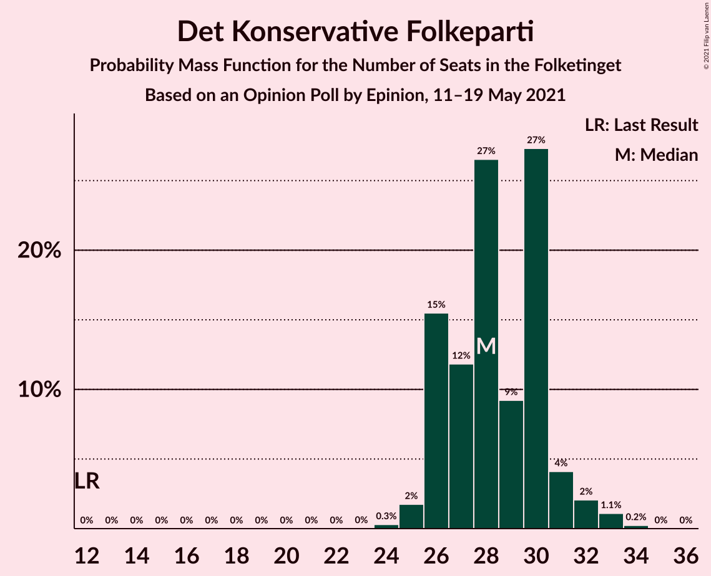
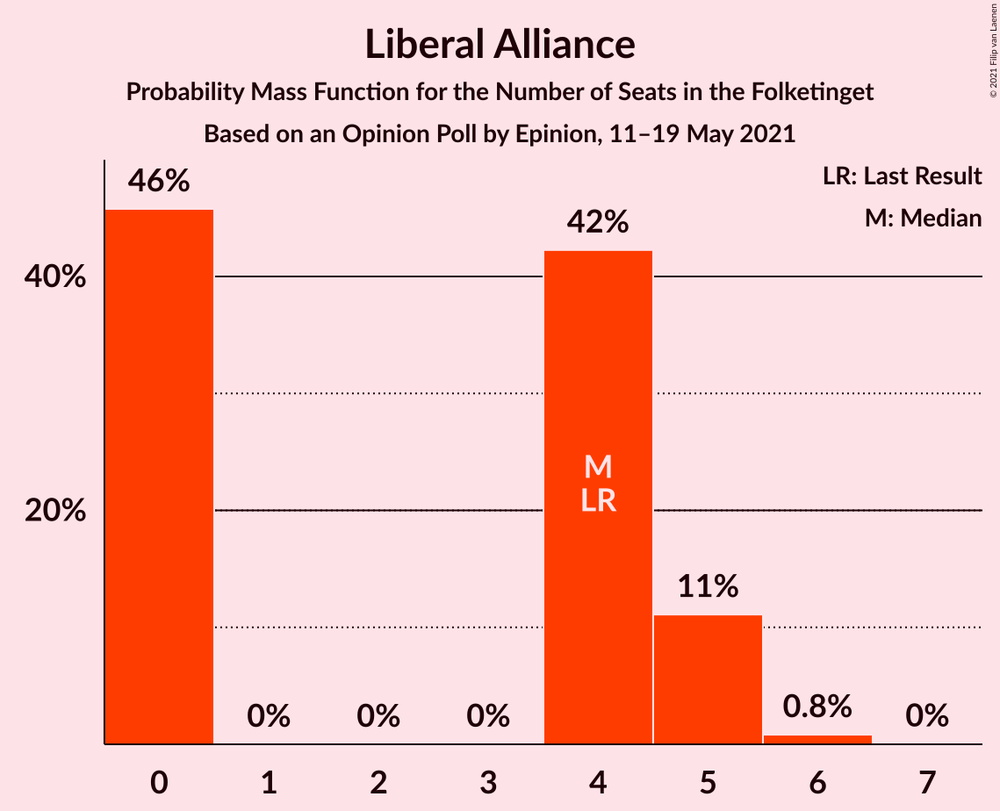
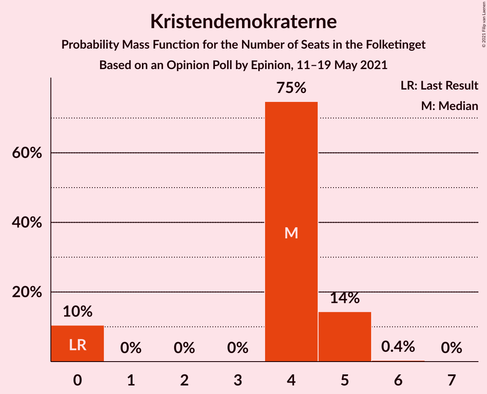
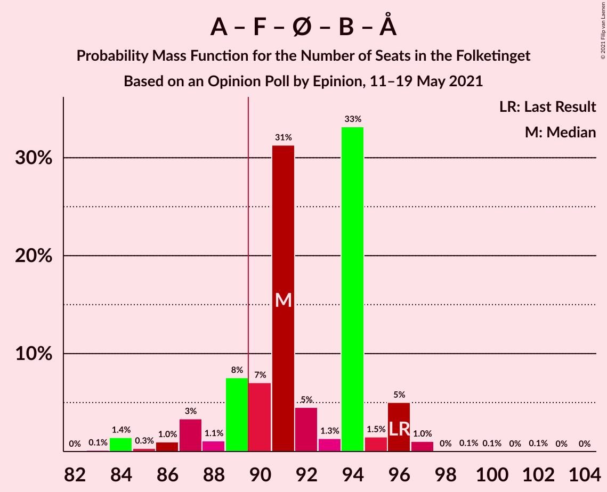
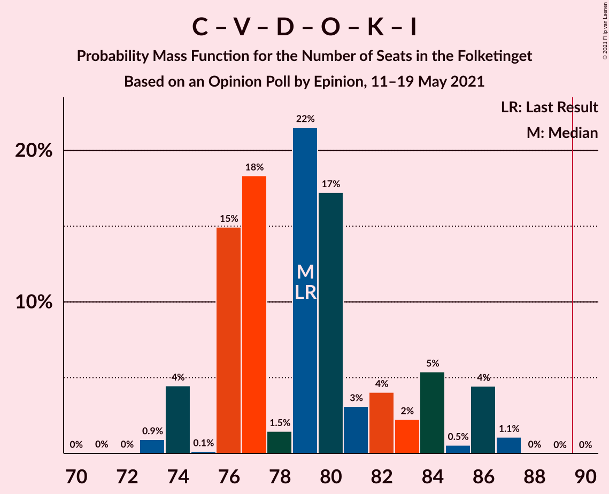

# Opinion Poll by Epinion, 11–19 May 2021

<a href="#voting-intentions">Voting Intentions</a> | <a href="#seats">Seats</a> | <a href="#coalitions">Coalitions</a> | <a href="#technical-information">Technical Information</a>

## Voting Intentions

### Confidence Intervals

| Party | Last Result | Poll Result | 80% Confidence Interval | 90% Confidence Interval | 95% Confidence Interval | 99% Confidence Interval |
|:-----:|:-----------:|:-----------:|:-----------------------:|:-----------------------:|:-----------------------:|:-----------------------:|
| Socialdemokraterne | 25.9% | 28.6% | 27.2–30.1% |26.8–30.5% |26.4–30.9% |25.7–31.6% |
| Det Konservative Folkeparti | 6.6% | 15.9% | 14.8–17.2% |14.4–17.5% |14.2–17.8% |13.6–18.4% |
| Venstre | 23.4% | 12.3% | 11.3–13.4% |11.0–13.8% |10.8–14.0% |10.3–14.6% |
| Socialistisk Folkeparti | 7.7% | 8.7% | 7.8–9.7% |7.6–10.0% |7.4–10.2% |7.0–10.7% |
| Enhedslisten–De Rød-Grønne | 6.9% | 8.1% | 7.3–9.1% |7.1–9.4% |6.9–9.6% |6.5–10.1% |
| Nye Borgerlige | 2.4% | 6.6% | 5.8–7.5% |5.6–7.7% |5.4–7.9% |5.1–8.4% |
| Dansk Folkeparti | 8.7% | 6.3% | 5.6–7.2% |5.4–7.4% |5.2–7.7% |4.9–8.1% |
| Radikale Venstre | 8.6% | 5.5% | 4.8–6.3% |4.6–6.5% |4.5–6.7% |4.1–7.1% |
| Liberal Alliance | 2.3% | 2.2% | 1.8–2.8% |1.7–2.9% |1.6–3.0% |1.4–3.3% |
| Kristendemokraterne | 1.7% | 2.2% | 1.8–2.8% |1.7–2.9% |1.6–3.0% |1.4–3.3% |
| Alternativet | 3.0% | 0.7% | 0.5–1.1% |0.4–1.2% |0.4–1.3% |0.3–1.5% |
| Veganerpartiet | 0.0% | 0.6% | 0.4–0.9% |0.3–1.0% |0.3–1.1% |0.2–1.3% |

*Note:* The poll result column reflects the actual value used in the calculations. Published results may vary slightly, and in addition be rounded to fewer digits.

## Seats

### Confidence Intervals

| Party | Last Result | Median | 80% Confidence Interval | 90% Confidence Interval | 95% Confidence Interval | 99% Confidence Interval |
|:-----:|:-----------:|:------:|:-----------------------:|:-----------------------:|:-----------------------:|:-----------------------:|
| <a href="#socialdemokraterne">Socialdemokraterne</a> | 48 | 51 | 48–56 |48–56 |47–56 |47–58 |
| <a href="#det-konservative-folkeparti">Det Konservative Folkeparti</a> | 12 | 28 | 25–31 |25–34 |25–34 |25–34 |
| <a href="#venstre">Venstre</a> | 43 | 21 | 20–23 |20–23 |20–25 |19–25 |
| <a href="#socialistisk-folkeparti">Socialistisk Folkeparti</a> | 14 | 16 | 15–17 |14–17 |13–19 |12–20 |
| <a href="#enhedslisten–de-rød-grønne">Enhedslisten–De Rød-Grønne</a> | 13 | 15 | 13–16 |13–17 |12–17 |11–17 |
| <a href="#nye-borgerlige">Nye Borgerlige</a> | 4 | 13 | 10–13 |10–13 |10–14 |9–14 |
| <a href="#dansk-folkeparti">Dansk Folkeparti</a> | 16 | 11 | 10–13 |9–14 |9–14 |9–14 |
| <a href="#radikale-venstre">Radikale Venstre</a> | 16 | 10 | 9–11 |8–12 |8–13 |8–13 |
| <a href="#liberal-alliance">Liberal Alliance</a> | 4 | 4 | 0–6 |0–6 |0–6 |0–6 |
| <a href="#kristendemokraterne">Kristendemokraterne</a> | 0 | 0 | 0–5 |0–5 |0–5 |0–6 |
| <a href="#alternativet">Alternativet</a> | 5 | 0 | 0 |0 |0 |0 |
| <a href="#veganerpartiet">Veganerpartiet</a> | 0 | 0 | 0 |0 |0 |0 |

### Socialdemokraterne

*For a full overview of the results for this party, see the [Socialdemokraterne](party-socialdemokraterne.html) page.*

| Number of Seats | Probability | Accumulated | Special Marks |
|:---------------:|:-----------:|:-----------:|:-------------:|
| 45 | 0.1% | 100% |  |
| 46 | 0.3% | 99.8% |  |
| 47 | 3% | 99.5% |  |
| 48 | 7% | 96% | Last Result |
| 49 | 27% | 89% |  |
| 50 | 0.7% | 62% |  |
| 51 | 22% | 61% | Median |
| 52 | 3% | 39% |  |
| 53 | 6% | 36% |  |
| 54 | 0.8% | 30% |  |
| 55 | 0.6% | 29% |  |
| 56 | 28% | 28% |  |
| 57 | 0% | 0.8% |  |
| 58 | 0.6% | 0.7% |  |
| 59 | 0.1% | 0.1% |  |
| 60 | 0% | 0% |  |

### Det Konservative Folkeparti

*For a full overview of the results for this party, see the [Det Konservative Folkeparti](party-detkonservativefolkeparti.html) page.*

| Number of Seats | Probability | Accumulated | Special Marks |
|:---------------:|:-----------:|:-----------:|:-------------:|
| 12 | 0% | 100% | Last Result |
| 13 | 0% | 100% |  |
| 14 | 0% | 100% |  |
| 15 | 0% | 100% |  |
| 16 | 0% | 100% |  |
| 17 | 0% | 100% |  |
| 18 | 0% | 100% |  |
| 19 | 0% | 100% |  |
| 20 | 0% | 100% |  |
| 21 | 0% | 100% |  |
| 22 | 0% | 100% |  |
| 23 | 0.1% | 100% |  |
| 24 | 0.1% | 99.9% |  |
| 25 | 30% | 99.8% |  |
| 26 | 0.6% | 70% |  |
| 27 | 4% | 69% |  |
| 28 | 23% | 65% | Median |
| 29 | 23% | 42% |  |
| 30 | 3% | 20% |  |
| 31 | 11% | 16% |  |
| 32 | 0.1% | 5% |  |
| 33 | 0.1% | 5% |  |
| 34 | 5% | 5% |  |
| 35 | 0.1% | 0.1% |  |
| 36 | 0% | 0% |  |

### Venstre

*For a full overview of the results for this party, see the [Venstre](party-venstre.html) page.*

| Number of Seats | Probability | Accumulated | Special Marks |
|:---------------:|:-----------:|:-----------:|:-------------:|
| 18 | 0.1% | 100% |  |
| 19 | 0.4% | 99.8% |  |
| 20 | 33% | 99.5% |  |
| 21 | 31% | 66% | Median |
| 22 | 3% | 35% |  |
| 23 | 27% | 32% |  |
| 24 | 1.1% | 5% |  |
| 25 | 3% | 4% |  |
| 26 | 0.3% | 0.5% |  |
| 27 | 0% | 0.1% |  |
| 28 | 0.1% | 0.1% |  |
| 29 | 0% | 0% |  |
| 30 | 0% | 0% |  |
| 31 | 0% | 0% |  |
| 32 | 0% | 0% |  |
| 33 | 0% | 0% |  |
| 34 | 0% | 0% |  |
| 35 | 0% | 0% |  |
| 36 | 0% | 0% |  |
| 37 | 0% | 0% |  |
| 38 | 0% | 0% |  |
| 39 | 0% | 0% |  |
| 40 | 0% | 0% |  |
| 41 | 0% | 0% |  |
| 42 | 0% | 0% |  |
| 43 | 0% | 0% | Last Result |

### Socialistisk Folkeparti

*For a full overview of the results for this party, see the [Socialistisk Folkeparti](party-socialistiskfolkeparti.html) page.*

| Number of Seats | Probability | Accumulated | Special Marks |
|:---------------:|:-----------:|:-----------:|:-------------:|
| 12 | 0.7% | 100% |  |
| 13 | 4% | 99.3% |  |
| 14 | 5% | 96% | Last Result |
| 15 | 4% | 91% |  |
| 16 | 60% | 86% | Median |
| 17 | 22% | 26% |  |
| 18 | 0.9% | 4% |  |
| 19 | 1.1% | 3% |  |
| 20 | 2% | 2% |  |
| 21 | 0% | 0% |  |

### Enhedslisten–De Rød-Grønne

*For a full overview of the results for this party, see the [Enhedslisten–De Rød-Grønne](party-enhedslisten–derød-grønne.html) page.*

| Number of Seats | Probability | Accumulated | Special Marks |
|:---------------:|:-----------:|:-----------:|:-------------:|
| 11 | 0.8% | 100% |  |
| 12 | 4% | 99.2% |  |
| 13 | 8% | 95% | Last Result |
| 14 | 13% | 87% |  |
| 15 | 56% | 74% | Median |
| 16 | 12% | 18% |  |
| 17 | 5% | 5% |  |
| 18 | 0.3% | 0.4% |  |
| 19 | 0% | 0.1% |  |
| 20 | 0.1% | 0.1% |  |
| 21 | 0% | 0% |  |

### Nye Borgerlige

*For a full overview of the results for this party, see the [Nye Borgerlige](party-nyeborgerlige.html) page.*

| Number of Seats | Probability | Accumulated | Special Marks |
|:---------------:|:-----------:|:-----------:|:-------------:|
| 4 | 0% | 100% | Last Result |
| 5 | 0% | 100% |  |
| 6 | 0% | 100% |  |
| 7 | 0% | 100% |  |
| 8 | 0% | 100% |  |
| 9 | 2% | 100% |  |
| 10 | 14% | 98% |  |
| 11 | 10% | 84% |  |
| 12 | 15% | 74% |  |
| 13 | 56% | 60% | Median |
| 14 | 3% | 4% |  |
| 15 | 0.3% | 0.5% |  |
| 16 | 0.2% | 0.2% |  |
| 17 | 0% | 0% |  |

### Dansk Folkeparti

*For a full overview of the results for this party, see the [Dansk Folkeparti](party-danskfolkeparti.html) page.*

| Number of Seats | Probability | Accumulated | Special Marks |
|:---------------:|:-----------:|:-----------:|:-------------:|
| 8 | 0.2% | 100% |  |
| 9 | 7% | 99.8% |  |
| 10 | 13% | 93% |  |
| 11 | 49% | 80% | Median |
| 12 | 20% | 31% |  |
| 13 | 6% | 11% |  |
| 14 | 5% | 5% |  |
| 15 | 0.1% | 0.1% |  |
| 16 | 0% | 0% | Last Result |

### Radikale Venstre

*For a full overview of the results for this party, see the [Radikale Venstre](party-radikalevenstre.html) page.*

| Number of Seats | Probability | Accumulated | Special Marks |
|:---------------:|:-----------:|:-----------:|:-------------:|
| 7 | 0.3% | 100% |  |
| 8 | 8% | 99.7% |  |
| 9 | 25% | 92% |  |
| 10 | 32% | 67% | Median |
| 11 | 25% | 35% |  |
| 12 | 6% | 10% |  |
| 13 | 3% | 3% |  |
| 14 | 0% | 0% |  |
| 15 | 0% | 0% |  |
| 16 | 0% | 0% | Last Result |

### Liberal Alliance

*For a full overview of the results for this party, see the [Liberal Alliance](party-liberalalliance.html) page.*

| Number of Seats | Probability | Accumulated | Special Marks |
|:---------------:|:-----------:|:-----------:|:-------------:|
| 0 | 18% | 100% |  |
| 1 | 0% | 82% |  |
| 2 | 0% | 82% |  |
| 3 | 0% | 82% |  |
| 4 | 51% | 82% | Last Result, Median |
| 5 | 13% | 31% |  |
| 6 | 18% | 18% |  |
| 7 | 0.1% | 0.1% |  |
| 8 | 0% | 0% |  |

### Kristendemokraterne

*For a full overview of the results for this party, see the [Kristendemokraterne](party-kristendemokraterne.html) page.*

| Number of Seats | Probability | Accumulated | Special Marks |
|:---------------:|:-----------:|:-----------:|:-------------:|
| 0 | 56% | 100% | Last Result, Median |
| 1 | 0% | 44% |  |
| 2 | 0% | 44% |  |
| 3 | 0% | 44% |  |
| 4 | 32% | 44% |  |
| 5 | 11% | 11% |  |
| 6 | 0.8% | 0.9% |  |
| 7 | 0.1% | 0.1% |  |
| 8 | 0% | 0% |  |

### Alternativet

*For a full overview of the results for this party, see the [Alternativet](party-alternativet.html) page.*

| Number of Seats | Probability | Accumulated | Special Marks |
|:---------------:|:-----------:|:-----------:|:-------------:|
| 0 | 100% | 100% | Median |
| 1 | 0% | 0% |  |
| 2 | 0% | 0% |  |
| 3 | 0% | 0% |  |
| 4 | 0% | 0% |  |
| 5 | 0% | 0% | Last Result |

### Veganerpartiet

*For a full overview of the results for this party, see the [Veganerpartiet](party-veganerpartiet.html) page.*

| Number of Seats | Probability | Accumulated | Special Marks |
|:---------------:|:-----------:|:-----------:|:-------------:|
| 0 | 100% | 100% | Last Result, Median |

## Coalitions

### Confidence Intervals

| Coalition | Last Result | Median | Majority? | 80% Confidence Interval | 90% Confidence Interval | 95% Confidence Interval | 99% Confidence Interval |
|:---------:|:-----------:|:------:|:---------:|:-----------------------:|:-----------------------:|:-----------------------:|:-----------------------:|
| Socialdemokraterne – Socialistisk Folkeparti – Enhedslisten–De Rød-Grønne – Radikale Venstre – Alternativet | 96 | 92 | 85% | 89–97 | 87–97 | 85–97 | 85–100 |
| Socialdemokraterne – Socialistisk Folkeparti – Enhedslisten–De Rød-Grønne – Radikale Venstre | 91 | 92 | 85% | 89–97 | 87–97 | 85–97 | 85–100 |
| Socialdemokraterne – Socialistisk Folkeparti – Enhedslisten–De Rød-Grønne – Alternativet | 80 | 83 | 0.2% | 78–87 | 77–87 | 77–87 | 76–87 |
| Socialdemokraterne – Socialistisk Folkeparti – Enhedslisten–De Rød-Grønne | 75 | 83 | 0.2% | 78–87 | 77–87 | 77–87 | 76–87 |
| Det Konservative Folkeparti – Venstre – Nye Borgerlige – Dansk Folkeparti – Kristendemokraterne – Liberal Alliance | 79 | 79 | 0.1% | 73–83 | 73–84 | 73–86 | 73–86 |
| Det Konservative Folkeparti – Venstre – Nye Borgerlige – Dansk Folkeparti – Liberal Alliance | 79 | 76 | 0% | 73–80 | 73–80 | 72–82 | 71–82 |
| Socialdemokraterne – Socialistisk Folkeparti – Radikale Venstre | 78 | 77 | 0% | 74–82 | 73–82 | 72–82 | 71–83 |
| Det Konservative Folkeparti – Venstre – Dansk Folkeparti – Kristendemokraterne – Liberal Alliance | 75 | 67 | 0% | 60–72 | 60–73 | 60–74 | 60–74 |
| Det Konservative Folkeparti – Venstre – Dansk Folkeparti – Liberal Alliance | 75 | 65 | 0% | 60–68 | 60–69 | 60–70 | 59–71 |
| Socialdemokraterne – Radikale Venstre | 64 | 61 | 0% | 58–66 | 57–66 | 55–66 | 55–69 |
| Det Konservative Folkeparti – Venstre – Liberal Alliance | 59 | 54 | 0% | 49–56 | 49–57 | 49–58 | 48–59 |
| Det Konservative Folkeparti – Venstre | 55 | 50 | 0% | 45–53 | 45–55 | 45–55 | 45–55 |
| Venstre | 43 | 21 | 0% | 20–23 | 20–23 | 20–25 | 19–25 |

### Socialdemokraterne – Socialistisk Folkeparti – Enhedslisten–De Rød-Grønne – Radikale Venstre – Alternativet

| Number of Seats | Probability | Accumulated | Special Marks |
|:---------------:|:-----------:|:-----------:|:-------------:|
| 83 | 0.1% | 100% |  |
| 84 | 0% | 99.9% |  |
| 85 | 4% | 99.9% |  |
| 86 | 0.3% | 96% |  |
| 87 | 2% | 95% |  |
| 88 | 2% | 93% |  |
| 89 | 6% | 90% |  |
| 90 | 6% | 85% | Majority |
| 91 | 23% | 78% |  |
| 92 | 14% | 55% | Median |
| 93 | 0.6% | 42% |  |
| 94 | 6% | 41% |  |
| 95 | 8% | 35% |  |
| 96 | 0.2% | 27% | Last Result |
| 97 | 26% | 27% |  |
| 98 | 0.1% | 0.8% |  |
| 99 | 0.1% | 0.7% |  |
| 100 | 0.4% | 0.6% |  |
| 101 | 0.1% | 0.1% |  |
| 102 | 0% | 0% |  |

### Socialdemokraterne – Socialistisk Folkeparti – Enhedslisten–De Rød-Grønne – Radikale Venstre

| Number of Seats | Probability | Accumulated | Special Marks |
|:---------------:|:-----------:|:-----------:|:-------------:|
| 83 | 0.1% | 100% |  |
| 84 | 0% | 99.9% |  |
| 85 | 4% | 99.9% |  |
| 86 | 0.3% | 95% |  |
| 87 | 2% | 95% |  |
| 88 | 2% | 93% |  |
| 89 | 6% | 90% |  |
| 90 | 6% | 85% | Majority |
| 91 | 23% | 78% | Last Result |
| 92 | 14% | 55% | Median |
| 93 | 0.6% | 42% |  |
| 94 | 6% | 41% |  |
| 95 | 8% | 35% |  |
| 96 | 0.2% | 27% |  |
| 97 | 26% | 27% |  |
| 98 | 0.1% | 0.8% |  |
| 99 | 0.1% | 0.7% |  |
| 100 | 0.4% | 0.6% |  |
| 101 | 0.1% | 0.1% |  |
| 102 | 0% | 0% |  |

### Socialdemokraterne – Socialistisk Folkeparti – Enhedslisten–De Rød-Grønne – Alternativet

| Number of Seats | Probability | Accumulated | Special Marks |
|:---------------:|:-----------:|:-----------:|:-------------:|
| 74 | 0.1% | 100% |  |
| 75 | 0.1% | 99.9% |  |
| 76 | 2% | 99.8% |  |
| 77 | 5% | 98% |  |
| 78 | 8% | 93% |  |
| 79 | 0.1% | 85% |  |
| 80 | 18% | 85% | Last Result |
| 81 | 9% | 67% |  |
| 82 | 4% | 58% | Median |
| 83 | 21% | 55% |  |
| 84 | 2% | 34% |  |
| 85 | 6% | 32% |  |
| 86 | 1.5% | 27% |  |
| 87 | 25% | 25% |  |
| 88 | 0.2% | 0.4% |  |
| 89 | 0% | 0.2% |  |
| 90 | 0.2% | 0.2% | Majority |
| 91 | 0% | 0% |  |

### Socialdemokraterne – Socialistisk Folkeparti – Enhedslisten–De Rød-Grønne

| Number of Seats | Probability | Accumulated | Special Marks |
|:---------------:|:-----------:|:-----------:|:-------------:|
| 74 | 0.1% | 100% |  |
| 75 | 0.1% | 99.9% | Last Result |
| 76 | 2% | 99.8% |  |
| 77 | 5% | 98% |  |
| 78 | 8% | 93% |  |
| 79 | 0.1% | 85% |  |
| 80 | 18% | 85% |  |
| 81 | 9% | 67% |  |
| 82 | 4% | 58% | Median |
| 83 | 21% | 55% |  |
| 84 | 2% | 34% |  |
| 85 | 6% | 32% |  |
| 86 | 1.5% | 27% |  |
| 87 | 25% | 25% |  |
| 88 | 0.2% | 0.4% |  |
| 89 | 0% | 0.2% |  |
| 90 | 0.2% | 0.2% | Majority |
| 91 | 0% | 0% |  |

### Det Konservative Folkeparti – Venstre – Nye Borgerlige – Dansk Folkeparti – Kristendemokraterne – Liberal Alliance

| Number of Seats | Probability | Accumulated | Special Marks |
|:---------------:|:-----------:|:-----------:|:-------------:|
| 69 | 0.1% | 100% |  |
| 70 | 0% | 99.9% |  |
| 71 | 0% | 99.9% |  |
| 72 | 0.3% | 99.8% |  |
| 73 | 24% | 99.6% |  |
| 74 | 5% | 75% |  |
| 75 | 0.7% | 70% |  |
| 76 | 7% | 69% |  |
| 77 | 0.4% | 62% | Median |
| 78 | 2% | 61% |  |
| 79 | 10% | 59% | Last Result |
| 80 | 17% | 50% |  |
| 81 | 8% | 33% |  |
| 82 | 1.2% | 25% |  |
| 83 | 16% | 24% |  |
| 84 | 3% | 8% |  |
| 85 | 2% | 5% |  |
| 86 | 3% | 3% |  |
| 87 | 0% | 0.3% |  |
| 88 | 0.1% | 0.3% |  |
| 89 | 0.1% | 0.2% |  |
| 90 | 0.1% | 0.1% | Majority |
| 91 | 0% | 0% |  |

### Det Konservative Folkeparti – Venstre – Nye Borgerlige – Dansk Folkeparti – Liberal Alliance

| Number of Seats | Probability | Accumulated | Special Marks |
|:---------------:|:-----------:|:-----------:|:-------------:|
| 68 | 0.3% | 100% |  |
| 69 | 0.1% | 99.7% |  |
| 70 | 0% | 99.5% |  |
| 71 | 0.5% | 99.5% |  |
| 72 | 4% | 99.1% |  |
| 73 | 24% | 95% |  |
| 74 | 6% | 71% |  |
| 75 | 6% | 65% |  |
| 76 | 10% | 59% |  |
| 77 | 3% | 48% | Median |
| 78 | 4% | 46% |  |
| 79 | 17% | 42% | Last Result |
| 80 | 19% | 24% |  |
| 81 | 2% | 5% |  |
| 82 | 3% | 3% |  |
| 83 | 0.1% | 0.5% |  |
| 84 | 0.1% | 0.3% |  |
| 85 | 0.2% | 0.2% |  |
| 86 | 0% | 0.1% |  |
| 87 | 0% | 0% |  |

### Socialdemokraterne – Socialistisk Folkeparti – Radikale Venstre

| Number of Seats | Probability | Accumulated | Special Marks |
|:---------------:|:-----------:|:-----------:|:-------------:|
| 68 | 0.1% | 100% |  |
| 69 | 0.1% | 99.9% |  |
| 70 | 0.3% | 99.8% |  |
| 71 | 0.1% | 99.5% |  |
| 72 | 3% | 99.4% |  |
| 73 | 2% | 97% |  |
| 74 | 8% | 94% |  |
| 75 | 6% | 86% |  |
| 76 | 18% | 80% |  |
| 77 | 16% | 62% | Median |
| 78 | 13% | 46% | Last Result |
| 79 | 0.7% | 33% |  |
| 80 | 3% | 32% |  |
| 81 | 3% | 29% |  |
| 82 | 24% | 26% |  |
| 83 | 1.1% | 1.4% |  |
| 84 | 0.1% | 0.3% |  |
| 85 | 0% | 0.2% |  |
| 86 | 0.1% | 0.2% |  |
| 87 | 0% | 0% |  |

### Det Konservative Folkeparti – Venstre – Dansk Folkeparti – Kristendemokraterne – Liberal Alliance

| Number of Seats | Probability | Accumulated | Special Marks |
|:---------------:|:-----------:|:-----------:|:-------------:|
| 58 | 0.1% | 100% |  |
| 59 | 0.1% | 99.9% |  |
| 60 | 24% | 99.8% |  |
| 61 | 6% | 76% |  |
| 62 | 0.4% | 70% |  |
| 63 | 4% | 70% |  |
| 64 | 1.5% | 66% | Median |
| 65 | 5% | 64% |  |
| 66 | 2% | 59% |  |
| 67 | 16% | 58% |  |
| 68 | 4% | 42% |  |
| 69 | 6% | 38% |  |
| 70 | 4% | 32% |  |
| 71 | 18% | 28% |  |
| 72 | 4% | 10% |  |
| 73 | 3% | 6% |  |
| 74 | 3% | 3% |  |
| 75 | 0% | 0.3% | Last Result |
| 76 | 0.1% | 0.2% |  |
| 77 | 0.1% | 0.2% |  |
| 78 | 0% | 0.1% |  |
| 79 | 0.1% | 0.1% |  |
| 80 | 0% | 0% |  |

### Det Konservative Folkeparti – Venstre – Dansk Folkeparti – Liberal Alliance

| Number of Seats | Probability | Accumulated | Special Marks |
|:---------------:|:-----------:|:-----------:|:-------------:|
| 57 | 0.3% | 100% |  |
| 58 | 0% | 99.7% |  |
| 59 | 0.2% | 99.6% |  |
| 60 | 25% | 99.5% |  |
| 61 | 9% | 75% |  |
| 62 | 1.0% | 66% |  |
| 63 | 4% | 65% |  |
| 64 | 2% | 60% | Median |
| 65 | 9% | 58% |  |
| 66 | 8% | 49% |  |
| 67 | 29% | 41% |  |
| 68 | 7% | 13% |  |
| 69 | 3% | 6% |  |
| 70 | 3% | 3% |  |
| 71 | 0.2% | 0.5% |  |
| 72 | 0.2% | 0.3% |  |
| 73 | 0.1% | 0.1% |  |
| 74 | 0% | 0% |  |
| 75 | 0% | 0% | Last Result |

### Socialdemokraterne – Radikale Venstre

| Number of Seats | Probability | Accumulated | Special Marks |
|:---------------:|:-----------:|:-----------:|:-------------:|
| 54 | 0.1% | 100% |  |
| 55 | 3% | 99.9% |  |
| 56 | 2% | 97% |  |
| 57 | 1.1% | 95% |  |
| 58 | 6% | 94% |  |
| 59 | 7% | 89% |  |
| 60 | 30% | 81% |  |
| 61 | 7% | 52% | Median |
| 62 | 6% | 45% |  |
| 63 | 5% | 39% |  |
| 64 | 6% | 33% | Last Result |
| 65 | 1.3% | 27% |  |
| 66 | 25% | 26% |  |
| 67 | 0.2% | 0.9% |  |
| 68 | 0% | 0.7% |  |
| 69 | 0.6% | 0.7% |  |
| 70 | 0% | 0.1% |  |
| 71 | 0.1% | 0.1% |  |
| 72 | 0% | 0% |  |

### Det Konservative Folkeparti – Venstre – Liberal Alliance

| Number of Seats | Probability | Accumulated | Special Marks |
|:---------------:|:-----------:|:-----------:|:-------------:|
| 46 | 0% | 100% |  |
| 47 | 0% | 99.9% |  |
| 48 | 1.0% | 99.9% |  |
| 49 | 24% | 98.9% |  |
| 50 | 5% | 74% |  |
| 51 | 3% | 69% |  |
| 52 | 7% | 67% |  |
| 53 | 1.3% | 59% | Median |
| 54 | 8% | 58% |  |
| 55 | 22% | 50% |  |
| 56 | 21% | 28% |  |
| 57 | 4% | 8% |  |
| 58 | 3% | 4% |  |
| 59 | 0.3% | 0.6% | Last Result |
| 60 | 0.1% | 0.3% |  |
| 61 | 0.1% | 0.2% |  |
| 62 | 0% | 0.1% |  |
| 63 | 0% | 0% |  |

### Det Konservative Folkeparti – Venstre

| Number of Seats | Probability | Accumulated | Special Marks |
|:---------------:|:-----------:|:-----------:|:-------------:|
| 44 | 0% | 100% |  |
| 45 | 28% | 99.9% |  |
| 46 | 0.1% | 72% |  |
| 47 | 2% | 72% |  |
| 48 | 3% | 70% |  |
| 49 | 17% | 67% | Median |
| 50 | 7% | 50% |  |
| 51 | 8% | 44% |  |
| 52 | 24% | 36% |  |
| 53 | 2% | 12% |  |
| 54 | 4% | 9% |  |
| 55 | 5% | 5% | Last Result |
| 56 | 0.1% | 0.3% |  |
| 57 | 0.1% | 0.2% |  |
| 58 | 0% | 0.1% |  |
| 59 | 0.1% | 0.1% |  |
| 60 | 0% | 0% |  |

### Venstre

| Number of Seats | Probability | Accumulated | Special Marks |
|:---------------:|:-----------:|:-----------:|:-------------:|
| 18 | 0.1% | 100% |  |
| 19 | 0.4% | 99.8% |  |
| 20 | 33% | 99.5% |  |
| 21 | 31% | 66% | Median |
| 22 | 3% | 35% |  |
| 23 | 27% | 32% |  |
| 24 | 1.1% | 5% |  |
| 25 | 3% | 4% |  |
| 26 | 0.3% | 0.5% |  |
| 27 | 0% | 0.1% |  |
| 28 | 0.1% | 0.1% |  |
| 29 | 0% | 0% |  |
| 30 | 0% | 0% |  |
| 31 | 0% | 0% |  |
| 32 | 0% | 0% |  |
| 33 | 0% | 0% |  |
| 34 | 0% | 0% |  |
| 35 | 0% | 0% |  |
| 36 | 0% | 0% |  |
| 37 | 0% | 0% |  |
| 38 | 0% | 0% |  |
| 39 | 0% | 0% |  |
| 40 | 0% | 0% |  |
| 41 | 0% | 0% |  |
| 42 | 0% | 0% |  |
| 43 | 0% | 0% | Last Result |

## Technical Information

### Opinion Poll

+ **Polling firm:** Epinion
+ **Commissioner(s):** —
+ **Fieldwork period:** 11–19 May 2021

### Calculations

+ **Sample size:** 1552
+ **Simulations done:** 131,072
+ **Error estimate:** 3.84%

