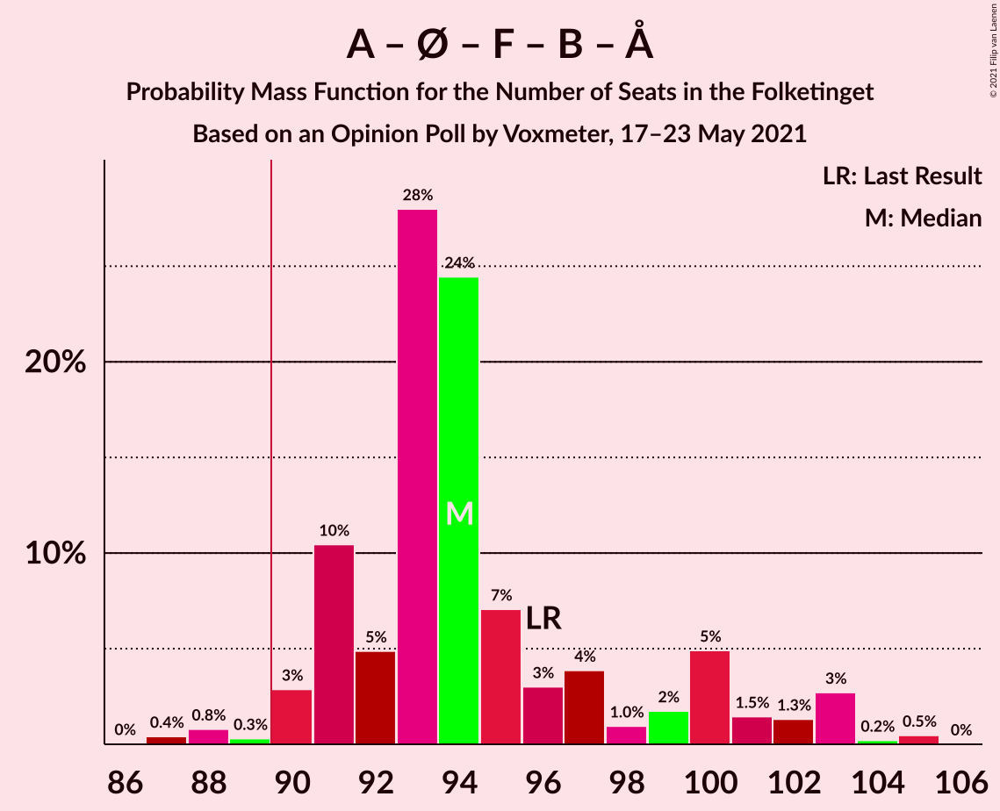
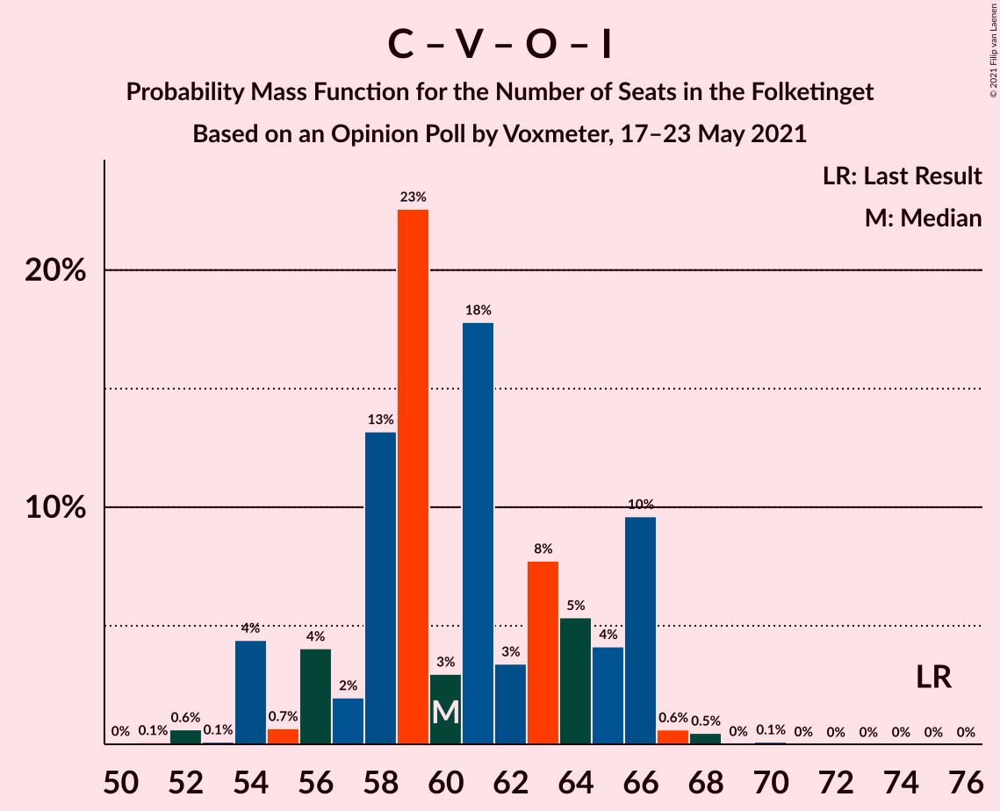

# Opinion Poll by Voxmeter, 17–23 May 2021

<a href="#voting-intentions">Voting Intentions</a> | <a href="#seats">Seats</a> | <a href="#coalitions">Coalitions</a> | <a href="#technical-information">Technical Information</a>

## Voting Intentions

### Confidence Intervals

| Party | Last Result | Poll Result | 80% Confidence Interval | 90% Confidence Interval | 95% Confidence Interval | 99% Confidence Interval |
|:-----:|:-----------:|:-----------:|:-----------------------:|:-----------------------:|:-----------------------:|:-----------------------:|
| Socialdemokraterne | 25.9% | 31.0% | 29.1–32.9% |28.6–33.4% |28.2–33.9% |27.3–34.8% |
| Det Konservative Folkeparti | 6.6% | 14.2% | 12.9–15.7% |12.5–16.2% |12.2–16.5% |11.6–17.3% |
| Venstre | 23.4% | 11.4% | 10.2–12.8% |9.8–13.1% |9.6–13.5% |9.0–14.2% |
| Enhedslisten–De Rød-Grønne | 6.9% | 9.0% | 7.9–10.3% |7.6–10.6% |7.4–10.9% |6.9–11.6% |
| Socialistisk Folkeparti | 7.7% | 8.0% | 7.0–9.2% |6.7–9.6% |6.5–9.9% |6.0–10.5% |
| Nye Borgerlige | 2.4% | 7.7% | 6.7–8.9% |6.5–9.2% |6.2–9.5% |5.8–10.1% |
| Dansk Folkeparti | 8.7% | 5.5% | 4.7–6.6% |4.5–6.9% |4.3–7.1% |3.9–7.7% |
| Radikale Venstre | 8.6% | 5.5% | 4.7–6.6% |4.5–6.9% |4.3–7.1% |3.9–7.7% |
| Liberal Alliance | 2.3% | 2.5% | 2.0–3.2% |1.8–3.4% |1.7–3.6% |1.5–4.0% |
| Kristendemokraterne | 1.7% | 1.8% | 1.3–2.4% |1.2–2.6% |1.1–2.8% |0.9–3.2% |
| Alternativet | 3.0% | 0.9% | 0.6–1.4% |0.5–1.6% |0.5–1.7% |0.4–2.0% |
| Veganerpartiet | 0.0% | 0.2% | 0.1–0.5% |0.1–0.6% |0.1–0.7% |0.0–0.9% |

*Note:* The poll result column reflects the actual value used in the calculations. Published results may vary slightly, and in addition be rounded to fewer digits.

## Seats

### Confidence Intervals

| Party | Last Result | Median | 80% Confidence Interval | 90% Confidence Interval | 95% Confidence Interval | 99% Confidence Interval |
|:-----:|:-----------:|:------:|:-----------------------:|:-----------------------:|:-----------------------:|:-----------------------:|
| <a href="#socialdemokraterne">Socialdemokraterne</a> | 48 | 54 | 51–58 |50–59 |50–59 |48–62 |
| <a href="#det-konservative-folkeparti">Det Konservative Folkeparti</a> | 12 | 25 | 23–29 |22–30 |22–31 |20–32 |
| <a href="#venstre">Venstre</a> | 43 | 21 | 18–23 |17–24 |16–24 |16–25 |
| <a href="#enhedslisten–de-rød-grønne">Enhedslisten–De Rød-Grønne</a> | 13 | 16 | 13–17 |13–18 |13–19 |12–20 |
| <a href="#socialistisk-folkeparti">Socialistisk Folkeparti</a> | 14 | 15 | 13–16 |12–17 |11–19 |11–19 |
| <a href="#nye-borgerlige">Nye Borgerlige</a> | 4 | 14 | 12–15 |12–16 |11–16 |10–17 |
| <a href="#dansk-folkeparti">Dansk Folkeparti</a> | 16 | 10 | 9–12 |8–13 |8–13 |7–14 |
| <a href="#radikale-venstre">Radikale Venstre</a> | 16 | 10 | 8–11 |8–12 |8–12 |7–13 |
| <a href="#liberal-alliance">Liberal Alliance</a> | 4 | 5 | 0–6 |0–6 |0–6 |0–8 |
| <a href="#kristendemokraterne">Kristendemokraterne</a> | 0 | 0 | 0–5 |0–5 |0–5 |0–6 |
| <a href="#alternativet">Alternativet</a> | 5 | 0 | 0 |0 |0 |0 |
| <a href="#veganerpartiet">Veganerpartiet</a> | 0 | 0 | 0 |0 |0 |0 |

### Socialdemokraterne

*For a full overview of the results for this party, see the [Socialdemokraterne](party-socialdemokraterne.html) page.*

| Number of Seats | Probability | Accumulated | Special Marks |
|:---------------:|:-----------:|:-----------:|:-------------:|
| 47 | 0.1% | 100% |  |
| 48 | 0.9% | 99.8% | Last Result |
| 49 | 0.5% | 98.9% |  |
| 50 | 5% | 98% |  |
| 51 | 9% | 94% |  |
| 52 | 21% | 85% |  |
| 53 | 11% | 64% |  |
| 54 | 6% | 53% | Median |
| 55 | 18% | 47% |  |
| 56 | 12% | 29% |  |
| 57 | 4% | 17% |  |
| 58 | 5% | 13% |  |
| 59 | 6% | 8% |  |
| 60 | 1.0% | 2% |  |
| 61 | 0.6% | 1.1% |  |
| 62 | 0.4% | 0.5% |  |
| 63 | 0% | 0.1% |  |
| 64 | 0.1% | 0.1% |  |
| 65 | 0% | 0% |  |

### Det Konservative Folkeparti

*For a full overview of the results for this party, see the [Det Konservative Folkeparti](party-detkonservativefolkeparti.html) page.*

| Number of Seats | Probability | Accumulated | Special Marks |
|:---------------:|:-----------:|:-----------:|:-------------:|
| 12 | 0% | 100% | Last Result |
| 13 | 0% | 100% |  |
| 14 | 0% | 100% |  |
| 15 | 0% | 100% |  |
| 16 | 0% | 100% |  |
| 17 | 0% | 100% |  |
| 18 | 0% | 100% |  |
| 19 | 0.5% | 100% |  |
| 20 | 0.1% | 99.5% |  |
| 21 | 1.1% | 99.4% |  |
| 22 | 4% | 98% |  |
| 23 | 5% | 95% |  |
| 24 | 2% | 89% |  |
| 25 | 38% | 87% | Median |
| 26 | 7% | 49% |  |
| 27 | 20% | 42% |  |
| 28 | 3% | 22% |  |
| 29 | 14% | 19% |  |
| 30 | 2% | 5% |  |
| 31 | 2% | 3% |  |
| 32 | 0.4% | 0.6% |  |
| 33 | 0.1% | 0.1% |  |
| 34 | 0% | 0% |  |

### Venstre

*For a full overview of the results for this party, see the [Venstre](party-venstre.html) page.*

| Number of Seats | Probability | Accumulated | Special Marks |
|:---------------:|:-----------:|:-----------:|:-------------:|
| 15 | 0.2% | 100% |  |
| 16 | 4% | 99.8% |  |
| 17 | 2% | 96% |  |
| 18 | 5% | 94% |  |
| 19 | 14% | 89% |  |
| 20 | 18% | 75% |  |
| 21 | 40% | 57% | Median |
| 22 | 6% | 17% |  |
| 23 | 3% | 11% |  |
| 24 | 7% | 8% |  |
| 25 | 0.6% | 0.7% |  |
| 26 | 0.1% | 0.2% |  |
| 27 | 0% | 0% |  |
| 28 | 0% | 0% |  |
| 29 | 0% | 0% |  |
| 30 | 0% | 0% |  |
| 31 | 0% | 0% |  |
| 32 | 0% | 0% |  |
| 33 | 0% | 0% |  |
| 34 | 0% | 0% |  |
| 35 | 0% | 0% |  |
| 36 | 0% | 0% |  |
| 37 | 0% | 0% |  |
| 38 | 0% | 0% |  |
| 39 | 0% | 0% |  |
| 40 | 0% | 0% |  |
| 41 | 0% | 0% |  |
| 42 | 0% | 0% |  |
| 43 | 0% | 0% | Last Result |

### Enhedslisten–De Rød-Grønne

*For a full overview of the results for this party, see the [Enhedslisten–De Rød-Grønne](party-enhedslisten–derød-grønne.html) page.*

| Number of Seats | Probability | Accumulated | Special Marks |
|:---------------:|:-----------:|:-----------:|:-------------:|
| 12 | 0.7% | 100% |  |
| 13 | 16% | 99.3% | Last Result |
| 14 | 14% | 84% |  |
| 15 | 12% | 70% |  |
| 16 | 25% | 58% | Median |
| 17 | 26% | 33% |  |
| 18 | 4% | 7% |  |
| 19 | 3% | 4% |  |
| 20 | 0.3% | 0.6% |  |
| 21 | 0.2% | 0.3% |  |
| 22 | 0% | 0.1% |  |
| 23 | 0% | 0% |  |

### Socialistisk Folkeparti

*For a full overview of the results for this party, see the [Socialistisk Folkeparti](party-socialistiskfolkeparti.html) page.*

| Number of Seats | Probability | Accumulated | Special Marks |
|:---------------:|:-----------:|:-----------:|:-------------:|
| 10 | 0.1% | 100% |  |
| 11 | 4% | 99.9% |  |
| 12 | 4% | 96% |  |
| 13 | 15% | 92% |  |
| 14 | 26% | 77% | Last Result |
| 15 | 24% | 51% | Median |
| 16 | 22% | 27% |  |
| 17 | 2% | 6% |  |
| 18 | 1.0% | 4% |  |
| 19 | 3% | 3% |  |
| 20 | 0.1% | 0.1% |  |
| 21 | 0% | 0% |  |

### Nye Borgerlige

*For a full overview of the results for this party, see the [Nye Borgerlige](party-nyeborgerlige.html) page.*

| Number of Seats | Probability | Accumulated | Special Marks |
|:---------------:|:-----------:|:-----------:|:-------------:|
| 4 | 0% | 100% | Last Result |
| 5 | 0% | 100% |  |
| 6 | 0% | 100% |  |
| 7 | 0% | 100% |  |
| 8 | 0% | 100% |  |
| 9 | 0.2% | 100% |  |
| 10 | 0.4% | 99.8% |  |
| 11 | 3% | 99.5% |  |
| 12 | 9% | 96% |  |
| 13 | 27% | 87% |  |
| 14 | 42% | 61% | Median |
| 15 | 10% | 18% |  |
| 16 | 6% | 8% |  |
| 17 | 2% | 2% |  |
| 18 | 0.2% | 0.4% |  |
| 19 | 0.1% | 0.2% |  |
| 20 | 0% | 0% |  |

### Dansk Folkeparti

*For a full overview of the results for this party, see the [Dansk Folkeparti](party-danskfolkeparti.html) page.*

| Number of Seats | Probability | Accumulated | Special Marks |
|:---------------:|:-----------:|:-----------:|:-------------:|
| 6 | 0.1% | 100% |  |
| 7 | 2% | 99.9% |  |
| 8 | 7% | 98% |  |
| 9 | 35% | 90% |  |
| 10 | 31% | 55% | Median |
| 11 | 10% | 24% |  |
| 12 | 8% | 14% |  |
| 13 | 5% | 6% |  |
| 14 | 0.6% | 0.7% |  |
| 15 | 0% | 0.1% |  |
| 16 | 0% | 0% | Last Result |

### Radikale Venstre

*For a full overview of the results for this party, see the [Radikale Venstre](party-radikalevenstre.html) page.*

| Number of Seats | Probability | Accumulated | Special Marks |
|:---------------:|:-----------:|:-----------:|:-------------:|
| 6 | 0.1% | 100% |  |
| 7 | 0.9% | 99.9% |  |
| 8 | 11% | 99.0% |  |
| 9 | 14% | 88% |  |
| 10 | 37% | 74% | Median |
| 11 | 31% | 37% |  |
| 12 | 5% | 7% |  |
| 13 | 2% | 2% |  |
| 14 | 0.2% | 0.2% |  |
| 15 | 0% | 0.1% |  |
| 16 | 0% | 0% | Last Result |

### Liberal Alliance

*For a full overview of the results for this party, see the [Liberal Alliance](party-liberalalliance.html) page.*

| Number of Seats | Probability | Accumulated | Special Marks |
|:---------------:|:-----------:|:-----------:|:-------------:|
| 0 | 18% | 100% |  |
| 1 | 0% | 82% |  |
| 2 | 0% | 82% |  |
| 3 | 0.2% | 82% |  |
| 4 | 31% | 82% | Last Result |
| 5 | 29% | 51% | Median |
| 6 | 20% | 22% |  |
| 7 | 0.9% | 2% |  |
| 8 | 1.4% | 1.5% |  |
| 9 | 0.1% | 0.1% |  |
| 10 | 0% | 0% |  |

### Kristendemokraterne

*For a full overview of the results for this party, see the [Kristendemokraterne](party-kristendemokraterne.html) page.*

| Number of Seats | Probability | Accumulated | Special Marks |
|:---------------:|:-----------:|:-----------:|:-------------:|
| 0 | 56% | 100% | Last Result, Median |
| 1 | 0% | 44% |  |
| 2 | 0% | 44% |  |
| 3 | 0% | 44% |  |
| 4 | 26% | 44% |  |
| 5 | 15% | 17% |  |
| 6 | 2% | 2% |  |
| 7 | 0% | 0% |  |

### Alternativet

*For a full overview of the results for this party, see the [Alternativet](party-alternativet.html) page.*

| Number of Seats | Probability | Accumulated | Special Marks |
|:---------------:|:-----------:|:-----------:|:-------------:|
| 0 | 99.9% | 100% | Median |
| 1 | 0% | 0.1% |  |
| 2 | 0% | 0.1% |  |
| 3 | 0% | 0.1% |  |
| 4 | 0.1% | 0.1% |  |
| 5 | 0% | 0% | Last Result |

### Veganerpartiet

*For a full overview of the results for this party, see the [Veganerpartiet](party-veganerpartiet.html) page.*

| Number of Seats | Probability | Accumulated | Special Marks |
|:---------------:|:-----------:|:-----------:|:-------------:|
| 0 | 100% | 100% | Last Result, Median |

## Coalitions

### Confidence Intervals

| Coalition | Last Result | Median | Majority? | 80% Confidence Interval | 90% Confidence Interval | 95% Confidence Interval | 99% Confidence Interval |
|:---------:|:-----------:|:------:|:---------:|:-----------------------:|:-----------------------:|:-----------------------:|:-----------------------:|
| Socialdemokraterne – Enhedslisten–De Rød-Grønne – Socialistisk Folkeparti – Radikale Venstre – Alternativet | 96 | 94 | 98% | 91–100 | 91–101 | 90–103 | 88–105 |
| Socialdemokraterne – Enhedslisten–De Rød-Grønne – Socialistisk Folkeparti – Radikale Venstre | 91 | 94 | 98% | 91–100 | 91–101 | 90–103 | 88–105 |
| Socialdemokraterne – Enhedslisten–De Rød-Grønne – Socialistisk Folkeparti – Alternativet | 80 | 83 | 9% | 81–89 | 80–91 | 80–94 | 78–94 |
| Socialdemokraterne – Enhedslisten–De Rød-Grønne – Socialistisk Folkeparti | 75 | 83 | 9% | 81–89 | 80–91 | 80–94 | 78–94 |
| Socialdemokraterne – Socialistisk Folkeparti – Radikale Venstre | 78 | 78 | 0% | 76–83 | 75–85 | 74–86 | 73–87 |
| Det Konservative Folkeparti – Venstre – Nye Borgerlige – Dansk Folkeparti – Liberal Alliance – Kristendemokraterne | 79 | 76 | 0% | 72–80 | 70–81 | 68–81 | 67–83 |
| Det Konservative Folkeparti – Venstre – Nye Borgerlige – Dansk Folkeparti – Liberal Alliance | 79 | 74 | 0% | 70–80 | 68–80 | 68–81 | 66–81 |
| Socialdemokraterne – Radikale Venstre | 64 | 64 | 0% | 61–67 | 61–69 | 60–70 | 57–72 |
| Det Konservative Folkeparti – Venstre – Dansk Folkeparti – Liberal Alliance – Kristendemokraterne | 75 | 63 | 0% | 59–66 | 55–66 | 54–68 | 53–70 |
| Det Konservative Folkeparti – Venstre – Dansk Folkeparti – Liberal Alliance | 75 | 60 | 0% | 57–66 | 54–66 | 54–66 | 52–68 |
| Det Konservative Folkeparti – Venstre – Liberal Alliance | 59 | 51 | 0% | 47–55 | 45–57 | 42–57 | 42–57 |
| Det Konservative Folkeparti – Venstre | 55 | 46 | 0% | 43–50 | 42–51 | 42–52 | 39–52 |
| Venstre | 43 | 21 | 0% | 18–23 | 17–24 | 16–24 | 16–25 |

### Socialdemokraterne – Enhedslisten–De Rød-Grønne – Socialistisk Folkeparti – Radikale Venstre – Alternativet

| Number of Seats | Probability | Accumulated | Special Marks |
|:---------------:|:-----------:|:-----------:|:-------------:|
| 86 | 0% | 100% |  |
| 87 | 0.4% | 99.9% |  |
| 88 | 0.8% | 99.5% |  |
| 89 | 0.3% | 98.7% |  |
| 90 | 3% | 98% | Majority |
| 91 | 10% | 96% |  |
| 92 | 5% | 85% |  |
| 93 | 28% | 80% |  |
| 94 | 24% | 52% |  |
| 95 | 7% | 28% | Median |
| 96 | 3% | 21% | Last Result |
| 97 | 4% | 18% |  |
| 98 | 1.0% | 14% |  |
| 99 | 2% | 13% |  |
| 100 | 5% | 11% |  |
| 101 | 1.5% | 6% |  |
| 102 | 1.3% | 5% |  |
| 103 | 3% | 3% |  |
| 104 | 0.2% | 0.7% |  |
| 105 | 0.5% | 0.5% |  |
| 106 | 0% | 0% |  |

### Socialdemokraterne – Enhedslisten–De Rød-Grønne – Socialistisk Folkeparti – Radikale Venstre

| Number of Seats | Probability | Accumulated | Special Marks |
|:---------------:|:-----------:|:-----------:|:-------------:|
| 86 | 0% | 100% |  |
| 87 | 0.4% | 99.9% |  |
| 88 | 0.8% | 99.5% |  |
| 89 | 0.3% | 98.7% |  |
| 90 | 3% | 98% | Majority |
| 91 | 10% | 96% | Last Result |
| 92 | 5% | 85% |  |
| 93 | 28% | 80% |  |
| 94 | 24% | 52% |  |
| 95 | 7% | 28% | Median |
| 96 | 3% | 21% |  |
| 97 | 4% | 18% |  |
| 98 | 1.0% | 14% |  |
| 99 | 2% | 13% |  |
| 100 | 5% | 11% |  |
| 101 | 1.5% | 6% |  |
| 102 | 1.3% | 5% |  |
| 103 | 3% | 3% |  |
| 104 | 0.2% | 0.7% |  |
| 105 | 0.5% | 0.5% |  |
| 106 | 0% | 0% |  |

### Socialdemokraterne – Enhedslisten–De Rød-Grønne – Socialistisk Folkeparti – Alternativet

| Number of Seats | Probability | Accumulated | Special Marks |
|:---------------:|:-----------:|:-----------:|:-------------:|
| 77 | 0.1% | 100% |  |
| 78 | 1.1% | 99.9% |  |
| 79 | 1.3% | 98.9% |  |
| 80 | 5% | 98% | Last Result |
| 81 | 8% | 93% |  |
| 82 | 6% | 85% |  |
| 83 | 37% | 79% |  |
| 84 | 4% | 42% |  |
| 85 | 19% | 38% | Median |
| 86 | 2% | 19% |  |
| 87 | 5% | 18% |  |
| 88 | 1.0% | 13% |  |
| 89 | 3% | 12% |  |
| 90 | 4% | 9% | Majority |
| 91 | 0.5% | 5% |  |
| 92 | 1.3% | 5% |  |
| 93 | 0.6% | 3% |  |
| 94 | 3% | 3% |  |
| 95 | 0.1% | 0.3% |  |
| 96 | 0.2% | 0.2% |  |
| 97 | 0% | 0% |  |

### Socialdemokraterne – Enhedslisten–De Rød-Grønne – Socialistisk Folkeparti

| Number of Seats | Probability | Accumulated | Special Marks |
|:---------------:|:-----------:|:-----------:|:-------------:|
| 75 | 0% | 100% | Last Result |
| 76 | 0% | 100% |  |
| 77 | 0.1% | 100% |  |
| 78 | 1.1% | 99.9% |  |
| 79 | 1.3% | 98.9% |  |
| 80 | 5% | 98% |  |
| 81 | 8% | 93% |  |
| 82 | 6% | 85% |  |
| 83 | 37% | 79% |  |
| 84 | 4% | 42% |  |
| 85 | 19% | 38% | Median |
| 86 | 2% | 19% |  |
| 87 | 5% | 18% |  |
| 88 | 0.9% | 13% |  |
| 89 | 3% | 12% |  |
| 90 | 4% | 9% | Majority |
| 91 | 0.5% | 5% |  |
| 92 | 1.3% | 5% |  |
| 93 | 0.6% | 3% |  |
| 94 | 3% | 3% |  |
| 95 | 0.1% | 0.3% |  |
| 96 | 0.2% | 0.2% |  |
| 97 | 0% | 0% |  |

### Socialdemokraterne – Socialistisk Folkeparti – Radikale Venstre

| Number of Seats | Probability | Accumulated | Special Marks |
|:---------------:|:-----------:|:-----------:|:-------------:|
| 71 | 0.1% | 100% |  |
| 72 | 0.3% | 99.9% |  |
| 73 | 0.5% | 99.5% |  |
| 74 | 3% | 99.1% |  |
| 75 | 5% | 96% |  |
| 76 | 14% | 91% |  |
| 77 | 20% | 77% |  |
| 78 | 16% | 56% | Last Result |
| 79 | 4% | 40% | Median |
| 80 | 3% | 37% |  |
| 81 | 21% | 34% |  |
| 82 | 3% | 13% |  |
| 83 | 2% | 10% |  |
| 84 | 2% | 8% |  |
| 85 | 2% | 6% |  |
| 86 | 3% | 5% |  |
| 87 | 2% | 2% |  |
| 88 | 0.1% | 0.2% |  |
| 89 | 0% | 0.1% |  |
| 90 | 0% | 0% | Majority |

### Det Konservative Folkeparti – Venstre – Nye Borgerlige – Dansk Folkeparti – Liberal Alliance – Kristendemokraterne

| Number of Seats | Probability | Accumulated | Special Marks |
|:---------------:|:-----------:|:-----------:|:-------------:|
| 66 | 0.4% | 100% |  |
| 67 | 0.2% | 99.5% |  |
| 68 | 4% | 99.4% |  |
| 69 | 0.2% | 96% |  |
| 70 | 3% | 96% |  |
| 71 | 2% | 93% |  |
| 72 | 3% | 91% |  |
| 73 | 0.7% | 88% |  |
| 74 | 3% | 87% |  |
| 75 | 20% | 84% | Median |
| 76 | 22% | 65% |  |
| 77 | 15% | 43% |  |
| 78 | 7% | 28% |  |
| 79 | 5% | 21% | Last Result |
| 80 | 9% | 16% |  |
| 81 | 5% | 7% |  |
| 82 | 1.0% | 2% |  |
| 83 | 0.6% | 1.0% |  |
| 84 | 0.4% | 0.5% |  |
| 85 | 0% | 0.1% |  |
| 86 | 0% | 0.1% |  |
| 87 | 0% | 0.1% |  |
| 88 | 0% | 0% |  |

### Det Konservative Folkeparti – Venstre – Nye Borgerlige – Dansk Folkeparti – Liberal Alliance

| Number of Seats | Probability | Accumulated | Special Marks |
|:---------------:|:-----------:|:-----------:|:-------------:|
| 65 | 0.1% | 100% |  |
| 66 | 0.5% | 99.9% |  |
| 67 | 0.4% | 99.4% |  |
| 68 | 4% | 99.0% |  |
| 69 | 0.8% | 95% |  |
| 70 | 7% | 94% |  |
| 71 | 4% | 87% |  |
| 72 | 29% | 82% |  |
| 73 | 1.1% | 53% |  |
| 74 | 3% | 52% |  |
| 75 | 16% | 49% | Median |
| 76 | 4% | 33% |  |
| 77 | 7% | 29% |  |
| 78 | 7% | 22% |  |
| 79 | 5% | 15% | Last Result |
| 80 | 7% | 10% |  |
| 81 | 3% | 3% |  |
| 82 | 0.2% | 0.2% |  |
| 83 | 0% | 0.1% |  |
| 84 | 0% | 0.1% |  |
| 85 | 0% | 0% |  |

### Socialdemokraterne – Radikale Venstre

| Number of Seats | Probability | Accumulated | Special Marks |
|:---------------:|:-----------:|:-----------:|:-------------:|
| 56 | 0.1% | 100% |  |
| 57 | 0.6% | 99.8% |  |
| 58 | 0.4% | 99.3% |  |
| 59 | 1.0% | 98.9% |  |
| 60 | 0.9% | 98% |  |
| 61 | 10% | 97% |  |
| 62 | 25% | 87% |  |
| 63 | 4% | 62% |  |
| 64 | 16% | 57% | Last Result, Median |
| 65 | 5% | 41% |  |
| 66 | 21% | 36% |  |
| 67 | 6% | 15% |  |
| 68 | 1.0% | 10% |  |
| 69 | 4% | 9% |  |
| 70 | 2% | 4% |  |
| 71 | 1.5% | 2% |  |
| 72 | 0.6% | 0.8% |  |
| 73 | 0.1% | 0.2% |  |
| 74 | 0% | 0.1% |  |
| 75 | 0.1% | 0.1% |  |
| 76 | 0% | 0% |  |

### Det Konservative Folkeparti – Venstre – Dansk Folkeparti – Liberal Alliance – Kristendemokraterne

| Number of Seats | Probability | Accumulated | Special Marks |
|:---------------:|:-----------:|:-----------:|:-------------:|
| 51 | 0% | 100% |  |
| 52 | 0.4% | 99.9% |  |
| 53 | 0.1% | 99.5% |  |
| 54 | 4% | 99.5% |  |
| 55 | 0.5% | 95% |  |
| 56 | 0.8% | 95% |  |
| 57 | 0.6% | 94% |  |
| 58 | 2% | 93% |  |
| 59 | 4% | 91% |  |
| 60 | 2% | 87% |  |
| 61 | 19% | 86% | Median |
| 62 | 4% | 67% |  |
| 63 | 35% | 63% |  |
| 64 | 7% | 28% |  |
| 65 | 6% | 21% |  |
| 66 | 10% | 14% |  |
| 67 | 1.1% | 4% |  |
| 68 | 2% | 3% |  |
| 69 | 0.4% | 1.3% |  |
| 70 | 0.5% | 0.9% |  |
| 71 | 0.3% | 0.4% |  |
| 72 | 0% | 0.1% |  |
| 73 | 0% | 0% |  |
| 74 | 0% | 0% |  |
| 75 | 0% | 0% | Last Result |

### Det Konservative Folkeparti – Venstre – Dansk Folkeparti – Liberal Alliance

| Number of Seats | Probability | Accumulated | Special Marks |
|:---------------:|:-----------:|:-----------:|:-------------:|
| 50 | 0% | 100% |  |
| 51 | 0.1% | 99.9% |  |
| 52 | 0.6% | 99.9% |  |
| 53 | 0.1% | 99.2% |  |
| 54 | 4% | 99.1% |  |
| 55 | 0.7% | 95% |  |
| 56 | 4% | 94% |  |
| 57 | 2% | 90% |  |
| 58 | 13% | 88% |  |
| 59 | 23% | 75% |  |
| 60 | 3% | 52% |  |
| 61 | 18% | 49% | Median |
| 62 | 3% | 31% |  |
| 63 | 8% | 28% |  |
| 64 | 5% | 20% |  |
| 65 | 4% | 15% |  |
| 66 | 10% | 11% |  |
| 67 | 0.6% | 1.3% |  |
| 68 | 0.5% | 0.6% |  |
| 69 | 0% | 0.2% |  |
| 70 | 0.1% | 0.1% |  |
| 71 | 0% | 0% |  |
| 72 | 0% | 0% |  |
| 73 | 0% | 0% |  |
| 74 | 0% | 0% |  |
| 75 | 0% | 0% | Last Result |

### Det Konservative Folkeparti – Venstre – Liberal Alliance

| Number of Seats | Probability | Accumulated | Special Marks |
|:---------------:|:-----------:|:-----------:|:-------------:|
| 40 | 0% | 100% |  |
| 41 | 0.1% | 99.9% |  |
| 42 | 3% | 99.9% |  |
| 43 | 0.6% | 97% |  |
| 44 | 0.6% | 97% |  |
| 45 | 2% | 96% |  |
| 46 | 1.0% | 94% |  |
| 47 | 4% | 93% |  |
| 48 | 12% | 89% |  |
| 49 | 5% | 77% |  |
| 50 | 21% | 71% |  |
| 51 | 19% | 51% | Median |
| 52 | 10% | 32% |  |
| 53 | 7% | 22% |  |
| 54 | 4% | 15% |  |
| 55 | 3% | 11% |  |
| 56 | 1.0% | 8% |  |
| 57 | 7% | 7% |  |
| 58 | 0.3% | 0.4% |  |
| 59 | 0.1% | 0.1% | Last Result |
| 60 | 0.1% | 0.1% |  |
| 61 | 0% | 0% |  |

### Det Konservative Folkeparti – Venstre

| Number of Seats | Probability | Accumulated | Special Marks |
|:---------------:|:-----------:|:-----------:|:-------------:|
| 38 | 0% | 100% |  |
| 39 | 0.5% | 99.9% |  |
| 40 | 0.3% | 99.5% |  |
| 41 | 0.9% | 99.2% |  |
| 42 | 5% | 98% |  |
| 43 | 6% | 93% |  |
| 44 | 4% | 87% |  |
| 45 | 7% | 84% |  |
| 46 | 37% | 77% | Median |
| 47 | 4% | 39% |  |
| 48 | 17% | 35% |  |
| 49 | 6% | 18% |  |
| 50 | 3% | 13% |  |
| 51 | 7% | 9% |  |
| 52 | 2% | 3% |  |
| 53 | 0.1% | 0.5% |  |
| 54 | 0.2% | 0.3% |  |
| 55 | 0.1% | 0.2% | Last Result |
| 56 | 0% | 0.1% |  |
| 57 | 0% | 0% |  |

### Venstre

| Number of Seats | Probability | Accumulated | Special Marks |
|:---------------:|:-----------:|:-----------:|:-------------:|
| 15 | 0.2% | 100% |  |
| 16 | 4% | 99.8% |  |
| 17 | 2% | 96% |  |
| 18 | 5% | 94% |  |
| 19 | 14% | 89% |  |
| 20 | 18% | 75% |  |
| 21 | 40% | 57% | Median |
| 22 | 6% | 17% |  |
| 23 | 3% | 11% |  |
| 24 | 7% | 8% |  |
| 25 | 0.6% | 0.7% |  |
| 26 | 0.1% | 0.2% |  |
| 27 | 0% | 0% |  |
| 28 | 0% | 0% |  |
| 29 | 0% | 0% |  |
| 30 | 0% | 0% |  |
| 31 | 0% | 0% |  |
| 32 | 0% | 0% |  |
| 33 | 0% | 0% |  |
| 34 | 0% | 0% |  |
| 35 | 0% | 0% |  |
| 36 | 0% | 0% |  |
| 37 | 0% | 0% |  |
| 38 | 0% | 0% |  |
| 39 | 0% | 0% |  |
| 40 | 0% | 0% |  |
| 41 | 0% | 0% |  |
| 42 | 0% | 0% |  |
| 43 | 0% | 0% | Last Result |

## Technical Information

### Opinion Poll

+ **Polling firm:** Voxmeter
+ **Commissioner(s):** —
+ **Fieldwork period:** 17–23 May 2021

### Calculations

+ **Sample size:** 1011
+ **Simulations done:** 1,048,576
+ **Error estimate:** 2.30%

