# Opinion Poll by Megafon, 25–27 May 2021

<a href="#voting-intentions">Voting Intentions</a> | <a href="#seats">Seats</a> | <a href="#coalitions">Coalitions</a> | <a href="#technical-information">Technical Information</a>

## Voting Intentions

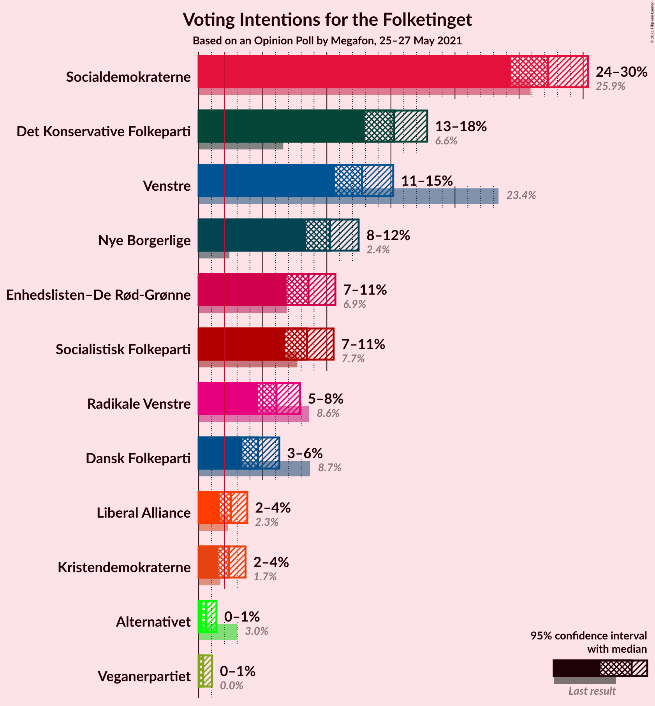

### Confidence Intervals

| Party | Last Result | Poll Result | 80% Confidence Interval | 90% Confidence Interval | 95% Confidence Interval | 99% Confidence Interval |
|:-----:|:-----------:|:-----------:|:-----------------------:|:-----------------------:|:-----------------------:|:-----------------------:|
| Socialdemokraterne | 25.9% | 27.3% | 25.3–29.3% |24.8–29.9% |24.4–30.4% |23.5–31.4% |
| Det Konservative Folkeparti | 6.6% | 15.2% | 13.7–16.9% |13.3–17.4% |13.0–17.8% |12.3–18.7% |
| Venstre | 23.4% | 12.7% | 11.4–14.3% |11.0–14.8% |10.7–15.2% |10.0–16.0% |
| Nye Borgerlige | 2.4% | 10.2% | 9.0–11.7% |8.7–12.1% |8.4–12.5% |7.8–13.2% |
| Enhedslisten–De Rød-Grønne | 6.9% | 8.6% | 7.4–9.9% |7.1–10.3% |6.9–10.7% |6.4–11.4% |
| Socialistisk Folkeparti | 7.7% | 8.5% | 7.3–9.8% |7.0–10.2% |6.8–10.5% |6.2–11.2% |
| Radikale Venstre | 8.6% | 6.1% | 5.1–7.3% |4.9–7.6% |4.6–7.9% |4.2–8.5% |
| Dansk Folkeparti | 8.7% | 4.6% | 3.8–5.7% |3.6–6.0% |3.4–6.3% |3.1–6.8% |
| Liberal Alliance | 2.3% | 2.5% | 1.9–3.3% |1.8–3.6% |1.6–3.8% |1.4–4.2% |
| Kristendemokraterne | 1.7% | 2.4% | 1.8–3.2% |1.7–3.4% |1.5–3.7% |1.3–4.1% |
| Alternativet | 3.0% | 0.6% | 0.4–1.1% |0.3–1.2% |0.3–1.4% |0.2–1.7% |
| Veganerpartiet | 0.0% | 0.4% | 0.2–0.8% |0.2–0.9% |0.1–1.1% |0.1–1.3% |

*Note:* The poll result column reflects the actual value used in the calculations. Published results may vary slightly, and in addition be rounded to fewer digits.

## Seats

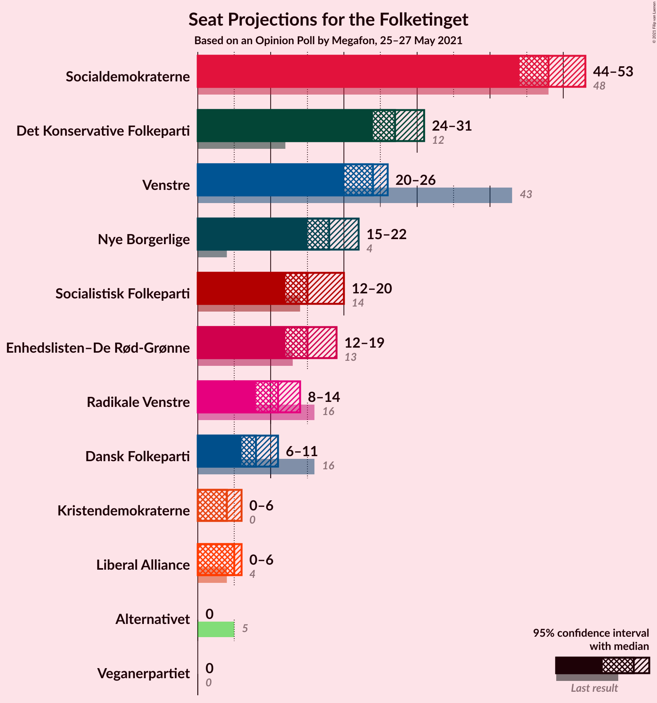

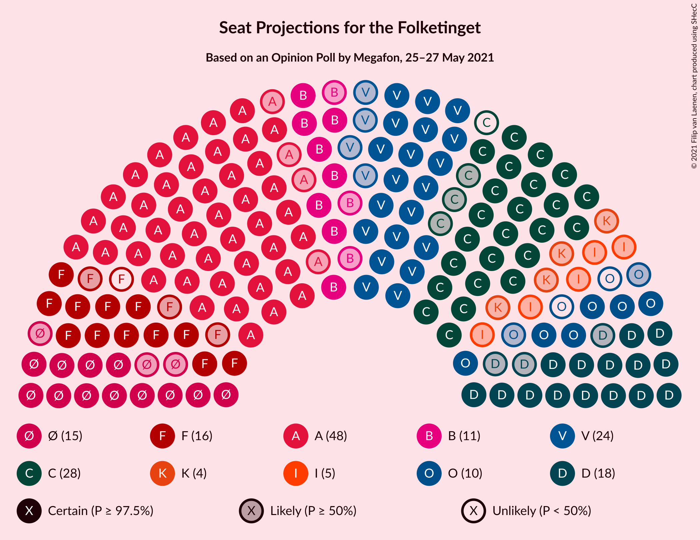

### Confidence Intervals

| Party | Last Result | Median | 80% Confidence Interval | 90% Confidence Interval | 95% Confidence Interval | 99% Confidence Interval |
|:-----:|:-----------:|:------:|:-----------------------:|:-----------------------:|:-----------------------:|:-----------------------:|
| <a href="#socialdemokraterne">Socialdemokraterne</a> | 48 | 48 | 46–51 |44–52 |44–53 |41–56 |
| <a href="#det-konservative-folkeparti">Det Konservative Folkeparti</a> | 12 | 27 | 24–30 |24–30 |24–31 |22–33 |
| <a href="#venstre">Venstre</a> | 43 | 24 | 21–26 |20–26 |20–26 |18–27 |
| <a href="#nye-borgerlige">Nye Borgerlige</a> | 4 | 18 | 17–21 |16–22 |15–22 |14–23 |
| <a href="#enhedslisten–de-rød-grønne">Enhedslisten–De Rød-Grønne</a> | 13 | 15 | 12–17 |12–18 |12–19 |11–20 |
| <a href="#socialistisk-folkeparti">Socialistisk Folkeparti</a> | 14 | 15 | 12–20 |12–20 |12–20 |11–20 |
| <a href="#radikale-venstre">Radikale Venstre</a> | 16 | 11 | 9–13 |8–13 |8–14 |8–14 |
| <a href="#dansk-folkeparti">Dansk Folkeparti</a> | 16 | 8 | 6–11 |6–11 |6–11 |5–12 |
| <a href="#liberal-alliance">Liberal Alliance</a> | 4 | 5 | 4–5 |0–6 |0–6 |0–8 |
| <a href="#kristendemokraterne">Kristendemokraterne</a> | 0 | 4 | 0–5 |0–6 |0–6 |0–7 |
| <a href="#alternativet">Alternativet</a> | 5 | 0 | 0 |0 |0 |0 |
| <a href="#veganerpartiet">Veganerpartiet</a> | 0 | 0 | 0 |0 |0 |0 |

### Socialdemokraterne

*For a full overview of the results for this party, see the [Socialdemokraterne](party-socialdemokraterne.html) page.*

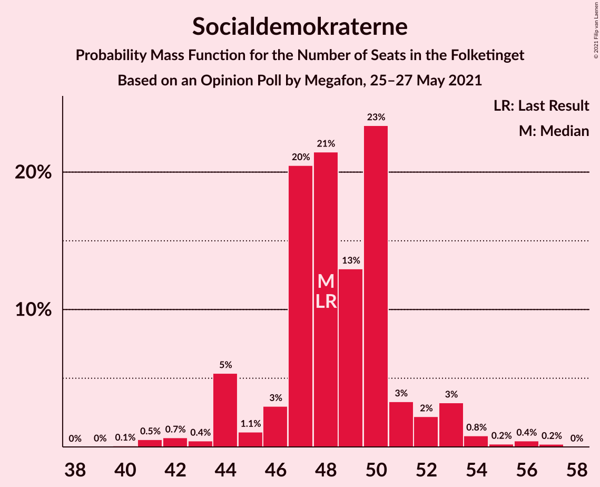

| Number of Seats | Probability | Accumulated | Special Marks |
|:---------------:|:-----------:|:-----------:|:-------------:|
| 40 | 0.1% | 100% |  |
| 41 | 0.5% | 99.9% |  |
| 42 | 0.7% | 99.3% |  |
| 43 | 0.4% | 98.7% |  |
| 44 | 5% | 98% |  |
| 45 | 1.1% | 93% |  |
| 46 | 3% | 92% |  |
| 47 | 20% | 89% |  |
| 48 | 21% | 68% | Last Result, Median |
| 49 | 13% | 47% |  |
| 50 | 23% | 34% |  |
| 51 | 3% | 10% |  |
| 52 | 2% | 7% |  |
| 53 | 3% | 5% |  |
| 54 | 0.8% | 2% |  |
| 55 | 0.2% | 0.9% |  |
| 56 | 0.4% | 0.7% |  |
| 57 | 0.2% | 0.2% |  |
| 58 | 0% | 0% |  |

### Det Konservative Folkeparti

*For a full overview of the results for this party, see the [Det Konservative Folkeparti](party-detkonservativefolkeparti.html) page.*

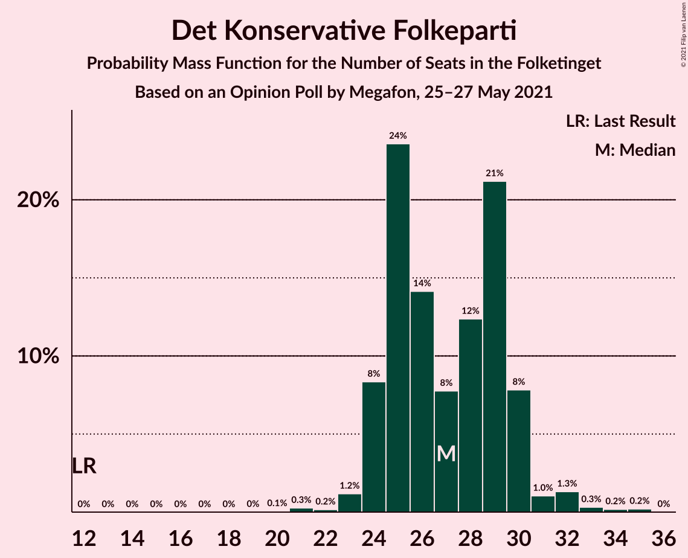

| Number of Seats | Probability | Accumulated | Special Marks |
|:---------------:|:-----------:|:-----------:|:-------------:|
| 12 | 0% | 100% | Last Result |
| 13 | 0% | 100% |  |
| 14 | 0% | 100% |  |
| 15 | 0% | 100% |  |
| 16 | 0% | 100% |  |
| 17 | 0% | 100% |  |
| 18 | 0% | 100% |  |
| 19 | 0% | 100% |  |
| 20 | 0.1% | 100% |  |
| 21 | 0.3% | 99.9% |  |
| 22 | 0.2% | 99.7% |  |
| 23 | 1.2% | 99.5% |  |
| 24 | 8% | 98% |  |
| 25 | 24% | 90% |  |
| 26 | 14% | 66% |  |
| 27 | 8% | 52% | Median |
| 28 | 12% | 44% |  |
| 29 | 21% | 32% |  |
| 30 | 8% | 11% |  |
| 31 | 1.0% | 3% |  |
| 32 | 1.3% | 2% |  |
| 33 | 0.3% | 0.7% |  |
| 34 | 0.2% | 0.4% |  |
| 35 | 0.2% | 0.2% |  |
| 36 | 0% | 0% |  |

### Venstre

*For a full overview of the results for this party, see the [Venstre](party-venstre.html) page.*

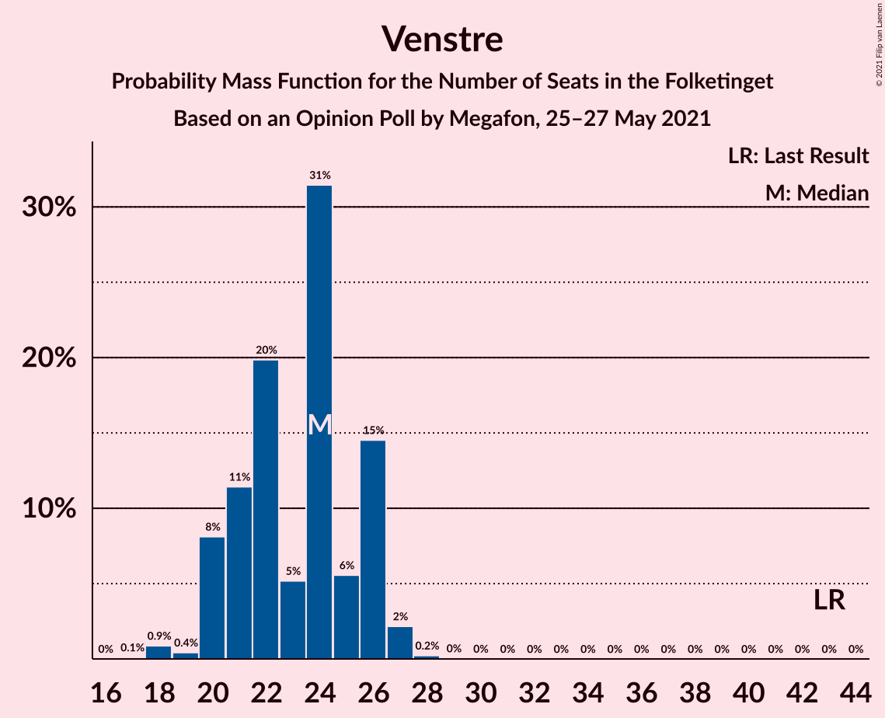

| Number of Seats | Probability | Accumulated | Special Marks |
|:---------------:|:-----------:|:-----------:|:-------------:|
| 17 | 0.1% | 100% |  |
| 18 | 0.9% | 99.9% |  |
| 19 | 0.4% | 99.0% |  |
| 20 | 8% | 98.6% |  |
| 21 | 11% | 90% |  |
| 22 | 20% | 79% |  |
| 23 | 5% | 59% |  |
| 24 | 31% | 54% | Median |
| 25 | 6% | 23% |  |
| 26 | 15% | 17% |  |
| 27 | 2% | 2% |  |
| 28 | 0.2% | 0.3% |  |
| 29 | 0% | 0.1% |  |
| 30 | 0% | 0% |  |
| 31 | 0% | 0% |  |
| 32 | 0% | 0% |  |
| 33 | 0% | 0% |  |
| 34 | 0% | 0% |  |
| 35 | 0% | 0% |  |
| 36 | 0% | 0% |  |
| 37 | 0% | 0% |  |
| 38 | 0% | 0% |  |
| 39 | 0% | 0% |  |
| 40 | 0% | 0% |  |
| 41 | 0% | 0% |  |
| 42 | 0% | 0% |  |
| 43 | 0% | 0% | Last Result |

### Nye Borgerlige

*For a full overview of the results for this party, see the [Nye Borgerlige](party-nyeborgerlige.html) page.*

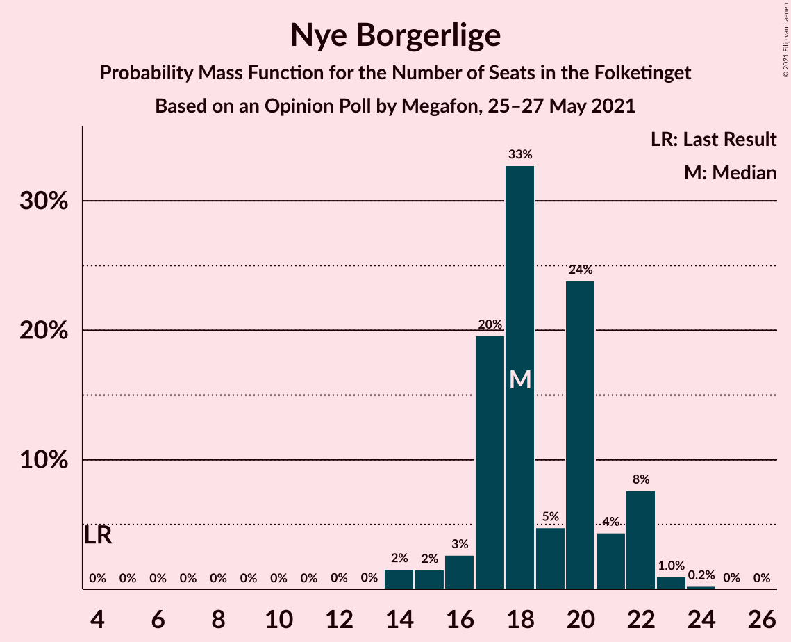

| Number of Seats | Probability | Accumulated | Special Marks |
|:---------------:|:-----------:|:-----------:|:-------------:|
| 4 | 0% | 100% | Last Result |
| 5 | 0% | 100% |  |
| 6 | 0% | 100% |  |
| 7 | 0% | 100% |  |
| 8 | 0% | 100% |  |
| 9 | 0% | 100% |  |
| 10 | 0% | 100% |  |
| 11 | 0% | 100% |  |
| 12 | 0% | 100% |  |
| 13 | 0% | 100% |  |
| 14 | 2% | 99.9% |  |
| 15 | 2% | 98% |  |
| 16 | 3% | 97% |  |
| 17 | 20% | 94% |  |
| 18 | 33% | 75% | Median |
| 19 | 5% | 42% |  |
| 20 | 24% | 37% |  |
| 21 | 4% | 13% |  |
| 22 | 8% | 9% |  |
| 23 | 1.0% | 1.3% |  |
| 24 | 0.2% | 0.3% |  |
| 25 | 0% | 0% |  |

### Enhedslisten–De Rød-Grønne

*For a full overview of the results for this party, see the [Enhedslisten–De Rød-Grønne](party-enhedslisten–derød-grønne.html) page.*

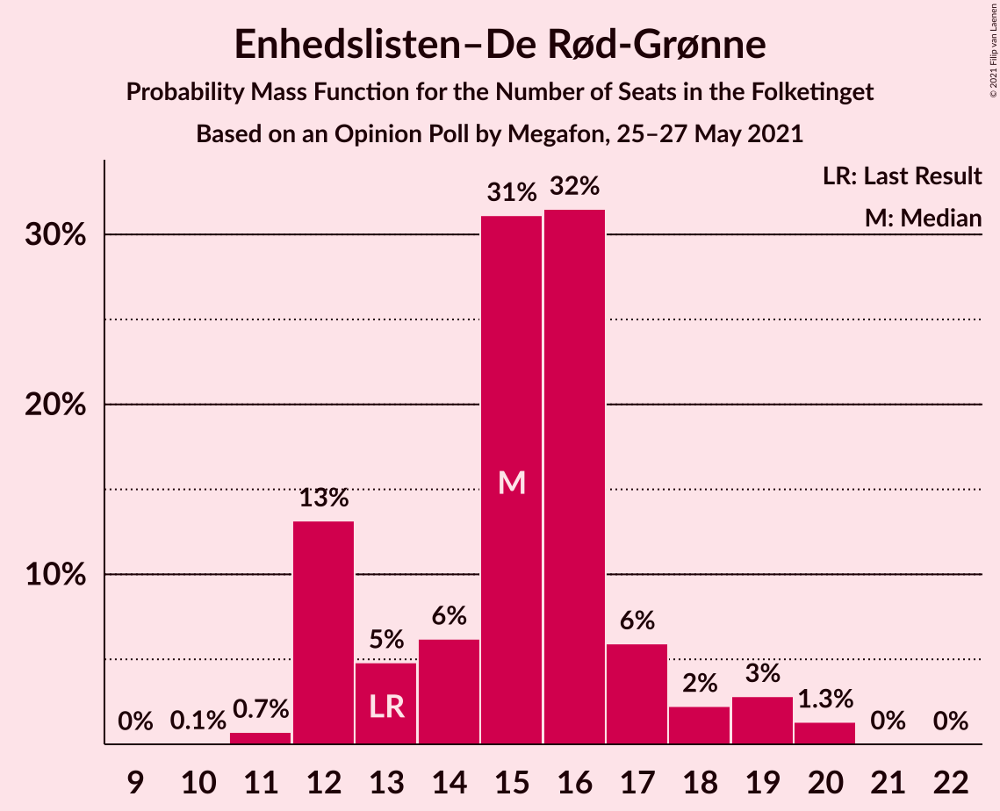

| Number of Seats | Probability | Accumulated | Special Marks |
|:---------------:|:-----------:|:-----------:|:-------------:|
| 10 | 0.1% | 100% |  |
| 11 | 0.7% | 99.9% |  |
| 12 | 13% | 99.2% |  |
| 13 | 5% | 86% | Last Result |
| 14 | 6% | 81% |  |
| 15 | 31% | 75% | Median |
| 16 | 32% | 44% |  |
| 17 | 6% | 12% |  |
| 18 | 2% | 6% |  |
| 19 | 3% | 4% |  |
| 20 | 1.3% | 1.4% |  |
| 21 | 0% | 0.1% |  |
| 22 | 0% | 0% |  |

### Socialistisk Folkeparti

*For a full overview of the results for this party, see the [Socialistisk Folkeparti](party-socialistiskfolkeparti.html) page.*

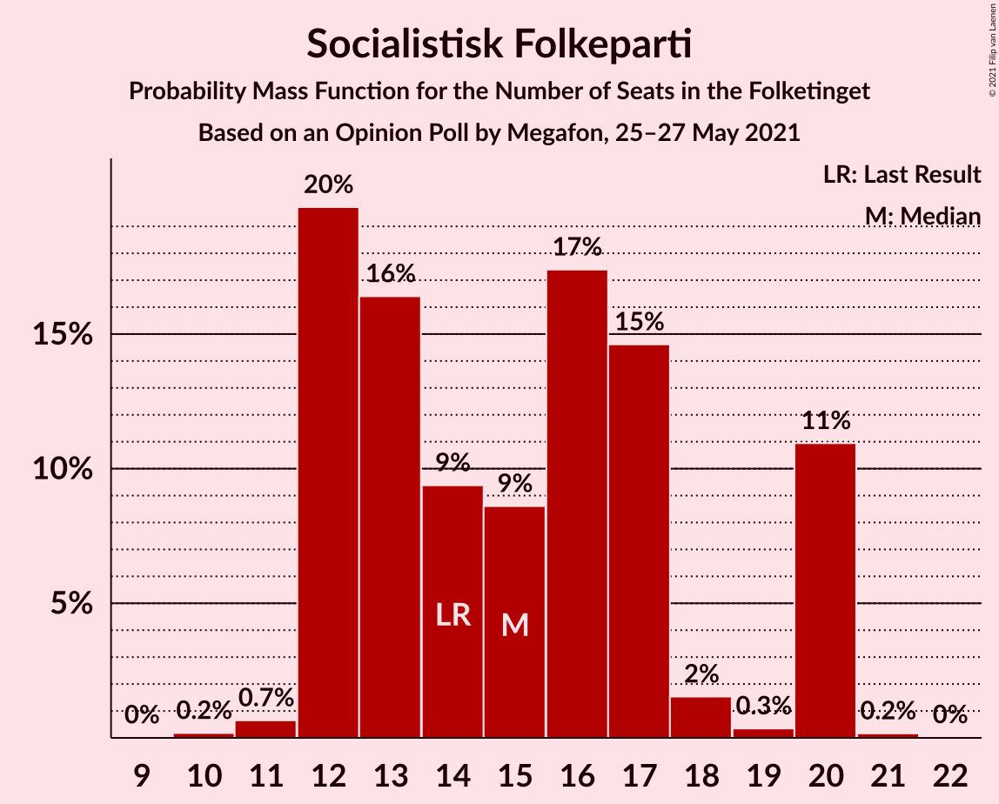

| Number of Seats | Probability | Accumulated | Special Marks |
|:---------------:|:-----------:|:-----------:|:-------------:|
| 10 | 0.2% | 100% |  |
| 11 | 0.7% | 99.8% |  |
| 12 | 20% | 99.2% |  |
| 13 | 16% | 79% |  |
| 14 | 9% | 63% | Last Result |
| 15 | 9% | 54% | Median |
| 16 | 17% | 45% |  |
| 17 | 15% | 28% |  |
| 18 | 2% | 13% |  |
| 19 | 0.3% | 11% |  |
| 20 | 11% | 11% |  |
| 21 | 0.2% | 0.2% |  |
| 22 | 0% | 0% |  |

### Radikale Venstre

*For a full overview of the results for this party, see the [Radikale Venstre](party-radikalevenstre.html) page.*

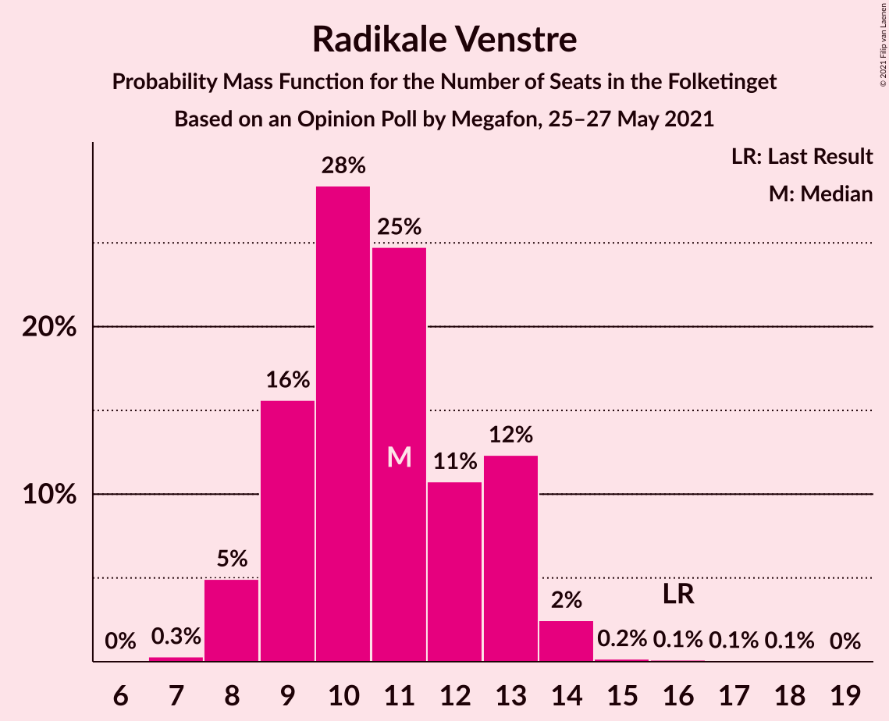

| Number of Seats | Probability | Accumulated | Special Marks |
|:---------------:|:-----------:|:-----------:|:-------------:|
| 7 | 0.3% | 100% |  |
| 8 | 5% | 99.7% |  |
| 9 | 16% | 95% |  |
| 10 | 28% | 79% |  |
| 11 | 25% | 51% | Median |
| 12 | 11% | 26% |  |
| 13 | 12% | 15% |  |
| 14 | 2% | 3% |  |
| 15 | 0.2% | 0.4% |  |
| 16 | 0.1% | 0.2% | Last Result |
| 17 | 0.1% | 0.1% |  |
| 18 | 0.1% | 0.1% |  |
| 19 | 0% | 0% |  |

### Dansk Folkeparti

*For a full overview of the results for this party, see the [Dansk Folkeparti](party-danskfolkeparti.html) page.*

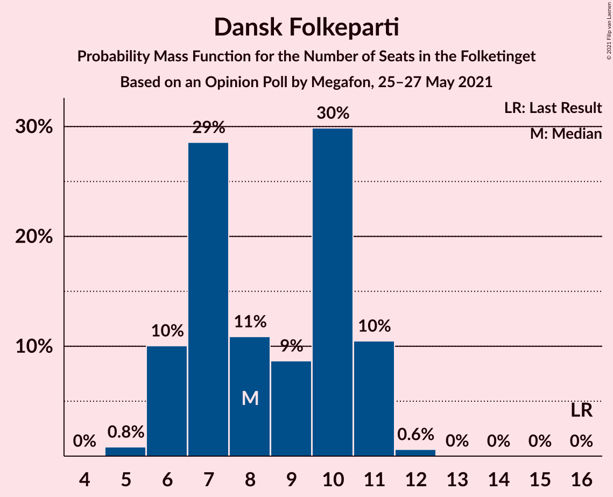

| Number of Seats | Probability | Accumulated | Special Marks |
|:---------------:|:-----------:|:-----------:|:-------------:|
| 5 | 0.8% | 100% |  |
| 6 | 10% | 99.2% |  |
| 7 | 29% | 89% |  |
| 8 | 11% | 61% | Median |
| 9 | 9% | 50% |  |
| 10 | 30% | 41% |  |
| 11 | 10% | 11% |  |
| 12 | 0.6% | 0.6% |  |
| 13 | 0% | 0% |  |
| 14 | 0% | 0% |  |
| 15 | 0% | 0% |  |
| 16 | 0% | 0% | Last Result |

### Liberal Alliance

*For a full overview of the results for this party, see the [Liberal Alliance](party-liberalalliance.html) page.*

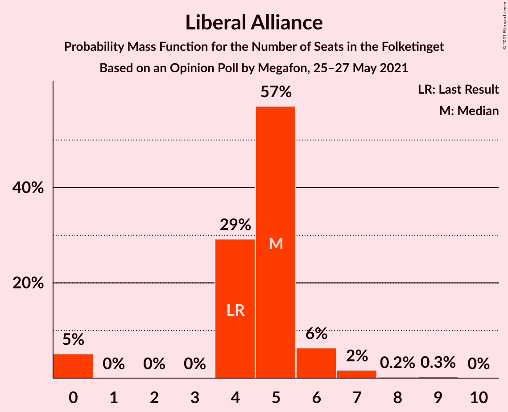

| Number of Seats | Probability | Accumulated | Special Marks |
|:---------------:|:-----------:|:-----------:|:-------------:|
| 0 | 5% | 100% |  |
| 1 | 0% | 95% |  |
| 2 | 0% | 95% |  |
| 3 | 0% | 95% |  |
| 4 | 29% | 95% | Last Result |
| 5 | 57% | 66% | Median |
| 6 | 6% | 9% |  |
| 7 | 2% | 2% |  |
| 8 | 0.2% | 0.5% |  |
| 9 | 0.3% | 0.3% |  |
| 10 | 0% | 0% |  |

### Kristendemokraterne

*For a full overview of the results for this party, see the [Kristendemokraterne](party-kristendemokraterne.html) page.*

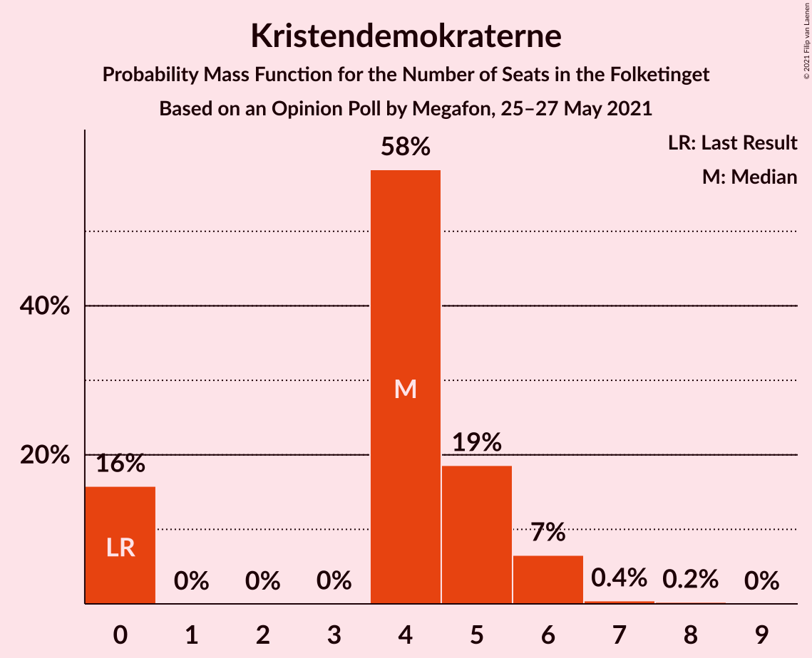

| Number of Seats | Probability | Accumulated | Special Marks |
|:---------------:|:-----------:|:-----------:|:-------------:|
| 0 | 16% | 100% | Last Result |
| 1 | 0% | 84% |  |
| 2 | 0% | 84% |  |
| 3 | 0% | 84% |  |
| 4 | 58% | 84% | Median |
| 5 | 19% | 26% |  |
| 6 | 7% | 7% |  |
| 7 | 0.4% | 0.7% |  |
| 8 | 0.2% | 0.3% |  |
| 9 | 0% | 0% |  |

### Alternativet

*For a full overview of the results for this party, see the [Alternativet](party-alternativet.html) page.*

| Number of Seats | Probability | Accumulated | Special Marks |
|:---------------:|:-----------:|:-----------:|:-------------:|
| 0 | 100% | 100% | Median |
| 1 | 0% | 0% |  |
| 2 | 0% | 0% |  |
| 3 | 0% | 0% |  |
| 4 | 0% | 0% |  |
| 5 | 0% | 0% | Last Result |

### Veganerpartiet

*For a full overview of the results for this party, see the [Veganerpartiet](party-veganerpartiet.html) page.*

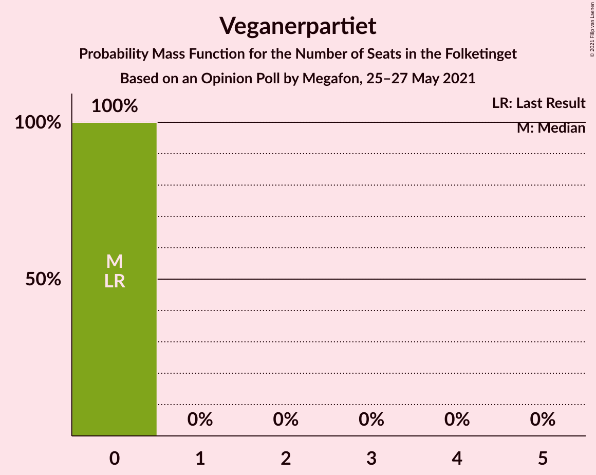

| Number of Seats | Probability | Accumulated | Special Marks |
|:---------------:|:-----------:|:-----------:|:-------------:|
| 0 | 100% | 100% | Last Result, Median |

## Coalitions

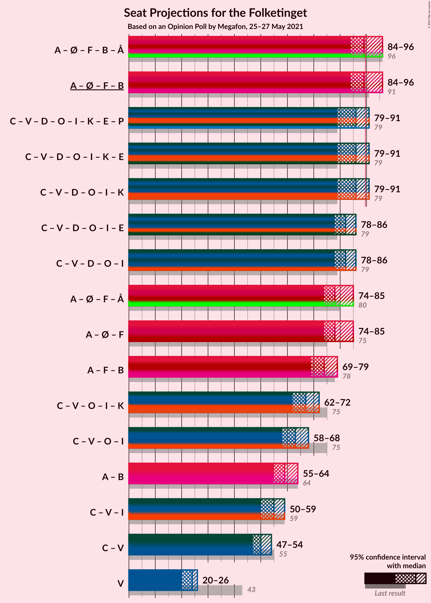

### Confidence Intervals

| Coalition | Last Result | Median | Majority? | 80% Confidence Interval | 90% Confidence Interval | 95% Confidence Interval | 99% Confidence Interval |
|:---------:|:-----------:|:------:|:---------:|:-----------------------:|:-----------------------:|:-----------------------:|:-----------------------:|
| Socialdemokraterne – Enhedslisten–De Rød-Grønne – Socialistisk Folkeparti – Radikale Venstre – Alternativet | 96 | 89 | 42% | 86–93 | 84–95 | 84–96 | 82–97 |
| Socialdemokraterne – Enhedslisten–De Rød-Grønne – Socialistisk Folkeparti – Radikale Venstre | 91 | 89 | 42% | 86–93 | 84–95 | 84–96 | 82–97 |
| Det Konservative Folkeparti – Venstre – Nye Borgerlige – Dansk Folkeparti – Liberal Alliance – Kristendemokraterne | 79 | 86 | 6% | 82–89 | 80–91 | 79–91 | 78–93 |
| Det Konservative Folkeparti – Venstre – Nye Borgerlige – Dansk Folkeparti – Liberal Alliance | 79 | 82 | 0.4% | 79–85 | 79–86 | 78–86 | 75–89 |
| Socialdemokraterne – Enhedslisten–De Rød-Grønne – Socialistisk Folkeparti – Alternativet | 80 | 78 | 0% | 76–82 | 75–85 | 74–85 | 71–86 |
| Socialdemokraterne – Enhedslisten–De Rød-Grønne – Socialistisk Folkeparti | 75 | 78 | 0% | 76–82 | 75–85 | 74–85 | 71–86 |
| Socialdemokraterne – Socialistisk Folkeparti – Radikale Venstre | 78 | 74 | 0% | 71–77 | 71–78 | 69–79 | 67–82 |
| Det Konservative Folkeparti – Venstre – Dansk Folkeparti – Liberal Alliance – Kristendemokraterne | 75 | 67 | 0% | 62–71 | 62–71 | 62–72 | 58–76 |
| Det Konservative Folkeparti – Venstre – Dansk Folkeparti – Liberal Alliance | 75 | 63 | 0% | 61–67 | 60–67 | 58–68 | 56–71 |
| Socialdemokraterne – Radikale Venstre | 64 | 59 | 0% | 56–62 | 56–64 | 55–64 | 51–66 |
| Det Konservative Folkeparti – Venstre – Liberal Alliance | 59 | 55 | 0% | 52–57 | 52–58 | 50–59 | 49–62 |
| Det Konservative Folkeparti – Venstre | 55 | 50 | 0% | 48–52 | 48–53 | 47–54 | 45–57 |
| Venstre | 43 | 24 | 0% | 21–26 | 20–26 | 20–26 | 18–27 |

### Socialdemokraterne – Enhedslisten–De Rød-Grønne – Socialistisk Folkeparti – Radikale Venstre – Alternativet

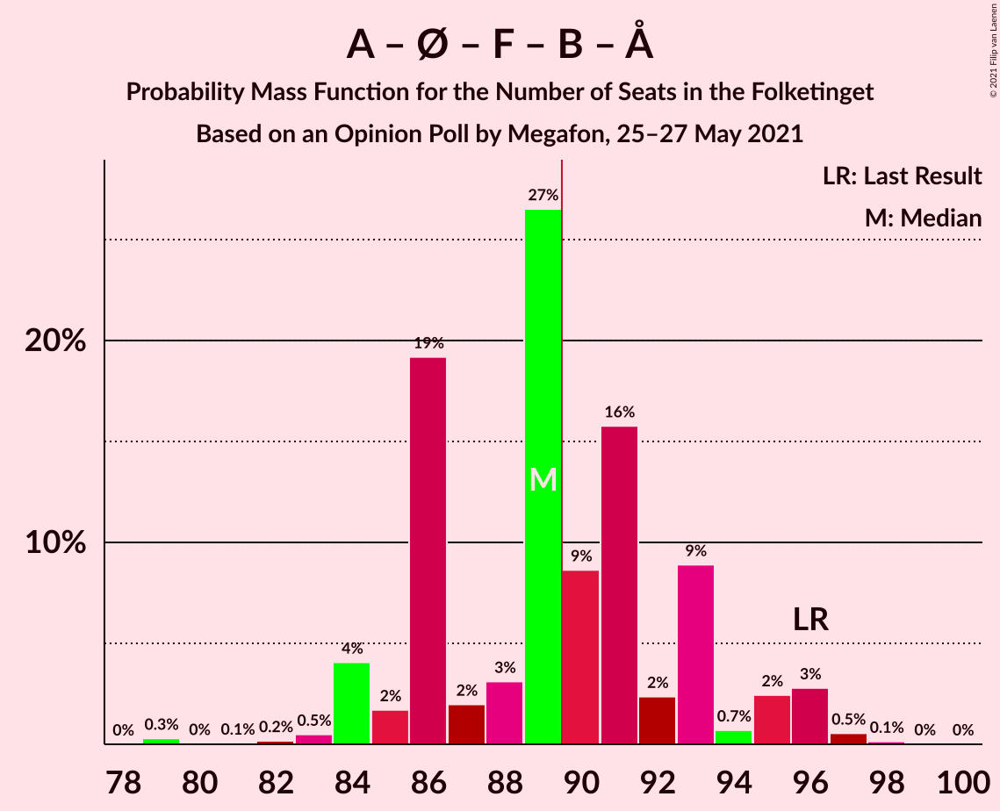

| Number of Seats | Probability | Accumulated | Special Marks |
|:---------------:|:-----------:|:-----------:|:-------------:|
| 79 | 0.3% | 100% |  |
| 80 | 0% | 99.7% |  |
| 81 | 0.1% | 99.7% |  |
| 82 | 0.2% | 99.6% |  |
| 83 | 0.5% | 99.4% |  |
| 84 | 4% | 98.9% |  |
| 85 | 2% | 95% |  |
| 86 | 19% | 93% |  |
| 87 | 2% | 74% |  |
| 88 | 3% | 72% |  |
| 89 | 27% | 69% | Median |
| 90 | 9% | 42% | Majority |
| 91 | 16% | 34% |  |
| 92 | 2% | 18% |  |
| 93 | 9% | 16% |  |
| 94 | 0.7% | 7% |  |
| 95 | 2% | 6% |  |
| 96 | 3% | 4% | Last Result |
| 97 | 0.5% | 0.8% |  |
| 98 | 0.1% | 0.2% |  |
| 99 | 0% | 0.1% |  |
| 100 | 0% | 0% |  |

### Socialdemokraterne – Enhedslisten–De Rød-Grønne – Socialistisk Folkeparti – Radikale Venstre

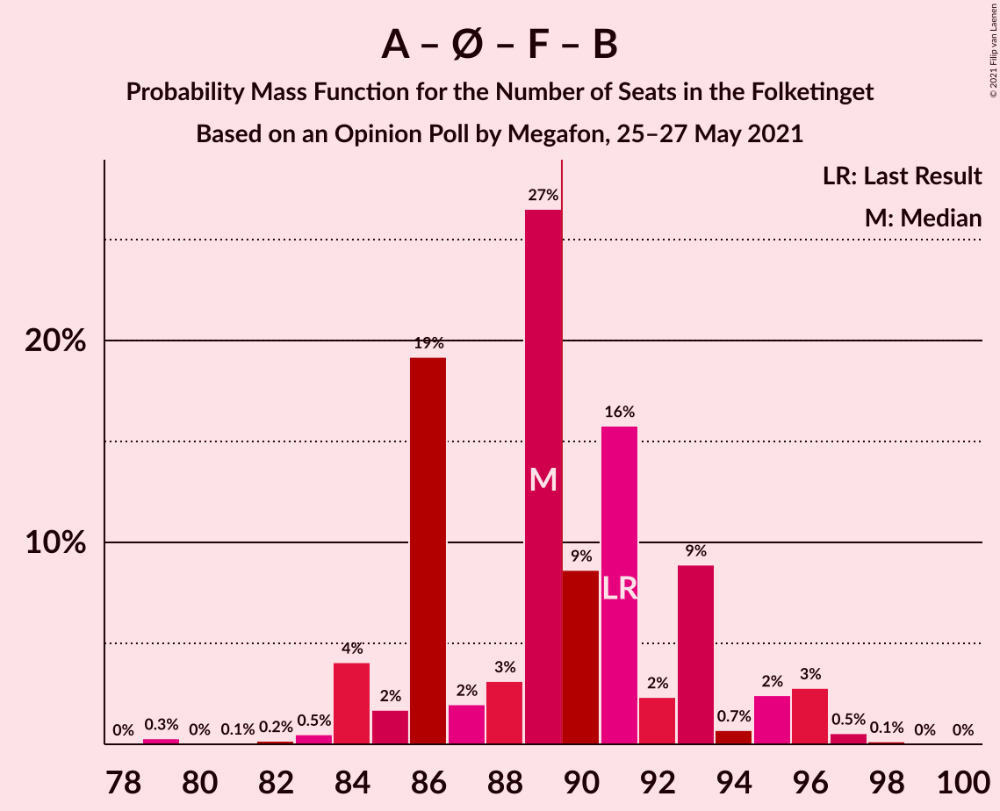

| Number of Seats | Probability | Accumulated | Special Marks |
|:---------------:|:-----------:|:-----------:|:-------------:|
| 79 | 0.3% | 100% |  |
| 80 | 0% | 99.7% |  |
| 81 | 0.1% | 99.7% |  |
| 82 | 0.2% | 99.6% |  |
| 83 | 0.5% | 99.4% |  |
| 84 | 4% | 98.9% |  |
| 85 | 2% | 95% |  |
| 86 | 19% | 93% |  |
| 87 | 2% | 74% |  |
| 88 | 3% | 72% |  |
| 89 | 27% | 69% | Median |
| 90 | 9% | 42% | Majority |
| 91 | 16% | 34% | Last Result |
| 92 | 2% | 18% |  |
| 93 | 9% | 16% |  |
| 94 | 0.7% | 7% |  |
| 95 | 2% | 6% |  |
| 96 | 3% | 4% |  |
| 97 | 0.5% | 0.8% |  |
| 98 | 0.1% | 0.2% |  |
| 99 | 0% | 0.1% |  |
| 100 | 0% | 0% |  |

### Det Konservative Folkeparti – Venstre – Nye Borgerlige – Dansk Folkeparti – Liberal Alliance – Kristendemokraterne

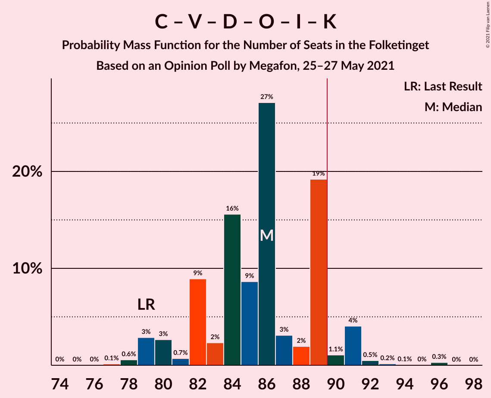

| Number of Seats | Probability | Accumulated | Special Marks |
|:---------------:|:-----------:|:-----------:|:-------------:|
| 75 | 0% | 100% |  |
| 76 | 0% | 99.9% |  |
| 77 | 0.1% | 99.9% |  |
| 78 | 0.6% | 99.8% |  |
| 79 | 3% | 99.2% | Last Result |
| 80 | 3% | 96% |  |
| 81 | 0.7% | 94% |  |
| 82 | 9% | 93% |  |
| 83 | 2% | 84% |  |
| 84 | 16% | 82% |  |
| 85 | 9% | 66% |  |
| 86 | 27% | 58% | Median |
| 87 | 3% | 30% |  |
| 88 | 2% | 27% |  |
| 89 | 19% | 25% |  |
| 90 | 1.1% | 6% | Majority |
| 91 | 4% | 5% |  |
| 92 | 0.5% | 1.0% |  |
| 93 | 0.2% | 0.5% |  |
| 94 | 0.1% | 0.4% |  |
| 95 | 0% | 0.3% |  |
| 96 | 0.3% | 0.3% |  |
| 97 | 0% | 0% |  |

### Det Konservative Folkeparti – Venstre – Nye Borgerlige – Dansk Folkeparti – Liberal Alliance

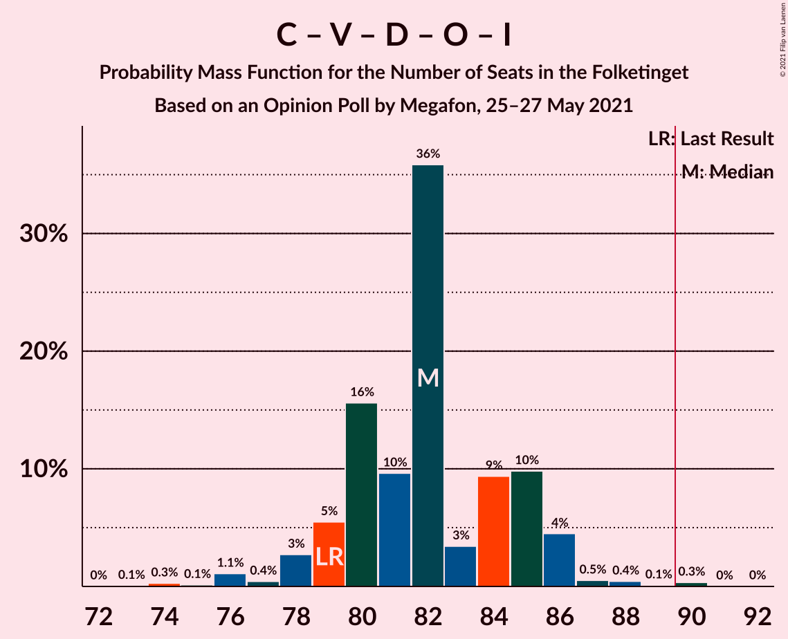

| Number of Seats | Probability | Accumulated | Special Marks |
|:---------------:|:-----------:|:-----------:|:-------------:|
| 72 | 0% | 100% |  |
| 73 | 0.1% | 99.9% |  |
| 74 | 0.3% | 99.9% |  |
| 75 | 0.1% | 99.6% |  |
| 76 | 1.1% | 99.4% |  |
| 77 | 0.4% | 98% |  |
| 78 | 3% | 98% |  |
| 79 | 5% | 95% | Last Result |
| 80 | 16% | 90% |  |
| 81 | 10% | 74% |  |
| 82 | 36% | 64% | Median |
| 83 | 3% | 29% |  |
| 84 | 9% | 25% |  |
| 85 | 10% | 16% |  |
| 86 | 4% | 6% |  |
| 87 | 0.5% | 1.5% |  |
| 88 | 0.4% | 1.0% |  |
| 89 | 0.1% | 0.5% |  |
| 90 | 0.3% | 0.4% | Majority |
| 91 | 0% | 0.1% |  |
| 92 | 0% | 0% |  |

### Socialdemokraterne – Enhedslisten–De Rød-Grønne – Socialistisk Folkeparti – Alternativet

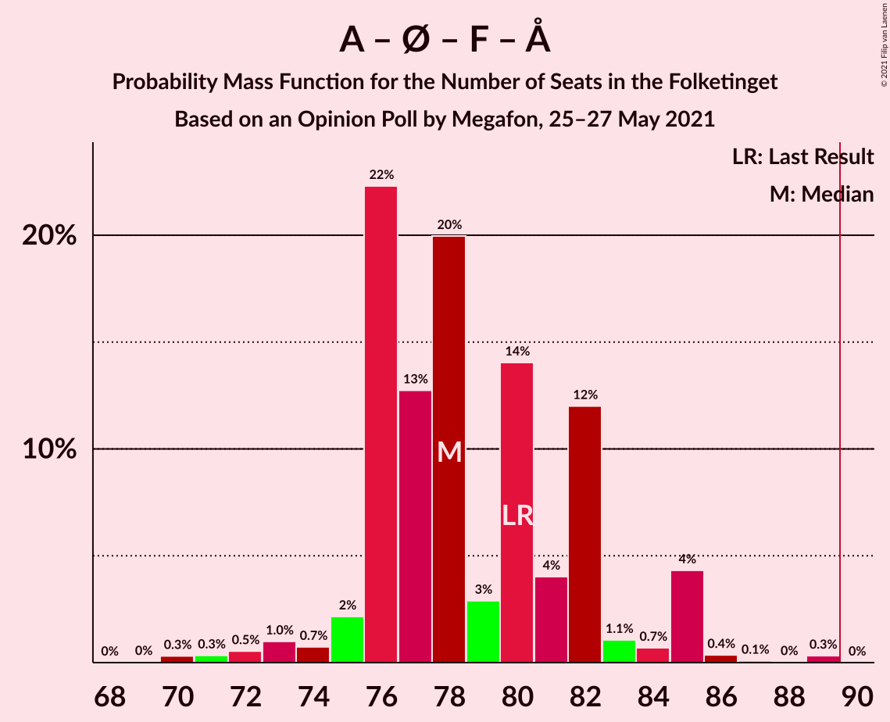

| Number of Seats | Probability | Accumulated | Special Marks |
|:---------------:|:-----------:|:-----------:|:-------------:|
| 70 | 0.3% | 100% |  |
| 71 | 0.3% | 99.6% |  |
| 72 | 0.5% | 99.3% |  |
| 73 | 1.0% | 98.8% |  |
| 74 | 0.7% | 98% |  |
| 75 | 2% | 97% |  |
| 76 | 22% | 95% |  |
| 77 | 13% | 73% |  |
| 78 | 20% | 60% | Median |
| 79 | 3% | 40% |  |
| 80 | 14% | 37% | Last Result |
| 81 | 4% | 23% |  |
| 82 | 12% | 19% |  |
| 83 | 1.1% | 7% |  |
| 84 | 0.7% | 6% |  |
| 85 | 4% | 5% |  |
| 86 | 0.4% | 0.8% |  |
| 87 | 0.1% | 0.5% |  |
| 88 | 0% | 0.4% |  |
| 89 | 0.3% | 0.3% |  |
| 90 | 0% | 0% | Majority |

### Socialdemokraterne – Enhedslisten–De Rød-Grønne – Socialistisk Folkeparti

| Number of Seats | Probability | Accumulated | Special Marks |
|:---------------:|:-----------:|:-----------:|:-------------:|
| 70 | 0.3% | 100% |  |
| 71 | 0.3% | 99.6% |  |
| 72 | 0.5% | 99.3% |  |
| 73 | 1.0% | 98.8% |  |
| 74 | 0.7% | 98% |  |
| 75 | 2% | 97% | Last Result |
| 76 | 22% | 95% |  |
| 77 | 13% | 73% |  |
| 78 | 20% | 60% | Median |
| 79 | 3% | 40% |  |
| 80 | 14% | 37% |  |
| 81 | 4% | 23% |  |
| 82 | 12% | 19% |  |
| 83 | 1.1% | 7% |  |
| 84 | 0.7% | 6% |  |
| 85 | 4% | 5% |  |
| 86 | 0.4% | 0.8% |  |
| 87 | 0.1% | 0.5% |  |
| 88 | 0% | 0.4% |  |
| 89 | 0.3% | 0.3% |  |
| 90 | 0% | 0% | Majority |

### Socialdemokraterne – Socialistisk Folkeparti – Radikale Venstre

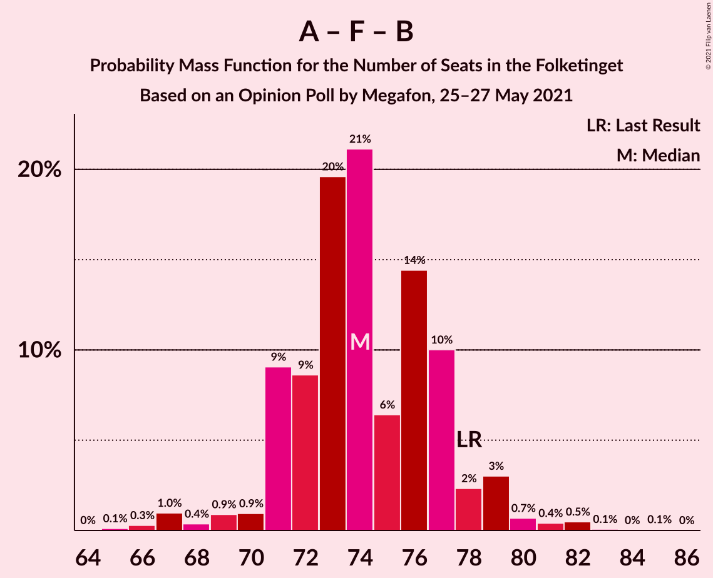

| Number of Seats | Probability | Accumulated | Special Marks |
|:---------------:|:-----------:|:-----------:|:-------------:|
| 65 | 0.1% | 100% |  |
| 66 | 0.3% | 99.8% |  |
| 67 | 1.0% | 99.6% |  |
| 68 | 0.4% | 98.6% |  |
| 69 | 0.9% | 98% |  |
| 70 | 0.9% | 97% |  |
| 71 | 9% | 96% |  |
| 72 | 9% | 87% |  |
| 73 | 20% | 79% |  |
| 74 | 21% | 59% | Median |
| 75 | 6% | 38% |  |
| 76 | 14% | 32% |  |
| 77 | 10% | 17% |  |
| 78 | 2% | 7% | Last Result |
| 79 | 3% | 5% |  |
| 80 | 0.7% | 2% |  |
| 81 | 0.4% | 1.1% |  |
| 82 | 0.5% | 0.7% |  |
| 83 | 0.1% | 0.2% |  |
| 84 | 0% | 0.1% |  |
| 85 | 0.1% | 0.1% |  |
| 86 | 0% | 0% |  |

### Det Konservative Folkeparti – Venstre – Dansk Folkeparti – Liberal Alliance – Kristendemokraterne

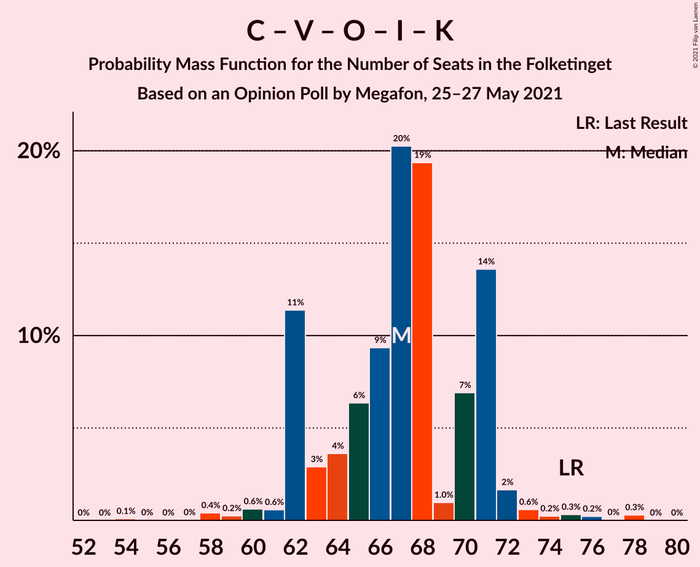

| Number of Seats | Probability | Accumulated | Special Marks |
|:---------------:|:-----------:|:-----------:|:-------------:|
| 54 | 0.1% | 100% |  |
| 55 | 0% | 99.9% |  |
| 56 | 0% | 99.9% |  |
| 57 | 0% | 99.9% |  |
| 58 | 0.4% | 99.9% |  |
| 59 | 0.2% | 99.5% |  |
| 60 | 0.6% | 99.2% |  |
| 61 | 0.6% | 98.6% |  |
| 62 | 11% | 98% |  |
| 63 | 3% | 87% |  |
| 64 | 4% | 84% |  |
| 65 | 6% | 80% |  |
| 66 | 9% | 74% |  |
| 67 | 20% | 64% |  |
| 68 | 19% | 44% | Median |
| 69 | 1.0% | 25% |  |
| 70 | 7% | 24% |  |
| 71 | 14% | 17% |  |
| 72 | 2% | 3% |  |
| 73 | 0.6% | 2% |  |
| 74 | 0.2% | 1.1% |  |
| 75 | 0.3% | 0.9% | Last Result |
| 76 | 0.2% | 0.5% |  |
| 77 | 0% | 0.3% |  |
| 78 | 0.3% | 0.3% |  |
| 79 | 0% | 0% |  |

### Det Konservative Folkeparti – Venstre – Dansk Folkeparti – Liberal Alliance

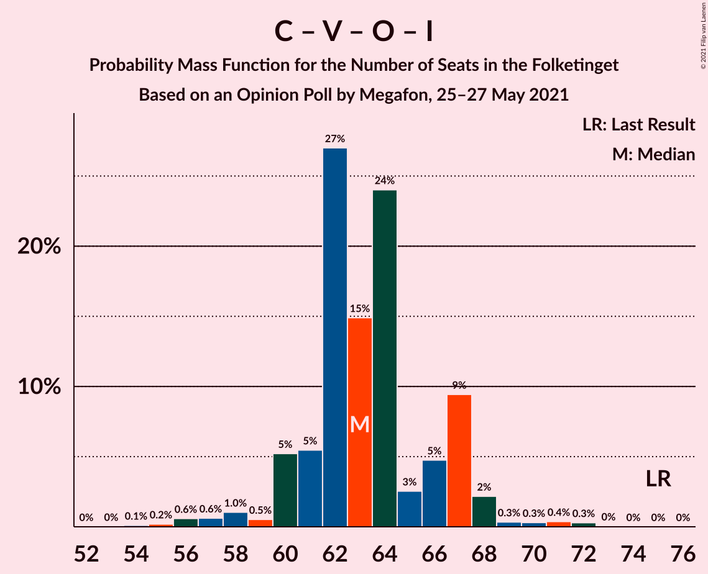

| Number of Seats | Probability | Accumulated | Special Marks |
|:---------------:|:-----------:|:-----------:|:-------------:|
| 54 | 0.1% | 100% |  |
| 55 | 0.2% | 99.9% |  |
| 56 | 0.6% | 99.7% |  |
| 57 | 0.6% | 99.1% |  |
| 58 | 1.0% | 98% |  |
| 59 | 0.5% | 97% |  |
| 60 | 5% | 97% |  |
| 61 | 5% | 92% |  |
| 62 | 27% | 86% |  |
| 63 | 15% | 59% |  |
| 64 | 24% | 44% | Median |
| 65 | 3% | 20% |  |
| 66 | 5% | 18% |  |
| 67 | 9% | 13% |  |
| 68 | 2% | 4% |  |
| 69 | 0.3% | 1.4% |  |
| 70 | 0.3% | 1.0% |  |
| 71 | 0.4% | 0.7% |  |
| 72 | 0.3% | 0.3% |  |
| 73 | 0% | 0.1% |  |
| 74 | 0% | 0% |  |
| 75 | 0% | 0% | Last Result |

### Socialdemokraterne – Radikale Venstre

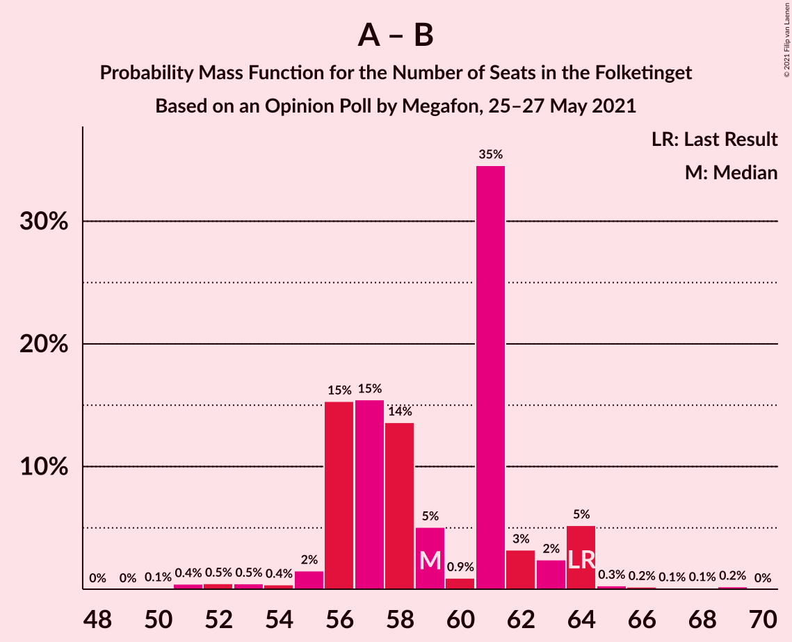

| Number of Seats | Probability | Accumulated | Special Marks |
|:---------------:|:-----------:|:-----------:|:-------------:|
| 50 | 0.1% | 100% |  |
| 51 | 0.4% | 99.9% |  |
| 52 | 0.5% | 99.5% |  |
| 53 | 0.5% | 99.0% |  |
| 54 | 0.4% | 98.5% |  |
| 55 | 2% | 98% |  |
| 56 | 15% | 97% |  |
| 57 | 15% | 81% |  |
| 58 | 14% | 66% |  |
| 59 | 5% | 52% | Median |
| 60 | 0.9% | 47% |  |
| 61 | 35% | 46% |  |
| 62 | 3% | 12% |  |
| 63 | 2% | 9% |  |
| 64 | 5% | 6% | Last Result |
| 65 | 0.3% | 0.9% |  |
| 66 | 0.2% | 0.6% |  |
| 67 | 0.1% | 0.4% |  |
| 68 | 0.1% | 0.3% |  |
| 69 | 0.2% | 0.2% |  |
| 70 | 0% | 0% |  |

### Det Konservative Folkeparti – Venstre – Liberal Alliance

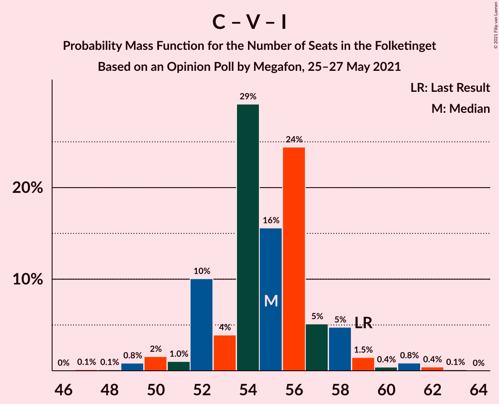

| Number of Seats | Probability | Accumulated | Special Marks |
|:---------------:|:-----------:|:-----------:|:-------------:|
| 46 | 0% | 100% |  |
| 47 | 0.1% | 99.9% |  |
| 48 | 0.1% | 99.8% |  |
| 49 | 0.8% | 99.7% |  |
| 50 | 2% | 98.8% |  |
| 51 | 1.0% | 97% |  |
| 52 | 10% | 96% |  |
| 53 | 4% | 86% |  |
| 54 | 29% | 82% |  |
| 55 | 16% | 53% |  |
| 56 | 24% | 38% | Median |
| 57 | 5% | 13% |  |
| 58 | 5% | 8% |  |
| 59 | 1.5% | 3% | Last Result |
| 60 | 0.4% | 2% |  |
| 61 | 0.8% | 1.4% |  |
| 62 | 0.4% | 0.6% |  |
| 63 | 0.1% | 0.2% |  |
| 64 | 0% | 0% |  |

### Det Konservative Folkeparti – Venstre

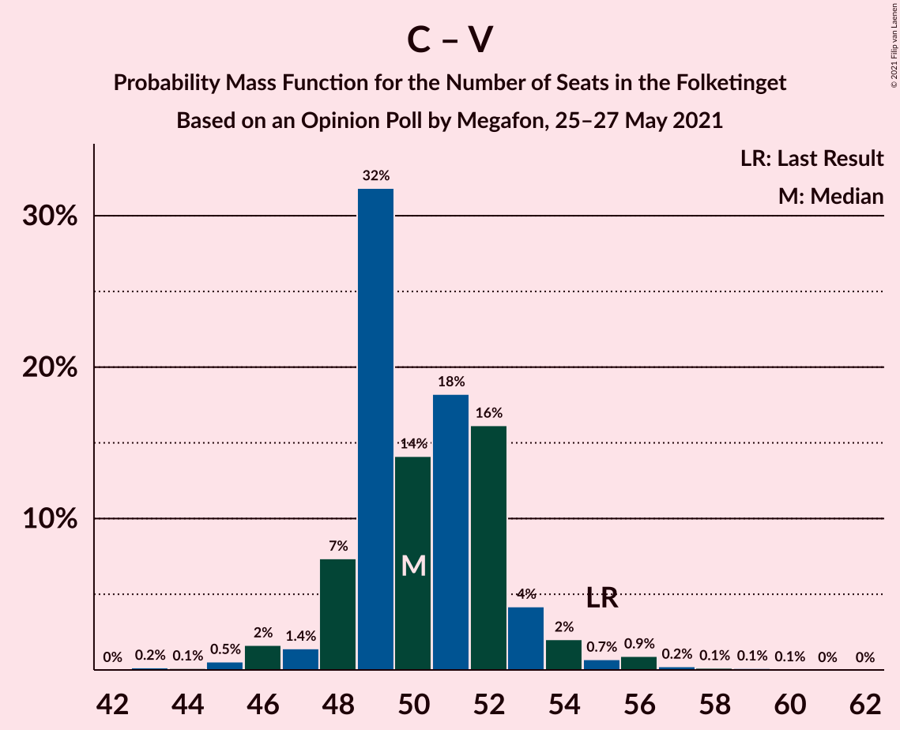

| Number of Seats | Probability | Accumulated | Special Marks |
|:---------------:|:-----------:|:-----------:|:-------------:|
| 43 | 0.2% | 100% |  |
| 44 | 0.1% | 99.8% |  |
| 45 | 0.5% | 99.7% |  |
| 46 | 2% | 99.1% |  |
| 47 | 1.4% | 98% |  |
| 48 | 7% | 96% |  |
| 49 | 32% | 89% |  |
| 50 | 14% | 57% |  |
| 51 | 18% | 43% | Median |
| 52 | 16% | 25% |  |
| 53 | 4% | 8% |  |
| 54 | 2% | 4% |  |
| 55 | 0.7% | 2% | Last Result |
| 56 | 0.9% | 1.5% |  |
| 57 | 0.2% | 0.6% |  |
| 58 | 0.1% | 0.3% |  |
| 59 | 0.1% | 0.2% |  |
| 60 | 0.1% | 0.1% |  |
| 61 | 0% | 0% |  |

### Venstre

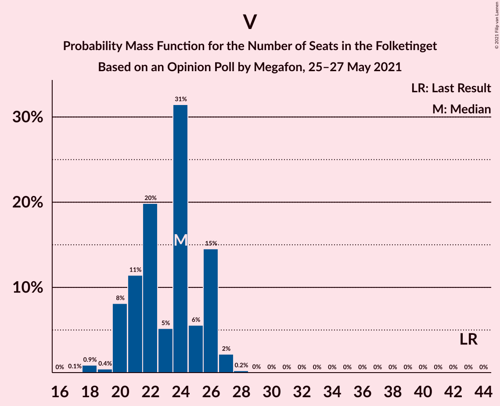

| Number of Seats | Probability | Accumulated | Special Marks |
|:---------------:|:-----------:|:-----------:|:-------------:|
| 17 | 0.1% | 100% |  |
| 18 | 0.9% | 99.9% |  |
| 19 | 0.4% | 99.0% |  |
| 20 | 8% | 98.6% |  |
| 21 | 11% | 90% |  |
| 22 | 20% | 79% |  |
| 23 | 5% | 59% |  |
| 24 | 31% | 54% | Median |
| 25 | 6% | 23% |  |
| 26 | 15% | 17% |  |
| 27 | 2% | 2% |  |
| 28 | 0.2% | 0.3% |  |
| 29 | 0% | 0.1% |  |
| 30 | 0% | 0% |  |
| 31 | 0% | 0% |  |
| 32 | 0% | 0% |  |
| 33 | 0% | 0% |  |
| 34 | 0% | 0% |  |
| 35 | 0% | 0% |  |
| 36 | 0% | 0% |  |
| 37 | 0% | 0% |  |
| 38 | 0% | 0% |  |
| 39 | 0% | 0% |  |
| 40 | 0% | 0% |  |
| 41 | 0% | 0% |  |
| 42 | 0% | 0% |  |
| 43 | 0% | 0% | Last Result |

## Technical Information

### Opinion Poll

+ **Polling firm:** Megafon
+ **Commissioner(s):** —
+ **Fieldwork period:** 25–27 May 2021

### Calculations

+ **Sample size:** 840
+ **Simulations done:** 1,048,576
+ **Error estimate:** 2.24%

