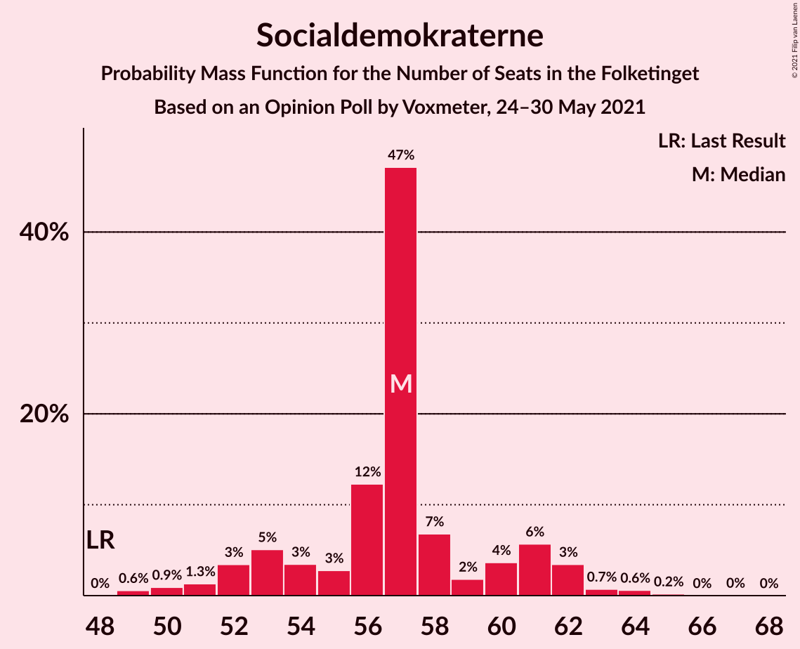
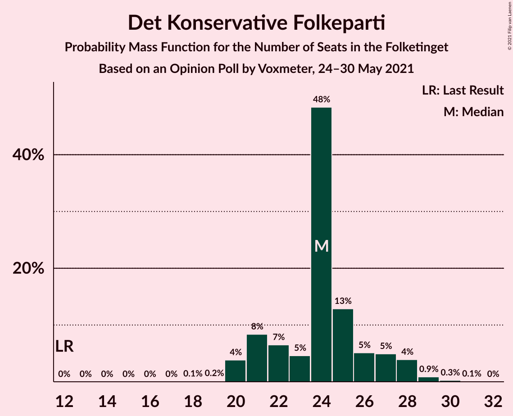
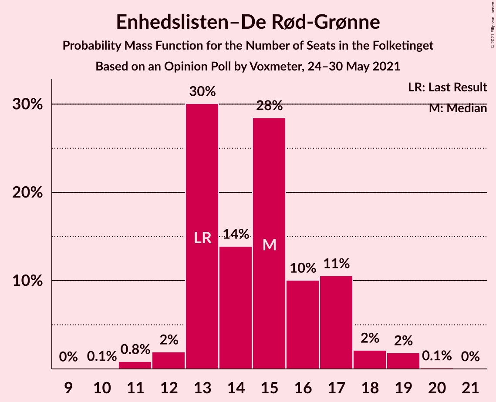
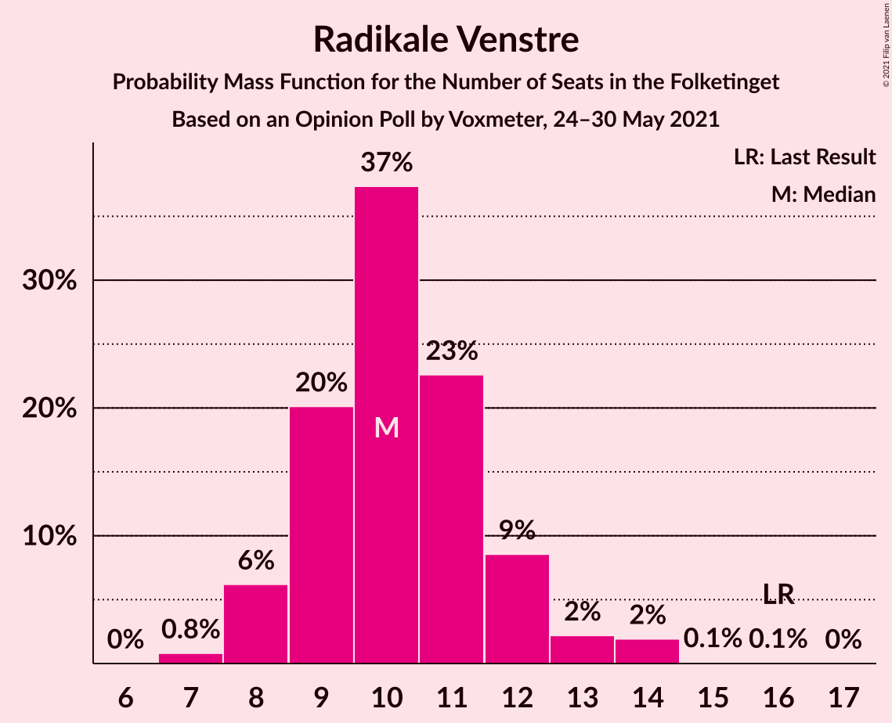
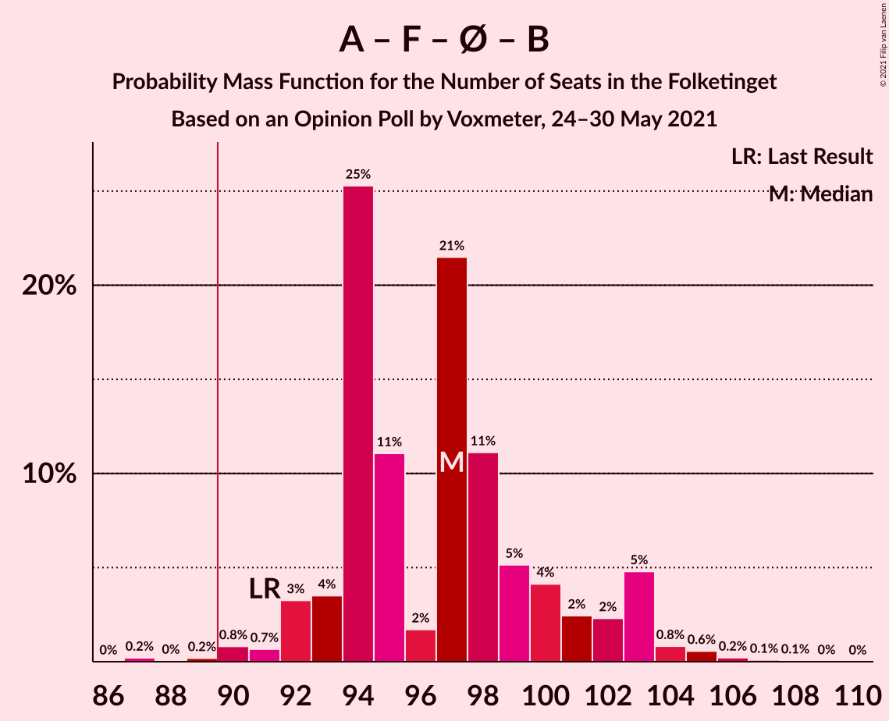
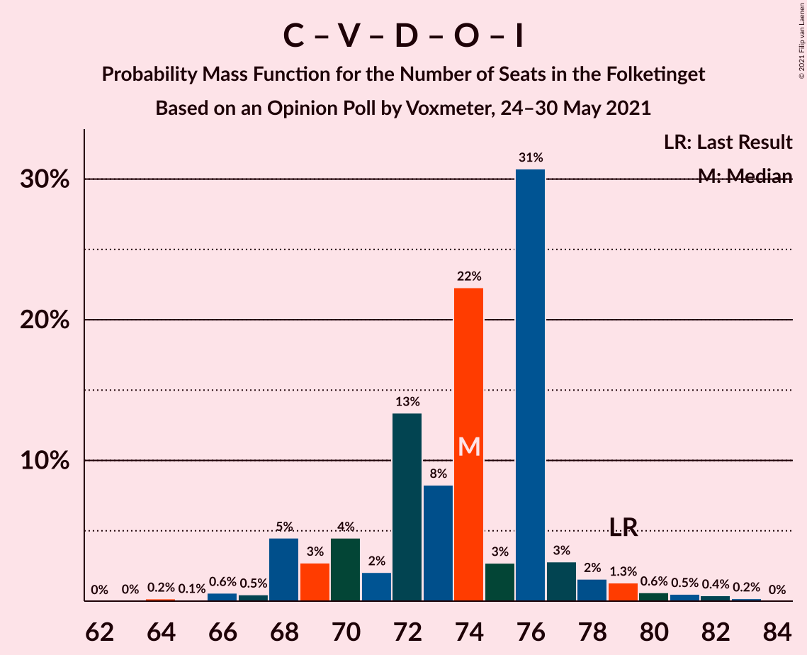
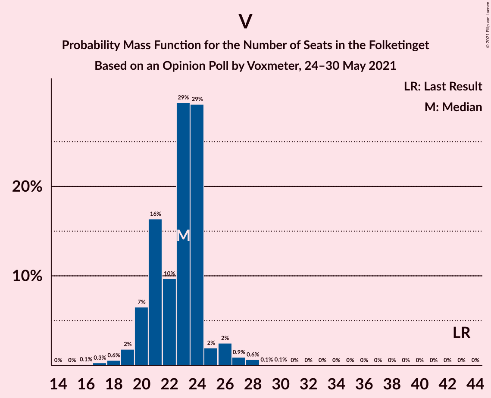

# Opinion Poll by Voxmeter, 24–30 May 2021

<a href="#voting-intentions">Voting Intentions</a> | <a href="#seats">Seats</a> | <a href="#coalitions">Coalitions</a> | <a href="#technical-information">Technical Information</a>

## Voting Intentions

### Confidence Intervals

| Party | Last Result | Poll Result | 80% Confidence Interval | 90% Confidence Interval | 95% Confidence Interval | 99% Confidence Interval |
|:-----:|:-----------:|:-----------:|:-----------------------:|:-----------------------:|:-----------------------:|:-----------------------:|
| Socialdemokraterne | 25.9% | 31.7% | 29.9–33.7% |29.4–34.2% |28.9–34.7% |28.1–35.6% |
| Det Konservative Folkeparti | 6.6% | 13.5% | 12.2–15.0% |11.9–15.4% |11.6–15.8% |11.0–16.5% |
| Venstre | 23.4% | 12.5% | 11.3–14.0% |10.9–14.4% |10.6–14.7% |10.1–15.5% |
| Socialistisk Folkeparti | 7.7% | 8.6% | 7.5–9.8% |7.2–10.2% |7.0–10.5% |6.5–11.1% |
| Enhedslisten–De Rød-Grønne | 6.9% | 8.4% | 7.3–9.6% |7.0–9.9% |6.8–10.2% |6.3–10.9% |
| Nye Borgerlige | 2.4% | 7.5% | 6.5–8.6% |6.2–9.0% |6.0–9.3% |5.6–9.8% |
| Radikale Venstre | 8.6% | 5.9% | 5.0–6.9% |4.8–7.2% |4.6–7.5% |4.2–8.0% |
| Dansk Folkeparti | 8.7% | 5.7% | 4.8–6.7% |4.6–7.0% |4.4–7.3% |4.0–7.8% |
| Liberal Alliance | 2.3% | 2.2% | 1.7–2.9% |1.6–3.1% |1.4–3.3% |1.2–3.7% |
| Kristendemokraterne | 1.7% | 1.6% | 1.2–2.2% |1.1–2.4% |1.0–2.6% |0.8–2.9% |
| Alternativet | 3.0% | 0.4% | 0.2–0.8% |0.2–0.9% |0.2–1.0% |0.1–1.2% |

*Note:* The poll result column reflects the actual value used in the calculations. Published results may vary slightly, and in addition be rounded to fewer digits.

## Seats

### Confidence Intervals

| Party | Last Result | Median | 80% Confidence Interval | 90% Confidence Interval | 95% Confidence Interval | 99% Confidence Interval |
|:-----:|:-----------:|:------:|:-----------------------:|:-----------------------:|:-----------------------:|:-----------------------:|
| <a href="#socialdemokraterne">Socialdemokraterne</a> | 48 | 56 | 52–61 |52–61 |52–61 |50–61 |
| <a href="#det-konservative-folkeparti">Det Konservative Folkeparti</a> | 12 | 24 | 21–27 |20–27 |20–27 |20–29 |
| <a href="#venstre">Venstre</a> | 43 | 22 | 20–23 |20–25 |20–25 |19–26 |
| <a href="#socialistisk-folkeparti">Socialistisk Folkeparti</a> | 14 | 15 | 13–17 |13–18 |13–18 |12–19 |
| <a href="#enhedslisten–de-rød-grønne">Enhedslisten–De Rød-Grønne</a> | 13 | 15 | 13–17 |13–17 |13–18 |13–19 |
| <a href="#nye-borgerlige">Nye Borgerlige</a> | 4 | 12 | 12–14 |11–15 |11–16 |10–18 |
| <a href="#radikale-venstre">Radikale Venstre</a> | 16 | 9 | 9–11 |9–12 |9–12 |8–13 |
| <a href="#dansk-folkeparti">Dansk Folkeparti</a> | 16 | 10 | 9–12 |8–12 |8–12 |7–13 |
| <a href="#liberal-alliance">Liberal Alliance</a> | 4 | 5 | 4–5 |0–5 |0–5 |0–6 |
| <a href="#kristendemokraterne">Kristendemokraterne</a> | 0 | 0 | 0–4 |0–4 |0–4 |0–5 |
| <a href="#alternativet">Alternativet</a> | 5 | 0 | 0 |0 |0 |0 |

### Socialdemokraterne

*For a full overview of the results for this party, see the [Socialdemokraterne](party-socialdemokraterne.html) page.*

| Number of Seats | Probability | Accumulated | Special Marks |
|:---------------:|:-----------:|:-----------:|:-------------:|
| 47 | 0.1% | 100% |  |
| 48 | 0% | 99.9% | Last Result |
| 49 | 0.3% | 99.9% |  |
| 50 | 0.4% | 99.7% |  |
| 51 | 1.5% | 99.3% |  |
| 52 | 16% | 98% |  |
| 53 | 1.0% | 82% |  |
| 54 | 10% | 81% |  |
| 55 | 3% | 71% |  |
| 56 | 29% | 68% | Median |
| 57 | 12% | 39% |  |
| 58 | 2% | 27% |  |
| 59 | 2% | 25% |  |
| 60 | 8% | 24% |  |
| 61 | 16% | 16% |  |
| 62 | 0.1% | 0.2% |  |
| 63 | 0% | 0% |  |

### Det Konservative Folkeparti

*For a full overview of the results for this party, see the [Det Konservative Folkeparti](party-detkonservativefolkeparti.html) page.*

| Number of Seats | Probability | Accumulated | Special Marks |
|:---------------:|:-----------:|:-----------:|:-------------:|
| 12 | 0% | 100% | Last Result |
| 13 | 0% | 100% |  |
| 14 | 0% | 100% |  |
| 15 | 0% | 100% |  |
| 16 | 0% | 100% |  |
| 17 | 0% | 100% |  |
| 18 | 0% | 100% |  |
| 19 | 0% | 100% |  |
| 20 | 7% | 99.9% |  |
| 21 | 28% | 93% |  |
| 22 | 2% | 65% |  |
| 23 | 3% | 63% |  |
| 24 | 29% | 61% | Median |
| 25 | 13% | 32% |  |
| 26 | 2% | 19% |  |
| 27 | 16% | 17% |  |
| 28 | 0.3% | 2% |  |
| 29 | 1.2% | 1.4% |  |
| 30 | 0.1% | 0.2% |  |
| 31 | 0.1% | 0.1% |  |
| 32 | 0% | 0% |  |

### Venstre

*For a full overview of the results for this party, see the [Venstre](party-venstre.html) page.*

| Number of Seats | Probability | Accumulated | Special Marks |
|:---------------:|:-----------:|:-----------:|:-------------:|
| 18 | 0.2% | 100% |  |
| 19 | 2% | 99.8% |  |
| 20 | 16% | 98% |  |
| 21 | 17% | 82% |  |
| 22 | 27% | 65% | Median |
| 23 | 29% | 37% |  |
| 24 | 3% | 9% |  |
| 25 | 4% | 6% |  |
| 26 | 2% | 2% |  |
| 27 | 0.3% | 0.4% |  |
| 28 | 0.1% | 0.1% |  |
| 29 | 0% | 0% |  |
| 30 | 0% | 0% |  |
| 31 | 0% | 0% |  |
| 32 | 0% | 0% |  |
| 33 | 0% | 0% |  |
| 34 | 0% | 0% |  |
| 35 | 0% | 0% |  |
| 36 | 0% | 0% |  |
| 37 | 0% | 0% |  |
| 38 | 0% | 0% |  |
| 39 | 0% | 0% |  |
| 40 | 0% | 0% |  |
| 41 | 0% | 0% |  |
| 42 | 0% | 0% |  |
| 43 | 0% | 0% | Last Result |

### Socialistisk Folkeparti

*For a full overview of the results for this party, see the [Socialistisk Folkeparti](party-socialistiskfolkeparti.html) page.*

| Number of Seats | Probability | Accumulated | Special Marks |
|:---------------:|:-----------:|:-----------:|:-------------:|
| 11 | 0.1% | 100% |  |
| 12 | 0.5% | 99.9% |  |
| 13 | 11% | 99.5% |  |
| 14 | 3% | 88% | Last Result |
| 15 | 39% | 86% | Median |
| 16 | 31% | 47% |  |
| 17 | 6% | 15% |  |
| 18 | 8% | 10% |  |
| 19 | 2% | 2% |  |
| 20 | 0.2% | 0.3% |  |
| 21 | 0.1% | 0.1% |  |
| 22 | 0% | 0% |  |

### Enhedslisten–De Rød-Grønne

*For a full overview of the results for this party, see the [Enhedslisten–De Rød-Grønne](party-enhedslisten–derød-grønne.html) page.*

| Number of Seats | Probability | Accumulated | Special Marks |
|:---------------:|:-----------:|:-----------:|:-------------:|
| 11 | 0.1% | 100% |  |
| 12 | 0.4% | 99.9% |  |
| 13 | 11% | 99.5% | Last Result |
| 14 | 19% | 88% |  |
| 15 | 40% | 69% | Median |
| 16 | 10% | 29% |  |
| 17 | 16% | 19% |  |
| 18 | 2% | 3% |  |
| 19 | 0.9% | 1.0% |  |
| 20 | 0.1% | 0.1% |  |
| 21 | 0% | 0% |  |

### Nye Borgerlige

*For a full overview of the results for this party, see the [Nye Borgerlige](party-nyeborgerlige.html) page.*

| Number of Seats | Probability | Accumulated | Special Marks |
|:---------------:|:-----------:|:-----------:|:-------------:|
| 4 | 0% | 100% | Last Result |
| 5 | 0% | 100% |  |
| 6 | 0% | 100% |  |
| 7 | 0% | 100% |  |
| 8 | 0% | 100% |  |
| 9 | 0% | 100% |  |
| 10 | 0.6% | 99.9% |  |
| 11 | 8% | 99.3% |  |
| 12 | 45% | 92% | Median |
| 13 | 12% | 46% |  |
| 14 | 26% | 35% |  |
| 15 | 4% | 9% |  |
| 16 | 2% | 4% |  |
| 17 | 2% | 2% |  |
| 18 | 0.6% | 0.7% |  |
| 19 | 0% | 0.1% |  |
| 20 | 0% | 0% |  |

### Radikale Venstre

*For a full overview of the results for this party, see the [Radikale Venstre](party-radikalevenstre.html) page.*

| Number of Seats | Probability | Accumulated | Special Marks |
|:---------------:|:-----------:|:-----------:|:-------------:|
| 7 | 0.1% | 100% |  |
| 8 | 0.9% | 99.8% |  |
| 9 | 69% | 98.9% | Median |
| 10 | 17% | 30% |  |
| 11 | 4% | 13% |  |
| 12 | 7% | 9% |  |
| 13 | 1.2% | 2% |  |
| 14 | 0.4% | 0.5% |  |
| 15 | 0.1% | 0.1% |  |
| 16 | 0% | 0% | Last Result |

### Dansk Folkeparti

*For a full overview of the results for this party, see the [Dansk Folkeparti](party-danskfolkeparti.html) page.*

| Number of Seats | Probability | Accumulated | Special Marks |
|:---------------:|:-----------:|:-----------:|:-------------:|
| 7 | 0.9% | 100% |  |
| 8 | 4% | 99.0% |  |
| 9 | 38% | 95% |  |
| 10 | 21% | 57% | Median |
| 11 | 24% | 36% |  |
| 12 | 10% | 12% |  |
| 13 | 1.1% | 1.3% |  |
| 14 | 0.1% | 0.2% |  |
| 15 | 0.2% | 0.2% |  |
| 16 | 0% | 0% | Last Result |

### Liberal Alliance

*For a full overview of the results for this party, see the [Liberal Alliance](party-liberalalliance.html) page.*

| Number of Seats | Probability | Accumulated | Special Marks |
|:---------------:|:-----------:|:-----------:|:-------------:|
| 0 | 6% | 100% |  |
| 1 | 0% | 94% |  |
| 2 | 0% | 94% |  |
| 3 | 0% | 94% |  |
| 4 | 39% | 94% | Last Result |
| 5 | 52% | 54% | Median |
| 6 | 2% | 2% |  |
| 7 | 0.2% | 0.2% |  |
| 8 | 0% | 0% |  |

### Kristendemokraterne

*For a full overview of the results for this party, see the [Kristendemokraterne](party-kristendemokraterne.html) page.*

| Number of Seats | Probability | Accumulated | Special Marks |
|:---------------:|:-----------:|:-----------:|:-------------:|
| 0 | 50% | 100% | Last Result, Median |
| 1 | 0% | 50% |  |
| 2 | 0% | 50% |  |
| 3 | 0% | 50% |  |
| 4 | 48% | 50% |  |
| 5 | 2% | 2% |  |
| 6 | 0% | 0% |  |

### Alternativet

*For a full overview of the results for this party, see the [Alternativet](party-alternativet.html) page.*

| Number of Seats | Probability | Accumulated | Special Marks |
|:---------------:|:-----------:|:-----------:|:-------------:|
| 0 | 100% | 100% | Median |
| 1 | 0% | 0% |  |
| 2 | 0% | 0% |  |
| 3 | 0% | 0% |  |
| 4 | 0% | 0% |  |
| 5 | 0% | 0% | Last Result |

## Coalitions

### Confidence Intervals

| Coalition | Last Result | Median | Majority? | 80% Confidence Interval | 90% Confidence Interval | 95% Confidence Interval | 99% Confidence Interval |
|:---------:|:-----------:|:------:|:---------:|:-----------------------:|:-----------------------:|:-----------------------:|:-----------------------:|
| Socialdemokraterne – Socialistisk Folkeparti – Enhedslisten–De Rød-Grønne – Radikale Venstre – Alternativet | 96 | 95 | 98.6% | 92–102 | 92–103 | 92–103 | 87–105 |
| Socialdemokraterne – Socialistisk Folkeparti – Enhedslisten–De Rød-Grønne – Radikale Venstre | 91 | 95 | 98.6% | 92–102 | 92–103 | 92–103 | 87–105 |
| Socialdemokraterne – Socialistisk Folkeparti – Enhedslisten–De Rød-Grønne – Alternativet | 80 | 86 | 26% | 83–91 | 83–94 | 82–94 | 78–94 |
| Socialdemokraterne – Socialistisk Folkeparti – Enhedslisten–De Rød-Grønne | 75 | 86 | 26% | 83–91 | 83–94 | 82–94 | 78–94 |
| Socialdemokraterne – Socialistisk Folkeparti – Radikale Venstre | 78 | 80 | 0.5% | 78–87 | 78–87 | 78–87 | 73–89 |
| Det Konservative Folkeparti – Venstre – Nye Borgerlige – Dansk Folkeparti – Liberal Alliance – Kristendemokraterne | 79 | 76 | 0% | 69–78 | 68–78 | 68–80 | 68–83 |
| Det Konservative Folkeparti – Venstre – Nye Borgerlige – Dansk Folkeparti – Liberal Alliance | 79 | 72 | 0% | 69–76 | 68–77 | 68–79 | 67–80 |
| Socialdemokraterne – Radikale Venstre | 64 | 65 | 0% | 62–70 | 62–70 | 62–71 | 60–73 |
| Det Konservative Folkeparti – Venstre – Dansk Folkeparti – Liberal Alliance – Kristendemokraterne | 75 | 64 | 0% | 57–65 | 57–65 | 57–66 | 52–69 |
| Det Konservative Folkeparti – Venstre – Dansk Folkeparti – Liberal Alliance | 75 | 60 | 0% | 57–62 | 57–63 | 54–64 | 52–67 |
| Det Konservative Folkeparti – Venstre – Liberal Alliance | 59 | 51 | 0% | 46–52 | 46–53 | 46–54 | 44–57 |
| Det Konservative Folkeparti – Venstre | 55 | 47 | 0% | 42–47 | 42–49 | 42–49 | 41–53 |
| Venstre | 43 | 22 | 0% | 20–23 | 20–25 | 20–25 | 19–26 |

### Socialdemokraterne – Socialistisk Folkeparti – Enhedslisten–De Rød-Grønne – Radikale Venstre – Alternativet

| Number of Seats | Probability | Accumulated | Special Marks |
|:---------------:|:-----------:|:-----------:|:-------------:|
| 87 | 1.0% | 100% |  |
| 88 | 0% | 99.0% |  |
| 89 | 0.4% | 99.0% |  |
| 90 | 0.2% | 98.6% | Majority |
| 91 | 0.6% | 98% |  |
| 92 | 9% | 98% |  |
| 93 | 9% | 88% |  |
| 94 | 0.3% | 79% |  |
| 95 | 44% | 79% | Median |
| 96 | 1.4% | 35% | Last Result |
| 97 | 2% | 34% |  |
| 98 | 0.3% | 32% |  |
| 99 | 0.7% | 32% |  |
| 100 | 17% | 31% |  |
| 101 | 2% | 13% |  |
| 102 | 3% | 11% |  |
| 103 | 7% | 8% |  |
| 104 | 1.2% | 2% |  |
| 105 | 0.6% | 0.7% |  |
| 106 | 0.1% | 0.1% |  |
| 107 | 0% | 0.1% |  |
| 108 | 0% | 0% |  |

### Socialdemokraterne – Socialistisk Folkeparti – Enhedslisten–De Rød-Grønne – Radikale Venstre

| Number of Seats | Probability | Accumulated | Special Marks |
|:---------------:|:-----------:|:-----------:|:-------------:|
| 87 | 1.0% | 100% |  |
| 88 | 0% | 99.0% |  |
| 89 | 0.4% | 99.0% |  |
| 90 | 0.2% | 98.6% | Majority |
| 91 | 0.6% | 98% | Last Result |
| 92 | 9% | 98% |  |
| 93 | 9% | 88% |  |
| 94 | 0.3% | 79% |  |
| 95 | 44% | 79% | Median |
| 96 | 1.4% | 35% |  |
| 97 | 2% | 34% |  |
| 98 | 0.3% | 32% |  |
| 99 | 0.7% | 32% |  |
| 100 | 17% | 31% |  |
| 101 | 2% | 13% |  |
| 102 | 3% | 11% |  |
| 103 | 7% | 8% |  |
| 104 | 1.2% | 2% |  |
| 105 | 0.6% | 0.7% |  |
| 106 | 0.1% | 0.1% |  |
| 107 | 0% | 0.1% |  |
| 108 | 0% | 0% |  |

### Socialdemokraterne – Socialistisk Folkeparti – Enhedslisten–De Rød-Grønne – Alternativet

| Number of Seats | Probability | Accumulated | Special Marks |
|:---------------:|:-----------:|:-----------:|:-------------:|
| 76 | 0.1% | 100% |  |
| 77 | 0% | 99.9% |  |
| 78 | 0.9% | 99.9% |  |
| 79 | 0.3% | 99.0% |  |
| 80 | 0.4% | 98.7% | Last Result |
| 81 | 0.6% | 98% |  |
| 82 | 0.2% | 98% |  |
| 83 | 10% | 97% |  |
| 84 | 10% | 88% |  |
| 85 | 16% | 78% |  |
| 86 | 28% | 62% | Median |
| 87 | 2% | 33% |  |
| 88 | 4% | 32% |  |
| 89 | 2% | 28% |  |
| 90 | 0.2% | 26% | Majority |
| 91 | 16% | 26% |  |
| 92 | 2% | 9% |  |
| 93 | 1.1% | 8% |  |
| 94 | 7% | 7% |  |
| 95 | 0% | 0.1% |  |
| 96 | 0% | 0% |  |

### Socialdemokraterne – Socialistisk Folkeparti – Enhedslisten–De Rød-Grønne

| Number of Seats | Probability | Accumulated | Special Marks |
|:---------------:|:-----------:|:-----------:|:-------------:|
| 75 | 0% | 100% | Last Result |
| 76 | 0.1% | 100% |  |
| 77 | 0% | 99.9% |  |
| 78 | 0.9% | 99.9% |  |
| 79 | 0.3% | 99.0% |  |
| 80 | 0.4% | 98.7% |  |
| 81 | 0.6% | 98% |  |
| 82 | 0.2% | 98% |  |
| 83 | 10% | 97% |  |
| 84 | 10% | 88% |  |
| 85 | 16% | 78% |  |
| 86 | 28% | 62% | Median |
| 87 | 2% | 33% |  |
| 88 | 4% | 32% |  |
| 89 | 2% | 28% |  |
| 90 | 0.2% | 26% | Majority |
| 91 | 16% | 26% |  |
| 92 | 2% | 9% |  |
| 93 | 1.1% | 8% |  |
| 94 | 7% | 7% |  |
| 95 | 0% | 0.1% |  |
| 96 | 0% | 0% |  |

### Socialdemokraterne – Socialistisk Folkeparti – Radikale Venstre

| Number of Seats | Probability | Accumulated | Special Marks |
|:---------------:|:-----------:|:-----------:|:-------------:|
| 72 | 0.1% | 100% |  |
| 73 | 0.9% | 99.9% |  |
| 74 | 0.5% | 99.1% |  |
| 75 | 0% | 98.6% |  |
| 76 | 0.1% | 98.5% |  |
| 77 | 0.7% | 98% |  |
| 78 | 25% | 98% | Last Result |
| 79 | 10% | 73% |  |
| 80 | 29% | 63% | Median |
| 81 | 0.2% | 34% |  |
| 82 | 0.7% | 34% |  |
| 83 | 2% | 33% |  |
| 84 | 4% | 32% |  |
| 85 | 0.8% | 27% |  |
| 86 | 15% | 26% |  |
| 87 | 10% | 12% |  |
| 88 | 0.7% | 1.2% |  |
| 89 | 0.1% | 0.6% |  |
| 90 | 0.4% | 0.5% | Majority |
| 91 | 0% | 0.1% |  |
| 92 | 0.1% | 0.1% |  |
| 93 | 0% | 0% |  |

### Det Konservative Folkeparti – Venstre – Nye Borgerlige – Dansk Folkeparti – Liberal Alliance – Kristendemokraterne

| Number of Seats | Probability | Accumulated | Special Marks |
|:---------------:|:-----------:|:-----------:|:-------------:|
| 66 | 0% | 100% |  |
| 67 | 0% | 99.9% |  |
| 68 | 7% | 99.9% |  |
| 69 | 3% | 93% |  |
| 70 | 15% | 90% |  |
| 71 | 2% | 75% |  |
| 72 | 0.3% | 74% |  |
| 73 | 2% | 73% | Median |
| 74 | 0.6% | 71% |  |
| 75 | 4% | 71% |  |
| 76 | 43% | 67% |  |
| 77 | 0.3% | 24% |  |
| 78 | 20% | 24% |  |
| 79 | 2% | 4% | Last Result |
| 80 | 1.0% | 3% |  |
| 81 | 0.2% | 2% |  |
| 82 | 0.5% | 1.5% |  |
| 83 | 0.9% | 1.0% |  |
| 84 | 0.1% | 0.1% |  |
| 85 | 0% | 0% |  |

### Det Konservative Folkeparti – Venstre – Nye Borgerlige – Dansk Folkeparti – Liberal Alliance

| Number of Seats | Probability | Accumulated | Special Marks |
|:---------------:|:-----------:|:-----------:|:-------------:|
| 64 | 0.1% | 100% |  |
| 65 | 0.1% | 99.9% |  |
| 66 | 0.1% | 99.8% |  |
| 67 | 0.6% | 99.7% |  |
| 68 | 7% | 99.1% |  |
| 69 | 3% | 92% |  |
| 70 | 15% | 89% |  |
| 71 | 1.3% | 74% |  |
| 72 | 28% | 73% |  |
| 73 | 2% | 45% | Median |
| 74 | 19% | 43% |  |
| 75 | 4% | 24% |  |
| 76 | 15% | 20% |  |
| 77 | 0.3% | 5% |  |
| 78 | 2% | 5% |  |
| 79 | 2% | 3% | Last Result |
| 80 | 0.7% | 1.1% |  |
| 81 | 0.2% | 0.4% |  |
| 82 | 0.2% | 0.2% |  |
| 83 | 0% | 0% |  |

### Socialdemokraterne – Radikale Venstre

| Number of Seats | Probability | Accumulated | Special Marks |
|:---------------:|:-----------:|:-----------:|:-------------:|
| 56 | 0.1% | 100% |  |
| 57 | 0% | 99.9% |  |
| 58 | 0% | 99.9% |  |
| 59 | 0.2% | 99.9% |  |
| 60 | 1.3% | 99.7% |  |
| 61 | 0.1% | 98% |  |
| 62 | 16% | 98% |  |
| 63 | 10% | 83% |  |
| 64 | 0.4% | 73% | Last Result |
| 65 | 29% | 72% | Median |
| 66 | 10% | 43% |  |
| 67 | 3% | 33% |  |
| 68 | 5% | 30% |  |
| 69 | 7% | 25% |  |
| 70 | 14% | 18% |  |
| 71 | 2% | 4% |  |
| 72 | 0.2% | 2% |  |
| 73 | 2% | 2% |  |
| 74 | 0.1% | 0.2% |  |
| 75 | 0.1% | 0.1% |  |
| 76 | 0% | 0% |  |

### Det Konservative Folkeparti – Venstre – Dansk Folkeparti – Liberal Alliance – Kristendemokraterne

| Number of Seats | Probability | Accumulated | Special Marks |
|:---------------:|:-----------:|:-----------:|:-------------:|
| 52 | 2% | 100% |  |
| 53 | 0.1% | 98% |  |
| 54 | 0.1% | 98% |  |
| 55 | 0.1% | 98% |  |
| 56 | 0.1% | 98% |  |
| 57 | 9% | 98% |  |
| 58 | 16% | 89% |  |
| 59 | 1.0% | 73% |  |
| 60 | 3% | 72% |  |
| 61 | 2% | 69% | Median |
| 62 | 15% | 67% |  |
| 63 | 1.4% | 52% |  |
| 64 | 38% | 51% |  |
| 65 | 10% | 12% |  |
| 66 | 0.4% | 3% |  |
| 67 | 0.6% | 2% |  |
| 68 | 0.3% | 2% |  |
| 69 | 1.0% | 1.5% |  |
| 70 | 0.3% | 0.5% |  |
| 71 | 0.1% | 0.1% |  |
| 72 | 0% | 0% |  |
| 73 | 0% | 0% |  |
| 74 | 0% | 0% |  |
| 75 | 0% | 0% | Last Result |

### Det Konservative Folkeparti – Venstre – Dansk Folkeparti – Liberal Alliance

| Number of Seats | Probability | Accumulated | Special Marks |
|:---------------:|:-----------:|:-----------:|:-------------:|
| 52 | 2% | 100% |  |
| 53 | 0.3% | 98% |  |
| 54 | 0.7% | 98% |  |
| 55 | 0.2% | 97% |  |
| 56 | 0.5% | 97% |  |
| 57 | 9% | 97% |  |
| 58 | 15% | 87% |  |
| 59 | 1.0% | 72% |  |
| 60 | 40% | 71% |  |
| 61 | 11% | 31% | Median |
| 62 | 15% | 20% |  |
| 63 | 1.3% | 5% |  |
| 64 | 2% | 4% |  |
| 65 | 0.2% | 2% |  |
| 66 | 0.6% | 2% |  |
| 67 | 0.6% | 1.1% |  |
| 68 | 0.3% | 0.5% |  |
| 69 | 0.1% | 0.1% |  |
| 70 | 0% | 0% |  |
| 71 | 0% | 0% |  |
| 72 | 0% | 0% |  |
| 73 | 0% | 0% |  |
| 74 | 0% | 0% |  |
| 75 | 0% | 0% | Last Result |

### Det Konservative Folkeparti – Venstre – Liberal Alliance

| Number of Seats | Probability | Accumulated | Special Marks |
|:---------------:|:-----------:|:-----------:|:-------------:|
| 41 | 0.1% | 100% |  |
| 42 | 0.1% | 99.9% |  |
| 43 | 0% | 99.8% |  |
| 44 | 2% | 99.8% |  |
| 45 | 0.2% | 98% |  |
| 46 | 10% | 98% |  |
| 47 | 14% | 88% |  |
| 48 | 9% | 73% |  |
| 49 | 1.5% | 64% |  |
| 50 | 3% | 62% |  |
| 51 | 30% | 60% | Median |
| 52 | 24% | 30% |  |
| 53 | 3% | 6% |  |
| 54 | 2% | 3% |  |
| 55 | 0.6% | 1.3% |  |
| 56 | 0.2% | 0.7% |  |
| 57 | 0.1% | 0.5% |  |
| 58 | 0.1% | 0.4% |  |
| 59 | 0.3% | 0.3% | Last Result |
| 60 | 0% | 0% |  |

### Det Konservative Folkeparti – Venstre

| Number of Seats | Probability | Accumulated | Special Marks |
|:---------------:|:-----------:|:-----------:|:-------------:|
| 40 | 0% | 100% |  |
| 41 | 2% | 99.9% |  |
| 42 | 21% | 98% |  |
| 43 | 9% | 77% |  |
| 44 | 2% | 67% |  |
| 45 | 0.7% | 66% |  |
| 46 | 4% | 65% | Median |
| 47 | 54% | 61% |  |
| 48 | 2% | 7% |  |
| 49 | 3% | 5% |  |
| 50 | 0.4% | 2% |  |
| 51 | 1.3% | 2% |  |
| 52 | 0.1% | 0.7% |  |
| 53 | 0.2% | 0.6% |  |
| 54 | 0.4% | 0.4% |  |
| 55 | 0% | 0% | Last Result |

### Venstre

| Number of Seats | Probability | Accumulated | Special Marks |
|:---------------:|:-----------:|:-----------:|:-------------:|
| 18 | 0.2% | 100% |  |
| 19 | 2% | 99.8% |  |
| 20 | 16% | 98% |  |
| 21 | 17% | 82% |  |
| 22 | 27% | 65% | Median |
| 23 | 29% | 37% |  |
| 24 | 3% | 9% |  |
| 25 | 4% | 6% |  |
| 26 | 2% | 2% |  |
| 27 | 0.3% | 0.4% |  |
| 28 | 0.1% | 0.1% |  |
| 29 | 0% | 0% |  |
| 30 | 0% | 0% |  |
| 31 | 0% | 0% |  |
| 32 | 0% | 0% |  |
| 33 | 0% | 0% |  |
| 34 | 0% | 0% |  |
| 35 | 0% | 0% |  |
| 36 | 0% | 0% |  |
| 37 | 0% | 0% |  |
| 38 | 0% | 0% |  |
| 39 | 0% | 0% |  |
| 40 | 0% | 0% |  |
| 41 | 0% | 0% |  |
| 42 | 0% | 0% |  |
| 43 | 0% | 0% | Last Result |

## Technical Information

### Opinion Poll

+ **Polling firm:** Voxmeter
+ **Commissioner(s):** —
+ **Fieldwork period:** 24–30 May 2021

### Calculations

+ **Sample size:** 1005
+ **Simulations done:** 131,072
+ **Error estimate:** 1.89%

