# Opinion Poll by Voxmeter, 31 May–6 June 2021

<a href="#voting-intentions">Voting Intentions</a> | <a href="#seats">Seats</a> | <a href="#coalitions">Coalitions</a> | <a href="#technical-information">Technical Information</a>

## Voting Intentions

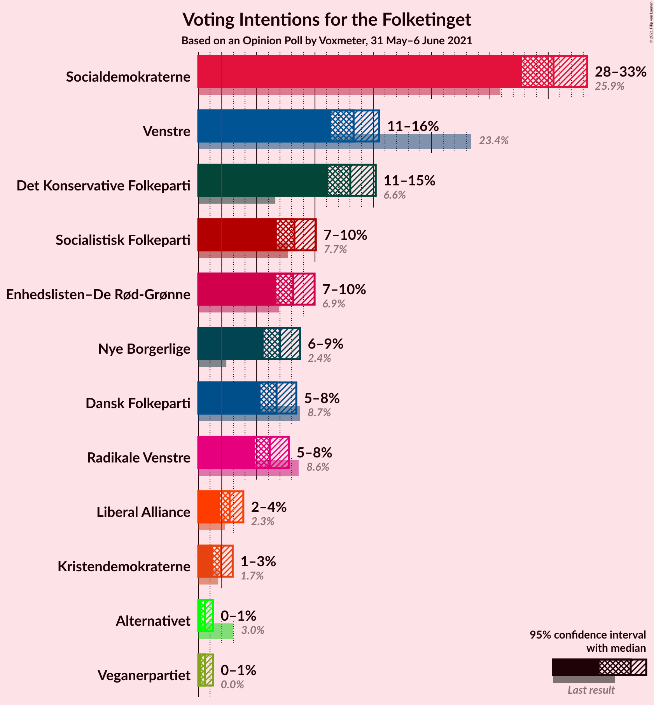

### Confidence Intervals

| Party | Last Result | Poll Result | 80% Confidence Interval | 90% Confidence Interval | 95% Confidence Interval | 99% Confidence Interval |
|:-----:|:-----------:|:-----------:|:-----------------------:|:-----------------------:|:-----------------------:|:-----------------------:|
| Socialdemokraterne | 25.9% | 30.5% | 28.7–32.3% |28.2–32.9% |27.7–33.3% |26.9–34.2% |
| Venstre | 23.4% | 13.3% | 12.0–14.8% |11.7–15.2% |11.4–15.5% |10.8–16.2% |
| Det Konservative Folkeparti | 6.6% | 13.0% | 11.8–14.4% |11.4–14.9% |11.1–15.2% |10.5–15.9% |
| Socialistisk Folkeparti | 7.7% | 8.2% | 7.2–9.4% |7.0–9.8% |6.7–10.1% |6.3–10.7% |
| Enhedslisten–De Rød-Grønne | 6.9% | 8.1% | 7.1–9.3% |6.9–9.7% |6.6–10.0% |6.2–10.6% |
| Nye Borgerlige | 2.4% | 7.0% | 6.1–8.1% |5.8–8.4% |5.6–8.7% |5.2–9.3% |
| Dansk Folkeparti | 8.7% | 6.7% | 5.8–7.8% |5.5–8.1% |5.3–8.4% |4.9–8.9% |
| Radikale Venstre | 8.6% | 6.1% | 5.3–7.2% |5.0–7.5% |4.8–7.8% |4.5–8.3% |
| Liberal Alliance | 2.3% | 2.7% | 2.1–3.4% |2.0–3.7% |1.9–3.9% |1.6–4.3% |
| Kristendemokraterne | 1.7% | 1.9% | 1.5–2.6% |1.3–2.8% |1.2–2.9% |1.1–3.3% |
| Alternativet | 3.0% | 0.6% | 0.4–1.0% |0.3–1.1% |0.3–1.2% |0.2–1.5% |
| Veganerpartiet | 0.0% | 0.6% | 0.4–1.0% |0.3–1.1% |0.3–1.2% |0.2–1.5% |

*Note:* The poll result column reflects the actual value used in the calculations. Published results may vary slightly, and in addition be rounded to fewer digits.

## Seats

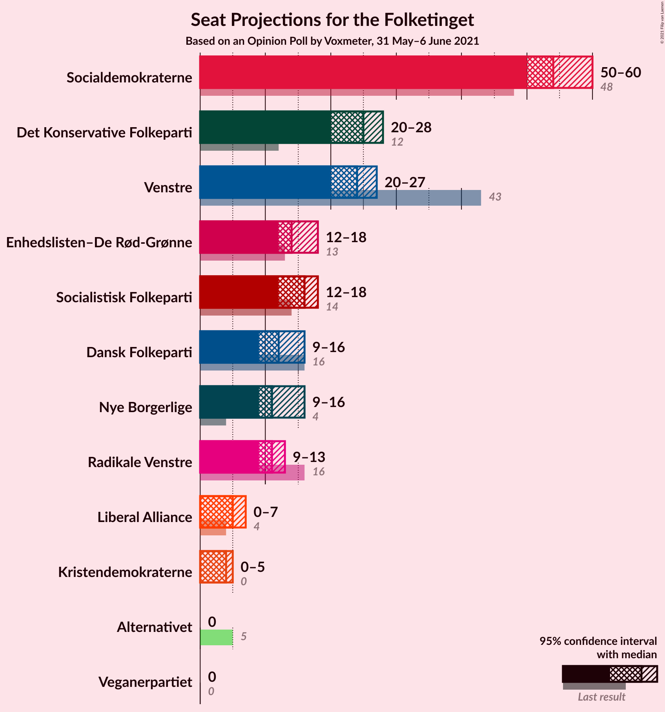

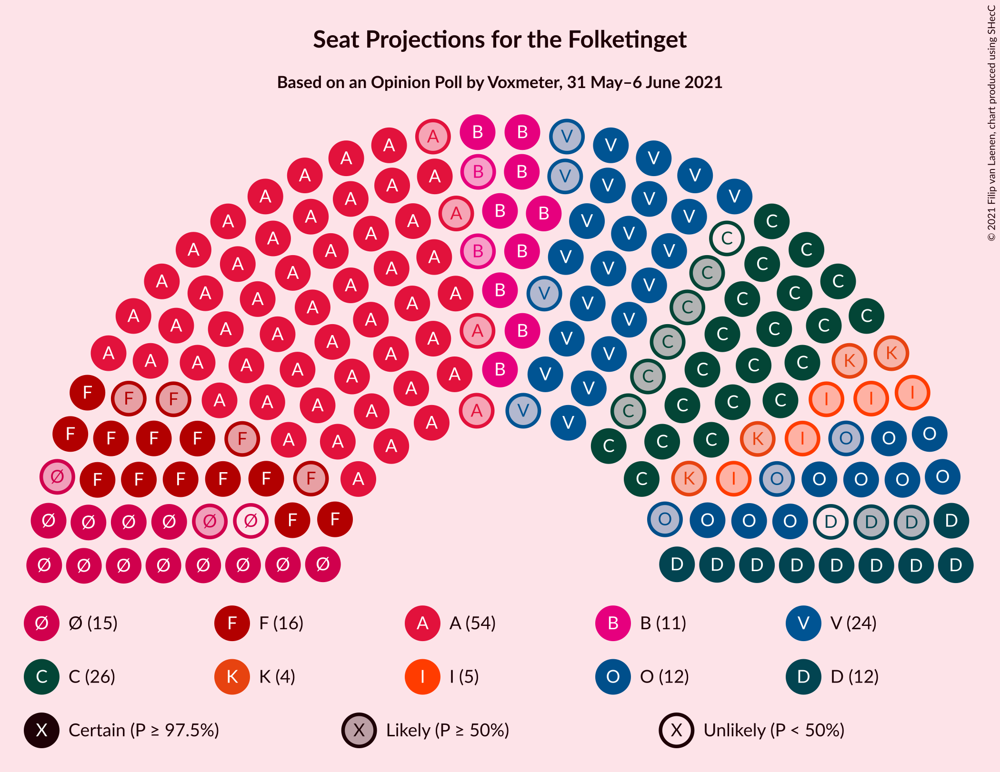

### Confidence Intervals

| Party | Last Result | Median | 80% Confidence Interval | 90% Confidence Interval | 95% Confidence Interval | 99% Confidence Interval |
|:-----:|:-----------:|:------:|:-----------------------:|:-----------------------:|:-----------------------:|:-----------------------:|
| <a href="#socialdemokraterne">Socialdemokraterne</a> | 48 | 54 | 51–58 |50–59 |50–60 |49–62 |
| <a href="#venstre">Venstre</a> | 43 | 24 | 21–26 |20–26 |20–27 |20–28 |
| <a href="#det-konservative-folkeparti">Det Konservative Folkeparti</a> | 12 | 25 | 22–27 |21–28 |20–28 |19–28 |
| <a href="#socialistisk-folkeparti">Socialistisk Folkeparti</a> | 14 | 16 | 13–17 |13–18 |12–18 |11–19 |
| <a href="#enhedslisten–de-rød-grønne">Enhedslisten–De Rød-Grønne</a> | 13 | 14 | 13–17 |13–17 |12–18 |11–19 |
| <a href="#nye-borgerlige">Nye Borgerlige</a> | 4 | 11 | 9–15 |9–16 |9–16 |9–17 |
| <a href="#dansk-folkeparti">Dansk Folkeparti</a> | 16 | 12 | 11–15 |10–16 |9–16 |8–16 |
| <a href="#radikale-venstre">Radikale Venstre</a> | 16 | 11 | 10–13 |9–13 |9–13 |8–15 |
| <a href="#liberal-alliance">Liberal Alliance</a> | 4 | 5 | 4–6 |0–7 |0–7 |0–7 |
| <a href="#kristendemokraterne">Kristendemokraterne</a> | 0 | 4 | 0–5 |0–5 |0–5 |0–6 |
| <a href="#alternativet">Alternativet</a> | 5 | 0 | 0 |0 |0 |0 |
| <a href="#veganerpartiet">Veganerpartiet</a> | 0 | 0 | 0 |0 |0 |0 |

### Socialdemokraterne

*For a full overview of the results for this party, see the [Socialdemokraterne](party-socialdemokraterne.html) page.*

| Number of Seats | Probability | Accumulated | Special Marks |
|:---------------:|:-----------:|:-----------:|:-------------:|
| 46 | 0% | 100% |  |
| 47 | 0.1% | 99.9% |  |
| 48 | 0.1% | 99.8% | Last Result |
| 49 | 0.3% | 99.8% |  |
| 50 | 9% | 99.5% |  |
| 51 | 4% | 91% |  |
| 52 | 6% | 87% |  |
| 53 | 23% | 81% |  |
| 54 | 25% | 58% | Median |
| 55 | 18% | 33% |  |
| 56 | 2% | 15% |  |
| 57 | 2% | 13% |  |
| 58 | 3% | 11% |  |
| 59 | 4% | 9% |  |
| 60 | 2% | 4% |  |
| 61 | 0.8% | 2% |  |
| 62 | 1.1% | 1.2% |  |
| 63 | 0.1% | 0.1% |  |
| 64 | 0% | 0% |  |

### Venstre

*For a full overview of the results for this party, see the [Venstre](party-venstre.html) page.*

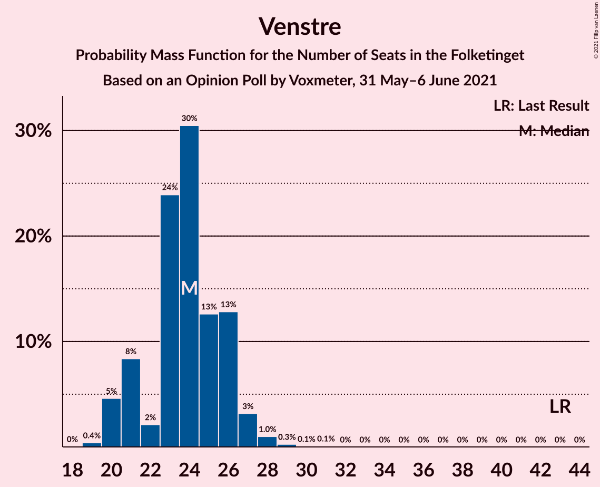

| Number of Seats | Probability | Accumulated | Special Marks |
|:---------------:|:-----------:|:-----------:|:-------------:|
| 19 | 0.4% | 100% |  |
| 20 | 5% | 99.6% |  |
| 21 | 8% | 95% |  |
| 22 | 2% | 87% |  |
| 23 | 24% | 84% |  |
| 24 | 30% | 61% | Median |
| 25 | 13% | 30% |  |
| 26 | 13% | 17% |  |
| 27 | 3% | 5% |  |
| 28 | 1.0% | 1.4% |  |
| 29 | 0.3% | 0.4% |  |
| 30 | 0.1% | 0.2% |  |
| 31 | 0.1% | 0.1% |  |
| 32 | 0% | 0% |  |
| 33 | 0% | 0% |  |
| 34 | 0% | 0% |  |
| 35 | 0% | 0% |  |
| 36 | 0% | 0% |  |
| 37 | 0% | 0% |  |
| 38 | 0% | 0% |  |
| 39 | 0% | 0% |  |
| 40 | 0% | 0% |  |
| 41 | 0% | 0% |  |
| 42 | 0% | 0% |  |
| 43 | 0% | 0% | Last Result |

### Det Konservative Folkeparti

*For a full overview of the results for this party, see the [Det Konservative Folkeparti](party-detkonservativefolkeparti.html) page.*

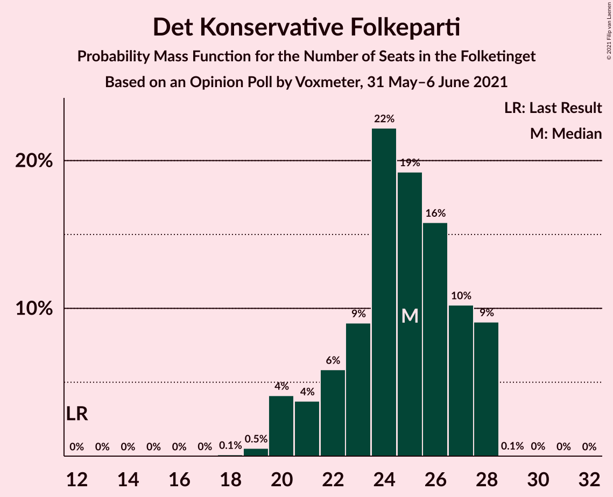

| Number of Seats | Probability | Accumulated | Special Marks |
|:---------------:|:-----------:|:-----------:|:-------------:|
| 12 | 0% | 100% | Last Result |
| 13 | 0% | 100% |  |
| 14 | 0% | 100% |  |
| 15 | 0% | 100% |  |
| 16 | 0% | 100% |  |
| 17 | 0% | 100% |  |
| 18 | 0.1% | 100% |  |
| 19 | 0.5% | 99.9% |  |
| 20 | 4% | 99.4% |  |
| 21 | 4% | 95% |  |
| 22 | 6% | 92% |  |
| 23 | 9% | 86% |  |
| 24 | 22% | 77% |  |
| 25 | 19% | 54% | Median |
| 26 | 16% | 35% |  |
| 27 | 10% | 19% |  |
| 28 | 9% | 9% |  |
| 29 | 0.1% | 0.1% |  |
| 30 | 0% | 0.1% |  |
| 31 | 0% | 0% |  |

### Socialistisk Folkeparti

*For a full overview of the results for this party, see the [Socialistisk Folkeparti](party-socialistiskfolkeparti.html) page.*

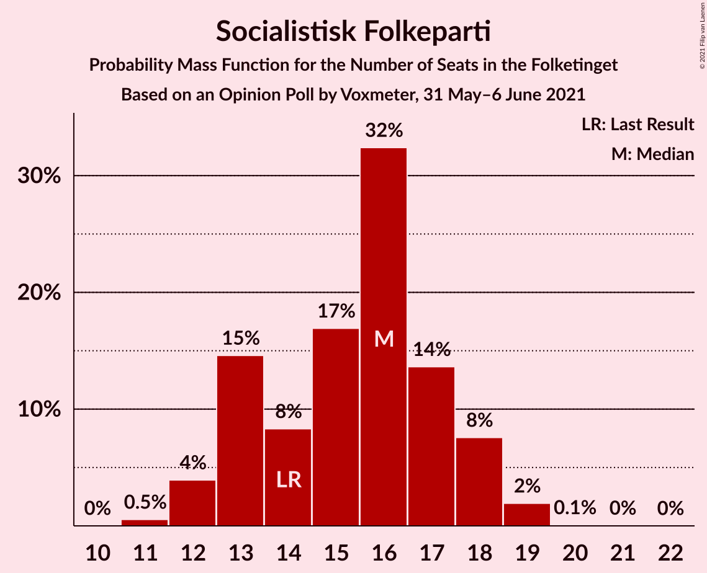

| Number of Seats | Probability | Accumulated | Special Marks |
|:---------------:|:-----------:|:-----------:|:-------------:|
| 11 | 0.5% | 100% |  |
| 12 | 4% | 99.4% |  |
| 13 | 15% | 95% |  |
| 14 | 8% | 81% | Last Result |
| 15 | 17% | 73% |  |
| 16 | 32% | 56% | Median |
| 17 | 14% | 23% |  |
| 18 | 8% | 10% |  |
| 19 | 2% | 2% |  |
| 20 | 0.1% | 0.1% |  |
| 21 | 0% | 0.1% |  |
| 22 | 0% | 0% |  |

### Enhedslisten–De Rød-Grønne

*For a full overview of the results for this party, see the [Enhedslisten–De Rød-Grønne](party-enhedslisten–derød-grønne.html) page.*

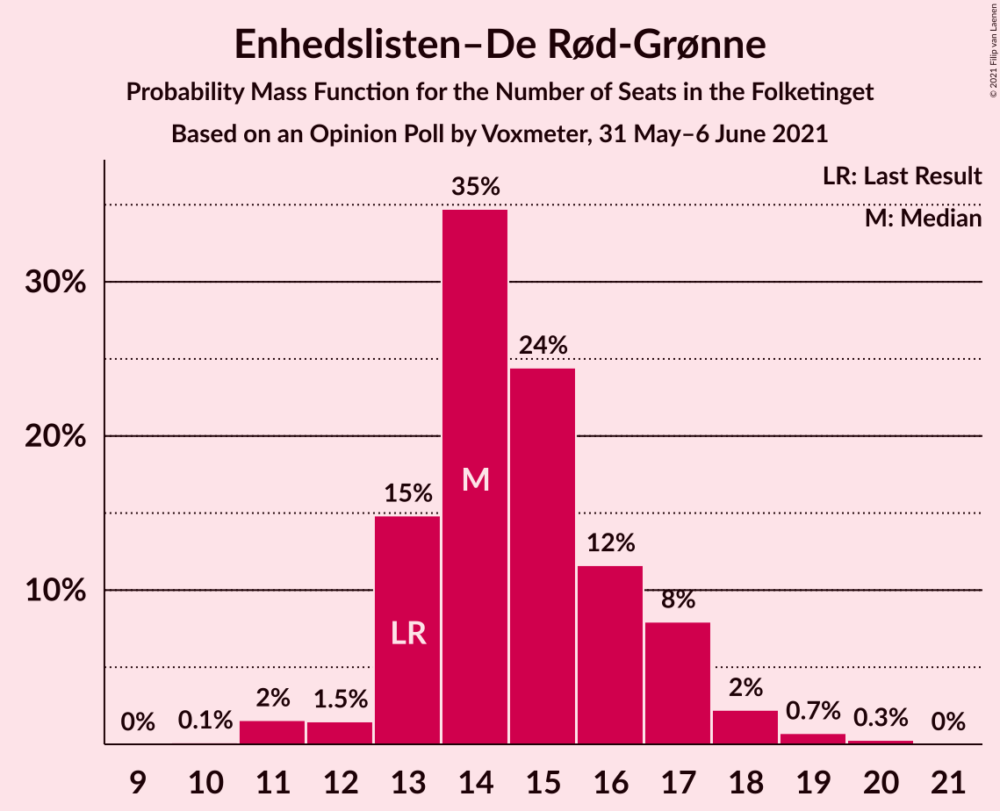

| Number of Seats | Probability | Accumulated | Special Marks |
|:---------------:|:-----------:|:-----------:|:-------------:|
| 10 | 0.1% | 100% |  |
| 11 | 2% | 99.9% |  |
| 12 | 1.5% | 98% |  |
| 13 | 15% | 97% | Last Result |
| 14 | 35% | 82% | Median |
| 15 | 24% | 47% |  |
| 16 | 12% | 23% |  |
| 17 | 8% | 11% |  |
| 18 | 2% | 3% |  |
| 19 | 0.7% | 1.0% |  |
| 20 | 0.3% | 0.3% |  |
| 21 | 0% | 0% |  |

### Nye Borgerlige

*For a full overview of the results for this party, see the [Nye Borgerlige](party-nyeborgerlige.html) page.*

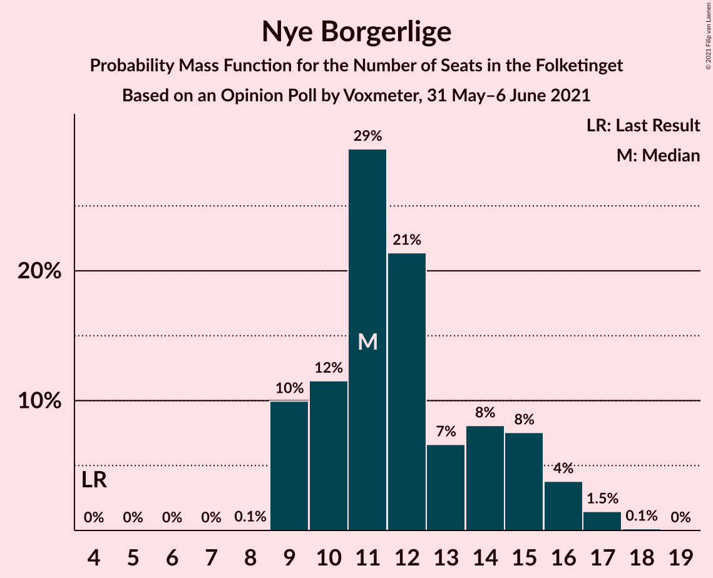

| Number of Seats | Probability | Accumulated | Special Marks |
|:---------------:|:-----------:|:-----------:|:-------------:|
| 4 | 0% | 100% | Last Result |
| 5 | 0% | 100% |  |
| 6 | 0% | 100% |  |
| 7 | 0% | 100% |  |
| 8 | 0.1% | 100% |  |
| 9 | 10% | 99.9% |  |
| 10 | 12% | 90% |  |
| 11 | 29% | 78% | Median |
| 12 | 21% | 49% |  |
| 13 | 7% | 28% |  |
| 14 | 8% | 21% |  |
| 15 | 8% | 13% |  |
| 16 | 4% | 5% |  |
| 17 | 1.5% | 2% |  |
| 18 | 0.1% | 0.1% |  |
| 19 | 0% | 0% |  |

### Dansk Folkeparti

*For a full overview of the results for this party, see the [Dansk Folkeparti](party-danskfolkeparti.html) page.*

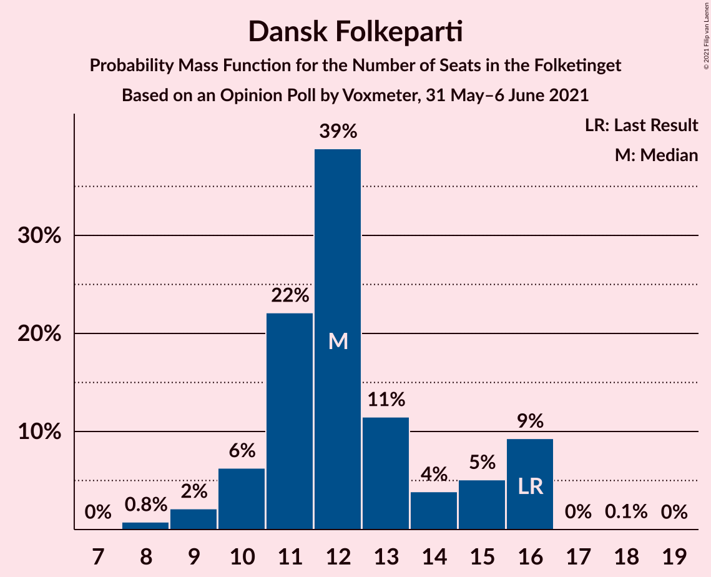

| Number of Seats | Probability | Accumulated | Special Marks |
|:---------------:|:-----------:|:-----------:|:-------------:|
| 8 | 0.8% | 100% |  |
| 9 | 2% | 99.2% |  |
| 10 | 6% | 97% |  |
| 11 | 22% | 91% |  |
| 12 | 39% | 69% | Median |
| 13 | 11% | 30% |  |
| 14 | 4% | 18% |  |
| 15 | 5% | 14% |  |
| 16 | 9% | 9% | Last Result |
| 17 | 0% | 0.1% |  |
| 18 | 0.1% | 0.1% |  |
| 19 | 0% | 0% |  |

### Radikale Venstre

*For a full overview of the results for this party, see the [Radikale Venstre](party-radikalevenstre.html) page.*

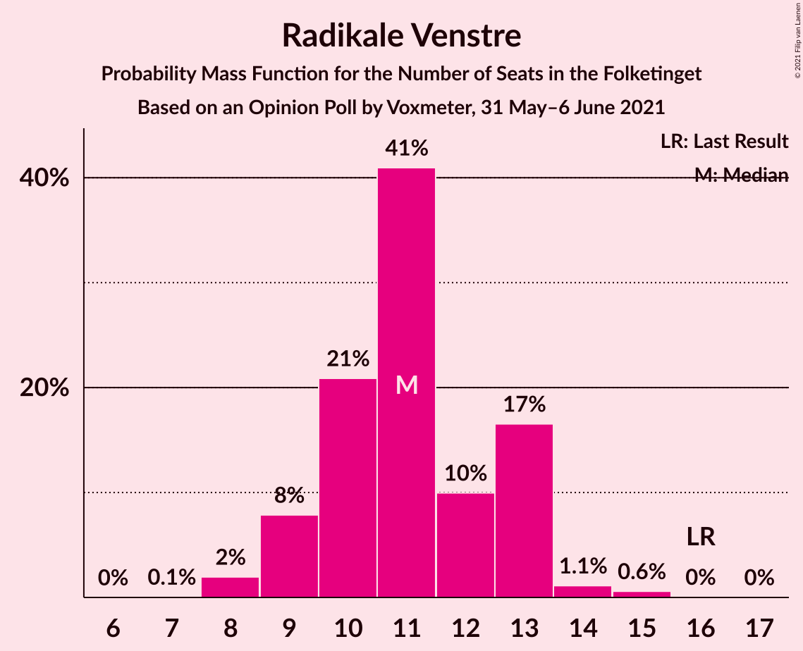

| Number of Seats | Probability | Accumulated | Special Marks |
|:---------------:|:-----------:|:-----------:|:-------------:|
| 7 | 0.1% | 100% |  |
| 8 | 2% | 99.9% |  |
| 9 | 8% | 98% |  |
| 10 | 21% | 90% |  |
| 11 | 41% | 69% | Median |
| 12 | 10% | 28% |  |
| 13 | 17% | 18% |  |
| 14 | 1.1% | 2% |  |
| 15 | 0.6% | 0.7% |  |
| 16 | 0% | 0.1% | Last Result |
| 17 | 0% | 0% |  |

### Liberal Alliance

*For a full overview of the results for this party, see the [Liberal Alliance](party-liberalalliance.html) page.*

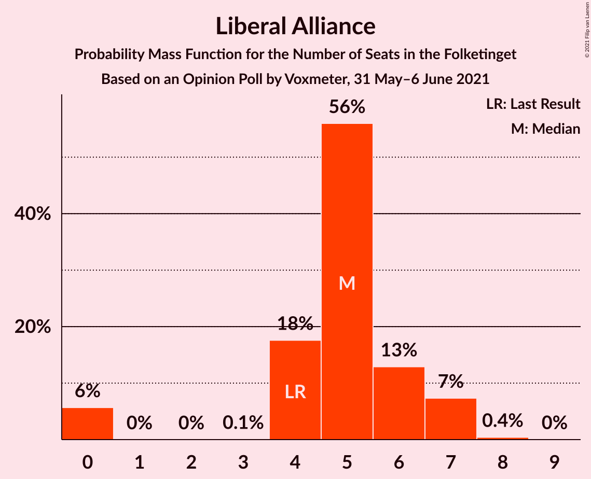

| Number of Seats | Probability | Accumulated | Special Marks |
|:---------------:|:-----------:|:-----------:|:-------------:|
| 0 | 6% | 100% |  |
| 1 | 0% | 94% |  |
| 2 | 0% | 94% |  |
| 3 | 0.1% | 94% |  |
| 4 | 18% | 94% | Last Result |
| 5 | 56% | 77% | Median |
| 6 | 13% | 21% |  |
| 7 | 7% | 8% |  |
| 8 | 0.4% | 0.4% |  |
| 9 | 0% | 0% |  |

### Kristendemokraterne

*For a full overview of the results for this party, see the [Kristendemokraterne](party-kristendemokraterne.html) page.*

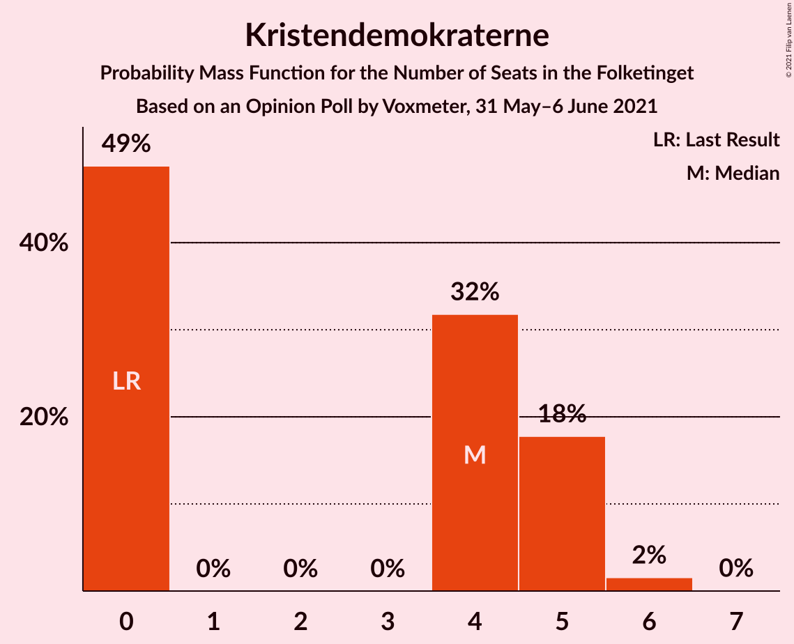

| Number of Seats | Probability | Accumulated | Special Marks |
|:---------------:|:-----------:|:-----------:|:-------------:|
| 0 | 49% | 100% | Last Result |
| 1 | 0% | 51% |  |
| 2 | 0% | 51% |  |
| 3 | 0% | 51% |  |
| 4 | 32% | 51% | Median |
| 5 | 18% | 19% |  |
| 6 | 2% | 2% |  |
| 7 | 0% | 0% |  |

### Alternativet

*For a full overview of the results for this party, see the [Alternativet](party-alternativet.html) page.*

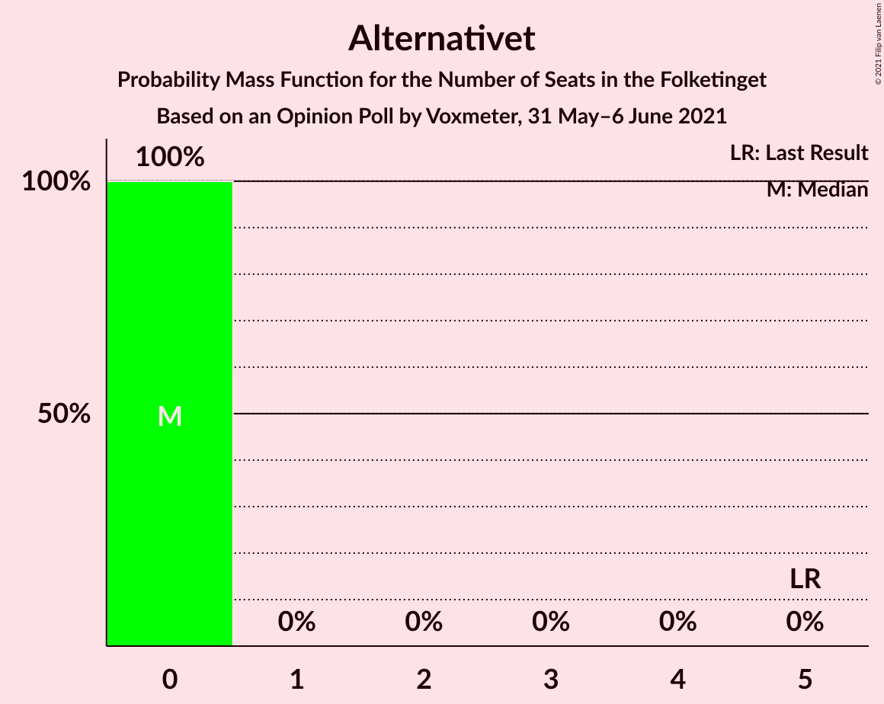

| Number of Seats | Probability | Accumulated | Special Marks |
|:---------------:|:-----------:|:-----------:|:-------------:|
| 0 | 100% | 100% | Median |
| 1 | 0% | 0% |  |
| 2 | 0% | 0% |  |
| 3 | 0% | 0% |  |
| 4 | 0% | 0% |  |
| 5 | 0% | 0% | Last Result |

### Veganerpartiet

*For a full overview of the results for this party, see the [Veganerpartiet](party-veganerpartiet.html) page.*

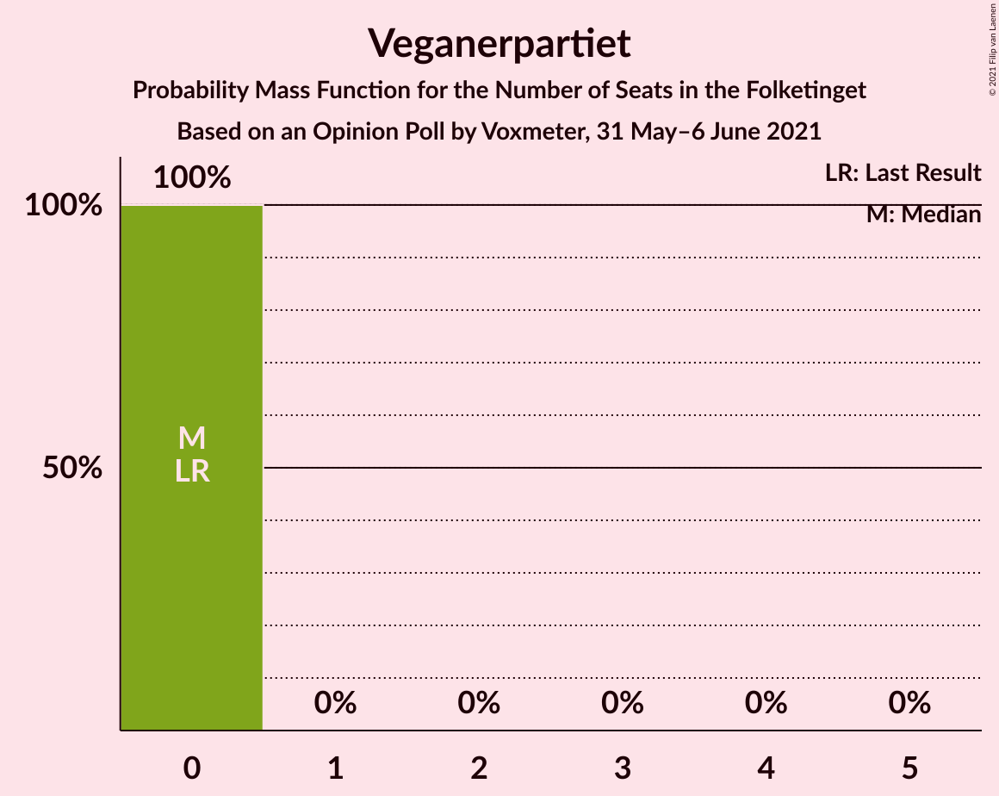

| Number of Seats | Probability | Accumulated | Special Marks |
|:---------------:|:-----------:|:-----------:|:-------------:|
| 0 | 100% | 100% | Last Result, Median |

## Coalitions

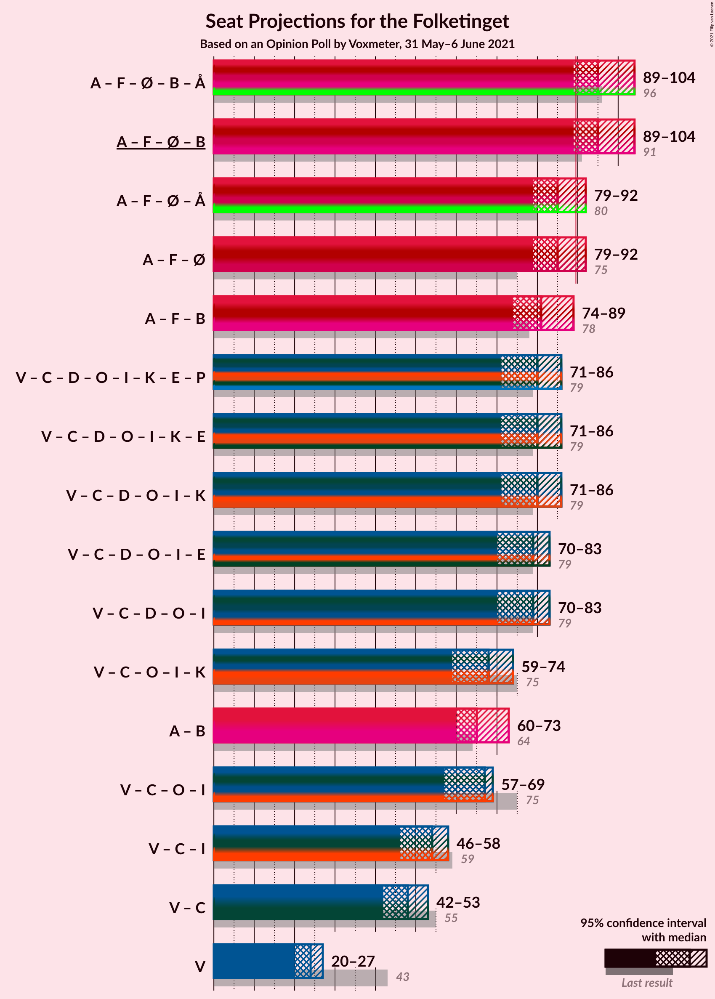

### Confidence Intervals

| Coalition | Last Result | Median | Majority? | 80% Confidence Interval | 90% Confidence Interval | 95% Confidence Interval | 99% Confidence Interval |
|:---------:|:-----------:|:------:|:---------:|:-----------------------:|:-----------------------:|:-----------------------:|:-----------------------:|
| Socialdemokraterne – Socialistisk Folkeparti – Enhedslisten–De Rød-Grønne – Radikale Venstre – Alternativet | 96 | 95 | 96% | 90–98 | 90–100 | 89–104 | 87–105 |
| Socialdemokraterne – Socialistisk Folkeparti – Enhedslisten–De Rød-Grønne – Radikale Venstre | 91 | 95 | 96% | 90–98 | 90–100 | 89–104 | 87–105 |
| Socialdemokraterne – Socialistisk Folkeparti – Enhedslisten–De Rød-Grønne – Alternativet | 80 | 85 | 5% | 79–87 | 79–89 | 79–92 | 77–92 |
| Socialdemokraterne – Socialistisk Folkeparti – Enhedslisten–De Rød-Grønne | 75 | 85 | 5% | 79–87 | 79–89 | 79–92 | 77–92 |
| Socialdemokraterne – Socialistisk Folkeparti – Radikale Venstre | 78 | 81 | 2% | 75–84 | 74–85 | 74–89 | 74–91 |
| Venstre – Det Konservative Folkeparti – Nye Borgerlige – Dansk Folkeparti – Liberal Alliance – Kristendemokraterne | 79 | 80 | 0% | 77–85 | 74–85 | 71–86 | 70–88 |
| Venstre – Det Konservative Folkeparti – Nye Borgerlige – Dansk Folkeparti – Liberal Alliance | 79 | 79 | 0% | 73–80 | 72–82 | 70–83 | 69–86 |
| Venstre – Det Konservative Folkeparti – Dansk Folkeparti – Liberal Alliance – Kristendemokraterne | 75 | 68 | 0% | 62–73 | 61–74 | 59–74 | 58–76 |
| Socialdemokraterne – Radikale Venstre | 64 | 65 | 0% | 61–68 | 61–70 | 60–73 | 60–73 |
| Venstre – Det Konservative Folkeparti – Dansk Folkeparti – Liberal Alliance | 75 | 67 | 0% | 61–69 | 58–69 | 57–69 | 57–72 |
| Venstre – Det Konservative Folkeparti – Liberal Alliance | 59 | 54 | 0% | 49–56 | 47–56 | 46–58 | 46–60 |
| Venstre – Det Konservative Folkeparti | 55 | 48 | 0% | 45–52 | 43–52 | 42–53 | 41–54 |
| Venstre | 43 | 24 | 0% | 21–26 | 20–26 | 20–27 | 20–28 |

### Socialdemokraterne – Socialistisk Folkeparti – Enhedslisten–De Rød-Grønne – Radikale Venstre – Alternativet

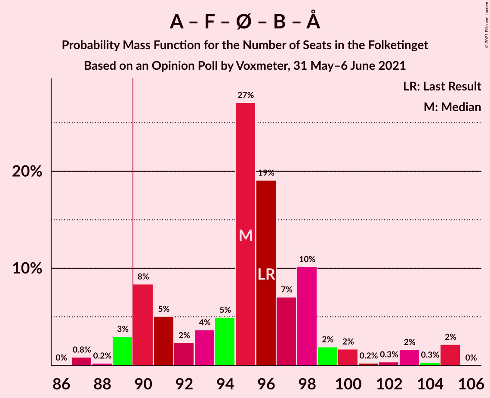

| Number of Seats | Probability | Accumulated | Special Marks |
|:---------------:|:-----------:|:-----------:|:-------------:|
| 86 | 0% | 100% |  |
| 87 | 0.8% | 99.9% |  |
| 88 | 0.2% | 99.1% |  |
| 89 | 3% | 98.9% |  |
| 90 | 8% | 96% | Majority |
| 91 | 5% | 88% |  |
| 92 | 2% | 83% |  |
| 93 | 4% | 80% |  |
| 94 | 5% | 77% |  |
| 95 | 27% | 72% | Median |
| 96 | 19% | 45% | Last Result |
| 97 | 7% | 25% |  |
| 98 | 10% | 18% |  |
| 99 | 2% | 8% |  |
| 100 | 2% | 6% |  |
| 101 | 0.2% | 5% |  |
| 102 | 0.3% | 4% |  |
| 103 | 2% | 4% |  |
| 104 | 0.3% | 3% |  |
| 105 | 2% | 2% |  |
| 106 | 0% | 0% |  |

### Socialdemokraterne – Socialistisk Folkeparti – Enhedslisten–De Rød-Grønne – Radikale Venstre

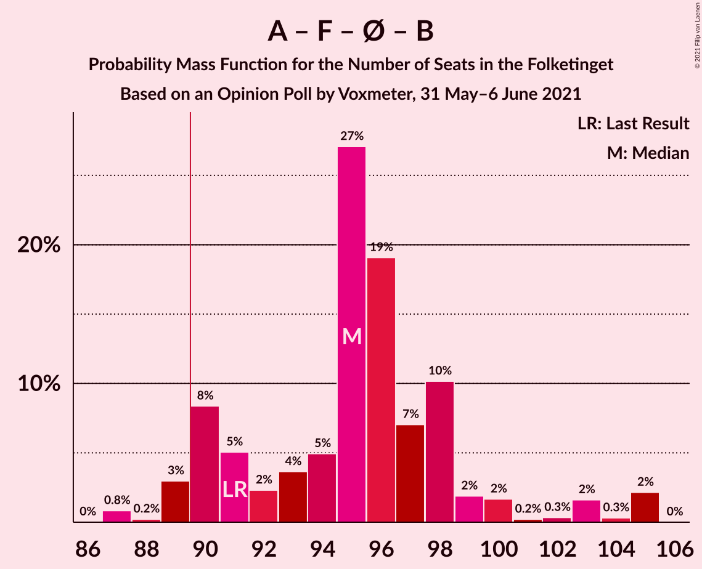

| Number of Seats | Probability | Accumulated | Special Marks |
|:---------------:|:-----------:|:-----------:|:-------------:|
| 86 | 0% | 100% |  |
| 87 | 0.8% | 99.9% |  |
| 88 | 0.2% | 99.1% |  |
| 89 | 3% | 98.9% |  |
| 90 | 8% | 96% | Majority |
| 91 | 5% | 88% | Last Result |
| 92 | 2% | 82% |  |
| 93 | 4% | 80% |  |
| 94 | 5% | 77% |  |
| 95 | 27% | 72% | Median |
| 96 | 19% | 45% |  |
| 97 | 7% | 25% |  |
| 98 | 10% | 18% |  |
| 99 | 2% | 8% |  |
| 100 | 2% | 6% |  |
| 101 | 0.2% | 5% |  |
| 102 | 0.3% | 4% |  |
| 103 | 2% | 4% |  |
| 104 | 0.3% | 3% |  |
| 105 | 2% | 2% |  |
| 106 | 0% | 0% |  |

### Socialdemokraterne – Socialistisk Folkeparti – Enhedslisten–De Rød-Grønne – Alternativet

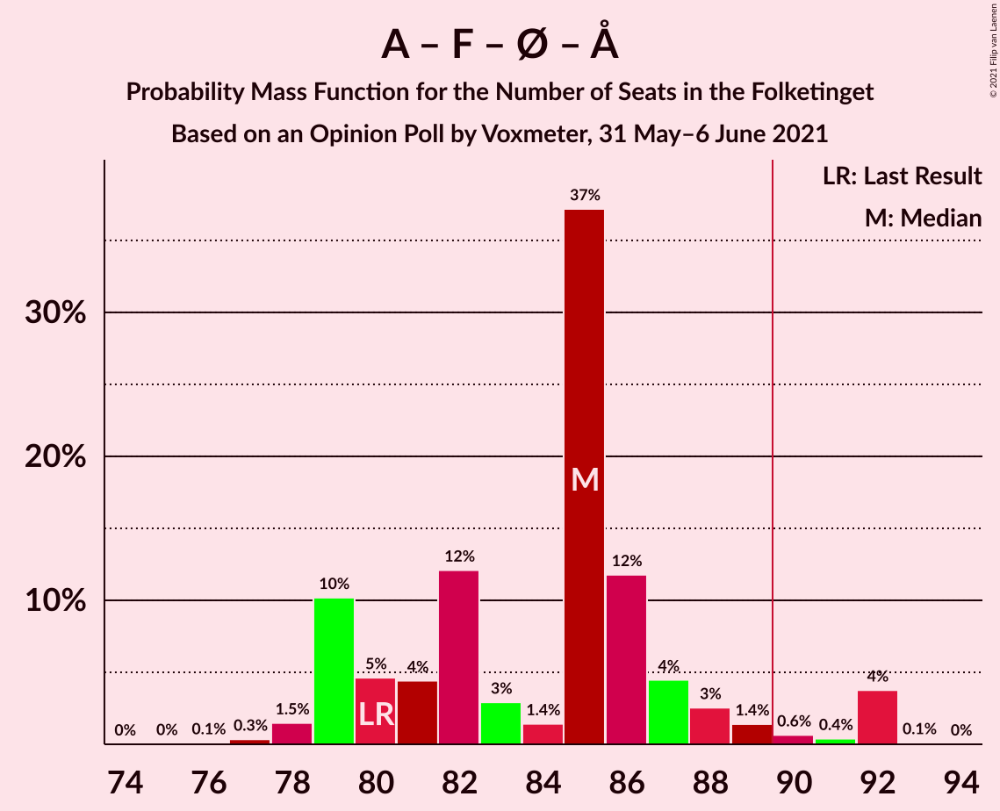

| Number of Seats | Probability | Accumulated | Special Marks |
|:---------------:|:-----------:|:-----------:|:-------------:|
| 75 | 0% | 100% |  |
| 76 | 0.1% | 99.9% |  |
| 77 | 0.3% | 99.8% |  |
| 78 | 1.5% | 99.5% |  |
| 79 | 10% | 98% |  |
| 80 | 5% | 88% | Last Result |
| 81 | 4% | 83% |  |
| 82 | 12% | 79% |  |
| 83 | 3% | 67% |  |
| 84 | 1.4% | 64% | Median |
| 85 | 37% | 62% |  |
| 86 | 12% | 25% |  |
| 87 | 4% | 13% |  |
| 88 | 3% | 9% |  |
| 89 | 1.4% | 6% |  |
| 90 | 0.6% | 5% | Majority |
| 91 | 0.4% | 4% |  |
| 92 | 4% | 4% |  |
| 93 | 0.1% | 0.1% |  |
| 94 | 0% | 0% |  |

### Socialdemokraterne – Socialistisk Folkeparti – Enhedslisten–De Rød-Grønne

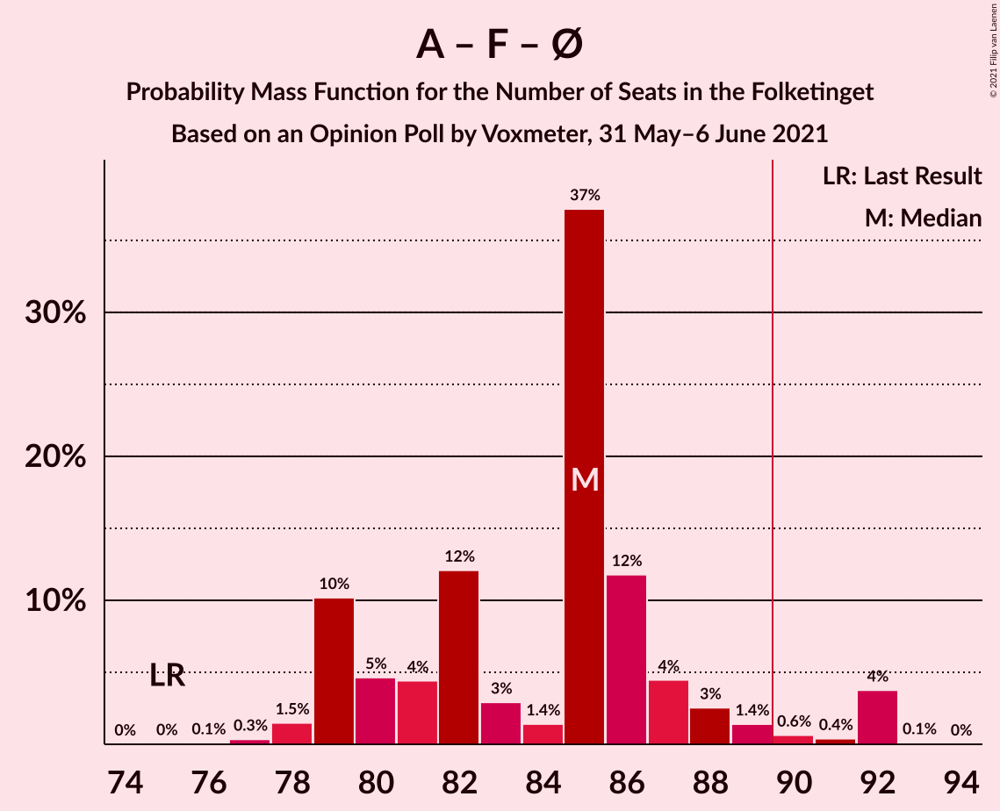

| Number of Seats | Probability | Accumulated | Special Marks |
|:---------------:|:-----------:|:-----------:|:-------------:|
| 75 | 0% | 100% | Last Result |
| 76 | 0.1% | 99.9% |  |
| 77 | 0.3% | 99.8% |  |
| 78 | 1.5% | 99.5% |  |
| 79 | 10% | 98% |  |
| 80 | 5% | 88% |  |
| 81 | 4% | 83% |  |
| 82 | 12% | 79% |  |
| 83 | 3% | 67% |  |
| 84 | 1.4% | 64% | Median |
| 85 | 37% | 62% |  |
| 86 | 12% | 25% |  |
| 87 | 4% | 13% |  |
| 88 | 3% | 9% |  |
| 89 | 1.4% | 6% |  |
| 90 | 0.6% | 5% | Majority |
| 91 | 0.4% | 4% |  |
| 92 | 4% | 4% |  |
| 93 | 0.1% | 0.1% |  |
| 94 | 0% | 0% |  |

### Socialdemokraterne – Socialistisk Folkeparti – Radikale Venstre

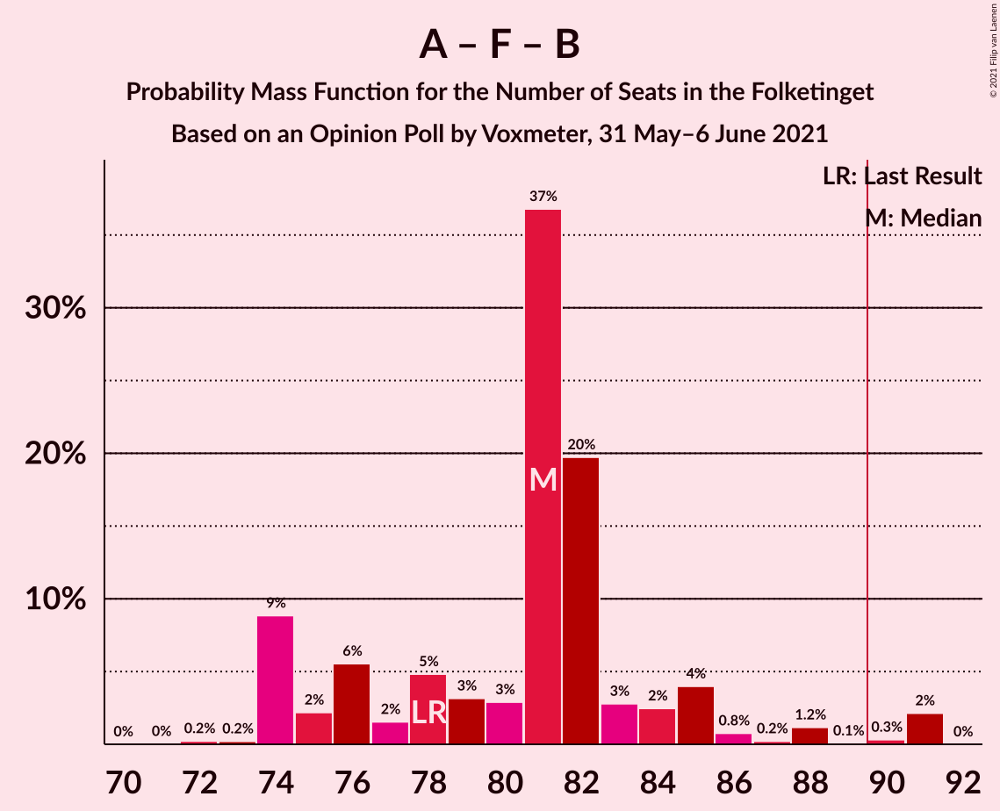

| Number of Seats | Probability | Accumulated | Special Marks |
|:---------------:|:-----------:|:-----------:|:-------------:|
| 72 | 0.2% | 100% |  |
| 73 | 0.2% | 99.7% |  |
| 74 | 9% | 99.5% |  |
| 75 | 2% | 91% |  |
| 76 | 6% | 88% |  |
| 77 | 2% | 83% |  |
| 78 | 5% | 81% | Last Result |
| 79 | 3% | 77% |  |
| 80 | 3% | 73% |  |
| 81 | 37% | 70% | Median |
| 82 | 20% | 34% |  |
| 83 | 3% | 14% |  |
| 84 | 2% | 11% |  |
| 85 | 4% | 9% |  |
| 86 | 0.8% | 5% |  |
| 87 | 0.2% | 4% |  |
| 88 | 1.2% | 4% |  |
| 89 | 0.1% | 3% |  |
| 90 | 0.3% | 2% | Majority |
| 91 | 2% | 2% |  |
| 92 | 0% | 0% |  |

### Venstre – Det Konservative Folkeparti – Nye Borgerlige – Dansk Folkeparti – Liberal Alliance – Kristendemokraterne

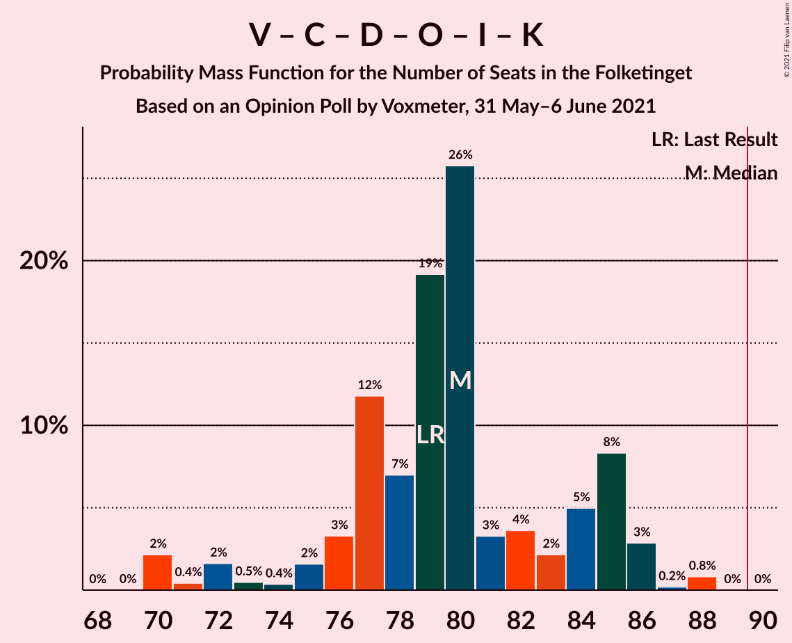

| Number of Seats | Probability | Accumulated | Special Marks |
|:---------------:|:-----------:|:-----------:|:-------------:|
| 70 | 2% | 100% |  |
| 71 | 0.4% | 98% |  |
| 72 | 2% | 97% |  |
| 73 | 0.5% | 96% |  |
| 74 | 0.4% | 95% |  |
| 75 | 2% | 95% |  |
| 76 | 3% | 93% |  |
| 77 | 12% | 90% |  |
| 78 | 7% | 78% |  |
| 79 | 19% | 71% | Last Result |
| 80 | 26% | 52% |  |
| 81 | 3% | 26% | Median |
| 82 | 4% | 23% |  |
| 83 | 2% | 19% |  |
| 84 | 5% | 17% |  |
| 85 | 8% | 12% |  |
| 86 | 3% | 4% |  |
| 87 | 0.2% | 1.0% |  |
| 88 | 0.8% | 0.8% |  |
| 89 | 0% | 0% |  |

### Venstre – Det Konservative Folkeparti – Nye Borgerlige – Dansk Folkeparti – Liberal Alliance

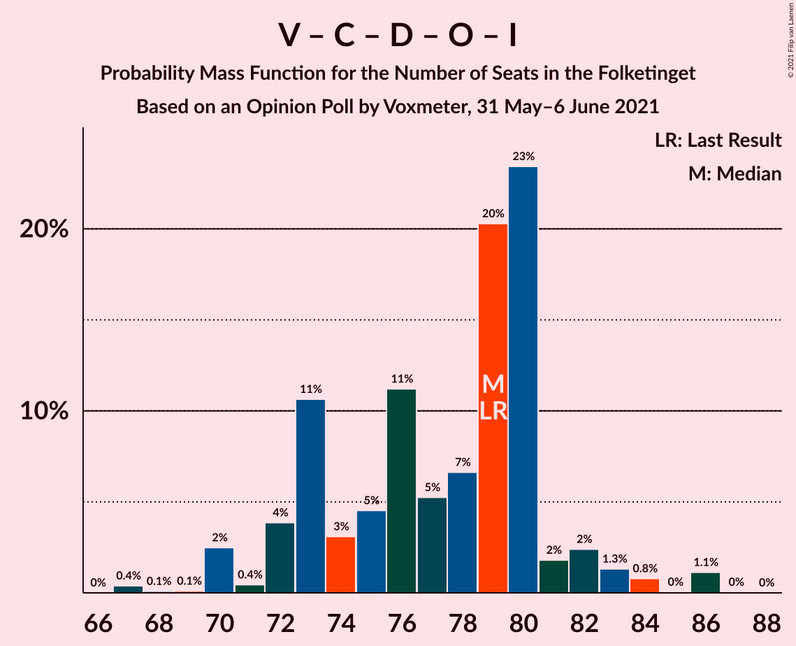

| Number of Seats | Probability | Accumulated | Special Marks |
|:---------------:|:-----------:|:-----------:|:-------------:|
| 67 | 0.4% | 100% |  |
| 68 | 0.1% | 99.6% |  |
| 69 | 0.1% | 99.5% |  |
| 70 | 2% | 99.4% |  |
| 71 | 0.4% | 97% |  |
| 72 | 4% | 96% |  |
| 73 | 11% | 93% |  |
| 74 | 3% | 82% |  |
| 75 | 5% | 79% |  |
| 76 | 11% | 74% |  |
| 77 | 5% | 63% | Median |
| 78 | 7% | 58% |  |
| 79 | 20% | 51% | Last Result |
| 80 | 23% | 31% |  |
| 81 | 2% | 8% |  |
| 82 | 2% | 6% |  |
| 83 | 1.3% | 3% |  |
| 84 | 0.8% | 2% |  |
| 85 | 0% | 1.2% |  |
| 86 | 1.1% | 1.2% |  |
| 87 | 0% | 0.1% |  |
| 88 | 0% | 0% |  |

### Venstre – Det Konservative Folkeparti – Dansk Folkeparti – Liberal Alliance – Kristendemokraterne

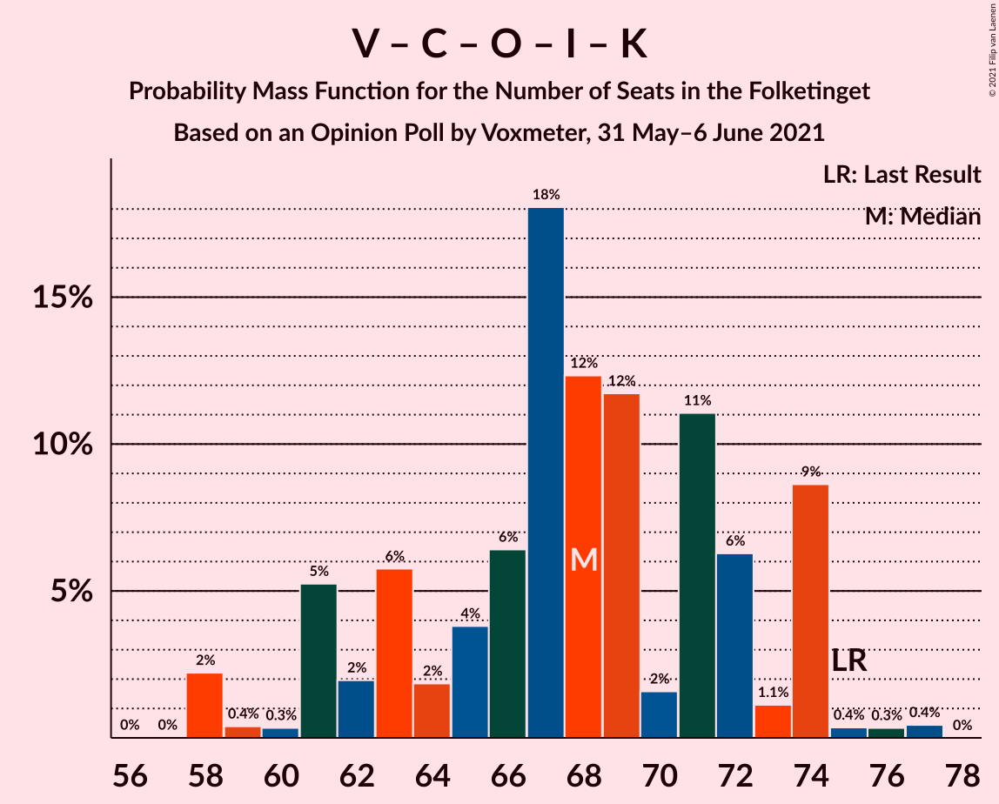

| Number of Seats | Probability | Accumulated | Special Marks |
|:---------------:|:-----------:|:-----------:|:-------------:|
| 57 | 0% | 100% |  |
| 58 | 2% | 99.9% |  |
| 59 | 0.4% | 98% |  |
| 60 | 0.3% | 97% |  |
| 61 | 5% | 97% |  |
| 62 | 2% | 92% |  |
| 63 | 6% | 90% |  |
| 64 | 2% | 84% |  |
| 65 | 4% | 82% |  |
| 66 | 6% | 78% |  |
| 67 | 18% | 72% |  |
| 68 | 12% | 54% |  |
| 69 | 12% | 42% |  |
| 70 | 2% | 30% | Median |
| 71 | 11% | 28% |  |
| 72 | 6% | 17% |  |
| 73 | 1.1% | 11% |  |
| 74 | 9% | 10% |  |
| 75 | 0.4% | 1.1% | Last Result |
| 76 | 0.3% | 0.8% |  |
| 77 | 0.4% | 0.4% |  |
| 78 | 0% | 0% |  |

### Socialdemokraterne – Radikale Venstre

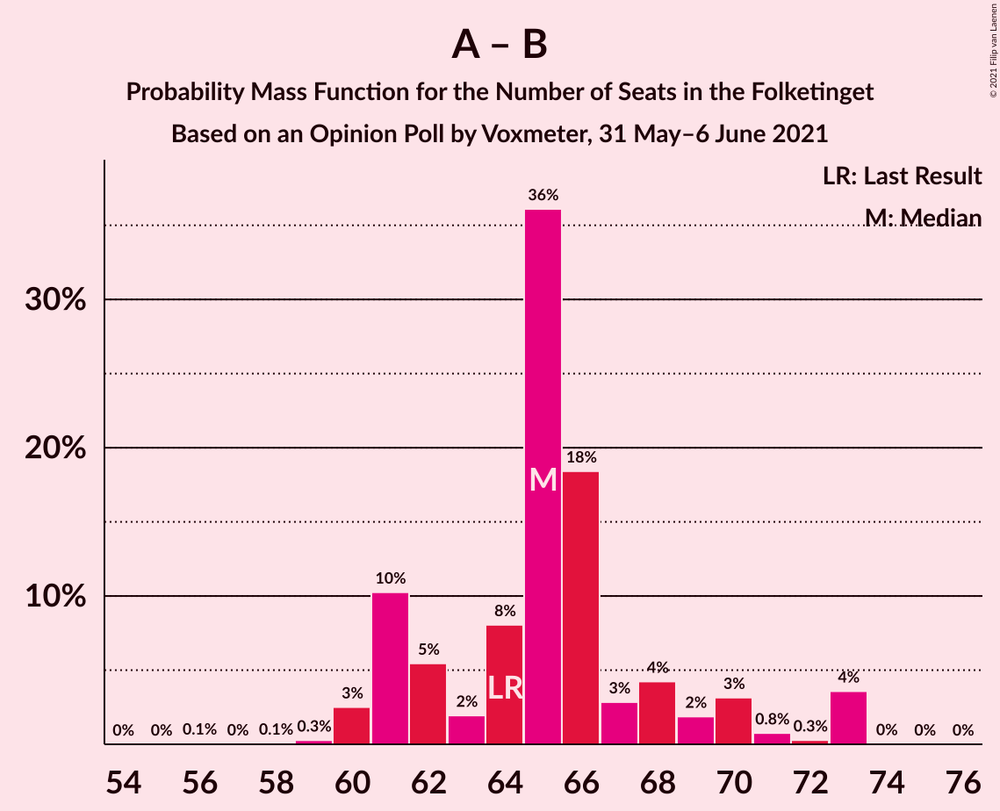

| Number of Seats | Probability | Accumulated | Special Marks |
|:---------------:|:-----------:|:-----------:|:-------------:|
| 56 | 0.1% | 100% |  |
| 57 | 0% | 99.9% |  |
| 58 | 0.1% | 99.9% |  |
| 59 | 0.3% | 99.8% |  |
| 60 | 3% | 99.6% |  |
| 61 | 10% | 97% |  |
| 62 | 5% | 87% |  |
| 63 | 2% | 81% |  |
| 64 | 8% | 79% | Last Result |
| 65 | 36% | 71% | Median |
| 66 | 18% | 35% |  |
| 67 | 3% | 17% |  |
| 68 | 4% | 14% |  |
| 69 | 2% | 10% |  |
| 70 | 3% | 8% |  |
| 71 | 0.8% | 5% |  |
| 72 | 0.3% | 4% |  |
| 73 | 4% | 4% |  |
| 74 | 0% | 0.1% |  |
| 75 | 0% | 0% |  |

### Venstre – Det Konservative Folkeparti – Dansk Folkeparti – Liberal Alliance

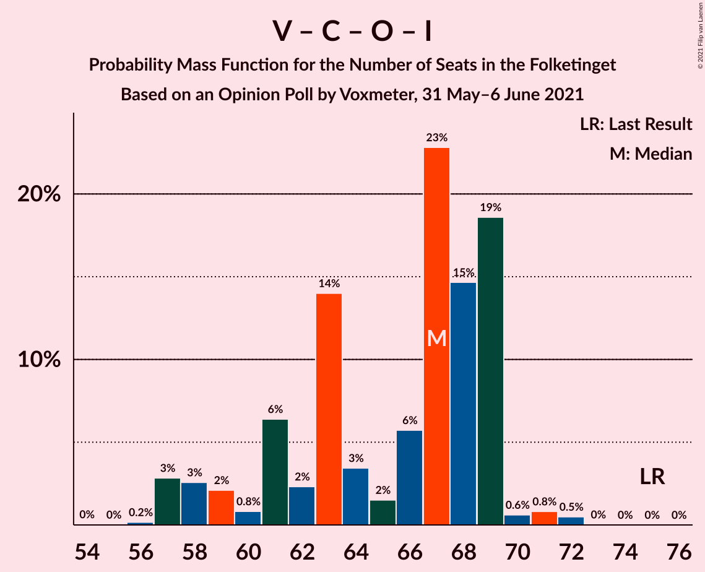

| Number of Seats | Probability | Accumulated | Special Marks |
|:---------------:|:-----------:|:-----------:|:-------------:|
| 54 | 0% | 100% |  |
| 55 | 0% | 99.9% |  |
| 56 | 0.2% | 99.9% |  |
| 57 | 3% | 99.8% |  |
| 58 | 3% | 97% |  |
| 59 | 2% | 94% |  |
| 60 | 0.8% | 92% |  |
| 61 | 6% | 91% |  |
| 62 | 2% | 85% |  |
| 63 | 14% | 83% |  |
| 64 | 3% | 69% |  |
| 65 | 2% | 65% |  |
| 66 | 6% | 64% | Median |
| 67 | 23% | 58% |  |
| 68 | 15% | 35% |  |
| 69 | 19% | 21% |  |
| 70 | 0.6% | 2% |  |
| 71 | 0.8% | 1.4% |  |
| 72 | 0.5% | 0.5% |  |
| 73 | 0% | 0% |  |
| 74 | 0% | 0% |  |
| 75 | 0% | 0% | Last Result |

### Venstre – Det Konservative Folkeparti – Liberal Alliance

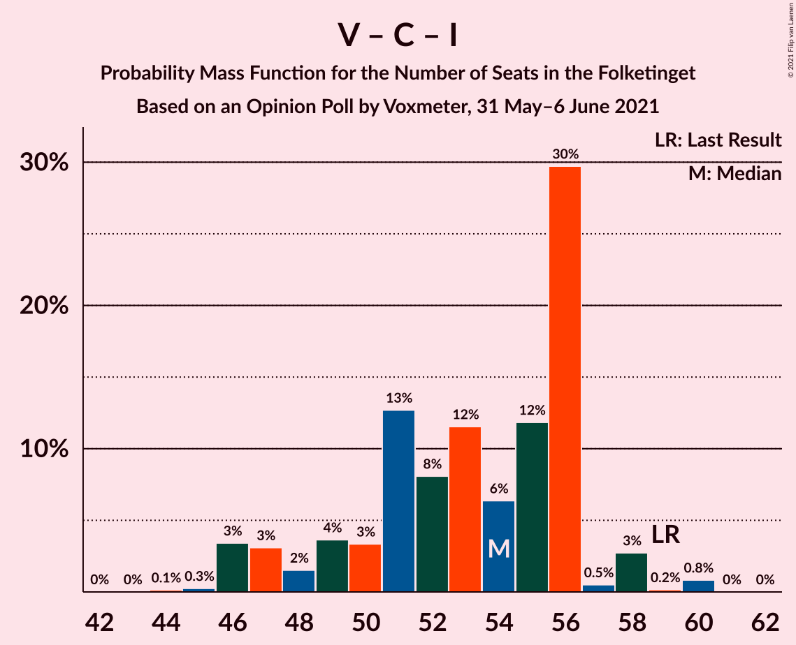

| Number of Seats | Probability | Accumulated | Special Marks |
|:---------------:|:-----------:|:-----------:|:-------------:|
| 43 | 0% | 100% |  |
| 44 | 0.1% | 99.9% |  |
| 45 | 0.3% | 99.8% |  |
| 46 | 3% | 99.5% |  |
| 47 | 3% | 96% |  |
| 48 | 2% | 93% |  |
| 49 | 4% | 92% |  |
| 50 | 3% | 88% |  |
| 51 | 13% | 85% |  |
| 52 | 8% | 72% |  |
| 53 | 12% | 64% |  |
| 54 | 6% | 52% | Median |
| 55 | 12% | 46% |  |
| 56 | 30% | 34% |  |
| 57 | 0.5% | 4% |  |
| 58 | 3% | 4% |  |
| 59 | 0.2% | 1.0% | Last Result |
| 60 | 0.8% | 0.9% |  |
| 61 | 0% | 0% |  |

### Venstre – Det Konservative Folkeparti

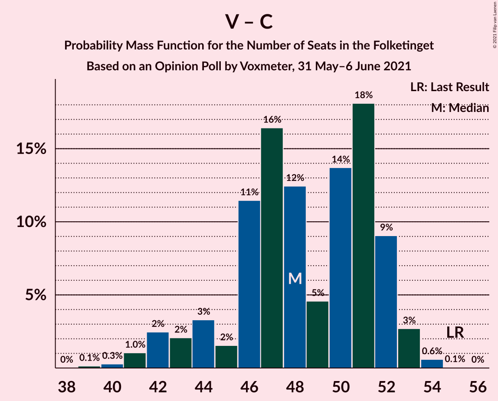

| Number of Seats | Probability | Accumulated | Special Marks |
|:---------------:|:-----------:|:-----------:|:-------------:|
| 39 | 0.1% | 100% |  |
| 40 | 0.3% | 99.8% |  |
| 41 | 1.0% | 99.6% |  |
| 42 | 2% | 98.5% |  |
| 43 | 2% | 96% |  |
| 44 | 3% | 94% |  |
| 45 | 2% | 91% |  |
| 46 | 11% | 89% |  |
| 47 | 16% | 78% |  |
| 48 | 12% | 61% |  |
| 49 | 5% | 49% | Median |
| 50 | 14% | 44% |  |
| 51 | 18% | 31% |  |
| 52 | 9% | 12% |  |
| 53 | 3% | 3% |  |
| 54 | 0.6% | 0.7% |  |
| 55 | 0.1% | 0.1% | Last Result |
| 56 | 0% | 0% |  |

### Venstre

| Number of Seats | Probability | Accumulated | Special Marks |
|:---------------:|:-----------:|:-----------:|:-------------:|
| 19 | 0.4% | 100% |  |
| 20 | 5% | 99.6% |  |
| 21 | 8% | 95% |  |
| 22 | 2% | 87% |  |
| 23 | 24% | 84% |  |
| 24 | 30% | 61% | Median |
| 25 | 13% | 30% |  |
| 26 | 13% | 17% |  |
| 27 | 3% | 5% |  |
| 28 | 1.0% | 1.4% |  |
| 29 | 0.3% | 0.4% |  |
| 30 | 0.1% | 0.2% |  |
| 31 | 0.1% | 0.1% |  |
| 32 | 0% | 0% |  |
| 33 | 0% | 0% |  |
| 34 | 0% | 0% |  |
| 35 | 0% | 0% |  |
| 36 | 0% | 0% |  |
| 37 | 0% | 0% |  |
| 38 | 0% | 0% |  |
| 39 | 0% | 0% |  |
| 40 | 0% | 0% |  |
| 41 | 0% | 0% |  |
| 42 | 0% | 0% |  |
| 43 | 0% | 0% | Last Result |

## Technical Information

### Opinion Poll

+ **Polling firm:** Voxmeter
+ **Commissioner(s):** —
+ **Fieldwork period:** 31 May–6 June 2021

### Calculations

+ **Sample size:** 1044
+ **Simulations done:** 1,048,576
+ **Error estimate:** 1.31%

