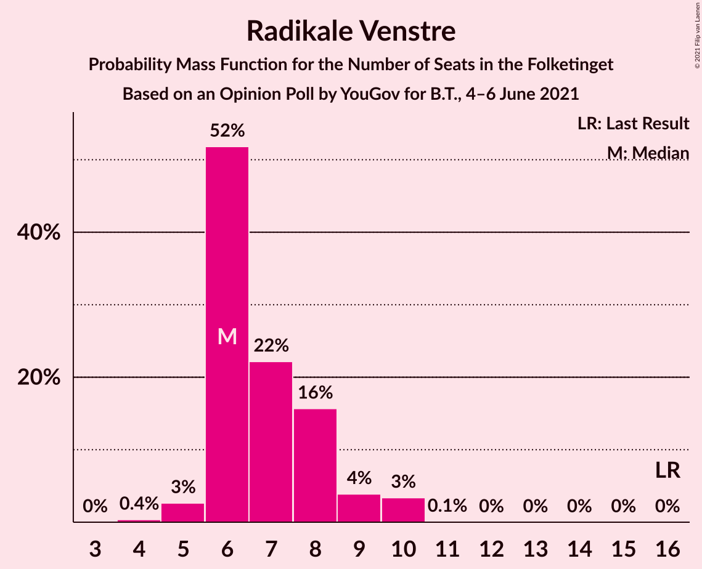

# Opinion Poll by YouGov for B.T., 4–6 June 2021

<a href="#voting-intentions">Voting Intentions</a> | <a href="#seats">Seats</a> | <a href="#coalitions">Coalitions</a> | <a href="#technical-information">Technical Information</a>

## Voting Intentions

### Confidence Intervals

| Party | Last Result | Poll Result | 80% Confidence Interval | 90% Confidence Interval | 95% Confidence Interval | 99% Confidence Interval |
|:-----:|:-----------:|:-----------:|:-----------------------:|:-----------------------:|:-----------------------:|:-----------------------:|
| Socialdemokraterne | 25.9% | 33.3% | 31.6–35.0% |31.1–35.5% |30.7–35.9% |29.9–36.7% |
| Det Konservative Folkeparti | 6.6% | 14.0% | 12.8–15.3% |12.5–15.7% |12.2–16.0% |11.7–16.7% |
| Venstre | 23.4% | 11.6% | 10.5–12.8% |10.2–13.1% |9.9–13.4% |9.4–14.1% |
| Nye Borgerlige | 2.4% | 8.8% | 7.8–9.9% |7.6–10.2% |7.3–10.5% |6.9–11.0% |
| Socialistisk Folkeparti | 7.7% | 8.1% | 7.2–9.1% |6.9–9.4% |6.7–9.7% |6.3–10.3% |
| Enhedslisten–De Rød-Grønne | 6.9% | 8.0% | 7.1–9.1% |6.8–9.4% |6.6–9.6% |6.2–10.2% |
| Dansk Folkeparti | 8.7% | 7.3% | 6.4–8.3% |6.2–8.6% |6.0–8.9% |5.6–9.4% |
| Radikale Venstre | 8.6% | 3.9% | 3.3–4.7% |3.1–4.9% |2.9–5.1% |2.7–5.5% |
| Liberal Alliance | 2.3% | 2.6% | 2.1–3.3% |2.0–3.5% |1.9–3.7% |1.6–4.0% |
| Kristendemokraterne | 1.7% | 1.2% | 0.9–1.7% |0.8–1.8% |0.7–2.0% |0.6–2.2% |
| Alternativet | 3.0% | 0.7% | 0.5–1.1% |0.4–1.2% |0.4–1.4% |0.3–1.6% |
| Veganerpartiet | 0.0% | 0.6% | 0.4–1.0% |0.4–1.1% |0.3–1.2% |0.2–1.5% |

*Note:* The poll result column reflects the actual value used in the calculations. Published results may vary slightly, and in addition be rounded to fewer digits.

## Seats

### Confidence Intervals

| Party | Last Result | Median | 80% Confidence Interval | 90% Confidence Interval | 95% Confidence Interval | 99% Confidence Interval |
|:-----:|:-----------:|:------:|:-----------------------:|:-----------------------:|:-----------------------:|:-----------------------:|
| <a href="#socialdemokraterne">Socialdemokraterne</a> | 48 | 60 | 57–65 |57–66 |56–66 |54–67 |
| <a href="#det-konservative-folkeparti">Det Konservative Folkeparti</a> | 12 | 27 | 24–28 |22–28 |21–28 |20–33 |
| <a href="#venstre">Venstre</a> | 43 | 21 | 19–24 |18–24 |18–25 |16–26 |
| <a href="#nye-borgerlige">Nye Borgerlige</a> | 4 | 16 | 14–17 |14–17 |13–19 |13–19 |
| <a href="#socialistisk-folkeparti">Socialistisk Folkeparti</a> | 14 | 14 | 12–16 |12–18 |11–19 |11–19 |
| <a href="#enhedslisten–de-rød-grønne">Enhedslisten–De Rød-Grønne</a> | 13 | 14 | 11–15 |11–16 |11–16 |11–18 |
| <a href="#dansk-folkeparti">Dansk Folkeparti</a> | 16 | 13 | 11–14 |10–15 |10–15 |9–16 |
| <a href="#radikale-venstre">Radikale Venstre</a> | 16 | 6 | 6–8 |6–9 |5–10 |5–10 |
| <a href="#liberal-alliance">Liberal Alliance</a> | 4 | 5 | 0–6 |0–7 |0–7 |0–7 |
| <a href="#kristendemokraterne">Kristendemokraterne</a> | 0 | 0 | 0 |0 |0 |0–4 |
| <a href="#alternativet">Alternativet</a> | 5 | 0 | 0 |0 |0 |0 |
| <a href="#veganerpartiet">Veganerpartiet</a> | 0 | 0 | 0 |0 |0 |0 |

### Socialdemokraterne

*For a full overview of the results for this party, see the [Socialdemokraterne](party-socialdemokraterne.html) page.*

| Number of Seats | Probability | Accumulated | Special Marks |
|:---------------:|:-----------:|:-----------:|:-------------:|
| 48 | 0% | 100% | Last Result |
| 49 | 0% | 100% |  |
| 50 | 0% | 100% |  |
| 51 | 0.1% | 100% |  |
| 52 | 0.1% | 99.9% |  |
| 53 | 0.1% | 99.7% |  |
| 54 | 0.6% | 99.6% |  |
| 55 | 0.7% | 99.1% |  |
| 56 | 0.9% | 98% |  |
| 57 | 23% | 97% |  |
| 58 | 10% | 75% |  |
| 59 | 12% | 65% |  |
| 60 | 19% | 53% | Median |
| 61 | 2% | 34% |  |
| 62 | 14% | 32% |  |
| 63 | 7% | 18% |  |
| 64 | 0.7% | 11% |  |
| 65 | 0.3% | 10% |  |
| 66 | 9% | 10% |  |
| 67 | 0.5% | 0.6% |  |
| 68 | 0% | 0% |  |

### Det Konservative Folkeparti

*For a full overview of the results for this party, see the [Det Konservative Folkeparti](party-detkonservativefolkeparti.html) page.*

| Number of Seats | Probability | Accumulated | Special Marks |
|:---------------:|:-----------:|:-----------:|:-------------:|
| 12 | 0% | 100% | Last Result |
| 13 | 0% | 100% |  |
| 14 | 0% | 100% |  |
| 15 | 0% | 100% |  |
| 16 | 0% | 100% |  |
| 17 | 0% | 100% |  |
| 18 | 0% | 100% |  |
| 19 | 0% | 100% |  |
| 20 | 2% | 100% |  |
| 21 | 0.4% | 98% |  |
| 22 | 3% | 97% |  |
| 23 | 1.1% | 94% |  |
| 24 | 8% | 93% |  |
| 25 | 13% | 85% |  |
| 26 | 7% | 72% |  |
| 27 | 45% | 65% | Median |
| 28 | 18% | 20% |  |
| 29 | 0.1% | 2% |  |
| 30 | 0.5% | 2% |  |
| 31 | 0.1% | 2% |  |
| 32 | 0.5% | 1.5% |  |
| 33 | 1.0% | 1.0% |  |
| 34 | 0% | 0% |  |

### Venstre

*For a full overview of the results for this party, see the [Venstre](party-venstre.html) page.*

| Number of Seats | Probability | Accumulated | Special Marks |
|:---------------:|:-----------:|:-----------:|:-------------:|
| 16 | 1.2% | 100% |  |
| 17 | 0.4% | 98.8% |  |
| 18 | 3% | 98% |  |
| 19 | 16% | 95% |  |
| 20 | 24% | 79% |  |
| 21 | 19% | 55% | Median |
| 22 | 15% | 37% |  |
| 23 | 7% | 22% |  |
| 24 | 12% | 15% |  |
| 25 | 3% | 3% |  |
| 26 | 0.5% | 0.5% |  |
| 27 | 0.1% | 0.1% |  |
| 28 | 0% | 0% |  |
| 29 | 0% | 0% |  |
| 30 | 0% | 0% |  |
| 31 | 0% | 0% |  |
| 32 | 0% | 0% |  |
| 33 | 0% | 0% |  |
| 34 | 0% | 0% |  |
| 35 | 0% | 0% |  |
| 36 | 0% | 0% |  |
| 37 | 0% | 0% |  |
| 38 | 0% | 0% |  |
| 39 | 0% | 0% |  |
| 40 | 0% | 0% |  |
| 41 | 0% | 0% |  |
| 42 | 0% | 0% |  |
| 43 | 0% | 0% | Last Result |

### Nye Borgerlige

*For a full overview of the results for this party, see the [Nye Borgerlige](party-nyeborgerlige.html) page.*

| Number of Seats | Probability | Accumulated | Special Marks |
|:---------------:|:-----------:|:-----------:|:-------------:|
| 4 | 0% | 100% | Last Result |
| 5 | 0% | 100% |  |
| 6 | 0% | 100% |  |
| 7 | 0% | 100% |  |
| 8 | 0% | 100% |  |
| 9 | 0% | 100% |  |
| 10 | 0% | 100% |  |
| 11 | 0.1% | 100% |  |
| 12 | 0.3% | 99.9% |  |
| 13 | 4% | 99.7% |  |
| 14 | 23% | 96% |  |
| 15 | 7% | 73% |  |
| 16 | 35% | 66% | Median |
| 17 | 26% | 31% |  |
| 18 | 0.5% | 5% |  |
| 19 | 4% | 4% |  |
| 20 | 0.2% | 0.4% |  |
| 21 | 0.3% | 0.3% |  |
| 22 | 0% | 0% |  |

### Socialistisk Folkeparti

*For a full overview of the results for this party, see the [Socialistisk Folkeparti](party-socialistiskfolkeparti.html) page.*

| Number of Seats | Probability | Accumulated | Special Marks |
|:---------------:|:-----------:|:-----------:|:-------------:|
| 10 | 0.2% | 100% |  |
| 11 | 3% | 99.8% |  |
| 12 | 14% | 96% |  |
| 13 | 25% | 83% |  |
| 14 | 15% | 57% | Last Result, Median |
| 15 | 7% | 42% |  |
| 16 | 28% | 35% |  |
| 17 | 1.2% | 7% |  |
| 18 | 3% | 6% |  |
| 19 | 2% | 3% |  |
| 20 | 0% | 0% |  |

### Enhedslisten–De Rød-Grønne

*For a full overview of the results for this party, see the [Enhedslisten–De Rød-Grønne](party-enhedslisten–derød-grønne.html) page.*

| Number of Seats | Probability | Accumulated | Special Marks |
|:---------------:|:-----------:|:-----------:|:-------------:|
| 10 | 0.1% | 100% |  |
| 11 | 18% | 99.9% |  |
| 12 | 2% | 82% |  |
| 13 | 15% | 80% | Last Result |
| 14 | 28% | 65% | Median |
| 15 | 28% | 37% |  |
| 16 | 7% | 9% |  |
| 17 | 2% | 2% |  |
| 18 | 0.2% | 0.7% |  |
| 19 | 0.3% | 0.4% |  |
| 20 | 0.1% | 0.1% |  |
| 21 | 0% | 0% |  |

### Dansk Folkeparti

*For a full overview of the results for this party, see the [Dansk Folkeparti](party-danskfolkeparti.html) page.*

| Number of Seats | Probability | Accumulated | Special Marks |
|:---------------:|:-----------:|:-----------:|:-------------:|
| 9 | 0.8% | 100% |  |
| 10 | 5% | 99.2% |  |
| 11 | 13% | 94% |  |
| 12 | 16% | 81% |  |
| 13 | 32% | 65% | Median |
| 14 | 27% | 33% |  |
| 15 | 5% | 6% |  |
| 16 | 0.6% | 1.0% | Last Result |
| 17 | 0.2% | 0.4% |  |
| 18 | 0.2% | 0.2% |  |
| 19 | 0% | 0% |  |

### Radikale Venstre

*For a full overview of the results for this party, see the [Radikale Venstre](party-radikalevenstre.html) page.*

| Number of Seats | Probability | Accumulated | Special Marks |
|:---------------:|:-----------:|:-----------:|:-------------:|
| 4 | 0.4% | 100% |  |
| 5 | 3% | 99.6% |  |
| 6 | 52% | 97% | Median |
| 7 | 22% | 45% |  |
| 8 | 16% | 23% |  |
| 9 | 4% | 7% |  |
| 10 | 3% | 3% |  |
| 11 | 0.1% | 0.1% |  |
| 12 | 0% | 0% |  |
| 13 | 0% | 0% |  |
| 14 | 0% | 0% |  |
| 15 | 0% | 0% |  |
| 16 | 0% | 0% | Last Result |

### Liberal Alliance

*For a full overview of the results for this party, see the [Liberal Alliance](party-liberalalliance.html) page.*

| Number of Seats | Probability | Accumulated | Special Marks |
|:---------------:|:-----------:|:-----------:|:-------------:|
| 0 | 17% | 100% |  |
| 1 | 0% | 83% |  |
| 2 | 0% | 83% |  |
| 3 | 0% | 83% |  |
| 4 | 12% | 83% | Last Result |
| 5 | 61% | 71% | Median |
| 6 | 5% | 10% |  |
| 7 | 5% | 5% |  |
| 8 | 0.3% | 0.3% |  |
| 9 | 0% | 0% |  |

### Kristendemokraterne

*For a full overview of the results for this party, see the [Kristendemokraterne](party-kristendemokraterne.html) page.*

| Number of Seats | Probability | Accumulated | Special Marks |
|:---------------:|:-----------:|:-----------:|:-------------:|
| 0 | 98.5% | 100% | Last Result, Median |
| 1 | 0% | 1.5% |  |
| 2 | 0% | 1.5% |  |
| 3 | 0% | 1.5% |  |
| 4 | 1.4% | 1.5% |  |
| 5 | 0% | 0% |  |

### Alternativet

*For a full overview of the results for this party, see the [Alternativet](party-alternativet.html) page.*

| Number of Seats | Probability | Accumulated | Special Marks |
|:---------------:|:-----------:|:-----------:|:-------------:|
| 0 | 100% | 100% | Median |
| 1 | 0% | 0% |  |
| 2 | 0% | 0% |  |
| 3 | 0% | 0% |  |
| 4 | 0% | 0% |  |
| 5 | 0% | 0% | Last Result |

### Veganerpartiet

*For a full overview of the results for this party, see the [Veganerpartiet](party-veganerpartiet.html) page.*

| Number of Seats | Probability | Accumulated | Special Marks |
|:---------------:|:-----------:|:-----------:|:-------------:|
| 0 | 100% | 100% | Last Result, Median |

## Coalitions

### Confidence Intervals

| Coalition | Last Result | Median | Majority? | 80% Confidence Interval | 90% Confidence Interval | 95% Confidence Interval | 99% Confidence Interval |
|:---------:|:-----------:|:------:|:---------:|:-----------------------:|:-----------------------:|:-----------------------:|:-----------------------:|
| Socialdemokraterne – Socialistisk Folkeparti – Enhedslisten–De Rød-Grønne – Radikale Venstre – Alternativet | 96 | 93 | 99.7% | 92–102 | 92–103 | 92–103 | 90–104 |
| Socialdemokraterne – Socialistisk Folkeparti – Enhedslisten–De Rød-Grønne – Radikale Venstre | 91 | 93 | 99.7% | 92–102 | 92–103 | 92–103 | 90–104 |
| Socialdemokraterne – Socialistisk Folkeparti – Enhedslisten–De Rød-Grønne – Alternativet | 80 | 87 | 21% | 86–94 | 84–95 | 84–95 | 83–96 |
| Socialdemokraterne – Socialistisk Folkeparti – Enhedslisten–De Rød-Grønne | 75 | 87 | 21% | 86–94 | 84–95 | 84–95 | 83–96 |
| Socialdemokraterne – Socialistisk Folkeparti – Radikale Venstre | 78 | 81 | 0.1% | 77–88 | 77–88 | 77–88 | 76–89 |
| Det Konservative Folkeparti – Venstre – Nye Borgerlige – Dansk Folkeparti – Liberal Alliance – Kristendemokraterne | 79 | 82 | 0% | 73–83 | 72–83 | 72–83 | 71–85 |
| Det Konservative Folkeparti – Venstre – Nye Borgerlige – Dansk Folkeparti – Liberal Alliance | 79 | 82 | 0% | 73–83 | 72–83 | 72–83 | 71–84 |
| Socialdemokraterne – Radikale Venstre | 64 | 67 | 0% | 63–73 | 63–74 | 63–74 | 60–75 |
| Det Konservative Folkeparti – Venstre – Dansk Folkeparti – Liberal Alliance – Kristendemokraterne | 75 | 66 | 0% | 59–69 | 57–69 | 56–69 | 56–69 |
| Det Konservative Folkeparti – Venstre – Dansk Folkeparti – Liberal Alliance | 75 | 66 | 0% | 59–69 | 57–69 | 56–69 | 56–69 |
| Det Konservative Folkeparti – Venstre – Liberal Alliance | 59 | 52 | 0% | 48–56 | 46–56 | 44–56 | 44–56 |
| Det Konservative Folkeparti – Venstre | 55 | 47 | 0% | 43–51 | 43–51 | 41–51 | 39–54 |
| Venstre | 43 | 21 | 0% | 19–24 | 18–24 | 18–25 | 16–26 |

### Socialdemokraterne – Socialistisk Folkeparti – Enhedslisten–De Rød-Grønne – Radikale Venstre – Alternativet

| Number of Seats | Probability | Accumulated | Special Marks |
|:---------------:|:-----------:|:-----------:|:-------------:|
| 87 | 0.1% | 100% |  |
| 88 | 0% | 99.8% |  |
| 89 | 0.1% | 99.8% |  |
| 90 | 0.2% | 99.7% | Majority |
| 91 | 0.7% | 99.5% |  |
| 92 | 29% | 98.8% |  |
| 93 | 25% | 70% |  |
| 94 | 11% | 45% | Median |
| 95 | 4% | 34% |  |
| 96 | 9% | 30% | Last Result |
| 97 | 0.9% | 21% |  |
| 98 | 2% | 20% |  |
| 99 | 2% | 18% |  |
| 100 | 2% | 16% |  |
| 101 | 3% | 14% |  |
| 102 | 5% | 11% |  |
| 103 | 5% | 5% |  |
| 104 | 0.7% | 0.8% |  |
| 105 | 0.1% | 0.1% |  |
| 106 | 0% | 0% |  |

### Socialdemokraterne – Socialistisk Folkeparti – Enhedslisten–De Rød-Grønne – Radikale Venstre

| Number of Seats | Probability | Accumulated | Special Marks |
|:---------------:|:-----------:|:-----------:|:-------------:|
| 87 | 0.1% | 100% |  |
| 88 | 0% | 99.8% |  |
| 89 | 0.1% | 99.8% |  |
| 90 | 0.2% | 99.7% | Majority |
| 91 | 0.7% | 99.5% | Last Result |
| 92 | 29% | 98.8% |  |
| 93 | 25% | 70% |  |
| 94 | 11% | 45% | Median |
| 95 | 4% | 34% |  |
| 96 | 9% | 30% |  |
| 97 | 0.9% | 21% |  |
| 98 | 2% | 20% |  |
| 99 | 2% | 18% |  |
| 100 | 2% | 16% |  |
| 101 | 3% | 14% |  |
| 102 | 5% | 11% |  |
| 103 | 5% | 5% |  |
| 104 | 0.7% | 0.8% |  |
| 105 | 0.1% | 0.1% |  |
| 106 | 0% | 0% |  |

### Socialdemokraterne – Socialistisk Folkeparti – Enhedslisten–De Rød-Grønne – Alternativet

| Number of Seats | Probability | Accumulated | Special Marks |
|:---------------:|:-----------:|:-----------:|:-------------:|
| 80 | 0% | 100% | Last Result |
| 81 | 0.1% | 99.9% |  |
| 82 | 0.2% | 99.9% |  |
| 83 | 0.2% | 99.7% |  |
| 84 | 5% | 99.5% |  |
| 85 | 2% | 95% |  |
| 86 | 28% | 93% |  |
| 87 | 32% | 65% |  |
| 88 | 3% | 33% | Median |
| 89 | 9% | 30% |  |
| 90 | 2% | 21% | Majority |
| 91 | 3% | 19% |  |
| 92 | 0.4% | 16% |  |
| 93 | 2% | 16% |  |
| 94 | 8% | 14% |  |
| 95 | 5% | 6% |  |
| 96 | 0.8% | 1.0% |  |
| 97 | 0.2% | 0.2% |  |
| 98 | 0% | 0% |  |

### Socialdemokraterne – Socialistisk Folkeparti – Enhedslisten–De Rød-Grønne

| Number of Seats | Probability | Accumulated | Special Marks |
|:---------------:|:-----------:|:-----------:|:-------------:|
| 75 | 0% | 100% | Last Result |
| 76 | 0% | 100% |  |
| 77 | 0% | 100% |  |
| 78 | 0% | 100% |  |
| 79 | 0% | 100% |  |
| 80 | 0% | 100% |  |
| 81 | 0.1% | 99.9% |  |
| 82 | 0.2% | 99.9% |  |
| 83 | 0.2% | 99.7% |  |
| 84 | 5% | 99.5% |  |
| 85 | 2% | 95% |  |
| 86 | 28% | 93% |  |
| 87 | 32% | 65% |  |
| 88 | 3% | 33% | Median |
| 89 | 9% | 30% |  |
| 90 | 2% | 21% | Majority |
| 91 | 3% | 19% |  |
| 92 | 0.4% | 16% |  |
| 93 | 2% | 16% |  |
| 94 | 8% | 14% |  |
| 95 | 5% | 6% |  |
| 96 | 0.8% | 1.0% |  |
| 97 | 0.2% | 0.2% |  |
| 98 | 0% | 0% |  |

### Socialdemokraterne – Socialistisk Folkeparti – Radikale Venstre

| Number of Seats | Probability | Accumulated | Special Marks |
|:---------------:|:-----------:|:-----------:|:-------------:|
| 73 | 0.2% | 100% |  |
| 74 | 0.1% | 99.8% |  |
| 75 | 0.1% | 99.7% |  |
| 76 | 0.7% | 99.6% |  |
| 77 | 16% | 98.9% |  |
| 78 | 5% | 83% | Last Result |
| 79 | 22% | 79% |  |
| 80 | 3% | 57% | Median |
| 81 | 17% | 54% |  |
| 82 | 7% | 37% |  |
| 83 | 13% | 30% |  |
| 84 | 1.4% | 17% |  |
| 85 | 3% | 16% |  |
| 86 | 2% | 13% |  |
| 87 | 0.1% | 10% |  |
| 88 | 9% | 10% |  |
| 89 | 0.8% | 0.9% |  |
| 90 | 0% | 0.1% | Majority |
| 91 | 0% | 0% |  |

### Det Konservative Folkeparti – Venstre – Nye Borgerlige – Dansk Folkeparti – Liberal Alliance – Kristendemokraterne

| Number of Seats | Probability | Accumulated | Special Marks |
|:---------------:|:-----------:|:-----------:|:-------------:|
| 70 | 0.1% | 100% |  |
| 71 | 0.7% | 99.9% |  |
| 72 | 5% | 99.2% |  |
| 73 | 5% | 95% |  |
| 74 | 3% | 89% |  |
| 75 | 2% | 86% |  |
| 76 | 2% | 84% |  |
| 77 | 2% | 82% |  |
| 78 | 0.9% | 80% |  |
| 79 | 9% | 79% | Last Result |
| 80 | 4% | 70% |  |
| 81 | 11% | 66% |  |
| 82 | 25% | 55% | Median |
| 83 | 29% | 30% |  |
| 84 | 0.7% | 1.2% |  |
| 85 | 0.2% | 0.5% |  |
| 86 | 0.1% | 0.3% |  |
| 87 | 0% | 0.2% |  |
| 88 | 0.1% | 0.2% |  |
| 89 | 0% | 0% |  |

### Det Konservative Folkeparti – Venstre – Nye Borgerlige – Dansk Folkeparti – Liberal Alliance

| Number of Seats | Probability | Accumulated | Special Marks |
|:---------------:|:-----------:|:-----------:|:-------------:|
| 70 | 0.1% | 100% |  |
| 71 | 0.7% | 99.9% |  |
| 72 | 5% | 99.2% |  |
| 73 | 5% | 95% |  |
| 74 | 3% | 89% |  |
| 75 | 2% | 86% |  |
| 76 | 2% | 84% |  |
| 77 | 3% | 82% |  |
| 78 | 1.0% | 79% |  |
| 79 | 10% | 78% | Last Result |
| 80 | 4% | 69% |  |
| 81 | 10% | 64% |  |
| 82 | 25% | 54% | Median |
| 83 | 28% | 29% |  |
| 84 | 0.7% | 1.2% |  |
| 85 | 0.2% | 0.5% |  |
| 86 | 0.1% | 0.3% |  |
| 87 | 0% | 0.2% |  |
| 88 | 0.1% | 0.1% |  |
| 89 | 0% | 0% |  |

### Socialdemokraterne – Radikale Venstre

| Number of Seats | Probability | Accumulated | Special Marks |
|:---------------:|:-----------:|:-----------:|:-------------:|
| 59 | 0.4% | 100% |  |
| 60 | 0.2% | 99.6% |  |
| 61 | 0.2% | 99.4% |  |
| 62 | 0.7% | 99.2% |  |
| 63 | 18% | 98% |  |
| 64 | 10% | 80% | Last Result |
| 65 | 13% | 70% |  |
| 66 | 7% | 58% | Median |
| 67 | 14% | 51% |  |
| 68 | 12% | 37% |  |
| 69 | 7% | 24% |  |
| 70 | 5% | 17% |  |
| 71 | 2% | 12% |  |
| 72 | 0.3% | 10% |  |
| 73 | 0.2% | 10% |  |
| 74 | 9% | 10% |  |
| 75 | 0.5% | 0.6% |  |
| 76 | 0% | 0% |  |

### Det Konservative Folkeparti – Venstre – Dansk Folkeparti – Liberal Alliance – Kristendemokraterne

| Number of Seats | Probability | Accumulated | Special Marks |
|:---------------:|:-----------:|:-----------:|:-------------:|
| 55 | 0.4% | 100% |  |
| 56 | 4% | 99.6% |  |
| 57 | 2% | 95% |  |
| 58 | 0.9% | 93% |  |
| 59 | 5% | 92% |  |
| 60 | 3% | 87% |  |
| 61 | 0.7% | 84% |  |
| 62 | 8% | 83% |  |
| 63 | 10% | 76% |  |
| 64 | 5% | 65% |  |
| 65 | 4% | 60% |  |
| 66 | 36% | 56% | Median |
| 67 | 1.4% | 20% |  |
| 68 | 6% | 19% |  |
| 69 | 12% | 12% |  |
| 70 | 0% | 0.2% |  |
| 71 | 0% | 0.2% |  |
| 72 | 0.1% | 0.2% |  |
| 73 | 0% | 0.1% |  |
| 74 | 0% | 0% |  |
| 75 | 0% | 0% | Last Result |

### Det Konservative Folkeparti – Venstre – Dansk Folkeparti – Liberal Alliance

| Number of Seats | Probability | Accumulated | Special Marks |
|:---------------:|:-----------:|:-----------:|:-------------:|
| 55 | 0.4% | 100% |  |
| 56 | 4% | 99.6% |  |
| 57 | 2% | 95% |  |
| 58 | 0.9% | 93% |  |
| 59 | 5% | 92% |  |
| 60 | 3% | 87% |  |
| 61 | 1.3% | 84% |  |
| 62 | 8% | 82% |  |
| 63 | 11% | 74% |  |
| 64 | 5% | 64% |  |
| 65 | 4% | 59% |  |
| 66 | 35% | 55% | Median |
| 67 | 1.3% | 20% |  |
| 68 | 6% | 19% |  |
| 69 | 12% | 12% |  |
| 70 | 0% | 0.2% |  |
| 71 | 0% | 0.2% |  |
| 72 | 0.1% | 0.1% |  |
| 73 | 0% | 0% |  |
| 74 | 0% | 0% |  |
| 75 | 0% | 0% | Last Result |

### Det Konservative Folkeparti – Venstre – Liberal Alliance

| Number of Seats | Probability | Accumulated | Special Marks |
|:---------------:|:-----------:|:-----------:|:-------------:|
| 40 | 0.2% | 100% |  |
| 41 | 0% | 99.8% |  |
| 42 | 0.2% | 99.8% |  |
| 43 | 0% | 99.6% |  |
| 44 | 2% | 99.6% |  |
| 45 | 0.4% | 97% |  |
| 46 | 5% | 97% |  |
| 47 | 2% | 93% |  |
| 48 | 6% | 91% |  |
| 49 | 14% | 85% |  |
| 50 | 11% | 72% |  |
| 51 | 5% | 61% |  |
| 52 | 19% | 55% |  |
| 53 | 2% | 36% | Median |
| 54 | 11% | 34% |  |
| 55 | 12% | 23% |  |
| 56 | 11% | 11% |  |
| 57 | 0.2% | 0.3% |  |
| 58 | 0% | 0% |  |
| 59 | 0% | 0% | Last Result |

### Det Konservative Folkeparti – Venstre

| Number of Seats | Probability | Accumulated | Special Marks |
|:---------------:|:-----------:|:-----------:|:-------------:|
| 39 | 2% | 100% |  |
| 40 | 0.3% | 98% |  |
| 41 | 0.3% | 98% |  |
| 42 | 0.7% | 97% |  |
| 43 | 8% | 97% |  |
| 44 | 5% | 89% |  |
| 45 | 8% | 84% |  |
| 46 | 10% | 75% |  |
| 47 | 19% | 66% |  |
| 48 | 2% | 46% | Median |
| 49 | 18% | 44% |  |
| 50 | 13% | 26% |  |
| 51 | 11% | 13% |  |
| 52 | 0% | 2% |  |
| 53 | 1.0% | 2% |  |
| 54 | 0.4% | 0.7% |  |
| 55 | 0.4% | 0.4% | Last Result |
| 56 | 0% | 0% |  |

### Venstre

| Number of Seats | Probability | Accumulated | Special Marks |
|:---------------:|:-----------:|:-----------:|:-------------:|
| 16 | 1.2% | 100% |  |
| 17 | 0.4% | 98.8% |  |
| 18 | 3% | 98% |  |
| 19 | 16% | 95% |  |
| 20 | 24% | 79% |  |
| 21 | 19% | 55% | Median |
| 22 | 15% | 37% |  |
| 23 | 7% | 22% |  |
| 24 | 12% | 15% |  |
| 25 | 3% | 3% |  |
| 26 | 0.5% | 0.5% |  |
| 27 | 0.1% | 0.1% |  |
| 28 | 0% | 0% |  |
| 29 | 0% | 0% |  |
| 30 | 0% | 0% |  |
| 31 | 0% | 0% |  |
| 32 | 0% | 0% |  |
| 33 | 0% | 0% |  |
| 34 | 0% | 0% |  |
| 35 | 0% | 0% |  |
| 36 | 0% | 0% |  |
| 37 | 0% | 0% |  |
| 38 | 0% | 0% |  |
| 39 | 0% | 0% |  |
| 40 | 0% | 0% |  |
| 41 | 0% | 0% |  |
| 42 | 0% | 0% |  |
| 43 | 0% | 0% | Last Result |

## Technical Information

### Opinion Poll

+ **Polling firm:** YouGov
+ **Commissioner(s):** B.T.
+ **Fieldwork period:** 4–6 June 2021

### Calculations

+ **Sample size:** 1263
+ **Simulations done:** 1,048,576
+ **Error estimate:** 2.35%

