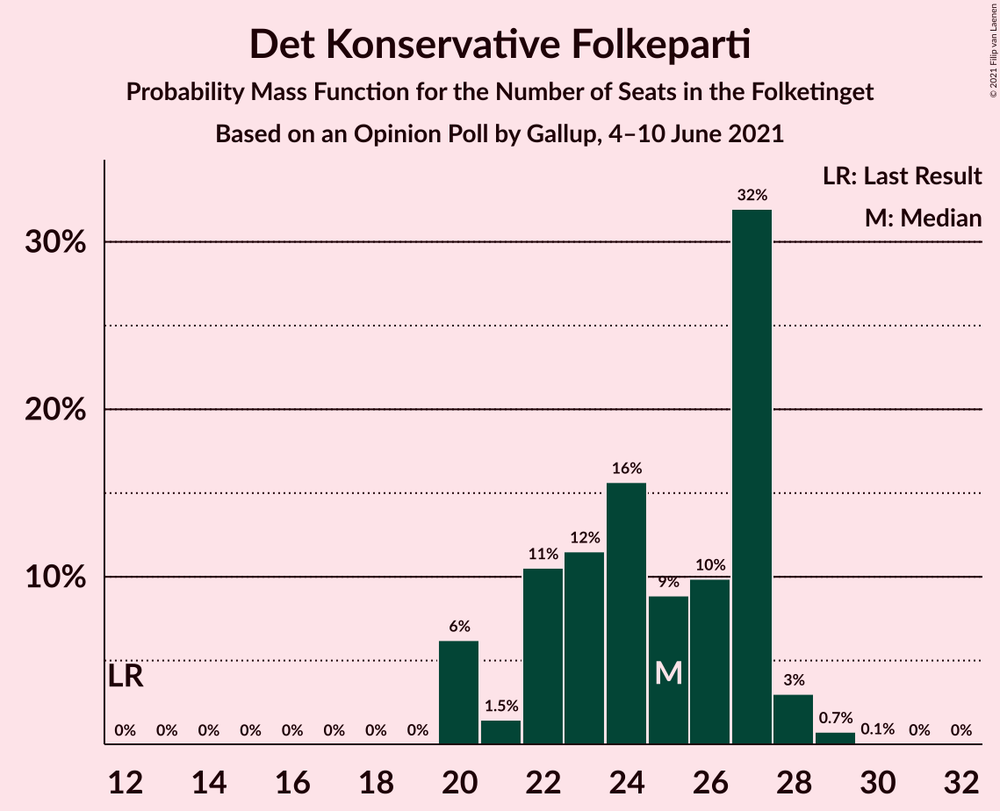
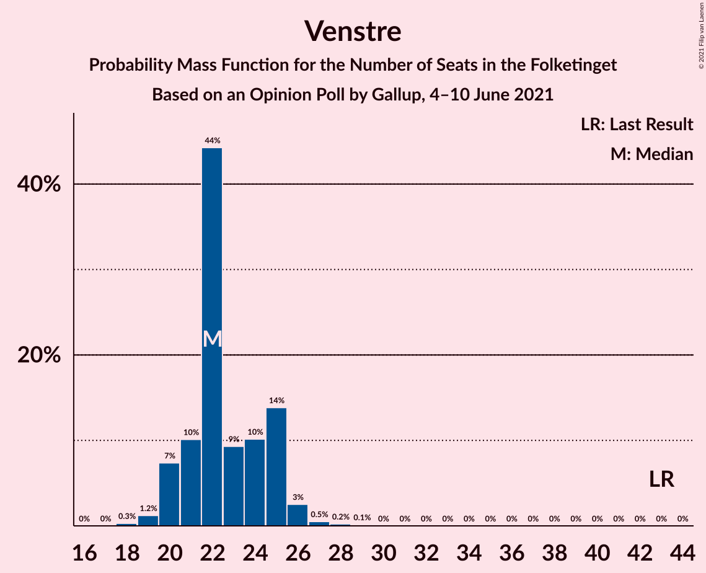

# Opinion Poll by Gallup, 4–10 June 2021

<a href="#voting-intentions">Voting Intentions</a> | <a href="#seats">Seats</a> | <a href="#coalitions">Coalitions</a> | <a href="#technical-information">Technical Information</a>

## Voting Intentions

### Confidence Intervals

| Party | Last Result | Poll Result | 80% Confidence Interval | 90% Confidence Interval | 95% Confidence Interval | 99% Confidence Interval |
|:-----:|:-----------:|:-----------:|:-----------------------:|:-----------------------:|:-----------------------:|:-----------------------:|
| Socialdemokraterne | 25.9% | 26.7% | 25.2–28.2% |24.8–28.6% |24.5–29.0% |23.8–29.8% |
| Det Konservative Folkeparti | 6.6% | 13.8% | 12.7–15.0% |12.4–15.3% |12.1–15.7% |11.6–16.3% |
| Venstre | 23.4% | 12.8% | 11.8–14.0% |11.5–14.4% |11.2–14.6% |10.7–15.2% |
| Nye Borgerlige | 2.4% | 8.5% | 7.7–9.5% |7.4–9.8% |7.2–10.1% |6.8–10.6% |
| Enhedslisten–De Rød-Grønne | 6.9% | 8.3% | 7.5–9.3% |7.2–9.6% |7.0–9.9% |6.6–10.4% |
| Radikale Venstre | 8.6% | 8.3% | 7.5–9.3% |7.2–9.6% |7.0–9.9% |6.6–10.4% |
| Socialistisk Folkeparti | 7.7% | 7.5% | 6.7–8.5% |6.5–8.7% |6.3–9.0% |5.9–9.5% |
| Dansk Folkeparti | 8.7% | 7.3% | 6.5–8.3% |6.3–8.5% |6.1–8.8% |5.7–9.2% |
| Liberal Alliance | 2.3% | 2.4% | 2.0–3.0% |1.8–3.2% |1.7–3.3% |1.5–3.6% |
| Kristendemokraterne | 1.7% | 2.3% | 1.9–2.9% |1.8–3.1% |1.7–3.2% |1.5–3.5% |
| Alternativet | 3.0% | 0.3% | 0.2–0.5% |0.1–0.6% |0.1–0.7% |0.1–0.9% |

*Note:* The poll result column reflects the actual value used in the calculations. Published results may vary slightly, and in addition be rounded to fewer digits.

## Seats

### Confidence Intervals

| Party | Last Result | Median | 80% Confidence Interval | 90% Confidence Interval | 95% Confidence Interval | 99% Confidence Interval |
|:-----:|:-----------:|:------:|:-----------------------:|:-----------------------:|:-----------------------:|:-----------------------:|
| <a href="#socialdemokraterne">Socialdemokraterne</a> | 48 | 48 | 45–50 |44–50 |44–51 |42–53 |
| <a href="#det-konservative-folkeparti">Det Konservative Folkeparti</a> | 12 | 25 | 22–27 |20–27 |20–28 |20–29 |
| <a href="#venstre">Venstre</a> | 43 | 22 | 21–25 |20–25 |20–26 |19–27 |
| <a href="#nye-borgerlige">Nye Borgerlige</a> | 4 | 14 | 14–17 |13–17 |13–18 |12–18 |
| <a href="#enhedslisten–de-rød-grønne">Enhedslisten–De Rød-Grønne</a> | 13 | 15 | 13–16 |13–17 |13–18 |12–18 |
| <a href="#radikale-venstre">Radikale Venstre</a> | 16 | 14 | 13–16 |13–17 |12–17 |12–18 |
| <a href="#socialistisk-folkeparti">Socialistisk Folkeparti</a> | 14 | 14 | 12–15 |11–15 |11–16 |10–16 |
| <a href="#dansk-folkeparti">Dansk Folkeparti</a> | 16 | 13 | 11–15 |10–16 |10–16 |10–17 |
| <a href="#liberal-alliance">Liberal Alliance</a> | 4 | 4 | 4–5 |0–5 |0–6 |0–7 |
| <a href="#kristendemokraterne">Kristendemokraterne</a> | 0 | 4 | 0–5 |0–6 |0–6 |0–7 |
| <a href="#alternativet">Alternativet</a> | 5 | 0 | 0 |0 |0 |0 |

### Socialdemokraterne

*For a full overview of the results for this party, see the [Socialdemokraterne](party-socialdemokraterne.html) page.*

| Number of Seats | Probability | Accumulated | Special Marks |
|:---------------:|:-----------:|:-----------:|:-------------:|
| 41 | 0.3% | 100% |  |
| 42 | 0.7% | 99.7% |  |
| 43 | 1.3% | 99.0% |  |
| 44 | 4% | 98% |  |
| 45 | 8% | 94% |  |
| 46 | 8% | 86% |  |
| 47 | 7% | 78% |  |
| 48 | 34% | 71% | Last Result, Median |
| 49 | 17% | 37% |  |
| 50 | 16% | 20% |  |
| 51 | 2% | 4% |  |
| 52 | 1.0% | 2% |  |
| 53 | 0.4% | 0.6% |  |
| 54 | 0.1% | 0.2% |  |
| 55 | 0% | 0.1% |  |
| 56 | 0% | 0% |  |

### Det Konservative Folkeparti

*For a full overview of the results for this party, see the [Det Konservative Folkeparti](party-detkonservativefolkeparti.html) page.*

| Number of Seats | Probability | Accumulated | Special Marks |
|:---------------:|:-----------:|:-----------:|:-------------:|
| 12 | 0% | 100% | Last Result |
| 13 | 0% | 100% |  |
| 14 | 0% | 100% |  |
| 15 | 0% | 100% |  |
| 16 | 0% | 100% |  |
| 17 | 0% | 100% |  |
| 18 | 0% | 100% |  |
| 19 | 0% | 100% |  |
| 20 | 6% | 100% |  |
| 21 | 1.5% | 94% |  |
| 22 | 11% | 92% |  |
| 23 | 12% | 82% |  |
| 24 | 16% | 70% |  |
| 25 | 9% | 55% | Median |
| 26 | 10% | 46% |  |
| 27 | 32% | 36% |  |
| 28 | 3% | 4% |  |
| 29 | 0.7% | 0.9% |  |
| 30 | 0.1% | 0.1% |  |
| 31 | 0% | 0% |  |

### Venstre

*For a full overview of the results for this party, see the [Venstre](party-venstre.html) page.*

| Number of Seats | Probability | Accumulated | Special Marks |
|:---------------:|:-----------:|:-----------:|:-------------:|
| 18 | 0.3% | 100% |  |
| 19 | 1.2% | 99.7% |  |
| 20 | 7% | 98% |  |
| 21 | 10% | 91% |  |
| 22 | 44% | 81% | Median |
| 23 | 9% | 37% |  |
| 24 | 10% | 27% |  |
| 25 | 14% | 17% |  |
| 26 | 3% | 3% |  |
| 27 | 0.5% | 0.9% |  |
| 28 | 0.2% | 0.4% |  |
| 29 | 0.1% | 0.1% |  |
| 30 | 0% | 0% |  |
| 31 | 0% | 0% |  |
| 32 | 0% | 0% |  |
| 33 | 0% | 0% |  |
| 34 | 0% | 0% |  |
| 35 | 0% | 0% |  |
| 36 | 0% | 0% |  |
| 37 | 0% | 0% |  |
| 38 | 0% | 0% |  |
| 39 | 0% | 0% |  |
| 40 | 0% | 0% |  |
| 41 | 0% | 0% |  |
| 42 | 0% | 0% |  |
| 43 | 0% | 0% | Last Result |

### Nye Borgerlige

*For a full overview of the results for this party, see the [Nye Borgerlige](party-nyeborgerlige.html) page.*

| Number of Seats | Probability | Accumulated | Special Marks |
|:---------------:|:-----------:|:-----------:|:-------------:|
| 4 | 0% | 100% | Last Result |
| 5 | 0% | 100% |  |
| 6 | 0% | 100% |  |
| 7 | 0% | 100% |  |
| 8 | 0% | 100% |  |
| 9 | 0% | 100% |  |
| 10 | 0% | 100% |  |
| 11 | 0.1% | 100% |  |
| 12 | 0.9% | 99.9% |  |
| 13 | 9% | 99.0% |  |
| 14 | 41% | 90% | Median |
| 15 | 20% | 50% |  |
| 16 | 12% | 29% |  |
| 17 | 15% | 17% |  |
| 18 | 2% | 3% |  |
| 19 | 0.3% | 0.5% |  |
| 20 | 0.1% | 0.2% |  |
| 21 | 0% | 0% |  |

### Enhedslisten–De Rød-Grønne

*For a full overview of the results for this party, see the [Enhedslisten–De Rød-Grønne](party-enhedslisten–derød-grønne.html) page.*

| Number of Seats | Probability | Accumulated | Special Marks |
|:---------------:|:-----------:|:-----------:|:-------------:|
| 11 | 0.4% | 100% |  |
| 12 | 2% | 99.6% |  |
| 13 | 9% | 98% | Last Result |
| 14 | 26% | 89% |  |
| 15 | 45% | 63% | Median |
| 16 | 11% | 18% |  |
| 17 | 4% | 7% |  |
| 18 | 2% | 3% |  |
| 19 | 0.1% | 0.2% |  |
| 20 | 0.1% | 0.1% |  |
| 21 | 0% | 0% |  |

### Radikale Venstre

*For a full overview of the results for this party, see the [Radikale Venstre](party-radikalevenstre.html) page.*

| Number of Seats | Probability | Accumulated | Special Marks |
|:---------------:|:-----------:|:-----------:|:-------------:|
| 11 | 0.3% | 100% |  |
| 12 | 3% | 99.7% |  |
| 13 | 24% | 97% |  |
| 14 | 23% | 73% | Median |
| 15 | 25% | 50% |  |
| 16 | 16% | 25% | Last Result |
| 17 | 8% | 9% |  |
| 18 | 1.1% | 1.4% |  |
| 19 | 0.2% | 0.3% |  |
| 20 | 0.1% | 0.1% |  |
| 21 | 0% | 0% |  |

### Socialistisk Folkeparti

*For a full overview of the results for this party, see the [Socialistisk Folkeparti](party-socialistiskfolkeparti.html) page.*

| Number of Seats | Probability | Accumulated | Special Marks |
|:---------------:|:-----------:|:-----------:|:-------------:|
| 10 | 0.5% | 100% |  |
| 11 | 6% | 99.5% |  |
| 12 | 15% | 94% |  |
| 13 | 16% | 79% |  |
| 14 | 46% | 63% | Last Result, Median |
| 15 | 13% | 18% |  |
| 16 | 4% | 4% |  |
| 17 | 0.3% | 0.4% |  |
| 18 | 0.1% | 0.1% |  |
| 19 | 0% | 0% |  |

### Dansk Folkeparti

*For a full overview of the results for this party, see the [Dansk Folkeparti](party-danskfolkeparti.html) page.*

| Number of Seats | Probability | Accumulated | Special Marks |
|:---------------:|:-----------:|:-----------:|:-------------:|
| 9 | 0.1% | 100% |  |
| 10 | 6% | 99.9% |  |
| 11 | 7% | 94% |  |
| 12 | 12% | 87% |  |
| 13 | 30% | 75% | Median |
| 14 | 30% | 46% |  |
| 15 | 9% | 16% |  |
| 16 | 5% | 7% | Last Result |
| 17 | 1.3% | 1.3% |  |
| 18 | 0% | 0% |  |

### Liberal Alliance

*For a full overview of the results for this party, see the [Liberal Alliance](party-liberalalliance.html) page.*

| Number of Seats | Probability | Accumulated | Special Marks |
|:---------------:|:-----------:|:-----------:|:-------------:|
| 0 | 8% | 100% |  |
| 1 | 0% | 92% |  |
| 2 | 0% | 92% |  |
| 3 | 0% | 92% |  |
| 4 | 58% | 92% | Last Result, Median |
| 5 | 30% | 35% |  |
| 6 | 4% | 5% |  |
| 7 | 0.5% | 0.5% |  |
| 8 | 0% | 0% |  |

### Kristendemokraterne

*For a full overview of the results for this party, see the [Kristendemokraterne](party-kristendemokraterne.html) page.*

| Number of Seats | Probability | Accumulated | Special Marks |
|:---------------:|:-----------:|:-----------:|:-------------:|
| 0 | 10% | 100% | Last Result |
| 1 | 0% | 90% |  |
| 2 | 0% | 90% |  |
| 3 | 0.7% | 90% |  |
| 4 | 58% | 89% | Median |
| 5 | 25% | 31% |  |
| 6 | 6% | 6% |  |
| 7 | 0.5% | 0.5% |  |
| 8 | 0% | 0% |  |

### Alternativet

*For a full overview of the results for this party, see the [Alternativet](party-alternativet.html) page.*

| Number of Seats | Probability | Accumulated | Special Marks |
|:---------------:|:-----------:|:-----------:|:-------------:|
| 0 | 100% | 100% | Median |
| 1 | 0% | 0% |  |
| 2 | 0% | 0% |  |
| 3 | 0% | 0% |  |
| 4 | 0% | 0% |  |
| 5 | 0% | 0% | Last Result |

## Coalitions

### Confidence Intervals

| Coalition | Last Result | Median | Majority? | 80% Confidence Interval | 90% Confidence Interval | 95% Confidence Interval | 99% Confidence Interval |
|:---------:|:-----------:|:------:|:---------:|:-----------------------:|:-----------------------:|:-----------------------:|:-----------------------:|
| Socialdemokraterne – Enhedslisten–De Rød-Grønne – Radikale Venstre – Socialistisk Folkeparti – Alternativet | 96 | 91 | 79% | 88–94 | 87–95 | 85–95 | 84–97 |
| Socialdemokraterne – Enhedslisten–De Rød-Grønne – Radikale Venstre – Socialistisk Folkeparti | 91 | 91 | 79% | 88–94 | 87–95 | 85–95 | 84–97 |
| Det Konservative Folkeparti – Venstre – Nye Borgerlige – Dansk Folkeparti – Liberal Alliance – Kristendemokraterne | 79 | 83 | 1.4% | 80–87 | 79–88 | 78–88 | 76–90 |
| Det Konservative Folkeparti – Venstre – Nye Borgerlige – Dansk Folkeparti – Liberal Alliance | 79 | 80 | 0% | 76–83 | 76–84 | 74–84 | 73–86 |
| Socialdemokraterne – Enhedslisten–De Rød-Grønne – Socialistisk Folkeparti – Alternativet | 80 | 77 | 0% | 72–79 | 72–79 | 71–80 | 69–82 |
| Socialdemokraterne – Enhedslisten–De Rød-Grønne – Socialistisk Folkeparti | 75 | 77 | 0% | 72–79 | 72–79 | 71–80 | 69–82 |
| Socialdemokraterne – Radikale Venstre – Socialistisk Folkeparti | 78 | 76 | 0% | 73–79 | 72–79 | 71–80 | 68–82 |
| Det Konservative Folkeparti – Venstre – Dansk Folkeparti – Liberal Alliance – Kristendemokraterne | 75 | 69 | 0% | 65–72 | 64–72 | 63–73 | 61–74 |
| Det Konservative Folkeparti – Venstre – Dansk Folkeparti – Liberal Alliance | 75 | 65 | 0% | 62–67 | 61–68 | 59–69 | 58–71 |
| Socialdemokraterne – Radikale Venstre | 64 | 63 | 0% | 60–65 | 59–66 | 58–67 | 56–68 |
| Det Konservative Folkeparti – Venstre – Liberal Alliance | 59 | 52 | 0% | 48–54 | 47–55 | 47–56 | 45–58 |
| Det Konservative Folkeparti – Venstre | 55 | 47 | 0% | 44–50 | 44–51 | 43–52 | 42–53 |
| Venstre | 43 | 22 | 0% | 21–25 | 20–25 | 20–26 | 19–27 |

### Socialdemokraterne – Enhedslisten–De Rød-Grønne – Radikale Venstre – Socialistisk Folkeparti – Alternativet

| Number of Seats | Probability | Accumulated | Special Marks |
|:---------------:|:-----------:|:-----------:|:-------------:|
| 82 | 0% | 100% |  |
| 83 | 0.1% | 99.9% |  |
| 84 | 0.7% | 99.8% |  |
| 85 | 2% | 99.1% |  |
| 86 | 1.1% | 97% |  |
| 87 | 5% | 96% |  |
| 88 | 7% | 91% |  |
| 89 | 5% | 83% |  |
| 90 | 28% | 79% | Majority |
| 91 | 7% | 50% | Median |
| 92 | 26% | 43% |  |
| 93 | 3% | 17% |  |
| 94 | 7% | 14% |  |
| 95 | 4% | 6% |  |
| 96 | 0.7% | 2% | Last Result |
| 97 | 0.8% | 1.3% |  |
| 98 | 0.2% | 0.4% |  |
| 99 | 0.2% | 0.2% |  |
| 100 | 0% | 0.1% |  |
| 101 | 0% | 0% |  |

### Socialdemokraterne – Enhedslisten–De Rød-Grønne – Radikale Venstre – Socialistisk Folkeparti

| Number of Seats | Probability | Accumulated | Special Marks |
|:---------------:|:-----------:|:-----------:|:-------------:|
| 82 | 0% | 100% |  |
| 83 | 0.1% | 99.9% |  |
| 84 | 0.7% | 99.8% |  |
| 85 | 2% | 99.1% |  |
| 86 | 1.1% | 97% |  |
| 87 | 5% | 96% |  |
| 88 | 7% | 91% |  |
| 89 | 5% | 83% |  |
| 90 | 28% | 79% | Majority |
| 91 | 7% | 50% | Last Result, Median |
| 92 | 26% | 43% |  |
| 93 | 3% | 17% |  |
| 94 | 7% | 14% |  |
| 95 | 4% | 6% |  |
| 96 | 0.7% | 2% |  |
| 97 | 0.8% | 1.3% |  |
| 98 | 0.2% | 0.4% |  |
| 99 | 0.2% | 0.2% |  |
| 100 | 0% | 0.1% |  |
| 101 | 0% | 0% |  |

### Det Konservative Folkeparti – Venstre – Nye Borgerlige – Dansk Folkeparti – Liberal Alliance – Kristendemokraterne

| Number of Seats | Probability | Accumulated | Special Marks |
|:---------------:|:-----------:|:-----------:|:-------------:|
| 73 | 0% | 100% |  |
| 74 | 0.1% | 99.9% |  |
| 75 | 0% | 99.9% |  |
| 76 | 0.4% | 99.8% |  |
| 77 | 0.3% | 99.4% |  |
| 78 | 2% | 99.1% |  |
| 79 | 2% | 97% | Last Result |
| 80 | 6% | 95% |  |
| 81 | 10% | 88% |  |
| 82 | 4% | 78% | Median |
| 83 | 28% | 75% |  |
| 84 | 6% | 47% |  |
| 85 | 26% | 41% |  |
| 86 | 4% | 15% |  |
| 87 | 5% | 11% |  |
| 88 | 4% | 6% |  |
| 89 | 0.7% | 2% |  |
| 90 | 1.3% | 1.4% | Majority |
| 91 | 0% | 0.1% |  |
| 92 | 0% | 0% |  |

### Det Konservative Folkeparti – Venstre – Nye Borgerlige – Dansk Folkeparti – Liberal Alliance

| Number of Seats | Probability | Accumulated | Special Marks |
|:---------------:|:-----------:|:-----------:|:-------------:|
| 71 | 0% | 100% |  |
| 72 | 0.3% | 99.9% |  |
| 73 | 0.7% | 99.7% |  |
| 74 | 1.5% | 99.0% |  |
| 75 | 2% | 97% |  |
| 76 | 7% | 96% |  |
| 77 | 8% | 88% |  |
| 78 | 14% | 80% | Median |
| 79 | 14% | 66% | Last Result |
| 80 | 10% | 52% |  |
| 81 | 26% | 42% |  |
| 82 | 3% | 16% |  |
| 83 | 7% | 13% |  |
| 84 | 4% | 6% |  |
| 85 | 0.5% | 2% |  |
| 86 | 1.3% | 2% |  |
| 87 | 0.2% | 0.3% |  |
| 88 | 0.1% | 0.1% |  |
| 89 | 0% | 0% |  |

### Socialdemokraterne – Enhedslisten–De Rød-Grønne – Socialistisk Folkeparti – Alternativet

| Number of Seats | Probability | Accumulated | Special Marks |
|:---------------:|:-----------:|:-----------:|:-------------:|
| 68 | 0.4% | 100% |  |
| 69 | 0.2% | 99.5% |  |
| 70 | 0.8% | 99.3% |  |
| 71 | 2% | 98.6% |  |
| 72 | 7% | 96% |  |
| 73 | 4% | 89% |  |
| 74 | 6% | 85% |  |
| 75 | 9% | 79% |  |
| 76 | 10% | 70% |  |
| 77 | 31% | 59% | Median |
| 78 | 17% | 29% |  |
| 79 | 8% | 11% |  |
| 80 | 0.9% | 3% | Last Result |
| 81 | 1.2% | 2% |  |
| 82 | 0.3% | 0.8% |  |
| 83 | 0.3% | 0.4% |  |
| 84 | 0.1% | 0.1% |  |
| 85 | 0% | 0.1% |  |
| 86 | 0% | 0.1% |  |
| 87 | 0% | 0% |  |

### Socialdemokraterne – Enhedslisten–De Rød-Grønne – Socialistisk Folkeparti

| Number of Seats | Probability | Accumulated | Special Marks |
|:---------------:|:-----------:|:-----------:|:-------------:|
| 68 | 0.4% | 100% |  |
| 69 | 0.2% | 99.5% |  |
| 70 | 0.8% | 99.3% |  |
| 71 | 2% | 98.6% |  |
| 72 | 7% | 96% |  |
| 73 | 4% | 89% |  |
| 74 | 6% | 85% |  |
| 75 | 9% | 79% | Last Result |
| 76 | 10% | 70% |  |
| 77 | 31% | 59% | Median |
| 78 | 17% | 29% |  |
| 79 | 8% | 11% |  |
| 80 | 0.9% | 3% |  |
| 81 | 1.2% | 2% |  |
| 82 | 0.3% | 0.8% |  |
| 83 | 0.3% | 0.4% |  |
| 84 | 0.1% | 0.1% |  |
| 85 | 0% | 0.1% |  |
| 86 | 0% | 0.1% |  |
| 87 | 0% | 0% |  |

### Socialdemokraterne – Radikale Venstre – Socialistisk Folkeparti

| Number of Seats | Probability | Accumulated | Special Marks |
|:---------------:|:-----------:|:-----------:|:-------------:|
| 68 | 0.6% | 100% |  |
| 69 | 0.8% | 99.4% |  |
| 70 | 0.8% | 98.6% |  |
| 71 | 0.9% | 98% |  |
| 72 | 6% | 97% |  |
| 73 | 2% | 91% |  |
| 74 | 6% | 89% |  |
| 75 | 29% | 83% |  |
| 76 | 10% | 54% | Median |
| 77 | 17% | 44% |  |
| 78 | 13% | 27% | Last Result |
| 79 | 12% | 14% |  |
| 80 | 1.3% | 3% |  |
| 81 | 1.0% | 2% |  |
| 82 | 0.1% | 0.6% |  |
| 83 | 0.3% | 0.5% |  |
| 84 | 0.1% | 0.2% |  |
| 85 | 0% | 0.1% |  |
| 86 | 0.1% | 0.1% |  |
| 87 | 0% | 0% |  |

### Det Konservative Folkeparti – Venstre – Dansk Folkeparti – Liberal Alliance – Kristendemokraterne

| Number of Seats | Probability | Accumulated | Special Marks |
|:---------------:|:-----------:|:-----------:|:-------------:|
| 58 | 0% | 100% |  |
| 59 | 0.1% | 99.9% |  |
| 60 | 0.1% | 99.9% |  |
| 61 | 0.4% | 99.8% |  |
| 62 | 0.5% | 99.3% |  |
| 63 | 3% | 98.9% |  |
| 64 | 2% | 96% |  |
| 65 | 4% | 94% |  |
| 66 | 20% | 90% |  |
| 67 | 5% | 69% |  |
| 68 | 4% | 64% | Median |
| 69 | 16% | 61% |  |
| 70 | 11% | 44% |  |
| 71 | 21% | 34% |  |
| 72 | 9% | 12% |  |
| 73 | 0.9% | 3% |  |
| 74 | 1.5% | 2% |  |
| 75 | 0.3% | 0.4% | Last Result |
| 76 | 0% | 0.1% |  |
| 77 | 0% | 0% |  |

### Det Konservative Folkeparti – Venstre – Dansk Folkeparti – Liberal Alliance

| Number of Seats | Probability | Accumulated | Special Marks |
|:---------------:|:-----------:|:-----------:|:-------------:|
| 57 | 0.3% | 100% |  |
| 58 | 0.7% | 99.7% |  |
| 59 | 2% | 99.0% |  |
| 60 | 2% | 97% |  |
| 61 | 4% | 95% |  |
| 62 | 18% | 91% |  |
| 63 | 4% | 73% |  |
| 64 | 17% | 69% | Median |
| 65 | 5% | 52% |  |
| 66 | 14% | 47% |  |
| 67 | 24% | 33% |  |
| 68 | 5% | 9% |  |
| 69 | 2% | 4% |  |
| 70 | 1.4% | 2% |  |
| 71 | 0.3% | 0.6% |  |
| 72 | 0.2% | 0.3% |  |
| 73 | 0% | 0% |  |
| 74 | 0% | 0% |  |
| 75 | 0% | 0% | Last Result |

### Socialdemokraterne – Radikale Venstre

| Number of Seats | Probability | Accumulated | Special Marks |
|:---------------:|:-----------:|:-----------:|:-------------:|
| 54 | 0.1% | 100% |  |
| 55 | 0% | 99.9% |  |
| 56 | 0.8% | 99.9% |  |
| 57 | 1.2% | 99.1% |  |
| 58 | 2% | 98% |  |
| 59 | 2% | 96% |  |
| 60 | 8% | 94% |  |
| 61 | 28% | 86% |  |
| 62 | 4% | 57% | Median |
| 63 | 18% | 53% |  |
| 64 | 21% | 36% | Last Result |
| 65 | 10% | 15% |  |
| 66 | 3% | 5% |  |
| 67 | 2% | 3% |  |
| 68 | 0.4% | 0.9% |  |
| 69 | 0.3% | 0.5% |  |
| 70 | 0.1% | 0.1% |  |
| 71 | 0% | 0% |  |

### Det Konservative Folkeparti – Venstre – Liberal Alliance

| Number of Seats | Probability | Accumulated | Special Marks |
|:---------------:|:-----------:|:-----------:|:-------------:|
| 43 | 0.2% | 100% |  |
| 44 | 0% | 99.8% |  |
| 45 | 0.5% | 99.8% |  |
| 46 | 0.5% | 99.3% |  |
| 47 | 6% | 98.8% |  |
| 48 | 6% | 93% |  |
| 49 | 13% | 88% |  |
| 50 | 7% | 74% |  |
| 51 | 16% | 68% | Median |
| 52 | 9% | 52% |  |
| 53 | 27% | 43% |  |
| 54 | 8% | 16% |  |
| 55 | 5% | 8% |  |
| 56 | 0.7% | 3% |  |
| 57 | 2% | 2% |  |
| 58 | 0.5% | 0.6% |  |
| 59 | 0.1% | 0.1% | Last Result |
| 60 | 0% | 0% |  |

### Det Konservative Folkeparti – Venstre

| Number of Seats | Probability | Accumulated | Special Marks |
|:---------------:|:-----------:|:-----------:|:-------------:|
| 41 | 0.2% | 100% |  |
| 42 | 0.6% | 99.8% |  |
| 43 | 2% | 99.2% |  |
| 44 | 8% | 97% |  |
| 45 | 12% | 89% |  |
| 46 | 16% | 77% |  |
| 47 | 14% | 61% | Median |
| 48 | 6% | 47% |  |
| 49 | 27% | 41% |  |
| 50 | 7% | 14% |  |
| 51 | 5% | 7% |  |
| 52 | 2% | 3% |  |
| 53 | 0.7% | 0.8% |  |
| 54 | 0.1% | 0.2% |  |
| 55 | 0.1% | 0.1% | Last Result |
| 56 | 0% | 0% |  |

### Venstre

| Number of Seats | Probability | Accumulated | Special Marks |
|:---------------:|:-----------:|:-----------:|:-------------:|
| 18 | 0.3% | 100% |  |
| 19 | 1.2% | 99.7% |  |
| 20 | 7% | 98% |  |
| 21 | 10% | 91% |  |
| 22 | 44% | 81% | Median |
| 23 | 9% | 37% |  |
| 24 | 10% | 27% |  |
| 25 | 14% | 17% |  |
| 26 | 3% | 3% |  |
| 27 | 0.5% | 0.9% |  |
| 28 | 0.2% | 0.4% |  |
| 29 | 0.1% | 0.1% |  |
| 30 | 0% | 0% |  |
| 31 | 0% | 0% |  |
| 32 | 0% | 0% |  |
| 33 | 0% | 0% |  |
| 34 | 0% | 0% |  |
| 35 | 0% | 0% |  |
| 36 | 0% | 0% |  |
| 37 | 0% | 0% |  |
| 38 | 0% | 0% |  |
| 39 | 0% | 0% |  |
| 40 | 0% | 0% |  |
| 41 | 0% | 0% |  |
| 42 | 0% | 0% |  |
| 43 | 0% | 0% | Last Result |

## Technical Information

### Opinion Poll

+ **Polling firm:** Gallup
+ **Commissioner(s):** —
+ **Fieldwork period:** 4–10 June 2021

### Calculations

+ **Sample size:** 1465
+ **Simulations done:** 1,048,576
+ **Error estimate:** 3.75%

