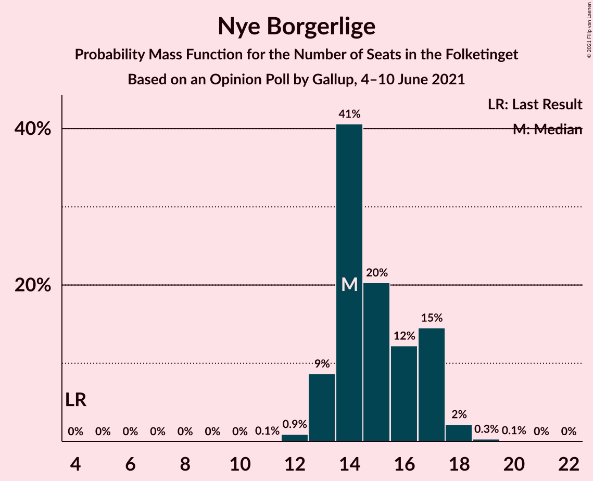
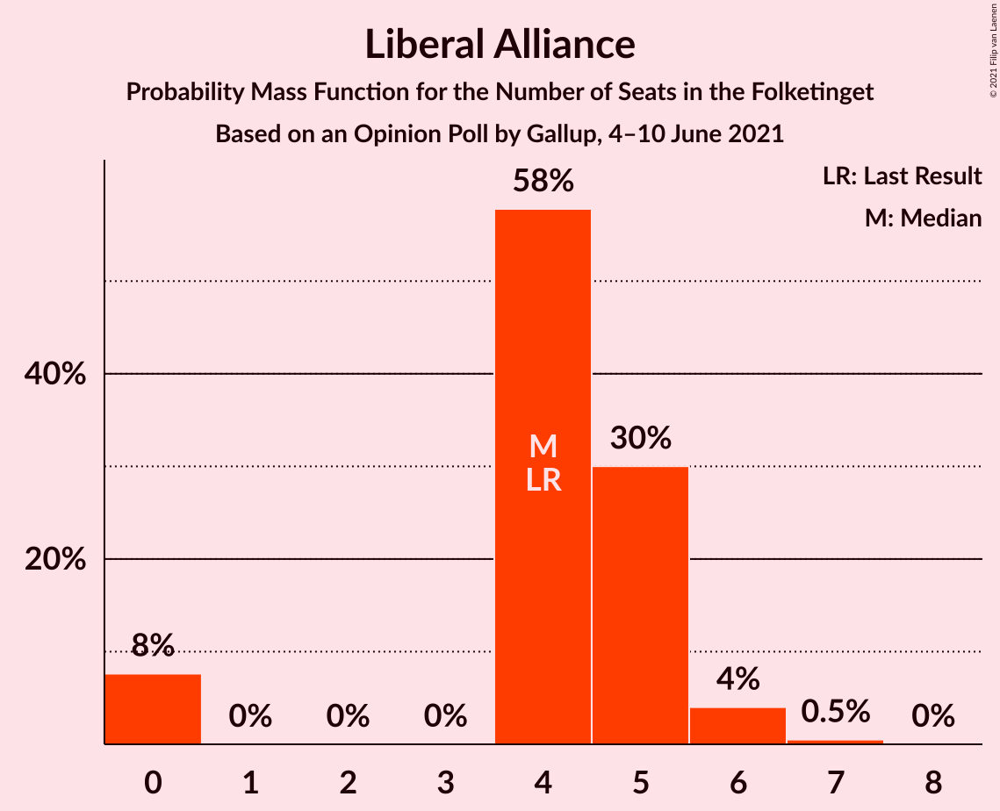
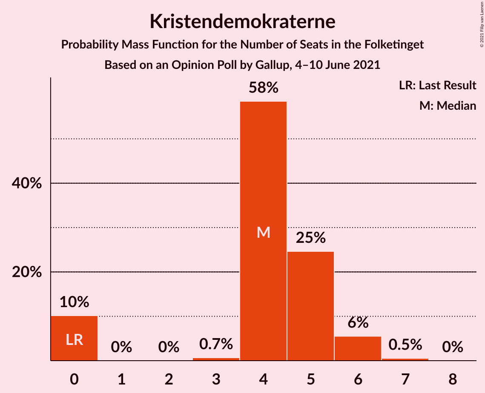
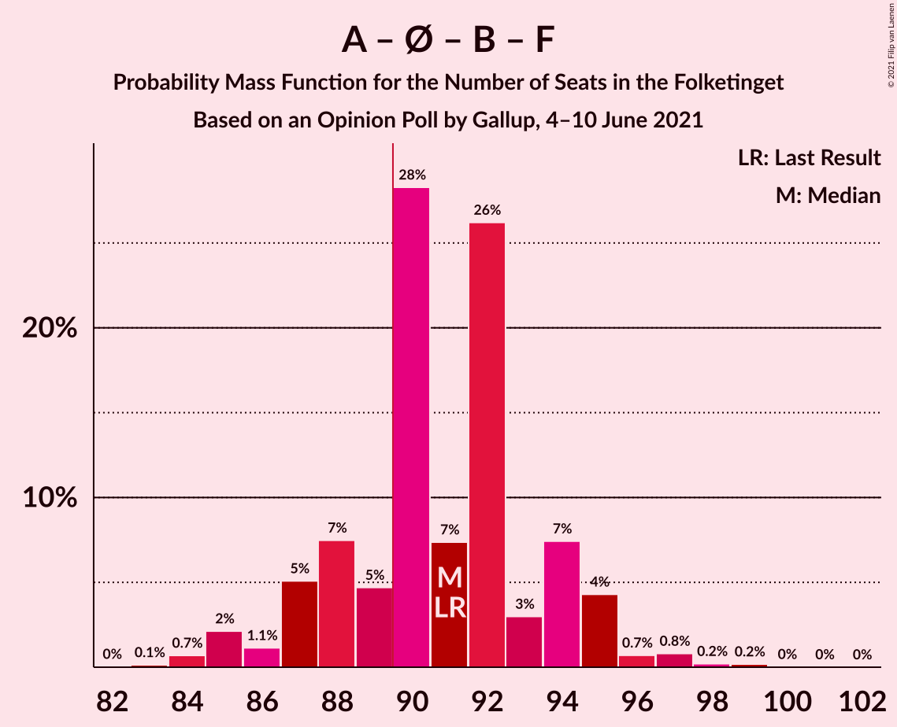
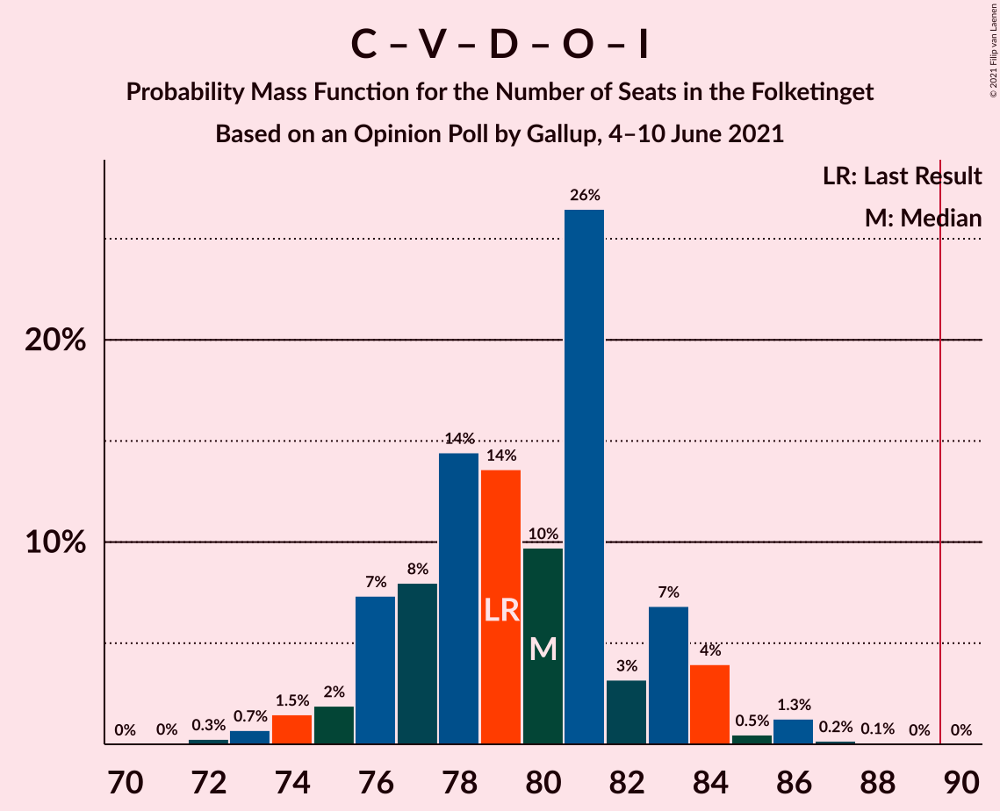
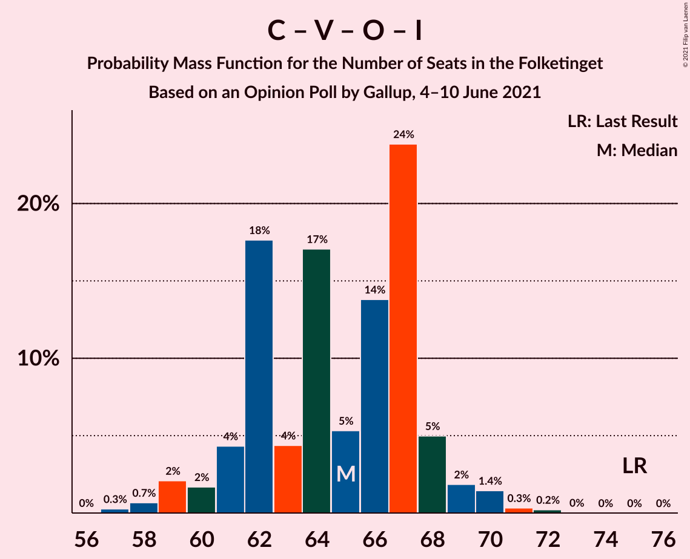

# Opinion Poll by Gallup, 4–10 June 2021

<a href="#voting-intentions">Voting Intentions</a> | <a href="#seats">Seats</a> | <a href="#coalitions">Coalitions</a> | <a href="#technical-information">Technical Information</a>

## Voting Intentions

### Confidence Intervals

| Party | Last Result | Poll Result | 80% Confidence Interval | 90% Confidence Interval | 95% Confidence Interval | 99% Confidence Interval |
|:-----:|:-----------:|:-----------:|:-----------------------:|:-----------------------:|:-----------------------:|:-----------------------:|
| Socialdemokraterne | 25.9% | 26.7% | 25.2–28.2% |24.8–28.6% |24.5–29.0% |23.8–29.8% |
| Det Konservative Folkeparti | 6.6% | 13.8% | 12.7–15.0% |12.4–15.3% |12.1–15.7% |11.6–16.3% |
| Venstre | 23.4% | 12.8% | 11.8–14.0% |11.5–14.4% |11.2–14.6% |10.7–15.2% |
| Nye Borgerlige | 2.4% | 8.5% | 7.7–9.5% |7.4–9.8% |7.2–10.1% |6.8–10.6% |
| Enhedslisten–De Rød-Grønne | 6.9% | 8.3% | 7.5–9.3% |7.2–9.6% |7.0–9.9% |6.6–10.4% |
| Radikale Venstre | 8.6% | 8.3% | 7.5–9.3% |7.2–9.6% |7.0–9.9% |6.6–10.4% |
| Socialistisk Folkeparti | 7.7% | 7.5% | 6.7–8.5% |6.5–8.7% |6.3–9.0% |5.9–9.5% |
| Dansk Folkeparti | 8.7% | 7.3% | 6.5–8.3% |6.3–8.5% |6.1–8.8% |5.7–9.2% |
| Liberal Alliance | 2.3% | 2.4% | 2.0–3.0% |1.8–3.2% |1.7–3.3% |1.5–3.6% |
| Kristendemokraterne | 1.7% | 2.3% | 1.9–2.9% |1.8–3.1% |1.7–3.2% |1.5–3.5% |
| Alternativet | 3.0% | 0.3% | 0.2–0.5% |0.1–0.6% |0.1–0.7% |0.1–0.9% |

*Note:* The poll result column reflects the actual value used in the calculations. Published results may vary slightly, and in addition be rounded to fewer digits.

## Seats

### Confidence Intervals

| Party | Last Result | Median | 80% Confidence Interval | 90% Confidence Interval | 95% Confidence Interval | 99% Confidence Interval |
|:-----:|:-----------:|:------:|:-----------------------:|:-----------------------:|:-----------------------:|:-----------------------:|
| <a href="#socialdemokraterne">Socialdemokraterne</a> | 48 | 48 | 45–50 |45–51 |45–52 |43–53 |
| <a href="#det-konservative-folkeparti">Det Konservative Folkeparti</a> | 12 | 26 | 22–28 |22–28 |21–28 |20–29 |
| <a href="#venstre">Venstre</a> | 43 | 22 | 21–25 |20–25 |20–26 |18–26 |
| <a href="#nye-borgerlige">Nye Borgerlige</a> | 4 | 15 | 14–17 |13–18 |12–18 |12–18 |
| <a href="#enhedslisten–de-rød-grønne">Enhedslisten–De Rød-Grønne</a> | 13 | 15 | 14–18 |13–18 |13–18 |12–20 |
| <a href="#radikale-venstre">Radikale Venstre</a> | 16 | 16 | 13–16 |13–17 |13–18 |12–18 |
| <a href="#socialistisk-folkeparti">Socialistisk Folkeparti</a> | 14 | 13 | 12–15 |12–16 |11–16 |10–17 |
| <a href="#dansk-folkeparti">Dansk Folkeparti</a> | 16 | 12 | 11–15 |11–15 |11–15 |10–16 |
| <a href="#liberal-alliance">Liberal Alliance</a> | 4 | 4 | 4–5 |0–6 |0–6 |0–6 |
| <a href="#kristendemokraterne">Kristendemokraterne</a> | 0 | 4 | 0–5 |0–5 |0–6 |0–7 |
| <a href="#alternativet">Alternativet</a> | 5 | 0 | 0 |0 |0 |0 |

### Socialdemokraterne

*For a full overview of the results for this party, see the [Socialdemokraterne](party-socialdemokraterne.html) page.*

| Number of Seats | Probability | Accumulated | Special Marks |
|:---------------:|:-----------:|:-----------:|:-------------:|
| 40 | 0.1% | 100% |  |
| 41 | 0% | 99.9% |  |
| 42 | 0.1% | 99.9% |  |
| 43 | 0.6% | 99.8% |  |
| 44 | 0.8% | 99.2% |  |
| 45 | 15% | 98% |  |
| 46 | 6% | 84% |  |
| 47 | 19% | 78% |  |
| 48 | 31% | 59% | Last Result, Median |
| 49 | 15% | 27% |  |
| 50 | 3% | 12% |  |
| 51 | 5% | 9% |  |
| 52 | 3% | 4% |  |
| 53 | 1.2% | 2% |  |
| 54 | 0% | 0.3% |  |
| 55 | 0.2% | 0.3% |  |
| 56 | 0.1% | 0.1% |  |
| 57 | 0% | 0% |  |

### Det Konservative Folkeparti

*For a full overview of the results for this party, see the [Det Konservative Folkeparti](party-detkonservativefolkeparti.html) page.*

| Number of Seats | Probability | Accumulated | Special Marks |
|:---------------:|:-----------:|:-----------:|:-------------:|
| 12 | 0% | 100% | Last Result |
| 13 | 0% | 100% |  |
| 14 | 0% | 100% |  |
| 15 | 0% | 100% |  |
| 16 | 0% | 100% |  |
| 17 | 0% | 100% |  |
| 18 | 0% | 100% |  |
| 19 | 0% | 100% |  |
| 20 | 1.0% | 100% |  |
| 21 | 2% | 99.0% |  |
| 22 | 10% | 97% |  |
| 23 | 11% | 87% |  |
| 24 | 13% | 76% |  |
| 25 | 3% | 63% |  |
| 26 | 41% | 60% | Median |
| 27 | 3% | 18% |  |
| 28 | 13% | 15% |  |
| 29 | 2% | 2% |  |
| 30 | 0% | 0% |  |

### Venstre

*For a full overview of the results for this party, see the [Venstre](party-venstre.html) page.*

| Number of Seats | Probability | Accumulated | Special Marks |
|:---------------:|:-----------:|:-----------:|:-------------:|
| 18 | 0.6% | 100% |  |
| 19 | 1.0% | 99.4% |  |
| 20 | 4% | 98% |  |
| 21 | 26% | 94% |  |
| 22 | 19% | 68% | Median |
| 23 | 9% | 48% |  |
| 24 | 6% | 39% |  |
| 25 | 30% | 33% |  |
| 26 | 3% | 3% |  |
| 27 | 0.1% | 0.2% |  |
| 28 | 0.1% | 0.1% |  |
| 29 | 0% | 0% |  |
| 30 | 0% | 0% |  |
| 31 | 0% | 0% |  |
| 32 | 0% | 0% |  |
| 33 | 0% | 0% |  |
| 34 | 0% | 0% |  |
| 35 | 0% | 0% |  |
| 36 | 0% | 0% |  |
| 37 | 0% | 0% |  |
| 38 | 0% | 0% |  |
| 39 | 0% | 0% |  |
| 40 | 0% | 0% |  |
| 41 | 0% | 0% |  |
| 42 | 0% | 0% |  |
| 43 | 0% | 0% | Last Result |

### Nye Borgerlige

*For a full overview of the results for this party, see the [Nye Borgerlige](party-nyeborgerlige.html) page.*

| Number of Seats | Probability | Accumulated | Special Marks |
|:---------------:|:-----------:|:-----------:|:-------------:|
| 4 | 0% | 100% | Last Result |
| 5 | 0% | 100% |  |
| 6 | 0% | 100% |  |
| 7 | 0% | 100% |  |
| 8 | 0% | 100% |  |
| 9 | 0% | 100% |  |
| 10 | 0% | 100% |  |
| 11 | 0% | 100% |  |
| 12 | 3% | 100% |  |
| 13 | 7% | 97% |  |
| 14 | 5% | 91% |  |
| 15 | 47% | 86% | Median |
| 16 | 3% | 39% |  |
| 17 | 30% | 37% |  |
| 18 | 7% | 7% |  |
| 19 | 0.1% | 0.2% |  |
| 20 | 0% | 0.1% |  |
| 21 | 0% | 0% |  |

### Enhedslisten–De Rød-Grønne

*For a full overview of the results for this party, see the [Enhedslisten–De Rød-Grønne](party-enhedslisten–derød-grønne.html) page.*

| Number of Seats | Probability | Accumulated | Special Marks |
|:---------------:|:-----------:|:-----------:|:-------------:|
| 11 | 0.1% | 100% |  |
| 12 | 0.7% | 99.9% |  |
| 13 | 7% | 99.2% | Last Result |
| 14 | 25% | 92% |  |
| 15 | 34% | 67% | Median |
| 16 | 16% | 33% |  |
| 17 | 4% | 16% |  |
| 18 | 12% | 13% |  |
| 19 | 0.1% | 0.8% |  |
| 20 | 0.7% | 0.7% |  |
| 21 | 0% | 0% |  |

### Radikale Venstre

*For a full overview of the results for this party, see the [Radikale Venstre](party-radikalevenstre.html) page.*

| Number of Seats | Probability | Accumulated | Special Marks |
|:---------------:|:-----------:|:-----------:|:-------------:|
| 11 | 0.1% | 100% |  |
| 12 | 0.9% | 99.9% |  |
| 13 | 11% | 99.0% |  |
| 14 | 6% | 88% |  |
| 15 | 23% | 82% |  |
| 16 | 53% | 59% | Last Result, Median |
| 17 | 4% | 6% |  |
| 18 | 2% | 3% |  |
| 19 | 0.2% | 0.2% |  |
| 20 | 0% | 0% |  |

### Socialistisk Folkeparti

*For a full overview of the results for this party, see the [Socialistisk Folkeparti](party-socialistiskfolkeparti.html) page.*

| Number of Seats | Probability | Accumulated | Special Marks |
|:---------------:|:-----------:|:-----------:|:-------------:|
| 10 | 0.8% | 100% |  |
| 11 | 3% | 99.2% |  |
| 12 | 19% | 96% |  |
| 13 | 53% | 77% | Median |
| 14 | 11% | 24% | Last Result |
| 15 | 6% | 13% |  |
| 16 | 6% | 6% |  |
| 17 | 0.3% | 0.6% |  |
| 18 | 0.3% | 0.3% |  |
| 19 | 0% | 0% |  |

### Dansk Folkeparti

*For a full overview of the results for this party, see the [Dansk Folkeparti](party-danskfolkeparti.html) page.*

| Number of Seats | Probability | Accumulated | Special Marks |
|:---------------:|:-----------:|:-----------:|:-------------:|
| 9 | 0.1% | 100% |  |
| 10 | 0.8% | 99.9% |  |
| 11 | 33% | 99.1% |  |
| 12 | 16% | 66% | Median |
| 13 | 21% | 50% |  |
| 14 | 3% | 29% |  |
| 15 | 25% | 26% |  |
| 16 | 0.8% | 1.1% | Last Result |
| 17 | 0.3% | 0.3% |  |
| 18 | 0.1% | 0.1% |  |
| 19 | 0% | 0% |  |

### Liberal Alliance

*For a full overview of the results for this party, see the [Liberal Alliance](party-liberalalliance.html) page.*

| Number of Seats | Probability | Accumulated | Special Marks |
|:---------------:|:-----------:|:-----------:|:-------------:|
| 0 | 5% | 100% |  |
| 1 | 0% | 95% |  |
| 2 | 0% | 95% |  |
| 3 | 0% | 95% |  |
| 4 | 72% | 95% | Last Result, Median |
| 5 | 15% | 22% |  |
| 6 | 7% | 7% |  |
| 7 | 0.1% | 0.1% |  |
| 8 | 0% | 0% |  |

### Kristendemokraterne

*For a full overview of the results for this party, see the [Kristendemokraterne](party-kristendemokraterne.html) page.*

| Number of Seats | Probability | Accumulated | Special Marks |
|:---------------:|:-----------:|:-----------:|:-------------:|
| 0 | 40% | 100% | Last Result |
| 1 | 0% | 60% |  |
| 2 | 0% | 60% |  |
| 3 | 0.6% | 60% |  |
| 4 | 27% | 59% | Median |
| 5 | 27% | 32% |  |
| 6 | 2% | 5% |  |
| 7 | 2% | 2% |  |
| 8 | 0% | 0% |  |

### Alternativet

*For a full overview of the results for this party, see the [Alternativet](party-alternativet.html) page.*

| Number of Seats | Probability | Accumulated | Special Marks |
|:---------------:|:-----------:|:-----------:|:-------------:|
| 0 | 100% | 100% | Median |
| 1 | 0% | 0% |  |
| 2 | 0% | 0% |  |
| 3 | 0% | 0% |  |
| 4 | 0% | 0% |  |
| 5 | 0% | 0% | Last Result |

## Coalitions

### Confidence Intervals

| Coalition | Last Result | Median | Majority? | 80% Confidence Interval | 90% Confidence Interval | 95% Confidence Interval | 99% Confidence Interval |
|:---------:|:-----------:|:------:|:---------:|:-----------------------:|:-----------------------:|:-----------------------:|:-----------------------:|
| Socialdemokraterne – Enhedslisten–De Rød-Grønne – Radikale Venstre – Socialistisk Folkeparti – Alternativet | 96 | 92 | 79% | 88–94 | 88–95 | 88–97 | 86–98 |
| Socialdemokraterne – Enhedslisten–De Rød-Grønne – Radikale Venstre – Socialistisk Folkeparti | 91 | 92 | 79% | 88–94 | 88–95 | 88–97 | 86–98 |
| Det Konservative Folkeparti – Venstre – Nye Borgerlige – Dansk Folkeparti – Liberal Alliance – Kristendemokraterne | 79 | 83 | 0.3% | 80–87 | 78–87 | 78–87 | 77–89 |
| Det Konservative Folkeparti – Venstre – Nye Borgerlige – Dansk Folkeparti – Liberal Alliance | 79 | 81 | 0% | 76–83 | 76–83 | 73–83 | 73–85 |
| Socialdemokraterne – Enhedslisten–De Rød-Grønne – Socialistisk Folkeparti – Alternativet | 80 | 76 | 0% | 73–80 | 73–81 | 73–81 | 71–82 |
| Socialdemokraterne – Enhedslisten–De Rød-Grønne – Socialistisk Folkeparti | 75 | 76 | 0% | 73–80 | 73–81 | 73–81 | 71–82 |
| Socialdemokraterne – Radikale Venstre – Socialistisk Folkeparti | 78 | 77 | 0% | 72–78 | 72–81 | 72–81 | 71–83 |
| Det Konservative Folkeparti – Venstre – Dansk Folkeparti – Liberal Alliance – Kristendemokraterne | 75 | 66 | 0% | 65–72 | 63–72 | 63–72 | 61–74 |
| Det Konservative Folkeparti – Venstre – Dansk Folkeparti – Liberal Alliance | 75 | 66 | 0% | 61–67 | 61–67 | 58–69 | 58–71 |
| Socialdemokraterne – Radikale Venstre | 64 | 63 | 0% | 60–65 | 60–66 | 60–68 | 57–69 |
| Det Konservative Folkeparti – Venstre – Liberal Alliance | 59 | 51 | 0% | 49–55 | 48–55 | 47–56 | 46–58 |
| Det Konservative Folkeparti – Venstre | 55 | 47 | 0% | 45–51 | 43–51 | 43–51 | 42–53 |
| Venstre | 43 | 22 | 0% | 21–25 | 20–25 | 20–26 | 18–26 |

### Socialdemokraterne – Enhedslisten–De Rød-Grønne – Radikale Venstre – Socialistisk Folkeparti – Alternativet

| Number of Seats | Probability | Accumulated | Special Marks |
|:---------------:|:-----------:|:-----------:|:-------------:|
| 83 | 0.1% | 100% |  |
| 84 | 0.2% | 99.9% |  |
| 85 | 0.2% | 99.7% |  |
| 86 | 0.6% | 99.6% |  |
| 87 | 0.5% | 99.0% |  |
| 88 | 14% | 98% |  |
| 89 | 6% | 85% |  |
| 90 | 17% | 79% | Majority |
| 91 | 2% | 62% |  |
| 92 | 33% | 60% | Median |
| 93 | 6% | 26% |  |
| 94 | 10% | 20% |  |
| 95 | 6% | 10% |  |
| 96 | 0.5% | 3% | Last Result |
| 97 | 1.0% | 3% |  |
| 98 | 2% | 2% |  |
| 99 | 0.1% | 0.1% |  |
| 100 | 0% | 0% |  |

### Socialdemokraterne – Enhedslisten–De Rød-Grønne – Radikale Venstre – Socialistisk Folkeparti

| Number of Seats | Probability | Accumulated | Special Marks |
|:---------------:|:-----------:|:-----------:|:-------------:|
| 83 | 0.1% | 100% |  |
| 84 | 0.2% | 99.9% |  |
| 85 | 0.2% | 99.7% |  |
| 86 | 0.6% | 99.6% |  |
| 87 | 0.5% | 99.0% |  |
| 88 | 14% | 98% |  |
| 89 | 6% | 85% |  |
| 90 | 17% | 79% | Majority |
| 91 | 2% | 62% | Last Result |
| 92 | 33% | 60% | Median |
| 93 | 6% | 26% |  |
| 94 | 10% | 20% |  |
| 95 | 6% | 10% |  |
| 96 | 0.5% | 3% |  |
| 97 | 1.0% | 3% |  |
| 98 | 2% | 2% |  |
| 99 | 0.1% | 0.1% |  |
| 100 | 0% | 0% |  |

### Det Konservative Folkeparti – Venstre – Nye Borgerlige – Dansk Folkeparti – Liberal Alliance – Kristendemokraterne

| Number of Seats | Probability | Accumulated | Special Marks |
|:---------------:|:-----------:|:-----------:|:-------------:|
| 74 | 0.1% | 100% |  |
| 75 | 0.2% | 99.9% |  |
| 76 | 0.1% | 99.8% |  |
| 77 | 2% | 99.6% |  |
| 78 | 5% | 98% |  |
| 79 | 0.6% | 93% | Last Result |
| 80 | 7% | 92% |  |
| 81 | 10% | 85% |  |
| 82 | 4% | 75% |  |
| 83 | 35% | 71% | Median |
| 84 | 2% | 36% |  |
| 85 | 17% | 34% |  |
| 86 | 4% | 17% |  |
| 87 | 12% | 13% |  |
| 88 | 0.4% | 0.9% |  |
| 89 | 0.3% | 0.6% |  |
| 90 | 0.1% | 0.3% | Majority |
| 91 | 0.1% | 0.2% |  |
| 92 | 0.1% | 0.1% |  |
| 93 | 0% | 0% |  |

### Det Konservative Folkeparti – Venstre – Nye Borgerlige – Dansk Folkeparti – Liberal Alliance

| Number of Seats | Probability | Accumulated | Special Marks |
|:---------------:|:-----------:|:-----------:|:-------------:|
| 71 | 0.1% | 100% |  |
| 72 | 0% | 99.8% |  |
| 73 | 3% | 99.8% |  |
| 74 | 0.4% | 97% |  |
| 75 | 0.9% | 96% |  |
| 76 | 10% | 95% |  |
| 77 | 3% | 85% |  |
| 78 | 6% | 82% |  |
| 79 | 6% | 76% | Last Result, Median |
| 80 | 9% | 70% |  |
| 81 | 18% | 61% |  |
| 82 | 14% | 43% |  |
| 83 | 28% | 29% |  |
| 84 | 0.4% | 1.2% |  |
| 85 | 0.6% | 0.8% |  |
| 86 | 0% | 0.2% |  |
| 87 | 0.1% | 0.2% |  |
| 88 | 0.1% | 0.1% |  |
| 89 | 0% | 0% |  |

### Socialdemokraterne – Enhedslisten–De Rød-Grønne – Socialistisk Folkeparti – Alternativet

| Number of Seats | Probability | Accumulated | Special Marks |
|:---------------:|:-----------:|:-----------:|:-------------:|
| 68 | 0.1% | 100% |  |
| 69 | 0.2% | 99.9% |  |
| 70 | 0.2% | 99.8% |  |
| 71 | 0.8% | 99.6% |  |
| 72 | 1.1% | 98.8% |  |
| 73 | 13% | 98% |  |
| 74 | 20% | 84% |  |
| 75 | 2% | 64% |  |
| 76 | 29% | 62% | Median |
| 77 | 7% | 33% |  |
| 78 | 6% | 26% |  |
| 79 | 8% | 20% |  |
| 80 | 3% | 12% | Last Result |
| 81 | 7% | 9% |  |
| 82 | 2% | 2% |  |
| 83 | 0.2% | 0.3% |  |
| 84 | 0% | 0.1% |  |
| 85 | 0% | 0.1% |  |
| 86 | 0% | 0.1% |  |
| 87 | 0.1% | 0.1% |  |
| 88 | 0% | 0% |  |

### Socialdemokraterne – Enhedslisten–De Rød-Grønne – Socialistisk Folkeparti

| Number of Seats | Probability | Accumulated | Special Marks |
|:---------------:|:-----------:|:-----------:|:-------------:|
| 68 | 0.1% | 100% |  |
| 69 | 0.2% | 99.9% |  |
| 70 | 0.2% | 99.8% |  |
| 71 | 0.8% | 99.6% |  |
| 72 | 1.1% | 98.8% |  |
| 73 | 13% | 98% |  |
| 74 | 20% | 84% |  |
| 75 | 2% | 64% | Last Result |
| 76 | 29% | 62% | Median |
| 77 | 7% | 33% |  |
| 78 | 6% | 26% |  |
| 79 | 8% | 20% |  |
| 80 | 3% | 12% |  |
| 81 | 7% | 9% |  |
| 82 | 2% | 2% |  |
| 83 | 0.2% | 0.3% |  |
| 84 | 0% | 0.1% |  |
| 85 | 0% | 0.1% |  |
| 86 | 0% | 0.1% |  |
| 87 | 0.1% | 0.1% |  |
| 88 | 0% | 0% |  |

### Socialdemokraterne – Radikale Venstre – Socialistisk Folkeparti

| Number of Seats | Probability | Accumulated | Special Marks |
|:---------------:|:-----------:|:-----------:|:-------------:|
| 69 | 0.1% | 100% |  |
| 70 | 0.4% | 99.9% |  |
| 71 | 0.3% | 99.5% |  |
| 72 | 11% | 99.2% |  |
| 73 | 3% | 88% |  |
| 74 | 1.0% | 85% |  |
| 75 | 6% | 84% |  |
| 76 | 24% | 78% |  |
| 77 | 38% | 54% | Median |
| 78 | 8% | 16% | Last Result |
| 79 | 3% | 8% |  |
| 80 | 0.2% | 5% |  |
| 81 | 4% | 5% |  |
| 82 | 0.2% | 2% |  |
| 83 | 1.2% | 1.3% |  |
| 84 | 0.1% | 0.1% |  |
| 85 | 0% | 0% |  |

### Det Konservative Folkeparti – Venstre – Dansk Folkeparti – Liberal Alliance – Kristendemokraterne

| Number of Seats | Probability | Accumulated | Special Marks |
|:---------------:|:-----------:|:-----------:|:-------------:|
| 60 | 0% | 100% |  |
| 61 | 1.2% | 99.9% |  |
| 62 | 0.2% | 98.7% |  |
| 63 | 5% | 98.5% |  |
| 64 | 3% | 94% |  |
| 65 | 11% | 91% |  |
| 66 | 35% | 80% |  |
| 67 | 2% | 45% |  |
| 68 | 4% | 43% | Median |
| 69 | 1.2% | 39% |  |
| 70 | 20% | 37% |  |
| 71 | 4% | 17% |  |
| 72 | 13% | 13% |  |
| 73 | 0.1% | 0.7% |  |
| 74 | 0.2% | 0.7% |  |
| 75 | 0.3% | 0.4% | Last Result |
| 76 | 0.1% | 0.1% |  |
| 77 | 0% | 0% |  |

### Det Konservative Folkeparti – Venstre – Dansk Folkeparti – Liberal Alliance

| Number of Seats | Probability | Accumulated | Special Marks |
|:---------------:|:-----------:|:-----------:|:-------------:|
| 57 | 0.1% | 100% |  |
| 58 | 2% | 99.8% |  |
| 59 | 1.0% | 97% |  |
| 60 | 1.2% | 96% |  |
| 61 | 13% | 95% |  |
| 62 | 3% | 82% |  |
| 63 | 5% | 79% |  |
| 64 | 3% | 73% | Median |
| 65 | 11% | 70% |  |
| 66 | 42% | 59% |  |
| 67 | 12% | 17% |  |
| 68 | 2% | 5% |  |
| 69 | 0.5% | 3% |  |
| 70 | 0.3% | 2% |  |
| 71 | 2% | 2% |  |
| 72 | 0% | 0% |  |
| 73 | 0% | 0% |  |
| 74 | 0% | 0% |  |
| 75 | 0% | 0% | Last Result |

### Socialdemokraterne – Radikale Venstre

| Number of Seats | Probability | Accumulated | Special Marks |
|:---------------:|:-----------:|:-----------:|:-------------:|
| 54 | 0.1% | 100% |  |
| 55 | 0% | 99.9% |  |
| 56 | 0.2% | 99.9% |  |
| 57 | 0.7% | 99.7% |  |
| 58 | 0.3% | 99.0% |  |
| 59 | 0.3% | 98.7% |  |
| 60 | 14% | 98% |  |
| 61 | 5% | 84% |  |
| 62 | 12% | 79% |  |
| 63 | 19% | 68% |  |
| 64 | 32% | 49% | Last Result, Median |
| 65 | 10% | 17% |  |
| 66 | 4% | 7% |  |
| 67 | 0.2% | 4% |  |
| 68 | 2% | 3% |  |
| 69 | 1.1% | 1.2% |  |
| 70 | 0% | 0% |  |

### Det Konservative Folkeparti – Venstre – Liberal Alliance

| Number of Seats | Probability | Accumulated | Special Marks |
|:---------------:|:-----------:|:-----------:|:-------------:|
| 43 | 0% | 100% |  |
| 44 | 0.1% | 99.9% |  |
| 45 | 0.1% | 99.8% |  |
| 46 | 0.7% | 99.7% |  |
| 47 | 4% | 98.9% |  |
| 48 | 2% | 95% |  |
| 49 | 12% | 93% |  |
| 50 | 11% | 82% |  |
| 51 | 21% | 70% |  |
| 52 | 4% | 49% | Median |
| 53 | 2% | 44% |  |
| 54 | 12% | 42% |  |
| 55 | 26% | 30% |  |
| 56 | 2% | 4% |  |
| 57 | 1.1% | 2% |  |
| 58 | 0.5% | 0.6% |  |
| 59 | 0% | 0% | Last Result |

### Det Konservative Folkeparti – Venstre

| Number of Seats | Probability | Accumulated | Special Marks |
|:---------------:|:-----------:|:-----------:|:-------------:|
| 41 | 0.1% | 100% |  |
| 42 | 1.0% | 99.9% |  |
| 43 | 5% | 98.9% |  |
| 44 | 4% | 94% |  |
| 45 | 12% | 90% |  |
| 46 | 10% | 78% |  |
| 47 | 21% | 69% |  |
| 48 | 1.4% | 48% | Median |
| 49 | 3% | 46% |  |
| 50 | 12% | 44% |  |
| 51 | 30% | 31% |  |
| 52 | 0.9% | 2% |  |
| 53 | 0.7% | 0.8% |  |
| 54 | 0% | 0.1% |  |
| 55 | 0% | 0% | Last Result |

### Venstre

| Number of Seats | Probability | Accumulated | Special Marks |
|:---------------:|:-----------:|:-----------:|:-------------:|
| 18 | 0.6% | 100% |  |
| 19 | 1.0% | 99.4% |  |
| 20 | 4% | 98% |  |
| 21 | 26% | 94% |  |
| 22 | 19% | 68% | Median |
| 23 | 9% | 48% |  |
| 24 | 6% | 39% |  |
| 25 | 30% | 33% |  |
| 26 | 3% | 3% |  |
| 27 | 0.1% | 0.2% |  |
| 28 | 0.1% | 0.1% |  |
| 29 | 0% | 0% |  |
| 30 | 0% | 0% |  |
| 31 | 0% | 0% |  |
| 32 | 0% | 0% |  |
| 33 | 0% | 0% |  |
| 34 | 0% | 0% |  |
| 35 | 0% | 0% |  |
| 36 | 0% | 0% |  |
| 37 | 0% | 0% |  |
| 38 | 0% | 0% |  |
| 39 | 0% | 0% |  |
| 40 | 0% | 0% |  |
| 41 | 0% | 0% |  |
| 42 | 0% | 0% |  |
| 43 | 0% | 0% | Last Result |

## Technical Information

### Opinion Poll

+ **Polling firm:** Gallup
+ **Commissioner(s):** —
+ **Fieldwork period:** 4–10 June 2021

### Calculations

+ **Sample size:** 1465
+ **Simulations done:** 131,072
+ **Error estimate:** 1.92%

