# Opinion Poll by Voxmeter, 7–12 June 2021

<a href="#voting-intentions">Voting Intentions</a> | <a href="#seats">Seats</a> | <a href="#coalitions">Coalitions</a> | <a href="#technical-information">Technical Information</a>

## Voting Intentions

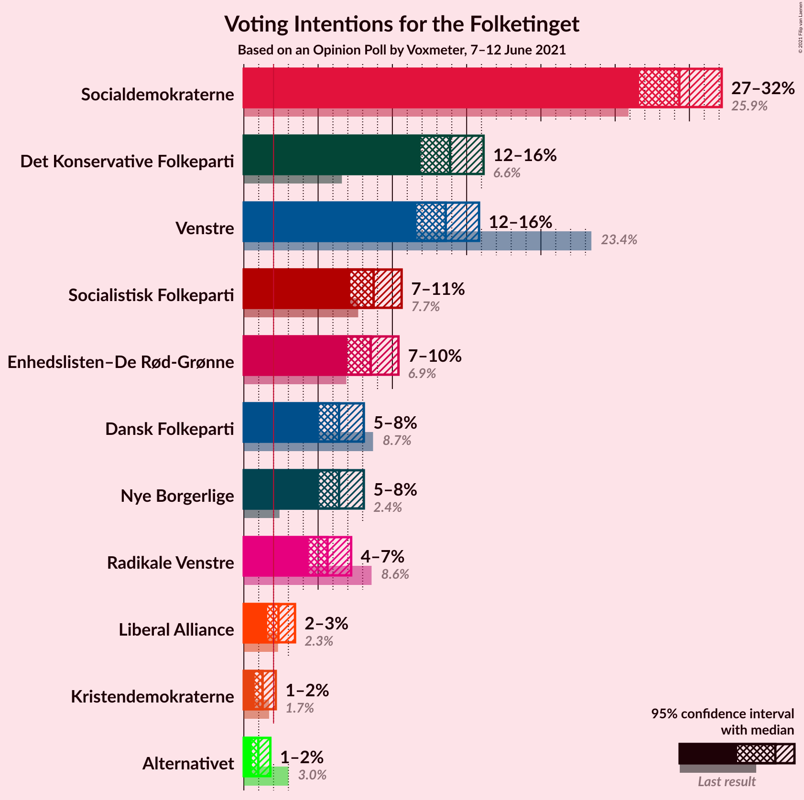

### Confidence Intervals

| Party | Last Result | Poll Result | 80% Confidence Interval | 90% Confidence Interval | 95% Confidence Interval | 99% Confidence Interval |
|:-----:|:-----------:|:-----------:|:-----------------------:|:-----------------------:|:-----------------------:|:-----------------------:|
| Socialdemokraterne | 25.9% | 29.3% | 27.5–31.2% |27.0–31.7% |26.6–32.2% |25.8–33.1% |
| Det Konservative Folkeparti | 6.6% | 13.9% | 12.6–15.4% |12.2–15.8% |11.9–16.1% |11.3–16.9% |
| Venstre | 23.4% | 13.6% | 12.3–15.1% |11.9–15.5% |11.6–15.8% |11.0–16.6% |
| Socialistisk Folkeparti | 7.7% | 8.7% | 7.7–10.0% |7.4–10.3% |7.2–10.6% |6.7–11.2% |
| Enhedslisten–De Rød-Grønne | 6.9% | 8.5% | 7.5–9.8% |7.2–10.1% |7.0–10.4% |6.5–11.0% |
| Dansk Folkeparti | 8.7% | 6.4% | 5.5–7.5% |5.3–7.8% |5.1–8.1% |4.7–8.6% |
| Nye Borgerlige | 2.4% | 6.4% | 5.5–7.5% |5.3–7.8% |5.1–8.1% |4.7–8.6% |
| Radikale Venstre | 8.6% | 5.6% | 4.8–6.7% |4.6–7.0% |4.4–7.2% |4.0–7.7% |
| Liberal Alliance | 2.3% | 2.3% | 1.8–3.1% |1.7–3.3% |1.6–3.4% |1.4–3.8% |
| Kristendemokraterne | 1.7% | 1.3% | 0.9–1.8% |0.8–2.0% |0.7–2.1% |0.6–2.5% |
| Alternativet | 3.0% | 1.0% | 0.7–1.5% |0.6–1.6% |0.5–1.8% |0.4–2.1% |

*Note:* The poll result column reflects the actual value used in the calculations. Published results may vary slightly, and in addition be rounded to fewer digits.

## Seats

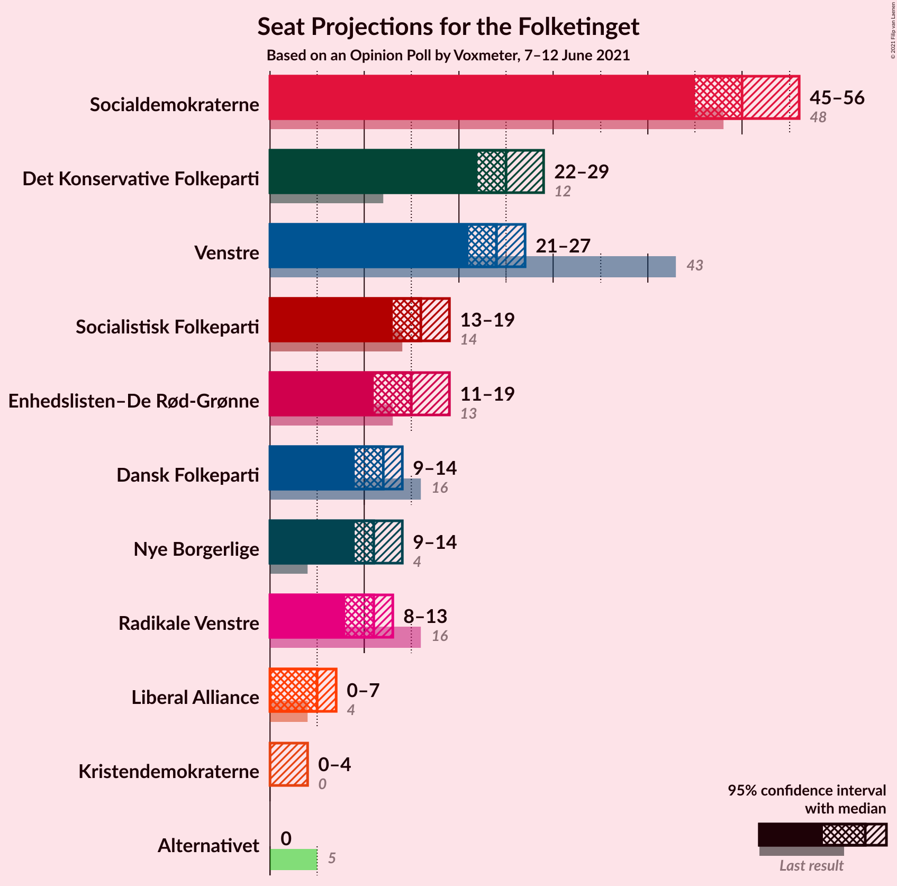

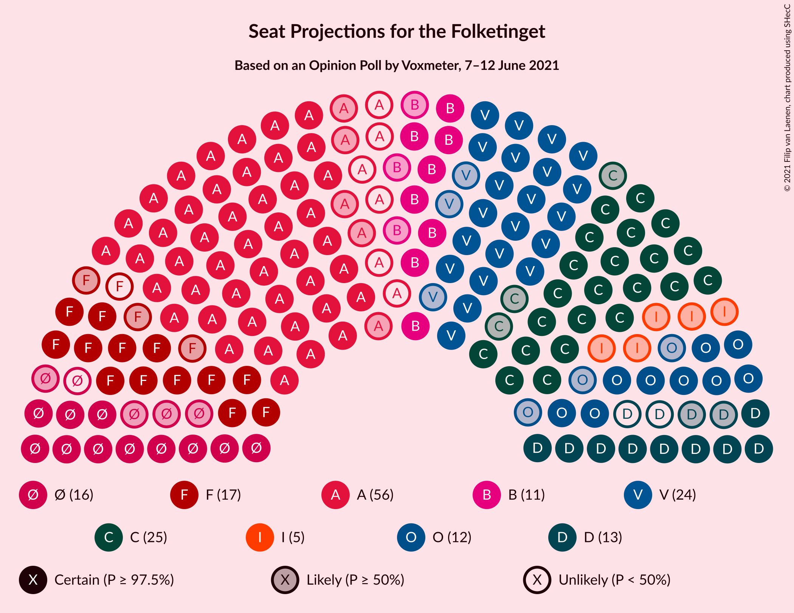

### Confidence Intervals

| Party | Last Result | Median | 80% Confidence Interval | 90% Confidence Interval | 95% Confidence Interval | 99% Confidence Interval |
|:-----:|:-----------:|:------:|:-----------------------:|:-----------------------:|:-----------------------:|:-----------------------:|
| <a href="#socialdemokraterne">Socialdemokraterne</a> | 48 | 50 | 47–54 |47–56 |45–56 |45–58 |
| <a href="#det-konservative-folkeparti">Det Konservative Folkeparti</a> | 12 | 25 | 22–28 |22–29 |22–29 |21–31 |
| <a href="#venstre">Venstre</a> | 43 | 24 | 22–26 |22–27 |21–27 |20–29 |
| <a href="#socialistisk-folkeparti">Socialistisk Folkeparti</a> | 14 | 16 | 13–17 |13–19 |13–19 |12–19 |
| <a href="#enhedslisten–de-rød-grønne">Enhedslisten–De Rød-Grønne</a> | 13 | 15 | 13–18 |12–19 |11–19 |11–20 |
| <a href="#dansk-folkeparti">Dansk Folkeparti</a> | 16 | 12 | 10–13 |9–14 |9–14 |8–17 |
| <a href="#nye-borgerlige">Nye Borgerlige</a> | 4 | 11 | 10–13 |9–14 |9–14 |8–16 |
| <a href="#radikale-venstre">Radikale Venstre</a> | 16 | 11 | 9–12 |8–13 |8–13 |7–15 |
| <a href="#liberal-alliance">Liberal Alliance</a> | 4 | 5 | 0–6 |0–7 |0–7 |0–8 |
| <a href="#kristendemokraterne">Kristendemokraterne</a> | 0 | 0 | 0–4 |0–4 |0–4 |0–4 |
| <a href="#alternativet">Alternativet</a> | 5 | 0 | 0 |0 |0 |0–4 |

### Socialdemokraterne

*For a full overview of the results for this party, see the [Socialdemokraterne](party-socialdemokraterne.html) page.*

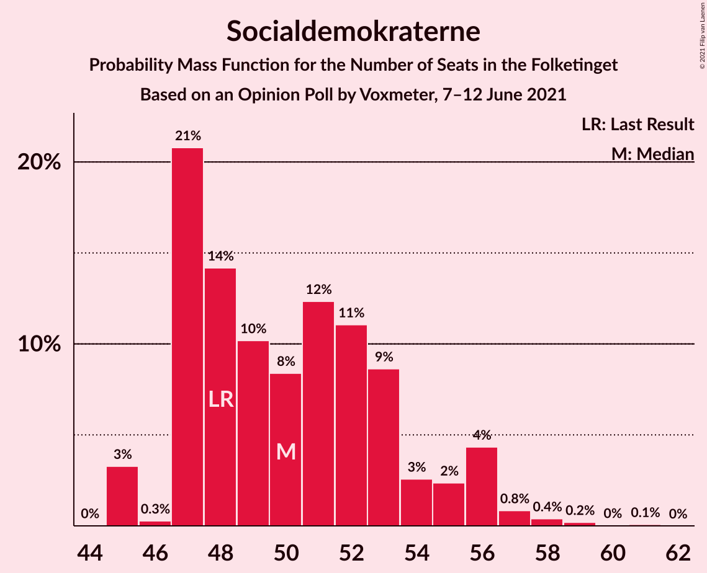

| Number of Seats | Probability | Accumulated | Special Marks |
|:---------------:|:-----------:|:-----------:|:-------------:|
| 44 | 0% | 100% |  |
| 45 | 3% | 99.9% |  |
| 46 | 0.3% | 97% |  |
| 47 | 21% | 96% |  |
| 48 | 14% | 76% | Last Result |
| 49 | 10% | 61% |  |
| 50 | 8% | 51% | Median |
| 51 | 12% | 43% |  |
| 52 | 11% | 31% |  |
| 53 | 9% | 19% |  |
| 54 | 3% | 11% |  |
| 55 | 2% | 8% |  |
| 56 | 4% | 6% |  |
| 57 | 0.8% | 2% |  |
| 58 | 0.4% | 0.7% |  |
| 59 | 0.2% | 0.3% |  |
| 60 | 0% | 0.1% |  |
| 61 | 0.1% | 0.1% |  |
| 62 | 0% | 0% |  |

### Det Konservative Folkeparti

*For a full overview of the results for this party, see the [Det Konservative Folkeparti](party-detkonservativefolkeparti.html) page.*

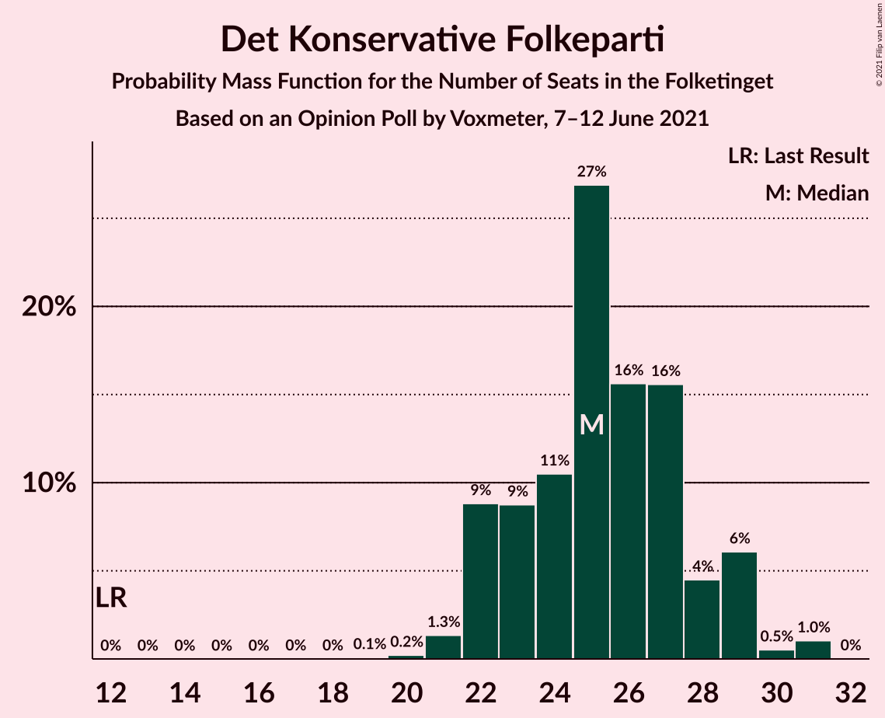

| Number of Seats | Probability | Accumulated | Special Marks |
|:---------------:|:-----------:|:-----------:|:-------------:|
| 12 | 0% | 100% | Last Result |
| 13 | 0% | 100% |  |
| 14 | 0% | 100% |  |
| 15 | 0% | 100% |  |
| 16 | 0% | 100% |  |
| 17 | 0% | 100% |  |
| 18 | 0% | 100% |  |
| 19 | 0.1% | 100% |  |
| 20 | 0.2% | 99.9% |  |
| 21 | 1.3% | 99.7% |  |
| 22 | 9% | 98% |  |
| 23 | 9% | 90% |  |
| 24 | 11% | 81% |  |
| 25 | 27% | 70% | Median |
| 26 | 16% | 43% |  |
| 27 | 16% | 28% |  |
| 28 | 4% | 12% |  |
| 29 | 6% | 8% |  |
| 30 | 0.5% | 2% |  |
| 31 | 1.0% | 1.1% |  |
| 32 | 0% | 0% |  |

### Venstre

*For a full overview of the results for this party, see the [Venstre](party-venstre.html) page.*

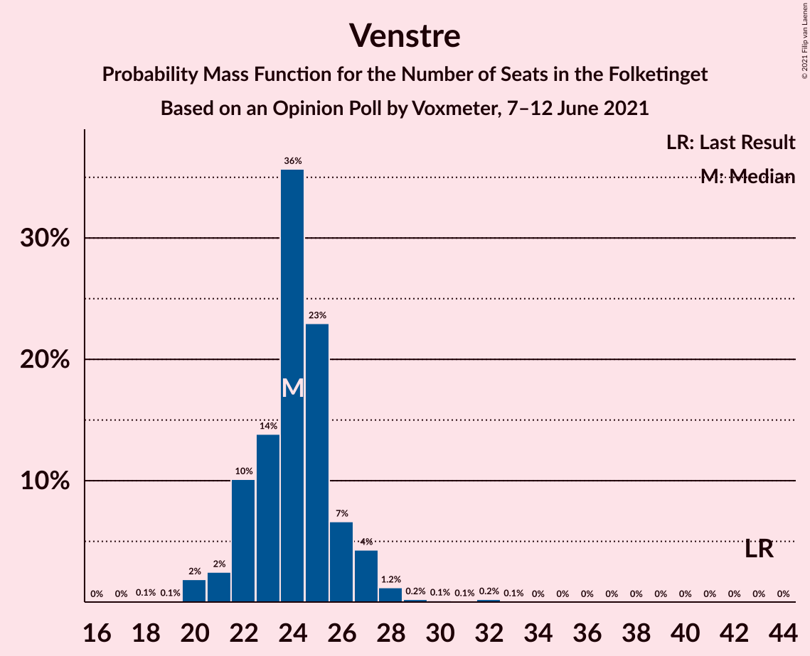

| Number of Seats | Probability | Accumulated | Special Marks |
|:---------------:|:-----------:|:-----------:|:-------------:|
| 18 | 0.1% | 100% |  |
| 19 | 0.1% | 99.9% |  |
| 20 | 2% | 99.8% |  |
| 21 | 2% | 98% |  |
| 22 | 10% | 95% |  |
| 23 | 14% | 85% |  |
| 24 | 36% | 71% | Median |
| 25 | 23% | 36% |  |
| 26 | 7% | 13% |  |
| 27 | 4% | 6% |  |
| 28 | 1.2% | 2% |  |
| 29 | 0.2% | 0.7% |  |
| 30 | 0.1% | 0.5% |  |
| 31 | 0.1% | 0.4% |  |
| 32 | 0.2% | 0.3% |  |
| 33 | 0.1% | 0.1% |  |
| 34 | 0% | 0% |  |
| 35 | 0% | 0% |  |
| 36 | 0% | 0% |  |
| 37 | 0% | 0% |  |
| 38 | 0% | 0% |  |
| 39 | 0% | 0% |  |
| 40 | 0% | 0% |  |
| 41 | 0% | 0% |  |
| 42 | 0% | 0% |  |
| 43 | 0% | 0% | Last Result |

### Socialistisk Folkeparti

*For a full overview of the results for this party, see the [Socialistisk Folkeparti](party-socialistiskfolkeparti.html) page.*

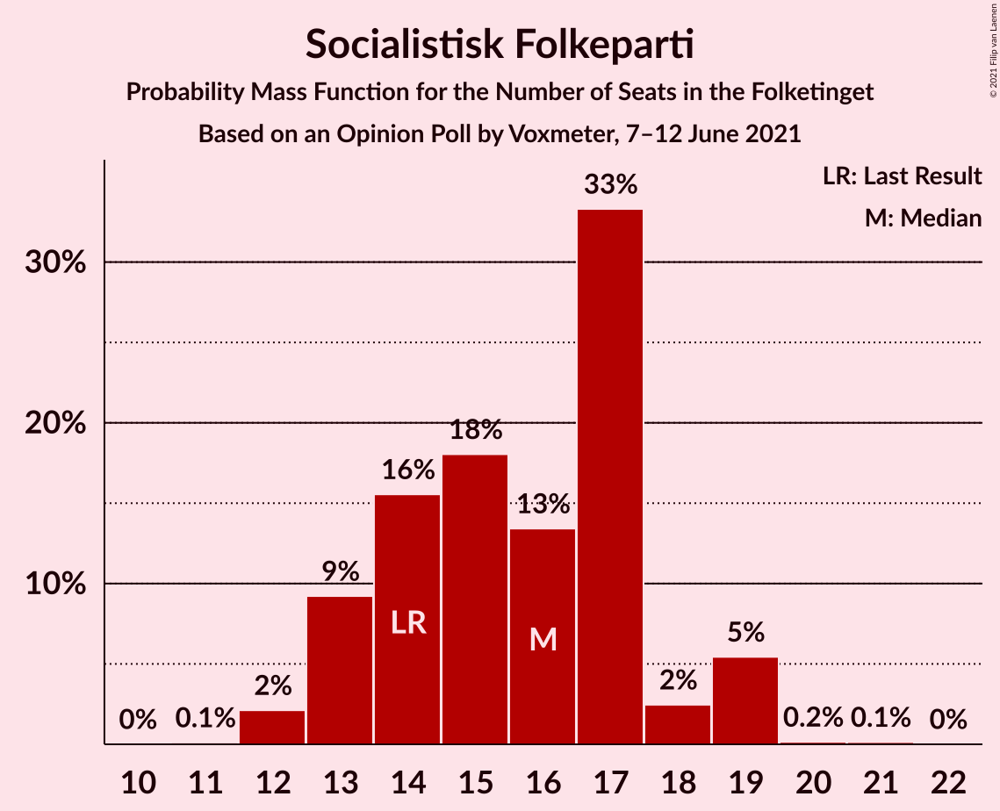

| Number of Seats | Probability | Accumulated | Special Marks |
|:---------------:|:-----------:|:-----------:|:-------------:|
| 11 | 0.1% | 100% |  |
| 12 | 2% | 99.9% |  |
| 13 | 9% | 98% |  |
| 14 | 16% | 89% | Last Result |
| 15 | 18% | 73% |  |
| 16 | 13% | 55% | Median |
| 17 | 33% | 42% |  |
| 18 | 2% | 8% |  |
| 19 | 5% | 6% |  |
| 20 | 0.2% | 0.3% |  |
| 21 | 0.1% | 0.1% |  |
| 22 | 0% | 0% |  |

### Enhedslisten–De Rød-Grønne

*For a full overview of the results for this party, see the [Enhedslisten–De Rød-Grønne](party-enhedslisten–derød-grønne.html) page.*

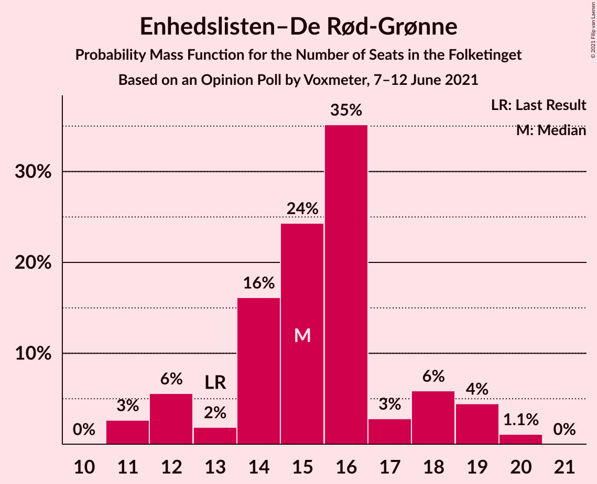

| Number of Seats | Probability | Accumulated | Special Marks |
|:---------------:|:-----------:|:-----------:|:-------------:|
| 11 | 3% | 100% |  |
| 12 | 6% | 97% |  |
| 13 | 2% | 92% | Last Result |
| 14 | 16% | 90% |  |
| 15 | 24% | 74% | Median |
| 16 | 35% | 49% |  |
| 17 | 3% | 14% |  |
| 18 | 6% | 11% |  |
| 19 | 4% | 6% |  |
| 20 | 1.1% | 1.1% |  |
| 21 | 0% | 0% |  |

### Dansk Folkeparti

*For a full overview of the results for this party, see the [Dansk Folkeparti](party-danskfolkeparti.html) page.*

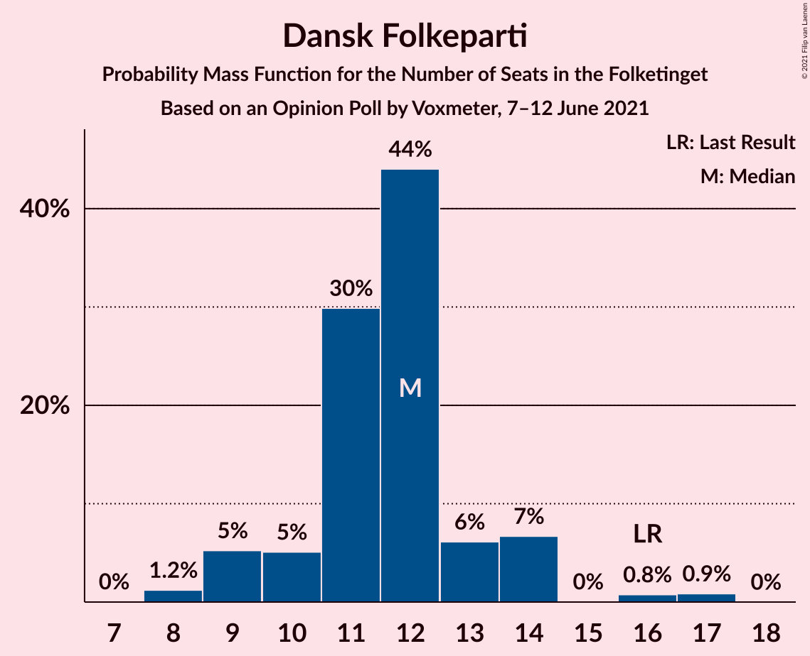

| Number of Seats | Probability | Accumulated | Special Marks |
|:---------------:|:-----------:|:-----------:|:-------------:|
| 8 | 1.2% | 100% |  |
| 9 | 5% | 98.7% |  |
| 10 | 5% | 93% |  |
| 11 | 30% | 88% |  |
| 12 | 44% | 59% | Median |
| 13 | 6% | 14% |  |
| 14 | 7% | 8% |  |
| 15 | 0% | 2% |  |
| 16 | 0.8% | 2% | Last Result |
| 17 | 0.9% | 0.9% |  |
| 18 | 0% | 0% |  |

### Nye Borgerlige

*For a full overview of the results for this party, see the [Nye Borgerlige](party-nyeborgerlige.html) page.*

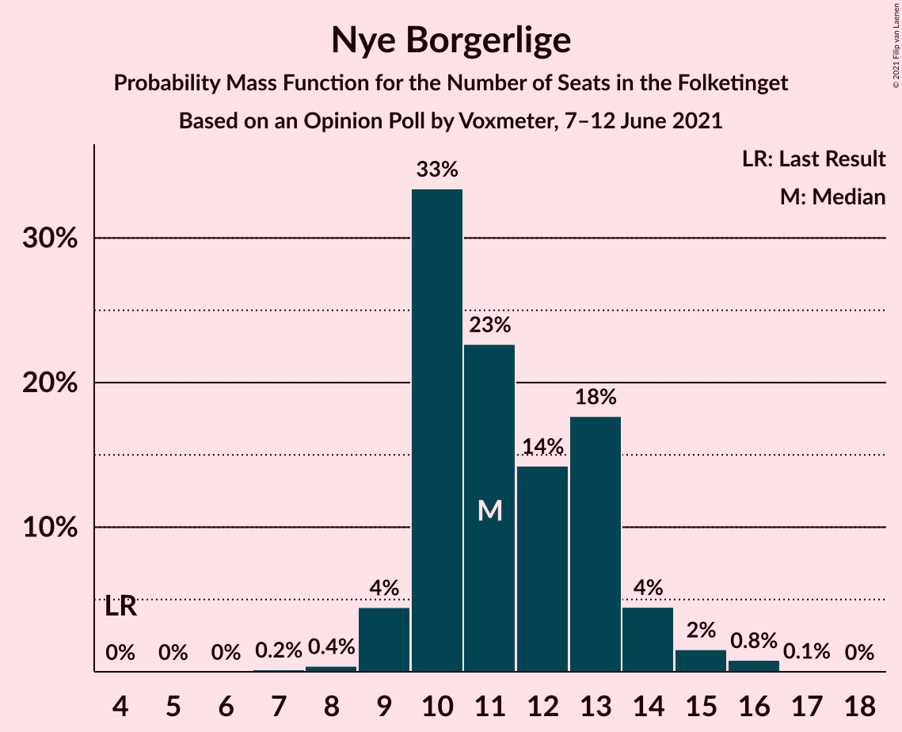

| Number of Seats | Probability | Accumulated | Special Marks |
|:---------------:|:-----------:|:-----------:|:-------------:|
| 4 | 0% | 100% | Last Result |
| 5 | 0% | 100% |  |
| 6 | 0% | 100% |  |
| 7 | 0.2% | 100% |  |
| 8 | 0.4% | 99.8% |  |
| 9 | 4% | 99.4% |  |
| 10 | 33% | 95% |  |
| 11 | 23% | 62% | Median |
| 12 | 14% | 39% |  |
| 13 | 18% | 25% |  |
| 14 | 4% | 7% |  |
| 15 | 2% | 2% |  |
| 16 | 0.8% | 0.9% |  |
| 17 | 0.1% | 0.1% |  |
| 18 | 0% | 0% |  |

### Radikale Venstre

*For a full overview of the results for this party, see the [Radikale Venstre](party-radikalevenstre.html) page.*

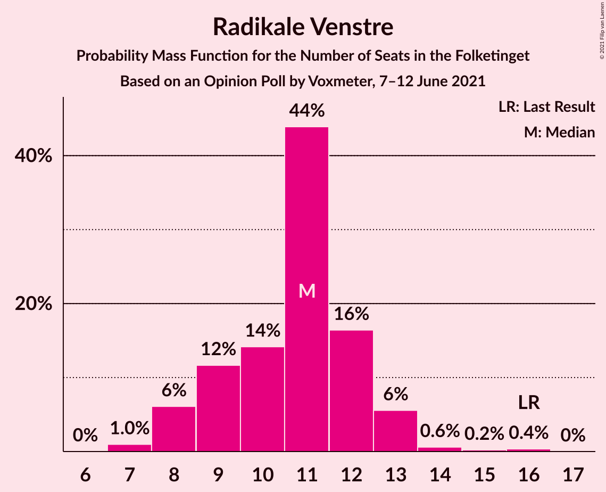

| Number of Seats | Probability | Accumulated | Special Marks |
|:---------------:|:-----------:|:-----------:|:-------------:|
| 7 | 1.0% | 100% |  |
| 8 | 6% | 99.0% |  |
| 9 | 12% | 93% |  |
| 10 | 14% | 81% |  |
| 11 | 44% | 67% | Median |
| 12 | 16% | 23% |  |
| 13 | 6% | 7% |  |
| 14 | 0.6% | 1.2% |  |
| 15 | 0.2% | 0.6% |  |
| 16 | 0.4% | 0.4% | Last Result |
| 17 | 0% | 0% |  |

### Liberal Alliance

*For a full overview of the results for this party, see the [Liberal Alliance](party-liberalalliance.html) page.*

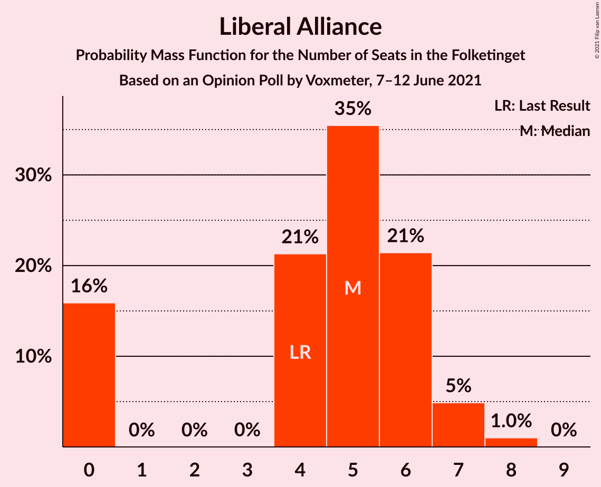

| Number of Seats | Probability | Accumulated | Special Marks |
|:---------------:|:-----------:|:-----------:|:-------------:|
| 0 | 16% | 100% |  |
| 1 | 0% | 84% |  |
| 2 | 0% | 84% |  |
| 3 | 0% | 84% |  |
| 4 | 21% | 84% | Last Result |
| 5 | 35% | 63% | Median |
| 6 | 21% | 27% |  |
| 7 | 5% | 6% |  |
| 8 | 1.0% | 1.0% |  |
| 9 | 0% | 0% |  |

### Kristendemokraterne

*For a full overview of the results for this party, see the [Kristendemokraterne](party-kristendemokraterne.html) page.*

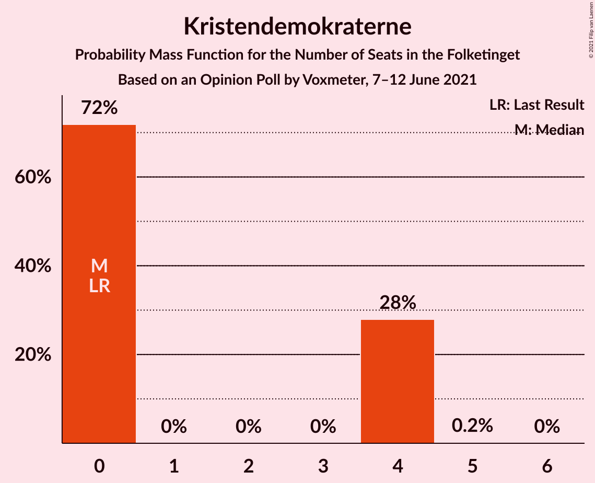

| Number of Seats | Probability | Accumulated | Special Marks |
|:---------------:|:-----------:|:-----------:|:-------------:|
| 0 | 72% | 100% | Last Result, Median |
| 1 | 0% | 28% |  |
| 2 | 0% | 28% |  |
| 3 | 0% | 28% |  |
| 4 | 28% | 28% |  |
| 5 | 0.2% | 0.2% |  |
| 6 | 0% | 0% |  |

### Alternativet

*For a full overview of the results for this party, see the [Alternativet](party-alternativet.html) page.*

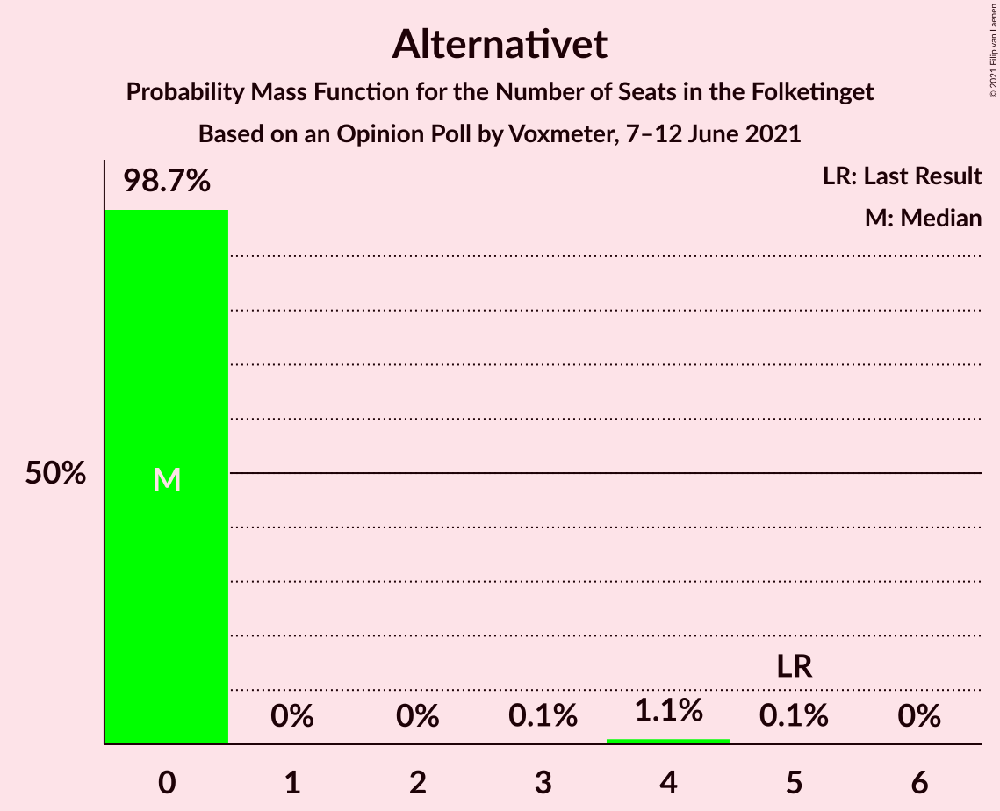

| Number of Seats | Probability | Accumulated | Special Marks |
|:---------------:|:-----------:|:-----------:|:-------------:|
| 0 | 98.7% | 100% | Median |
| 1 | 0% | 1.3% |  |
| 2 | 0% | 1.3% |  |
| 3 | 0.1% | 1.3% |  |
| 4 | 1.1% | 1.2% |  |
| 5 | 0.1% | 0.1% | Last Result |
| 6 | 0% | 0% |  |

## Coalitions

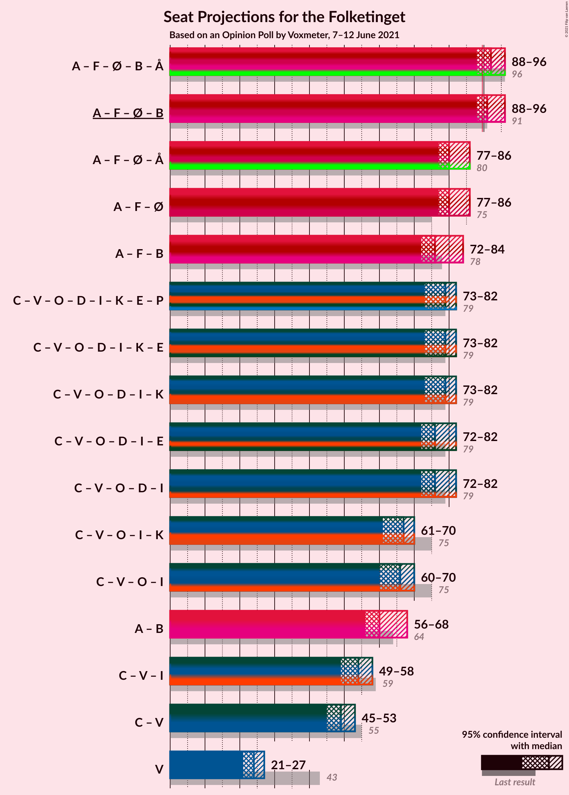

### Confidence Intervals

| Coalition | Last Result | Median | Majority? | 80% Confidence Interval | 90% Confidence Interval | 95% Confidence Interval | 99% Confidence Interval |
|:---------:|:-----------:|:------:|:---------:|:-----------------------:|:-----------------------:|:-----------------------:|:-----------------------:|
| Socialdemokraterne – Socialistisk Folkeparti – Enhedslisten–De Rød-Grønne – Radikale Venstre – Alternativet | 96 | 92 | 83% | 89–95 | 89–96 | 88–96 | 86–100 |
| Socialdemokraterne – Socialistisk Folkeparti – Enhedslisten–De Rød-Grønne – Radikale Venstre | 91 | 91 | 83% | 89–95 | 89–96 | 88–96 | 86–99 |
| Socialdemokraterne – Socialistisk Folkeparti – Enhedslisten–De Rød-Grønne – Alternativet | 80 | 80 | 0.2% | 79–84 | 78–86 | 77–86 | 75–88 |
| Socialdemokraterne – Socialistisk Folkeparti – Enhedslisten–De Rød-Grønne | 75 | 80 | 0.1% | 78–84 | 78–86 | 77–86 | 75–88 |
| Socialdemokraterne – Socialistisk Folkeparti – Radikale Venstre | 78 | 76 | 0% | 74–81 | 73–82 | 72–84 | 71–85 |
| Det Konservative Folkeparti – Venstre – Dansk Folkeparti – Nye Borgerlige – Liberal Alliance – Kristendemokraterne | 79 | 79 | 0% | 74–81 | 73–82 | 73–82 | 70–85 |
| Det Konservative Folkeparti – Venstre – Dansk Folkeparti – Nye Borgerlige – Liberal Alliance | 79 | 76 | 0% | 74–81 | 73–82 | 72–82 | 69–85 |
| Det Konservative Folkeparti – Venstre – Dansk Folkeparti – Liberal Alliance – Kristendemokraterne | 75 | 67 | 0% | 63–70 | 62–70 | 61–70 | 57–73 |
| Det Konservative Folkeparti – Venstre – Dansk Folkeparti – Liberal Alliance | 75 | 66 | 0% | 62–69 | 61–69 | 60–70 | 57–73 |
| Socialdemokraterne – Radikale Venstre | 64 | 60 | 0% | 58–65 | 57–66 | 56–68 | 55–70 |
| Det Konservative Folkeparti – Venstre – Liberal Alliance | 59 | 54 | 0% | 51–56 | 50–58 | 49–58 | 47–59 |
| Det Konservative Folkeparti – Venstre | 55 | 49 | 0% | 47–52 | 46–52 | 45–53 | 43–56 |
| Venstre | 43 | 24 | 0% | 22–26 | 22–27 | 21–27 | 20–29 |

### Socialdemokraterne – Socialistisk Folkeparti – Enhedslisten–De Rød-Grønne – Radikale Venstre – Alternativet

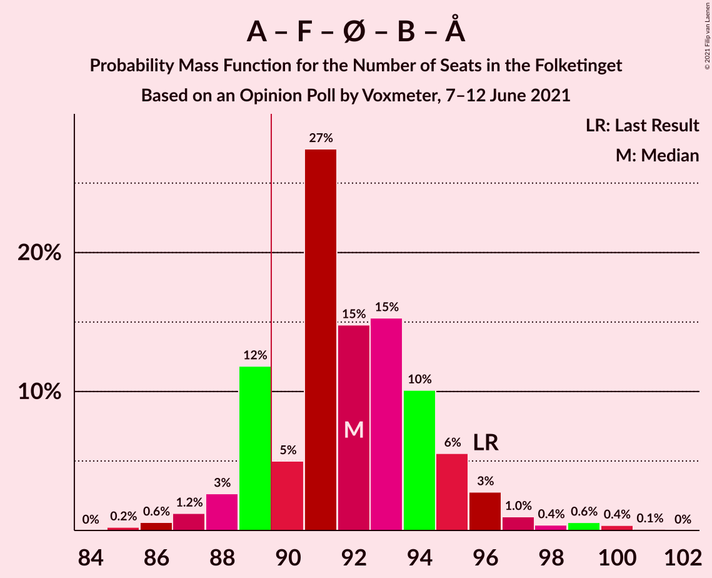

| Number of Seats | Probability | Accumulated | Special Marks |
|:---------------:|:-----------:|:-----------:|:-------------:|
| 85 | 0.2% | 100% |  |
| 86 | 0.6% | 99.7% |  |
| 87 | 1.2% | 99.2% |  |
| 88 | 3% | 98% |  |
| 89 | 12% | 95% |  |
| 90 | 5% | 83% | Majority |
| 91 | 27% | 78% |  |
| 92 | 15% | 51% | Median |
| 93 | 15% | 36% |  |
| 94 | 10% | 21% |  |
| 95 | 6% | 11% |  |
| 96 | 3% | 5% | Last Result |
| 97 | 1.0% | 2% |  |
| 98 | 0.4% | 1.5% |  |
| 99 | 0.6% | 1.1% |  |
| 100 | 0.4% | 0.5% |  |
| 101 | 0.1% | 0.1% |  |
| 102 | 0% | 0% |  |

### Socialdemokraterne – Socialistisk Folkeparti – Enhedslisten–De Rød-Grønne – Radikale Venstre

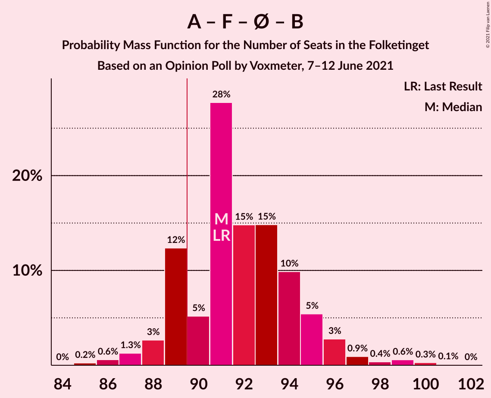

| Number of Seats | Probability | Accumulated | Special Marks |
|:---------------:|:-----------:|:-----------:|:-------------:|
| 85 | 0.2% | 100% |  |
| 86 | 0.6% | 99.7% |  |
| 87 | 1.3% | 99.2% |  |
| 88 | 3% | 98% |  |
| 89 | 12% | 95% |  |
| 90 | 5% | 83% | Majority |
| 91 | 28% | 78% | Last Result |
| 92 | 15% | 50% | Median |
| 93 | 15% | 35% |  |
| 94 | 10% | 20% |  |
| 95 | 5% | 10% |  |
| 96 | 3% | 5% |  |
| 97 | 0.9% | 2% |  |
| 98 | 0.4% | 1.3% |  |
| 99 | 0.6% | 1.0% |  |
| 100 | 0.3% | 0.4% |  |
| 101 | 0.1% | 0.1% |  |
| 102 | 0% | 0% |  |

### Socialdemokraterne – Socialistisk Folkeparti – Enhedslisten–De Rød-Grønne – Alternativet

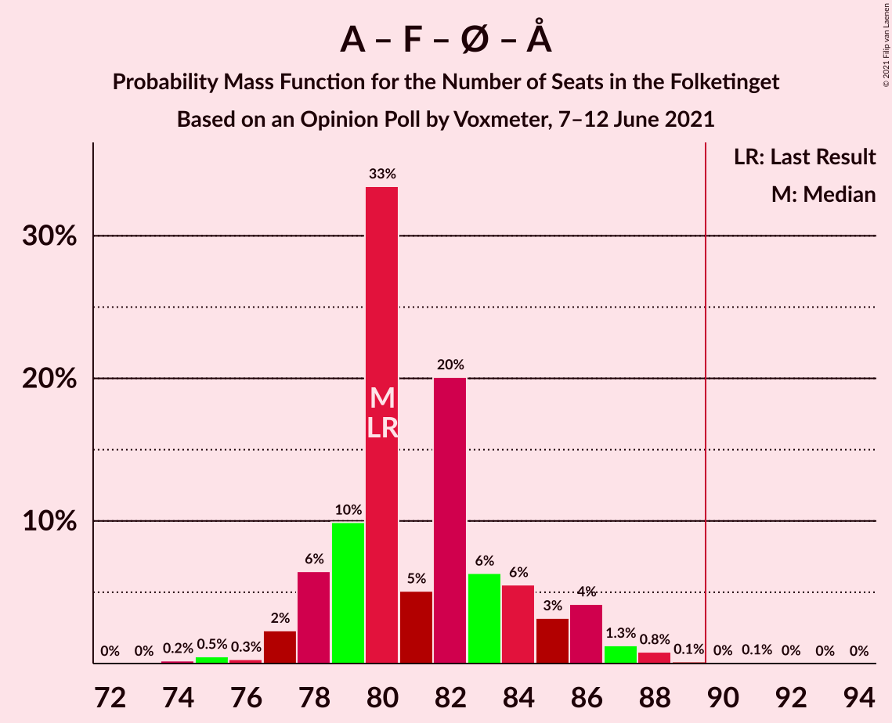

| Number of Seats | Probability | Accumulated | Special Marks |
|:---------------:|:-----------:|:-----------:|:-------------:|
| 74 | 0.2% | 100% |  |
| 75 | 0.5% | 99.8% |  |
| 76 | 0.3% | 99.3% |  |
| 77 | 2% | 99.0% |  |
| 78 | 6% | 97% |  |
| 79 | 10% | 90% |  |
| 80 | 33% | 80% | Last Result |
| 81 | 5% | 47% | Median |
| 82 | 20% | 42% |  |
| 83 | 6% | 22% |  |
| 84 | 6% | 15% |  |
| 85 | 3% | 10% |  |
| 86 | 4% | 7% |  |
| 87 | 1.3% | 2% |  |
| 88 | 0.8% | 1.2% |  |
| 89 | 0.1% | 0.3% |  |
| 90 | 0% | 0.2% | Majority |
| 91 | 0.1% | 0.2% |  |
| 92 | 0% | 0.1% |  |
| 93 | 0% | 0% |  |

### Socialdemokraterne – Socialistisk Folkeparti – Enhedslisten–De Rød-Grønne

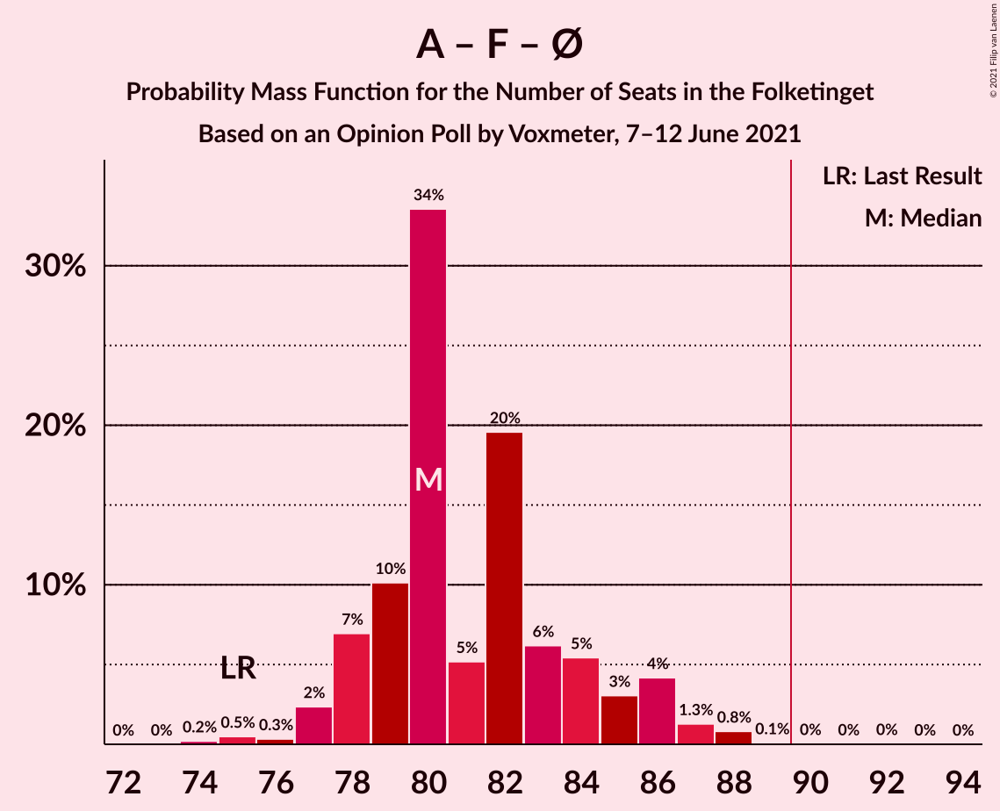

| Number of Seats | Probability | Accumulated | Special Marks |
|:---------------:|:-----------:|:-----------:|:-------------:|
| 74 | 0.2% | 100% |  |
| 75 | 0.5% | 99.8% | Last Result |
| 76 | 0.3% | 99.3% |  |
| 77 | 2% | 99.0% |  |
| 78 | 7% | 97% |  |
| 79 | 10% | 90% |  |
| 80 | 34% | 80% |  |
| 81 | 5% | 46% | Median |
| 82 | 20% | 41% |  |
| 83 | 6% | 21% |  |
| 84 | 5% | 15% |  |
| 85 | 3% | 10% |  |
| 86 | 4% | 6% |  |
| 87 | 1.3% | 2% |  |
| 88 | 0.8% | 1.0% |  |
| 89 | 0.1% | 0.2% |  |
| 90 | 0% | 0.1% | Majority |
| 91 | 0% | 0.1% |  |
| 92 | 0% | 0.1% |  |
| 93 | 0% | 0% |  |

### Socialdemokraterne – Socialistisk Folkeparti – Radikale Venstre

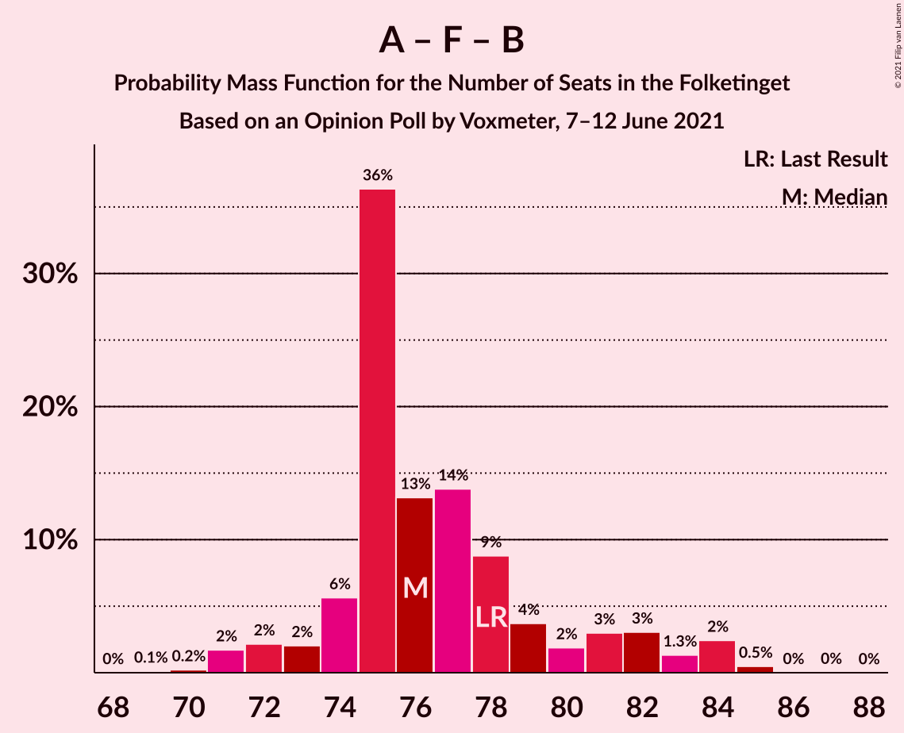

| Number of Seats | Probability | Accumulated | Special Marks |
|:---------------:|:-----------:|:-----------:|:-------------:|
| 69 | 0.1% | 100% |  |
| 70 | 0.2% | 99.9% |  |
| 71 | 2% | 99.6% |  |
| 72 | 2% | 98% |  |
| 73 | 2% | 96% |  |
| 74 | 6% | 94% |  |
| 75 | 36% | 88% |  |
| 76 | 13% | 52% |  |
| 77 | 14% | 39% | Median |
| 78 | 9% | 25% | Last Result |
| 79 | 4% | 16% |  |
| 80 | 2% | 12% |  |
| 81 | 3% | 10% |  |
| 82 | 3% | 7% |  |
| 83 | 1.3% | 4% |  |
| 84 | 2% | 3% |  |
| 85 | 0.5% | 0.6% |  |
| 86 | 0% | 0.1% |  |
| 87 | 0% | 0.1% |  |
| 88 | 0% | 0% |  |

### Det Konservative Folkeparti – Venstre – Dansk Folkeparti – Nye Borgerlige – Liberal Alliance – Kristendemokraterne

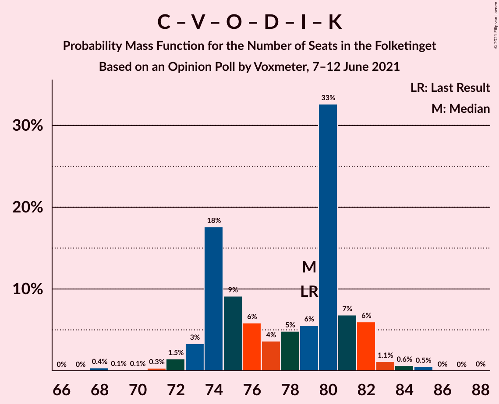

| Number of Seats | Probability | Accumulated | Special Marks |
|:---------------:|:-----------:|:-----------:|:-------------:|
| 68 | 0.4% | 100% |  |
| 69 | 0.1% | 99.6% |  |
| 70 | 0.1% | 99.5% |  |
| 71 | 0.3% | 99.4% |  |
| 72 | 1.5% | 99.1% |  |
| 73 | 3% | 98% |  |
| 74 | 18% | 94% |  |
| 75 | 9% | 77% |  |
| 76 | 6% | 68% |  |
| 77 | 4% | 62% | Median |
| 78 | 5% | 58% |  |
| 79 | 6% | 53% | Last Result |
| 80 | 33% | 48% |  |
| 81 | 7% | 15% |  |
| 82 | 6% | 8% |  |
| 83 | 1.1% | 2% |  |
| 84 | 0.6% | 1.2% |  |
| 85 | 0.5% | 0.6% |  |
| 86 | 0% | 0.1% |  |
| 87 | 0% | 0.1% |  |
| 88 | 0% | 0% |  |

### Det Konservative Folkeparti – Venstre – Dansk Folkeparti – Nye Borgerlige – Liberal Alliance

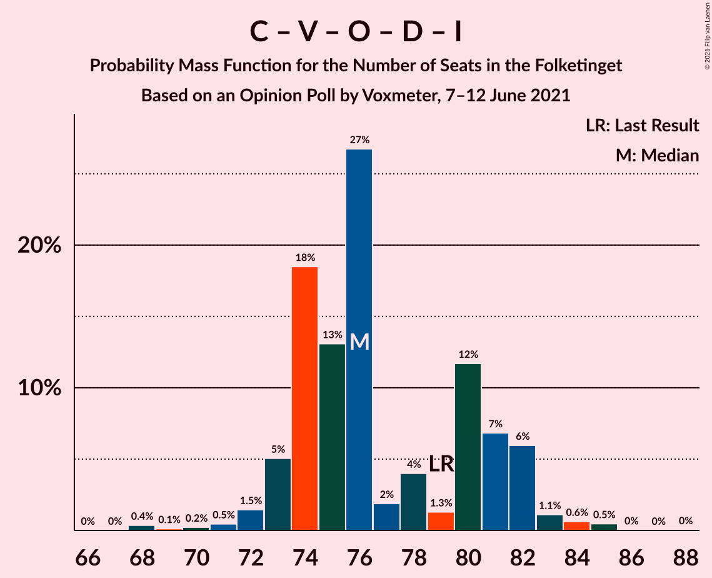

| Number of Seats | Probability | Accumulated | Special Marks |
|:---------------:|:-----------:|:-----------:|:-------------:|
| 68 | 0.4% | 100% |  |
| 69 | 0.1% | 99.6% |  |
| 70 | 0.2% | 99.5% |  |
| 71 | 0.5% | 99.3% |  |
| 72 | 1.5% | 98.8% |  |
| 73 | 5% | 97% |  |
| 74 | 18% | 92% |  |
| 75 | 13% | 74% |  |
| 76 | 27% | 61% |  |
| 77 | 2% | 34% | Median |
| 78 | 4% | 32% |  |
| 79 | 1.3% | 28% | Last Result |
| 80 | 12% | 27% |  |
| 81 | 7% | 15% |  |
| 82 | 6% | 8% |  |
| 83 | 1.1% | 2% |  |
| 84 | 0.6% | 1.2% |  |
| 85 | 0.5% | 0.5% |  |
| 86 | 0% | 0.1% |  |
| 87 | 0% | 0% |  |

### Det Konservative Folkeparti – Venstre – Dansk Folkeparti – Liberal Alliance – Kristendemokraterne

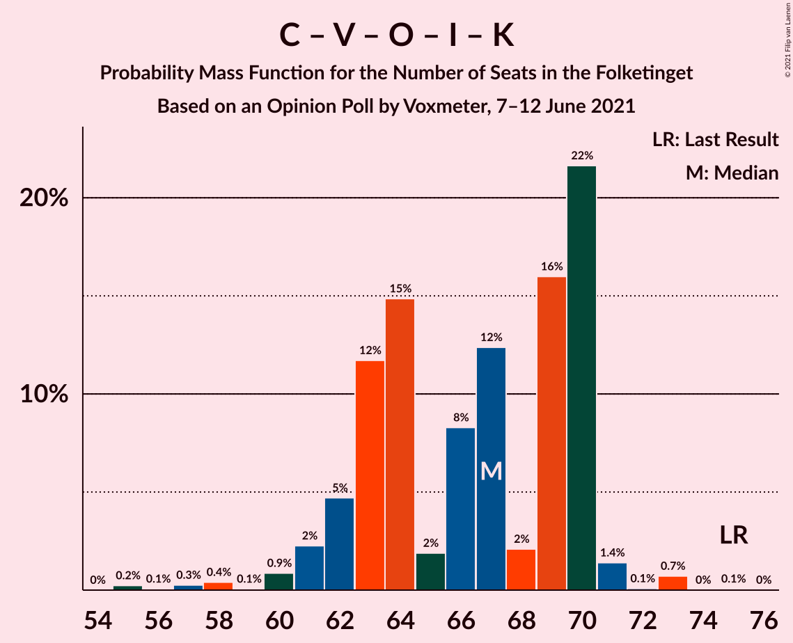

| Number of Seats | Probability | Accumulated | Special Marks |
|:---------------:|:-----------:|:-----------:|:-------------:|
| 55 | 0.2% | 100% |  |
| 56 | 0.1% | 99.8% |  |
| 57 | 0.3% | 99.7% |  |
| 58 | 0.4% | 99.4% |  |
| 59 | 0.1% | 99.0% |  |
| 60 | 0.9% | 99.0% |  |
| 61 | 2% | 98% |  |
| 62 | 5% | 96% |  |
| 63 | 12% | 91% |  |
| 64 | 15% | 79% |  |
| 65 | 2% | 65% |  |
| 66 | 8% | 63% | Median |
| 67 | 12% | 54% |  |
| 68 | 2% | 42% |  |
| 69 | 16% | 40% |  |
| 70 | 22% | 24% |  |
| 71 | 1.4% | 2% |  |
| 72 | 0.1% | 0.9% |  |
| 73 | 0.7% | 0.8% |  |
| 74 | 0% | 0.1% |  |
| 75 | 0.1% | 0.1% | Last Result |
| 76 | 0% | 0% |  |

### Det Konservative Folkeparti – Venstre – Dansk Folkeparti – Liberal Alliance

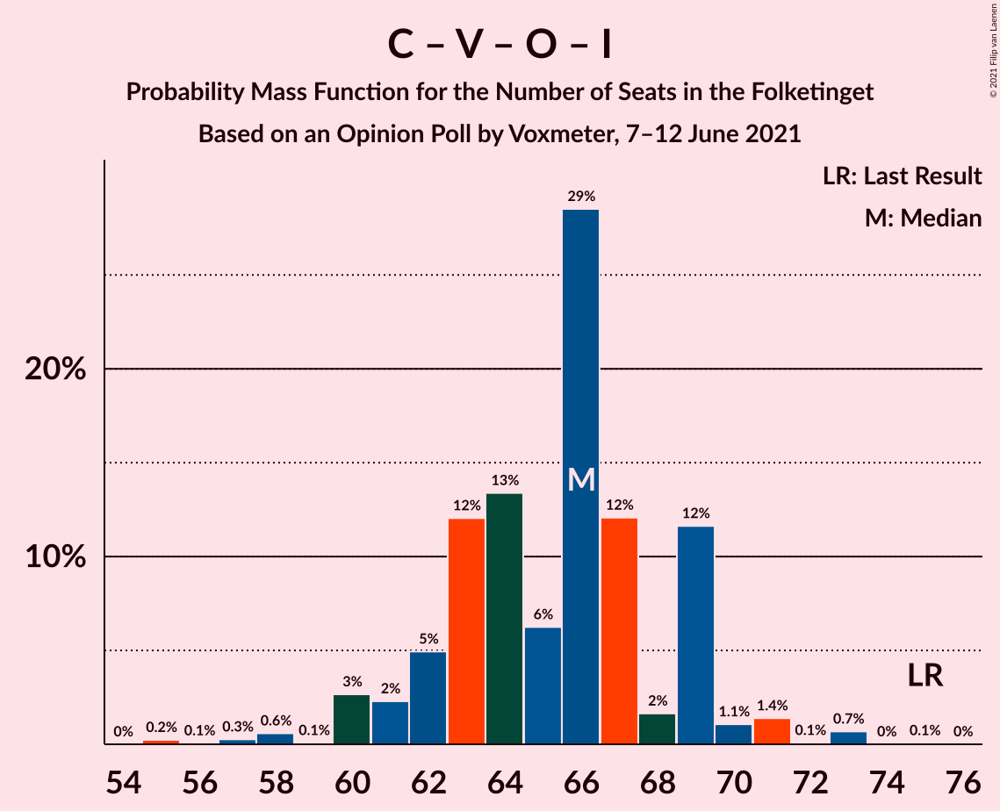

| Number of Seats | Probability | Accumulated | Special Marks |
|:---------------:|:-----------:|:-----------:|:-------------:|
| 55 | 0.2% | 100% |  |
| 56 | 0.1% | 99.7% |  |
| 57 | 0.3% | 99.7% |  |
| 58 | 0.6% | 99.4% |  |
| 59 | 0.1% | 98.8% |  |
| 60 | 3% | 98.8% |  |
| 61 | 2% | 96% |  |
| 62 | 5% | 94% |  |
| 63 | 12% | 89% |  |
| 64 | 13% | 77% |  |
| 65 | 6% | 63% |  |
| 66 | 29% | 57% | Median |
| 67 | 12% | 29% |  |
| 68 | 2% | 17% |  |
| 69 | 12% | 15% |  |
| 70 | 1.1% | 3% |  |
| 71 | 1.4% | 2% |  |
| 72 | 0.1% | 0.8% |  |
| 73 | 0.7% | 0.8% |  |
| 74 | 0% | 0.1% |  |
| 75 | 0.1% | 0.1% | Last Result |
| 76 | 0% | 0% |  |

### Socialdemokraterne – Radikale Venstre

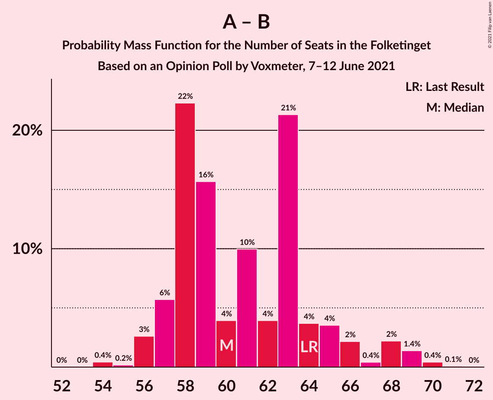

| Number of Seats | Probability | Accumulated | Special Marks |
|:---------------:|:-----------:|:-----------:|:-------------:|
| 54 | 0.4% | 100% |  |
| 55 | 0.2% | 99.5% |  |
| 56 | 3% | 99.4% |  |
| 57 | 6% | 97% |  |
| 58 | 22% | 91% |  |
| 59 | 16% | 69% |  |
| 60 | 4% | 53% |  |
| 61 | 10% | 49% | Median |
| 62 | 4% | 39% |  |
| 63 | 21% | 35% |  |
| 64 | 4% | 14% | Last Result |
| 65 | 4% | 10% |  |
| 66 | 2% | 7% |  |
| 67 | 0.4% | 5% |  |
| 68 | 2% | 4% |  |
| 69 | 1.4% | 2% |  |
| 70 | 0.4% | 0.5% |  |
| 71 | 0.1% | 0.1% |  |
| 72 | 0% | 0% |  |

### Det Konservative Folkeparti – Venstre – Liberal Alliance

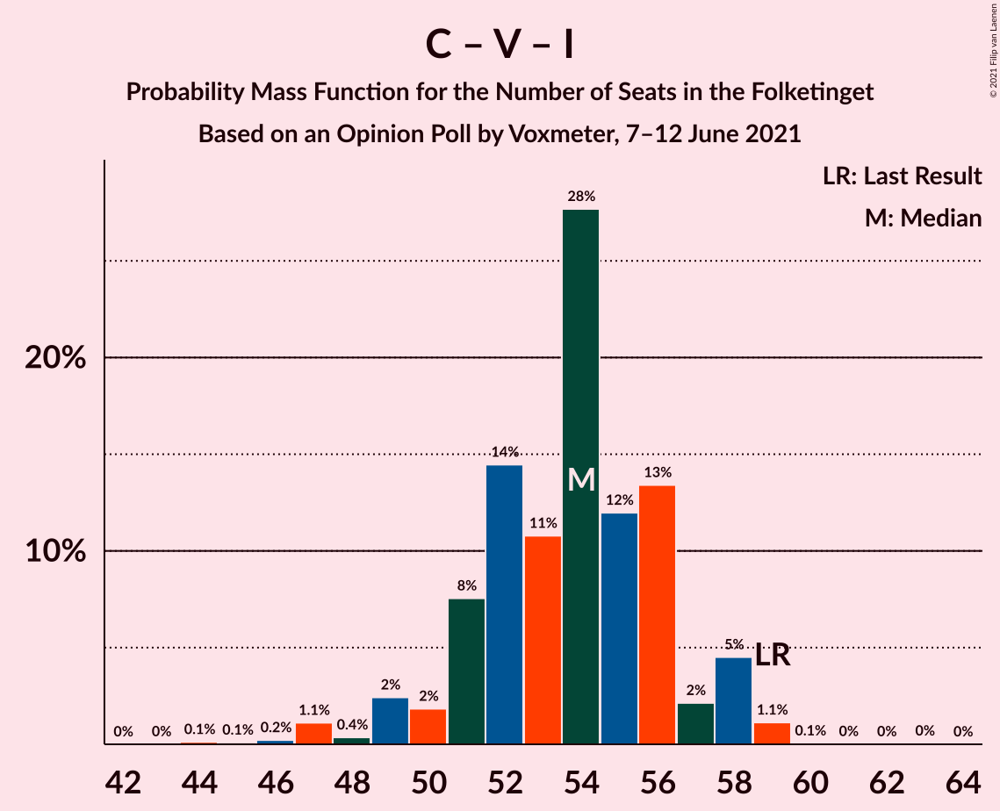

| Number of Seats | Probability | Accumulated | Special Marks |
|:---------------:|:-----------:|:-----------:|:-------------:|
| 44 | 0.1% | 100% |  |
| 45 | 0.1% | 99.9% |  |
| 46 | 0.2% | 99.8% |  |
| 47 | 1.1% | 99.5% |  |
| 48 | 0.4% | 98% |  |
| 49 | 2% | 98% |  |
| 50 | 2% | 96% |  |
| 51 | 8% | 94% |  |
| 52 | 14% | 86% |  |
| 53 | 11% | 72% |  |
| 54 | 28% | 61% | Median |
| 55 | 12% | 33% |  |
| 56 | 13% | 21% |  |
| 57 | 2% | 8% |  |
| 58 | 5% | 6% |  |
| 59 | 1.1% | 1.3% | Last Result |
| 60 | 0.1% | 0.1% |  |
| 61 | 0% | 0.1% |  |
| 62 | 0% | 0.1% |  |
| 63 | 0% | 0% |  |

### Det Konservative Folkeparti – Venstre

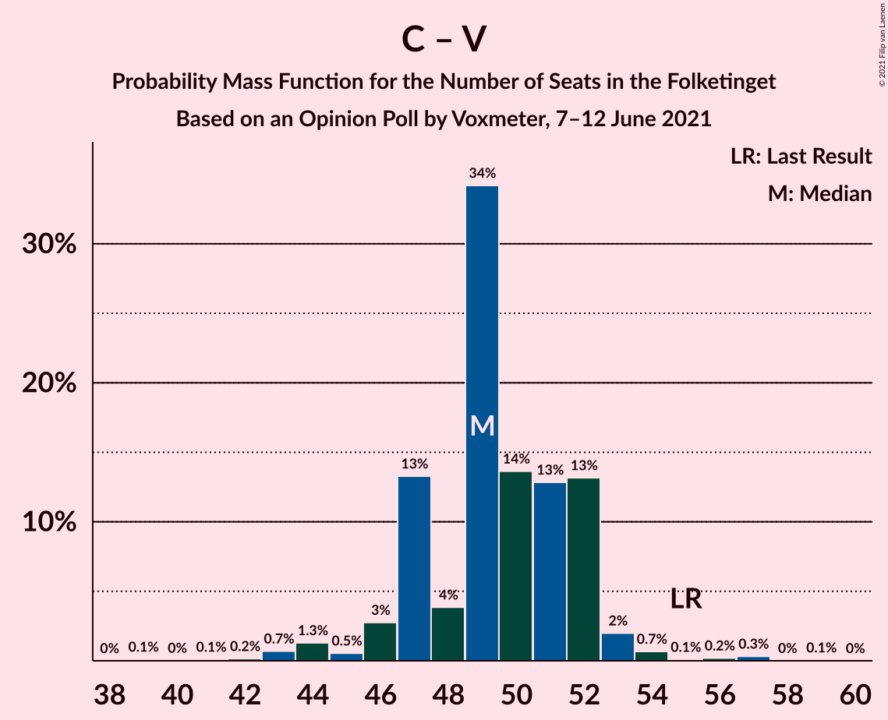

| Number of Seats | Probability | Accumulated | Special Marks |
|:---------------:|:-----------:|:-----------:|:-------------:|
| 39 | 0.1% | 100% |  |
| 40 | 0% | 99.9% |  |
| 41 | 0.1% | 99.9% |  |
| 42 | 0.2% | 99.8% |  |
| 43 | 0.7% | 99.6% |  |
| 44 | 1.3% | 98.9% |  |
| 45 | 0.5% | 98% |  |
| 46 | 3% | 97% |  |
| 47 | 13% | 94% |  |
| 48 | 4% | 81% |  |
| 49 | 34% | 77% | Median |
| 50 | 14% | 43% |  |
| 51 | 13% | 29% |  |
| 52 | 13% | 17% |  |
| 53 | 2% | 3% |  |
| 54 | 0.7% | 1.3% |  |
| 55 | 0.1% | 0.7% | Last Result |
| 56 | 0.2% | 0.6% |  |
| 57 | 0.3% | 0.4% |  |
| 58 | 0% | 0.1% |  |
| 59 | 0.1% | 0.1% |  |
| 60 | 0% | 0% |  |

### Venstre

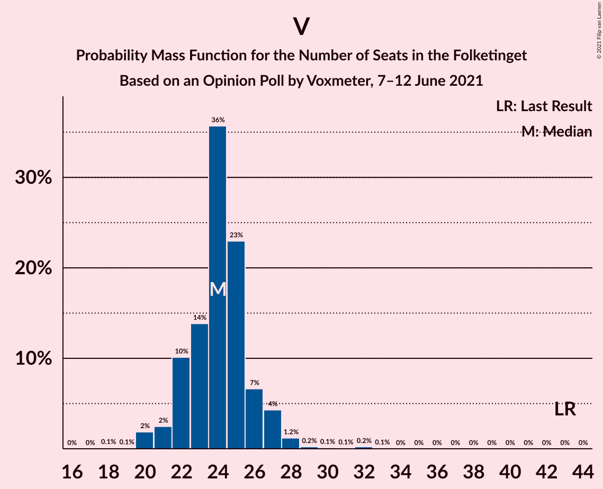

| Number of Seats | Probability | Accumulated | Special Marks |
|:---------------:|:-----------:|:-----------:|:-------------:|
| 18 | 0.1% | 100% |  |
| 19 | 0.1% | 99.9% |  |
| 20 | 2% | 99.8% |  |
| 21 | 2% | 98% |  |
| 22 | 10% | 95% |  |
| 23 | 14% | 85% |  |
| 24 | 36% | 71% | Median |
| 25 | 23% | 36% |  |
| 26 | 7% | 13% |  |
| 27 | 4% | 6% |  |
| 28 | 1.2% | 2% |  |
| 29 | 0.2% | 0.7% |  |
| 30 | 0.1% | 0.5% |  |
| 31 | 0.1% | 0.4% |  |
| 32 | 0.2% | 0.3% |  |
| 33 | 0.1% | 0.1% |  |
| 34 | 0% | 0% |  |
| 35 | 0% | 0% |  |
| 36 | 0% | 0% |  |
| 37 | 0% | 0% |  |
| 38 | 0% | 0% |  |
| 39 | 0% | 0% |  |
| 40 | 0% | 0% |  |
| 41 | 0% | 0% |  |
| 42 | 0% | 0% |  |
| 43 | 0% | 0% | Last Result |

## Technical Information

### Opinion Poll

+ **Polling firm:** Voxmeter
+ **Commissioner(s):** —
+ **Fieldwork period:** 7–12 June 2021

### Calculations

+ **Sample size:** 1030
+ **Simulations done:** 131,072
+ **Error estimate:** 1.20%

