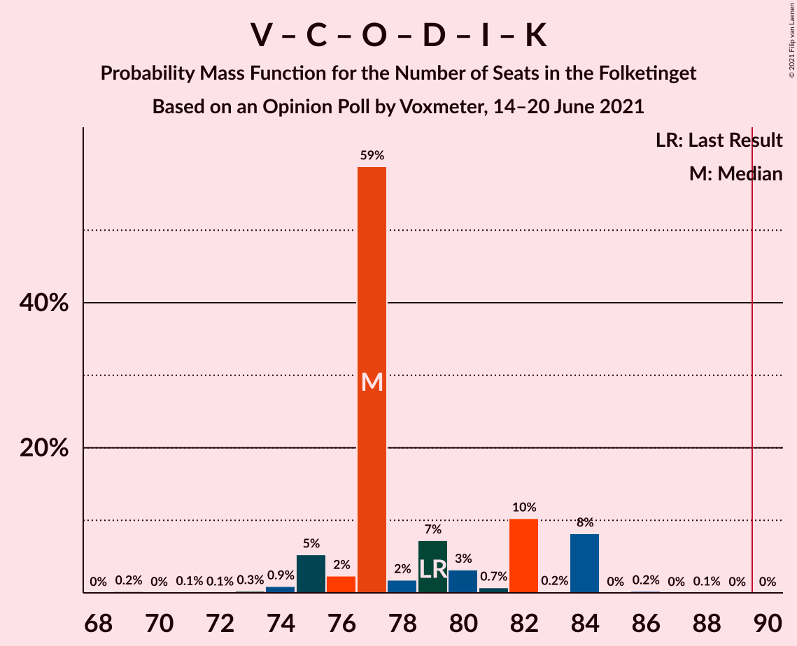

# Opinion Poll by Voxmeter, 14–20 June 2021

<a href="#voting-intentions">Voting Intentions</a> | <a href="#seats">Seats</a> | <a href="#coalitions">Coalitions</a> | <a href="#technical-information">Technical Information</a>

## Voting Intentions

### Confidence Intervals

| Party | Last Result | Poll Result | 80% Confidence Interval | 90% Confidence Interval | 95% Confidence Interval | 99% Confidence Interval |
|:-----:|:-----------:|:-----------:|:-----------------------:|:-----------------------:|:-----------------------:|:-----------------------:|
| Socialdemokraterne | 25.9% | 28.4% | 26.6–30.2% |26.1–30.8% |25.7–31.2% |24.9–32.1% |
| Venstre | 23.4% | 14.6% | 13.2–16.1% |12.9–16.5% |12.5–16.9% |11.9–17.6% |
| Det Konservative Folkeparti | 6.6% | 13.8% | 12.5–15.3% |12.1–15.7% |11.8–16.0% |11.2–16.8% |
| Socialistisk Folkeparti | 7.7% | 9.1% | 8.0–10.4% |7.7–10.7% |7.5–11.0% |7.0–11.7% |
| Enhedslisten–De Rød-Grønne | 6.9% | 8.6% | 7.6–9.8% |7.3–10.2% |7.0–10.5% |6.6–11.1% |
| Dansk Folkeparti | 8.7% | 6.7% | 5.7–7.8% |5.5–8.1% |5.3–8.4% |4.9–8.9% |
| Nye Borgerlige | 2.4% | 6.7% | 5.7–7.8% |5.5–8.1% |5.3–8.4% |4.9–8.9% |
| Radikale Venstre | 8.6% | 5.3% | 4.5–6.3% |4.3–6.6% |4.1–6.8% |3.7–7.3% |
| Liberal Alliance | 2.3% | 1.8% | 1.3–2.4% |1.2–2.6% |1.1–2.8% |0.9–3.1% |
| Kristendemokraterne | 1.7% | 1.5% | 1.1–2.1% |1.0–2.3% |0.9–2.4% |0.7–2.7% |
| Alternativet | 3.0% | 0.8% | 0.5–1.3% |0.5–1.4% |0.4–1.5% |0.3–1.8% |
| Veganerpartiet | 0.0% | 0.1% | 0.0–0.4% |0.0–0.5% |0.0–0.5% |0.0–0.7% |

*Note:* The poll result column reflects the actual value used in the calculations. Published results may vary slightly, and in addition be rounded to fewer digits.

## Seats

### Confidence Intervals

| Party | Last Result | Median | 80% Confidence Interval | 90% Confidence Interval | 95% Confidence Interval | 99% Confidence Interval |
|:-----:|:-----------:|:------:|:-----------------------:|:-----------------------:|:-----------------------:|:-----------------------:|
| <a href="#socialdemokraterne">Socialdemokraterne</a> | 48 | 51 | 48–51 |48–51 |47–53 |45–55 |
| <a href="#venstre">Venstre</a> | 43 | 23 | 23–27 |23–29 |23–29 |22–30 |
| <a href="#det-konservative-folkeparti">Det Konservative Folkeparti</a> | 12 | 26 | 25–27 |24–27 |24–28 |22–30 |
| <a href="#socialistisk-folkeparti">Socialistisk Folkeparti</a> | 14 | 18 | 14–18 |14–20 |13–20 |13–20 |
| <a href="#enhedslisten–de-rød-grønne">Enhedslisten–De Rød-Grønne</a> | 13 | 14 | 14–16 |12–18 |12–18 |12–19 |
| <a href="#dansk-folkeparti">Dansk Folkeparti</a> | 16 | 10 | 10–13 |9–14 |9–14 |9–16 |
| <a href="#nye-borgerlige">Nye Borgerlige</a> | 4 | 14 | 12–14 |12–14 |11–14 |10–16 |
| <a href="#radikale-venstre">Radikale Venstre</a> | 16 | 10 | 9–10 |8–10 |8–12 |8–12 |
| <a href="#liberal-alliance">Liberal Alliance</a> | 4 | 0 | 0–5 |0–5 |0–5 |0–6 |
| <a href="#kristendemokraterne">Kristendemokraterne</a> | 0 | 4 | 0–4 |0–4 |0–4 |0–5 |
| <a href="#alternativet">Alternativet</a> | 5 | 0 | 0 |0 |0 |0 |
| <a href="#veganerpartiet">Veganerpartiet</a> | 0 | 0 | 0 |0 |0 |0 |

### Socialdemokraterne

*For a full overview of the results for this party, see the [Socialdemokraterne](party-socialdemokraterne.html) page.*

| Number of Seats | Probability | Accumulated | Special Marks |
|:---------------:|:-----------:|:-----------:|:-------------:|
| 43 | 0% | 100% |  |
| 44 | 0.1% | 99.9% |  |
| 45 | 0.5% | 99.9% |  |
| 46 | 0.6% | 99.3% |  |
| 47 | 1.3% | 98.8% |  |
| 48 | 9% | 97% | Last Result |
| 49 | 7% | 88% |  |
| 50 | 12% | 81% |  |
| 51 | 65% | 68% | Median |
| 52 | 0.2% | 3% |  |
| 53 | 2% | 3% |  |
| 54 | 0.3% | 0.9% |  |
| 55 | 0.4% | 0.6% |  |
| 56 | 0.1% | 0.2% |  |
| 57 | 0% | 0.1% |  |
| 58 | 0% | 0% |  |

### Venstre

*For a full overview of the results for this party, see the [Venstre](party-venstre.html) page.*

| Number of Seats | Probability | Accumulated | Special Marks |
|:---------------:|:-----------:|:-----------:|:-------------:|
| 20 | 0.1% | 100% |  |
| 21 | 0.1% | 99.9% |  |
| 22 | 1.4% | 99.9% |  |
| 23 | 60% | 98% | Median |
| 24 | 1.1% | 39% |  |
| 25 | 1.2% | 38% |  |
| 26 | 8% | 36% |  |
| 27 | 22% | 28% |  |
| 28 | 0.9% | 7% |  |
| 29 | 5% | 6% |  |
| 30 | 0.3% | 0.8% |  |
| 31 | 0.3% | 0.5% |  |
| 32 | 0.2% | 0.2% |  |
| 33 | 0% | 0% |  |
| 34 | 0% | 0% |  |
| 35 | 0% | 0% |  |
| 36 | 0% | 0% |  |
| 37 | 0% | 0% |  |
| 38 | 0% | 0% |  |
| 39 | 0% | 0% |  |
| 40 | 0% | 0% |  |
| 41 | 0% | 0% |  |
| 42 | 0% | 0% |  |
| 43 | 0% | 0% | Last Result |

### Det Konservative Folkeparti

*For a full overview of the results for this party, see the [Det Konservative Folkeparti](party-detkonservativefolkeparti.html) page.*

| Number of Seats | Probability | Accumulated | Special Marks |
|:---------------:|:-----------:|:-----------:|:-------------:|
| 12 | 0% | 100% | Last Result |
| 13 | 0% | 100% |  |
| 14 | 0% | 100% |  |
| 15 | 0% | 100% |  |
| 16 | 0% | 100% |  |
| 17 | 0% | 100% |  |
| 18 | 0% | 100% |  |
| 19 | 0% | 100% |  |
| 20 | 0.1% | 100% |  |
| 21 | 0.1% | 99.8% |  |
| 22 | 0.4% | 99.7% |  |
| 23 | 1.1% | 99.3% |  |
| 24 | 6% | 98% |  |
| 25 | 12% | 92% |  |
| 26 | 68% | 80% | Median |
| 27 | 7% | 11% |  |
| 28 | 3% | 4% |  |
| 29 | 0.2% | 1.0% |  |
| 30 | 0.5% | 0.9% |  |
| 31 | 0.4% | 0.4% |  |
| 32 | 0% | 0% |  |

### Socialistisk Folkeparti

*For a full overview of the results for this party, see the [Socialistisk Folkeparti](party-socialistiskfolkeparti.html) page.*

| Number of Seats | Probability | Accumulated | Special Marks |
|:---------------:|:-----------:|:-----------:|:-------------:|
| 12 | 0.3% | 100% |  |
| 13 | 4% | 99.7% |  |
| 14 | 15% | 96% | Last Result |
| 15 | 2% | 81% |  |
| 16 | 2% | 79% |  |
| 17 | 0.8% | 77% |  |
| 18 | 69% | 76% | Median |
| 19 | 2% | 7% |  |
| 20 | 5% | 5% |  |
| 21 | 0.1% | 0.1% |  |
| 22 | 0% | 0% |  |

### Enhedslisten–De Rød-Grønne

*For a full overview of the results for this party, see the [Enhedslisten–De Rød-Grønne](party-enhedslisten–derød-grønne.html) page.*

| Number of Seats | Probability | Accumulated | Special Marks |
|:---------------:|:-----------:|:-----------:|:-------------:|
| 11 | 0.1% | 100% |  |
| 12 | 8% | 99.9% |  |
| 13 | 0.4% | 92% | Last Result |
| 14 | 59% | 91% | Median |
| 15 | 8% | 32% |  |
| 16 | 16% | 25% |  |
| 17 | 0.9% | 9% |  |
| 18 | 7% | 8% |  |
| 19 | 1.0% | 1.1% |  |
| 20 | 0.1% | 0.2% |  |
| 21 | 0% | 0.1% |  |
| 22 | 0% | 0% |  |

### Dansk Folkeparti

*For a full overview of the results for this party, see the [Dansk Folkeparti](party-danskfolkeparti.html) page.*

| Number of Seats | Probability | Accumulated | Special Marks |
|:---------------:|:-----------:|:-----------:|:-------------:|
| 7 | 0.1% | 100% |  |
| 8 | 0% | 99.9% |  |
| 9 | 6% | 99.9% |  |
| 10 | 68% | 94% | Median |
| 11 | 2% | 26% |  |
| 12 | 13% | 25% |  |
| 13 | 2% | 12% |  |
| 14 | 9% | 10% |  |
| 15 | 0.2% | 1.0% |  |
| 16 | 0.8% | 0.8% | Last Result |
| 17 | 0% | 0% |  |

### Nye Borgerlige

*For a full overview of the results for this party, see the [Nye Borgerlige](party-nyeborgerlige.html) page.*

| Number of Seats | Probability | Accumulated | Special Marks |
|:---------------:|:-----------:|:-----------:|:-------------:|
| 4 | 0% | 100% | Last Result |
| 5 | 0% | 100% |  |
| 6 | 0% | 100% |  |
| 7 | 0% | 100% |  |
| 8 | 0% | 100% |  |
| 9 | 0.3% | 100% |  |
| 10 | 0.7% | 99.6% |  |
| 11 | 4% | 98.9% |  |
| 12 | 14% | 95% |  |
| 13 | 22% | 81% |  |
| 14 | 58% | 59% | Median |
| 15 | 0.3% | 1.1% |  |
| 16 | 0.7% | 0.8% |  |
| 17 | 0.1% | 0.1% |  |
| 18 | 0% | 0% |  |

### Radikale Venstre

*For a full overview of the results for this party, see the [Radikale Venstre](party-radikalevenstre.html) page.*

| Number of Seats | Probability | Accumulated | Special Marks |
|:---------------:|:-----------:|:-----------:|:-------------:|
| 7 | 0.2% | 100% |  |
| 8 | 9% | 99.8% |  |
| 9 | 11% | 91% |  |
| 10 | 76% | 80% | Median |
| 11 | 1.1% | 4% |  |
| 12 | 3% | 3% |  |
| 13 | 0.1% | 0.1% |  |
| 14 | 0% | 0% |  |
| 15 | 0% | 0% |  |
| 16 | 0% | 0% | Last Result |

### Liberal Alliance

*For a full overview of the results for this party, see the [Liberal Alliance](party-liberalalliance.html) page.*

| Number of Seats | Probability | Accumulated | Special Marks |
|:---------------:|:-----------:|:-----------:|:-------------:|
| 0 | 79% | 100% | Median |
| 1 | 0% | 21% |  |
| 2 | 0% | 21% |  |
| 3 | 0% | 21% |  |
| 4 | 9% | 21% | Last Result |
| 5 | 11% | 12% |  |
| 6 | 1.1% | 1.1% |  |
| 7 | 0% | 0% |  |

### Kristendemokraterne

*For a full overview of the results for this party, see the [Kristendemokraterne](party-kristendemokraterne.html) page.*

| Number of Seats | Probability | Accumulated | Special Marks |
|:---------------:|:-----------:|:-----------:|:-------------:|
| 0 | 31% | 100% | Last Result |
| 1 | 0% | 69% |  |
| 2 | 0% | 69% |  |
| 3 | 0% | 69% |  |
| 4 | 69% | 69% | Median |
| 5 | 0.4% | 0.8% |  |
| 6 | 0.3% | 0.3% |  |
| 7 | 0% | 0% |  |

### Alternativet

*For a full overview of the results for this party, see the [Alternativet](party-alternativet.html) page.*

| Number of Seats | Probability | Accumulated | Special Marks |
|:---------------:|:-----------:|:-----------:|:-------------:|
| 0 | 99.6% | 100% | Median |
| 1 | 0% | 0.4% |  |
| 2 | 0% | 0.4% |  |
| 3 | 0% | 0.4% |  |
| 4 | 0.4% | 0.4% |  |
| 5 | 0% | 0% | Last Result |

### Veganerpartiet

*For a full overview of the results for this party, see the [Veganerpartiet](party-veganerpartiet.html) page.*

| Number of Seats | Probability | Accumulated | Special Marks |
|:---------------:|:-----------:|:-----------:|:-------------:|
| 0 | 100% | 100% | Last Result, Median |

## Coalitions

### Confidence Intervals

| Coalition | Last Result | Median | Majority? | 80% Confidence Interval | 90% Confidence Interval | 95% Confidence Interval | 99% Confidence Interval |
|:---------:|:-----------:|:------:|:---------:|:-----------------------:|:-----------------------:|:-----------------------:|:-----------------------:|
| Socialdemokraterne – Socialistisk Folkeparti – Enhedslisten–De Rød-Grønne – Radikale Venstre – Alternativet | 96 | 93 | 84% | 89–93 | 84–95 | 84–96 | 84–97 |
| Socialdemokraterne – Socialistisk Folkeparti – Enhedslisten–De Rød-Grønne – Radikale Venstre | 91 | 93 | 84% | 89–93 | 84–95 | 84–96 | 84–97 |
| Socialdemokraterne – Socialistisk Folkeparti – Enhedslisten–De Rød-Grønne – Alternativet | 80 | 83 | 0.2% | 80–84 | 74–85 | 74–86 | 74–89 |
| Socialdemokraterne – Socialistisk Folkeparti – Enhedslisten–De Rød-Grønne | 75 | 83 | 0.2% | 80–84 | 74–85 | 74–86 | 74–89 |
| Venstre – Det Konservative Folkeparti – Dansk Folkeparti – Nye Borgerlige – Liberal Alliance – Kristendemokraterne | 79 | 77 | 0% | 77–82 | 75–84 | 75–84 | 73–84 |
| Venstre – Det Konservative Folkeparti – Dansk Folkeparti – Nye Borgerlige – Liberal Alliance | 79 | 73 | 0% | 73–82 | 73–84 | 73–84 | 71–84 |
| Socialdemokraterne – Socialistisk Folkeparti – Radikale Venstre | 78 | 79 | 0% | 72–79 | 71–80 | 71–81 | 71–82 |
| Venstre – Det Konservative Folkeparti – Dansk Folkeparti – Liberal Alliance – Kristendemokraterne | 75 | 63 | 0% | 63–69 | 63–71 | 62–71 | 59–71 |
| Venstre – Det Konservative Folkeparti – Dansk Folkeparti – Liberal Alliance | 75 | 59 | 0% | 59–69 | 59–71 | 59–71 | 58–71 |
| Socialdemokraterne – Radikale Venstre | 64 | 61 | 0% | 58–61 | 57–61 | 57–64 | 53–65 |
| Venstre – Det Konservative Folkeparti – Liberal Alliance | 59 | 49 | 0% | 49–57 | 49–57 | 49–57 | 46–58 |
| Venstre – Det Konservative Folkeparti | 55 | 49 | 0% | 49–53 | 49–53 | 48–55 | 46–55 |
| Venstre | 43 | 23 | 0% | 23–27 | 23–29 | 23–29 | 22–30 |

### Socialdemokraterne – Socialistisk Folkeparti – Enhedslisten–De Rød-Grønne – Radikale Venstre – Alternativet

| Number of Seats | Probability | Accumulated | Special Marks |
|:---------------:|:-----------:|:-----------:|:-------------:|
| 82 | 0% | 100% |  |
| 83 | 0% | 99.9% |  |
| 84 | 8% | 99.9% |  |
| 85 | 0.3% | 92% |  |
| 86 | 0.2% | 91% |  |
| 87 | 0.1% | 91% |  |
| 88 | 0.1% | 91% |  |
| 89 | 7% | 91% |  |
| 90 | 4% | 84% | Majority |
| 91 | 2% | 80% |  |
| 92 | 0.8% | 78% |  |
| 93 | 70% | 77% | Median |
| 94 | 0.9% | 8% |  |
| 95 | 3% | 7% |  |
| 96 | 4% | 4% | Last Result |
| 97 | 0.2% | 0.6% |  |
| 98 | 0.1% | 0.5% |  |
| 99 | 0% | 0.4% |  |
| 100 | 0.1% | 0.3% |  |
| 101 | 0.1% | 0.2% |  |
| 102 | 0% | 0.1% |  |
| 103 | 0% | 0.1% |  |
| 104 | 0.1% | 0.1% |  |
| 105 | 0% | 0% |  |

### Socialdemokraterne – Socialistisk Folkeparti – Enhedslisten–De Rød-Grønne – Radikale Venstre

| Number of Seats | Probability | Accumulated | Special Marks |
|:---------------:|:-----------:|:-----------:|:-------------:|
| 82 | 0% | 100% |  |
| 83 | 0% | 99.9% |  |
| 84 | 8% | 99.9% |  |
| 85 | 0.3% | 92% |  |
| 86 | 0.2% | 91% |  |
| 87 | 0.1% | 91% |  |
| 88 | 0.1% | 91% |  |
| 89 | 7% | 91% |  |
| 90 | 4% | 84% | Majority |
| 91 | 2% | 80% | Last Result |
| 92 | 0.8% | 78% |  |
| 93 | 70% | 77% | Median |
| 94 | 0.9% | 8% |  |
| 95 | 3% | 7% |  |
| 96 | 4% | 4% |  |
| 97 | 0.1% | 0.6% |  |
| 98 | 0.1% | 0.5% |  |
| 99 | 0% | 0.4% |  |
| 100 | 0.1% | 0.3% |  |
| 101 | 0.1% | 0.2% |  |
| 102 | 0% | 0.1% |  |
| 103 | 0% | 0.1% |  |
| 104 | 0.1% | 0.1% |  |
| 105 | 0% | 0% |  |

### Socialdemokraterne – Socialistisk Folkeparti – Enhedslisten–De Rød-Grønne – Alternativet

| Number of Seats | Probability | Accumulated | Special Marks |
|:---------------:|:-----------:|:-----------:|:-------------:|
| 74 | 8% | 100% |  |
| 75 | 0% | 92% |  |
| 76 | 0.2% | 92% |  |
| 77 | 0% | 91% |  |
| 78 | 0.2% | 91% |  |
| 79 | 0.7% | 91% |  |
| 80 | 3% | 91% | Last Result |
| 81 | 9% | 87% |  |
| 82 | 0.3% | 78% |  |
| 83 | 61% | 78% | Median |
| 84 | 12% | 17% |  |
| 85 | 1.3% | 6% |  |
| 86 | 4% | 4% |  |
| 87 | 0.3% | 0.9% |  |
| 88 | 0.1% | 0.6% |  |
| 89 | 0.3% | 0.5% |  |
| 90 | 0.1% | 0.2% | Majority |
| 91 | 0% | 0.1% |  |
| 92 | 0% | 0.1% |  |
| 93 | 0.1% | 0.1% |  |
| 94 | 0% | 0% |  |

### Socialdemokraterne – Socialistisk Folkeparti – Enhedslisten–De Rød-Grønne

| Number of Seats | Probability | Accumulated | Special Marks |
|:---------------:|:-----------:|:-----------:|:-------------:|
| 74 | 8% | 100% |  |
| 75 | 0% | 92% | Last Result |
| 76 | 0.2% | 92% |  |
| 77 | 0% | 91% |  |
| 78 | 0.2% | 91% |  |
| 79 | 0.7% | 91% |  |
| 80 | 3% | 90% |  |
| 81 | 9% | 87% |  |
| 82 | 0.3% | 78% |  |
| 83 | 61% | 78% | Median |
| 84 | 12% | 17% |  |
| 85 | 1.2% | 5% |  |
| 86 | 4% | 4% |  |
| 87 | 0.1% | 0.7% |  |
| 88 | 0.1% | 0.6% |  |
| 89 | 0.3% | 0.5% |  |
| 90 | 0.1% | 0.2% | Majority |
| 91 | 0% | 0.1% |  |
| 92 | 0% | 0.1% |  |
| 93 | 0.1% | 0.1% |  |
| 94 | 0% | 0% |  |

### Venstre – Det Konservative Folkeparti – Dansk Folkeparti – Nye Borgerlige – Liberal Alliance – Kristendemokraterne

| Number of Seats | Probability | Accumulated | Special Marks |
|:---------------:|:-----------:|:-----------:|:-------------:|
| 69 | 0.2% | 100% |  |
| 70 | 0% | 99.8% |  |
| 71 | 0.1% | 99.8% |  |
| 72 | 0.1% | 99.6% |  |
| 73 | 0.3% | 99.6% |  |
| 74 | 0.9% | 99.3% |  |
| 75 | 5% | 98% |  |
| 76 | 2% | 93% |  |
| 77 | 59% | 91% | Median |
| 78 | 2% | 32% |  |
| 79 | 7% | 30% | Last Result |
| 80 | 3% | 23% |  |
| 81 | 0.7% | 20% |  |
| 82 | 10% | 19% |  |
| 83 | 0.2% | 9% |  |
| 84 | 8% | 9% |  |
| 85 | 0% | 0.4% |  |
| 86 | 0.2% | 0.3% |  |
| 87 | 0% | 0.1% |  |
| 88 | 0.1% | 0.1% |  |
| 89 | 0% | 0% |  |

### Venstre – Det Konservative Folkeparti – Dansk Folkeparti – Nye Borgerlige – Liberal Alliance

| Number of Seats | Probability | Accumulated | Special Marks |
|:---------------:|:-----------:|:-----------:|:-------------:|
| 69 | 0.2% | 100% |  |
| 70 | 0% | 99.7% |  |
| 71 | 1.3% | 99.7% |  |
| 72 | 0.1% | 98% |  |
| 73 | 58% | 98% | Median |
| 74 | 1.0% | 40% |  |
| 75 | 11% | 39% |  |
| 76 | 6% | 28% |  |
| 77 | 0.8% | 23% |  |
| 78 | 2% | 22% |  |
| 79 | 0.7% | 20% | Last Result |
| 80 | 0.1% | 20% |  |
| 81 | 0.8% | 19% |  |
| 82 | 10% | 19% |  |
| 83 | 0.1% | 8% |  |
| 84 | 8% | 8% |  |
| 85 | 0% | 0.1% |  |
| 86 | 0% | 0% |  |

### Socialdemokraterne – Socialistisk Folkeparti – Radikale Venstre

| Number of Seats | Probability | Accumulated | Special Marks |
|:---------------:|:-----------:|:-----------:|:-------------:|
| 68 | 0% | 100% |  |
| 69 | 0.1% | 99.9% |  |
| 70 | 0.1% | 99.9% |  |
| 71 | 7% | 99.8% |  |
| 72 | 9% | 93% |  |
| 73 | 0.5% | 84% |  |
| 74 | 4% | 83% |  |
| 75 | 0.5% | 80% |  |
| 76 | 2% | 79% |  |
| 77 | 12% | 77% |  |
| 78 | 0.4% | 65% | Last Result |
| 79 | 59% | 65% | Median |
| 80 | 2% | 6% |  |
| 81 | 4% | 4% |  |
| 82 | 0.2% | 0.5% |  |
| 83 | 0% | 0.3% |  |
| 84 | 0% | 0.2% |  |
| 85 | 0.1% | 0.2% |  |
| 86 | 0% | 0.1% |  |
| 87 | 0.1% | 0.1% |  |
| 88 | 0% | 0% |  |

### Venstre – Det Konservative Folkeparti – Dansk Folkeparti – Liberal Alliance – Kristendemokraterne

| Number of Seats | Probability | Accumulated | Special Marks |
|:---------------:|:-----------:|:-----------:|:-------------:|
| 58 | 0% | 100% |  |
| 59 | 0.8% | 99.9% |  |
| 60 | 0.3% | 99.2% |  |
| 61 | 0.8% | 98.9% |  |
| 62 | 1.1% | 98% |  |
| 63 | 62% | 97% | Median |
| 64 | 0.6% | 35% |  |
| 65 | 3% | 35% |  |
| 66 | 1.1% | 32% |  |
| 67 | 8% | 31% |  |
| 68 | 4% | 23% |  |
| 69 | 10% | 19% |  |
| 70 | 0.2% | 9% |  |
| 71 | 8% | 9% |  |
| 72 | 0.1% | 0.5% |  |
| 73 | 0% | 0.4% |  |
| 74 | 0.3% | 0.3% |  |
| 75 | 0% | 0% | Last Result |

### Venstre – Det Konservative Folkeparti – Dansk Folkeparti – Liberal Alliance

| Number of Seats | Probability | Accumulated | Special Marks |
|:---------------:|:-----------:|:-----------:|:-------------:|
| 58 | 1.1% | 100% |  |
| 59 | 59% | 98.9% | Median |
| 60 | 0.3% | 40% |  |
| 61 | 1.1% | 40% |  |
| 62 | 0.2% | 39% |  |
| 63 | 10% | 39% |  |
| 64 | 4% | 28% |  |
| 65 | 3% | 25% |  |
| 66 | 1.1% | 22% |  |
| 67 | 1.3% | 21% |  |
| 68 | 0.9% | 20% |  |
| 69 | 10% | 19% |  |
| 70 | 0.1% | 8% |  |
| 71 | 8% | 8% |  |
| 72 | 0% | 0.1% |  |
| 73 | 0% | 0% |  |
| 74 | 0% | 0% |  |
| 75 | 0% | 0% | Last Result |

### Socialdemokraterne – Radikale Venstre

| Number of Seats | Probability | Accumulated | Special Marks |
|:---------------:|:-----------:|:-----------:|:-------------:|
| 52 | 0.1% | 100% |  |
| 53 | 0.4% | 99.9% |  |
| 54 | 0.5% | 99.5% |  |
| 55 | 0% | 98.9% |  |
| 56 | 0.1% | 98.9% |  |
| 57 | 7% | 98.9% |  |
| 58 | 10% | 92% |  |
| 59 | 12% | 81% |  |
| 60 | 2% | 70% |  |
| 61 | 65% | 67% | Median |
| 62 | 0.2% | 3% |  |
| 63 | 0.1% | 3% |  |
| 64 | 0.3% | 3% | Last Result |
| 65 | 2% | 2% |  |
| 66 | 0.2% | 0.4% |  |
| 67 | 0.2% | 0.2% |  |
| 68 | 0% | 0% |  |

### Venstre – Det Konservative Folkeparti – Liberal Alliance

| Number of Seats | Probability | Accumulated | Special Marks |
|:---------------:|:-----------:|:-----------:|:-------------:|
| 45 | 0.1% | 100% |  |
| 46 | 0.7% | 99.9% |  |
| 47 | 1.0% | 99.2% |  |
| 48 | 0.3% | 98% |  |
| 49 | 58% | 98% | Median |
| 50 | 0.8% | 40% |  |
| 51 | 0.4% | 39% |  |
| 52 | 1.4% | 38% |  |
| 53 | 12% | 37% |  |
| 54 | 1.3% | 25% |  |
| 55 | 4% | 24% |  |
| 56 | 0.1% | 20% |  |
| 57 | 19% | 20% |  |
| 58 | 1.0% | 1.2% |  |
| 59 | 0.1% | 0.2% | Last Result |
| 60 | 0.1% | 0.1% |  |
| 61 | 0% | 0% |  |

### Venstre – Det Konservative Folkeparti

| Number of Seats | Probability | Accumulated | Special Marks |
|:---------------:|:-----------:|:-----------:|:-------------:|
| 44 | 0.1% | 100% |  |
| 45 | 0.1% | 99.9% |  |
| 46 | 0.9% | 99.8% |  |
| 47 | 1.4% | 98.9% |  |
| 48 | 0.3% | 98% |  |
| 49 | 59% | 97% | Median |
| 50 | 0.8% | 38% |  |
| 51 | 0.8% | 38% |  |
| 52 | 12% | 37% |  |
| 53 | 20% | 24% |  |
| 54 | 0.9% | 5% |  |
| 55 | 3% | 4% | Last Result |
| 56 | 0.1% | 0.4% |  |
| 57 | 0.3% | 0.3% |  |
| 58 | 0% | 0.1% |  |
| 59 | 0% | 0% |  |

### Venstre

| Number of Seats | Probability | Accumulated | Special Marks |
|:---------------:|:-----------:|:-----------:|:-------------:|
| 20 | 0.1% | 100% |  |
| 21 | 0.1% | 99.9% |  |
| 22 | 1.4% | 99.9% |  |
| 23 | 60% | 98% | Median |
| 24 | 1.1% | 39% |  |
| 25 | 1.2% | 38% |  |
| 26 | 8% | 36% |  |
| 27 | 22% | 28% |  |
| 28 | 0.9% | 7% |  |
| 29 | 5% | 6% |  |
| 30 | 0.3% | 0.8% |  |
| 31 | 0.3% | 0.5% |  |
| 32 | 0.2% | 0.2% |  |
| 33 | 0% | 0% |  |
| 34 | 0% | 0% |  |
| 35 | 0% | 0% |  |
| 36 | 0% | 0% |  |
| 37 | 0% | 0% |  |
| 38 | 0% | 0% |  |
| 39 | 0% | 0% |  |
| 40 | 0% | 0% |  |
| 41 | 0% | 0% |  |
| 42 | 0% | 0% |  |
| 43 | 0% | 0% | Last Result |

## Technical Information

### Opinion Poll

+ **Polling firm:** Voxmeter
+ **Commissioner(s):** —
+ **Fieldwork period:** 14–20 June 2021

### Calculations

+ **Sample size:** 1022
+ **Simulations done:** 131,072
+ **Error estimate:** 2.16%

