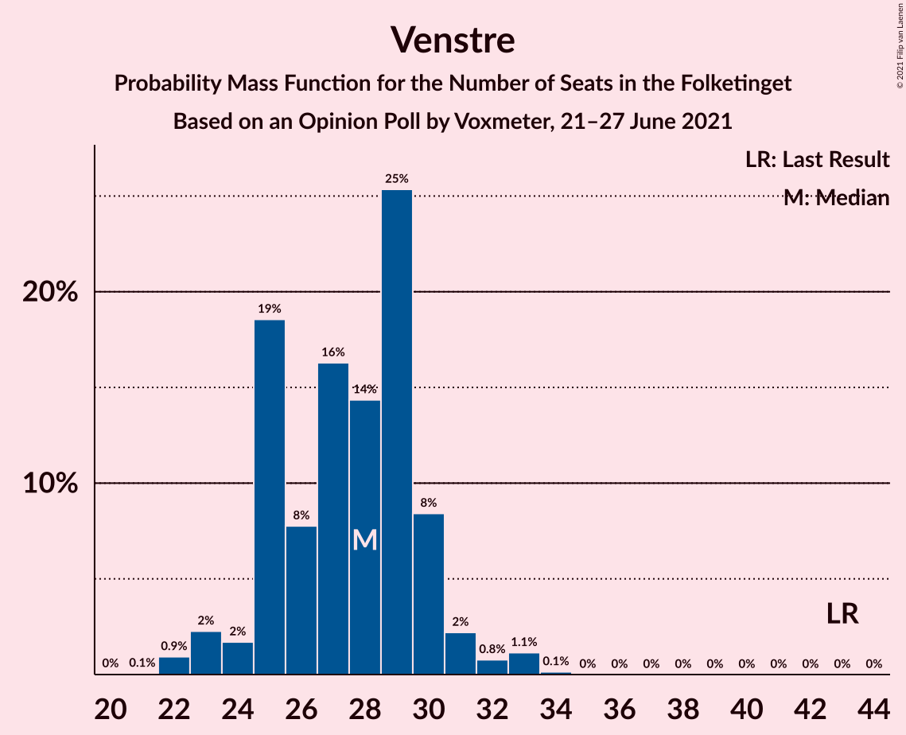
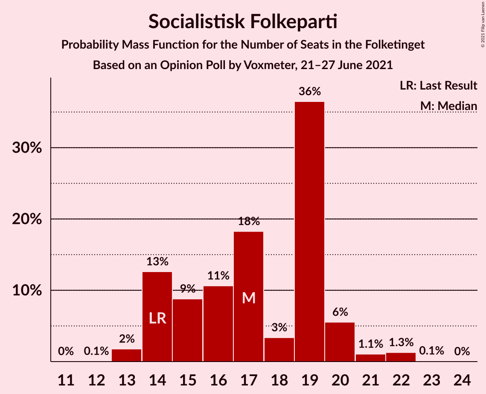
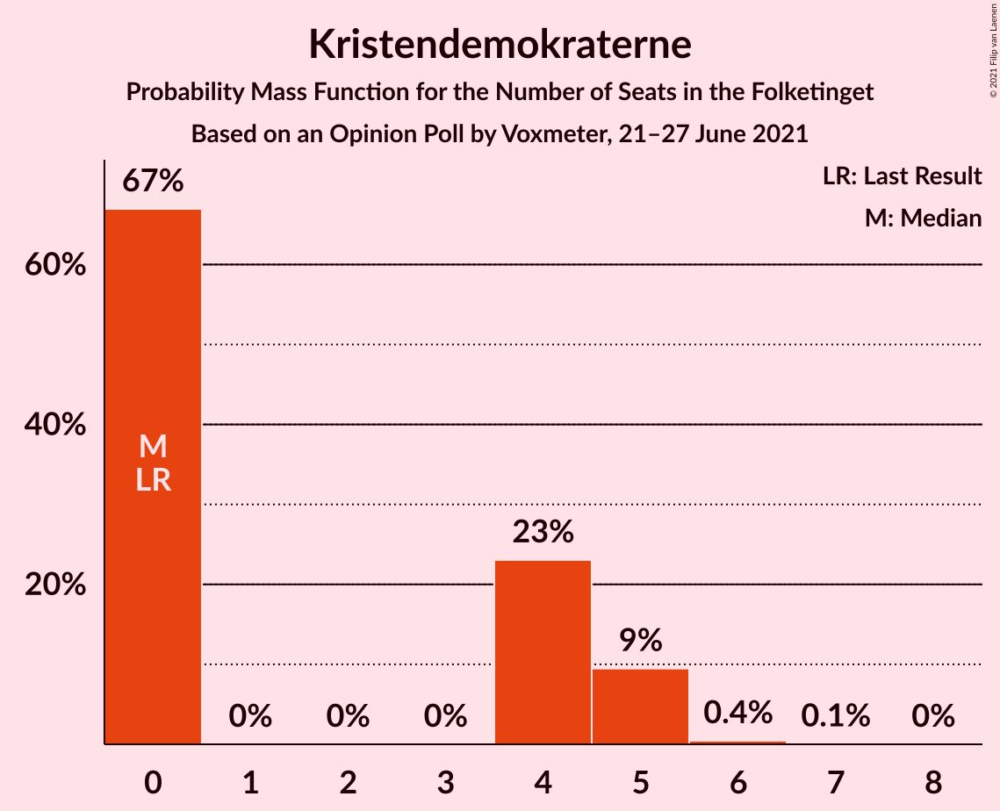
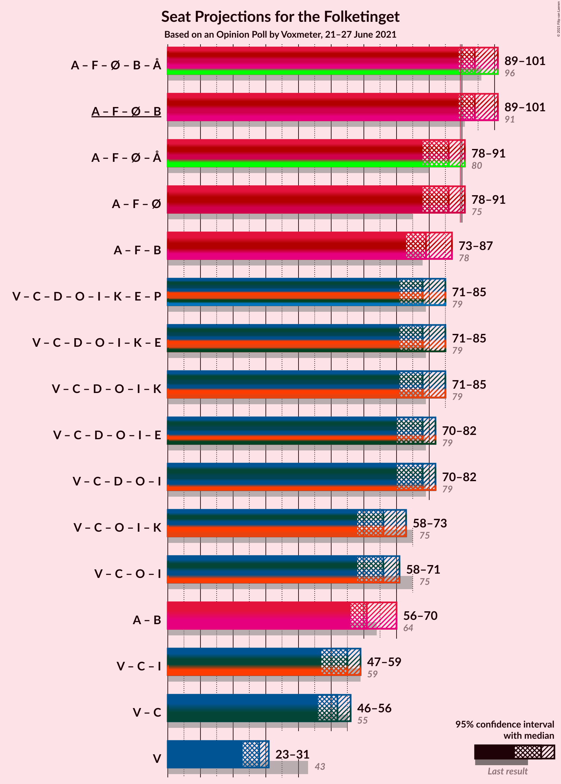
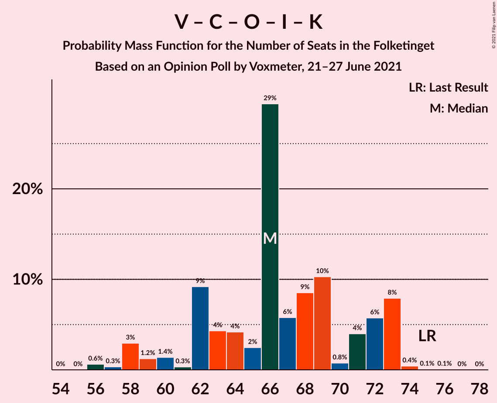
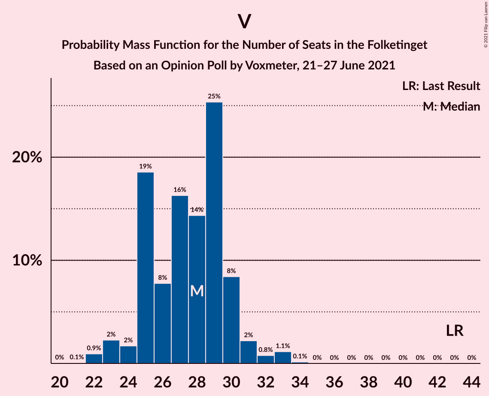

# Opinion Poll by Voxmeter, 21–27 June 2021

<a href="#voting-intentions">Voting Intentions</a> | <a href="#seats">Seats</a> | <a href="#coalitions">Coalitions</a> | <a href="#technical-information">Technical Information</a>

## Voting Intentions

### Confidence Intervals

| Party | Last Result | Poll Result | 80% Confidence Interval | 90% Confidence Interval | 95% Confidence Interval | 99% Confidence Interval |
|:-----:|:-----------:|:-----------:|:-----------------------:|:-----------------------:|:-----------------------:|:-----------------------:|
| Socialdemokraterne | 25.9% | 28.9% | 27.1–30.8% |26.6–31.3% |26.2–31.8% |25.3–32.7% |
| Venstre | 23.4% | 15.1% | 13.7–16.6% |13.3–17.0% |13.0–17.4% |12.3–18.2% |
| Det Konservative Folkeparti | 6.6% | 13.2% | 11.9–14.6% |11.5–15.0% |11.2–15.4% |10.6–16.1% |
| Socialistisk Folkeparti | 7.7% | 9.5% | 8.4–10.8% |8.1–11.1% |7.8–11.4% |7.3–12.1% |
| Enhedslisten–De Rød-Grønne | 6.9% | 8.8% | 7.7–10.0% |7.4–10.4% |7.2–10.7% |6.7–11.3% |
| Nye Borgerlige | 2.4% | 6.4% | 5.5–7.5% |5.2–7.8% |5.0–8.1% |4.6–8.6% |
| Dansk Folkeparti | 8.7% | 6.3% | 5.4–7.4% |5.2–7.7% |4.9–8.0% |4.5–8.5% |
| Radikale Venstre | 8.6% | 5.6% | 4.8–6.6% |4.5–6.9% |4.3–7.2% |3.9–7.7% |
| Liberal Alliance | 2.3% | 1.9% | 1.4–2.6% |1.3–2.8% |1.2–2.9% |1.0–3.3% |
| Kristendemokraterne | 1.7% | 1.8% | 1.4–2.5% |1.2–2.7% |1.1–2.8% |1.0–3.2% |
| Alternativet | 3.0% | 0.3% | 0.2–0.7% |0.1–0.8% |0.1–0.9% |0.1–1.1% |
| Veganerpartiet | 0.0% | 0.2% | 0.1–0.5% |0.1–0.6% |0.1–0.7% |0.0–0.9% |

*Note:* The poll result column reflects the actual value used in the calculations. Published results may vary slightly, and in addition be rounded to fewer digits.

## Seats

### Confidence Intervals

| Party | Last Result | Median | 80% Confidence Interval | 90% Confidence Interval | 95% Confidence Interval | 99% Confidence Interval |
|:-----:|:-----------:|:------:|:-----------------------:|:-----------------------:|:-----------------------:|:-----------------------:|
| <a href="#socialdemokraterne">Socialdemokraterne</a> | 48 | 52 | 52 |51–53 |49–55 |45–59 |
| <a href="#venstre">Venstre</a> | 43 | 29 | 26–29 |24–29 |23–29 |22–31 |
| <a href="#det-konservative-folkeparti">Det Konservative Folkeparti</a> | 12 | 26 | 23–26 |22–26 |21–27 |19–27 |
| <a href="#socialistisk-folkeparti">Socialistisk Folkeparti</a> | 14 | 19 | 18–19 |17–19 |16–20 |13–21 |
| <a href="#enhedslisten–de-rød-grønne">Enhedslisten–De Rød-Grønne</a> | 13 | 17 | 16–17 |16–17 |14–18 |13–18 |
| <a href="#nye-borgerlige">Nye Borgerlige</a> | 4 | 12 | 11–12 |10–12 |10–13 |9–14 |
| <a href="#dansk-folkeparti">Dansk Folkeparti</a> | 16 | 11 | 11 |10–11 |9–13 |8–15 |
| <a href="#radikale-venstre">Radikale Venstre</a> | 16 | 9 | 9 |9–10 |8–11 |7–13 |
| <a href="#liberal-alliance">Liberal Alliance</a> | 4 | 0 | 0 |0–5 |0–5 |0–6 |
| <a href="#kristendemokraterne">Kristendemokraterne</a> | 0 | 0 | 0 |0–4 |0–4 |0–5 |
| <a href="#alternativet">Alternativet</a> | 5 | 0 | 0 |0 |0 |0 |
| <a href="#veganerpartiet">Veganerpartiet</a> | 0 | 0 | 0 |0 |0 |0 |

### Socialdemokraterne

*For a full overview of the results for this party, see the [Socialdemokraterne](party-socialdemokraterne.html) page.*

| Number of Seats | Probability | Accumulated | Special Marks |
|:---------------:|:-----------:|:-----------:|:-------------:|
| 44 | 0% | 100% |  |
| 45 | 0.5% | 99.9% |  |
| 46 | 0.1% | 99.4% |  |
| 47 | 0.2% | 99.3% |  |
| 48 | 0.5% | 99.2% | Last Result |
| 49 | 1.2% | 98.7% |  |
| 50 | 2% | 97% |  |
| 51 | 4% | 96% |  |
| 52 | 83% | 91% | Median |
| 53 | 3% | 8% |  |
| 54 | 0.4% | 5% |  |
| 55 | 2% | 4% |  |
| 56 | 1.3% | 2% |  |
| 57 | 0% | 1.2% |  |
| 58 | 0% | 1.2% |  |
| 59 | 1.1% | 1.1% |  |
| 60 | 0% | 0% |  |

### Venstre

*For a full overview of the results for this party, see the [Venstre](party-venstre.html) page.*

| Number of Seats | Probability | Accumulated | Special Marks |
|:---------------:|:-----------:|:-----------:|:-------------:|
| 22 | 2% | 100% |  |
| 23 | 2% | 98% |  |
| 24 | 2% | 96% |  |
| 25 | 4% | 94% |  |
| 26 | 2% | 91% |  |
| 27 | 2% | 89% |  |
| 28 | 2% | 87% |  |
| 29 | 83% | 85% | Median |
| 30 | 0.1% | 1.4% |  |
| 31 | 1.1% | 1.3% |  |
| 32 | 0.1% | 0.2% |  |
| 33 | 0% | 0.1% |  |
| 34 | 0.1% | 0.1% |  |
| 35 | 0% | 0% |  |
| 36 | 0% | 0% |  |
| 37 | 0% | 0% |  |
| 38 | 0% | 0% |  |
| 39 | 0% | 0% |  |
| 40 | 0% | 0% |  |
| 41 | 0% | 0% |  |
| 42 | 0% | 0% |  |
| 43 | 0% | 0% | Last Result |

### Det Konservative Folkeparti

*For a full overview of the results for this party, see the [Det Konservative Folkeparti](party-detkonservativefolkeparti.html) page.*

| Number of Seats | Probability | Accumulated | Special Marks |
|:---------------:|:-----------:|:-----------:|:-------------:|
| 12 | 0% | 100% | Last Result |
| 13 | 0% | 100% |  |
| 14 | 0% | 100% |  |
| 15 | 0% | 100% |  |
| 16 | 0% | 100% |  |
| 17 | 0% | 100% |  |
| 18 | 0% | 100% |  |
| 19 | 1.2% | 99.9% |  |
| 20 | 0.3% | 98.8% |  |
| 21 | 2% | 98% |  |
| 22 | 5% | 96% |  |
| 23 | 3% | 91% |  |
| 24 | 2% | 88% |  |
| 25 | 0.9% | 86% |  |
| 26 | 83% | 86% | Median |
| 27 | 2% | 3% |  |
| 28 | 0% | 0.4% |  |
| 29 | 0.3% | 0.4% |  |
| 30 | 0% | 0% |  |

### Socialistisk Folkeparti

*For a full overview of the results for this party, see the [Socialistisk Folkeparti](party-socialistiskfolkeparti.html) page.*

| Number of Seats | Probability | Accumulated | Special Marks |
|:---------------:|:-----------:|:-----------:|:-------------:|
| 13 | 1.4% | 100% |  |
| 14 | 0% | 98.6% | Last Result |
| 15 | 0.7% | 98.5% |  |
| 16 | 2% | 98% |  |
| 17 | 4% | 96% |  |
| 18 | 2% | 92% |  |
| 19 | 86% | 90% | Median |
| 20 | 2% | 4% |  |
| 21 | 2% | 2% |  |
| 22 | 0% | 0% |  |

### Enhedslisten–De Rød-Grønne

*For a full overview of the results for this party, see the [Enhedslisten–De Rød-Grønne](party-enhedslisten–derød-grønne.html) page.*

| Number of Seats | Probability | Accumulated | Special Marks |
|:---------------:|:-----------:|:-----------:|:-------------:|
| 11 | 0.2% | 100% |  |
| 12 | 0.1% | 99.8% |  |
| 13 | 2% | 99.7% | Last Result |
| 14 | 1.0% | 98% |  |
| 15 | 2% | 97% |  |
| 16 | 6% | 95% |  |
| 17 | 86% | 89% | Median |
| 18 | 2% | 3% |  |
| 19 | 0.1% | 0.4% |  |
| 20 | 0.2% | 0.3% |  |
| 21 | 0% | 0% |  |

### Nye Borgerlige

*For a full overview of the results for this party, see the [Nye Borgerlige](party-nyeborgerlige.html) page.*

| Number of Seats | Probability | Accumulated | Special Marks |
|:---------------:|:-----------:|:-----------:|:-------------:|
| 4 | 0% | 100% | Last Result |
| 5 | 0% | 100% |  |
| 6 | 0% | 100% |  |
| 7 | 0% | 100% |  |
| 8 | 0.2% | 100% |  |
| 9 | 0.9% | 99.8% |  |
| 10 | 5% | 98.9% |  |
| 11 | 6% | 94% |  |
| 12 | 85% | 88% | Median |
| 13 | 2% | 3% |  |
| 14 | 0.6% | 0.8% |  |
| 15 | 0.1% | 0.1% |  |
| 16 | 0% | 0% |  |

### Dansk Folkeparti

*For a full overview of the results for this party, see the [Dansk Folkeparti](party-danskfolkeparti.html) page.*

| Number of Seats | Probability | Accumulated | Special Marks |
|:---------------:|:-----------:|:-----------:|:-------------:|
| 8 | 1.1% | 100% |  |
| 9 | 3% | 98.9% |  |
| 10 | 4% | 96% |  |
| 11 | 87% | 92% | Median |
| 12 | 2% | 5% |  |
| 13 | 0.7% | 3% |  |
| 14 | 0.1% | 2% |  |
| 15 | 2% | 2% |  |
| 16 | 0.3% | 0.3% | Last Result |
| 17 | 0% | 0% |  |

### Radikale Venstre

*For a full overview of the results for this party, see the [Radikale Venstre](party-radikalevenstre.html) page.*

| Number of Seats | Probability | Accumulated | Special Marks |
|:---------------:|:-----------:|:-----------:|:-------------:|
| 6 | 0.1% | 100% |  |
| 7 | 0.8% | 99.9% |  |
| 8 | 2% | 99.1% |  |
| 9 | 88% | 97% | Median |
| 10 | 6% | 10% |  |
| 11 | 1.2% | 3% |  |
| 12 | 1.0% | 2% |  |
| 13 | 1.2% | 1.3% |  |
| 14 | 0% | 0% |  |
| 15 | 0% | 0% |  |
| 16 | 0% | 0% | Last Result |

### Liberal Alliance

*For a full overview of the results for this party, see the [Liberal Alliance](party-liberalalliance.html) page.*

| Number of Seats | Probability | Accumulated | Special Marks |
|:---------------:|:-----------:|:-----------:|:-------------:|
| 0 | 92% | 100% | Median |
| 1 | 0% | 8% |  |
| 2 | 0% | 8% |  |
| 3 | 0.5% | 8% |  |
| 4 | 1.3% | 7% | Last Result |
| 5 | 5% | 6% |  |
| 6 | 1.3% | 1.3% |  |
| 7 | 0% | 0% |  |

### Kristendemokraterne

*For a full overview of the results for this party, see the [Kristendemokraterne](party-kristendemokraterne.html) page.*

| Number of Seats | Probability | Accumulated | Special Marks |
|:---------------:|:-----------:|:-----------:|:-------------:|
| 0 | 91% | 100% | Last Result, Median |
| 1 | 0% | 9% |  |
| 2 | 0% | 9% |  |
| 3 | 0% | 9% |  |
| 4 | 6% | 9% |  |
| 5 | 2% | 2% |  |
| 6 | 0.1% | 0.1% |  |
| 7 | 0% | 0% |  |

### Alternativet

*For a full overview of the results for this party, see the [Alternativet](party-alternativet.html) page.*

| Number of Seats | Probability | Accumulated | Special Marks |
|:---------------:|:-----------:|:-----------:|:-------------:|
| 0 | 100% | 100% | Median |
| 1 | 0% | 0% |  |
| 2 | 0% | 0% |  |
| 3 | 0% | 0% |  |
| 4 | 0% | 0% |  |
| 5 | 0% | 0% | Last Result |

### Veganerpartiet

*For a full overview of the results for this party, see the [Veganerpartiet](party-veganerpartiet.html) page.*

| Number of Seats | Probability | Accumulated | Special Marks |
|:---------------:|:-----------:|:-----------:|:-------------:|
| 0 | 100% | 100% | Last Result, Median |

## Coalitions

### Confidence Intervals

| Coalition | Last Result | Median | Majority? | 80% Confidence Interval | 90% Confidence Interval | 95% Confidence Interval | 99% Confidence Interval |
|:---------:|:-----------:|:------:|:---------:|:-----------------------:|:-----------------------:|:-----------------------:|:-----------------------:|
| Socialdemokraterne – Socialistisk Folkeparti – Enhedslisten–De Rød-Grønne – Radikale Venstre – Alternativet | 96 | 97 | 99.5% | 95–97 | 94–97 | 91–101 | 90–103 |
| Socialdemokraterne – Socialistisk Folkeparti – Enhedslisten–De Rød-Grønne – Radikale Venstre | 91 | 97 | 99.5% | 95–97 | 94–97 | 91–101 | 90–103 |
| Socialdemokraterne – Socialistisk Folkeparti – Enhedslisten–De Rød-Grønne – Alternativet | 80 | 88 | 3% | 86–88 | 85–88 | 80–91 | 80–93 |
| Socialdemokraterne – Socialistisk Folkeparti – Enhedslisten–De Rød-Grønne | 75 | 88 | 3% | 86–88 | 85–88 | 80–91 | 80–93 |
| Socialdemokraterne – Socialistisk Folkeparti – Radikale Venstre | 78 | 80 | 0% | 80 | 77–80 | 76–86 | 73–88 |
| Venstre – Det Konservative Folkeparti – Nye Borgerlige – Dansk Folkeparti – Liberal Alliance – Kristendemokraterne | 79 | 78 | 0% | 76–78 | 74–78 | 70–80 | 66–83 |
| Venstre – Det Konservative Folkeparti – Nye Borgerlige – Dansk Folkeparti – Liberal Alliance | 79 | 78 | 0% | 73–78 | 70–78 | 69–79 | 66–81 |
| Venstre – Det Konservative Folkeparti – Dansk Folkeparti – Liberal Alliance – Kristendemokraterne | 75 | 66 | 0% | 65–66 | 63–66 | 58–70 | 56–73 |
| Venstre – Det Konservative Folkeparti – Dansk Folkeparti – Liberal Alliance | 75 | 66 | 0% | 61–66 | 60–66 | 58–66 | 56–70 |
| Socialdemokraterne – Radikale Venstre | 64 | 61 | 0% | 61 | 60–62 | 58–66 | 56–72 |
| Venstre – Det Konservative Folkeparti – Liberal Alliance | 59 | 55 | 0% | 52–55 | 49–55 | 46–55 | 45–58 |
| Venstre – Det Konservative Folkeparti | 55 | 55 | 0% | 49–55 | 47–55 | 46–55 | 45–55 |
| Venstre | 43 | 29 | 0% | 26–29 | 24–29 | 23–29 | 22–31 |

### Socialdemokraterne – Socialistisk Folkeparti – Enhedslisten–De Rød-Grønne – Radikale Venstre – Alternativet

| Number of Seats | Probability | Accumulated | Special Marks |
|:---------------:|:-----------:|:-----------:|:-------------:|
| 86 | 0.1% | 100% |  |
| 87 | 0% | 99.9% |  |
| 88 | 0.3% | 99.9% |  |
| 89 | 0.1% | 99.6% |  |
| 90 | 2% | 99.5% | Majority |
| 91 | 1.1% | 98% |  |
| 92 | 0.5% | 97% |  |
| 93 | 0.1% | 96% |  |
| 94 | 2% | 96% |  |
| 95 | 4% | 94% |  |
| 96 | 0.5% | 89% | Last Result |
| 97 | 84% | 89% | Median |
| 98 | 0.2% | 4% |  |
| 99 | 0.1% | 4% |  |
| 100 | 0% | 4% |  |
| 101 | 2% | 4% |  |
| 102 | 0% | 2% |  |
| 103 | 2% | 2% |  |
| 104 | 0% | 0% |  |

### Socialdemokraterne – Socialistisk Folkeparti – Enhedslisten–De Rød-Grønne – Radikale Venstre

| Number of Seats | Probability | Accumulated | Special Marks |
|:---------------:|:-----------:|:-----------:|:-------------:|
| 86 | 0.1% | 100% |  |
| 87 | 0% | 99.9% |  |
| 88 | 0.3% | 99.9% |  |
| 89 | 0.1% | 99.6% |  |
| 90 | 2% | 99.5% | Majority |
| 91 | 1.1% | 98% | Last Result |
| 92 | 0.5% | 97% |  |
| 93 | 0.1% | 96% |  |
| 94 | 2% | 96% |  |
| 95 | 4% | 94% |  |
| 96 | 0.5% | 89% |  |
| 97 | 84% | 89% | Median |
| 98 | 0.2% | 4% |  |
| 99 | 0.1% | 4% |  |
| 100 | 0% | 4% |  |
| 101 | 2% | 4% |  |
| 102 | 0% | 2% |  |
| 103 | 2% | 2% |  |
| 104 | 0% | 0% |  |

### Socialdemokraterne – Socialistisk Folkeparti – Enhedslisten–De Rød-Grønne – Alternativet

| Number of Seats | Probability | Accumulated | Special Marks |
|:---------------:|:-----------:|:-----------:|:-------------:|
| 74 | 0.1% | 100% |  |
| 75 | 0% | 99.9% |  |
| 76 | 0% | 99.9% |  |
| 77 | 0% | 99.9% |  |
| 78 | 0.1% | 99.8% |  |
| 79 | 0% | 99.7% |  |
| 80 | 2% | 99.7% | Last Result |
| 81 | 0.5% | 97% |  |
| 82 | 0.6% | 97% |  |
| 83 | 0.1% | 96% |  |
| 84 | 0.7% | 96% |  |
| 85 | 2% | 95% |  |
| 86 | 5% | 94% |  |
| 87 | 0.7% | 89% |  |
| 88 | 85% | 88% | Median |
| 89 | 0% | 3% |  |
| 90 | 0.1% | 3% | Majority |
| 91 | 1.5% | 3% |  |
| 92 | 0% | 2% |  |
| 93 | 2% | 2% |  |
| 94 | 0% | 0% |  |

### Socialdemokraterne – Socialistisk Folkeparti – Enhedslisten–De Rød-Grønne

| Number of Seats | Probability | Accumulated | Special Marks |
|:---------------:|:-----------:|:-----------:|:-------------:|
| 74 | 0.1% | 100% |  |
| 75 | 0% | 99.9% | Last Result |
| 76 | 0% | 99.9% |  |
| 77 | 0% | 99.9% |  |
| 78 | 0.1% | 99.8% |  |
| 79 | 0% | 99.7% |  |
| 80 | 2% | 99.7% |  |
| 81 | 0.5% | 97% |  |
| 82 | 0.6% | 97% |  |
| 83 | 0.1% | 96% |  |
| 84 | 0.7% | 96% |  |
| 85 | 2% | 95% |  |
| 86 | 5% | 94% |  |
| 87 | 0.7% | 89% |  |
| 88 | 85% | 88% | Median |
| 89 | 0% | 3% |  |
| 90 | 0.1% | 3% | Majority |
| 91 | 1.5% | 3% |  |
| 92 | 0% | 2% |  |
| 93 | 2% | 2% |  |
| 94 | 0% | 0% |  |

### Socialdemokraterne – Socialistisk Folkeparti – Radikale Venstre

| Number of Seats | Probability | Accumulated | Special Marks |
|:---------------:|:-----------:|:-----------:|:-------------:|
| 71 | 0.1% | 100% |  |
| 72 | 0.1% | 99.9% |  |
| 73 | 0.5% | 99.8% |  |
| 74 | 2% | 99.3% |  |
| 75 | 0.2% | 98% |  |
| 76 | 2% | 98% |  |
| 77 | 0.8% | 95% |  |
| 78 | 0.4% | 94% | Last Result |
| 79 | 4% | 94% |  |
| 80 | 86% | 90% | Median |
| 81 | 0.4% | 5% |  |
| 82 | 0.2% | 4% |  |
| 83 | 0.2% | 4% |  |
| 84 | 0.1% | 4% |  |
| 85 | 1.3% | 4% |  |
| 86 | 2% | 3% |  |
| 87 | 0% | 1.1% |  |
| 88 | 1.1% | 1.1% |  |
| 89 | 0% | 0% |  |

### Venstre – Det Konservative Folkeparti – Nye Borgerlige – Dansk Folkeparti – Liberal Alliance – Kristendemokraterne

| Number of Seats | Probability | Accumulated | Special Marks |
|:---------------:|:-----------:|:-----------:|:-------------:|
| 66 | 2% | 100% |  |
| 67 | 0% | 98% |  |
| 68 | 0% | 98% |  |
| 69 | 0% | 98% |  |
| 70 | 2% | 98% |  |
| 71 | 0% | 96% |  |
| 72 | 0.3% | 96% |  |
| 73 | 0.5% | 96% |  |
| 74 | 2% | 95% |  |
| 75 | 0.1% | 94% |  |
| 76 | 5% | 93% |  |
| 77 | 2% | 89% |  |
| 78 | 83% | 87% | Median |
| 79 | 1.1% | 4% | Last Result |
| 80 | 0.6% | 3% |  |
| 81 | 1.5% | 2% |  |
| 82 | 0.1% | 0.9% |  |
| 83 | 0.5% | 0.8% |  |
| 84 | 0.2% | 0.2% |  |
| 85 | 0% | 0.1% |  |
| 86 | 0% | 0.1% |  |
| 87 | 0% | 0% |  |

### Venstre – Det Konservative Folkeparti – Nye Borgerlige – Dansk Folkeparti – Liberal Alliance

| Number of Seats | Probability | Accumulated | Special Marks |
|:---------------:|:-----------:|:-----------:|:-------------:|
| 66 | 2% | 100% |  |
| 67 | 0% | 98% |  |
| 68 | 0.1% | 98% |  |
| 69 | 1.4% | 98% |  |
| 70 | 2% | 97% |  |
| 71 | 0% | 94% |  |
| 72 | 4% | 94% |  |
| 73 | 2% | 90% |  |
| 74 | 0.4% | 88% |  |
| 75 | 0.7% | 88% |  |
| 76 | 0.8% | 87% |  |
| 77 | 0.1% | 86% |  |
| 78 | 83% | 86% | Median |
| 79 | 1.5% | 3% | Last Result |
| 80 | 0.1% | 2% |  |
| 81 | 1.3% | 2% |  |
| 82 | 0% | 0.2% |  |
| 83 | 0% | 0.2% |  |
| 84 | 0.1% | 0.1% |  |
| 85 | 0% | 0% |  |

### Venstre – Det Konservative Folkeparti – Dansk Folkeparti – Liberal Alliance – Kristendemokraterne

| Number of Seats | Probability | Accumulated | Special Marks |
|:---------------:|:-----------:|:-----------:|:-------------:|
| 56 | 2% | 100% |  |
| 57 | 0% | 98% |  |
| 58 | 1.1% | 98% |  |
| 59 | 0.1% | 97% |  |
| 60 | 1.2% | 97% |  |
| 61 | 0.5% | 96% |  |
| 62 | 0.3% | 95% |  |
| 63 | 1.3% | 95% |  |
| 64 | 2% | 94% |  |
| 65 | 4% | 92% |  |
| 66 | 85% | 88% | Median |
| 67 | 0.2% | 3% |  |
| 68 | 0.2% | 3% |  |
| 69 | 0.1% | 3% |  |
| 70 | 1.4% | 3% |  |
| 71 | 0.6% | 1.3% |  |
| 72 | 0.1% | 0.6% |  |
| 73 | 0.5% | 0.6% |  |
| 74 | 0% | 0.1% |  |
| 75 | 0% | 0% | Last Result |

### Venstre – Det Konservative Folkeparti – Dansk Folkeparti – Liberal Alliance

| Number of Seats | Probability | Accumulated | Special Marks |
|:---------------:|:-----------:|:-----------:|:-------------:|
| 56 | 2% | 100% |  |
| 57 | 0.1% | 98% |  |
| 58 | 2% | 98% |  |
| 59 | 0.1% | 96% |  |
| 60 | 3% | 96% |  |
| 61 | 4% | 93% |  |
| 62 | 1.3% | 89% |  |
| 63 | 0% | 88% |  |
| 64 | 0.3% | 88% |  |
| 65 | 1.2% | 88% |  |
| 66 | 84% | 86% | Median |
| 67 | 0.2% | 2% |  |
| 68 | 0.2% | 2% |  |
| 69 | 0.4% | 2% |  |
| 70 | 1.2% | 1.4% |  |
| 71 | 0% | 0.1% |  |
| 72 | 0% | 0.1% |  |
| 73 | 0.1% | 0.1% |  |
| 74 | 0% | 0% |  |
| 75 | 0% | 0% | Last Result |

### Socialdemokraterne – Radikale Venstre

| Number of Seats | Probability | Accumulated | Special Marks |
|:---------------:|:-----------:|:-----------:|:-------------:|
| 55 | 0.1% | 100% |  |
| 56 | 1.1% | 99.9% |  |
| 57 | 0.1% | 98.8% |  |
| 58 | 2% | 98.8% |  |
| 59 | 0.7% | 97% |  |
| 60 | 2% | 96% |  |
| 61 | 87% | 95% | Median |
| 62 | 3% | 8% |  |
| 63 | 0.1% | 5% |  |
| 64 | 0.1% | 5% | Last Result |
| 65 | 2% | 5% |  |
| 66 | 2% | 3% |  |
| 67 | 0.1% | 1.2% |  |
| 68 | 0% | 1.1% |  |
| 69 | 0.1% | 1.1% |  |
| 70 | 0% | 1.1% |  |
| 71 | 0% | 1.1% |  |
| 72 | 1.1% | 1.1% |  |
| 73 | 0% | 0% |  |

### Venstre – Det Konservative Folkeparti – Liberal Alliance

| Number of Seats | Probability | Accumulated | Special Marks |
|:---------------:|:-----------:|:-----------:|:-------------:|
| 44 | 0.1% | 100% |  |
| 45 | 2% | 99.9% |  |
| 46 | 1.4% | 98% |  |
| 47 | 0% | 97% |  |
| 48 | 0% | 97% |  |
| 49 | 2% | 97% |  |
| 50 | 3% | 95% |  |
| 51 | 0.5% | 92% |  |
| 52 | 4% | 91% |  |
| 53 | 0.7% | 87% |  |
| 54 | 0.4% | 86% |  |
| 55 | 85% | 86% | Median |
| 56 | 0.1% | 0.8% |  |
| 57 | 0.1% | 0.7% |  |
| 58 | 0.4% | 0.6% |  |
| 59 | 0.1% | 0.2% | Last Result |
| 60 | 0% | 0.1% |  |
| 61 | 0.1% | 0.1% |  |
| 62 | 0% | 0% |  |

### Venstre – Det Konservative Folkeparti

| Number of Seats | Probability | Accumulated | Special Marks |
|:---------------:|:-----------:|:-----------:|:-------------:|
| 42 | 0.1% | 100% |  |
| 43 | 0% | 99.9% |  |
| 44 | 0.1% | 99.9% |  |
| 45 | 2% | 99.8% |  |
| 46 | 3% | 98% |  |
| 47 | 4% | 96% |  |
| 48 | 0.4% | 92% |  |
| 49 | 2% | 92% |  |
| 50 | 4% | 90% |  |
| 51 | 0.1% | 85% |  |
| 52 | 0.7% | 85% |  |
| 53 | 0.6% | 85% |  |
| 54 | 0.1% | 84% |  |
| 55 | 83% | 84% | Last Result, Median |
| 56 | 0.1% | 0.5% |  |
| 57 | 0% | 0.4% |  |
| 58 | 0.3% | 0.3% |  |
| 59 | 0% | 0% |  |

### Venstre

| Number of Seats | Probability | Accumulated | Special Marks |
|:---------------:|:-----------:|:-----------:|:-------------:|
| 22 | 2% | 100% |  |
| 23 | 2% | 98% |  |
| 24 | 2% | 96% |  |
| 25 | 4% | 94% |  |
| 26 | 2% | 91% |  |
| 27 | 2% | 89% |  |
| 28 | 2% | 87% |  |
| 29 | 83% | 85% | Median |
| 30 | 0.1% | 1.4% |  |
| 31 | 1.1% | 1.3% |  |
| 32 | 0.1% | 0.2% |  |
| 33 | 0% | 0.1% |  |
| 34 | 0.1% | 0.1% |  |
| 35 | 0% | 0% |  |
| 36 | 0% | 0% |  |
| 37 | 0% | 0% |  |
| 38 | 0% | 0% |  |
| 39 | 0% | 0% |  |
| 40 | 0% | 0% |  |
| 41 | 0% | 0% |  |
| 42 | 0% | 0% |  |
| 43 | 0% | 0% | Last Result |

## Technical Information

### Opinion Poll

+ **Polling firm:** Voxmeter
+ **Commissioner(s):** —
+ **Fieldwork period:** 21–27 June 2021

### Calculations

+ **Sample size:** 1003
+ **Simulations done:** 131,072
+ **Error estimate:** 1.94%

