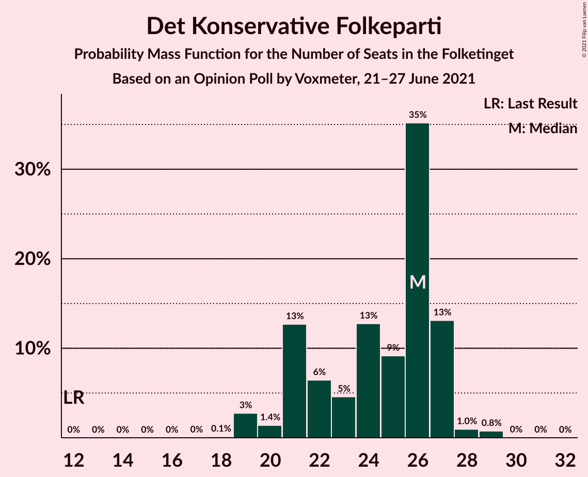
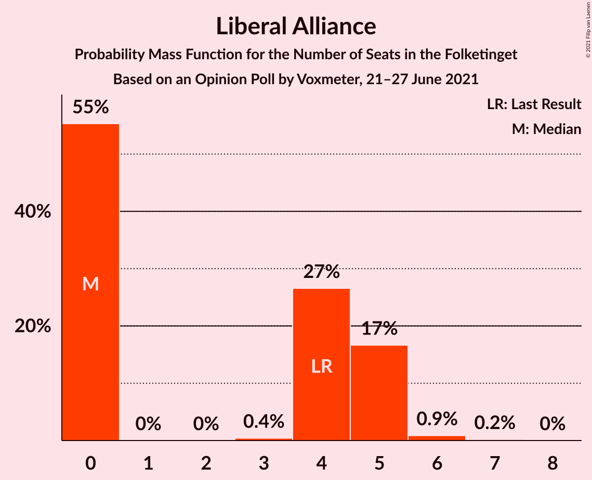
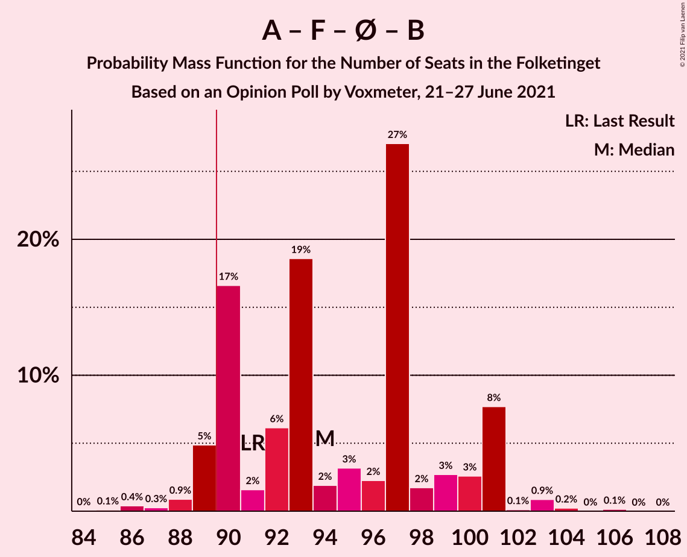
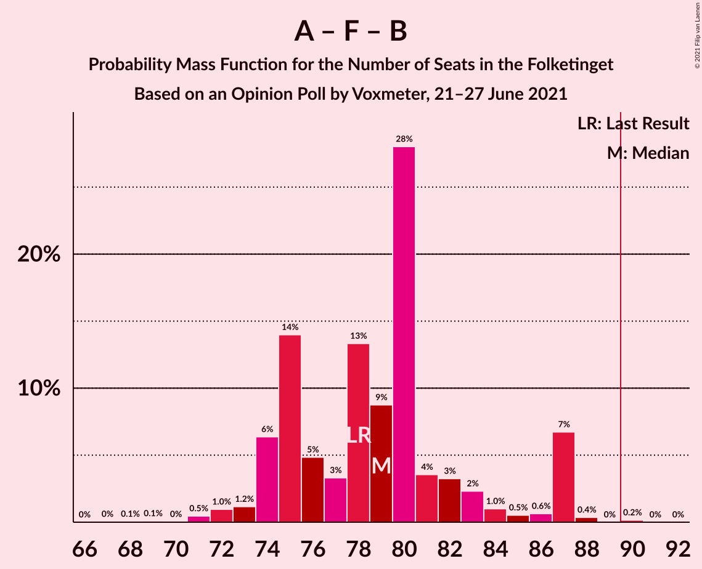
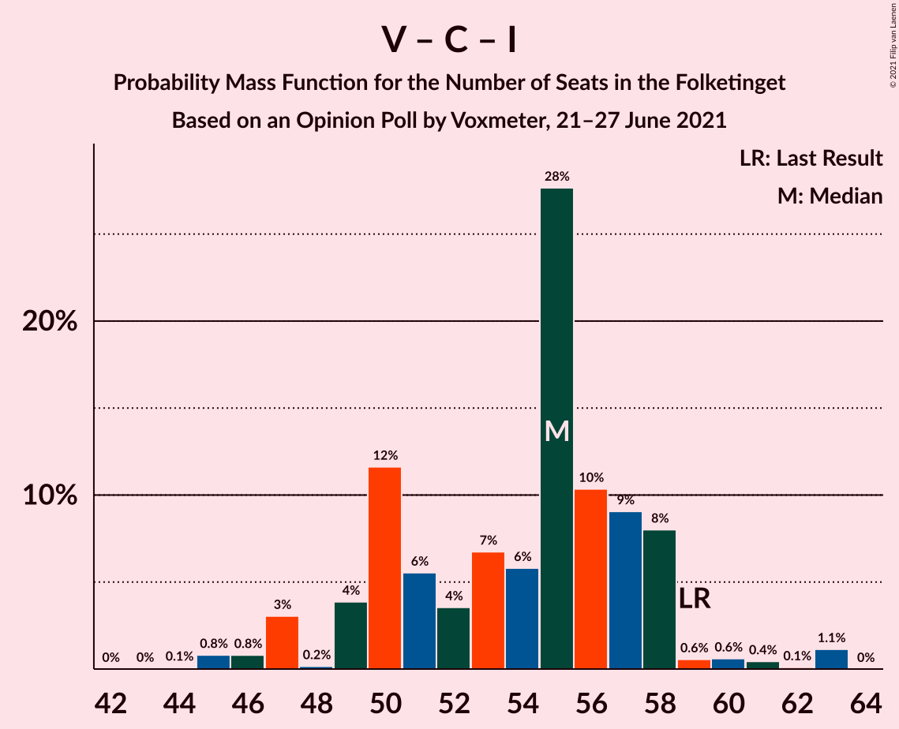

# Opinion Poll by Voxmeter, 21–27 June 2021

<a href="#voting-intentions">Voting Intentions</a> | <a href="#seats">Seats</a> | <a href="#coalitions">Coalitions</a> | <a href="#technical-information">Technical Information</a>

## Voting Intentions

### Confidence Intervals

| Party | Last Result | Poll Result | 80% Confidence Interval | 90% Confidence Interval | 95% Confidence Interval | 99% Confidence Interval |
|:-----:|:-----------:|:-----------:|:-----------------------:|:-----------------------:|:-----------------------:|:-----------------------:|
| Socialdemokraterne | 25.9% | 28.9% | 27.1–30.8% |26.6–31.3% |26.2–31.8% |25.3–32.7% |
| Venstre | 23.4% | 15.1% | 13.7–16.6% |13.3–17.0% |13.0–17.4% |12.3–18.2% |
| Det Konservative Folkeparti | 6.6% | 13.2% | 11.9–14.6% |11.5–15.0% |11.2–15.4% |10.6–16.1% |
| Socialistisk Folkeparti | 7.7% | 9.5% | 8.4–10.8% |8.1–11.1% |7.8–11.4% |7.3–12.1% |
| Enhedslisten–De Rød-Grønne | 6.9% | 8.8% | 7.7–10.0% |7.4–10.4% |7.2–10.7% |6.7–11.3% |
| Nye Borgerlige | 2.4% | 6.4% | 5.5–7.5% |5.2–7.8% |5.0–8.1% |4.6–8.6% |
| Dansk Folkeparti | 8.7% | 6.3% | 5.4–7.4% |5.2–7.7% |4.9–8.0% |4.5–8.5% |
| Radikale Venstre | 8.6% | 5.6% | 4.8–6.6% |4.5–6.9% |4.3–7.2% |3.9–7.7% |
| Liberal Alliance | 2.3% | 1.9% | 1.4–2.6% |1.3–2.8% |1.2–2.9% |1.0–3.3% |
| Kristendemokraterne | 1.7% | 1.8% | 1.4–2.5% |1.2–2.7% |1.1–2.8% |1.0–3.2% |
| Alternativet | 3.0% | 0.3% | 0.2–0.7% |0.1–0.8% |0.1–0.9% |0.1–1.1% |
| Veganerpartiet | 0.0% | 0.2% | 0.1–0.5% |0.1–0.6% |0.1–0.7% |0.0–0.9% |

*Note:* The poll result column reflects the actual value used in the calculations. Published results may vary slightly, and in addition be rounded to fewer digits.

## Seats

### Confidence Intervals

| Party | Last Result | Median | 80% Confidence Interval | 90% Confidence Interval | 95% Confidence Interval | 99% Confidence Interval |
|:-----:|:-----------:|:------:|:-----------------------:|:-----------------------:|:-----------------------:|:-----------------------:|
| <a href="#socialdemokraterne">Socialdemokraterne</a> | 48 | 52 | 48–58 |47–60 |46–60 |45–60 |
| <a href="#venstre">Venstre</a> | 43 | 28 | 25–30 |25–30 |23–31 |22–33 |
| <a href="#det-konservative-folkeparti">Det Konservative Folkeparti</a> | 12 | 26 | 21–27 |21–27 |19–27 |19–29 |
| <a href="#socialistisk-folkeparti">Socialistisk Folkeparti</a> | 14 | 17 | 14–19 |14–20 |14–20 |13–22 |
| <a href="#enhedslisten–de-rød-grønne">Enhedslisten–De Rød-Grønne</a> | 13 | 15 | 14–17 |14–18 |13–19 |12–21 |
| <a href="#nye-borgerlige">Nye Borgerlige</a> | 4 | 12 | 9–13 |9–14 |9–14 |8–15 |
| <a href="#dansk-folkeparti">Dansk Folkeparti</a> | 16 | 11 | 10–13 |9–13 |9–14 |8–16 |
| <a href="#radikale-venstre">Radikale Venstre</a> | 16 | 9 | 8–11 |7–12 |7–13 |7–13 |
| <a href="#liberal-alliance">Liberal Alliance</a> | 4 | 0 | 0–5 |0–5 |0–5 |0–6 |
| <a href="#kristendemokraterne">Kristendemokraterne</a> | 0 | 0 | 0–4 |0–5 |0–5 |0–6 |
| <a href="#alternativet">Alternativet</a> | 5 | 0 | 0 |0 |0 |0 |
| <a href="#veganerpartiet">Veganerpartiet</a> | 0 | 0 | 0 |0 |0 |0 |

### Socialdemokraterne

*For a full overview of the results for this party, see the [Socialdemokraterne](party-socialdemokraterne.html) page.*

| Number of Seats | Probability | Accumulated | Special Marks |
|:---------------:|:-----------:|:-----------:|:-------------:|
| 43 | 0% | 100% |  |
| 44 | 0.1% | 99.9% |  |
| 45 | 1.3% | 99.8% |  |
| 46 | 3% | 98.6% |  |
| 47 | 1.4% | 96% |  |
| 48 | 7% | 95% | Last Result |
| 49 | 2% | 88% |  |
| 50 | 16% | 86% |  |
| 51 | 11% | 69% |  |
| 52 | 35% | 59% | Median |
| 53 | 6% | 24% |  |
| 54 | 1.5% | 18% |  |
| 55 | 5% | 17% |  |
| 56 | 1.1% | 11% |  |
| 57 | 0.2% | 10% |  |
| 58 | 1.0% | 10% |  |
| 59 | 2% | 9% |  |
| 60 | 7% | 7% |  |
| 61 | 0% | 0% |  |

### Venstre

*For a full overview of the results for this party, see the [Venstre](party-venstre.html) page.*

| Number of Seats | Probability | Accumulated | Special Marks |
|:---------------:|:-----------:|:-----------:|:-------------:|
| 21 | 0.1% | 100% |  |
| 22 | 0.9% | 99.9% |  |
| 23 | 2% | 99.0% |  |
| 24 | 2% | 97% |  |
| 25 | 19% | 95% |  |
| 26 | 8% | 76% |  |
| 27 | 16% | 69% |  |
| 28 | 14% | 52% | Median |
| 29 | 25% | 38% |  |
| 30 | 8% | 13% |  |
| 31 | 2% | 4% |  |
| 32 | 0.8% | 2% |  |
| 33 | 1.1% | 1.3% |  |
| 34 | 0.1% | 0.2% |  |
| 35 | 0% | 0% |  |
| 36 | 0% | 0% |  |
| 37 | 0% | 0% |  |
| 38 | 0% | 0% |  |
| 39 | 0% | 0% |  |
| 40 | 0% | 0% |  |
| 41 | 0% | 0% |  |
| 42 | 0% | 0% |  |
| 43 | 0% | 0% | Last Result |

### Det Konservative Folkeparti

*For a full overview of the results for this party, see the [Det Konservative Folkeparti](party-detkonservativefolkeparti.html) page.*

| Number of Seats | Probability | Accumulated | Special Marks |
|:---------------:|:-----------:|:-----------:|:-------------:|
| 12 | 0% | 100% | Last Result |
| 13 | 0% | 100% |  |
| 14 | 0% | 100% |  |
| 15 | 0% | 100% |  |
| 16 | 0% | 100% |  |
| 17 | 0% | 100% |  |
| 18 | 0.1% | 100% |  |
| 19 | 3% | 99.8% |  |
| 20 | 1.4% | 97% |  |
| 21 | 13% | 96% |  |
| 22 | 6% | 83% |  |
| 23 | 5% | 77% |  |
| 24 | 13% | 72% |  |
| 25 | 9% | 59% |  |
| 26 | 35% | 50% | Median |
| 27 | 13% | 15% |  |
| 28 | 1.0% | 2% |  |
| 29 | 0.8% | 0.8% |  |
| 30 | 0% | 0.1% |  |
| 31 | 0% | 0% |  |

### Socialistisk Folkeparti

*For a full overview of the results for this party, see the [Socialistisk Folkeparti](party-socialistiskfolkeparti.html) page.*

| Number of Seats | Probability | Accumulated | Special Marks |
|:---------------:|:-----------:|:-----------:|:-------------:|
| 12 | 0.1% | 100% |  |
| 13 | 2% | 99.9% |  |
| 14 | 13% | 98% | Last Result |
| 15 | 9% | 86% |  |
| 16 | 11% | 77% |  |
| 17 | 18% | 66% | Median |
| 18 | 3% | 48% |  |
| 19 | 36% | 44% |  |
| 20 | 6% | 8% |  |
| 21 | 1.1% | 2% |  |
| 22 | 1.3% | 1.4% |  |
| 23 | 0.1% | 0.1% |  |
| 24 | 0% | 0% |  |

### Enhedslisten–De Rød-Grønne

*For a full overview of the results for this party, see the [Enhedslisten–De Rød-Grønne](party-enhedslisten–derød-grønne.html) page.*

| Number of Seats | Probability | Accumulated | Special Marks |
|:---------------:|:-----------:|:-----------:|:-------------:|
| 11 | 0.1% | 100% |  |
| 12 | 0.8% | 99.9% |  |
| 13 | 3% | 99.1% | Last Result |
| 14 | 25% | 96% |  |
| 15 | 21% | 70% | Median |
| 16 | 10% | 50% |  |
| 17 | 31% | 40% |  |
| 18 | 6% | 9% |  |
| 19 | 1.1% | 3% |  |
| 20 | 1.3% | 2% |  |
| 21 | 0.7% | 0.8% |  |
| 22 | 0% | 0% |  |

### Nye Borgerlige

*For a full overview of the results for this party, see the [Nye Borgerlige](party-nyeborgerlige.html) page.*

| Number of Seats | Probability | Accumulated | Special Marks |
|:---------------:|:-----------:|:-----------:|:-------------:|
| 4 | 0% | 100% | Last Result |
| 5 | 0% | 100% |  |
| 6 | 0% | 100% |  |
| 7 | 0.1% | 100% |  |
| 8 | 0.9% | 99.9% |  |
| 9 | 9% | 99.0% |  |
| 10 | 12% | 90% |  |
| 11 | 12% | 78% |  |
| 12 | 49% | 67% | Median |
| 13 | 11% | 17% |  |
| 14 | 5% | 6% |  |
| 15 | 1.1% | 1.4% |  |
| 16 | 0.2% | 0.3% |  |
| 17 | 0% | 0.1% |  |
| 18 | 0% | 0% |  |

### Dansk Folkeparti

*For a full overview of the results for this party, see the [Dansk Folkeparti](party-danskfolkeparti.html) page.*

| Number of Seats | Probability | Accumulated | Special Marks |
|:---------------:|:-----------:|:-----------:|:-------------:|
| 8 | 0.6% | 100% |  |
| 9 | 7% | 99.4% |  |
| 10 | 10% | 92% |  |
| 11 | 51% | 82% | Median |
| 12 | 21% | 31% |  |
| 13 | 7% | 10% |  |
| 14 | 2% | 4% |  |
| 15 | 1.2% | 2% |  |
| 16 | 0.6% | 0.6% | Last Result |
| 17 | 0% | 0% |  |

### Radikale Venstre

*For a full overview of the results for this party, see the [Radikale Venstre](party-radikalevenstre.html) page.*

| Number of Seats | Probability | Accumulated | Special Marks |
|:---------------:|:-----------:|:-----------:|:-------------:|
| 6 | 0.1% | 100% |  |
| 7 | 9% | 99.9% |  |
| 8 | 5% | 91% |  |
| 9 | 41% | 87% | Median |
| 10 | 24% | 46% |  |
| 11 | 13% | 21% |  |
| 12 | 5% | 8% |  |
| 13 | 2% | 3% |  |
| 14 | 0.3% | 0.4% |  |
| 15 | 0.2% | 0.2% |  |
| 16 | 0% | 0% | Last Result |

### Liberal Alliance

*For a full overview of the results for this party, see the [Liberal Alliance](party-liberalalliance.html) page.*

| Number of Seats | Probability | Accumulated | Special Marks |
|:---------------:|:-----------:|:-----------:|:-------------:|
| 0 | 55% | 100% | Median |
| 1 | 0% | 45% |  |
| 2 | 0% | 45% |  |
| 3 | 0.4% | 45% |  |
| 4 | 27% | 44% | Last Result |
| 5 | 17% | 18% |  |
| 6 | 0.9% | 1.1% |  |
| 7 | 0.2% | 0.2% |  |
| 8 | 0% | 0% |  |

### Kristendemokraterne

*For a full overview of the results for this party, see the [Kristendemokraterne](party-kristendemokraterne.html) page.*

| Number of Seats | Probability | Accumulated | Special Marks |
|:---------------:|:-----------:|:-----------:|:-------------:|
| 0 | 67% | 100% | Last Result, Median |
| 1 | 0% | 33% |  |
| 2 | 0% | 33% |  |
| 3 | 0% | 33% |  |
| 4 | 23% | 33% |  |
| 5 | 9% | 10% |  |
| 6 | 0.4% | 0.5% |  |
| 7 | 0.1% | 0.1% |  |
| 8 | 0% | 0% |  |

### Alternativet

*For a full overview of the results for this party, see the [Alternativet](party-alternativet.html) page.*

| Number of Seats | Probability | Accumulated | Special Marks |
|:---------------:|:-----------:|:-----------:|:-------------:|
| 0 | 100% | 100% | Median |
| 1 | 0% | 0% |  |
| 2 | 0% | 0% |  |
| 3 | 0% | 0% |  |
| 4 | 0% | 0% |  |
| 5 | 0% | 0% | Last Result |

### Veganerpartiet

*For a full overview of the results for this party, see the [Veganerpartiet](party-veganerpartiet.html) page.*

| Number of Seats | Probability | Accumulated | Special Marks |
|:---------------:|:-----------:|:-----------:|:-------------:|
| 0 | 100% | 100% | Last Result, Median |

## Coalitions

### Confidence Intervals

| Coalition | Last Result | Median | Majority? | 80% Confidence Interval | 90% Confidence Interval | 95% Confidence Interval | 99% Confidence Interval |
|:---------:|:-----------:|:------:|:---------:|:-----------------------:|:-----------------------:|:-----------------------:|:-----------------------:|
| Socialdemokraterne – Socialistisk Folkeparti – Enhedslisten–De Rød-Grønne – Radikale Venstre – Alternativet | 96 | 94 | 93% | 90–100 | 89–101 | 89–101 | 86–103 |
| Socialdemokraterne – Socialistisk Folkeparti – Enhedslisten–De Rød-Grønne – Radikale Venstre | 91 | 94 | 93% | 90–100 | 89–101 | 89–101 | 86–103 |
| Socialdemokraterne – Socialistisk Folkeparti – Enhedslisten–De Rød-Grønne – Alternativet | 80 | 86 | 14% | 80–91 | 78–91 | 78–91 | 77–93 |
| Socialdemokraterne – Socialistisk Folkeparti – Enhedslisten–De Rød-Grønne | 75 | 86 | 14% | 80–91 | 78–91 | 78–91 | 77–93 |
| Socialdemokraterne – Socialistisk Folkeparti – Radikale Venstre | 78 | 79 | 0.2% | 75–83 | 74–87 | 73–87 | 71–88 |
| Venstre – Det Konservative Folkeparti – Nye Borgerlige – Dansk Folkeparti – Liberal Alliance – Kristendemokraterne | 79 | 78 | 0% | 74–84 | 72–85 | 71–85 | 68–85 |
| Venstre – Det Konservative Folkeparti – Nye Borgerlige – Dansk Folkeparti – Liberal Alliance | 79 | 78 | 0% | 72–80 | 71–80 | 70–82 | 66–85 |
| Venstre – Det Konservative Folkeparti – Dansk Folkeparti – Liberal Alliance – Kristendemokraterne | 75 | 66 | 0% | 62–72 | 59–73 | 58–73 | 56–74 |
| Venstre – Det Konservative Folkeparti – Dansk Folkeparti – Liberal Alliance | 75 | 66 | 0% | 60–69 | 58–69 | 58–71 | 56–72 |
| Socialdemokraterne – Radikale Venstre | 64 | 61 | 0% | 59–67 | 57–70 | 56–70 | 56–70 |
| Venstre – Det Konservative Folkeparti – Liberal Alliance | 59 | 55 | 0% | 50–58 | 49–58 | 47–59 | 45–63 |
| Venstre – Det Konservative Folkeparti | 55 | 52 | 0% | 47–55 | 46–55 | 46–56 | 45–59 |
| Venstre | 43 | 28 | 0% | 25–30 | 25–30 | 23–31 | 22–33 |

### Socialdemokraterne – Socialistisk Folkeparti – Enhedslisten–De Rød-Grønne – Radikale Venstre – Alternativet

| Number of Seats | Probability | Accumulated | Special Marks |
|:---------------:|:-----------:|:-----------:|:-------------:|
| 85 | 0.1% | 100% |  |
| 86 | 0.4% | 99.9% |  |
| 87 | 0.3% | 99.5% |  |
| 88 | 0.9% | 99.2% |  |
| 89 | 5% | 98% |  |
| 90 | 17% | 93% | Majority |
| 91 | 2% | 77% |  |
| 92 | 6% | 75% |  |
| 93 | 19% | 69% | Median |
| 94 | 2% | 51% |  |
| 95 | 3% | 49% |  |
| 96 | 2% | 45% | Last Result |
| 97 | 27% | 43% |  |
| 98 | 2% | 16% |  |
| 99 | 3% | 14% |  |
| 100 | 3% | 12% |  |
| 101 | 8% | 9% |  |
| 102 | 0.1% | 1.4% |  |
| 103 | 0.9% | 1.3% |  |
| 104 | 0.2% | 0.4% |  |
| 105 | 0% | 0.2% |  |
| 106 | 0.1% | 0.2% |  |
| 107 | 0% | 0% |  |

### Socialdemokraterne – Socialistisk Folkeparti – Enhedslisten–De Rød-Grønne – Radikale Venstre

| Number of Seats | Probability | Accumulated | Special Marks |
|:---------------:|:-----------:|:-----------:|:-------------:|
| 85 | 0.1% | 100% |  |
| 86 | 0.4% | 99.9% |  |
| 87 | 0.3% | 99.5% |  |
| 88 | 0.9% | 99.2% |  |
| 89 | 5% | 98% |  |
| 90 | 17% | 93% | Majority |
| 91 | 2% | 77% | Last Result |
| 92 | 6% | 75% |  |
| 93 | 19% | 69% | Median |
| 94 | 2% | 51% |  |
| 95 | 3% | 49% |  |
| 96 | 2% | 45% |  |
| 97 | 27% | 43% |  |
| 98 | 2% | 16% |  |
| 99 | 3% | 14% |  |
| 100 | 3% | 12% |  |
| 101 | 8% | 9% |  |
| 102 | 0.1% | 1.4% |  |
| 103 | 0.9% | 1.3% |  |
| 104 | 0.2% | 0.4% |  |
| 105 | 0% | 0.2% |  |
| 106 | 0.1% | 0.2% |  |
| 107 | 0% | 0% |  |

### Socialdemokraterne – Socialistisk Folkeparti – Enhedslisten–De Rød-Grønne – Alternativet

| Number of Seats | Probability | Accumulated | Special Marks |
|:---------------:|:-----------:|:-----------:|:-------------:|
| 75 | 0.2% | 100% |  |
| 76 | 0% | 99.8% |  |
| 77 | 1.0% | 99.7% |  |
| 78 | 5% | 98.7% |  |
| 79 | 2% | 93% |  |
| 80 | 10% | 92% | Last Result |
| 81 | 11% | 82% |  |
| 82 | 4% | 71% |  |
| 83 | 4% | 68% |  |
| 84 | 7% | 63% | Median |
| 85 | 5% | 56% |  |
| 86 | 11% | 51% |  |
| 87 | 0.8% | 40% |  |
| 88 | 25% | 39% |  |
| 89 | 0.7% | 15% |  |
| 90 | 3% | 14% | Majority |
| 91 | 8% | 11% |  |
| 92 | 1.2% | 2% |  |
| 93 | 0.8% | 1.1% |  |
| 94 | 0.1% | 0.3% |  |
| 95 | 0% | 0.2% |  |
| 96 | 0% | 0.2% |  |
| 97 | 0.2% | 0.2% |  |
| 98 | 0% | 0% |  |

### Socialdemokraterne – Socialistisk Folkeparti – Enhedslisten–De Rød-Grønne

| Number of Seats | Probability | Accumulated | Special Marks |
|:---------------:|:-----------:|:-----------:|:-------------:|
| 75 | 0.2% | 100% | Last Result |
| 76 | 0% | 99.8% |  |
| 77 | 1.0% | 99.7% |  |
| 78 | 5% | 98.7% |  |
| 79 | 2% | 93% |  |
| 80 | 10% | 92% |  |
| 81 | 11% | 82% |  |
| 82 | 4% | 71% |  |
| 83 | 4% | 68% |  |
| 84 | 7% | 63% | Median |
| 85 | 5% | 56% |  |
| 86 | 11% | 51% |  |
| 87 | 0.8% | 40% |  |
| 88 | 25% | 39% |  |
| 89 | 0.7% | 15% |  |
| 90 | 3% | 14% | Majority |
| 91 | 8% | 11% |  |
| 92 | 1.2% | 2% |  |
| 93 | 0.8% | 1.1% |  |
| 94 | 0.1% | 0.3% |  |
| 95 | 0% | 0.2% |  |
| 96 | 0% | 0.2% |  |
| 97 | 0.2% | 0.2% |  |
| 98 | 0% | 0% |  |

### Socialdemokraterne – Socialistisk Folkeparti – Radikale Venstre

| Number of Seats | Probability | Accumulated | Special Marks |
|:---------------:|:-----------:|:-----------:|:-------------:|
| 68 | 0.1% | 100% |  |
| 69 | 0.1% | 99.9% |  |
| 70 | 0% | 99.8% |  |
| 71 | 0.5% | 99.8% |  |
| 72 | 1.0% | 99.3% |  |
| 73 | 1.2% | 98% |  |
| 74 | 6% | 97% |  |
| 75 | 14% | 91% |  |
| 76 | 5% | 77% |  |
| 77 | 3% | 72% |  |
| 78 | 13% | 69% | Last Result, Median |
| 79 | 9% | 55% |  |
| 80 | 28% | 47% |  |
| 81 | 4% | 19% |  |
| 82 | 3% | 15% |  |
| 83 | 2% | 12% |  |
| 84 | 1.0% | 9% |  |
| 85 | 0.5% | 8% |  |
| 86 | 0.6% | 8% |  |
| 87 | 7% | 7% |  |
| 88 | 0.4% | 0.5% |  |
| 89 | 0% | 0.2% |  |
| 90 | 0.2% | 0.2% | Majority |
| 91 | 0% | 0% |  |

### Venstre – Det Konservative Folkeparti – Nye Borgerlige – Dansk Folkeparti – Liberal Alliance – Kristendemokraterne

| Number of Seats | Probability | Accumulated | Special Marks |
|:---------------:|:-----------:|:-----------:|:-------------:|
| 66 | 0.5% | 100% |  |
| 67 | 0% | 99.5% |  |
| 68 | 0.3% | 99.5% |  |
| 69 | 0.2% | 99.2% |  |
| 70 | 1.0% | 98.9% |  |
| 71 | 1.5% | 98% |  |
| 72 | 3% | 96% |  |
| 73 | 4% | 94% |  |
| 74 | 8% | 90% |  |
| 75 | 3% | 82% |  |
| 76 | 5% | 80% |  |
| 77 | 3% | 75% | Median |
| 78 | 37% | 72% |  |
| 79 | 7% | 35% | Last Result |
| 80 | 7% | 28% |  |
| 81 | 3% | 21% |  |
| 82 | 7% | 18% |  |
| 83 | 0.6% | 11% |  |
| 84 | 0.3% | 10% |  |
| 85 | 10% | 10% |  |
| 86 | 0.1% | 0.1% |  |
| 87 | 0.1% | 0.1% |  |
| 88 | 0% | 0% |  |

### Venstre – Det Konservative Folkeparti – Nye Borgerlige – Dansk Folkeparti – Liberal Alliance

| Number of Seats | Probability | Accumulated | Special Marks |
|:---------------:|:-----------:|:-----------:|:-------------:|
| 66 | 0.7% | 100% |  |
| 67 | 0% | 99.3% |  |
| 68 | 0.5% | 99.3% |  |
| 69 | 0.8% | 98.8% |  |
| 70 | 0.9% | 98% |  |
| 71 | 3% | 97% |  |
| 72 | 6% | 94% |  |
| 73 | 6% | 88% |  |
| 74 | 8% | 82% |  |
| 75 | 7% | 74% |  |
| 76 | 2% | 67% |  |
| 77 | 3% | 65% | Median |
| 78 | 42% | 62% |  |
| 79 | 2% | 20% | Last Result |
| 80 | 14% | 18% |  |
| 81 | 2% | 4% |  |
| 82 | 1.0% | 3% |  |
| 83 | 0.3% | 2% |  |
| 84 | 0.1% | 1.3% |  |
| 85 | 1.2% | 1.2% |  |
| 86 | 0% | 0.1% |  |
| 87 | 0% | 0% |  |

### Venstre – Det Konservative Folkeparti – Dansk Folkeparti – Liberal Alliance – Kristendemokraterne

| Number of Seats | Probability | Accumulated | Special Marks |
|:---------------:|:-----------:|:-----------:|:-------------:|
| 56 | 0.6% | 100% |  |
| 57 | 0.3% | 99.4% |  |
| 58 | 3% | 99.0% |  |
| 59 | 1.2% | 96% |  |
| 60 | 1.4% | 95% |  |
| 61 | 0.3% | 93% |  |
| 62 | 9% | 93% |  |
| 63 | 4% | 84% |  |
| 64 | 4% | 80% |  |
| 65 | 2% | 75% | Median |
| 66 | 29% | 73% |  |
| 67 | 6% | 44% |  |
| 68 | 9% | 38% |  |
| 69 | 10% | 29% |  |
| 70 | 0.8% | 19% |  |
| 71 | 4% | 18% |  |
| 72 | 6% | 14% |  |
| 73 | 8% | 8% |  |
| 74 | 0.4% | 0.6% |  |
| 75 | 0.1% | 0.1% | Last Result |
| 76 | 0.1% | 0.1% |  |
| 77 | 0% | 0% |  |

### Venstre – Det Konservative Folkeparti – Dansk Folkeparti – Liberal Alliance

| Number of Seats | Probability | Accumulated | Special Marks |
|:---------------:|:-----------:|:-----------:|:-------------:|
| 54 | 0.2% | 100% |  |
| 55 | 0% | 99.8% |  |
| 56 | 0.7% | 99.8% |  |
| 57 | 0.4% | 99.1% |  |
| 58 | 4% | 98.7% |  |
| 59 | 2% | 94% |  |
| 60 | 5% | 92% |  |
| 61 | 1.4% | 88% |  |
| 62 | 13% | 86% |  |
| 63 | 4% | 73% |  |
| 64 | 3% | 69% |  |
| 65 | 3% | 65% | Median |
| 66 | 25% | 63% |  |
| 67 | 8% | 38% |  |
| 68 | 17% | 30% |  |
| 69 | 9% | 13% |  |
| 70 | 0.7% | 3% |  |
| 71 | 0.5% | 3% |  |
| 72 | 2% | 2% |  |
| 73 | 0.1% | 0.2% |  |
| 74 | 0.1% | 0.1% |  |
| 75 | 0% | 0% | Last Result |

### Socialdemokraterne – Radikale Venstre

| Number of Seats | Probability | Accumulated | Special Marks |
|:---------------:|:-----------:|:-----------:|:-------------:|
| 53 | 0.1% | 100% |  |
| 54 | 0.1% | 99.9% |  |
| 55 | 0.2% | 99.8% |  |
| 56 | 2% | 99.6% |  |
| 57 | 3% | 97% |  |
| 58 | 2% | 94% |  |
| 59 | 23% | 92% |  |
| 60 | 3% | 69% |  |
| 61 | 40% | 66% | Median |
| 62 | 4% | 26% |  |
| 63 | 0.9% | 22% |  |
| 64 | 4% | 21% | Last Result |
| 65 | 4% | 17% |  |
| 66 | 2% | 12% |  |
| 67 | 0.7% | 10% |  |
| 68 | 1.4% | 10% |  |
| 69 | 1.2% | 8% |  |
| 70 | 7% | 7% |  |
| 71 | 0.1% | 0.5% |  |
| 72 | 0.3% | 0.3% |  |
| 73 | 0% | 0% |  |

### Venstre – Det Konservative Folkeparti – Liberal Alliance

| Number of Seats | Probability | Accumulated | Special Marks |
|:---------------:|:-----------:|:-----------:|:-------------:|
| 44 | 0.1% | 100% |  |
| 45 | 0.8% | 99.9% |  |
| 46 | 0.8% | 99.1% |  |
| 47 | 3% | 98% |  |
| 48 | 0.2% | 95% |  |
| 49 | 4% | 95% |  |
| 50 | 12% | 91% |  |
| 51 | 6% | 80% |  |
| 52 | 4% | 74% |  |
| 53 | 7% | 70% |  |
| 54 | 6% | 64% | Median |
| 55 | 28% | 58% |  |
| 56 | 10% | 30% |  |
| 57 | 9% | 20% |  |
| 58 | 8% | 11% |  |
| 59 | 0.6% | 3% | Last Result |
| 60 | 0.6% | 2% |  |
| 61 | 0.4% | 2% |  |
| 62 | 0.1% | 1.3% |  |
| 63 | 1.1% | 1.2% |  |
| 64 | 0% | 0% |  |

### Venstre – Det Konservative Folkeparti

| Number of Seats | Probability | Accumulated | Special Marks |
|:---------------:|:-----------:|:-----------:|:-------------:|
| 42 | 0.1% | 100% |  |
| 43 | 0% | 99.9% |  |
| 44 | 0.2% | 99.9% |  |
| 45 | 1.1% | 99.7% |  |
| 46 | 4% | 98.6% |  |
| 47 | 9% | 94% |  |
| 48 | 2% | 85% |  |
| 49 | 4% | 83% |  |
| 50 | 10% | 79% |  |
| 51 | 5% | 69% |  |
| 52 | 16% | 63% |  |
| 53 | 6% | 47% |  |
| 54 | 13% | 41% | Median |
| 55 | 26% | 29% | Last Result |
| 56 | 0.8% | 3% |  |
| 57 | 0.8% | 2% |  |
| 58 | 0.3% | 2% |  |
| 59 | 1.2% | 1.3% |  |
| 60 | 0% | 0% |  |

### Venstre

| Number of Seats | Probability | Accumulated | Special Marks |
|:---------------:|:-----------:|:-----------:|:-------------:|
| 21 | 0.1% | 100% |  |
| 22 | 0.9% | 99.9% |  |
| 23 | 2% | 99.0% |  |
| 24 | 2% | 97% |  |
| 25 | 19% | 95% |  |
| 26 | 8% | 76% |  |
| 27 | 16% | 69% |  |
| 28 | 14% | 52% | Median |
| 29 | 25% | 38% |  |
| 30 | 8% | 13% |  |
| 31 | 2% | 4% |  |
| 32 | 0.8% | 2% |  |
| 33 | 1.1% | 1.3% |  |
| 34 | 0.1% | 0.2% |  |
| 35 | 0% | 0% |  |
| 36 | 0% | 0% |  |
| 37 | 0% | 0% |  |
| 38 | 0% | 0% |  |
| 39 | 0% | 0% |  |
| 40 | 0% | 0% |  |
| 41 | 0% | 0% |  |
| 42 | 0% | 0% |  |
| 43 | 0% | 0% | Last Result |

## Technical Information

### Opinion Poll

+ **Polling firm:** Voxmeter
+ **Commissioner(s):** —
+ **Fieldwork period:** 21–27 June 2021

### Calculations

+ **Sample size:** 1003
+ **Simulations done:** 1,048,576
+ **Error estimate:** 4.59%

