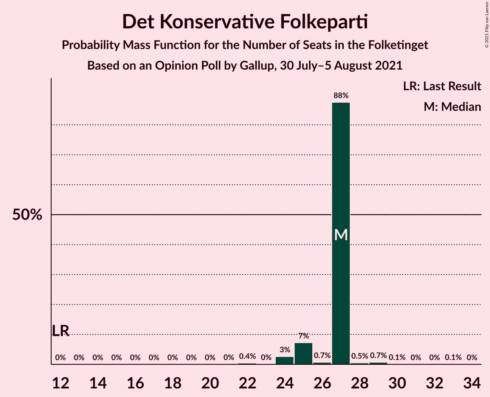
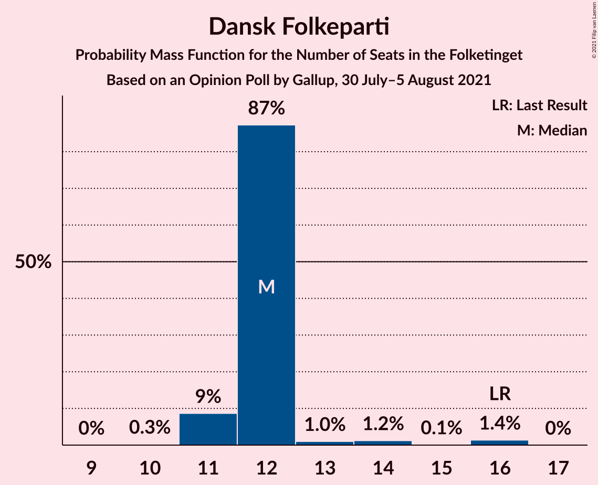
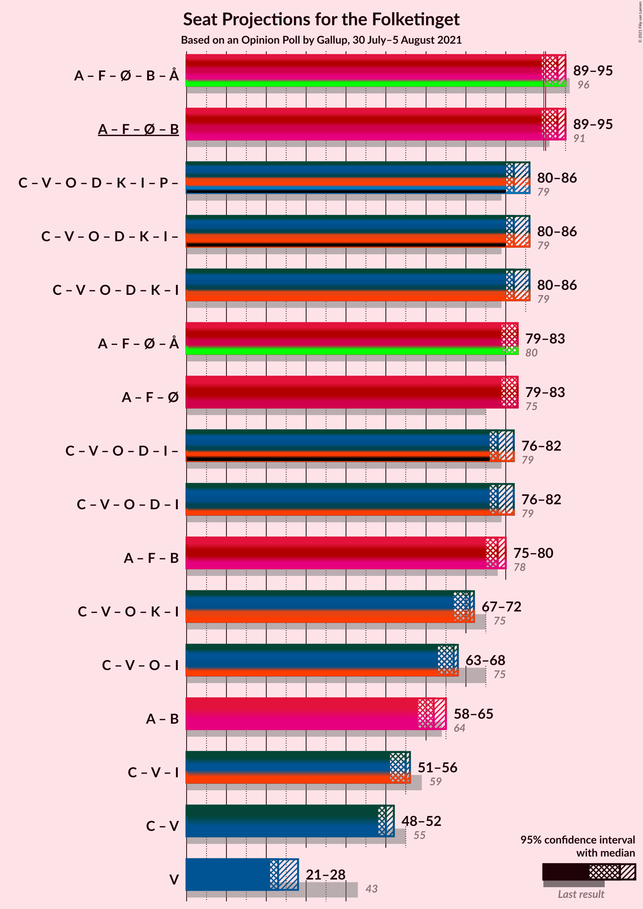
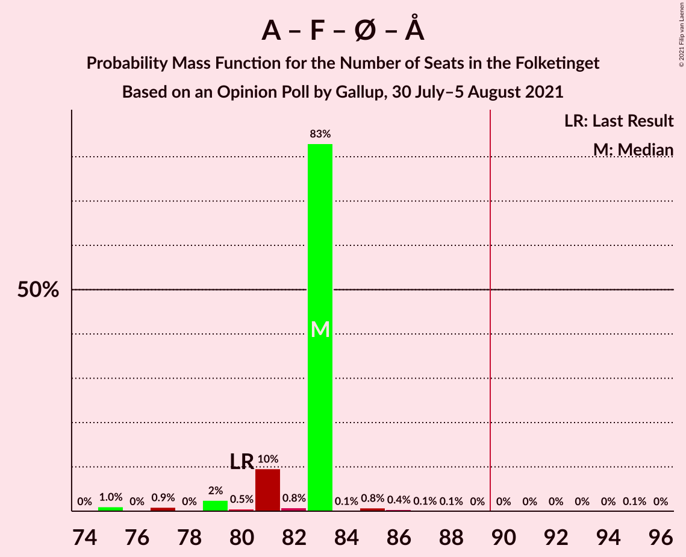
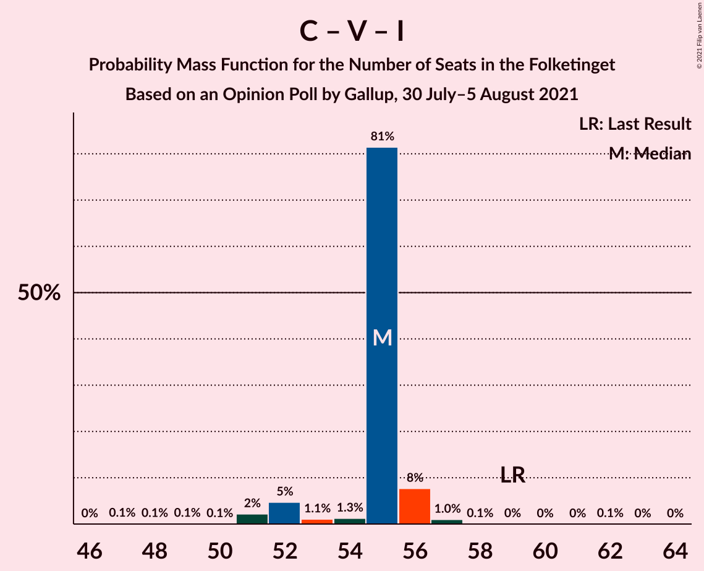

# Opinion Poll by Gallup, 30 July–5 August 2021

<a href="#voting-intentions">Voting Intentions</a> | <a href="#seats">Seats</a> | <a href="#coalitions">Coalitions</a> | <a href="#technical-information">Technical Information</a>

## Voting Intentions

### Confidence Intervals

| Party | Last Result | Poll Result | 80% Confidence Interval | 90% Confidence Interval | 95% Confidence Interval | 99% Confidence Interval |
|:-----:|:-----------:|:-----------:|:-----------------------:|:-----------------------:|:-----------------------:|:-----------------------:|
| Socialdemokraterne | 25.9% | 27.9% | 26.5–29.3% |26.2–29.7% |25.8–30.1% |25.2–30.7% |
| Det Konservative Folkeparti | 6.6% | 14.4% | 13.4–15.5% |13.1–15.9% |12.8–16.2% |12.3–16.7% |
| Venstre | 23.4% | 13.5% | 12.5–14.6% |12.2–14.9% |11.9–15.2% |11.5–15.7% |
| Socialistisk Folkeparti | 7.7% | 9.6% | 8.8–10.6% |8.5–10.9% |8.3–11.1% |7.9–11.6% |
| Enhedslisten–De Rød-Grønne | 6.9% | 7.7% | 7.0–8.6% |6.7–8.9% |6.6–9.1% |6.2–9.5% |
| Dansk Folkeparti | 8.7% | 7.0% | 6.2–7.8% |6.0–8.1% |5.9–8.3% |5.5–8.7% |
| Nye Borgerlige | 2.4% | 7.0% | 6.2–7.8% |6.0–8.1% |5.9–8.3% |5.5–8.7% |
| Radikale Venstre | 8.6% | 6.1% | 5.4–6.9% |5.2–7.1% |5.1–7.3% |4.8–7.7% |
| Liberal Alliance | 2.3% | 2.1% | 1.7–2.6% |1.6–2.7% |1.5–2.9% |1.3–3.1% |
| Kristendemokraterne | 1.7% | 2.1% | 1.7–2.6% |1.6–2.7% |1.5–2.9% |1.3–3.1% |
| Alternativet | 3.0% | 0.6% | 0.4–0.9% |0.4–1.0% |0.3–1.1% |0.2–1.2% |
| Stram Kurs | 1.8% | 0.6% | 0.4–0.9% |0.4–1.0% |0.3–1.1% |0.2–1.2% |
| Borgerlisten | 0.8% | 0.2% | 0.1–0.4% |0.1–0.5% |0.1–0.5% |0.0–0.6% |
| Veganerpartiet | 0.0% | 0.1% | 0.1–0.3% |0.0–0.4% |0.0–0.4% |0.0–0.5% |

*Note:* The poll result column reflects the actual value used in the calculations. Published results may vary slightly, and in addition be rounded to fewer digits.

## Seats

### Confidence Intervals

| Party | Last Result | Median | 80% Confidence Interval | 90% Confidence Interval | 95% Confidence Interval | 99% Confidence Interval |
|:-----:|:-----------:|:------:|:-----------------------:|:-----------------------:|:-----------------------:|:-----------------------:|
| <a href="#socialdemokraterne">Socialdemokraterne</a> | 48 | 52 | 51–52 |50–52 |48–53 |44–54 |
| <a href="#det-konservative-folkeparti">Det Konservative Folkeparti</a> | 12 | 27 | 25–27 |25–27 |24–27 |23–29 |
| <a href="#venstre">Venstre</a> | 43 | 23 | 23–25 |21–26 |21–28 |20–28 |
| <a href="#socialistisk-folkeparti">Socialistisk Folkeparti</a> | 14 | 16 | 16 |15–17 |14–18 |14–19 |
| <a href="#enhedslisten–de-rød-grønne">Enhedslisten–De Rød-Grønne</a> | 13 | 15 | 14–15 |12–16 |12–16 |12–18 |
| <a href="#dansk-folkeparti">Dansk Folkeparti</a> | 16 | 12 | 12 |11–12 |11–14 |11–16 |
| <a href="#nye-borgerlige">Nye Borgerlige</a> | 4 | 11 | 11–13 |11–14 |11–14 |11–15 |
| <a href="#radikale-venstre">Radikale Venstre</a> | 16 | 10 | 10–12 |9–14 |8–14 |8–14 |
| <a href="#liberal-alliance">Liberal Alliance</a> | 4 | 5 | 4–5 |4–5 |0–5 |0–5 |
| <a href="#kristendemokraterne">Kristendemokraterne</a> | 0 | 4 | 4 |4 |0–4 |0–5 |
| <a href="#alternativet">Alternativet</a> | 5 | 0 | 0 |0 |0 |0 |
| <a href="#stram-kurs">Stram Kurs</a> | 0 | 0 | 0 |0 |0 |0 |
| <a href="#borgerlisten">Borgerlisten</a> | 0 | 0 | 0 |0 |0 |0 |
| <a href="#veganerpartiet">Veganerpartiet</a> | 0 | 0 | 0 |0 |0 |0 |

### Socialdemokraterne

*For a full overview of the results for this party, see the [Socialdemokraterne](party-socialdemokraterne.html) page.*

| Number of Seats | Probability | Accumulated | Special Marks |
|:---------------:|:-----------:|:-----------:|:-------------:|
| 44 | 1.0% | 100% |  |
| 45 | 0.1% | 99.0% |  |
| 46 | 0.1% | 98.9% |  |
| 47 | 0.9% | 98.8% |  |
| 48 | 0.4% | 98% | Last Result |
| 49 | 0.7% | 97% |  |
| 50 | 5% | 97% |  |
| 51 | 1.3% | 91% |  |
| 52 | 87% | 90% | Median |
| 53 | 2% | 3% |  |
| 54 | 0.5% | 0.7% |  |
| 55 | 0.1% | 0.2% |  |
| 56 | 0.1% | 0.1% |  |
| 57 | 0.1% | 0.1% |  |
| 58 | 0% | 0% |  |

### Det Konservative Folkeparti

*For a full overview of the results for this party, see the [Det Konservative Folkeparti](party-detkonservativefolkeparti.html) page.*

| Number of Seats | Probability | Accumulated | Special Marks |
|:---------------:|:-----------:|:-----------:|:-------------:|
| 12 | 0% | 100% | Last Result |
| 13 | 0% | 100% |  |
| 14 | 0% | 100% |  |
| 15 | 0% | 100% |  |
| 16 | 0% | 100% |  |
| 17 | 0% | 100% |  |
| 18 | 0% | 100% |  |
| 19 | 0% | 100% |  |
| 20 | 0% | 100% |  |
| 21 | 0% | 100% |  |
| 22 | 0.4% | 99.9% |  |
| 23 | 0% | 99.5% |  |
| 24 | 3% | 99.5% |  |
| 25 | 7% | 97% |  |
| 26 | 0.7% | 90% |  |
| 27 | 88% | 89% | Median |
| 28 | 0.5% | 1.4% |  |
| 29 | 0.7% | 0.9% |  |
| 30 | 0.1% | 0.1% |  |
| 31 | 0% | 0.1% |  |
| 32 | 0% | 0.1% |  |
| 33 | 0.1% | 0.1% |  |
| 34 | 0% | 0% |  |

### Venstre

*For a full overview of the results for this party, see the [Venstre](party-venstre.html) page.*

| Number of Seats | Probability | Accumulated | Special Marks |
|:---------------:|:-----------:|:-----------:|:-------------:|
| 20 | 0.7% | 100% |  |
| 21 | 5% | 99.3% |  |
| 22 | 1.1% | 95% |  |
| 23 | 82% | 94% | Median |
| 24 | 0.2% | 12% |  |
| 25 | 2% | 11% |  |
| 26 | 6% | 10% |  |
| 27 | 1.0% | 4% |  |
| 28 | 3% | 3% |  |
| 29 | 0% | 0% |  |
| 30 | 0% | 0% |  |
| 31 | 0% | 0% |  |
| 32 | 0% | 0% |  |
| 33 | 0% | 0% |  |
| 34 | 0% | 0% |  |
| 35 | 0% | 0% |  |
| 36 | 0% | 0% |  |
| 37 | 0% | 0% |  |
| 38 | 0% | 0% |  |
| 39 | 0% | 0% |  |
| 40 | 0% | 0% |  |
| 41 | 0% | 0% |  |
| 42 | 0% | 0% |  |
| 43 | 0% | 0% | Last Result |

### Socialistisk Folkeparti

*For a full overview of the results for this party, see the [Socialistisk Folkeparti](party-socialistiskfolkeparti.html) page.*

| Number of Seats | Probability | Accumulated | Special Marks |
|:---------------:|:-----------:|:-----------:|:-------------:|
| 14 | 2% | 100% | Last Result |
| 15 | 5% | 97% |  |
| 16 | 84% | 93% | Median |
| 17 | 6% | 9% |  |
| 18 | 2% | 3% |  |
| 19 | 1.4% | 2% |  |
| 20 | 0.1% | 0.2% |  |
| 21 | 0% | 0.1% |  |
| 22 | 0.1% | 0.1% |  |
| 23 | 0% | 0% |  |

### Enhedslisten–De Rød-Grønne

*For a full overview of the results for this party, see the [Enhedslisten–De Rød-Grønne](party-enhedslisten–derød-grønne.html) page.*

| Number of Seats | Probability | Accumulated | Special Marks |
|:---------------:|:-----------:|:-----------:|:-------------:|
| 11 | 0% | 100% |  |
| 12 | 8% | 99.9% |  |
| 13 | 2% | 92% | Last Result |
| 14 | 2% | 91% |  |
| 15 | 82% | 89% | Median |
| 16 | 6% | 7% |  |
| 17 | 0.1% | 0.6% |  |
| 18 | 0.5% | 0.5% |  |
| 19 | 0% | 0% |  |

### Dansk Folkeparti

*For a full overview of the results for this party, see the [Dansk Folkeparti](party-danskfolkeparti.html) page.*

| Number of Seats | Probability | Accumulated | Special Marks |
|:---------------:|:-----------:|:-----------:|:-------------:|
| 10 | 0.3% | 100% |  |
| 11 | 9% | 99.7% |  |
| 12 | 87% | 91% | Median |
| 13 | 1.0% | 4% |  |
| 14 | 1.2% | 3% |  |
| 15 | 0.1% | 2% |  |
| 16 | 1.4% | 1.4% | Last Result |
| 17 | 0% | 0% |  |

### Nye Borgerlige

*For a full overview of the results for this party, see the [Nye Borgerlige](party-nyeborgerlige.html) page.*

| Number of Seats | Probability | Accumulated | Special Marks |
|:---------------:|:-----------:|:-----------:|:-------------:|
| 4 | 0% | 100% | Last Result |
| 5 | 0% | 100% |  |
| 6 | 0% | 100% |  |
| 7 | 0% | 100% |  |
| 8 | 0% | 100% |  |
| 9 | 0% | 100% |  |
| 10 | 0.4% | 100% |  |
| 11 | 82% | 99.6% | Median |
| 12 | 1.4% | 17% |  |
| 13 | 8% | 16% |  |
| 14 | 7% | 8% |  |
| 15 | 1.3% | 1.4% |  |
| 16 | 0% | 0.1% |  |
| 17 | 0.1% | 0.1% |  |
| 18 | 0% | 0% |  |

### Radikale Venstre

*For a full overview of the results for this party, see the [Radikale Venstre](party-radikalevenstre.html) page.*

| Number of Seats | Probability | Accumulated | Special Marks |
|:---------------:|:-----------:|:-----------:|:-------------:|
| 8 | 5% | 100% |  |
| 9 | 0.7% | 95% |  |
| 10 | 82% | 94% | Median |
| 11 | 2% | 12% |  |
| 12 | 4% | 10% |  |
| 13 | 0.7% | 6% |  |
| 14 | 5% | 5% |  |
| 15 | 0.1% | 0.1% |  |
| 16 | 0% | 0% | Last Result |

### Liberal Alliance

*For a full overview of the results for this party, see the [Liberal Alliance](party-liberalalliance.html) page.*

| Number of Seats | Probability | Accumulated | Special Marks |
|:---------------:|:-----------:|:-----------:|:-------------:|
| 0 | 3% | 100% |  |
| 1 | 0% | 97% |  |
| 2 | 0% | 97% |  |
| 3 | 0% | 97% |  |
| 4 | 9% | 97% | Last Result |
| 5 | 88% | 88% | Median |
| 6 | 0% | 0% |  |

### Kristendemokraterne

*For a full overview of the results for this party, see the [Kristendemokraterne](party-kristendemokraterne.html) page.*

| Number of Seats | Probability | Accumulated | Special Marks |
|:---------------:|:-----------:|:-----------:|:-------------:|
| 0 | 3% | 100% | Last Result |
| 1 | 0% | 97% |  |
| 2 | 0% | 97% |  |
| 3 | 0% | 97% |  |
| 4 | 95% | 97% | Median |
| 5 | 2% | 2% |  |
| 6 | 0.1% | 0.1% |  |
| 7 | 0% | 0% |  |

### Alternativet

*For a full overview of the results for this party, see the [Alternativet](party-alternativet.html) page.*

| Number of Seats | Probability | Accumulated | Special Marks |
|:---------------:|:-----------:|:-----------:|:-------------:|
| 0 | 100% | 100% | Median |
| 1 | 0% | 0% |  |
| 2 | 0% | 0% |  |
| 3 | 0% | 0% |  |
| 4 | 0% | 0% |  |
| 5 | 0% | 0% | Last Result |

### Stram Kurs

*For a full overview of the results for this party, see the [Stram Kurs](party-stramkurs.html) page.*

| Number of Seats | Probability | Accumulated | Special Marks |
|:---------------:|:-----------:|:-----------:|:-------------:|
| 0 | 100% | 100% | Last Result, Median |

### Borgerlisten

*For a full overview of the results for this party, see the [Borgerlisten](party-borgerlisten.html) page.*

| Number of Seats | Probability | Accumulated | Special Marks |
|:---------------:|:-----------:|:-----------:|:-------------:|
| 0 | 100% | 100% | Last Result, Median |

### Veganerpartiet

*For a full overview of the results for this party, see the [Veganerpartiet](party-veganerpartiet.html) page.*

| Number of Seats | Probability | Accumulated | Special Marks |
|:---------------:|:-----------:|:-----------:|:-------------:|
| 0 | 100% | 100% | Last Result, Median |

## Coalitions

### Confidence Intervals

| Coalition | Last Result | Median | Majority? | 80% Confidence Interval | 90% Confidence Interval | 95% Confidence Interval | 99% Confidence Interval |
|:---------:|:-----------:|:------:|:---------:|:-----------------------:|:-----------------------:|:-----------------------:|:-----------------------:|
| Socialdemokraterne – Socialistisk Folkeparti – Enhedslisten–De Rød-Grønne – Radikale Venstre – Alternativet | 96 | 93 | 93% | 92–93 | 89–95 | 89–95 | 85–98 |
| Socialdemokraterne – Socialistisk Folkeparti – Enhedslisten–De Rød-Grønne – Radikale Venstre | 91 | 93 | 93% | 92–93 | 89–95 | 89–95 | 85–98 |
| Det Konservative Folkeparti – Venstre – Dansk Folkeparti – Nye Borgerlige – Kristendemokraterne – Liberal Alliance | 79 | 82 | 1.0% | 82–83 | 80–86 | 80–86 | 77–90 |
| Socialdemokraterne – Socialistisk Folkeparti – Enhedslisten–De Rød-Grønne – Alternativet | 80 | 83 | 0.1% | 81–83 | 80–83 | 79–83 | 75–86 |
| Socialdemokraterne – Socialistisk Folkeparti – Enhedslisten–De Rød-Grønne | 75 | 83 | 0.1% | 81–83 | 80–83 | 79–83 | 75–86 |
| Det Konservative Folkeparti – Venstre – Dansk Folkeparti – Nye Borgerlige – Liberal Alliance | 79 | 78 | 0% | 78–79 | 76–82 | 76–82 | 76–85 |
| Socialdemokraterne – Socialistisk Folkeparti – Radikale Venstre | 78 | 78 | 0% | 78–79 | 77–79 | 75–80 | 72–83 |
| Det Konservative Folkeparti – Venstre – Dansk Folkeparti – Kristendemokraterne – Liberal Alliance | 75 | 71 | 0% | 70–71 | 67–72 | 67–72 | 66–76 |
| Det Konservative Folkeparti – Venstre – Dansk Folkeparti – Liberal Alliance | 75 | 67 | 0% | 67 | 63–68 | 63–68 | 63–71 |
| Socialdemokraterne – Radikale Venstre | 64 | 62 | 0% | 62 | 60–64 | 58–65 | 54–66 |
| Det Konservative Folkeparti – Venstre – Liberal Alliance | 59 | 55 | 0% | 55 | 52–56 | 51–56 | 51–57 |
| Det Konservative Folkeparti – Venstre | 55 | 50 | 0% | 50–51 | 48–52 | 48–52 | 46–55 |
| Venstre | 43 | 23 | 0% | 23–25 | 21–26 | 21–28 | 20–28 |

### Socialdemokraterne – Socialistisk Folkeparti – Enhedslisten–De Rød-Grønne – Radikale Venstre – Alternativet

| Number of Seats | Probability | Accumulated | Special Marks |
|:---------------:|:-----------:|:-----------:|:-------------:|
| 85 | 1.0% | 100% |  |
| 86 | 0% | 99.0% |  |
| 87 | 0% | 99.0% |  |
| 88 | 0.8% | 98.9% |  |
| 89 | 5% | 98% |  |
| 90 | 0.1% | 93% | Majority |
| 91 | 3% | 93% |  |
| 92 | 0.6% | 90% |  |
| 93 | 81% | 89% | Median |
| 94 | 0.7% | 8% |  |
| 95 | 5% | 8% |  |
| 96 | 0.1% | 2% | Last Result |
| 97 | 1.3% | 2% |  |
| 98 | 0.5% | 0.7% |  |
| 99 | 0% | 0.1% |  |
| 100 | 0% | 0.1% |  |
| 101 | 0% | 0.1% |  |
| 102 | 0% | 0.1% |  |
| 103 | 0% | 0.1% |  |
| 104 | 0.1% | 0.1% |  |
| 105 | 0% | 0% |  |

### Socialdemokraterne – Socialistisk Folkeparti – Enhedslisten–De Rød-Grønne – Radikale Venstre

| Number of Seats | Probability | Accumulated | Special Marks |
|:---------------:|:-----------:|:-----------:|:-------------:|
| 85 | 1.0% | 100% |  |
| 86 | 0% | 99.0% |  |
| 87 | 0% | 99.0% |  |
| 88 | 0.8% | 98.9% |  |
| 89 | 5% | 98% |  |
| 90 | 0.1% | 93% | Majority |
| 91 | 3% | 93% | Last Result |
| 92 | 0.6% | 90% |  |
| 93 | 81% | 89% | Median |
| 94 | 0.7% | 8% |  |
| 95 | 5% | 8% |  |
| 96 | 0.1% | 2% |  |
| 97 | 1.3% | 2% |  |
| 98 | 0.5% | 0.7% |  |
| 99 | 0% | 0.1% |  |
| 100 | 0% | 0.1% |  |
| 101 | 0% | 0.1% |  |
| 102 | 0% | 0.1% |  |
| 103 | 0% | 0.1% |  |
| 104 | 0.1% | 0.1% |  |
| 105 | 0% | 0% |  |

### Det Konservative Folkeparti – Venstre – Dansk Folkeparti – Nye Borgerlige – Kristendemokraterne – Liberal Alliance

| Number of Seats | Probability | Accumulated | Special Marks |
|:---------------:|:-----------:|:-----------:|:-------------:|
| 71 | 0.1% | 100% |  |
| 72 | 0% | 99.9% |  |
| 73 | 0% | 99.9% |  |
| 74 | 0% | 99.9% |  |
| 75 | 0.1% | 99.9% |  |
| 76 | 0% | 99.8% |  |
| 77 | 0.6% | 99.8% |  |
| 78 | 1.3% | 99.3% |  |
| 79 | 0% | 98% | Last Result |
| 80 | 5% | 98% |  |
| 81 | 0.7% | 92% |  |
| 82 | 81% | 92% | Median |
| 83 | 1.5% | 11% |  |
| 84 | 3% | 9% |  |
| 85 | 0.1% | 6% |  |
| 86 | 5% | 6% |  |
| 87 | 0% | 1.1% |  |
| 88 | 0% | 1.1% |  |
| 89 | 0% | 1.0% |  |
| 90 | 1.0% | 1.0% | Majority |
| 91 | 0% | 0% |  |

### Socialdemokraterne – Socialistisk Folkeparti – Enhedslisten–De Rød-Grønne – Alternativet

| Number of Seats | Probability | Accumulated | Special Marks |
|:---------------:|:-----------:|:-----------:|:-------------:|
| 75 | 1.0% | 100% |  |
| 76 | 0% | 98.9% |  |
| 77 | 0.9% | 98.9% |  |
| 78 | 0% | 98% |  |
| 79 | 2% | 98% |  |
| 80 | 0.5% | 95% | Last Result |
| 81 | 10% | 95% |  |
| 82 | 0.8% | 85% |  |
| 83 | 83% | 85% | Median |
| 84 | 0.1% | 2% |  |
| 85 | 0.8% | 1.4% |  |
| 86 | 0.4% | 0.7% |  |
| 87 | 0.1% | 0.3% |  |
| 88 | 0.1% | 0.1% |  |
| 89 | 0% | 0.1% |  |
| 90 | 0% | 0.1% | Majority |
| 91 | 0% | 0.1% |  |
| 92 | 0% | 0.1% |  |
| 93 | 0% | 0.1% |  |
| 94 | 0% | 0.1% |  |
| 95 | 0.1% | 0.1% |  |
| 96 | 0% | 0% |  |

### Socialdemokraterne – Socialistisk Folkeparti – Enhedslisten–De Rød-Grønne

| Number of Seats | Probability | Accumulated | Special Marks |
|:---------------:|:-----------:|:-----------:|:-------------:|
| 75 | 1.0% | 100% | Last Result |
| 76 | 0% | 98.9% |  |
| 77 | 0.9% | 98.9% |  |
| 78 | 0% | 98% |  |
| 79 | 2% | 98% |  |
| 80 | 0.5% | 95% |  |
| 81 | 10% | 95% |  |
| 82 | 0.8% | 85% |  |
| 83 | 83% | 85% | Median |
| 84 | 0.1% | 2% |  |
| 85 | 0.8% | 1.4% |  |
| 86 | 0.4% | 0.7% |  |
| 87 | 0.1% | 0.3% |  |
| 88 | 0.1% | 0.1% |  |
| 89 | 0% | 0.1% |  |
| 90 | 0% | 0.1% | Majority |
| 91 | 0% | 0.1% |  |
| 92 | 0% | 0.1% |  |
| 93 | 0% | 0.1% |  |
| 94 | 0% | 0.1% |  |
| 95 | 0.1% | 0.1% |  |
| 96 | 0% | 0% |  |

### Det Konservative Folkeparti – Venstre – Dansk Folkeparti – Nye Borgerlige – Liberal Alliance

| Number of Seats | Probability | Accumulated | Special Marks |
|:---------------:|:-----------:|:-----------:|:-------------:|
| 70 | 0.1% | 100% |  |
| 71 | 0.1% | 99.9% |  |
| 72 | 0% | 99.9% |  |
| 73 | 0% | 99.9% |  |
| 74 | 0.1% | 99.9% |  |
| 75 | 0.1% | 99.8% |  |
| 76 | 5% | 99.7% |  |
| 77 | 1.1% | 95% |  |
| 78 | 83% | 94% | Median |
| 79 | 2% | 11% | Last Result |
| 80 | 3% | 9% |  |
| 81 | 0.1% | 6% |  |
| 82 | 5% | 6% |  |
| 83 | 0.1% | 1.2% |  |
| 84 | 0% | 1.1% |  |
| 85 | 1.0% | 1.1% |  |
| 86 | 0% | 0.1% |  |
| 87 | 0% | 0% |  |

### Socialdemokraterne – Socialistisk Folkeparti – Radikale Venstre

| Number of Seats | Probability | Accumulated | Special Marks |
|:---------------:|:-----------:|:-----------:|:-------------:|
| 72 | 1.0% | 100% |  |
| 73 | 0% | 99.0% |  |
| 74 | 1.3% | 98.9% |  |
| 75 | 0.1% | 98% |  |
| 76 | 0.1% | 97% |  |
| 77 | 5% | 97% |  |
| 78 | 82% | 92% | Last Result, Median |
| 79 | 7% | 11% |  |
| 80 | 1.3% | 4% |  |
| 81 | 0.7% | 2% |  |
| 82 | 0.6% | 2% |  |
| 83 | 0.7% | 0.9% |  |
| 84 | 0% | 0.2% |  |
| 85 | 0.1% | 0.2% |  |
| 86 | 0% | 0.1% |  |
| 87 | 0.1% | 0.1% |  |
| 88 | 0% | 0% |  |

### Det Konservative Folkeparti – Venstre – Dansk Folkeparti – Kristendemokraterne – Liberal Alliance

| Number of Seats | Probability | Accumulated | Special Marks |
|:---------------:|:-----------:|:-----------:|:-------------:|
| 58 | 0.1% | 100% |  |
| 59 | 0% | 99.9% |  |
| 60 | 0% | 99.9% |  |
| 61 | 0% | 99.9% |  |
| 62 | 0% | 99.9% |  |
| 63 | 0% | 99.9% |  |
| 64 | 0.1% | 99.8% |  |
| 65 | 0% | 99.7% |  |
| 66 | 0.9% | 99.7% |  |
| 67 | 6% | 98.8% |  |
| 68 | 0.9% | 92% |  |
| 69 | 2% | 92% |  |
| 70 | 0.1% | 90% |  |
| 71 | 84% | 90% | Median |
| 72 | 5% | 6% |  |
| 73 | 0.1% | 1.1% |  |
| 74 | 0.1% | 1.1% |  |
| 75 | 0% | 1.0% | Last Result |
| 76 | 1.0% | 1.0% |  |
| 77 | 0% | 0% |  |

### Det Konservative Folkeparti – Venstre – Dansk Folkeparti – Liberal Alliance

| Number of Seats | Probability | Accumulated | Special Marks |
|:---------------:|:-----------:|:-----------:|:-------------:|
| 58 | 0.1% | 100% |  |
| 59 | 0.1% | 99.9% |  |
| 60 | 0% | 99.9% |  |
| 61 | 0.1% | 99.8% |  |
| 62 | 0.1% | 99.7% |  |
| 63 | 5% | 99.6% |  |
| 64 | 1.3% | 95% |  |
| 65 | 1.2% | 94% |  |
| 66 | 0.9% | 92% |  |
| 67 | 85% | 92% | Median |
| 68 | 5% | 6% |  |
| 69 | 0.1% | 1.3% |  |
| 70 | 0% | 1.2% |  |
| 71 | 1.0% | 1.2% |  |
| 72 | 0.1% | 0.2% |  |
| 73 | 0% | 0% |  |
| 74 | 0% | 0% |  |
| 75 | 0% | 0% | Last Result |

### Socialdemokraterne – Radikale Venstre

| Number of Seats | Probability | Accumulated | Special Marks |
|:---------------:|:-----------:|:-----------:|:-------------:|
| 54 | 1.0% | 100% |  |
| 55 | 0% | 99.0% |  |
| 56 | 0.1% | 99.0% |  |
| 57 | 0.1% | 98.9% |  |
| 58 | 1.4% | 98.8% |  |
| 59 | 0.4% | 97% |  |
| 60 | 5% | 97% |  |
| 61 | 0.2% | 92% |  |
| 62 | 82% | 92% | Median |
| 63 | 0.2% | 9% |  |
| 64 | 5% | 9% | Last Result |
| 65 | 3% | 4% |  |
| 66 | 1.1% | 1.2% |  |
| 67 | 0% | 0.1% |  |
| 68 | 0.1% | 0.1% |  |
| 69 | 0% | 0% |  |

### Det Konservative Folkeparti – Venstre – Liberal Alliance

| Number of Seats | Probability | Accumulated | Special Marks |
|:---------------:|:-----------:|:-----------:|:-------------:|
| 47 | 0.1% | 100% |  |
| 48 | 0.1% | 99.8% |  |
| 49 | 0.1% | 99.7% |  |
| 50 | 0.1% | 99.6% |  |
| 51 | 2% | 99.6% |  |
| 52 | 5% | 97% |  |
| 53 | 1.1% | 93% |  |
| 54 | 1.3% | 92% |  |
| 55 | 81% | 90% | Median |
| 56 | 8% | 9% |  |
| 57 | 1.0% | 1.2% |  |
| 58 | 0.1% | 0.2% |  |
| 59 | 0% | 0.1% | Last Result |
| 60 | 0% | 0.1% |  |
| 61 | 0% | 0.1% |  |
| 62 | 0.1% | 0.1% |  |
| 63 | 0% | 0% |  |

### Det Konservative Folkeparti – Venstre

| Number of Seats | Probability | Accumulated | Special Marks |
|:---------------:|:-----------:|:-----------:|:-------------:|
| 45 | 0.1% | 100% |  |
| 46 | 0.7% | 99.9% |  |
| 47 | 1.0% | 99.2% |  |
| 48 | 5% | 98% |  |
| 49 | 0.6% | 93% |  |
| 50 | 81% | 92% | Median |
| 51 | 6% | 11% |  |
| 52 | 4% | 5% |  |
| 53 | 0.1% | 2% |  |
| 54 | 1.2% | 2% |  |
| 55 | 0.1% | 0.6% | Last Result |
| 56 | 0.4% | 0.5% |  |
| 57 | 0% | 0.1% |  |
| 58 | 0.1% | 0.1% |  |
| 59 | 0% | 0% |  |

### Venstre

| Number of Seats | Probability | Accumulated | Special Marks |
|:---------------:|:-----------:|:-----------:|:-------------:|
| 20 | 0.7% | 100% |  |
| 21 | 5% | 99.3% |  |
| 22 | 1.1% | 95% |  |
| 23 | 82% | 94% | Median |
| 24 | 0.2% | 12% |  |
| 25 | 2% | 11% |  |
| 26 | 6% | 10% |  |
| 27 | 1.0% | 4% |  |
| 28 | 3% | 3% |  |
| 29 | 0% | 0% |  |
| 30 | 0% | 0% |  |
| 31 | 0% | 0% |  |
| 32 | 0% | 0% |  |
| 33 | 0% | 0% |  |
| 34 | 0% | 0% |  |
| 35 | 0% | 0% |  |
| 36 | 0% | 0% |  |
| 37 | 0% | 0% |  |
| 38 | 0% | 0% |  |
| 39 | 0% | 0% |  |
| 40 | 0% | 0% |  |
| 41 | 0% | 0% |  |
| 42 | 0% | 0% |  |
| 43 | 0% | 0% | Last Result |

## Technical Information

### Opinion Poll

+ **Polling firm:** Gallup
+ **Commissioner(s):** —
+ **Fieldwork period:** 30 July–5 August 2021

### Calculations

+ **Sample size:** 1735
+ **Simulations done:** 131,072
+ **Error estimate:** 1.78%

