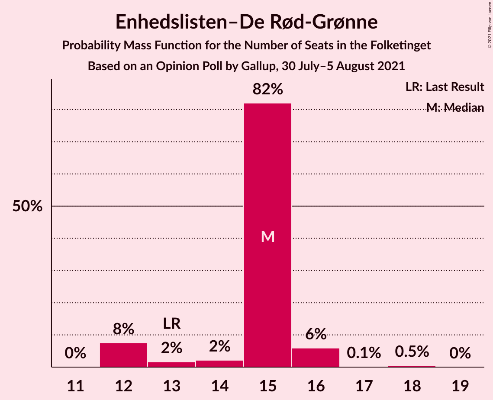
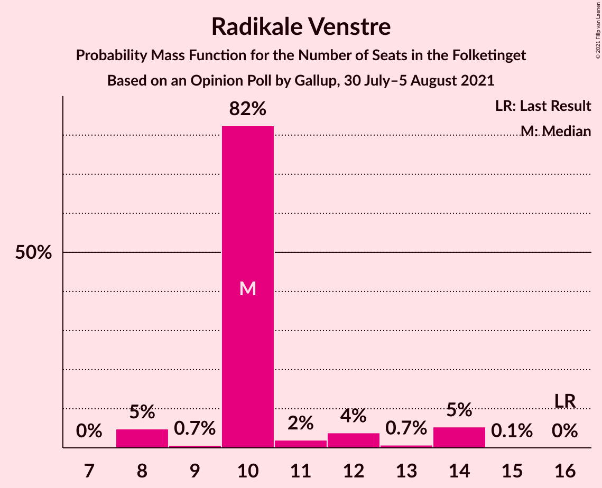
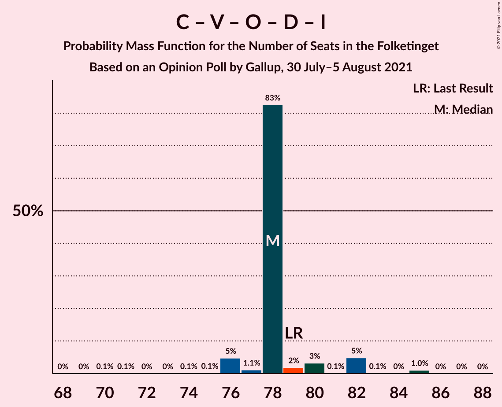
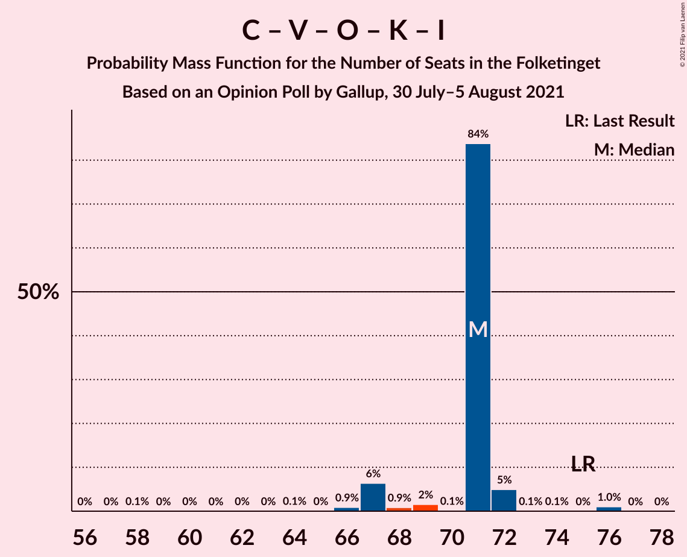

# Opinion Poll by Gallup, 30 July–5 August 2021

<a href="#voting-intentions">Voting Intentions</a> | <a href="#seats">Seats</a> | <a href="#coalitions">Coalitions</a> | <a href="#technical-information">Technical Information</a>

## Voting Intentions

### Confidence Intervals

| Party | Last Result | Poll Result | 80% Confidence Interval | 90% Confidence Interval | 95% Confidence Interval | 99% Confidence Interval |
|:-----:|:-----------:|:-----------:|:-----------------------:|:-----------------------:|:-----------------------:|:-----------------------:|
| Socialdemokraterne | 25.9% | 27.9% | 26.5–29.3% |26.2–29.7% |25.8–30.1% |25.2–30.7% |
| Det Konservative Folkeparti | 6.6% | 14.4% | 13.4–15.5% |13.1–15.9% |12.8–16.2% |12.3–16.7% |
| Venstre | 23.4% | 13.5% | 12.5–14.6% |12.2–14.9% |11.9–15.2% |11.5–15.7% |
| Socialistisk Folkeparti | 7.7% | 9.6% | 8.8–10.6% |8.5–10.9% |8.3–11.1% |7.9–11.6% |
| Enhedslisten–De Rød-Grønne | 6.9% | 7.7% | 7.0–8.6% |6.7–8.9% |6.6–9.1% |6.2–9.5% |
| Dansk Folkeparti | 8.7% | 7.0% | 6.2–7.8% |6.0–8.1% |5.9–8.3% |5.5–8.7% |
| Nye Borgerlige | 2.4% | 7.0% | 6.2–7.8% |6.0–8.1% |5.9–8.3% |5.5–8.7% |
| Radikale Venstre | 8.6% | 6.1% | 5.4–6.9% |5.2–7.1% |5.1–7.3% |4.8–7.7% |
| Liberal Alliance | 2.3% | 2.1% | 1.7–2.6% |1.6–2.7% |1.5–2.9% |1.3–3.1% |
| Kristendemokraterne | 1.7% | 2.1% | 1.7–2.6% |1.6–2.7% |1.5–2.9% |1.3–3.1% |
| Alternativet | 3.0% | 0.6% | 0.4–0.9% |0.4–1.0% |0.3–1.1% |0.2–1.2% |
| Stram Kurs | 1.8% | 0.6% | 0.4–0.9% |0.4–1.0% |0.3–1.1% |0.2–1.2% |
| Borgerlisten | 0.8% | 0.2% | 0.1–0.4% |0.1–0.5% |0.1–0.5% |0.0–0.6% |
| Veganerpartiet | 0.0% | 0.1% | 0.1–0.3% |0.0–0.4% |0.0–0.4% |0.0–0.5% |

*Note:* The poll result column reflects the actual value used in the calculations. Published results may vary slightly, and in addition be rounded to fewer digits.

## Seats

### Confidence Intervals

| Party | Last Result | Median | 80% Confidence Interval | 90% Confidence Interval | 95% Confidence Interval | 99% Confidence Interval |
|:-----:|:-----------:|:------:|:-----------------------:|:-----------------------:|:-----------------------:|:-----------------------:|
| <a href="#socialdemokraterne">Socialdemokraterne</a> | 48 | 52 | 49–55 |48–55 |48–55 |47–55 |
| <a href="#det-konservative-folkeparti">Det Konservative Folkeparti</a> | 12 | 25 | 25–28 |25–28 |24–28 |23–29 |
| <a href="#venstre">Venstre</a> | 43 | 23 | 23–26 |23–27 |23–28 |21–30 |
| <a href="#socialistisk-folkeparti">Socialistisk Folkeparti</a> | 14 | 19 | 16–21 |15–21 |15–21 |14–22 |
| <a href="#enhedslisten–de-rød-grønne">Enhedslisten–De Rød-Grønne</a> | 13 | 14 | 13–17 |13–17 |12–17 |12–17 |
| <a href="#dansk-folkeparti">Dansk Folkeparti</a> | 16 | 12 | 12–15 |11–15 |11–15 |10–15 |
| <a href="#nye-borgerlige">Nye Borgerlige</a> | 4 | 12 | 12–14 |11–14 |11–15 |11–16 |
| <a href="#radikale-venstre">Radikale Venstre</a> | 16 | 12 | 10–13 |10–13 |9–13 |9–14 |
| <a href="#liberal-alliance">Liberal Alliance</a> | 4 | 0 | 0–4 |0–5 |0–5 |0–5 |
| <a href="#kristendemokraterne">Kristendemokraterne</a> | 0 | 0 | 0–4 |0–4 |0–5 |0–5 |
| <a href="#alternativet">Alternativet</a> | 5 | 0 | 0 |0 |0 |0 |
| <a href="#stram-kurs">Stram Kurs</a> | 0 | 0 | 0 |0 |0 |0 |
| <a href="#borgerlisten">Borgerlisten</a> | 0 | 0 | 0 |0 |0 |0 |
| <a href="#veganerpartiet">Veganerpartiet</a> | 0 | 0 | 0 |0 |0 |0 |

### Socialdemokraterne

*For a full overview of the results for this party, see the [Socialdemokraterne](party-socialdemokraterne.html) page.*

| Number of Seats | Probability | Accumulated | Special Marks |
|:---------------:|:-----------:|:-----------:|:-------------:|
| 44 | 0.1% | 100% |  |
| 45 | 0.1% | 99.9% |  |
| 46 | 0.3% | 99.8% |  |
| 47 | 0.4% | 99.6% |  |
| 48 | 4% | 99.1% | Last Result |
| 49 | 35% | 95% |  |
| 50 | 7% | 60% |  |
| 51 | 2% | 53% |  |
| 52 | 6% | 51% | Median |
| 53 | 29% | 45% |  |
| 54 | 0.7% | 16% |  |
| 55 | 15% | 15% |  |
| 56 | 0.1% | 0.4% |  |
| 57 | 0.4% | 0.4% |  |
| 58 | 0% | 0% |  |

### Det Konservative Folkeparti

*For a full overview of the results for this party, see the [Det Konservative Folkeparti](party-detkonservativefolkeparti.html) page.*

| Number of Seats | Probability | Accumulated | Special Marks |
|:---------------:|:-----------:|:-----------:|:-------------:|
| 12 | 0% | 100% | Last Result |
| 13 | 0% | 100% |  |
| 14 | 0% | 100% |  |
| 15 | 0% | 100% |  |
| 16 | 0% | 100% |  |
| 17 | 0% | 100% |  |
| 18 | 0% | 100% |  |
| 19 | 0% | 100% |  |
| 20 | 0% | 100% |  |
| 21 | 0% | 100% |  |
| 22 | 0.4% | 100% |  |
| 23 | 0.2% | 99.6% |  |
| 24 | 4% | 99.4% |  |
| 25 | 46% | 95% | Median |
| 26 | 6% | 49% |  |
| 27 | 11% | 43% |  |
| 28 | 31% | 32% |  |
| 29 | 1.1% | 1.5% |  |
| 30 | 0.1% | 0.4% |  |
| 31 | 0.3% | 0.3% |  |
| 32 | 0% | 0% |  |

### Venstre

*For a full overview of the results for this party, see the [Venstre](party-venstre.html) page.*

| Number of Seats | Probability | Accumulated | Special Marks |
|:---------------:|:-----------:|:-----------:|:-------------:|
| 20 | 0.2% | 100% |  |
| 21 | 0.5% | 99.8% |  |
| 22 | 1.4% | 99.3% |  |
| 23 | 50% | 98% | Median |
| 24 | 4% | 48% |  |
| 25 | 34% | 44% |  |
| 26 | 3% | 10% |  |
| 27 | 3% | 7% |  |
| 28 | 2% | 4% |  |
| 29 | 0.2% | 2% |  |
| 30 | 1.4% | 1.4% |  |
| 31 | 0% | 0% |  |
| 32 | 0% | 0% |  |
| 33 | 0% | 0% |  |
| 34 | 0% | 0% |  |
| 35 | 0% | 0% |  |
| 36 | 0% | 0% |  |
| 37 | 0% | 0% |  |
| 38 | 0% | 0% |  |
| 39 | 0% | 0% |  |
| 40 | 0% | 0% |  |
| 41 | 0% | 0% |  |
| 42 | 0% | 0% |  |
| 43 | 0% | 0% | Last Result |

### Socialistisk Folkeparti

*For a full overview of the results for this party, see the [Socialistisk Folkeparti](party-socialistiskfolkeparti.html) page.*

| Number of Seats | Probability | Accumulated | Special Marks |
|:---------------:|:-----------:|:-----------:|:-------------:|
| 14 | 0.7% | 100% | Last Result |
| 15 | 7% | 99.3% |  |
| 16 | 9% | 92% |  |
| 17 | 5% | 83% |  |
| 18 | 4% | 78% |  |
| 19 | 28% | 74% | Median |
| 20 | 32% | 46% |  |
| 21 | 13% | 14% |  |
| 22 | 1.0% | 1.0% |  |
| 23 | 0% | 0% |  |

### Enhedslisten–De Rød-Grønne

*For a full overview of the results for this party, see the [Enhedslisten–De Rød-Grønne](party-enhedslisten–derød-grønne.html) page.*

| Number of Seats | Probability | Accumulated | Special Marks |
|:---------------:|:-----------:|:-----------:|:-------------:|
| 11 | 0.4% | 100% |  |
| 12 | 3% | 99.5% |  |
| 13 | 35% | 97% | Last Result |
| 14 | 22% | 61% | Median |
| 15 | 9% | 40% |  |
| 16 | 2% | 30% |  |
| 17 | 28% | 28% |  |
| 18 | 0% | 0% |  |

### Dansk Folkeparti

*For a full overview of the results for this party, see the [Dansk Folkeparti](party-danskfolkeparti.html) page.*

| Number of Seats | Probability | Accumulated | Special Marks |
|:---------------:|:-----------:|:-----------:|:-------------:|
| 9 | 0.2% | 100% |  |
| 10 | 2% | 99.8% |  |
| 11 | 3% | 98% |  |
| 12 | 51% | 95% | Median |
| 13 | 6% | 44% |  |
| 14 | 5% | 38% |  |
| 15 | 33% | 33% |  |
| 16 | 0.1% | 0.1% | Last Result |
| 17 | 0% | 0% |  |

### Nye Borgerlige

*For a full overview of the results for this party, see the [Nye Borgerlige](party-nyeborgerlige.html) page.*

| Number of Seats | Probability | Accumulated | Special Marks |
|:---------------:|:-----------:|:-----------:|:-------------:|
| 4 | 0% | 100% | Last Result |
| 5 | 0% | 100% |  |
| 6 | 0% | 100% |  |
| 7 | 0% | 100% |  |
| 8 | 0% | 100% |  |
| 9 | 0% | 100% |  |
| 10 | 0.1% | 100% |  |
| 11 | 9% | 99.9% |  |
| 12 | 73% | 91% | Median |
| 13 | 6% | 18% |  |
| 14 | 8% | 12% |  |
| 15 | 2% | 4% |  |
| 16 | 2% | 2% |  |
| 17 | 0% | 0% |  |

### Radikale Venstre

*For a full overview of the results for this party, see the [Radikale Venstre](party-radikalevenstre.html) page.*

| Number of Seats | Probability | Accumulated | Special Marks |
|:---------------:|:-----------:|:-----------:|:-------------:|
| 8 | 0.3% | 100% |  |
| 9 | 3% | 99.7% |  |
| 10 | 9% | 96% |  |
| 11 | 31% | 87% |  |
| 12 | 37% | 57% | Median |
| 13 | 18% | 19% |  |
| 14 | 2% | 2% |  |
| 15 | 0% | 0% |  |
| 16 | 0% | 0% | Last Result |

### Liberal Alliance

*For a full overview of the results for this party, see the [Liberal Alliance](party-liberalalliance.html) page.*

| Number of Seats | Probability | Accumulated | Special Marks |
|:---------------:|:-----------:|:-----------:|:-------------:|
| 0 | 78% | 100% | Median |
| 1 | 0% | 22% |  |
| 2 | 0% | 22% |  |
| 3 | 0% | 22% |  |
| 4 | 13% | 22% | Last Result |
| 5 | 9% | 9% |  |
| 6 | 0.1% | 0.2% |  |
| 7 | 0% | 0% |  |

### Kristendemokraterne

*For a full overview of the results for this party, see the [Kristendemokraterne](party-kristendemokraterne.html) page.*

| Number of Seats | Probability | Accumulated | Special Marks |
|:---------------:|:-----------:|:-----------:|:-------------:|
| 0 | 52% | 100% | Last Result, Median |
| 1 | 0% | 48% |  |
| 2 | 0% | 48% |  |
| 3 | 0% | 48% |  |
| 4 | 45% | 48% |  |
| 5 | 3% | 3% |  |
| 6 | 0% | 0.1% |  |
| 7 | 0.1% | 0.1% |  |
| 8 | 0% | 0% |  |

### Alternativet

*For a full overview of the results for this party, see the [Alternativet](party-alternativet.html) page.*

| Number of Seats | Probability | Accumulated | Special Marks |
|:---------------:|:-----------:|:-----------:|:-------------:|
| 0 | 100% | 100% | Median |
| 1 | 0% | 0% |  |
| 2 | 0% | 0% |  |
| 3 | 0% | 0% |  |
| 4 | 0% | 0% |  |
| 5 | 0% | 0% | Last Result |

### Stram Kurs

*For a full overview of the results for this party, see the [Stram Kurs](party-stramkurs.html) page.*

| Number of Seats | Probability | Accumulated | Special Marks |
|:---------------:|:-----------:|:-----------:|:-------------:|
| 0 | 100% | 100% | Last Result, Median |

### Borgerlisten

*For a full overview of the results for this party, see the [Borgerlisten](party-borgerlisten.html) page.*

| Number of Seats | Probability | Accumulated | Special Marks |
|:---------------:|:-----------:|:-----------:|:-------------:|
| 0 | 100% | 100% | Last Result, Median |

### Veganerpartiet

*For a full overview of the results for this party, see the [Veganerpartiet](party-veganerpartiet.html) page.*

| Number of Seats | Probability | Accumulated | Special Marks |
|:---------------:|:-----------:|:-----------:|:-------------:|
| 0 | 100% | 100% | Last Result, Median |

## Coalitions

### Confidence Intervals

| Coalition | Last Result | Median | Majority? | 80% Confidence Interval | 90% Confidence Interval | 95% Confidence Interval | 99% Confidence Interval |
|:---------:|:-----------:|:------:|:---------:|:-----------------------:|:-----------------------:|:-----------------------:|:-----------------------:|
| Socialdemokraterne – Socialistisk Folkeparti – Enhedslisten–De Rød-Grønne – Radikale Venstre – Alternativet | 96 | 94 | 95% | 91–103 | 90–103 | 88–103 | 88–103 |
| Socialdemokraterne – Socialistisk Folkeparti – Enhedslisten–De Rød-Grønne – Radikale Venstre | 91 | 94 | 95% | 91–103 | 90–103 | 88–103 | 88–103 |
| Socialdemokraterne – Socialistisk Folkeparti – Enhedslisten–De Rød-Grønne – Alternativet | 80 | 83 | 13% | 80–90 | 78–90 | 77–90 | 75–90 |
| Socialdemokraterne – Socialistisk Folkeparti – Enhedslisten–De Rød-Grønne | 75 | 83 | 13% | 80–90 | 78–90 | 77–90 | 75–90 |
| Socialdemokraterne – Socialistisk Folkeparti – Radikale Venstre | 78 | 81 | 0% | 77–89 | 76–89 | 75–89 | 74–89 |
| Det Konservative Folkeparti – Venstre – Dansk Folkeparti – Nye Borgerlige – Kristendemokraterne – Liberal Alliance | 79 | 81 | 0.1% | 72–84 | 72–85 | 72–87 | 72–87 |
| Det Konservative Folkeparti – Venstre – Dansk Folkeparti – Nye Borgerlige – Liberal Alliance | 79 | 77 | 0% | 72–81 | 72–82 | 72–84 | 72–85 |
| Det Konservative Folkeparti – Venstre – Dansk Folkeparti – Kristendemokraterne – Liberal Alliance | 75 | 68 | 0% | 60–71 | 60–72 | 60–75 | 60–76 |
| Det Konservative Folkeparti – Venstre – Dansk Folkeparti – Liberal Alliance | 75 | 65 | 0% | 60–67 | 60–71 | 60–71 | 60–71 |
| Socialdemokraterne – Radikale Venstre | 64 | 62 | 0% | 61–68 | 59–68 | 58–68 | 58–69 |
| Det Konservative Folkeparti – Venstre – Liberal Alliance | 59 | 51 | 0% | 48–55 | 48–58 | 48–59 | 48–60 |
| Det Konservative Folkeparti – Venstre | 55 | 50 | 0% | 48–53 | 48–54 | 47–54 | 46–56 |
| Venstre | 43 | 23 | 0% | 23–26 | 23–27 | 23–28 | 21–30 |

### Socialdemokraterne – Socialistisk Folkeparti – Enhedslisten–De Rød-Grønne – Radikale Venstre – Alternativet

| Number of Seats | Probability | Accumulated | Special Marks |
|:---------------:|:-----------:|:-----------:|:-------------:|
| 85 | 0.1% | 100% |  |
| 86 | 0.1% | 99.9% |  |
| 87 | 0.1% | 99.9% |  |
| 88 | 3% | 99.8% |  |
| 89 | 2% | 97% |  |
| 90 | 5% | 95% | Majority |
| 91 | 2% | 90% |  |
| 92 | 5% | 88% |  |
| 93 | 4% | 84% |  |
| 94 | 31% | 79% |  |
| 95 | 2% | 48% |  |
| 96 | 1.3% | 46% | Last Result |
| 97 | 1.1% | 45% | Median |
| 98 | 0.8% | 44% |  |
| 99 | 0.6% | 43% |  |
| 100 | 30% | 42% |  |
| 101 | 0% | 13% |  |
| 102 | 0% | 13% |  |
| 103 | 13% | 13% |  |
| 104 | 0% | 0% |  |

### Socialdemokraterne – Socialistisk Folkeparti – Enhedslisten–De Rød-Grønne – Radikale Venstre

| Number of Seats | Probability | Accumulated | Special Marks |
|:---------------:|:-----------:|:-----------:|:-------------:|
| 85 | 0.1% | 100% |  |
| 86 | 0.1% | 99.9% |  |
| 87 | 0.1% | 99.9% |  |
| 88 | 3% | 99.8% |  |
| 89 | 2% | 97% |  |
| 90 | 5% | 95% | Majority |
| 91 | 2% | 90% | Last Result |
| 92 | 5% | 88% |  |
| 93 | 4% | 84% |  |
| 94 | 31% | 79% |  |
| 95 | 2% | 48% |  |
| 96 | 1.3% | 46% |  |
| 97 | 1.1% | 45% | Median |
| 98 | 0.8% | 44% |  |
| 99 | 0.6% | 43% |  |
| 100 | 30% | 42% |  |
| 101 | 0% | 13% |  |
| 102 | 0% | 13% |  |
| 103 | 13% | 13% |  |
| 104 | 0% | 0% |  |

### Socialdemokraterne – Socialistisk Folkeparti – Enhedslisten–De Rød-Grønne – Alternativet

| Number of Seats | Probability | Accumulated | Special Marks |
|:---------------:|:-----------:|:-----------:|:-------------:|
| 75 | 0.5% | 100% |  |
| 76 | 0.2% | 99.4% |  |
| 77 | 3% | 99.2% |  |
| 78 | 2% | 96% |  |
| 79 | 2% | 94% |  |
| 80 | 6% | 92% | Last Result |
| 81 | 1.2% | 86% |  |
| 82 | 31% | 85% |  |
| 83 | 6% | 54% |  |
| 84 | 1.4% | 48% |  |
| 85 | 3% | 47% | Median |
| 86 | 1.4% | 43% |  |
| 87 | 0.1% | 42% |  |
| 88 | 1.2% | 42% |  |
| 89 | 28% | 40% |  |
| 90 | 13% | 13% | Majority |
| 91 | 0% | 0% |  |

### Socialdemokraterne – Socialistisk Folkeparti – Enhedslisten–De Rød-Grønne

| Number of Seats | Probability | Accumulated | Special Marks |
|:---------------:|:-----------:|:-----------:|:-------------:|
| 75 | 0.5% | 100% | Last Result |
| 76 | 0.2% | 99.4% |  |
| 77 | 3% | 99.2% |  |
| 78 | 2% | 96% |  |
| 79 | 2% | 94% |  |
| 80 | 6% | 92% |  |
| 81 | 1.2% | 86% |  |
| 82 | 31% | 85% |  |
| 83 | 6% | 54% |  |
| 84 | 1.4% | 48% |  |
| 85 | 3% | 47% | Median |
| 86 | 1.4% | 43% |  |
| 87 | 0.1% | 42% |  |
| 88 | 1.2% | 42% |  |
| 89 | 28% | 40% |  |
| 90 | 13% | 13% | Majority |
| 91 | 0% | 0% |  |

### Socialdemokraterne – Socialistisk Folkeparti – Radikale Venstre

| Number of Seats | Probability | Accumulated | Special Marks |
|:---------------:|:-----------:|:-----------:|:-------------:|
| 72 | 0.1% | 100% |  |
| 73 | 0.1% | 99.9% |  |
| 74 | 1.2% | 99.8% |  |
| 75 | 2% | 98.6% |  |
| 76 | 5% | 96% |  |
| 77 | 2% | 91% |  |
| 78 | 6% | 88% | Last Result |
| 79 | 3% | 82% |  |
| 80 | 0.6% | 79% |  |
| 81 | 32% | 78% |  |
| 82 | 3% | 46% |  |
| 83 | 28% | 43% | Median |
| 84 | 0.3% | 16% |  |
| 85 | 2% | 15% |  |
| 86 | 0% | 13% |  |
| 87 | 0% | 13% |  |
| 88 | 0% | 13% |  |
| 89 | 13% | 13% |  |
| 90 | 0% | 0% | Majority |

### Det Konservative Folkeparti – Venstre – Dansk Folkeparti – Nye Borgerlige – Kristendemokraterne – Liberal Alliance

| Number of Seats | Probability | Accumulated | Special Marks |
|:---------------:|:-----------:|:-----------:|:-------------:|
| 72 | 13% | 100% | Median |
| 73 | 0% | 87% |  |
| 74 | 0% | 87% |  |
| 75 | 30% | 87% |  |
| 76 | 0.6% | 58% |  |
| 77 | 0.9% | 57% |  |
| 78 | 1.1% | 56% |  |
| 79 | 1.4% | 55% | Last Result |
| 80 | 2% | 54% |  |
| 81 | 31% | 52% |  |
| 82 | 4% | 21% |  |
| 83 | 5% | 16% |  |
| 84 | 2% | 11% |  |
| 85 | 5% | 9% |  |
| 86 | 2% | 5% |  |
| 87 | 3% | 3% |  |
| 88 | 0.1% | 0.1% |  |
| 89 | 0% | 0.1% |  |
| 90 | 0.1% | 0.1% | Majority |
| 91 | 0% | 0% |  |

### Det Konservative Folkeparti – Venstre – Dansk Folkeparti – Nye Borgerlige – Liberal Alliance

| Number of Seats | Probability | Accumulated | Special Marks |
|:---------------:|:-----------:|:-----------:|:-------------:|
| 72 | 13% | 100% | Median |
| 73 | 0.1% | 87% |  |
| 74 | 0.2% | 87% |  |
| 75 | 30% | 87% |  |
| 76 | 1.4% | 57% |  |
| 77 | 31% | 56% |  |
| 78 | 5% | 25% |  |
| 79 | 4% | 19% | Last Result |
| 80 | 2% | 15% |  |
| 81 | 4% | 13% |  |
| 82 | 5% | 9% |  |
| 83 | 1.4% | 4% |  |
| 84 | 1.5% | 3% |  |
| 85 | 1.0% | 1.3% |  |
| 86 | 0% | 0.3% |  |
| 87 | 0.3% | 0.3% |  |
| 88 | 0% | 0% |  |

### Det Konservative Folkeparti – Venstre – Dansk Folkeparti – Kristendemokraterne – Liberal Alliance

| Number of Seats | Probability | Accumulated | Special Marks |
|:---------------:|:-----------:|:-----------:|:-------------:|
| 60 | 13% | 100% | Median |
| 61 | 0.2% | 87% |  |
| 62 | 2% | 87% |  |
| 63 | 27% | 85% |  |
| 64 | 2% | 58% |  |
| 65 | 1.3% | 56% |  |
| 66 | 0.3% | 54% |  |
| 67 | 3% | 54% |  |
| 68 | 2% | 51% |  |
| 69 | 34% | 49% |  |
| 70 | 0.6% | 15% |  |
| 71 | 9% | 15% |  |
| 72 | 0.8% | 6% |  |
| 73 | 0.4% | 5% |  |
| 74 | 0.8% | 4% |  |
| 75 | 2% | 4% | Last Result |
| 76 | 2% | 2% |  |
| 77 | 0% | 0% |  |

### Det Konservative Folkeparti – Venstre – Dansk Folkeparti – Liberal Alliance

| Number of Seats | Probability | Accumulated | Special Marks |
|:---------------:|:-----------:|:-----------:|:-------------:|
| 58 | 0.1% | 100% |  |
| 59 | 0% | 99.9% |  |
| 60 | 13% | 99.9% | Median |
| 61 | 0.2% | 87% |  |
| 62 | 2% | 87% |  |
| 63 | 29% | 85% |  |
| 64 | 2% | 56% |  |
| 65 | 34% | 54% |  |
| 66 | 0.3% | 20% |  |
| 67 | 10% | 19% |  |
| 68 | 2% | 9% |  |
| 69 | 2% | 7% |  |
| 70 | 0.5% | 6% |  |
| 71 | 5% | 5% |  |
| 72 | 0.1% | 0.4% |  |
| 73 | 0.1% | 0.3% |  |
| 74 | 0.3% | 0.3% |  |
| 75 | 0% | 0% | Last Result |

### Socialdemokraterne – Radikale Venstre

| Number of Seats | Probability | Accumulated | Special Marks |
|:---------------:|:-----------:|:-----------:|:-------------:|
| 54 | 0.1% | 100% |  |
| 55 | 0% | 99.9% |  |
| 56 | 0.2% | 99.9% |  |
| 57 | 0.1% | 99.7% |  |
| 58 | 3% | 99.6% |  |
| 59 | 2% | 96% |  |
| 60 | 3% | 95% |  |
| 61 | 35% | 92% |  |
| 62 | 9% | 57% |  |
| 63 | 3% | 48% |  |
| 64 | 29% | 46% | Last Result, Median |
| 65 | 0.6% | 17% |  |
| 66 | 0.9% | 16% |  |
| 67 | 1.2% | 15% |  |
| 68 | 13% | 14% |  |
| 69 | 1.1% | 1.1% |  |
| 70 | 0% | 0% |  |

### Det Konservative Folkeparti – Venstre – Liberal Alliance

| Number of Seats | Probability | Accumulated | Special Marks |
|:---------------:|:-----------:|:-----------:|:-------------:|
| 46 | 0.1% | 100% |  |
| 47 | 0% | 99.9% |  |
| 48 | 13% | 99.9% | Median |
| 49 | 0.9% | 87% |  |
| 50 | 32% | 86% |  |
| 51 | 31% | 55% |  |
| 52 | 4% | 24% |  |
| 53 | 1.5% | 20% |  |
| 54 | 5% | 18% |  |
| 55 | 5% | 13% |  |
| 56 | 1.1% | 8% |  |
| 57 | 1.2% | 7% |  |
| 58 | 3% | 6% |  |
| 59 | 2% | 3% | Last Result |
| 60 | 2% | 2% |  |
| 61 | 0% | 0% |  |

### Det Konservative Folkeparti – Venstre

| Number of Seats | Probability | Accumulated | Special Marks |
|:---------------:|:-----------:|:-----------:|:-------------:|
| 45 | 0% | 100% |  |
| 46 | 0.5% | 99.9% |  |
| 47 | 3% | 99.4% |  |
| 48 | 16% | 96% | Median |
| 49 | 2% | 80% |  |
| 50 | 37% | 79% |  |
| 51 | 28% | 41% |  |
| 52 | 2% | 14% |  |
| 53 | 2% | 11% |  |
| 54 | 7% | 9% |  |
| 55 | 0.3% | 2% | Last Result |
| 56 | 2% | 2% |  |
| 57 | 0.1% | 0.1% |  |
| 58 | 0% | 0% |  |

### Venstre

| Number of Seats | Probability | Accumulated | Special Marks |
|:---------------:|:-----------:|:-----------:|:-------------:|
| 20 | 0.2% | 100% |  |
| 21 | 0.5% | 99.8% |  |
| 22 | 1.4% | 99.3% |  |
| 23 | 50% | 98% | Median |
| 24 | 4% | 48% |  |
| 25 | 34% | 44% |  |
| 26 | 3% | 10% |  |
| 27 | 3% | 7% |  |
| 28 | 2% | 4% |  |
| 29 | 0.2% | 2% |  |
| 30 | 1.4% | 1.4% |  |
| 31 | 0% | 0% |  |
| 32 | 0% | 0% |  |
| 33 | 0% | 0% |  |
| 34 | 0% | 0% |  |
| 35 | 0% | 0% |  |
| 36 | 0% | 0% |  |
| 37 | 0% | 0% |  |
| 38 | 0% | 0% |  |
| 39 | 0% | 0% |  |
| 40 | 0% | 0% |  |
| 41 | 0% | 0% |  |
| 42 | 0% | 0% |  |
| 43 | 0% | 0% | Last Result |

## Technical Information

### Opinion Poll

+ **Polling firm:** Gallup
+ **Commissioner(s):** —
+ **Fieldwork period:** 30 July–5 August 2021

### Calculations

+ **Sample size:** 1735
+ **Simulations done:** 1,048,576
+ **Error estimate:** 2.99%

