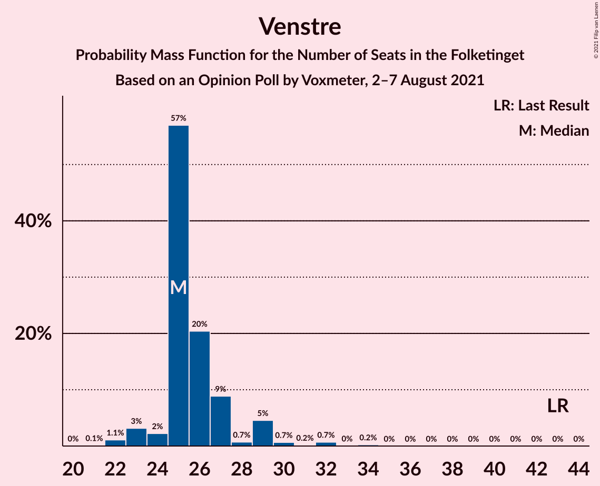
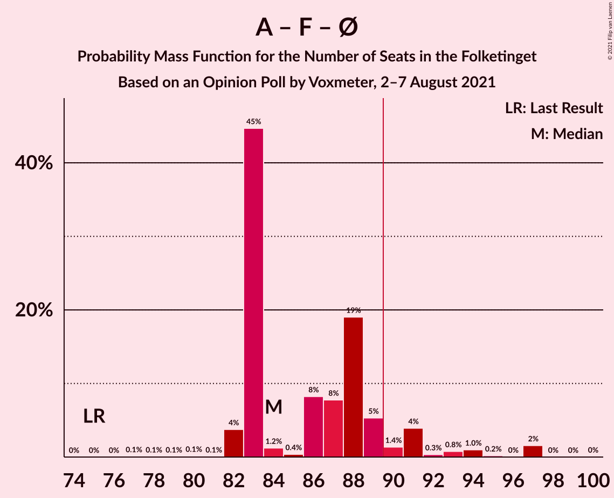
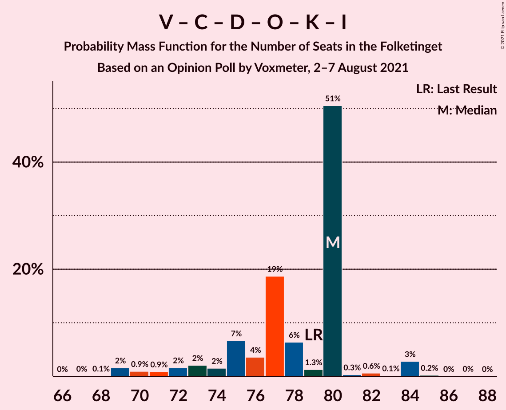
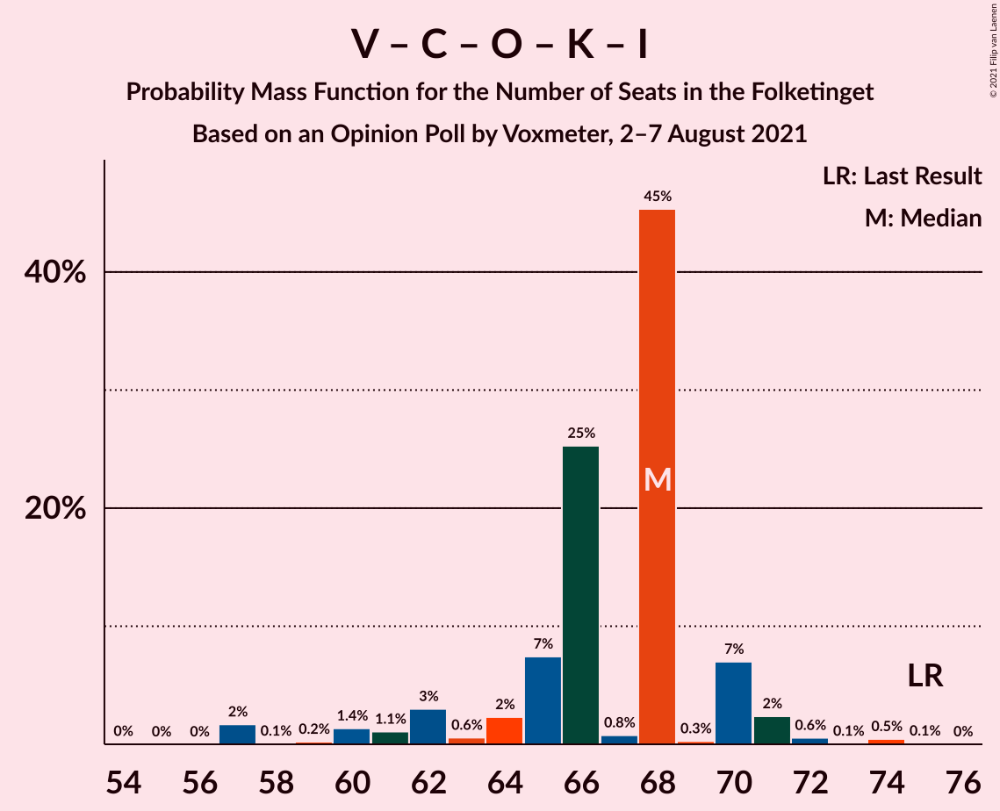

# Opinion Poll by Voxmeter, 2–7 August 2021

<a href="#voting-intentions">Voting Intentions</a> | <a href="#seats">Seats</a> | <a href="#coalitions">Coalitions</a> | <a href="#technical-information">Technical Information</a>

## Voting Intentions

### Confidence Intervals

| Party | Last Result | Poll Result | 80% Confidence Interval | 90% Confidence Interval | 95% Confidence Interval | 99% Confidence Interval |
|:-----:|:-----------:|:-----------:|:-----------------------:|:-----------------------:|:-----------------------:|:-----------------------:|
| Socialdemokraterne | 25.9% | 30.3% | 28.5–32.2% |28.0–32.7% |27.5–33.2% |26.7–34.1% |
| Venstre | 23.4% | 14.5% | 13.2–16.1% |12.8–16.5% |12.5–16.9% |11.9–17.6% |
| Det Konservative Folkeparti | 6.6% | 13.4% | 12.1–14.9% |11.8–15.3% |11.5–15.7% |10.9–16.4% |
| Socialistisk Folkeparti | 7.7% | 9.8% | 8.6–11.1% |8.3–11.4% |8.1–11.8% |7.6–12.4% |
| Enhedslisten–De Rød-Grønne | 6.9% | 9.1% | 8.0–10.3% |7.7–10.7% |7.4–11.0% |7.0–11.6% |
| Nye Borgerlige | 2.4% | 6.0% | 5.1–7.1% |4.9–7.4% |4.7–7.6% |4.3–8.2% |
| Dansk Folkeparti | 8.7% | 5.9% | 5.0–7.0% |4.8–7.2% |4.6–7.5% |4.2–8.1% |
| Radikale Venstre | 8.6% | 5.4% | 4.6–6.4% |4.3–6.7% |4.1–7.0% |3.8–7.5% |
| Kristendemokraterne | 1.7% | 2.2% | 1.7–2.9% |1.6–3.1% |1.4–3.3% |1.2–3.7% |
| Liberal Alliance | 2.3% | 1.7% | 1.3–2.3% |1.2–2.5% |1.1–2.7% |0.9–3.0% |
| Veganerpartiet | 0.0% | 0.3% | 0.2–0.7% |0.1–0.8% |0.1–0.9% |0.1–1.1% |

*Note:* The poll result column reflects the actual value used in the calculations. Published results may vary slightly, and in addition be rounded to fewer digits.

## Seats

### Confidence Intervals

| Party | Last Result | Median | 80% Confidence Interval | 90% Confidence Interval | 95% Confidence Interval | 99% Confidence Interval |
|:-----:|:-----------:|:------:|:-----------------------:|:-----------------------:|:-----------------------:|:-----------------------:|
| <a href="#socialdemokraterne">Socialdemokraterne</a> | 48 | 52 | 50–57 |50–57 |50–59 |48–60 |
| <a href="#venstre">Venstre</a> | 43 | 25 | 25–27 |24–29 |23–29 |22–32 |
| <a href="#det-konservative-folkeparti">Det Konservative Folkeparti</a> | 12 | 25 | 23–26 |22–27 |20–28 |20–30 |
| <a href="#socialistisk-folkeparti">Socialistisk Folkeparti</a> | 14 | 18 | 15–21 |15–21 |14–21 |14–22 |
| <a href="#enhedslisten–de-rød-grønne">Enhedslisten–De Rød-Grønne</a> | 13 | 15 | 13–17 |13–18 |13–19 |12–21 |
| <a href="#nye-borgerlige">Nye Borgerlige</a> | 4 | 12 | 10–12 |10–13 |9–14 |8–14 |
| <a href="#dansk-folkeparti">Dansk Folkeparti</a> | 16 | 10 | 9–12 |9–12 |9–13 |8–14 |
| <a href="#radikale-venstre">Radikale Venstre</a> | 16 | 8 | 8–12 |8–14 |8–14 |7–14 |
| <a href="#kristendemokraterne">Kristendemokraterne</a> | 0 | 5 | 4–5 |0–6 |0–6 |0–7 |
| <a href="#liberal-alliance">Liberal Alliance</a> | 4 | 0 | 0–4 |0–4 |0–4 |0–5 |
| <a href="#veganerpartiet">Veganerpartiet</a> | 0 | 0 | 0 |0 |0 |0 |

### Socialdemokraterne

*For a full overview of the results for this party, see the [Socialdemokraterne](party-socialdemokraterne.html) page.*

| Number of Seats | Probability | Accumulated | Special Marks |
|:---------------:|:-----------:|:-----------:|:-------------:|
| 46 | 0.1% | 100% |  |
| 47 | 0.2% | 99.9% |  |
| 48 | 0.4% | 99.7% | Last Result |
| 49 | 0.6% | 99.4% |  |
| 50 | 45% | 98.8% |  |
| 51 | 3% | 54% |  |
| 52 | 3% | 51% | Median |
| 53 | 7% | 48% |  |
| 54 | 25% | 41% |  |
| 55 | 2% | 16% |  |
| 56 | 3% | 14% |  |
| 57 | 8% | 11% |  |
| 58 | 0.3% | 3% |  |
| 59 | 2% | 3% |  |
| 60 | 0.3% | 0.6% |  |
| 61 | 0% | 0.3% |  |
| 62 | 0.1% | 0.3% |  |
| 63 | 0% | 0.1% |  |
| 64 | 0% | 0.1% |  |
| 65 | 0.1% | 0.1% |  |
| 66 | 0% | 0% |  |

### Venstre

*For a full overview of the results for this party, see the [Venstre](party-venstre.html) page.*

| Number of Seats | Probability | Accumulated | Special Marks |
|:---------------:|:-----------:|:-----------:|:-------------:|
| 20 | 0% | 100% |  |
| 21 | 0.1% | 99.9% |  |
| 22 | 1.1% | 99.8% |  |
| 23 | 3% | 98.7% |  |
| 24 | 2% | 96% |  |
| 25 | 57% | 93% | Median |
| 26 | 20% | 36% |  |
| 27 | 9% | 16% |  |
| 28 | 0.7% | 7% |  |
| 29 | 5% | 6% |  |
| 30 | 0.7% | 2% |  |
| 31 | 0.2% | 1.1% |  |
| 32 | 0.7% | 1.0% |  |
| 33 | 0% | 0.3% |  |
| 34 | 0.2% | 0.2% |  |
| 35 | 0% | 0% |  |
| 36 | 0% | 0% |  |
| 37 | 0% | 0% |  |
| 38 | 0% | 0% |  |
| 39 | 0% | 0% |  |
| 40 | 0% | 0% |  |
| 41 | 0% | 0% |  |
| 42 | 0% | 0% |  |
| 43 | 0% | 0% | Last Result |

### Det Konservative Folkeparti

*For a full overview of the results for this party, see the [Det Konservative Folkeparti](party-detkonservativefolkeparti.html) page.*

| Number of Seats | Probability | Accumulated | Special Marks |
|:---------------:|:-----------:|:-----------:|:-------------:|
| 12 | 0% | 100% | Last Result |
| 13 | 0% | 100% |  |
| 14 | 0% | 100% |  |
| 15 | 0% | 100% |  |
| 16 | 0% | 100% |  |
| 17 | 0% | 100% |  |
| 18 | 0% | 100% |  |
| 19 | 0.4% | 100% |  |
| 20 | 3% | 99.6% |  |
| 21 | 0.7% | 96% |  |
| 22 | 1.2% | 96% |  |
| 23 | 8% | 94% |  |
| 24 | 3% | 86% |  |
| 25 | 73% | 84% | Median |
| 26 | 1.5% | 11% |  |
| 27 | 6% | 9% |  |
| 28 | 1.2% | 3% |  |
| 29 | 0.8% | 1.4% |  |
| 30 | 0.2% | 0.6% |  |
| 31 | 0.4% | 0.4% |  |
| 32 | 0% | 0% |  |

### Socialistisk Folkeparti

*For a full overview of the results for this party, see the [Socialistisk Folkeparti](party-socialistiskfolkeparti.html) page.*

| Number of Seats | Probability | Accumulated | Special Marks |
|:---------------:|:-----------:|:-----------:|:-------------:|
| 13 | 0.1% | 100% |  |
| 14 | 3% | 99.9% | Last Result |
| 15 | 8% | 97% |  |
| 16 | 3% | 89% |  |
| 17 | 8% | 86% |  |
| 18 | 51% | 78% | Median |
| 19 | 1.3% | 27% |  |
| 20 | 3% | 25% |  |
| 21 | 21% | 23% |  |
| 22 | 1.3% | 1.3% |  |
| 23 | 0.1% | 0.1% |  |
| 24 | 0% | 0% |  |

### Enhedslisten–De Rød-Grønne

*For a full overview of the results for this party, see the [Enhedslisten–De Rød-Grønne](party-enhedslisten–derød-grønne.html) page.*

| Number of Seats | Probability | Accumulated | Special Marks |
|:---------------:|:-----------:|:-----------:|:-------------:|
| 12 | 1.1% | 100% |  |
| 13 | 20% | 98.9% | Last Result |
| 14 | 4% | 79% |  |
| 15 | 52% | 74% | Median |
| 16 | 9% | 22% |  |
| 17 | 6% | 13% |  |
| 18 | 3% | 7% |  |
| 19 | 1.4% | 4% |  |
| 20 | 2% | 2% |  |
| 21 | 0.3% | 0.7% |  |
| 22 | 0.4% | 0.4% |  |
| 23 | 0% | 0% |  |

### Nye Borgerlige

*For a full overview of the results for this party, see the [Nye Borgerlige](party-nyeborgerlige.html) page.*

| Number of Seats | Probability | Accumulated | Special Marks |
|:---------------:|:-----------:|:-----------:|:-------------:|
| 4 | 0% | 100% | Last Result |
| 5 | 0% | 100% |  |
| 6 | 0% | 100% |  |
| 7 | 0.1% | 100% |  |
| 8 | 2% | 99.9% |  |
| 9 | 3% | 98% |  |
| 10 | 15% | 95% |  |
| 11 | 21% | 80% |  |
| 12 | 52% | 58% | Median |
| 13 | 3% | 6% |  |
| 14 | 3% | 3% |  |
| 15 | 0.1% | 0.3% |  |
| 16 | 0% | 0.1% |  |
| 17 | 0.1% | 0.1% |  |
| 18 | 0% | 0% |  |

### Dansk Folkeparti

*For a full overview of the results for this party, see the [Dansk Folkeparti](party-danskfolkeparti.html) page.*

| Number of Seats | Probability | Accumulated | Special Marks |
|:---------------:|:-----------:|:-----------:|:-------------:|
| 7 | 0.1% | 100% |  |
| 8 | 0.8% | 99.9% |  |
| 9 | 47% | 99.1% |  |
| 10 | 30% | 52% | Median |
| 11 | 3% | 22% |  |
| 12 | 16% | 19% |  |
| 13 | 1.3% | 3% |  |
| 14 | 0.9% | 1.4% |  |
| 15 | 0.5% | 0.5% |  |
| 16 | 0% | 0% | Last Result |

### Radikale Venstre

*For a full overview of the results for this party, see the [Radikale Venstre](party-radikalevenstre.html) page.*

| Number of Seats | Probability | Accumulated | Special Marks |
|:---------------:|:-----------:|:-----------:|:-------------:|
| 6 | 0.2% | 100% |  |
| 7 | 0.9% | 99.8% |  |
| 8 | 57% | 98.8% | Median |
| 9 | 7% | 41% |  |
| 10 | 22% | 35% |  |
| 11 | 2% | 13% |  |
| 12 | 2% | 11% |  |
| 13 | 2% | 9% |  |
| 14 | 6% | 7% |  |
| 15 | 0.1% | 0.1% |  |
| 16 | 0% | 0% | Last Result |

### Kristendemokraterne

*For a full overview of the results for this party, see the [Kristendemokraterne](party-kristendemokraterne.html) page.*

| Number of Seats | Probability | Accumulated | Special Marks |
|:---------------:|:-----------:|:-----------:|:-------------:|
| 0 | 10% | 100% | Last Result |
| 1 | 0% | 90% |  |
| 2 | 0% | 90% |  |
| 3 | 0% | 90% |  |
| 4 | 11% | 90% |  |
| 5 | 72% | 79% | Median |
| 6 | 7% | 7% |  |
| 7 | 0.5% | 0.5% |  |
| 8 | 0% | 0% |  |

### Liberal Alliance

*For a full overview of the results for this party, see the [Liberal Alliance](party-liberalalliance.html) page.*

| Number of Seats | Probability | Accumulated | Special Marks |
|:---------------:|:-----------:|:-----------:|:-------------:|
| 0 | 51% | 100% | Median |
| 1 | 0% | 49% |  |
| 2 | 0% | 49% |  |
| 3 | 0.2% | 49% |  |
| 4 | 47% | 49% | Last Result |
| 5 | 2% | 2% |  |
| 6 | 0.3% | 0.3% |  |
| 7 | 0% | 0% |  |

### Veganerpartiet

*For a full overview of the results for this party, see the [Veganerpartiet](party-veganerpartiet.html) page.*

| Number of Seats | Probability | Accumulated | Special Marks |
|:---------------:|:-----------:|:-----------:|:-------------:|
| 0 | 100% | 100% | Last Result, Median |

## Coalitions

### Confidence Intervals

| Coalition | Last Result | Median | Majority? | 80% Confidence Interval | 90% Confidence Interval | 95% Confidence Interval | 99% Confidence Interval |
|:---------:|:-----------:|:------:|:---------:|:-----------------------:|:-----------------------:|:-----------------------:|:-----------------------:|
| Socialdemokraterne – Socialistisk Folkeparti – Enhedslisten–De Rød-Grønne – Radikale Venstre | 91 | 95 | 99.8% | 91–100 | 91–102 | 91–104 | 91–106 |
| Socialdemokraterne – Socialistisk Folkeparti – Enhedslisten–De Rød-Grønne | 75 | 84 | 9% | 83–89 | 83–91 | 82–94 | 82–97 |
| Socialdemokraterne – Socialistisk Folkeparti – Radikale Venstre | 78 | 79 | 0.1% | 76–85 | 76–86 | 75–88 | 73–89 |
| Venstre – Det Konservative Folkeparti – Nye Borgerlige – Dansk Folkeparti – Kristendemokraterne – Liberal Alliance | 79 | 80 | 0% | 75–80 | 72–80 | 70–84 | 69–84 |
| Venstre – Det Konservative Folkeparti – Nye Borgerlige – Dansk Folkeparti – Liberal Alliance | 79 | 75 | 0% | 70–75 | 70–77 | 67–79 | 65–80 |
| Venstre – Det Konservative Folkeparti – Dansk Folkeparti – Kristendemokraterne – Liberal Alliance | 75 | 68 | 0% | 64–70 | 62–70 | 60–71 | 57–74 |
| Socialdemokraterne – Radikale Venstre | 64 | 62 | 0% | 58–67 | 58–67 | 58–68 | 57–70 |
| Venstre – Det Konservative Folkeparti – Dansk Folkeparti – Liberal Alliance | 75 | 63 | 0% | 60–64 | 60–66 | 58–66 | 53–69 |
| Venstre – Det Konservative Folkeparti – Liberal Alliance | 59 | 54 | 0% | 49–54 | 48–54 | 48–56 | 43–58 |
| Venstre – Det Konservative Folkeparti | 55 | 50 | 0% | 48–52 | 48–54 | 46–54 | 43–58 |
| Venstre | 43 | 25 | 0% | 25–27 | 24–29 | 23–29 | 22–32 |

### Socialdemokraterne – Socialistisk Folkeparti – Enhedslisten–De Rød-Grønne – Radikale Venstre

| Number of Seats | Probability | Accumulated | Special Marks |
|:---------------:|:-----------:|:-----------:|:-------------:|
| 87 | 0.1% | 100% |  |
| 88 | 0.1% | 99.9% |  |
| 89 | 0% | 99.8% |  |
| 90 | 0.2% | 99.8% | Majority |
| 91 | 47% | 99.5% | Last Result |
| 92 | 1.0% | 53% |  |
| 93 | 1.2% | 52% | Median |
| 94 | 0.3% | 50% |  |
| 95 | 7% | 50% |  |
| 96 | 1.2% | 44% |  |
| 97 | 5% | 42% |  |
| 98 | 19% | 37% |  |
| 99 | 4% | 18% |  |
| 100 | 7% | 13% |  |
| 101 | 2% | 7% |  |
| 102 | 1.2% | 5% |  |
| 103 | 0.8% | 4% |  |
| 104 | 0.6% | 3% |  |
| 105 | 0.8% | 2% |  |
| 106 | 2% | 2% |  |
| 107 | 0.1% | 0.1% |  |
| 108 | 0% | 0.1% |  |
| 109 | 0% | 0% |  |

### Socialdemokraterne – Socialistisk Folkeparti – Enhedslisten–De Rød-Grønne

| Number of Seats | Probability | Accumulated | Special Marks |
|:---------------:|:-----------:|:-----------:|:-------------:|
| 75 | 0% | 100% | Last Result |
| 76 | 0% | 100% |  |
| 77 | 0.1% | 100% |  |
| 78 | 0.1% | 99.9% |  |
| 79 | 0.1% | 99.9% |  |
| 80 | 0.1% | 99.8% |  |
| 81 | 0.1% | 99.7% |  |
| 82 | 4% | 99.6% |  |
| 83 | 45% | 96% |  |
| 84 | 1.2% | 51% |  |
| 85 | 0.4% | 50% | Median |
| 86 | 8% | 50% |  |
| 87 | 8% | 41% |  |
| 88 | 19% | 34% |  |
| 89 | 5% | 15% |  |
| 90 | 1.4% | 9% | Majority |
| 91 | 4% | 8% |  |
| 92 | 0.3% | 4% |  |
| 93 | 0.8% | 4% |  |
| 94 | 1.0% | 3% |  |
| 95 | 0.2% | 2% |  |
| 96 | 0% | 2% |  |
| 97 | 2% | 2% |  |
| 98 | 0% | 0.1% |  |
| 99 | 0% | 0% |  |

### Socialdemokraterne – Socialistisk Folkeparti – Radikale Venstre

| Number of Seats | Probability | Accumulated | Special Marks |
|:---------------:|:-----------:|:-----------:|:-------------:|
| 72 | 0.2% | 100% |  |
| 73 | 0.4% | 99.8% |  |
| 74 | 0.3% | 99.4% |  |
| 75 | 2% | 99.1% |  |
| 76 | 44% | 97% |  |
| 77 | 0.6% | 52% |  |
| 78 | 0.9% | 52% | Last Result, Median |
| 79 | 1.0% | 51% |  |
| 80 | 13% | 50% |  |
| 81 | 0.7% | 37% |  |
| 82 | 1.2% | 36% |  |
| 83 | 1.3% | 35% |  |
| 84 | 7% | 34% |  |
| 85 | 21% | 27% |  |
| 86 | 3% | 6% |  |
| 87 | 0% | 3% |  |
| 88 | 2% | 3% |  |
| 89 | 0.6% | 0.7% |  |
| 90 | 0% | 0.1% | Majority |
| 91 | 0% | 0% |  |

### Venstre – Det Konservative Folkeparti – Nye Borgerlige – Dansk Folkeparti – Kristendemokraterne – Liberal Alliance

| Number of Seats | Probability | Accumulated | Special Marks |
|:---------------:|:-----------:|:-----------:|:-------------:|
| 67 | 0% | 100% |  |
| 68 | 0.1% | 99.9% |  |
| 69 | 2% | 99.8% |  |
| 70 | 0.9% | 98% |  |
| 71 | 0.9% | 97% |  |
| 72 | 2% | 96% |  |
| 73 | 2% | 95% |  |
| 74 | 2% | 93% |  |
| 75 | 7% | 91% |  |
| 76 | 4% | 85% |  |
| 77 | 19% | 81% | Median |
| 78 | 6% | 62% |  |
| 79 | 1.3% | 56% | Last Result |
| 80 | 51% | 55% |  |
| 81 | 0.3% | 4% |  |
| 82 | 0.6% | 4% |  |
| 83 | 0.1% | 3% |  |
| 84 | 3% | 3% |  |
| 85 | 0.2% | 0.3% |  |
| 86 | 0% | 0.1% |  |
| 87 | 0% | 0% |  |

### Venstre – Det Konservative Folkeparti – Nye Borgerlige – Dansk Folkeparti – Liberal Alliance

| Number of Seats | Probability | Accumulated | Special Marks |
|:---------------:|:-----------:|:-----------:|:-------------:|
| 63 | 0.1% | 100% |  |
| 64 | 0% | 99.9% |  |
| 65 | 2% | 99.9% |  |
| 66 | 0.8% | 98% |  |
| 67 | 0.5% | 98% |  |
| 68 | 0.3% | 97% |  |
| 69 | 0.2% | 97% |  |
| 70 | 7% | 96% |  |
| 71 | 1.1% | 90% |  |
| 72 | 20% | 89% | Median |
| 73 | 2% | 69% |  |
| 74 | 13% | 66% |  |
| 75 | 44% | 53% |  |
| 76 | 4% | 9% |  |
| 77 | 0.8% | 5% |  |
| 78 | 0.4% | 4% |  |
| 79 | 3% | 4% | Last Result |
| 80 | 0.3% | 0.8% |  |
| 81 | 0.3% | 0.4% |  |
| 82 | 0% | 0.1% |  |
| 83 | 0.1% | 0.1% |  |
| 84 | 0% | 0% |  |

### Venstre – Det Konservative Folkeparti – Dansk Folkeparti – Kristendemokraterne – Liberal Alliance

| Number of Seats | Probability | Accumulated | Special Marks |
|:---------------:|:-----------:|:-----------:|:-------------:|
| 54 | 0% | 100% |  |
| 55 | 0% | 99.9% |  |
| 56 | 0% | 99.9% |  |
| 57 | 2% | 99.9% |  |
| 58 | 0.1% | 98% |  |
| 59 | 0.2% | 98% |  |
| 60 | 1.4% | 98% |  |
| 61 | 1.1% | 97% |  |
| 62 | 3% | 96% |  |
| 63 | 0.6% | 93% |  |
| 64 | 2% | 92% |  |
| 65 | 7% | 90% | Median |
| 66 | 25% | 82% |  |
| 67 | 0.8% | 57% |  |
| 68 | 45% | 56% |  |
| 69 | 0.3% | 11% |  |
| 70 | 7% | 11% |  |
| 71 | 2% | 4% |  |
| 72 | 0.6% | 1.2% |  |
| 73 | 0.1% | 0.6% |  |
| 74 | 0.5% | 0.5% |  |
| 75 | 0.1% | 0.1% | Last Result |
| 76 | 0% | 0% |  |

### Socialdemokraterne – Radikale Venstre

| Number of Seats | Probability | Accumulated | Special Marks |
|:---------------:|:-----------:|:-----------:|:-------------:|
| 55 | 0.1% | 100% |  |
| 56 | 0.2% | 99.9% |  |
| 57 | 0.7% | 99.7% |  |
| 58 | 45% | 99.0% |  |
| 59 | 0.1% | 54% |  |
| 60 | 0.4% | 54% | Median |
| 61 | 3% | 54% |  |
| 62 | 6% | 51% |  |
| 63 | 0.8% | 45% |  |
| 64 | 22% | 44% | Last Result |
| 65 | 8% | 22% |  |
| 66 | 2% | 14% |  |
| 67 | 8% | 11% |  |
| 68 | 2% | 3% |  |
| 69 | 0.8% | 1.3% |  |
| 70 | 0.1% | 0.6% |  |
| 71 | 0.3% | 0.4% |  |
| 72 | 0% | 0.2% |  |
| 73 | 0.1% | 0.2% |  |
| 74 | 0% | 0% |  |

### Venstre – Det Konservative Folkeparti – Dansk Folkeparti – Liberal Alliance

| Number of Seats | Probability | Accumulated | Special Marks |
|:---------------:|:-----------:|:-----------:|:-------------:|
| 53 | 2% | 100% |  |
| 54 | 0.1% | 98% |  |
| 55 | 0% | 98% |  |
| 56 | 0.2% | 98% |  |
| 57 | 0.3% | 98% |  |
| 58 | 1.2% | 98% |  |
| 59 | 0.4% | 97% |  |
| 60 | 8% | 96% | Median |
| 61 | 19% | 89% |  |
| 62 | 8% | 69% |  |
| 63 | 45% | 61% |  |
| 64 | 9% | 16% |  |
| 65 | 0.8% | 7% |  |
| 66 | 5% | 6% |  |
| 67 | 0.3% | 2% |  |
| 68 | 0.4% | 1.2% |  |
| 69 | 0.5% | 0.8% |  |
| 70 | 0.2% | 0.3% |  |
| 71 | 0.1% | 0.2% |  |
| 72 | 0% | 0.1% |  |
| 73 | 0% | 0% |  |
| 74 | 0% | 0% |  |
| 75 | 0% | 0% | Last Result |

### Venstre – Det Konservative Folkeparti – Liberal Alliance

| Number of Seats | Probability | Accumulated | Special Marks |
|:---------------:|:-----------:|:-----------:|:-------------:|
| 43 | 2% | 100% |  |
| 44 | 0.1% | 98% |  |
| 45 | 0.1% | 98% |  |
| 46 | 0.3% | 98% |  |
| 47 | 0.2% | 98% |  |
| 48 | 7% | 98% |  |
| 49 | 0.7% | 90% |  |
| 50 | 1.4% | 90% | Median |
| 51 | 21% | 88% |  |
| 52 | 15% | 67% |  |
| 53 | 0.7% | 52% |  |
| 54 | 48% | 51% |  |
| 55 | 0.3% | 3% |  |
| 56 | 1.4% | 3% |  |
| 57 | 0.5% | 1.5% |  |
| 58 | 0.8% | 1.0% |  |
| 59 | 0% | 0.2% | Last Result |
| 60 | 0.1% | 0.2% |  |
| 61 | 0% | 0% |  |

### Venstre – Det Konservative Folkeparti

| Number of Seats | Probability | Accumulated | Special Marks |
|:---------------:|:-----------:|:-----------:|:-------------:|
| 42 | 0% | 100% |  |
| 43 | 2% | 99.9% |  |
| 44 | 0.1% | 98% |  |
| 45 | 0.3% | 98% |  |
| 46 | 0.8% | 98% |  |
| 47 | 1.2% | 97% |  |
| 48 | 8% | 96% |  |
| 49 | 1.0% | 88% |  |
| 50 | 46% | 87% | Median |
| 51 | 21% | 41% |  |
| 52 | 14% | 20% |  |
| 53 | 0.1% | 6% |  |
| 54 | 4% | 6% |  |
| 55 | 0.2% | 2% | Last Result |
| 56 | 0.6% | 1.3% |  |
| 57 | 0.1% | 0.7% |  |
| 58 | 0.5% | 0.6% |  |
| 59 | 0% | 0.1% |  |
| 60 | 0% | 0.1% |  |
| 61 | 0% | 0% |  |

### Venstre

| Number of Seats | Probability | Accumulated | Special Marks |
|:---------------:|:-----------:|:-----------:|:-------------:|
| 20 | 0% | 100% |  |
| 21 | 0.1% | 99.9% |  |
| 22 | 1.1% | 99.8% |  |
| 23 | 3% | 98.7% |  |
| 24 | 2% | 96% |  |
| 25 | 57% | 93% | Median |
| 26 | 20% | 36% |  |
| 27 | 9% | 16% |  |
| 28 | 0.7% | 7% |  |
| 29 | 5% | 6% |  |
| 30 | 0.7% | 2% |  |
| 31 | 0.2% | 1.1% |  |
| 32 | 0.7% | 1.0% |  |
| 33 | 0% | 0.3% |  |
| 34 | 0.2% | 0.2% |  |
| 35 | 0% | 0% |  |
| 36 | 0% | 0% |  |
| 37 | 0% | 0% |  |
| 38 | 0% | 0% |  |
| 39 | 0% | 0% |  |
| 40 | 0% | 0% |  |
| 41 | 0% | 0% |  |
| 42 | 0% | 0% |  |
| 43 | 0% | 0% | Last Result |

## Technical Information

### Opinion Poll

+ **Polling firm:** Voxmeter
+ **Commissioner(s):** —
+ **Fieldwork period:** 2–7 August 2021

### Calculations

+ **Sample size:** 1004
+ **Simulations done:** 131,072
+ **Error estimate:** 1.71%

