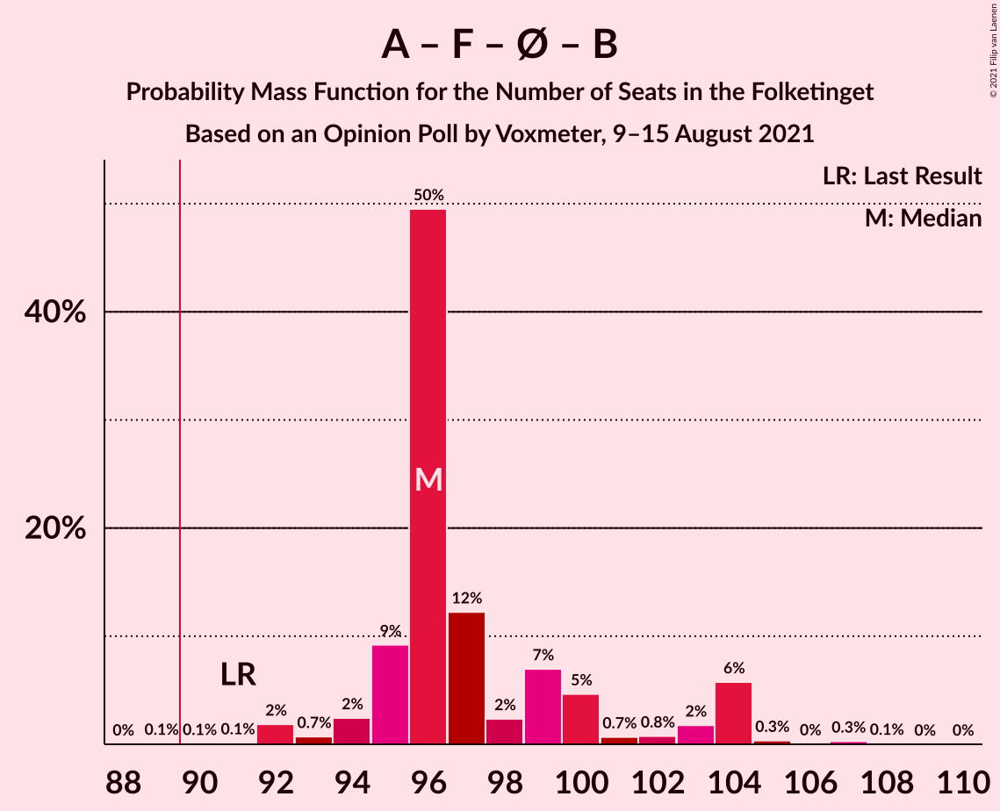
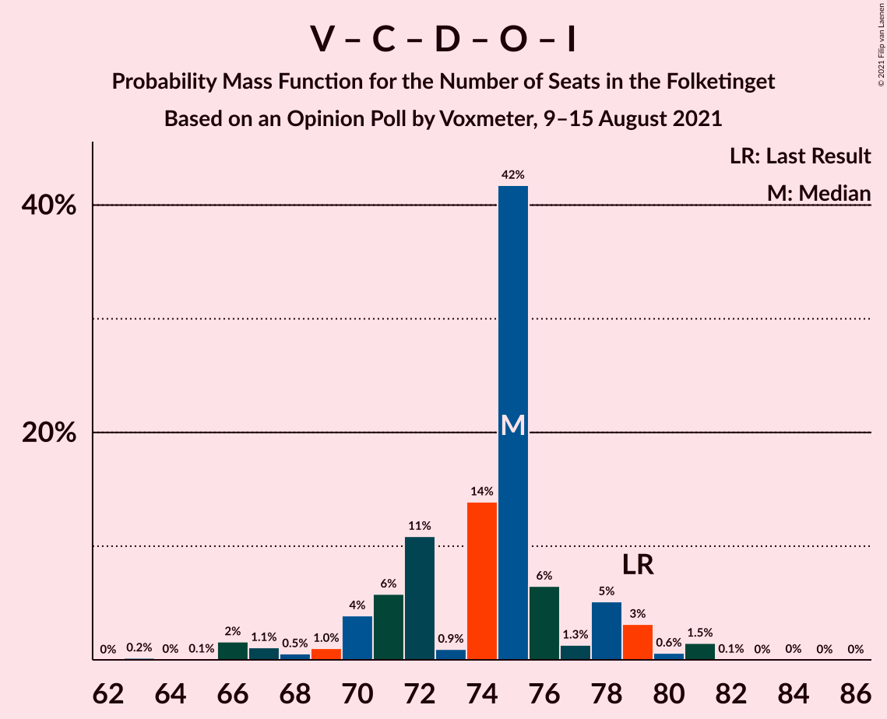
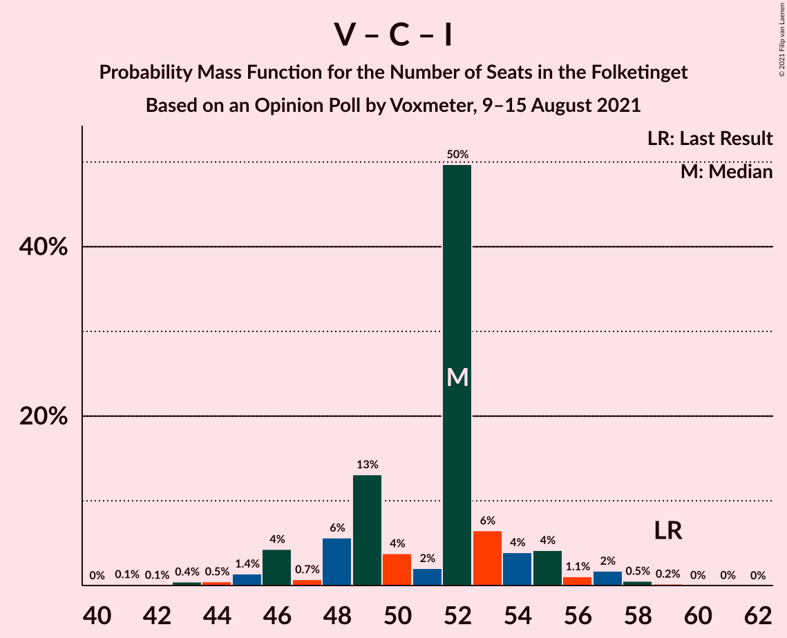

# Opinion Poll by Voxmeter, 9–15 August 2021

<a href="#voting-intentions">Voting Intentions</a> | <a href="#seats">Seats</a> | <a href="#coalitions">Coalitions</a> | <a href="#technical-information">Technical Information</a>

## Voting Intentions

### Confidence Intervals

| Party | Last Result | Poll Result | 80% Confidence Interval | 90% Confidence Interval | 95% Confidence Interval | 99% Confidence Interval |
|:-----:|:-----------:|:-----------:|:-----------------------:|:-----------------------:|:-----------------------:|:-----------------------:|
| Socialdemokraterne | 25.9% | 30.6% | 28.8–32.5% |28.3–33.0% |27.8–33.5% |27.0–34.4% |
| Venstre | 23.4% | 13.7% | 12.4–15.2% |12.0–15.6% |11.7–16.0% |11.1–16.7% |
| Det Konservative Folkeparti | 6.6% | 12.9% | 11.6–14.4% |11.3–14.8% |11.0–15.1% |10.4–15.9% |
| Socialistisk Folkeparti | 7.7% | 9.3% | 8.2–10.6% |7.9–11.0% |7.7–11.3% |7.2–11.9% |
| Enhedslisten–De Rød-Grønne | 6.9% | 9.1% | 8.1–10.4% |7.8–10.8% |7.5–11.1% |7.0–11.7% |
| Nye Borgerlige | 2.4% | 6.8% | 5.8–7.9% |5.6–8.2% |5.3–8.5% |5.0–9.1% |
| Radikale Venstre | 8.6% | 6.0% | 5.1–7.0% |4.9–7.3% |4.6–7.6% |4.3–8.1% |
| Dansk Folkeparti | 8.7% | 5.8% | 4.9–6.8% |4.7–7.1% |4.5–7.4% |4.1–7.9% |
| Liberal Alliance | 2.3% | 2.1% | 1.6–2.8% |1.5–3.0% |1.4–3.2% |1.2–3.6% |
| Kristendemokraterne | 1.7% | 2.1% | 1.6–2.8% |1.5–3.0% |1.4–3.2% |1.2–3.6% |
| Alternativet | 3.0% | 0.2% | 0.1–0.5% |0.1–0.6% |0.1–0.7% |0.0–0.9% |
| Veganerpartiet | 0.0% | 0.1% | 0.0–0.4% |0.0–0.5% |0.0–0.6% |0.0–0.7% |

*Note:* The poll result column reflects the actual value used in the calculations. Published results may vary slightly, and in addition be rounded to fewer digits.

## Seats

### Confidence Intervals

| Party | Last Result | Median | 80% Confidence Interval | 90% Confidence Interval | 95% Confidence Interval | 99% Confidence Interval |
|:-----:|:-----------:|:------:|:-----------------------:|:-----------------------:|:-----------------------:|:-----------------------:|
| <a href="#socialdemokraterne">Socialdemokraterne</a> | 48 | 53 | 51–59 |50–59 |50–59 |46–61 |
| <a href="#venstre">Venstre</a> | 43 | 28 | 22–28 |21–28 |21–29 |20–29 |
| <a href="#det-konservative-folkeparti">Det Konservative Folkeparti</a> | 12 | 21 | 21–26 |21–27 |21–27 |19–29 |
| <a href="#socialistisk-folkeparti">Socialistisk Folkeparti</a> | 14 | 18 | 15–18 |15–19 |13–20 |12–23 |
| <a href="#enhedslisten–de-rød-grønne">Enhedslisten–De Rød-Grønne</a> | 13 | 17 | 15–19 |14–20 |13–20 |13–22 |
| <a href="#nye-borgerlige">Nye Borgerlige</a> | 4 | 10 | 10–15 |10–16 |10–18 |9–18 |
| <a href="#radikale-venstre">Radikale Venstre</a> | 16 | 9 | 9–12 |9–13 |9–14 |8–14 |
| <a href="#dansk-folkeparti">Dansk Folkeparti</a> | 16 | 10 | 9–11 |7–12 |7–12 |7–15 |
| <a href="#liberal-alliance">Liberal Alliance</a> | 4 | 5 | 0–5 |0–5 |0–5 |0–6 |
| <a href="#kristendemokraterne">Kristendemokraterne</a> | 0 | 4 | 0–4 |0–5 |0–6 |0–6 |
| <a href="#alternativet">Alternativet</a> | 5 | 0 | 0 |0 |0 |0 |
| <a href="#veganerpartiet">Veganerpartiet</a> | 0 | 0 | 0 |0 |0 |0 |

### Socialdemokraterne

*For a full overview of the results for this party, see the [Socialdemokraterne](party-socialdemokraterne.html) page.*

| Number of Seats | Probability | Accumulated | Special Marks |
|:---------------:|:-----------:|:-----------:|:-------------:|
| 46 | 0.8% | 100% |  |
| 47 | 0% | 99.1% |  |
| 48 | 0.3% | 99.1% | Last Result |
| 49 | 1.3% | 98.8% |  |
| 50 | 3% | 98% |  |
| 51 | 6% | 95% |  |
| 52 | 6% | 89% |  |
| 53 | 48% | 83% | Median |
| 54 | 5% | 34% |  |
| 55 | 11% | 29% |  |
| 56 | 2% | 19% |  |
| 57 | 2% | 17% |  |
| 58 | 1.0% | 15% |  |
| 59 | 12% | 14% |  |
| 60 | 0% | 2% |  |
| 61 | 2% | 2% |  |
| 62 | 0% | 0.1% |  |
| 63 | 0.1% | 0.1% |  |
| 64 | 0% | 0% |  |

### Venstre

*For a full overview of the results for this party, see the [Venstre](party-venstre.html) page.*

| Number of Seats | Probability | Accumulated | Special Marks |
|:---------------:|:-----------:|:-----------:|:-------------:|
| 19 | 0.1% | 100% |  |
| 20 | 0.5% | 99.9% |  |
| 21 | 6% | 99.4% |  |
| 22 | 15% | 94% |  |
| 23 | 6% | 79% |  |
| 24 | 5% | 73% |  |
| 25 | 8% | 68% |  |
| 26 | 6% | 60% |  |
| 27 | 2% | 55% |  |
| 28 | 49% | 53% | Median |
| 29 | 4% | 4% |  |
| 30 | 0.1% | 0.2% |  |
| 31 | 0% | 0.1% |  |
| 32 | 0% | 0.1% |  |
| 33 | 0% | 0.1% |  |
| 34 | 0.1% | 0.1% |  |
| 35 | 0% | 0% |  |
| 36 | 0% | 0% |  |
| 37 | 0% | 0% |  |
| 38 | 0% | 0% |  |
| 39 | 0% | 0% |  |
| 40 | 0% | 0% |  |
| 41 | 0% | 0% |  |
| 42 | 0% | 0% |  |
| 43 | 0% | 0% | Last Result |

### Det Konservative Folkeparti

*For a full overview of the results for this party, see the [Det Konservative Folkeparti](party-detkonservativefolkeparti.html) page.*

| Number of Seats | Probability | Accumulated | Special Marks |
|:---------------:|:-----------:|:-----------:|:-------------:|
| 12 | 0% | 100% | Last Result |
| 13 | 0% | 100% |  |
| 14 | 0% | 100% |  |
| 15 | 0% | 100% |  |
| 16 | 0% | 100% |  |
| 17 | 0% | 100% |  |
| 18 | 0.3% | 100% |  |
| 19 | 0.3% | 99.7% |  |
| 20 | 0.6% | 99.5% |  |
| 21 | 53% | 98.9% | Median |
| 22 | 4% | 45% |  |
| 23 | 6% | 42% |  |
| 24 | 14% | 36% |  |
| 25 | 6% | 22% |  |
| 26 | 10% | 17% |  |
| 27 | 5% | 7% |  |
| 28 | 1.1% | 2% |  |
| 29 | 0.1% | 0.5% |  |
| 30 | 0.4% | 0.5% |  |
| 31 | 0% | 0% |  |

### Socialistisk Folkeparti

*For a full overview of the results for this party, see the [Socialistisk Folkeparti](party-socialistiskfolkeparti.html) page.*

| Number of Seats | Probability | Accumulated | Special Marks |
|:---------------:|:-----------:|:-----------:|:-------------:|
| 12 | 1.5% | 100% |  |
| 13 | 1.0% | 98.5% |  |
| 14 | 2% | 97% | Last Result |
| 15 | 17% | 96% |  |
| 16 | 14% | 79% |  |
| 17 | 7% | 64% |  |
| 18 | 50% | 57% | Median |
| 19 | 5% | 8% |  |
| 20 | 0.3% | 3% |  |
| 21 | 0.7% | 2% |  |
| 22 | 0.3% | 1.5% |  |
| 23 | 1.2% | 1.2% |  |
| 24 | 0% | 0% |  |

### Enhedslisten–De Rød-Grønne

*For a full overview of the results for this party, see the [Enhedslisten–De Rød-Grønne](party-enhedslisten–derød-grønne.html) page.*

| Number of Seats | Probability | Accumulated | Special Marks |
|:---------------:|:-----------:|:-----------:|:-------------:|
| 11 | 0.1% | 100% |  |
| 12 | 0.3% | 99.9% |  |
| 13 | 4% | 99.6% | Last Result |
| 14 | 5% | 95% |  |
| 15 | 4% | 90% |  |
| 16 | 8% | 86% |  |
| 17 | 50% | 78% | Median |
| 18 | 11% | 29% |  |
| 19 | 10% | 17% |  |
| 20 | 5% | 8% |  |
| 21 | 2% | 2% |  |
| 22 | 0.6% | 0.6% |  |
| 23 | 0% | 0% |  |

### Nye Borgerlige

*For a full overview of the results for this party, see the [Nye Borgerlige](party-nyeborgerlige.html) page.*

| Number of Seats | Probability | Accumulated | Special Marks |
|:---------------:|:-----------:|:-----------:|:-------------:|
| 4 | 0% | 100% | Last Result |
| 5 | 0% | 100% |  |
| 6 | 0% | 100% |  |
| 7 | 0% | 100% |  |
| 8 | 0% | 100% |  |
| 9 | 1.3% | 100% |  |
| 10 | 61% | 98.7% | Median |
| 11 | 6% | 38% |  |
| 12 | 7% | 32% |  |
| 13 | 7% | 25% |  |
| 14 | 5% | 19% |  |
| 15 | 5% | 14% |  |
| 16 | 4% | 8% |  |
| 17 | 0% | 5% |  |
| 18 | 5% | 5% |  |
| 19 | 0% | 0% |  |

### Radikale Venstre

*For a full overview of the results for this party, see the [Radikale Venstre](party-radikalevenstre.html) page.*

| Number of Seats | Probability | Accumulated | Special Marks |
|:---------------:|:-----------:|:-----------:|:-------------:|
| 7 | 0.2% | 100% |  |
| 8 | 0.4% | 99.8% |  |
| 9 | 55% | 99.5% | Median |
| 10 | 10% | 44% |  |
| 11 | 21% | 34% |  |
| 12 | 6% | 13% |  |
| 13 | 3% | 7% |  |
| 14 | 3% | 4% |  |
| 15 | 0.1% | 0.1% |  |
| 16 | 0% | 0% | Last Result |

### Dansk Folkeparti

*For a full overview of the results for this party, see the [Dansk Folkeparti](party-danskfolkeparti.html) page.*

| Number of Seats | Probability | Accumulated | Special Marks |
|:---------------:|:-----------:|:-----------:|:-------------:|
| 6 | 0.3% | 100% |  |
| 7 | 5% | 99.7% |  |
| 8 | 0.8% | 95% |  |
| 9 | 18% | 94% |  |
| 10 | 62% | 76% | Median |
| 11 | 5% | 14% |  |
| 12 | 7% | 9% |  |
| 13 | 0.4% | 2% |  |
| 14 | 0.8% | 2% |  |
| 15 | 1.1% | 1.2% |  |
| 16 | 0.1% | 0.1% | Last Result |
| 17 | 0% | 0% |  |

### Liberal Alliance

*For a full overview of the results for this party, see the [Liberal Alliance](party-liberalalliance.html) page.*

| Number of Seats | Probability | Accumulated | Special Marks |
|:---------------:|:-----------:|:-----------:|:-------------:|
| 0 | 28% | 100% |  |
| 1 | 0% | 72% |  |
| 2 | 0% | 72% |  |
| 3 | 5% | 72% |  |
| 4 | 15% | 67% | Last Result |
| 5 | 52% | 53% | Median |
| 6 | 0.8% | 1.0% |  |
| 7 | 0.2% | 0.2% |  |
| 8 | 0% | 0% |  |

### Kristendemokraterne

*For a full overview of the results for this party, see the [Kristendemokraterne](party-kristendemokraterne.html) page.*

| Number of Seats | Probability | Accumulated | Special Marks |
|:---------------:|:-----------:|:-----------:|:-------------:|
| 0 | 23% | 100% | Last Result |
| 1 | 0% | 77% |  |
| 2 | 0% | 77% |  |
| 3 | 0% | 77% |  |
| 4 | 71% | 77% | Median |
| 5 | 3% | 6% |  |
| 6 | 3% | 3% |  |
| 7 | 0.1% | 0.1% |  |
| 8 | 0% | 0% |  |

### Alternativet

*For a full overview of the results for this party, see the [Alternativet](party-alternativet.html) page.*

| Number of Seats | Probability | Accumulated | Special Marks |
|:---------------:|:-----------:|:-----------:|:-------------:|
| 0 | 100% | 100% | Median |
| 1 | 0% | 0% |  |
| 2 | 0% | 0% |  |
| 3 | 0% | 0% |  |
| 4 | 0% | 0% |  |
| 5 | 0% | 0% | Last Result |

### Veganerpartiet

*For a full overview of the results for this party, see the [Veganerpartiet](party-veganerpartiet.html) page.*

| Number of Seats | Probability | Accumulated | Special Marks |
|:---------------:|:-----------:|:-----------:|:-------------:|
| 0 | 100% | 100% | Last Result, Median |

## Coalitions

### Confidence Intervals

| Coalition | Last Result | Median | Majority? | 80% Confidence Interval | 90% Confidence Interval | 95% Confidence Interval | 99% Confidence Interval |
|:---------:|:-----------:|:------:|:---------:|:-----------------------:|:-----------------------:|:-----------------------:|:-----------------------:|
| Socialdemokraterne – Socialistisk Folkeparti – Enhedslisten–De Rød-Grønne – Radikale Venstre – Alternativet | 96 | 97 | 98.8% | 95–104 | 94–104 | 92–104 | 89–108 |
| Socialdemokraterne – Socialistisk Folkeparti – Enhedslisten–De Rød-Grønne – Radikale Venstre | 91 | 97 | 98.8% | 95–104 | 94–104 | 92–104 | 89–108 |
| Socialdemokraterne – Socialistisk Folkeparti – Enhedslisten–De Rød-Grønne – Alternativet | 80 | 88 | 18% | 84–93 | 84–93 | 81–93 | 79–95 |
| Socialdemokraterne – Socialistisk Folkeparti – Enhedslisten–De Rød-Grønne | 75 | 88 | 18% | 84–93 | 84–93 | 81–93 | 79–95 |
| Socialdemokraterne – Socialistisk Folkeparti – Radikale Venstre | 78 | 80 | 3% | 77–86 | 76–87 | 76–90 | 74–92 |
| Venstre – Det Konservative Folkeparti – Nye Borgerlige – Dansk Folkeparti – Kristendemokraterne – Liberal Alliance | 79 | 78 | 0% | 71–79 | 71–80 | 71–83 | 67–86 |
| Venstre – Det Konservative Folkeparti – Nye Borgerlige – Dansk Folkeparti – Liberal Alliance | 79 | 74 | 0% | 67–77 | 67–78 | 67–79 | 66–82 |
| Socialdemokraterne – Radikale Venstre | 64 | 62 | 0% | 62–70 | 60–70 | 60–73 | 56–75 |
| Venstre – Det Konservative Folkeparti – Dansk Folkeparti – Kristendemokraterne – Liberal Alliance | 75 | 68 | 0% | 59–68 | 57–69 | 57–70 | 55–73 |
| Venstre – Det Konservative Folkeparti – Dansk Folkeparti – Liberal Alliance | 75 | 64 | 0% | 57–64 | 54–66 | 53–66 | 53–69 |
| Venstre – Det Konservative Folkeparti – Liberal Alliance | 59 | 54 | 0% | 48–54 | 46–55 | 46–57 | 44–60 |
| Venstre – Det Konservative Folkeparti | 55 | 49 | 0% | 46–51 | 44–53 | 42–53 | 42–56 |
| Venstre | 43 | 28 | 0% | 22–28 | 21–28 | 21–29 | 20–29 |

### Socialdemokraterne – Socialistisk Folkeparti – Enhedslisten–De Rød-Grønne – Radikale Venstre – Alternativet

| Number of Seats | Probability | Accumulated | Special Marks |
|:---------------:|:-----------:|:-----------:|:-------------:|
| 88 | 0.1% | 100% |  |
| 89 | 1.1% | 99.9% |  |
| 90 | 0% | 98.8% | Majority |
| 91 | 0.1% | 98.8% |  |
| 92 | 3% | 98.7% |  |
| 93 | 0.3% | 96% |  |
| 94 | 5% | 96% |  |
| 95 | 3% | 91% |  |
| 96 | 5% | 88% | Last Result |
| 97 | 50% | 83% | Median |
| 98 | 2% | 33% |  |
| 99 | 5% | 31% |  |
| 100 | 9% | 27% |  |
| 101 | 0.1% | 18% |  |
| 102 | 1.3% | 18% |  |
| 103 | 5% | 16% |  |
| 104 | 10% | 12% |  |
| 105 | 1.0% | 2% |  |
| 106 | 0.1% | 0.8% |  |
| 107 | 0% | 0.7% |  |
| 108 | 0.6% | 0.7% |  |
| 109 | 0% | 0% |  |

### Socialdemokraterne – Socialistisk Folkeparti – Enhedslisten–De Rød-Grønne – Radikale Venstre

| Number of Seats | Probability | Accumulated | Special Marks |
|:---------------:|:-----------:|:-----------:|:-------------:|
| 88 | 0.1% | 100% |  |
| 89 | 1.1% | 99.9% |  |
| 90 | 0% | 98.8% | Majority |
| 91 | 0.1% | 98.8% | Last Result |
| 92 | 3% | 98.7% |  |
| 93 | 0.3% | 96% |  |
| 94 | 5% | 96% |  |
| 95 | 3% | 91% |  |
| 96 | 5% | 88% |  |
| 97 | 50% | 83% | Median |
| 98 | 2% | 33% |  |
| 99 | 5% | 31% |  |
| 100 | 9% | 27% |  |
| 101 | 0.1% | 18% |  |
| 102 | 1.3% | 18% |  |
| 103 | 5% | 16% |  |
| 104 | 10% | 12% |  |
| 105 | 1.0% | 2% |  |
| 106 | 0.1% | 0.8% |  |
| 107 | 0% | 0.7% |  |
| 108 | 0.6% | 0.7% |  |
| 109 | 0% | 0% |  |

### Socialdemokraterne – Socialistisk Folkeparti – Enhedslisten–De Rød-Grønne – Alternativet

| Number of Seats | Probability | Accumulated | Special Marks |
|:---------------:|:-----------:|:-----------:|:-------------:|
| 79 | 1.1% | 100% |  |
| 80 | 0.1% | 98.8% | Last Result |
| 81 | 3% | 98.7% |  |
| 82 | 0.3% | 96% |  |
| 83 | 0.4% | 96% |  |
| 84 | 6% | 95% |  |
| 85 | 3% | 89% |  |
| 86 | 2% | 87% |  |
| 87 | 5% | 85% |  |
| 88 | 54% | 80% | Median |
| 89 | 7% | 26% |  |
| 90 | 4% | 18% | Majority |
| 91 | 3% | 14% |  |
| 92 | 0.4% | 11% |  |
| 93 | 10% | 11% |  |
| 94 | 0.3% | 1.1% |  |
| 95 | 0.6% | 0.8% |  |
| 96 | 0.1% | 0.2% |  |
| 97 | 0% | 0% |  |

### Socialdemokraterne – Socialistisk Folkeparti – Enhedslisten–De Rød-Grønne

| Number of Seats | Probability | Accumulated | Special Marks |
|:---------------:|:-----------:|:-----------:|:-------------:|
| 75 | 0% | 100% | Last Result |
| 76 | 0% | 100% |  |
| 77 | 0% | 100% |  |
| 78 | 0% | 100% |  |
| 79 | 1.1% | 100% |  |
| 80 | 0.1% | 98.8% |  |
| 81 | 3% | 98.7% |  |
| 82 | 0.3% | 96% |  |
| 83 | 0.4% | 96% |  |
| 84 | 6% | 95% |  |
| 85 | 3% | 89% |  |
| 86 | 2% | 87% |  |
| 87 | 5% | 85% |  |
| 88 | 54% | 80% | Median |
| 89 | 7% | 26% |  |
| 90 | 4% | 18% | Majority |
| 91 | 3% | 14% |  |
| 92 | 0.4% | 11% |  |
| 93 | 10% | 11% |  |
| 94 | 0.3% | 1.1% |  |
| 95 | 0.6% | 0.8% |  |
| 96 | 0.1% | 0.2% |  |
| 97 | 0% | 0% |  |

### Socialdemokraterne – Socialistisk Folkeparti – Radikale Venstre

| Number of Seats | Probability | Accumulated | Special Marks |
|:---------------:|:-----------:|:-----------:|:-------------:|
| 74 | 0.8% | 100% |  |
| 75 | 0.6% | 99.2% |  |
| 76 | 4% | 98.6% |  |
| 77 | 7% | 95% |  |
| 78 | 5% | 88% | Last Result |
| 79 | 2% | 83% |  |
| 80 | 49% | 81% | Median |
| 81 | 4% | 33% |  |
| 82 | 6% | 29% |  |
| 83 | 0.5% | 23% |  |
| 84 | 0.6% | 23% |  |
| 85 | 11% | 22% |  |
| 86 | 6% | 11% |  |
| 87 | 2% | 5% |  |
| 88 | 0.1% | 4% |  |
| 89 | 0.1% | 3% |  |
| 90 | 3% | 3% | Majority |
| 91 | 0% | 0.6% |  |
| 92 | 0.6% | 0.6% |  |
| 93 | 0% | 0% |  |

### Venstre – Det Konservative Folkeparti – Nye Borgerlige – Dansk Folkeparti – Kristendemokraterne – Liberal Alliance

| Number of Seats | Probability | Accumulated | Special Marks |
|:---------------:|:-----------:|:-----------:|:-------------:|
| 66 | 0.1% | 100% |  |
| 67 | 0.6% | 99.9% |  |
| 68 | 0.1% | 99.2% |  |
| 69 | 0.1% | 99.2% |  |
| 70 | 1.0% | 99.1% |  |
| 71 | 14% | 98% |  |
| 72 | 5% | 84% |  |
| 73 | 1.3% | 79% |  |
| 74 | 0.1% | 78% |  |
| 75 | 6% | 78% |  |
| 76 | 5% | 72% |  |
| 77 | 6% | 67% |  |
| 78 | 50% | 60% | Median |
| 79 | 3% | 10% | Last Result |
| 80 | 3% | 7% |  |
| 81 | 0.1% | 4% |  |
| 82 | 0.2% | 4% |  |
| 83 | 3% | 4% |  |
| 84 | 0.1% | 1.3% |  |
| 85 | 0% | 1.2% |  |
| 86 | 1.1% | 1.2% |  |
| 87 | 0.1% | 0.1% |  |
| 88 | 0% | 0% |  |

### Venstre – Det Konservative Folkeparti – Nye Borgerlige – Dansk Folkeparti – Liberal Alliance

| Number of Seats | Probability | Accumulated | Special Marks |
|:---------------:|:-----------:|:-----------:|:-------------:|
| 65 | 0% | 100% |  |
| 66 | 1.1% | 99.9% |  |
| 67 | 16% | 98.8% |  |
| 68 | 3% | 83% |  |
| 69 | 0.2% | 80% |  |
| 70 | 0.2% | 80% |  |
| 71 | 1.0% | 80% |  |
| 72 | 0.8% | 79% |  |
| 73 | 1.4% | 78% |  |
| 74 | 49% | 76% | Median |
| 75 | 6% | 27% |  |
| 76 | 7% | 21% |  |
| 77 | 9% | 14% |  |
| 78 | 0.5% | 5% |  |
| 79 | 3% | 5% | Last Result |
| 80 | 0.2% | 2% |  |
| 81 | 0.1% | 1.3% |  |
| 82 | 1.1% | 1.2% |  |
| 83 | 0.1% | 0.1% |  |
| 84 | 0% | 0.1% |  |
| 85 | 0% | 0.1% |  |
| 86 | 0.1% | 0.1% |  |
| 87 | 0% | 0% |  |

### Socialdemokraterne – Radikale Venstre

| Number of Seats | Probability | Accumulated | Special Marks |
|:---------------:|:-----------:|:-----------:|:-------------:|
| 56 | 0.7% | 100% |  |
| 57 | 0.4% | 99.3% |  |
| 58 | 0% | 98.9% |  |
| 59 | 0.1% | 98.9% |  |
| 60 | 4% | 98.8% |  |
| 61 | 4% | 95% |  |
| 62 | 55% | 91% | Median |
| 63 | 1.3% | 36% |  |
| 64 | 5% | 35% | Last Result |
| 65 | 5% | 29% |  |
| 66 | 2% | 24% |  |
| 67 | 6% | 23% |  |
| 68 | 0.7% | 17% |  |
| 69 | 1.4% | 16% |  |
| 70 | 10% | 15% |  |
| 71 | 0.6% | 5% |  |
| 72 | 0.9% | 4% |  |
| 73 | 0.9% | 3% |  |
| 74 | 0% | 2% |  |
| 75 | 2% | 2% |  |
| 76 | 0% | 0% |  |

### Venstre – Det Konservative Folkeparti – Dansk Folkeparti – Kristendemokraterne – Liberal Alliance

| Number of Seats | Probability | Accumulated | Special Marks |
|:---------------:|:-----------:|:-----------:|:-------------:|
| 53 | 0.1% | 100% |  |
| 54 | 0% | 99.9% |  |
| 55 | 0.6% | 99.8% |  |
| 56 | 0.3% | 99.2% |  |
| 57 | 4% | 98.9% |  |
| 58 | 0% | 95% |  |
| 59 | 6% | 95% |  |
| 60 | 7% | 88% |  |
| 61 | 11% | 81% |  |
| 62 | 2% | 70% |  |
| 63 | 5% | 69% |  |
| 64 | 2% | 64% |  |
| 65 | 1.3% | 61% |  |
| 66 | 5% | 60% |  |
| 67 | 2% | 55% |  |
| 68 | 48% | 53% | Median |
| 69 | 1.1% | 5% |  |
| 70 | 3% | 4% |  |
| 71 | 0.2% | 1.4% |  |
| 72 | 0.1% | 1.2% |  |
| 73 | 0.7% | 1.1% |  |
| 74 | 0% | 0.4% |  |
| 75 | 0.4% | 0.4% | Last Result |
| 76 | 0% | 0% |  |

### Venstre – Det Konservative Folkeparti – Dansk Folkeparti – Liberal Alliance

| Number of Seats | Probability | Accumulated | Special Marks |
|:---------------:|:-----------:|:-----------:|:-------------:|
| 51 | 0.3% | 100% |  |
| 52 | 0% | 99.7% |  |
| 53 | 4% | 99.7% |  |
| 54 | 0.9% | 95% |  |
| 55 | 2% | 95% |  |
| 56 | 3% | 93% |  |
| 57 | 10% | 90% |  |
| 58 | 1.3% | 81% |  |
| 59 | 6% | 79% |  |
| 60 | 5% | 74% |  |
| 61 | 1.0% | 69% |  |
| 62 | 3% | 68% |  |
| 63 | 5% | 65% |  |
| 64 | 52% | 60% | Median |
| 65 | 2% | 8% |  |
| 66 | 4% | 5% |  |
| 67 | 0.4% | 2% |  |
| 68 | 0.3% | 1.5% |  |
| 69 | 0.7% | 1.1% |  |
| 70 | 0% | 0.5% |  |
| 71 | 0.4% | 0.5% |  |
| 72 | 0.1% | 0.1% |  |
| 73 | 0% | 0% |  |
| 74 | 0% | 0% |  |
| 75 | 0% | 0% | Last Result |

### Venstre – Det Konservative Folkeparti – Liberal Alliance

| Number of Seats | Probability | Accumulated | Special Marks |
|:---------------:|:-----------:|:-----------:|:-------------:|
| 41 | 0.1% | 100% |  |
| 42 | 0.2% | 99.9% |  |
| 43 | 0% | 99.7% |  |
| 44 | 1.0% | 99.7% |  |
| 45 | 1.0% | 98.7% |  |
| 46 | 4% | 98% |  |
| 47 | 3% | 93% |  |
| 48 | 12% | 91% |  |
| 49 | 6% | 78% |  |
| 50 | 5% | 72% |  |
| 51 | 2% | 67% |  |
| 52 | 7% | 65% |  |
| 53 | 0.8% | 58% |  |
| 54 | 51% | 57% | Median |
| 55 | 0.7% | 5% |  |
| 56 | 0.1% | 5% |  |
| 57 | 4% | 5% |  |
| 58 | 0.1% | 0.9% |  |
| 59 | 0.1% | 0.8% | Last Result |
| 60 | 0.7% | 0.7% |  |
| 61 | 0.1% | 0.1% |  |
| 62 | 0% | 0% |  |

### Venstre – Det Konservative Folkeparti

| Number of Seats | Probability | Accumulated | Special Marks |
|:---------------:|:-----------:|:-----------:|:-------------:|
| 40 | 0.1% | 100% |  |
| 41 | 0.2% | 99.9% |  |
| 42 | 5% | 99.7% |  |
| 43 | 0.1% | 95% |  |
| 44 | 2% | 95% |  |
| 45 | 1.4% | 94% |  |
| 46 | 6% | 92% |  |
| 47 | 4% | 86% |  |
| 48 | 15% | 83% |  |
| 49 | 52% | 67% | Median |
| 50 | 4% | 15% |  |
| 51 | 2% | 11% |  |
| 52 | 4% | 9% |  |
| 53 | 3% | 5% |  |
| 54 | 0.6% | 2% |  |
| 55 | 0.3% | 1.1% | Last Result |
| 56 | 0.7% | 0.8% |  |
| 57 | 0.1% | 0.1% |  |
| 58 | 0% | 0% |  |

### Venstre

| Number of Seats | Probability | Accumulated | Special Marks |
|:---------------:|:-----------:|:-----------:|:-------------:|
| 19 | 0.1% | 100% |  |
| 20 | 0.5% | 99.9% |  |
| 21 | 6% | 99.4% |  |
| 22 | 15% | 94% |  |
| 23 | 6% | 79% |  |
| 24 | 5% | 73% |  |
| 25 | 8% | 68% |  |
| 26 | 6% | 60% |  |
| 27 | 2% | 55% |  |
| 28 | 49% | 53% | Median |
| 29 | 4% | 4% |  |
| 30 | 0.1% | 0.2% |  |
| 31 | 0% | 0.1% |  |
| 32 | 0% | 0.1% |  |
| 33 | 0% | 0.1% |  |
| 34 | 0.1% | 0.1% |  |
| 35 | 0% | 0% |  |
| 36 | 0% | 0% |  |
| 37 | 0% | 0% |  |
| 38 | 0% | 0% |  |
| 39 | 0% | 0% |  |
| 40 | 0% | 0% |  |
| 41 | 0% | 0% |  |
| 42 | 0% | 0% |  |
| 43 | 0% | 0% | Last Result |

## Technical Information

### Opinion Poll

+ **Polling firm:** Voxmeter
+ **Commissioner(s):** —
+ **Fieldwork period:** 9–15 August 2021

### Calculations

+ **Sample size:** 1007
+ **Simulations done:** 131,072
+ **Error estimate:** 4.66%

