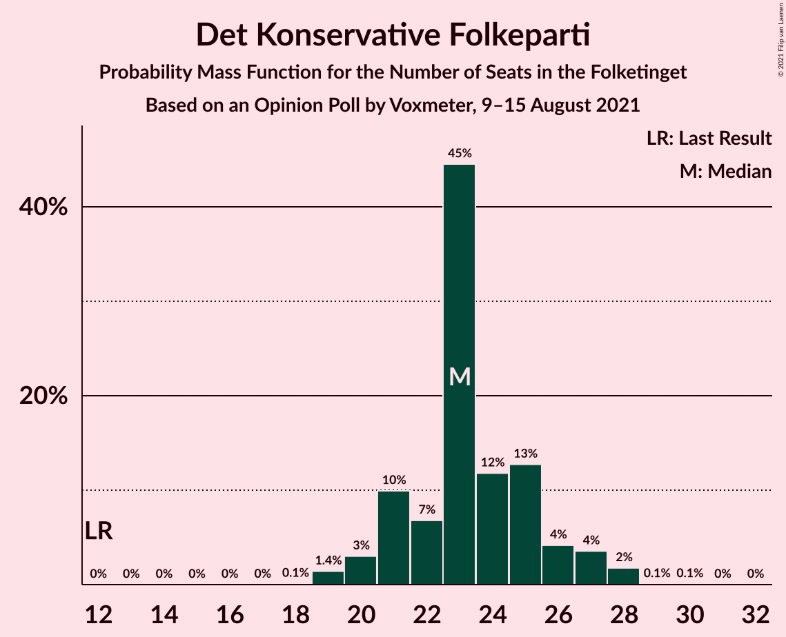
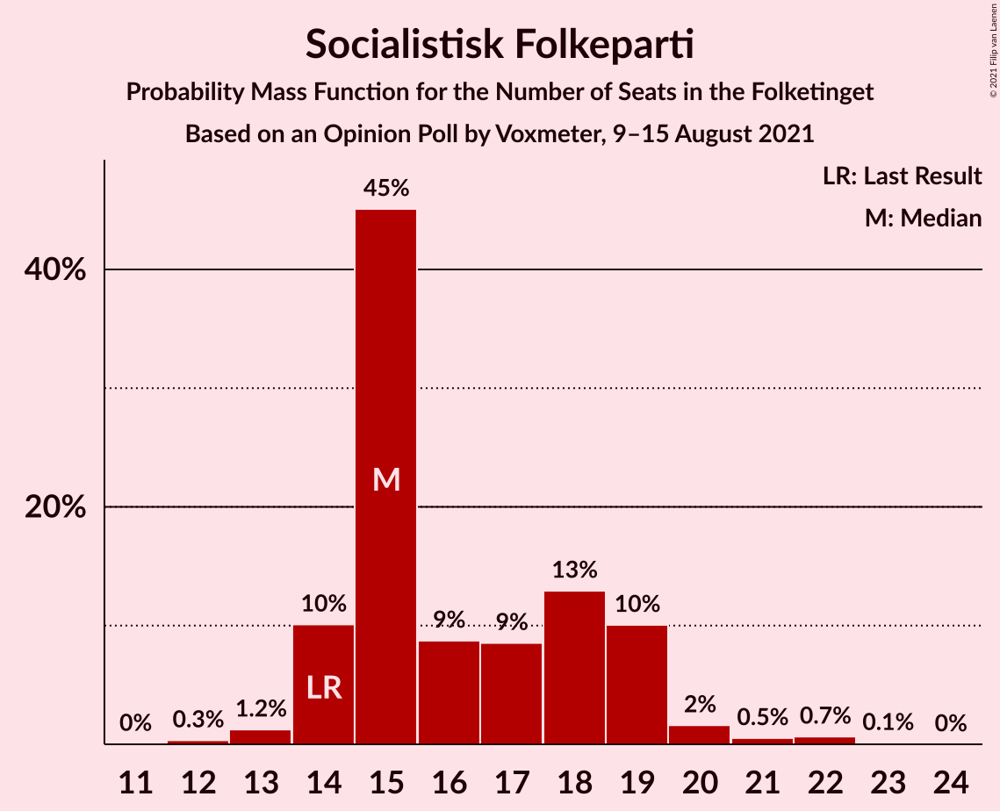
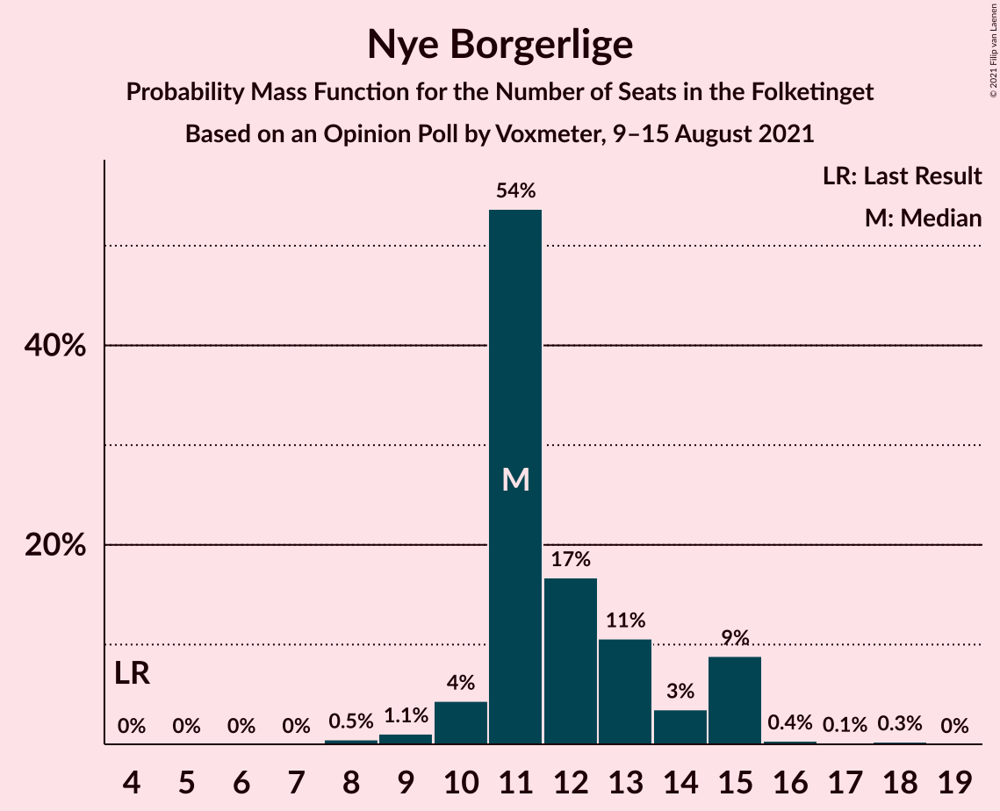
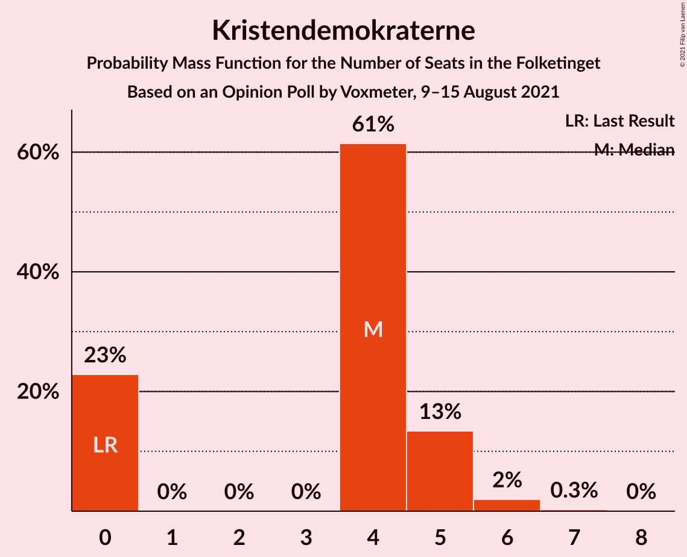
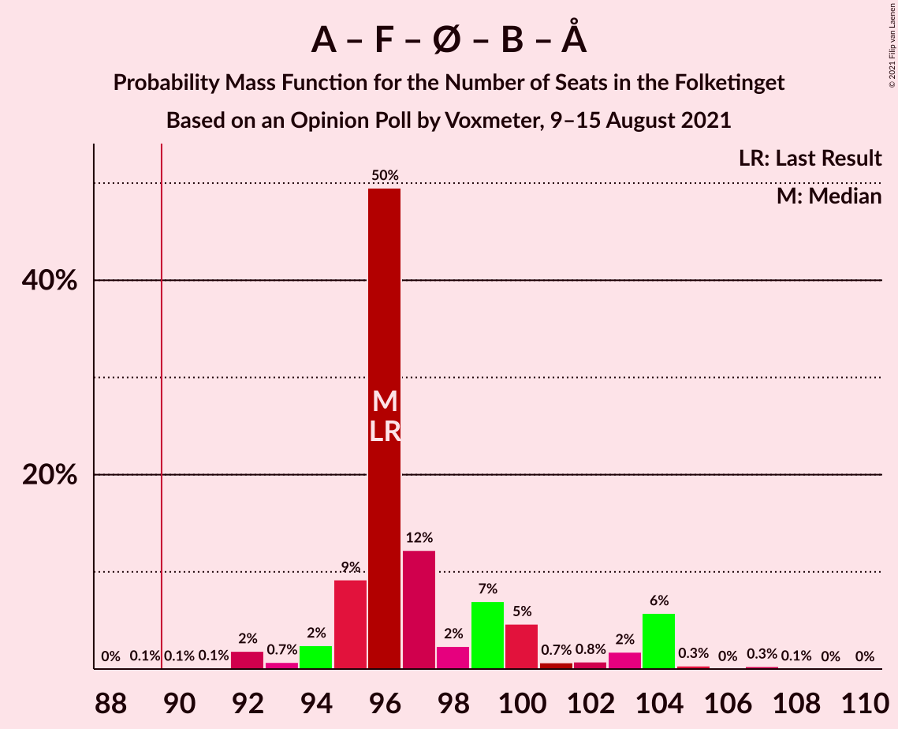
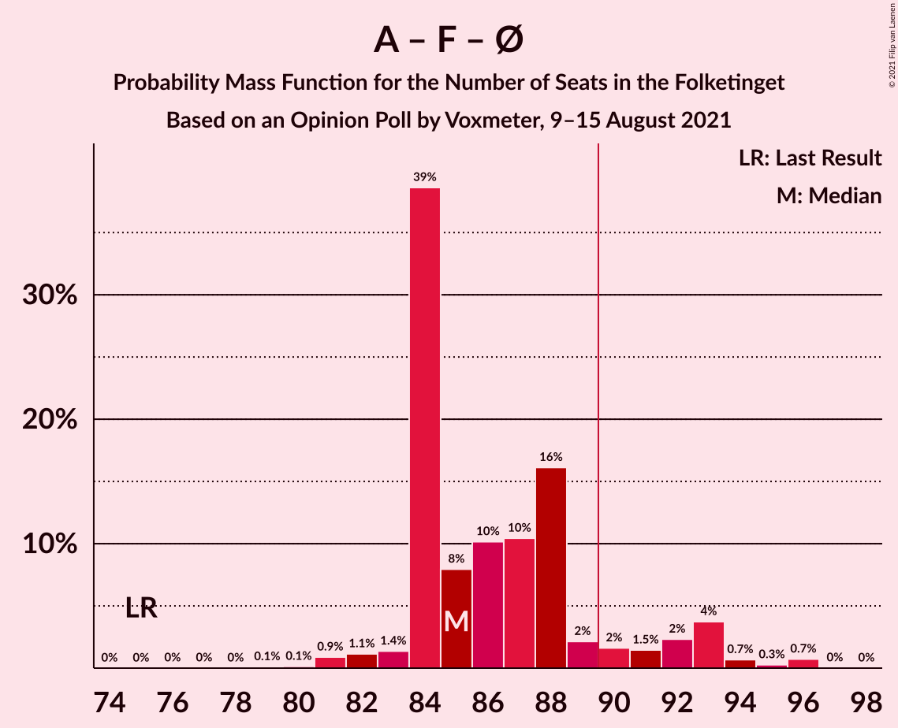
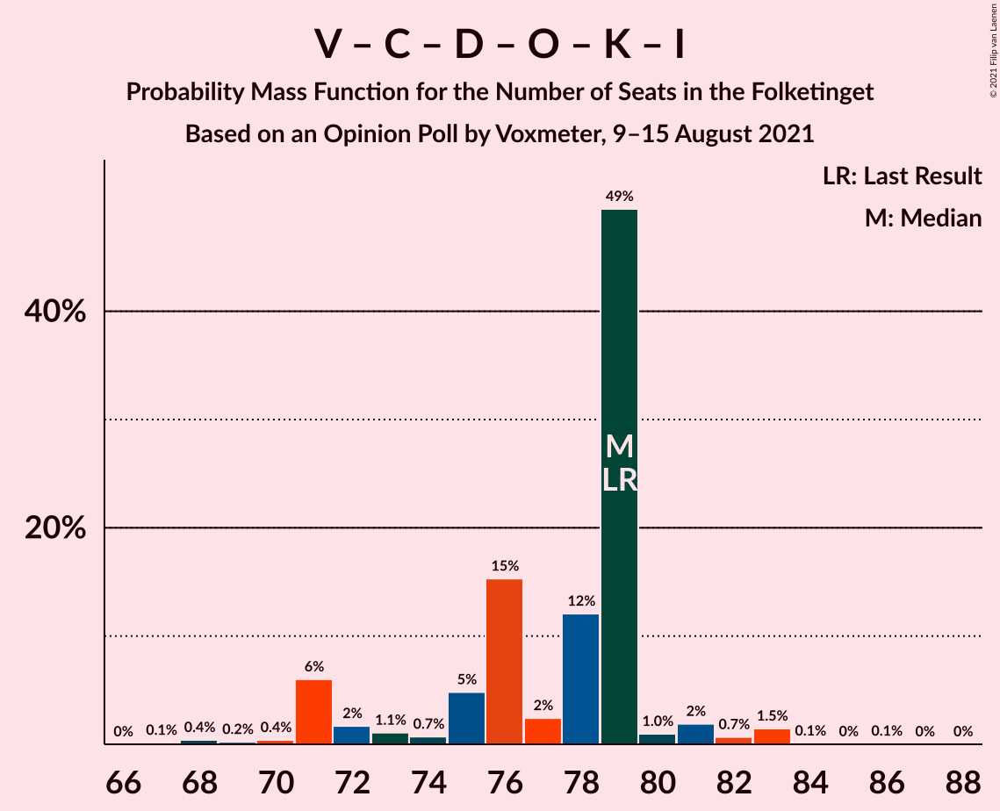

# Opinion Poll by Voxmeter, 9–15 August 2021

<a href="#voting-intentions">Voting Intentions</a> | <a href="#seats">Seats</a> | <a href="#coalitions">Coalitions</a> | <a href="#technical-information">Technical Information</a>

## Voting Intentions

### Confidence Intervals

| Party | Last Result | Poll Result | 80% Confidence Interval | 90% Confidence Interval | 95% Confidence Interval | 99% Confidence Interval |
|:-----:|:-----------:|:-----------:|:-----------------------:|:-----------------------:|:-----------------------:|:-----------------------:|
| Socialdemokraterne | 25.9% | 30.6% | 28.8–32.5% |28.3–33.0% |27.8–33.5% |27.0–34.4% |
| Venstre | 23.4% | 13.7% | 12.4–15.2% |12.0–15.6% |11.7–16.0% |11.1–16.7% |
| Det Konservative Folkeparti | 6.6% | 12.9% | 11.6–14.4% |11.3–14.8% |11.0–15.1% |10.4–15.9% |
| Socialistisk Folkeparti | 7.7% | 9.3% | 8.2–10.6% |7.9–11.0% |7.7–11.3% |7.2–11.9% |
| Enhedslisten–De Rød-Grønne | 6.9% | 9.1% | 8.1–10.4% |7.8–10.8% |7.5–11.1% |7.0–11.7% |
| Nye Borgerlige | 2.4% | 6.8% | 5.8–7.9% |5.6–8.2% |5.3–8.5% |5.0–9.1% |
| Radikale Venstre | 8.6% | 6.0% | 5.1–7.0% |4.9–7.3% |4.6–7.6% |4.3–8.1% |
| Dansk Folkeparti | 8.7% | 5.8% | 4.9–6.8% |4.7–7.1% |4.5–7.4% |4.1–7.9% |
| Liberal Alliance | 2.3% | 2.1% | 1.6–2.8% |1.5–3.0% |1.4–3.2% |1.2–3.6% |
| Kristendemokraterne | 1.7% | 2.1% | 1.6–2.8% |1.5–3.0% |1.4–3.2% |1.2–3.6% |
| Alternativet | 3.0% | 0.2% | 0.1–0.5% |0.1–0.6% |0.1–0.7% |0.0–0.9% |
| Veganerpartiet | 0.0% | 0.1% | 0.0–0.4% |0.0–0.5% |0.0–0.6% |0.0–0.7% |

*Note:* The poll result column reflects the actual value used in the calculations. Published results may vary slightly, and in addition be rounded to fewer digits.

## Seats

### Confidence Intervals

| Party | Last Result | Median | 80% Confidence Interval | 90% Confidence Interval | 95% Confidence Interval | 99% Confidence Interval |
|:-----:|:-----------:|:------:|:-----------------------:|:-----------------------:|:-----------------------:|:-----------------------:|
| <a href="#socialdemokraterne">Socialdemokraterne</a> | 48 | 54 | 51–57 |50–58 |50–59 |48–61 |
| <a href="#venstre">Venstre</a> | 43 | 27 | 22–29 |21–29 |21–30 |20–30 |
| <a href="#det-konservative-folkeparti">Det Konservative Folkeparti</a> | 12 | 23 | 21–25 |21–27 |20–27 |19–28 |
| <a href="#socialistisk-folkeparti">Socialistisk Folkeparti</a> | 14 | 15 | 14–19 |14–19 |14–20 |13–22 |
| <a href="#enhedslisten–de-rød-grønne">Enhedslisten–De Rød-Grønne</a> | 13 | 15 | 14–18 |14–19 |13–20 |13–22 |
| <a href="#nye-borgerlige">Nye Borgerlige</a> | 4 | 11 | 11–14 |10–15 |10–15 |9–16 |
| <a href="#radikale-venstre">Radikale Venstre</a> | 16 | 11 | 9–12 |9–12 |8–13 |8–15 |
| <a href="#dansk-folkeparti">Dansk Folkeparti</a> | 16 | 12 | 9–12 |9–13 |9–13 |8–14 |
| <a href="#liberal-alliance">Liberal Alliance</a> | 4 | 0 | 0–5 |0–6 |0–6 |0–6 |
| <a href="#kristendemokraterne">Kristendemokraterne</a> | 0 | 4 | 0–5 |0–5 |0–5 |0–6 |
| <a href="#alternativet">Alternativet</a> | 5 | 0 | 0 |0 |0 |0 |
| <a href="#veganerpartiet">Veganerpartiet</a> | 0 | 0 | 0 |0 |0 |0 |

### Socialdemokraterne

*For a full overview of the results for this party, see the [Socialdemokraterne](party-socialdemokraterne.html) page.*

| Number of Seats | Probability | Accumulated | Special Marks |
|:---------------:|:-----------:|:-----------:|:-------------:|
| 46 | 0.2% | 100% |  |
| 47 | 0.1% | 99.8% |  |
| 48 | 0.6% | 99.7% | Last Result |
| 49 | 0.9% | 99.1% |  |
| 50 | 5% | 98% |  |
| 51 | 5% | 93% |  |
| 52 | 4% | 89% |  |
| 53 | 9% | 85% |  |
| 54 | 51% | 76% | Median |
| 55 | 2% | 25% |  |
| 56 | 11% | 22% |  |
| 57 | 5% | 12% |  |
| 58 | 4% | 7% |  |
| 59 | 1.3% | 3% |  |
| 60 | 0.3% | 1.2% |  |
| 61 | 0.6% | 1.0% |  |
| 62 | 0.2% | 0.3% |  |
| 63 | 0% | 0.1% |  |
| 64 | 0% | 0.1% |  |
| 65 | 0% | 0% |  |

### Venstre

*For a full overview of the results for this party, see the [Venstre](party-venstre.html) page.*

| Number of Seats | Probability | Accumulated | Special Marks |
|:---------------:|:-----------:|:-----------:|:-------------:|
| 19 | 0.3% | 100% |  |
| 20 | 2% | 99.7% |  |
| 21 | 7% | 98% |  |
| 22 | 3% | 91% |  |
| 23 | 11% | 87% |  |
| 24 | 18% | 77% |  |
| 25 | 4% | 59% |  |
| 26 | 4% | 54% |  |
| 27 | 5% | 50% | Median |
| 28 | 3% | 45% |  |
| 29 | 38% | 42% |  |
| 30 | 4% | 4% |  |
| 31 | 0% | 0.2% |  |
| 32 | 0.1% | 0.2% |  |
| 33 | 0.1% | 0.1% |  |
| 34 | 0% | 0% |  |
| 35 | 0% | 0% |  |
| 36 | 0% | 0% |  |
| 37 | 0% | 0% |  |
| 38 | 0% | 0% |  |
| 39 | 0% | 0% |  |
| 40 | 0% | 0% |  |
| 41 | 0% | 0% |  |
| 42 | 0% | 0% |  |
| 43 | 0% | 0% | Last Result |

### Det Konservative Folkeparti

*For a full overview of the results for this party, see the [Det Konservative Folkeparti](party-detkonservativefolkeparti.html) page.*

| Number of Seats | Probability | Accumulated | Special Marks |
|:---------------:|:-----------:|:-----------:|:-------------:|
| 12 | 0% | 100% | Last Result |
| 13 | 0% | 100% |  |
| 14 | 0% | 100% |  |
| 15 | 0% | 100% |  |
| 16 | 0% | 100% |  |
| 17 | 0% | 100% |  |
| 18 | 0.1% | 100% |  |
| 19 | 1.4% | 99.9% |  |
| 20 | 3% | 98% |  |
| 21 | 10% | 95% |  |
| 22 | 7% | 86% |  |
| 23 | 45% | 79% | Median |
| 24 | 12% | 34% |  |
| 25 | 13% | 22% |  |
| 26 | 4% | 10% |  |
| 27 | 4% | 5% |  |
| 28 | 2% | 2% |  |
| 29 | 0.1% | 0.2% |  |
| 30 | 0.1% | 0.1% |  |
| 31 | 0% | 0% |  |

### Socialistisk Folkeparti

*For a full overview of the results for this party, see the [Socialistisk Folkeparti](party-socialistiskfolkeparti.html) page.*

| Number of Seats | Probability | Accumulated | Special Marks |
|:---------------:|:-----------:|:-----------:|:-------------:|
| 12 | 0.3% | 100% |  |
| 13 | 1.2% | 99.6% |  |
| 14 | 10% | 98% | Last Result |
| 15 | 45% | 88% | Median |
| 16 | 9% | 43% |  |
| 17 | 9% | 34% |  |
| 18 | 13% | 26% |  |
| 19 | 10% | 13% |  |
| 20 | 2% | 3% |  |
| 21 | 0.5% | 1.3% |  |
| 22 | 0.7% | 0.8% |  |
| 23 | 0.1% | 0.1% |  |
| 24 | 0% | 0% |  |

### Enhedslisten–De Rød-Grønne

*For a full overview of the results for this party, see the [Enhedslisten–De Rød-Grønne](party-enhedslisten–derød-grønne.html) page.*

| Number of Seats | Probability | Accumulated | Special Marks |
|:---------------:|:-----------:|:-----------:|:-------------:|
| 12 | 0.3% | 100% |  |
| 13 | 5% | 99.7% | Last Result |
| 14 | 7% | 95% |  |
| 15 | 46% | 88% | Median |
| 16 | 8% | 43% |  |
| 17 | 10% | 35% |  |
| 18 | 16% | 25% |  |
| 19 | 4% | 9% |  |
| 20 | 4% | 5% |  |
| 21 | 0.2% | 1.0% |  |
| 22 | 0.7% | 0.8% |  |
| 23 | 0% | 0% |  |

### Nye Borgerlige

*For a full overview of the results for this party, see the [Nye Borgerlige](party-nyeborgerlige.html) page.*

| Number of Seats | Probability | Accumulated | Special Marks |
|:---------------:|:-----------:|:-----------:|:-------------:|
| 4 | 0% | 100% | Last Result |
| 5 | 0% | 100% |  |
| 6 | 0% | 100% |  |
| 7 | 0% | 100% |  |
| 8 | 0.5% | 100% |  |
| 9 | 1.1% | 99.5% |  |
| 10 | 4% | 98% |  |
| 11 | 54% | 94% | Median |
| 12 | 17% | 40% |  |
| 13 | 11% | 24% |  |
| 14 | 3% | 13% |  |
| 15 | 9% | 10% |  |
| 16 | 0.4% | 0.7% |  |
| 17 | 0.1% | 0.4% |  |
| 18 | 0.3% | 0.3% |  |
| 19 | 0% | 0% |  |

### Radikale Venstre

*For a full overview of the results for this party, see the [Radikale Venstre](party-radikalevenstre.html) page.*

| Number of Seats | Probability | Accumulated | Special Marks |
|:---------------:|:-----------:|:-----------:|:-------------:|
| 7 | 0.1% | 100% |  |
| 8 | 5% | 99.9% |  |
| 9 | 22% | 95% |  |
| 10 | 8% | 73% |  |
| 11 | 17% | 65% | Median |
| 12 | 43% | 47% |  |
| 13 | 3% | 4% |  |
| 14 | 0.9% | 2% |  |
| 15 | 0.5% | 0.6% |  |
| 16 | 0.1% | 0.1% | Last Result |
| 17 | 0% | 0% |  |

### Dansk Folkeparti

*For a full overview of the results for this party, see the [Dansk Folkeparti](party-danskfolkeparti.html) page.*

| Number of Seats | Probability | Accumulated | Special Marks |
|:---------------:|:-----------:|:-----------:|:-------------:|
| 7 | 0.4% | 100% |  |
| 8 | 2% | 99.6% |  |
| 9 | 11% | 98% |  |
| 10 | 18% | 87% |  |
| 11 | 13% | 69% |  |
| 12 | 47% | 55% | Median |
| 13 | 7% | 8% |  |
| 14 | 1.2% | 1.3% |  |
| 15 | 0.1% | 0.1% |  |
| 16 | 0% | 0% | Last Result |

### Liberal Alliance

*For a full overview of the results for this party, see the [Liberal Alliance](party-liberalalliance.html) page.*

| Number of Seats | Probability | Accumulated | Special Marks |
|:---------------:|:-----------:|:-----------:|:-------------:|
| 0 | 60% | 100% | Median |
| 1 | 0% | 40% |  |
| 2 | 0% | 40% |  |
| 3 | 0.2% | 40% |  |
| 4 | 22% | 39% | Last Result |
| 5 | 10% | 18% |  |
| 6 | 8% | 8% |  |
| 7 | 0% | 0.1% |  |
| 8 | 0% | 0% |  |

### Kristendemokraterne

*For a full overview of the results for this party, see the [Kristendemokraterne](party-kristendemokraterne.html) page.*

| Number of Seats | Probability | Accumulated | Special Marks |
|:---------------:|:-----------:|:-----------:|:-------------:|
| 0 | 23% | 100% | Last Result |
| 1 | 0% | 77% |  |
| 2 | 0% | 77% |  |
| 3 | 0% | 77% |  |
| 4 | 61% | 77% | Median |
| 5 | 13% | 16% |  |
| 6 | 2% | 2% |  |
| 7 | 0.3% | 0.3% |  |
| 8 | 0% | 0% |  |

### Alternativet

*For a full overview of the results for this party, see the [Alternativet](party-alternativet.html) page.*

| Number of Seats | Probability | Accumulated | Special Marks |
|:---------------:|:-----------:|:-----------:|:-------------:|
| 0 | 100% | 100% | Median |
| 1 | 0% | 0% |  |
| 2 | 0% | 0% |  |
| 3 | 0% | 0% |  |
| 4 | 0% | 0% |  |
| 5 | 0% | 0% | Last Result |

### Veganerpartiet

*For a full overview of the results for this party, see the [Veganerpartiet](party-veganerpartiet.html) page.*

| Number of Seats | Probability | Accumulated | Special Marks |
|:---------------:|:-----------:|:-----------:|:-------------:|
| 0 | 100% | 100% | Last Result, Median |

## Coalitions

### Confidence Intervals

| Coalition | Last Result | Median | Majority? | 80% Confidence Interval | 90% Confidence Interval | 95% Confidence Interval | 99% Confidence Interval |
|:---------:|:-----------:|:------:|:---------:|:-----------------------:|:-----------------------:|:-----------------------:|:-----------------------:|
| Socialdemokraterne – Socialistisk Folkeparti – Enhedslisten–De Rød-Grønne – Radikale Venstre – Alternativet | 96 | 96 | 99.9% | 95–100 | 94–104 | 93–104 | 92–105 |
| Socialdemokraterne – Socialistisk Folkeparti – Enhedslisten–De Rød-Grønne – Radikale Venstre | 91 | 96 | 99.9% | 95–100 | 94–104 | 93–104 | 92–105 |
| Socialdemokraterne – Socialistisk Folkeparti – Enhedslisten–De Rød-Grønne – Alternativet | 80 | 85 | 11% | 84–90 | 84–93 | 83–93 | 81–96 |
| Socialdemokraterne – Socialistisk Folkeparti – Enhedslisten–De Rød-Grønne | 75 | 85 | 11% | 84–90 | 84–93 | 83–93 | 81–96 |
| Socialdemokraterne – Socialistisk Folkeparti – Radikale Venstre | 78 | 81 | 0.6% | 77–85 | 77–85 | 77–86 | 74–90 |
| Venstre – Det Konservative Folkeparti – Nye Borgerlige – Dansk Folkeparti – Kristendemokraterne – Liberal Alliance | 79 | 79 | 0% | 74–79 | 71–80 | 71–81 | 68–83 |
| Venstre – Det Konservative Folkeparti – Nye Borgerlige – Dansk Folkeparti – Liberal Alliance | 79 | 75 | 0% | 71–78 | 70–79 | 67–79 | 66–81 |
| Venstre – Det Konservative Folkeparti – Dansk Folkeparti – Kristendemokraterne – Liberal Alliance | 75 | 67 | 0% | 60–68 | 59–68 | 59–69 | 56–72 |
| Socialdemokraterne – Radikale Venstre | 64 | 66 | 0% | 61–69 | 60–69 | 59–69 | 59–73 |
| Venstre – Det Konservative Folkeparti – Dansk Folkeparti – Liberal Alliance | 75 | 64 | 0% | 59–65 | 55–66 | 55–68 | 53–68 |
| Venstre – Det Konservative Folkeparti – Liberal Alliance | 59 | 52 | 0% | 48–54 | 46–55 | 45–57 | 43–58 |
| Venstre – Det Konservative Folkeparti | 55 | 50 | 0% | 45–52 | 43–52 | 42–52 | 42–54 |
| Venstre | 43 | 27 | 0% | 22–29 | 21–29 | 21–30 | 20–30 |

### Socialdemokraterne – Socialistisk Folkeparti – Enhedslisten–De Rød-Grønne – Radikale Venstre – Alternativet

| Number of Seats | Probability | Accumulated | Special Marks |
|:---------------:|:-----------:|:-----------:|:-------------:|
| 89 | 0.1% | 100% |  |
| 90 | 0.1% | 99.9% | Majority |
| 91 | 0.1% | 99.8% |  |
| 92 | 2% | 99.7% |  |
| 93 | 0.7% | 98% |  |
| 94 | 2% | 97% |  |
| 95 | 9% | 95% | Median |
| 96 | 50% | 85% | Last Result |
| 97 | 12% | 36% |  |
| 98 | 2% | 24% |  |
| 99 | 7% | 21% |  |
| 100 | 5% | 14% |  |
| 101 | 0.7% | 10% |  |
| 102 | 0.8% | 9% |  |
| 103 | 2% | 8% |  |
| 104 | 6% | 7% |  |
| 105 | 0.3% | 0.8% |  |
| 106 | 0% | 0.4% |  |
| 107 | 0.3% | 0.4% |  |
| 108 | 0.1% | 0.1% |  |
| 109 | 0% | 0% |  |

### Socialdemokraterne – Socialistisk Folkeparti – Enhedslisten–De Rød-Grønne – Radikale Venstre

| Number of Seats | Probability | Accumulated | Special Marks |
|:---------------:|:-----------:|:-----------:|:-------------:|
| 89 | 0.1% | 100% |  |
| 90 | 0.1% | 99.9% | Majority |
| 91 | 0.1% | 99.8% | Last Result |
| 92 | 2% | 99.7% |  |
| 93 | 0.7% | 98% |  |
| 94 | 2% | 97% |  |
| 95 | 9% | 95% | Median |
| 96 | 50% | 85% |  |
| 97 | 12% | 36% |  |
| 98 | 2% | 24% |  |
| 99 | 7% | 21% |  |
| 100 | 5% | 14% |  |
| 101 | 0.7% | 10% |  |
| 102 | 0.8% | 9% |  |
| 103 | 2% | 8% |  |
| 104 | 6% | 7% |  |
| 105 | 0.3% | 0.8% |  |
| 106 | 0% | 0.4% |  |
| 107 | 0.3% | 0.4% |  |
| 108 | 0.1% | 0.1% |  |
| 109 | 0% | 0% |  |

### Socialdemokraterne – Socialistisk Folkeparti – Enhedslisten–De Rød-Grønne – Alternativet

| Number of Seats | Probability | Accumulated | Special Marks |
|:---------------:|:-----------:|:-----------:|:-------------:|
| 79 | 0.1% | 100% |  |
| 80 | 0.1% | 99.8% | Last Result |
| 81 | 0.9% | 99.7% |  |
| 82 | 1.1% | 98.8% |  |
| 83 | 1.4% | 98% |  |
| 84 | 39% | 96% | Median |
| 85 | 8% | 58% |  |
| 86 | 10% | 50% |  |
| 87 | 10% | 40% |  |
| 88 | 16% | 29% |  |
| 89 | 2% | 13% |  |
| 90 | 2% | 11% | Majority |
| 91 | 1.5% | 9% |  |
| 92 | 2% | 8% |  |
| 93 | 4% | 5% |  |
| 94 | 0.7% | 2% |  |
| 95 | 0.3% | 1.0% |  |
| 96 | 0.7% | 0.8% |  |
| 97 | 0% | 0% |  |

### Socialdemokraterne – Socialistisk Folkeparti – Enhedslisten–De Rød-Grønne

| Number of Seats | Probability | Accumulated | Special Marks |
|:---------------:|:-----------:|:-----------:|:-------------:|
| 75 | 0% | 100% | Last Result |
| 76 | 0% | 100% |  |
| 77 | 0% | 100% |  |
| 78 | 0% | 100% |  |
| 79 | 0.1% | 100% |  |
| 80 | 0.1% | 99.8% |  |
| 81 | 0.9% | 99.7% |  |
| 82 | 1.1% | 98.8% |  |
| 83 | 1.4% | 98% |  |
| 84 | 39% | 96% | Median |
| 85 | 8% | 58% |  |
| 86 | 10% | 50% |  |
| 87 | 10% | 40% |  |
| 88 | 16% | 29% |  |
| 89 | 2% | 13% |  |
| 90 | 2% | 11% | Majority |
| 91 | 1.5% | 9% |  |
| 92 | 2% | 8% |  |
| 93 | 4% | 5% |  |
| 94 | 0.7% | 2% |  |
| 95 | 0.3% | 1.0% |  |
| 96 | 0.7% | 0.8% |  |
| 97 | 0% | 0% |  |

### Socialdemokraterne – Socialistisk Folkeparti – Radikale Venstre

| Number of Seats | Probability | Accumulated | Special Marks |
|:---------------:|:-----------:|:-----------:|:-------------:|
| 72 | 0.1% | 100% |  |
| 73 | 0.3% | 99.9% |  |
| 74 | 0.1% | 99.6% |  |
| 75 | 0.5% | 99.5% |  |
| 76 | 0.6% | 99.0% |  |
| 77 | 10% | 98% |  |
| 78 | 7% | 88% | Last Result |
| 79 | 6% | 81% |  |
| 80 | 4% | 75% | Median |
| 81 | 44% | 71% |  |
| 82 | 2% | 27% |  |
| 83 | 3% | 24% |  |
| 84 | 11% | 22% |  |
| 85 | 7% | 11% |  |
| 86 | 1.4% | 4% |  |
| 87 | 0.6% | 2% |  |
| 88 | 0.5% | 2% |  |
| 89 | 0.6% | 1.2% |  |
| 90 | 0.2% | 0.6% | Majority |
| 91 | 0.3% | 0.4% |  |
| 92 | 0.1% | 0.1% |  |
| 93 | 0% | 0% |  |

### Venstre – Det Konservative Folkeparti – Nye Borgerlige – Dansk Folkeparti – Kristendemokraterne – Liberal Alliance

| Number of Seats | Probability | Accumulated | Special Marks |
|:---------------:|:-----------:|:-----------:|:-------------:|
| 67 | 0.1% | 100% |  |
| 68 | 0.4% | 99.8% |  |
| 69 | 0.2% | 99.4% |  |
| 70 | 0.4% | 99.2% |  |
| 71 | 6% | 98.8% |  |
| 72 | 2% | 93% |  |
| 73 | 1.1% | 91% |  |
| 74 | 0.7% | 90% |  |
| 75 | 5% | 89% |  |
| 76 | 15% | 84% |  |
| 77 | 2% | 69% | Median |
| 78 | 12% | 67% |  |
| 79 | 49% | 55% | Last Result |
| 80 | 1.0% | 5% |  |
| 81 | 2% | 4% |  |
| 82 | 0.7% | 2% |  |
| 83 | 1.5% | 2% |  |
| 84 | 0.1% | 0.2% |  |
| 85 | 0% | 0.1% |  |
| 86 | 0.1% | 0.1% |  |
| 87 | 0% | 0% |  |

### Venstre – Det Konservative Folkeparti – Nye Borgerlige – Dansk Folkeparti – Liberal Alliance

| Number of Seats | Probability | Accumulated | Special Marks |
|:---------------:|:-----------:|:-----------:|:-------------:|
| 63 | 0.2% | 100% |  |
| 64 | 0% | 99.8% |  |
| 65 | 0.1% | 99.8% |  |
| 66 | 2% | 99.7% |  |
| 67 | 1.1% | 98% |  |
| 68 | 0.5% | 97% |  |
| 69 | 1.0% | 96% |  |
| 70 | 4% | 95% |  |
| 71 | 6% | 92% |  |
| 72 | 11% | 86% |  |
| 73 | 0.9% | 75% | Median |
| 74 | 14% | 74% |  |
| 75 | 42% | 60% |  |
| 76 | 6% | 18% |  |
| 77 | 1.3% | 12% |  |
| 78 | 5% | 10% |  |
| 79 | 3% | 5% | Last Result |
| 80 | 0.6% | 2% |  |
| 81 | 1.5% | 2% |  |
| 82 | 0.1% | 0.1% |  |
| 83 | 0% | 0.1% |  |
| 84 | 0% | 0.1% |  |
| 85 | 0% | 0% |  |

### Venstre – Det Konservative Folkeparti – Dansk Folkeparti – Kristendemokraterne – Liberal Alliance

| Number of Seats | Probability | Accumulated | Special Marks |
|:---------------:|:-----------:|:-----------:|:-------------:|
| 55 | 0.2% | 100% |  |
| 56 | 0.5% | 99.7% |  |
| 57 | 0.5% | 99.3% |  |
| 58 | 0.4% | 98.8% |  |
| 59 | 4% | 98% |  |
| 60 | 7% | 95% |  |
| 61 | 1.3% | 88% |  |
| 62 | 1.2% | 87% |  |
| 63 | 6% | 85% |  |
| 64 | 4% | 80% |  |
| 65 | 16% | 76% |  |
| 66 | 8% | 60% | Median |
| 67 | 7% | 52% |  |
| 68 | 42% | 45% |  |
| 69 | 1.1% | 3% |  |
| 70 | 1.0% | 2% |  |
| 71 | 0.1% | 0.7% |  |
| 72 | 0.4% | 0.6% |  |
| 73 | 0.2% | 0.3% |  |
| 74 | 0% | 0% |  |
| 75 | 0% | 0% | Last Result |

### Socialdemokraterne – Radikale Venstre

| Number of Seats | Probability | Accumulated | Special Marks |
|:---------------:|:-----------:|:-----------:|:-------------:|
| 56 | 0% | 100% |  |
| 57 | 0.2% | 99.9% |  |
| 58 | 0.2% | 99.8% |  |
| 59 | 4% | 99.5% |  |
| 60 | 3% | 96% |  |
| 61 | 6% | 92% |  |
| 62 | 7% | 87% |  |
| 63 | 9% | 80% |  |
| 64 | 3% | 71% | Last Result |
| 65 | 10% | 68% | Median |
| 66 | 40% | 58% |  |
| 67 | 8% | 19% |  |
| 68 | 0.6% | 11% |  |
| 69 | 8% | 10% |  |
| 70 | 1.0% | 2% |  |
| 71 | 0.3% | 1.3% |  |
| 72 | 0.1% | 1.0% |  |
| 73 | 0.6% | 0.8% |  |
| 74 | 0.1% | 0.2% |  |
| 75 | 0.1% | 0.2% |  |
| 76 | 0% | 0% |  |

### Venstre – Det Konservative Folkeparti – Dansk Folkeparti – Liberal Alliance

| Number of Seats | Probability | Accumulated | Special Marks |
|:---------------:|:-----------:|:-----------:|:-------------:|
| 52 | 0.2% | 100% |  |
| 53 | 0.6% | 99.7% |  |
| 54 | 1.0% | 99.1% |  |
| 55 | 4% | 98% |  |
| 56 | 0.8% | 94% |  |
| 57 | 1.1% | 94% |  |
| 58 | 1.3% | 92% |  |
| 59 | 9% | 91% |  |
| 60 | 4% | 82% |  |
| 61 | 8% | 78% |  |
| 62 | 11% | 70% | Median |
| 63 | 2% | 59% |  |
| 64 | 41% | 56% |  |
| 65 | 9% | 15% |  |
| 66 | 4% | 7% |  |
| 67 | 0.3% | 3% |  |
| 68 | 2% | 3% |  |
| 69 | 0.3% | 0.3% |  |
| 70 | 0% | 0.1% |  |
| 71 | 0% | 0.1% |  |
| 72 | 0% | 0% |  |
| 73 | 0% | 0% |  |
| 74 | 0% | 0% |  |
| 75 | 0% | 0% | Last Result |

### Venstre – Det Konservative Folkeparti – Liberal Alliance

| Number of Seats | Probability | Accumulated | Special Marks |
|:---------------:|:-----------:|:-----------:|:-------------:|
| 41 | 0.1% | 100% |  |
| 42 | 0.1% | 99.8% |  |
| 43 | 0.4% | 99.8% |  |
| 44 | 0.5% | 99.3% |  |
| 45 | 1.4% | 98.9% |  |
| 46 | 4% | 97% |  |
| 47 | 0.7% | 93% |  |
| 48 | 6% | 92% |  |
| 49 | 13% | 87% |  |
| 50 | 4% | 74% | Median |
| 51 | 2% | 70% |  |
| 52 | 50% | 68% |  |
| 53 | 6% | 18% |  |
| 54 | 4% | 12% |  |
| 55 | 4% | 8% |  |
| 56 | 1.1% | 4% |  |
| 57 | 2% | 3% |  |
| 58 | 0.5% | 0.8% |  |
| 59 | 0.2% | 0.3% | Last Result |
| 60 | 0% | 0.1% |  |
| 61 | 0% | 0% |  |

### Venstre – Det Konservative Folkeparti

| Number of Seats | Probability | Accumulated | Special Marks |
|:---------------:|:-----------:|:-----------:|:-------------:|
| 39 | 0.1% | 100% |  |
| 40 | 0% | 99.9% |  |
| 41 | 0.4% | 99.9% |  |
| 42 | 4% | 99.5% |  |
| 43 | 0.9% | 96% |  |
| 44 | 2% | 95% |  |
| 45 | 6% | 93% |  |
| 46 | 7% | 87% |  |
| 47 | 3% | 80% |  |
| 48 | 9% | 77% |  |
| 49 | 16% | 68% |  |
| 50 | 6% | 52% | Median |
| 51 | 3% | 47% |  |
| 52 | 42% | 43% |  |
| 53 | 0.7% | 1.4% |  |
| 54 | 0.5% | 0.7% |  |
| 55 | 0% | 0.2% | Last Result |
| 56 | 0.2% | 0.2% |  |
| 57 | 0% | 0.1% |  |
| 58 | 0% | 0% |  |

### Venstre

| Number of Seats | Probability | Accumulated | Special Marks |
|:---------------:|:-----------:|:-----------:|:-------------:|
| 19 | 0.3% | 100% |  |
| 20 | 2% | 99.7% |  |
| 21 | 7% | 98% |  |
| 22 | 3% | 91% |  |
| 23 | 11% | 87% |  |
| 24 | 18% | 77% |  |
| 25 | 4% | 59% |  |
| 26 | 4% | 54% |  |
| 27 | 5% | 50% | Median |
| 28 | 3% | 45% |  |
| 29 | 38% | 42% |  |
| 30 | 4% | 4% |  |
| 31 | 0% | 0.2% |  |
| 32 | 0.1% | 0.2% |  |
| 33 | 0.1% | 0.1% |  |
| 34 | 0% | 0% |  |
| 35 | 0% | 0% |  |
| 36 | 0% | 0% |  |
| 37 | 0% | 0% |  |
| 38 | 0% | 0% |  |
| 39 | 0% | 0% |  |
| 40 | 0% | 0% |  |
| 41 | 0% | 0% |  |
| 42 | 0% | 0% |  |
| 43 | 0% | 0% | Last Result |

## Technical Information

### Opinion Poll

+ **Polling firm:** Voxmeter
+ **Commissioner(s):** —
+ **Fieldwork period:** 9–15 August 2021

### Calculations

+ **Sample size:** 1007
+ **Simulations done:** 1,048,576
+ **Error estimate:** 1.10%

