# Opinion Poll by YouGov for B.T., 13–16 August 2021

<a href="#voting-intentions">Voting Intentions</a> | <a href="#seats">Seats</a> | <a href="#coalitions">Coalitions</a> | <a href="#technical-information">Technical Information</a>

## Voting Intentions

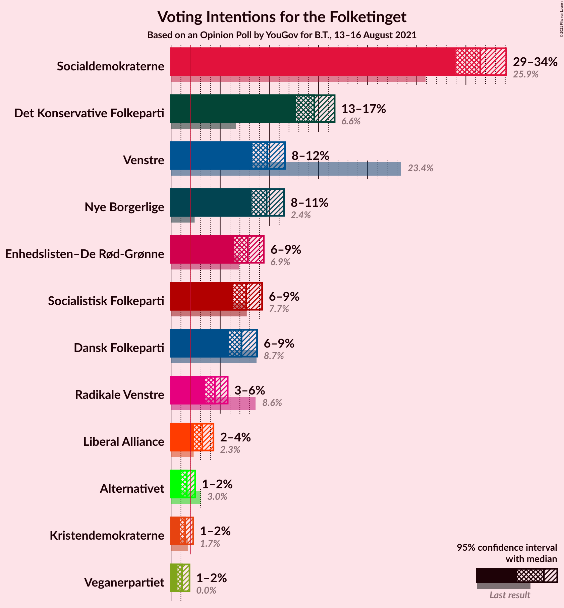

### Confidence Intervals

| Party | Last Result | Poll Result | 80% Confidence Interval | 90% Confidence Interval | 95% Confidence Interval | 99% Confidence Interval |
|:-----:|:-----------:|:-----------:|:-----------------------:|:-----------------------:|:-----------------------:|:-----------------------:|
| Socialdemokraterne | 25.9% | 31.5% | 29.8–33.2% |29.4–33.7% |29.0–34.1% |28.2–34.9% |
| Det Konservative Folkeparti | 6.6% | 14.6% | 13.4–15.9% |13.0–16.3% |12.7–16.6% |12.2–17.3% |
| Venstre | 23.4% | 9.8% | 8.8–11.0% |8.5–11.3% |8.3–11.6% |7.8–12.2% |
| Nye Borgerlige | 2.4% | 9.7% | 8.7–10.9% |8.4–11.2% |8.2–11.5% |7.7–12.1% |
| Enhedslisten–De Rød-Grønne | 6.9% | 7.8% | 6.9–8.9% |6.7–9.2% |6.4–9.4% |6.0–10.0% |
| Socialistisk Folkeparti | 7.7% | 7.6% | 6.8–8.7% |6.5–9.0% |6.3–9.3% |5.9–9.8% |
| Dansk Folkeparti | 8.7% | 7.2% | 6.3–8.2% |6.1–8.5% |5.9–8.7% |5.5–9.3% |
| Radikale Venstre | 8.6% | 4.5% | 3.8–5.3% |3.6–5.5% |3.4–5.8% |3.2–6.2% |
| Liberal Alliance | 2.3% | 3.2% | 2.6–3.9% |2.5–4.1% |2.3–4.3% |2.1–4.7% |
| Alternativet | 3.0% | 1.6% | 1.2–2.1% |1.1–2.3% |1.0–2.5% |0.9–2.8% |
| Kristendemokraterne | 1.7% | 1.4% | 1.1–2.0% |1.0–2.1% |0.9–2.3% |0.8–2.5% |
| Veganerpartiet | 0.0% | 1.1% | 0.8–1.6% |0.7–1.7% |0.7–1.9% |0.5–2.1% |

*Note:* The poll result column reflects the actual value used in the calculations. Published results may vary slightly, and in addition be rounded to fewer digits.

## Seats

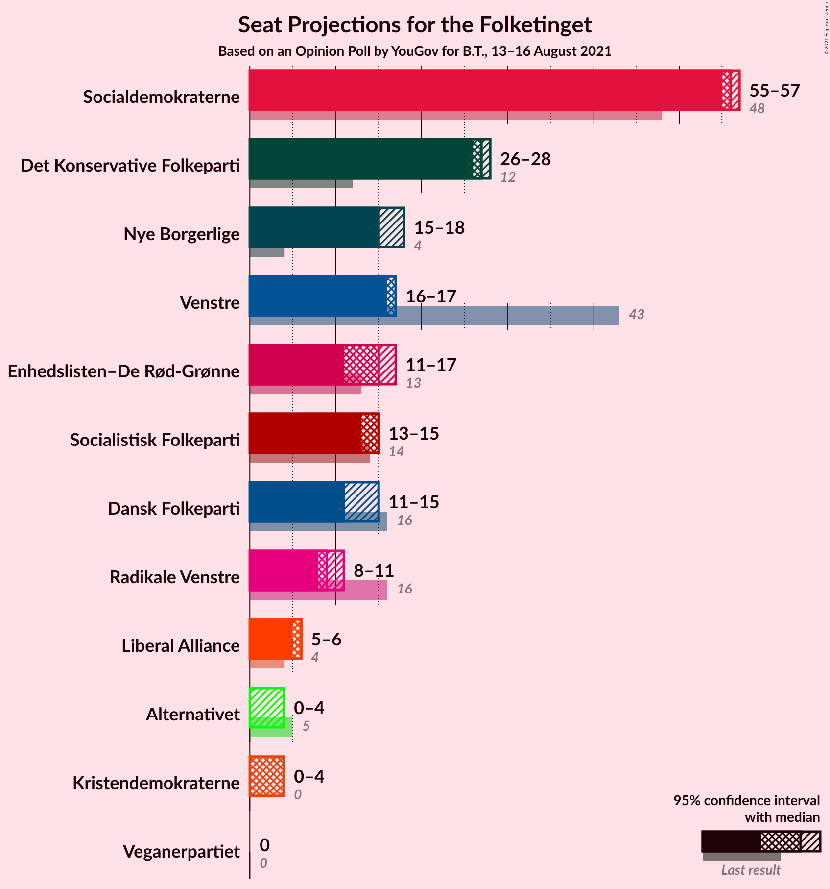

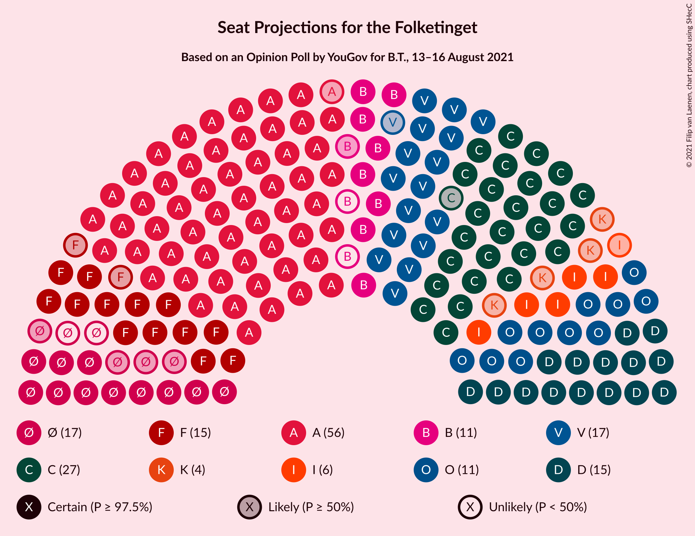

### Confidence Intervals

| Party | Last Result | Median | 80% Confidence Interval | 90% Confidence Interval | 95% Confidence Interval | 99% Confidence Interval |
|:-----:|:-----------:|:------:|:-----------------------:|:-----------------------:|:-----------------------:|:-----------------------:|
| <a href="#socialdemokraterne">Socialdemokraterne</a> | 48 | 56 | 56–57 |56–57 |55–57 |52–58 |
| <a href="#det-konservative-folkeparti">Det Konservative Folkeparti</a> | 12 | 27 | 26–27 |26–27 |26–28 |22–32 |
| <a href="#venstre">Venstre</a> | 43 | 17 | 16–17 |16–17 |16–17 |15–18 |
| <a href="#nye-borgerlige">Nye Borgerlige</a> | 4 | 15 | 15–18 |15–18 |15–18 |13–18 |
| <a href="#enhedslisten–de-rød-grønne">Enhedslisten–De Rød-Grønne</a> | 13 | 15 | 11–17 |11–17 |11–17 |11–17 |
| <a href="#socialistisk-folkeparti">Socialistisk Folkeparti</a> | 14 | 15 | 13–15 |13–15 |13–15 |13–15 |
| <a href="#dansk-folkeparti">Dansk Folkeparti</a> | 16 | 11 | 11–13 |11–13 |11–15 |11–19 |
| <a href="#radikale-venstre">Radikale Venstre</a> | 16 | 9 | 8–11 |8–11 |8–11 |7–11 |
| <a href="#liberal-alliance">Liberal Alliance</a> | 4 | 6 | 5–6 |5–6 |5–6 |4–7 |
| <a href="#alternativet">Alternativet</a> | 5 | 0 | 0–4 |0–4 |0–4 |0–4 |
| <a href="#kristendemokraterne">Kristendemokraterne</a> | 0 | 4 | 0–4 |0–4 |0–4 |0–4 |
| <a href="#veganerpartiet">Veganerpartiet</a> | 0 | 0 | 0 |0 |0 |0–4 |

### Socialdemokraterne

*For a full overview of the results for this party, see the [Socialdemokraterne](party-socialdemokraterne.html) page.*

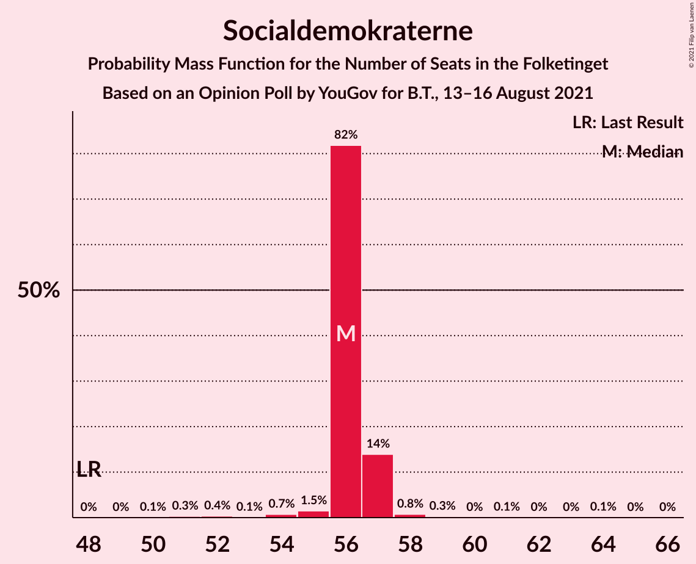

| Number of Seats | Probability | Accumulated | Special Marks |
|:---------------:|:-----------:|:-----------:|:-------------:|
| 48 | 0% | 100% | Last Result |
| 49 | 0% | 100% |  |
| 50 | 0.1% | 100% |  |
| 51 | 0.3% | 99.9% |  |
| 52 | 0.4% | 99.6% |  |
| 53 | 0.1% | 99.3% |  |
| 54 | 0.7% | 99.2% |  |
| 55 | 1.5% | 98% |  |
| 56 | 82% | 97% | Median |
| 57 | 14% | 15% |  |
| 58 | 0.8% | 1.2% |  |
| 59 | 0.3% | 0.5% |  |
| 60 | 0% | 0.2% |  |
| 61 | 0.1% | 0.2% |  |
| 62 | 0% | 0.1% |  |
| 63 | 0% | 0.1% |  |
| 64 | 0.1% | 0.1% |  |
| 65 | 0% | 0% |  |

### Det Konservative Folkeparti

*For a full overview of the results for this party, see the [Det Konservative Folkeparti](party-detkonservativefolkeparti.html) page.*

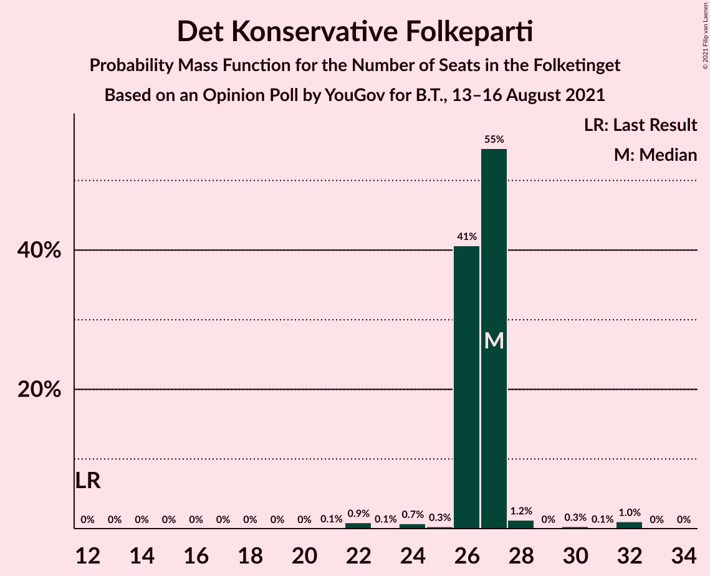

| Number of Seats | Probability | Accumulated | Special Marks |
|:---------------:|:-----------:|:-----------:|:-------------:|
| 12 | 0% | 100% | Last Result |
| 13 | 0% | 100% |  |
| 14 | 0% | 100% |  |
| 15 | 0% | 100% |  |
| 16 | 0% | 100% |  |
| 17 | 0% | 100% |  |
| 18 | 0% | 100% |  |
| 19 | 0% | 100% |  |
| 20 | 0% | 100% |  |
| 21 | 0.1% | 100% |  |
| 22 | 0.9% | 99.9% |  |
| 23 | 0.1% | 99.0% |  |
| 24 | 0.7% | 99.0% |  |
| 25 | 0.3% | 98% |  |
| 26 | 41% | 98% |  |
| 27 | 55% | 57% | Median |
| 28 | 1.2% | 3% |  |
| 29 | 0% | 1.4% |  |
| 30 | 0.3% | 1.4% |  |
| 31 | 0.1% | 1.1% |  |
| 32 | 1.0% | 1.0% |  |
| 33 | 0% | 0% |  |

### Venstre

*For a full overview of the results for this party, see the [Venstre](party-venstre.html) page.*

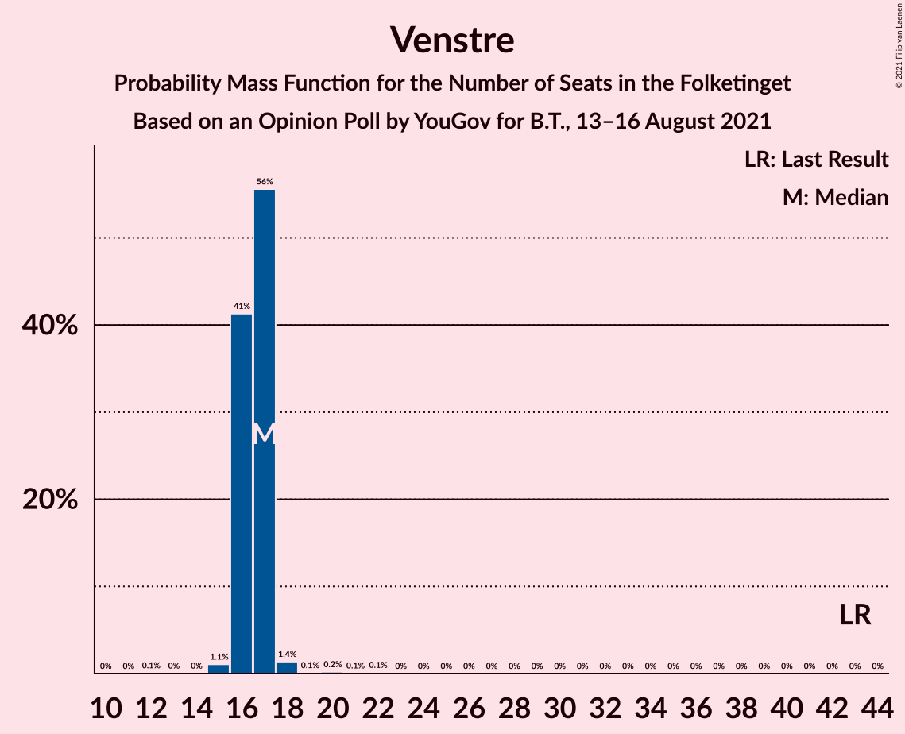

| Number of Seats | Probability | Accumulated | Special Marks |
|:---------------:|:-----------:|:-----------:|:-------------:|
| 12 | 0.1% | 100% |  |
| 13 | 0% | 99.9% |  |
| 14 | 0% | 99.9% |  |
| 15 | 1.1% | 99.8% |  |
| 16 | 41% | 98.8% |  |
| 17 | 56% | 57% | Median |
| 18 | 1.4% | 2% |  |
| 19 | 0.1% | 0.5% |  |
| 20 | 0.2% | 0.4% |  |
| 21 | 0.1% | 0.2% |  |
| 22 | 0.1% | 0.1% |  |
| 23 | 0% | 0% |  |
| 24 | 0% | 0% |  |
| 25 | 0% | 0% |  |
| 26 | 0% | 0% |  |
| 27 | 0% | 0% |  |
| 28 | 0% | 0% |  |
| 29 | 0% | 0% |  |
| 30 | 0% | 0% |  |
| 31 | 0% | 0% |  |
| 32 | 0% | 0% |  |
| 33 | 0% | 0% |  |
| 34 | 0% | 0% |  |
| 35 | 0% | 0% |  |
| 36 | 0% | 0% |  |
| 37 | 0% | 0% |  |
| 38 | 0% | 0% |  |
| 39 | 0% | 0% |  |
| 40 | 0% | 0% |  |
| 41 | 0% | 0% |  |
| 42 | 0% | 0% |  |
| 43 | 0% | 0% | Last Result |

### Nye Borgerlige

*For a full overview of the results for this party, see the [Nye Borgerlige](party-nyeborgerlige.html) page.*

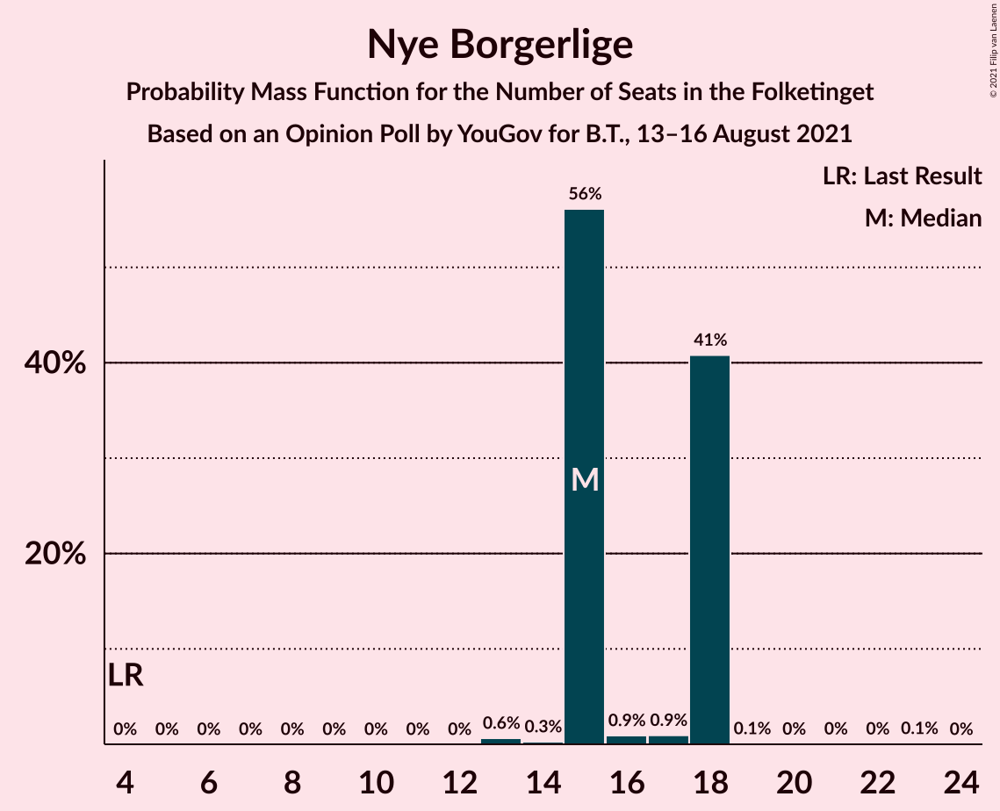

| Number of Seats | Probability | Accumulated | Special Marks |
|:---------------:|:-----------:|:-----------:|:-------------:|
| 4 | 0% | 100% | Last Result |
| 5 | 0% | 100% |  |
| 6 | 0% | 100% |  |
| 7 | 0% | 100% |  |
| 8 | 0% | 100% |  |
| 9 | 0% | 100% |  |
| 10 | 0% | 100% |  |
| 11 | 0% | 100% |  |
| 12 | 0% | 100% |  |
| 13 | 0.6% | 100% |  |
| 14 | 0.3% | 99.4% |  |
| 15 | 56% | 99.1% | Median |
| 16 | 0.9% | 43% |  |
| 17 | 0.9% | 42% |  |
| 18 | 41% | 41% |  |
| 19 | 0.1% | 0.3% |  |
| 20 | 0% | 0.2% |  |
| 21 | 0% | 0.2% |  |
| 22 | 0% | 0.1% |  |
| 23 | 0.1% | 0.1% |  |
| 24 | 0% | 0% |  |

### Enhedslisten–De Rød-Grønne

*For a full overview of the results for this party, see the [Enhedslisten–De Rød-Grønne](party-enhedslisten–derød-grønne.html) page.*

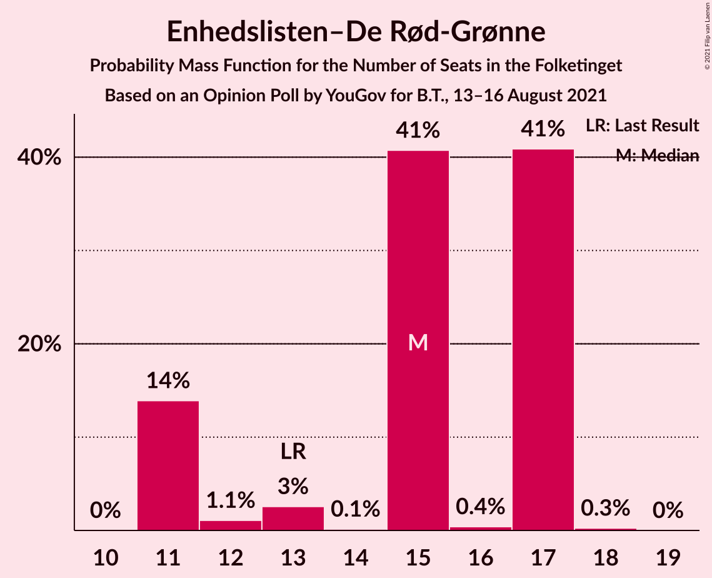

| Number of Seats | Probability | Accumulated | Special Marks |
|:---------------:|:-----------:|:-----------:|:-------------:|
| 11 | 14% | 100% |  |
| 12 | 1.1% | 86% |  |
| 13 | 3% | 85% | Last Result |
| 14 | 0.1% | 82% |  |
| 15 | 41% | 82% | Median |
| 16 | 0.4% | 42% |  |
| 17 | 41% | 41% |  |
| 18 | 0.3% | 0.3% |  |
| 19 | 0% | 0% |  |

### Socialistisk Folkeparti

*For a full overview of the results for this party, see the [Socialistisk Folkeparti](party-socialistiskfolkeparti.html) page.*

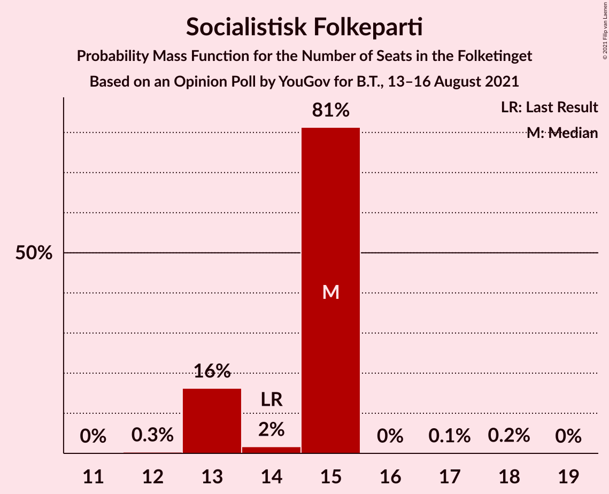

| Number of Seats | Probability | Accumulated | Special Marks |
|:---------------:|:-----------:|:-----------:|:-------------:|
| 11 | 0% | 100% |  |
| 12 | 0.3% | 99.9% |  |
| 13 | 16% | 99.6% |  |
| 14 | 2% | 83% | Last Result |
| 15 | 81% | 82% | Median |
| 16 | 0% | 0.4% |  |
| 17 | 0.1% | 0.3% |  |
| 18 | 0.2% | 0.2% |  |
| 19 | 0% | 0% |  |

### Dansk Folkeparti

*For a full overview of the results for this party, see the [Dansk Folkeparti](party-danskfolkeparti.html) page.*

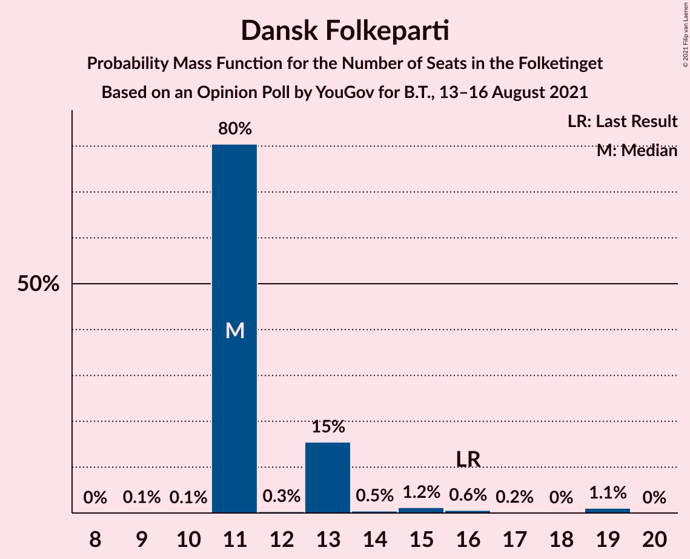

| Number of Seats | Probability | Accumulated | Special Marks |
|:---------------:|:-----------:|:-----------:|:-------------:|
| 9 | 0.1% | 100% |  |
| 10 | 0.1% | 99.9% |  |
| 11 | 80% | 99.8% | Median |
| 12 | 0.3% | 19% |  |
| 13 | 15% | 19% |  |
| 14 | 0.5% | 4% |  |
| 15 | 1.2% | 3% |  |
| 16 | 0.6% | 2% | Last Result |
| 17 | 0.2% | 1.3% |  |
| 18 | 0% | 1.1% |  |
| 19 | 1.1% | 1.1% |  |
| 20 | 0% | 0% |  |

### Radikale Venstre

*For a full overview of the results for this party, see the [Radikale Venstre](party-radikalevenstre.html) page.*

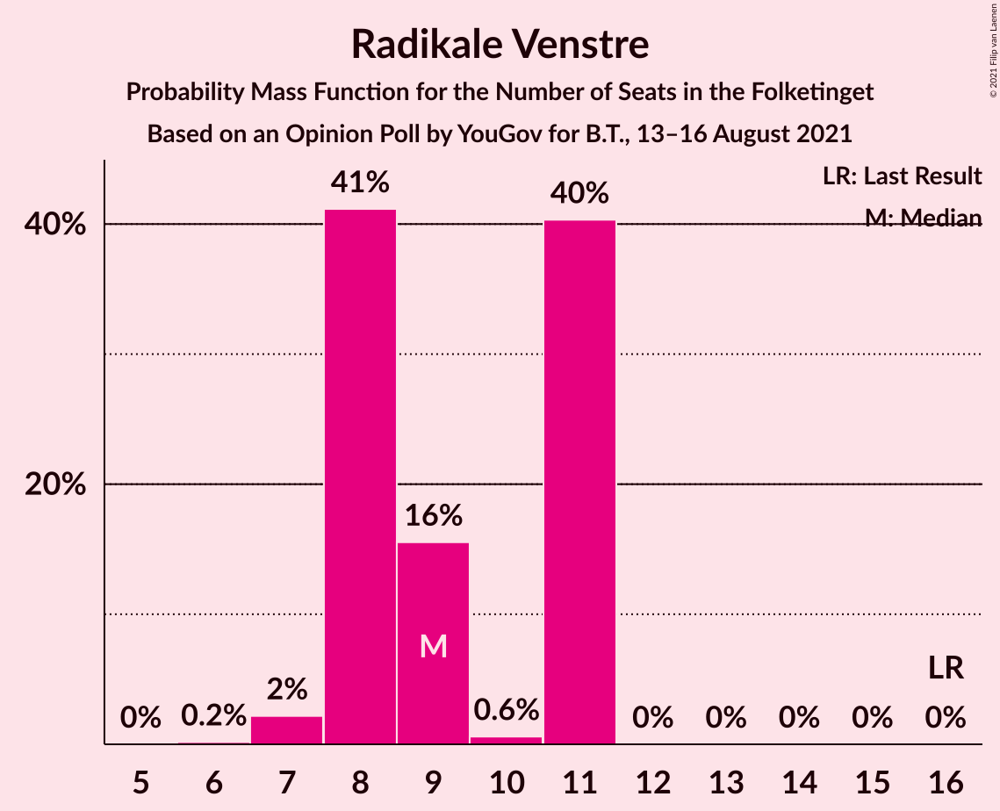

| Number of Seats | Probability | Accumulated | Special Marks |
|:---------------:|:-----------:|:-----------:|:-------------:|
| 6 | 0.2% | 100% |  |
| 7 | 2% | 99.8% |  |
| 8 | 41% | 98% |  |
| 9 | 16% | 56% | Median |
| 10 | 0.6% | 41% |  |
| 11 | 40% | 40% |  |
| 12 | 0% | 0% |  |
| 13 | 0% | 0% |  |
| 14 | 0% | 0% |  |
| 15 | 0% | 0% |  |
| 16 | 0% | 0% | Last Result |

### Liberal Alliance

*For a full overview of the results for this party, see the [Liberal Alliance](party-liberalalliance.html) page.*

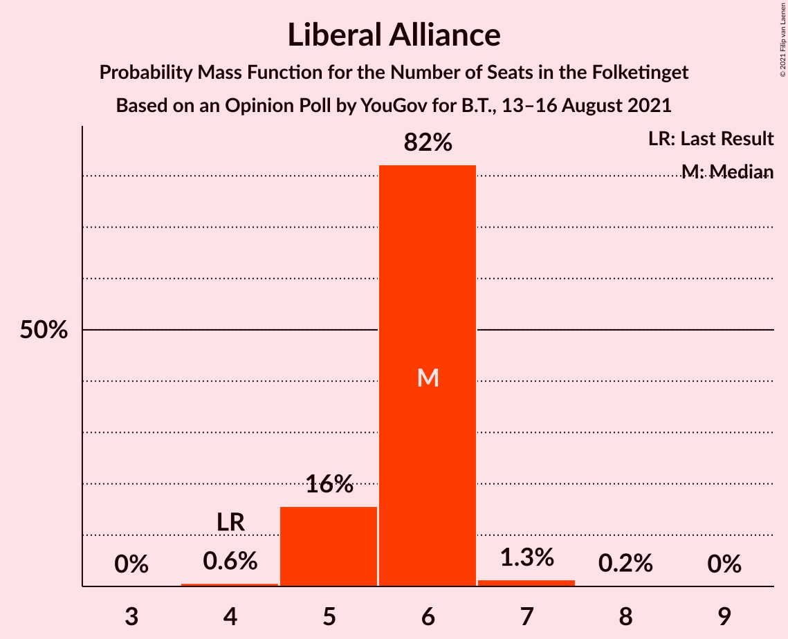

| Number of Seats | Probability | Accumulated | Special Marks |
|:---------------:|:-----------:|:-----------:|:-------------:|
| 4 | 0.6% | 100% | Last Result |
| 5 | 16% | 99.4% |  |
| 6 | 82% | 84% | Median |
| 7 | 1.3% | 2% |  |
| 8 | 0.2% | 0.2% |  |
| 9 | 0% | 0% |  |

### Alternativet

*For a full overview of the results for this party, see the [Alternativet](party-alternativet.html) page.*

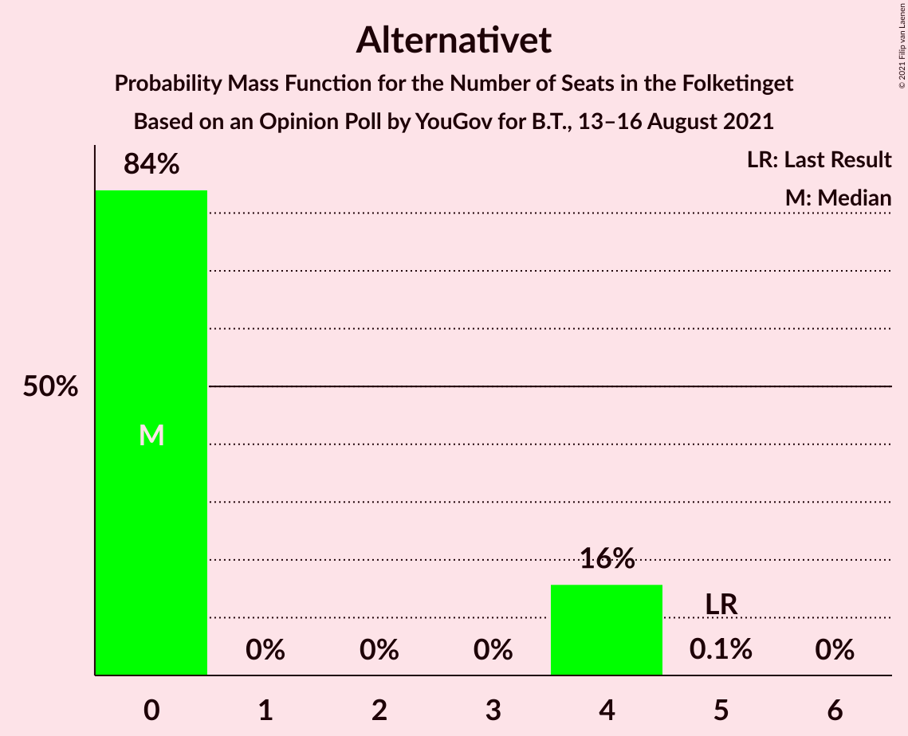

| Number of Seats | Probability | Accumulated | Special Marks |
|:---------------:|:-----------:|:-----------:|:-------------:|
| 0 | 84% | 100% | Median |
| 1 | 0% | 16% |  |
| 2 | 0% | 16% |  |
| 3 | 0% | 16% |  |
| 4 | 16% | 16% |  |
| 5 | 0.1% | 0.1% | Last Result |
| 6 | 0% | 0% |  |

### Kristendemokraterne

*For a full overview of the results for this party, see the [Kristendemokraterne](party-kristendemokraterne.html) page.*

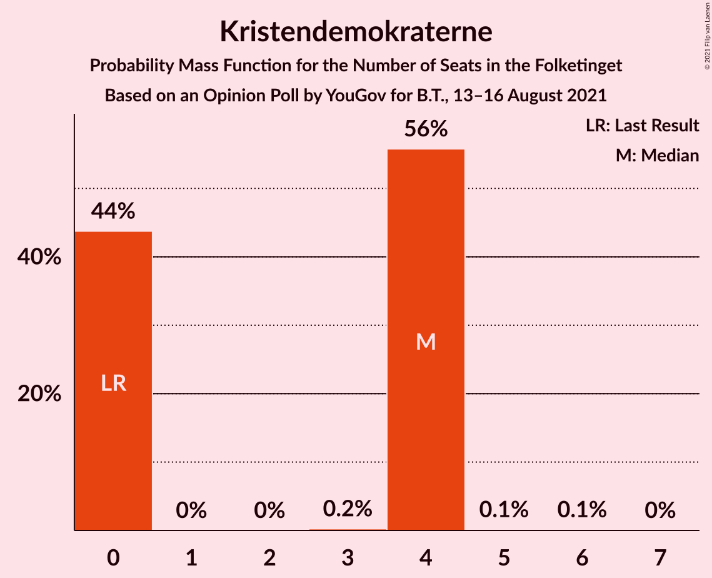

| Number of Seats | Probability | Accumulated | Special Marks |
|:---------------:|:-----------:|:-----------:|:-------------:|
| 0 | 44% | 100% | Last Result |
| 1 | 0% | 56% |  |
| 2 | 0% | 56% |  |
| 3 | 0.2% | 56% |  |
| 4 | 56% | 56% | Median |
| 5 | 0.1% | 0.2% |  |
| 6 | 0.1% | 0.1% |  |
| 7 | 0% | 0% |  |

### Veganerpartiet

*For a full overview of the results for this party, see the [Veganerpartiet](party-veganerpartiet.html) page.*

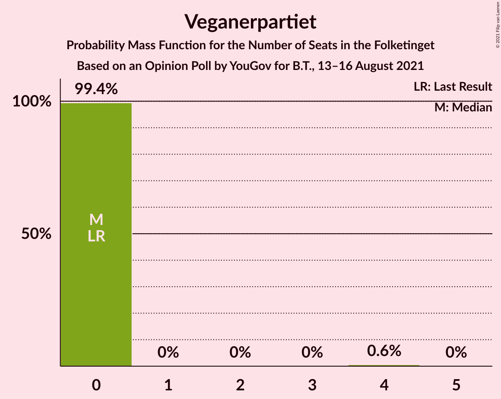

| Number of Seats | Probability | Accumulated | Special Marks |
|:---------------:|:-----------:|:-----------:|:-------------:|
| 0 | 99.4% | 100% | Last Result, Median |
| 1 | 0% | 0.6% |  |
| 2 | 0% | 0.6% |  |
| 3 | 0% | 0.6% |  |
| 4 | 0.6% | 0.6% |  |
| 5 | 0% | 0% |  |

## Coalitions

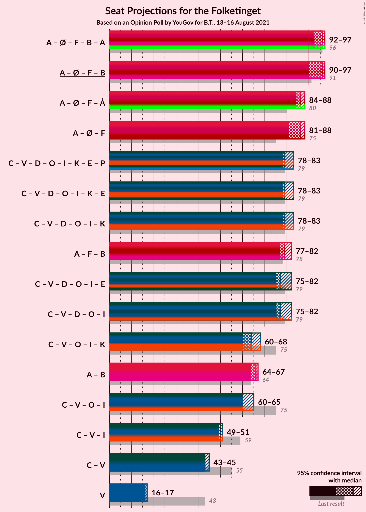

### Confidence Intervals

| Coalition | Last Result | Median | Majority? | 80% Confidence Interval | 90% Confidence Interval | 95% Confidence Interval | 99% Confidence Interval |
|:---------:|:-----------:|:------:|:---------:|:-----------------------:|:-----------------------:|:-----------------------:|:-----------------------:|
| Socialdemokraterne – Enhedslisten–De Rød-Grønne – Socialistisk Folkeparti – Radikale Venstre – Alternativet | 96 | 96 | 99.7% | 94–97 | 94–97 | 92–97 | 90–97 |
| Socialdemokraterne – Enhedslisten–De Rød-Grønne – Socialistisk Folkeparti – Radikale Venstre | 91 | 96 | 99.6% | 90–97 | 90–97 | 90–97 | 90–97 |
| Socialdemokraterne – Enhedslisten–De Rød-Grønne – Socialistisk Folkeparti – Alternativet | 80 | 86 | 0.2% | 85–88 | 85–88 | 84–88 | 81–89 |
| Socialdemokraterne – Enhedslisten–De Rød-Grønne – Socialistisk Folkeparti | 75 | 86 | 0.2% | 81–88 | 81–88 | 81–88 | 81–88 |
| Det Konservative Folkeparti – Venstre – Nye Borgerlige – Dansk Folkeparti – Liberal Alliance – Kristendemokraterne | 79 | 79 | 0% | 78–81 | 78–81 | 78–83 | 77–85 |
| Socialdemokraterne – Socialistisk Folkeparti – Radikale Venstre | 78 | 79 | 0% | 79–82 | 79–82 | 77–82 | 74–82 |
| Det Konservative Folkeparti – Venstre – Nye Borgerlige – Dansk Folkeparti – Liberal Alliance | 79 | 77 | 0% | 75–78 | 75–78 | 75–82 | 75–85 |
| Det Konservative Folkeparti – Venstre – Dansk Folkeparti – Liberal Alliance – Kristendemokraterne | 75 | 64 | 0% | 60–66 | 60–66 | 60–68 | 59–70 |
| Socialdemokraterne – Radikale Venstre | 64 | 66 | 0% | 64–67 | 64–67 | 64–67 | 61–67 |
| Det Konservative Folkeparti – Venstre – Dansk Folkeparti – Liberal Alliance | 75 | 60 | 0% | 60–62 | 60–62 | 60–65 | 59–70 |
| Det Konservative Folkeparti – Venstre – Liberal Alliance | 59 | 49 | 0% | 49 | 49 | 49–51 | 44–54 |
| Det Konservative Folkeparti – Venstre | 55 | 43 | 0% | 43–44 | 43–44 | 43–45 | 37–48 |
| Venstre | 43 | 17 | 0% | 16–17 | 16–17 | 16–17 | 15–18 |

### Socialdemokraterne – Enhedslisten–De Rød-Grønne – Socialistisk Folkeparti – Radikale Venstre – Alternativet

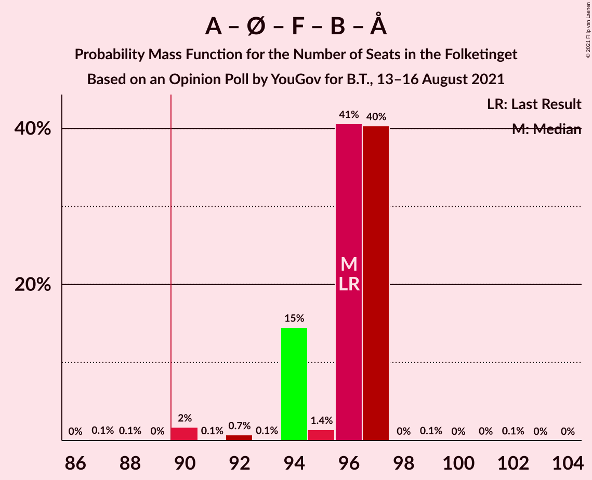

| Number of Seats | Probability | Accumulated | Special Marks |
|:---------------:|:-----------:|:-----------:|:-------------:|
| 87 | 0.1% | 100% |  |
| 88 | 0.1% | 99.9% |  |
| 89 | 0% | 99.8% |  |
| 90 | 2% | 99.7% | Majority |
| 91 | 0.1% | 98% |  |
| 92 | 0.7% | 98% |  |
| 93 | 0.1% | 97% |  |
| 94 | 15% | 97% |  |
| 95 | 1.4% | 83% | Median |
| 96 | 41% | 81% | Last Result |
| 97 | 40% | 41% |  |
| 98 | 0% | 0.2% |  |
| 99 | 0.1% | 0.2% |  |
| 100 | 0% | 0.1% |  |
| 101 | 0% | 0.1% |  |
| 102 | 0.1% | 0.1% |  |
| 103 | 0% | 0% |  |

### Socialdemokraterne – Enhedslisten–De Rød-Grønne – Socialistisk Folkeparti – Radikale Venstre

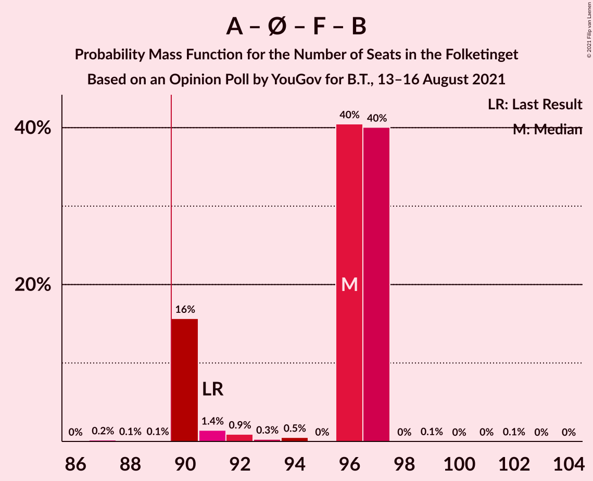

| Number of Seats | Probability | Accumulated | Special Marks |
|:---------------:|:-----------:|:-----------:|:-------------:|
| 87 | 0.2% | 100% |  |
| 88 | 0.1% | 99.8% |  |
| 89 | 0.1% | 99.7% |  |
| 90 | 16% | 99.6% | Majority |
| 91 | 1.4% | 84% | Last Result |
| 92 | 0.9% | 82% |  |
| 93 | 0.3% | 82% |  |
| 94 | 0.5% | 81% |  |
| 95 | 0% | 81% | Median |
| 96 | 40% | 81% |  |
| 97 | 40% | 40% |  |
| 98 | 0% | 0.2% |  |
| 99 | 0.1% | 0.2% |  |
| 100 | 0% | 0.1% |  |
| 101 | 0% | 0.1% |  |
| 102 | 0.1% | 0.1% |  |
| 103 | 0% | 0% |  |

### Socialdemokraterne – Enhedslisten–De Rød-Grønne – Socialistisk Folkeparti – Alternativet

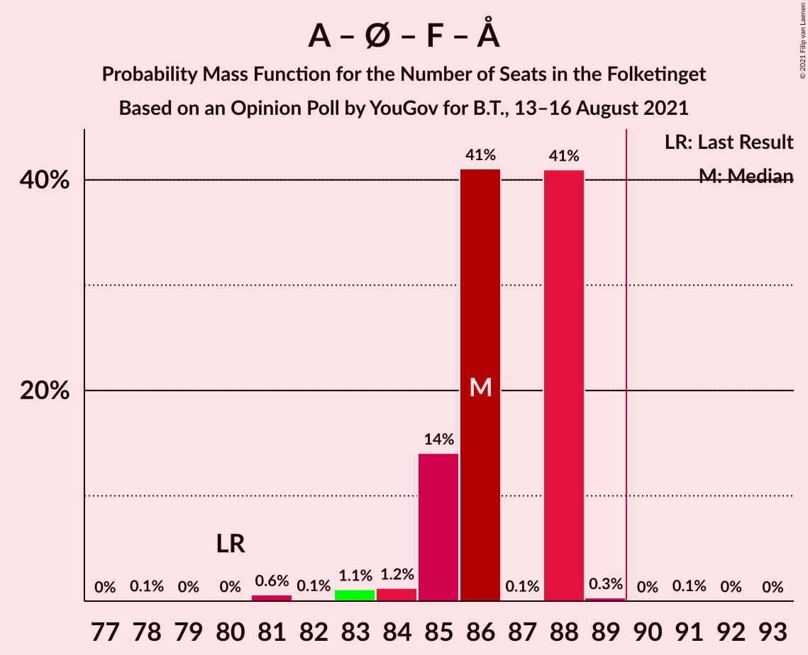

| Number of Seats | Probability | Accumulated | Special Marks |
|:---------------:|:-----------:|:-----------:|:-------------:|
| 78 | 0.1% | 100% |  |
| 79 | 0% | 99.9% |  |
| 80 | 0% | 99.9% | Last Result |
| 81 | 0.6% | 99.8% |  |
| 82 | 0.1% | 99.2% |  |
| 83 | 1.1% | 99.0% |  |
| 84 | 1.2% | 98% |  |
| 85 | 14% | 97% |  |
| 86 | 41% | 83% | Median |
| 87 | 0.1% | 42% |  |
| 88 | 41% | 42% |  |
| 89 | 0.3% | 0.5% |  |
| 90 | 0% | 0.2% | Majority |
| 91 | 0.1% | 0.2% |  |
| 92 | 0% | 0.1% |  |
| 93 | 0% | 0% |  |

### Socialdemokraterne – Enhedslisten–De Rød-Grønne – Socialistisk Folkeparti

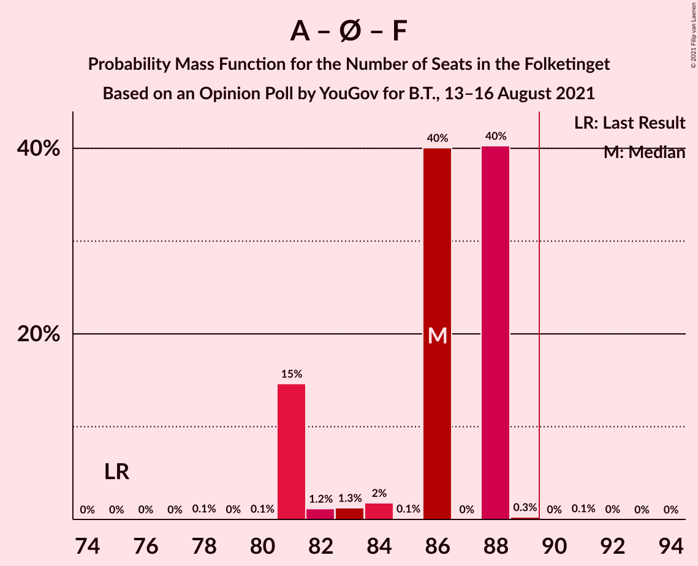

| Number of Seats | Probability | Accumulated | Special Marks |
|:---------------:|:-----------:|:-----------:|:-------------:|
| 75 | 0% | 100% | Last Result |
| 76 | 0% | 100% |  |
| 77 | 0% | 100% |  |
| 78 | 0.1% | 100% |  |
| 79 | 0% | 99.9% |  |
| 80 | 0.1% | 99.8% |  |
| 81 | 15% | 99.7% |  |
| 82 | 1.2% | 85% |  |
| 83 | 1.3% | 84% |  |
| 84 | 2% | 83% |  |
| 85 | 0.1% | 81% |  |
| 86 | 40% | 81% | Median |
| 87 | 0% | 41% |  |
| 88 | 40% | 41% |  |
| 89 | 0.3% | 0.5% |  |
| 90 | 0% | 0.2% | Majority |
| 91 | 0.1% | 0.2% |  |
| 92 | 0% | 0.1% |  |
| 93 | 0% | 0% |  |

### Det Konservative Folkeparti – Venstre – Nye Borgerlige – Dansk Folkeparti – Liberal Alliance – Kristendemokraterne

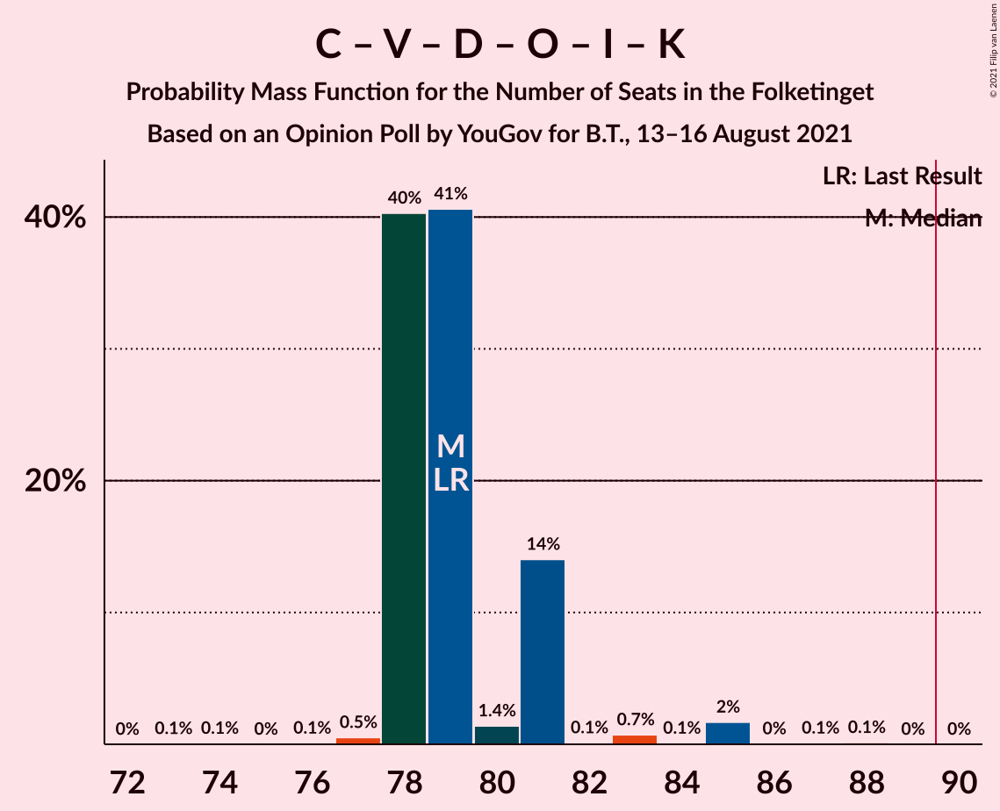

| Number of Seats | Probability | Accumulated | Special Marks |
|:---------------:|:-----------:|:-----------:|:-------------:|
| 73 | 0.1% | 100% |  |
| 74 | 0.1% | 99.9% |  |
| 75 | 0% | 99.9% |  |
| 76 | 0.1% | 99.9% |  |
| 77 | 0.5% | 99.8% |  |
| 78 | 40% | 99.2% |  |
| 79 | 41% | 59% | Last Result |
| 80 | 1.4% | 18% | Median |
| 81 | 14% | 17% |  |
| 82 | 0.1% | 3% |  |
| 83 | 0.7% | 3% |  |
| 84 | 0.1% | 2% |  |
| 85 | 2% | 2% |  |
| 86 | 0% | 0.3% |  |
| 87 | 0.1% | 0.2% |  |
| 88 | 0.1% | 0.1% |  |
| 89 | 0% | 0% |  |

### Socialdemokraterne – Socialistisk Folkeparti – Radikale Venstre

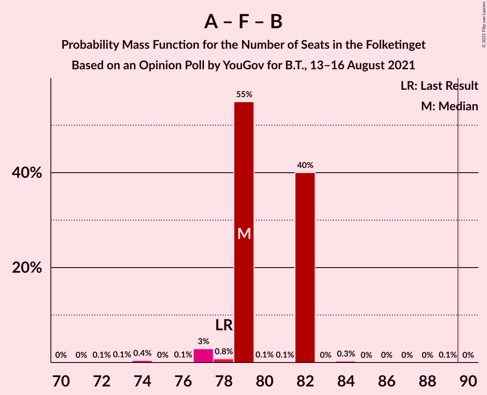

| Number of Seats | Probability | Accumulated | Special Marks |
|:---------------:|:-----------:|:-----------:|:-------------:|
| 71 | 0% | 100% |  |
| 72 | 0.1% | 99.9% |  |
| 73 | 0.1% | 99.9% |  |
| 74 | 0.4% | 99.8% |  |
| 75 | 0% | 99.3% |  |
| 76 | 0.1% | 99.3% |  |
| 77 | 3% | 99.2% |  |
| 78 | 0.8% | 96% | Last Result |
| 79 | 55% | 96% |  |
| 80 | 0.1% | 41% | Median |
| 81 | 0.1% | 40% |  |
| 82 | 40% | 40% |  |
| 83 | 0% | 0.4% |  |
| 84 | 0.3% | 0.4% |  |
| 85 | 0% | 0.1% |  |
| 86 | 0% | 0.1% |  |
| 87 | 0% | 0.1% |  |
| 88 | 0% | 0.1% |  |
| 89 | 0.1% | 0.1% |  |
| 90 | 0% | 0% | Majority |

### Det Konservative Folkeparti – Venstre – Nye Borgerlige – Dansk Folkeparti – Liberal Alliance

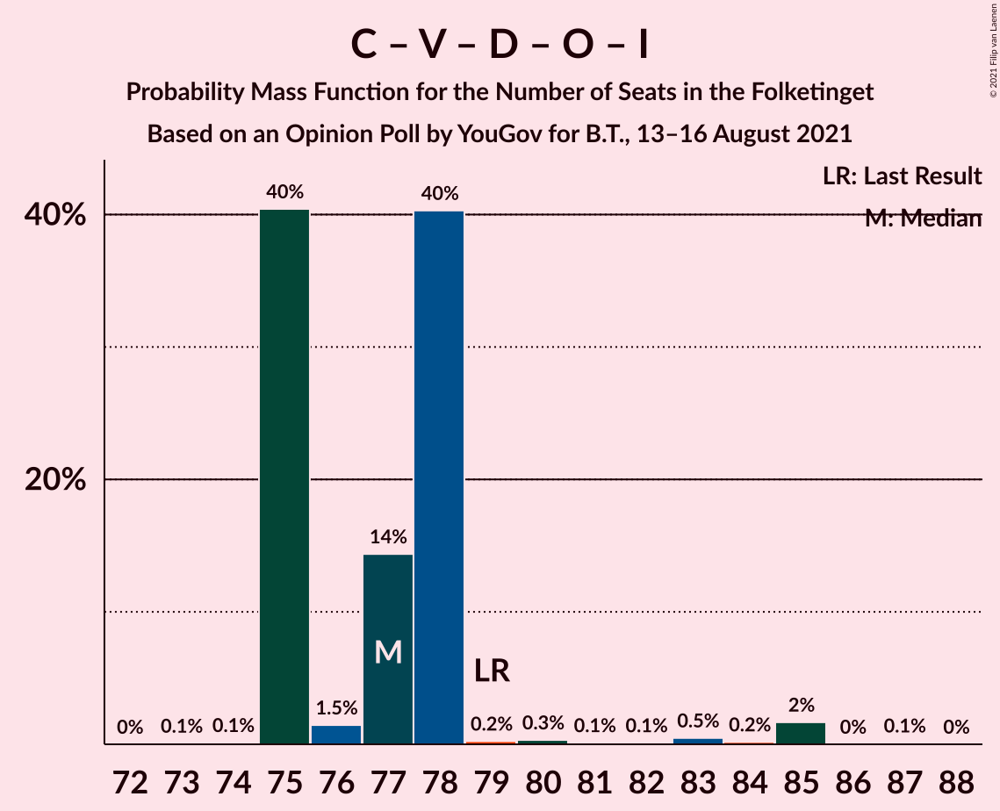

| Number of Seats | Probability | Accumulated | Special Marks |
|:---------------:|:-----------:|:-----------:|:-------------:|
| 73 | 0.1% | 100% |  |
| 74 | 0.1% | 99.9% |  |
| 75 | 40% | 99.8% |  |
| 76 | 1.5% | 59% | Median |
| 77 | 14% | 58% |  |
| 78 | 40% | 44% |  |
| 79 | 0.2% | 3% | Last Result |
| 80 | 0.3% | 3% |  |
| 81 | 0.1% | 3% |  |
| 82 | 0.1% | 3% |  |
| 83 | 0.5% | 2% |  |
| 84 | 0.2% | 2% |  |
| 85 | 2% | 2% |  |
| 86 | 0% | 0.1% |  |
| 87 | 0.1% | 0.1% |  |
| 88 | 0% | 0% |  |

### Det Konservative Folkeparti – Venstre – Dansk Folkeparti – Liberal Alliance – Kristendemokraterne

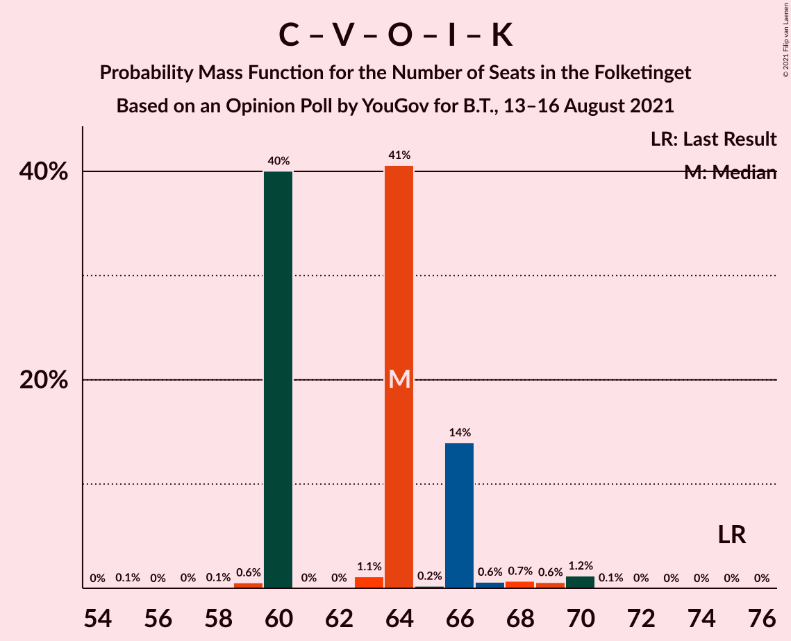

| Number of Seats | Probability | Accumulated | Special Marks |
|:---------------:|:-----------:|:-----------:|:-------------:|
| 55 | 0.1% | 100% |  |
| 56 | 0% | 99.9% |  |
| 57 | 0% | 99.9% |  |
| 58 | 0.1% | 99.9% |  |
| 59 | 0.6% | 99.8% |  |
| 60 | 40% | 99.2% |  |
| 61 | 0% | 59% |  |
| 62 | 0% | 59% |  |
| 63 | 1.1% | 59% |  |
| 64 | 41% | 58% |  |
| 65 | 0.2% | 17% | Median |
| 66 | 14% | 17% |  |
| 67 | 0.6% | 3% |  |
| 68 | 0.7% | 3% |  |
| 69 | 0.6% | 2% |  |
| 70 | 1.2% | 1.3% |  |
| 71 | 0.1% | 0.1% |  |
| 72 | 0% | 0% |  |
| 73 | 0% | 0% |  |
| 74 | 0% | 0% |  |
| 75 | 0% | 0% | Last Result |

### Socialdemokraterne – Radikale Venstre

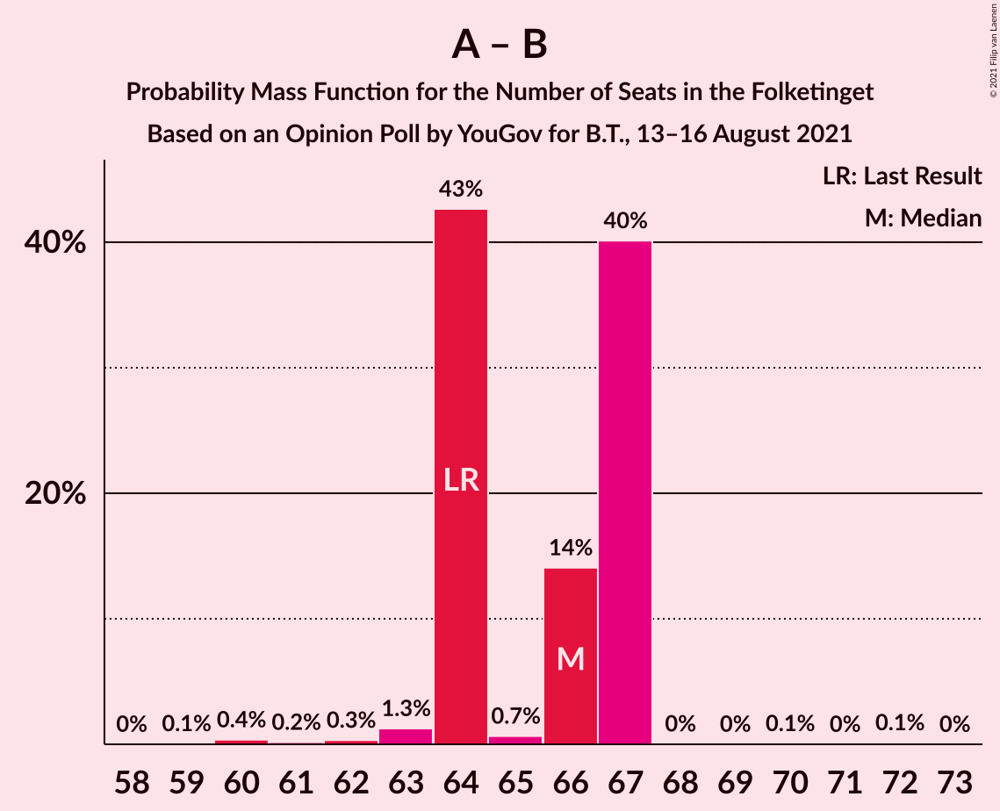

| Number of Seats | Probability | Accumulated | Special Marks |
|:---------------:|:-----------:|:-----------:|:-------------:|
| 58 | 0% | 100% |  |
| 59 | 0.1% | 99.9% |  |
| 60 | 0.4% | 99.9% |  |
| 61 | 0.2% | 99.5% |  |
| 62 | 0.3% | 99.4% |  |
| 63 | 1.3% | 99.0% |  |
| 64 | 43% | 98% | Last Result |
| 65 | 0.7% | 55% | Median |
| 66 | 14% | 54% |  |
| 67 | 40% | 40% |  |
| 68 | 0% | 0.3% |  |
| 69 | 0% | 0.2% |  |
| 70 | 0.1% | 0.2% |  |
| 71 | 0% | 0.1% |  |
| 72 | 0.1% | 0.1% |  |
| 73 | 0% | 0% |  |

### Det Konservative Folkeparti – Venstre – Dansk Folkeparti – Liberal Alliance

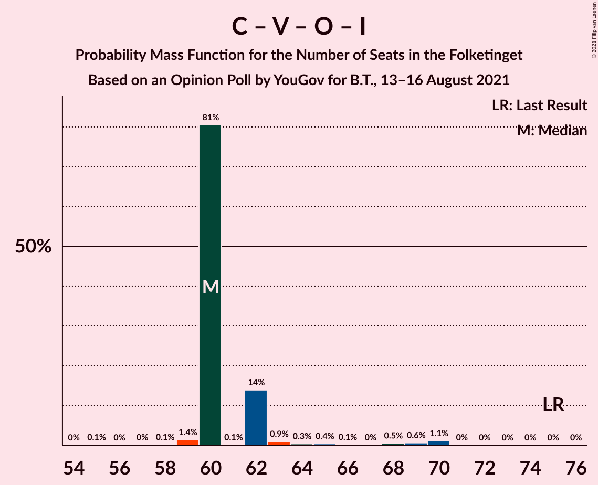

| Number of Seats | Probability | Accumulated | Special Marks |
|:---------------:|:-----------:|:-----------:|:-------------:|
| 55 | 0.1% | 100% |  |
| 56 | 0% | 99.9% |  |
| 57 | 0% | 99.9% |  |
| 58 | 0.1% | 99.9% |  |
| 59 | 1.4% | 99.8% |  |
| 60 | 81% | 98% |  |
| 61 | 0.1% | 18% | Median |
| 62 | 14% | 18% |  |
| 63 | 0.9% | 4% |  |
| 64 | 0.3% | 3% |  |
| 65 | 0.4% | 3% |  |
| 66 | 0.1% | 2% |  |
| 67 | 0% | 2% |  |
| 68 | 0.5% | 2% |  |
| 69 | 0.6% | 2% |  |
| 70 | 1.1% | 1.1% |  |
| 71 | 0% | 0% |  |
| 72 | 0% | 0% |  |
| 73 | 0% | 0% |  |
| 74 | 0% | 0% |  |
| 75 | 0% | 0% | Last Result |

### Det Konservative Folkeparti – Venstre – Liberal Alliance

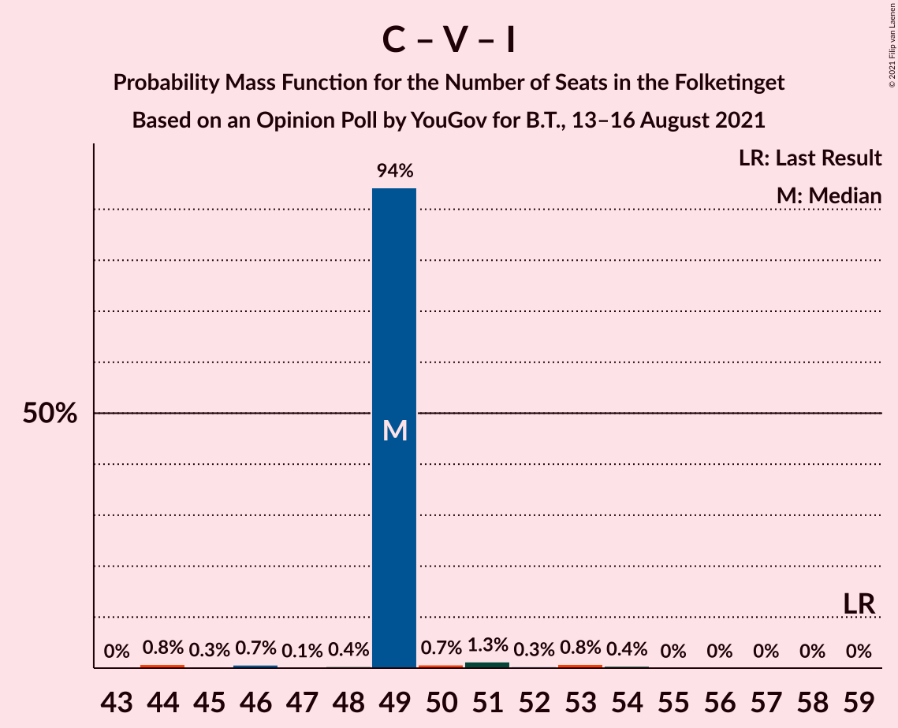

| Number of Seats | Probability | Accumulated | Special Marks |
|:---------------:|:-----------:|:-----------:|:-------------:|
| 44 | 0.8% | 100% |  |
| 45 | 0.3% | 99.2% |  |
| 46 | 0.7% | 99.0% |  |
| 47 | 0.1% | 98% |  |
| 48 | 0.4% | 98% |  |
| 49 | 94% | 98% |  |
| 50 | 0.7% | 4% | Median |
| 51 | 1.3% | 3% |  |
| 52 | 0.3% | 2% |  |
| 53 | 0.8% | 1.3% |  |
| 54 | 0.4% | 0.5% |  |
| 55 | 0% | 0.1% |  |
| 56 | 0% | 0.1% |  |
| 57 | 0% | 0% |  |
| 58 | 0% | 0% |  |
| 59 | 0% | 0% | Last Result |

### Det Konservative Folkeparti – Venstre

| Number of Seats | Probability | Accumulated | Special Marks |
|:---------------:|:-----------:|:-----------:|:-------------:|
| 37 | 0.8% | 100% |  |
| 38 | 0.1% | 99.2% |  |
| 39 | 0.2% | 99.1% |  |
| 40 | 0.1% | 98.9% |  |
| 41 | 0.1% | 98.8% |  |
| 42 | 0.6% | 98.7% |  |
| 43 | 81% | 98% |  |
| 44 | 14% | 17% | Median |
| 45 | 2% | 4% |  |
| 46 | 0.6% | 2% |  |
| 47 | 0% | 1.1% |  |
| 48 | 1.0% | 1.1% |  |
| 49 | 0% | 0.1% |  |
| 50 | 0% | 0.1% |  |
| 51 | 0% | 0% |  |
| 52 | 0% | 0% |  |
| 53 | 0% | 0% |  |
| 54 | 0% | 0% |  |
| 55 | 0% | 0% | Last Result |

### Venstre

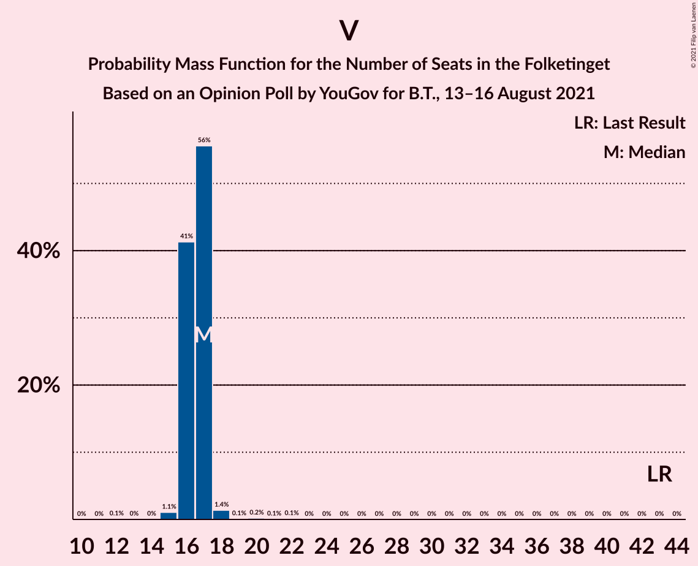

| Number of Seats | Probability | Accumulated | Special Marks |
|:---------------:|:-----------:|:-----------:|:-------------:|
| 12 | 0.1% | 100% |  |
| 13 | 0% | 99.9% |  |
| 14 | 0% | 99.9% |  |
| 15 | 1.1% | 99.8% |  |
| 16 | 41% | 98.8% |  |
| 17 | 56% | 57% | Median |
| 18 | 1.4% | 2% |  |
| 19 | 0.1% | 0.5% |  |
| 20 | 0.2% | 0.4% |  |
| 21 | 0.1% | 0.2% |  |
| 22 | 0.1% | 0.1% |  |
| 23 | 0% | 0% |  |
| 24 | 0% | 0% |  |
| 25 | 0% | 0% |  |
| 26 | 0% | 0% |  |
| 27 | 0% | 0% |  |
| 28 | 0% | 0% |  |
| 29 | 0% | 0% |  |
| 30 | 0% | 0% |  |
| 31 | 0% | 0% |  |
| 32 | 0% | 0% |  |
| 33 | 0% | 0% |  |
| 34 | 0% | 0% |  |
| 35 | 0% | 0% |  |
| 36 | 0% | 0% |  |
| 37 | 0% | 0% |  |
| 38 | 0% | 0% |  |
| 39 | 0% | 0% |  |
| 40 | 0% | 0% |  |
| 41 | 0% | 0% |  |
| 42 | 0% | 0% |  |
| 43 | 0% | 0% | Last Result |

## Technical Information

### Opinion Poll

+ **Polling firm:** YouGov
+ **Commissioner(s):** B.T.
+ **Fieldwork period:** 13–16 August 2021

### Calculations

+ **Sample size:** 1255
+ **Simulations done:** 131,072
+ **Error estimate:** 2.94%

