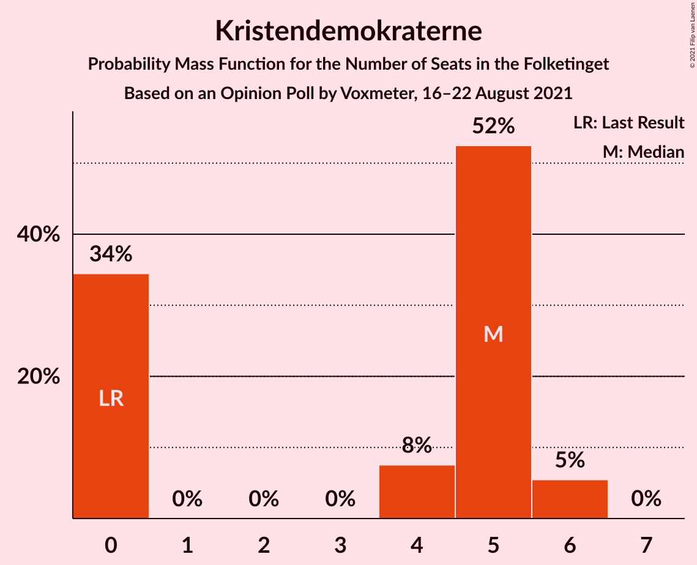

# Opinion Poll by Voxmeter, 16–22 August 2021

<a href="#voting-intentions">Voting Intentions</a> | <a href="#seats">Seats</a> | <a href="#coalitions">Coalitions</a> | <a href="#technical-information">Technical Information</a>

## Voting Intentions

### Confidence Intervals

| Party | Last Result | Poll Result | 80% Confidence Interval | 90% Confidence Interval | 95% Confidence Interval | 99% Confidence Interval |
|:-----:|:-----------:|:-----------:|:-----------------------:|:-----------------------:|:-----------------------:|:-----------------------:|
| Socialdemokraterne | 25.9% | 29.3% | 27.5–31.2% |27.0–31.7% |26.6–32.2% |25.7–33.1% |
| Venstre | 23.4% | 14.5% | 13.1–16.0% |12.7–16.4% |12.4–16.8% |11.8–17.5% |
| Det Konservative Folkeparti | 6.6% | 13.4% | 12.1–14.8% |11.7–15.2% |11.4–15.6% |10.8–16.3% |
| Socialistisk Folkeparti | 7.7% | 9.4% | 8.3–10.7% |8.0–11.0% |7.7–11.3% |7.2–12.0% |
| Enhedslisten–De Rød-Grønne | 6.9% | 9.1% | 8.0–10.3% |7.7–10.7% |7.4–11.0% |7.0–11.7% |
| Dansk Folkeparti | 8.7% | 6.4% | 5.5–7.5% |5.2–7.8% |5.0–8.1% |4.6–8.6% |
| Nye Borgerlige | 2.4% | 6.3% | 5.4–7.4% |5.2–7.7% |4.9–8.0% |4.5–8.5% |
| Radikale Venstre | 8.6% | 5.5% | 4.7–6.5% |4.4–6.8% |4.2–7.1% |3.9–7.6% |
| Liberal Alliance | 2.3% | 2.6% | 2.0–3.4% |1.9–3.6% |1.8–3.8% |1.5–4.2% |
| Kristendemokraterne | 1.7% | 2.1% | 1.6–2.8% |1.5–3.0% |1.4–3.2% |1.2–3.6% |
| Alternativet | 3.0% | 0.2% | 0.1–0.5% |0.1–0.6% |0.1–0.7% |0.0–0.9% |
| Veganerpartiet | 0.0% | 0.1% | 0.0–0.4% |0.0–0.5% |0.0–0.6% |0.0–0.7% |

*Note:* The poll result column reflects the actual value used in the calculations. Published results may vary slightly, and in addition be rounded to fewer digits.

## Seats

### Confidence Intervals

| Party | Last Result | Median | 80% Confidence Interval | 90% Confidence Interval | 95% Confidence Interval | 99% Confidence Interval |
|:-----:|:-----------:|:------:|:-----------------------:|:-----------------------:|:-----------------------:|:-----------------------:|
| <a href="#socialdemokraterne">Socialdemokraterne</a> | 48 | 50 | 47–56 |47–57 |47–57 |44–61 |
| <a href="#venstre">Venstre</a> | 43 | 26 | 23–31 |22–31 |22–31 |20–31 |
| <a href="#det-konservative-folkeparti">Det Konservative Folkeparti</a> | 12 | 23 | 23–26 |21–27 |20–28 |20–28 |
| <a href="#socialistisk-folkeparti">Socialistisk Folkeparti</a> | 14 | 15 | 13–19 |13–19 |13–19 |13–20 |
| <a href="#enhedslisten–de-rød-grønne">Enhedslisten–De Rød-Grønne</a> | 13 | 16 | 14–19 |14–19 |12–20 |11–20 |
| <a href="#dansk-folkeparti">Dansk Folkeparti</a> | 16 | 11 | 9–15 |9–15 |9–15 |9–15 |
| <a href="#nye-borgerlige">Nye Borgerlige</a> | 4 | 11 | 10–14 |9–14 |9–15 |8–15 |
| <a href="#radikale-venstre">Radikale Venstre</a> | 16 | 11 | 7–13 |7–13 |7–13 |7–13 |
| <a href="#liberal-alliance">Liberal Alliance</a> | 4 | 5 | 4–6 |4–6 |4–7 |0–7 |
| <a href="#kristendemokraterne">Kristendemokraterne</a> | 0 | 5 | 0–5 |0–6 |0–6 |0–6 |
| <a href="#alternativet">Alternativet</a> | 5 | 0 | 0 |0 |0 |0 |
| <a href="#veganerpartiet">Veganerpartiet</a> | 0 | 0 | 0 |0 |0 |0 |

### Socialdemokraterne

*For a full overview of the results for this party, see the [Socialdemokraterne](party-socialdemokraterne.html) page.*

| Number of Seats | Probability | Accumulated | Special Marks |
|:---------------:|:-----------:|:-----------:|:-------------:|
| 42 | 0.1% | 100% |  |
| 43 | 0% | 99.9% |  |
| 44 | 0.4% | 99.9% |  |
| 45 | 0% | 99.5% |  |
| 46 | 0.1% | 99.4% |  |
| 47 | 16% | 99.3% |  |
| 48 | 0.9% | 83% | Last Result |
| 49 | 29% | 82% |  |
| 50 | 7% | 53% | Median |
| 51 | 14% | 47% |  |
| 52 | 3% | 33% |  |
| 53 | 2% | 29% |  |
| 54 | 0.3% | 27% |  |
| 55 | 10% | 27% |  |
| 56 | 12% | 18% |  |
| 57 | 4% | 6% |  |
| 58 | 0.6% | 2% |  |
| 59 | 0.1% | 2% |  |
| 60 | 0% | 2% |  |
| 61 | 1.2% | 2% |  |
| 62 | 0.4% | 0.4% |  |
| 63 | 0% | 0% |  |

### Venstre

*For a full overview of the results for this party, see the [Venstre](party-venstre.html) page.*

| Number of Seats | Probability | Accumulated | Special Marks |
|:---------------:|:-----------:|:-----------:|:-------------:|
| 19 | 0.3% | 100% |  |
| 20 | 0.3% | 99.7% |  |
| 21 | 0.8% | 99.4% |  |
| 22 | 6% | 98.6% |  |
| 23 | 7% | 92% |  |
| 24 | 16% | 85% |  |
| 25 | 2% | 69% |  |
| 26 | 21% | 67% | Median |
| 27 | 3% | 46% |  |
| 28 | 2% | 43% |  |
| 29 | 13% | 41% |  |
| 30 | 4% | 28% |  |
| 31 | 24% | 24% |  |
| 32 | 0.1% | 0.1% |  |
| 33 | 0% | 0% |  |
| 34 | 0% | 0% |  |
| 35 | 0% | 0% |  |
| 36 | 0% | 0% |  |
| 37 | 0% | 0% |  |
| 38 | 0% | 0% |  |
| 39 | 0% | 0% |  |
| 40 | 0% | 0% |  |
| 41 | 0% | 0% |  |
| 42 | 0% | 0% |  |
| 43 | 0% | 0% | Last Result |

### Det Konservative Folkeparti

*For a full overview of the results for this party, see the [Det Konservative Folkeparti](party-detkonservativefolkeparti.html) page.*

| Number of Seats | Probability | Accumulated | Special Marks |
|:---------------:|:-----------:|:-----------:|:-------------:|
| 12 | 0% | 100% | Last Result |
| 13 | 0% | 100% |  |
| 14 | 0% | 100% |  |
| 15 | 0% | 100% |  |
| 16 | 0% | 100% |  |
| 17 | 0% | 100% |  |
| 18 | 0.2% | 100% |  |
| 19 | 0.2% | 99.8% |  |
| 20 | 4% | 99.5% |  |
| 21 | 2% | 96% |  |
| 22 | 3% | 94% |  |
| 23 | 43% | 90% | Median |
| 24 | 4% | 48% |  |
| 25 | 18% | 43% |  |
| 26 | 19% | 25% |  |
| 27 | 0.8% | 5% |  |
| 28 | 4% | 4% |  |
| 29 | 0.2% | 0.2% |  |
| 30 | 0% | 0.1% |  |
| 31 | 0% | 0.1% |  |
| 32 | 0% | 0% |  |

### Socialistisk Folkeparti

*For a full overview of the results for this party, see the [Socialistisk Folkeparti](party-socialistiskfolkeparti.html) page.*

| Number of Seats | Probability | Accumulated | Special Marks |
|:---------------:|:-----------:|:-----------:|:-------------:|
| 12 | 0% | 100% |  |
| 13 | 24% | 99.9% |  |
| 14 | 12% | 76% | Last Result |
| 15 | 16% | 63% | Median |
| 16 | 3% | 48% |  |
| 17 | 5% | 45% |  |
| 18 | 19% | 41% |  |
| 19 | 21% | 22% |  |
| 20 | 0.5% | 0.7% |  |
| 21 | 0.1% | 0.2% |  |
| 22 | 0% | 0.1% |  |
| 23 | 0.1% | 0.1% |  |
| 24 | 0% | 0% |  |

### Enhedslisten–De Rød-Grønne

*For a full overview of the results for this party, see the [Enhedslisten–De Rød-Grønne](party-enhedslisten–derød-grønne.html) page.*

| Number of Seats | Probability | Accumulated | Special Marks |
|:---------------:|:-----------:|:-----------:|:-------------:|
| 11 | 1.5% | 100% |  |
| 12 | 2% | 98.5% |  |
| 13 | 1.1% | 97% | Last Result |
| 14 | 11% | 96% |  |
| 15 | 20% | 84% |  |
| 16 | 46% | 64% | Median |
| 17 | 4% | 18% |  |
| 18 | 2% | 14% |  |
| 19 | 8% | 12% |  |
| 20 | 3% | 3% |  |
| 21 | 0.1% | 0.3% |  |
| 22 | 0.2% | 0.2% |  |
| 23 | 0% | 0% |  |

### Dansk Folkeparti

*For a full overview of the results for this party, see the [Dansk Folkeparti](party-danskfolkeparti.html) page.*

| Number of Seats | Probability | Accumulated | Special Marks |
|:---------------:|:-----------:|:-----------:|:-------------:|
| 8 | 0.2% | 100% |  |
| 9 | 11% | 99.8% |  |
| 10 | 19% | 89% |  |
| 11 | 30% | 70% | Median |
| 12 | 24% | 40% |  |
| 13 | 3% | 15% |  |
| 14 | 1.2% | 13% |  |
| 15 | 11% | 12% |  |
| 16 | 0.3% | 0.3% | Last Result |
| 17 | 0% | 0% |  |

### Nye Borgerlige

*For a full overview of the results for this party, see the [Nye Borgerlige](party-nyeborgerlige.html) page.*

| Number of Seats | Probability | Accumulated | Special Marks |
|:---------------:|:-----------:|:-----------:|:-------------:|
| 4 | 0% | 100% | Last Result |
| 5 | 0% | 100% |  |
| 6 | 0% | 100% |  |
| 7 | 0% | 100% |  |
| 8 | 0.6% | 100% |  |
| 9 | 9% | 99.4% |  |
| 10 | 26% | 91% |  |
| 11 | 39% | 64% | Median |
| 12 | 9% | 25% |  |
| 13 | 2% | 16% |  |
| 14 | 11% | 14% |  |
| 15 | 3% | 3% |  |
| 16 | 0% | 0.1% |  |
| 17 | 0% | 0% |  |

### Radikale Venstre

*For a full overview of the results for this party, see the [Radikale Venstre](party-radikalevenstre.html) page.*

| Number of Seats | Probability | Accumulated | Special Marks |
|:---------------:|:-----------:|:-----------:|:-------------:|
| 6 | 0% | 100% |  |
| 7 | 12% | 99.9% |  |
| 8 | 21% | 88% |  |
| 9 | 8% | 67% |  |
| 10 | 6% | 59% |  |
| 11 | 34% | 53% | Median |
| 12 | 3% | 19% |  |
| 13 | 16% | 17% |  |
| 14 | 0.1% | 0.1% |  |
| 15 | 0% | 0% |  |
| 16 | 0% | 0% | Last Result |

### Liberal Alliance

*For a full overview of the results for this party, see the [Liberal Alliance](party-liberalalliance.html) page.*

| Number of Seats | Probability | Accumulated | Special Marks |
|:---------------:|:-----------:|:-----------:|:-------------:|
| 0 | 1.5% | 100% |  |
| 1 | 0% | 98.5% |  |
| 2 | 0% | 98.5% |  |
| 3 | 0% | 98.5% |  |
| 4 | 28% | 98.5% | Last Result |
| 5 | 56% | 71% | Median |
| 6 | 11% | 15% |  |
| 7 | 4% | 4% |  |
| 8 | 0.1% | 0.3% |  |
| 9 | 0.1% | 0.1% |  |
| 10 | 0% | 0% |  |

### Kristendemokraterne

*For a full overview of the results for this party, see the [Kristendemokraterne](party-kristendemokraterne.html) page.*

| Number of Seats | Probability | Accumulated | Special Marks |
|:---------------:|:-----------:|:-----------:|:-------------:|
| 0 | 34% | 100% | Last Result |
| 1 | 0% | 66% |  |
| 2 | 0% | 66% |  |
| 3 | 0% | 66% |  |
| 4 | 8% | 66% |  |
| 5 | 52% | 58% | Median |
| 6 | 5% | 6% |  |
| 7 | 0% | 0% |  |

### Alternativet

*For a full overview of the results for this party, see the [Alternativet](party-alternativet.html) page.*

| Number of Seats | Probability | Accumulated | Special Marks |
|:---------------:|:-----------:|:-----------:|:-------------:|
| 0 | 100% | 100% | Median |
| 1 | 0% | 0% |  |
| 2 | 0% | 0% |  |
| 3 | 0% | 0% |  |
| 4 | 0% | 0% |  |
| 5 | 0% | 0% | Last Result |

### Veganerpartiet

*For a full overview of the results for this party, see the [Veganerpartiet](party-veganerpartiet.html) page.*

| Number of Seats | Probability | Accumulated | Special Marks |
|:---------------:|:-----------:|:-----------:|:-------------:|
| 0 | 100% | 100% | Last Result, Median |

## Coalitions

### Confidence Intervals

| Coalition | Last Result | Median | Majority? | 80% Confidence Interval | 90% Confidence Interval | 95% Confidence Interval | 99% Confidence Interval |
|:---------:|:-----------:|:------:|:---------:|:-----------------------:|:-----------------------:|:-----------------------:|:-----------------------:|
| Socialdemokraterne – Socialistisk Folkeparti – Enhedslisten–De Rød-Grønne – Radikale Venstre – Alternativet | 96 | 93 | 73% | 89–96 | 89–100 | 89–102 | 88–102 |
| Socialdemokraterne – Socialistisk Folkeparti – Enhedslisten–De Rød-Grønne – Radikale Venstre | 91 | 93 | 73% | 89–96 | 89–100 | 89–102 | 88–102 |
| Socialdemokraterne – Socialistisk Folkeparti – Enhedslisten–De Rød-Grønne – Alternativet | 80 | 83 | 5% | 78–87 | 78–89 | 78–94 | 78–94 |
| Socialdemokraterne – Socialistisk Folkeparti – Enhedslisten–De Rød-Grønne | 75 | 83 | 5% | 78–87 | 78–89 | 78–94 | 78–94 |
| Venstre – Det Konservative Folkeparti – Dansk Folkeparti – Nye Borgerlige – Liberal Alliance – Kristendemokraterne | 79 | 81 | 0% | 79–86 | 75–86 | 73–86 | 73–87 |
| Venstre – Det Konservative Folkeparti – Dansk Folkeparti – Nye Borgerlige – Liberal Alliance | 79 | 80 | 0% | 74–82 | 73–82 | 73–84 | 70–87 |
| Socialdemokraterne – Socialistisk Folkeparti – Radikale Venstre | 78 | 78 | 0% | 73–80 | 72–83 | 72–83 | 71–85 |
| Venstre – Det Konservative Folkeparti – Dansk Folkeparti – Liberal Alliance – Kristendemokraterne | 75 | 70 | 0% | 67–75 | 64–75 | 61–75 | 61–75 |
| Venstre – Det Konservative Folkeparti – Dansk Folkeparti – Liberal Alliance | 75 | 67 | 0% | 63–71 | 61–71 | 61–74 | 58–74 |
| Socialdemokraterne – Radikale Venstre | 64 | 60 | 0% | 59–64 | 57–65 | 57–67 | 54–69 |
| Venstre – Det Konservative Folkeparti – Liberal Alliance | 59 | 56 | 0% | 52–59 | 49–59 | 49–62 | 48–63 |
| Venstre – Det Konservative Folkeparti | 55 | 51 | 0% | 47–54 | 44–56 | 43–58 | 43–58 |
| Venstre | 43 | 26 | 0% | 23–31 | 22–31 | 22–31 | 20–31 |

### Socialdemokraterne – Socialistisk Folkeparti – Enhedslisten–De Rød-Grønne – Radikale Venstre – Alternativet

| Number of Seats | Probability | Accumulated | Special Marks |
|:---------------:|:-----------:|:-----------:|:-------------:|
| 86 | 0% | 100% |  |
| 87 | 0.3% | 99.9% |  |
| 88 | 1.4% | 99.6% |  |
| 89 | 25% | 98% |  |
| 90 | 2% | 73% | Majority |
| 91 | 4% | 72% |  |
| 92 | 8% | 68% | Median |
| 93 | 16% | 59% |  |
| 94 | 10% | 44% |  |
| 95 | 20% | 34% |  |
| 96 | 5% | 13% | Last Result |
| 97 | 2% | 9% |  |
| 98 | 1.1% | 7% |  |
| 99 | 0.5% | 6% |  |
| 100 | 0.4% | 5% |  |
| 101 | 0.6% | 5% |  |
| 102 | 4% | 4% |  |
| 103 | 0% | 0% |  |

### Socialdemokraterne – Socialistisk Folkeparti – Enhedslisten–De Rød-Grønne – Radikale Venstre

| Number of Seats | Probability | Accumulated | Special Marks |
|:---------------:|:-----------:|:-----------:|:-------------:|
| 86 | 0% | 100% |  |
| 87 | 0.3% | 99.9% |  |
| 88 | 1.4% | 99.6% |  |
| 89 | 25% | 98% |  |
| 90 | 2% | 73% | Majority |
| 91 | 4% | 72% | Last Result |
| 92 | 8% | 68% | Median |
| 93 | 16% | 59% |  |
| 94 | 10% | 44% |  |
| 95 | 20% | 34% |  |
| 96 | 5% | 13% |  |
| 97 | 2% | 9% |  |
| 98 | 1.1% | 7% |  |
| 99 | 0.5% | 6% |  |
| 100 | 0.4% | 5% |  |
| 101 | 0.6% | 5% |  |
| 102 | 4% | 4% |  |
| 103 | 0% | 0% |  |

### Socialdemokraterne – Socialistisk Folkeparti – Enhedslisten–De Rød-Grønne – Alternativet

| Number of Seats | Probability | Accumulated | Special Marks |
|:---------------:|:-----------:|:-----------:|:-------------:|
| 76 | 0.1% | 100% |  |
| 77 | 0.3% | 99.9% |  |
| 78 | 24% | 99.6% |  |
| 79 | 0.7% | 76% |  |
| 80 | 2% | 75% | Last Result |
| 81 | 2% | 73% | Median |
| 82 | 18% | 72% |  |
| 83 | 13% | 54% |  |
| 84 | 9% | 41% |  |
| 85 | 7% | 31% |  |
| 86 | 12% | 25% |  |
| 87 | 6% | 12% |  |
| 88 | 0.3% | 7% |  |
| 89 | 2% | 7% |  |
| 90 | 0.4% | 5% | Majority |
| 91 | 1.0% | 5% |  |
| 92 | 0.1% | 4% |  |
| 93 | 0% | 3% |  |
| 94 | 3% | 3% |  |
| 95 | 0% | 0% |  |

### Socialdemokraterne – Socialistisk Folkeparti – Enhedslisten–De Rød-Grønne

| Number of Seats | Probability | Accumulated | Special Marks |
|:---------------:|:-----------:|:-----------:|:-------------:|
| 75 | 0% | 100% | Last Result |
| 76 | 0.1% | 100% |  |
| 77 | 0.3% | 99.9% |  |
| 78 | 24% | 99.6% |  |
| 79 | 0.7% | 76% |  |
| 80 | 2% | 75% |  |
| 81 | 2% | 73% | Median |
| 82 | 18% | 72% |  |
| 83 | 13% | 54% |  |
| 84 | 9% | 41% |  |
| 85 | 7% | 31% |  |
| 86 | 12% | 25% |  |
| 87 | 6% | 12% |  |
| 88 | 0.3% | 7% |  |
| 89 | 2% | 7% |  |
| 90 | 0.4% | 5% | Majority |
| 91 | 1.0% | 5% |  |
| 92 | 0.1% | 4% |  |
| 93 | 0% | 3% |  |
| 94 | 3% | 3% |  |
| 95 | 0% | 0% |  |

### Venstre – Det Konservative Folkeparti – Dansk Folkeparti – Nye Borgerlige – Liberal Alliance – Kristendemokraterne

| Number of Seats | Probability | Accumulated | Special Marks |
|:---------------:|:-----------:|:-----------:|:-------------:|
| 71 | 0% | 100% |  |
| 72 | 0% | 99.9% |  |
| 73 | 4% | 99.9% |  |
| 74 | 0.7% | 96% |  |
| 75 | 0.5% | 95% |  |
| 76 | 0.6% | 95% |  |
| 77 | 1.2% | 94% |  |
| 78 | 2% | 93% |  |
| 79 | 13% | 91% | Last Result |
| 80 | 20% | 78% |  |
| 81 | 11% | 58% | Median |
| 82 | 16% | 47% |  |
| 83 | 0.8% | 31% |  |
| 84 | 4% | 30% |  |
| 85 | 0.1% | 26% |  |
| 86 | 25% | 26% |  |
| 87 | 0.7% | 0.7% |  |
| 88 | 0% | 0.1% |  |
| 89 | 0% | 0% |  |

### Venstre – Det Konservative Folkeparti – Dansk Folkeparti – Nye Borgerlige – Liberal Alliance

| Number of Seats | Probability | Accumulated | Special Marks |
|:---------------:|:-----------:|:-----------:|:-------------:|
| 68 | 0.3% | 100% |  |
| 69 | 0.1% | 99.7% |  |
| 70 | 0.2% | 99.6% |  |
| 71 | 0.1% | 99.4% |  |
| 72 | 0.1% | 99.3% |  |
| 73 | 4% | 99.2% |  |
| 74 | 16% | 95% |  |
| 75 | 17% | 79% |  |
| 76 | 2% | 62% | Median |
| 77 | 2% | 60% |  |
| 78 | 4% | 58% |  |
| 79 | 3% | 54% | Last Result |
| 80 | 2% | 52% |  |
| 81 | 33% | 49% |  |
| 82 | 11% | 16% |  |
| 83 | 0% | 5% |  |
| 84 | 4% | 5% |  |
| 85 | 0% | 0.7% |  |
| 86 | 0% | 0.7% |  |
| 87 | 0.7% | 0.7% |  |
| 88 | 0% | 0% |  |

### Socialdemokraterne – Socialistisk Folkeparti – Radikale Venstre

| Number of Seats | Probability | Accumulated | Special Marks |
|:---------------:|:-----------:|:-----------:|:-------------:|
| 70 | 0% | 100% |  |
| 71 | 0.5% | 99.9% |  |
| 72 | 6% | 99.4% |  |
| 73 | 23% | 93% |  |
| 74 | 0.4% | 70% |  |
| 75 | 0.9% | 70% |  |
| 76 | 3% | 69% | Median |
| 77 | 11% | 66% |  |
| 78 | 16% | 55% | Last Result |
| 79 | 20% | 39% |  |
| 80 | 9% | 19% |  |
| 81 | 0.2% | 10% |  |
| 82 | 3% | 10% |  |
| 83 | 5% | 7% |  |
| 84 | 0.9% | 2% |  |
| 85 | 0.3% | 0.7% |  |
| 86 | 0.4% | 0.4% |  |
| 87 | 0% | 0% |  |

### Venstre – Det Konservative Folkeparti – Dansk Folkeparti – Liberal Alliance – Kristendemokraterne

| Number of Seats | Probability | Accumulated | Special Marks |
|:---------------:|:-----------:|:-----------:|:-------------:|
| 59 | 0.1% | 100% |  |
| 60 | 0.2% | 99.9% |  |
| 61 | 4% | 99.7% |  |
| 62 | 0.2% | 96% |  |
| 63 | 0.4% | 96% |  |
| 64 | 2% | 95% |  |
| 65 | 0.8% | 93% |  |
| 66 | 1.0% | 92% |  |
| 67 | 12% | 91% |  |
| 68 | 4% | 79% |  |
| 69 | 0.8% | 75% |  |
| 70 | 30% | 74% | Median |
| 71 | 14% | 44% |  |
| 72 | 0.9% | 30% |  |
| 73 | 0.2% | 30% |  |
| 74 | 6% | 29% |  |
| 75 | 23% | 23% | Last Result |
| 76 | 0% | 0% |  |

### Venstre – Det Konservative Folkeparti – Dansk Folkeparti – Liberal Alliance

| Number of Seats | Probability | Accumulated | Special Marks |
|:---------------:|:-----------:|:-----------:|:-------------:|
| 55 | 0.1% | 100% |  |
| 56 | 0% | 99.9% |  |
| 57 | 0.3% | 99.9% |  |
| 58 | 0.2% | 99.7% |  |
| 59 | 0.1% | 99.5% |  |
| 60 | 0.3% | 99.4% |  |
| 61 | 5% | 99.0% |  |
| 62 | 2% | 94% |  |
| 63 | 2% | 92% |  |
| 64 | 7% | 90% |  |
| 65 | 25% | 83% | Median |
| 66 | 4% | 58% |  |
| 67 | 11% | 54% |  |
| 68 | 2% | 43% |  |
| 69 | 0.8% | 41% |  |
| 70 | 24% | 40% |  |
| 71 | 11% | 16% |  |
| 72 | 0.3% | 5% |  |
| 73 | 0% | 4% |  |
| 74 | 4% | 4% |  |
| 75 | 0% | 0% | Last Result |

### Socialdemokraterne – Radikale Venstre

| Number of Seats | Probability | Accumulated | Special Marks |
|:---------------:|:-----------:|:-----------:|:-------------:|
| 52 | 0.1% | 100% |  |
| 53 | 0% | 99.9% |  |
| 54 | 0.5% | 99.9% |  |
| 55 | 0% | 99.4% |  |
| 56 | 0.1% | 99.4% |  |
| 57 | 5% | 99.3% |  |
| 58 | 2% | 94% |  |
| 59 | 6% | 93% |  |
| 60 | 46% | 87% |  |
| 61 | 0.1% | 41% | Median |
| 62 | 10% | 41% |  |
| 63 | 20% | 31% |  |
| 64 | 2% | 11% | Last Result |
| 65 | 5% | 8% |  |
| 66 | 0.7% | 4% |  |
| 67 | 0.7% | 3% |  |
| 68 | 0.5% | 2% |  |
| 69 | 1.3% | 2% |  |
| 70 | 0% | 0.4% |  |
| 71 | 0% | 0.4% |  |
| 72 | 0.4% | 0.4% |  |
| 73 | 0% | 0% |  |

### Venstre – Det Konservative Folkeparti – Liberal Alliance

| Number of Seats | Probability | Accumulated | Special Marks |
|:---------------:|:-----------:|:-----------:|:-------------:|
| 42 | 0% | 100% |  |
| 43 | 0% | 99.9% |  |
| 44 | 0% | 99.9% |  |
| 45 | 0% | 99.9% |  |
| 46 | 0.3% | 99.9% |  |
| 47 | 0.1% | 99.7% |  |
| 48 | 0.2% | 99.5% |  |
| 49 | 5% | 99.3% |  |
| 50 | 0.2% | 94% |  |
| 51 | 2% | 94% |  |
| 52 | 6% | 92% |  |
| 53 | 2% | 86% |  |
| 54 | 3% | 84% | Median |
| 55 | 28% | 81% |  |
| 56 | 24% | 53% |  |
| 57 | 0.6% | 29% |  |
| 58 | 0.1% | 29% |  |
| 59 | 24% | 29% | Last Result |
| 60 | 0.2% | 5% |  |
| 61 | 0% | 5% |  |
| 62 | 4% | 5% |  |
| 63 | 0.7% | 0.7% |  |
| 64 | 0% | 0% |  |

### Venstre – Det Konservative Folkeparti

| Number of Seats | Probability | Accumulated | Special Marks |
|:---------------:|:-----------:|:-----------:|:-------------:|
| 41 | 0.3% | 100% |  |
| 42 | 0.1% | 99.7% |  |
| 43 | 3% | 99.7% |  |
| 44 | 2% | 96% |  |
| 45 | 4% | 94% |  |
| 46 | 0.2% | 90% |  |
| 47 | 3% | 90% |  |
| 48 | 4% | 87% |  |
| 49 | 3% | 83% | Median |
| 50 | 19% | 80% |  |
| 51 | 20% | 61% |  |
| 52 | 13% | 41% |  |
| 53 | 0.5% | 29% |  |
| 54 | 23% | 28% |  |
| 55 | 0.1% | 5% | Last Result |
| 56 | 0.2% | 5% |  |
| 57 | 0.4% | 5% |  |
| 58 | 4% | 4% |  |
| 59 | 0% | 0% |  |

### Venstre

| Number of Seats | Probability | Accumulated | Special Marks |
|:---------------:|:-----------:|:-----------:|:-------------:|
| 19 | 0.3% | 100% |  |
| 20 | 0.3% | 99.7% |  |
| 21 | 0.8% | 99.4% |  |
| 22 | 6% | 98.6% |  |
| 23 | 7% | 92% |  |
| 24 | 16% | 85% |  |
| 25 | 2% | 69% |  |
| 26 | 21% | 67% | Median |
| 27 | 3% | 46% |  |
| 28 | 2% | 43% |  |
| 29 | 13% | 41% |  |
| 30 | 4% | 28% |  |
| 31 | 24% | 24% |  |
| 32 | 0.1% | 0.1% |  |
| 33 | 0% | 0% |  |
| 34 | 0% | 0% |  |
| 35 | 0% | 0% |  |
| 36 | 0% | 0% |  |
| 37 | 0% | 0% |  |
| 38 | 0% | 0% |  |
| 39 | 0% | 0% |  |
| 40 | 0% | 0% |  |
| 41 | 0% | 0% |  |
| 42 | 0% | 0% |  |
| 43 | 0% | 0% | Last Result |

## Technical Information

### Opinion Poll

+ **Polling firm:** Voxmeter
+ **Commissioner(s):** —
+ **Fieldwork period:** 16–22 August 2021

### Calculations

+ **Sample size:** 1003
+ **Simulations done:** 131,072
+ **Error estimate:** 3.84%

