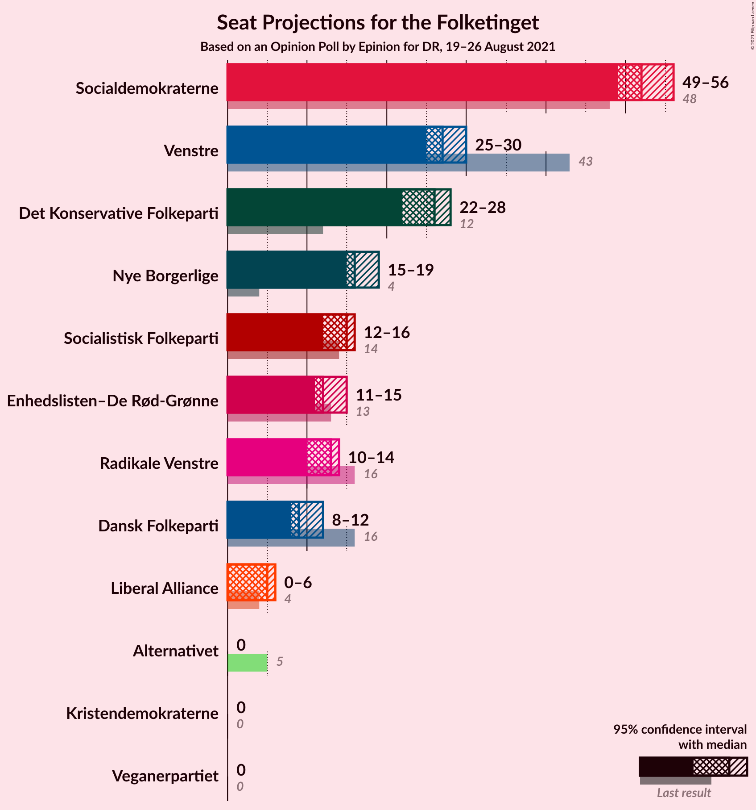
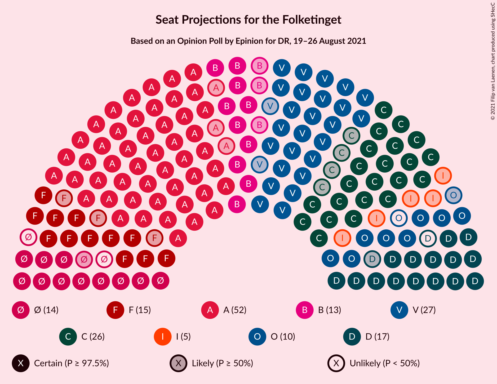
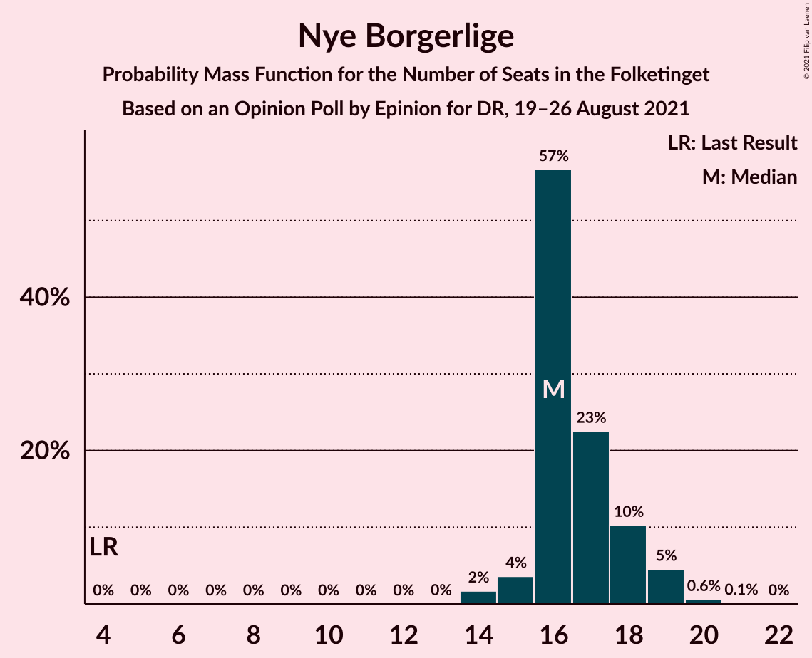
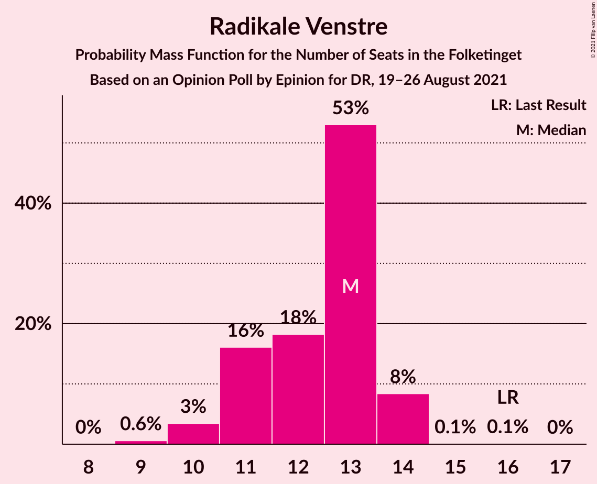
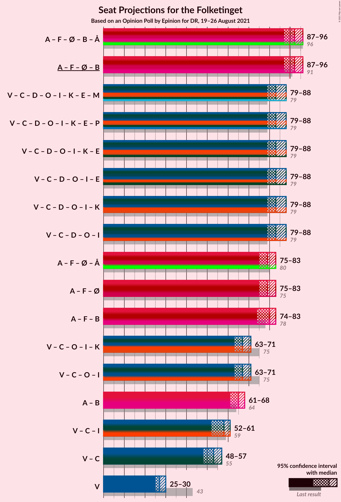
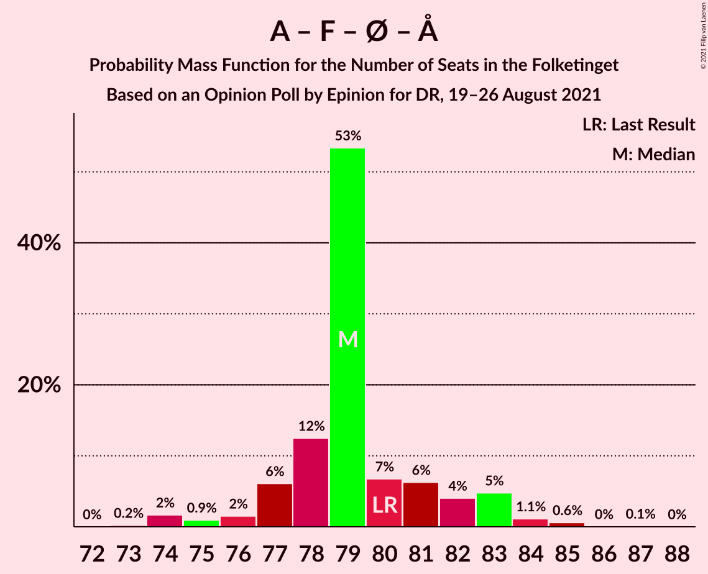
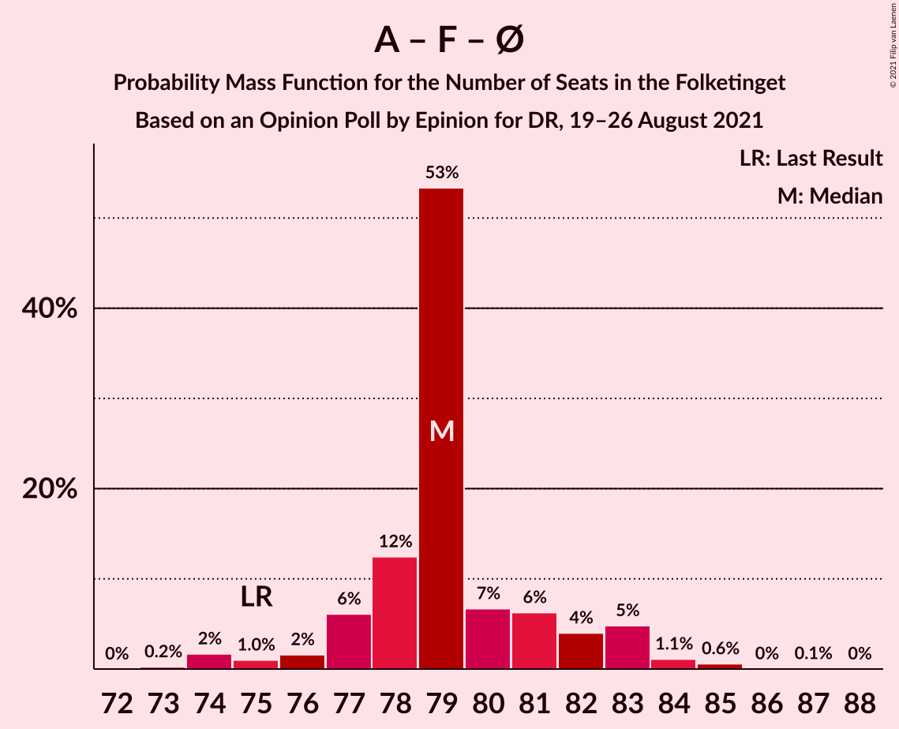

# Opinion Poll by Epinion for DR, 19–26 August 2021

<a href="#voting-intentions">Voting Intentions</a> | <a href="#seats">Seats</a> | <a href="#coalitions">Coalitions</a> | <a href="#technical-information">Technical Information</a>

## Voting Intentions

### Confidence Intervals

| Party | Last Result | Poll Result | 80% Confidence Interval | 90% Confidence Interval | 95% Confidence Interval | 99% Confidence Interval |
|:-----:|:-----------:|:-----------:|:-----------------------:|:-----------------------:|:-----------------------:|:-----------------------:|
| Socialdemokraterne | 25.9% | 28.6% | 27.2–30.1% |26.8–30.5% |26.5–30.9% |25.8–31.6% |
| Venstre | 23.4% | 15.2% | 14.1–16.4% |13.8–16.7% |13.5–17.0% |13.0–17.6% |
| Det Konservative Folkeparti | 6.6% | 13.6% | 12.6–14.8% |12.3–15.1% |12.0–15.4% |11.5–15.9% |
| Nye Borgerlige | 2.4% | 9.3% | 8.4–10.3% |8.2–10.5% |8.0–10.8% |7.6–11.3% |
| Socialistisk Folkeparti | 7.7% | 7.8% | 7.0–8.7% |6.8–9.0% |6.6–9.2% |6.2–9.7% |
| Enhedslisten–De Rød-Grønne | 6.9% | 7.1% | 6.3–8.0% |6.1–8.2% |5.9–8.4% |5.6–8.9% |
| Radikale Venstre | 8.6% | 6.4% | 5.7–7.3% |5.5–7.5% |5.3–7.7% |5.0–8.1% |
| Dansk Folkeparti | 8.7% | 5.5% | 4.8–6.3% |4.6–6.5% |4.5–6.7% |4.2–7.1% |
| Liberal Alliance | 2.3% | 2.3% | 1.9–2.9% |1.8–3.0% |1.7–3.2% |1.5–3.5% |
| Alternativet | 3.0% | 1.3% | 1.0–1.7% |0.9–1.8% |0.8–2.0% |0.7–2.2% |
| Kristendemokraterne | 1.7% | 1.2% | 0.9–1.6% |0.9–1.8% |0.8–1.9% |0.7–2.1% |
| Veganerpartiet | 0.0% | 0.3% | 0.2–0.6% |0.2–0.6% |0.1–0.7% |0.1–0.9% |

*Note:* The poll result column reflects the actual value used in the calculations. Published results may vary slightly, and in addition be rounded to fewer digits.

## Seats

### Confidence Intervals

| Party | Last Result | Median | 80% Confidence Interval | 90% Confidence Interval | 95% Confidence Interval | 99% Confidence Interval |
|:-----:|:-----------:|:------:|:-----------------------:|:-----------------------:|:-----------------------:|:-----------------------:|
| <a href="#socialdemokraterne">Socialdemokraterne</a> | 48 | 51 | 49–52 |49–52 |49–53 |47–58 |
| <a href="#venstre">Venstre</a> | 43 | 28 | 27–29 |26–31 |26–31 |24–31 |
| <a href="#det-konservative-folkeparti">Det Konservative Folkeparti</a> | 12 | 25 | 25–27 |24–28 |24–28 |22–29 |
| <a href="#nye-borgerlige">Nye Borgerlige</a> | 4 | 17 | 17–18 |15–19 |14–19 |14–19 |
| <a href="#socialistisk-folkeparti">Socialistisk Folkeparti</a> | 14 | 14 | 14–17 |11–17 |11–18 |11–18 |
| <a href="#enhedslisten–de-rød-grønne">Enhedslisten–De Rød-Grønne</a> | 13 | 13 | 12–13 |12–14 |12–15 |10–16 |
| <a href="#radikale-venstre">Radikale Venstre</a> | 16 | 12 | 12–13 |12–14 |11–14 |9–14 |
| <a href="#dansk-folkeparti">Dansk Folkeparti</a> | 16 | 10 | 9–11 |9–12 |9–12 |7–13 |
| <a href="#liberal-alliance">Liberal Alliance</a> | 4 | 5 | 0–5 |0–5 |0–5 |0–5 |
| <a href="#alternativet">Alternativet</a> | 5 | 0 | 0 |0 |0 |0–4 |
| <a href="#kristendemokraterne">Kristendemokraterne</a> | 0 | 0 | 0 |0 |0 |0 |
| <a href="#veganerpartiet">Veganerpartiet</a> | 0 | 0 | 0 |0 |0 |0 |

### Socialdemokraterne

*For a full overview of the results for this party, see the [Socialdemokraterne](party-socialdemokraterne.html) page.*

| Number of Seats | Probability | Accumulated | Special Marks |
|:---------------:|:-----------:|:-----------:|:-------------:|
| 46 | 0.1% | 100% |  |
| 47 | 0.4% | 99.9% |  |
| 48 | 0.4% | 99.4% | Last Result |
| 49 | 12% | 99.0% |  |
| 50 | 3% | 87% |  |
| 51 | 71% | 83% | Median |
| 52 | 9% | 12% |  |
| 53 | 2% | 4% |  |
| 54 | 0.3% | 2% |  |
| 55 | 0.2% | 1.3% |  |
| 56 | 0.1% | 1.1% |  |
| 57 | 0.1% | 1.0% |  |
| 58 | 0.8% | 0.9% |  |
| 59 | 0% | 0% |  |

### Venstre

*For a full overview of the results for this party, see the [Venstre](party-venstre.html) page.*

| Number of Seats | Probability | Accumulated | Special Marks |
|:---------------:|:-----------:|:-----------:|:-------------:|
| 23 | 0.1% | 100% |  |
| 24 | 1.1% | 99.9% |  |
| 25 | 0.6% | 98.8% |  |
| 26 | 7% | 98% |  |
| 27 | 8% | 91% |  |
| 28 | 68% | 84% | Median |
| 29 | 7% | 16% |  |
| 30 | 2% | 8% |  |
| 31 | 6% | 6% |  |
| 32 | 0.1% | 0.1% |  |
| 33 | 0% | 0% |  |
| 34 | 0% | 0% |  |
| 35 | 0% | 0% |  |
| 36 | 0% | 0% |  |
| 37 | 0% | 0% |  |
| 38 | 0% | 0% |  |
| 39 | 0% | 0% |  |
| 40 | 0% | 0% |  |
| 41 | 0% | 0% |  |
| 42 | 0% | 0% |  |
| 43 | 0% | 0% | Last Result |

### Det Konservative Folkeparti

*For a full overview of the results for this party, see the [Det Konservative Folkeparti](party-detkonservativefolkeparti.html) page.*

| Number of Seats | Probability | Accumulated | Special Marks |
|:---------------:|:-----------:|:-----------:|:-------------:|
| 12 | 0% | 100% | Last Result |
| 13 | 0% | 100% |  |
| 14 | 0% | 100% |  |
| 15 | 0% | 100% |  |
| 16 | 0% | 100% |  |
| 17 | 0% | 100% |  |
| 18 | 0% | 100% |  |
| 19 | 0% | 100% |  |
| 20 | 0% | 100% |  |
| 21 | 0.2% | 100% |  |
| 22 | 1.1% | 99.8% |  |
| 23 | 0.8% | 98.6% |  |
| 24 | 6% | 98% |  |
| 25 | 75% | 92% | Median |
| 26 | 1.4% | 17% |  |
| 27 | 8% | 16% |  |
| 28 | 7% | 8% |  |
| 29 | 1.1% | 1.2% |  |
| 30 | 0.1% | 0.1% |  |
| 31 | 0% | 0% |  |

### Nye Borgerlige

*For a full overview of the results for this party, see the [Nye Borgerlige](party-nyeborgerlige.html) page.*

| Number of Seats | Probability | Accumulated | Special Marks |
|:---------------:|:-----------:|:-----------:|:-------------:|
| 4 | 0% | 100% | Last Result |
| 5 | 0% | 100% |  |
| 6 | 0% | 100% |  |
| 7 | 0% | 100% |  |
| 8 | 0% | 100% |  |
| 9 | 0% | 100% |  |
| 10 | 0% | 100% |  |
| 11 | 0% | 100% |  |
| 12 | 0% | 100% |  |
| 13 | 0.1% | 100% |  |
| 14 | 4% | 99.9% |  |
| 15 | 1.3% | 96% |  |
| 16 | 3% | 95% |  |
| 17 | 73% | 92% | Median |
| 18 | 13% | 19% |  |
| 19 | 6% | 6% |  |
| 20 | 0.1% | 0.3% |  |
| 21 | 0.1% | 0.2% |  |
| 22 | 0% | 0% |  |

### Socialistisk Folkeparti

*For a full overview of the results for this party, see the [Socialistisk Folkeparti](party-socialistiskfolkeparti.html) page.*

| Number of Seats | Probability | Accumulated | Special Marks |
|:---------------:|:-----------:|:-----------:|:-------------:|
| 11 | 5% | 100% |  |
| 12 | 0.5% | 95% |  |
| 13 | 3% | 94% |  |
| 14 | 71% | 91% | Last Result, Median |
| 15 | 1.4% | 20% |  |
| 16 | 3% | 19% |  |
| 17 | 12% | 16% |  |
| 18 | 3% | 3% |  |
| 19 | 0% | 0% |  |

### Enhedslisten–De Rød-Grønne

*For a full overview of the results for this party, see the [Enhedslisten–De Rød-Grønne](party-enhedslisten–derød-grønne.html) page.*

| Number of Seats | Probability | Accumulated | Special Marks |
|:---------------:|:-----------:|:-----------:|:-------------:|
| 10 | 0.5% | 100% |  |
| 11 | 0.6% | 99.4% |  |
| 12 | 15% | 98.8% |  |
| 13 | 77% | 84% | Last Result, Median |
| 14 | 3% | 7% |  |
| 15 | 3% | 4% |  |
| 16 | 0.9% | 1.0% |  |
| 17 | 0.1% | 0.1% |  |
| 18 | 0% | 0% |  |

### Radikale Venstre

*For a full overview of the results for this party, see the [Radikale Venstre](party-radikalevenstre.html) page.*

| Number of Seats | Probability | Accumulated | Special Marks |
|:---------------:|:-----------:|:-----------:|:-------------:|
| 8 | 0.1% | 100% |  |
| 9 | 0.5% | 99.9% |  |
| 10 | 0.8% | 99.5% |  |
| 11 | 2% | 98.7% |  |
| 12 | 79% | 97% | Median |
| 13 | 12% | 18% |  |
| 14 | 6% | 6% |  |
| 15 | 0% | 0% |  |
| 16 | 0% | 0% | Last Result |

### Dansk Folkeparti

*For a full overview of the results for this party, see the [Dansk Folkeparti](party-danskfolkeparti.html) page.*

| Number of Seats | Probability | Accumulated | Special Marks |
|:---------------:|:-----------:|:-----------:|:-------------:|
| 7 | 1.4% | 100% |  |
| 8 | 0.2% | 98.6% |  |
| 9 | 12% | 98% |  |
| 10 | 70% | 87% | Median |
| 11 | 7% | 16% |  |
| 12 | 9% | 10% |  |
| 13 | 0.4% | 0.6% |  |
| 14 | 0.2% | 0.2% |  |
| 15 | 0% | 0% |  |
| 16 | 0% | 0% | Last Result |

### Liberal Alliance

*For a full overview of the results for this party, see the [Liberal Alliance](party-liberalalliance.html) page.*

| Number of Seats | Probability | Accumulated | Special Marks |
|:---------------:|:-----------:|:-----------:|:-------------:|
| 0 | 19% | 100% |  |
| 1 | 0% | 81% |  |
| 2 | 0% | 81% |  |
| 3 | 0% | 81% |  |
| 4 | 9% | 81% | Last Result |
| 5 | 72% | 72% | Median |
| 6 | 0.2% | 0.3% |  |
| 7 | 0.1% | 0.1% |  |
| 8 | 0% | 0% |  |

### Alternativet

*For a full overview of the results for this party, see the [Alternativet](party-alternativet.html) page.*

| Number of Seats | Probability | Accumulated | Special Marks |
|:---------------:|:-----------:|:-----------:|:-------------:|
| 0 | 98.9% | 100% | Median |
| 1 | 0% | 1.1% |  |
| 2 | 0% | 1.1% |  |
| 3 | 0% | 1.1% |  |
| 4 | 1.1% | 1.1% |  |
| 5 | 0% | 0% | Last Result |

### Kristendemokraterne

*For a full overview of the results for this party, see the [Kristendemokraterne](party-kristendemokraterne.html) page.*

| Number of Seats | Probability | Accumulated | Special Marks |
|:---------------:|:-----------:|:-----------:|:-------------:|
| 0 | 99.7% | 100% | Last Result, Median |
| 1 | 0% | 0.3% |  |
| 2 | 0% | 0.3% |  |
| 3 | 0% | 0.3% |  |
| 4 | 0.3% | 0.3% |  |
| 5 | 0% | 0% |  |

### Veganerpartiet

*For a full overview of the results for this party, see the [Veganerpartiet](party-veganerpartiet.html) page.*

| Number of Seats | Probability | Accumulated | Special Marks |
|:---------------:|:-----------:|:-----------:|:-------------:|
| 0 | 100% | 100% | Last Result, Median |

## Coalitions

### Confidence Intervals

| Coalition | Last Result | Median | Majority? | 80% Confidence Interval | 90% Confidence Interval | 95% Confidence Interval | 99% Confidence Interval |
|:---------:|:-----------:|:------:|:---------:|:-----------------------:|:-----------------------:|:-----------------------:|:-----------------------:|
| Socialdemokraterne – Socialistisk Folkeparti – Enhedslisten–De Rød-Grønne – Radikale Venstre – Alternativet | 96 | 90 | 94% | 90–92 | 89–95 | 89–95 | 87–99 |
| Socialdemokraterne – Socialistisk Folkeparti – Enhedslisten–De Rød-Grønne – Radikale Venstre | 91 | 90 | 93% | 90–92 | 89–95 | 88–95 | 86–99 |
| Venstre – Det Konservative Folkeparti – Nye Borgerlige – Dansk Folkeparti – Liberal Alliance – Kristendemokraterne | 79 | 85 | 0% | 83–85 | 80–86 | 80–86 | 76–88 |
| Venstre – Det Konservative Folkeparti – Nye Borgerlige – Dansk Folkeparti – Liberal Alliance | 79 | 85 | 0% | 83–85 | 80–86 | 80–86 | 76–88 |
| Socialdemokraterne – Socialistisk Folkeparti – Radikale Venstre | 78 | 77 | 0% | 77–79 | 76–83 | 75–83 | 73–87 |
| Socialdemokraterne – Socialistisk Folkeparti – Enhedslisten–De Rød-Grønne – Alternativet | 80 | 78 | 0% | 78–79 | 75–82 | 75–82 | 75–87 |
| Socialdemokraterne – Socialistisk Folkeparti – Enhedslisten–De Rød-Grønne | 75 | 78 | 0% | 78–79 | 75–82 | 75–82 | 73–87 |
| Venstre – Det Konservative Folkeparti – Dansk Folkeparti – Liberal Alliance – Kristendemokraterne | 75 | 68 | 0% | 66–68 | 63–68 | 62–69 | 62–70 |
| Venstre – Det Konservative Folkeparti – Dansk Folkeparti – Liberal Alliance | 75 | 68 | 0% | 66–68 | 63–68 | 62–69 | 62–70 |
| Socialdemokraterne – Radikale Venstre | 64 | 63 | 0% | 62–65 | 61–66 | 61–66 | 59–70 |
| Venstre – Det Konservative Folkeparti – Liberal Alliance | 59 | 58 | 0% | 54–58 | 54–58 | 53–60 | 53–60 |
| Venstre – Det Konservative Folkeparti | 55 | 53 | 0% | 53–55 | 53–56 | 51–56 | 49–56 |
| Venstre | 43 | 28 | 0% | 27–29 | 26–31 | 26–31 | 24–31 |

### Socialdemokraterne – Socialistisk Folkeparti – Enhedslisten–De Rød-Grønne – Radikale Venstre – Alternativet

| Number of Seats | Probability | Accumulated | Special Marks |
|:---------------:|:-----------:|:-----------:|:-------------:|
| 85 | 0% | 100% |  |
| 86 | 0.2% | 99.9% |  |
| 87 | 1.1% | 99.8% |  |
| 88 | 0.4% | 98.6% |  |
| 89 | 5% | 98% |  |
| 90 | 70% | 94% | Median, Majority |
| 91 | 13% | 24% |  |
| 92 | 3% | 10% |  |
| 93 | 1.3% | 7% |  |
| 94 | 0.2% | 6% |  |
| 95 | 4% | 6% |  |
| 96 | 1.3% | 2% | Last Result |
| 97 | 0% | 0.8% |  |
| 98 | 0.1% | 0.8% |  |
| 99 | 0.7% | 0.7% |  |
| 100 | 0% | 0% |  |

### Socialdemokraterne – Socialistisk Folkeparti – Enhedslisten–De Rød-Grønne – Radikale Venstre

| Number of Seats | Probability | Accumulated | Special Marks |
|:---------------:|:-----------:|:-----------:|:-------------:|
| 84 | 0.2% | 100% |  |
| 85 | 0.1% | 99.8% |  |
| 86 | 0.4% | 99.7% |  |
| 87 | 2% | 99.3% |  |
| 88 | 0.2% | 98% |  |
| 89 | 5% | 97% |  |
| 90 | 70% | 93% | Median, Majority |
| 91 | 13% | 23% | Last Result |
| 92 | 3% | 10% |  |
| 93 | 1.3% | 7% |  |
| 94 | 0.1% | 6% |  |
| 95 | 4% | 6% |  |
| 96 | 1.3% | 2% |  |
| 97 | 0% | 0.8% |  |
| 98 | 0.1% | 0.8% |  |
| 99 | 0.7% | 0.7% |  |
| 100 | 0% | 0% |  |

### Venstre – Det Konservative Folkeparti – Nye Borgerlige – Dansk Folkeparti – Liberal Alliance – Kristendemokraterne

| Number of Seats | Probability | Accumulated | Special Marks |
|:---------------:|:-----------:|:-----------:|:-------------:|
| 76 | 0.7% | 100% |  |
| 77 | 0.1% | 99.3% |  |
| 78 | 0% | 99.1% |  |
| 79 | 1.3% | 99.1% | Last Result |
| 80 | 4% | 98% |  |
| 81 | 0.3% | 94% |  |
| 82 | 1.4% | 94% |  |
| 83 | 3% | 92% |  |
| 84 | 13% | 89% |  |
| 85 | 70% | 76% | Median |
| 86 | 5% | 6% |  |
| 87 | 0.2% | 1.2% |  |
| 88 | 1.0% | 1.0% |  |
| 89 | 0% | 0% |  |

### Venstre – Det Konservative Folkeparti – Nye Borgerlige – Dansk Folkeparti – Liberal Alliance

| Number of Seats | Probability | Accumulated | Special Marks |
|:---------------:|:-----------:|:-----------:|:-------------:|
| 76 | 0.7% | 100% |  |
| 77 | 0.1% | 99.2% |  |
| 78 | 0% | 99.1% |  |
| 79 | 1.4% | 99.1% | Last Result |
| 80 | 4% | 98% |  |
| 81 | 0.5% | 94% |  |
| 82 | 1.4% | 94% |  |
| 83 | 3% | 92% |  |
| 84 | 13% | 89% |  |
| 85 | 70% | 76% | Median |
| 86 | 5% | 6% |  |
| 87 | 0.2% | 1.2% |  |
| 88 | 1.0% | 1.0% |  |
| 89 | 0% | 0% |  |

### Socialdemokraterne – Socialistisk Folkeparti – Radikale Venstre

| Number of Seats | Probability | Accumulated | Special Marks |
|:---------------:|:-----------:|:-----------:|:-------------:|
| 72 | 0.4% | 100% |  |
| 73 | 0.2% | 99.5% |  |
| 74 | 1.3% | 99.4% |  |
| 75 | 3% | 98% |  |
| 76 | 1.0% | 96% |  |
| 77 | 72% | 95% | Median |
| 78 | 10% | 22% | Last Result |
| 79 | 6% | 12% |  |
| 80 | 0.6% | 7% |  |
| 81 | 0.2% | 6% |  |
| 82 | 0% | 6% |  |
| 83 | 5% | 6% |  |
| 84 | 0% | 0.8% |  |
| 85 | 0.1% | 0.8% |  |
| 86 | 0% | 0.7% |  |
| 87 | 0.7% | 0.7% |  |
| 88 | 0% | 0% |  |

### Socialdemokraterne – Socialistisk Folkeparti – Enhedslisten–De Rød-Grønne – Alternativet

| Number of Seats | Probability | Accumulated | Special Marks |
|:---------------:|:-----------:|:-----------:|:-------------:|
| 73 | 0.1% | 100% |  |
| 74 | 0% | 99.9% |  |
| 75 | 5% | 99.8% |  |
| 76 | 0.2% | 94% |  |
| 77 | 0.9% | 94% |  |
| 78 | 74% | 93% | Median |
| 79 | 10% | 19% |  |
| 80 | 1.0% | 9% | Last Result |
| 81 | 1.4% | 8% |  |
| 82 | 5% | 7% |  |
| 83 | 0.1% | 1.3% |  |
| 84 | 0.3% | 1.2% |  |
| 85 | 0% | 0.9% |  |
| 86 | 0.1% | 0.8% |  |
| 87 | 0.7% | 0.7% |  |
| 88 | 0% | 0% |  |

### Socialdemokraterne – Socialistisk Folkeparti – Enhedslisten–De Rød-Grønne

| Number of Seats | Probability | Accumulated | Special Marks |
|:---------------:|:-----------:|:-----------:|:-------------:|
| 73 | 0.5% | 100% |  |
| 74 | 0% | 99.5% |  |
| 75 | 6% | 99.5% | Last Result |
| 76 | 0.4% | 94% |  |
| 77 | 0.5% | 93% |  |
| 78 | 74% | 93% | Median |
| 79 | 10% | 18% |  |
| 80 | 0.9% | 9% |  |
| 81 | 1.4% | 8% |  |
| 82 | 5% | 6% |  |
| 83 | 0.1% | 1.2% |  |
| 84 | 0.3% | 1.2% |  |
| 85 | 0% | 0.9% |  |
| 86 | 0.1% | 0.8% |  |
| 87 | 0.7% | 0.7% |  |
| 88 | 0% | 0% |  |

### Venstre – Det Konservative Folkeparti – Dansk Folkeparti – Liberal Alliance – Kristendemokraterne

| Number of Seats | Probability | Accumulated | Special Marks |
|:---------------:|:-----------:|:-----------:|:-------------:|
| 61 | 0.1% | 100% |  |
| 62 | 4% | 99.9% |  |
| 63 | 1.4% | 96% |  |
| 64 | 0.8% | 94% |  |
| 65 | 1.1% | 93% |  |
| 66 | 7% | 92% |  |
| 67 | 13% | 85% |  |
| 68 | 68% | 72% | Median |
| 69 | 3% | 5% |  |
| 70 | 2% | 2% |  |
| 71 | 0.4% | 0.5% |  |
| 72 | 0.1% | 0.1% |  |
| 73 | 0% | 0% |  |
| 74 | 0% | 0% |  |
| 75 | 0% | 0% | Last Result |

### Venstre – Det Konservative Folkeparti – Dansk Folkeparti – Liberal Alliance

| Number of Seats | Probability | Accumulated | Special Marks |
|:---------------:|:-----------:|:-----------:|:-------------:|
| 61 | 0.1% | 100% |  |
| 62 | 4% | 99.8% |  |
| 63 | 1.4% | 96% |  |
| 64 | 1.0% | 94% |  |
| 65 | 1.2% | 93% |  |
| 66 | 7% | 92% |  |
| 67 | 13% | 85% |  |
| 68 | 67% | 72% | Median |
| 69 | 3% | 5% |  |
| 70 | 2% | 2% |  |
| 71 | 0.4% | 0.5% |  |
| 72 | 0.1% | 0.1% |  |
| 73 | 0% | 0% |  |
| 74 | 0% | 0% |  |
| 75 | 0% | 0% | Last Result |

### Socialdemokraterne – Radikale Venstre

| Number of Seats | Probability | Accumulated | Special Marks |
|:---------------:|:-----------:|:-----------:|:-------------:|
| 57 | 0.1% | 100% |  |
| 58 | 0.4% | 99.9% |  |
| 59 | 0.2% | 99.5% |  |
| 60 | 0.9% | 99.4% |  |
| 61 | 7% | 98% |  |
| 62 | 8% | 91% |  |
| 63 | 69% | 83% | Median |
| 64 | 4% | 15% | Last Result |
| 65 | 4% | 11% |  |
| 66 | 5% | 7% |  |
| 67 | 1.4% | 2% |  |
| 68 | 0.1% | 0.9% |  |
| 69 | 0.1% | 0.8% |  |
| 70 | 0.7% | 0.8% |  |
| 71 | 0% | 0% |  |

### Venstre – Det Konservative Folkeparti – Liberal Alliance

| Number of Seats | Probability | Accumulated | Special Marks |
|:---------------:|:-----------:|:-----------:|:-------------:|
| 52 | 0.3% | 100% |  |
| 53 | 4% | 99.7% |  |
| 54 | 8% | 95% |  |
| 55 | 2% | 87% |  |
| 56 | 7% | 85% |  |
| 57 | 2% | 78% |  |
| 58 | 71% | 76% | Median |
| 59 | 0.8% | 4% | Last Result |
| 60 | 4% | 4% |  |
| 61 | 0.1% | 0.1% |  |
| 62 | 0% | 0% |  |

### Venstre – Det Konservative Folkeparti

| Number of Seats | Probability | Accumulated | Special Marks |
|:---------------:|:-----------:|:-----------:|:-------------:|
| 48 | 0.1% | 100% |  |
| 49 | 1.1% | 99.9% |  |
| 50 | 0.2% | 98.8% |  |
| 51 | 2% | 98.6% |  |
| 52 | 1.3% | 97% |  |
| 53 | 72% | 95% | Median |
| 54 | 13% | 24% |  |
| 55 | 3% | 11% | Last Result |
| 56 | 8% | 8% |  |
| 57 | 0% | 0.1% |  |
| 58 | 0% | 0.1% |  |
| 59 | 0% | 0.1% |  |
| 60 | 0.1% | 0.1% |  |
| 61 | 0% | 0% |  |

### Venstre

| Number of Seats | Probability | Accumulated | Special Marks |
|:---------------:|:-----------:|:-----------:|:-------------:|
| 23 | 0.1% | 100% |  |
| 24 | 1.1% | 99.9% |  |
| 25 | 0.6% | 98.8% |  |
| 26 | 7% | 98% |  |
| 27 | 8% | 91% |  |
| 28 | 68% | 84% | Median |
| 29 | 7% | 16% |  |
| 30 | 2% | 8% |  |
| 31 | 6% | 6% |  |
| 32 | 0.1% | 0.1% |  |
| 33 | 0% | 0% |  |
| 34 | 0% | 0% |  |
| 35 | 0% | 0% |  |
| 36 | 0% | 0% |  |
| 37 | 0% | 0% |  |
| 38 | 0% | 0% |  |
| 39 | 0% | 0% |  |
| 40 | 0% | 0% |  |
| 41 | 0% | 0% |  |
| 42 | 0% | 0% |  |
| 43 | 0% | 0% | Last Result |

## Technical Information

### Opinion Poll

+ **Polling firm:** Epinion
+ **Commissioner(s):** DR
+ **Fieldwork period:** 19–26 August 2021

### Calculations

+ **Sample size:** 1639
+ **Simulations done:** 131,072
+ **Error estimate:** 1.39%

