# Opinion Poll by Megafon for Politiken and TV 2, 23–26 August 2021

<a href="#voting-intentions">Voting Intentions</a> | <a href="#seats">Seats</a> | <a href="#coalitions">Coalitions</a> | <a href="#technical-information">Technical Information</a>

## Voting Intentions

### Confidence Intervals

| Party | Last Result | Poll Result | 80% Confidence Interval | 90% Confidence Interval | 95% Confidence Interval | 99% Confidence Interval |
|:-----:|:-----------:|:-----------:|:-----------------------:|:-----------------------:|:-----------------------:|:-----------------------:|
| Socialdemokraterne | 25.9% | 25.2% | 23.5–27.0% |23.0–27.6% |22.6–28.0% |21.8–28.9% |
| Det Konservative Folkeparti | 6.6% | 16.5% | 15.1–18.1% |14.7–18.5% |14.3–18.9% |13.7–19.7% |
| Venstre | 23.4% | 12.6% | 11.4–14.1% |11.0–14.5% |10.7–14.8% |10.1–15.5% |
| Enhedslisten–De Rød-Grønne | 6.9% | 10.2% | 9.1–11.6% |8.8–11.9% |8.5–12.3% |8.0–12.9% |
| Socialistisk Folkeparti | 7.7% | 9.5% | 8.4–10.8% |8.1–11.2% |7.9–11.5% |7.4–12.2% |
| Nye Borgerlige | 2.4% | 8.9% | 7.9–10.2% |7.6–10.5% |7.3–10.9% |6.8–11.5% |
| Dansk Folkeparti | 8.7% | 6.4% | 5.5–7.5% |5.2–7.8% |5.0–8.0% |4.6–8.6% |
| Radikale Venstre | 8.6% | 4.6% | 3.8–5.5% |3.6–5.8% |3.4–6.1% |3.1–6.5% |
| Liberal Alliance | 2.3% | 2.6% | 2.0–3.4% |1.9–3.6% |1.8–3.8% |1.5–4.2% |
| Kristendemokraterne | 1.7% | 1.8% | 1.4–2.5% |1.2–2.6% |1.1–2.8% |1.0–3.2% |
| Alternativet | 3.0% | 0.9% | 0.6–1.4% |0.5–1.6% |0.5–1.7% |0.4–2.0% |
| Veganerpartiet | 0.0% | 0.3% | 0.2–0.7% |0.1–0.8% |0.1–0.9% |0.1–1.1% |

*Note:* The poll result column reflects the actual value used in the calculations. Published results may vary slightly, and in addition be rounded to fewer digits.

## Seats

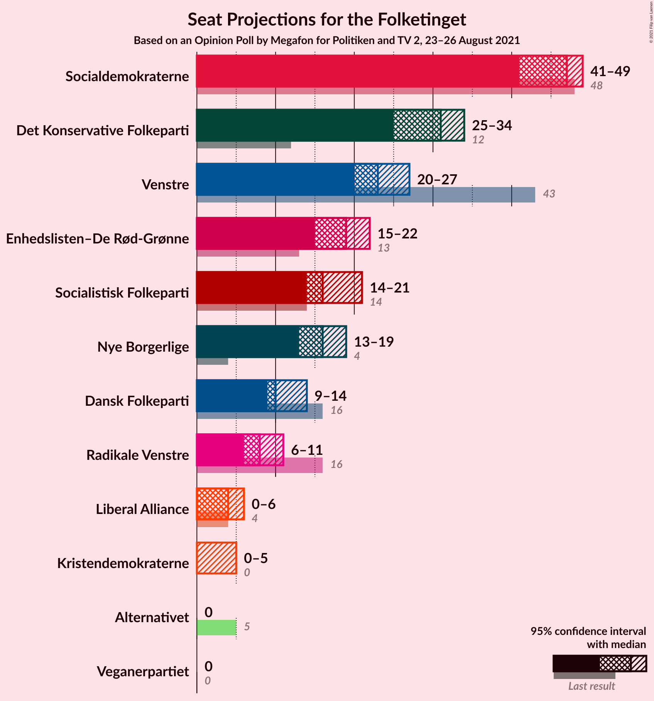

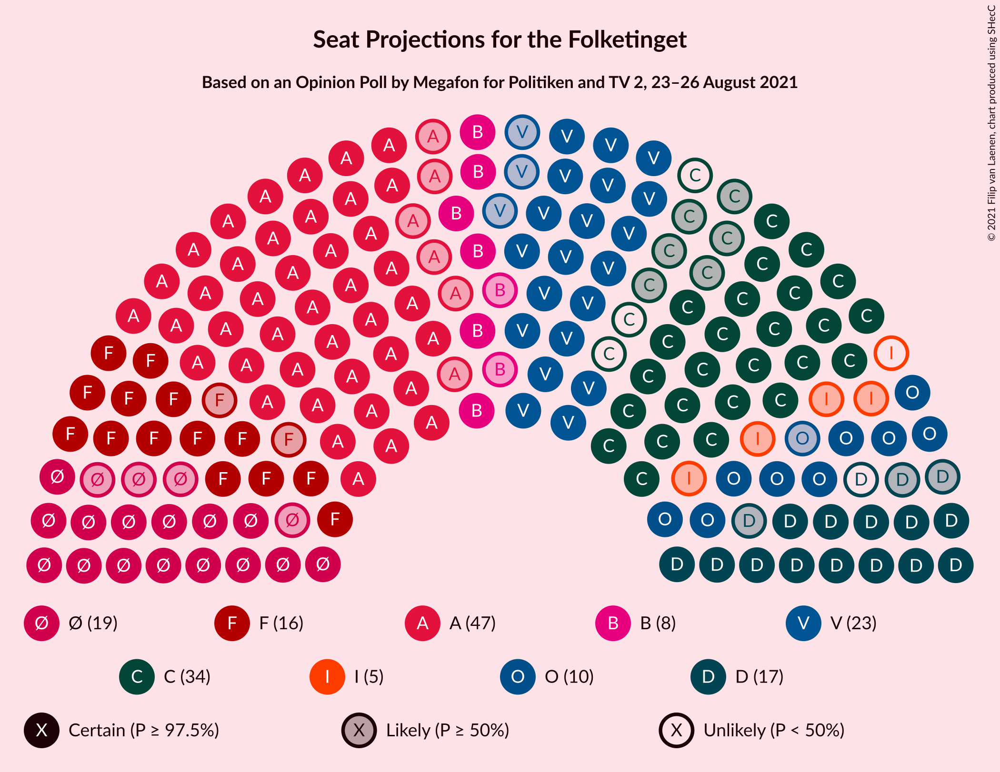

### Confidence Intervals

| Party | Last Result | Median | 80% Confidence Interval | 90% Confidence Interval | 95% Confidence Interval | 99% Confidence Interval |
|:-----:|:-----------:|:------:|:-----------------------:|:-----------------------:|:-----------------------:|:-----------------------:|
| <a href="#socialdemokraterne">Socialdemokraterne</a> | 48 | 47 | 47 |43–47 |41–47 |40–49 |
| <a href="#det-konservative-folkeparti">Det Konservative Folkeparti</a> | 12 | 31 | 31 |28–31 |27–32 |24–32 |
| <a href="#venstre">Venstre</a> | 43 | 23 | 23 |22–23 |21–25 |19–27 |
| <a href="#enhedslisten–de-rød-grønne">Enhedslisten–De Rød-Grønne</a> | 13 | 19 | 19 |19 |17–20 |16–22 |
| <a href="#socialistisk-folkeparti">Socialistisk Folkeparti</a> | 14 | 18 | 18–19 |18–19 |17–20 |16–22 |
| <a href="#nye-borgerlige">Nye Borgerlige</a> | 4 | 16 | 16–18 |16–18 |14–18 |13–21 |
| <a href="#dansk-folkeparti">Dansk Folkeparti</a> | 16 | 9 | 9 |9–11 |9–11 |9–13 |
| <a href="#radikale-venstre">Radikale Venstre</a> | 16 | 8 | 8–9 |8–9 |7–9 |7–11 |
| <a href="#liberal-alliance">Liberal Alliance</a> | 4 | 4 | 0–4 |0–5 |0–5 |0–6 |
| <a href="#kristendemokraterne">Kristendemokraterne</a> | 0 | 0 | 0 |0 |0–4 |0–5 |
| <a href="#alternativet">Alternativet</a> | 5 | 0 | 0 |0 |0 |0–4 |
| <a href="#veganerpartiet">Veganerpartiet</a> | 0 | 0 | 0 |0 |0 |0 |

### Socialdemokraterne

*For a full overview of the results for this party, see the [Socialdemokraterne](party-socialdemokraterne.html) page.*

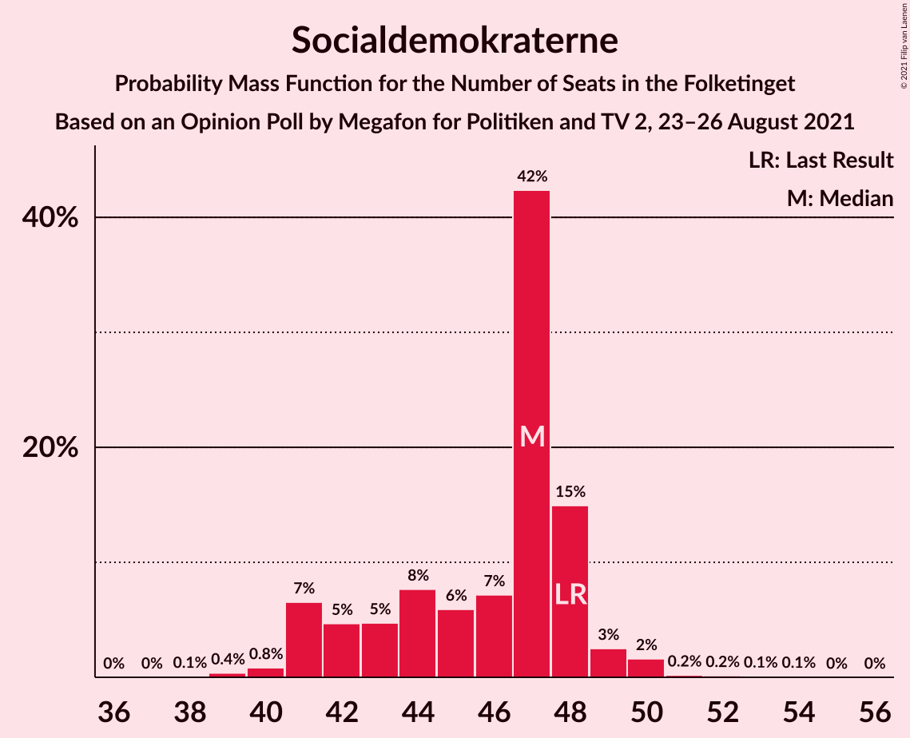

| Number of Seats | Probability | Accumulated | Special Marks |
|:---------------:|:-----------:|:-----------:|:-------------:|
| 38 | 0.1% | 100% |  |
| 39 | 0.2% | 99.9% |  |
| 40 | 0.9% | 99.7% |  |
| 41 | 2% | 98.9% |  |
| 42 | 0.8% | 96% |  |
| 43 | 0.9% | 96% |  |
| 44 | 1.3% | 95% |  |
| 45 | 0.5% | 93% |  |
| 46 | 2% | 93% |  |
| 47 | 89% | 91% | Median |
| 48 | 1.1% | 2% | Last Result |
| 49 | 0.2% | 0.7% |  |
| 50 | 0.1% | 0.5% |  |
| 51 | 0% | 0.4% |  |
| 52 | 0.3% | 0.4% |  |
| 53 | 0% | 0% |  |

### Det Konservative Folkeparti

*For a full overview of the results for this party, see the [Det Konservative Folkeparti](party-detkonservativefolkeparti.html) page.*

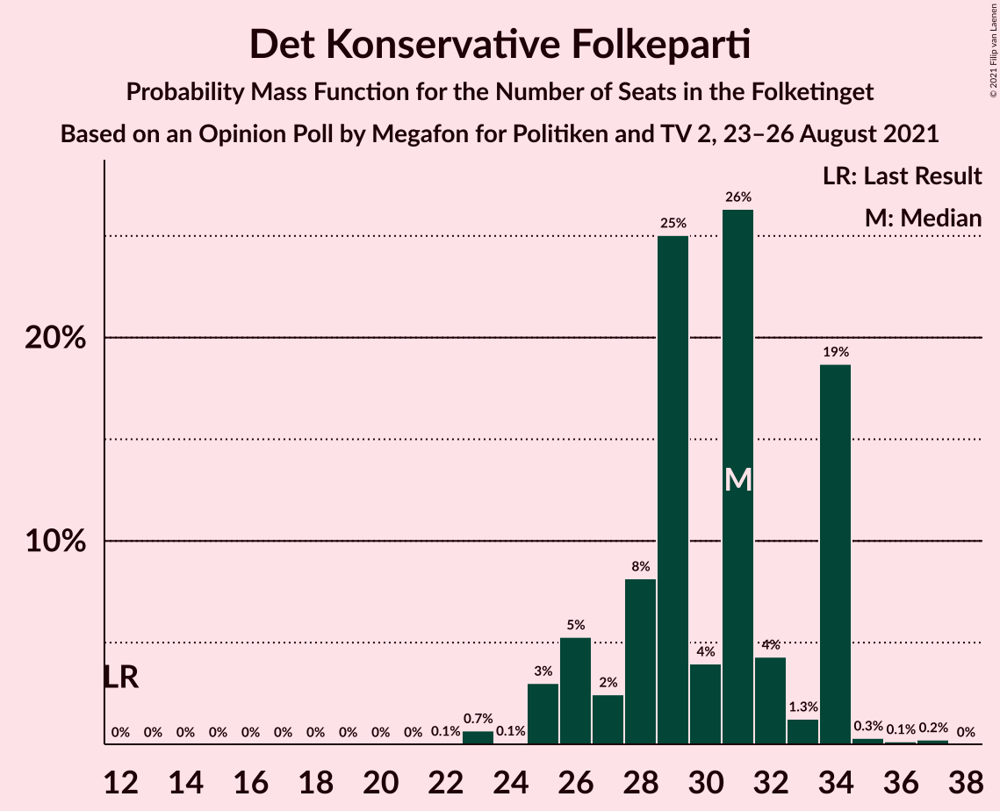

| Number of Seats | Probability | Accumulated | Special Marks |
|:---------------:|:-----------:|:-----------:|:-------------:|
| 12 | 0% | 100% | Last Result |
| 13 | 0% | 100% |  |
| 14 | 0% | 100% |  |
| 15 | 0% | 100% |  |
| 16 | 0% | 100% |  |
| 17 | 0% | 100% |  |
| 18 | 0% | 100% |  |
| 19 | 0% | 100% |  |
| 20 | 0% | 100% |  |
| 21 | 0% | 100% |  |
| 22 | 0.3% | 100% |  |
| 23 | 0.2% | 99.7% |  |
| 24 | 0.1% | 99.6% |  |
| 25 | 0.3% | 99.5% |  |
| 26 | 1.5% | 99.2% |  |
| 27 | 2% | 98% |  |
| 28 | 2% | 96% |  |
| 29 | 0.2% | 94% |  |
| 30 | 0.2% | 93% |  |
| 31 | 90% | 93% | Median |
| 32 | 4% | 4% |  |
| 33 | 0.1% | 0.2% |  |
| 34 | 0.1% | 0.1% |  |
| 35 | 0.1% | 0.1% |  |
| 36 | 0% | 0% |  |

### Venstre

*For a full overview of the results for this party, see the [Venstre](party-venstre.html) page.*

| Number of Seats | Probability | Accumulated | Special Marks |
|:---------------:|:-----------:|:-----------:|:-------------:|
| 18 | 0.2% | 100% |  |
| 19 | 0.4% | 99.8% |  |
| 20 | 0.4% | 99.4% |  |
| 21 | 2% | 99.0% |  |
| 22 | 3% | 97% |  |
| 23 | 90% | 94% | Median |
| 24 | 1.0% | 4% |  |
| 25 | 1.0% | 3% |  |
| 26 | 0.2% | 2% |  |
| 27 | 2% | 2% |  |
| 28 | 0% | 0.1% |  |
| 29 | 0% | 0.1% |  |
| 30 | 0.1% | 0.1% |  |
| 31 | 0% | 0% |  |
| 32 | 0% | 0% |  |
| 33 | 0% | 0% |  |
| 34 | 0% | 0% |  |
| 35 | 0% | 0% |  |
| 36 | 0% | 0% |  |
| 37 | 0% | 0% |  |
| 38 | 0% | 0% |  |
| 39 | 0% | 0% |  |
| 40 | 0% | 0% |  |
| 41 | 0% | 0% |  |
| 42 | 0% | 0% |  |
| 43 | 0% | 0% | Last Result |

### Enhedslisten–De Rød-Grønne

*For a full overview of the results for this party, see the [Enhedslisten–De Rød-Grønne](party-enhedslisten–derød-grønne.html) page.*

| Number of Seats | Probability | Accumulated | Special Marks |
|:---------------:|:-----------:|:-----------:|:-------------:|
| 13 | 0% | 100% | Last Result |
| 14 | 0.1% | 100% |  |
| 15 | 0.2% | 99.9% |  |
| 16 | 0.8% | 99.8% |  |
| 17 | 2% | 99.0% |  |
| 18 | 1.1% | 97% |  |
| 19 | 92% | 96% | Median |
| 20 | 3% | 5% |  |
| 21 | 0.4% | 2% |  |
| 22 | 1.1% | 2% |  |
| 23 | 0.3% | 0.4% |  |
| 24 | 0.1% | 0.1% |  |
| 25 | 0% | 0% |  |

### Socialistisk Folkeparti

*For a full overview of the results for this party, see the [Socialistisk Folkeparti](party-socialistiskfolkeparti.html) page.*

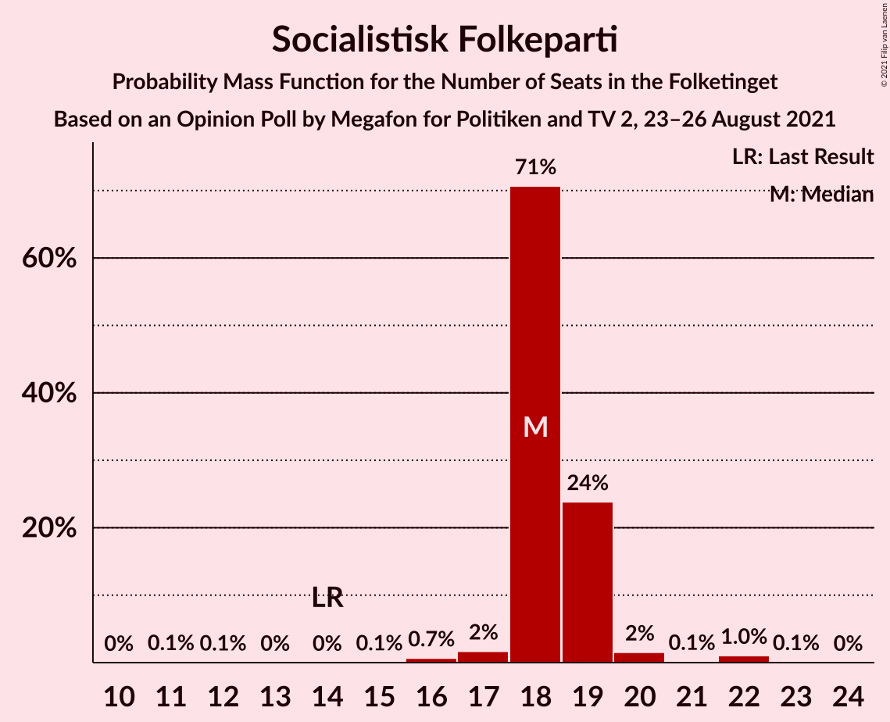

| Number of Seats | Probability | Accumulated | Special Marks |
|:---------------:|:-----------:|:-----------:|:-------------:|
| 11 | 0.1% | 100% |  |
| 12 | 0.1% | 99.9% |  |
| 13 | 0% | 99.8% |  |
| 14 | 0% | 99.8% | Last Result |
| 15 | 0.1% | 99.8% |  |
| 16 | 0.7% | 99.7% |  |
| 17 | 2% | 99.1% |  |
| 18 | 71% | 97% | Median |
| 19 | 24% | 27% |  |
| 20 | 2% | 3% |  |
| 21 | 0.1% | 1.3% |  |
| 22 | 1.0% | 1.2% |  |
| 23 | 0.1% | 0.1% |  |
| 24 | 0% | 0% |  |

### Nye Borgerlige

*For a full overview of the results for this party, see the [Nye Borgerlige](party-nyeborgerlige.html) page.*

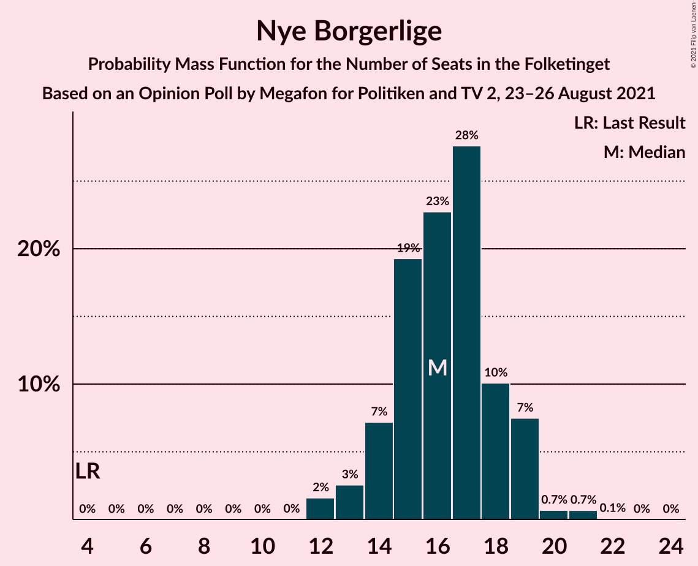

| Number of Seats | Probability | Accumulated | Special Marks |
|:---------------:|:-----------:|:-----------:|:-------------:|
| 4 | 0% | 100% | Last Result |
| 5 | 0% | 100% |  |
| 6 | 0% | 100% |  |
| 7 | 0% | 100% |  |
| 8 | 0% | 100% |  |
| 9 | 0% | 100% |  |
| 10 | 0% | 100% |  |
| 11 | 0% | 100% |  |
| 12 | 0.1% | 100% |  |
| 13 | 1.0% | 99.9% |  |
| 14 | 2% | 98.9% |  |
| 15 | 1.4% | 97% |  |
| 16 | 70% | 96% | Median |
| 17 | 3% | 26% |  |
| 18 | 22% | 23% |  |
| 19 | 0.2% | 2% |  |
| 20 | 0.7% | 1.5% |  |
| 21 | 0.6% | 0.7% |  |
| 22 | 0.2% | 0.2% |  |
| 23 | 0% | 0% |  |

### Dansk Folkeparti

*For a full overview of the results for this party, see the [Dansk Folkeparti](party-danskfolkeparti.html) page.*

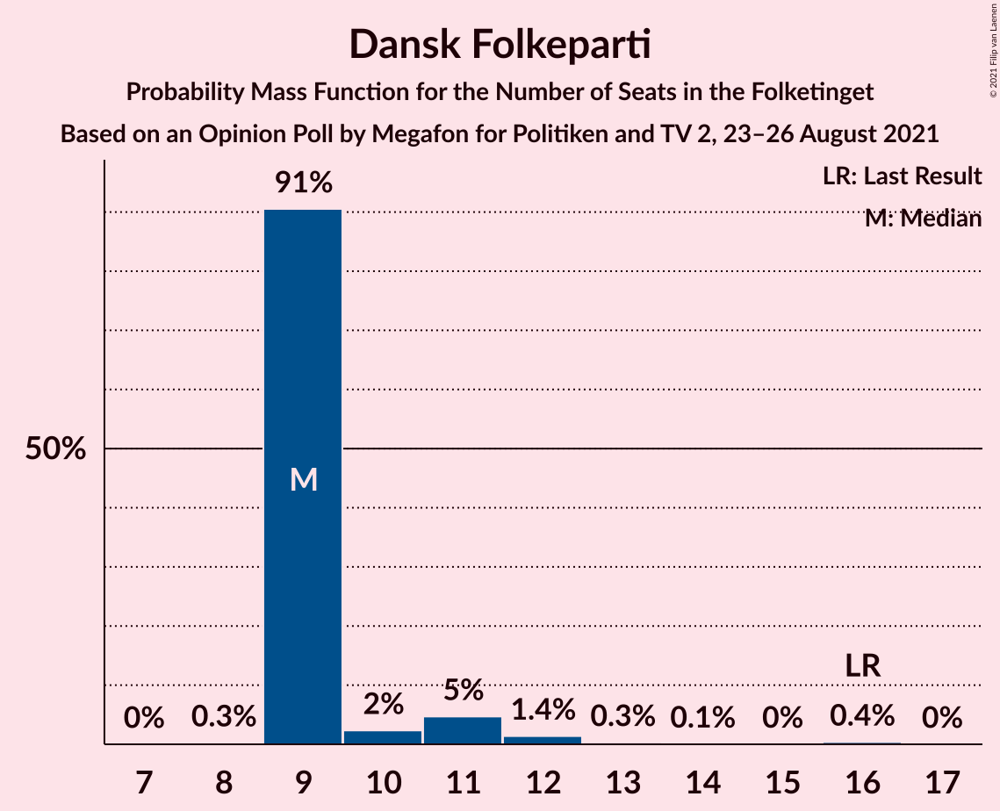

| Number of Seats | Probability | Accumulated | Special Marks |
|:---------------:|:-----------:|:-----------:|:-------------:|
| 8 | 0.3% | 100% |  |
| 9 | 91% | 99.7% | Median |
| 10 | 2% | 9% |  |
| 11 | 5% | 7% |  |
| 12 | 1.4% | 2% |  |
| 13 | 0.3% | 0.8% |  |
| 14 | 0.1% | 0.5% |  |
| 15 | 0% | 0.4% |  |
| 16 | 0.4% | 0.4% | Last Result |
| 17 | 0% | 0% |  |

### Radikale Venstre

*For a full overview of the results for this party, see the [Radikale Venstre](party-radikalevenstre.html) page.*

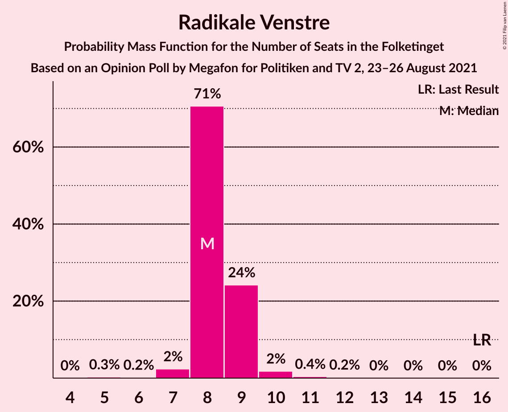

| Number of Seats | Probability | Accumulated | Special Marks |
|:---------------:|:-----------:|:-----------:|:-------------:|
| 5 | 0.3% | 100% |  |
| 6 | 0.2% | 99.7% |  |
| 7 | 2% | 99.6% |  |
| 8 | 71% | 97% | Median |
| 9 | 24% | 27% |  |
| 10 | 2% | 2% |  |
| 11 | 0.4% | 0.6% |  |
| 12 | 0.2% | 0.2% |  |
| 13 | 0% | 0% |  |
| 14 | 0% | 0% |  |
| 15 | 0% | 0% |  |
| 16 | 0% | 0% | Last Result |

### Liberal Alliance

*For a full overview of the results for this party, see the [Liberal Alliance](party-liberalalliance.html) page.*

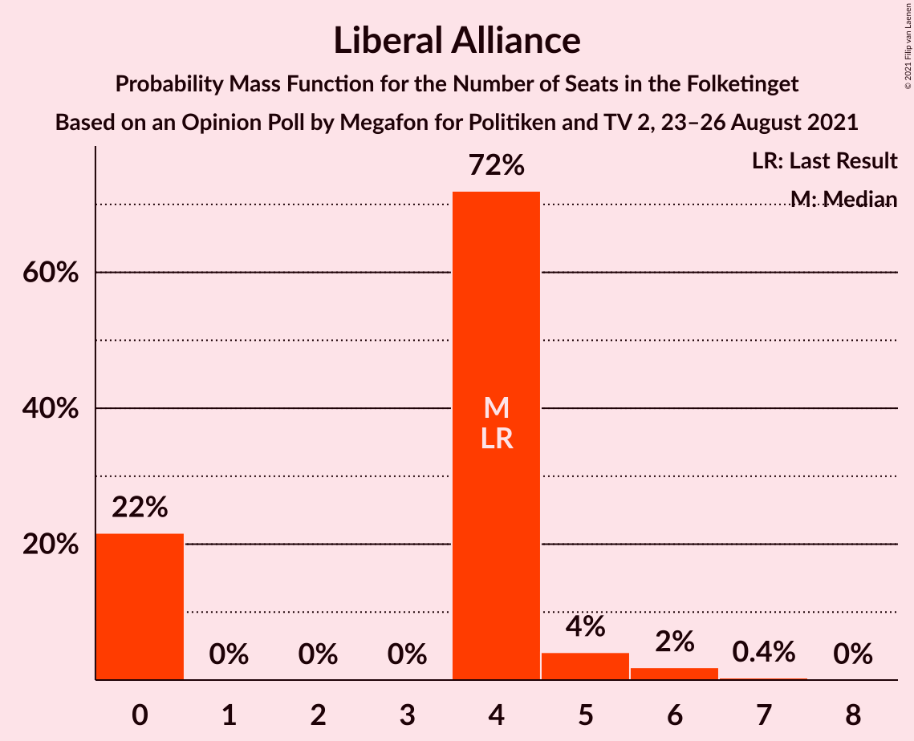

| Number of Seats | Probability | Accumulated | Special Marks |
|:---------------:|:-----------:|:-----------:|:-------------:|
| 0 | 22% | 100% |  |
| 1 | 0% | 78% |  |
| 2 | 0% | 78% |  |
| 3 | 0% | 78% |  |
| 4 | 72% | 78% | Last Result, Median |
| 5 | 4% | 6% |  |
| 6 | 2% | 2% |  |
| 7 | 0.4% | 0.4% |  |
| 8 | 0% | 0% |  |

### Kristendemokraterne

*For a full overview of the results for this party, see the [Kristendemokraterne](party-kristendemokraterne.html) page.*

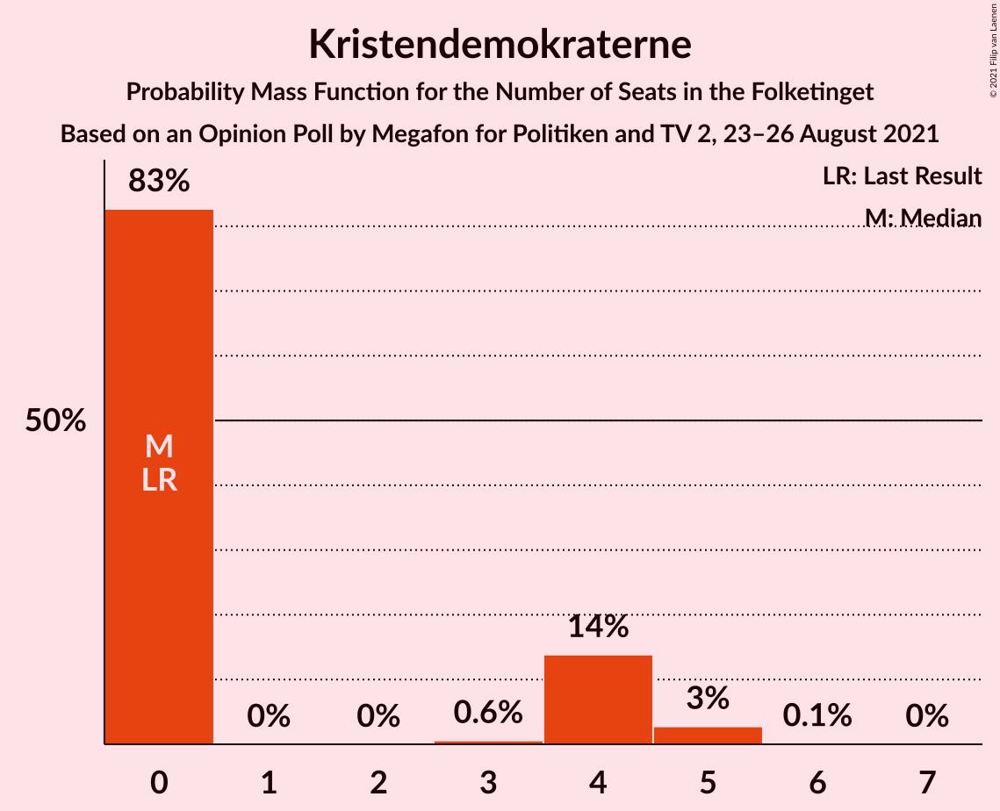

| Number of Seats | Probability | Accumulated | Special Marks |
|:---------------:|:-----------:|:-----------:|:-------------:|
| 0 | 97% | 100% | Last Result, Median |
| 1 | 0% | 3% |  |
| 2 | 0% | 3% |  |
| 3 | 0.1% | 3% |  |
| 4 | 2% | 3% |  |
| 5 | 0.4% | 0.5% |  |
| 6 | 0.1% | 0.1% |  |
| 7 | 0% | 0% |  |

### Alternativet

*For a full overview of the results for this party, see the [Alternativet](party-alternativet.html) page.*

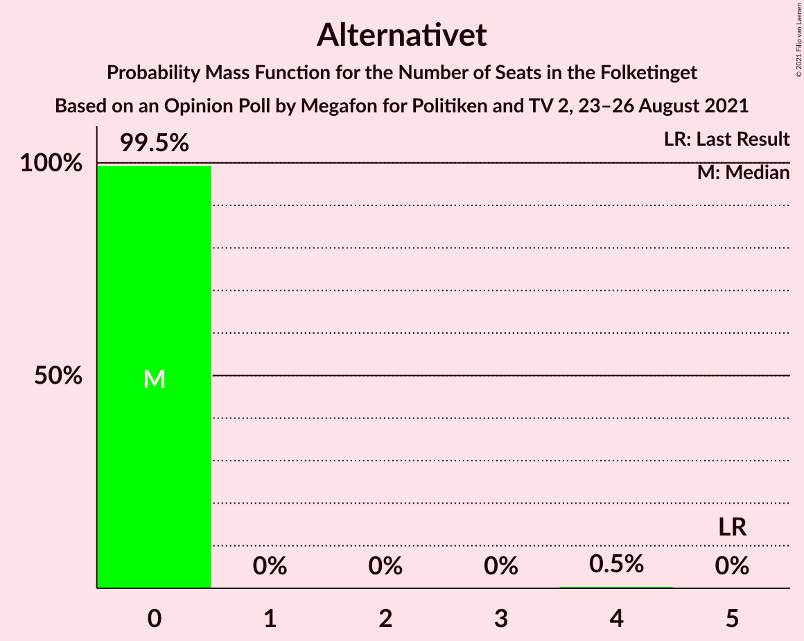

| Number of Seats | Probability | Accumulated | Special Marks |
|:---------------:|:-----------:|:-----------:|:-------------:|
| 0 | 99.2% | 100% | Median |
| 1 | 0% | 0.8% |  |
| 2 | 0% | 0.8% |  |
| 3 | 0% | 0.8% |  |
| 4 | 0.8% | 0.8% |  |
| 5 | 0% | 0% | Last Result |

### Veganerpartiet

*For a full overview of the results for this party, see the [Veganerpartiet](party-veganerpartiet.html) page.*

| Number of Seats | Probability | Accumulated | Special Marks |
|:---------------:|:-----------:|:-----------:|:-------------:|
| 0 | 100% | 100% | Last Result, Median |

## Coalitions

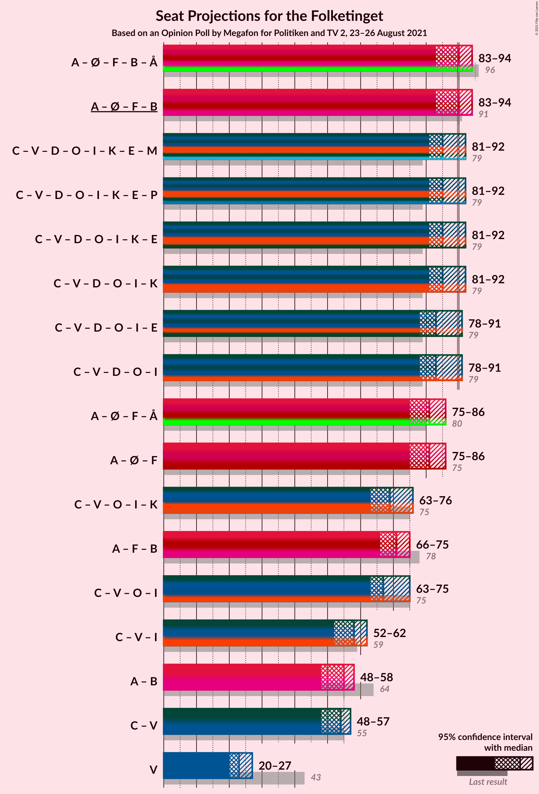

### Confidence Intervals

| Coalition | Last Result | Median | Majority? | 80% Confidence Interval | 90% Confidence Interval | 95% Confidence Interval | 99% Confidence Interval |
|:---------:|:-----------:|:------:|:---------:|:-----------------------:|:-----------------------:|:-----------------------:|:-----------------------:|
| Socialdemokraterne – Enhedslisten–De Rød-Grønne – Socialistisk Folkeparti – Radikale Venstre – Alternativet | 96 | 92 | 95% | 92–94 | 89–94 | 89–94 | 84–97 |
| Socialdemokraterne – Enhedslisten–De Rød-Grønne – Socialistisk Folkeparti – Radikale Venstre | 91 | 92 | 95% | 92–94 | 89–94 | 87–94 | 84–97 |
| Det Konservative Folkeparti – Venstre – Nye Borgerlige – Dansk Folkeparti – Liberal Alliance – Kristendemokraterne | 79 | 83 | 0.6% | 81–83 | 81–86 | 81–86 | 78–91 |
| Det Konservative Folkeparti – Venstre – Nye Borgerlige – Dansk Folkeparti – Liberal Alliance | 79 | 83 | 0% | 81–83 | 81–85 | 78–86 | 78–89 |
| Socialdemokraterne – Enhedslisten–De Rød-Grønne – Socialistisk Folkeparti – Alternativet | 80 | 84 | 0% | 84–85 | 81–85 | 80–85 | 76–87 |
| Socialdemokraterne – Enhedslisten–De Rød-Grønne – Socialistisk Folkeparti | 75 | 84 | 0% | 84–85 | 80–85 | 79–85 | 76–87 |
| Socialdemokraterne – Socialistisk Folkeparti – Radikale Venstre | 78 | 73 | 0% | 73–75 | 70–75 | 69–75 | 66–76 |
| Det Konservative Folkeparti – Venstre – Dansk Folkeparti – Liberal Alliance – Kristendemokraterne | 75 | 67 | 0% | 63–67 | 63–69 | 63–69 | 63–75 |
| Det Konservative Folkeparti – Venstre – Dansk Folkeparti – Liberal Alliance | 75 | 67 | 0% | 63–67 | 63–69 | 63–69 | 61–72 |
| Det Konservative Folkeparti – Venstre – Liberal Alliance | 59 | 58 | 0% | 54–58 | 54–58 | 53–59 | 51–60 |
| Socialdemokraterne – Radikale Venstre | 64 | 55 | 0% | 55–56 | 52–56 | 50–56 | 48–58 |
| Det Konservative Folkeparti – Venstre | 55 | 54 | 0% | 54 | 52–54 | 49–54 | 45–55 |
| Venstre | 43 | 23 | 0% | 23 | 22–23 | 21–25 | 19–27 |

### Socialdemokraterne – Enhedslisten–De Rød-Grønne – Socialistisk Folkeparti – Radikale Venstre – Alternativet

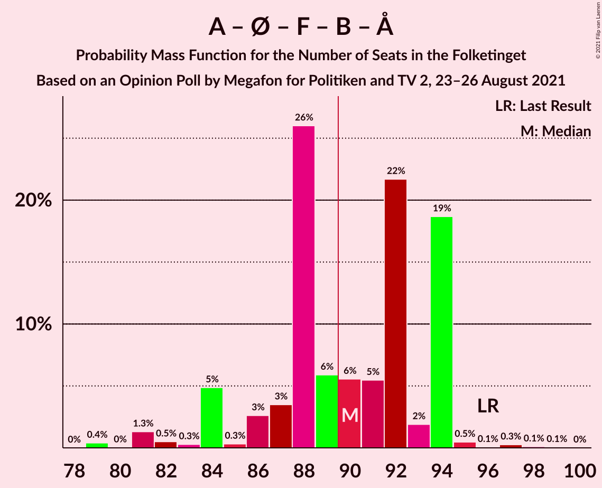

| Number of Seats | Probability | Accumulated | Special Marks |
|:---------------:|:-----------:|:-----------:|:-------------:|
| 82 | 0.4% | 100% |  |
| 83 | 0% | 99.6% |  |
| 84 | 0.1% | 99.6% |  |
| 85 | 0% | 99.5% |  |
| 86 | 0.3% | 99.4% |  |
| 87 | 1.0% | 99.2% |  |
| 88 | 0.2% | 98% |  |
| 89 | 3% | 98% |  |
| 90 | 1.5% | 95% | Majority |
| 91 | 0.5% | 93% |  |
| 92 | 69% | 93% | Median |
| 93 | 1.4% | 24% |  |
| 94 | 21% | 23% |  |
| 95 | 0.2% | 1.4% |  |
| 96 | 0.1% | 1.3% | Last Result |
| 97 | 0.9% | 1.1% |  |
| 98 | 0% | 0.2% |  |
| 99 | 0.2% | 0.2% |  |
| 100 | 0% | 0% |  |

### Socialdemokraterne – Enhedslisten–De Rød-Grønne – Socialistisk Folkeparti – Radikale Venstre

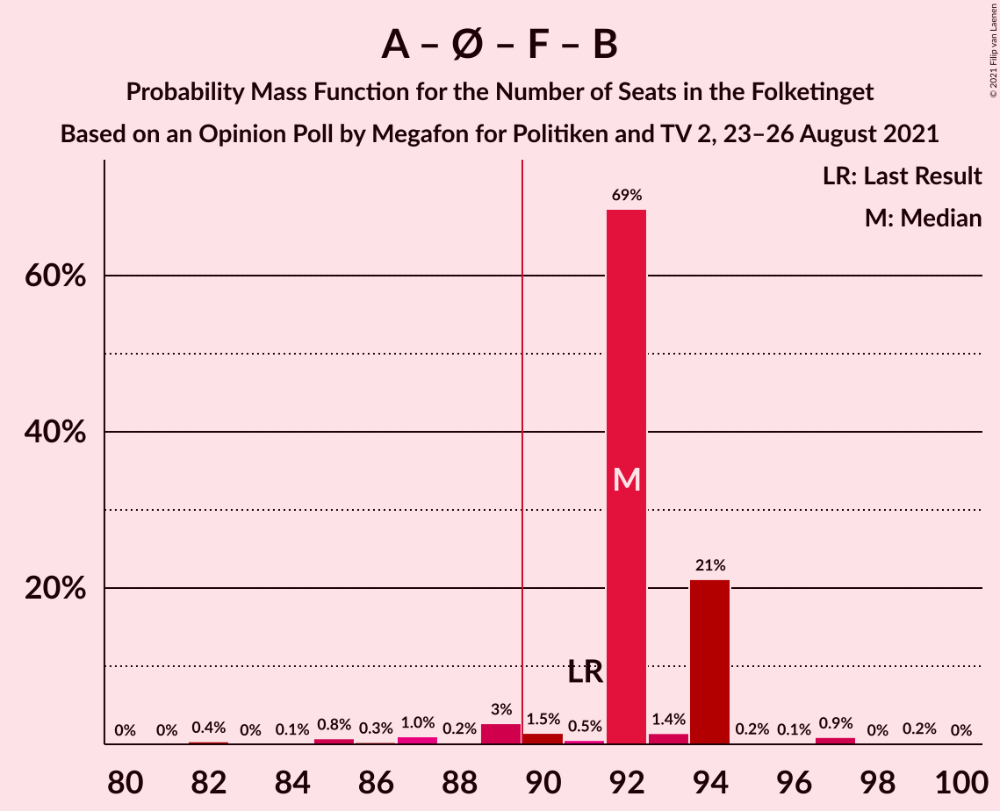

| Number of Seats | Probability | Accumulated | Special Marks |
|:---------------:|:-----------:|:-----------:|:-------------:|
| 82 | 0.4% | 100% |  |
| 83 | 0% | 99.6% |  |
| 84 | 0.1% | 99.6% |  |
| 85 | 0.8% | 99.5% |  |
| 86 | 0.3% | 98.7% |  |
| 87 | 1.0% | 98% |  |
| 88 | 0.2% | 97% |  |
| 89 | 3% | 97% |  |
| 90 | 1.5% | 95% | Majority |
| 91 | 0.5% | 93% | Last Result |
| 92 | 69% | 93% | Median |
| 93 | 1.4% | 24% |  |
| 94 | 21% | 23% |  |
| 95 | 0.2% | 1.4% |  |
| 96 | 0.1% | 1.2% |  |
| 97 | 0.9% | 1.1% |  |
| 98 | 0% | 0.2% |  |
| 99 | 0.2% | 0.2% |  |
| 100 | 0% | 0% |  |

### Det Konservative Folkeparti – Venstre – Nye Borgerlige – Dansk Folkeparti – Liberal Alliance – Kristendemokraterne

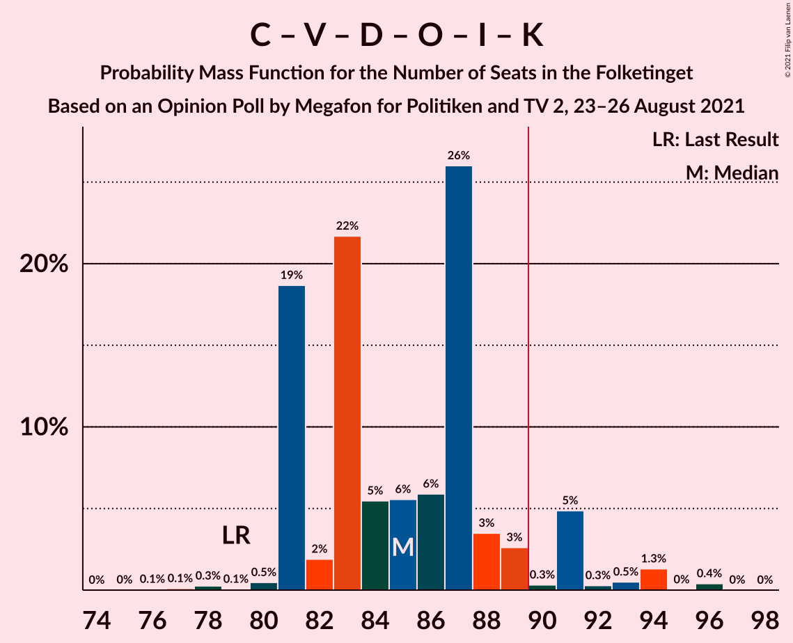

| Number of Seats | Probability | Accumulated | Special Marks |
|:---------------:|:-----------:|:-----------:|:-------------:|
| 76 | 0.2% | 100% |  |
| 77 | 0% | 99.8% |  |
| 78 | 0.9% | 99.8% |  |
| 79 | 0.1% | 98.9% | Last Result |
| 80 | 0.2% | 98.7% |  |
| 81 | 21% | 98.6% |  |
| 82 | 1.4% | 77% |  |
| 83 | 69% | 76% | Median |
| 84 | 0.5% | 7% |  |
| 85 | 1.5% | 7% |  |
| 86 | 3% | 5% |  |
| 87 | 0.2% | 2% |  |
| 88 | 1.0% | 2% |  |
| 89 | 0.3% | 0.8% |  |
| 90 | 0% | 0.6% | Majority |
| 91 | 0.1% | 0.5% |  |
| 92 | 0% | 0.4% |  |
| 93 | 0.4% | 0.4% |  |
| 94 | 0% | 0% |  |

### Det Konservative Folkeparti – Venstre – Nye Borgerlige – Dansk Folkeparti – Liberal Alliance

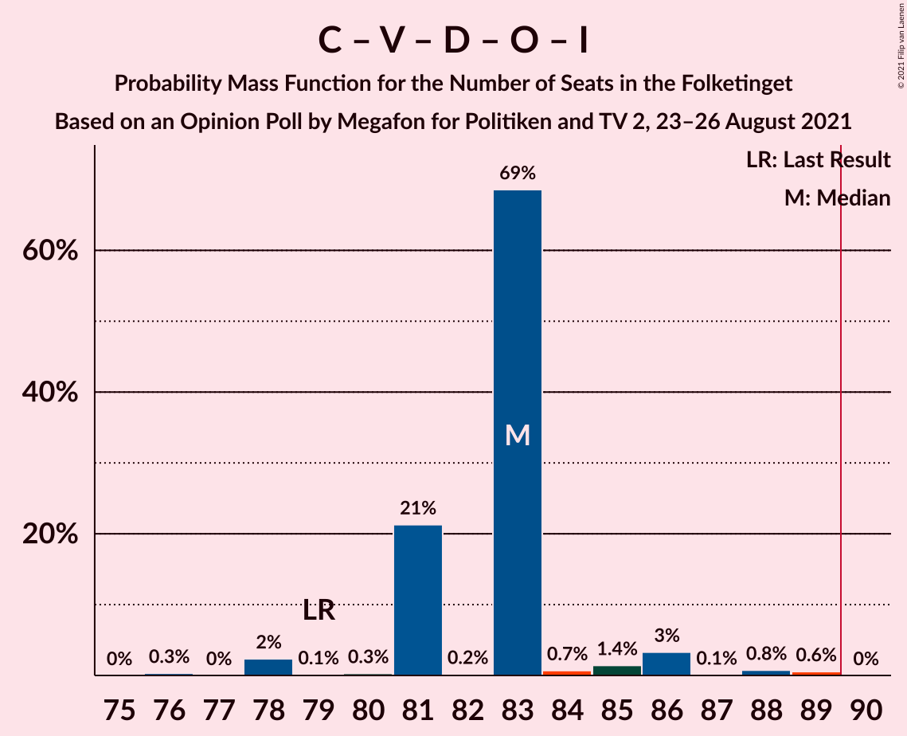

| Number of Seats | Probability | Accumulated | Special Marks |
|:---------------:|:-----------:|:-----------:|:-------------:|
| 76 | 0.3% | 100% |  |
| 77 | 0% | 99.7% |  |
| 78 | 2% | 99.7% |  |
| 79 | 0.1% | 97% | Last Result |
| 80 | 0.3% | 97% |  |
| 81 | 21% | 97% |  |
| 82 | 0.2% | 76% |  |
| 83 | 69% | 75% | Median |
| 84 | 0.7% | 7% |  |
| 85 | 1.4% | 6% |  |
| 86 | 3% | 5% |  |
| 87 | 0.1% | 1.4% |  |
| 88 | 0.8% | 1.3% |  |
| 89 | 0.6% | 0.6% |  |
| 90 | 0% | 0% | Majority |

### Socialdemokraterne – Enhedslisten–De Rød-Grønne – Socialistisk Folkeparti – Alternativet

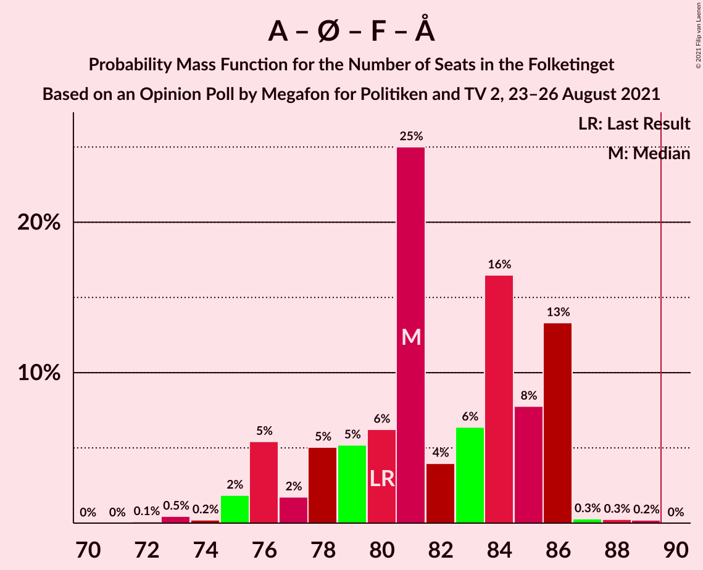

| Number of Seats | Probability | Accumulated | Special Marks |
|:---------------:|:-----------:|:-----------:|:-------------:|
| 74 | 0.1% | 100% |  |
| 75 | 0.3% | 99.9% |  |
| 76 | 0.2% | 99.5% |  |
| 77 | 0.3% | 99.3% |  |
| 78 | 0.6% | 99.1% |  |
| 79 | 0.3% | 98% |  |
| 80 | 3% | 98% | Last Result |
| 81 | 1.0% | 95% |  |
| 82 | 0.2% | 94% |  |
| 83 | 1.5% | 94% |  |
| 84 | 69% | 93% | Median |
| 85 | 22% | 24% |  |
| 86 | 0.2% | 1.5% |  |
| 87 | 0.9% | 1.3% |  |
| 88 | 0% | 0.3% |  |
| 89 | 0.3% | 0.3% |  |
| 90 | 0% | 0% | Majority |

### Socialdemokraterne – Enhedslisten–De Rød-Grønne – Socialistisk Folkeparti

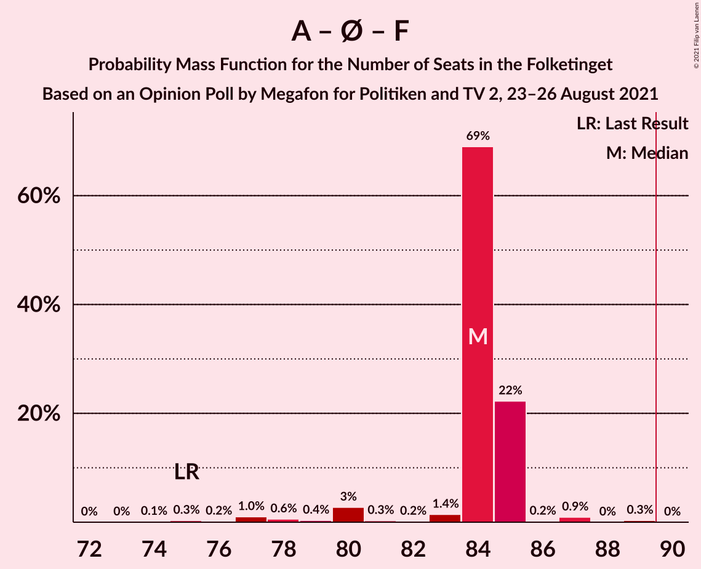

| Number of Seats | Probability | Accumulated | Special Marks |
|:---------------:|:-----------:|:-----------:|:-------------:|
| 74 | 0.1% | 100% |  |
| 75 | 0.3% | 99.8% | Last Result |
| 76 | 0.2% | 99.5% |  |
| 77 | 1.0% | 99.3% |  |
| 78 | 0.6% | 98% |  |
| 79 | 0.4% | 98% |  |
| 80 | 3% | 97% |  |
| 81 | 0.3% | 95% |  |
| 82 | 0.2% | 94% |  |
| 83 | 1.4% | 94% |  |
| 84 | 69% | 93% | Median |
| 85 | 22% | 24% |  |
| 86 | 0.2% | 1.4% |  |
| 87 | 0.9% | 1.3% |  |
| 88 | 0% | 0.3% |  |
| 89 | 0.3% | 0.3% |  |
| 90 | 0% | 0% | Majority |

### Socialdemokraterne – Socialistisk Folkeparti – Radikale Venstre

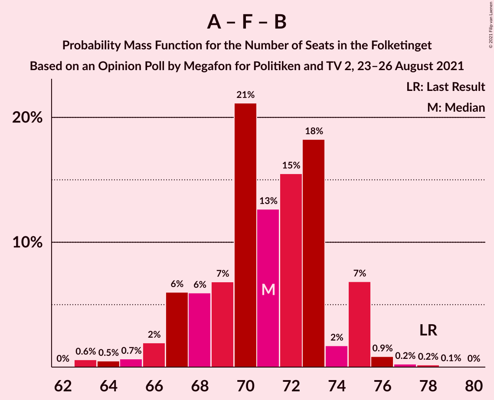

| Number of Seats | Probability | Accumulated | Special Marks |
|:---------------:|:-----------:|:-----------:|:-------------:|
| 65 | 0.1% | 100% |  |
| 66 | 1.3% | 99.9% |  |
| 67 | 0.1% | 98.6% |  |
| 68 | 0.3% | 98% |  |
| 69 | 3% | 98% |  |
| 70 | 0.6% | 95% |  |
| 71 | 0.7% | 95% |  |
| 72 | 0.4% | 94% |  |
| 73 | 70% | 94% | Median |
| 74 | 1.2% | 24% |  |
| 75 | 22% | 23% |  |
| 76 | 0.3% | 0.6% |  |
| 77 | 0% | 0.3% |  |
| 78 | 0% | 0.3% | Last Result |
| 79 | 0.2% | 0.2% |  |
| 80 | 0% | 0% |  |

### Det Konservative Folkeparti – Venstre – Dansk Folkeparti – Liberal Alliance – Kristendemokraterne

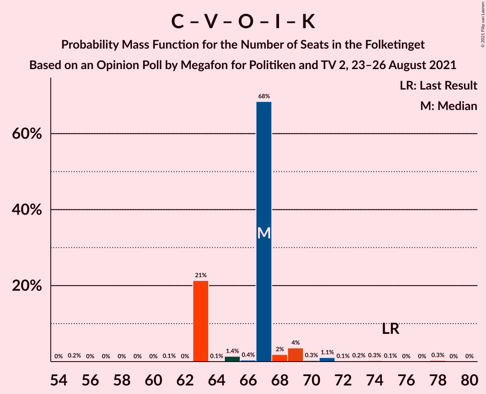

| Number of Seats | Probability | Accumulated | Special Marks |
|:---------------:|:-----------:|:-----------:|:-------------:|
| 55 | 0.2% | 100% |  |
| 56 | 0% | 99.8% |  |
| 57 | 0% | 99.8% |  |
| 58 | 0% | 99.8% |  |
| 59 | 0% | 99.8% |  |
| 60 | 0% | 99.8% |  |
| 61 | 0.1% | 99.8% |  |
| 62 | 0% | 99.7% |  |
| 63 | 21% | 99.6% |  |
| 64 | 0.1% | 78% |  |
| 65 | 1.4% | 78% |  |
| 66 | 0.4% | 77% |  |
| 67 | 68% | 76% | Median |
| 68 | 2% | 8% |  |
| 69 | 4% | 6% |  |
| 70 | 0.3% | 2% |  |
| 71 | 1.1% | 2% |  |
| 72 | 0.1% | 1.1% |  |
| 73 | 0.2% | 1.0% |  |
| 74 | 0.3% | 0.8% |  |
| 75 | 0.1% | 0.5% | Last Result |
| 76 | 0% | 0.4% |  |
| 77 | 0% | 0.4% |  |
| 78 | 0.3% | 0.3% |  |
| 79 | 0% | 0% |  |

### Det Konservative Folkeparti – Venstre – Dansk Folkeparti – Liberal Alliance

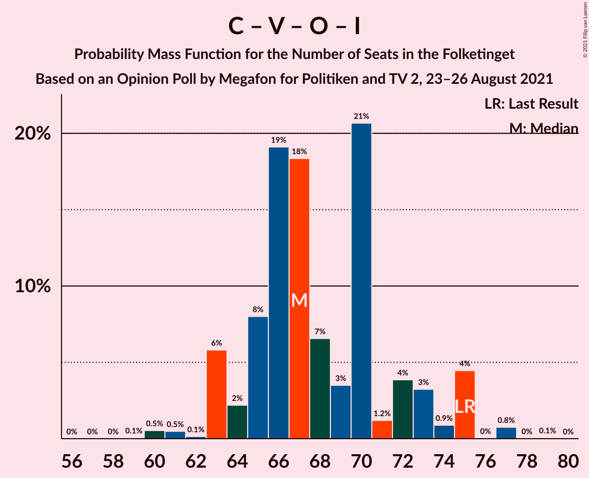

| Number of Seats | Probability | Accumulated | Special Marks |
|:---------------:|:-----------:|:-----------:|:-------------:|
| 55 | 0.2% | 100% |  |
| 56 | 0% | 99.8% |  |
| 57 | 0% | 99.8% |  |
| 58 | 0% | 99.8% |  |
| 59 | 0% | 99.8% |  |
| 60 | 0.1% | 99.8% |  |
| 61 | 0.3% | 99.7% |  |
| 62 | 0.3% | 99.4% |  |
| 63 | 21% | 99.1% |  |
| 64 | 1.2% | 78% |  |
| 65 | 1.3% | 76% |  |
| 66 | 0.3% | 75% |  |
| 67 | 69% | 75% | Median |
| 68 | 0.6% | 6% |  |
| 69 | 4% | 6% |  |
| 70 | 0.5% | 2% |  |
| 71 | 0.9% | 1.4% |  |
| 72 | 0.1% | 0.6% |  |
| 73 | 0.1% | 0.5% |  |
| 74 | 0.3% | 0.3% |  |
| 75 | 0% | 0% | Last Result |

### Det Konservative Folkeparti – Venstre – Liberal Alliance

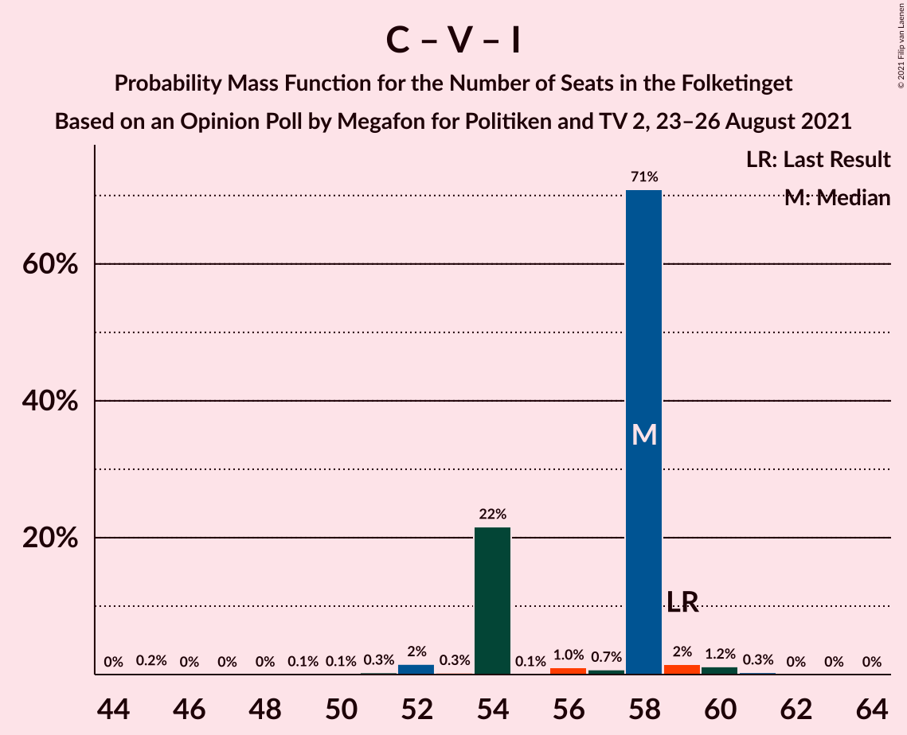

| Number of Seats | Probability | Accumulated | Special Marks |
|:---------------:|:-----------:|:-----------:|:-------------:|
| 45 | 0.2% | 100% |  |
| 46 | 0% | 99.8% |  |
| 47 | 0% | 99.8% |  |
| 48 | 0% | 99.8% |  |
| 49 | 0.1% | 99.7% |  |
| 50 | 0.1% | 99.7% |  |
| 51 | 0.3% | 99.6% |  |
| 52 | 2% | 99.2% |  |
| 53 | 0.3% | 98% |  |
| 54 | 22% | 97% |  |
| 55 | 0.1% | 76% |  |
| 56 | 1.0% | 76% |  |
| 57 | 0.7% | 75% |  |
| 58 | 71% | 74% | Median |
| 59 | 2% | 3% | Last Result |
| 60 | 1.2% | 2% |  |
| 61 | 0.3% | 0.4% |  |
| 62 | 0% | 0.1% |  |
| 63 | 0% | 0% |  |

### Socialdemokraterne – Radikale Venstre

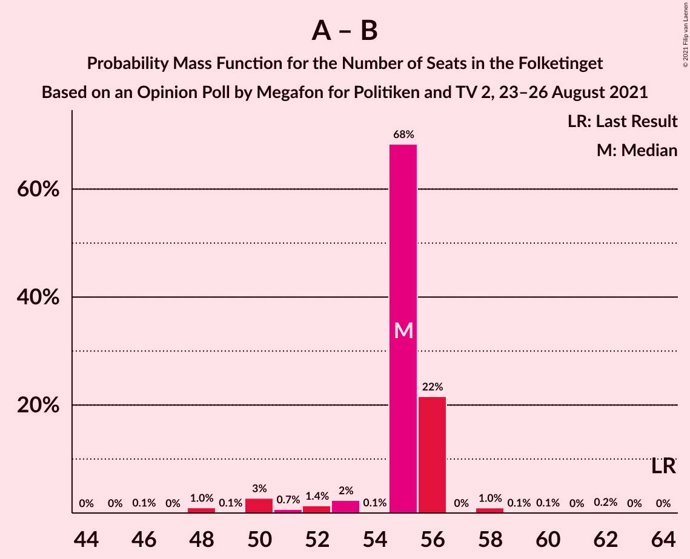

| Number of Seats | Probability | Accumulated | Special Marks |
|:---------------:|:-----------:|:-----------:|:-------------:|
| 46 | 0.1% | 100% |  |
| 47 | 0% | 99.9% |  |
| 48 | 1.0% | 99.9% |  |
| 49 | 0.1% | 98.9% |  |
| 50 | 3% | 98.8% |  |
| 51 | 0.7% | 96% |  |
| 52 | 1.4% | 95% |  |
| 53 | 2% | 94% |  |
| 54 | 0.1% | 92% |  |
| 55 | 68% | 91% | Median |
| 56 | 22% | 23% |  |
| 57 | 0% | 1.5% |  |
| 58 | 1.0% | 1.4% |  |
| 59 | 0.1% | 0.5% |  |
| 60 | 0.1% | 0.4% |  |
| 61 | 0% | 0.2% |  |
| 62 | 0.2% | 0.2% |  |
| 63 | 0% | 0% |  |
| 64 | 0% | 0% | Last Result |

### Det Konservative Folkeparti – Venstre

| Number of Seats | Probability | Accumulated | Special Marks |
|:---------------:|:-----------:|:-----------:|:-------------:|
| 45 | 0.7% | 100% |  |
| 46 | 0.1% | 99.3% |  |
| 47 | 0.2% | 99.2% |  |
| 48 | 1.2% | 99.0% |  |
| 49 | 0.5% | 98% |  |
| 50 | 0.3% | 97% |  |
| 51 | 0.1% | 97% |  |
| 52 | 2% | 97% |  |
| 53 | 2% | 95% |  |
| 54 | 90% | 92% | Median |
| 55 | 2% | 2% | Last Result |
| 56 | 0.1% | 0.3% |  |
| 57 | 0.1% | 0.1% |  |
| 58 | 0% | 0% |  |

### Venstre

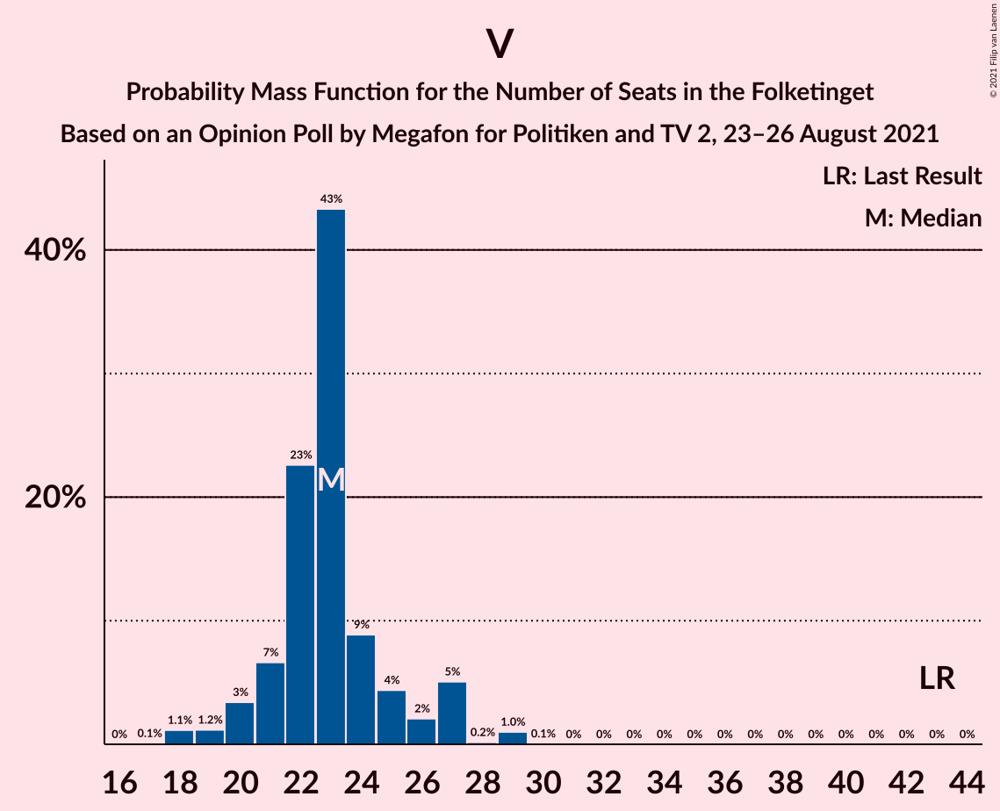

| Number of Seats | Probability | Accumulated | Special Marks |
|:---------------:|:-----------:|:-----------:|:-------------:|
| 18 | 0.2% | 100% |  |
| 19 | 0.4% | 99.8% |  |
| 20 | 0.4% | 99.4% |  |
| 21 | 2% | 99.0% |  |
| 22 | 3% | 97% |  |
| 23 | 90% | 94% | Median |
| 24 | 1.0% | 4% |  |
| 25 | 1.0% | 3% |  |
| 26 | 0.2% | 2% |  |
| 27 | 2% | 2% |  |
| 28 | 0% | 0.1% |  |
| 29 | 0% | 0.1% |  |
| 30 | 0.1% | 0.1% |  |
| 31 | 0% | 0% |  |
| 32 | 0% | 0% |  |
| 33 | 0% | 0% |  |
| 34 | 0% | 0% |  |
| 35 | 0% | 0% |  |
| 36 | 0% | 0% |  |
| 37 | 0% | 0% |  |
| 38 | 0% | 0% |  |
| 39 | 0% | 0% |  |
| 40 | 0% | 0% |  |
| 41 | 0% | 0% |  |
| 42 | 0% | 0% |  |
| 43 | 0% | 0% | Last Result |

## Technical Information

### Opinion Poll

+ **Polling firm:** Megafon
+ **Commissioner(s):** Politiken and TV 2
+ **Fieldwork period:** 23–26 August 2021

### Calculations

+ **Sample size:** 1007
+ **Simulations done:** 131,072
+ **Error estimate:** 3.23%

