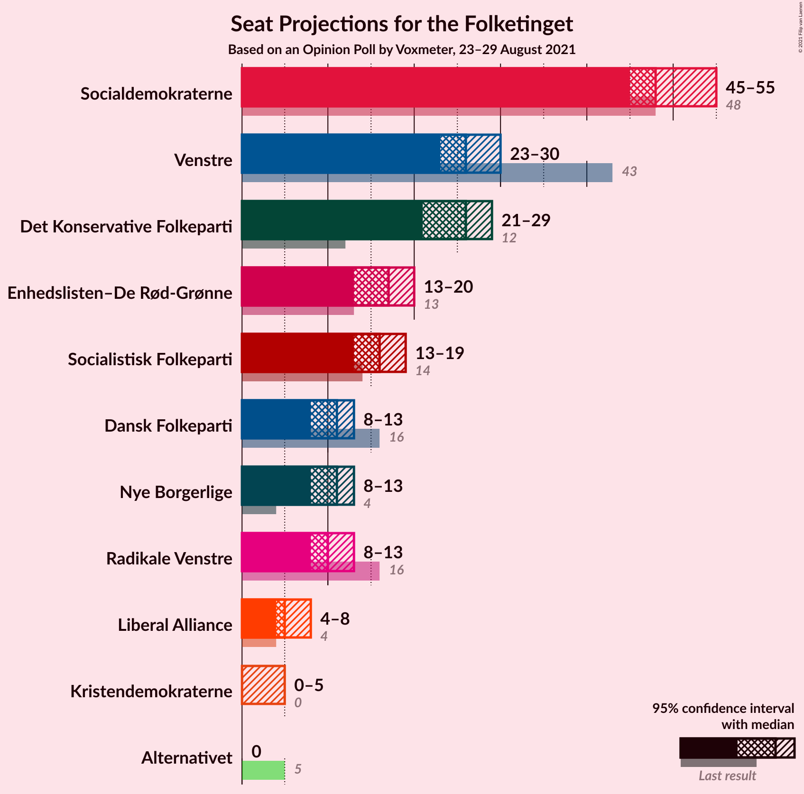
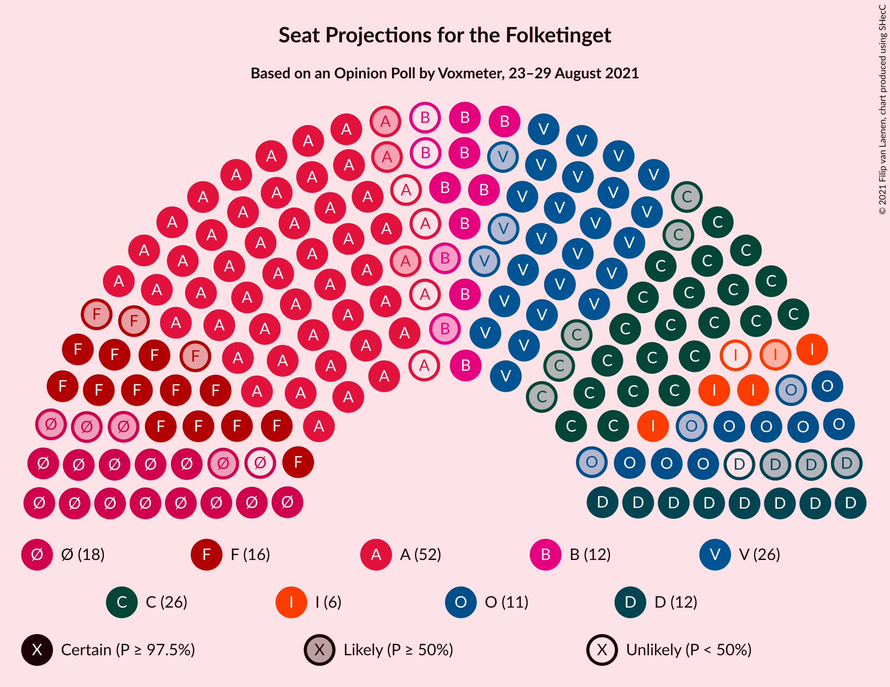
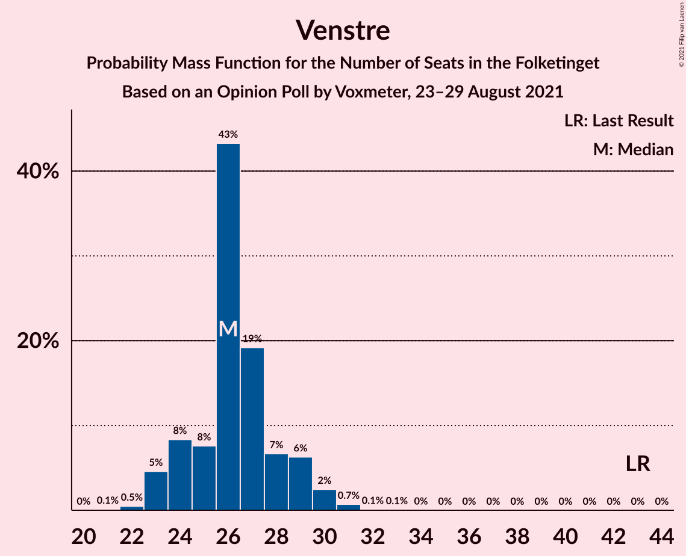
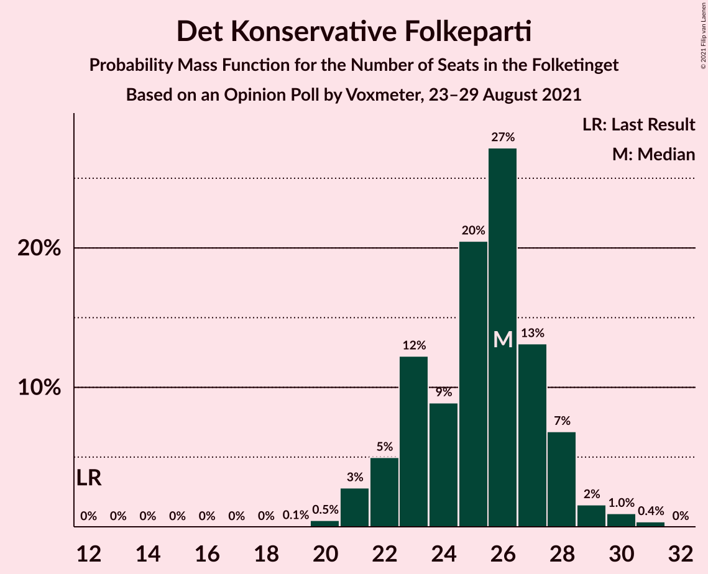
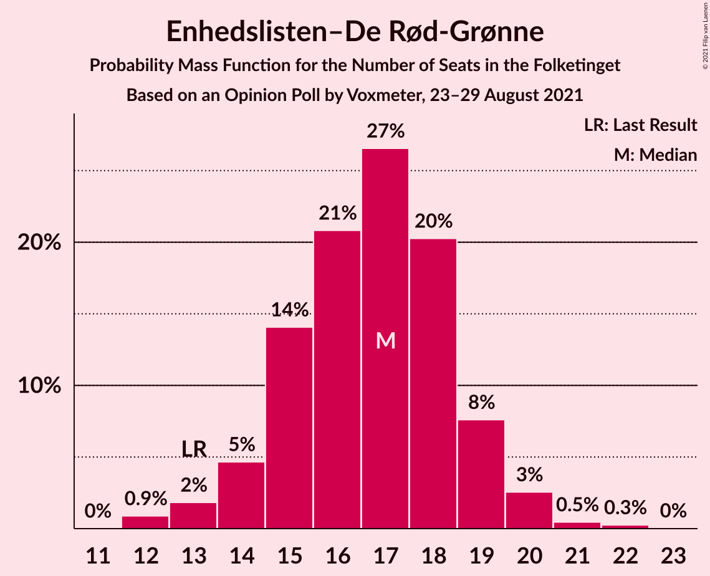
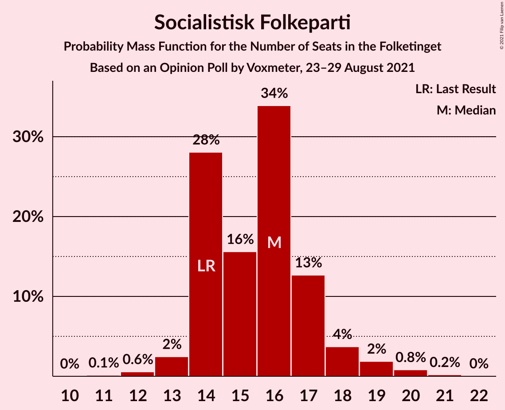
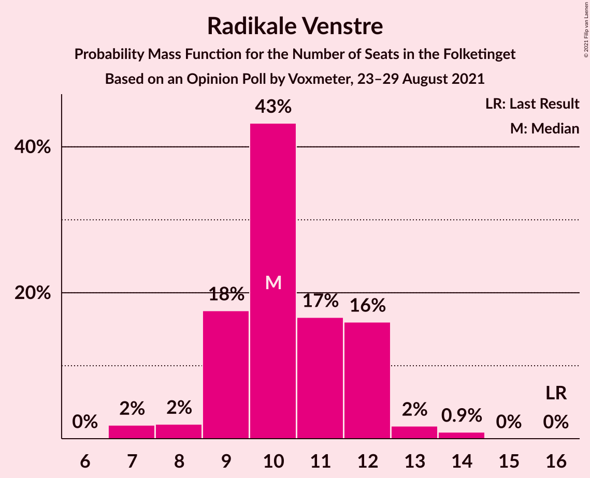
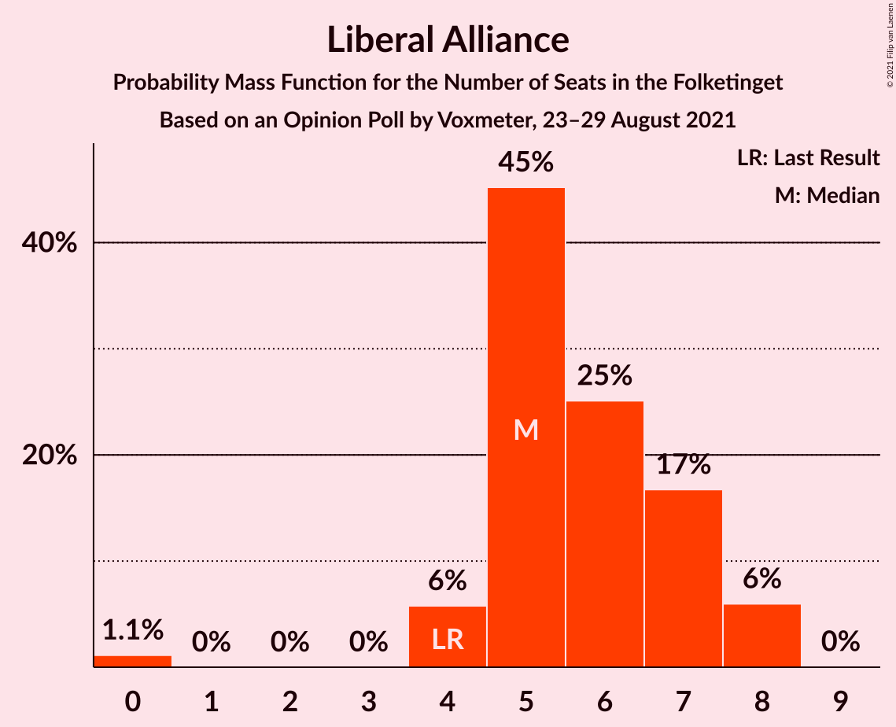
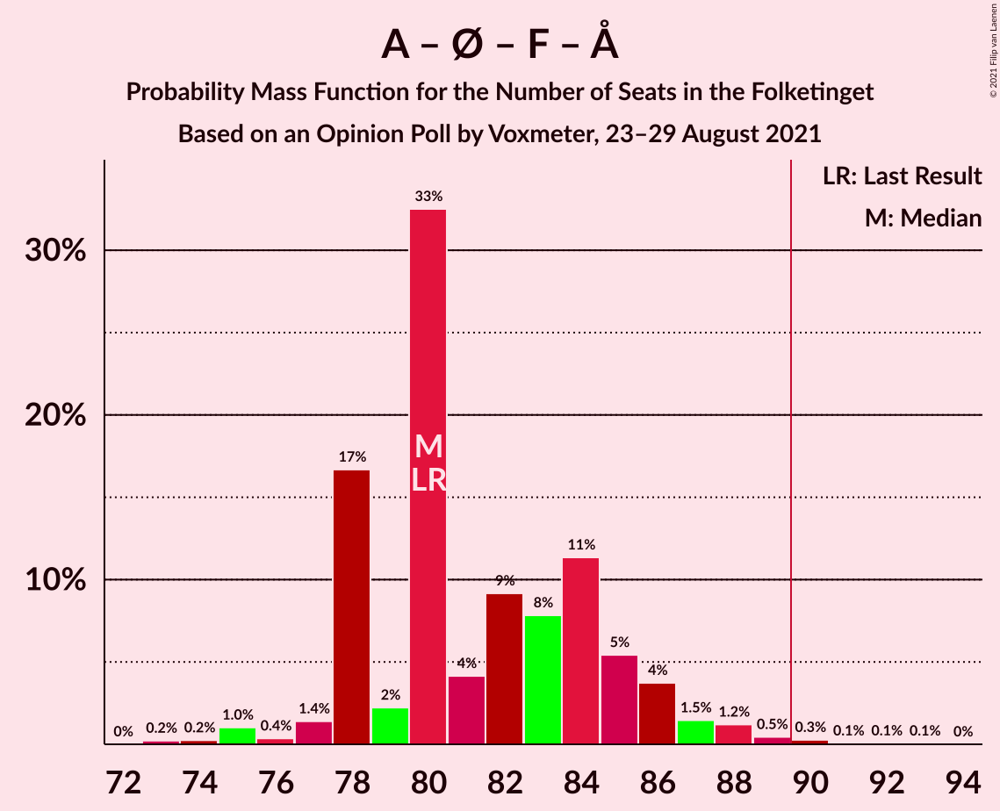

# Opinion Poll by Voxmeter, 23–29 August 2021

<a href="#voting-intentions">Voting Intentions</a> | <a href="#seats">Seats</a> | <a href="#coalitions">Coalitions</a> | <a href="#technical-information">Technical Information</a>

## Voting Intentions

### Confidence Intervals

| Party | Last Result | Poll Result | 80% Confidence Interval | 90% Confidence Interval | 95% Confidence Interval | 99% Confidence Interval |
|:-----:|:-----------:|:-----------:|:-----------------------:|:-----------------------:|:-----------------------:|:-----------------------:|
| Socialdemokraterne | 25.9% | 28.4% | 26.7–30.3% |26.2–30.8% |25.7–31.3% |24.9–32.2% |
| Venstre | 23.4% | 15.1% | 13.7–16.6% |13.4–17.1% |13.0–17.5% |12.4–18.2% |
| Det Konservative Folkeparti | 6.6% | 13.9% | 12.6–15.4% |12.2–15.8% |11.9–16.2% |11.3–16.9% |
| Enhedslisten–De Rød-Grønne | 6.9% | 9.3% | 8.3–10.6% |8.0–11.0% |7.7–11.3% |7.2–11.9% |
| Socialistisk Folkeparti | 7.7% | 8.8% | 7.8–10.1% |7.5–10.5% |7.2–10.8% |6.8–11.4% |
| Nye Borgerlige | 2.4% | 5.8% | 4.9–6.8% |4.7–7.1% |4.5–7.4% |4.1–7.9% |
| Dansk Folkeparti | 8.7% | 5.6% | 4.7–6.6% |4.5–6.9% |4.3–7.2% |3.9–7.7% |
| Radikale Venstre | 8.6% | 5.6% | 4.7–6.6% |4.5–6.9% |4.3–7.2% |3.9–7.7% |
| Liberal Alliance | 2.3% | 2.9% | 2.3–3.7% |2.1–3.9% |2.0–4.1% |1.8–4.5% |
| Kristendemokraterne | 1.7% | 1.8% | 1.4–2.5% |1.2–2.7% |1.1–2.8% |1.0–3.2% |
| Alternativet | 3.0% | 0.5% | 0.3–0.9% |0.3–1.1% |0.2–1.2% |0.2–1.4% |

*Note:* The poll result column reflects the actual value used in the calculations. Published results may vary slightly, and in addition be rounded to fewer digits.

## Seats

### Confidence Intervals

| Party | Last Result | Median | 80% Confidence Interval | 90% Confidence Interval | 95% Confidence Interval | 99% Confidence Interval |
|:-----:|:-----------:|:------:|:-----------------------:|:-----------------------:|:-----------------------:|:-----------------------:|
| <a href="#socialdemokraterne">Socialdemokraterne</a> | 48 | 47 | 46–52 |46–53 |46–55 |46–56 |
| <a href="#venstre">Venstre</a> | 43 | 27 | 26–29 |24–29 |24–30 |22–31 |
| <a href="#det-konservative-folkeparti">Det Konservative Folkeparti</a> | 12 | 25 | 23–27 |22–27 |22–27 |21–30 |
| <a href="#enhedslisten–de-rød-grønne">Enhedslisten–De Rød-Grønne</a> | 13 | 17 | 15–18 |15–20 |15–20 |13–20 |
| <a href="#socialistisk-folkeparti">Socialistisk Folkeparti</a> | 14 | 16 | 14–16 |14–17 |14–18 |13–19 |
| <a href="#nye-borgerlige">Nye Borgerlige</a> | 4 | 12 | 9–13 |9–13 |9–13 |7–14 |
| <a href="#dansk-folkeparti">Dansk Folkeparti</a> | 16 | 11 | 9–11 |9–11 |8–11 |8–13 |
| <a href="#radikale-venstre">Radikale Venstre</a> | 16 | 10 | 10–12 |9–12 |9–12 |7–12 |
| <a href="#liberal-alliance">Liberal Alliance</a> | 4 | 5 | 5–8 |5–8 |4–8 |4–8 |
| <a href="#kristendemokraterne">Kristendemokraterne</a> | 0 | 0 | 0 |0 |0–5 |0–6 |
| <a href="#alternativet">Alternativet</a> | 5 | 0 | 0 |0 |0 |0 |

### Socialdemokraterne

*For a full overview of the results for this party, see the [Socialdemokraterne](party-socialdemokraterne.html) page.*

| Number of Seats | Probability | Accumulated | Special Marks |
|:---------------:|:-----------:|:-----------:|:-------------:|
| 44 | 0.1% | 100% |  |
| 45 | 0.1% | 99.9% |  |
| 46 | 12% | 99.8% |  |
| 47 | 51% | 87% | Median |
| 48 | 8% | 36% | Last Result |
| 49 | 3% | 28% |  |
| 50 | 1.1% | 26% |  |
| 51 | 0.7% | 25% |  |
| 52 | 16% | 24% |  |
| 53 | 5% | 8% |  |
| 54 | 0.3% | 3% |  |
| 55 | 0.4% | 3% |  |
| 56 | 2% | 2% |  |
| 57 | 0% | 0.1% |  |
| 58 | 0% | 0.1% |  |
| 59 | 0% | 0.1% |  |
| 60 | 0% | 0% |  |

### Venstre

*For a full overview of the results for this party, see the [Venstre](party-venstre.html) page.*

| Number of Seats | Probability | Accumulated | Special Marks |
|:---------------:|:-----------:|:-----------:|:-------------:|
| 21 | 0.2% | 100% |  |
| 22 | 1.0% | 99.8% |  |
| 23 | 0.1% | 98.8% |  |
| 24 | 6% | 98.7% |  |
| 25 | 3% | 93% |  |
| 26 | 17% | 90% |  |
| 27 | 55% | 73% | Median |
| 28 | 2% | 18% |  |
| 29 | 13% | 16% |  |
| 30 | 0.8% | 3% |  |
| 31 | 2% | 2% |  |
| 32 | 0.1% | 0.2% |  |
| 33 | 0% | 0.1% |  |
| 34 | 0.1% | 0.1% |  |
| 35 | 0% | 0% |  |
| 36 | 0% | 0% |  |
| 37 | 0% | 0% |  |
| 38 | 0% | 0% |  |
| 39 | 0% | 0% |  |
| 40 | 0% | 0% |  |
| 41 | 0% | 0% |  |
| 42 | 0% | 0% |  |
| 43 | 0% | 0% | Last Result |

### Det Konservative Folkeparti

*For a full overview of the results for this party, see the [Det Konservative Folkeparti](party-detkonservativefolkeparti.html) page.*

| Number of Seats | Probability | Accumulated | Special Marks |
|:---------------:|:-----------:|:-----------:|:-------------:|
| 12 | 0% | 100% | Last Result |
| 13 | 0% | 100% |  |
| 14 | 0% | 100% |  |
| 15 | 0% | 100% |  |
| 16 | 0% | 100% |  |
| 17 | 0% | 100% |  |
| 18 | 0% | 100% |  |
| 19 | 0.1% | 100% |  |
| 20 | 0.2% | 99.9% |  |
| 21 | 0.5% | 99.7% |  |
| 22 | 6% | 99.2% |  |
| 23 | 14% | 93% |  |
| 24 | 3% | 80% |  |
| 25 | 54% | 77% | Median |
| 26 | 7% | 23% |  |
| 27 | 14% | 17% |  |
| 28 | 0.6% | 2% |  |
| 29 | 0.8% | 2% |  |
| 30 | 0.9% | 1.0% |  |
| 31 | 0% | 0% |  |

### Enhedslisten–De Rød-Grønne

*For a full overview of the results for this party, see the [Enhedslisten–De Rød-Grønne](party-enhedslisten–derød-grønne.html) page.*

| Number of Seats | Probability | Accumulated | Special Marks |
|:---------------:|:-----------:|:-----------:|:-------------:|
| 12 | 0.1% | 100% |  |
| 13 | 0.7% | 99.9% | Last Result |
| 14 | 0.5% | 99.2% |  |
| 15 | 17% | 98.7% |  |
| 16 | 19% | 82% |  |
| 17 | 51% | 63% | Median |
| 18 | 3% | 12% |  |
| 19 | 3% | 8% |  |
| 20 | 6% | 6% |  |
| 21 | 0.1% | 0.2% |  |
| 22 | 0% | 0.1% |  |
| 23 | 0% | 0% |  |

### Socialistisk Folkeparti

*For a full overview of the results for this party, see the [Socialistisk Folkeparti](party-socialistiskfolkeparti.html) page.*

| Number of Seats | Probability | Accumulated | Special Marks |
|:---------------:|:-----------:|:-----------:|:-------------:|
| 11 | 0.1% | 100% |  |
| 12 | 0.1% | 99.9% |  |
| 13 | 2% | 99.8% |  |
| 14 | 10% | 98% | Last Result |
| 15 | 6% | 88% |  |
| 16 | 75% | 82% | Median |
| 17 | 3% | 7% |  |
| 18 | 3% | 4% |  |
| 19 | 1.0% | 1.2% |  |
| 20 | 0.1% | 0.2% |  |
| 21 | 0.1% | 0.1% |  |
| 22 | 0% | 0% |  |

### Nye Borgerlige

*For a full overview of the results for this party, see the [Nye Borgerlige](party-nyeborgerlige.html) page.*

| Number of Seats | Probability | Accumulated | Special Marks |
|:---------------:|:-----------:|:-----------:|:-------------:|
| 4 | 0% | 100% | Last Result |
| 5 | 0% | 100% |  |
| 6 | 0.3% | 100% |  |
| 7 | 0.3% | 99.7% |  |
| 8 | 1.5% | 99.4% |  |
| 9 | 16% | 98% |  |
| 10 | 16% | 81% |  |
| 11 | 13% | 65% |  |
| 12 | 3% | 52% | Median |
| 13 | 48% | 49% |  |
| 14 | 1.2% | 1.3% |  |
| 15 | 0% | 0% |  |

### Dansk Folkeparti

*For a full overview of the results for this party, see the [Dansk Folkeparti](party-danskfolkeparti.html) page.*

| Number of Seats | Probability | Accumulated | Special Marks |
|:---------------:|:-----------:|:-----------:|:-------------:|
| 6 | 0.1% | 100% |  |
| 7 | 0.2% | 99.9% |  |
| 8 | 3% | 99.7% |  |
| 9 | 17% | 97% |  |
| 10 | 29% | 80% |  |
| 11 | 48% | 50% | Median |
| 12 | 1.2% | 2% |  |
| 13 | 0.6% | 0.9% |  |
| 14 | 0.3% | 0.3% |  |
| 15 | 0% | 0.1% |  |
| 16 | 0% | 0% | Last Result |

### Radikale Venstre

*For a full overview of the results for this party, see the [Radikale Venstre](party-radikalevenstre.html) page.*

| Number of Seats | Probability | Accumulated | Special Marks |
|:---------------:|:-----------:|:-----------:|:-------------:|
| 7 | 2% | 100% |  |
| 8 | 0.6% | 98% |  |
| 9 | 4% | 98% |  |
| 10 | 52% | 94% | Median |
| 11 | 21% | 42% |  |
| 12 | 21% | 21% |  |
| 13 | 0.2% | 0.4% |  |
| 14 | 0.1% | 0.1% |  |
| 15 | 0% | 0% |  |
| 16 | 0% | 0% | Last Result |

### Liberal Alliance

*For a full overview of the results for this party, see the [Liberal Alliance](party-liberalalliance.html) page.*

| Number of Seats | Probability | Accumulated | Special Marks |
|:---------------:|:-----------:|:-----------:|:-------------:|
| 0 | 0.3% | 100% |  |
| 1 | 0% | 99.7% |  |
| 2 | 0% | 99.7% |  |
| 3 | 0% | 99.7% |  |
| 4 | 4% | 99.7% | Last Result |
| 5 | 66% | 95% | Median |
| 6 | 8% | 29% |  |
| 7 | 7% | 21% |  |
| 8 | 14% | 14% |  |
| 9 | 0% | 0% |  |

### Kristendemokraterne

*For a full overview of the results for this party, see the [Kristendemokraterne](party-kristendemokraterne.html) page.*

| Number of Seats | Probability | Accumulated | Special Marks |
|:---------------:|:-----------:|:-----------:|:-------------:|
| 0 | 95% | 100% | Last Result, Median |
| 1 | 0% | 5% |  |
| 2 | 0% | 5% |  |
| 3 | 0% | 5% |  |
| 4 | 2% | 5% |  |
| 5 | 2% | 3% |  |
| 6 | 0.8% | 0.8% |  |
| 7 | 0% | 0% |  |

### Alternativet

*For a full overview of the results for this party, see the [Alternativet](party-alternativet.html) page.*

| Number of Seats | Probability | Accumulated | Special Marks |
|:---------------:|:-----------:|:-----------:|:-------------:|
| 0 | 100% | 100% | Median |
| 1 | 0% | 0% |  |
| 2 | 0% | 0% |  |
| 3 | 0% | 0% |  |
| 4 | 0% | 0% |  |
| 5 | 0% | 0% | Last Result |

## Coalitions

### Confidence Intervals

| Coalition | Last Result | Median | Majority? | 80% Confidence Interval | 90% Confidence Interval | 95% Confidence Interval | 99% Confidence Interval |
|:---------:|:-----------:|:------:|:---------:|:-----------------------:|:-----------------------:|:-----------------------:|:-----------------------:|
| Socialdemokraterne – Enhedslisten–De Rød-Grønne – Socialistisk Folkeparti – Radikale Venstre – Alternativet | 96 | 90 | 98% | 90–94 | 90–95 | 90–97 | 87–98 |
| Socialdemokraterne – Enhedslisten–De Rød-Grønne – Socialistisk Folkeparti – Radikale Venstre | 91 | 90 | 98% | 90–94 | 90–95 | 90–97 | 87–98 |
| Socialdemokraterne – Enhedslisten–De Rød-Grønne – Socialistisk Folkeparti – Alternativet | 80 | 80 | 0.2% | 78–83 | 78–85 | 78–86 | 77–88 |
| Socialdemokraterne – Enhedslisten–De Rød-Grønne – Socialistisk Folkeparti | 75 | 80 | 0.2% | 78–83 | 78–85 | 78–86 | 77–88 |
| Venstre – Det Konservative Folkeparti – Nye Borgerlige – Dansk Folkeparti – Liberal Alliance – Kristendemokraterne | 79 | 81 | 0% | 76–81 | 76–81 | 75–82 | 74–84 |
| Venstre – Det Konservative Folkeparti – Nye Borgerlige – Dansk Folkeparti – Liberal Alliance | 79 | 80 | 0% | 76–81 | 75–81 | 73–81 | 72–84 |
| Socialdemokraterne – Socialistisk Folkeparti – Radikale Venstre | 78 | 73 | 0% | 73–79 | 73–79 | 72–81 | 71–82 |
| Venstre – Det Konservative Folkeparti – Dansk Folkeparti – Liberal Alliance – Kristendemokraterne | 75 | 68 | 0% | 65–71 | 65–71 | 65–72 | 63–74 |
| Venstre – Det Konservative Folkeparti – Dansk Folkeparti – Liberal Alliance | 75 | 68 | 0% | 65–71 | 65–71 | 64–71 | 62–72 |
| Socialdemokraterne – Radikale Venstre | 64 | 57 | 0% | 57–63 | 57–64 | 57–65 | 56–68 |
| Venstre – Det Konservative Folkeparti – Liberal Alliance | 59 | 57 | 0% | 56–61 | 56–61 | 55–61 | 52–61 |
| Venstre – Det Konservative Folkeparti | 55 | 52 | 0% | 49–56 | 49–56 | 49–56 | 47–56 |
| Venstre | 43 | 27 | 0% | 26–29 | 24–29 | 24–30 | 22–31 |

### Socialdemokraterne – Enhedslisten–De Rød-Grønne – Socialistisk Folkeparti – Radikale Venstre – Alternativet

| Number of Seats | Probability | Accumulated | Special Marks |
|:---------------:|:-----------:|:-----------:|:-------------:|
| 84 | 0.1% | 100% |  |
| 85 | 0% | 99.9% |  |
| 86 | 0.1% | 99.9% |  |
| 87 | 0.5% | 99.8% |  |
| 88 | 0.9% | 99.3% |  |
| 89 | 0.3% | 98% |  |
| 90 | 63% | 98% | Median, Majority |
| 91 | 2% | 35% |  |
| 92 | 1.0% | 33% |  |
| 93 | 3% | 32% |  |
| 94 | 19% | 29% |  |
| 95 | 5% | 10% |  |
| 96 | 2% | 5% | Last Result |
| 97 | 3% | 3% |  |
| 98 | 0.1% | 0.5% |  |
| 99 | 0.2% | 0.4% |  |
| 100 | 0% | 0.2% |  |
| 101 | 0.1% | 0.2% |  |
| 102 | 0.1% | 0.1% |  |
| 103 | 0% | 0% |  |

### Socialdemokraterne – Enhedslisten–De Rød-Grønne – Socialistisk Folkeparti – Radikale Venstre

| Number of Seats | Probability | Accumulated | Special Marks |
|:---------------:|:-----------:|:-----------:|:-------------:|
| 84 | 0.1% | 100% |  |
| 85 | 0% | 99.9% |  |
| 86 | 0.1% | 99.9% |  |
| 87 | 0.5% | 99.8% |  |
| 88 | 0.9% | 99.3% |  |
| 89 | 0.3% | 98% |  |
| 90 | 63% | 98% | Median, Majority |
| 91 | 2% | 35% | Last Result |
| 92 | 1.0% | 33% |  |
| 93 | 3% | 32% |  |
| 94 | 19% | 29% |  |
| 95 | 5% | 10% |  |
| 96 | 2% | 5% |  |
| 97 | 3% | 3% |  |
| 98 | 0.1% | 0.5% |  |
| 99 | 0.2% | 0.4% |  |
| 100 | 0% | 0.2% |  |
| 101 | 0.1% | 0.2% |  |
| 102 | 0.1% | 0.1% |  |
| 103 | 0% | 0% |  |

### Socialdemokraterne – Enhedslisten–De Rød-Grønne – Socialistisk Folkeparti – Alternativet

| Number of Seats | Probability | Accumulated | Special Marks |
|:---------------:|:-----------:|:-----------:|:-------------:|
| 75 | 0.1% | 100% |  |
| 76 | 0% | 99.9% |  |
| 77 | 1.2% | 99.9% |  |
| 78 | 14% | 98.7% |  |
| 79 | 0.1% | 85% |  |
| 80 | 49% | 85% | Last Result, Median |
| 81 | 1.1% | 35% |  |
| 82 | 1.3% | 34% |  |
| 83 | 25% | 33% |  |
| 84 | 2% | 8% |  |
| 85 | 3% | 6% |  |
| 86 | 1.0% | 3% |  |
| 87 | 0.8% | 2% |  |
| 88 | 0.7% | 1.1% |  |
| 89 | 0.2% | 0.4% |  |
| 90 | 0.1% | 0.2% | Majority |
| 91 | 0% | 0.1% |  |
| 92 | 0% | 0.1% |  |
| 93 | 0% | 0.1% |  |
| 94 | 0% | 0% |  |

### Socialdemokraterne – Enhedslisten–De Rød-Grønne – Socialistisk Folkeparti

| Number of Seats | Probability | Accumulated | Special Marks |
|:---------------:|:-----------:|:-----------:|:-------------:|
| 75 | 0.1% | 100% | Last Result |
| 76 | 0% | 99.9% |  |
| 77 | 1.2% | 99.9% |  |
| 78 | 14% | 98.7% |  |
| 79 | 0.1% | 85% |  |
| 80 | 49% | 85% | Median |
| 81 | 1.1% | 35% |  |
| 82 | 1.3% | 34% |  |
| 83 | 25% | 33% |  |
| 84 | 2% | 8% |  |
| 85 | 3% | 6% |  |
| 86 | 1.0% | 3% |  |
| 87 | 0.8% | 2% |  |
| 88 | 0.7% | 1.1% |  |
| 89 | 0.2% | 0.4% |  |
| 90 | 0.1% | 0.2% | Majority |
| 91 | 0% | 0.1% |  |
| 92 | 0% | 0.1% |  |
| 93 | 0% | 0.1% |  |
| 94 | 0% | 0% |  |

### Venstre – Det Konservative Folkeparti – Nye Borgerlige – Dansk Folkeparti – Liberal Alliance – Kristendemokraterne

| Number of Seats | Probability | Accumulated | Special Marks |
|:---------------:|:-----------:|:-----------:|:-------------:|
| 69 | 0.1% | 100% |  |
| 70 | 0% | 99.9% |  |
| 71 | 0% | 99.9% |  |
| 72 | 0.1% | 99.9% |  |
| 73 | 0.1% | 99.8% |  |
| 74 | 0.6% | 99.8% |  |
| 75 | 2% | 99.1% |  |
| 76 | 12% | 97% |  |
| 77 | 15% | 86% |  |
| 78 | 2% | 71% |  |
| 79 | 3% | 69% | Last Result |
| 80 | 15% | 66% | Median |
| 81 | 48% | 51% |  |
| 82 | 1.0% | 3% |  |
| 83 | 0.4% | 2% |  |
| 84 | 1.2% | 2% |  |
| 85 | 0% | 0.4% |  |
| 86 | 0.1% | 0.3% |  |
| 87 | 0% | 0.2% |  |
| 88 | 0.2% | 0.2% |  |
| 89 | 0% | 0% |  |

### Venstre – Det Konservative Folkeparti – Nye Borgerlige – Dansk Folkeparti – Liberal Alliance

| Number of Seats | Probability | Accumulated | Special Marks |
|:---------------:|:-----------:|:-----------:|:-------------:|
| 69 | 0.1% | 100% |  |
| 70 | 0.1% | 99.9% |  |
| 71 | 0% | 99.8% |  |
| 72 | 0.3% | 99.7% |  |
| 73 | 2% | 99.5% |  |
| 74 | 1.2% | 97% |  |
| 75 | 2% | 96% |  |
| 76 | 12% | 94% |  |
| 77 | 15% | 82% |  |
| 78 | 1.0% | 68% |  |
| 79 | 3% | 67% | Last Result |
| 80 | 14% | 64% | Median |
| 81 | 48% | 50% |  |
| 82 | 0.2% | 2% |  |
| 83 | 0.3% | 2% |  |
| 84 | 1.1% | 1.4% |  |
| 85 | 0% | 0.2% |  |
| 86 | 0% | 0.2% |  |
| 87 | 0% | 0.2% |  |
| 88 | 0.2% | 0.2% |  |
| 89 | 0% | 0% |  |

### Socialdemokraterne – Socialistisk Folkeparti – Radikale Venstre

| Number of Seats | Probability | Accumulated | Special Marks |
|:---------------:|:-----------:|:-----------:|:-------------:|
| 67 | 0.1% | 100% |  |
| 68 | 0% | 99.9% |  |
| 69 | 0.1% | 99.9% |  |
| 70 | 0.2% | 99.8% |  |
| 71 | 1.3% | 99.6% |  |
| 72 | 1.0% | 98% |  |
| 73 | 49% | 97% | Median |
| 74 | 15% | 48% |  |
| 75 | 7% | 33% |  |
| 76 | 2% | 26% |  |
| 77 | 0.6% | 24% |  |
| 78 | 6% | 23% | Last Result |
| 79 | 14% | 17% |  |
| 80 | 0.4% | 3% |  |
| 81 | 0.1% | 3% |  |
| 82 | 2% | 2% |  |
| 83 | 0% | 0.3% |  |
| 84 | 0.2% | 0.2% |  |
| 85 | 0.1% | 0.1% |  |
| 86 | 0% | 0% |  |

### Venstre – Det Konservative Folkeparti – Dansk Folkeparti – Liberal Alliance – Kristendemokraterne

| Number of Seats | Probability | Accumulated | Special Marks |
|:---------------:|:-----------:|:-----------:|:-------------:|
| 57 | 0.1% | 100% |  |
| 58 | 0% | 99.9% |  |
| 59 | 0% | 99.9% |  |
| 60 | 0% | 99.9% |  |
| 61 | 0.2% | 99.9% |  |
| 62 | 0.2% | 99.7% |  |
| 63 | 0.2% | 99.5% |  |
| 64 | 0.1% | 99.4% |  |
| 65 | 11% | 99.3% |  |
| 66 | 4% | 88% |  |
| 67 | 14% | 84% |  |
| 68 | 49% | 70% | Median |
| 69 | 4% | 21% |  |
| 70 | 1.0% | 17% |  |
| 71 | 13% | 16% |  |
| 72 | 1.3% | 3% |  |
| 73 | 0.1% | 2% |  |
| 74 | 1.0% | 1.4% |  |
| 75 | 0.1% | 0.4% | Last Result |
| 76 | 0.3% | 0.3% |  |
| 77 | 0% | 0% |  |

### Venstre – Det Konservative Folkeparti – Dansk Folkeparti – Liberal Alliance

| Number of Seats | Probability | Accumulated | Special Marks |
|:---------------:|:-----------:|:-----------:|:-------------:|
| 57 | 0.1% | 100% |  |
| 58 | 0% | 99.9% |  |
| 59 | 0% | 99.9% |  |
| 60 | 0.1% | 99.9% |  |
| 61 | 0.2% | 99.8% |  |
| 62 | 0.3% | 99.6% |  |
| 63 | 0.3% | 99.3% |  |
| 64 | 3% | 99.0% |  |
| 65 | 11% | 96% |  |
| 66 | 4% | 85% |  |
| 67 | 14% | 81% |  |
| 68 | 50% | 67% | Median |
| 69 | 2% | 17% |  |
| 70 | 1.1% | 15% |  |
| 71 | 13% | 14% |  |
| 72 | 1.3% | 2% |  |
| 73 | 0.1% | 0.4% |  |
| 74 | 0% | 0.3% |  |
| 75 | 0.1% | 0.3% | Last Result |
| 76 | 0.2% | 0.2% |  |
| 77 | 0% | 0% |  |

### Socialdemokraterne – Radikale Venstre

| Number of Seats | Probability | Accumulated | Special Marks |
|:---------------:|:-----------:|:-----------:|:-------------:|
| 53 | 0% | 100% |  |
| 54 | 0.1% | 99.9% |  |
| 55 | 0.2% | 99.8% |  |
| 56 | 1.2% | 99.6% |  |
| 57 | 50% | 98% | Median |
| 58 | 14% | 48% |  |
| 59 | 5% | 34% |  |
| 60 | 5% | 29% |  |
| 61 | 2% | 24% |  |
| 62 | 0.5% | 22% |  |
| 63 | 14% | 22% |  |
| 64 | 6% | 8% | Last Result |
| 65 | 0.2% | 3% |  |
| 66 | 0.1% | 2% |  |
| 67 | 0.1% | 2% |  |
| 68 | 2% | 2% |  |
| 69 | 0% | 0.1% |  |
| 70 | 0% | 0% |  |

### Venstre – Det Konservative Folkeparti – Liberal Alliance

| Number of Seats | Probability | Accumulated | Special Marks |
|:---------------:|:-----------:|:-----------:|:-------------:|
| 49 | 0% | 100% |  |
| 50 | 0.1% | 99.9% |  |
| 51 | 0.1% | 99.8% |  |
| 52 | 0.4% | 99.7% |  |
| 53 | 0.4% | 99.4% |  |
| 54 | 0.4% | 99.0% |  |
| 55 | 2% | 98.6% |  |
| 56 | 13% | 96% |  |
| 57 | 62% | 83% | Median |
| 58 | 3% | 21% |  |
| 59 | 1.3% | 18% | Last Result |
| 60 | 3% | 17% |  |
| 61 | 13% | 13% |  |
| 62 | 0.3% | 0.4% |  |
| 63 | 0% | 0.1% |  |
| 64 | 0.1% | 0.1% |  |
| 65 | 0% | 0% |  |

### Venstre – Det Konservative Folkeparti

| Number of Seats | Probability | Accumulated | Special Marks |
|:---------------:|:-----------:|:-----------:|:-------------:|
| 44 | 0% | 100% |  |
| 45 | 0.2% | 99.9% |  |
| 46 | 0.2% | 99.7% |  |
| 47 | 0.1% | 99.5% |  |
| 48 | 0.2% | 99.4% |  |
| 49 | 19% | 99.3% |  |
| 50 | 7% | 80% |  |
| 51 | 2% | 73% |  |
| 52 | 51% | 71% | Median |
| 53 | 3% | 20% |  |
| 54 | 2% | 16% |  |
| 55 | 0.4% | 15% | Last Result |
| 56 | 14% | 14% |  |
| 57 | 0.1% | 0.3% |  |
| 58 | 0% | 0.1% |  |
| 59 | 0% | 0.1% |  |
| 60 | 0.1% | 0.1% |  |
| 61 | 0% | 0% |  |

### Venstre

| Number of Seats | Probability | Accumulated | Special Marks |
|:---------------:|:-----------:|:-----------:|:-------------:|
| 21 | 0.2% | 100% |  |
| 22 | 1.0% | 99.8% |  |
| 23 | 0.1% | 98.8% |  |
| 24 | 6% | 98.7% |  |
| 25 | 3% | 93% |  |
| 26 | 17% | 90% |  |
| 27 | 55% | 73% | Median |
| 28 | 2% | 18% |  |
| 29 | 13% | 16% |  |
| 30 | 0.8% | 3% |  |
| 31 | 2% | 2% |  |
| 32 | 0.1% | 0.2% |  |
| 33 | 0% | 0.1% |  |
| 34 | 0.1% | 0.1% |  |
| 35 | 0% | 0% |  |
| 36 | 0% | 0% |  |
| 37 | 0% | 0% |  |
| 38 | 0% | 0% |  |
| 39 | 0% | 0% |  |
| 40 | 0% | 0% |  |
| 41 | 0% | 0% |  |
| 42 | 0% | 0% |  |
| 43 | 0% | 0% | Last Result |

## Technical Information

### Opinion Poll

+ **Polling firm:** Voxmeter
+ **Commissioner(s):** —
+ **Fieldwork period:** 23–29 August 2021

### Calculations

+ **Sample size:** 1006
+ **Simulations done:** 131,072
+ **Error estimate:** 2.64%

