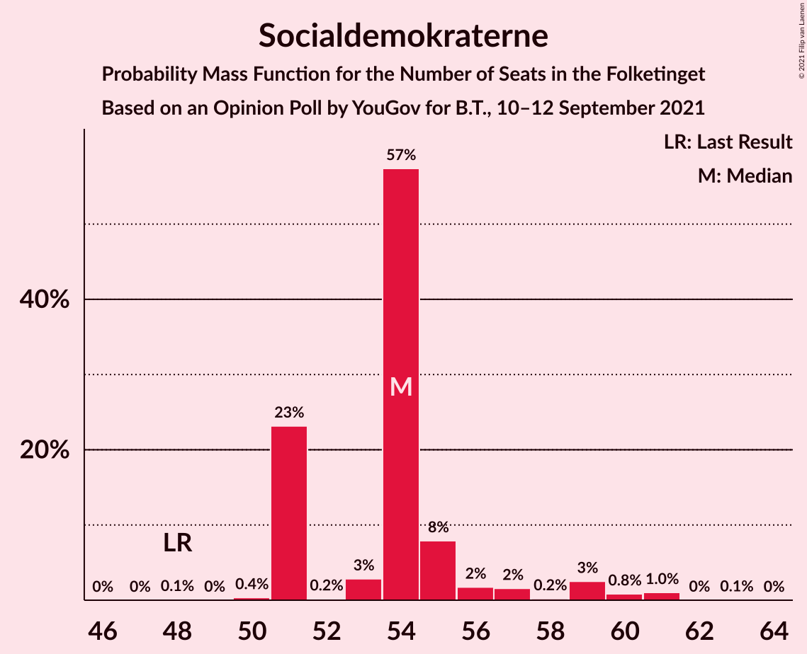
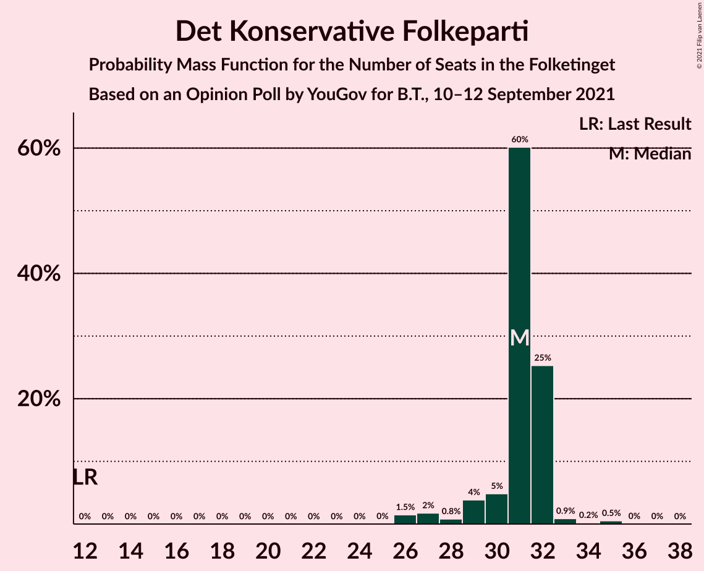
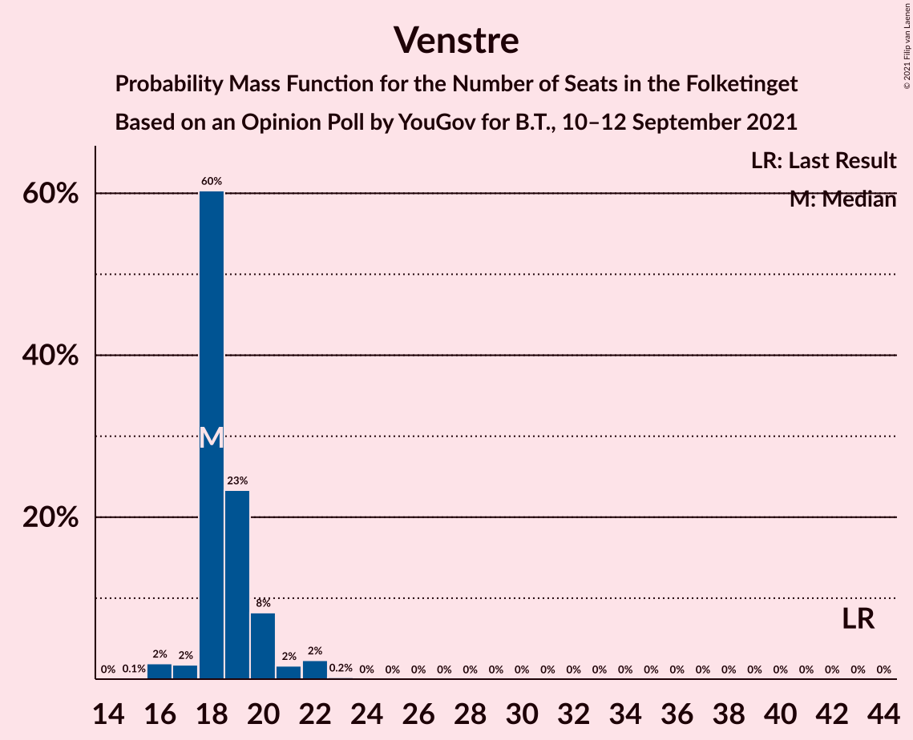
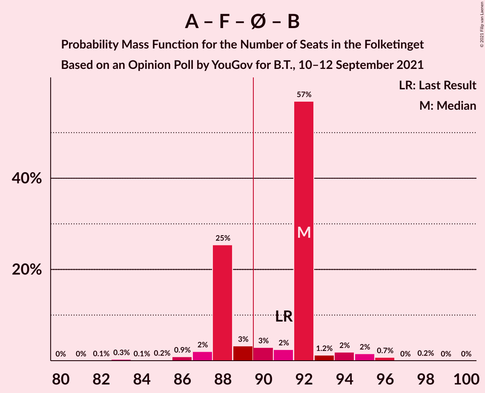
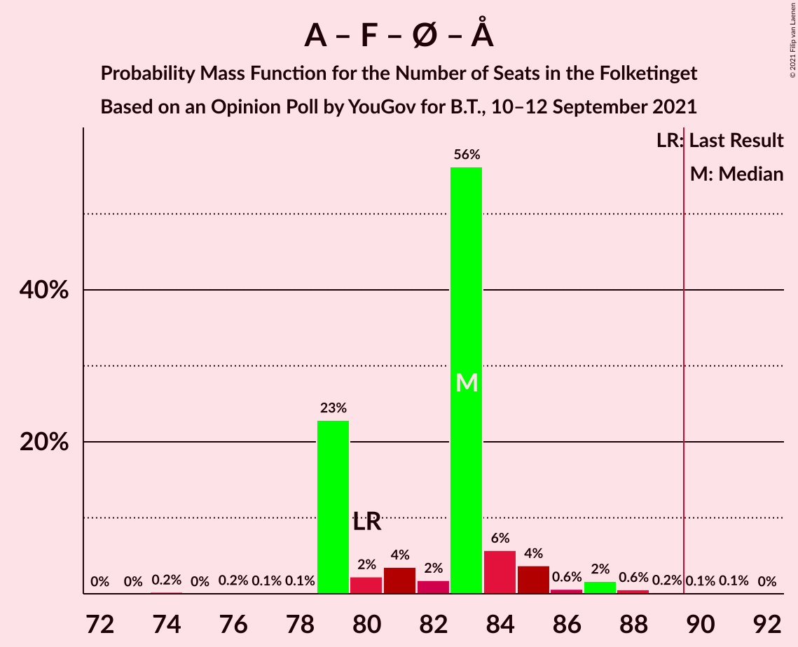

# Opinion Poll by YouGov for B.T., 10–12 September 2021

<a href="#voting-intentions">Voting Intentions</a> | <a href="#seats">Seats</a> | <a href="#coalitions">Coalitions</a> | <a href="#technical-information">Technical Information</a>

## Voting Intentions

### Confidence Intervals

| Party | Last Result | Poll Result | 80% Confidence Interval | 90% Confidence Interval | 95% Confidence Interval | 99% Confidence Interval |
|:-----:|:-----------:|:-----------:|:-----------------------:|:-----------------------:|:-----------------------:|:-----------------------:|
| Socialdemokraterne | 25.9% | 31.0% | 29.4–32.7% |28.9–33.2% |28.5–33.6% |27.7–34.4% |
| Det Konservative Folkeparti | 6.6% | 16.8% | 15.5–18.3% |15.2–18.7% |14.9–19.0% |14.3–19.7% |
| Venstre | 23.4% | 10.3% | 9.3–11.5% |9.0–11.8% |8.7–12.1% |8.2–12.7% |
| Nye Borgerlige | 2.4% | 9.8% | 8.8–11.0% |8.5–11.3% |8.3–11.6% |7.8–12.1% |
| Socialistisk Folkeparti | 7.7% | 7.9% | 7.0–9.0% |6.8–9.3% |6.5–9.5% |6.1–10.1% |
| Enhedslisten–De Rød-Grønne | 6.9% | 7.4% | 6.5–8.4% |6.2–8.7% |6.0–8.9% |5.6–9.4% |
| Dansk Folkeparti | 8.7% | 7.1% | 6.3–8.1% |6.0–8.4% |5.8–8.7% |5.4–9.2% |
| Radikale Venstre | 8.6% | 4.0% | 3.4–4.8% |3.2–5.1% |3.1–5.3% |2.8–5.7% |
| Liberal Alliance | 2.3% | 2.2% | 1.8–2.9% |1.6–3.0% |1.5–3.2% |1.3–3.5% |
| Kristendemokraterne | 1.7% | 1.7% | 1.3–2.2% |1.2–2.4% |1.1–2.5% |0.9–2.8% |
| Veganerpartiet | 0.0% | 1.2% | 0.9–1.7% |0.8–1.8% |0.7–2.0% |0.6–2.2% |
| Alternativet | 3.0% | 0.6% | 0.4–1.0% |0.4–1.1% |0.3–1.2% |0.2–1.5% |

*Note:* The poll result column reflects the actual value used in the calculations. Published results may vary slightly, and in addition be rounded to fewer digits.

## Seats

### Confidence Intervals

| Party | Last Result | Median | 80% Confidence Interval | 90% Confidence Interval | 95% Confidence Interval | 99% Confidence Interval |
|:-----:|:-----------:|:------:|:-----------------------:|:-----------------------:|:-----------------------:|:-----------------------:|
| <a href="#socialdemokraterne">Socialdemokraterne</a> | 48 | 54 | 51–55 |51–57 |51–59 |51–61 |
| <a href="#det-konservative-folkeparti">Det Konservative Folkeparti</a> | 12 | 31 | 30–32 |29–32 |27–32 |26–35 |
| <a href="#venstre">Venstre</a> | 43 | 18 | 18–20 |18–20 |17–22 |16–22 |
| <a href="#nye-borgerlige">Nye Borgerlige</a> | 4 | 16 | 16–18 |16–20 |15–21 |14–22 |
| <a href="#socialistisk-folkeparti">Socialistisk Folkeparti</a> | 14 | 15 | 14–15 |13–16 |12–16 |12–17 |
| <a href="#enhedslisten–de-rød-grønne">Enhedslisten–De Rød-Grønne</a> | 13 | 14 | 13–14 |12–14 |12–15 |11–17 |
| <a href="#dansk-folkeparti">Dansk Folkeparti</a> | 16 | 14 | 12–14 |10–14 |10–15 |10–15 |
| <a href="#radikale-venstre">Radikale Venstre</a> | 16 | 9 | 6–9 |6–9 |6–9 |6–10 |
| <a href="#liberal-alliance">Liberal Alliance</a> | 4 | 4 | 4–5 |0–5 |0–5 |0–6 |
| <a href="#kristendemokraterne">Kristendemokraterne</a> | 0 | 0 | 0 |0–4 |0–4 |0–5 |
| <a href="#veganerpartiet">Veganerpartiet</a> | 0 | 0 | 0 |0 |0 |0–4 |
| <a href="#alternativet">Alternativet</a> | 5 | 0 | 0 |0 |0 |0 |

### Socialdemokraterne

*For a full overview of the results for this party, see the [Socialdemokraterne](party-socialdemokraterne.html) page.*

| Number of Seats | Probability | Accumulated | Special Marks |
|:---------------:|:-----------:|:-----------:|:-------------:|
| 48 | 0.1% | 100% | Last Result |
| 49 | 0% | 99.9% |  |
| 50 | 0.4% | 99.9% |  |
| 51 | 23% | 99.5% |  |
| 52 | 0.2% | 76% |  |
| 53 | 3% | 76% |  |
| 54 | 57% | 73% | Median |
| 55 | 8% | 16% |  |
| 56 | 2% | 8% |  |
| 57 | 2% | 6% |  |
| 58 | 0.2% | 5% |  |
| 59 | 3% | 4% |  |
| 60 | 0.8% | 2% |  |
| 61 | 1.0% | 1.1% |  |
| 62 | 0% | 0.1% |  |
| 63 | 0.1% | 0.1% |  |
| 64 | 0% | 0% |  |

### Det Konservative Folkeparti

*For a full overview of the results for this party, see the [Det Konservative Folkeparti](party-detkonservativefolkeparti.html) page.*

| Number of Seats | Probability | Accumulated | Special Marks |
|:---------------:|:-----------:|:-----------:|:-------------:|
| 12 | 0% | 100% | Last Result |
| 13 | 0% | 100% |  |
| 14 | 0% | 100% |  |
| 15 | 0% | 100% |  |
| 16 | 0% | 100% |  |
| 17 | 0% | 100% |  |
| 18 | 0% | 100% |  |
| 19 | 0% | 100% |  |
| 20 | 0% | 100% |  |
| 21 | 0% | 100% |  |
| 22 | 0% | 100% |  |
| 23 | 0% | 100% |  |
| 24 | 0% | 100% |  |
| 25 | 0% | 100% |  |
| 26 | 1.5% | 100% |  |
| 27 | 2% | 98% |  |
| 28 | 0.8% | 97% |  |
| 29 | 4% | 96% |  |
| 30 | 5% | 92% |  |
| 31 | 60% | 87% | Median |
| 32 | 25% | 27% |  |
| 33 | 0.9% | 2% |  |
| 34 | 0.2% | 0.8% |  |
| 35 | 0.5% | 0.6% |  |
| 36 | 0% | 0.1% |  |
| 37 | 0% | 0% |  |

### Venstre

*For a full overview of the results for this party, see the [Venstre](party-venstre.html) page.*

| Number of Seats | Probability | Accumulated | Special Marks |
|:---------------:|:-----------:|:-----------:|:-------------:|
| 15 | 0.1% | 100% |  |
| 16 | 2% | 99.8% |  |
| 17 | 2% | 98% |  |
| 18 | 60% | 96% | Median |
| 19 | 23% | 36% |  |
| 20 | 8% | 12% |  |
| 21 | 2% | 4% |  |
| 22 | 2% | 3% |  |
| 23 | 0.2% | 0.3% |  |
| 24 | 0% | 0% |  |
| 25 | 0% | 0% |  |
| 26 | 0% | 0% |  |
| 27 | 0% | 0% |  |
| 28 | 0% | 0% |  |
| 29 | 0% | 0% |  |
| 30 | 0% | 0% |  |
| 31 | 0% | 0% |  |
| 32 | 0% | 0% |  |
| 33 | 0% | 0% |  |
| 34 | 0% | 0% |  |
| 35 | 0% | 0% |  |
| 36 | 0% | 0% |  |
| 37 | 0% | 0% |  |
| 38 | 0% | 0% |  |
| 39 | 0% | 0% |  |
| 40 | 0% | 0% |  |
| 41 | 0% | 0% |  |
| 42 | 0% | 0% |  |
| 43 | 0% | 0% | Last Result |

### Nye Borgerlige

*For a full overview of the results for this party, see the [Nye Borgerlige](party-nyeborgerlige.html) page.*

| Number of Seats | Probability | Accumulated | Special Marks |
|:---------------:|:-----------:|:-----------:|:-------------:|
| 4 | 0% | 100% | Last Result |
| 5 | 0% | 100% |  |
| 6 | 0% | 100% |  |
| 7 | 0% | 100% |  |
| 8 | 0% | 100% |  |
| 9 | 0% | 100% |  |
| 10 | 0% | 100% |  |
| 11 | 0% | 100% |  |
| 12 | 0% | 100% |  |
| 13 | 0.1% | 100% |  |
| 14 | 1.1% | 99.9% |  |
| 15 | 2% | 98.8% |  |
| 16 | 54% | 97% | Median |
| 17 | 4% | 42% |  |
| 18 | 28% | 38% |  |
| 19 | 4% | 10% |  |
| 20 | 4% | 6% |  |
| 21 | 2% | 3% |  |
| 22 | 0.8% | 0.9% |  |
| 23 | 0.1% | 0.1% |  |
| 24 | 0% | 0% |  |

### Socialistisk Folkeparti

*For a full overview of the results for this party, see the [Socialistisk Folkeparti](party-socialistiskfolkeparti.html) page.*

| Number of Seats | Probability | Accumulated | Special Marks |
|:---------------:|:-----------:|:-----------:|:-------------:|
| 11 | 0.3% | 100% |  |
| 12 | 3% | 99.7% |  |
| 13 | 5% | 97% |  |
| 14 | 26% | 92% | Last Result |
| 15 | 58% | 66% | Median |
| 16 | 6% | 8% |  |
| 17 | 2% | 2% |  |
| 18 | 0.2% | 0.3% |  |
| 19 | 0% | 0.1% |  |
| 20 | 0.1% | 0.1% |  |
| 21 | 0% | 0% |  |

### Enhedslisten–De Rød-Grønne

*For a full overview of the results for this party, see the [Enhedslisten–De Rød-Grønne](party-enhedslisten–derød-grønne.html) page.*

| Number of Seats | Probability | Accumulated | Special Marks |
|:---------------:|:-----------:|:-----------:|:-------------:|
| 10 | 0.4% | 100% |  |
| 11 | 2% | 99.6% |  |
| 12 | 4% | 98% |  |
| 13 | 10% | 94% | Last Result |
| 14 | 81% | 85% | Median |
| 15 | 1.3% | 4% |  |
| 16 | 2% | 2% |  |
| 17 | 0.6% | 0.8% |  |
| 18 | 0.2% | 0.2% |  |
| 19 | 0% | 0% |  |

### Dansk Folkeparti

*For a full overview of the results for this party, see the [Dansk Folkeparti](party-danskfolkeparti.html) page.*

| Number of Seats | Probability | Accumulated | Special Marks |
|:---------------:|:-----------:|:-----------:|:-------------:|
| 9 | 0.5% | 100% |  |
| 10 | 7% | 99.5% |  |
| 11 | 3% | 93% |  |
| 12 | 5% | 90% |  |
| 13 | 3% | 85% |  |
| 14 | 79% | 82% | Median |
| 15 | 3% | 4% |  |
| 16 | 0.2% | 0.5% | Last Result |
| 17 | 0.1% | 0.3% |  |
| 18 | 0.2% | 0.2% |  |
| 19 | 0% | 0% |  |

### Radikale Venstre

*For a full overview of the results for this party, see the [Radikale Venstre](party-radikalevenstre.html) page.*

| Number of Seats | Probability | Accumulated | Special Marks |
|:---------------:|:-----------:|:-----------:|:-------------:|
| 5 | 0.3% | 100% |  |
| 6 | 10% | 99.6% |  |
| 7 | 1.4% | 89% |  |
| 8 | 8% | 88% |  |
| 9 | 78% | 80% | Median |
| 10 | 1.4% | 1.5% |  |
| 11 | 0% | 0% |  |
| 12 | 0% | 0% |  |
| 13 | 0% | 0% |  |
| 14 | 0% | 0% |  |
| 15 | 0% | 0% |  |
| 16 | 0% | 0% | Last Result |

### Liberal Alliance

*For a full overview of the results for this party, see the [Liberal Alliance](party-liberalalliance.html) page.*

| Number of Seats | Probability | Accumulated | Special Marks |
|:---------------:|:-----------:|:-----------:|:-------------:|
| 0 | 5% | 100% |  |
| 1 | 0% | 95% |  |
| 2 | 0% | 95% |  |
| 3 | 0% | 95% |  |
| 4 | 84% | 95% | Last Result, Median |
| 5 | 9% | 11% |  |
| 6 | 1.3% | 1.4% |  |
| 7 | 0.1% | 0.1% |  |
| 8 | 0% | 0% |  |

### Kristendemokraterne

*For a full overview of the results for this party, see the [Kristendemokraterne](party-kristendemokraterne.html) page.*

| Number of Seats | Probability | Accumulated | Special Marks |
|:---------------:|:-----------:|:-----------:|:-------------:|
| 0 | 92% | 100% | Last Result, Median |
| 1 | 0% | 8% |  |
| 2 | 0% | 8% |  |
| 3 | 0% | 8% |  |
| 4 | 6% | 8% |  |
| 5 | 2% | 2% |  |
| 6 | 0% | 0% |  |

### Veganerpartiet

*For a full overview of the results for this party, see the [Veganerpartiet](party-veganerpartiet.html) page.*

| Number of Seats | Probability | Accumulated | Special Marks |
|:---------------:|:-----------:|:-----------:|:-------------:|
| 0 | 99.4% | 100% | Last Result, Median |
| 1 | 0% | 0.6% |  |
| 2 | 0% | 0.6% |  |
| 3 | 0% | 0.6% |  |
| 4 | 0.6% | 0.6% |  |
| 5 | 0% | 0% |  |

### Alternativet

*For a full overview of the results for this party, see the [Alternativet](party-alternativet.html) page.*

| Number of Seats | Probability | Accumulated | Special Marks |
|:---------------:|:-----------:|:-----------:|:-------------:|
| 0 | 100% | 100% | Median |
| 1 | 0% | 0% |  |
| 2 | 0% | 0% |  |
| 3 | 0% | 0% |  |
| 4 | 0% | 0% |  |
| 5 | 0% | 0% | Last Result |

## Coalitions

### Confidence Intervals

| Coalition | Last Result | Median | Majority? | 80% Confidence Interval | 90% Confidence Interval | 95% Confidence Interval | 99% Confidence Interval |
|:---------:|:-----------:|:------:|:---------:|:-----------------------:|:-----------------------:|:-----------------------:|:-----------------------:|
| Socialdemokraterne – Socialistisk Folkeparti – Enhedslisten–De Rød-Grønne – Radikale Venstre – Alternativet | 96 | 92 | 68% | 88–92 | 88–93 | 87–94 | 85–96 |
| Socialdemokraterne – Socialistisk Folkeparti – Enhedslisten–De Rød-Grønne – Radikale Venstre | 91 | 92 | 68% | 88–92 | 88–93 | 87–94 | 85–96 |
| Det Konservative Folkeparti – Venstre – Nye Borgerlige – Dansk Folkeparti – Liberal Alliance – Kristendemokraterne | 79 | 83 | 0.6% | 83–87 | 82–87 | 80–88 | 79–90 |
| Det Konservative Folkeparti – Venstre – Nye Borgerlige – Dansk Folkeparti – Liberal Alliance | 79 | 83 | 0.3% | 82–87 | 81–87 | 80–87 | 79–88 |
| Socialdemokraterne – Socialistisk Folkeparti – Enhedslisten–De Rød-Grønne – Alternativet | 80 | 83 | 0.2% | 79–84 | 79–85 | 79–87 | 77–88 |
| Socialdemokraterne – Socialistisk Folkeparti – Enhedslisten–De Rød-Grønne | 75 | 83 | 0.2% | 79–84 | 79–85 | 79–87 | 77–88 |
| Socialdemokraterne – Socialistisk Folkeparti – Radikale Venstre | 78 | 78 | 0% | 74–78 | 74–80 | 74–81 | 72–83 |
| Det Konservative Folkeparti – Venstre – Dansk Folkeparti – Liberal Alliance – Kristendemokraterne | 75 | 67 | 0% | 65–69 | 64–69 | 63–70 | 62–73 |
| Det Konservative Folkeparti – Venstre – Dansk Folkeparti – Liberal Alliance | 75 | 67 | 0% | 65–69 | 63–69 | 62–69 | 59–71 |
| Socialdemokraterne – Radikale Venstre | 64 | 63 | 0% | 60–63 | 60–66 | 60–67 | 58–67 |
| Det Konservative Folkeparti – Venstre – Liberal Alliance | 59 | 53 | 0% | 53–55 | 51–55 | 49–55 | 47–56 |
| Det Konservative Folkeparti – Venstre | 55 | 49 | 0% | 48–51 | 48–51 | 46–51 | 44–54 |
| Venstre | 43 | 18 | 0% | 18–20 | 18–20 | 17–22 | 16–22 |

### Socialdemokraterne – Socialistisk Folkeparti – Enhedslisten–De Rød-Grønne – Radikale Venstre – Alternativet

| Number of Seats | Probability | Accumulated | Special Marks |
|:---------------:|:-----------:|:-----------:|:-------------:|
| 82 | 0.1% | 100% |  |
| 83 | 0.3% | 99.9% |  |
| 84 | 0.1% | 99.6% |  |
| 85 | 0.2% | 99.5% |  |
| 86 | 0.9% | 99.4% |  |
| 87 | 2% | 98% |  |
| 88 | 25% | 96% |  |
| 89 | 3% | 71% |  |
| 90 | 3% | 68% | Majority |
| 91 | 2% | 65% |  |
| 92 | 57% | 62% | Median |
| 93 | 1.2% | 6% |  |
| 94 | 2% | 4% |  |
| 95 | 2% | 2% |  |
| 96 | 0.7% | 1.0% | Last Result |
| 97 | 0% | 0.2% |  |
| 98 | 0.2% | 0.2% |  |
| 99 | 0% | 0% |  |

### Socialdemokraterne – Socialistisk Folkeparti – Enhedslisten–De Rød-Grønne – Radikale Venstre

| Number of Seats | Probability | Accumulated | Special Marks |
|:---------------:|:-----------:|:-----------:|:-------------:|
| 82 | 0.1% | 100% |  |
| 83 | 0.3% | 99.9% |  |
| 84 | 0.1% | 99.6% |  |
| 85 | 0.2% | 99.5% |  |
| 86 | 0.9% | 99.4% |  |
| 87 | 2% | 98% |  |
| 88 | 25% | 96% |  |
| 89 | 3% | 71% |  |
| 90 | 3% | 68% | Majority |
| 91 | 2% | 65% | Last Result |
| 92 | 57% | 62% | Median |
| 93 | 1.2% | 6% |  |
| 94 | 2% | 4% |  |
| 95 | 2% | 2% |  |
| 96 | 0.7% | 1.0% |  |
| 97 | 0% | 0.2% |  |
| 98 | 0.2% | 0.2% |  |
| 99 | 0% | 0% |  |

### Det Konservative Folkeparti – Venstre – Nye Borgerlige – Dansk Folkeparti – Liberal Alliance – Kristendemokraterne

| Number of Seats | Probability | Accumulated | Special Marks |
|:---------------:|:-----------:|:-----------:|:-------------:|
| 76 | 0% | 100% |  |
| 77 | 0.2% | 99.9% |  |
| 78 | 0% | 99.8% |  |
| 79 | 0.7% | 99.8% | Last Result |
| 80 | 2% | 99.0% |  |
| 81 | 2% | 97% |  |
| 82 | 1.2% | 96% |  |
| 83 | 57% | 94% | Median |
| 84 | 2% | 37% |  |
| 85 | 3% | 35% |  |
| 86 | 3% | 32% |  |
| 87 | 25% | 28% |  |
| 88 | 2% | 3% |  |
| 89 | 0.4% | 1.0% |  |
| 90 | 0.2% | 0.6% | Majority |
| 91 | 0% | 0.4% |  |
| 92 | 0.3% | 0.4% |  |
| 93 | 0.1% | 0.1% |  |
| 94 | 0% | 0% |  |

### Det Konservative Folkeparti – Venstre – Nye Borgerlige – Dansk Folkeparti – Liberal Alliance

| Number of Seats | Probability | Accumulated | Special Marks |
|:---------------:|:-----------:|:-----------:|:-------------:|
| 73 | 0.1% | 100% |  |
| 74 | 0% | 99.9% |  |
| 75 | 0% | 99.9% |  |
| 76 | 0.1% | 99.8% |  |
| 77 | 0.1% | 99.7% |  |
| 78 | 0.1% | 99.6% |  |
| 79 | 1.0% | 99.6% | Last Result |
| 80 | 2% | 98.6% |  |
| 81 | 3% | 97% |  |
| 82 | 6% | 94% |  |
| 83 | 58% | 89% | Median |
| 84 | 2% | 31% |  |
| 85 | 3% | 29% |  |
| 86 | 0.2% | 26% |  |
| 87 | 23% | 26% |  |
| 88 | 2% | 2% |  |
| 89 | 0.2% | 0.5% |  |
| 90 | 0.1% | 0.3% | Majority |
| 91 | 0% | 0.3% |  |
| 92 | 0.3% | 0.3% |  |
| 93 | 0% | 0% |  |

### Socialdemokraterne – Socialistisk Folkeparti – Enhedslisten–De Rød-Grønne – Alternativet

| Number of Seats | Probability | Accumulated | Special Marks |
|:---------------:|:-----------:|:-----------:|:-------------:|
| 74 | 0.2% | 100% |  |
| 75 | 0% | 99.8% |  |
| 76 | 0.2% | 99.8% |  |
| 77 | 0.1% | 99.6% |  |
| 78 | 0.1% | 99.5% |  |
| 79 | 23% | 99.4% |  |
| 80 | 2% | 76% | Last Result |
| 81 | 4% | 74% |  |
| 82 | 2% | 71% |  |
| 83 | 56% | 69% | Median |
| 84 | 6% | 13% |  |
| 85 | 4% | 7% |  |
| 86 | 0.6% | 3% |  |
| 87 | 2% | 3% |  |
| 88 | 0.6% | 1.0% |  |
| 89 | 0.2% | 0.4% |  |
| 90 | 0.1% | 0.2% | Majority |
| 91 | 0.1% | 0.2% |  |
| 92 | 0% | 0% |  |

### Socialdemokraterne – Socialistisk Folkeparti – Enhedslisten–De Rød-Grønne

| Number of Seats | Probability | Accumulated | Special Marks |
|:---------------:|:-----------:|:-----------:|:-------------:|
| 74 | 0.2% | 100% |  |
| 75 | 0% | 99.8% | Last Result |
| 76 | 0.2% | 99.8% |  |
| 77 | 0.1% | 99.6% |  |
| 78 | 0.1% | 99.5% |  |
| 79 | 23% | 99.4% |  |
| 80 | 2% | 76% |  |
| 81 | 4% | 74% |  |
| 82 | 2% | 71% |  |
| 83 | 56% | 69% | Median |
| 84 | 6% | 13% |  |
| 85 | 4% | 7% |  |
| 86 | 0.6% | 3% |  |
| 87 | 2% | 3% |  |
| 88 | 0.6% | 1.0% |  |
| 89 | 0.2% | 0.4% |  |
| 90 | 0.1% | 0.2% | Majority |
| 91 | 0.1% | 0.2% |  |
| 92 | 0% | 0% |  |

### Socialdemokraterne – Socialistisk Folkeparti – Radikale Venstre

| Number of Seats | Probability | Accumulated | Special Marks |
|:---------------:|:-----------:|:-----------:|:-------------:|
| 68 | 0.1% | 100% |  |
| 69 | 0% | 99.9% |  |
| 70 | 0% | 99.9% |  |
| 71 | 0.1% | 99.8% |  |
| 72 | 0.3% | 99.7% |  |
| 73 | 0.3% | 99.5% |  |
| 74 | 27% | 99.2% |  |
| 75 | 2% | 72% |  |
| 76 | 4% | 70% |  |
| 77 | 2% | 66% |  |
| 78 | 57% | 64% | Last Result, Median |
| 79 | 2% | 7% |  |
| 80 | 1.2% | 5% |  |
| 81 | 1.5% | 4% |  |
| 82 | 1.0% | 2% |  |
| 83 | 1.2% | 1.4% |  |
| 84 | 0.1% | 0.1% |  |
| 85 | 0% | 0.1% |  |
| 86 | 0% | 0% |  |

### Det Konservative Folkeparti – Venstre – Dansk Folkeparti – Liberal Alliance – Kristendemokraterne

| Number of Seats | Probability | Accumulated | Special Marks |
|:---------------:|:-----------:|:-----------:|:-------------:|
| 58 | 0.3% | 100% |  |
| 59 | 0% | 99.7% |  |
| 60 | 0% | 99.7% |  |
| 61 | 0.1% | 99.7% |  |
| 62 | 1.5% | 99.5% |  |
| 63 | 1.4% | 98% |  |
| 64 | 2% | 97% |  |
| 65 | 6% | 95% |  |
| 66 | 2% | 89% |  |
| 67 | 58% | 87% | Median |
| 68 | 3% | 29% |  |
| 69 | 23% | 26% |  |
| 70 | 1.3% | 3% |  |
| 71 | 0.2% | 2% |  |
| 72 | 0.3% | 2% |  |
| 73 | 1.1% | 1.4% |  |
| 74 | 0.1% | 0.3% |  |
| 75 | 0.2% | 0.2% | Last Result |
| 76 | 0% | 0% |  |

### Det Konservative Folkeparti – Venstre – Dansk Folkeparti – Liberal Alliance

| Number of Seats | Probability | Accumulated | Special Marks |
|:---------------:|:-----------:|:-----------:|:-------------:|
| 58 | 0.3% | 100% |  |
| 59 | 0.2% | 99.6% |  |
| 60 | 0.2% | 99.5% |  |
| 61 | 0.6% | 99.3% |  |
| 62 | 2% | 98.6% |  |
| 63 | 4% | 97% |  |
| 64 | 3% | 93% |  |
| 65 | 6% | 90% |  |
| 66 | 2% | 84% |  |
| 67 | 55% | 82% | Median |
| 68 | 2% | 27% |  |
| 69 | 24% | 25% |  |
| 70 | 0.1% | 0.6% |  |
| 71 | 0.1% | 0.5% |  |
| 72 | 0.2% | 0.4% |  |
| 73 | 0% | 0.3% |  |
| 74 | 0% | 0.2% |  |
| 75 | 0.2% | 0.2% | Last Result |
| 76 | 0% | 0% |  |

### Socialdemokraterne – Radikale Venstre

| Number of Seats | Probability | Accumulated | Special Marks |
|:---------------:|:-----------:|:-----------:|:-------------:|
| 55 | 0.1% | 100% |  |
| 56 | 0.1% | 99.9% |  |
| 57 | 0.2% | 99.8% |  |
| 58 | 0.2% | 99.6% |  |
| 59 | 2% | 99.4% |  |
| 60 | 23% | 98% |  |
| 61 | 7% | 75% |  |
| 62 | 6% | 68% |  |
| 63 | 54% | 62% | Median |
| 64 | 3% | 8% | Last Result |
| 65 | 0.6% | 6% |  |
| 66 | 0.8% | 5% |  |
| 67 | 4% | 4% |  |
| 68 | 0.1% | 0.2% |  |
| 69 | 0% | 0.1% |  |
| 70 | 0% | 0.1% |  |
| 71 | 0% | 0% |  |

### Det Konservative Folkeparti – Venstre – Liberal Alliance

| Number of Seats | Probability | Accumulated | Special Marks |
|:---------------:|:-----------:|:-----------:|:-------------:|
| 44 | 0.1% | 100% |  |
| 45 | 0% | 99.9% |  |
| 46 | 0.2% | 99.9% |  |
| 47 | 0.4% | 99.7% |  |
| 48 | 0.2% | 99.3% |  |
| 49 | 2% | 99.1% |  |
| 50 | 0.4% | 97% |  |
| 51 | 2% | 96% |  |
| 52 | 2% | 94% |  |
| 53 | 59% | 92% | Median |
| 54 | 4% | 33% |  |
| 55 | 27% | 29% |  |
| 56 | 0.7% | 1.2% |  |
| 57 | 0.1% | 0.4% |  |
| 58 | 0% | 0.3% |  |
| 59 | 0% | 0.3% | Last Result |
| 60 | 0.2% | 0.3% |  |
| 61 | 0% | 0% |  |

### Det Konservative Folkeparti – Venstre

| Number of Seats | Probability | Accumulated | Special Marks |
|:---------------:|:-----------:|:-----------:|:-------------:|
| 42 | 0% | 100% |  |
| 43 | 0.2% | 99.9% |  |
| 44 | 0.3% | 99.8% |  |
| 45 | 2% | 99.5% |  |
| 46 | 0.4% | 98% |  |
| 47 | 1.0% | 97% |  |
| 48 | 7% | 96% |  |
| 49 | 57% | 90% | Median |
| 50 | 0.4% | 32% |  |
| 51 | 30% | 32% |  |
| 52 | 0.4% | 2% |  |
| 53 | 1.1% | 2% |  |
| 54 | 0.1% | 0.5% |  |
| 55 | 0.3% | 0.5% | Last Result |
| 56 | 0.1% | 0.1% |  |
| 57 | 0% | 0% |  |

### Venstre

| Number of Seats | Probability | Accumulated | Special Marks |
|:---------------:|:-----------:|:-----------:|:-------------:|
| 15 | 0.1% | 100% |  |
| 16 | 2% | 99.8% |  |
| 17 | 2% | 98% |  |
| 18 | 60% | 96% | Median |
| 19 | 23% | 36% |  |
| 20 | 8% | 12% |  |
| 21 | 2% | 4% |  |
| 22 | 2% | 3% |  |
| 23 | 0.2% | 0.3% |  |
| 24 | 0% | 0% |  |
| 25 | 0% | 0% |  |
| 26 | 0% | 0% |  |
| 27 | 0% | 0% |  |
| 28 | 0% | 0% |  |
| 29 | 0% | 0% |  |
| 30 | 0% | 0% |  |
| 31 | 0% | 0% |  |
| 32 | 0% | 0% |  |
| 33 | 0% | 0% |  |
| 34 | 0% | 0% |  |
| 35 | 0% | 0% |  |
| 36 | 0% | 0% |  |
| 37 | 0% | 0% |  |
| 38 | 0% | 0% |  |
| 39 | 0% | 0% |  |
| 40 | 0% | 0% |  |
| 41 | 0% | 0% |  |
| 42 | 0% | 0% |  |
| 43 | 0% | 0% | Last Result |

## Technical Information

### Opinion Poll

+ **Polling firm:** YouGov
+ **Commissioner(s):** B.T.
+ **Fieldwork period:** 10–12 September 2021

### Calculations

+ **Sample size:** 1265
+ **Simulations done:** 1,048,576
+ **Error estimate:** 2.30%

