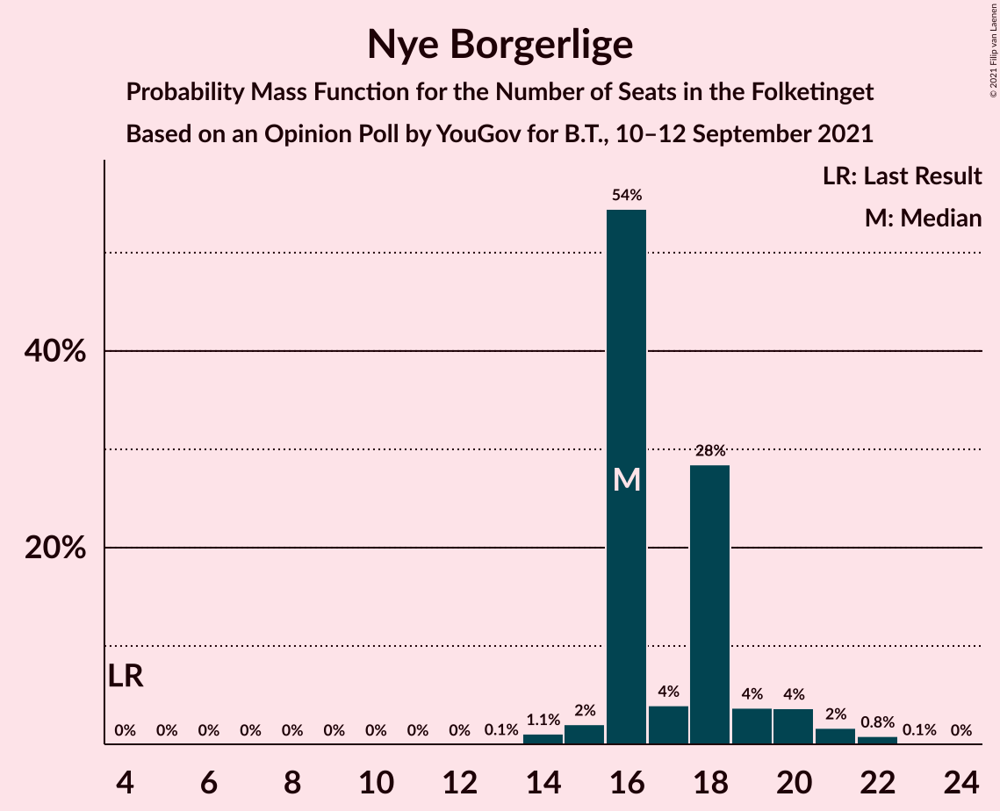
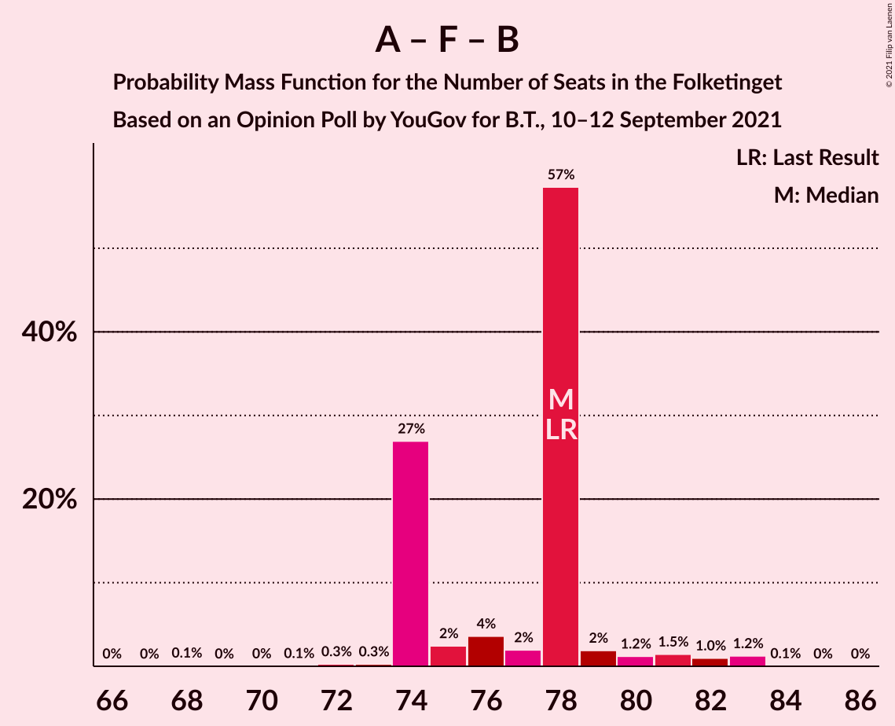
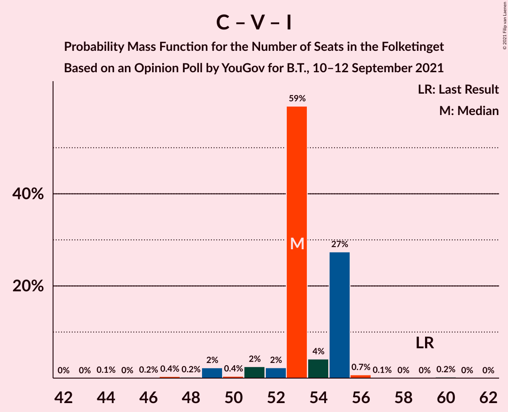

# Opinion Poll by YouGov for B.T., 10–12 September 2021

<a href="#voting-intentions">Voting Intentions</a> | <a href="#seats">Seats</a> | <a href="#coalitions">Coalitions</a> | <a href="#technical-information">Technical Information</a>

## Voting Intentions

### Confidence Intervals

| Party | Last Result | Poll Result | 80% Confidence Interval | 90% Confidence Interval | 95% Confidence Interval | 99% Confidence Interval |
|:-----:|:-----------:|:-----------:|:-----------------------:|:-----------------------:|:-----------------------:|:-----------------------:|
| Socialdemokraterne | 25.9% | 31.0% | 29.4–32.7% |28.9–33.2% |28.5–33.6% |27.7–34.4% |
| Det Konservative Folkeparti | 6.6% | 16.8% | 15.5–18.3% |15.2–18.7% |14.9–19.0% |14.3–19.7% |
| Venstre | 23.4% | 10.3% | 9.3–11.5% |9.0–11.8% |8.7–12.1% |8.2–12.7% |
| Nye Borgerlige | 2.4% | 9.8% | 8.8–11.0% |8.5–11.3% |8.3–11.6% |7.8–12.1% |
| Socialistisk Folkeparti | 7.7% | 7.9% | 7.0–9.0% |6.8–9.3% |6.5–9.5% |6.1–10.1% |
| Enhedslisten–De Rød-Grønne | 6.9% | 7.4% | 6.5–8.4% |6.2–8.7% |6.0–8.9% |5.6–9.4% |
| Dansk Folkeparti | 8.7% | 7.1% | 6.3–8.1% |6.0–8.4% |5.8–8.7% |5.4–9.2% |
| Radikale Venstre | 8.6% | 4.0% | 3.4–4.8% |3.2–5.1% |3.1–5.3% |2.8–5.7% |
| Liberal Alliance | 2.3% | 2.2% | 1.8–2.9% |1.6–3.0% |1.5–3.2% |1.3–3.5% |
| Kristendemokraterne | 1.7% | 1.7% | 1.3–2.2% |1.2–2.4% |1.1–2.5% |0.9–2.8% |
| Veganerpartiet | 0.0% | 1.2% | 0.9–1.7% |0.8–1.8% |0.7–2.0% |0.6–2.2% |
| Alternativet | 3.0% | 0.6% | 0.4–1.0% |0.4–1.1% |0.3–1.2% |0.2–1.5% |

*Note:* The poll result column reflects the actual value used in the calculations. Published results may vary slightly, and in addition be rounded to fewer digits.

## Seats

### Confidence Intervals

| Party | Last Result | Median | 80% Confidence Interval | 90% Confidence Interval | 95% Confidence Interval | 99% Confidence Interval |
|:-----:|:-----------:|:------:|:-----------------------:|:-----------------------:|:-----------------------:|:-----------------------:|
| <a href="#socialdemokraterne">Socialdemokraterne</a> | 48 | 51 | 51–53 |51–55 |51–57 |51–59 |
| <a href="#det-konservative-folkeparti">Det Konservative Folkeparti</a> | 12 | 32 | 32 |29–32 |28–32 |27–32 |
| <a href="#venstre">Venstre</a> | 43 | 19 | 19 |18–19 |17–21 |16–21 |
| <a href="#nye-borgerlige">Nye Borgerlige</a> | 4 | 18 | 18 |16–18 |15–18 |14–20 |
| <a href="#socialistisk-folkeparti">Socialistisk Folkeparti</a> | 14 | 14 | 14–15 |14–17 |14–17 |13–17 |
| <a href="#enhedslisten–de-rød-grønne">Enhedslisten–De Rød-Grønne</a> | 13 | 14 | 14 |14–15 |12–15 |11–17 |
| <a href="#dansk-folkeparti">Dansk Folkeparti</a> | 16 | 14 | 13–14 |13–14 |13–14 |11–15 |
| <a href="#radikale-venstre">Radikale Venstre</a> | 16 | 9 | 9 |9 |8–10 |7–10 |
| <a href="#liberal-alliance">Liberal Alliance</a> | 4 | 4 | 4 |4 |0–5 |0–6 |
| <a href="#kristendemokraterne">Kristendemokraterne</a> | 0 | 0 | 0 |0 |0 |0–4 |
| <a href="#veganerpartiet">Veganerpartiet</a> | 0 | 0 | 0 |0 |0 |0 |
| <a href="#alternativet">Alternativet</a> | 5 | 0 | 0 |0 |0 |0 |

### Socialdemokraterne

*For a full overview of the results for this party, see the [Socialdemokraterne](party-socialdemokraterne.html) page.*

| Number of Seats | Probability | Accumulated | Special Marks |
|:---------------:|:-----------:|:-----------:|:-------------:|
| 48 | 0.3% | 100% | Last Result |
| 49 | 0% | 99.7% |  |
| 50 | 0% | 99.7% |  |
| 51 | 88% | 99.7% | Median |
| 52 | 0.2% | 12% |  |
| 53 | 4% | 12% |  |
| 54 | 0.5% | 8% |  |
| 55 | 3% | 7% |  |
| 56 | 0.1% | 4% |  |
| 57 | 4% | 4% |  |
| 58 | 0.1% | 0.9% |  |
| 59 | 0.4% | 0.7% |  |
| 60 | 0.1% | 0.3% |  |
| 61 | 0% | 0.2% |  |
| 62 | 0% | 0.1% |  |
| 63 | 0.1% | 0.1% |  |
| 64 | 0% | 0% |  |

### Det Konservative Folkeparti

*For a full overview of the results for this party, see the [Det Konservative Folkeparti](party-detkonservativefolkeparti.html) page.*

| Number of Seats | Probability | Accumulated | Special Marks |
|:---------------:|:-----------:|:-----------:|:-------------:|
| 12 | 0% | 100% | Last Result |
| 13 | 0% | 100% |  |
| 14 | 0% | 100% |  |
| 15 | 0% | 100% |  |
| 16 | 0% | 100% |  |
| 17 | 0% | 100% |  |
| 18 | 0% | 100% |  |
| 19 | 0% | 100% |  |
| 20 | 0% | 100% |  |
| 21 | 0% | 100% |  |
| 22 | 0% | 100% |  |
| 23 | 0% | 100% |  |
| 24 | 0% | 100% |  |
| 25 | 0% | 100% |  |
| 26 | 0% | 100% |  |
| 27 | 1.4% | 100% |  |
| 28 | 2% | 98.6% |  |
| 29 | 3% | 96% |  |
| 30 | 0.8% | 93% |  |
| 31 | 0% | 93% |  |
| 32 | 92% | 93% | Median |
| 33 | 0.3% | 0.5% |  |
| 34 | 0.1% | 0.1% |  |
| 35 | 0% | 0.1% |  |
| 36 | 0.1% | 0.1% |  |
| 37 | 0% | 0% |  |

### Venstre

*For a full overview of the results for this party, see the [Venstre](party-venstre.html) page.*

| Number of Seats | Probability | Accumulated | Special Marks |
|:---------------:|:-----------:|:-----------:|:-------------:|
| 14 | 0.1% | 100% |  |
| 15 | 0.1% | 99.9% |  |
| 16 | 0.8% | 99.8% |  |
| 17 | 3% | 99.0% |  |
| 18 | 3% | 96% |  |
| 19 | 89% | 93% | Median |
| 20 | 0.2% | 4% |  |
| 21 | 4% | 4% |  |
| 22 | 0% | 0% |  |
| 23 | 0% | 0% |  |
| 24 | 0% | 0% |  |
| 25 | 0% | 0% |  |
| 26 | 0% | 0% |  |
| 27 | 0% | 0% |  |
| 28 | 0% | 0% |  |
| 29 | 0% | 0% |  |
| 30 | 0% | 0% |  |
| 31 | 0% | 0% |  |
| 32 | 0% | 0% |  |
| 33 | 0% | 0% |  |
| 34 | 0% | 0% |  |
| 35 | 0% | 0% |  |
| 36 | 0% | 0% |  |
| 37 | 0% | 0% |  |
| 38 | 0% | 0% |  |
| 39 | 0% | 0% |  |
| 40 | 0% | 0% |  |
| 41 | 0% | 0% |  |
| 42 | 0% | 0% |  |
| 43 | 0% | 0% | Last Result |

### Nye Borgerlige

*For a full overview of the results for this party, see the [Nye Borgerlige](party-nyeborgerlige.html) page.*

| Number of Seats | Probability | Accumulated | Special Marks |
|:---------------:|:-----------:|:-----------:|:-------------:|
| 4 | 0% | 100% | Last Result |
| 5 | 0% | 100% |  |
| 6 | 0% | 100% |  |
| 7 | 0% | 100% |  |
| 8 | 0% | 100% |  |
| 9 | 0% | 100% |  |
| 10 | 0% | 100% |  |
| 11 | 0% | 100% |  |
| 12 | 0% | 100% |  |
| 13 | 0.1% | 100% |  |
| 14 | 0.4% | 99.9% |  |
| 15 | 4% | 99.5% |  |
| 16 | 3% | 95% |  |
| 17 | 2% | 92% |  |
| 18 | 88% | 90% | Median |
| 19 | 0.7% | 2% |  |
| 20 | 0.9% | 1.2% |  |
| 21 | 0.3% | 0.3% |  |
| 22 | 0% | 0% |  |

### Socialistisk Folkeparti

*For a full overview of the results for this party, see the [Socialistisk Folkeparti](party-socialistiskfolkeparti.html) page.*

| Number of Seats | Probability | Accumulated | Special Marks |
|:---------------:|:-----------:|:-----------:|:-------------:|
| 11 | 0.2% | 100% |  |
| 12 | 0.2% | 99.8% |  |
| 13 | 0.5% | 99.6% |  |
| 14 | 88% | 99.1% | Last Result, Median |
| 15 | 5% | 11% |  |
| 16 | 0.8% | 6% |  |
| 17 | 5% | 5% |  |
| 18 | 0% | 0% |  |

### Enhedslisten–De Rød-Grønne

*For a full overview of the results for this party, see the [Enhedslisten–De Rød-Grønne](party-enhedslisten–derød-grønne.html) page.*

| Number of Seats | Probability | Accumulated | Special Marks |
|:---------------:|:-----------:|:-----------:|:-------------:|
| 10 | 0.4% | 100% |  |
| 11 | 0.6% | 99.6% |  |
| 12 | 3% | 99.0% |  |
| 13 | 0.6% | 96% | Last Result |
| 14 | 89% | 95% | Median |
| 15 | 4% | 6% |  |
| 16 | 0.2% | 2% |  |
| 17 | 2% | 2% |  |
| 18 | 0% | 0% |  |

### Dansk Folkeparti

*For a full overview of the results for this party, see the [Dansk Folkeparti](party-danskfolkeparti.html) page.*

| Number of Seats | Probability | Accumulated | Special Marks |
|:---------------:|:-----------:|:-----------:|:-------------:|
| 10 | 0% | 100% |  |
| 11 | 0.7% | 99.9% |  |
| 12 | 0.9% | 99.2% |  |
| 13 | 8% | 98% |  |
| 14 | 89% | 90% | Median |
| 15 | 0.6% | 0.8% |  |
| 16 | 0% | 0.2% | Last Result |
| 17 | 0% | 0.1% |  |
| 18 | 0.1% | 0.1% |  |
| 19 | 0% | 0% |  |

### Radikale Venstre

*For a full overview of the results for this party, see the [Radikale Venstre](party-radikalevenstre.html) page.*

| Number of Seats | Probability | Accumulated | Special Marks |
|:---------------:|:-----------:|:-----------:|:-------------:|
| 5 | 0.4% | 100% |  |
| 6 | 0.1% | 99.6% |  |
| 7 | 2% | 99.5% |  |
| 8 | 0.8% | 98% |  |
| 9 | 94% | 97% | Median |
| 10 | 3% | 3% |  |
| 11 | 0% | 0% |  |
| 12 | 0% | 0% |  |
| 13 | 0% | 0% |  |
| 14 | 0% | 0% |  |
| 15 | 0% | 0% |  |
| 16 | 0% | 0% | Last Result |

### Liberal Alliance

*For a full overview of the results for this party, see the [Liberal Alliance](party-liberalalliance.html) page.*

| Number of Seats | Probability | Accumulated | Special Marks |
|:---------------:|:-----------:|:-----------:|:-------------:|
| 0 | 5% | 100% |  |
| 1 | 0% | 95% |  |
| 2 | 0% | 95% |  |
| 3 | 0% | 95% |  |
| 4 | 90% | 95% | Last Result, Median |
| 5 | 3% | 5% |  |
| 6 | 1.3% | 1.3% |  |
| 7 | 0% | 0% |  |

### Kristendemokraterne

*For a full overview of the results for this party, see the [Kristendemokraterne](party-kristendemokraterne.html) page.*

| Number of Seats | Probability | Accumulated | Special Marks |
|:---------------:|:-----------:|:-----------:|:-------------:|
| 0 | 98% | 100% | Last Result, Median |
| 1 | 0% | 2% |  |
| 2 | 0% | 2% |  |
| 3 | 0% | 2% |  |
| 4 | 1.4% | 2% |  |
| 5 | 0.2% | 0.2% |  |
| 6 | 0% | 0% |  |

### Veganerpartiet

*For a full overview of the results for this party, see the [Veganerpartiet](party-veganerpartiet.html) page.*

| Number of Seats | Probability | Accumulated | Special Marks |
|:---------------:|:-----------:|:-----------:|:-------------:|
| 0 | 99.9% | 100% | Last Result, Median |
| 1 | 0% | 0.1% |  |
| 2 | 0% | 0.1% |  |
| 3 | 0% | 0.1% |  |
| 4 | 0.1% | 0.1% |  |
| 5 | 0% | 0% |  |

### Alternativet

*For a full overview of the results for this party, see the [Alternativet](party-alternativet.html) page.*

| Number of Seats | Probability | Accumulated | Special Marks |
|:---------------:|:-----------:|:-----------:|:-------------:|
| 0 | 100% | 100% | Median |
| 1 | 0% | 0% |  |
| 2 | 0% | 0% |  |
| 3 | 0% | 0% |  |
| 4 | 0% | 0% |  |
| 5 | 0% | 0% | Last Result |

## Coalitions

### Confidence Intervals

| Coalition | Last Result | Median | Majority? | 80% Confidence Interval | 90% Confidence Interval | 95% Confidence Interval | 99% Confidence Interval |
|:---------:|:-----------:|:------:|:---------:|:-----------------------:|:-----------------------:|:-----------------------:|:-----------------------:|
| Socialdemokraterne – Socialistisk Folkeparti – Enhedslisten–De Rød-Grønne – Radikale Venstre – Alternativet | 96 | 88 | 11% | 88–91 | 88–94 | 88–94 | 86–98 |
| Socialdemokraterne – Socialistisk Folkeparti – Enhedslisten–De Rød-Grønne – Radikale Venstre | 91 | 88 | 11% | 88–91 | 88–94 | 88–94 | 86–98 |
| Det Konservative Folkeparti – Venstre – Nye Borgerlige – Dansk Folkeparti – Liberal Alliance – Kristendemokraterne | 79 | 87 | 0.2% | 84–87 | 81–87 | 81–87 | 77–89 |
| Det Konservative Folkeparti – Venstre – Nye Borgerlige – Dansk Folkeparti – Liberal Alliance | 79 | 87 | 0.2% | 82–87 | 81–87 | 79–87 | 74–87 |
| Socialdemokraterne – Socialistisk Folkeparti – Enhedslisten–De Rød-Grønne – Alternativet | 80 | 79 | 0.5% | 79–84 | 79–85 | 79–86 | 79–91 |
| Socialdemokraterne – Socialistisk Folkeparti – Enhedslisten–De Rød-Grønne | 75 | 79 | 0.5% | 79–84 | 79–85 | 79–86 | 79–91 |
| Socialdemokraterne – Socialistisk Folkeparti – Radikale Venstre | 78 | 74 | 0% | 74–79 | 74–79 | 74–82 | 74–82 |
| Det Konservative Folkeparti – Venstre – Dansk Folkeparti – Liberal Alliance – Kristendemokraterne | 75 | 69 | 0% | 66–69 | 65–69 | 64–69 | 62–69 |
| Det Konservative Folkeparti – Venstre – Dansk Folkeparti – Liberal Alliance | 75 | 69 | 0% | 66–69 | 65–69 | 62–69 | 59–69 |
| Socialdemokraterne – Radikale Venstre | 64 | 60 | 0% | 60–62 | 60–64 | 60–67 | 60–67 |
| Det Konservative Folkeparti – Venstre – Liberal Alliance | 59 | 55 | 0% | 53–55 | 52–55 | 49–55 | 47–56 |
| Det Konservative Folkeparti – Venstre | 55 | 51 | 0% | 51 | 47–51 | 45–53 | 43–53 |
| Venstre | 43 | 19 | 0% | 19 | 18–19 | 17–21 | 16–21 |

### Socialdemokraterne – Socialistisk Folkeparti – Enhedslisten–De Rød-Grønne – Radikale Venstre – Alternativet

| Number of Seats | Probability | Accumulated | Special Marks |
|:---------------:|:-----------:|:-----------:|:-------------:|
| 83 | 0.1% | 100% |  |
| 84 | 0% | 99.9% |  |
| 85 | 0.1% | 99.8% |  |
| 86 | 0.4% | 99.8% |  |
| 87 | 0% | 99.4% |  |
| 88 | 88% | 99.4% | Median |
| 89 | 0.3% | 11% |  |
| 90 | 0.6% | 11% | Majority |
| 91 | 0.5% | 10% |  |
| 92 | 0.5% | 10% |  |
| 93 | 0.6% | 9% |  |
| 94 | 6% | 9% |  |
| 95 | 0% | 2% |  |
| 96 | 2% | 2% | Last Result |
| 97 | 0% | 0.6% |  |
| 98 | 0.5% | 0.6% |  |
| 99 | 0% | 0.1% |  |
| 100 | 0% | 0.1% |  |
| 101 | 0.1% | 0.1% |  |
| 102 | 0% | 0% |  |

### Socialdemokraterne – Socialistisk Folkeparti – Enhedslisten–De Rød-Grønne – Radikale Venstre

| Number of Seats | Probability | Accumulated | Special Marks |
|:---------------:|:-----------:|:-----------:|:-------------:|
| 83 | 0.1% | 100% |  |
| 84 | 0% | 99.9% |  |
| 85 | 0.1% | 99.8% |  |
| 86 | 0.4% | 99.8% |  |
| 87 | 0% | 99.4% |  |
| 88 | 88% | 99.4% | Median |
| 89 | 0.3% | 11% |  |
| 90 | 0.6% | 11% | Majority |
| 91 | 0.5% | 10% | Last Result |
| 92 | 0.5% | 10% |  |
| 93 | 0.6% | 9% |  |
| 94 | 6% | 9% |  |
| 95 | 0% | 2% |  |
| 96 | 2% | 2% |  |
| 97 | 0% | 0.6% |  |
| 98 | 0.5% | 0.6% |  |
| 99 | 0% | 0.1% |  |
| 100 | 0% | 0.1% |  |
| 101 | 0.1% | 0.1% |  |
| 102 | 0% | 0% |  |

### Det Konservative Folkeparti – Venstre – Nye Borgerlige – Dansk Folkeparti – Liberal Alliance – Kristendemokraterne

| Number of Seats | Probability | Accumulated | Special Marks |
|:---------------:|:-----------:|:-----------:|:-------------:|
| 74 | 0.1% | 100% |  |
| 75 | 0% | 99.9% |  |
| 76 | 0% | 99.9% |  |
| 77 | 0.5% | 99.9% |  |
| 78 | 0% | 99.4% |  |
| 79 | 2% | 99.4% | Last Result |
| 80 | 0% | 98% |  |
| 81 | 6% | 98% |  |
| 82 | 0.6% | 91% |  |
| 83 | 0.5% | 91% |  |
| 84 | 0.5% | 90% |  |
| 85 | 0.6% | 90% |  |
| 86 | 0.3% | 89% |  |
| 87 | 88% | 89% | Median |
| 88 | 0% | 0.6% |  |
| 89 | 0.4% | 0.6% |  |
| 90 | 0.1% | 0.2% | Majority |
| 91 | 0% | 0.2% |  |
| 92 | 0.1% | 0.1% |  |
| 93 | 0% | 0% |  |

### Det Konservative Folkeparti – Venstre – Nye Borgerlige – Dansk Folkeparti – Liberal Alliance

| Number of Seats | Probability | Accumulated | Special Marks |
|:---------------:|:-----------:|:-----------:|:-------------:|
| 73 | 0.4% | 100% |  |
| 74 | 0.1% | 99.6% |  |
| 75 | 0% | 99.5% |  |
| 76 | 0% | 99.5% |  |
| 77 | 0% | 99.4% |  |
| 78 | 0.2% | 99.4% |  |
| 79 | 2% | 99.2% | Last Result |
| 80 | 0% | 97% |  |
| 81 | 7% | 97% |  |
| 82 | 0.5% | 90% |  |
| 83 | 0.4% | 90% |  |
| 84 | 0.5% | 89% |  |
| 85 | 0.3% | 89% |  |
| 86 | 0.3% | 89% |  |
| 87 | 88% | 88% | Median |
| 88 | 0% | 0.3% |  |
| 89 | 0.1% | 0.3% |  |
| 90 | 0% | 0.2% | Majority |
| 91 | 0% | 0.1% |  |
| 92 | 0.1% | 0.1% |  |
| 93 | 0% | 0% |  |

### Socialdemokraterne – Socialistisk Folkeparti – Enhedslisten–De Rød-Grønne – Alternativet

| Number of Seats | Probability | Accumulated | Special Marks |
|:---------------:|:-----------:|:-----------:|:-------------:|
| 76 | 0.2% | 100% |  |
| 77 | 0% | 99.8% |  |
| 78 | 0% | 99.8% |  |
| 79 | 89% | 99.8% | Median |
| 80 | 0% | 11% | Last Result |
| 81 | 0% | 11% |  |
| 82 | 0.7% | 11% |  |
| 83 | 0.3% | 10% |  |
| 84 | 3% | 10% |  |
| 85 | 4% | 7% |  |
| 86 | 0.8% | 3% |  |
| 87 | 2% | 2% |  |
| 88 | 0.2% | 0.7% |  |
| 89 | 0% | 0.6% |  |
| 90 | 0% | 0.5% | Majority |
| 91 | 0.5% | 0.5% |  |
| 92 | 0% | 0% |  |

### Socialdemokraterne – Socialistisk Folkeparti – Enhedslisten–De Rød-Grønne

| Number of Seats | Probability | Accumulated | Special Marks |
|:---------------:|:-----------:|:-----------:|:-------------:|
| 75 | 0% | 100% | Last Result |
| 76 | 0.2% | 100% |  |
| 77 | 0% | 99.8% |  |
| 78 | 0% | 99.8% |  |
| 79 | 89% | 99.8% | Median |
| 80 | 0% | 11% |  |
| 81 | 0% | 11% |  |
| 82 | 0.7% | 11% |  |
| 83 | 0.3% | 10% |  |
| 84 | 3% | 10% |  |
| 85 | 4% | 7% |  |
| 86 | 0.8% | 3% |  |
| 87 | 2% | 2% |  |
| 88 | 0.2% | 0.7% |  |
| 89 | 0% | 0.6% |  |
| 90 | 0% | 0.5% | Majority |
| 91 | 0.5% | 0.5% |  |
| 92 | 0% | 0% |  |

### Socialdemokraterne – Socialistisk Folkeparti – Radikale Venstre

| Number of Seats | Probability | Accumulated | Special Marks |
|:---------------:|:-----------:|:-----------:|:-------------:|
| 70 | 0.1% | 100% |  |
| 71 | 0% | 99.8% |  |
| 72 | 0.3% | 99.8% |  |
| 73 | 0% | 99.5% |  |
| 74 | 88% | 99.5% | Median |
| 75 | 0.1% | 11% |  |
| 76 | 0% | 11% |  |
| 77 | 0.5% | 11% |  |
| 78 | 0.1% | 11% | Last Result |
| 79 | 7% | 11% |  |
| 80 | 0% | 4% |  |
| 81 | 0.9% | 4% |  |
| 82 | 3% | 3% |  |
| 83 | 0% | 0.2% |  |
| 84 | 0% | 0.2% |  |
| 85 | 0% | 0.1% |  |
| 86 | 0% | 0.1% |  |
| 87 | 0% | 0.1% |  |
| 88 | 0% | 0.1% |  |
| 89 | 0.1% | 0.1% |  |
| 90 | 0% | 0% | Majority |

### Det Konservative Folkeparti – Venstre – Dansk Folkeparti – Liberal Alliance – Kristendemokraterne

| Number of Seats | Probability | Accumulated | Special Marks |
|:---------------:|:-----------:|:-----------:|:-------------:|
| 58 | 0.1% | 100% |  |
| 59 | 0% | 99.9% |  |
| 60 | 0% | 99.9% |  |
| 61 | 0.1% | 99.8% |  |
| 62 | 2% | 99.8% |  |
| 63 | 0.4% | 98% |  |
| 64 | 0.4% | 98% |  |
| 65 | 3% | 97% |  |
| 66 | 4% | 94% |  |
| 67 | 0.9% | 90% |  |
| 68 | 0.7% | 89% |  |
| 69 | 88% | 88% | Median |
| 70 | 0% | 0.3% |  |
| 71 | 0.1% | 0.2% |  |
| 72 | 0.1% | 0.2% |  |
| 73 | 0% | 0% |  |
| 74 | 0% | 0% |  |
| 75 | 0% | 0% | Last Result |

### Det Konservative Folkeparti – Venstre – Dansk Folkeparti – Liberal Alliance

| Number of Seats | Probability | Accumulated | Special Marks |
|:---------------:|:-----------:|:-----------:|:-------------:|
| 58 | 0.1% | 100% |  |
| 59 | 0.5% | 99.9% |  |
| 60 | 0% | 99.4% |  |
| 61 | 0.7% | 99.4% |  |
| 62 | 2% | 98.7% |  |
| 63 | 0% | 97% |  |
| 64 | 0.6% | 97% |  |
| 65 | 3% | 96% |  |
| 66 | 4% | 94% |  |
| 67 | 0.8% | 90% |  |
| 68 | 0.4% | 89% |  |
| 69 | 88% | 88% | Median |
| 70 | 0% | 0.2% |  |
| 71 | 0% | 0.2% |  |
| 72 | 0.1% | 0.2% |  |
| 73 | 0% | 0% |  |
| 74 | 0% | 0% |  |
| 75 | 0% | 0% | Last Result |

### Socialdemokraterne – Radikale Venstre

| Number of Seats | Probability | Accumulated | Special Marks |
|:---------------:|:-----------:|:-----------:|:-------------:|
| 55 | 0.3% | 100% |  |
| 56 | 0% | 99.7% |  |
| 57 | 0% | 99.7% |  |
| 58 | 0% | 99.7% |  |
| 59 | 0.1% | 99.7% |  |
| 60 | 88% | 99.5% | Median |
| 61 | 0.1% | 11% |  |
| 62 | 4% | 11% |  |
| 63 | 0.8% | 8% |  |
| 64 | 4% | 7% | Last Result |
| 65 | 0.1% | 3% |  |
| 66 | 0% | 3% |  |
| 67 | 3% | 3% |  |
| 68 | 0.1% | 0.3% |  |
| 69 | 0% | 0.2% |  |
| 70 | 0% | 0.2% |  |
| 71 | 0% | 0.1% |  |
| 72 | 0% | 0.1% |  |
| 73 | 0.1% | 0.1% |  |
| 74 | 0% | 0% |  |

### Det Konservative Folkeparti – Venstre – Liberal Alliance

| Number of Seats | Probability | Accumulated | Special Marks |
|:---------------:|:-----------:|:-----------:|:-------------:|
| 46 | 0% | 100% |  |
| 47 | 1.3% | 99.9% |  |
| 48 | 0.1% | 98.7% |  |
| 49 | 2% | 98.6% |  |
| 50 | 0.4% | 97% |  |
| 51 | 0.1% | 96% |  |
| 52 | 3% | 96% |  |
| 53 | 4% | 93% |  |
| 54 | 0.2% | 89% |  |
| 55 | 88% | 89% | Median |
| 56 | 0.6% | 0.7% |  |
| 57 | 0% | 0.1% |  |
| 58 | 0% | 0% |  |
| 59 | 0% | 0% | Last Result |

### Det Konservative Folkeparti – Venstre

| Number of Seats | Probability | Accumulated | Special Marks |
|:---------------:|:-----------:|:-----------:|:-------------:|
| 43 | 0.5% | 100% |  |
| 44 | 0.5% | 99.5% |  |
| 45 | 2% | 99.0% |  |
| 46 | 0.6% | 97% |  |
| 47 | 3% | 97% |  |
| 48 | 0.4% | 93% |  |
| 49 | 0.1% | 93% |  |
| 50 | 0.3% | 93% |  |
| 51 | 88% | 92% | Median |
| 52 | 0% | 4% |  |
| 53 | 4% | 4% |  |
| 54 | 0% | 0.1% |  |
| 55 | 0.1% | 0.1% | Last Result |
| 56 | 0% | 0.1% |  |
| 57 | 0.1% | 0.1% |  |
| 58 | 0% | 0% |  |

### Venstre

| Number of Seats | Probability | Accumulated | Special Marks |
|:---------------:|:-----------:|:-----------:|:-------------:|
| 14 | 0.1% | 100% |  |
| 15 | 0.1% | 99.9% |  |
| 16 | 0.8% | 99.8% |  |
| 17 | 3% | 99.0% |  |
| 18 | 3% | 96% |  |
| 19 | 89% | 93% | Median |
| 20 | 0.2% | 4% |  |
| 21 | 4% | 4% |  |
| 22 | 0% | 0% |  |
| 23 | 0% | 0% |  |
| 24 | 0% | 0% |  |
| 25 | 0% | 0% |  |
| 26 | 0% | 0% |  |
| 27 | 0% | 0% |  |
| 28 | 0% | 0% |  |
| 29 | 0% | 0% |  |
| 30 | 0% | 0% |  |
| 31 | 0% | 0% |  |
| 32 | 0% | 0% |  |
| 33 | 0% | 0% |  |
| 34 | 0% | 0% |  |
| 35 | 0% | 0% |  |
| 36 | 0% | 0% |  |
| 37 | 0% | 0% |  |
| 38 | 0% | 0% |  |
| 39 | 0% | 0% |  |
| 40 | 0% | 0% |  |
| 41 | 0% | 0% |  |
| 42 | 0% | 0% |  |
| 43 | 0% | 0% | Last Result |

## Technical Information

### Opinion Poll

+ **Polling firm:** YouGov
+ **Commissioner(s):** B.T.
+ **Fieldwork period:** 10–12 September 2021

### Calculations

+ **Sample size:** 1265
+ **Simulations done:** 262,144
+ **Error estimate:** 2.51%

