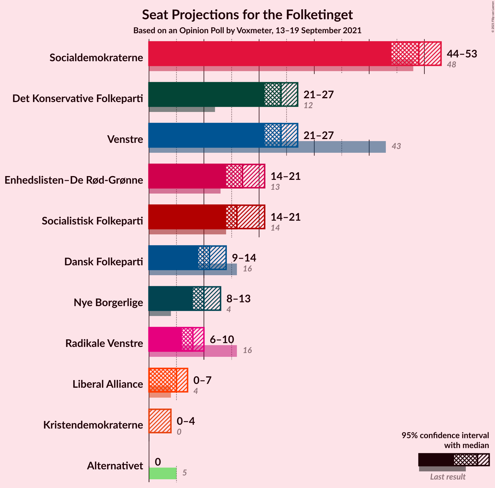
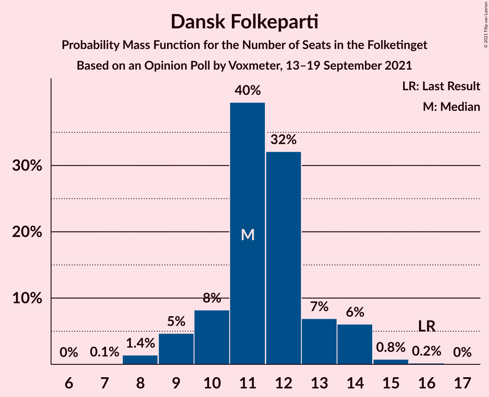
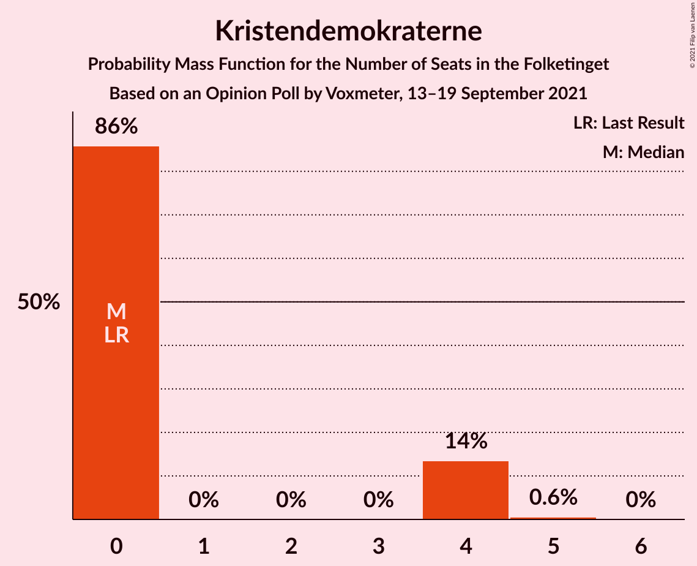
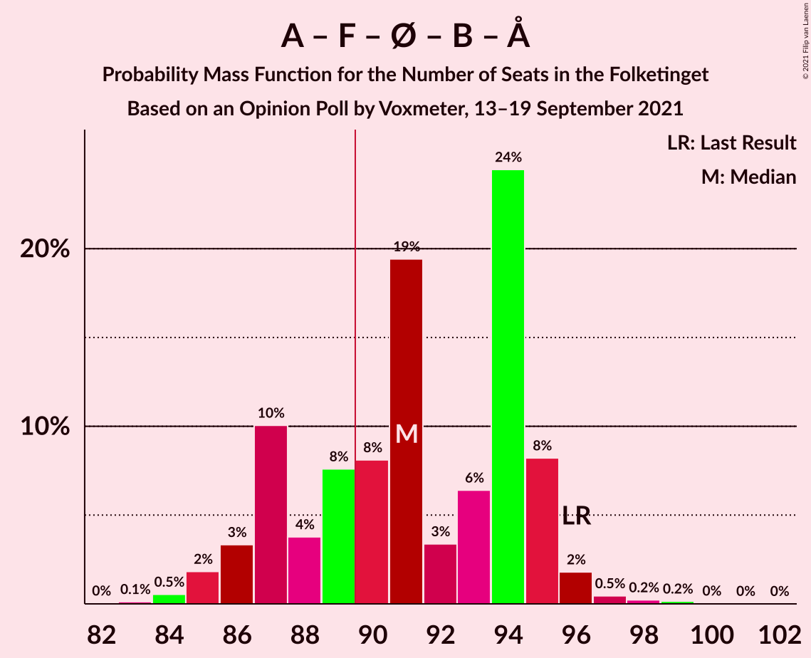
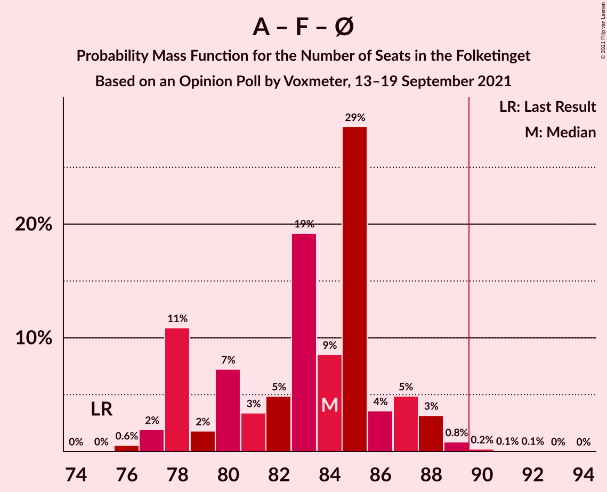
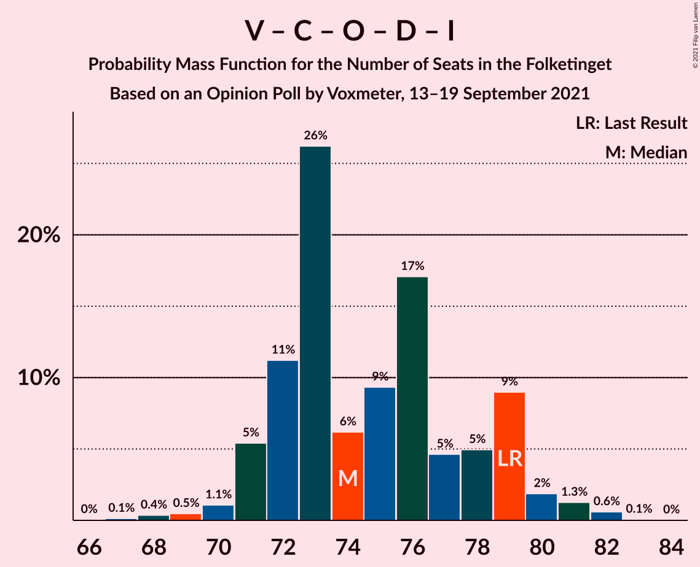

# Opinion Poll by Voxmeter, 13–19 September 2021

<a href="#voting-intentions">Voting Intentions</a> | <a href="#seats">Seats</a> | <a href="#coalitions">Coalitions</a> | <a href="#technical-information">Technical Information</a>

## Voting Intentions

### Confidence Intervals

| Party | Last Result | Poll Result | 80% Confidence Interval | 90% Confidence Interval | 95% Confidence Interval | 99% Confidence Interval |
|:-----:|:-----------:|:-----------:|:-----------------------:|:-----------------------:|:-----------------------:|:-----------------------:|
| Socialdemokraterne | 25.9% | 27.7% | 25.9–29.5% |25.4–30.1% |25.0–30.5% |24.2–31.4% |
| Venstre | 23.4% | 13.6% | 12.3–15.1% |11.9–15.5% |11.6–15.9% |11.0–16.6% |
| Det Konservative Folkeparti | 6.6% | 13.5% | 12.2–15.0% |11.8–15.4% |11.5–15.7% |10.9–16.5% |
| Socialistisk Folkeparti | 7.7% | 9.8% | 8.7–11.1% |8.4–11.5% |8.1–11.8% |7.6–12.5% |
| Enhedslisten–De Rød-Grønne | 6.9% | 9.7% | 8.6–11.0% |8.3–11.4% |8.0–11.7% |7.5–12.3% |
| Dansk Folkeparti | 8.7% | 6.1% | 5.2–7.2% |5.0–7.5% |4.8–7.8% |4.4–8.3% |
| Nye Borgerlige | 2.4% | 5.7% | 4.8–6.8% |4.6–7.1% |4.4–7.3% |4.0–7.8% |
| Radikale Venstre | 8.6% | 4.3% | 3.6–5.2% |3.4–5.5% |3.2–5.7% |2.9–6.2% |
| Liberal Alliance | 2.3% | 3.1% | 2.5–3.9% |2.3–4.2% |2.2–4.4% |1.9–4.8% |
| Kristendemokraterne | 1.7% | 1.4% | 1.0–2.0% |0.9–2.2% |0.8–2.3% |0.7–2.7% |
| Alternativet | 3.0% | 0.4% | 0.2–0.8% |0.2–0.9% |0.2–1.0% |0.1–1.3% |

*Note:* The poll result column reflects the actual value used in the calculations. Published results may vary slightly, and in addition be rounded to fewer digits.

## Seats

### Confidence Intervals

| Party | Last Result | Median | 80% Confidence Interval | 90% Confidence Interval | 95% Confidence Interval | 99% Confidence Interval |
|:-----:|:-----------:|:------:|:-----------------------:|:-----------------------:|:-----------------------:|:-----------------------:|
| <a href="#socialdemokraterne">Socialdemokraterne</a> | 48 | 49 | 46–52 |44–52 |44–53 |43–54 |
| <a href="#venstre">Venstre</a> | 43 | 24 | 22–26 |22–26 |21–27 |20–29 |
| <a href="#det-konservative-folkeparti">Det Konservative Folkeparti</a> | 12 | 24 | 22–26 |21–27 |21–27 |20–28 |
| <a href="#socialistisk-folkeparti">Socialistisk Folkeparti</a> | 14 | 16 | 15–19 |15–20 |14–21 |14–22 |
| <a href="#enhedslisten–de-rød-grønne">Enhedslisten–De Rød-Grønne</a> | 13 | 17 | 15–19 |15–20 |14–21 |14–22 |
| <a href="#dansk-folkeparti">Dansk Folkeparti</a> | 16 | 11 | 10–13 |9–14 |9–14 |8–15 |
| <a href="#nye-borgerlige">Nye Borgerlige</a> | 4 | 10 | 9–12 |8–13 |8–13 |7–14 |
| <a href="#radikale-venstre">Radikale Venstre</a> | 16 | 8 | 7–9 |7–9 |6–10 |6–11 |
| <a href="#liberal-alliance">Liberal Alliance</a> | 4 | 5 | 4–6 |0–7 |0–7 |0–8 |
| <a href="#kristendemokraterne">Kristendemokraterne</a> | 0 | 0 | 0–4 |0–4 |0–4 |0–5 |
| <a href="#alternativet">Alternativet</a> | 5 | 0 | 0 |0 |0 |0 |

### Socialdemokraterne

*For a full overview of the results for this party, see the [Socialdemokraterne](party-socialdemokraterne.html) page.*

| Number of Seats | Probability | Accumulated | Special Marks |
|:---------------:|:-----------:|:-----------:|:-------------:|
| 41 | 0.1% | 100% |  |
| 42 | 0.2% | 99.9% |  |
| 43 | 0.7% | 99.7% |  |
| 44 | 4% | 98.9% |  |
| 45 | 4% | 95% |  |
| 46 | 6% | 91% |  |
| 47 | 3% | 86% |  |
| 48 | 30% | 83% | Last Result |
| 49 | 7% | 53% | Median |
| 50 | 12% | 46% |  |
| 51 | 7% | 34% |  |
| 52 | 25% | 27% |  |
| 53 | 1.3% | 3% |  |
| 54 | 0.9% | 1.4% |  |
| 55 | 0.4% | 0.5% |  |
| 56 | 0.1% | 0.1% |  |
| 57 | 0% | 0% |  |

### Venstre

*For a full overview of the results for this party, see the [Venstre](party-venstre.html) page.*

| Number of Seats | Probability | Accumulated | Special Marks |
|:---------------:|:-----------:|:-----------:|:-------------:|
| 18 | 0.1% | 100% |  |
| 19 | 0.3% | 99.9% |  |
| 20 | 0.4% | 99.6% |  |
| 21 | 2% | 99.2% |  |
| 22 | 9% | 97% |  |
| 23 | 32% | 89% |  |
| 24 | 8% | 56% | Median |
| 25 | 26% | 49% |  |
| 26 | 18% | 22% |  |
| 27 | 2% | 4% |  |
| 28 | 0.7% | 2% |  |
| 29 | 1.1% | 1.3% |  |
| 30 | 0.2% | 0.2% |  |
| 31 | 0% | 0% |  |
| 32 | 0% | 0% |  |
| 33 | 0% | 0% |  |
| 34 | 0% | 0% |  |
| 35 | 0% | 0% |  |
| 36 | 0% | 0% |  |
| 37 | 0% | 0% |  |
| 38 | 0% | 0% |  |
| 39 | 0% | 0% |  |
| 40 | 0% | 0% |  |
| 41 | 0% | 0% |  |
| 42 | 0% | 0% |  |
| 43 | 0% | 0% | Last Result |

### Det Konservative Folkeparti

*For a full overview of the results for this party, see the [Det Konservative Folkeparti](party-detkonservativefolkeparti.html) page.*

| Number of Seats | Probability | Accumulated | Special Marks |
|:---------------:|:-----------:|:-----------:|:-------------:|
| 12 | 0% | 100% | Last Result |
| 13 | 0% | 100% |  |
| 14 | 0% | 100% |  |
| 15 | 0% | 100% |  |
| 16 | 0% | 100% |  |
| 17 | 0% | 100% |  |
| 18 | 0% | 100% |  |
| 19 | 0.3% | 99.9% |  |
| 20 | 1.1% | 99.7% |  |
| 21 | 4% | 98.6% |  |
| 22 | 15% | 95% |  |
| 23 | 11% | 80% |  |
| 24 | 50% | 68% | Median |
| 25 | 8% | 18% |  |
| 26 | 6% | 11% |  |
| 27 | 3% | 5% |  |
| 28 | 2% | 2% |  |
| 29 | 0.3% | 0.4% |  |
| 30 | 0.1% | 0.1% |  |
| 31 | 0% | 0% |  |

### Socialistisk Folkeparti

*For a full overview of the results for this party, see the [Socialistisk Folkeparti](party-socialistiskfolkeparti.html) page.*

| Number of Seats | Probability | Accumulated | Special Marks |
|:---------------:|:-----------:|:-----------:|:-------------:|
| 13 | 0.4% | 100% |  |
| 14 | 3% | 99.6% | Last Result |
| 15 | 15% | 97% |  |
| 16 | 34% | 82% | Median |
| 17 | 14% | 48% |  |
| 18 | 24% | 34% |  |
| 19 | 5% | 11% |  |
| 20 | 3% | 6% |  |
| 21 | 0.8% | 3% |  |
| 22 | 2% | 2% |  |
| 23 | 0.2% | 0.2% |  |
| 24 | 0% | 0.1% |  |
| 25 | 0% | 0% |  |

### Enhedslisten–De Rød-Grønne

*For a full overview of the results for this party, see the [Enhedslisten–De Rød-Grønne](party-enhedslisten–derød-grønne.html) page.*

| Number of Seats | Probability | Accumulated | Special Marks |
|:---------------:|:-----------:|:-----------:|:-------------:|
| 13 | 0.4% | 100% | Last Result |
| 14 | 3% | 99.5% |  |
| 15 | 12% | 96% |  |
| 16 | 9% | 84% |  |
| 17 | 49% | 75% | Median |
| 18 | 11% | 26% |  |
| 19 | 7% | 16% |  |
| 20 | 5% | 8% |  |
| 21 | 3% | 3% |  |
| 22 | 0.4% | 0.6% |  |
| 23 | 0.2% | 0.2% |  |
| 24 | 0% | 0% |  |

### Dansk Folkeparti

*For a full overview of the results for this party, see the [Dansk Folkeparti](party-danskfolkeparti.html) page.*

| Number of Seats | Probability | Accumulated | Special Marks |
|:---------------:|:-----------:|:-----------:|:-------------:|
| 7 | 0.1% | 100% |  |
| 8 | 1.4% | 99.9% |  |
| 9 | 5% | 98.5% |  |
| 10 | 8% | 94% |  |
| 11 | 40% | 86% | Median |
| 12 | 32% | 46% |  |
| 13 | 7% | 14% |  |
| 14 | 6% | 7% |  |
| 15 | 0.8% | 1.0% |  |
| 16 | 0.2% | 0.2% | Last Result |
| 17 | 0% | 0% |  |

### Nye Borgerlige

*For a full overview of the results for this party, see the [Nye Borgerlige](party-nyeborgerlige.html) page.*

| Number of Seats | Probability | Accumulated | Special Marks |
|:---------------:|:-----------:|:-----------:|:-------------:|
| 4 | 0% | 100% | Last Result |
| 5 | 0% | 100% |  |
| 6 | 0% | 100% |  |
| 7 | 0.7% | 100% |  |
| 8 | 6% | 99.3% |  |
| 9 | 15% | 93% |  |
| 10 | 46% | 78% | Median |
| 11 | 14% | 32% |  |
| 12 | 13% | 18% |  |
| 13 | 5% | 6% |  |
| 14 | 0.4% | 0.9% |  |
| 15 | 0.4% | 0.4% |  |
| 16 | 0% | 0% |  |

### Radikale Venstre

*For a full overview of the results for this party, see the [Radikale Venstre](party-radikalevenstre.html) page.*

| Number of Seats | Probability | Accumulated | Special Marks |
|:---------------:|:-----------:|:-----------:|:-------------:|
| 5 | 0.4% | 100% |  |
| 6 | 3% | 99.5% |  |
| 7 | 21% | 96% |  |
| 8 | 30% | 75% | Median |
| 9 | 40% | 45% |  |
| 10 | 4% | 4% |  |
| 11 | 0.4% | 0.5% |  |
| 12 | 0.1% | 0.1% |  |
| 13 | 0% | 0% |  |
| 14 | 0% | 0% |  |
| 15 | 0% | 0% |  |
| 16 | 0% | 0% | Last Result |

### Liberal Alliance

*For a full overview of the results for this party, see the [Liberal Alliance](party-liberalalliance.html) page.*

| Number of Seats | Probability | Accumulated | Special Marks |
|:---------------:|:-----------:|:-----------:|:-------------:|
| 0 | 6% | 100% |  |
| 1 | 0% | 94% |  |
| 2 | 0% | 94% |  |
| 3 | 0% | 94% |  |
| 4 | 6% | 94% | Last Result |
| 5 | 66% | 88% | Median |
| 6 | 12% | 22% |  |
| 7 | 8% | 10% |  |
| 8 | 2% | 2% |  |
| 9 | 0.1% | 0.1% |  |
| 10 | 0% | 0% |  |

### Kristendemokraterne

*For a full overview of the results for this party, see the [Kristendemokraterne](party-kristendemokraterne.html) page.*

| Number of Seats | Probability | Accumulated | Special Marks |
|:---------------:|:-----------:|:-----------:|:-------------:|
| 0 | 86% | 100% | Last Result, Median |
| 1 | 0% | 14% |  |
| 2 | 0% | 14% |  |
| 3 | 0% | 14% |  |
| 4 | 14% | 14% |  |
| 5 | 0.6% | 0.6% |  |
| 6 | 0% | 0% |  |

### Alternativet

*For a full overview of the results for this party, see the [Alternativet](party-alternativet.html) page.*

| Number of Seats | Probability | Accumulated | Special Marks |
|:---------------:|:-----------:|:-----------:|:-------------:|
| 0 | 100% | 100% | Median |
| 1 | 0% | 0% |  |
| 2 | 0% | 0% |  |
| 3 | 0% | 0% |  |
| 4 | 0% | 0% |  |
| 5 | 0% | 0% | Last Result |

## Coalitions

### Confidence Intervals

| Coalition | Last Result | Median | Majority? | 80% Confidence Interval | 90% Confidence Interval | 95% Confidence Interval | 99% Confidence Interval |
|:---------:|:-----------:|:------:|:---------:|:-----------------------:|:-----------------------:|:-----------------------:|:-----------------------:|
| Socialdemokraterne – Socialistisk Folkeparti – Enhedslisten–De Rød-Grønne – Radikale Venstre – Alternativet | 96 | 91 | 73% | 87–95 | 86–95 | 85–96 | 84–97 |
| Socialdemokraterne – Socialistisk Folkeparti – Enhedslisten–De Rød-Grønne – Radikale Venstre | 91 | 91 | 73% | 87–95 | 86–95 | 85–96 | 84–97 |
| Socialdemokraterne – Socialistisk Folkeparti – Enhedslisten–De Rød-Grønne – Alternativet | 80 | 84 | 0.5% | 78–86 | 78–87 | 77–88 | 76–89 |
| Socialdemokraterne – Socialistisk Folkeparti – Enhedslisten–De Rød-Grønne | 75 | 84 | 0.5% | 78–86 | 78–87 | 77–88 | 76–89 |
| Venstre – Det Konservative Folkeparti – Dansk Folkeparti – Nye Borgerlige – Liberal Alliance – Kristendemokraterne | 79 | 75 | 0% | 72–79 | 72–80 | 71–81 | 69–82 |
| Venstre – Det Konservative Folkeparti – Dansk Folkeparti – Nye Borgerlige – Liberal Alliance | 79 | 74 | 0% | 72–79 | 71–79 | 71–80 | 68–82 |
| Socialdemokraterne – Socialistisk Folkeparti – Radikale Venstre | 78 | 74 | 0% | 70–77 | 69–77 | 68–79 | 67–80 |
| Venstre – Det Konservative Folkeparti – Dansk Folkeparti – Liberal Alliance – Kristendemokraterne | 75 | 65 | 0% | 62–68 | 61–69 | 61–70 | 59–72 |
| Venstre – Det Konservative Folkeparti – Dansk Folkeparti – Liberal Alliance | 75 | 64 | 0% | 62–67 | 60–68 | 60–70 | 58–71 |
| Socialdemokraterne – Radikale Venstre | 64 | 57 | 0% | 54–61 | 53–61 | 52–61 | 51–62 |
| Venstre – Det Konservative Folkeparti – Liberal Alliance | 59 | 53 | 0% | 50–56 | 49–57 | 49–58 | 48–60 |
| Venstre – Det Konservative Folkeparti | 55 | 48 | 0% | 45–51 | 44–51 | 44–52 | 43–54 |
| Venstre | 43 | 24 | 0% | 22–26 | 22–26 | 21–27 | 20–29 |

### Socialdemokraterne – Socialistisk Folkeparti – Enhedslisten–De Rød-Grønne – Radikale Venstre – Alternativet

| Number of Seats | Probability | Accumulated | Special Marks |
|:---------------:|:-----------:|:-----------:|:-------------:|
| 82 | 0% | 100% |  |
| 83 | 0.1% | 99.9% |  |
| 84 | 0.5% | 99.8% |  |
| 85 | 2% | 99.3% |  |
| 86 | 3% | 97% |  |
| 87 | 10% | 94% |  |
| 88 | 4% | 84% |  |
| 89 | 8% | 80% |  |
| 90 | 8% | 73% | Median, Majority |
| 91 | 19% | 65% |  |
| 92 | 3% | 45% |  |
| 93 | 6% | 42% |  |
| 94 | 24% | 35% |  |
| 95 | 8% | 11% |  |
| 96 | 2% | 3% | Last Result |
| 97 | 0.5% | 0.9% |  |
| 98 | 0.2% | 0.5% |  |
| 99 | 0.2% | 0.2% |  |
| 100 | 0% | 0.1% |  |
| 101 | 0% | 0% |  |

### Socialdemokraterne – Socialistisk Folkeparti – Enhedslisten–De Rød-Grønne – Radikale Venstre

| Number of Seats | Probability | Accumulated | Special Marks |
|:---------------:|:-----------:|:-----------:|:-------------:|
| 82 | 0% | 100% |  |
| 83 | 0.1% | 99.9% |  |
| 84 | 0.5% | 99.8% |  |
| 85 | 2% | 99.3% |  |
| 86 | 3% | 97% |  |
| 87 | 10% | 94% |  |
| 88 | 4% | 84% |  |
| 89 | 8% | 80% |  |
| 90 | 8% | 73% | Median, Majority |
| 91 | 19% | 65% | Last Result |
| 92 | 3% | 45% |  |
| 93 | 6% | 42% |  |
| 94 | 24% | 35% |  |
| 95 | 8% | 11% |  |
| 96 | 2% | 3% |  |
| 97 | 0.5% | 0.9% |  |
| 98 | 0.2% | 0.5% |  |
| 99 | 0.2% | 0.2% |  |
| 100 | 0% | 0.1% |  |
| 101 | 0% | 0% |  |

### Socialdemokraterne – Socialistisk Folkeparti – Enhedslisten–De Rød-Grønne – Alternativet

| Number of Seats | Probability | Accumulated | Special Marks |
|:---------------:|:-----------:|:-----------:|:-------------:|
| 75 | 0% | 100% |  |
| 76 | 0.6% | 99.9% |  |
| 77 | 2% | 99.4% |  |
| 78 | 11% | 97% |  |
| 79 | 2% | 87% |  |
| 80 | 7% | 85% | Last Result |
| 81 | 3% | 78% |  |
| 82 | 5% | 74% | Median |
| 83 | 19% | 69% |  |
| 84 | 9% | 50% |  |
| 85 | 29% | 42% |  |
| 86 | 4% | 13% |  |
| 87 | 5% | 9% |  |
| 88 | 3% | 4% |  |
| 89 | 0.8% | 1.3% |  |
| 90 | 0.2% | 0.5% | Majority |
| 91 | 0.1% | 0.3% |  |
| 92 | 0.1% | 0.2% |  |
| 93 | 0% | 0.1% |  |
| 94 | 0% | 0% |  |

### Socialdemokraterne – Socialistisk Folkeparti – Enhedslisten–De Rød-Grønne

| Number of Seats | Probability | Accumulated | Special Marks |
|:---------------:|:-----------:|:-----------:|:-------------:|
| 75 | 0% | 100% | Last Result |
| 76 | 0.6% | 99.9% |  |
| 77 | 2% | 99.4% |  |
| 78 | 11% | 97% |  |
| 79 | 2% | 87% |  |
| 80 | 7% | 85% |  |
| 81 | 3% | 78% |  |
| 82 | 5% | 74% | Median |
| 83 | 19% | 69% |  |
| 84 | 9% | 50% |  |
| 85 | 29% | 42% |  |
| 86 | 4% | 13% |  |
| 87 | 5% | 9% |  |
| 88 | 3% | 4% |  |
| 89 | 0.8% | 1.3% |  |
| 90 | 0.2% | 0.5% | Majority |
| 91 | 0.1% | 0.3% |  |
| 92 | 0.1% | 0.2% |  |
| 93 | 0% | 0.1% |  |
| 94 | 0% | 0% |  |

### Venstre – Det Konservative Folkeparti – Dansk Folkeparti – Nye Borgerlige – Liberal Alliance – Kristendemokraterne

| Number of Seats | Probability | Accumulated | Special Marks |
|:---------------:|:-----------:|:-----------:|:-------------:|
| 66 | 0% | 100% |  |
| 67 | 0.1% | 99.9% |  |
| 68 | 0.3% | 99.8% |  |
| 69 | 0.2% | 99.5% |  |
| 70 | 1.0% | 99.3% |  |
| 71 | 2% | 98% |  |
| 72 | 11% | 97% |  |
| 73 | 23% | 86% |  |
| 74 | 4% | 63% | Median |
| 75 | 11% | 59% |  |
| 76 | 17% | 48% |  |
| 77 | 7% | 30% |  |
| 78 | 7% | 23% |  |
| 79 | 11% | 16% | Last Result |
| 80 | 2% | 5% |  |
| 81 | 2% | 3% |  |
| 82 | 0.7% | 0.9% |  |
| 83 | 0.1% | 0.1% |  |
| 84 | 0.1% | 0.1% |  |
| 85 | 0% | 0% |  |

### Venstre – Det Konservative Folkeparti – Dansk Folkeparti – Nye Borgerlige – Liberal Alliance

| Number of Seats | Probability | Accumulated | Special Marks |
|:---------------:|:-----------:|:-----------:|:-------------:|
| 66 | 0% | 100% |  |
| 67 | 0.1% | 99.9% |  |
| 68 | 0.4% | 99.8% |  |
| 69 | 0.5% | 99.4% |  |
| 70 | 1.1% | 98.9% |  |
| 71 | 5% | 98% |  |
| 72 | 11% | 92% |  |
| 73 | 26% | 81% |  |
| 74 | 6% | 55% | Median |
| 75 | 9% | 49% |  |
| 76 | 17% | 39% |  |
| 77 | 5% | 22% |  |
| 78 | 5% | 18% |  |
| 79 | 9% | 13% | Last Result |
| 80 | 2% | 4% |  |
| 81 | 1.3% | 2% |  |
| 82 | 0.6% | 0.7% |  |
| 83 | 0.1% | 0.1% |  |
| 84 | 0% | 0% |  |

### Socialdemokraterne – Socialistisk Folkeparti – Radikale Venstre

| Number of Seats | Probability | Accumulated | Special Marks |
|:---------------:|:-----------:|:-----------:|:-------------:|
| 65 | 0.1% | 100% |  |
| 66 | 0.1% | 99.9% |  |
| 67 | 1.2% | 99.8% |  |
| 68 | 2% | 98.6% |  |
| 69 | 2% | 97% |  |
| 70 | 5% | 95% |  |
| 71 | 4% | 89% |  |
| 72 | 13% | 85% |  |
| 73 | 11% | 73% | Median |
| 74 | 17% | 62% |  |
| 75 | 6% | 45% |  |
| 76 | 12% | 39% |  |
| 77 | 22% | 27% |  |
| 78 | 1.3% | 5% | Last Result |
| 79 | 2% | 3% |  |
| 80 | 0.7% | 1.2% |  |
| 81 | 0.2% | 0.5% |  |
| 82 | 0.2% | 0.3% |  |
| 83 | 0% | 0.1% |  |
| 84 | 0.1% | 0.1% |  |
| 85 | 0% | 0% |  |

### Venstre – Det Konservative Folkeparti – Dansk Folkeparti – Liberal Alliance – Kristendemokraterne

| Number of Seats | Probability | Accumulated | Special Marks |
|:---------------:|:-----------:|:-----------:|:-------------:|
| 56 | 0% | 100% |  |
| 57 | 0.1% | 99.9% |  |
| 58 | 0.3% | 99.8% |  |
| 59 | 0.4% | 99.5% |  |
| 60 | 1.3% | 99.1% |  |
| 61 | 4% | 98% |  |
| 62 | 4% | 94% |  |
| 63 | 26% | 89% |  |
| 64 | 10% | 63% | Median |
| 65 | 6% | 53% |  |
| 66 | 19% | 47% |  |
| 67 | 14% | 28% |  |
| 68 | 5% | 14% |  |
| 69 | 4% | 9% |  |
| 70 | 4% | 5% |  |
| 71 | 0.7% | 1.3% |  |
| 72 | 0.4% | 0.6% |  |
| 73 | 0.2% | 0.3% |  |
| 74 | 0% | 0.1% |  |
| 75 | 0% | 0% | Last Result |

### Venstre – Det Konservative Folkeparti – Dansk Folkeparti – Liberal Alliance

| Number of Seats | Probability | Accumulated | Special Marks |
|:---------------:|:-----------:|:-----------:|:-------------:|
| 56 | 0% | 100% |  |
| 57 | 0.2% | 99.9% |  |
| 58 | 0.3% | 99.7% |  |
| 59 | 0.8% | 99.4% |  |
| 60 | 4% | 98.7% |  |
| 61 | 4% | 95% |  |
| 62 | 6% | 90% |  |
| 63 | 29% | 85% |  |
| 64 | 9% | 55% | Median |
| 65 | 9% | 47% |  |
| 66 | 19% | 38% |  |
| 67 | 10% | 19% |  |
| 68 | 4% | 8% |  |
| 69 | 2% | 5% |  |
| 70 | 2% | 3% |  |
| 71 | 0.5% | 0.9% |  |
| 72 | 0.3% | 0.5% |  |
| 73 | 0.2% | 0.2% |  |
| 74 | 0% | 0% |  |
| 75 | 0% | 0% | Last Result |

### Socialdemokraterne – Radikale Venstre

| Number of Seats | Probability | Accumulated | Special Marks |
|:---------------:|:-----------:|:-----------:|:-------------:|
| 48 | 0.1% | 100% |  |
| 49 | 0.1% | 99.9% |  |
| 50 | 0.3% | 99.8% |  |
| 51 | 2% | 99.5% |  |
| 52 | 3% | 98% |  |
| 53 | 5% | 95% |  |
| 54 | 3% | 90% |  |
| 55 | 11% | 87% |  |
| 56 | 16% | 77% |  |
| 57 | 18% | 61% | Median |
| 58 | 9% | 43% |  |
| 59 | 6% | 33% |  |
| 60 | 1.4% | 27% |  |
| 61 | 25% | 26% |  |
| 62 | 0.6% | 1.1% |  |
| 63 | 0.3% | 0.5% |  |
| 64 | 0.1% | 0.2% | Last Result |
| 65 | 0.1% | 0.1% |  |
| 66 | 0% | 0% |  |

### Venstre – Det Konservative Folkeparti – Liberal Alliance

| Number of Seats | Probability | Accumulated | Special Marks |
|:---------------:|:-----------:|:-----------:|:-------------:|
| 46 | 0.1% | 100% |  |
| 47 | 0.3% | 99.9% |  |
| 48 | 0.3% | 99.6% |  |
| 49 | 7% | 99.3% |  |
| 50 | 7% | 92% |  |
| 51 | 3% | 86% |  |
| 52 | 31% | 83% |  |
| 53 | 11% | 51% | Median |
| 54 | 19% | 41% |  |
| 55 | 10% | 21% |  |
| 56 | 4% | 11% |  |
| 57 | 4% | 7% |  |
| 58 | 3% | 4% |  |
| 59 | 0.6% | 1.2% | Last Result |
| 60 | 0.3% | 0.5% |  |
| 61 | 0.1% | 0.3% |  |
| 62 | 0.1% | 0.1% |  |
| 63 | 0% | 0% |  |

### Venstre – Det Konservative Folkeparti

| Number of Seats | Probability | Accumulated | Special Marks |
|:---------------:|:-----------:|:-----------:|:-------------:|
| 40 | 0% | 100% |  |
| 41 | 0.2% | 99.9% |  |
| 42 | 0.2% | 99.8% |  |
| 43 | 0.6% | 99.6% |  |
| 44 | 5% | 99.0% |  |
| 45 | 6% | 94% |  |
| 46 | 6% | 88% |  |
| 47 | 30% | 82% |  |
| 48 | 6% | 51% | Median |
| 49 | 24% | 45% |  |
| 50 | 9% | 21% |  |
| 51 | 8% | 12% |  |
| 52 | 2% | 4% |  |
| 53 | 0.9% | 2% |  |
| 54 | 0.6% | 0.8% |  |
| 55 | 0.1% | 0.2% | Last Result |
| 56 | 0% | 0.1% |  |
| 57 | 0% | 0% |  |

### Venstre

| Number of Seats | Probability | Accumulated | Special Marks |
|:---------------:|:-----------:|:-----------:|:-------------:|
| 18 | 0.1% | 100% |  |
| 19 | 0.3% | 99.9% |  |
| 20 | 0.4% | 99.6% |  |
| 21 | 2% | 99.2% |  |
| 22 | 9% | 97% |  |
| 23 | 32% | 89% |  |
| 24 | 8% | 56% | Median |
| 25 | 26% | 49% |  |
| 26 | 18% | 22% |  |
| 27 | 2% | 4% |  |
| 28 | 0.7% | 2% |  |
| 29 | 1.1% | 1.3% |  |
| 30 | 0.2% | 0.2% |  |
| 31 | 0% | 0% |  |
| 32 | 0% | 0% |  |
| 33 | 0% | 0% |  |
| 34 | 0% | 0% |  |
| 35 | 0% | 0% |  |
| 36 | 0% | 0% |  |
| 37 | 0% | 0% |  |
| 38 | 0% | 0% |  |
| 39 | 0% | 0% |  |
| 40 | 0% | 0% |  |
| 41 | 0% | 0% |  |
| 42 | 0% | 0% |  |
| 43 | 0% | 0% | Last Result |

## Technical Information

### Opinion Poll

+ **Polling firm:** Voxmeter
+ **Commissioner(s):** —
+ **Fieldwork period:** 13–19 September 2021

### Calculations

+ **Sample size:** 1001
+ **Simulations done:** 1,048,576
+ **Error estimate:** 2.68%

