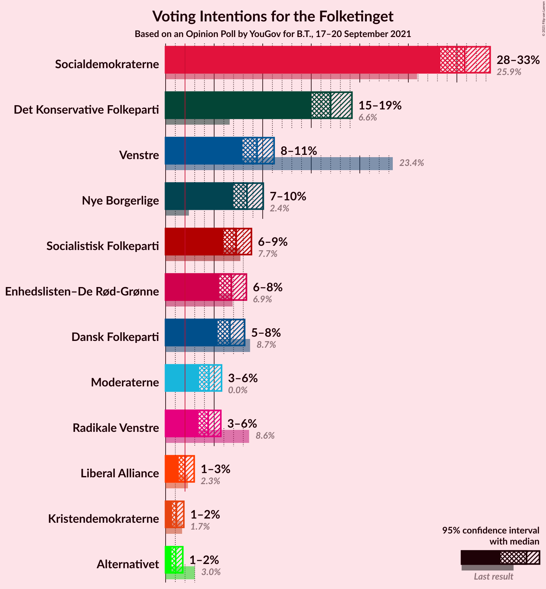
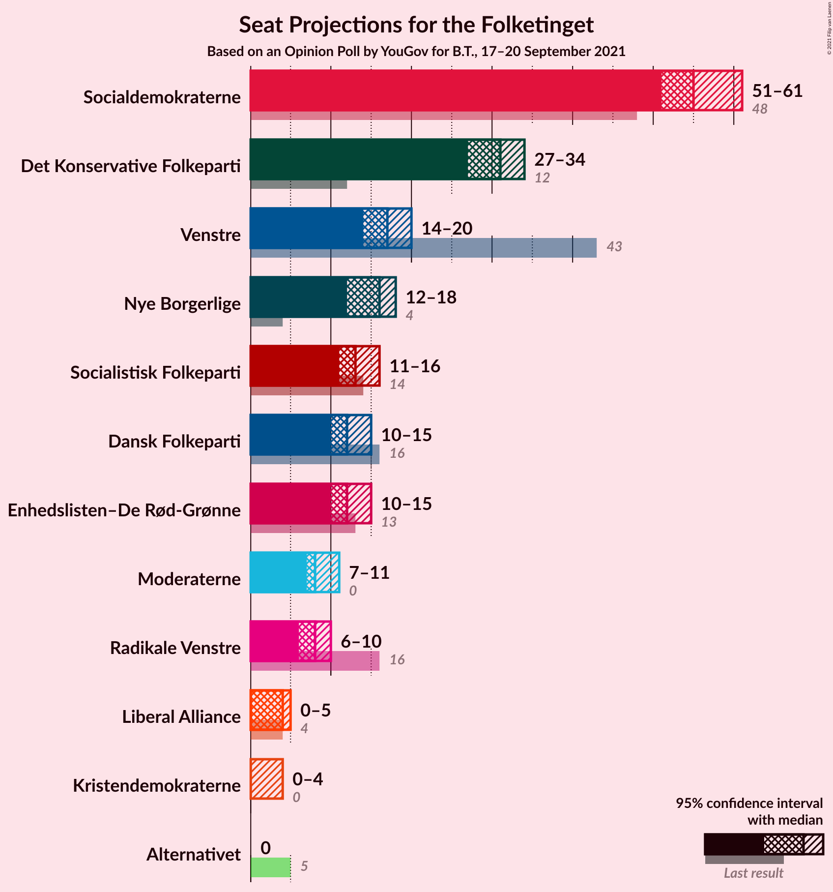
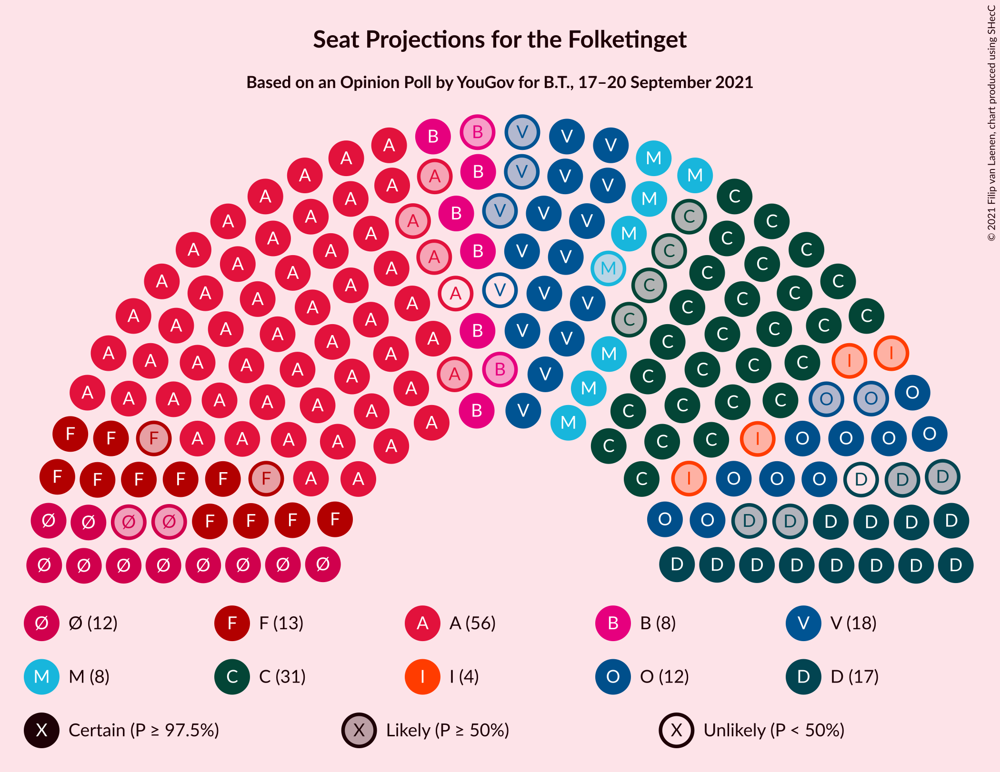

# Opinion Poll by YouGov for B.T., 17–20 September 2021

<a href="#voting-intentions">Voting Intentions</a> | <a href="#seats">Seats</a> | <a href="#coalitions">Coalitions</a> | <a href="#technical-information">Technical Information</a>

## Voting Intentions

### Confidence Intervals

| Party | Last Result | Poll Result | 80% Confidence Interval | 90% Confidence Interval | 95% Confidence Interval | 99% Confidence Interval |
|:-----:|:-----------:|:-----------:|:-----------------------:|:-----------------------:|:-----------------------:|:-----------------------:|
| Socialdemokraterne | 25.9% | 30.8% | 29.2–32.5% |28.7–33.0% |28.3–33.4% |27.5–34.2% |
| Det Konservative Folkeparti | 6.6% | 17.0% | 15.7–18.4% |15.3–18.8% |15.0–19.2% |14.4–19.9% |
| Venstre | 23.4% | 9.4% | 8.4–10.6% |8.2–10.9% |7.9–11.2% |7.5–11.7% |
| Nye Borgerlige | 2.4% | 8.4% | 7.5–9.5% |7.2–9.8% |7.0–10.1% |6.5–10.6% |
| Socialistisk Folkeparti | 7.7% | 7.3% | 6.4–8.3% |6.2–8.6% |5.9–8.8% |5.6–9.4% |
| Enhedslisten–De Rød-Grønne | 6.9% | 6.8% | 5.9–7.8% |5.7–8.1% |5.5–8.3% |5.1–8.8% |
| Dansk Folkeparti | 8.7% | 6.6% | 5.8–7.6% |5.6–7.9% |5.4–8.1% |5.0–8.6% |
| Moderaterne | N/A | 4.5% | 3.8–5.3% |3.6–5.5% |3.5–5.8% |3.2–6.2% |
| Radikale Venstre | 8.6% | 4.4% | 3.7–5.2% |3.5–5.5% |3.4–5.7% |3.1–6.1% |
| Liberal Alliance | 2.3% | 2.0% | 1.6–2.6% |1.4–2.8% |1.4–2.9% |1.2–3.3% |
| Kristendemokraterne | 1.7% | 1.1% | 0.8–1.6% |0.7–1.8% |0.7–1.9% |0.5–2.1% |
| Alternativet | 3.0% | 1.0% | 0.7–1.5% |0.7–1.6% |0.6–1.8% |0.5–2.0% |

*Note:* The poll result column reflects the actual value used in the calculations. Published results may vary slightly, and in addition be rounded to fewer digits.

## Seats

### Confidence Intervals

| Party | Last Result | Median | 80% Confidence Interval | 90% Confidence Interval | 95% Confidence Interval | 99% Confidence Interval |
|:-----:|:-----------:|:------:|:-----------------------:|:-----------------------:|:-----------------------:|:-----------------------:|
| <a href="#socialdemokraterne">Socialdemokraterne</a> | 48 | 55 | 53–60 |53–61 |51–61 |48–62 |
| <a href="#det-konservative-folkeparti">Det Konservative Folkeparti</a> | 12 | 31 | 29–34 |27–34 |27–34 |26–35 |
| <a href="#venstre">Venstre</a> | 43 | 17 | 16–19 |15–19 |14–20 |14–21 |
| <a href="#nye-borgerlige">Nye Borgerlige</a> | 4 | 16 | 13–17 |13–17 |12–18 |12–19 |
| <a href="#socialistisk-folkeparti">Socialistisk Folkeparti</a> | 14 | 13 | 12–14 |11–15 |11–16 |10–17 |
| <a href="#enhedslisten–de-rød-grønne">Enhedslisten–De Rød-Grønne</a> | 13 | 12 | 11–14 |10–15 |10–15 |10–16 |
| <a href="#dansk-folkeparti">Dansk Folkeparti</a> | 16 | 12 | 11–14 |11–14 |10–15 |10–15 |
| <a href="#moderaterne">Moderaterne</a> | N/A | 8 | 7–10 |7–11 |7–11 |6–11 |
| <a href="#radikale-venstre">Radikale Venstre</a> | 16 | 8 | 7–9 |6–10 |6–10 |5–11 |
| <a href="#liberal-alliance">Liberal Alliance</a> | 4 | 4 | 0–5 |0–5 |0–5 |0–6 |
| <a href="#kristendemokraterne">Kristendemokraterne</a> | 0 | 0 | 0 |0 |0–4 |0–4 |
| <a href="#alternativet">Alternativet</a> | 5 | 0 | 0 |0 |0 |0 |

