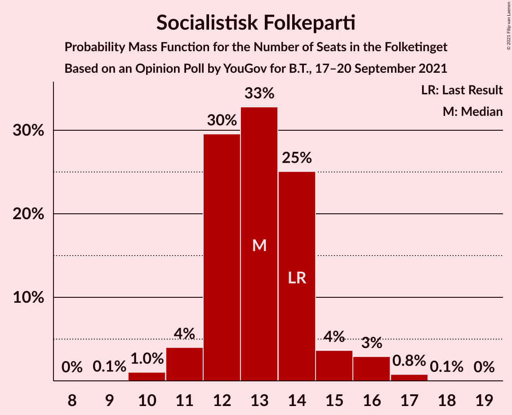
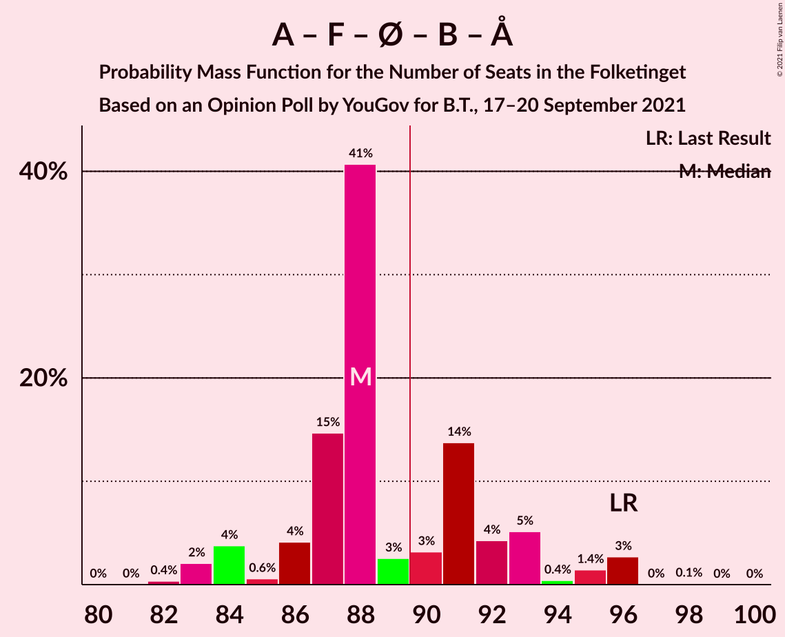
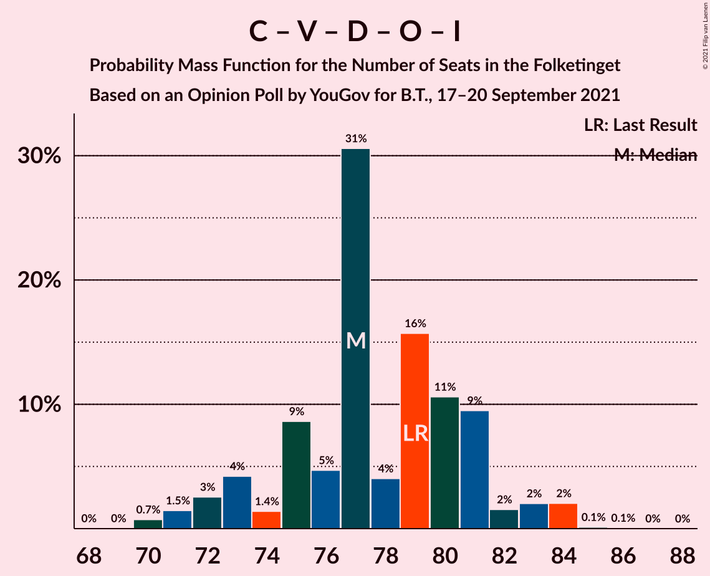

# Opinion Poll by YouGov for B.T., 17–20 September 2021

<a href="#voting-intentions">Voting Intentions</a> | <a href="#seats">Seats</a> | <a href="#coalitions">Coalitions</a> | <a href="#technical-information">Technical Information</a>

## Voting Intentions

### Confidence Intervals

| Party | Last Result | Poll Result | 80% Confidence Interval | 90% Confidence Interval | 95% Confidence Interval | 99% Confidence Interval |
|:-----:|:-----------:|:-----------:|:-----------------------:|:-----------------------:|:-----------------------:|:-----------------------:|
| Socialdemokraterne | 25.9% | 30.8% | 29.2–32.5% |28.7–33.0% |28.3–33.4% |27.5–34.2% |
| Det Konservative Folkeparti | 6.6% | 17.0% | 15.7–18.4% |15.3–18.8% |15.0–19.2% |14.4–19.9% |
| Venstre | 23.4% | 9.4% | 8.4–10.6% |8.2–10.9% |7.9–11.2% |7.5–11.7% |
| Nye Borgerlige | 2.4% | 8.4% | 7.5–9.5% |7.2–9.8% |7.0–10.1% |6.5–10.6% |
| Socialistisk Folkeparti | 7.7% | 7.3% | 6.4–8.3% |6.2–8.6% |5.9–8.8% |5.6–9.4% |
| Enhedslisten–De Rød-Grønne | 6.9% | 6.8% | 5.9–7.8% |5.7–8.1% |5.5–8.3% |5.1–8.8% |
| Dansk Folkeparti | 8.7% | 6.6% | 5.8–7.6% |5.6–7.9% |5.4–8.1% |5.0–8.6% |
| Moderaterne | 0.0% | 4.5% | 3.8–5.3% |3.6–5.5% |3.5–5.8% |3.2–6.2% |
| Radikale Venstre | 8.6% | 4.4% | 3.7–5.2% |3.5–5.5% |3.4–5.7% |3.1–6.1% |
| Liberal Alliance | 2.3% | 2.0% | 1.6–2.6% |1.4–2.8% |1.4–2.9% |1.2–3.3% |
| Kristendemokraterne | 1.7% | 1.1% | 0.8–1.6% |0.7–1.8% |0.7–1.9% |0.5–2.1% |
| Alternativet | 3.0% | 1.0% | 0.7–1.5% |0.7–1.6% |0.6–1.8% |0.5–2.0% |

*Note:* The poll result column reflects the actual value used in the calculations. Published results may vary slightly, and in addition be rounded to fewer digits.

## Seats

### Confidence Intervals

| Party | Last Result | Median | 80% Confidence Interval | 90% Confidence Interval | 95% Confidence Interval | 99% Confidence Interval |
|:-----:|:-----------:|:------:|:-----------------------:|:-----------------------:|:-----------------------:|:-----------------------:|
| <a href="#socialdemokraterne">Socialdemokraterne</a> | 48 | 55 | 53–60 |53–61 |51–61 |48–62 |
| <a href="#det-konservative-folkeparti">Det Konservative Folkeparti</a> | 12 | 31 | 29–34 |27–34 |27–34 |26–35 |
| <a href="#venstre">Venstre</a> | 43 | 17 | 16–19 |15–19 |14–20 |14–21 |
| <a href="#nye-borgerlige">Nye Borgerlige</a> | 4 | 16 | 13–17 |13–17 |12–18 |12–19 |
| <a href="#socialistisk-folkeparti">Socialistisk Folkeparti</a> | 14 | 13 | 12–14 |11–15 |11–16 |10–17 |
| <a href="#enhedslisten–de-rød-grønne">Enhedslisten–De Rød-Grønne</a> | 13 | 12 | 11–14 |10–15 |10–15 |10–16 |
| <a href="#dansk-folkeparti">Dansk Folkeparti</a> | 16 | 12 | 11–14 |11–14 |10–15 |10–15 |
| <a href="#moderaterne">Moderaterne</a> | 0 | 8 | 7–10 |7–11 |7–11 |6–11 |
| <a href="#radikale-venstre">Radikale Venstre</a> | 16 | 8 | 7–9 |6–10 |6–10 |5–11 |
| <a href="#liberal-alliance">Liberal Alliance</a> | 4 | 4 | 0–5 |0–5 |0–5 |0–6 |
| <a href="#kristendemokraterne">Kristendemokraterne</a> | 0 | 0 | 0 |0 |0–4 |0–4 |
| <a href="#alternativet">Alternativet</a> | 5 | 0 | 0 |0 |0 |0 |

### Socialdemokraterne

*For a full overview of the results for this party, see the [Socialdemokraterne](party-socialdemokraterne.html) page.*

| Number of Seats | Probability | Accumulated | Special Marks |
|:---------------:|:-----------:|:-----------:|:-------------:|
| 48 | 0.5% | 100% | Last Result |
| 49 | 0.4% | 99.5% |  |
| 50 | 0.2% | 99.0% |  |
| 51 | 2% | 98.8% |  |
| 52 | 2% | 97% |  |
| 53 | 6% | 95% |  |
| 54 | 23% | 90% |  |
| 55 | 21% | 67% | Median |
| 56 | 21% | 45% |  |
| 57 | 6% | 24% |  |
| 58 | 3% | 18% |  |
| 59 | 2% | 15% |  |
| 60 | 4% | 13% |  |
| 61 | 8% | 9% |  |
| 62 | 1.3% | 1.4% |  |
| 63 | 0.1% | 0.1% |  |
| 64 | 0% | 0% |  |

### Det Konservative Folkeparti

*For a full overview of the results for this party, see the [Det Konservative Folkeparti](party-detkonservativefolkeparti.html) page.*

| Number of Seats | Probability | Accumulated | Special Marks |
|:---------------:|:-----------:|:-----------:|:-------------:|
| 12 | 0% | 100% | Last Result |
| 13 | 0% | 100% |  |
| 14 | 0% | 100% |  |
| 15 | 0% | 100% |  |
| 16 | 0% | 100% |  |
| 17 | 0% | 100% |  |
| 18 | 0% | 100% |  |
| 19 | 0% | 100% |  |
| 20 | 0% | 100% |  |
| 21 | 0% | 100% |  |
| 22 | 0% | 100% |  |
| 23 | 0% | 100% |  |
| 24 | 0.1% | 100% |  |
| 25 | 0.1% | 99.9% |  |
| 26 | 0.7% | 99.8% |  |
| 27 | 5% | 99.2% |  |
| 28 | 3% | 94% |  |
| 29 | 19% | 91% |  |
| 30 | 21% | 72% |  |
| 31 | 19% | 51% | Median |
| 32 | 13% | 31% |  |
| 33 | 6% | 19% |  |
| 34 | 11% | 12% |  |
| 35 | 0.7% | 0.9% |  |
| 36 | 0.1% | 0.3% |  |
| 37 | 0.1% | 0.2% |  |
| 38 | 0.1% | 0.1% |  |
| 39 | 0% | 0% |  |

### Venstre

*For a full overview of the results for this party, see the [Venstre](party-venstre.html) page.*

| Number of Seats | Probability | Accumulated | Special Marks |
|:---------------:|:-----------:|:-----------:|:-------------:|
| 13 | 0.3% | 100% |  |
| 14 | 3% | 99.6% |  |
| 15 | 6% | 97% |  |
| 16 | 35% | 91% |  |
| 17 | 22% | 56% | Median |
| 18 | 21% | 34% |  |
| 19 | 8% | 12% |  |
| 20 | 4% | 5% |  |
| 21 | 0.9% | 1.1% |  |
| 22 | 0.2% | 0.2% |  |
| 23 | 0% | 0% |  |
| 24 | 0% | 0% |  |
| 25 | 0% | 0% |  |
| 26 | 0% | 0% |  |
| 27 | 0% | 0% |  |
| 28 | 0% | 0% |  |
| 29 | 0% | 0% |  |
| 30 | 0% | 0% |  |
| 31 | 0% | 0% |  |
| 32 | 0% | 0% |  |
| 33 | 0% | 0% |  |
| 34 | 0% | 0% |  |
| 35 | 0% | 0% |  |
| 36 | 0% | 0% |  |
| 37 | 0% | 0% |  |
| 38 | 0% | 0% |  |
| 39 | 0% | 0% |  |
| 40 | 0% | 0% |  |
| 41 | 0% | 0% |  |
| 42 | 0% | 0% |  |
| 43 | 0% | 0% | Last Result |

### Nye Borgerlige

*For a full overview of the results for this party, see the [Nye Borgerlige](party-nyeborgerlige.html) page.*

| Number of Seats | Probability | Accumulated | Special Marks |
|:---------------:|:-----------:|:-----------:|:-------------:|
| 4 | 0% | 100% | Last Result |
| 5 | 0% | 100% |  |
| 6 | 0% | 100% |  |
| 7 | 0% | 100% |  |
| 8 | 0% | 100% |  |
| 9 | 0% | 100% |  |
| 10 | 0% | 100% |  |
| 11 | 0.1% | 100% |  |
| 12 | 5% | 99.9% |  |
| 13 | 21% | 95% |  |
| 14 | 8% | 75% |  |
| 15 | 6% | 67% |  |
| 16 | 24% | 60% | Median |
| 17 | 33% | 36% |  |
| 18 | 3% | 3% |  |
| 19 | 0.3% | 0.5% |  |
| 20 | 0.2% | 0.2% |  |
| 21 | 0% | 0% |  |

### Socialistisk Folkeparti

*For a full overview of the results for this party, see the [Socialistisk Folkeparti](party-socialistiskfolkeparti.html) page.*

| Number of Seats | Probability | Accumulated | Special Marks |
|:---------------:|:-----------:|:-----------:|:-------------:|
| 9 | 0.1% | 100% |  |
| 10 | 1.0% | 99.9% |  |
| 11 | 4% | 98.9% |  |
| 12 | 30% | 95% |  |
| 13 | 33% | 65% | Median |
| 14 | 25% | 32% | Last Result |
| 15 | 4% | 7% |  |
| 16 | 3% | 4% |  |
| 17 | 0.8% | 0.9% |  |
| 18 | 0.1% | 0.1% |  |
| 19 | 0% | 0% |  |

### Enhedslisten–De Rød-Grønne

*For a full overview of the results for this party, see the [Enhedslisten–De Rød-Grønne](party-enhedslisten–derød-grønne.html) page.*

| Number of Seats | Probability | Accumulated | Special Marks |
|:---------------:|:-----------:|:-----------:|:-------------:|
| 9 | 0.3% | 100% |  |
| 10 | 8% | 99.7% |  |
| 11 | 34% | 92% |  |
| 12 | 33% | 58% | Median |
| 13 | 8% | 25% | Last Result |
| 14 | 10% | 17% |  |
| 15 | 6% | 7% |  |
| 16 | 1.1% | 1.3% |  |
| 17 | 0.1% | 0.1% |  |
| 18 | 0% | 0% |  |

### Dansk Folkeparti

*For a full overview of the results for this party, see the [Dansk Folkeparti](party-danskfolkeparti.html) page.*

| Number of Seats | Probability | Accumulated | Special Marks |
|:---------------:|:-----------:|:-----------:|:-------------:|
| 8 | 0.1% | 100% |  |
| 9 | 0.3% | 99.9% |  |
| 10 | 4% | 99.6% |  |
| 11 | 34% | 95% |  |
| 12 | 30% | 61% | Median |
| 13 | 9% | 31% |  |
| 14 | 19% | 22% |  |
| 15 | 3% | 3% |  |
| 16 | 0.2% | 0.2% | Last Result |
| 17 | 0% | 0% |  |

### Moderaterne

*For a full overview of the results for this party, see the [Moderaterne](party-moderaterne.html) page.*

| Number of Seats | Probability | Accumulated | Special Marks |
|:---------------:|:-----------:|:-----------:|:-------------:|
| 0 | 0% | 100% | Last Result |
| 1 | 0% | 100% |  |
| 2 | 0% | 100% |  |
| 3 | 0% | 100% |  |
| 4 | 0% | 100% |  |
| 5 | 0.2% | 100% |  |
| 6 | 2% | 99.8% |  |
| 7 | 31% | 98% |  |
| 8 | 26% | 67% | Median |
| 9 | 12% | 41% |  |
| 10 | 23% | 29% |  |
| 11 | 6% | 6% |  |
| 12 | 0.4% | 0.4% |  |
| 13 | 0% | 0% |  |

### Radikale Venstre

*For a full overview of the results for this party, see the [Radikale Venstre](party-radikalevenstre.html) page.*

| Number of Seats | Probability | Accumulated | Special Marks |
|:---------------:|:-----------:|:-----------:|:-------------:|
| 5 | 0.6% | 100% |  |
| 6 | 6% | 99.4% |  |
| 7 | 27% | 93% |  |
| 8 | 34% | 67% | Median |
| 9 | 27% | 33% |  |
| 10 | 4% | 6% |  |
| 11 | 2% | 2% |  |
| 12 | 0.1% | 0.1% |  |
| 13 | 0% | 0% |  |
| 14 | 0% | 0% |  |
| 15 | 0% | 0% |  |
| 16 | 0% | 0% | Last Result |

### Liberal Alliance

*For a full overview of the results for this party, see the [Liberal Alliance](party-liberalalliance.html) page.*

| Number of Seats | Probability | Accumulated | Special Marks |
|:---------------:|:-----------:|:-----------:|:-------------:|
| 0 | 39% | 100% |  |
| 1 | 0% | 61% |  |
| 2 | 0% | 61% |  |
| 3 | 0% | 61% |  |
| 4 | 49% | 61% | Last Result, Median |
| 5 | 10% | 11% |  |
| 6 | 0.7% | 0.8% |  |
| 7 | 0.1% | 0.1% |  |
| 8 | 0% | 0% |  |

### Kristendemokraterne

*For a full overview of the results for this party, see the [Kristendemokraterne](party-kristendemokraterne.html) page.*

| Number of Seats | Probability | Accumulated | Special Marks |
|:---------------:|:-----------:|:-----------:|:-------------:|
| 0 | 97% | 100% | Last Result, Median |
| 1 | 0% | 3% |  |
| 2 | 0% | 3% |  |
| 3 | 0% | 3% |  |
| 4 | 3% | 3% |  |
| 5 | 0% | 0% |  |

### Alternativet

*For a full overview of the results for this party, see the [Alternativet](party-alternativet.html) page.*

| Number of Seats | Probability | Accumulated | Special Marks |
|:---------------:|:-----------:|:-----------:|:-------------:|
| 0 | 99.8% | 100% | Median |
| 1 | 0% | 0.2% |  |
| 2 | 0% | 0.2% |  |
| 3 | 0% | 0.2% |  |
| 4 | 0.2% | 0.2% |  |
| 5 | 0% | 0% | Last Result |

## Coalitions

### Confidence Intervals

| Coalition | Last Result | Median | Majority? | 80% Confidence Interval | 90% Confidence Interval | 95% Confidence Interval | 99% Confidence Interval |
|:---------:|:-----------:|:------:|:---------:|:-----------------------:|:-----------------------:|:-----------------------:|:-----------------------:|
| Socialdemokraterne – Socialistisk Folkeparti – Enhedslisten–De Rød-Grønne – Radikale Venstre – Alternativet | 96 | 88 | 31% | 86–92 | 84–93 | 84–96 | 83–96 |
| Socialdemokraterne – Socialistisk Folkeparti – Enhedslisten–De Rød-Grønne – Radikale Venstre | 91 | 88 | 31% | 86–92 | 84–93 | 83–96 | 83–96 |
| Socialdemokraterne – Socialistisk Folkeparti – Enhedslisten–De Rød-Grønne – Alternativet | 80 | 80 | 0% | 78–84 | 77–85 | 76–87 | 76–87 |
| Socialdemokraterne – Socialistisk Folkeparti – Enhedslisten–De Rød-Grønne | 75 | 80 | 0% | 78–84 | 77–85 | 76–87 | 75–87 |
| Det Konservative Folkeparti – Venstre – Nye Borgerlige – Dansk Folkeparti – Liberal Alliance – Kristendemokraterne | 79 | 77 | 0% | 74–81 | 73–82 | 72–83 | 70–84 |
| Det Konservative Folkeparti – Venstre – Nye Borgerlige – Dansk Folkeparti – Liberal Alliance | 79 | 77 | 0% | 74–81 | 73–82 | 72–83 | 70–84 |
| Socialdemokraterne – Socialistisk Folkeparti – Radikale Venstre | 78 | 76 | 0% | 74–80 | 73–81 | 73–82 | 70–84 |
| Socialdemokraterne – Radikale Venstre | 64 | 63 | 0% | 61–68 | 60–68 | 58–69 | 57–71 |
| Det Konservative Folkeparti – Venstre – Dansk Folkeparti – Liberal Alliance – Kristendemokraterne | 75 | 63 | 0% | 59–66 | 59–67 | 57–68 | 55–69 |
| Det Konservative Folkeparti – Venstre – Dansk Folkeparti – Liberal Alliance | 75 | 62 | 0% | 59–66 | 58–67 | 57–68 | 55–69 |
| Det Konservative Folkeparti – Venstre – Liberal Alliance | 59 | 49 | 0% | 48–53 | 46–55 | 45–56 | 44–57 |
| Det Konservative Folkeparti – Venstre | 55 | 48 | 0% | 45–52 | 44–53 | 44–53 | 41–53 |
| Venstre | 43 | 17 | 0% | 16–19 | 15–19 | 14–20 | 14–21 |

### Socialdemokraterne – Socialistisk Folkeparti – Enhedslisten–De Rød-Grønne – Radikale Venstre – Alternativet

| Number of Seats | Probability | Accumulated | Special Marks |
|:---------------:|:-----------:|:-----------:|:-------------:|
| 81 | 0% | 100% |  |
| 82 | 0.4% | 99.9% |  |
| 83 | 2% | 99.6% |  |
| 84 | 4% | 98% |  |
| 85 | 0.6% | 94% |  |
| 86 | 4% | 93% |  |
| 87 | 15% | 89% |  |
| 88 | 41% | 74% | Median |
| 89 | 3% | 34% |  |
| 90 | 3% | 31% | Majority |
| 91 | 14% | 28% |  |
| 92 | 4% | 14% |  |
| 93 | 5% | 10% |  |
| 94 | 0.4% | 5% |  |
| 95 | 1.4% | 4% |  |
| 96 | 3% | 3% | Last Result |
| 97 | 0% | 0.2% |  |
| 98 | 0.1% | 0.1% |  |
| 99 | 0% | 0% |  |

### Socialdemokraterne – Socialistisk Folkeparti – Enhedslisten–De Rød-Grønne – Radikale Venstre

| Number of Seats | Probability | Accumulated | Special Marks |
|:---------------:|:-----------:|:-----------:|:-------------:|
| 81 | 0% | 100% |  |
| 82 | 0.4% | 99.9% |  |
| 83 | 2% | 99.6% |  |
| 84 | 4% | 97% |  |
| 85 | 0.6% | 94% |  |
| 86 | 4% | 93% |  |
| 87 | 15% | 89% |  |
| 88 | 41% | 74% | Median |
| 89 | 3% | 34% |  |
| 90 | 3% | 31% | Majority |
| 91 | 14% | 28% | Last Result |
| 92 | 4% | 14% |  |
| 93 | 5% | 10% |  |
| 94 | 0.4% | 5% |  |
| 95 | 1.4% | 4% |  |
| 96 | 3% | 3% |  |
| 97 | 0% | 0.2% |  |
| 98 | 0.1% | 0.1% |  |
| 99 | 0% | 0% |  |

### Socialdemokraterne – Socialistisk Folkeparti – Enhedslisten–De Rød-Grønne – Alternativet

| Number of Seats | Probability | Accumulated | Special Marks |
|:---------------:|:-----------:|:-----------:|:-------------:|
| 73 | 0.1% | 100% |  |
| 74 | 0.2% | 99.9% |  |
| 75 | 0.1% | 99.6% |  |
| 76 | 3% | 99.5% |  |
| 77 | 3% | 97% |  |
| 78 | 4% | 93% |  |
| 79 | 14% | 89% |  |
| 80 | 40% | 75% | Last Result, Median |
| 81 | 5% | 34% |  |
| 82 | 7% | 30% |  |
| 83 | 3% | 23% |  |
| 84 | 13% | 21% |  |
| 85 | 3% | 7% |  |
| 86 | 1.4% | 4% |  |
| 87 | 2% | 3% |  |
| 88 | 0.2% | 0.3% |  |
| 89 | 0.1% | 0.1% |  |
| 90 | 0% | 0% | Majority |

### Socialdemokraterne – Socialistisk Folkeparti – Enhedslisten–De Rød-Grønne

| Number of Seats | Probability | Accumulated | Special Marks |
|:---------------:|:-----------:|:-----------:|:-------------:|
| 73 | 0.1% | 100% |  |
| 74 | 0.2% | 99.9% |  |
| 75 | 0.2% | 99.6% | Last Result |
| 76 | 3% | 99.5% |  |
| 77 | 3% | 97% |  |
| 78 | 4% | 93% |  |
| 79 | 14% | 89% |  |
| 80 | 40% | 75% | Median |
| 81 | 5% | 34% |  |
| 82 | 7% | 30% |  |
| 83 | 3% | 23% |  |
| 84 | 13% | 21% |  |
| 85 | 3% | 7% |  |
| 86 | 1.3% | 4% |  |
| 87 | 2% | 3% |  |
| 88 | 0.2% | 0.3% |  |
| 89 | 0.1% | 0.1% |  |
| 90 | 0% | 0% | Majority |

### Det Konservative Folkeparti – Venstre – Nye Borgerlige – Dansk Folkeparti – Liberal Alliance – Kristendemokraterne

| Number of Seats | Probability | Accumulated | Special Marks |
|:---------------:|:-----------:|:-----------:|:-------------:|
| 69 | 0% | 100% |  |
| 70 | 0.7% | 99.9% |  |
| 71 | 1.5% | 99.2% |  |
| 72 | 3% | 98% |  |
| 73 | 4% | 95% |  |
| 74 | 1.4% | 91% |  |
| 75 | 9% | 90% |  |
| 76 | 3% | 81% |  |
| 77 | 31% | 79% |  |
| 78 | 4% | 48% |  |
| 79 | 16% | 44% | Last Result |
| 80 | 13% | 28% | Median |
| 81 | 9% | 16% |  |
| 82 | 2% | 6% |  |
| 83 | 2% | 4% |  |
| 84 | 2% | 2% |  |
| 85 | 0.1% | 0.2% |  |
| 86 | 0.1% | 0.1% |  |
| 87 | 0% | 0% |  |

### Det Konservative Folkeparti – Venstre – Nye Borgerlige – Dansk Folkeparti – Liberal Alliance

| Number of Seats | Probability | Accumulated | Special Marks |
|:---------------:|:-----------:|:-----------:|:-------------:|
| 69 | 0% | 100% |  |
| 70 | 0.7% | 99.9% |  |
| 71 | 1.5% | 99.2% |  |
| 72 | 3% | 98% |  |
| 73 | 4% | 95% |  |
| 74 | 1.4% | 91% |  |
| 75 | 9% | 90% |  |
| 76 | 5% | 81% |  |
| 77 | 31% | 76% |  |
| 78 | 4% | 46% |  |
| 79 | 16% | 42% | Last Result |
| 80 | 11% | 26% | Median |
| 81 | 9% | 15% |  |
| 82 | 2% | 6% |  |
| 83 | 2% | 4% |  |
| 84 | 2% | 2% |  |
| 85 | 0.1% | 0.2% |  |
| 86 | 0.1% | 0.1% |  |
| 87 | 0% | 0% |  |

### Socialdemokraterne – Socialistisk Folkeparti – Radikale Venstre

| Number of Seats | Probability | Accumulated | Special Marks |
|:---------------:|:-----------:|:-----------:|:-------------:|
| 68 | 0.1% | 100% |  |
| 69 | 0% | 99.9% |  |
| 70 | 0.5% | 99.9% |  |
| 71 | 0.4% | 99.4% |  |
| 72 | 1.3% | 98.9% |  |
| 73 | 8% | 98% |  |
| 74 | 5% | 90% |  |
| 75 | 6% | 86% |  |
| 76 | 35% | 80% | Median |
| 77 | 17% | 45% |  |
| 78 | 8% | 28% | Last Result |
| 79 | 2% | 19% |  |
| 80 | 12% | 17% |  |
| 81 | 0.8% | 6% |  |
| 82 | 3% | 5% |  |
| 83 | 0.1% | 2% |  |
| 84 | 2% | 2% |  |
| 85 | 0.1% | 0.1% |  |
| 86 | 0% | 0% |  |

### Socialdemokraterne – Radikale Venstre

| Number of Seats | Probability | Accumulated | Special Marks |
|:---------------:|:-----------:|:-----------:|:-------------:|
| 56 | 0.3% | 100% |  |
| 57 | 1.1% | 99.7% |  |
| 58 | 1.1% | 98.6% |  |
| 59 | 0.9% | 97% |  |
| 60 | 4% | 97% |  |
| 61 | 5% | 92% |  |
| 62 | 22% | 87% |  |
| 63 | 20% | 64% | Median |
| 64 | 10% | 45% | Last Result |
| 65 | 13% | 34% |  |
| 66 | 5% | 21% |  |
| 67 | 3% | 17% |  |
| 68 | 10% | 14% |  |
| 69 | 2% | 4% |  |
| 70 | 0.1% | 1.5% |  |
| 71 | 1.3% | 1.4% |  |
| 72 | 0% | 0% |  |

### Det Konservative Folkeparti – Venstre – Dansk Folkeparti – Liberal Alliance – Kristendemokraterne

| Number of Seats | Probability | Accumulated | Special Marks |
|:---------------:|:-----------:|:-----------:|:-------------:|
| 54 | 0.1% | 100% |  |
| 55 | 1.4% | 99.8% |  |
| 56 | 0.6% | 98% |  |
| 57 | 0.7% | 98% |  |
| 58 | 2% | 97% |  |
| 59 | 8% | 95% |  |
| 60 | 19% | 87% |  |
| 61 | 4% | 68% |  |
| 62 | 13% | 64% |  |
| 63 | 9% | 51% |  |
| 64 | 24% | 42% | Median |
| 65 | 6% | 18% |  |
| 66 | 5% | 12% |  |
| 67 | 3% | 8% |  |
| 68 | 4% | 4% |  |
| 69 | 0.2% | 0.6% |  |
| 70 | 0.1% | 0.4% |  |
| 71 | 0.2% | 0.2% |  |
| 72 | 0% | 0% |  |
| 73 | 0% | 0% |  |
| 74 | 0% | 0% |  |
| 75 | 0% | 0% | Last Result |

### Det Konservative Folkeparti – Venstre – Dansk Folkeparti – Liberal Alliance

| Number of Seats | Probability | Accumulated | Special Marks |
|:---------------:|:-----------:|:-----------:|:-------------:|
| 54 | 0.1% | 100% |  |
| 55 | 1.4% | 99.8% |  |
| 56 | 0.9% | 98% |  |
| 57 | 0.7% | 98% |  |
| 58 | 2% | 97% |  |
| 59 | 8% | 95% |  |
| 60 | 19% | 87% |  |
| 61 | 4% | 68% |  |
| 62 | 15% | 64% |  |
| 63 | 9% | 49% |  |
| 64 | 24% | 40% | Median |
| 65 | 6% | 16% |  |
| 66 | 3% | 10% |  |
| 67 | 3% | 8% |  |
| 68 | 4% | 4% |  |
| 69 | 0.2% | 0.5% |  |
| 70 | 0.1% | 0.4% |  |
| 71 | 0.2% | 0.2% |  |
| 72 | 0% | 0% |  |
| 73 | 0% | 0% |  |
| 74 | 0% | 0% |  |
| 75 | 0% | 0% | Last Result |

### Det Konservative Folkeparti – Venstre – Liberal Alliance

| Number of Seats | Probability | Accumulated | Special Marks |
|:---------------:|:-----------:|:-----------:|:-------------:|
| 42 | 0.1% | 100% |  |
| 43 | 0.2% | 99.9% |  |
| 44 | 2% | 99.7% |  |
| 45 | 2% | 98% |  |
| 46 | 3% | 96% |  |
| 47 | 1.4% | 93% |  |
| 48 | 15% | 91% |  |
| 49 | 26% | 76% |  |
| 50 | 6% | 50% |  |
| 51 | 6% | 44% |  |
| 52 | 23% | 39% | Median |
| 53 | 8% | 16% |  |
| 54 | 2% | 8% |  |
| 55 | 2% | 6% |  |
| 56 | 2% | 4% |  |
| 57 | 2% | 2% |  |
| 58 | 0% | 0% |  |
| 59 | 0% | 0% | Last Result |

### Det Konservative Folkeparti – Venstre

| Number of Seats | Probability | Accumulated | Special Marks |
|:---------------:|:-----------:|:-----------:|:-------------:|
| 41 | 0.5% | 100% |  |
| 42 | 0.5% | 99.5% |  |
| 43 | 0.7% | 98.9% |  |
| 44 | 4% | 98% |  |
| 45 | 20% | 94% |  |
| 46 | 9% | 74% |  |
| 47 | 4% | 65% |  |
| 48 | 33% | 61% | Median |
| 49 | 12% | 28% |  |
| 50 | 3% | 16% |  |
| 51 | 3% | 13% |  |
| 52 | 2% | 10% |  |
| 53 | 8% | 8% |  |
| 54 | 0.2% | 0.3% |  |
| 55 | 0% | 0.1% | Last Result |
| 56 | 0.1% | 0.1% |  |
| 57 | 0% | 0% |  |

### Venstre

| Number of Seats | Probability | Accumulated | Special Marks |
|:---------------:|:-----------:|:-----------:|:-------------:|
| 13 | 0.3% | 100% |  |
| 14 | 3% | 99.6% |  |
| 15 | 6% | 97% |  |
| 16 | 35% | 91% |  |
| 17 | 22% | 56% | Median |
| 18 | 21% | 34% |  |
| 19 | 8% | 12% |  |
| 20 | 4% | 5% |  |
| 21 | 0.9% | 1.1% |  |
| 22 | 0.2% | 0.2% |  |
| 23 | 0% | 0% |  |
| 24 | 0% | 0% |  |
| 25 | 0% | 0% |  |
| 26 | 0% | 0% |  |
| 27 | 0% | 0% |  |
| 28 | 0% | 0% |  |
| 29 | 0% | 0% |  |
| 30 | 0% | 0% |  |
| 31 | 0% | 0% |  |
| 32 | 0% | 0% |  |
| 33 | 0% | 0% |  |
| 34 | 0% | 0% |  |
| 35 | 0% | 0% |  |
| 36 | 0% | 0% |  |
| 37 | 0% | 0% |  |
| 38 | 0% | 0% |  |
| 39 | 0% | 0% |  |
| 40 | 0% | 0% |  |
| 41 | 0% | 0% |  |
| 42 | 0% | 0% |  |
| 43 | 0% | 0% | Last Result |

## Technical Information

### Opinion Poll

+ **Polling firm:** YouGov
+ **Commissioner(s):** B.T.
+ **Fieldwork period:** 17–20 September 2021

### Calculations

+ **Sample size:** 1253
+ **Simulations done:** 1,048,576
+ **Error estimate:** 1.40%

