# Opinion Poll by Epinion, 21–29 September 2021

<a href="#voting-intentions">Voting Intentions</a> | <a href="#seats">Seats</a> | <a href="#coalitions">Coalitions</a> | <a href="#technical-information">Technical Information</a>

## Voting Intentions

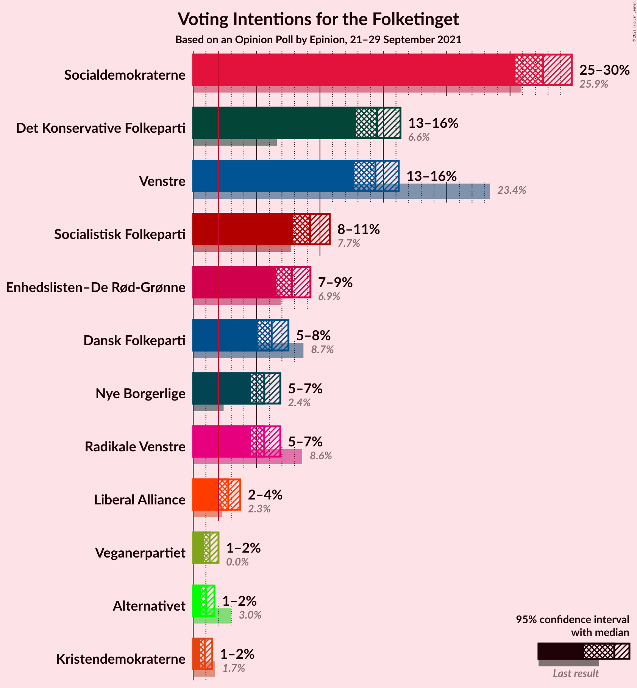

### Confidence Intervals

| Party | Last Result | Poll Result | 80% Confidence Interval | 90% Confidence Interval | 95% Confidence Interval | 99% Confidence Interval |
|:-----:|:-----------:|:-----------:|:-----------------------:|:-----------------------:|:-----------------------:|:-----------------------:|
| Socialdemokraterne | 25.9% | 27.6% | 26.2–29.1% |25.8–29.5% |25.4–29.9% |24.8–30.6% |
| Det Konservative Folkeparti | 6.6% | 14.5% | 13.4–15.7% |13.1–16.0% |12.8–16.4% |12.3–16.9% |
| Venstre | 23.4% | 14.4% | 13.3–15.6% |13.0–15.9% |12.7–16.2% |12.2–16.8% |
| Socialistisk Folkeparti | 7.7% | 9.2% | 8.3–10.2% |8.1–10.5% |7.9–10.8% |7.5–11.3% |
| Enhedslisten–De Rød-Grønne | 6.9% | 7.8% | 7.0–8.7% |6.8–9.0% |6.6–9.3% |6.2–9.7% |
| Dansk Folkeparti | 8.7% | 6.2% | 5.5–7.1% |5.3–7.3% |5.1–7.5% |4.8–7.9% |
| Radikale Venstre | 8.6% | 5.6% | 4.9–6.4% |4.7–6.7% |4.6–6.9% |4.3–7.3% |
| Nye Borgerlige | 2.4% | 5.6% | 4.9–6.4% |4.7–6.7% |4.6–6.9% |4.3–7.3% |
| Liberal Alliance | 2.3% | 2.8% | 2.3–3.4% |2.2–3.6% |2.1–3.7% |1.9–4.0% |
| Veganerpartiet | 0.0% | 1.3% | 1.0–1.8% |0.9–1.9% |0.8–2.0% |0.7–2.2% |
| Alternativet | 3.0% | 1.0% | 0.8–1.4% |0.7–1.6% |0.6–1.7% |0.5–1.9% |
| Kristendemokraterne | 1.7% | 0.9% | 0.7–1.3% |0.6–1.4% |0.5–1.5% |0.4–1.7% |

*Note:* The poll result column reflects the actual value used in the calculations. Published results may vary slightly, and in addition be rounded to fewer digits.

## Seats

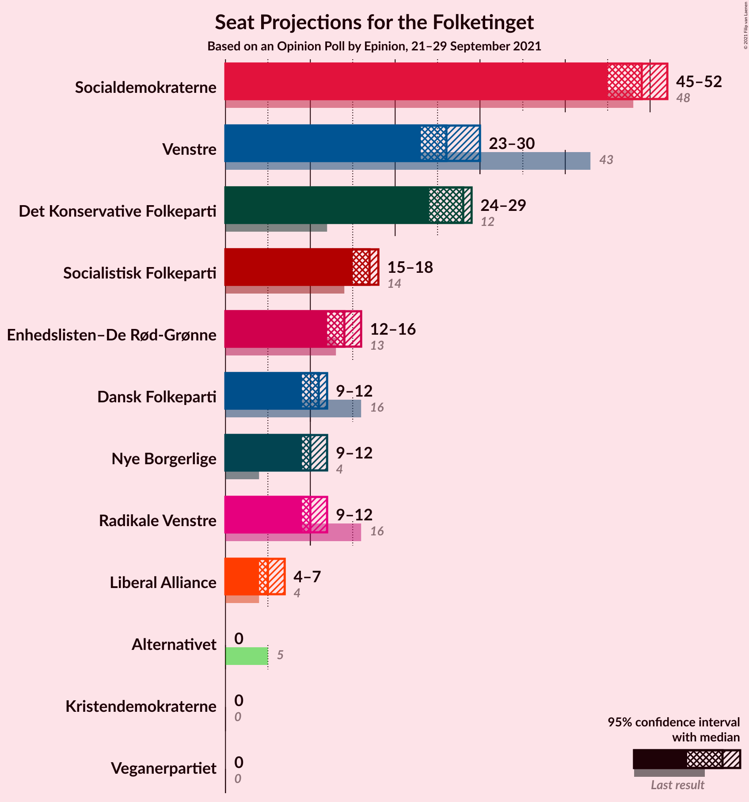

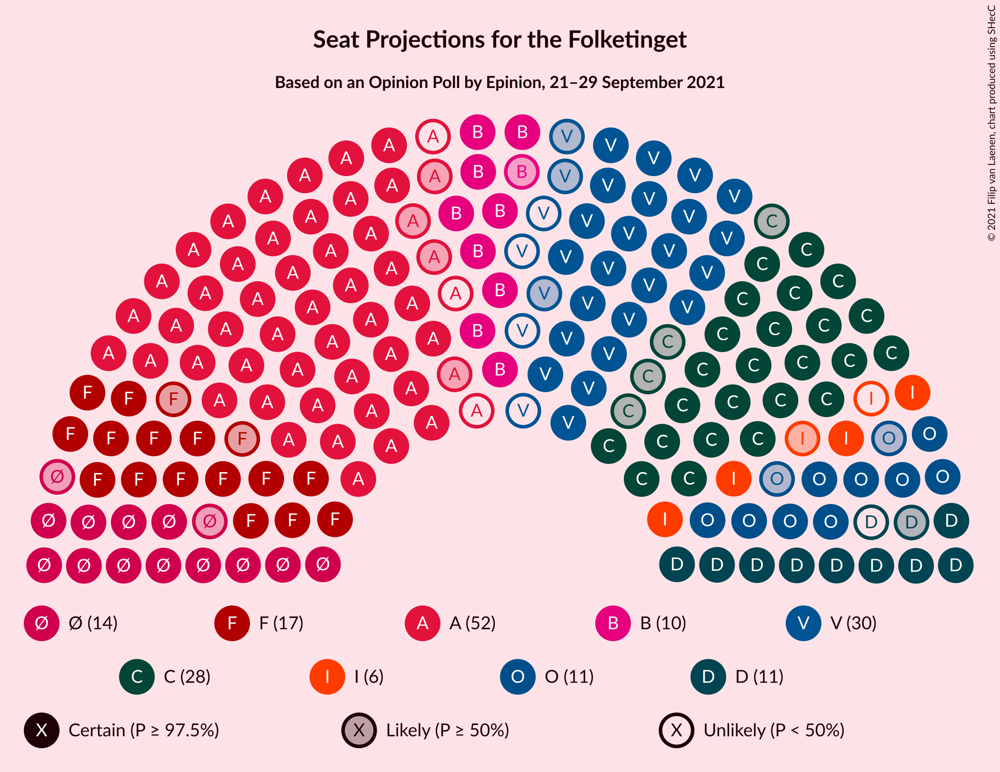

### Confidence Intervals

| Party | Last Result | Median | 80% Confidence Interval | 90% Confidence Interval | 95% Confidence Interval | 99% Confidence Interval |
|:-----:|:-----------:|:------:|:-----------------------:|:-----------------------:|:-----------------------:|:-----------------------:|
| <a href="#socialdemokraterne">Socialdemokraterne</a> | 48 | 49 | 46–52 |45–52 |45–52 |44–52 |
| <a href="#det-konservative-folkeparti">Det Konservative Folkeparti</a> | 12 | 28 | 25–29 |24–29 |24–29 |24–29 |
| <a href="#venstre">Venstre</a> | 43 | 26 | 24–29 |23–29 |23–30 |23–30 |
| <a href="#socialistisk-folkeparti">Socialistisk Folkeparti</a> | 14 | 17 | 15–17 |15–17 |15–18 |14–19 |
| <a href="#enhedslisten–de-rød-grønne">Enhedslisten–De Rød-Grønne</a> | 13 | 14 | 12–15 |12–15 |12–16 |11–16 |
| <a href="#dansk-folkeparti">Dansk Folkeparti</a> | 16 | 11 | 10–12 |10–12 |9–12 |9–13 |
| <a href="#radikale-venstre">Radikale Venstre</a> | 16 | 10 | 10–12 |9–12 |9–12 |9–12 |
| <a href="#nye-borgerlige">Nye Borgerlige</a> | 4 | 10 | 10–12 |9–12 |9–12 |9–12 |
| <a href="#liberal-alliance">Liberal Alliance</a> | 4 | 5 | 5–7 |5–7 |4–7 |4–7 |
| <a href="#veganerpartiet">Veganerpartiet</a> | 0 | 0 | 0 |0 |0 |0–4 |
| <a href="#alternativet">Alternativet</a> | 5 | 0 | 0 |0 |0 |0 |
| <a href="#kristendemokraterne">Kristendemokraterne</a> | 0 | 0 | 0 |0 |0 |0 |

### Socialdemokraterne

*For a full overview of the results for this party, see the [Socialdemokraterne](party-socialdemokraterne.html) page.*

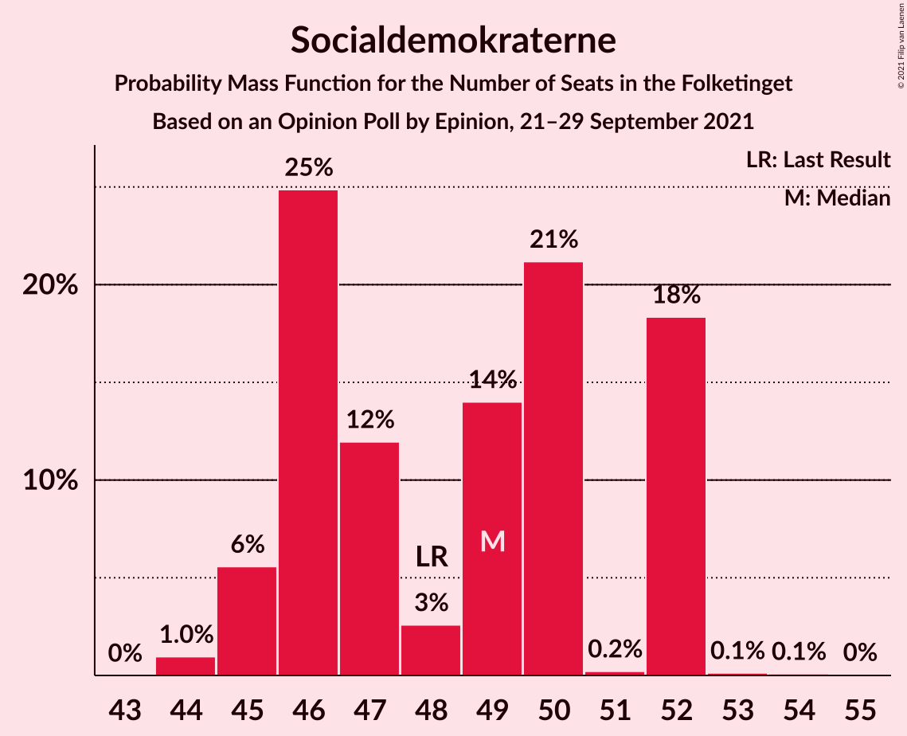

| Number of Seats | Probability | Accumulated | Special Marks |
|:---------------:|:-----------:|:-----------:|:-------------:|
| 44 | 1.0% | 100% |  |
| 45 | 6% | 99.0% |  |
| 46 | 25% | 93% |  |
| 47 | 12% | 69% |  |
| 48 | 3% | 57% | Last Result |
| 49 | 14% | 54% | Median |
| 50 | 21% | 40% |  |
| 51 | 0.2% | 19% |  |
| 52 | 18% | 19% |  |
| 53 | 0.1% | 0.3% |  |
| 54 | 0.1% | 0.1% |  |
| 55 | 0% | 0% |  |

### Det Konservative Folkeparti

*For a full overview of the results for this party, see the [Det Konservative Folkeparti](party-detkonservativefolkeparti.html) page.*

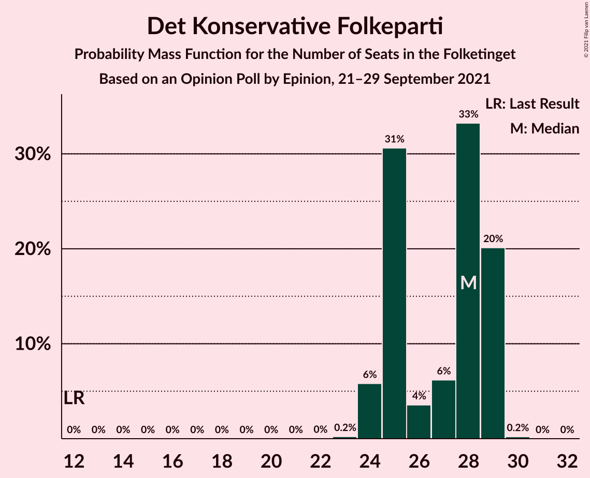

| Number of Seats | Probability | Accumulated | Special Marks |
|:---------------:|:-----------:|:-----------:|:-------------:|
| 12 | 0% | 100% | Last Result |
| 13 | 0% | 100% |  |
| 14 | 0% | 100% |  |
| 15 | 0% | 100% |  |
| 16 | 0% | 100% |  |
| 17 | 0% | 100% |  |
| 18 | 0% | 100% |  |
| 19 | 0% | 100% |  |
| 20 | 0% | 100% |  |
| 21 | 0% | 100% |  |
| 22 | 0% | 100% |  |
| 23 | 0.2% | 100% |  |
| 24 | 6% | 99.7% |  |
| 25 | 31% | 94% |  |
| 26 | 4% | 63% |  |
| 27 | 6% | 60% |  |
| 28 | 33% | 54% | Median |
| 29 | 20% | 20% |  |
| 30 | 0.2% | 0.2% |  |
| 31 | 0% | 0% |  |

### Venstre

*For a full overview of the results for this party, see the [Venstre](party-venstre.html) page.*

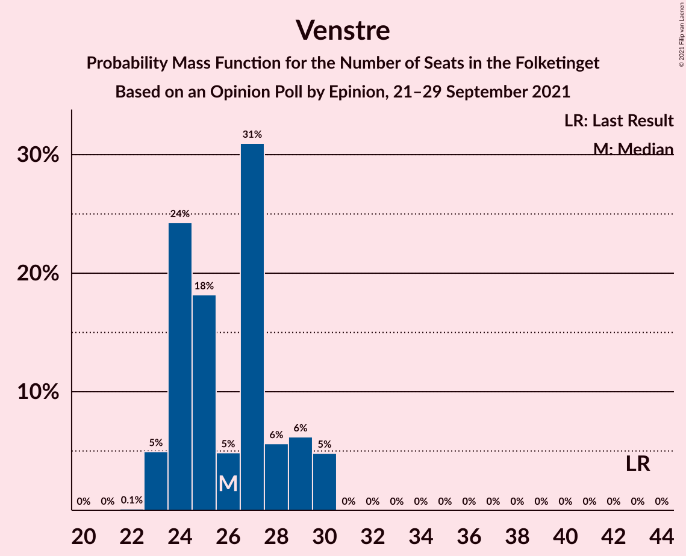

| Number of Seats | Probability | Accumulated | Special Marks |
|:---------------:|:-----------:|:-----------:|:-------------:|
| 22 | 0.1% | 100% |  |
| 23 | 5% | 99.9% |  |
| 24 | 24% | 95% |  |
| 25 | 18% | 71% |  |
| 26 | 5% | 52% | Median |
| 27 | 31% | 48% |  |
| 28 | 6% | 17% |  |
| 29 | 6% | 11% |  |
| 30 | 5% | 5% |  |
| 31 | 0% | 0% |  |
| 32 | 0% | 0% |  |
| 33 | 0% | 0% |  |
| 34 | 0% | 0% |  |
| 35 | 0% | 0% |  |
| 36 | 0% | 0% |  |
| 37 | 0% | 0% |  |
| 38 | 0% | 0% |  |
| 39 | 0% | 0% |  |
| 40 | 0% | 0% |  |
| 41 | 0% | 0% |  |
| 42 | 0% | 0% |  |
| 43 | 0% | 0% | Last Result |

### Socialistisk Folkeparti

*For a full overview of the results for this party, see the [Socialistisk Folkeparti](party-socialistiskfolkeparti.html) page.*

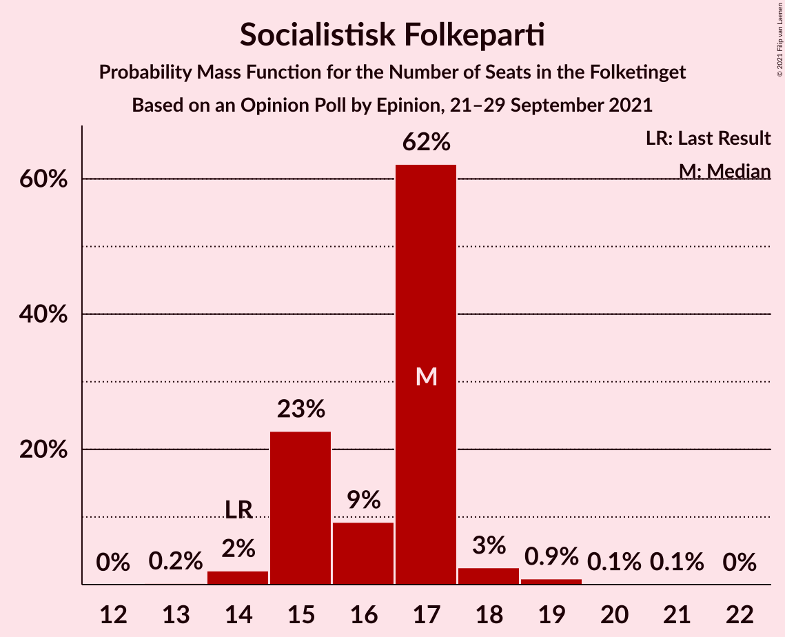

| Number of Seats | Probability | Accumulated | Special Marks |
|:---------------:|:-----------:|:-----------:|:-------------:|
| 13 | 0.2% | 100% |  |
| 14 | 2% | 99.8% | Last Result |
| 15 | 23% | 98% |  |
| 16 | 9% | 75% |  |
| 17 | 62% | 66% | Median |
| 18 | 3% | 4% |  |
| 19 | 0.9% | 1.1% |  |
| 20 | 0.1% | 0.2% |  |
| 21 | 0.1% | 0.1% |  |
| 22 | 0% | 0% |  |

### Enhedslisten–De Rød-Grønne

*For a full overview of the results for this party, see the [Enhedslisten–De Rød-Grønne](party-enhedslisten–derød-grønne.html) page.*

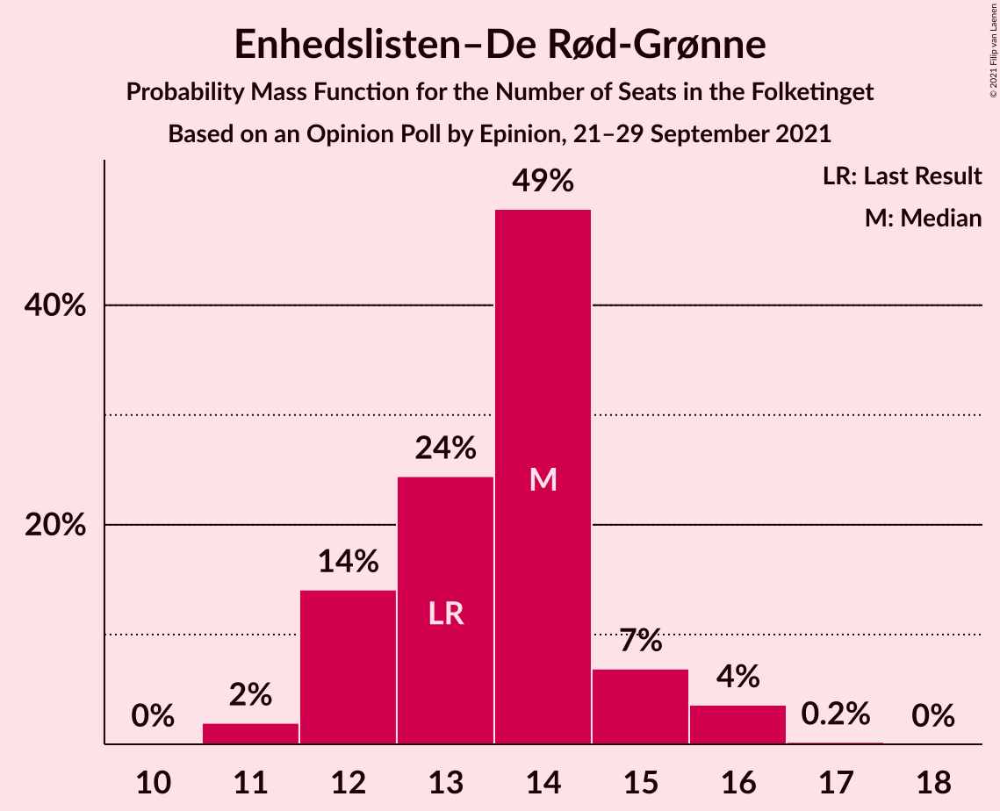

| Number of Seats | Probability | Accumulated | Special Marks |
|:---------------:|:-----------:|:-----------:|:-------------:|
| 11 | 2% | 100% |  |
| 12 | 14% | 98% |  |
| 13 | 24% | 84% | Last Result |
| 14 | 49% | 60% | Median |
| 15 | 7% | 11% |  |
| 16 | 4% | 4% |  |
| 17 | 0.2% | 0.2% |  |
| 18 | 0% | 0% |  |

### Dansk Folkeparti

*For a full overview of the results for this party, see the [Dansk Folkeparti](party-danskfolkeparti.html) page.*

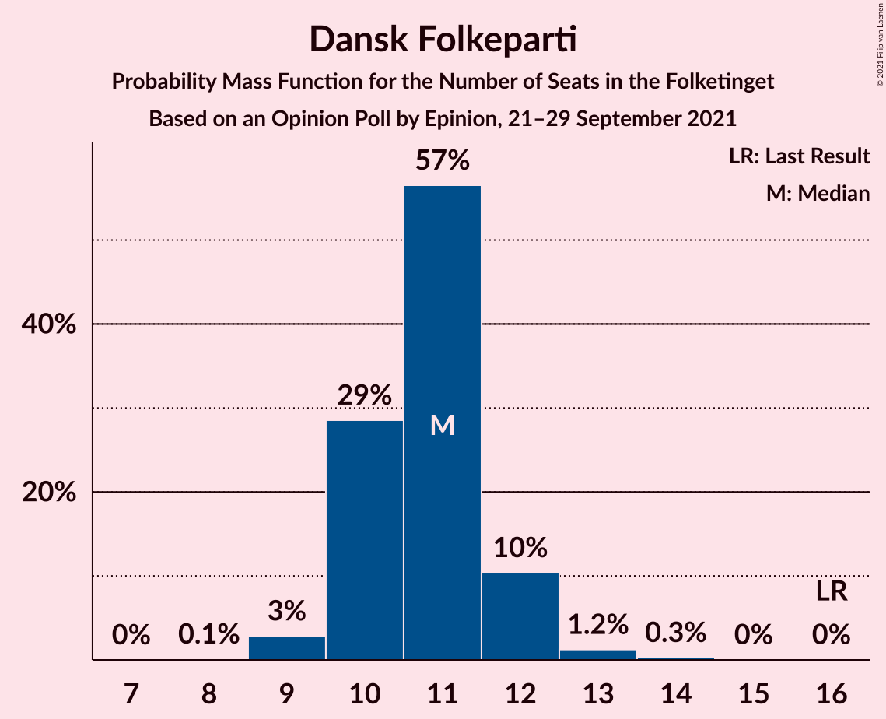

| Number of Seats | Probability | Accumulated | Special Marks |
|:---------------:|:-----------:|:-----------:|:-------------:|
| 8 | 0.1% | 100% |  |
| 9 | 3% | 99.9% |  |
| 10 | 29% | 97% |  |
| 11 | 57% | 68% | Median |
| 12 | 10% | 12% |  |
| 13 | 1.2% | 2% |  |
| 14 | 0.3% | 0.3% |  |
| 15 | 0% | 0.1% |  |
| 16 | 0% | 0% | Last Result |

### Radikale Venstre

*For a full overview of the results for this party, see the [Radikale Venstre](party-radikalevenstre.html) page.*

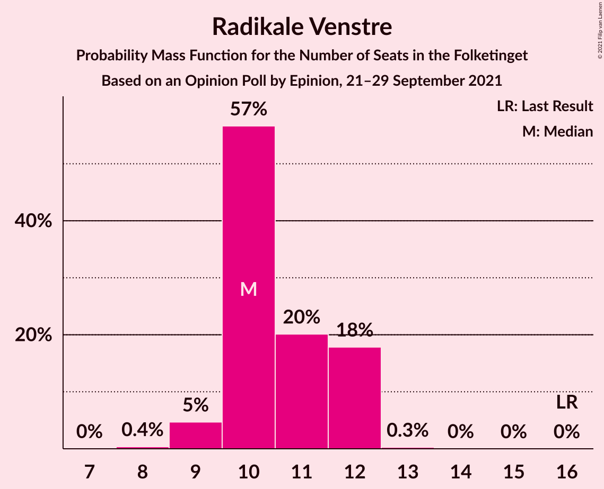

| Number of Seats | Probability | Accumulated | Special Marks |
|:---------------:|:-----------:|:-----------:|:-------------:|
| 8 | 0.4% | 100% |  |
| 9 | 5% | 99.6% |  |
| 10 | 57% | 95% | Median |
| 11 | 20% | 38% |  |
| 12 | 18% | 18% |  |
| 13 | 0.3% | 0.3% |  |
| 14 | 0% | 0% |  |
| 15 | 0% | 0% |  |
| 16 | 0% | 0% | Last Result |

### Nye Borgerlige

*For a full overview of the results for this party, see the [Nye Borgerlige](party-nyeborgerlige.html) page.*

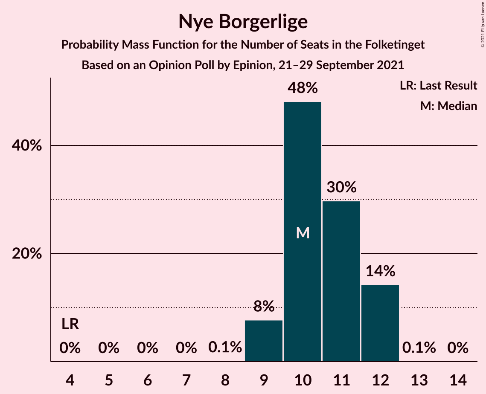

| Number of Seats | Probability | Accumulated | Special Marks |
|:---------------:|:-----------:|:-----------:|:-------------:|
| 4 | 0% | 100% | Last Result |
| 5 | 0% | 100% |  |
| 6 | 0% | 100% |  |
| 7 | 0% | 100% |  |
| 8 | 0.1% | 100% |  |
| 9 | 8% | 99.8% |  |
| 10 | 48% | 92% | Median |
| 11 | 30% | 44% |  |
| 12 | 14% | 14% |  |
| 13 | 0.1% | 0.1% |  |
| 14 | 0% | 0% |  |

### Liberal Alliance

*For a full overview of the results for this party, see the [Liberal Alliance](party-liberalalliance.html) page.*

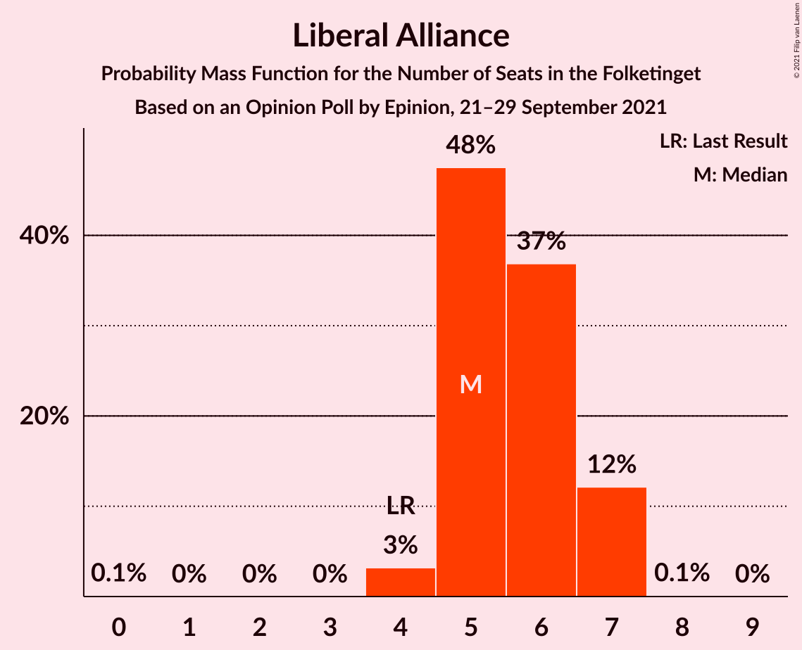

| Number of Seats | Probability | Accumulated | Special Marks |
|:---------------:|:-----------:|:-----------:|:-------------:|
| 0 | 0.1% | 100% |  |
| 1 | 0% | 99.9% |  |
| 2 | 0% | 99.9% |  |
| 3 | 0% | 99.9% |  |
| 4 | 3% | 99.9% | Last Result |
| 5 | 48% | 97% | Median |
| 6 | 37% | 49% |  |
| 7 | 12% | 12% |  |
| 8 | 0.1% | 0.1% |  |
| 9 | 0% | 0% |  |

### Veganerpartiet

*For a full overview of the results for this party, see the [Veganerpartiet](party-veganerpartiet.html) page.*

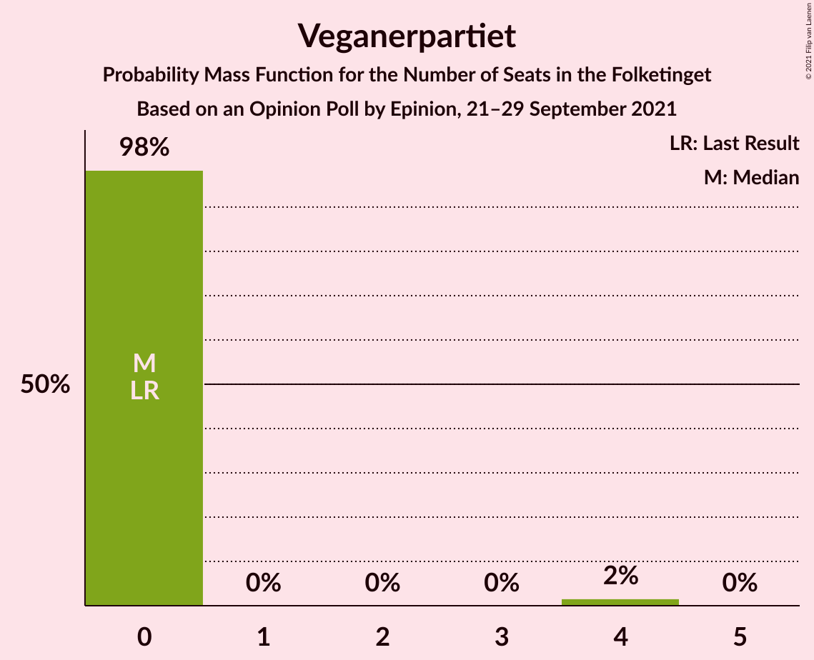

| Number of Seats | Probability | Accumulated | Special Marks |
|:---------------:|:-----------:|:-----------:|:-------------:|
| 0 | 98% | 100% | Last Result, Median |
| 1 | 0% | 2% |  |
| 2 | 0% | 2% |  |
| 3 | 0% | 2% |  |
| 4 | 2% | 2% |  |
| 5 | 0% | 0% |  |

### Alternativet

*For a full overview of the results for this party, see the [Alternativet](party-alternativet.html) page.*

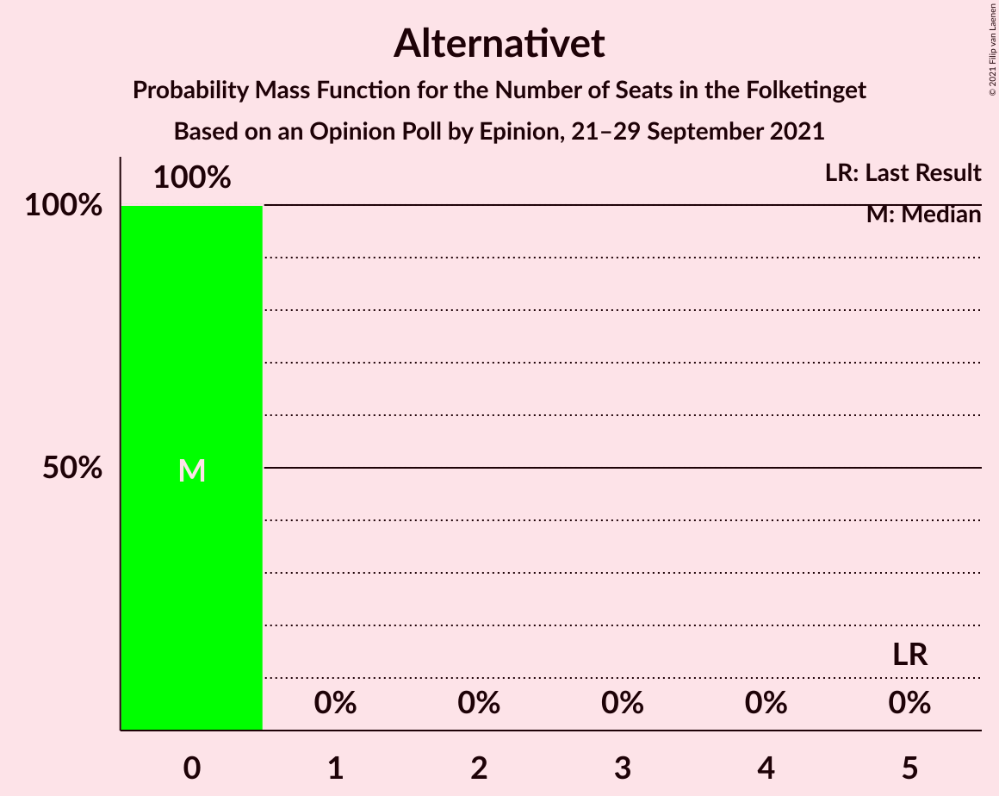

| Number of Seats | Probability | Accumulated | Special Marks |
|:---------------:|:-----------:|:-----------:|:-------------:|
| 0 | 100% | 100% | Median |
| 1 | 0% | 0% |  |
| 2 | 0% | 0% |  |
| 3 | 0% | 0% |  |
| 4 | 0% | 0% |  |
| 5 | 0% | 0% | Last Result |

### Kristendemokraterne

*For a full overview of the results for this party, see the [Kristendemokraterne](party-kristendemokraterne.html) page.*

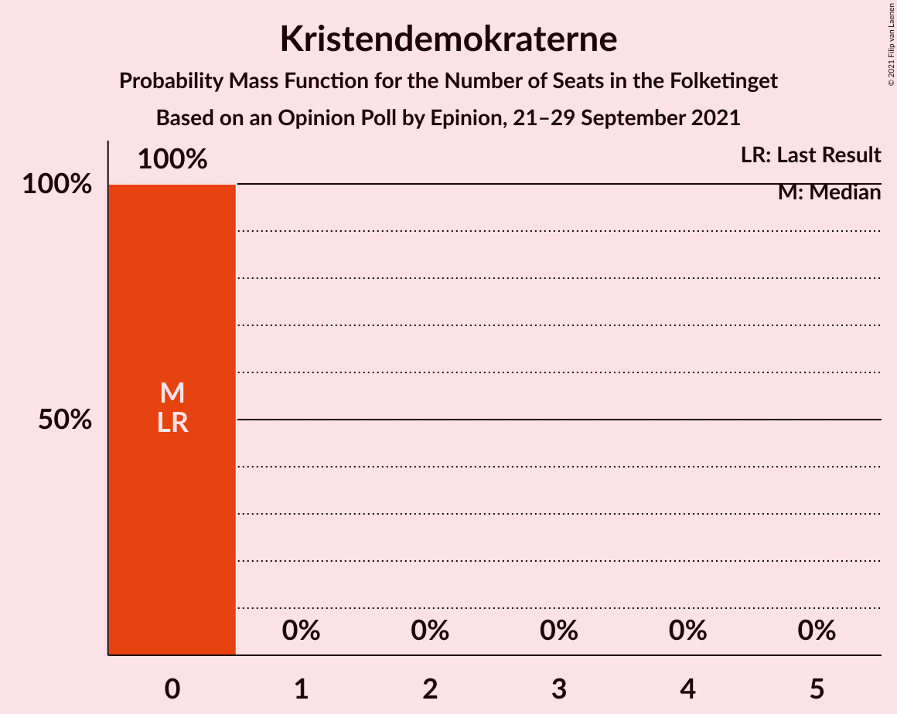

| Number of Seats | Probability | Accumulated | Special Marks |
|:---------------:|:-----------:|:-----------:|:-------------:|
| 0 | 100% | 100% | Last Result, Median |

## Coalitions

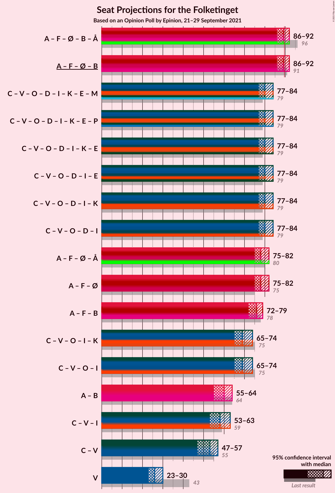

### Confidence Intervals

| Coalition | Last Result | Median | Majority? | 80% Confidence Interval | 90% Confidence Interval | 95% Confidence Interval | 99% Confidence Interval |
|:---------:|:-----------:|:------:|:---------:|:-----------------------:|:-----------------------:|:-----------------------:|:-----------------------:|
| Socialdemokraterne – Socialistisk Folkeparti – Enhedslisten–De Rød-Grønne – Radikale Venstre – Alternativet | 96 | 89 | 39% | 86–92 | 86–92 | 86–92 | 85–94 |
| Socialdemokraterne – Socialistisk Folkeparti – Enhedslisten–De Rød-Grønne – Radikale Venstre | 91 | 89 | 39% | 86–92 | 86–92 | 86–92 | 85–94 |
| Det Konservative Folkeparti – Venstre – Dansk Folkeparti – Nye Borgerlige – Liberal Alliance – Kristendemokraterne | 79 | 80 | 0% | 78–84 | 77–84 | 77–84 | 74–84 |
| Det Konservative Folkeparti – Venstre – Dansk Folkeparti – Nye Borgerlige – Liberal Alliance | 79 | 80 | 0% | 78–84 | 77–84 | 77–84 | 74–84 |
| Socialdemokraterne – Socialistisk Folkeparti – Enhedslisten–De Rød-Grønne – Alternativet | 80 | 78 | 0% | 76–81 | 75–81 | 75–82 | 74–84 |
| Socialdemokraterne – Socialistisk Folkeparti – Enhedslisten–De Rød-Grønne | 75 | 78 | 0% | 76–81 | 75–81 | 75–82 | 74–84 |
| Socialdemokraterne – Socialistisk Folkeparti – Radikale Venstre | 78 | 76 | 0% | 73–79 | 72–79 | 72–79 | 71–79 |
| Det Konservative Folkeparti – Venstre – Dansk Folkeparti – Liberal Alliance – Kristendemokraterne | 75 | 69 | 0% | 68–73 | 65–74 | 65–74 | 63–74 |
| Det Konservative Folkeparti – Venstre – Dansk Folkeparti – Liberal Alliance | 75 | 69 | 0% | 68–73 | 65–74 | 65–74 | 63–74 |
| Socialdemokraterne – Radikale Venstre | 64 | 60 | 0% | 56–64 | 55–64 | 55–64 | 53–64 |
| Det Konservative Folkeparti – Venstre – Liberal Alliance | 59 | 58 | 0% | 57–62 | 54–63 | 53–63 | 53–63 |
| Det Konservative Folkeparti – Venstre | 55 | 53 | 0% | 52–57 | 50–57 | 47–57 | 47–57 |
| Venstre | 43 | 26 | 0% | 24–29 | 23–29 | 23–30 | 23–30 |

### Socialdemokraterne – Socialistisk Folkeparti – Enhedslisten–De Rød-Grønne – Radikale Venstre – Alternativet

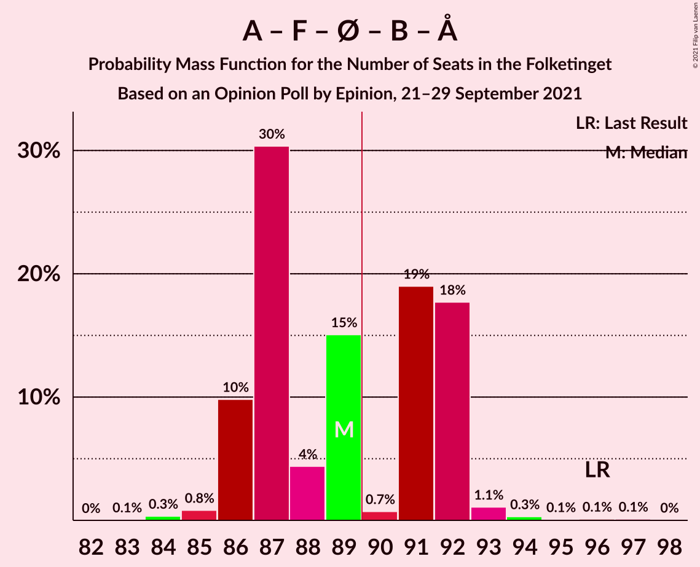

| Number of Seats | Probability | Accumulated | Special Marks |
|:---------------:|:-----------:|:-----------:|:-------------:|
| 83 | 0.1% | 100% |  |
| 84 | 0.3% | 99.9% |  |
| 85 | 0.8% | 99.6% |  |
| 86 | 10% | 98.8% |  |
| 87 | 30% | 89% |  |
| 88 | 4% | 59% |  |
| 89 | 15% | 54% |  |
| 90 | 0.7% | 39% | Median, Majority |
| 91 | 19% | 38% |  |
| 92 | 18% | 19% |  |
| 93 | 1.1% | 2% |  |
| 94 | 0.3% | 0.6% |  |
| 95 | 0.1% | 0.3% |  |
| 96 | 0.1% | 0.3% | Last Result |
| 97 | 0.1% | 0.1% |  |
| 98 | 0% | 0% |  |

### Socialdemokraterne – Socialistisk Folkeparti – Enhedslisten–De Rød-Grønne – Radikale Venstre

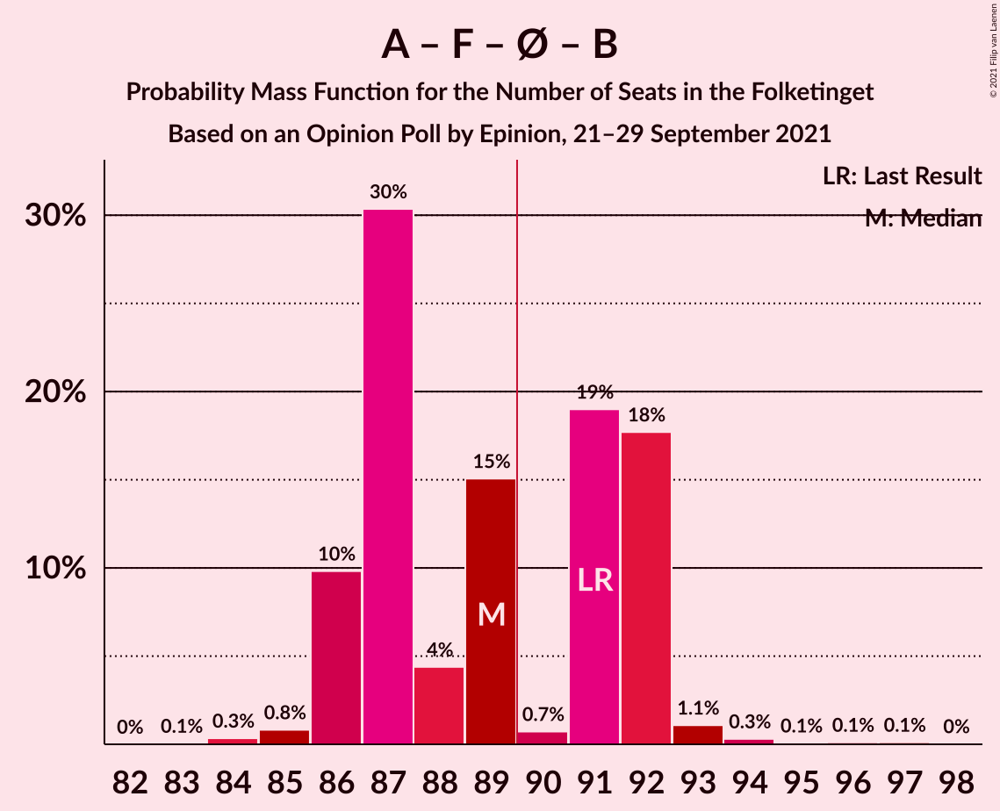

| Number of Seats | Probability | Accumulated | Special Marks |
|:---------------:|:-----------:|:-----------:|:-------------:|
| 83 | 0.1% | 100% |  |
| 84 | 0.3% | 99.9% |  |
| 85 | 0.8% | 99.6% |  |
| 86 | 10% | 98.8% |  |
| 87 | 30% | 89% |  |
| 88 | 4% | 59% |  |
| 89 | 15% | 54% |  |
| 90 | 0.7% | 39% | Median, Majority |
| 91 | 19% | 38% | Last Result |
| 92 | 18% | 19% |  |
| 93 | 1.1% | 2% |  |
| 94 | 0.3% | 0.6% |  |
| 95 | 0.1% | 0.3% |  |
| 96 | 0.1% | 0.3% |  |
| 97 | 0.1% | 0.1% |  |
| 98 | 0% | 0% |  |

### Det Konservative Folkeparti – Venstre – Dansk Folkeparti – Nye Borgerlige – Liberal Alliance – Kristendemokraterne

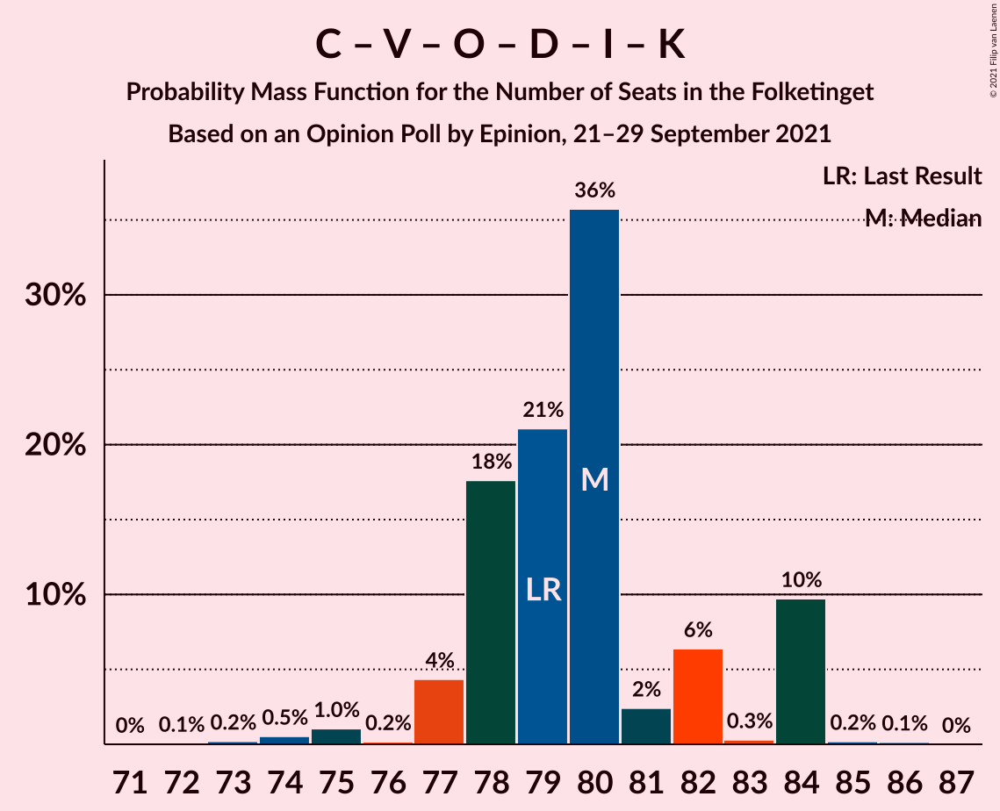

| Number of Seats | Probability | Accumulated | Special Marks |
|:---------------:|:-----------:|:-----------:|:-------------:|
| 72 | 0.1% | 100% |  |
| 73 | 0.2% | 99.9% |  |
| 74 | 0.5% | 99.7% |  |
| 75 | 1.0% | 99.2% |  |
| 76 | 0.2% | 98% |  |
| 77 | 4% | 98% |  |
| 78 | 18% | 94% |  |
| 79 | 21% | 76% | Last Result |
| 80 | 36% | 55% | Median |
| 81 | 2% | 19% |  |
| 82 | 6% | 17% |  |
| 83 | 0.3% | 10% |  |
| 84 | 10% | 10% |  |
| 85 | 0.2% | 0.3% |  |
| 86 | 0.1% | 0.1% |  |
| 87 | 0% | 0% |  |

### Det Konservative Folkeparti – Venstre – Dansk Folkeparti – Nye Borgerlige – Liberal Alliance

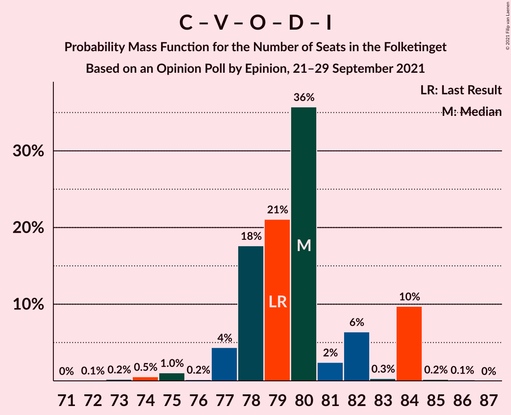

| Number of Seats | Probability | Accumulated | Special Marks |
|:---------------:|:-----------:|:-----------:|:-------------:|
| 72 | 0.1% | 100% |  |
| 73 | 0.2% | 99.9% |  |
| 74 | 0.5% | 99.7% |  |
| 75 | 1.0% | 99.2% |  |
| 76 | 0.2% | 98% |  |
| 77 | 4% | 98% |  |
| 78 | 18% | 94% |  |
| 79 | 21% | 76% | Last Result |
| 80 | 36% | 55% | Median |
| 81 | 2% | 19% |  |
| 82 | 6% | 17% |  |
| 83 | 0.3% | 10% |  |
| 84 | 10% | 10% |  |
| 85 | 0.2% | 0.3% |  |
| 86 | 0.1% | 0.1% |  |
| 87 | 0% | 0% |  |

### Socialdemokraterne – Socialistisk Folkeparti – Enhedslisten–De Rød-Grønne – Alternativet

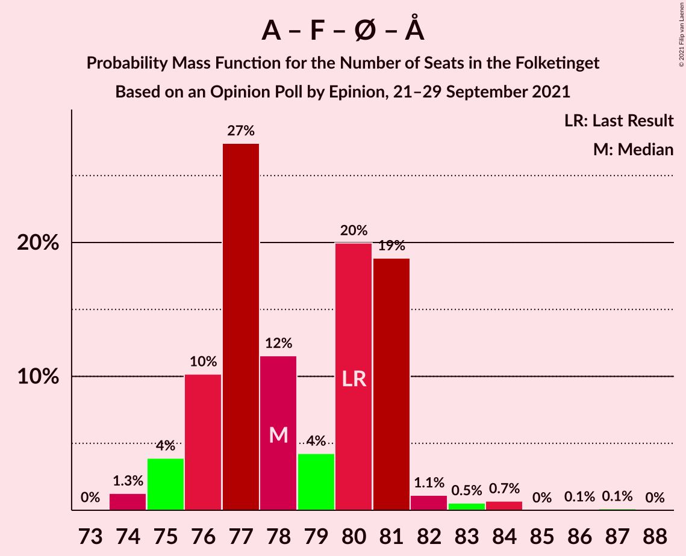

| Number of Seats | Probability | Accumulated | Special Marks |
|:---------------:|:-----------:|:-----------:|:-------------:|
| 73 | 0% | 100% |  |
| 74 | 1.3% | 99.9% |  |
| 75 | 4% | 98.7% |  |
| 76 | 10% | 95% |  |
| 77 | 27% | 85% |  |
| 78 | 12% | 57% |  |
| 79 | 4% | 46% |  |
| 80 | 20% | 41% | Last Result, Median |
| 81 | 19% | 21% |  |
| 82 | 1.1% | 3% |  |
| 83 | 0.5% | 1.4% |  |
| 84 | 0.7% | 0.9% |  |
| 85 | 0% | 0.2% |  |
| 86 | 0.1% | 0.2% |  |
| 87 | 0.1% | 0.1% |  |
| 88 | 0% | 0% |  |

### Socialdemokraterne – Socialistisk Folkeparti – Enhedslisten–De Rød-Grønne

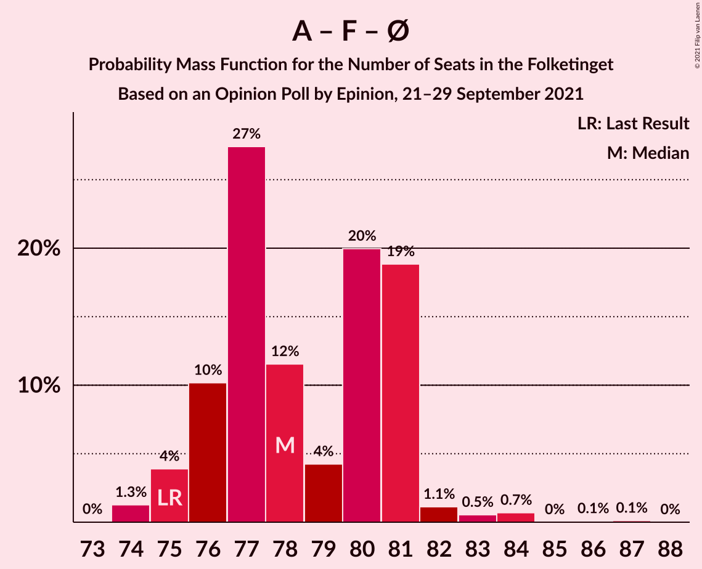

| Number of Seats | Probability | Accumulated | Special Marks |
|:---------------:|:-----------:|:-----------:|:-------------:|
| 73 | 0% | 100% |  |
| 74 | 1.3% | 99.9% |  |
| 75 | 4% | 98.7% | Last Result |
| 76 | 10% | 95% |  |
| 77 | 27% | 85% |  |
| 78 | 12% | 57% |  |
| 79 | 4% | 46% |  |
| 80 | 20% | 41% | Median |
| 81 | 19% | 21% |  |
| 82 | 1.1% | 3% |  |
| 83 | 0.5% | 1.4% |  |
| 84 | 0.7% | 0.9% |  |
| 85 | 0% | 0.2% |  |
| 86 | 0.1% | 0.2% |  |
| 87 | 0.1% | 0.1% |  |
| 88 | 0% | 0% |  |

### Socialdemokraterne – Socialistisk Folkeparti – Radikale Venstre

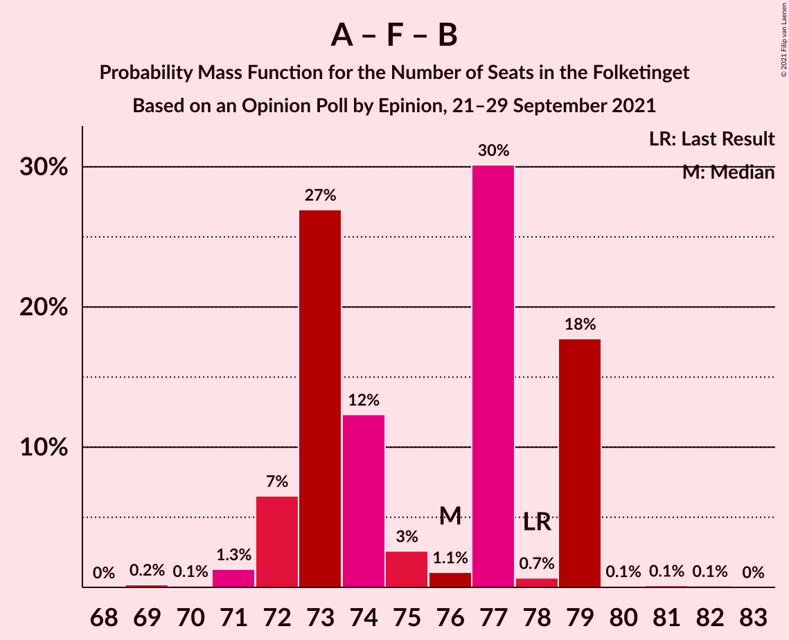

| Number of Seats | Probability | Accumulated | Special Marks |
|:---------------:|:-----------:|:-----------:|:-------------:|
| 69 | 0.2% | 100% |  |
| 70 | 0.1% | 99.8% |  |
| 71 | 1.3% | 99.7% |  |
| 72 | 7% | 98% |  |
| 73 | 27% | 92% |  |
| 74 | 12% | 65% |  |
| 75 | 3% | 53% |  |
| 76 | 1.1% | 50% | Median |
| 77 | 30% | 49% |  |
| 78 | 0.7% | 19% | Last Result |
| 79 | 18% | 18% |  |
| 80 | 0.1% | 0.4% |  |
| 81 | 0.1% | 0.3% |  |
| 82 | 0.1% | 0.1% |  |
| 83 | 0% | 0% |  |

### Det Konservative Folkeparti – Venstre – Dansk Folkeparti – Liberal Alliance – Kristendemokraterne

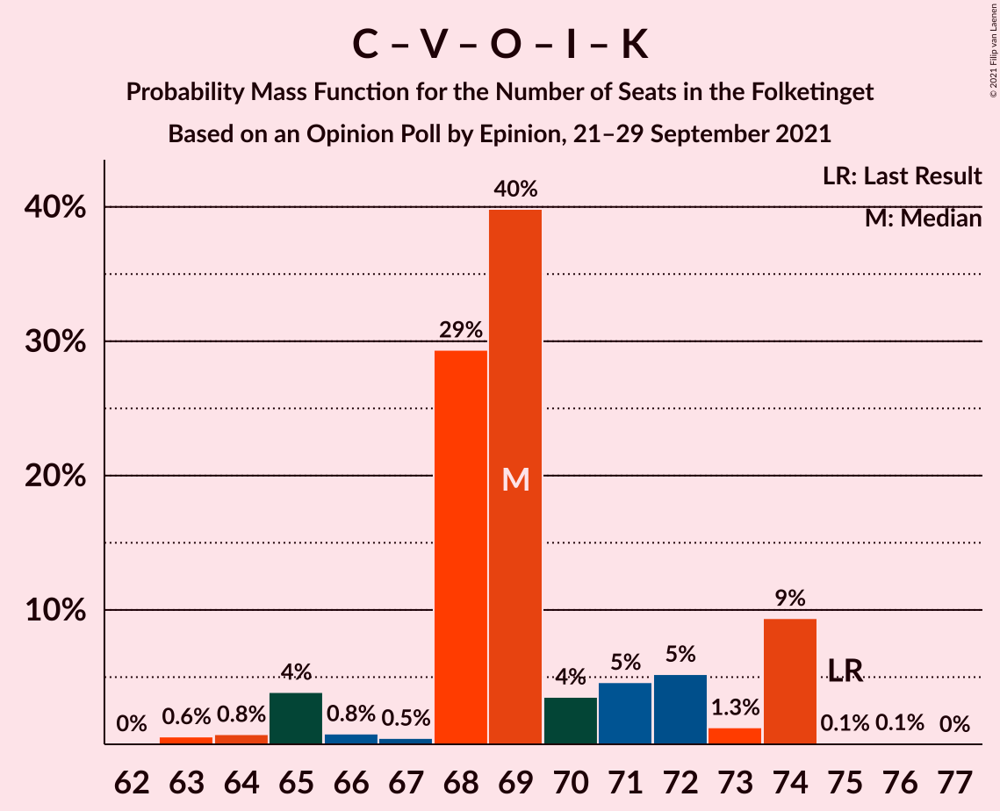

| Number of Seats | Probability | Accumulated | Special Marks |
|:---------------:|:-----------:|:-----------:|:-------------:|
| 62 | 0% | 100% |  |
| 63 | 0.6% | 99.9% |  |
| 64 | 0.8% | 99.4% |  |
| 65 | 4% | 98.6% |  |
| 66 | 0.8% | 95% |  |
| 67 | 0.5% | 94% |  |
| 68 | 29% | 93% |  |
| 69 | 40% | 64% |  |
| 70 | 4% | 24% | Median |
| 71 | 5% | 21% |  |
| 72 | 5% | 16% |  |
| 73 | 1.3% | 11% |  |
| 74 | 9% | 10% |  |
| 75 | 0.1% | 0.2% | Last Result |
| 76 | 0.1% | 0.1% |  |
| 77 | 0% | 0% |  |

### Det Konservative Folkeparti – Venstre – Dansk Folkeparti – Liberal Alliance

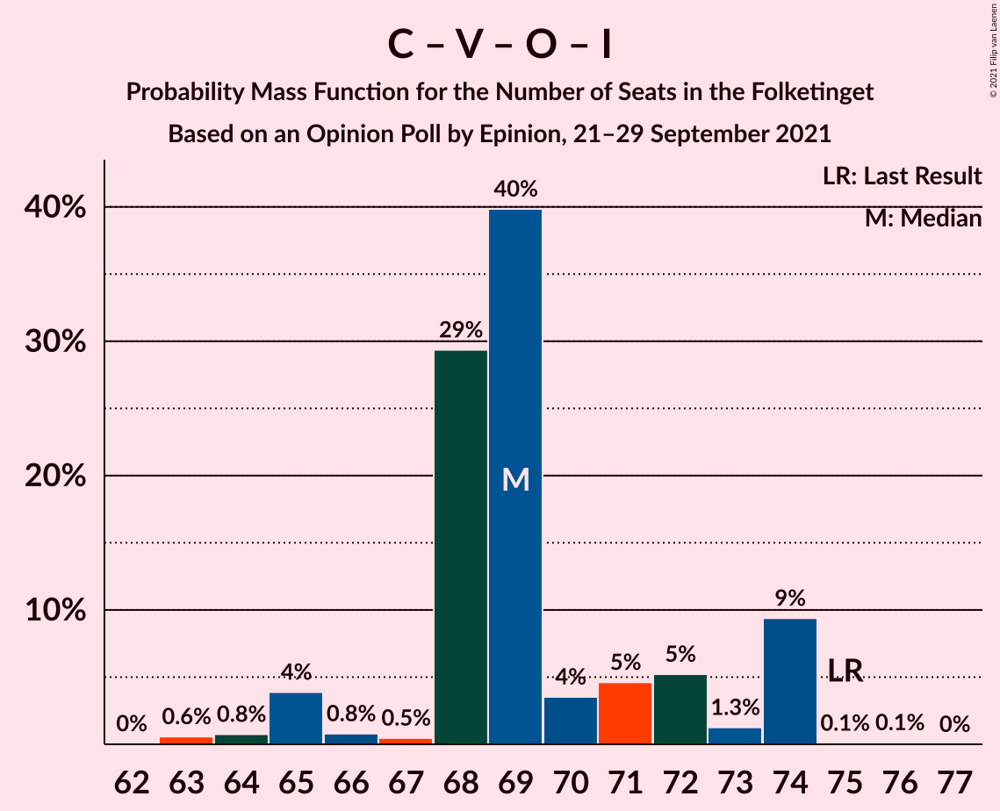

| Number of Seats | Probability | Accumulated | Special Marks |
|:---------------:|:-----------:|:-----------:|:-------------:|
| 62 | 0% | 100% |  |
| 63 | 0.6% | 99.9% |  |
| 64 | 0.8% | 99.4% |  |
| 65 | 4% | 98.6% |  |
| 66 | 0.8% | 95% |  |
| 67 | 0.5% | 94% |  |
| 68 | 29% | 93% |  |
| 69 | 40% | 64% |  |
| 70 | 4% | 24% | Median |
| 71 | 5% | 21% |  |
| 72 | 5% | 16% |  |
| 73 | 1.3% | 11% |  |
| 74 | 9% | 10% |  |
| 75 | 0.1% | 0.2% | Last Result |
| 76 | 0.1% | 0.1% |  |
| 77 | 0% | 0% |  |

### Socialdemokraterne – Radikale Venstre

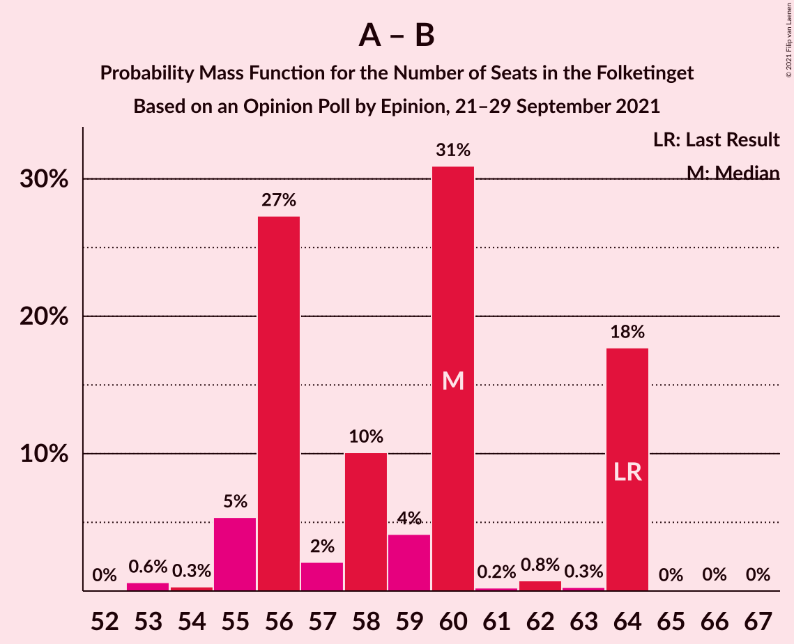

| Number of Seats | Probability | Accumulated | Special Marks |
|:---------------:|:-----------:|:-----------:|:-------------:|
| 53 | 0.6% | 100% |  |
| 54 | 0.3% | 99.3% |  |
| 55 | 5% | 99.0% |  |
| 56 | 27% | 94% |  |
| 57 | 2% | 66% |  |
| 58 | 10% | 64% |  |
| 59 | 4% | 54% | Median |
| 60 | 31% | 50% |  |
| 61 | 0.2% | 19% |  |
| 62 | 0.8% | 19% |  |
| 63 | 0.3% | 18% |  |
| 64 | 18% | 18% | Last Result |
| 65 | 0% | 0.1% |  |
| 66 | 0% | 0.1% |  |
| 67 | 0% | 0% |  |

### Det Konservative Folkeparti – Venstre – Liberal Alliance

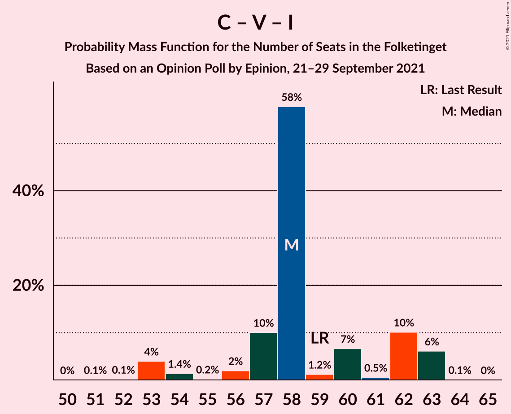

| Number of Seats | Probability | Accumulated | Special Marks |
|:---------------:|:-----------:|:-----------:|:-------------:|
| 51 | 0.1% | 100% |  |
| 52 | 0.1% | 99.9% |  |
| 53 | 4% | 99.8% |  |
| 54 | 1.4% | 96% |  |
| 55 | 0.2% | 95% |  |
| 56 | 2% | 94% |  |
| 57 | 10% | 92% |  |
| 58 | 58% | 82% |  |
| 59 | 1.2% | 25% | Last Result, Median |
| 60 | 7% | 23% |  |
| 61 | 0.5% | 17% |  |
| 62 | 10% | 16% |  |
| 63 | 6% | 6% |  |
| 64 | 0.1% | 0.1% |  |
| 65 | 0% | 0% |  |

### Det Konservative Folkeparti – Venstre

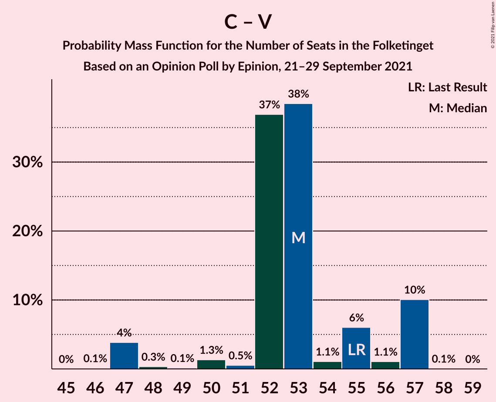

| Number of Seats | Probability | Accumulated | Special Marks |
|:---------------:|:-----------:|:-----------:|:-------------:|
| 46 | 0.1% | 100% |  |
| 47 | 4% | 99.9% |  |
| 48 | 0.3% | 96% |  |
| 49 | 0.1% | 96% |  |
| 50 | 1.3% | 96% |  |
| 51 | 0.5% | 94% |  |
| 52 | 37% | 94% |  |
| 53 | 38% | 57% |  |
| 54 | 1.1% | 18% | Median |
| 55 | 6% | 17% | Last Result |
| 56 | 1.1% | 11% |  |
| 57 | 10% | 10% |  |
| 58 | 0.1% | 0.1% |  |
| 59 | 0% | 0% |  |

### Venstre

| Number of Seats | Probability | Accumulated | Special Marks |
|:---------------:|:-----------:|:-----------:|:-------------:|
| 22 | 0.1% | 100% |  |
| 23 | 5% | 99.9% |  |
| 24 | 24% | 95% |  |
| 25 | 18% | 71% |  |
| 26 | 5% | 52% | Median |
| 27 | 31% | 48% |  |
| 28 | 6% | 17% |  |
| 29 | 6% | 11% |  |
| 30 | 5% | 5% |  |
| 31 | 0% | 0% |  |
| 32 | 0% | 0% |  |
| 33 | 0% | 0% |  |
| 34 | 0% | 0% |  |
| 35 | 0% | 0% |  |
| 36 | 0% | 0% |  |
| 37 | 0% | 0% |  |
| 38 | 0% | 0% |  |
| 39 | 0% | 0% |  |
| 40 | 0% | 0% |  |
| 41 | 0% | 0% |  |
| 42 | 0% | 0% |  |
| 43 | 0% | 0% | Last Result |

## Technical Information

### Opinion Poll

+ **Polling firm:** Epinion
+ **Commissioner(s):** —
+ **Fieldwork period:** 21–29 September 2021

### Calculations

+ **Sample size:** 1551
+ **Simulations done:** 131,072
+ **Error estimate:** 2.15%

