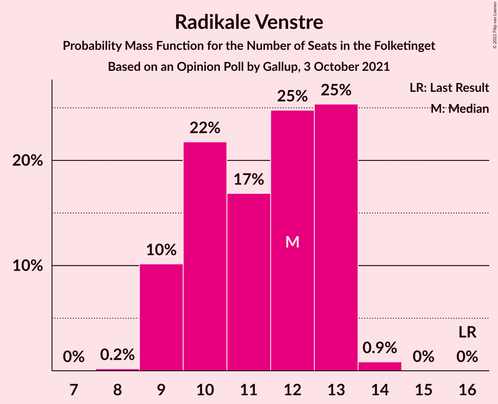
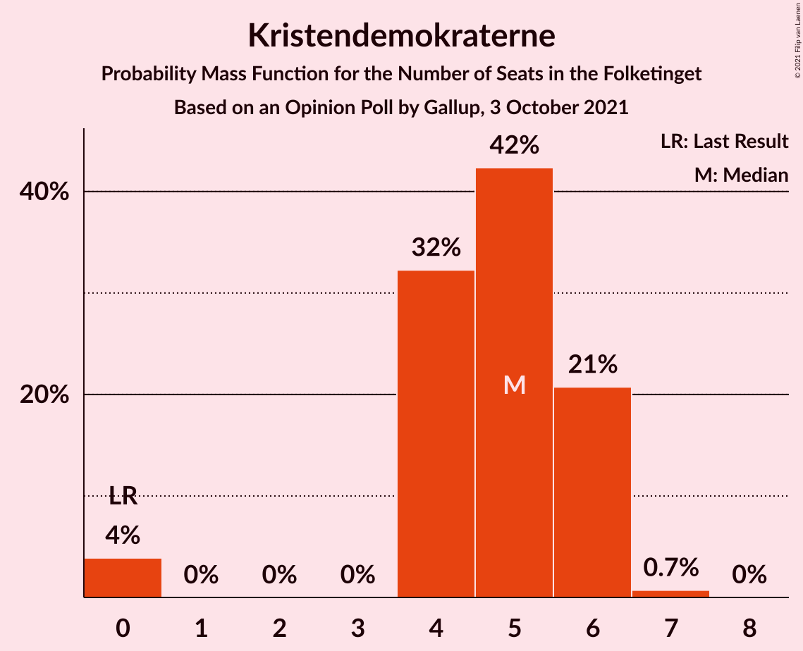

# Opinion Poll by Gallup, 3 October 2021

<a href="#voting-intentions">Voting Intentions</a> | <a href="#seats">Seats</a> | <a href="#coalitions">Coalitions</a> | <a href="#technical-information">Technical Information</a>

## Voting Intentions

### Confidence Intervals

| Party | Last Result | Poll Result | 80% Confidence Interval | 90% Confidence Interval | 95% Confidence Interval | 99% Confidence Interval |
|:-----:|:-----------:|:-----------:|:-----------------------:|:-----------------------:|:-----------------------:|:-----------------------:|
| Socialdemokraterne | 25.9% | 27.3% | 25.9–28.8% |25.6–29.2% |25.2–29.5% |24.6–30.2% |
| Det Konservative Folkeparti | 6.6% | 14.3% | 13.3–15.5% |13.0–15.8% |12.7–16.1% |12.2–16.7% |
| Venstre | 23.4% | 13.2% | 12.2–14.3% |11.9–14.6% |11.6–14.9% |11.2–15.5% |
| Enhedslisten–De Rød-Grønne | 6.9% | 8.7% | 7.9–9.7% |7.7–10.0% |7.5–10.2% |7.1–10.7% |
| Socialistisk Folkeparti | 7.7% | 8.3% | 7.5–9.2% |7.3–9.5% |7.1–9.7% |6.7–10.2% |
| Dansk Folkeparti | 8.7% | 6.9% | 6.2–7.8% |6.0–8.0% |5.8–8.2% |5.5–8.7% |
| Radikale Venstre | 8.6% | 6.1% | 5.4–6.9% |5.2–7.1% |5.0–7.3% |4.7–7.7% |
| Nye Borgerlige | 2.4% | 5.6% | 4.9–6.4% |4.7–6.6% |4.6–6.8% |4.3–7.2% |
| Moderaterne | 0.0% | 3.5% | 3.0–4.1% |2.8–4.3% |2.7–4.5% |2.5–4.8% |
| Kristendemokraterne | 1.7% | 2.5% | 2.1–3.1% |2.0–3.3% |1.9–3.4% |1.7–3.7% |
| Liberal Alliance | 2.3% | 1.9% | 1.6–2.4% |1.4–2.6% |1.4–2.7% |1.2–3.0% |
| Alternativet | 3.0% | 0.6% | 0.4–0.9% |0.4–1.0% |0.3–1.1% |0.3–1.3% |
| Veganerpartiet | 0.0% | 0.1% | 0.1–0.3% |0.0–0.4% |0.0–0.4% |0.0–0.6% |

*Note:* The poll result column reflects the actual value used in the calculations. Published results may vary slightly, and in addition be rounded to fewer digits.

## Seats

### Confidence Intervals

| Party | Last Result | Median | 80% Confidence Interval | 90% Confidence Interval | 95% Confidence Interval | 99% Confidence Interval |
|:-----:|:-----------:|:------:|:-----------------------:|:-----------------------:|:-----------------------:|:-----------------------:|
| <a href="#socialdemokraterne">Socialdemokraterne</a> | 48 | 50 | 46–52 |45–53 |45–53 |45–54 |
| <a href="#det-konservative-folkeparti">Det Konservative Folkeparti</a> | 12 | 25 | 23–27 |23–27 |22–29 |22–30 |
| <a href="#venstre">Venstre</a> | 43 | 23 | 21–25 |21–25 |20–27 |20–28 |
| <a href="#enhedslisten–de-rød-grønne">Enhedslisten–De Rød-Grønne</a> | 13 | 16 | 15–18 |14–18 |14–18 |12–20 |
| <a href="#socialistisk-folkeparti">Socialistisk Folkeparti</a> | 14 | 15 | 13–17 |13–18 |12–19 |12–19 |
| <a href="#dansk-folkeparti">Dansk Folkeparti</a> | 16 | 13 | 11–14 |11–15 |10–15 |10–16 |
| <a href="#radikale-venstre">Radikale Venstre</a> | 16 | 12 | 9–13 |9–13 |9–13 |9–14 |
| <a href="#nye-borgerlige">Nye Borgerlige</a> | 4 | 10 | 9–11 |9–11 |8–12 |8–14 |
| <a href="#moderaterne">Moderaterne</a> | 0 | 6 | 4–7 |4–8 |4–8 |4–9 |
| <a href="#kristendemokraterne">Kristendemokraterne</a> | 0 | 5 | 4–6 |4–6 |0–6 |0–7 |
| <a href="#liberal-alliance">Liberal Alliance</a> | 4 | 0 | 0–4 |0–5 |0–5 |0–5 |
| <a href="#alternativet">Alternativet</a> | 5 | 0 | 0 |0 |0 |0 |
| <a href="#veganerpartiet">Veganerpartiet</a> | 0 | 0 | 0 |0 |0 |0 |

### Socialdemokraterne

*For a full overview of the results for this party, see the [Socialdemokraterne](party-socialdemokraterne.html) page.*

| Number of Seats | Probability | Accumulated | Special Marks |
|:---------------:|:-----------:|:-----------:|:-------------:|
| 43 | 0.2% | 100% |  |
| 44 | 0.2% | 99.8% |  |
| 45 | 7% | 99.6% |  |
| 46 | 4% | 93% |  |
| 47 | 21% | 89% |  |
| 48 | 4% | 68% | Last Result |
| 49 | 14% | 64% |  |
| 50 | 26% | 50% | Median |
| 51 | 12% | 24% |  |
| 52 | 3% | 12% |  |
| 53 | 8% | 9% |  |
| 54 | 0.5% | 0.6% |  |
| 55 | 0% | 0.1% |  |
| 56 | 0% | 0% |  |

### Det Konservative Folkeparti

*For a full overview of the results for this party, see the [Det Konservative Folkeparti](party-detkonservativefolkeparti.html) page.*

| Number of Seats | Probability | Accumulated | Special Marks |
|:---------------:|:-----------:|:-----------:|:-------------:|
| 12 | 0% | 100% | Last Result |
| 13 | 0% | 100% |  |
| 14 | 0% | 100% |  |
| 15 | 0% | 100% |  |
| 16 | 0% | 100% |  |
| 17 | 0% | 100% |  |
| 18 | 0% | 100% |  |
| 19 | 0% | 100% |  |
| 20 | 0% | 100% |  |
| 21 | 0.2% | 100% |  |
| 22 | 4% | 99.8% |  |
| 23 | 20% | 96% |  |
| 24 | 17% | 76% |  |
| 25 | 29% | 59% | Median |
| 26 | 15% | 30% |  |
| 27 | 11% | 15% |  |
| 28 | 2% | 4% |  |
| 29 | 2% | 3% |  |
| 30 | 0.3% | 0.7% |  |
| 31 | 0.3% | 0.4% |  |
| 32 | 0.1% | 0.1% |  |
| 33 | 0% | 0% |  |

### Venstre

*For a full overview of the results for this party, see the [Venstre](party-venstre.html) page.*

| Number of Seats | Probability | Accumulated | Special Marks |
|:---------------:|:-----------:|:-----------:|:-------------:|
| 19 | 0.1% | 100% |  |
| 20 | 3% | 99.8% |  |
| 21 | 11% | 97% |  |
| 22 | 4% | 86% |  |
| 23 | 38% | 82% | Median |
| 24 | 15% | 44% |  |
| 25 | 24% | 29% |  |
| 26 | 2% | 5% |  |
| 27 | 2% | 3% |  |
| 28 | 0.7% | 0.8% |  |
| 29 | 0.1% | 0.1% |  |
| 30 | 0% | 0% |  |
| 31 | 0% | 0% |  |
| 32 | 0% | 0% |  |
| 33 | 0% | 0% |  |
| 34 | 0% | 0% |  |
| 35 | 0% | 0% |  |
| 36 | 0% | 0% |  |
| 37 | 0% | 0% |  |
| 38 | 0% | 0% |  |
| 39 | 0% | 0% |  |
| 40 | 0% | 0% |  |
| 41 | 0% | 0% |  |
| 42 | 0% | 0% |  |
| 43 | 0% | 0% | Last Result |

### Enhedslisten–De Rød-Grønne

*For a full overview of the results for this party, see the [Enhedslisten–De Rød-Grønne](party-enhedslisten–derød-grønne.html) page.*

| Number of Seats | Probability | Accumulated | Special Marks |
|:---------------:|:-----------:|:-----------:|:-------------:|
| 12 | 0.6% | 100% |  |
| 13 | 0.6% | 99.4% | Last Result |
| 14 | 5% | 98.8% |  |
| 15 | 40% | 94% |  |
| 16 | 24% | 54% | Median |
| 17 | 4% | 29% |  |
| 18 | 24% | 26% |  |
| 19 | 0.6% | 2% |  |
| 20 | 1.2% | 1.2% |  |
| 21 | 0% | 0% |  |

### Socialistisk Folkeparti

*For a full overview of the results for this party, see the [Socialistisk Folkeparti](party-socialistiskfolkeparti.html) page.*

| Number of Seats | Probability | Accumulated | Special Marks |
|:---------------:|:-----------:|:-----------:|:-------------:|
| 11 | 0.1% | 100% |  |
| 12 | 3% | 99.9% |  |
| 13 | 9% | 97% |  |
| 14 | 26% | 88% | Last Result |
| 15 | 28% | 63% | Median |
| 16 | 20% | 34% |  |
| 17 | 4% | 14% |  |
| 18 | 6% | 10% |  |
| 19 | 4% | 4% |  |
| 20 | 0% | 0% |  |

### Dansk Folkeparti

*For a full overview of the results for this party, see the [Dansk Folkeparti](party-danskfolkeparti.html) page.*

| Number of Seats | Probability | Accumulated | Special Marks |
|:---------------:|:-----------:|:-----------:|:-------------:|
| 9 | 0% | 100% |  |
| 10 | 5% | 99.9% |  |
| 11 | 13% | 95% |  |
| 12 | 25% | 82% |  |
| 13 | 17% | 58% | Median |
| 14 | 36% | 41% |  |
| 15 | 4% | 5% |  |
| 16 | 0.9% | 1.2% | Last Result |
| 17 | 0.2% | 0.2% |  |
| 18 | 0% | 0% |  |

### Radikale Venstre

*For a full overview of the results for this party, see the [Radikale Venstre](party-radikalevenstre.html) page.*

| Number of Seats | Probability | Accumulated | Special Marks |
|:---------------:|:-----------:|:-----------:|:-------------:|
| 8 | 0.2% | 100% |  |
| 9 | 10% | 99.8% |  |
| 10 | 22% | 90% |  |
| 11 | 17% | 68% |  |
| 12 | 25% | 51% | Median |
| 13 | 25% | 26% |  |
| 14 | 0.9% | 0.9% |  |
| 15 | 0% | 0% |  |
| 16 | 0% | 0% | Last Result |

### Nye Borgerlige

*For a full overview of the results for this party, see the [Nye Borgerlige](party-nyeborgerlige.html) page.*

| Number of Seats | Probability | Accumulated | Special Marks |
|:---------------:|:-----------:|:-----------:|:-------------:|
| 4 | 0% | 100% | Last Result |
| 5 | 0% | 100% |  |
| 6 | 0% | 100% |  |
| 7 | 0.3% | 100% |  |
| 8 | 4% | 99.7% |  |
| 9 | 26% | 95% |  |
| 10 | 34% | 69% | Median |
| 11 | 31% | 35% |  |
| 12 | 3% | 4% |  |
| 13 | 1.1% | 2% |  |
| 14 | 0.5% | 0.5% |  |
| 15 | 0% | 0% |  |

### Moderaterne

*For a full overview of the results for this party, see the [Moderaterne](party-moderaterne.html) page.*

| Number of Seats | Probability | Accumulated | Special Marks |
|:---------------:|:-----------:|:-----------:|:-------------:|
| 0 | 0% | 100% | Last Result |
| 1 | 0% | 100% |  |
| 2 | 0% | 100% |  |
| 3 | 0% | 100% |  |
| 4 | 19% | 100% |  |
| 5 | 8% | 81% |  |
| 6 | 38% | 73% | Median |
| 7 | 27% | 35% |  |
| 8 | 7% | 8% |  |
| 9 | 1.1% | 1.2% |  |
| 10 | 0.1% | 0.1% |  |
| 11 | 0% | 0% |  |

### Kristendemokraterne

*For a full overview of the results for this party, see the [Kristendemokraterne](party-kristendemokraterne.html) page.*

| Number of Seats | Probability | Accumulated | Special Marks |
|:---------------:|:-----------:|:-----------:|:-------------:|
| 0 | 4% | 100% | Last Result |
| 1 | 0% | 96% |  |
| 2 | 0% | 96% |  |
| 3 | 0% | 96% |  |
| 4 | 32% | 96% |  |
| 5 | 42% | 64% | Median |
| 6 | 21% | 21% |  |
| 7 | 0.7% | 0.7% |  |
| 8 | 0% | 0% |  |

### Liberal Alliance

*For a full overview of the results for this party, see the [Liberal Alliance](party-liberalalliance.html) page.*

| Number of Seats | Probability | Accumulated | Special Marks |
|:---------------:|:-----------:|:-----------:|:-------------:|
| 0 | 62% | 100% | Median |
| 1 | 0% | 38% |  |
| 2 | 0% | 38% |  |
| 3 | 0% | 38% |  |
| 4 | 32% | 38% | Last Result |
| 5 | 5% | 5% |  |
| 6 | 0.3% | 0.3% |  |
| 7 | 0% | 0% |  |

### Alternativet

*For a full overview of the results for this party, see the [Alternativet](party-alternativet.html) page.*

| Number of Seats | Probability | Accumulated | Special Marks |
|:---------------:|:-----------:|:-----------:|:-------------:|
| 0 | 100% | 100% | Median |
| 1 | 0% | 0% |  |
| 2 | 0% | 0% |  |
| 3 | 0% | 0% |  |
| 4 | 0% | 0% |  |
| 5 | 0% | 0% | Last Result |

### Veganerpartiet

*For a full overview of the results for this party, see the [Veganerpartiet](party-veganerpartiet.html) page.*

| Number of Seats | Probability | Accumulated | Special Marks |
|:---------------:|:-----------:|:-----------:|:-------------:|
| 0 | 100% | 100% | Last Result, Median |

## Coalitions

### Confidence Intervals

| Coalition | Last Result | Median | Majority? | 80% Confidence Interval | 90% Confidence Interval | 95% Confidence Interval | 99% Confidence Interval |
|:---------:|:-----------:|:------:|:---------:|:-----------------------:|:-----------------------:|:-----------------------:|:-----------------------:|
| Socialdemokraterne – Enhedslisten–De Rød-Grønne – Socialistisk Folkeparti – Radikale Venstre – Alternativet | 96 | 92 | 80% | 88–94 | 88–96 | 86–96 | 85–96 |
| Socialdemokraterne – Enhedslisten–De Rød-Grønne – Socialistisk Folkeparti – Radikale Venstre | 91 | 92 | 80% | 88–94 | 88–96 | 86–96 | 85–96 |
| Socialdemokraterne – Enhedslisten–De Rød-Grønne – Socialistisk Folkeparti – Alternativet | 80 | 80 | 0% | 77–84 | 76–84 | 76–84 | 74–86 |
| Socialdemokraterne – Enhedslisten–De Rød-Grønne – Socialistisk Folkeparti | 75 | 80 | 0% | 77–84 | 76–84 | 76–84 | 74–86 |
| Det Konservative Folkeparti – Venstre – Dansk Folkeparti – Nye Borgerlige – Kristendemokraterne – Liberal Alliance | 79 | 77 | 0% | 74–80 | 73–81 | 73–82 | 72–83 |
| Socialdemokraterne – Socialistisk Folkeparti – Radikale Venstre | 78 | 76 | 0% | 72–78 | 72–79 | 71–79 | 69–80 |
| Det Konservative Folkeparti – Venstre – Dansk Folkeparti – Nye Borgerlige – Liberal Alliance | 79 | 72 | 0% | 70–76 | 68–77 | 68–77 | 67–79 |
| Det Konservative Folkeparti – Venstre – Dansk Folkeparti – Kristendemokraterne – Liberal Alliance | 75 | 68 | 0% | 64–70 | 63–72 | 63–73 | 61–74 |
| Det Konservative Folkeparti – Venstre – Dansk Folkeparti – Liberal Alliance | 75 | 62 | 0% | 59–66 | 59–67 | 59–67 | 57–69 |
| Socialdemokraterne – Radikale Venstre | 64 | 60 | 0% | 58–63 | 55–65 | 54–65 | 54–65 |
| Det Konservative Folkeparti – Venstre – Liberal Alliance | 59 | 49 | 0% | 46–53 | 46–55 | 46–55 | 45–56 |
| Det Konservative Folkeparti – Venstre | 55 | 48 | 0% | 46–52 | 46–52 | 45–53 | 44–54 |
| Venstre | 43 | 23 | 0% | 21–25 | 21–25 | 20–27 | 20–28 |

### Socialdemokraterne – Enhedslisten–De Rød-Grønne – Socialistisk Folkeparti – Radikale Venstre – Alternativet

| Number of Seats | Probability | Accumulated | Special Marks |
|:---------------:|:-----------:|:-----------:|:-------------:|
| 83 | 0.1% | 100% |  |
| 84 | 0.1% | 99.9% |  |
| 85 | 2% | 99.8% |  |
| 86 | 0.8% | 98% |  |
| 87 | 1.1% | 97% |  |
| 88 | 13% | 96% |  |
| 89 | 3% | 83% |  |
| 90 | 3% | 80% | Majority |
| 91 | 4% | 77% |  |
| 92 | 47% | 73% |  |
| 93 | 11% | 26% | Median |
| 94 | 8% | 14% |  |
| 95 | 0.8% | 6% |  |
| 96 | 5% | 6% | Last Result |
| 97 | 0.1% | 0.2% |  |
| 98 | 0% | 0.1% |  |
| 99 | 0% | 0% |  |

### Socialdemokraterne – Enhedslisten–De Rød-Grønne – Socialistisk Folkeparti – Radikale Venstre

| Number of Seats | Probability | Accumulated | Special Marks |
|:---------------:|:-----------:|:-----------:|:-------------:|
| 83 | 0.1% | 100% |  |
| 84 | 0.1% | 99.9% |  |
| 85 | 2% | 99.8% |  |
| 86 | 0.8% | 98% |  |
| 87 | 1.1% | 97% |  |
| 88 | 13% | 96% |  |
| 89 | 3% | 83% |  |
| 90 | 3% | 80% | Majority |
| 91 | 4% | 77% | Last Result |
| 92 | 47% | 73% |  |
| 93 | 11% | 26% | Median |
| 94 | 8% | 14% |  |
| 95 | 0.8% | 6% |  |
| 96 | 5% | 6% |  |
| 97 | 0.1% | 0.2% |  |
| 98 | 0% | 0.1% |  |
| 99 | 0% | 0% |  |

### Socialdemokraterne – Enhedslisten–De Rød-Grønne – Socialistisk Folkeparti – Alternativet

| Number of Seats | Probability | Accumulated | Special Marks |
|:---------------:|:-----------:|:-----------:|:-------------:|
| 72 | 0.1% | 100% |  |
| 73 | 0.1% | 99.9% |  |
| 74 | 0.5% | 99.9% |  |
| 75 | 2% | 99.3% |  |
| 76 | 3% | 98% |  |
| 77 | 5% | 94% |  |
| 78 | 2% | 89% |  |
| 79 | 30% | 87% |  |
| 80 | 18% | 57% | Last Result |
| 81 | 11% | 39% | Median |
| 82 | 6% | 27% |  |
| 83 | 11% | 21% |  |
| 84 | 9% | 10% |  |
| 85 | 0.8% | 1.4% |  |
| 86 | 0.5% | 0.6% |  |
| 87 | 0.1% | 0.1% |  |
| 88 | 0% | 0% |  |

### Socialdemokraterne – Enhedslisten–De Rød-Grønne – Socialistisk Folkeparti

| Number of Seats | Probability | Accumulated | Special Marks |
|:---------------:|:-----------:|:-----------:|:-------------:|
| 72 | 0.1% | 100% |  |
| 73 | 0.1% | 99.9% |  |
| 74 | 0.5% | 99.9% |  |
| 75 | 2% | 99.3% | Last Result |
| 76 | 3% | 98% |  |
| 77 | 5% | 94% |  |
| 78 | 2% | 89% |  |
| 79 | 30% | 87% |  |
| 80 | 18% | 57% |  |
| 81 | 11% | 39% | Median |
| 82 | 6% | 27% |  |
| 83 | 11% | 21% |  |
| 84 | 9% | 10% |  |
| 85 | 0.8% | 1.4% |  |
| 86 | 0.5% | 0.6% |  |
| 87 | 0.1% | 0.1% |  |
| 88 | 0% | 0% |  |

### Det Konservative Folkeparti – Venstre – Dansk Folkeparti – Nye Borgerlige – Kristendemokraterne – Liberal Alliance

| Number of Seats | Probability | Accumulated | Special Marks |
|:---------------:|:-----------:|:-----------:|:-------------:|
| 70 | 0% | 100% |  |
| 71 | 0.4% | 99.9% |  |
| 72 | 0.3% | 99.6% |  |
| 73 | 5% | 99.3% |  |
| 74 | 5% | 94% |  |
| 75 | 2% | 89% |  |
| 76 | 24% | 87% | Median |
| 77 | 20% | 63% |  |
| 78 | 4% | 43% |  |
| 79 | 24% | 39% | Last Result |
| 80 | 6% | 15% |  |
| 81 | 5% | 8% |  |
| 82 | 1.4% | 4% |  |
| 83 | 2% | 2% |  |
| 84 | 0.2% | 0.5% |  |
| 85 | 0.2% | 0.3% |  |
| 86 | 0% | 0% |  |

### Socialdemokraterne – Socialistisk Folkeparti – Radikale Venstre

| Number of Seats | Probability | Accumulated | Special Marks |
|:---------------:|:-----------:|:-----------:|:-------------:|
| 66 | 0.1% | 100% |  |
| 67 | 0% | 99.9% |  |
| 68 | 0% | 99.9% |  |
| 69 | 0.4% | 99.9% |  |
| 70 | 2% | 99.4% |  |
| 71 | 2% | 98% |  |
| 72 | 5% | 95% |  |
| 73 | 9% | 90% |  |
| 74 | 16% | 81% |  |
| 75 | 5% | 64% |  |
| 76 | 12% | 60% |  |
| 77 | 35% | 47% | Median |
| 78 | 6% | 12% | Last Result |
| 79 | 5% | 6% |  |
| 80 | 1.4% | 2% |  |
| 81 | 0.1% | 0.2% |  |
| 82 | 0% | 0.1% |  |
| 83 | 0% | 0% |  |

### Det Konservative Folkeparti – Venstre – Dansk Folkeparti – Nye Borgerlige – Liberal Alliance

| Number of Seats | Probability | Accumulated | Special Marks |
|:---------------:|:-----------:|:-----------:|:-------------:|
| 65 | 0.1% | 100% |  |
| 66 | 0.1% | 99.9% |  |
| 67 | 0.4% | 99.8% |  |
| 68 | 5% | 99.4% |  |
| 69 | 0.7% | 94% |  |
| 70 | 5% | 94% |  |
| 71 | 21% | 89% | Median |
| 72 | 21% | 67% |  |
| 73 | 2% | 46% |  |
| 74 | 25% | 44% |  |
| 75 | 5% | 18% |  |
| 76 | 7% | 13% |  |
| 77 | 4% | 6% |  |
| 78 | 0.9% | 2% |  |
| 79 | 0.8% | 1.0% | Last Result |
| 80 | 0.1% | 0.2% |  |
| 81 | 0.1% | 0.1% |  |
| 82 | 0% | 0% |  |

### Det Konservative Folkeparti – Venstre – Dansk Folkeparti – Kristendemokraterne – Liberal Alliance

| Number of Seats | Probability | Accumulated | Special Marks |
|:---------------:|:-----------:|:-----------:|:-------------:|
| 60 | 0% | 100% |  |
| 61 | 0.6% | 99.9% |  |
| 62 | 0.5% | 99.3% |  |
| 63 | 4% | 98.8% |  |
| 64 | 7% | 95% |  |
| 65 | 19% | 88% |  |
| 66 | 7% | 69% | Median |
| 67 | 7% | 62% |  |
| 68 | 15% | 55% |  |
| 69 | 30% | 40% |  |
| 70 | 2% | 10% |  |
| 71 | 1.4% | 9% |  |
| 72 | 3% | 7% |  |
| 73 | 4% | 4% |  |
| 74 | 0.3% | 0.6% |  |
| 75 | 0.2% | 0.3% | Last Result |
| 76 | 0.1% | 0.1% |  |
| 77 | 0% | 0% |  |

### Det Konservative Folkeparti – Venstre – Dansk Folkeparti – Liberal Alliance

| Number of Seats | Probability | Accumulated | Special Marks |
|:---------------:|:-----------:|:-----------:|:-------------:|
| 56 | 0.1% | 100% |  |
| 57 | 0.6% | 99.8% |  |
| 58 | 0.6% | 99.2% |  |
| 59 | 9% | 98.6% |  |
| 60 | 4% | 89% |  |
| 61 | 21% | 86% | Median |
| 62 | 19% | 65% |  |
| 63 | 3% | 46% |  |
| 64 | 25% | 43% |  |
| 65 | 7% | 18% |  |
| 66 | 2% | 11% |  |
| 67 | 7% | 9% |  |
| 68 | 1.1% | 2% |  |
| 69 | 0.4% | 0.8% |  |
| 70 | 0.3% | 0.4% |  |
| 71 | 0% | 0% |  |
| 72 | 0% | 0% |  |
| 73 | 0% | 0% |  |
| 74 | 0% | 0% |  |
| 75 | 0% | 0% | Last Result |

### Socialdemokraterne – Radikale Venstre

| Number of Seats | Probability | Accumulated | Special Marks |
|:---------------:|:-----------:|:-----------:|:-------------:|
| 53 | 0.2% | 100% |  |
| 54 | 4% | 99.8% |  |
| 55 | 1.4% | 96% |  |
| 56 | 1.1% | 94% |  |
| 57 | 2% | 93% |  |
| 58 | 10% | 91% |  |
| 59 | 18% | 81% |  |
| 60 | 14% | 63% |  |
| 61 | 15% | 50% |  |
| 62 | 5% | 34% | Median |
| 63 | 24% | 30% |  |
| 64 | 0.1% | 6% | Last Result |
| 65 | 5% | 6% |  |
| 66 | 0.1% | 0.2% |  |
| 67 | 0% | 0.1% |  |
| 68 | 0% | 0% |  |

### Det Konservative Folkeparti – Venstre – Liberal Alliance

| Number of Seats | Probability | Accumulated | Special Marks |
|:---------------:|:-----------:|:-----------:|:-------------:|
| 43 | 0.1% | 100% |  |
| 44 | 0.3% | 99.9% |  |
| 45 | 0.2% | 99.7% |  |
| 46 | 11% | 99.5% |  |
| 47 | 16% | 88% |  |
| 48 | 19% | 73% | Median |
| 49 | 6% | 54% |  |
| 50 | 2% | 48% |  |
| 51 | 2% | 46% |  |
| 52 | 27% | 43% |  |
| 53 | 7% | 16% |  |
| 54 | 4% | 9% |  |
| 55 | 3% | 5% |  |
| 56 | 2% | 2% |  |
| 57 | 0.2% | 0.4% |  |
| 58 | 0.2% | 0.2% |  |
| 59 | 0% | 0% | Last Result |

### Det Konservative Folkeparti – Venstre

| Number of Seats | Probability | Accumulated | Special Marks |
|:---------------:|:-----------:|:-----------:|:-------------:|
| 42 | 0.1% | 100% |  |
| 43 | 0.1% | 99.9% |  |
| 44 | 1.3% | 99.8% |  |
| 45 | 2% | 98.6% |  |
| 46 | 12% | 96% |  |
| 47 | 17% | 85% |  |
| 48 | 37% | 67% | Median |
| 49 | 8% | 30% |  |
| 50 | 7% | 21% |  |
| 51 | 3% | 15% |  |
| 52 | 8% | 11% |  |
| 53 | 2% | 3% |  |
| 54 | 0.9% | 1.1% |  |
| 55 | 0.1% | 0.2% | Last Result |
| 56 | 0% | 0.1% |  |
| 57 | 0.1% | 0.1% |  |
| 58 | 0.1% | 0.1% |  |
| 59 | 0% | 0% |  |

### Venstre

| Number of Seats | Probability | Accumulated | Special Marks |
|:---------------:|:-----------:|:-----------:|:-------------:|
| 19 | 0.1% | 100% |  |
| 20 | 3% | 99.8% |  |
| 21 | 11% | 97% |  |
| 22 | 4% | 86% |  |
| 23 | 38% | 82% | Median |
| 24 | 15% | 44% |  |
| 25 | 24% | 29% |  |
| 26 | 2% | 5% |  |
| 27 | 2% | 3% |  |
| 28 | 0.7% | 0.8% |  |
| 29 | 0.1% | 0.1% |  |
| 30 | 0% | 0% |  |
| 31 | 0% | 0% |  |
| 32 | 0% | 0% |  |
| 33 | 0% | 0% |  |
| 34 | 0% | 0% |  |
| 35 | 0% | 0% |  |
| 36 | 0% | 0% |  |
| 37 | 0% | 0% |  |
| 38 | 0% | 0% |  |
| 39 | 0% | 0% |  |
| 40 | 0% | 0% |  |
| 41 | 0% | 0% |  |
| 42 | 0% | 0% |  |
| 43 | 0% | 0% | Last Result |

## Technical Information

### Opinion Poll

+ **Polling firm:** Gallup
+ **Commissioner(s):** —
+ **Fieldwork period:** 3 October 2021

### Calculations

+ **Sample size:** 1662
+ **Simulations done:** 1,048,576
+ **Error estimate:** 2.29%

