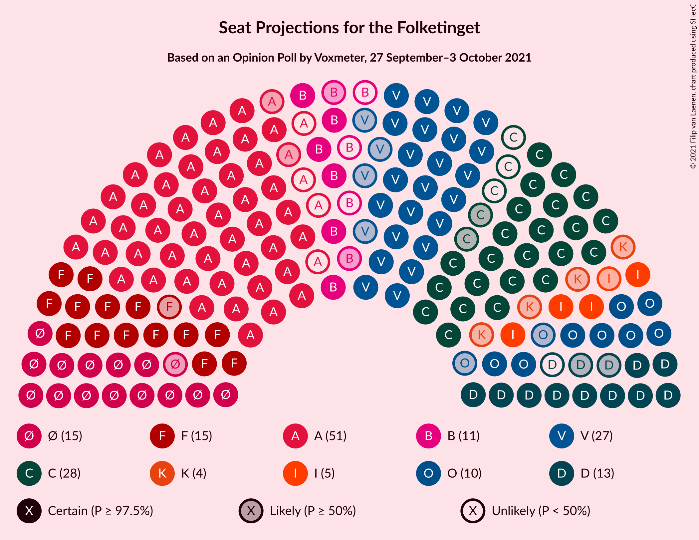
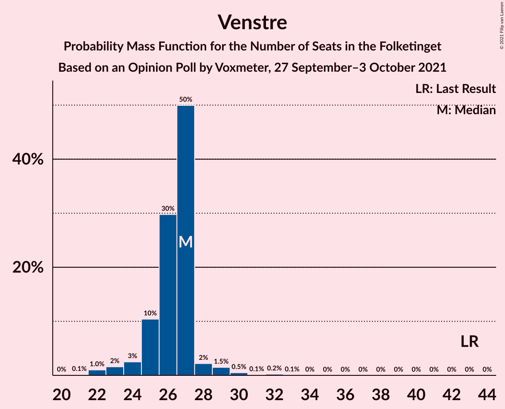
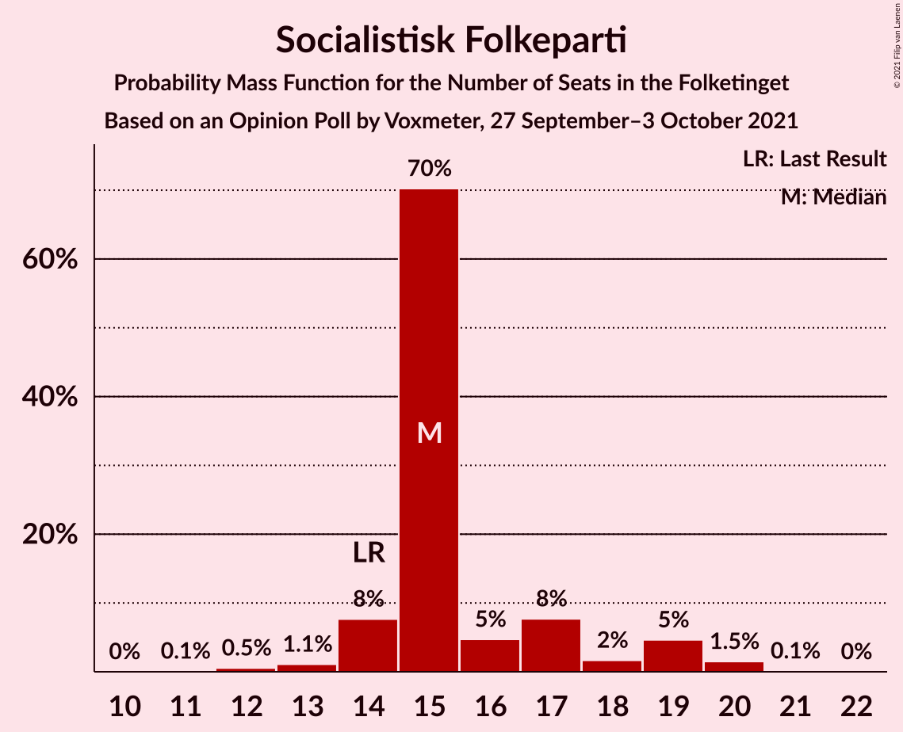
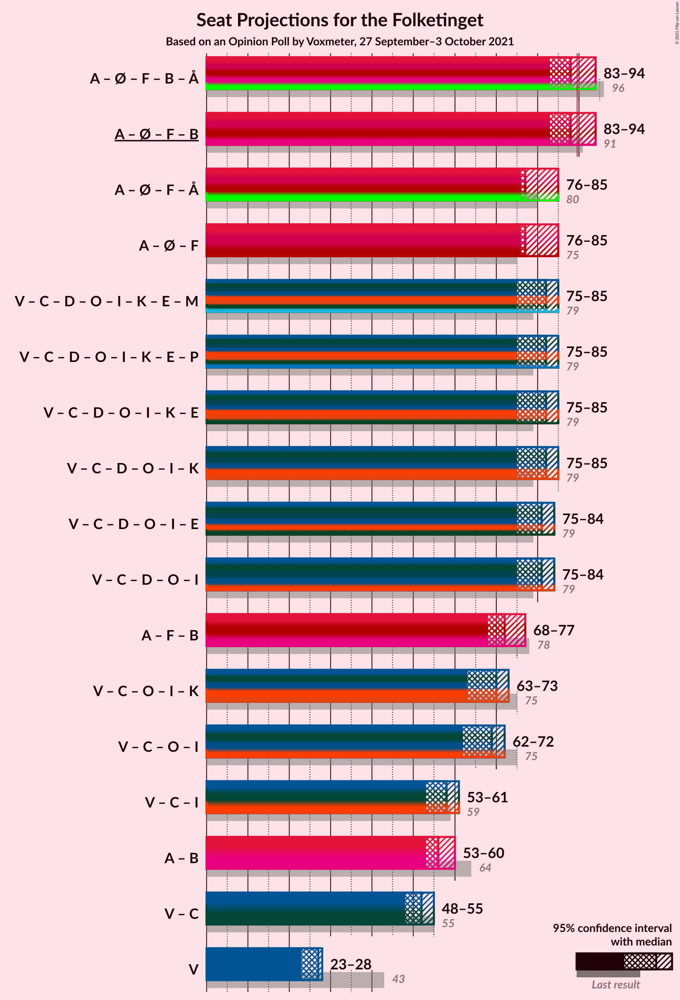
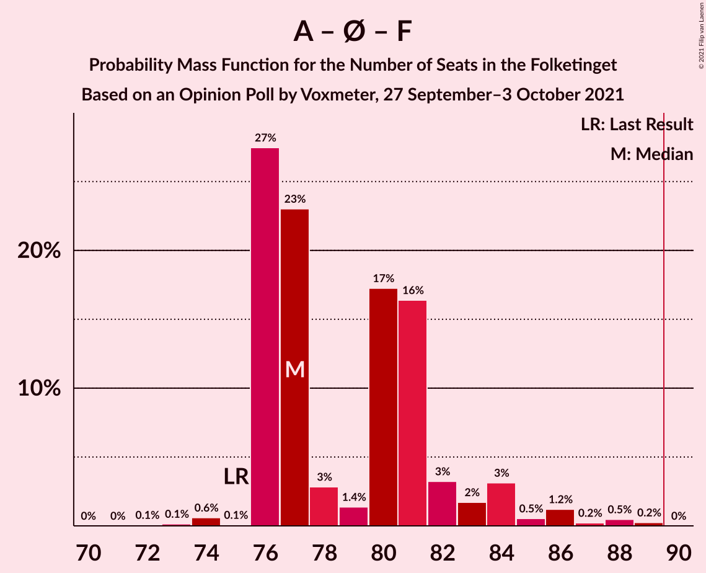
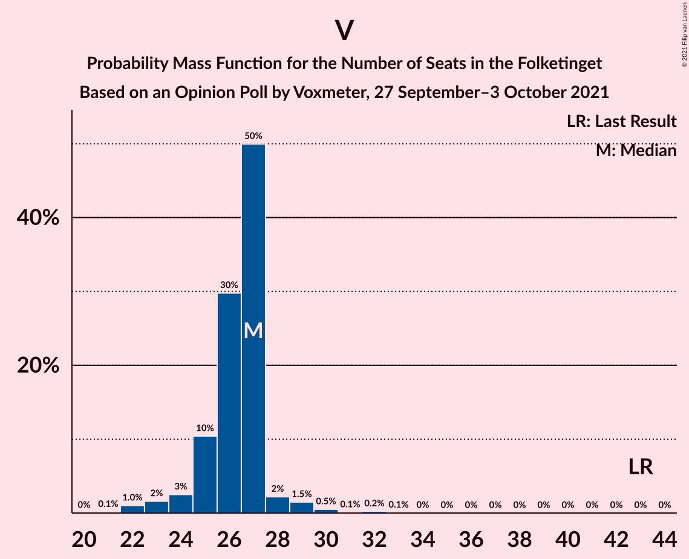

# Opinion Poll by Voxmeter, 27 September–3 October 2021

<a href="#voting-intentions">Voting Intentions</a> | <a href="#seats">Seats</a> | <a href="#coalitions">Coalitions</a> | <a href="#technical-information">Technical Information</a>

## Voting Intentions

### Confidence Intervals

| Party | Last Result | Poll Result | 80% Confidence Interval | 90% Confidence Interval | 95% Confidence Interval | 99% Confidence Interval |
|:-----:|:-----------:|:-----------:|:-----------------------:|:-----------------------:|:-----------------------:|:-----------------------:|
| Socialdemokraterne | 25.9% | 27.6% | 25.8–29.5% |25.4–30.0% |24.9–30.5% |24.1–31.4% |
| Venstre | 23.4% | 14.9% | 13.5–16.4% |13.1–16.8% |12.8–17.2% |12.2–18.0% |
| Det Konservative Folkeparti | 6.6% | 14.5% | 13.1–16.0% |12.7–16.4% |12.4–16.8% |11.8–17.5% |
| Enhedslisten–De Rød-Grønne | 6.9% | 9.0% | 7.9–10.2% |7.6–10.6% |7.3–10.9% |6.9–11.5% |
| Socialistisk Folkeparti | 7.7% | 8.9% | 7.8–10.1% |7.5–10.5% |7.3–10.8% |6.8–11.4% |
| Nye Borgerlige | 2.4% | 6.6% | 5.7–7.7% |5.4–8.0% |5.2–8.3% |4.8–8.9% |
| Dansk Folkeparti | 8.7% | 5.6% | 4.8–6.6% |4.5–6.9% |4.3–7.2% |3.9–7.7% |
| Radikale Venstre | 8.6% | 4.6% | 3.8–5.5% |3.6–5.8% |3.4–6.1% |3.1–6.6% |
| Liberal Alliance | 2.3% | 2.9% | 2.3–3.7% |2.1–3.9% |2.0–4.1% |1.8–4.5% |
| Kristendemokraterne | 1.7% | 1.6% | 1.2–2.2% |1.1–2.4% |1.0–2.6% |0.8–2.9% |
| Alternativet | 3.0% | 0.5% | 0.3–0.9% |0.3–1.1% |0.2–1.2% |0.2–1.4% |
| Veganerpartiet | 0.0% | 0.1% | 0.0–0.4% |0.0–0.5% |0.0–0.6% |0.0–0.7% |

*Note:* The poll result column reflects the actual value used in the calculations. Published results may vary slightly, and in addition be rounded to fewer digits.

## Seats

### Confidence Intervals

| Party | Last Result | Median | 80% Confidence Interval | 90% Confidence Interval | 95% Confidence Interval | 99% Confidence Interval |
|:-----:|:-----------:|:------:|:-----------------------:|:-----------------------:|:-----------------------:|:-----------------------:|
| <a href="#socialdemokraterne">Socialdemokraterne</a> | 48 | 51 | 50–51 |50–51 |46–51 |45–51 |
| <a href="#venstre">Venstre</a> | 43 | 27 | 27 |27 |27–28 |24–28 |
| <a href="#det-konservative-folkeparti">Det Konservative Folkeparti</a> | 12 | 28 | 26–28 |26–28 |26–28 |23–29 |
| <a href="#enhedslisten–de-rød-grønne">Enhedslisten–De Rød-Grønne</a> | 13 | 14 | 14–16 |14–16 |14–16 |13–17 |
| <a href="#socialistisk-folkeparti">Socialistisk Folkeparti</a> | 14 | 15 | 15 |15 |15–18 |15–20 |
| <a href="#nye-borgerlige">Nye Borgerlige</a> | 4 | 13 | 13–14 |13–14 |11–14 |10–14 |
| <a href="#dansk-folkeparti">Dansk Folkeparti</a> | 16 | 9 | 9 |9 |9–10 |9–11 |
| <a href="#radikale-venstre">Radikale Venstre</a> | 16 | 8 | 6–8 |6–8 |6–8 |6–10 |
| <a href="#liberal-alliance">Liberal Alliance</a> | 4 | 5 | 5 |5 |4–5 |4–7 |
| <a href="#kristendemokraterne">Kristendemokraterne</a> | 0 | 0 | 0 |0 |0 |0–4 |
| <a href="#alternativet">Alternativet</a> | 5 | 0 | 0 |0 |0 |0 |
| <a href="#veganerpartiet">Veganerpartiet</a> | 0 | 0 | 0 |0 |0 |0 |

### Socialdemokraterne

*For a full overview of the results for this party, see the [Socialdemokraterne](party-socialdemokraterne.html) page.*

| Number of Seats | Probability | Accumulated | Special Marks |
|:---------------:|:-----------:|:-----------:|:-------------:|
| 43 | 0% | 100% |  |
| 44 | 0% | 99.9% |  |
| 45 | 2% | 99.9% |  |
| 46 | 2% | 98% |  |
| 47 | 0.5% | 96% |  |
| 48 | 0% | 96% | Last Result |
| 49 | 0.1% | 96% |  |
| 50 | 27% | 95% |  |
| 51 | 68% | 68% | Median |
| 52 | 0.1% | 0.3% |  |
| 53 | 0.1% | 0.2% |  |
| 54 | 0.1% | 0.1% |  |
| 55 | 0% | 0% |  |

### Venstre

*For a full overview of the results for this party, see the [Venstre](party-venstre.html) page.*

| Number of Seats | Probability | Accumulated | Special Marks |
|:---------------:|:-----------:|:-----------:|:-------------:|
| 21 | 0.2% | 100% |  |
| 22 | 0.1% | 99.8% |  |
| 23 | 0.1% | 99.7% |  |
| 24 | 0.5% | 99.7% |  |
| 25 | 0.1% | 99.1% |  |
| 26 | 1.0% | 99.1% |  |
| 27 | 95% | 98% | Median |
| 28 | 3% | 3% |  |
| 29 | 0.1% | 0.5% |  |
| 30 | 0.3% | 0.4% |  |
| 31 | 0.1% | 0.1% |  |
| 32 | 0.1% | 0.1% |  |
| 33 | 0% | 0% |  |
| 34 | 0% | 0% |  |
| 35 | 0% | 0% |  |
| 36 | 0% | 0% |  |
| 37 | 0% | 0% |  |
| 38 | 0% | 0% |  |
| 39 | 0% | 0% |  |
| 40 | 0% | 0% |  |
| 41 | 0% | 0% |  |
| 42 | 0% | 0% |  |
| 43 | 0% | 0% | Last Result |

### Det Konservative Folkeparti

*For a full overview of the results for this party, see the [Det Konservative Folkeparti](party-detkonservativefolkeparti.html) page.*

| Number of Seats | Probability | Accumulated | Special Marks |
|:---------------:|:-----------:|:-----------:|:-------------:|
| 12 | 0% | 100% | Last Result |
| 13 | 0% | 100% |  |
| 14 | 0% | 100% |  |
| 15 | 0% | 100% |  |
| 16 | 0% | 100% |  |
| 17 | 0% | 100% |  |
| 18 | 0% | 100% |  |
| 19 | 0% | 100% |  |
| 20 | 0% | 100% |  |
| 21 | 0.1% | 100% |  |
| 22 | 0% | 99.9% |  |
| 23 | 0.5% | 99.9% |  |
| 24 | 0.3% | 99.3% |  |
| 25 | 0.3% | 99.1% |  |
| 26 | 27% | 98.7% |  |
| 27 | 2% | 72% |  |
| 28 | 69% | 70% | Median |
| 29 | 0.9% | 1.0% |  |
| 30 | 0% | 0.1% |  |
| 31 | 0% | 0.1% |  |
| 32 | 0% | 0% |  |

### Enhedslisten–De Rød-Grønne

*For a full overview of the results for this party, see the [Enhedslisten–De Rød-Grønne](party-enhedslisten–derød-grønne.html) page.*

| Number of Seats | Probability | Accumulated | Special Marks |
|:---------------:|:-----------:|:-----------:|:-------------:|
| 12 | 0% | 100% |  |
| 13 | 0.9% | 99.9% | Last Result |
| 14 | 68% | 99.1% | Median |
| 15 | 2% | 31% |  |
| 16 | 28% | 29% |  |
| 17 | 0.4% | 0.7% |  |
| 18 | 0.1% | 0.3% |  |
| 19 | 0.2% | 0.2% |  |
| 20 | 0% | 0% |  |

### Socialistisk Folkeparti

*For a full overview of the results for this party, see the [Socialistisk Folkeparti](party-socialistiskfolkeparti.html) page.*

| Number of Seats | Probability | Accumulated | Special Marks |
|:---------------:|:-----------:|:-----------:|:-------------:|
| 12 | 0% | 100% |  |
| 13 | 0.2% | 99.9% |  |
| 14 | 0.2% | 99.8% | Last Result |
| 15 | 95% | 99.5% | Median |
| 16 | 1.1% | 5% |  |
| 17 | 0.6% | 4% |  |
| 18 | 2% | 3% |  |
| 19 | 0.1% | 0.6% |  |
| 20 | 0.4% | 0.5% |  |
| 21 | 0.1% | 0.1% |  |
| 22 | 0% | 0% |  |

### Nye Borgerlige

*For a full overview of the results for this party, see the [Nye Borgerlige](party-nyeborgerlige.html) page.*

| Number of Seats | Probability | Accumulated | Special Marks |
|:---------------:|:-----------:|:-----------:|:-------------:|
| 4 | 0% | 100% | Last Result |
| 5 | 0% | 100% |  |
| 6 | 0% | 100% |  |
| 7 | 0% | 100% |  |
| 8 | 0% | 100% |  |
| 9 | 0.1% | 100% |  |
| 10 | 2% | 99.8% |  |
| 11 | 2% | 98% |  |
| 12 | 0.1% | 96% |  |
| 13 | 69% | 96% | Median |
| 14 | 27% | 27% |  |
| 15 | 0.1% | 0.1% |  |
| 16 | 0% | 0% |  |

### Dansk Folkeparti

*For a full overview of the results for this party, see the [Dansk Folkeparti](party-danskfolkeparti.html) page.*

| Number of Seats | Probability | Accumulated | Special Marks |
|:---------------:|:-----------:|:-----------:|:-------------:|
| 7 | 0.1% | 100% |  |
| 8 | 0.2% | 99.9% |  |
| 9 | 96% | 99.7% | Median |
| 10 | 2% | 4% |  |
| 11 | 2% | 2% |  |
| 12 | 0.2% | 0.3% |  |
| 13 | 0.1% | 0.1% |  |
| 14 | 0% | 0% |  |
| 15 | 0% | 0% |  |
| 16 | 0% | 0% | Last Result |

### Radikale Venstre

*For a full overview of the results for this party, see the [Radikale Venstre](party-radikalevenstre.html) page.*

| Number of Seats | Probability | Accumulated | Special Marks |
|:---------------:|:-----------:|:-----------:|:-------------:|
| 6 | 27% | 100% |  |
| 7 | 0.9% | 73% |  |
| 8 | 71% | 72% | Median |
| 9 | 0.3% | 2% |  |
| 10 | 1.2% | 1.3% |  |
| 11 | 0.1% | 0.1% |  |
| 12 | 0% | 0% |  |
| 13 | 0% | 0% |  |
| 14 | 0% | 0% |  |
| 15 | 0% | 0% |  |
| 16 | 0% | 0% | Last Result |

### Liberal Alliance

*For a full overview of the results for this party, see the [Liberal Alliance](party-liberalalliance.html) page.*

| Number of Seats | Probability | Accumulated | Special Marks |
|:---------------:|:-----------:|:-----------:|:-------------:|
| 4 | 3% | 100% | Last Result |
| 5 | 96% | 97% | Median |
| 6 | 0.7% | 2% |  |
| 7 | 1.0% | 1.0% |  |
| 8 | 0% | 0.1% |  |
| 9 | 0% | 0% |  |

### Kristendemokraterne

*For a full overview of the results for this party, see the [Kristendemokraterne](party-kristendemokraterne.html) page.*

| Number of Seats | Probability | Accumulated | Special Marks |
|:---------------:|:-----------:|:-----------:|:-------------:|
| 0 | 99.3% | 100% | Last Result, Median |
| 1 | 0% | 0.7% |  |
| 2 | 0% | 0.7% |  |
| 3 | 0% | 0.7% |  |
| 4 | 0.2% | 0.7% |  |
| 5 | 0.4% | 0.4% |  |
| 6 | 0% | 0% |  |

### Alternativet

*For a full overview of the results for this party, see the [Alternativet](party-alternativet.html) page.*

| Number of Seats | Probability | Accumulated | Special Marks |
|:---------------:|:-----------:|:-----------:|:-------------:|
| 0 | 100% | 100% | Median |
| 1 | 0% | 0% |  |
| 2 | 0% | 0% |  |
| 3 | 0% | 0% |  |
| 4 | 0% | 0% |  |
| 5 | 0% | 0% | Last Result |

### Veganerpartiet

*For a full overview of the results for this party, see the [Veganerpartiet](party-veganerpartiet.html) page.*

| Number of Seats | Probability | Accumulated | Special Marks |
|:---------------:|:-----------:|:-----------:|:-------------:|
| 0 | 100% | 100% | Last Result, Median |

## Coalitions

### Confidence Intervals

| Coalition | Last Result | Median | Majority? | 80% Confidence Interval | 90% Confidence Interval | 95% Confidence Interval | 99% Confidence Interval |
|:---------:|:-----------:|:------:|:---------:|:-----------------------:|:-----------------------:|:-----------------------:|:-----------------------:|
| Socialdemokraterne – Enhedslisten–De Rød-Grønne – Socialistisk Folkeparti – Radikale Venstre – Alternativet | 96 | 88 | 0.9% | 87–88 | 87–88 | 86–88 | 86–91 |
| Socialdemokraterne – Enhedslisten–De Rød-Grønne – Socialistisk Folkeparti – Radikale Venstre | 91 | 88 | 0.9% | 87–88 | 87–88 | 86–88 | 86–91 |
| Venstre – Det Konservative Folkeparti – Nye Borgerlige – Dansk Folkeparti – Liberal Alliance – Kristendemokraterne | 79 | 82 | 0% | 81–82 | 81–82 | 80–82 | 77–84 |
| Venstre – Det Konservative Folkeparti – Nye Borgerlige – Dansk Folkeparti – Liberal Alliance | 79 | 82 | 0% | 81–82 | 81–82 | 80–82 | 77–82 |
| Socialdemokraterne – Enhedslisten–De Rød-Grønne – Socialistisk Folkeparti – Alternativet | 80 | 80 | 0% | 80–81 | 80–81 | 78–81 | 77–84 |
| Socialdemokraterne – Enhedslisten–De Rød-Grønne – Socialistisk Folkeparti | 75 | 80 | 0% | 80–81 | 80–81 | 78–81 | 77–84 |
| Socialdemokraterne – Socialistisk Folkeparti – Radikale Venstre | 78 | 74 | 0% | 71–74 | 71–74 | 71–74 | 70–77 |
| Venstre – Det Konservative Folkeparti – Dansk Folkeparti – Liberal Alliance – Kristendemokraterne | 75 | 69 | 0% | 67–69 | 67–69 | 67–70 | 66–72 |
| Venstre – Det Konservative Folkeparti – Dansk Folkeparti – Liberal Alliance | 75 | 69 | 0% | 67–69 | 67–69 | 67–69 | 66–72 |
| Venstre – Det Konservative Folkeparti – Liberal Alliance | 59 | 60 | 0% | 58–60 | 58–60 | 58–60 | 55–61 |
| Socialdemokraterne – Radikale Venstre | 64 | 59 | 0% | 56–59 | 56–59 | 54–59 | 53–59 |
| Venstre – Det Konservative Folkeparti | 55 | 55 | 0% | 53–55 | 53–55 | 53–55 | 50–57 |
| Venstre | 43 | 27 | 0% | 27 | 27 | 27–28 | 24–28 |

### Socialdemokraterne – Enhedslisten–De Rød-Grønne – Socialistisk Folkeparti – Radikale Venstre – Alternativet

| Number of Seats | Probability | Accumulated | Special Marks |
|:---------------:|:-----------:|:-----------:|:-------------:|
| 82 | 0% | 100% |  |
| 83 | 0% | 99.9% |  |
| 84 | 0% | 99.9% |  |
| 85 | 0.1% | 99.8% |  |
| 86 | 3% | 99.8% |  |
| 87 | 28% | 97% |  |
| 88 | 68% | 69% | Median |
| 89 | 0.1% | 1.0% |  |
| 90 | 0.1% | 0.9% | Majority |
| 91 | 0.5% | 0.8% |  |
| 92 | 0.1% | 0.4% |  |
| 93 | 0.1% | 0.3% |  |
| 94 | 0% | 0.2% |  |
| 95 | 0% | 0.2% |  |
| 96 | 0.1% | 0.2% | Last Result |
| 97 | 0.1% | 0.1% |  |
| 98 | 0% | 0% |  |

### Socialdemokraterne – Enhedslisten–De Rød-Grønne – Socialistisk Folkeparti – Radikale Venstre

| Number of Seats | Probability | Accumulated | Special Marks |
|:---------------:|:-----------:|:-----------:|:-------------:|
| 82 | 0% | 100% |  |
| 83 | 0% | 99.9% |  |
| 84 | 0% | 99.9% |  |
| 85 | 0.1% | 99.8% |  |
| 86 | 3% | 99.8% |  |
| 87 | 28% | 97% |  |
| 88 | 68% | 69% | Median |
| 89 | 0.1% | 1.0% |  |
| 90 | 0.1% | 0.9% | Majority |
| 91 | 0.5% | 0.8% | Last Result |
| 92 | 0.1% | 0.4% |  |
| 93 | 0.1% | 0.3% |  |
| 94 | 0% | 0.2% |  |
| 95 | 0% | 0.2% |  |
| 96 | 0.1% | 0.2% |  |
| 97 | 0.1% | 0.1% |  |
| 98 | 0% | 0% |  |

### Venstre – Det Konservative Folkeparti – Nye Borgerlige – Dansk Folkeparti – Liberal Alliance – Kristendemokraterne

| Number of Seats | Probability | Accumulated | Special Marks |
|:---------------:|:-----------:|:-----------:|:-------------:|
| 73 | 0.1% | 100% |  |
| 74 | 0% | 99.9% |  |
| 75 | 0% | 99.8% |  |
| 76 | 0.1% | 99.8% |  |
| 77 | 0.5% | 99.7% |  |
| 78 | 0.1% | 99.3% |  |
| 79 | 0.1% | 99.2% | Last Result |
| 80 | 3% | 99.0% |  |
| 81 | 27% | 96% |  |
| 82 | 69% | 70% | Median |
| 83 | 0.1% | 0.6% |  |
| 84 | 0.4% | 0.6% |  |
| 85 | 0.1% | 0.2% |  |
| 86 | 0% | 0.1% |  |
| 87 | 0% | 0.1% |  |
| 88 | 0% | 0% |  |

### Venstre – Det Konservative Folkeparti – Nye Borgerlige – Dansk Folkeparti – Liberal Alliance

| Number of Seats | Probability | Accumulated | Special Marks |
|:---------------:|:-----------:|:-----------:|:-------------:|
| 73 | 0.1% | 100% |  |
| 74 | 0% | 99.8% |  |
| 75 | 0.1% | 99.8% |  |
| 76 | 0% | 99.7% |  |
| 77 | 0.5% | 99.6% |  |
| 78 | 0.1% | 99.2% |  |
| 79 | 0.5% | 99.1% | Last Result |
| 80 | 3% | 98.6% |  |
| 81 | 27% | 96% |  |
| 82 | 69% | 69% | Median |
| 83 | 0% | 0.2% |  |
| 84 | 0% | 0.1% |  |
| 85 | 0.1% | 0.1% |  |
| 86 | 0% | 0% |  |

### Socialdemokraterne – Enhedslisten–De Rød-Grønne – Socialistisk Folkeparti – Alternativet

| Number of Seats | Probability | Accumulated | Special Marks |
|:---------------:|:-----------:|:-----------:|:-------------:|
| 73 | 0.1% | 100% |  |
| 74 | 0.1% | 99.9% |  |
| 75 | 0% | 99.9% |  |
| 76 | 0% | 99.9% |  |
| 77 | 0.8% | 99.8% |  |
| 78 | 3% | 99.0% |  |
| 79 | 0.4% | 96% |  |
| 80 | 68% | 96% | Last Result, Median |
| 81 | 27% | 28% |  |
| 82 | 0% | 0.8% |  |
| 83 | 0.1% | 0.8% |  |
| 84 | 0.4% | 0.7% |  |
| 85 | 0.1% | 0.3% |  |
| 86 | 0.1% | 0.2% |  |
| 87 | 0.1% | 0.1% |  |
| 88 | 0% | 0% |  |

### Socialdemokraterne – Enhedslisten–De Rød-Grønne – Socialistisk Folkeparti

| Number of Seats | Probability | Accumulated | Special Marks |
|:---------------:|:-----------:|:-----------:|:-------------:|
| 73 | 0.1% | 100% |  |
| 74 | 0.1% | 99.9% |  |
| 75 | 0% | 99.9% | Last Result |
| 76 | 0% | 99.9% |  |
| 77 | 0.8% | 99.8% |  |
| 78 | 3% | 99.0% |  |
| 79 | 0.4% | 96% |  |
| 80 | 68% | 96% | Median |
| 81 | 27% | 28% |  |
| 82 | 0% | 0.8% |  |
| 83 | 0.1% | 0.8% |  |
| 84 | 0.4% | 0.7% |  |
| 85 | 0.1% | 0.3% |  |
| 86 | 0.1% | 0.2% |  |
| 87 | 0.1% | 0.1% |  |
| 88 | 0% | 0% |  |

### Socialdemokraterne – Socialistisk Folkeparti – Radikale Venstre

| Number of Seats | Probability | Accumulated | Special Marks |
|:---------------:|:-----------:|:-----------:|:-------------:|
| 67 | 0.1% | 100% |  |
| 68 | 0% | 99.9% |  |
| 69 | 0.2% | 99.8% |  |
| 70 | 1.3% | 99.6% |  |
| 71 | 29% | 98% |  |
| 72 | 0.2% | 70% |  |
| 73 | 0% | 69% |  |
| 74 | 69% | 69% | Median |
| 75 | 0.2% | 0.9% |  |
| 76 | 0.1% | 0.8% |  |
| 77 | 0.4% | 0.7% |  |
| 78 | 0.1% | 0.3% | Last Result |
| 79 | 0.1% | 0.2% |  |
| 80 | 0% | 0.1% |  |
| 81 | 0.1% | 0.1% |  |
| 82 | 0% | 0% |  |

### Venstre – Det Konservative Folkeparti – Dansk Folkeparti – Liberal Alliance – Kristendemokraterne

| Number of Seats | Probability | Accumulated | Special Marks |
|:---------------:|:-----------:|:-----------:|:-------------:|
| 60 | 0.1% | 100% |  |
| 61 | 0% | 99.9% |  |
| 62 | 0% | 99.9% |  |
| 63 | 0% | 99.9% |  |
| 64 | 0.2% | 99.9% |  |
| 65 | 0% | 99.6% |  |
| 66 | 0.4% | 99.6% |  |
| 67 | 27% | 99.2% |  |
| 68 | 0.1% | 72% |  |
| 69 | 70% | 72% | Median |
| 70 | 0.9% | 3% |  |
| 71 | 0.5% | 2% |  |
| 72 | 1.0% | 1.2% |  |
| 73 | 0% | 0.2% |  |
| 74 | 0% | 0.1% |  |
| 75 | 0% | 0.1% | Last Result |
| 76 | 0% | 0.1% |  |
| 77 | 0% | 0% |  |

### Venstre – Det Konservative Folkeparti – Dansk Folkeparti – Liberal Alliance

| Number of Seats | Probability | Accumulated | Special Marks |
|:---------------:|:-----------:|:-----------:|:-------------:|
| 60 | 0.2% | 100% |  |
| 61 | 0% | 99.8% |  |
| 62 | 0% | 99.8% |  |
| 63 | 0% | 99.8% |  |
| 64 | 0.1% | 99.7% |  |
| 65 | 0% | 99.6% |  |
| 66 | 0.8% | 99.6% |  |
| 67 | 27% | 98.7% |  |
| 68 | 0.1% | 72% |  |
| 69 | 70% | 72% | Median |
| 70 | 0.8% | 2% |  |
| 71 | 0.2% | 1.3% |  |
| 72 | 1.0% | 1.1% |  |
| 73 | 0% | 0.1% |  |
| 74 | 0% | 0.1% |  |
| 75 | 0% | 0% | Last Result |

### Venstre – Det Konservative Folkeparti – Liberal Alliance

| Number of Seats | Probability | Accumulated | Special Marks |
|:---------------:|:-----------:|:-----------:|:-------------:|
| 51 | 0% | 100% |  |
| 52 | 0.2% | 99.9% |  |
| 53 | 0% | 99.7% |  |
| 54 | 0% | 99.7% |  |
| 55 | 0.6% | 99.6% |  |
| 56 | 0.2% | 99.1% |  |
| 57 | 0.5% | 98.9% |  |
| 58 | 27% | 98% |  |
| 59 | 2% | 72% | Last Result |
| 60 | 68% | 70% | Median |
| 61 | 2% | 2% |  |
| 62 | 0.2% | 0.3% |  |
| 63 | 0.1% | 0.1% |  |
| 64 | 0% | 0% |  |

### Socialdemokraterne – Radikale Venstre

| Number of Seats | Probability | Accumulated | Special Marks |
|:---------------:|:-----------:|:-----------:|:-------------:|
| 51 | 0% | 100% |  |
| 52 | 0% | 99.9% |  |
| 53 | 2% | 99.9% |  |
| 54 | 0.9% | 98% |  |
| 55 | 0.3% | 97% |  |
| 56 | 28% | 97% |  |
| 57 | 0.5% | 69% |  |
| 58 | 0.1% | 68% |  |
| 59 | 68% | 68% | Median |
| 60 | 0.1% | 0.4% |  |
| 61 | 0.1% | 0.4% |  |
| 62 | 0.2% | 0.2% |  |
| 63 | 0% | 0% |  |
| 64 | 0% | 0% | Last Result |

### Venstre – Det Konservative Folkeparti

| Number of Seats | Probability | Accumulated | Special Marks |
|:---------------:|:-----------:|:-----------:|:-------------:|
| 47 | 0.2% | 100% |  |
| 48 | 0.1% | 99.8% |  |
| 49 | 0.1% | 99.7% |  |
| 50 | 0.6% | 99.6% |  |
| 51 | 0.4% | 98.9% |  |
| 52 | 0.2% | 98.5% |  |
| 53 | 27% | 98% |  |
| 54 | 0.9% | 72% |  |
| 55 | 70% | 71% | Last Result, Median |
| 56 | 0.1% | 1.0% |  |
| 57 | 0.9% | 0.9% |  |
| 58 | 0.1% | 0.1% |  |
| 59 | 0% | 0% |  |

### Venstre

| Number of Seats | Probability | Accumulated | Special Marks |
|:---------------:|:-----------:|:-----------:|:-------------:|
| 21 | 0.2% | 100% |  |
| 22 | 0.1% | 99.8% |  |
| 23 | 0.1% | 99.7% |  |
| 24 | 0.5% | 99.7% |  |
| 25 | 0.1% | 99.1% |  |
| 26 | 1.0% | 99.1% |  |
| 27 | 95% | 98% | Median |
| 28 | 3% | 3% |  |
| 29 | 0.1% | 0.5% |  |
| 30 | 0.3% | 0.4% |  |
| 31 | 0.1% | 0.1% |  |
| 32 | 0.1% | 0.1% |  |
| 33 | 0% | 0% |  |
| 34 | 0% | 0% |  |
| 35 | 0% | 0% |  |
| 36 | 0% | 0% |  |
| 37 | 0% | 0% |  |
| 38 | 0% | 0% |  |
| 39 | 0% | 0% |  |
| 40 | 0% | 0% |  |
| 41 | 0% | 0% |  |
| 42 | 0% | 0% |  |
| 43 | 0% | 0% | Last Result |

## Technical Information

### Opinion Poll

+ **Polling firm:** Voxmeter
+ **Commissioner(s):** —
+ **Fieldwork period:** 27 September–3 October 2021

### Calculations

+ **Sample size:** 1003
+ **Simulations done:** 131,072
+ **Error estimate:** 3.00%

