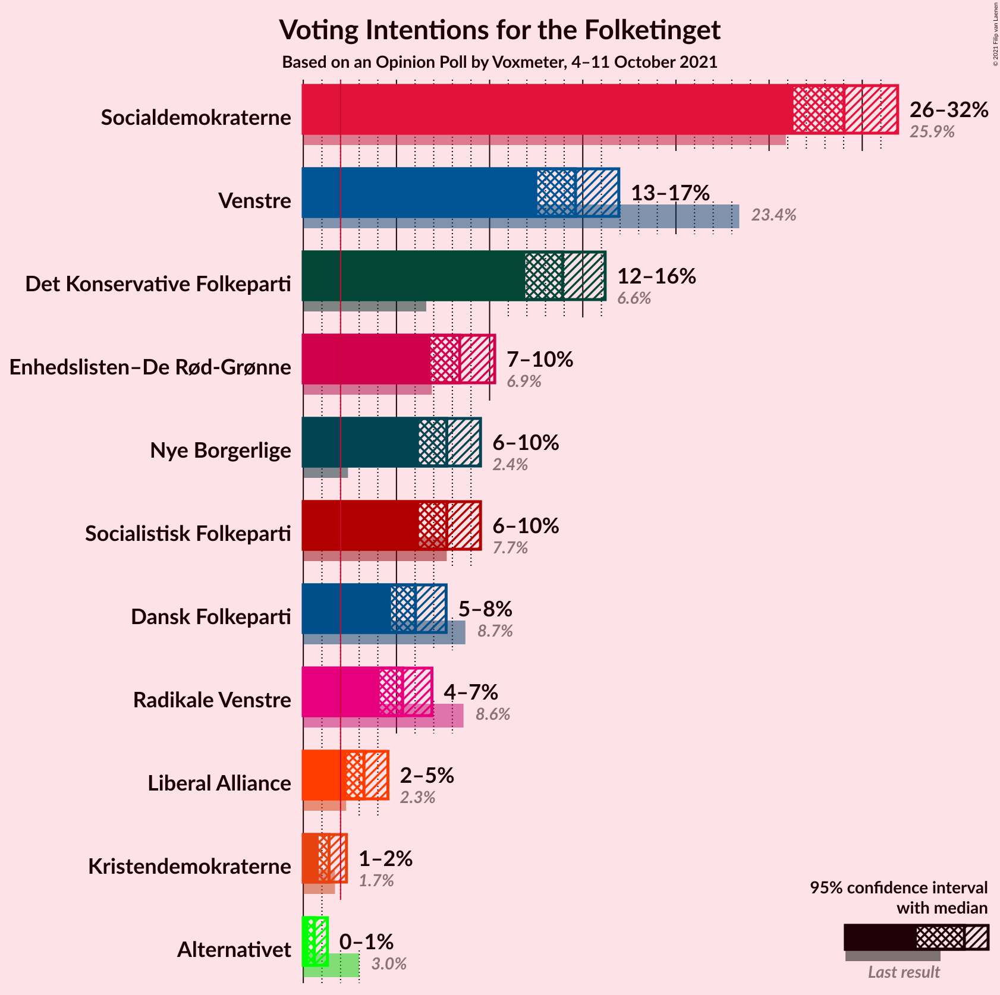
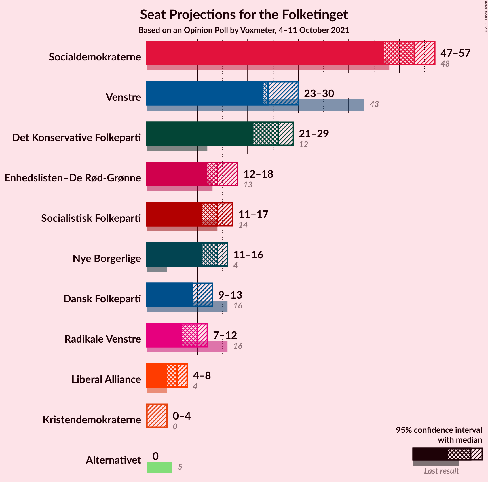
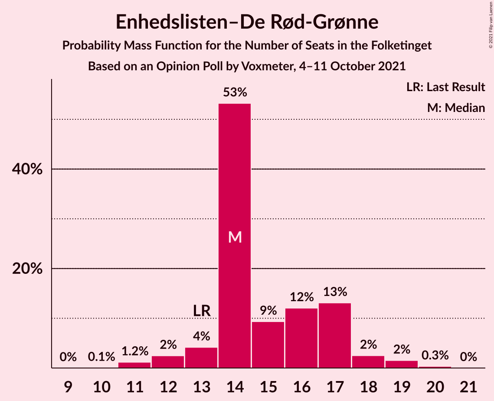
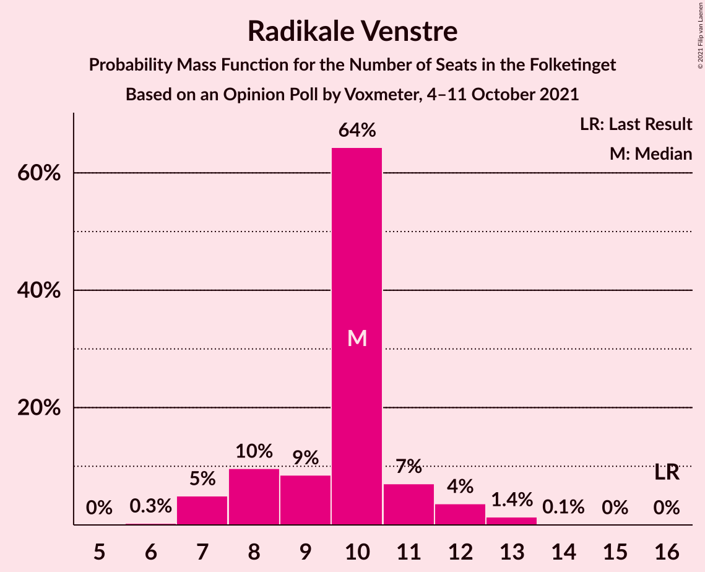
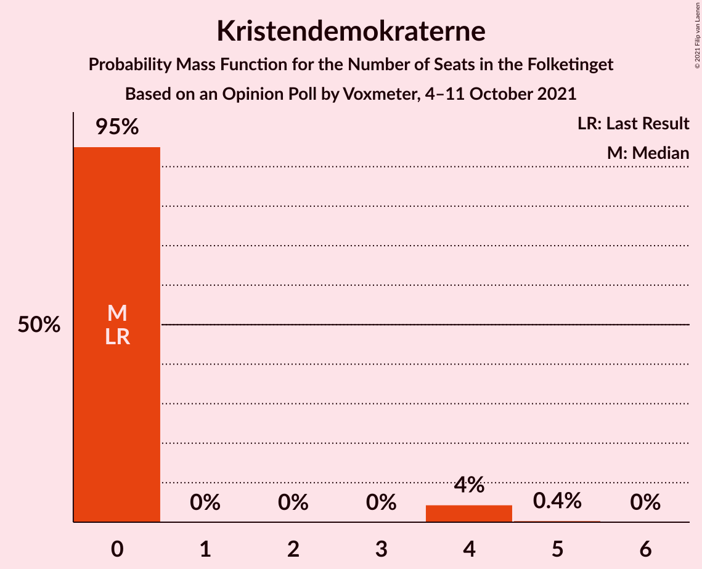
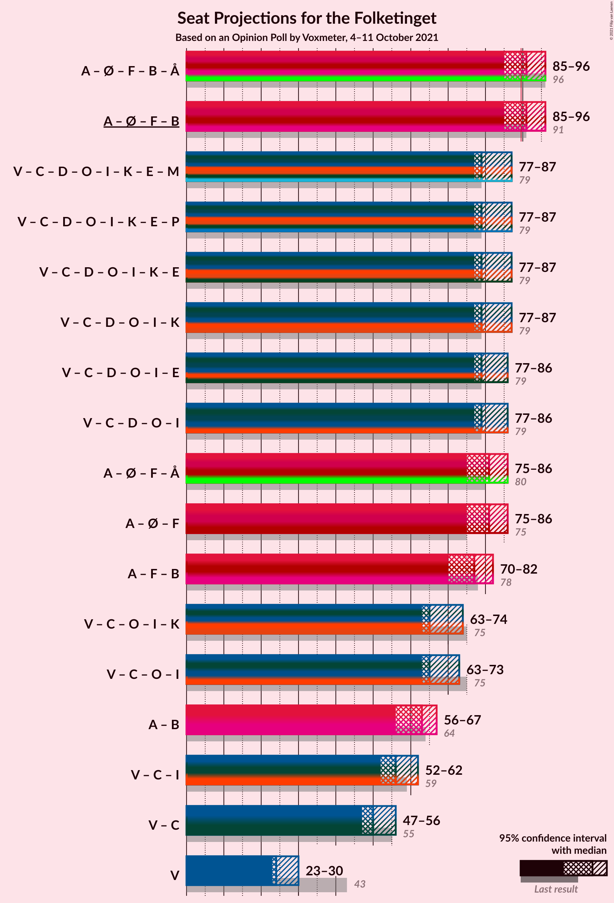
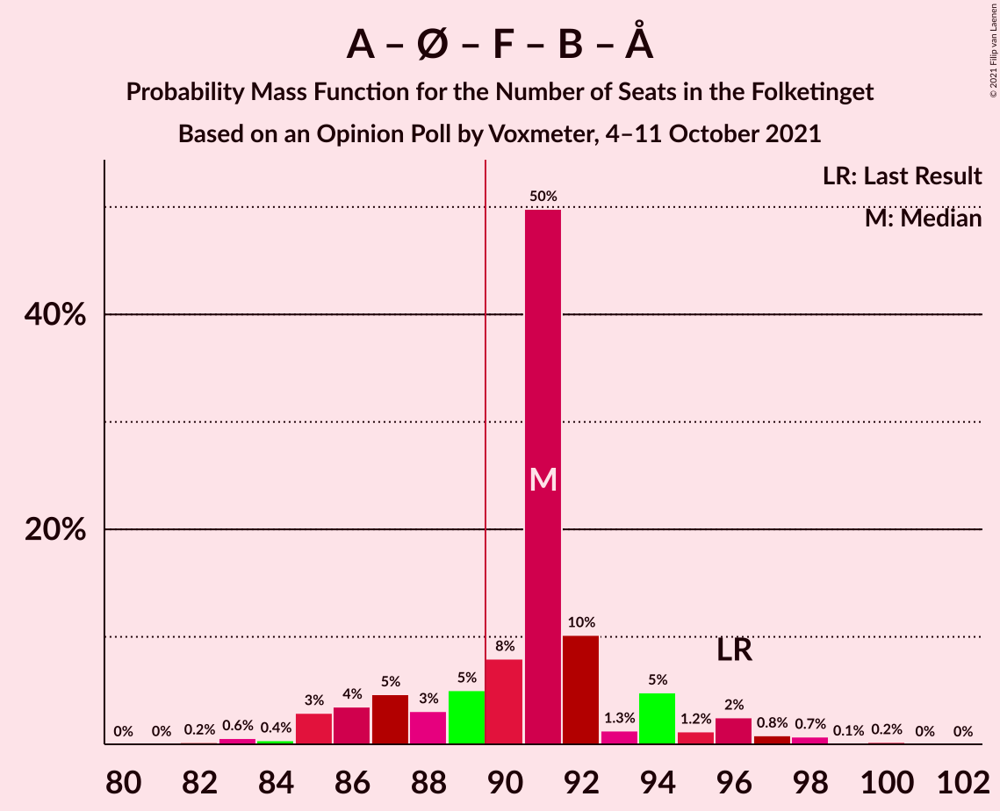
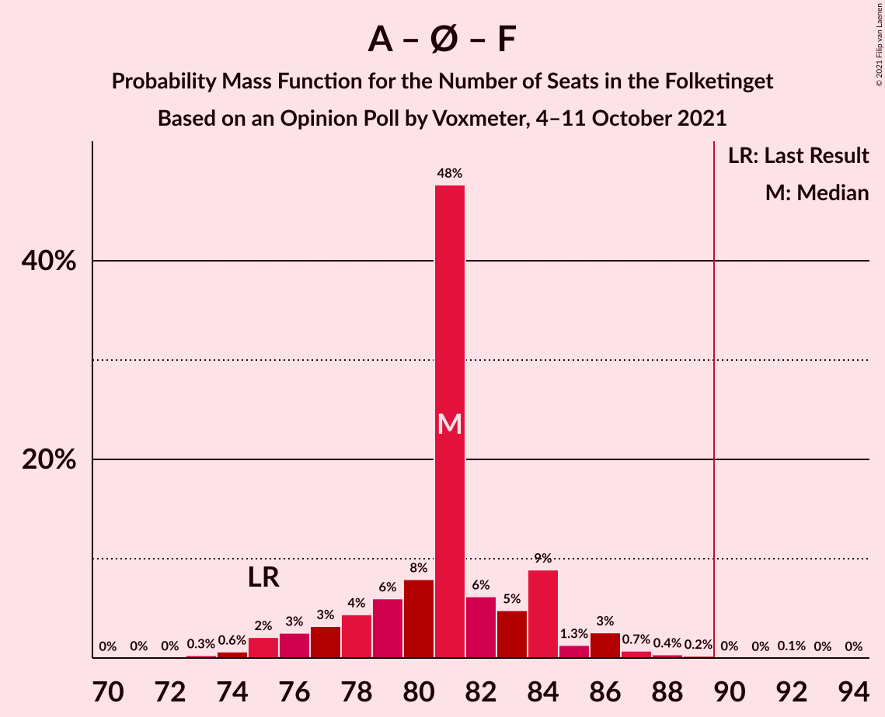

# Opinion Poll by Voxmeter, 4–11 October 2021

<a href="#voting-intentions">Voting Intentions</a> | <a href="#seats">Seats</a> | <a href="#coalitions">Coalitions</a> | <a href="#technical-information">Technical Information</a>

## Voting Intentions

### Confidence Intervals

| Party | Last Result | Poll Result | 80% Confidence Interval | 90% Confidence Interval | 95% Confidence Interval | 99% Confidence Interval |
|:-----:|:-----------:|:-----------:|:-----------------------:|:-----------------------:|:-----------------------:|:-----------------------:|
| Socialdemokraterne | 25.9% | 29.0% | 27.2–30.9% |26.7–31.4% |26.3–31.9% |25.5–32.8% |
| Venstre | 23.4% | 14.6% | 13.3–16.1% |12.9–16.6% |12.6–16.9% |11.9–17.7% |
| Det Konservative Folkeparti | 6.6% | 13.9% | 12.6–15.4% |12.2–15.8% |11.9–16.2% |11.3–16.9% |
| Enhedslisten–De Rød-Grønne | 6.9% | 8.4% | 7.4–9.6% |7.1–10.0% |6.8–10.3% |6.4–10.9% |
| Socialistisk Folkeparti | 7.7% | 7.7% | 6.7–8.9% |6.4–9.2% |6.2–9.5% |5.8–10.1% |
| Nye Borgerlige | 2.4% | 7.7% | 6.7–8.9% |6.4–9.2% |6.2–9.5% |5.8–10.1% |
| Dansk Folkeparti | 8.7% | 6.0% | 5.2–7.1% |4.9–7.4% |4.7–7.7% |4.3–8.2% |
| Radikale Venstre | 8.6% | 5.3% | 4.5–6.4% |4.3–6.6% |4.1–6.9% |3.7–7.4% |
| Liberal Alliance | 2.3% | 3.3% | 2.6–4.1% |2.5–4.3% |2.3–4.5% |2.1–5.0% |
| Kristendemokraterne | 1.7% | 1.4% | 1.0–2.0% |0.9–2.2% |0.8–2.3% |0.7–2.6% |
| Alternativet | 3.0% | 0.6% | 0.4–1.0% |0.3–1.2% |0.3–1.3% |0.2–1.5% |

*Note:* The poll result column reflects the actual value used in the calculations. Published results may vary slightly, and in addition be rounded to fewer digits.

## Seats

### Confidence Intervals

| Party | Last Result | Median | 80% Confidence Interval | 90% Confidence Interval | 95% Confidence Interval | 99% Confidence Interval |
|:-----:|:-----------:|:------:|:-----------------------:|:-----------------------:|:-----------------------:|:-----------------------:|
| <a href="#socialdemokraterne">Socialdemokraterne</a> | 48 | 53 | 49–54 |47–56 |47–57 |46–58 |
| <a href="#venstre">Venstre</a> | 43 | 24 | 24–28 |24–29 |23–30 |22–31 |
| <a href="#det-konservative-folkeparti">Det Konservative Folkeparti</a> | 12 | 26 | 23–26 |22–28 |21–29 |20–30 |
| <a href="#enhedslisten–de-rød-grønne">Enhedslisten–De Rød-Grønne</a> | 13 | 14 | 14–17 |13–17 |12–18 |11–19 |
| <a href="#socialistisk-folkeparti">Socialistisk Folkeparti</a> | 14 | 14 | 13–15 |12–16 |11–17 |10–18 |
| <a href="#nye-borgerlige">Nye Borgerlige</a> | 4 | 14 | 12–15 |12–16 |11–16 |11–18 |
| <a href="#dansk-folkeparti">Dansk Folkeparti</a> | 16 | 9 | 9–12 |9–13 |9–13 |8–15 |
| <a href="#radikale-venstre">Radikale Venstre</a> | 16 | 10 | 8–11 |7–12 |7–12 |7–13 |
| <a href="#liberal-alliance">Liberal Alliance</a> | 4 | 6 | 5–7 |5–7 |4–8 |4–9 |
| <a href="#kristendemokraterne">Kristendemokraterne</a> | 0 | 0 | 0 |0 |0–4 |0–4 |
| <a href="#alternativet">Alternativet</a> | 5 | 0 | 0 |0 |0 |0 |

### Socialdemokraterne

*For a full overview of the results for this party, see the [Socialdemokraterne](party-socialdemokraterne.html) page.*

| Number of Seats | Probability | Accumulated | Special Marks |
|:---------------:|:-----------:|:-----------:|:-------------:|
| 44 | 0.1% | 100% |  |
| 45 | 0.3% | 99.9% |  |
| 46 | 2% | 99.6% |  |
| 47 | 3% | 98% |  |
| 48 | 3% | 95% | Last Result |
| 49 | 10% | 92% |  |
| 50 | 3% | 82% |  |
| 51 | 7% | 79% |  |
| 52 | 7% | 71% |  |
| 53 | 53% | 65% | Median |
| 54 | 2% | 11% |  |
| 55 | 3% | 9% |  |
| 56 | 4% | 6% |  |
| 57 | 1.0% | 3% |  |
| 58 | 1.2% | 2% |  |
| 59 | 0.2% | 0.3% |  |
| 60 | 0.1% | 0.2% |  |
| 61 | 0% | 0% |  |

### Venstre

*For a full overview of the results for this party, see the [Venstre](party-venstre.html) page.*

| Number of Seats | Probability | Accumulated | Special Marks |
|:---------------:|:-----------:|:-----------:|:-------------:|
| 20 | 0.1% | 100% |  |
| 21 | 0.4% | 99.9% |  |
| 22 | 2% | 99.6% |  |
| 23 | 3% | 98% |  |
| 24 | 51% | 95% | Median |
| 25 | 15% | 44% |  |
| 26 | 9% | 29% |  |
| 27 | 7% | 20% |  |
| 28 | 8% | 14% |  |
| 29 | 2% | 6% |  |
| 30 | 2% | 3% |  |
| 31 | 1.3% | 2% |  |
| 32 | 0.2% | 0.3% |  |
| 33 | 0% | 0.1% |  |
| 34 | 0% | 0% |  |
| 35 | 0% | 0% |  |
| 36 | 0% | 0% |  |
| 37 | 0% | 0% |  |
| 38 | 0% | 0% |  |
| 39 | 0% | 0% |  |
| 40 | 0% | 0% |  |
| 41 | 0% | 0% |  |
| 42 | 0% | 0% |  |
| 43 | 0% | 0% | Last Result |

### Det Konservative Folkeparti

*For a full overview of the results for this party, see the [Det Konservative Folkeparti](party-detkonservativefolkeparti.html) page.*

| Number of Seats | Probability | Accumulated | Special Marks |
|:---------------:|:-----------:|:-----------:|:-------------:|
| 12 | 0% | 100% | Last Result |
| 13 | 0% | 100% |  |
| 14 | 0% | 100% |  |
| 15 | 0% | 100% |  |
| 16 | 0% | 100% |  |
| 17 | 0% | 100% |  |
| 18 | 0% | 100% |  |
| 19 | 0.2% | 100% |  |
| 20 | 0.4% | 99.8% |  |
| 21 | 2% | 99.4% |  |
| 22 | 6% | 97% |  |
| 23 | 4% | 92% |  |
| 24 | 16% | 87% |  |
| 25 | 6% | 71% |  |
| 26 | 56% | 65% | Median |
| 27 | 4% | 9% |  |
| 28 | 1.2% | 5% |  |
| 29 | 3% | 4% |  |
| 30 | 1.0% | 1.2% |  |
| 31 | 0.1% | 0.1% |  |
| 32 | 0% | 0% |  |

### Enhedslisten–De Rød-Grønne

*For a full overview of the results for this party, see the [Enhedslisten–De Rød-Grønne](party-enhedslisten–derød-grønne.html) page.*

| Number of Seats | Probability | Accumulated | Special Marks |
|:---------------:|:-----------:|:-----------:|:-------------:|
| 10 | 0.1% | 100% |  |
| 11 | 1.2% | 99.9% |  |
| 12 | 2% | 98.8% |  |
| 13 | 4% | 96% | Last Result |
| 14 | 53% | 92% | Median |
| 15 | 9% | 39% |  |
| 16 | 12% | 30% |  |
| 17 | 13% | 18% |  |
| 18 | 2% | 4% |  |
| 19 | 2% | 2% |  |
| 20 | 0.3% | 0.4% |  |
| 21 | 0% | 0% |  |

### Socialistisk Folkeparti

*For a full overview of the results for this party, see the [Socialistisk Folkeparti](party-socialistiskfolkeparti.html) page.*

| Number of Seats | Probability | Accumulated | Special Marks |
|:---------------:|:-----------:|:-----------:|:-------------:|
| 10 | 0.6% | 100% |  |
| 11 | 2% | 99.3% |  |
| 12 | 6% | 97% |  |
| 13 | 11% | 91% |  |
| 14 | 62% | 80% | Last Result, Median |
| 15 | 9% | 18% |  |
| 16 | 6% | 9% |  |
| 17 | 2% | 3% |  |
| 18 | 0.6% | 0.8% |  |
| 19 | 0.2% | 0.2% |  |
| 20 | 0% | 0% |  |

### Nye Borgerlige

*For a full overview of the results for this party, see the [Nye Borgerlige](party-nyeborgerlige.html) page.*

| Number of Seats | Probability | Accumulated | Special Marks |
|:---------------:|:-----------:|:-----------:|:-------------:|
| 4 | 0% | 100% | Last Result |
| 5 | 0% | 100% |  |
| 6 | 0% | 100% |  |
| 7 | 0% | 100% |  |
| 8 | 0% | 100% |  |
| 9 | 0% | 100% |  |
| 10 | 0.3% | 100% |  |
| 11 | 3% | 99.6% |  |
| 12 | 13% | 96% |  |
| 13 | 13% | 83% |  |
| 14 | 50% | 70% | Median |
| 15 | 11% | 19% |  |
| 16 | 7% | 9% |  |
| 17 | 1.4% | 2% |  |
| 18 | 0.2% | 0.6% |  |
| 19 | 0.4% | 0.4% |  |
| 20 | 0% | 0% |  |

### Dansk Folkeparti

*For a full overview of the results for this party, see the [Dansk Folkeparti](party-danskfolkeparti.html) page.*

| Number of Seats | Probability | Accumulated | Special Marks |
|:---------------:|:-----------:|:-----------:|:-------------:|
| 7 | 0.3% | 100% |  |
| 8 | 2% | 99.7% |  |
| 9 | 52% | 98% | Median |
| 10 | 14% | 47% |  |
| 11 | 18% | 32% |  |
| 12 | 8% | 14% |  |
| 13 | 4% | 6% |  |
| 14 | 2% | 2% |  |
| 15 | 0.4% | 0.6% |  |
| 16 | 0.2% | 0.2% | Last Result |
| 17 | 0% | 0% |  |

### Radikale Venstre

*For a full overview of the results for this party, see the [Radikale Venstre](party-radikalevenstre.html) page.*

| Number of Seats | Probability | Accumulated | Special Marks |
|:---------------:|:-----------:|:-----------:|:-------------:|
| 6 | 0.3% | 100% |  |
| 7 | 5% | 99.7% |  |
| 8 | 10% | 95% |  |
| 9 | 9% | 85% |  |
| 10 | 64% | 77% | Median |
| 11 | 7% | 12% |  |
| 12 | 4% | 5% |  |
| 13 | 1.4% | 2% |  |
| 14 | 0.1% | 0.2% |  |
| 15 | 0% | 0% |  |
| 16 | 0% | 0% | Last Result |

### Liberal Alliance

*For a full overview of the results for this party, see the [Liberal Alliance](party-liberalalliance.html) page.*

| Number of Seats | Probability | Accumulated | Special Marks |
|:---------------:|:-----------:|:-----------:|:-------------:|
| 0 | 0.2% | 100% |  |
| 1 | 0% | 99.8% |  |
| 2 | 0% | 99.8% |  |
| 3 | 0% | 99.8% |  |
| 4 | 4% | 99.8% | Last Result |
| 5 | 11% | 96% |  |
| 6 | 62% | 85% | Median |
| 7 | 18% | 23% |  |
| 8 | 3% | 4% |  |
| 9 | 2% | 2% |  |
| 10 | 0% | 0.1% |  |
| 11 | 0% | 0% |  |

### Kristendemokraterne

*For a full overview of the results for this party, see the [Kristendemokraterne](party-kristendemokraterne.html) page.*

| Number of Seats | Probability | Accumulated | Special Marks |
|:---------------:|:-----------:|:-----------:|:-------------:|
| 0 | 95% | 100% | Last Result, Median |
| 1 | 0% | 5% |  |
| 2 | 0% | 5% |  |
| 3 | 0% | 5% |  |
| 4 | 4% | 5% |  |
| 5 | 0.4% | 0.5% |  |
| 6 | 0% | 0% |  |

### Alternativet

*For a full overview of the results for this party, see the [Alternativet](party-alternativet.html) page.*

| Number of Seats | Probability | Accumulated | Special Marks |
|:---------------:|:-----------:|:-----------:|:-------------:|
| 0 | 100% | 100% | Median |
| 1 | 0% | 0% |  |
| 2 | 0% | 0% |  |
| 3 | 0% | 0% |  |
| 4 | 0% | 0% |  |
| 5 | 0% | 0% | Last Result |

## Coalitions

### Confidence Intervals

| Coalition | Last Result | Median | Majority? | 80% Confidence Interval | 90% Confidence Interval | 95% Confidence Interval | 99% Confidence Interval |
|:---------:|:-----------:|:------:|:---------:|:-----------------------:|:-----------------------:|:-----------------------:|:-----------------------:|
| Socialdemokraterne – Enhedslisten–De Rød-Grønne – Socialistisk Folkeparti – Radikale Venstre – Alternativet | 96 | 91 | 80% | 87–94 | 86–95 | 85–96 | 83–98 |
| Socialdemokraterne – Enhedslisten–De Rød-Grønne – Socialistisk Folkeparti – Radikale Venstre | 91 | 91 | 80% | 87–94 | 86–95 | 85–96 | 83–98 |
| Venstre – Det Konservative Folkeparti – Nye Borgerlige – Dansk Folkeparti – Liberal Alliance – Kristendemokraterne | 79 | 79 | 1.1% | 79–85 | 79–86 | 77–87 | 74–90 |
| Venstre – Det Konservative Folkeparti – Nye Borgerlige – Dansk Folkeparti – Liberal Alliance | 79 | 79 | 0.9% | 79–84 | 78–85 | 77–86 | 74–90 |
| Socialdemokraterne – Enhedslisten–De Rød-Grønne – Socialistisk Folkeparti – Alternativet | 80 | 81 | 0.1% | 78–84 | 76–85 | 75–86 | 74–88 |
| Socialdemokraterne – Enhedslisten–De Rød-Grønne – Socialistisk Folkeparti | 75 | 81 | 0.1% | 78–84 | 76–85 | 75–86 | 74–88 |
| Socialdemokraterne – Socialistisk Folkeparti – Radikale Venstre | 78 | 77 | 0% | 72–78 | 70–80 | 70–82 | 68–82 |
| Venstre – Det Konservative Folkeparti – Dansk Folkeparti – Liberal Alliance – Kristendemokraterne | 75 | 65 | 0% | 65–71 | 64–73 | 63–74 | 60–75 |
| Venstre – Det Konservative Folkeparti – Dansk Folkeparti – Liberal Alliance | 75 | 65 | 0% | 65–70 | 63–72 | 63–73 | 60–74 |
| Socialdemokraterne – Radikale Venstre | 64 | 63 | 0% | 58–64 | 57–66 | 56–67 | 55–69 |
| Venstre – Det Konservative Folkeparti – Liberal Alliance | 59 | 56 | 0% | 55–60 | 53–61 | 52–62 | 50–64 |
| Venstre – Det Konservative Folkeparti | 55 | 50 | 0% | 49–53 | 48–55 | 47–56 | 45–57 |
| Venstre | 43 | 24 | 0% | 24–28 | 24–29 | 23–30 | 22–31 |

### Socialdemokraterne – Enhedslisten–De Rød-Grønne – Socialistisk Folkeparti – Radikale Venstre – Alternativet

| Number of Seats | Probability | Accumulated | Special Marks |
|:---------------:|:-----------:|:-----------:|:-------------:|
| 81 | 0% | 100% |  |
| 82 | 0.2% | 99.9% |  |
| 83 | 0.6% | 99.8% |  |
| 84 | 0.4% | 99.2% |  |
| 85 | 3% | 98.8% |  |
| 86 | 4% | 96% |  |
| 87 | 5% | 92% |  |
| 88 | 3% | 88% |  |
| 89 | 5% | 85% |  |
| 90 | 8% | 80% | Majority |
| 91 | 50% | 72% | Median |
| 92 | 10% | 22% |  |
| 93 | 1.3% | 12% |  |
| 94 | 5% | 10% |  |
| 95 | 1.2% | 6% |  |
| 96 | 2% | 4% | Last Result |
| 97 | 0.8% | 2% |  |
| 98 | 0.7% | 1.0% |  |
| 99 | 0.1% | 0.3% |  |
| 100 | 0.2% | 0.2% |  |
| 101 | 0% | 0% |  |

### Socialdemokraterne – Enhedslisten–De Rød-Grønne – Socialistisk Folkeparti – Radikale Venstre

| Number of Seats | Probability | Accumulated | Special Marks |
|:---------------:|:-----------:|:-----------:|:-------------:|
| 81 | 0% | 100% |  |
| 82 | 0.2% | 99.9% |  |
| 83 | 0.6% | 99.8% |  |
| 84 | 0.4% | 99.2% |  |
| 85 | 3% | 98.8% |  |
| 86 | 4% | 96% |  |
| 87 | 5% | 92% |  |
| 88 | 3% | 88% |  |
| 89 | 5% | 85% |  |
| 90 | 8% | 80% | Majority |
| 91 | 50% | 72% | Last Result, Median |
| 92 | 10% | 22% |  |
| 93 | 1.3% | 12% |  |
| 94 | 5% | 10% |  |
| 95 | 1.2% | 6% |  |
| 96 | 2% | 4% |  |
| 97 | 0.8% | 2% |  |
| 98 | 0.7% | 1.0% |  |
| 99 | 0.1% | 0.3% |  |
| 100 | 0.2% | 0.2% |  |
| 101 | 0% | 0% |  |

### Venstre – Det Konservative Folkeparti – Nye Borgerlige – Dansk Folkeparti – Liberal Alliance – Kristendemokraterne

| Number of Seats | Probability | Accumulated | Special Marks |
|:---------------:|:-----------:|:-----------:|:-------------:|
| 73 | 0.4% | 100% |  |
| 74 | 0.2% | 99.6% |  |
| 75 | 0.9% | 99.4% |  |
| 76 | 0.4% | 98% |  |
| 77 | 1.0% | 98% |  |
| 78 | 1.1% | 97% |  |
| 79 | 57% | 96% | Last Result, Median |
| 80 | 4% | 39% |  |
| 81 | 8% | 35% |  |
| 82 | 4% | 26% |  |
| 83 | 7% | 22% |  |
| 84 | 5% | 15% |  |
| 85 | 5% | 11% |  |
| 86 | 3% | 5% |  |
| 87 | 0.4% | 3% |  |
| 88 | 0.9% | 2% |  |
| 89 | 0.3% | 1.4% |  |
| 90 | 0.9% | 1.1% | Majority |
| 91 | 0% | 0.2% |  |
| 92 | 0.1% | 0.1% |  |
| 93 | 0% | 0% |  |

### Venstre – Det Konservative Folkeparti – Nye Borgerlige – Dansk Folkeparti – Liberal Alliance

| Number of Seats | Probability | Accumulated | Special Marks |
|:---------------:|:-----------:|:-----------:|:-------------:|
| 73 | 0.4% | 100% |  |
| 74 | 0.4% | 99.5% |  |
| 75 | 0.9% | 99.1% |  |
| 76 | 0.7% | 98% |  |
| 77 | 2% | 98% |  |
| 78 | 1.2% | 95% |  |
| 79 | 57% | 94% | Last Result, Median |
| 80 | 5% | 37% |  |
| 81 | 8% | 32% |  |
| 82 | 5% | 24% |  |
| 83 | 7% | 20% |  |
| 84 | 4% | 13% |  |
| 85 | 5% | 9% |  |
| 86 | 2% | 4% |  |
| 87 | 0.3% | 2% |  |
| 88 | 0.8% | 2% |  |
| 89 | 0.1% | 1.0% |  |
| 90 | 0.8% | 0.9% | Majority |
| 91 | 0% | 0.1% |  |
| 92 | 0% | 0.1% |  |
| 93 | 0% | 0% |  |

### Socialdemokraterne – Enhedslisten–De Rød-Grønne – Socialistisk Folkeparti – Alternativet

| Number of Seats | Probability | Accumulated | Special Marks |
|:---------------:|:-----------:|:-----------:|:-------------:|
| 71 | 0% | 100% |  |
| 72 | 0% | 99.9% |  |
| 73 | 0.3% | 99.9% |  |
| 74 | 0.6% | 99.6% |  |
| 75 | 2% | 99.0% |  |
| 76 | 3% | 97% |  |
| 77 | 3% | 94% |  |
| 78 | 4% | 91% |  |
| 79 | 6% | 87% |  |
| 80 | 8% | 81% | Last Result |
| 81 | 48% | 73% | Median |
| 82 | 6% | 25% |  |
| 83 | 5% | 19% |  |
| 84 | 9% | 14% |  |
| 85 | 1.3% | 5% |  |
| 86 | 3% | 4% |  |
| 87 | 0.7% | 1.4% |  |
| 88 | 0.4% | 0.7% |  |
| 89 | 0.2% | 0.3% |  |
| 90 | 0% | 0.1% | Majority |
| 91 | 0% | 0.1% |  |
| 92 | 0.1% | 0.1% |  |
| 93 | 0% | 0% |  |

### Socialdemokraterne – Enhedslisten–De Rød-Grønne – Socialistisk Folkeparti

| Number of Seats | Probability | Accumulated | Special Marks |
|:---------------:|:-----------:|:-----------:|:-------------:|
| 71 | 0% | 100% |  |
| 72 | 0% | 99.9% |  |
| 73 | 0.3% | 99.9% |  |
| 74 | 0.6% | 99.6% |  |
| 75 | 2% | 99.0% | Last Result |
| 76 | 3% | 97% |  |
| 77 | 3% | 94% |  |
| 78 | 4% | 91% |  |
| 79 | 6% | 87% |  |
| 80 | 8% | 81% |  |
| 81 | 48% | 73% | Median |
| 82 | 6% | 25% |  |
| 83 | 5% | 19% |  |
| 84 | 9% | 14% |  |
| 85 | 1.3% | 5% |  |
| 86 | 3% | 4% |  |
| 87 | 0.7% | 1.4% |  |
| 88 | 0.4% | 0.7% |  |
| 89 | 0.2% | 0.3% |  |
| 90 | 0% | 0.1% | Majority |
| 91 | 0% | 0.1% |  |
| 92 | 0.1% | 0.1% |  |
| 93 | 0% | 0% |  |

### Socialdemokraterne – Socialistisk Folkeparti – Radikale Venstre

| Number of Seats | Probability | Accumulated | Special Marks |
|:---------------:|:-----------:|:-----------:|:-------------:|
| 67 | 0.2% | 100% |  |
| 68 | 0.4% | 99.7% |  |
| 69 | 2% | 99.3% |  |
| 70 | 3% | 98% |  |
| 71 | 3% | 95% |  |
| 72 | 5% | 92% |  |
| 73 | 8% | 87% |  |
| 74 | 4% | 79% |  |
| 75 | 8% | 74% |  |
| 76 | 5% | 66% |  |
| 77 | 50% | 61% | Median |
| 78 | 2% | 11% | Last Result |
| 79 | 2% | 9% |  |
| 80 | 2% | 7% |  |
| 81 | 1.4% | 5% |  |
| 82 | 3% | 4% |  |
| 83 | 0.2% | 0.4% |  |
| 84 | 0.1% | 0.2% |  |
| 85 | 0.2% | 0.2% |  |
| 86 | 0% | 0% |  |

### Venstre – Det Konservative Folkeparti – Dansk Folkeparti – Liberal Alliance – Kristendemokraterne

| Number of Seats | Probability | Accumulated | Special Marks |
|:---------------:|:-----------:|:-----------:|:-------------:|
| 59 | 0.1% | 100% |  |
| 60 | 0.7% | 99.9% |  |
| 61 | 0.5% | 99.2% |  |
| 62 | 0.5% | 98.6% |  |
| 63 | 3% | 98% |  |
| 64 | 1.3% | 95% |  |
| 65 | 49% | 94% | Median |
| 66 | 2% | 45% |  |
| 67 | 13% | 43% |  |
| 68 | 8% | 30% |  |
| 69 | 5% | 22% |  |
| 70 | 6% | 17% |  |
| 71 | 2% | 11% |  |
| 72 | 4% | 9% |  |
| 73 | 3% | 5% |  |
| 74 | 2% | 3% |  |
| 75 | 0.4% | 0.6% | Last Result |
| 76 | 0.1% | 0.2% |  |
| 77 | 0.1% | 0.1% |  |
| 78 | 0% | 0% |  |

### Venstre – Det Konservative Folkeparti – Dansk Folkeparti – Liberal Alliance

| Number of Seats | Probability | Accumulated | Special Marks |
|:---------------:|:-----------:|:-----------:|:-------------:|
| 59 | 0.1% | 100% |  |
| 60 | 0.8% | 99.9% |  |
| 61 | 0.7% | 99.1% |  |
| 62 | 0.7% | 98% |  |
| 63 | 3% | 98% |  |
| 64 | 3% | 95% |  |
| 65 | 49% | 92% | Median |
| 66 | 2% | 43% |  |
| 67 | 13% | 40% |  |
| 68 | 7% | 27% |  |
| 69 | 5% | 20% |  |
| 70 | 6% | 15% |  |
| 71 | 2% | 9% |  |
| 72 | 3% | 7% |  |
| 73 | 2% | 4% |  |
| 74 | 1.5% | 2% |  |
| 75 | 0.1% | 0.2% | Last Result |
| 76 | 0.1% | 0.1% |  |
| 77 | 0% | 0% |  |

### Socialdemokraterne – Radikale Venstre

| Number of Seats | Probability | Accumulated | Special Marks |
|:---------------:|:-----------:|:-----------:|:-------------:|
| 53 | 0.1% | 100% |  |
| 54 | 0.3% | 99.9% |  |
| 55 | 0.5% | 99.6% |  |
| 56 | 3% | 99.1% |  |
| 57 | 3% | 97% |  |
| 58 | 5% | 94% |  |
| 59 | 11% | 89% |  |
| 60 | 2% | 78% |  |
| 61 | 11% | 76% |  |
| 62 | 5% | 65% |  |
| 63 | 48% | 59% | Median |
| 64 | 0.9% | 11% | Last Result |
| 65 | 3% | 10% |  |
| 66 | 4% | 7% |  |
| 67 | 1.4% | 3% |  |
| 68 | 1.2% | 2% |  |
| 69 | 0.5% | 0.6% |  |
| 70 | 0.1% | 0.1% |  |
| 71 | 0% | 0% |  |

### Venstre – Det Konservative Folkeparti – Liberal Alliance

| Number of Seats | Probability | Accumulated | Special Marks |
|:---------------:|:-----------:|:-----------:|:-------------:|
| 48 | 0.1% | 100% |  |
| 49 | 0.2% | 99.9% |  |
| 50 | 0.5% | 99.7% |  |
| 51 | 0.9% | 99.2% |  |
| 52 | 2% | 98% |  |
| 53 | 4% | 96% |  |
| 54 | 2% | 92% |  |
| 55 | 4% | 90% |  |
| 56 | 58% | 86% | Median |
| 57 | 4% | 28% |  |
| 58 | 12% | 24% |  |
| 59 | 2% | 12% | Last Result |
| 60 | 4% | 10% |  |
| 61 | 3% | 6% |  |
| 62 | 1.0% | 3% |  |
| 63 | 1.4% | 2% |  |
| 64 | 0.8% | 0.9% |  |
| 65 | 0.1% | 0.1% |  |
| 66 | 0% | 0% |  |

### Venstre – Det Konservative Folkeparti

| Number of Seats | Probability | Accumulated | Special Marks |
|:---------------:|:-----------:|:-----------:|:-------------:|
| 43 | 0.2% | 100% |  |
| 44 | 0.2% | 99.7% |  |
| 45 | 1.0% | 99.5% |  |
| 46 | 1.0% | 98.5% |  |
| 47 | 0.8% | 98% |  |
| 48 | 4% | 97% |  |
| 49 | 12% | 92% |  |
| 50 | 52% | 80% | Median |
| 51 | 10% | 28% |  |
| 52 | 7% | 18% |  |
| 53 | 2% | 11% |  |
| 54 | 2% | 9% |  |
| 55 | 3% | 6% | Last Result |
| 56 | 2% | 3% |  |
| 57 | 2% | 2% |  |
| 58 | 0.1% | 0.2% |  |
| 59 | 0% | 0.1% |  |
| 60 | 0% | 0% |  |

### Venstre

| Number of Seats | Probability | Accumulated | Special Marks |
|:---------------:|:-----------:|:-----------:|:-------------:|
| 20 | 0.1% | 100% |  |
| 21 | 0.4% | 99.9% |  |
| 22 | 2% | 99.6% |  |
| 23 | 3% | 98% |  |
| 24 | 51% | 95% | Median |
| 25 | 15% | 44% |  |
| 26 | 9% | 29% |  |
| 27 | 7% | 20% |  |
| 28 | 8% | 14% |  |
| 29 | 2% | 6% |  |
| 30 | 2% | 3% |  |
| 31 | 1.3% | 2% |  |
| 32 | 0.2% | 0.3% |  |
| 33 | 0% | 0.1% |  |
| 34 | 0% | 0% |  |
| 35 | 0% | 0% |  |
| 36 | 0% | 0% |  |
| 37 | 0% | 0% |  |
| 38 | 0% | 0% |  |
| 39 | 0% | 0% |  |
| 40 | 0% | 0% |  |
| 41 | 0% | 0% |  |
| 42 | 0% | 0% |  |
| 43 | 0% | 0% | Last Result |

## Technical Information

### Opinion Poll

+ **Polling firm:** Voxmeter
+ **Commissioner(s):** —
+ **Fieldwork period:** 4–11 October 2021

### Calculations

+ **Sample size:** 1013
+ **Simulations done:** 1,048,576
+ **Error estimate:** 1.49%

