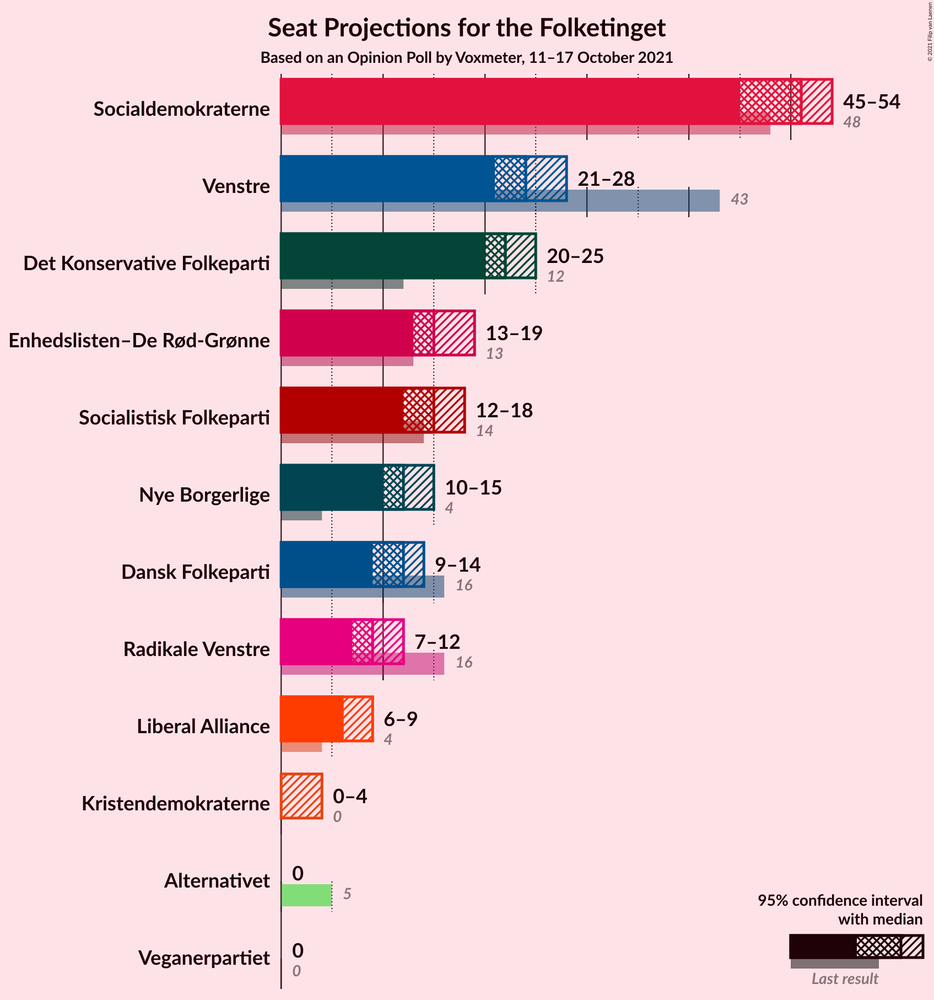
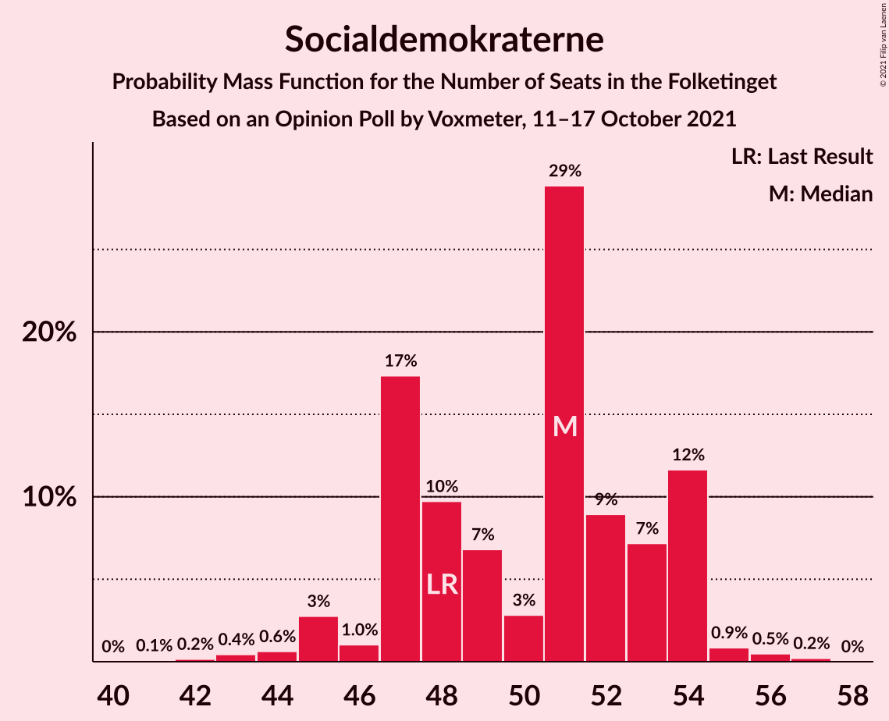
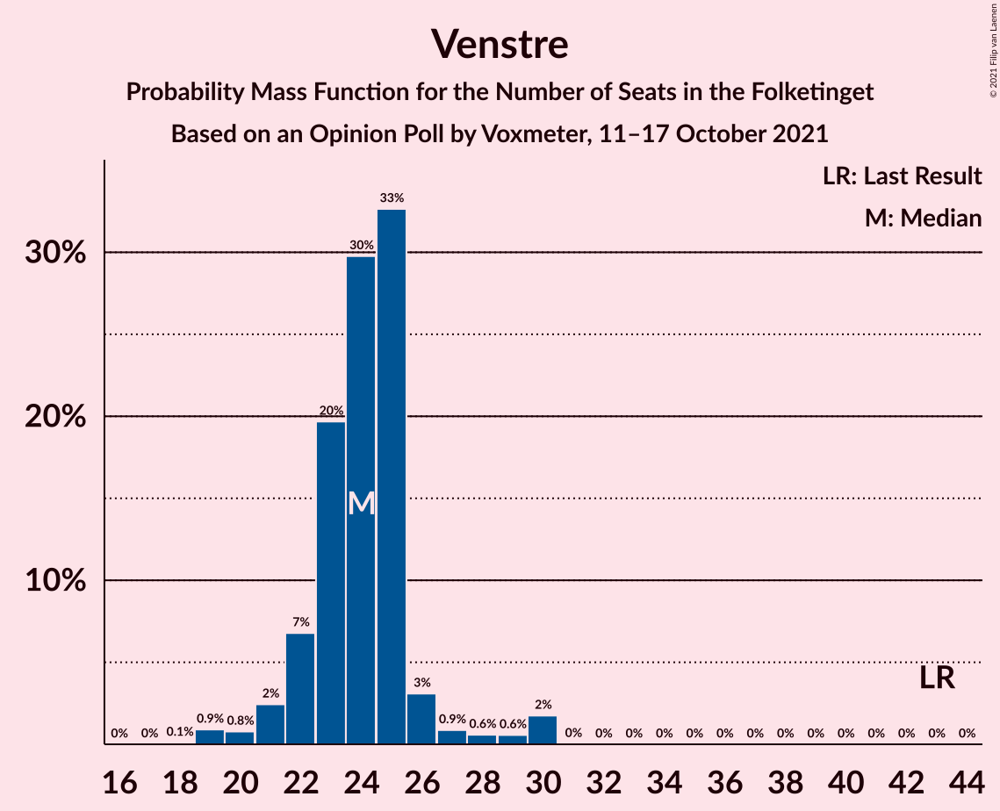
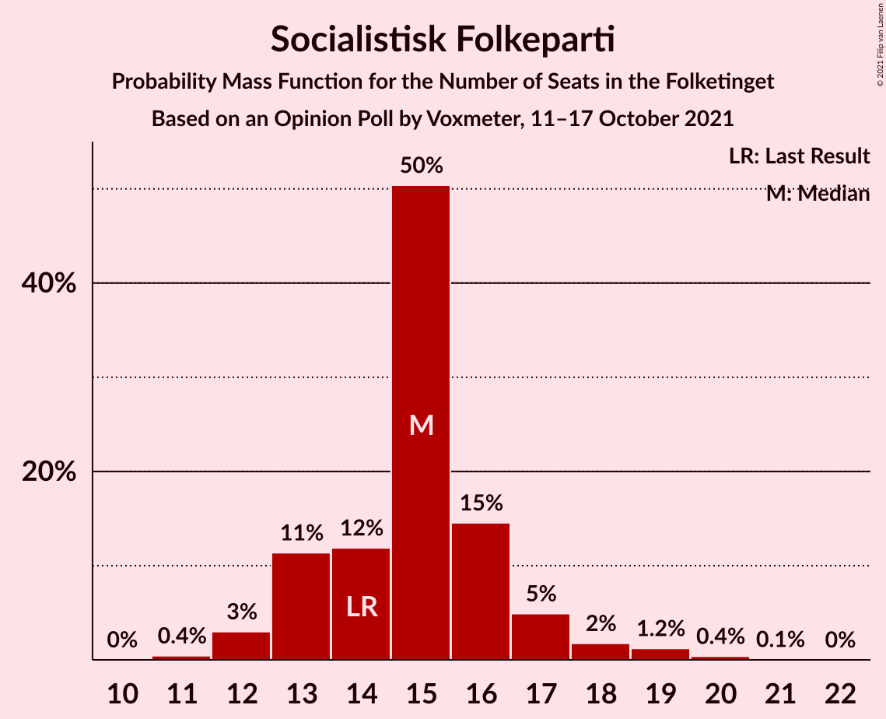
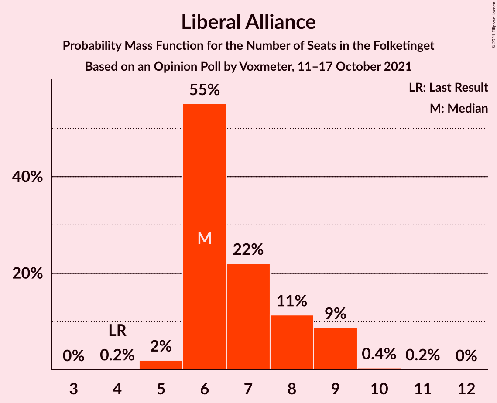
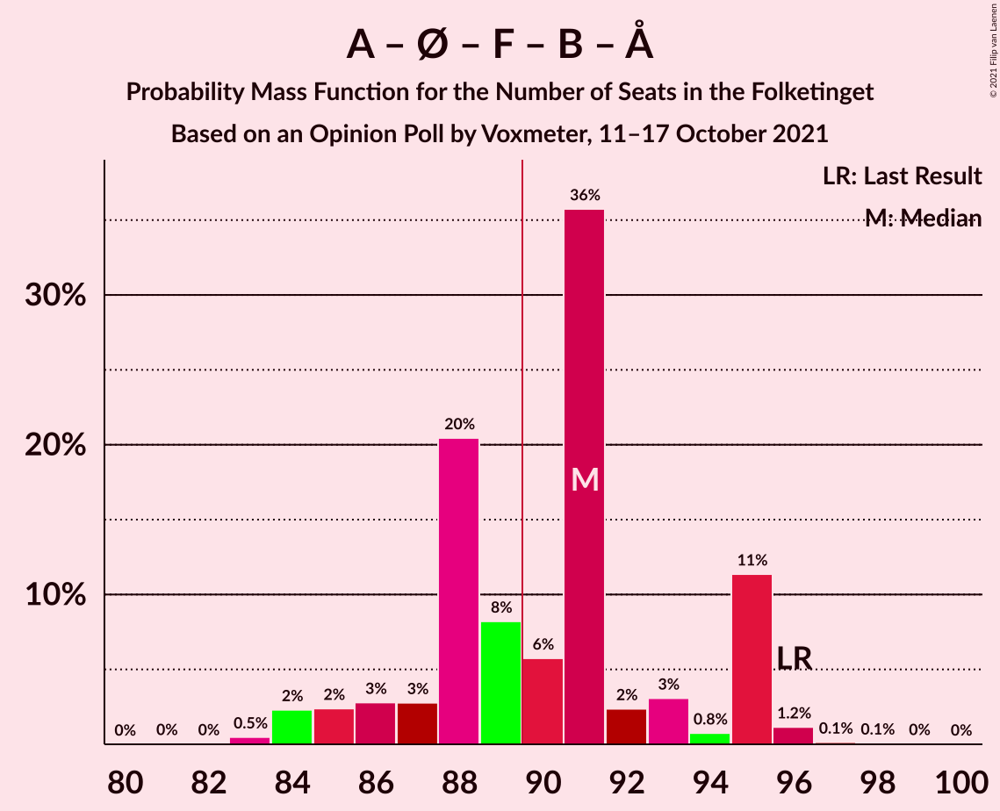
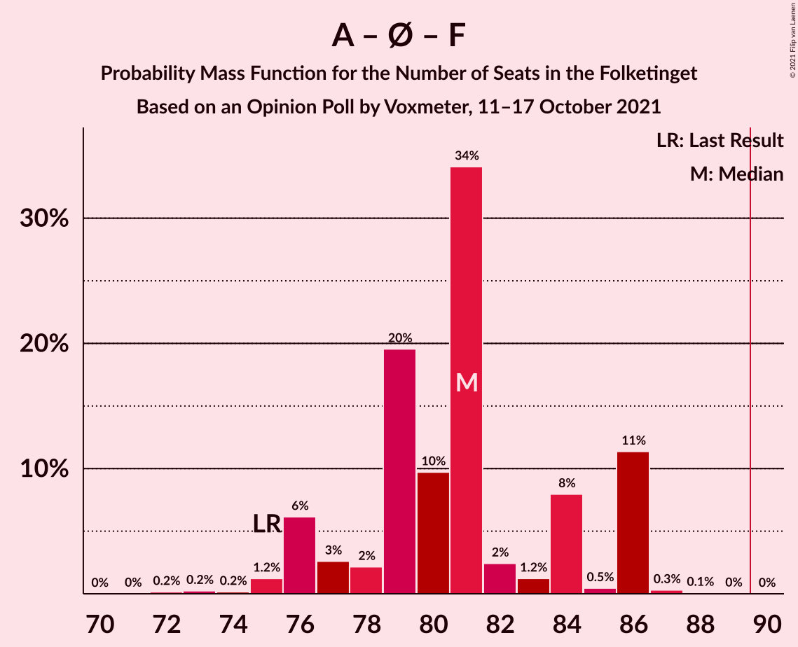
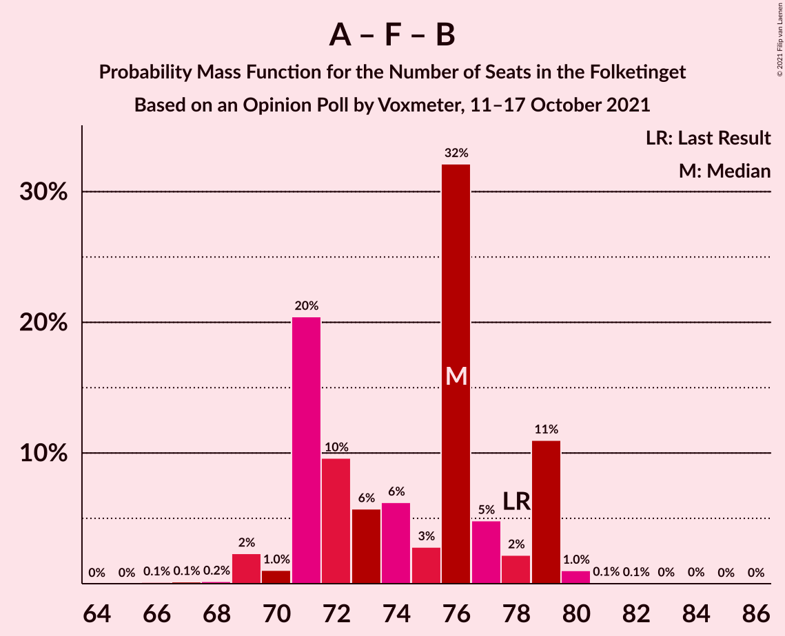
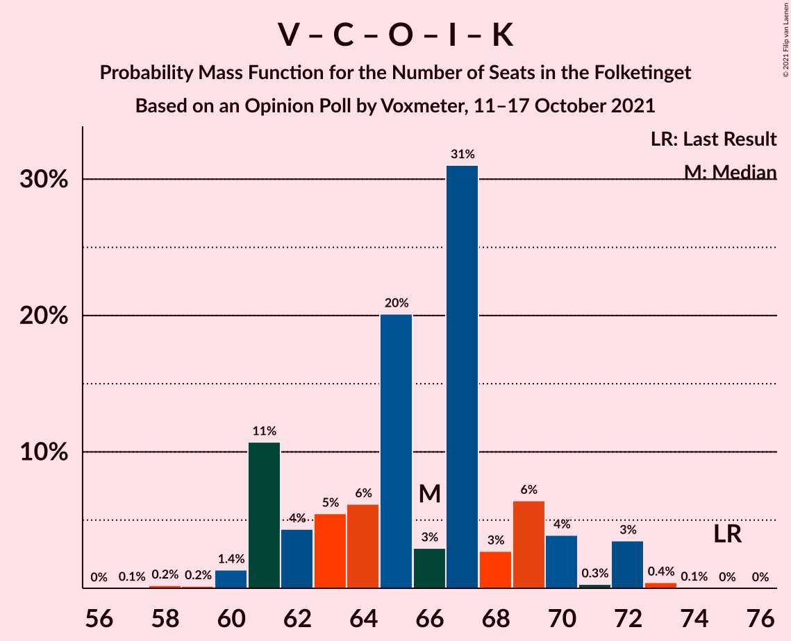
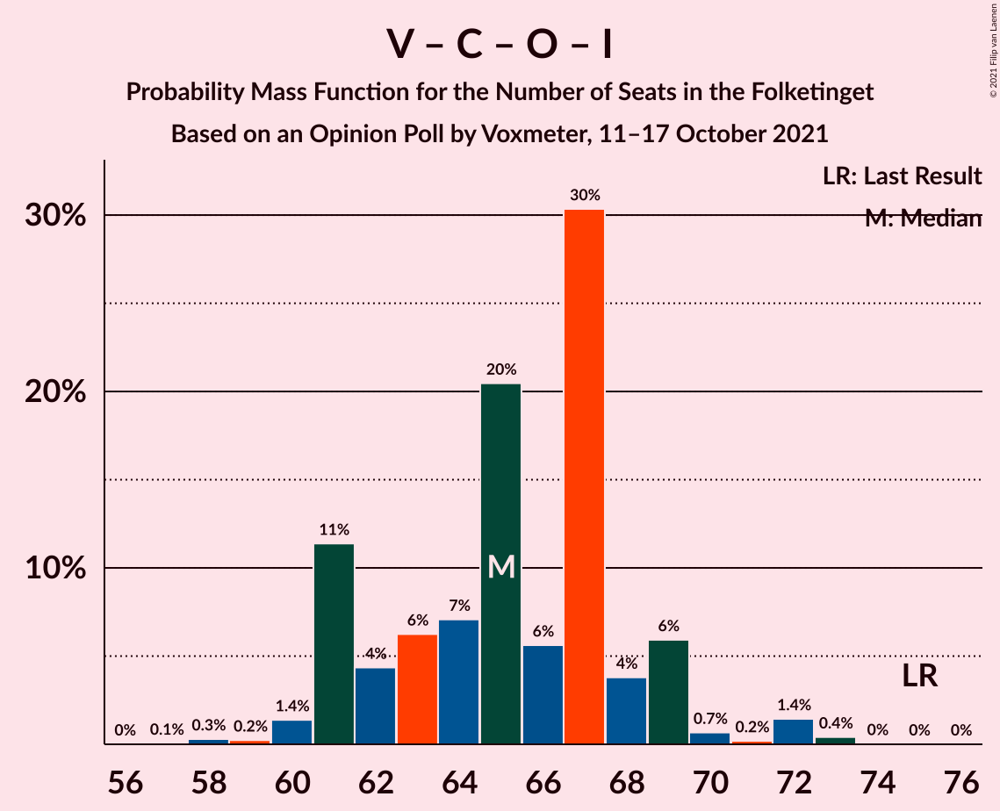

# Opinion Poll by Voxmeter, 11–17 October 2021

<a href="#voting-intentions">Voting Intentions</a> | <a href="#seats">Seats</a> | <a href="#coalitions">Coalitions</a> | <a href="#technical-information">Technical Information</a>

## Voting Intentions

### Confidence Intervals

| Party | Last Result | Poll Result | 80% Confidence Interval | 90% Confidence Interval | 95% Confidence Interval | 99% Confidence Interval |
|:-----:|:-----------:|:-----------:|:-----------------------:|:-----------------------:|:-----------------------:|:-----------------------:|
| Socialdemokraterne | 25.9% | 27.7% | 26.1–29.5% |25.6–30.0% |25.2–30.5% |24.4–31.3% |
| Venstre | 23.4% | 13.3% | 12.1–14.7% |11.7–15.1% |11.4–15.5% |10.9–16.2% |
| Det Konservative Folkeparti | 6.6% | 12.8% | 11.6–14.2% |11.2–14.6% |10.9–14.9% |10.4–15.6% |
| Enhedslisten–De Rød-Grønne | 6.9% | 8.8% | 7.8–10.0% |7.5–10.3% |7.3–10.6% |6.8–11.2% |
| Socialistisk Folkeparti | 7.7% | 8.4% | 7.4–9.6% |7.2–9.9% |6.9–10.2% |6.5–10.8% |
| Nye Borgerlige | 2.4% | 7.1% | 6.2–8.2% |5.9–8.5% |5.7–8.7% |5.3–9.3% |
| Dansk Folkeparti | 8.7% | 6.5% | 5.7–7.6% |5.4–7.9% |5.2–8.2% |4.8–8.7% |
| Radikale Venstre | 8.6% | 5.7% | 4.9–6.7% |4.7–7.0% |4.5–7.3% |4.1–7.8% |
| Liberal Alliance | 2.3% | 4.0% | 3.3–4.9% |3.1–5.1% |3.0–5.3% |2.7–5.8% |
| Kristendemokraterne | 1.7% | 1.3% | 0.9–1.8% |0.8–2.0% |0.8–2.1% |0.6–2.4% |
| Alternativet | 3.0% | 0.6% | 0.4–1.1% |0.4–1.2% |0.3–1.3% |0.2–1.6% |
| Veganerpartiet | 0.0% | 0.1% | 0.0–0.4% |0.0–0.4% |0.0–0.5% |0.0–0.7% |

*Note:* The poll result column reflects the actual value used in the calculations. Published results may vary slightly, and in addition be rounded to fewer digits.

## Seats

### Confidence Intervals

| Party | Last Result | Median | 80% Confidence Interval | 90% Confidence Interval | 95% Confidence Interval | 99% Confidence Interval |
|:-----:|:-----------:|:------:|:-----------------------:|:-----------------------:|:-----------------------:|:-----------------------:|
| <a href="#socialdemokraterne">Socialdemokraterne</a> | 48 | 47 | 47–53 |47–53 |45–53 |43–54 |
| <a href="#venstre">Venstre</a> | 43 | 24 | 23–25 |23–26 |21–26 |19–29 |
| <a href="#det-konservative-folkeparti">Det Konservative Folkeparti</a> | 12 | 23 | 22–25 |21–25 |20–25 |19–26 |
| <a href="#enhedslisten–de-rød-grønne">Enhedslisten–De Rød-Grønne</a> | 13 | 17 | 15–18 |14–18 |14–18 |13–19 |
| <a href="#socialistisk-folkeparti">Socialistisk Folkeparti</a> | 14 | 15 | 13–15 |13–16 |13–18 |12–19 |
| <a href="#nye-borgerlige">Nye Borgerlige</a> | 4 | 13 | 10–14 |10–15 |10–15 |10–15 |
| <a href="#dansk-folkeparti">Dansk Folkeparti</a> | 16 | 12 | 9–12 |9–13 |9–13 |8–15 |
| <a href="#radikale-venstre">Radikale Venstre</a> | 16 | 9 | 8–10 |8–11 |8–12 |8–13 |
| <a href="#liberal-alliance">Liberal Alliance</a> | 4 | 6 | 6–9 |6–9 |6–9 |5–9 |
| <a href="#kristendemokraterne">Kristendemokraterne</a> | 0 | 0 | 0 |0–4 |0–4 |0–4 |
| <a href="#alternativet">Alternativet</a> | 5 | 0 | 0 |0 |0 |0 |
| <a href="#veganerpartiet">Veganerpartiet</a> | 0 | 0 | 0 |0 |0 |0 |

### Socialdemokraterne

*For a full overview of the results for this party, see the [Socialdemokraterne](party-socialdemokraterne.html) page.*

| Number of Seats | Probability | Accumulated | Special Marks |
|:---------------:|:-----------:|:-----------:|:-------------:|
| 41 | 0.2% | 100% |  |
| 42 | 0% | 99.8% |  |
| 43 | 0.4% | 99.7% |  |
| 44 | 0.5% | 99.4% |  |
| 45 | 2% | 98.9% |  |
| 46 | 1.4% | 97% |  |
| 47 | 55% | 96% | Median |
| 48 | 15% | 41% | Last Result |
| 49 | 1.1% | 25% |  |
| 50 | 4% | 24% |  |
| 51 | 1.0% | 20% |  |
| 52 | 3% | 19% |  |
| 53 | 15% | 16% |  |
| 54 | 0.1% | 0.6% |  |
| 55 | 0.3% | 0.4% |  |
| 56 | 0.1% | 0.2% |  |
| 57 | 0.1% | 0.1% |  |
| 58 | 0% | 0% |  |

### Venstre

*For a full overview of the results for this party, see the [Venstre](party-venstre.html) page.*

| Number of Seats | Probability | Accumulated | Special Marks |
|:---------------:|:-----------:|:-----------:|:-------------:|
| 18 | 0.1% | 100% |  |
| 19 | 1.2% | 99.9% |  |
| 20 | 0.4% | 98.7% |  |
| 21 | 2% | 98% |  |
| 22 | 0.9% | 97% |  |
| 23 | 18% | 96% |  |
| 24 | 66% | 78% | Median |
| 25 | 5% | 12% |  |
| 26 | 6% | 7% |  |
| 27 | 0.5% | 1.3% |  |
| 28 | 0.2% | 0.8% |  |
| 29 | 0.5% | 0.6% |  |
| 30 | 0.1% | 0.1% |  |
| 31 | 0% | 0% |  |
| 32 | 0% | 0% |  |
| 33 | 0% | 0% |  |
| 34 | 0% | 0% |  |
| 35 | 0% | 0% |  |
| 36 | 0% | 0% |  |
| 37 | 0% | 0% |  |
| 38 | 0% | 0% |  |
| 39 | 0% | 0% |  |
| 40 | 0% | 0% |  |
| 41 | 0% | 0% |  |
| 42 | 0% | 0% |  |
| 43 | 0% | 0% | Last Result |

### Det Konservative Folkeparti

*For a full overview of the results for this party, see the [Det Konservative Folkeparti](party-detkonservativefolkeparti.html) page.*

| Number of Seats | Probability | Accumulated | Special Marks |
|:---------------:|:-----------:|:-----------:|:-------------:|
| 12 | 0% | 100% | Last Result |
| 13 | 0% | 100% |  |
| 14 | 0% | 100% |  |
| 15 | 0% | 100% |  |
| 16 | 0% | 100% |  |
| 17 | 0.1% | 100% |  |
| 18 | 0.1% | 99.9% |  |
| 19 | 0.4% | 99.9% |  |
| 20 | 2% | 99.5% |  |
| 21 | 7% | 97% |  |
| 22 | 4% | 90% |  |
| 23 | 66% | 86% | Median |
| 24 | 4% | 20% |  |
| 25 | 15% | 16% |  |
| 26 | 0.5% | 0.8% |  |
| 27 | 0.3% | 0.3% |  |
| 28 | 0% | 0.1% |  |
| 29 | 0% | 0% |  |

### Enhedslisten–De Rød-Grønne

*For a full overview of the results for this party, see the [Enhedslisten–De Rød-Grønne](party-enhedslisten–derød-grønne.html) page.*

| Number of Seats | Probability | Accumulated | Special Marks |
|:---------------:|:-----------:|:-----------:|:-------------:|
| 11 | 0.1% | 100% |  |
| 12 | 0.2% | 99.9% |  |
| 13 | 2% | 99.7% | Last Result |
| 14 | 6% | 98% |  |
| 15 | 15% | 92% |  |
| 16 | 7% | 77% |  |
| 17 | 58% | 69% | Median |
| 18 | 10% | 11% |  |
| 19 | 1.0% | 1.2% |  |
| 20 | 0.2% | 0.2% |  |
| 21 | 0% | 0% |  |

### Socialistisk Folkeparti

*For a full overview of the results for this party, see the [Socialistisk Folkeparti](party-socialistiskfolkeparti.html) page.*

| Number of Seats | Probability | Accumulated | Special Marks |
|:---------------:|:-----------:|:-----------:|:-------------:|
| 11 | 0.3% | 100% |  |
| 12 | 2% | 99.7% |  |
| 13 | 15% | 98% |  |
| 14 | 13% | 82% | Last Result |
| 15 | 60% | 69% | Median |
| 16 | 5% | 9% |  |
| 17 | 2% | 5% |  |
| 18 | 0.4% | 3% |  |
| 19 | 2% | 2% |  |
| 20 | 0.1% | 0.1% |  |
| 21 | 0% | 0% |  |

### Nye Borgerlige

*For a full overview of the results for this party, see the [Nye Borgerlige](party-nyeborgerlige.html) page.*

| Number of Seats | Probability | Accumulated | Special Marks |
|:---------------:|:-----------:|:-----------:|:-------------:|
| 4 | 0% | 100% | Last Result |
| 5 | 0% | 100% |  |
| 6 | 0% | 100% |  |
| 7 | 0% | 100% |  |
| 8 | 0% | 100% |  |
| 9 | 0.1% | 100% |  |
| 10 | 15% | 99.8% |  |
| 11 | 7% | 85% |  |
| 12 | 3% | 78% |  |
| 13 | 57% | 75% | Median |
| 14 | 11% | 18% |  |
| 15 | 7% | 8% |  |
| 16 | 0.4% | 0.5% |  |
| 17 | 0.1% | 0.1% |  |
| 18 | 0% | 0% |  |

### Dansk Folkeparti

*For a full overview of the results for this party, see the [Dansk Folkeparti](party-danskfolkeparti.html) page.*

| Number of Seats | Probability | Accumulated | Special Marks |
|:---------------:|:-----------:|:-----------:|:-------------:|
| 8 | 1.1% | 100% |  |
| 9 | 10% | 98.9% |  |
| 10 | 0.9% | 88% |  |
| 11 | 5% | 88% |  |
| 12 | 73% | 83% | Median |
| 13 | 7% | 9% |  |
| 14 | 2% | 2% |  |
| 15 | 0.6% | 0.7% |  |
| 16 | 0.1% | 0.1% | Last Result |
| 17 | 0% | 0% |  |

### Radikale Venstre

*For a full overview of the results for this party, see the [Radikale Venstre](party-radikalevenstre.html) page.*

| Number of Seats | Probability | Accumulated | Special Marks |
|:---------------:|:-----------:|:-----------:|:-------------:|
| 7 | 0.4% | 100% |  |
| 8 | 21% | 99.6% |  |
| 9 | 58% | 79% | Median |
| 10 | 16% | 21% |  |
| 11 | 2% | 5% |  |
| 12 | 2% | 4% |  |
| 13 | 1.0% | 1.2% |  |
| 14 | 0.2% | 0.2% |  |
| 15 | 0% | 0% |  |
| 16 | 0% | 0% | Last Result |

### Liberal Alliance

*For a full overview of the results for this party, see the [Liberal Alliance](party-liberalalliance.html) page.*

| Number of Seats | Probability | Accumulated | Special Marks |
|:---------------:|:-----------:|:-----------:|:-------------:|
| 4 | 0.1% | 100% | Last Result |
| 5 | 2% | 99.9% |  |
| 6 | 66% | 98% | Median |
| 7 | 11% | 32% |  |
| 8 | 2% | 20% |  |
| 9 | 18% | 18% |  |
| 10 | 0.2% | 0.4% |  |
| 11 | 0.2% | 0.2% |  |
| 12 | 0% | 0% |  |

### Kristendemokraterne

*For a full overview of the results for this party, see the [Kristendemokraterne](party-kristendemokraterne.html) page.*

| Number of Seats | Probability | Accumulated | Special Marks |
|:---------------:|:-----------:|:-----------:|:-------------:|
| 0 | 95% | 100% | Last Result, Median |
| 1 | 0% | 5% |  |
| 2 | 0% | 5% |  |
| 3 | 0% | 5% |  |
| 4 | 5% | 5% |  |
| 5 | 0.2% | 0.2% |  |
| 6 | 0% | 0% |  |

### Alternativet

*For a full overview of the results for this party, see the [Alternativet](party-alternativet.html) page.*

| Number of Seats | Probability | Accumulated | Special Marks |
|:---------------:|:-----------:|:-----------:|:-------------:|
| 0 | 100% | 100% | Median |
| 1 | 0% | 0% |  |
| 2 | 0% | 0% |  |
| 3 | 0% | 0% |  |
| 4 | 0% | 0% |  |
| 5 | 0% | 0% | Last Result |

### Veganerpartiet

*For a full overview of the results for this party, see the [Veganerpartiet](party-veganerpartiet.html) page.*

| Number of Seats | Probability | Accumulated | Special Marks |
|:---------------:|:-----------:|:-----------:|:-------------:|
| 0 | 100% | 100% | Last Result, Median |

## Coalitions

### Confidence Intervals

| Coalition | Last Result | Median | Majority? | 80% Confidence Interval | 90% Confidence Interval | 95% Confidence Interval | 99% Confidence Interval |
|:---------:|:-----------:|:------:|:---------:|:-----------------------:|:-----------------------:|:-----------------------:|:-----------------------:|
| Socialdemokraterne – Enhedslisten–De Rød-Grønne – Socialistisk Folkeparti – Radikale Venstre – Alternativet | 96 | 88 | 19% | 88–90 | 87–91 | 87–93 | 85–96 |
| Socialdemokraterne – Enhedslisten–De Rød-Grønne – Socialistisk Folkeparti – Radikale Venstre | 91 | 88 | 19% | 88–90 | 87–91 | 87–93 | 85–96 |
| Socialdemokraterne – Enhedslisten–De Rød-Grønne – Socialistisk Folkeparti – Alternativet | 80 | 79 | 0% | 79–81 | 78–81 | 77–82 | 74–86 |
| Socialdemokraterne – Enhedslisten–De Rød-Grønne – Socialistisk Folkeparti | 75 | 79 | 0% | 79–81 | 78–81 | 77–82 | 74–86 |
| Venstre – Det Konservative Folkeparti – Nye Borgerlige – Dansk Folkeparti – Liberal Alliance – Kristendemokraterne | 79 | 78 | 0% | 76–80 | 76–81 | 75–82 | 73–84 |
| Venstre – Det Konservative Folkeparti – Nye Borgerlige – Dansk Folkeparti – Liberal Alliance | 79 | 78 | 0% | 76–80 | 76–81 | 75–82 | 73–84 |
| Socialdemokraterne – Socialistisk Folkeparti – Radikale Venstre | 78 | 71 | 0% | 71–74 | 71–76 | 71–77 | 68–80 |
| Venstre – Det Konservative Folkeparti – Dansk Folkeparti – Liberal Alliance – Kristendemokraterne | 75 | 65 | 0% | 62–69 | 62–69 | 62–70 | 61–71 |
| Venstre – Det Konservative Folkeparti – Dansk Folkeparti – Liberal Alliance | 75 | 65 | 0% | 62–69 | 62–69 | 62–69 | 61–70 |
| Socialdemokraterne – Radikale Venstre | 64 | 56 | 0% | 56–61 | 56–62 | 56–62 | 53–64 |
| Venstre – Det Konservative Folkeparti – Liberal Alliance | 59 | 53 | 0% | 53–57 | 52–57 | 51–57 | 48–58 |
| Venstre – Det Konservative Folkeparti | 55 | 47 | 0% | 46–48 | 45–48 | 43–49 | 41–52 |
| Venstre | 43 | 24 | 0% | 23–25 | 23–26 | 21–26 | 19–29 |

### Socialdemokraterne – Enhedslisten–De Rød-Grønne – Socialistisk Folkeparti – Radikale Venstre – Alternativet

| Number of Seats | Probability | Accumulated | Special Marks |
|:---------------:|:-----------:|:-----------:|:-------------:|
| 83 | 0.2% | 100% |  |
| 84 | 0.3% | 99.8% |  |
| 85 | 0.5% | 99.5% |  |
| 86 | 0.7% | 99.0% |  |
| 87 | 3% | 98% |  |
| 88 | 61% | 95% | Median |
| 89 | 15% | 34% |  |
| 90 | 13% | 19% | Majority |
| 91 | 0.9% | 6% |  |
| 92 | 2% | 5% |  |
| 93 | 1.4% | 3% |  |
| 94 | 0.3% | 2% |  |
| 95 | 0.3% | 1.3% |  |
| 96 | 0.9% | 1.0% | Last Result |
| 97 | 0% | 0.2% |  |
| 98 | 0.1% | 0.2% |  |
| 99 | 0.1% | 0.1% |  |
| 100 | 0% | 0% |  |

### Socialdemokraterne – Enhedslisten–De Rød-Grønne – Socialistisk Folkeparti – Radikale Venstre

| Number of Seats | Probability | Accumulated | Special Marks |
|:---------------:|:-----------:|:-----------:|:-------------:|
| 83 | 0.2% | 100% |  |
| 84 | 0.3% | 99.8% |  |
| 85 | 0.5% | 99.5% |  |
| 86 | 0.7% | 99.0% |  |
| 87 | 3% | 98% |  |
| 88 | 61% | 95% | Median |
| 89 | 15% | 34% |  |
| 90 | 13% | 19% | Majority |
| 91 | 0.9% | 6% | Last Result |
| 92 | 2% | 5% |  |
| 93 | 1.4% | 3% |  |
| 94 | 0.3% | 2% |  |
| 95 | 0.3% | 1.3% |  |
| 96 | 0.9% | 1.0% |  |
| 97 | 0% | 0.2% |  |
| 98 | 0.1% | 0.2% |  |
| 99 | 0.1% | 0.1% |  |
| 100 | 0% | 0% |  |

### Socialdemokraterne – Enhedslisten–De Rød-Grønne – Socialistisk Folkeparti – Alternativet

| Number of Seats | Probability | Accumulated | Special Marks |
|:---------------:|:-----------:|:-----------:|:-------------:|
| 72 | 0.1% | 100% |  |
| 73 | 0.3% | 99.9% |  |
| 74 | 0.2% | 99.7% |  |
| 75 | 0.3% | 99.5% |  |
| 76 | 0.6% | 99.2% |  |
| 77 | 2% | 98.6% |  |
| 78 | 2% | 97% |  |
| 79 | 58% | 95% | Median |
| 80 | 18% | 37% | Last Result |
| 81 | 16% | 19% |  |
| 82 | 0.8% | 3% |  |
| 83 | 0.6% | 2% |  |
| 84 | 0.4% | 2% |  |
| 85 | 0.1% | 1.1% |  |
| 86 | 0.9% | 1.0% |  |
| 87 | 0% | 0.1% |  |
| 88 | 0% | 0.1% |  |
| 89 | 0.1% | 0.1% |  |
| 90 | 0% | 0% | Majority |

### Socialdemokraterne – Enhedslisten–De Rød-Grønne – Socialistisk Folkeparti

| Number of Seats | Probability | Accumulated | Special Marks |
|:---------------:|:-----------:|:-----------:|:-------------:|
| 72 | 0.1% | 100% |  |
| 73 | 0.3% | 99.9% |  |
| 74 | 0.2% | 99.7% |  |
| 75 | 0.3% | 99.5% | Last Result |
| 76 | 0.6% | 99.1% |  |
| 77 | 2% | 98.6% |  |
| 78 | 2% | 97% |  |
| 79 | 58% | 95% | Median |
| 80 | 18% | 37% |  |
| 81 | 16% | 19% |  |
| 82 | 0.8% | 3% |  |
| 83 | 0.6% | 2% |  |
| 84 | 0.4% | 1.5% |  |
| 85 | 0.1% | 1.1% |  |
| 86 | 0.9% | 1.0% |  |
| 87 | 0% | 0.1% |  |
| 88 | 0% | 0.1% |  |
| 89 | 0.1% | 0.1% |  |
| 90 | 0% | 0% | Majority |

### Venstre – Det Konservative Folkeparti – Nye Borgerlige – Dansk Folkeparti – Liberal Alliance – Kristendemokraterne

| Number of Seats | Probability | Accumulated | Special Marks |
|:---------------:|:-----------:|:-----------:|:-------------:|
| 71 | 0% | 100% |  |
| 72 | 0.2% | 99.9% |  |
| 73 | 1.0% | 99.8% |  |
| 74 | 0.5% | 98.8% |  |
| 75 | 1.2% | 98% |  |
| 76 | 11% | 97% |  |
| 77 | 0.5% | 86% |  |
| 78 | 56% | 85% | Median |
| 79 | 15% | 30% | Last Result |
| 80 | 5% | 14% |  |
| 81 | 5% | 9% |  |
| 82 | 3% | 4% |  |
| 83 | 0.5% | 1.3% |  |
| 84 | 0.7% | 0.8% |  |
| 85 | 0.1% | 0.2% |  |
| 86 | 0% | 0.1% |  |
| 87 | 0.1% | 0.1% |  |
| 88 | 0% | 0% |  |

### Venstre – Det Konservative Folkeparti – Nye Borgerlige – Dansk Folkeparti – Liberal Alliance

| Number of Seats | Probability | Accumulated | Special Marks |
|:---------------:|:-----------:|:-----------:|:-------------:|
| 71 | 0.1% | 100% |  |
| 72 | 0.2% | 99.9% |  |
| 73 | 1.0% | 99.7% |  |
| 74 | 0.8% | 98.7% |  |
| 75 | 1.4% | 98% |  |
| 76 | 12% | 96% |  |
| 77 | 4% | 85% |  |
| 78 | 56% | 81% | Median |
| 79 | 15% | 25% | Last Result |
| 80 | 5% | 10% |  |
| 81 | 1.2% | 5% |  |
| 82 | 3% | 4% |  |
| 83 | 0.4% | 1.0% |  |
| 84 | 0.5% | 0.6% |  |
| 85 | 0.1% | 0.1% |  |
| 86 | 0% | 0.1% |  |
| 87 | 0% | 0.1% |  |
| 88 | 0% | 0% |  |

### Socialdemokraterne – Socialistisk Folkeparti – Radikale Venstre

| Number of Seats | Probability | Accumulated | Special Marks |
|:---------------:|:-----------:|:-----------:|:-------------:|
| 67 | 0.4% | 100% |  |
| 68 | 0.2% | 99.6% |  |
| 69 | 0.6% | 99.4% |  |
| 70 | 0.5% | 98.7% |  |
| 71 | 56% | 98% | Median |
| 72 | 15% | 43% |  |
| 73 | 3% | 27% |  |
| 74 | 14% | 24% |  |
| 75 | 2% | 10% |  |
| 76 | 4% | 7% |  |
| 77 | 1.2% | 3% |  |
| 78 | 0.3% | 2% | Last Result |
| 79 | 0.2% | 1.4% |  |
| 80 | 1.0% | 1.2% |  |
| 81 | 0.1% | 0.2% |  |
| 82 | 0.1% | 0.1% |  |
| 83 | 0% | 0% |  |

### Venstre – Det Konservative Folkeparti – Dansk Folkeparti – Liberal Alliance – Kristendemokraterne

| Number of Seats | Probability | Accumulated | Special Marks |
|:---------------:|:-----------:|:-----------:|:-------------:|
| 58 | 0% | 100% |  |
| 59 | 0.1% | 99.9% |  |
| 60 | 0.2% | 99.8% |  |
| 61 | 0.2% | 99.6% |  |
| 62 | 11% | 99.5% |  |
| 63 | 0.9% | 89% |  |
| 64 | 1.4% | 88% |  |
| 65 | 61% | 86% | Median |
| 66 | 0.8% | 26% |  |
| 67 | 3% | 25% |  |
| 68 | 2% | 22% |  |
| 69 | 15% | 20% |  |
| 70 | 4% | 5% |  |
| 71 | 0.3% | 0.7% |  |
| 72 | 0.2% | 0.4% |  |
| 73 | 0.1% | 0.2% |  |
| 74 | 0.1% | 0.1% |  |
| 75 | 0% | 0% | Last Result |

### Venstre – Det Konservative Folkeparti – Dansk Folkeparti – Liberal Alliance

| Number of Seats | Probability | Accumulated | Special Marks |
|:---------------:|:-----------:|:-----------:|:-------------:|
| 58 | 0.1% | 100% |  |
| 59 | 0.1% | 99.9% |  |
| 60 | 0.2% | 99.8% |  |
| 61 | 0.2% | 99.5% |  |
| 62 | 11% | 99.3% |  |
| 63 | 1.3% | 89% |  |
| 64 | 2% | 87% |  |
| 65 | 61% | 85% | Median |
| 66 | 4% | 25% |  |
| 67 | 3% | 20% |  |
| 68 | 1.0% | 17% |  |
| 69 | 15% | 16% |  |
| 70 | 0.4% | 0.8% |  |
| 71 | 0.2% | 0.4% |  |
| 72 | 0.1% | 0.2% |  |
| 73 | 0.1% | 0.1% |  |
| 74 | 0% | 0% |  |
| 75 | 0% | 0% | Last Result |

### Socialdemokraterne – Radikale Venstre

| Number of Seats | Probability | Accumulated | Special Marks |
|:---------------:|:-----------:|:-----------:|:-------------:|
| 51 | 0.2% | 100% |  |
| 52 | 0% | 99.8% |  |
| 53 | 0.4% | 99.7% |  |
| 54 | 0.4% | 99.3% |  |
| 55 | 0.4% | 98.9% |  |
| 56 | 59% | 98.5% | Median |
| 57 | 2% | 39% |  |
| 58 | 14% | 37% |  |
| 59 | 0.6% | 23% |  |
| 60 | 2% | 22% |  |
| 61 | 14% | 20% |  |
| 62 | 3% | 6% |  |
| 63 | 2% | 2% |  |
| 64 | 0.2% | 0.6% | Last Result |
| 65 | 0.2% | 0.4% |  |
| 66 | 0% | 0.2% |  |
| 67 | 0.1% | 0.1% |  |
| 68 | 0.1% | 0.1% |  |
| 69 | 0% | 0% |  |

### Venstre – Det Konservative Folkeparti – Liberal Alliance

| Number of Seats | Probability | Accumulated | Special Marks |
|:---------------:|:-----------:|:-----------:|:-------------:|
| 46 | 0% | 100% |  |
| 47 | 0.1% | 99.9% |  |
| 48 | 1.1% | 99.8% |  |
| 49 | 0.4% | 98.7% |  |
| 50 | 0.4% | 98% |  |
| 51 | 0.5% | 98% |  |
| 52 | 3% | 97% |  |
| 53 | 70% | 94% | Median |
| 54 | 3% | 25% |  |
| 55 | 3% | 21% |  |
| 56 | 1.4% | 18% |  |
| 57 | 15% | 17% |  |
| 58 | 2% | 2% |  |
| 59 | 0.4% | 0.5% | Last Result |
| 60 | 0% | 0.1% |  |
| 61 | 0% | 0% |  |

### Venstre – Det Konservative Folkeparti

| Number of Seats | Probability | Accumulated | Special Marks |
|:---------------:|:-----------:|:-----------:|:-------------:|
| 38 | 0% | 100% |  |
| 39 | 0.1% | 99.9% |  |
| 40 | 0.1% | 99.9% |  |
| 41 | 0.8% | 99.8% |  |
| 42 | 0.5% | 98.9% |  |
| 43 | 2% | 98% |  |
| 44 | 0.4% | 96% |  |
| 45 | 2% | 96% |  |
| 46 | 4% | 94% |  |
| 47 | 69% | 90% | Median |
| 48 | 18% | 21% |  |
| 49 | 2% | 3% |  |
| 50 | 0.5% | 1.4% |  |
| 51 | 0.3% | 0.9% |  |
| 52 | 0.5% | 0.6% |  |
| 53 | 0.1% | 0.1% |  |
| 54 | 0% | 0% |  |
| 55 | 0% | 0% | Last Result |

### Venstre

| Number of Seats | Probability | Accumulated | Special Marks |
|:---------------:|:-----------:|:-----------:|:-------------:|
| 18 | 0.1% | 100% |  |
| 19 | 1.2% | 99.9% |  |
| 20 | 0.4% | 98.7% |  |
| 21 | 2% | 98% |  |
| 22 | 0.9% | 97% |  |
| 23 | 18% | 96% |  |
| 24 | 66% | 78% | Median |
| 25 | 5% | 12% |  |
| 26 | 6% | 7% |  |
| 27 | 0.5% | 1.3% |  |
| 28 | 0.2% | 0.8% |  |
| 29 | 0.5% | 0.6% |  |
| 30 | 0.1% | 0.1% |  |
| 31 | 0% | 0% |  |
| 32 | 0% | 0% |  |
| 33 | 0% | 0% |  |
| 34 | 0% | 0% |  |
| 35 | 0% | 0% |  |
| 36 | 0% | 0% |  |
| 37 | 0% | 0% |  |
| 38 | 0% | 0% |  |
| 39 | 0% | 0% |  |
| 40 | 0% | 0% |  |
| 41 | 0% | 0% |  |
| 42 | 0% | 0% |  |
| 43 | 0% | 0% | Last Result |

## Technical Information

### Opinion Poll

+ **Polling firm:** Voxmeter
+ **Commissioner(s):** —
+ **Fieldwork period:** 11–17 October 2021

### Calculations

+ **Sample size:** 1103
+ **Simulations done:** 262,144
+ **Error estimate:** 1.20%

