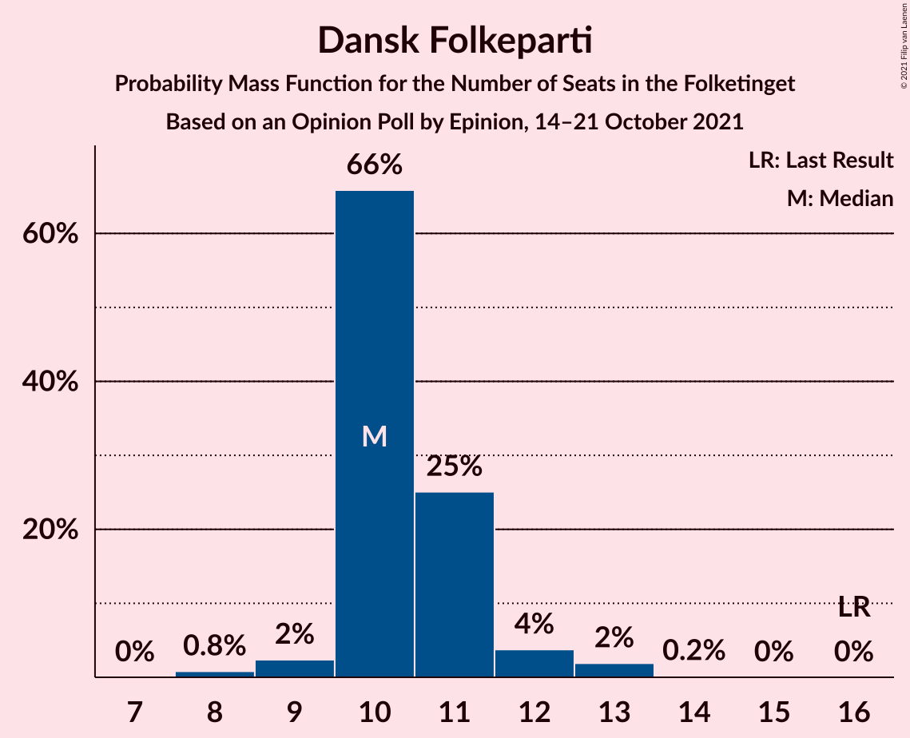
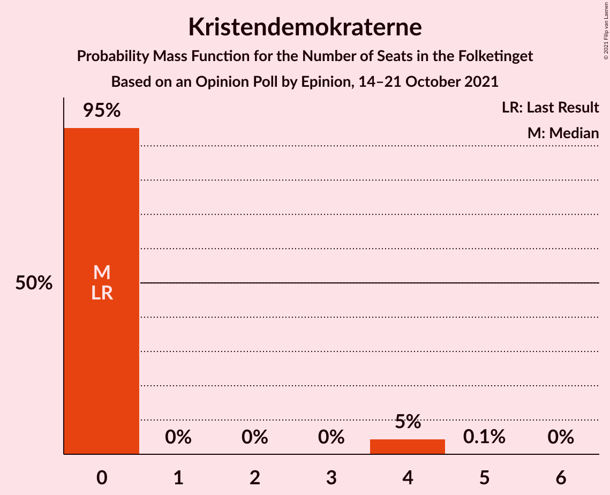
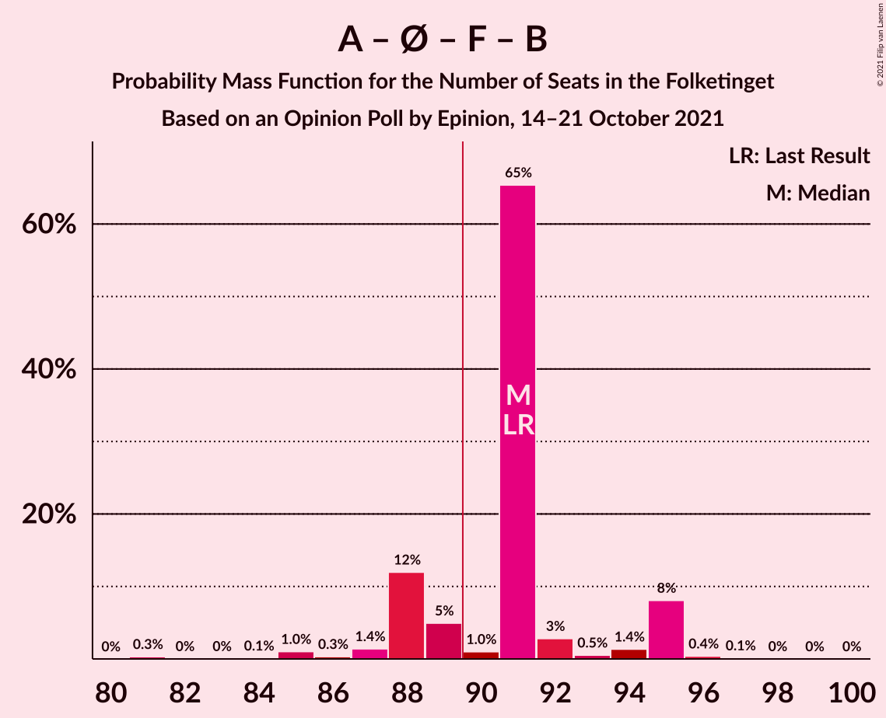
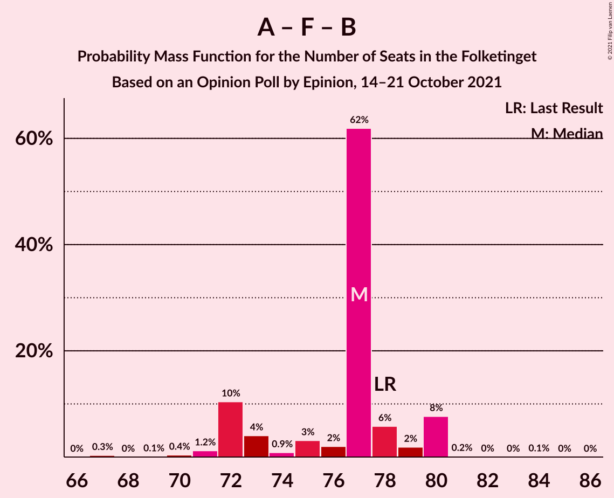
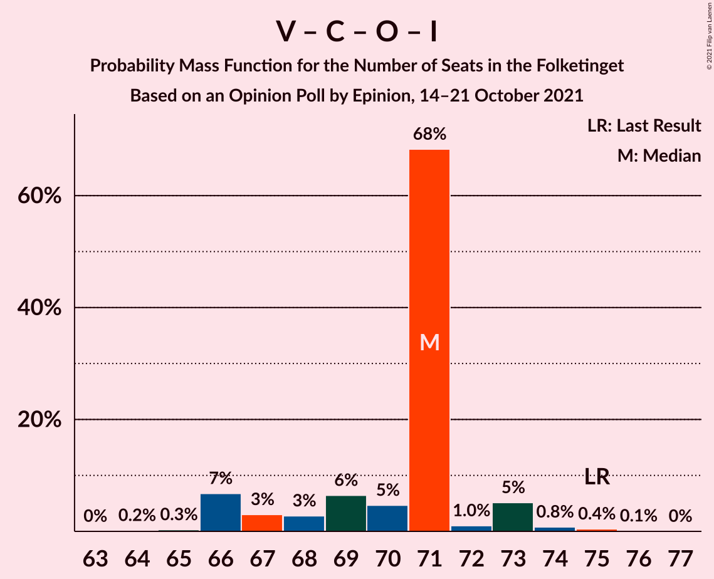

# Opinion Poll by Epinion, 14–21 October 2021

<a href="#voting-intentions">Voting Intentions</a> | <a href="#seats">Seats</a> | <a href="#coalitions">Coalitions</a> | <a href="#technical-information">Technical Information</a>

## Voting Intentions

### Confidence Intervals

| Party | Last Result | Poll Result | 80% Confidence Interval | 90% Confidence Interval | 95% Confidence Interval | 99% Confidence Interval |
|:-----:|:-----------:|:-----------:|:-----------------------:|:-----------------------:|:-----------------------:|:-----------------------:|
| Socialdemokraterne | 25.9% | 28.0% | 26.6–29.5% |26.2–29.9% |25.9–30.3% |25.2–31.0% |
| Venstre | 23.4% | 15.9% | 14.8–17.1% |14.5–17.5% |14.2–17.8% |13.7–18.4% |
| Det Konservative Folkeparti | 6.6% | 13.5% | 12.5–14.7% |12.2–15.0% |11.9–15.3% |11.5–15.8% |
| Enhedslisten–De Rød-Grønne | 6.9% | 8.0% | 7.2–8.9% |7.0–9.2% |6.8–9.4% |6.4–9.9% |
| Socialistisk Folkeparti | 7.7% | 8.0% | 7.2–8.9% |7.0–9.2% |6.8–9.4% |6.4–9.9% |
| Radikale Venstre | 8.6% | 6.0% | 5.3–6.8% |5.1–7.1% |4.9–7.3% |4.6–7.7% |
| Dansk Folkeparti | 8.7% | 5.9% | 5.2–6.7% |5.0–6.9% |4.8–7.1% |4.5–7.5% |
| Nye Borgerlige | 2.4% | 5.8% | 5.1–6.6% |4.9–6.9% |4.8–7.1% |4.5–7.5% |
| Liberal Alliance | 2.3% | 2.9% | 2.4–3.5% |2.3–3.7% |2.2–3.8% |2.0–4.1% |
| Kristendemokraterne | 1.7% | 1.5% | 1.2–2.0% |1.1–2.1% |1.0–2.3% |0.9–2.5% |
| Alternativet | 3.0% | 1.4% | 1.1–1.9% |1.0–2.0% |0.9–2.1% |0.8–2.3% |
| Veganerpartiet | 0.0% | 0.7% | 0.5–1.0% |0.4–1.1% |0.4–1.2% |0.3–1.4% |

*Note:* The poll result column reflects the actual value used in the calculations. Published results may vary slightly, and in addition be rounded to fewer digits.

## Seats

### Confidence Intervals

| Party | Last Result | Median | 80% Confidence Interval | 90% Confidence Interval | 95% Confidence Interval | 99% Confidence Interval |
|:-----:|:-----------:|:------:|:-----------------------:|:-----------------------:|:-----------------------:|:-----------------------:|
| <a href="#socialdemokraterne">Socialdemokraterne</a> | 48 | 51 | 47–53 |47–54 |47–55 |46–56 |
| <a href="#venstre">Venstre</a> | 43 | 31 | 28–31 |28–31 |28–32 |26–33 |
| <a href="#det-konservative-folkeparti">Det Konservative Folkeparti</a> | 12 | 25 | 23–26 |23–26 |21–26 |21–28 |
| <a href="#enhedslisten–de-rød-grønne">Enhedslisten–De Rød-Grønne</a> | 13 | 14 | 14–16 |13–16 |13–16 |12–17 |
| <a href="#socialistisk-folkeparti">Socialistisk Folkeparti</a> | 14 | 15 | 13–16 |13–17 |13–17 |12–18 |
| <a href="#radikale-venstre">Radikale Venstre</a> | 16 | 11 | 10–11 |10–11 |9–12 |8–13 |
| <a href="#dansk-folkeparti">Dansk Folkeparti</a> | 16 | 10 | 10–11 |10–12 |9–12 |8–13 |
| <a href="#nye-borgerlige">Nye Borgerlige</a> | 4 | 9 | 9–11 |9–11 |9–12 |8–13 |
| <a href="#liberal-alliance">Liberal Alliance</a> | 4 | 5 | 5–6 |4–6 |4–6 |4–7 |
| <a href="#kristendemokraterne">Kristendemokraterne</a> | 0 | 0 | 0 |0 |0–4 |0–4 |
| <a href="#alternativet">Alternativet</a> | 5 | 0 | 0 |0 |0 |0–4 |
| <a href="#veganerpartiet">Veganerpartiet</a> | 0 | 0 | 0 |0 |0 |0 |

### Socialdemokraterne

*For a full overview of the results for this party, see the [Socialdemokraterne](party-socialdemokraterne.html) page.*

| Number of Seats | Probability | Accumulated | Special Marks |
|:---------------:|:-----------:|:-----------:|:-------------:|
| 45 | 0.4% | 100% |  |
| 46 | 0.7% | 99.6% |  |
| 47 | 11% | 98.9% |  |
| 48 | 1.4% | 88% | Last Result |
| 49 | 3% | 87% |  |
| 50 | 3% | 84% |  |
| 51 | 61% | 81% | Median |
| 52 | 3% | 20% |  |
| 53 | 12% | 17% |  |
| 54 | 0.4% | 5% |  |
| 55 | 3% | 5% |  |
| 56 | 2% | 2% |  |
| 57 | 0% | 0% |  |

### Venstre

*For a full overview of the results for this party, see the [Venstre](party-venstre.html) page.*

| Number of Seats | Probability | Accumulated | Special Marks |
|:---------------:|:-----------:|:-----------:|:-------------:|
| 25 | 0.2% | 100% |  |
| 26 | 0.3% | 99.7% |  |
| 27 | 1.3% | 99.4% |  |
| 28 | 10% | 98% |  |
| 29 | 9% | 88% |  |
| 30 | 16% | 79% |  |
| 31 | 60% | 63% | Median |
| 32 | 2% | 3% |  |
| 33 | 0.6% | 0.7% |  |
| 34 | 0.1% | 0.1% |  |
| 35 | 0% | 0% |  |
| 36 | 0% | 0% |  |
| 37 | 0% | 0% |  |
| 38 | 0% | 0% |  |
| 39 | 0% | 0% |  |
| 40 | 0% | 0% |  |
| 41 | 0% | 0% |  |
| 42 | 0% | 0% |  |
| 43 | 0% | 0% | Last Result |

### Det Konservative Folkeparti

*For a full overview of the results for this party, see the [Det Konservative Folkeparti](party-detkonservativefolkeparti.html) page.*

| Number of Seats | Probability | Accumulated | Special Marks |
|:---------------:|:-----------:|:-----------:|:-------------:|
| 12 | 0% | 100% | Last Result |
| 13 | 0% | 100% |  |
| 14 | 0% | 100% |  |
| 15 | 0% | 100% |  |
| 16 | 0% | 100% |  |
| 17 | 0% | 100% |  |
| 18 | 0% | 100% |  |
| 19 | 0% | 100% |  |
| 20 | 0.1% | 100% |  |
| 21 | 3% | 99.9% |  |
| 22 | 2% | 97% |  |
| 23 | 9% | 95% |  |
| 24 | 18% | 86% |  |
| 25 | 58% | 69% | Median |
| 26 | 9% | 10% |  |
| 27 | 1.0% | 2% |  |
| 28 | 0.6% | 0.8% |  |
| 29 | 0.1% | 0.2% |  |
| 30 | 0% | 0.1% |  |
| 31 | 0% | 0% |  |

### Enhedslisten–De Rød-Grønne

*For a full overview of the results for this party, see the [Enhedslisten–De Rød-Grønne](party-enhedslisten–derød-grønne.html) page.*

| Number of Seats | Probability | Accumulated | Special Marks |
|:---------------:|:-----------:|:-----------:|:-------------:|
| 11 | 0.1% | 100% |  |
| 12 | 1.0% | 99.9% |  |
| 13 | 5% | 98.9% | Last Result |
| 14 | 67% | 94% | Median |
| 15 | 12% | 27% |  |
| 16 | 14% | 15% |  |
| 17 | 1.2% | 2% |  |
| 18 | 0.5% | 0.5% |  |
| 19 | 0% | 0% |  |

### Socialistisk Folkeparti

*For a full overview of the results for this party, see the [Socialistisk Folkeparti](party-socialistiskfolkeparti.html) page.*

| Number of Seats | Probability | Accumulated | Special Marks |
|:---------------:|:-----------:|:-----------:|:-------------:|
| 11 | 0.4% | 100% |  |
| 12 | 2% | 99.5% |  |
| 13 | 11% | 98% |  |
| 14 | 16% | 87% | Last Result |
| 15 | 60% | 71% | Median |
| 16 | 2% | 11% |  |
| 17 | 8% | 9% |  |
| 18 | 0.8% | 0.8% |  |
| 19 | 0% | 0% |  |

### Radikale Venstre

*For a full overview of the results for this party, see the [Radikale Venstre](party-radikalevenstre.html) page.*

| Number of Seats | Probability | Accumulated | Special Marks |
|:---------------:|:-----------:|:-----------:|:-------------:|
| 8 | 0.9% | 100% |  |
| 9 | 2% | 99.1% |  |
| 10 | 19% | 97% |  |
| 11 | 75% | 77% | Median |
| 12 | 2% | 3% |  |
| 13 | 0.5% | 0.6% |  |
| 14 | 0.1% | 0.1% |  |
| 15 | 0% | 0% |  |
| 16 | 0% | 0% | Last Result |

### Dansk Folkeparti

*For a full overview of the results for this party, see the [Dansk Folkeparti](party-danskfolkeparti.html) page.*

| Number of Seats | Probability | Accumulated | Special Marks |
|:---------------:|:-----------:|:-----------:|:-------------:|
| 8 | 0.8% | 100% |  |
| 9 | 2% | 99.2% |  |
| 10 | 66% | 97% | Median |
| 11 | 25% | 31% |  |
| 12 | 4% | 6% |  |
| 13 | 2% | 2% |  |
| 14 | 0.2% | 0.2% |  |
| 15 | 0% | 0% |  |
| 16 | 0% | 0% | Last Result |

### Nye Borgerlige

*For a full overview of the results for this party, see the [Nye Borgerlige](party-nyeborgerlige.html) page.*

| Number of Seats | Probability | Accumulated | Special Marks |
|:---------------:|:-----------:|:-----------:|:-------------:|
| 4 | 0% | 100% | Last Result |
| 5 | 0% | 100% |  |
| 6 | 0% | 100% |  |
| 7 | 0% | 100% |  |
| 8 | 2% | 100% |  |
| 9 | 58% | 98% | Median |
| 10 | 12% | 40% |  |
| 11 | 24% | 28% |  |
| 12 | 2% | 4% |  |
| 13 | 1.4% | 1.5% |  |
| 14 | 0.1% | 0.1% |  |
| 15 | 0% | 0% |  |

### Liberal Alliance

*For a full overview of the results for this party, see the [Liberal Alliance](party-liberalalliance.html) page.*

| Number of Seats | Probability | Accumulated | Special Marks |
|:---------------:|:-----------:|:-----------:|:-------------:|
| 0 | 0.3% | 100% |  |
| 1 | 0% | 99.7% |  |
| 2 | 0% | 99.7% |  |
| 3 | 0% | 99.7% |  |
| 4 | 7% | 99.7% | Last Result |
| 5 | 70% | 92% | Median |
| 6 | 22% | 22% |  |
| 7 | 0.8% | 0.9% |  |
| 8 | 0% | 0% |  |

### Kristendemokraterne

*For a full overview of the results for this party, see the [Kristendemokraterne](party-kristendemokraterne.html) page.*

| Number of Seats | Probability | Accumulated | Special Marks |
|:---------------:|:-----------:|:-----------:|:-------------:|
| 0 | 95% | 100% | Last Result, Median |
| 1 | 0% | 5% |  |
| 2 | 0% | 5% |  |
| 3 | 0% | 5% |  |
| 4 | 5% | 5% |  |
| 5 | 0.1% | 0.1% |  |
| 6 | 0% | 0% |  |

### Alternativet

*For a full overview of the results for this party, see the [Alternativet](party-alternativet.html) page.*

| Number of Seats | Probability | Accumulated | Special Marks |
|:---------------:|:-----------:|:-----------:|:-------------:|
| 0 | 98.6% | 100% | Median |
| 1 | 0% | 1.4% |  |
| 2 | 0% | 1.4% |  |
| 3 | 0% | 1.4% |  |
| 4 | 1.3% | 1.4% |  |
| 5 | 0.1% | 0.1% | Last Result |
| 6 | 0% | 0% |  |

### Veganerpartiet

*For a full overview of the results for this party, see the [Veganerpartiet](party-veganerpartiet.html) page.*

| Number of Seats | Probability | Accumulated | Special Marks |
|:---------------:|:-----------:|:-----------:|:-------------:|
| 0 | 100% | 100% | Last Result, Median |

## Coalitions

### Confidence Intervals

| Coalition | Last Result | Median | Majority? | 80% Confidence Interval | 90% Confidence Interval | 95% Confidence Interval | 99% Confidence Interval |
|:---------:|:-----------:|:------:|:---------:|:-----------------------:|:-----------------------:|:-----------------------:|:-----------------------:|
| Socialdemokraterne – Enhedslisten–De Rød-Grønne – Socialistisk Folkeparti – Radikale Venstre – Alternativet | 96 | 91 | 81% | 88–94 | 88–95 | 87–95 | 85–96 |
| Socialdemokraterne – Enhedslisten–De Rød-Grønne – Socialistisk Folkeparti – Radikale Venstre | 91 | 91 | 80% | 88–94 | 88–95 | 87–95 | 84–96 |
| Socialdemokraterne – Enhedslisten–De Rød-Grønne – Socialistisk Folkeparti – Alternativet | 80 | 80 | 0% | 77–83 | 77–85 | 77–85 | 74–85 |
| Socialdemokraterne – Enhedslisten–De Rød-Grønne – Socialistisk Folkeparti | 75 | 80 | 0% | 77–83 | 77–85 | 77–85 | 74–85 |
| Venstre – Det Konservative Folkeparti – Dansk Folkeparti – Nye Borgerlige – Liberal Alliance – Kristendemokraterne | 79 | 80 | 0% | 79–82 | 76–84 | 76–84 | 76–87 |
| Venstre – Det Konservative Folkeparti – Dansk Folkeparti – Nye Borgerlige – Liberal Alliance | 79 | 80 | 0% | 78–82 | 76–84 | 76–84 | 76–85 |
| Socialdemokraterne – Socialistisk Folkeparti – Radikale Venstre | 78 | 77 | 0% | 72–78 | 72–80 | 72–80 | 70–80 |
| Venstre – Det Konservative Folkeparti – Dansk Folkeparti – Liberal Alliance – Kristendemokraterne | 75 | 71 | 0% | 69–71 | 66–73 | 66–73 | 66–78 |
| Venstre – Det Konservative Folkeparti – Dansk Folkeparti – Liberal Alliance | 75 | 71 | 0% | 67–71 | 66–73 | 66–73 | 65–75 |
| Socialdemokraterne – Radikale Venstre | 64 | 62 | 0% | 58–64 | 58–65 | 58–65 | 55–66 |
| Venstre – Det Konservative Folkeparti – Liberal Alliance | 59 | 61 | 0% | 57–61 | 55–61 | 55–62 | 55–64 |
| Venstre – Det Konservative Folkeparti | 55 | 56 | 0% | 51–56 | 51–56 | 50–57 | 50–58 |
| Venstre | 43 | 31 | 0% | 28–31 | 28–31 | 28–32 | 26–33 |

### Socialdemokraterne – Enhedslisten–De Rød-Grønne – Socialistisk Folkeparti – Radikale Venstre – Alternativet

| Number of Seats | Probability | Accumulated | Special Marks |
|:---------------:|:-----------:|:-----------:|:-------------:|
| 81 | 0.3% | 100% |  |
| 82 | 0% | 99.7% |  |
| 83 | 0% | 99.7% |  |
| 84 | 0.1% | 99.6% |  |
| 85 | 0.9% | 99.5% |  |
| 86 | 0.3% | 98.7% |  |
| 87 | 1.0% | 98% |  |
| 88 | 12% | 97% |  |
| 89 | 5% | 85% |  |
| 90 | 0.9% | 81% | Majority |
| 91 | 66% | 80% | Median |
| 92 | 3% | 14% |  |
| 93 | 0.7% | 11% |  |
| 94 | 1.3% | 10% |  |
| 95 | 8% | 9% |  |
| 96 | 0.4% | 0.9% | Last Result |
| 97 | 0.2% | 0.5% |  |
| 98 | 0.3% | 0.3% |  |
| 99 | 0% | 0% |  |

### Socialdemokraterne – Enhedslisten–De Rød-Grønne – Socialistisk Folkeparti – Radikale Venstre

| Number of Seats | Probability | Accumulated | Special Marks |
|:---------------:|:-----------:|:-----------:|:-------------:|
| 81 | 0.3% | 100% |  |
| 82 | 0% | 99.7% |  |
| 83 | 0% | 99.6% |  |
| 84 | 0.1% | 99.6% |  |
| 85 | 1.0% | 99.5% |  |
| 86 | 0.3% | 98% |  |
| 87 | 1.4% | 98% |  |
| 88 | 12% | 97% |  |
| 89 | 5% | 85% |  |
| 90 | 1.0% | 80% | Majority |
| 91 | 65% | 79% | Last Result, Median |
| 92 | 3% | 13% |  |
| 93 | 0.5% | 11% |  |
| 94 | 1.4% | 10% |  |
| 95 | 8% | 9% |  |
| 96 | 0.4% | 0.6% |  |
| 97 | 0.1% | 0.2% |  |
| 98 | 0% | 0.1% |  |
| 99 | 0% | 0% |  |

### Socialdemokraterne – Enhedslisten–De Rød-Grønne – Socialistisk Folkeparti – Alternativet

| Number of Seats | Probability | Accumulated | Special Marks |
|:---------------:|:-----------:|:-----------:|:-------------:|
| 72 | 0.3% | 100% |  |
| 73 | 0% | 99.7% |  |
| 74 | 0.2% | 99.6% |  |
| 75 | 0.9% | 99.4% |  |
| 76 | 0.5% | 98% |  |
| 77 | 11% | 98% |  |
| 78 | 1.4% | 87% |  |
| 79 | 5% | 85% |  |
| 80 | 61% | 80% | Last Result, Median |
| 81 | 6% | 19% |  |
| 82 | 2% | 13% |  |
| 83 | 2% | 11% |  |
| 84 | 0.3% | 9% |  |
| 85 | 8% | 8% |  |
| 86 | 0.2% | 0.5% |  |
| 87 | 0.2% | 0.2% |  |
| 88 | 0% | 0% |  |

### Socialdemokraterne – Enhedslisten–De Rød-Grønne – Socialistisk Folkeparti

| Number of Seats | Probability | Accumulated | Special Marks |
|:---------------:|:-----------:|:-----------:|:-------------:|
| 72 | 0.4% | 100% |  |
| 73 | 0% | 99.6% |  |
| 74 | 0.2% | 99.6% |  |
| 75 | 1.0% | 99.3% | Last Result |
| 76 | 0.6% | 98% |  |
| 77 | 12% | 98% |  |
| 78 | 1.5% | 86% |  |
| 79 | 5% | 85% |  |
| 80 | 61% | 79% | Median |
| 81 | 6% | 18% |  |
| 82 | 2% | 12% |  |
| 83 | 2% | 11% |  |
| 84 | 0.1% | 8% |  |
| 85 | 8% | 8% |  |
| 86 | 0.1% | 0.2% |  |
| 87 | 0% | 0.1% |  |
| 88 | 0% | 0% |  |

### Venstre – Det Konservative Folkeparti – Dansk Folkeparti – Nye Borgerlige – Liberal Alliance – Kristendemokraterne

| Number of Seats | Probability | Accumulated | Special Marks |
|:---------------:|:-----------:|:-----------:|:-------------:|
| 73 | 0.1% | 100% |  |
| 74 | 0.1% | 99.9% |  |
| 75 | 0.1% | 99.8% |  |
| 76 | 7% | 99.7% |  |
| 77 | 0.4% | 92% |  |
| 78 | 1.2% | 92% |  |
| 79 | 3% | 91% | Last Result |
| 80 | 63% | 88% | Median |
| 81 | 1.4% | 25% |  |
| 82 | 14% | 24% |  |
| 83 | 3% | 9% |  |
| 84 | 4% | 6% |  |
| 85 | 0.9% | 2% |  |
| 86 | 0.2% | 1.3% |  |
| 87 | 0.7% | 1.1% |  |
| 88 | 0% | 0.4% |  |
| 89 | 0.3% | 0.4% |  |
| 90 | 0% | 0% | Majority |

### Venstre – Det Konservative Folkeparti – Dansk Folkeparti – Nye Borgerlige – Liberal Alliance

| Number of Seats | Probability | Accumulated | Special Marks |
|:---------------:|:-----------:|:-----------:|:-------------:|
| 73 | 0.1% | 100% |  |
| 74 | 0.2% | 99.9% |  |
| 75 | 0.1% | 99.7% |  |
| 76 | 8% | 99.6% |  |
| 77 | 0.6% | 92% |  |
| 78 | 3% | 91% |  |
| 79 | 3% | 88% | Last Result |
| 80 | 63% | 85% | Median |
| 81 | 1.3% | 22% |  |
| 82 | 12% | 21% |  |
| 83 | 3% | 9% |  |
| 84 | 4% | 5% |  |
| 85 | 1.2% | 1.5% |  |
| 86 | 0.2% | 0.3% |  |
| 87 | 0.1% | 0.1% |  |
| 88 | 0% | 0% |  |

### Socialdemokraterne – Socialistisk Folkeparti – Radikale Venstre

| Number of Seats | Probability | Accumulated | Special Marks |
|:---------------:|:-----------:|:-----------:|:-------------:|
| 67 | 0.3% | 100% |  |
| 68 | 0% | 99.7% |  |
| 69 | 0.1% | 99.7% |  |
| 70 | 0.4% | 99.6% |  |
| 71 | 1.2% | 99.2% |  |
| 72 | 10% | 98% |  |
| 73 | 4% | 88% |  |
| 74 | 0.9% | 84% |  |
| 75 | 3% | 83% |  |
| 76 | 2% | 80% |  |
| 77 | 62% | 78% | Median |
| 78 | 6% | 16% | Last Result |
| 79 | 2% | 10% |  |
| 80 | 8% | 8% |  |
| 81 | 0.2% | 0.3% |  |
| 82 | 0% | 0.2% |  |
| 83 | 0% | 0.1% |  |
| 84 | 0.1% | 0.1% |  |
| 85 | 0% | 0% |  |

### Venstre – Det Konservative Folkeparti – Dansk Folkeparti – Liberal Alliance – Kristendemokraterne

| Number of Seats | Probability | Accumulated | Special Marks |
|:---------------:|:-----------:|:-----------:|:-------------:|
| 64 | 0.1% | 100% |  |
| 65 | 0.1% | 99.8% |  |
| 66 | 6% | 99.7% |  |
| 67 | 0.5% | 93% |  |
| 68 | 3% | 93% |  |
| 69 | 7% | 90% |  |
| 70 | 5% | 84% |  |
| 71 | 71% | 79% | Median |
| 72 | 1.2% | 8% |  |
| 73 | 5% | 7% |  |
| 74 | 0.6% | 2% |  |
| 75 | 0.2% | 1.2% | Last Result |
| 76 | 0.1% | 1.0% |  |
| 77 | 0.1% | 0.9% |  |
| 78 | 0.5% | 0.9% |  |
| 79 | 0.3% | 0.3% |  |
| 80 | 0% | 0% |  |

### Venstre – Det Konservative Folkeparti – Dansk Folkeparti – Liberal Alliance

| Number of Seats | Probability | Accumulated | Special Marks |
|:---------------:|:-----------:|:-----------:|:-------------:|
| 64 | 0.2% | 100% |  |
| 65 | 0.3% | 99.8% |  |
| 66 | 7% | 99.5% |  |
| 67 | 3% | 93% |  |
| 68 | 3% | 90% |  |
| 69 | 6% | 87% |  |
| 70 | 5% | 80% |  |
| 71 | 68% | 76% | Median |
| 72 | 1.0% | 8% |  |
| 73 | 5% | 6% |  |
| 74 | 0.8% | 1.3% |  |
| 75 | 0.4% | 0.5% | Last Result |
| 76 | 0.1% | 0.1% |  |
| 77 | 0% | 0% |  |

### Socialdemokraterne – Radikale Venstre

| Number of Seats | Probability | Accumulated | Special Marks |
|:---------------:|:-----------:|:-----------:|:-------------:|
| 54 | 0.3% | 100% |  |
| 55 | 0.3% | 99.6% |  |
| 56 | 0.4% | 99.4% |  |
| 57 | 0.7% | 99.0% |  |
| 58 | 11% | 98% |  |
| 59 | 2% | 87% |  |
| 60 | 5% | 86% |  |
| 61 | 5% | 81% |  |
| 62 | 57% | 76% | Median |
| 63 | 9% | 19% |  |
| 64 | 5% | 10% | Last Result |
| 65 | 4% | 6% |  |
| 66 | 2% | 2% |  |
| 67 | 0.1% | 0.2% |  |
| 68 | 0.1% | 0.1% |  |
| 69 | 0% | 0% |  |

### Venstre – Det Konservative Folkeparti – Liberal Alliance

| Number of Seats | Probability | Accumulated | Special Marks |
|:---------------:|:-----------:|:-----------:|:-------------:|
| 53 | 0% | 100% |  |
| 54 | 0.1% | 99.9% |  |
| 55 | 6% | 99.9% |  |
| 56 | 3% | 94% |  |
| 57 | 2% | 90% |  |
| 58 | 2% | 89% |  |
| 59 | 9% | 86% | Last Result |
| 60 | 13% | 77% |  |
| 61 | 59% | 64% | Median |
| 62 | 4% | 5% |  |
| 63 | 0.2% | 0.9% |  |
| 64 | 0.6% | 0.7% |  |
| 65 | 0% | 0.1% |  |
| 66 | 0% | 0% |  |

### Venstre – Det Konservative Folkeparti

| Number of Seats | Probability | Accumulated | Special Marks |
|:---------------:|:-----------:|:-----------:|:-------------:|
| 49 | 0.2% | 100% |  |
| 50 | 3% | 99.8% |  |
| 51 | 7% | 97% |  |
| 52 | 2% | 90% |  |
| 53 | 6% | 88% |  |
| 54 | 15% | 82% |  |
| 55 | 3% | 67% | Last Result |
| 56 | 59% | 64% | Median |
| 57 | 3% | 4% |  |
| 58 | 0.5% | 0.9% |  |
| 59 | 0.3% | 0.3% |  |
| 60 | 0% | 0.1% |  |
| 61 | 0% | 0% |  |

### Venstre

| Number of Seats | Probability | Accumulated | Special Marks |
|:---------------:|:-----------:|:-----------:|:-------------:|
| 25 | 0.2% | 100% |  |
| 26 | 0.3% | 99.7% |  |
| 27 | 1.3% | 99.4% |  |
| 28 | 10% | 98% |  |
| 29 | 9% | 88% |  |
| 30 | 16% | 79% |  |
| 31 | 60% | 63% | Median |
| 32 | 2% | 3% |  |
| 33 | 0.6% | 0.7% |  |
| 34 | 0.1% | 0.1% |  |
| 35 | 0% | 0% |  |
| 36 | 0% | 0% |  |
| 37 | 0% | 0% |  |
| 38 | 0% | 0% |  |
| 39 | 0% | 0% |  |
| 40 | 0% | 0% |  |
| 41 | 0% | 0% |  |
| 42 | 0% | 0% |  |
| 43 | 0% | 0% | Last Result |

## Technical Information

### Opinion Poll

+ **Polling firm:** Epinion
+ **Commissioner(s):** —
+ **Fieldwork period:** 14–21 October 2021

### Calculations

+ **Sample size:** 1634
+ **Simulations done:** 1,048,576
+ **Error estimate:** 1.94%

