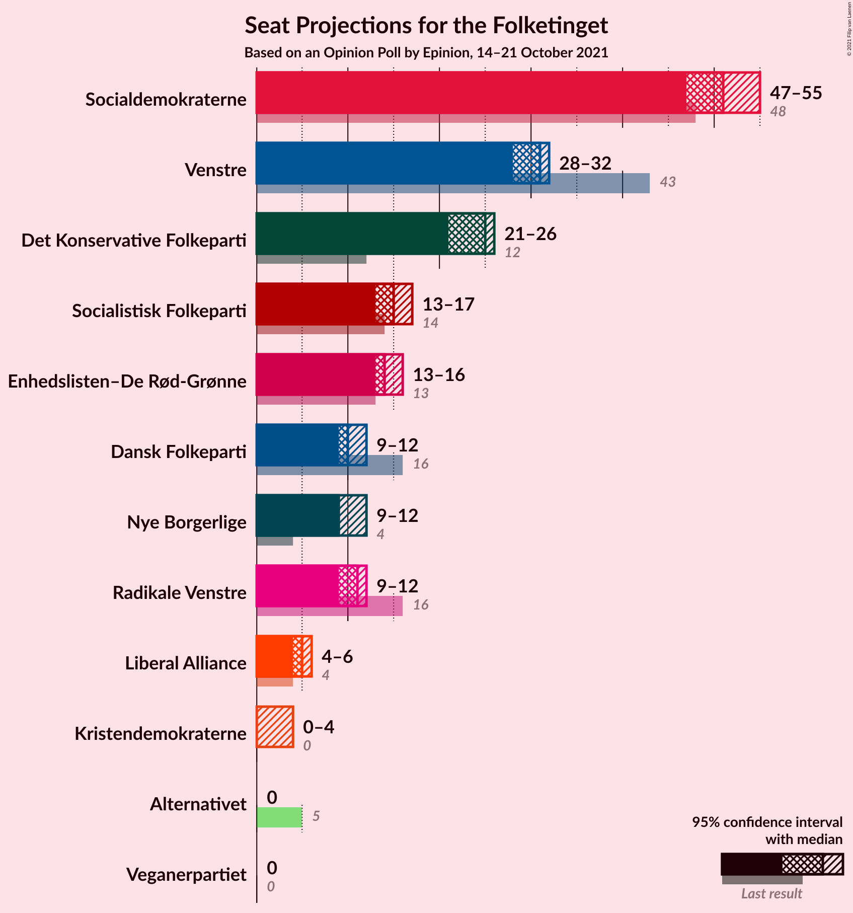
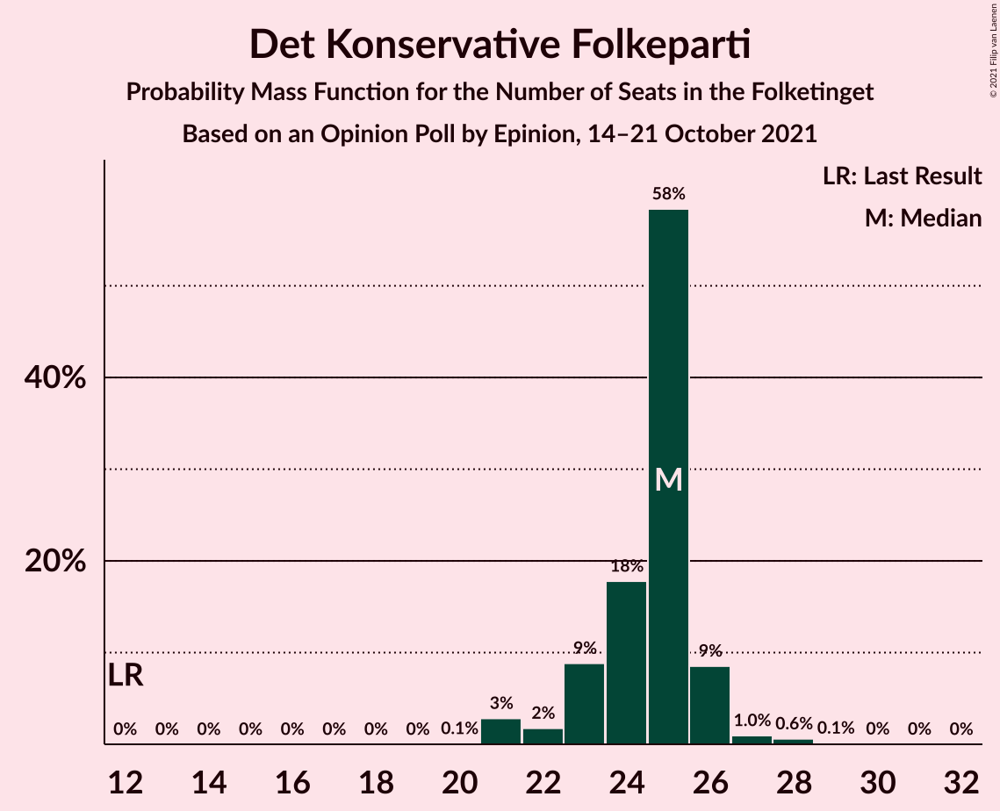
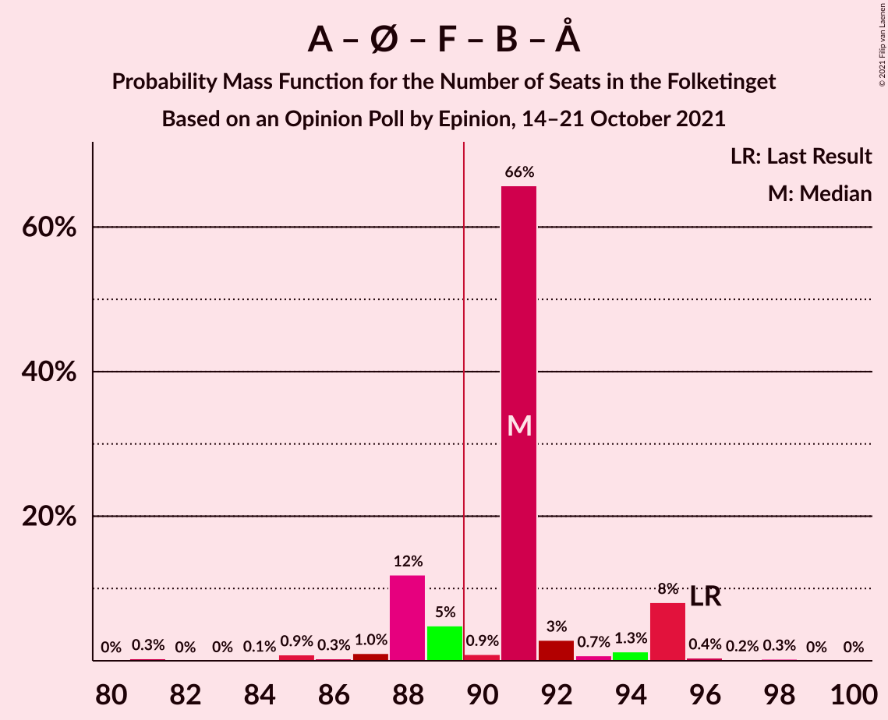
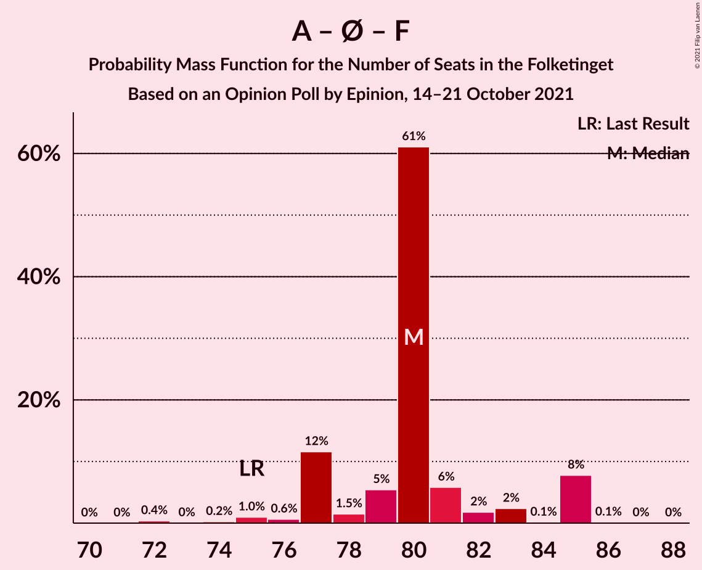

# Opinion Poll by Epinion, 14–21 October 2021

<a href="#voting-intentions">Voting Intentions</a> | <a href="#seats">Seats</a> | <a href="#coalitions">Coalitions</a> | <a href="#technical-information">Technical Information</a>

## Voting Intentions

### Confidence Intervals

| Party | Last Result | Poll Result | 80% Confidence Interval | 90% Confidence Interval | 95% Confidence Interval | 99% Confidence Interval |
|:-----:|:-----------:|:-----------:|:-----------------------:|:-----------------------:|:-----------------------:|:-----------------------:|
| Socialdemokraterne | 25.9% | 28.0% | 26.6–29.5% |26.2–29.9% |25.9–30.3% |25.2–31.0% |
| Venstre | 23.4% | 15.9% | 14.8–17.1% |14.5–17.5% |14.2–17.8% |13.7–18.4% |
| Det Konservative Folkeparti | 6.6% | 13.5% | 12.5–14.7% |12.2–15.0% |11.9–15.3% |11.5–15.8% |
| Enhedslisten–De Rød-Grønne | 6.9% | 8.0% | 7.2–8.9% |7.0–9.2% |6.8–9.4% |6.4–9.9% |
| Socialistisk Folkeparti | 7.7% | 8.0% | 7.2–8.9% |7.0–9.2% |6.8–9.4% |6.4–9.9% |
| Radikale Venstre | 8.6% | 6.0% | 5.3–6.8% |5.1–7.1% |4.9–7.3% |4.6–7.7% |
| Dansk Folkeparti | 8.7% | 5.9% | 5.2–6.7% |5.0–6.9% |4.8–7.1% |4.5–7.5% |
| Nye Borgerlige | 2.4% | 5.8% | 5.1–6.6% |4.9–6.9% |4.8–7.1% |4.5–7.5% |
| Liberal Alliance | 2.3% | 2.9% | 2.4–3.5% |2.3–3.7% |2.2–3.8% |2.0–4.1% |
| Kristendemokraterne | 1.7% | 1.5% | 1.2–2.0% |1.1–2.1% |1.0–2.3% |0.9–2.5% |
| Alternativet | 3.0% | 1.4% | 1.1–1.9% |1.0–2.0% |0.9–2.1% |0.8–2.3% |
| Veganerpartiet | 0.0% | 0.7% | 0.5–1.0% |0.4–1.1% |0.4–1.2% |0.3–1.4% |

*Note:* The poll result column reflects the actual value used in the calculations. Published results may vary slightly, and in addition be rounded to fewer digits.

## Seats

### Confidence Intervals

| Party | Last Result | Median | 80% Confidence Interval | 90% Confidence Interval | 95% Confidence Interval | 99% Confidence Interval |
|:-----:|:-----------:|:------:|:-----------------------:|:-----------------------:|:-----------------------:|:-----------------------:|
| <a href="#socialdemokraterne">Socialdemokraterne</a> | 48 | 53 | 49–56 |47–56 |46–56 |46–56 |
| <a href="#venstre">Venstre</a> | 43 | 28 | 27–31 |27–31 |26–32 |25–32 |
| <a href="#det-konservative-folkeparti">Det Konservative Folkeparti</a> | 12 | 25 | 23–26 |22–28 |22–28 |22–28 |
| <a href="#enhedslisten–de-rød-grønne">Enhedslisten–De Rød-Grønne</a> | 13 | 15 | 12–17 |12–17 |12–18 |12–18 |
| <a href="#socialistisk-folkeparti">Socialistisk Folkeparti</a> | 14 | 14 | 12–15 |11–15 |11–16 |11–16 |
| <a href="#radikale-venstre">Radikale Venstre</a> | 16 | 10 | 10–12 |10–13 |9–13 |9–13 |
| <a href="#dansk-folkeparti">Dansk Folkeparti</a> | 16 | 11 | 9–13 |9–13 |9–13 |8–14 |
| <a href="#nye-borgerlige">Nye Borgerlige</a> | 4 | 10 | 9–11 |8–12 |8–12 |8–13 |
| <a href="#liberal-alliance">Liberal Alliance</a> | 4 | 5 | 5–6 |4–6 |4–6 |0–7 |
| <a href="#kristendemokraterne">Kristendemokraterne</a> | 0 | 0 | 0–4 |0–4 |0–4 |0–5 |
| <a href="#alternativet">Alternativet</a> | 5 | 0 | 0 |0 |0 |0–4 |
| <a href="#veganerpartiet">Veganerpartiet</a> | 0 | 0 | 0 |0 |0 |0 |

### Socialdemokraterne

*For a full overview of the results for this party, see the [Socialdemokraterne](party-socialdemokraterne.html) page.*

| Number of Seats | Probability | Accumulated | Special Marks |
|:---------------:|:-----------:|:-----------:|:-------------:|
| 45 | 0.1% | 100% |  |
| 46 | 5% | 99.9% |  |
| 47 | 0.4% | 95% |  |
| 48 | 4% | 95% | Last Result |
| 49 | 2% | 91% |  |
| 50 | 11% | 88% |  |
| 51 | 11% | 77% |  |
| 52 | 5% | 67% |  |
| 53 | 19% | 61% | Median |
| 54 | 0.2% | 42% |  |
| 55 | 9% | 42% |  |
| 56 | 33% | 33% |  |
| 57 | 0.1% | 0.1% |  |
| 58 | 0% | 0% |  |

### Venstre

*For a full overview of the results for this party, see the [Venstre](party-venstre.html) page.*

| Number of Seats | Probability | Accumulated | Special Marks |
|:---------------:|:-----------:|:-----------:|:-------------:|
| 24 | 0.2% | 100% |  |
| 25 | 1.3% | 99.8% |  |
| 26 | 1.3% | 98.5% |  |
| 27 | 11% | 97% |  |
| 28 | 51% | 86% | Median |
| 29 | 4% | 35% |  |
| 30 | 17% | 31% |  |
| 31 | 11% | 15% |  |
| 32 | 3% | 3% |  |
| 33 | 0.1% | 0.2% |  |
| 34 | 0.1% | 0.1% |  |
| 35 | 0% | 0% |  |
| 36 | 0% | 0% |  |
| 37 | 0% | 0% |  |
| 38 | 0% | 0% |  |
| 39 | 0% | 0% |  |
| 40 | 0% | 0% |  |
| 41 | 0% | 0% |  |
| 42 | 0% | 0% |  |
| 43 | 0% | 0% | Last Result |

### Det Konservative Folkeparti

*For a full overview of the results for this party, see the [Det Konservative Folkeparti](party-detkonservativefolkeparti.html) page.*

| Number of Seats | Probability | Accumulated | Special Marks |
|:---------------:|:-----------:|:-----------:|:-------------:|
| 12 | 0% | 100% | Last Result |
| 13 | 0% | 100% |  |
| 14 | 0% | 100% |  |
| 15 | 0% | 100% |  |
| 16 | 0% | 100% |  |
| 17 | 0% | 100% |  |
| 18 | 0% | 100% |  |
| 19 | 0% | 100% |  |
| 20 | 0.3% | 100% |  |
| 21 | 0.1% | 99.7% |  |
| 22 | 7% | 99.6% |  |
| 23 | 10% | 92% |  |
| 24 | 7% | 82% |  |
| 25 | 28% | 75% | Median |
| 26 | 39% | 47% |  |
| 27 | 3% | 8% |  |
| 28 | 5% | 5% |  |
| 29 | 0.3% | 0.4% |  |
| 30 | 0% | 0.1% |  |
| 31 | 0% | 0% |  |

### Enhedslisten–De Rød-Grønne

*For a full overview of the results for this party, see the [Enhedslisten–De Rød-Grønne](party-enhedslisten–derød-grønne.html) page.*

| Number of Seats | Probability | Accumulated | Special Marks |
|:---------------:|:-----------:|:-----------:|:-------------:|
| 11 | 0.2% | 100% |  |
| 12 | 12% | 99.8% |  |
| 13 | 6% | 88% | Last Result |
| 14 | 12% | 82% |  |
| 15 | 51% | 70% | Median |
| 16 | 9% | 19% |  |
| 17 | 6% | 10% |  |
| 18 | 4% | 4% |  |
| 19 | 0% | 0% |  |

### Socialistisk Folkeparti

*For a full overview of the results for this party, see the [Socialistisk Folkeparti](party-socialistiskfolkeparti.html) page.*

| Number of Seats | Probability | Accumulated | Special Marks |
|:---------------:|:-----------:|:-----------:|:-------------:|
| 11 | 7% | 100% |  |
| 12 | 9% | 93% |  |
| 13 | 11% | 84% |  |
| 14 | 55% | 73% | Last Result, Median |
| 15 | 14% | 17% |  |
| 16 | 3% | 4% |  |
| 17 | 0.4% | 0.5% |  |
| 18 | 0% | 0% |  |

### Radikale Venstre

*For a full overview of the results for this party, see the [Radikale Venstre](party-radikalevenstre.html) page.*

| Number of Seats | Probability | Accumulated | Special Marks |
|:---------------:|:-----------:|:-----------:|:-------------:|
| 8 | 0.2% | 100% |  |
| 9 | 5% | 99.8% |  |
| 10 | 65% | 95% | Median |
| 11 | 13% | 30% |  |
| 12 | 12% | 18% |  |
| 13 | 6% | 6% |  |
| 14 | 0.1% | 0.1% |  |
| 15 | 0% | 0% |  |
| 16 | 0% | 0% | Last Result |

### Dansk Folkeparti

*For a full overview of the results for this party, see the [Dansk Folkeparti](party-danskfolkeparti.html) page.*

| Number of Seats | Probability | Accumulated | Special Marks |
|:---------------:|:-----------:|:-----------:|:-------------:|
| 8 | 0.7% | 100% |  |
| 9 | 17% | 99.3% |  |
| 10 | 16% | 83% |  |
| 11 | 38% | 66% | Median |
| 12 | 15% | 28% |  |
| 13 | 12% | 13% |  |
| 14 | 0.9% | 1.0% |  |
| 15 | 0% | 0% |  |
| 16 | 0% | 0% | Last Result |

### Nye Borgerlige

*For a full overview of the results for this party, see the [Nye Borgerlige](party-nyeborgerlige.html) page.*

| Number of Seats | Probability | Accumulated | Special Marks |
|:---------------:|:-----------:|:-----------:|:-------------:|
| 4 | 0% | 100% | Last Result |
| 5 | 0% | 100% |  |
| 6 | 0% | 100% |  |
| 7 | 0.1% | 100% |  |
| 8 | 6% | 99.9% |  |
| 9 | 10% | 94% |  |
| 10 | 53% | 84% | Median |
| 11 | 26% | 31% |  |
| 12 | 4% | 6% |  |
| 13 | 0.8% | 1.1% |  |
| 14 | 0.1% | 0.3% |  |
| 15 | 0.2% | 0.2% |  |
| 16 | 0% | 0% |  |

### Liberal Alliance

*For a full overview of the results for this party, see the [Liberal Alliance](party-liberalalliance.html) page.*

| Number of Seats | Probability | Accumulated | Special Marks |
|:---------------:|:-----------:|:-----------:|:-------------:|
| 0 | 2% | 100% |  |
| 1 | 0% | 98% |  |
| 2 | 0% | 98% |  |
| 3 | 0% | 98% |  |
| 4 | 5% | 98% | Last Result |
| 5 | 69% | 94% | Median |
| 6 | 24% | 25% |  |
| 7 | 1.1% | 1.1% |  |
| 8 | 0% | 0% |  |

### Kristendemokraterne

*For a full overview of the results for this party, see the [Kristendemokraterne](party-kristendemokraterne.html) page.*

| Number of Seats | Probability | Accumulated | Special Marks |
|:---------------:|:-----------:|:-----------:|:-------------:|
| 0 | 84% | 100% | Last Result, Median |
| 1 | 0% | 16% |  |
| 2 | 0% | 16% |  |
| 3 | 0% | 16% |  |
| 4 | 15% | 16% |  |
| 5 | 0.5% | 0.5% |  |
| 6 | 0% | 0% |  |

### Alternativet

*For a full overview of the results for this party, see the [Alternativet](party-alternativet.html) page.*

| Number of Seats | Probability | Accumulated | Special Marks |
|:---------------:|:-----------:|:-----------:|:-------------:|
| 0 | 99.2% | 100% | Median |
| 1 | 0% | 0.8% |  |
| 2 | 0% | 0.8% |  |
| 3 | 0% | 0.8% |  |
| 4 | 0.7% | 0.8% |  |
| 5 | 0.1% | 0.1% | Last Result |
| 6 | 0% | 0% |  |

### Veganerpartiet

*For a full overview of the results for this party, see the [Veganerpartiet](party-veganerpartiet.html) page.*

| Number of Seats | Probability | Accumulated | Special Marks |
|:---------------:|:-----------:|:-----------:|:-------------:|
| 0 | 100% | 100% | Last Result, Median |

## Coalitions

### Confidence Intervals

| Coalition | Last Result | Median | Majority? | 80% Confidence Interval | 90% Confidence Interval | 95% Confidence Interval | 99% Confidence Interval |
|:---------:|:-----------:|:------:|:---------:|:-----------------------:|:-----------------------:|:-----------------------:|:-----------------------:|
| Socialdemokraterne – Enhedslisten–De Rød-Grønne – Socialistisk Folkeparti – Radikale Venstre – Alternativet | 96 | 91 | 75% | 87–95 | 87–95 | 87–96 | 85–96 |
| Socialdemokraterne – Enhedslisten–De Rød-Grønne – Socialistisk Folkeparti – Radikale Venstre | 91 | 91 | 75% | 87–95 | 87–95 | 87–96 | 85–96 |
| Socialdemokraterne – Enhedslisten–De Rød-Grønne – Socialistisk Folkeparti – Alternativet | 80 | 81 | 0% | 78–85 | 76–85 | 76–85 | 74–85 |
| Socialdemokraterne – Enhedslisten–De Rød-Grønne – Socialistisk Folkeparti | 75 | 81 | 0% | 78–85 | 76–85 | 76–85 | 74–85 |
| Venstre – Det Konservative Folkeparti – Dansk Folkeparti – Nye Borgerlige – Liberal Alliance – Kristendemokraterne | 79 | 80 | 0% | 79–84 | 78–84 | 76–84 | 76–85 |
| Venstre – Det Konservative Folkeparti – Dansk Folkeparti – Nye Borgerlige – Liberal Alliance | 79 | 80 | 0% | 76–84 | 76–84 | 76–84 | 76–84 |
| Socialdemokraterne – Socialistisk Folkeparti – Radikale Venstre | 78 | 77 | 0% | 74–80 | 71–80 | 70–80 | 70–81 |
| Venstre – Det Konservative Folkeparti – Dansk Folkeparti – Liberal Alliance – Kristendemokraterne | 75 | 70 | 0% | 68–73 | 68–73 | 67–74 | 66–74 |
| Venstre – Det Konservative Folkeparti – Dansk Folkeparti – Liberal Alliance | 75 | 70 | 0% | 67–73 | 67–73 | 67–73 | 66–73 |
| Socialdemokraterne – Radikale Venstre | 64 | 64 | 0% | 60–66 | 57–66 | 57–66 | 57–66 |
| Venstre – Det Konservative Folkeparti – Liberal Alliance | 59 | 59 | 0% | 57–61 | 56–61 | 56–61 | 55–62 |
| Venstre – Det Konservative Folkeparti | 55 | 54 | 0% | 51–56 | 51–56 | 50–56 | 50–57 |
| Venstre | 43 | 28 | 0% | 27–31 | 27–31 | 26–32 | 25–32 |

### Socialdemokraterne – Enhedslisten–De Rød-Grønne – Socialistisk Folkeparti – Radikale Venstre – Alternativet

| Number of Seats | Probability | Accumulated | Special Marks |
|:---------------:|:-----------:|:-----------:|:-------------:|
| 85 | 0.8% | 100% |  |
| 86 | 0.7% | 99.1% |  |
| 87 | 9% | 98% |  |
| 88 | 0.3% | 89% |  |
| 89 | 14% | 89% |  |
| 90 | 8% | 75% | Majority |
| 91 | 24% | 67% |  |
| 92 | 2% | 44% | Median |
| 93 | 2% | 42% |  |
| 94 | 0.5% | 40% |  |
| 95 | 35% | 40% |  |
| 96 | 4% | 4% | Last Result |
| 97 | 0% | 0.1% |  |
| 98 | 0% | 0.1% |  |
| 99 | 0% | 0% |  |

### Socialdemokraterne – Enhedslisten–De Rød-Grønne – Socialistisk Folkeparti – Radikale Venstre

| Number of Seats | Probability | Accumulated | Special Marks |
|:---------------:|:-----------:|:-----------:|:-------------:|
| 82 | 0.3% | 100% |  |
| 83 | 0% | 99.7% |  |
| 84 | 0.1% | 99.7% |  |
| 85 | 0.8% | 99.6% |  |
| 86 | 0.5% | 98.8% |  |
| 87 | 9% | 98% |  |
| 88 | 0.3% | 89% |  |
| 89 | 14% | 89% |  |
| 90 | 8% | 75% | Majority |
| 91 | 24% | 67% | Last Result |
| 92 | 2% | 43% | Median |
| 93 | 1.3% | 41% |  |
| 94 | 0.4% | 40% |  |
| 95 | 35% | 39% |  |
| 96 | 4% | 4% |  |
| 97 | 0% | 0.1% |  |
| 98 | 0% | 0.1% |  |
| 99 | 0% | 0% |  |

### Socialdemokraterne – Enhedslisten–De Rød-Grønne – Socialistisk Folkeparti – Alternativet

| Number of Seats | Probability | Accumulated | Special Marks |
|:---------------:|:-----------:|:-----------:|:-------------:|
| 74 | 0.5% | 100% |  |
| 75 | 0.5% | 99.5% |  |
| 76 | 6% | 98.9% |  |
| 77 | 0.8% | 93% |  |
| 78 | 7% | 92% |  |
| 79 | 21% | 85% |  |
| 80 | 7% | 64% | Last Result |
| 81 | 14% | 57% |  |
| 82 | 4% | 43% | Median |
| 83 | 6% | 39% |  |
| 84 | 0.4% | 33% |  |
| 85 | 33% | 33% |  |
| 86 | 0% | 0.1% |  |
| 87 | 0% | 0% |  |

### Socialdemokraterne – Enhedslisten–De Rød-Grønne – Socialistisk Folkeparti

| Number of Seats | Probability | Accumulated | Special Marks |
|:---------------:|:-----------:|:-----------:|:-------------:|
| 72 | 0.3% | 100% |  |
| 73 | 0% | 99.7% |  |
| 74 | 0.5% | 99.7% |  |
| 75 | 0.6% | 99.2% | Last Result |
| 76 | 6% | 98.6% |  |
| 77 | 0.8% | 93% |  |
| 78 | 8% | 92% |  |
| 79 | 21% | 85% |  |
| 80 | 6% | 63% |  |
| 81 | 14% | 57% |  |
| 82 | 4% | 43% | Median |
| 83 | 6% | 39% |  |
| 84 | 0.2% | 33% |  |
| 85 | 33% | 33% |  |
| 86 | 0% | 0.1% |  |
| 87 | 0% | 0% |  |

### Venstre – Det Konservative Folkeparti – Dansk Folkeparti – Nye Borgerlige – Liberal Alliance – Kristendemokraterne

| Number of Seats | Probability | Accumulated | Special Marks |
|:---------------:|:-----------:|:-----------:|:-------------:|
| 74 | 0% | 100% |  |
| 75 | 0.3% | 99.9% |  |
| 76 | 2% | 99.6% |  |
| 77 | 0.7% | 97% |  |
| 78 | 2% | 96% |  |
| 79 | 11% | 95% | Last Result, Median |
| 80 | 52% | 84% |  |
| 81 | 13% | 32% |  |
| 82 | 2% | 19% |  |
| 83 | 1.1% | 17% |  |
| 84 | 15% | 16% |  |
| 85 | 0.5% | 0.9% |  |
| 86 | 0.3% | 0.4% |  |
| 87 | 0% | 0.1% |  |
| 88 | 0.1% | 0.1% |  |
| 89 | 0% | 0% |  |

### Venstre – Det Konservative Folkeparti – Dansk Folkeparti – Nye Borgerlige – Liberal Alliance

| Number of Seats | Probability | Accumulated | Special Marks |
|:---------------:|:-----------:|:-----------:|:-------------:|
| 74 | 0% | 100% |  |
| 75 | 0.4% | 99.9% |  |
| 76 | 12% | 99.5% |  |
| 77 | 0.9% | 88% |  |
| 78 | 2% | 87% |  |
| 79 | 11% | 84% | Last Result, Median |
| 80 | 48% | 74% |  |
| 81 | 12% | 26% |  |
| 82 | 2% | 14% |  |
| 83 | 0.9% | 12% |  |
| 84 | 11% | 11% |  |
| 85 | 0.1% | 0.5% |  |
| 86 | 0.3% | 0.3% |  |
| 87 | 0% | 0% |  |

### Socialdemokraterne – Socialistisk Folkeparti – Radikale Venstre

| Number of Seats | Probability | Accumulated | Special Marks |
|:---------------:|:-----------:|:-----------:|:-------------:|
| 69 | 0.3% | 100% |  |
| 70 | 5% | 99.7% |  |
| 71 | 0.6% | 95% |  |
| 72 | 0.9% | 95% |  |
| 73 | 0.8% | 94% |  |
| 74 | 6% | 93% |  |
| 75 | 13% | 87% |  |
| 76 | 12% | 74% |  |
| 77 | 21% | 61% | Median |
| 78 | 4% | 40% | Last Result |
| 79 | 2% | 36% |  |
| 80 | 33% | 34% |  |
| 81 | 1.0% | 1.2% |  |
| 82 | 0.1% | 0.2% |  |
| 83 | 0% | 0.1% |  |
| 84 | 0% | 0% |  |

### Venstre – Det Konservative Folkeparti – Dansk Folkeparti – Liberal Alliance – Kristendemokraterne

| Number of Seats | Probability | Accumulated | Special Marks |
|:---------------:|:-----------:|:-----------:|:-------------:|
| 64 | 0% | 100% |  |
| 65 | 0.2% | 99.9% |  |
| 66 | 0.3% | 99.7% |  |
| 67 | 3% | 99.4% |  |
| 68 | 7% | 96% |  |
| 69 | 5% | 90% | Median |
| 70 | 53% | 84% |  |
| 71 | 11% | 31% |  |
| 72 | 4% | 20% |  |
| 73 | 11% | 16% |  |
| 74 | 5% | 5% |  |
| 75 | 0% | 0.2% | Last Result |
| 76 | 0.1% | 0.2% |  |
| 77 | 0% | 0.1% |  |
| 78 | 0.1% | 0.1% |  |
| 79 | 0% | 0% |  |

### Venstre – Det Konservative Folkeparti – Dansk Folkeparti – Liberal Alliance

| Number of Seats | Probability | Accumulated | Special Marks |
|:---------------:|:-----------:|:-----------:|:-------------:|
| 63 | 0% | 100% |  |
| 64 | 0.1% | 99.9% |  |
| 65 | 0.2% | 99.9% |  |
| 66 | 0.4% | 99.7% |  |
| 67 | 10% | 99.3% |  |
| 68 | 10% | 89% |  |
| 69 | 5% | 79% | Median |
| 70 | 58% | 74% |  |
| 71 | 4% | 16% |  |
| 72 | 0.5% | 12% |  |
| 73 | 11% | 11% |  |
| 74 | 0.1% | 0.1% |  |
| 75 | 0% | 0% | Last Result |

### Socialdemokraterne – Radikale Venstre

| Number of Seats | Probability | Accumulated | Special Marks |
|:---------------:|:-----------:|:-----------:|:-------------:|
| 55 | 0.1% | 100% |  |
| 56 | 0.1% | 99.8% |  |
| 57 | 5% | 99.8% |  |
| 58 | 0.5% | 95% |  |
| 59 | 1.2% | 94% |  |
| 60 | 11% | 93% |  |
| 61 | 12% | 82% |  |
| 62 | 3% | 70% |  |
| 63 | 13% | 68% | Median |
| 64 | 5% | 54% | Last Result |
| 65 | 16% | 49% |  |
| 66 | 33% | 33% |  |
| 67 | 0.1% | 0.2% |  |
| 68 | 0.1% | 0.1% |  |
| 69 | 0% | 0% |  |

### Venstre – Det Konservative Folkeparti – Liberal Alliance

| Number of Seats | Probability | Accumulated | Special Marks |
|:---------------:|:-----------:|:-----------:|:-------------:|
| 53 | 0.1% | 100% |  |
| 54 | 0.4% | 99.9% |  |
| 55 | 0.9% | 99.6% |  |
| 56 | 5% | 98.7% |  |
| 57 | 13% | 94% |  |
| 58 | 11% | 81% | Median |
| 59 | 38% | 70% | Last Result |
| 60 | 19% | 32% |  |
| 61 | 12% | 12% |  |
| 62 | 0.5% | 0.9% |  |
| 63 | 0.4% | 0.4% |  |
| 64 | 0% | 0% |  |

### Venstre – Det Konservative Folkeparti

| Number of Seats | Probability | Accumulated | Special Marks |
|:---------------:|:-----------:|:-----------:|:-------------:|
| 48 | 0.1% | 100% |  |
| 49 | 0.1% | 99.9% |  |
| 50 | 4% | 99.8% |  |
| 51 | 8% | 96% |  |
| 52 | 13% | 88% |  |
| 53 | 4% | 75% | Median |
| 54 | 38% | 71% |  |
| 55 | 23% | 33% | Last Result |
| 56 | 9% | 10% |  |
| 57 | 0.8% | 1.2% |  |
| 58 | 0% | 0.4% |  |
| 59 | 0.3% | 0.4% |  |
| 60 | 0% | 0% |  |

### Venstre

| Number of Seats | Probability | Accumulated | Special Marks |
|:---------------:|:-----------:|:-----------:|:-------------:|
| 24 | 0.2% | 100% |  |
| 25 | 1.3% | 99.8% |  |
| 26 | 1.3% | 98.5% |  |
| 27 | 11% | 97% |  |
| 28 | 51% | 86% | Median |
| 29 | 4% | 35% |  |
| 30 | 17% | 31% |  |
| 31 | 11% | 15% |  |
| 32 | 3% | 3% |  |
| 33 | 0.1% | 0.2% |  |
| 34 | 0.1% | 0.1% |  |
| 35 | 0% | 0% |  |
| 36 | 0% | 0% |  |
| 37 | 0% | 0% |  |
| 38 | 0% | 0% |  |
| 39 | 0% | 0% |  |
| 40 | 0% | 0% |  |
| 41 | 0% | 0% |  |
| 42 | 0% | 0% |  |
| 43 | 0% | 0% | Last Result |

## Technical Information

### Opinion Poll

+ **Polling firm:** Epinion
+ **Commissioner(s):** —
+ **Fieldwork period:** 14–21 October 2021

### Calculations

+ **Sample size:** 1634
+ **Simulations done:** 131,072
+ **Error estimate:** 1.71%

