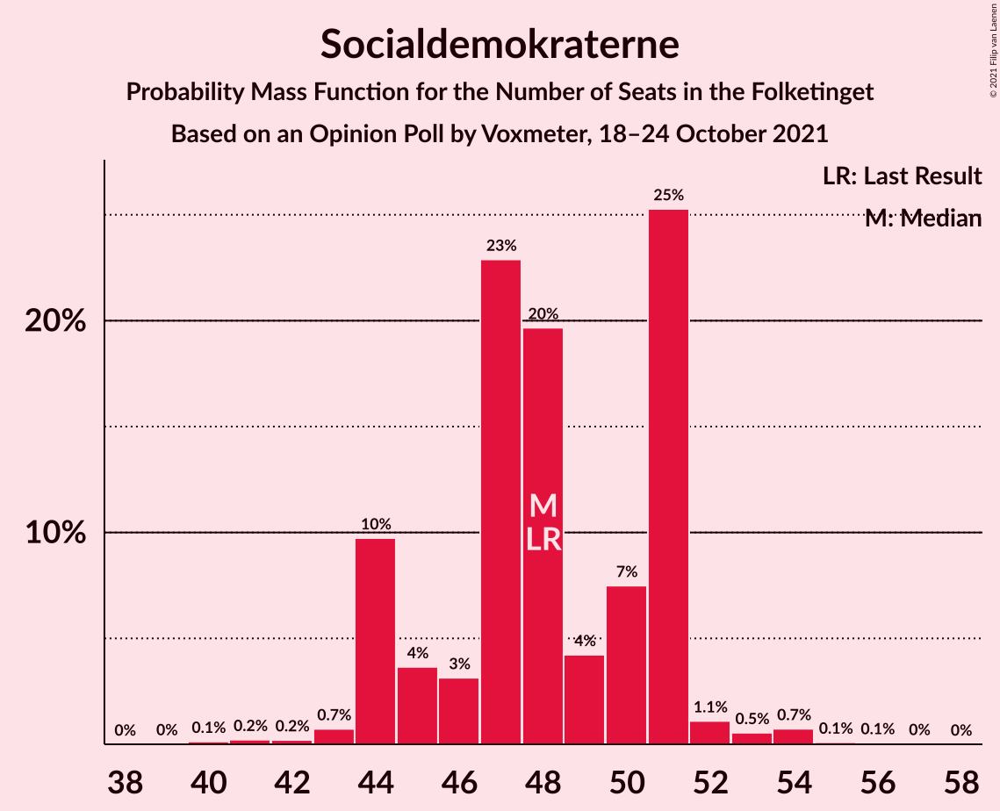
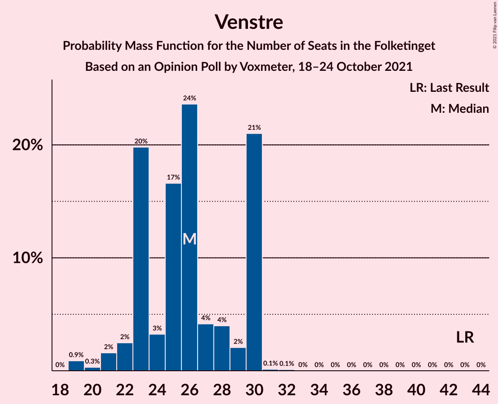
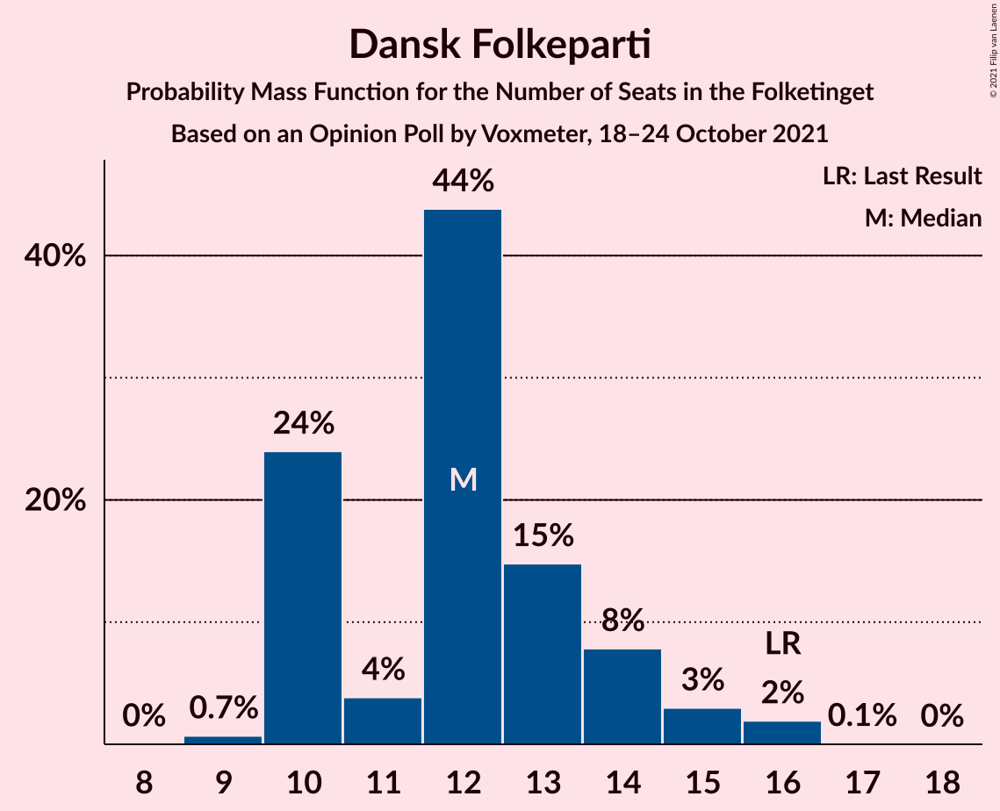
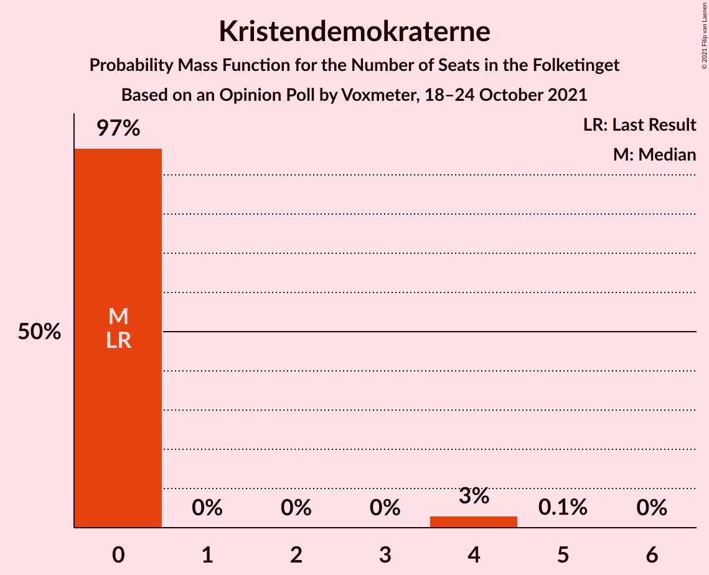
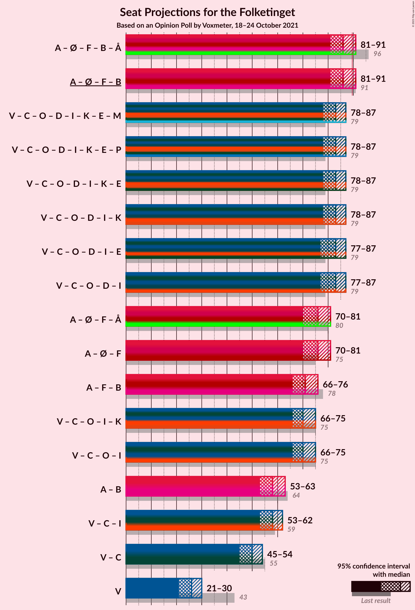
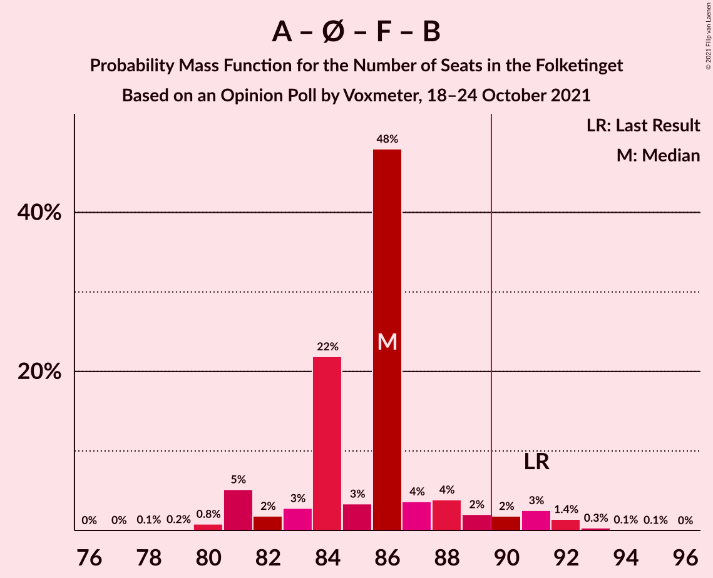
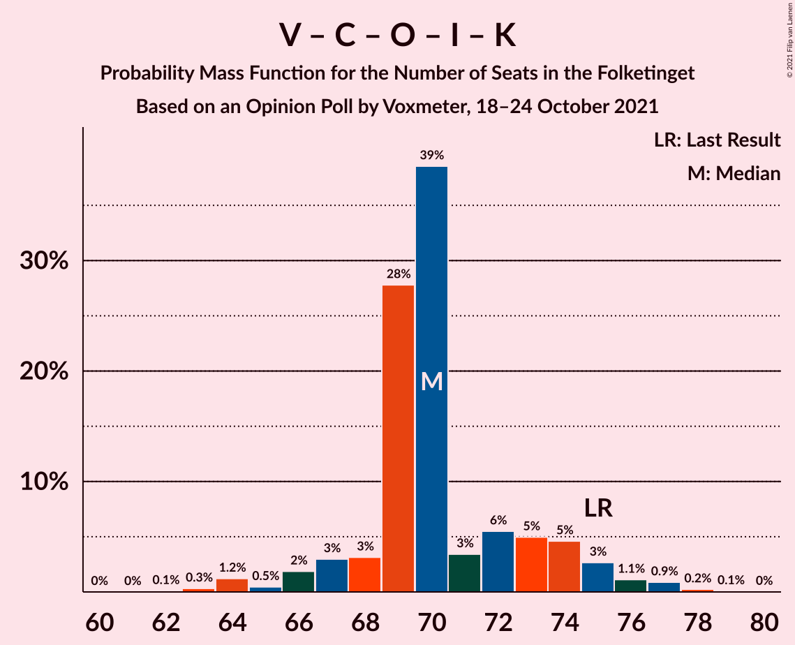

# Opinion Poll by Voxmeter, 18–24 October 2021

<a href="#voting-intentions">Voting Intentions</a> | <a href="#seats">Seats</a> | <a href="#coalitions">Coalitions</a> | <a href="#technical-information">Technical Information</a>

## Voting Intentions

### Confidence Intervals

| Party | Last Result | Poll Result | 80% Confidence Interval | 90% Confidence Interval | 95% Confidence Interval | 99% Confidence Interval |
|:-----:|:-----------:|:-----------:|:-----------------------:|:-----------------------:|:-----------------------:|:-----------------------:|
| Socialdemokraterne | 25.9% | 27.1% | 25.4–29.0% |24.9–29.5% |24.4–30.0% |23.6–30.9% |
| Venstre | 23.4% | 14.3% | 12.9–15.8% |12.5–16.2% |12.2–16.6% |11.6–17.3% |
| Det Konservative Folkeparti | 6.6% | 13.9% | 12.5–15.3% |12.2–15.8% |11.9–16.1% |11.2–16.9% |
| Enhedslisten–De Rød-Grønne | 6.9% | 8.1% | 7.1–9.3% |6.8–9.6% |6.5–9.9% |6.1–10.5% |
| Socialistisk Folkeparti | 7.7% | 7.8% | 6.8–9.0% |6.5–9.3% |6.3–9.6% |5.8–10.2% |
| Dansk Folkeparti | 8.7% | 6.9% | 5.9–8.0% |5.7–8.3% |5.5–8.6% |5.1–9.2% |
| Nye Borgerlige | 2.4% | 6.6% | 5.7–7.7% |5.4–8.0% |5.2–8.3% |4.8–8.9% |
| Radikale Venstre | 8.6% | 5.3% | 4.5–6.3% |4.3–6.6% |4.1–6.9% |3.7–7.4% |
| Liberal Alliance | 2.3% | 4.2% | 3.5–5.1% |3.3–5.4% |3.1–5.6% |2.8–6.1% |
| Kristendemokraterne | 1.7% | 1.2% | 0.9–1.8% |0.8–1.9% |0.7–2.1% |0.5–2.4% |
| Alternativet | 3.0% | 0.6% | 0.4–1.1% |0.3–1.2% |0.3–1.3% |0.2–1.6% |
| Veganerpartiet | 0.0% | 0.4% | 0.2–0.8% |0.2–0.9% |0.2–1.0% |0.1–1.2% |

*Note:* The poll result column reflects the actual value used in the calculations. Published results may vary slightly, and in addition be rounded to fewer digits.

## Seats

### Confidence Intervals

| Party | Last Result | Median | 80% Confidence Interval | 90% Confidence Interval | 95% Confidence Interval | 99% Confidence Interval |
|:-----:|:-----------:|:------:|:-----------------------:|:-----------------------:|:-----------------------:|:-----------------------:|
| <a href="#socialdemokraterne">Socialdemokraterne</a> | 48 | 48 | 44–51 |44–51 |44–52 |42–54 |
| <a href="#venstre">Venstre</a> | 43 | 26 | 23–30 |22–30 |21–30 |19–30 |
| <a href="#det-konservative-folkeparti">Det Konservative Folkeparti</a> | 12 | 24 | 22–27 |22–27 |21–28 |20–29 |
| <a href="#enhedslisten–de-rød-grønne">Enhedslisten–De Rød-Grønne</a> | 13 | 13 | 13–16 |12–17 |12–18 |11–18 |
| <a href="#socialistisk-folkeparti">Socialistisk Folkeparti</a> | 14 | 13 | 12–15 |11–16 |11–17 |10–18 |
| <a href="#dansk-folkeparti">Dansk Folkeparti</a> | 16 | 12 | 10–14 |10–14 |10–15 |9–16 |
| <a href="#nye-borgerlige">Nye Borgerlige</a> | 4 | 13 | 11–14 |10–14 |9–14 |9–16 |
| <a href="#radikale-venstre">Radikale Venstre</a> | 16 | 10 | 8–11 |8–12 |8–12 |7–13 |
| <a href="#liberal-alliance">Liberal Alliance</a> | 4 | 8 | 7–9 |6–10 |6–10 |5–11 |
| <a href="#kristendemokraterne">Kristendemokraterne</a> | 0 | 0 | 0 |0 |0–4 |0–4 |
| <a href="#alternativet">Alternativet</a> | 5 | 0 | 0 |0 |0 |0 |
| <a href="#veganerpartiet">Veganerpartiet</a> | 0 | 0 | 0 |0 |0 |0 |

### Socialdemokraterne

*For a full overview of the results for this party, see the [Socialdemokraterne](party-socialdemokraterne.html) page.*

| Number of Seats | Probability | Accumulated | Special Marks |
|:---------------:|:-----------:|:-----------:|:-------------:|
| 40 | 0.1% | 100% |  |
| 41 | 0.2% | 99.8% |  |
| 42 | 0.2% | 99.6% |  |
| 43 | 0.7% | 99.4% |  |
| 44 | 10% | 98.7% |  |
| 45 | 4% | 89% |  |
| 46 | 3% | 85% |  |
| 47 | 23% | 82% |  |
| 48 | 20% | 59% | Last Result, Median |
| 49 | 4% | 40% |  |
| 50 | 7% | 35% |  |
| 51 | 25% | 28% |  |
| 52 | 1.1% | 3% |  |
| 53 | 0.5% | 1.5% |  |
| 54 | 0.7% | 0.9% |  |
| 55 | 0.1% | 0.2% |  |
| 56 | 0.1% | 0.1% |  |
| 57 | 0% | 0% |  |

### Venstre

*For a full overview of the results for this party, see the [Venstre](party-venstre.html) page.*

| Number of Seats | Probability | Accumulated | Special Marks |
|:---------------:|:-----------:|:-----------:|:-------------:|
| 19 | 0.9% | 100% |  |
| 20 | 0.3% | 99.1% |  |
| 21 | 2% | 98.8% |  |
| 22 | 2% | 97% |  |
| 23 | 20% | 95% |  |
| 24 | 3% | 75% |  |
| 25 | 17% | 72% |  |
| 26 | 24% | 55% | Median |
| 27 | 4% | 31% |  |
| 28 | 4% | 27% |  |
| 29 | 2% | 23% |  |
| 30 | 21% | 21% |  |
| 31 | 0.1% | 0.3% |  |
| 32 | 0.1% | 0.1% |  |
| 33 | 0% | 0% |  |
| 34 | 0% | 0% |  |
| 35 | 0% | 0% |  |
| 36 | 0% | 0% |  |
| 37 | 0% | 0% |  |
| 38 | 0% | 0% |  |
| 39 | 0% | 0% |  |
| 40 | 0% | 0% |  |
| 41 | 0% | 0% |  |
| 42 | 0% | 0% |  |
| 43 | 0% | 0% | Last Result |

### Det Konservative Folkeparti

*For a full overview of the results for this party, see the [Det Konservative Folkeparti](party-detkonservativefolkeparti.html) page.*

| Number of Seats | Probability | Accumulated | Special Marks |
|:---------------:|:-----------:|:-----------:|:-------------:|
| 12 | 0% | 100% | Last Result |
| 13 | 0% | 100% |  |
| 14 | 0% | 100% |  |
| 15 | 0% | 100% |  |
| 16 | 0% | 100% |  |
| 17 | 0% | 100% |  |
| 18 | 0% | 100% |  |
| 19 | 0.1% | 100% |  |
| 20 | 0.7% | 99.9% |  |
| 21 | 3% | 99.2% |  |
| 22 | 18% | 96% |  |
| 23 | 24% | 78% |  |
| 24 | 8% | 54% | Median |
| 25 | 15% | 45% |  |
| 26 | 6% | 30% |  |
| 27 | 21% | 24% |  |
| 28 | 1.4% | 3% |  |
| 29 | 2% | 2% |  |
| 30 | 0.1% | 0.2% |  |
| 31 | 0.1% | 0.1% |  |
| 32 | 0% | 0% |  |

### Enhedslisten–De Rød-Grønne

*For a full overview of the results for this party, see the [Enhedslisten–De Rød-Grønne](party-enhedslisten–derød-grønne.html) page.*

| Number of Seats | Probability | Accumulated | Special Marks |
|:---------------:|:-----------:|:-----------:|:-------------:|
| 10 | 0.2% | 100% |  |
| 11 | 0.4% | 99.8% |  |
| 12 | 5% | 99.4% |  |
| 13 | 45% | 94% | Last Result, Median |
| 14 | 6% | 49% |  |
| 15 | 11% | 43% |  |
| 16 | 26% | 32% |  |
| 17 | 3% | 6% |  |
| 18 | 3% | 3% |  |
| 19 | 0.2% | 0.2% |  |
| 20 | 0% | 0% |  |

### Socialistisk Folkeparti

*For a full overview of the results for this party, see the [Socialistisk Folkeparti](party-socialistiskfolkeparti.html) page.*

| Number of Seats | Probability | Accumulated | Special Marks |
|:---------------:|:-----------:|:-----------:|:-------------:|
| 10 | 0.5% | 100% |  |
| 11 | 5% | 99.5% |  |
| 12 | 27% | 94% |  |
| 13 | 25% | 67% | Median |
| 14 | 8% | 42% | Last Result |
| 15 | 25% | 34% |  |
| 16 | 6% | 9% |  |
| 17 | 2% | 3% |  |
| 18 | 0.7% | 0.9% |  |
| 19 | 0.2% | 0.2% |  |
| 20 | 0% | 0% |  |

### Dansk Folkeparti

*For a full overview of the results for this party, see the [Dansk Folkeparti](party-danskfolkeparti.html) page.*

| Number of Seats | Probability | Accumulated | Special Marks |
|:---------------:|:-----------:|:-----------:|:-------------:|
| 9 | 0.7% | 100% |  |
| 10 | 24% | 99.3% |  |
| 11 | 4% | 75% |  |
| 12 | 44% | 71% | Median |
| 13 | 15% | 28% |  |
| 14 | 8% | 13% |  |
| 15 | 3% | 5% |  |
| 16 | 2% | 2% | Last Result |
| 17 | 0.1% | 0.1% |  |
| 18 | 0% | 0% |  |

### Nye Borgerlige

*For a full overview of the results for this party, see the [Nye Borgerlige](party-nyeborgerlige.html) page.*

| Number of Seats | Probability | Accumulated | Special Marks |
|:---------------:|:-----------:|:-----------:|:-------------:|
| 4 | 0% | 100% | Last Result |
| 5 | 0% | 100% |  |
| 6 | 0% | 100% |  |
| 7 | 0.1% | 100% |  |
| 8 | 0.2% | 99.9% |  |
| 9 | 4% | 99.7% |  |
| 10 | 4% | 96% |  |
| 11 | 8% | 92% |  |
| 12 | 30% | 84% |  |
| 13 | 36% | 54% | Median |
| 14 | 17% | 18% |  |
| 15 | 0.7% | 1.4% |  |
| 16 | 0.7% | 0.8% |  |
| 17 | 0.1% | 0.1% |  |
| 18 | 0% | 0% |  |

### Radikale Venstre

*For a full overview of the results for this party, see the [Radikale Venstre](party-radikalevenstre.html) page.*

| Number of Seats | Probability | Accumulated | Special Marks |
|:---------------:|:-----------:|:-----------:|:-------------:|
| 6 | 0.4% | 100% |  |
| 7 | 1.1% | 99.6% |  |
| 8 | 27% | 98% |  |
| 9 | 8% | 71% |  |
| 10 | 47% | 63% | Median |
| 11 | 9% | 16% |  |
| 12 | 5% | 7% |  |
| 13 | 2% | 2% |  |
| 14 | 0% | 0.1% |  |
| 15 | 0% | 0% |  |
| 16 | 0% | 0% | Last Result |

### Liberal Alliance

*For a full overview of the results for this party, see the [Liberal Alliance](party-liberalalliance.html) page.*

| Number of Seats | Probability | Accumulated | Special Marks |
|:---------------:|:-----------:|:-----------:|:-------------:|
| 4 | 0.1% | 100% | Last Result |
| 5 | 1.2% | 99.9% |  |
| 6 | 4% | 98.7% |  |
| 7 | 41% | 94% |  |
| 8 | 25% | 53% | Median |
| 9 | 22% | 28% |  |
| 10 | 5% | 6% |  |
| 11 | 0.8% | 0.8% |  |
| 12 | 0% | 0% |  |

### Kristendemokraterne

*For a full overview of the results for this party, see the [Kristendemokraterne](party-kristendemokraterne.html) page.*

| Number of Seats | Probability | Accumulated | Special Marks |
|:---------------:|:-----------:|:-----------:|:-------------:|
| 0 | 97% | 100% | Last Result, Median |
| 1 | 0% | 3% |  |
| 2 | 0% | 3% |  |
| 3 | 0% | 3% |  |
| 4 | 3% | 3% |  |
| 5 | 0.1% | 0.1% |  |
| 6 | 0% | 0% |  |

### Alternativet

*For a full overview of the results for this party, see the [Alternativet](party-alternativet.html) page.*

| Number of Seats | Probability | Accumulated | Special Marks |
|:---------------:|:-----------:|:-----------:|:-------------:|
| 0 | 100% | 100% | Median |
| 1 | 0% | 0% |  |
| 2 | 0% | 0% |  |
| 3 | 0% | 0% |  |
| 4 | 0% | 0% |  |
| 5 | 0% | 0% | Last Result |

### Veganerpartiet

*For a full overview of the results for this party, see the [Veganerpartiet](party-veganerpartiet.html) page.*

| Number of Seats | Probability | Accumulated | Special Marks |
|:---------------:|:-----------:|:-----------:|:-------------:|
| 0 | 100% | 100% | Last Result, Median |

## Coalitions

### Confidence Intervals

| Coalition | Last Result | Median | Majority? | 80% Confidence Interval | 90% Confidence Interval | 95% Confidence Interval | 99% Confidence Interval |
|:---------:|:-----------:|:------:|:---------:|:-----------------------:|:-----------------------:|:-----------------------:|:-----------------------:|
| Socialdemokraterne – Enhedslisten–De Rød-Grønne – Socialistisk Folkeparti – Radikale Venstre – Alternativet | 96 | 86 | 6% | 83–88 | 81–90 | 81–91 | 80–93 |
| Socialdemokraterne – Enhedslisten–De Rød-Grønne – Socialistisk Folkeparti – Radikale Venstre | 91 | 86 | 6% | 83–88 | 81–90 | 81–91 | 80–93 |
| Venstre – Det Konservative Folkeparti – Dansk Folkeparti – Nye Borgerlige – Liberal Alliance – Kristendemokraterne | 79 | 83 | 0.2% | 80–85 | 79–86 | 78–87 | 76–89 |
| Venstre – Det Konservative Folkeparti – Dansk Folkeparti – Nye Borgerlige – Liberal Alliance | 79 | 83 | 0.2% | 80–85 | 79–86 | 77–87 | 76–89 |
| Socialdemokraterne – Enhedslisten–De Rød-Grønne – Socialistisk Folkeparti – Alternativet | 80 | 76 | 0% | 72–78 | 71–80 | 70–81 | 70–84 |
| Socialdemokraterne – Enhedslisten–De Rød-Grønne – Socialistisk Folkeparti | 75 | 76 | 0% | 72–78 | 71–80 | 70–81 | 70–84 |
| Socialdemokraterne – Socialistisk Folkeparti – Radikale Venstre | 78 | 71 | 0% | 69–74 | 66–76 | 66–76 | 65–79 |
| Venstre – Det Konservative Folkeparti – Dansk Folkeparti – Liberal Alliance – Kristendemokraterne | 75 | 70 | 0% | 68–73 | 67–75 | 66–75 | 64–77 |
| Venstre – Det Konservative Folkeparti – Dansk Folkeparti – Liberal Alliance | 75 | 70 | 0% | 68–73 | 67–74 | 66–75 | 64–77 |
| Socialdemokraterne – Radikale Venstre | 64 | 58 | 0% | 55–61 | 54–61 | 53–63 | 51–64 |
| Venstre – Det Konservative Folkeparti – Liberal Alliance | 59 | 58 | 0% | 55–60 | 54–61 | 53–62 | 52–64 |
| Venstre – Det Konservative Folkeparti | 55 | 50 | 0% | 48–53 | 47–53 | 45–54 | 45–57 |
| Venstre | 43 | 26 | 0% | 23–30 | 22–30 | 21–30 | 19–30 |

### Socialdemokraterne – Enhedslisten–De Rød-Grønne – Socialistisk Folkeparti – Radikale Venstre – Alternativet

| Number of Seats | Probability | Accumulated | Special Marks |
|:---------------:|:-----------:|:-----------:|:-------------:|
| 77 | 0% | 100% |  |
| 78 | 0.1% | 99.9% |  |
| 79 | 0.2% | 99.8% |  |
| 80 | 0.8% | 99.7% |  |
| 81 | 5% | 98.8% |  |
| 82 | 2% | 94% |  |
| 83 | 3% | 92% |  |
| 84 | 22% | 89% | Median |
| 85 | 3% | 67% |  |
| 86 | 48% | 64% |  |
| 87 | 4% | 16% |  |
| 88 | 4% | 12% |  |
| 89 | 2% | 8% |  |
| 90 | 2% | 6% | Majority |
| 91 | 3% | 4% |  |
| 92 | 1.4% | 2% |  |
| 93 | 0.3% | 0.5% |  |
| 94 | 0.1% | 0.2% |  |
| 95 | 0.1% | 0.1% |  |
| 96 | 0% | 0% | Last Result |

### Socialdemokraterne – Enhedslisten–De Rød-Grønne – Socialistisk Folkeparti – Radikale Venstre

| Number of Seats | Probability | Accumulated | Special Marks |
|:---------------:|:-----------:|:-----------:|:-------------:|
| 77 | 0% | 100% |  |
| 78 | 0.1% | 99.9% |  |
| 79 | 0.2% | 99.8% |  |
| 80 | 0.8% | 99.7% |  |
| 81 | 5% | 98.8% |  |
| 82 | 2% | 94% |  |
| 83 | 3% | 92% |  |
| 84 | 22% | 89% | Median |
| 85 | 3% | 67% |  |
| 86 | 48% | 64% |  |
| 87 | 4% | 16% |  |
| 88 | 4% | 12% |  |
| 89 | 2% | 8% |  |
| 90 | 2% | 6% | Majority |
| 91 | 3% | 4% | Last Result |
| 92 | 1.4% | 2% |  |
| 93 | 0.3% | 0.5% |  |
| 94 | 0.1% | 0.2% |  |
| 95 | 0.1% | 0.1% |  |
| 96 | 0% | 0% |  |

### Venstre – Det Konservative Folkeparti – Dansk Folkeparti – Nye Borgerlige – Liberal Alliance – Kristendemokraterne

| Number of Seats | Probability | Accumulated | Special Marks |
|:---------------:|:-----------:|:-----------:|:-------------:|
| 73 | 0.1% | 100% |  |
| 74 | 0% | 99.9% |  |
| 75 | 0.2% | 99.9% |  |
| 76 | 1.4% | 99.7% |  |
| 77 | 0.5% | 98% |  |
| 78 | 1.1% | 98% |  |
| 79 | 4% | 97% | Last Result |
| 80 | 7% | 93% |  |
| 81 | 3% | 87% |  |
| 82 | 27% | 84% |  |
| 83 | 38% | 57% | Median |
| 84 | 6% | 18% |  |
| 85 | 4% | 13% |  |
| 86 | 5% | 9% |  |
| 87 | 2% | 4% |  |
| 88 | 0.3% | 2% |  |
| 89 | 1.4% | 2% |  |
| 90 | 0.1% | 0.2% | Majority |
| 91 | 0.1% | 0.1% |  |
| 92 | 0% | 0% |  |

### Venstre – Det Konservative Folkeparti – Dansk Folkeparti – Nye Borgerlige – Liberal Alliance

| Number of Seats | Probability | Accumulated | Special Marks |
|:---------------:|:-----------:|:-----------:|:-------------:|
| 73 | 0.1% | 100% |  |
| 74 | 0% | 99.9% |  |
| 75 | 0.2% | 99.9% |  |
| 76 | 2% | 99.6% |  |
| 77 | 0.6% | 98% |  |
| 78 | 1.3% | 97% |  |
| 79 | 4% | 96% | Last Result |
| 80 | 6% | 92% |  |
| 81 | 3% | 85% |  |
| 82 | 27% | 82% |  |
| 83 | 38% | 55% | Median |
| 84 | 6% | 17% |  |
| 85 | 3% | 12% |  |
| 86 | 5% | 8% |  |
| 87 | 2% | 3% |  |
| 88 | 0.3% | 1.5% |  |
| 89 | 1.0% | 1.2% |  |
| 90 | 0.1% | 0.2% | Majority |
| 91 | 0% | 0.1% |  |
| 92 | 0% | 0% |  |

### Socialdemokraterne – Enhedslisten–De Rød-Grønne – Socialistisk Folkeparti – Alternativet

| Number of Seats | Probability | Accumulated | Special Marks |
|:---------------:|:-----------:|:-----------:|:-------------:|
| 68 | 0.1% | 100% |  |
| 69 | 0.3% | 99.9% |  |
| 70 | 4% | 99.6% |  |
| 71 | 0.6% | 96% |  |
| 72 | 5% | 95% |  |
| 73 | 2% | 90% |  |
| 74 | 18% | 87% | Median |
| 75 | 4% | 69% |  |
| 76 | 26% | 65% |  |
| 77 | 6% | 39% |  |
| 78 | 25% | 33% |  |
| 79 | 3% | 9% |  |
| 80 | 2% | 6% | Last Result |
| 81 | 2% | 4% |  |
| 82 | 2% | 2% |  |
| 83 | 0.1% | 0.7% |  |
| 84 | 0.3% | 0.5% |  |
| 85 | 0% | 0.2% |  |
| 86 | 0.1% | 0.2% |  |
| 87 | 0% | 0% |  |

### Socialdemokraterne – Enhedslisten–De Rød-Grønne – Socialistisk Folkeparti

| Number of Seats | Probability | Accumulated | Special Marks |
|:---------------:|:-----------:|:-----------:|:-------------:|
| 68 | 0.1% | 100% |  |
| 69 | 0.3% | 99.9% |  |
| 70 | 4% | 99.6% |  |
| 71 | 0.6% | 96% |  |
| 72 | 5% | 95% |  |
| 73 | 2% | 90% |  |
| 74 | 18% | 87% | Median |
| 75 | 4% | 69% | Last Result |
| 76 | 26% | 65% |  |
| 77 | 6% | 39% |  |
| 78 | 25% | 33% |  |
| 79 | 3% | 9% |  |
| 80 | 2% | 6% |  |
| 81 | 2% | 4% |  |
| 82 | 2% | 2% |  |
| 83 | 0.1% | 0.6% |  |
| 84 | 0.3% | 0.5% |  |
| 85 | 0% | 0.2% |  |
| 86 | 0.1% | 0.2% |  |
| 87 | 0% | 0% |  |

### Socialdemokraterne – Socialistisk Folkeparti – Radikale Venstre

| Number of Seats | Probability | Accumulated | Special Marks |
|:---------------:|:-----------:|:-----------:|:-------------:|
| 63 | 0.1% | 100% |  |
| 64 | 0.3% | 99.9% |  |
| 65 | 0.6% | 99.5% |  |
| 66 | 4% | 99.0% |  |
| 67 | 2% | 95% |  |
| 68 | 3% | 93% |  |
| 69 | 6% | 91% |  |
| 70 | 22% | 85% |  |
| 71 | 22% | 62% | Median |
| 72 | 2% | 41% |  |
| 73 | 28% | 39% |  |
| 74 | 4% | 10% |  |
| 75 | 1.4% | 7% |  |
| 76 | 3% | 5% |  |
| 77 | 0.8% | 2% |  |
| 78 | 0.3% | 0.8% | Last Result |
| 79 | 0.4% | 0.5% |  |
| 80 | 0.1% | 0.1% |  |
| 81 | 0% | 0% |  |

### Venstre – Det Konservative Folkeparti – Dansk Folkeparti – Liberal Alliance – Kristendemokraterne

| Number of Seats | Probability | Accumulated | Special Marks |
|:---------------:|:-----------:|:-----------:|:-------------:|
| 62 | 0.1% | 100% |  |
| 63 | 0.3% | 99.9% |  |
| 64 | 1.2% | 99.6% |  |
| 65 | 0.5% | 98% |  |
| 66 | 2% | 98% |  |
| 67 | 3% | 96% |  |
| 68 | 3% | 93% |  |
| 69 | 28% | 90% |  |
| 70 | 39% | 62% | Median |
| 71 | 3% | 24% |  |
| 72 | 6% | 20% |  |
| 73 | 5% | 15% |  |
| 74 | 5% | 10% |  |
| 75 | 3% | 5% | Last Result |
| 76 | 1.1% | 2% |  |
| 77 | 0.9% | 1.3% |  |
| 78 | 0.2% | 0.4% |  |
| 79 | 0.1% | 0.1% |  |
| 80 | 0% | 0% |  |

### Venstre – Det Konservative Folkeparti – Dansk Folkeparti – Liberal Alliance

| Number of Seats | Probability | Accumulated | Special Marks |
|:---------------:|:-----------:|:-----------:|:-------------:|
| 62 | 0.1% | 100% |  |
| 63 | 0.3% | 99.9% |  |
| 64 | 1.3% | 99.5% |  |
| 65 | 0.6% | 98% |  |
| 66 | 2% | 98% |  |
| 67 | 3% | 95% |  |
| 68 | 4% | 92% |  |
| 69 | 28% | 88% |  |
| 70 | 38% | 60% | Median |
| 71 | 3% | 22% |  |
| 72 | 5% | 18% |  |
| 73 | 5% | 13% |  |
| 74 | 4% | 9% |  |
| 75 | 3% | 5% | Last Result |
| 76 | 0.8% | 2% |  |
| 77 | 0.8% | 1.2% |  |
| 78 | 0.2% | 0.4% |  |
| 79 | 0.1% | 0.1% |  |
| 80 | 0% | 0% |  |

### Socialdemokraterne – Radikale Venstre

| Number of Seats | Probability | Accumulated | Special Marks |
|:---------------:|:-----------:|:-----------:|:-------------:|
| 49 | 0% | 100% |  |
| 50 | 0.1% | 99.9% |  |
| 51 | 0.5% | 99.9% |  |
| 52 | 0.8% | 99.4% |  |
| 53 | 3% | 98.6% |  |
| 54 | 1.1% | 96% |  |
| 55 | 27% | 95% |  |
| 56 | 8% | 68% |  |
| 57 | 4% | 60% |  |
| 58 | 22% | 57% | Median |
| 59 | 2% | 35% |  |
| 60 | 4% | 33% |  |
| 61 | 25% | 28% |  |
| 62 | 0.9% | 3% |  |
| 63 | 2% | 3% |  |
| 64 | 0.3% | 0.6% | Last Result |
| 65 | 0.2% | 0.3% |  |
| 66 | 0.1% | 0.1% |  |
| 67 | 0% | 0% |  |

### Venstre – Det Konservative Folkeparti – Liberal Alliance

| Number of Seats | Probability | Accumulated | Special Marks |
|:---------------:|:-----------:|:-----------:|:-------------:|
| 49 | 0.1% | 100% |  |
| 50 | 0.1% | 99.9% |  |
| 51 | 0.1% | 99.7% |  |
| 52 | 2% | 99.6% |  |
| 53 | 2% | 98% |  |
| 54 | 4% | 97% |  |
| 55 | 4% | 93% |  |
| 56 | 3% | 89% |  |
| 57 | 28% | 86% |  |
| 58 | 20% | 58% | Median |
| 59 | 6% | 39% | Last Result |
| 60 | 23% | 32% |  |
| 61 | 5% | 9% |  |
| 62 | 1.5% | 4% |  |
| 63 | 1.3% | 2% |  |
| 64 | 0.5% | 1.0% |  |
| 65 | 0.4% | 0.5% |  |
| 66 | 0% | 0.1% |  |
| 67 | 0% | 0% |  |

### Venstre – Det Konservative Folkeparti

| Number of Seats | Probability | Accumulated | Special Marks |
|:---------------:|:-----------:|:-----------:|:-------------:|
| 42 | 0.1% | 100% |  |
| 43 | 0.1% | 99.9% |  |
| 44 | 0.2% | 99.8% |  |
| 45 | 2% | 99.6% |  |
| 46 | 2% | 97% |  |
| 47 | 5% | 95% |  |
| 48 | 17% | 91% |  |
| 49 | 9% | 74% |  |
| 50 | 30% | 65% | Median |
| 51 | 2% | 35% |  |
| 52 | 2% | 33% |  |
| 53 | 28% | 31% |  |
| 54 | 2% | 3% |  |
| 55 | 0.5% | 1.4% | Last Result |
| 56 | 0.2% | 0.9% |  |
| 57 | 0.3% | 0.7% |  |
| 58 | 0.4% | 0.4% |  |
| 59 | 0% | 0% |  |

### Venstre

| Number of Seats | Probability | Accumulated | Special Marks |
|:---------------:|:-----------:|:-----------:|:-------------:|
| 19 | 0.9% | 100% |  |
| 20 | 0.3% | 99.1% |  |
| 21 | 2% | 98.8% |  |
| 22 | 2% | 97% |  |
| 23 | 20% | 95% |  |
| 24 | 3% | 75% |  |
| 25 | 17% | 72% |  |
| 26 | 24% | 55% | Median |
| 27 | 4% | 31% |  |
| 28 | 4% | 27% |  |
| 29 | 2% | 23% |  |
| 30 | 21% | 21% |  |
| 31 | 0.1% | 0.3% |  |
| 32 | 0.1% | 0.1% |  |
| 33 | 0% | 0% |  |
| 34 | 0% | 0% |  |
| 35 | 0% | 0% |  |
| 36 | 0% | 0% |  |
| 37 | 0% | 0% |  |
| 38 | 0% | 0% |  |
| 39 | 0% | 0% |  |
| 40 | 0% | 0% |  |
| 41 | 0% | 0% |  |
| 42 | 0% | 0% |  |
| 43 | 0% | 0% | Last Result |

## Technical Information

### Opinion Poll

+ **Polling firm:** Voxmeter
+ **Commissioner(s):** —
+ **Fieldwork period:** 18–24 October 2021

### Calculations

+ **Sample size:** 1003
+ **Simulations done:** 1,048,576
+ **Error estimate:** 2.68%

