# Opinion Poll by Megafon for TV 2, 25–28 October 2021

<a href="#voting-intentions">Voting Intentions</a> | <a href="#seats">Seats</a> | <a href="#coalitions">Coalitions</a> | <a href="#technical-information">Technical Information</a>

## Voting Intentions

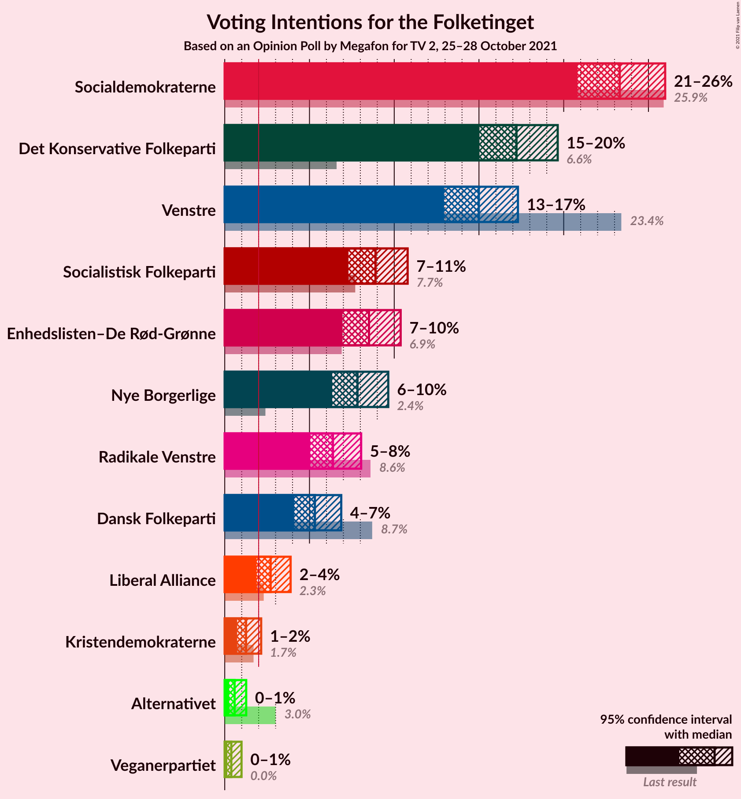

### Confidence Intervals

| Party | Last Result | Poll Result | 80% Confidence Interval | 90% Confidence Interval | 95% Confidence Interval | 99% Confidence Interval |
|:-----:|:-----------:|:-----------:|:-----------------------:|:-----------------------:|:-----------------------:|:-----------------------:|
| Socialdemokraterne | 25.9% | 23.3% | 21.7–25.1% |21.2–25.6% |20.8–26.0% |20.1–26.8% |
| Det Konservative Folkeparti | 6.6% | 17.2% | 15.8–18.8% |15.4–19.3% |15.0–19.6% |14.4–20.4% |
| Venstre | 23.4% | 15.0% | 13.6–16.5% |13.3–16.9% |12.9–17.3% |12.3–18.0% |
| Socialistisk Folkeparti | 7.7% | 8.9% | 7.8–10.1% |7.6–10.5% |7.3–10.8% |6.8–11.4% |
| Enhedslisten–De Rød-Grønne | 6.9% | 8.5% | 7.5–9.7% |7.2–10.1% |7.0–10.4% |6.5–11.0% |
| Nye Borgerlige | 2.4% | 7.8% | 6.9–9.0% |6.6–9.3% |6.3–9.6% |5.9–10.2% |
| Radikale Venstre | 8.6% | 6.4% | 5.5–7.5% |5.3–7.8% |5.0–8.0% |4.6–8.6% |
| Dansk Folkeparti | 8.7% | 5.3% | 4.5–6.3% |4.3–6.6% |4.1–6.9% |3.7–7.4% |
| Liberal Alliance | 2.3% | 2.7% | 2.2–3.5% |2.0–3.7% |1.9–3.9% |1.6–4.3% |
| Kristendemokraterne | 1.7% | 1.3% | 0.9–1.8% |0.8–2.0% |0.7–2.1% |0.6–2.5% |
| Alternativet | 3.0% | 0.6% | 0.4–1.0% |0.3–1.1% |0.3–1.3% |0.2–1.5% |
| Veganerpartiet | 0.0% | 0.4% | 0.2–0.8% |0.2–0.9% |0.2–1.0% |0.1–1.2% |

*Note:* The poll result column reflects the actual value used in the calculations. Published results may vary slightly, and in addition be rounded to fewer digits.

## Seats

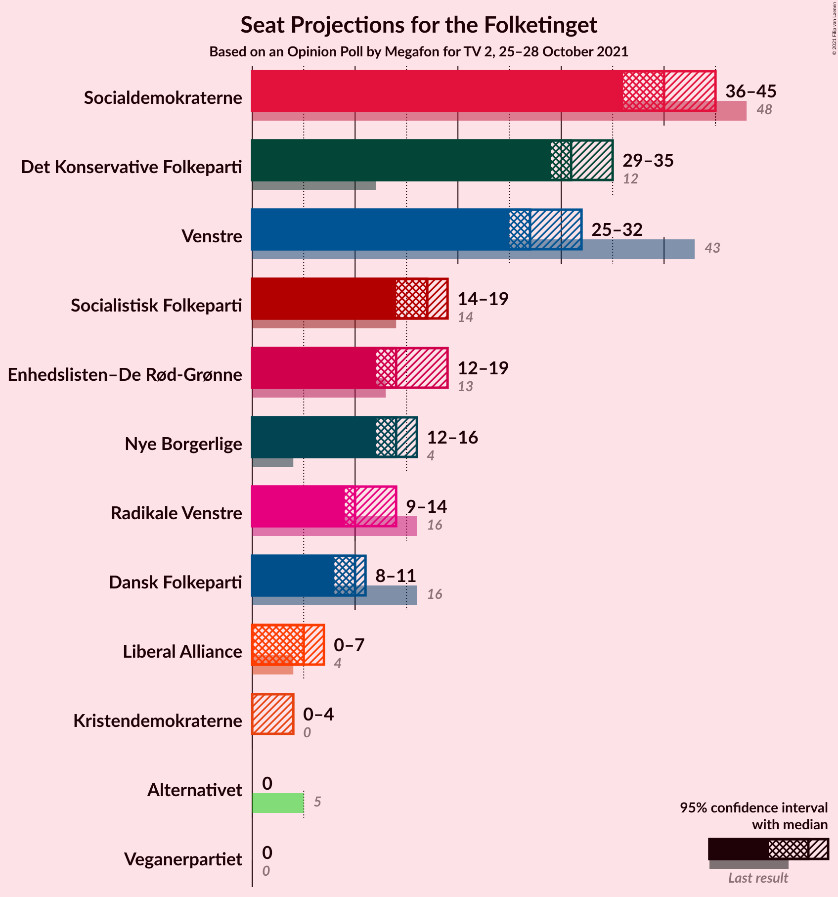

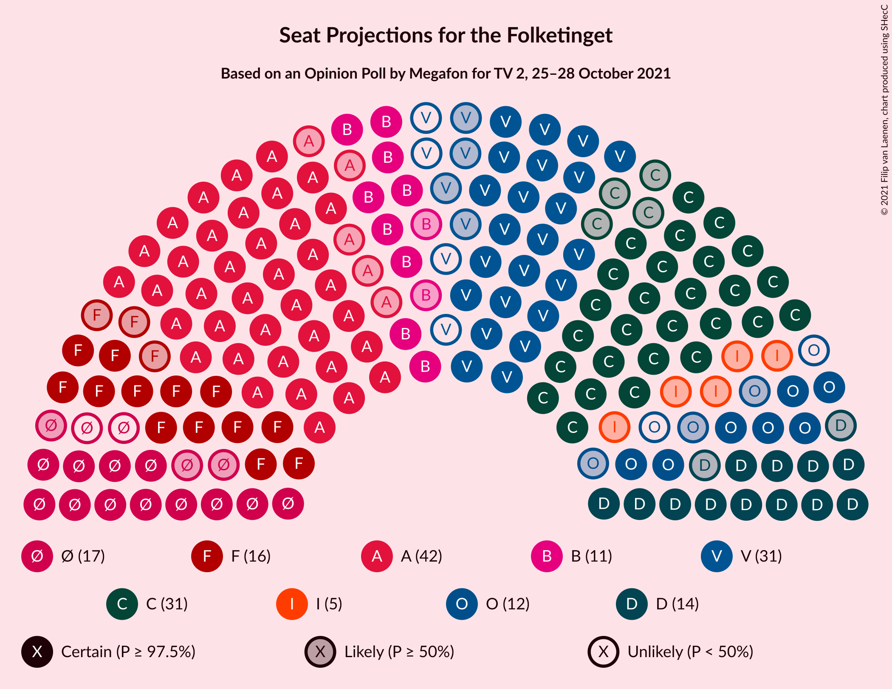

### Confidence Intervals

| Party | Last Result | Median | 80% Confidence Interval | 90% Confidence Interval | 95% Confidence Interval | 99% Confidence Interval |
|:-----:|:-----------:|:------:|:-----------------------:|:-----------------------:|:-----------------------:|:-----------------------:|
| <a href="#socialdemokraterne">Socialdemokraterne</a> | 48 | 40 | 39–45 |39–45 |36–45 |36–46 |
| <a href="#det-konservative-folkeparti">Det Konservative Folkeparti</a> | 12 | 31 | 29–35 |29–35 |29–35 |29–36 |
| <a href="#venstre">Venstre</a> | 43 | 27 | 25–28 |25–28 |25–32 |23–32 |
| <a href="#socialistisk-folkeparti">Socialistisk Folkeparti</a> | 14 | 17 | 14–19 |14–19 |14–19 |13–21 |
| <a href="#enhedslisten–de-rød-grønne">Enhedslisten–De Rød-Grønne</a> | 13 | 14 | 12–18 |12–18 |12–19 |12–19 |
| <a href="#nye-borgerlige">Nye Borgerlige</a> | 4 | 14 | 13–15 |12–15 |12–16 |12–17 |
| <a href="#radikale-venstre">Radikale Venstre</a> | 16 | 10 | 9–11 |9–14 |9–14 |9–14 |
| <a href="#dansk-folkeparti">Dansk Folkeparti</a> | 16 | 10 | 9–11 |9–11 |8–11 |7–12 |
| <a href="#liberal-alliance">Liberal Alliance</a> | 4 | 5 | 4–6 |4–7 |0–7 |0–7 |
| <a href="#kristendemokraterne">Kristendemokraterne</a> | 0 | 0 | 0 |0–4 |0–4 |0–4 |
| <a href="#alternativet">Alternativet</a> | 5 | 0 | 0 |0 |0 |0 |
| <a href="#veganerpartiet">Veganerpartiet</a> | 0 | 0 | 0 |0 |0 |0 |

### Socialdemokraterne

*For a full overview of the results for this party, see the [Socialdemokraterne](party-socialdemokraterne.html) page.*

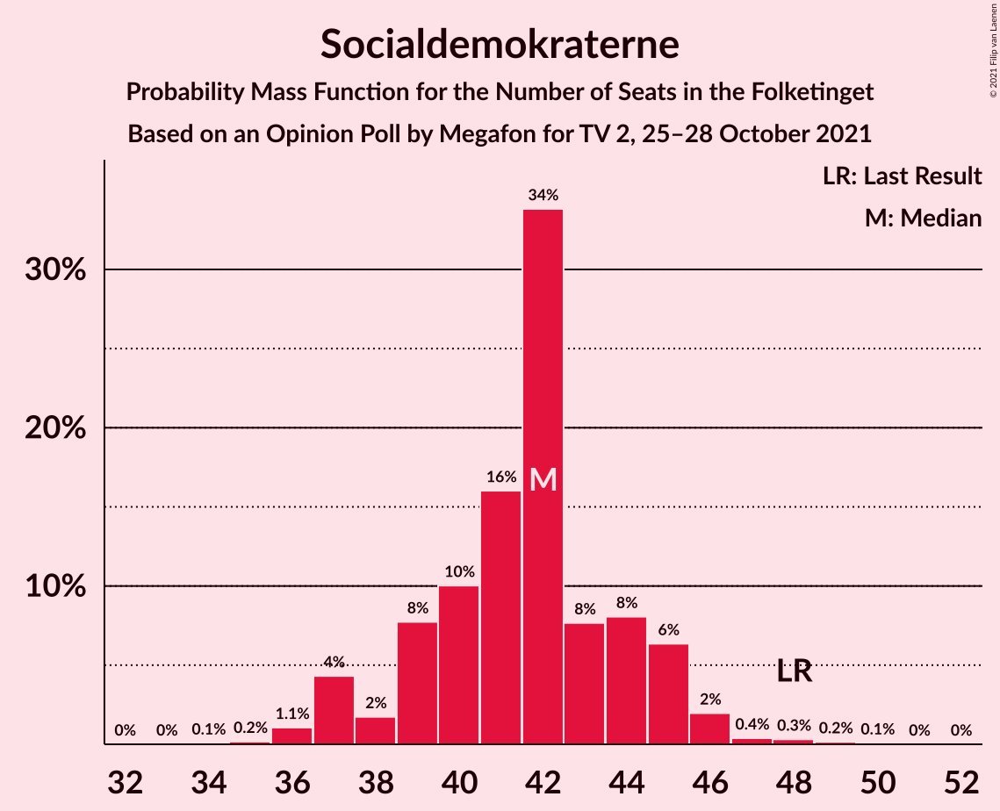

| Number of Seats | Probability | Accumulated | Special Marks |
|:---------------:|:-----------:|:-----------:|:-------------:|
| 35 | 0.2% | 100% |  |
| 36 | 3% | 99.8% |  |
| 37 | 0.3% | 96% |  |
| 38 | 0.4% | 96% |  |
| 39 | 23% | 96% |  |
| 40 | 25% | 73% | Median |
| 41 | 25% | 48% |  |
| 42 | 0.3% | 23% |  |
| 43 | 3% | 22% |  |
| 44 | 0.1% | 20% |  |
| 45 | 17% | 20% |  |
| 46 | 2% | 2% |  |
| 47 | 0% | 0.1% |  |
| 48 | 0% | 0% | Last Result |

### Det Konservative Folkeparti

*For a full overview of the results for this party, see the [Det Konservative Folkeparti](party-detkonservativefolkeparti.html) page.*

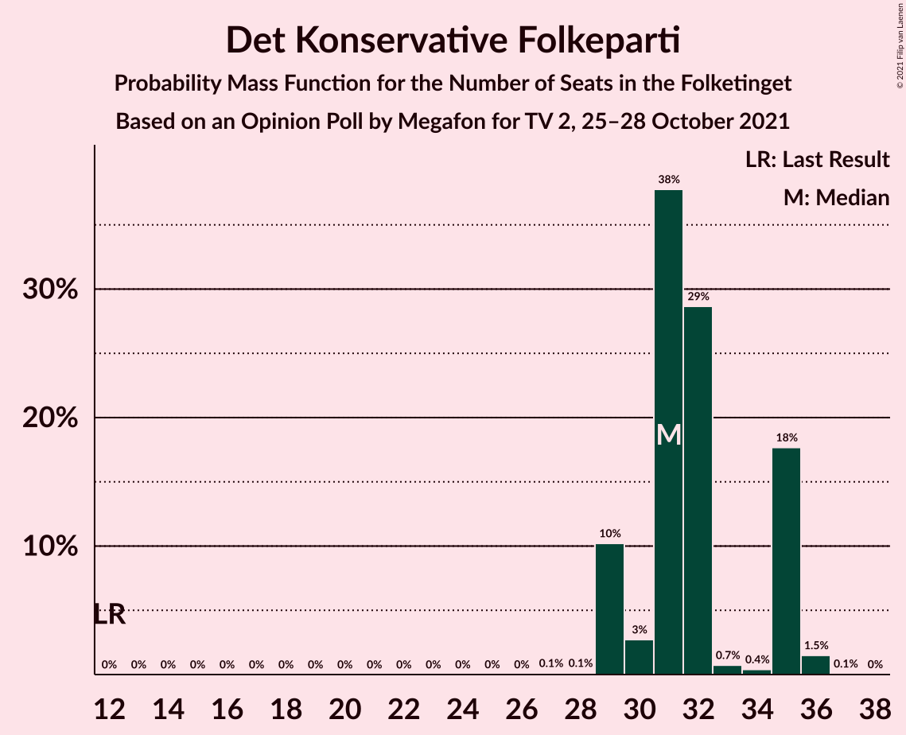

| Number of Seats | Probability | Accumulated | Special Marks |
|:---------------:|:-----------:|:-----------:|:-------------:|
| 12 | 0% | 100% | Last Result |
| 13 | 0% | 100% |  |
| 14 | 0% | 100% |  |
| 15 | 0% | 100% |  |
| 16 | 0% | 100% |  |
| 17 | 0% | 100% |  |
| 18 | 0% | 100% |  |
| 19 | 0% | 100% |  |
| 20 | 0% | 100% |  |
| 21 | 0% | 100% |  |
| 22 | 0% | 100% |  |
| 23 | 0% | 100% |  |
| 24 | 0% | 100% |  |
| 25 | 0% | 100% |  |
| 26 | 0% | 100% |  |
| 27 | 0.1% | 100% |  |
| 28 | 0.1% | 99.9% |  |
| 29 | 10% | 99.7% |  |
| 30 | 3% | 90% |  |
| 31 | 38% | 87% | Median |
| 32 | 29% | 49% |  |
| 33 | 0.7% | 20% |  |
| 34 | 0.4% | 20% |  |
| 35 | 18% | 19% |  |
| 36 | 1.5% | 2% |  |
| 37 | 0.1% | 0.1% |  |
| 38 | 0% | 0% |  |

### Venstre

*For a full overview of the results for this party, see the [Venstre](party-venstre.html) page.*

| Number of Seats | Probability | Accumulated | Special Marks |
|:---------------:|:-----------:|:-----------:|:-------------:|
| 19 | 0.1% | 100% |  |
| 20 | 0% | 99.9% |  |
| 21 | 0.2% | 99.9% |  |
| 22 | 0% | 99.8% |  |
| 23 | 1.1% | 99.7% |  |
| 24 | 0.3% | 98.7% |  |
| 25 | 32% | 98% |  |
| 26 | 12% | 67% |  |
| 27 | 41% | 55% | Median |
| 28 | 9% | 14% |  |
| 29 | 0.1% | 5% |  |
| 30 | 0.1% | 4% |  |
| 31 | 0.1% | 4% |  |
| 32 | 4% | 4% |  |
| 33 | 0% | 0% |  |
| 34 | 0% | 0% |  |
| 35 | 0% | 0% |  |
| 36 | 0% | 0% |  |
| 37 | 0% | 0% |  |
| 38 | 0% | 0% |  |
| 39 | 0% | 0% |  |
| 40 | 0% | 0% |  |
| 41 | 0% | 0% |  |
| 42 | 0% | 0% |  |
| 43 | 0% | 0% | Last Result |

### Socialistisk Folkeparti

*For a full overview of the results for this party, see the [Socialistisk Folkeparti](party-socialistiskfolkeparti.html) page.*

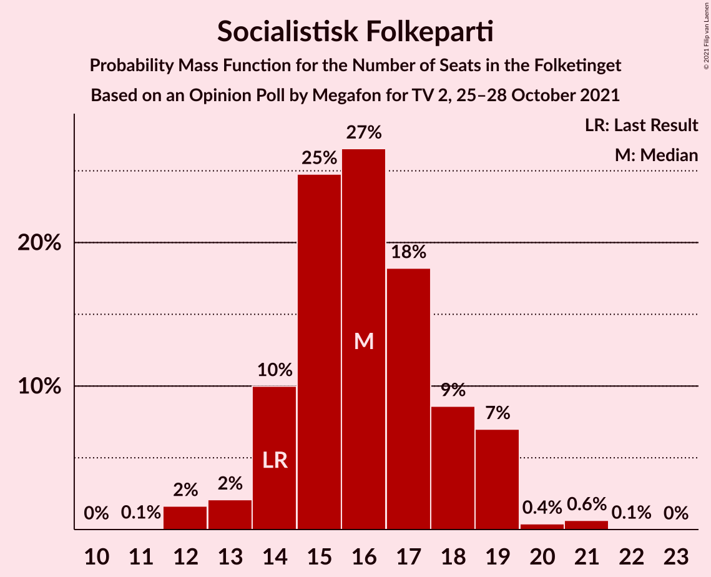

| Number of Seats | Probability | Accumulated | Special Marks |
|:---------------:|:-----------:|:-----------:|:-------------:|
| 12 | 0.2% | 100% |  |
| 13 | 0.9% | 99.8% |  |
| 14 | 12% | 98.9% | Last Result |
| 15 | 27% | 87% |  |
| 16 | 0.3% | 60% |  |
| 17 | 35% | 60% | Median |
| 18 | 4% | 25% |  |
| 19 | 19% | 20% |  |
| 20 | 0.2% | 2% |  |
| 21 | 1.4% | 1.4% |  |
| 22 | 0% | 0% |  |

### Enhedslisten–De Rød-Grønne

*For a full overview of the results for this party, see the [Enhedslisten–De Rød-Grønne](party-enhedslisten–derød-grønne.html) page.*

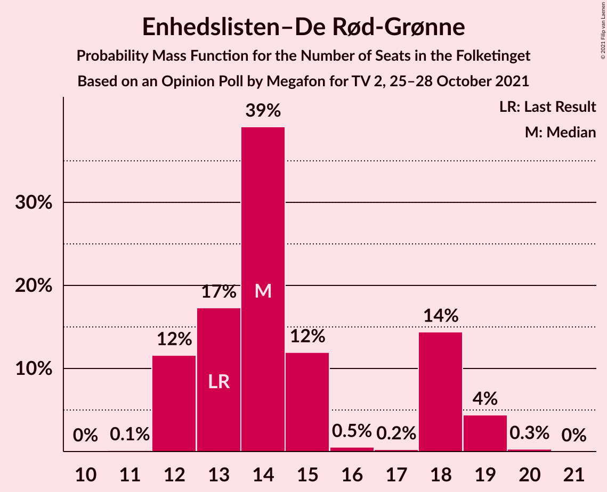

| Number of Seats | Probability | Accumulated | Special Marks |
|:---------------:|:-----------:|:-----------:|:-------------:|
| 11 | 0.1% | 100% |  |
| 12 | 12% | 99.9% |  |
| 13 | 17% | 88% | Last Result |
| 14 | 39% | 71% | Median |
| 15 | 12% | 32% |  |
| 16 | 0.5% | 20% |  |
| 17 | 0.2% | 19% |  |
| 18 | 14% | 19% |  |
| 19 | 4% | 5% |  |
| 20 | 0.3% | 0.3% |  |
| 21 | 0% | 0% |  |

### Nye Borgerlige

*For a full overview of the results for this party, see the [Nye Borgerlige](party-nyeborgerlige.html) page.*

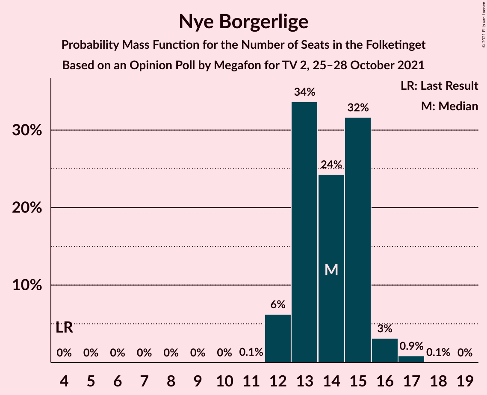

| Number of Seats | Probability | Accumulated | Special Marks |
|:---------------:|:-----------:|:-----------:|:-------------:|
| 4 | 0% | 100% | Last Result |
| 5 | 0% | 100% |  |
| 6 | 0% | 100% |  |
| 7 | 0% | 100% |  |
| 8 | 0% | 100% |  |
| 9 | 0% | 100% |  |
| 10 | 0% | 100% |  |
| 11 | 0.1% | 100% |  |
| 12 | 6% | 99.9% |  |
| 13 | 34% | 94% |  |
| 14 | 24% | 60% | Median |
| 15 | 32% | 36% |  |
| 16 | 3% | 4% |  |
| 17 | 0.9% | 0.9% |  |
| 18 | 0.1% | 0.1% |  |
| 19 | 0% | 0% |  |

### Radikale Venstre

*For a full overview of the results for this party, see the [Radikale Venstre](party-radikalevenstre.html) page.*

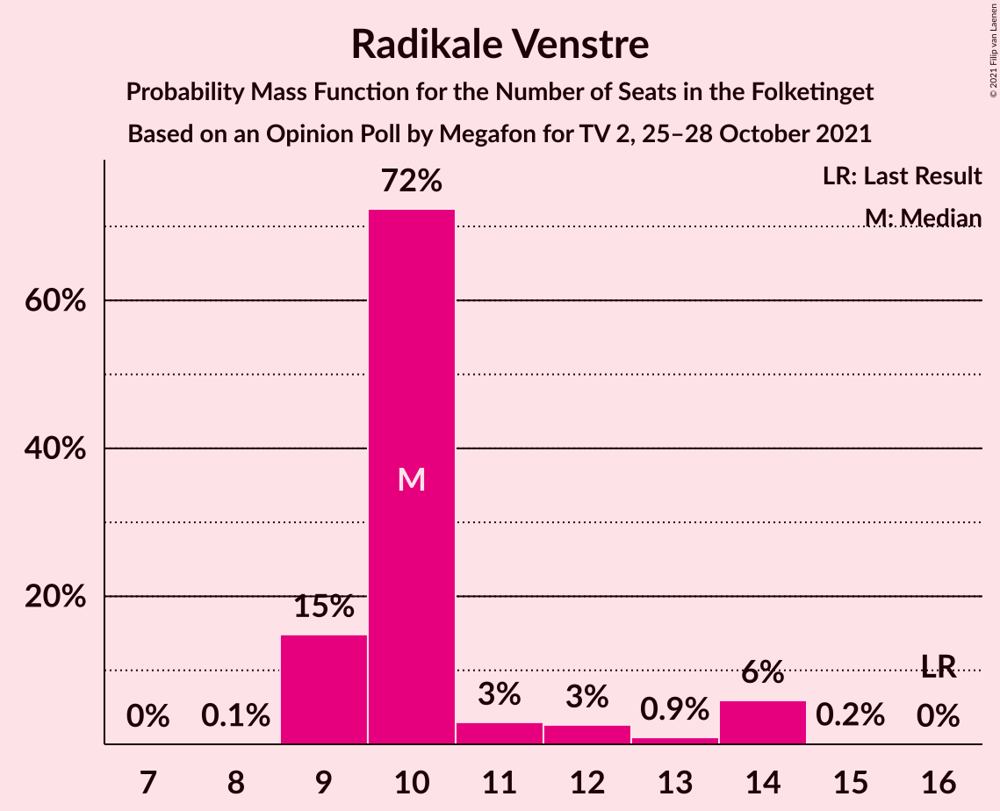

| Number of Seats | Probability | Accumulated | Special Marks |
|:---------------:|:-----------:|:-----------:|:-------------:|
| 8 | 0.1% | 100% |  |
| 9 | 15% | 99.9% |  |
| 10 | 72% | 85% | Median |
| 11 | 3% | 13% |  |
| 12 | 3% | 10% |  |
| 13 | 0.9% | 7% |  |
| 14 | 6% | 6% |  |
| 15 | 0.2% | 0.2% |  |
| 16 | 0% | 0% | Last Result |

### Dansk Folkeparti

*For a full overview of the results for this party, see the [Dansk Folkeparti](party-danskfolkeparti.html) page.*

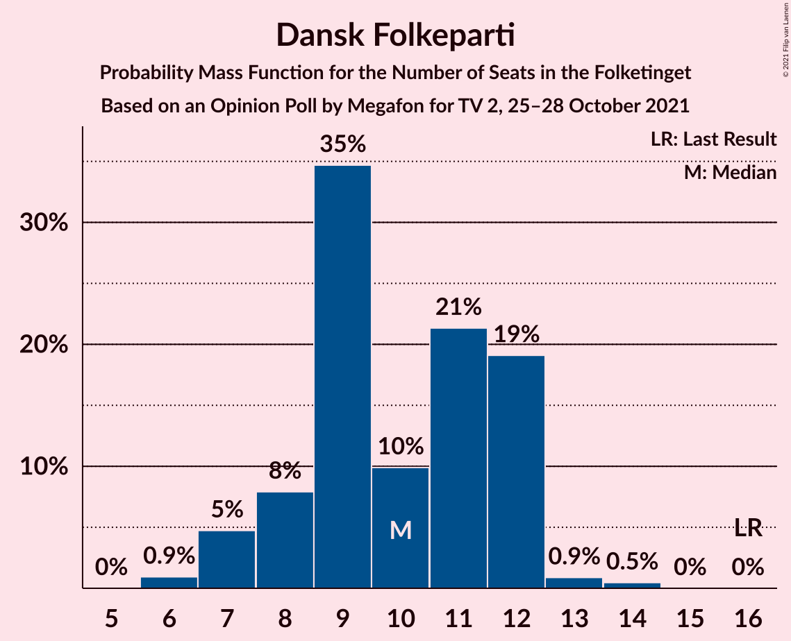

| Number of Seats | Probability | Accumulated | Special Marks |
|:---------------:|:-----------:|:-----------:|:-------------:|
| 6 | 0.1% | 100% |  |
| 7 | 2% | 99.9% |  |
| 8 | 1.1% | 98% |  |
| 9 | 43% | 97% |  |
| 10 | 8% | 54% | Median |
| 11 | 45% | 46% |  |
| 12 | 0.8% | 0.9% |  |
| 13 | 0.2% | 0.2% |  |
| 14 | 0% | 0% |  |
| 15 | 0% | 0% |  |
| 16 | 0% | 0% | Last Result |

### Liberal Alliance

*For a full overview of the results for this party, see the [Liberal Alliance](party-liberalalliance.html) page.*

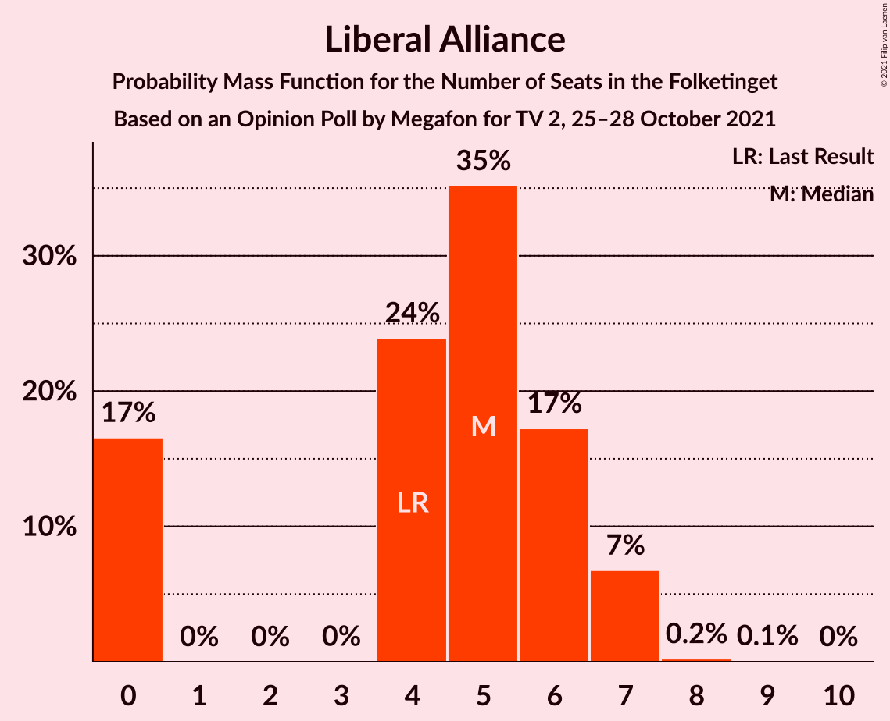

| Number of Seats | Probability | Accumulated | Special Marks |
|:---------------:|:-----------:|:-----------:|:-------------:|
| 0 | 4% | 100% |  |
| 1 | 0% | 96% |  |
| 2 | 0% | 96% |  |
| 3 | 0% | 96% |  |
| 4 | 18% | 96% | Last Result |
| 5 | 59% | 78% | Median |
| 6 | 10% | 19% |  |
| 7 | 9% | 9% |  |
| 8 | 0.1% | 0.1% |  |
| 9 | 0% | 0% |  |

### Kristendemokraterne

*For a full overview of the results for this party, see the [Kristendemokraterne](party-kristendemokraterne.html) page.*

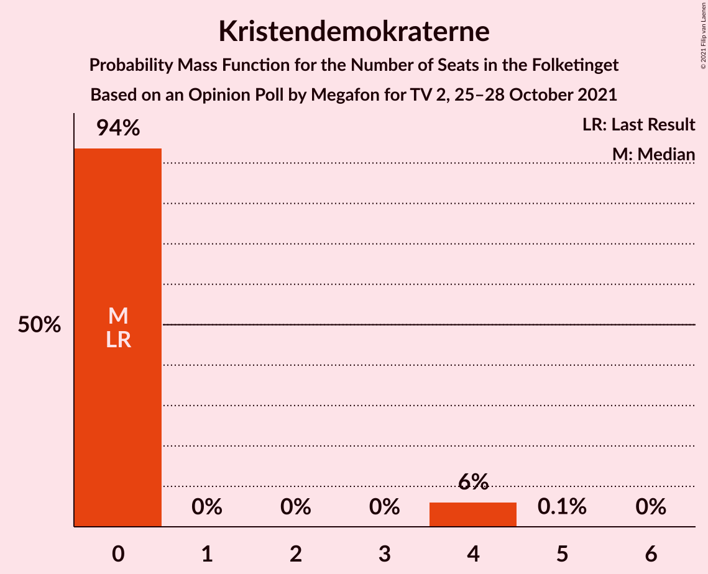

| Number of Seats | Probability | Accumulated | Special Marks |
|:---------------:|:-----------:|:-----------:|:-------------:|
| 0 | 94% | 100% | Last Result, Median |
| 1 | 0% | 6% |  |
| 2 | 0% | 6% |  |
| 3 | 0% | 6% |  |
| 4 | 6% | 6% |  |
| 5 | 0.1% | 0.1% |  |
| 6 | 0% | 0% |  |

### Alternativet

*For a full overview of the results for this party, see the [Alternativet](party-alternativet.html) page.*

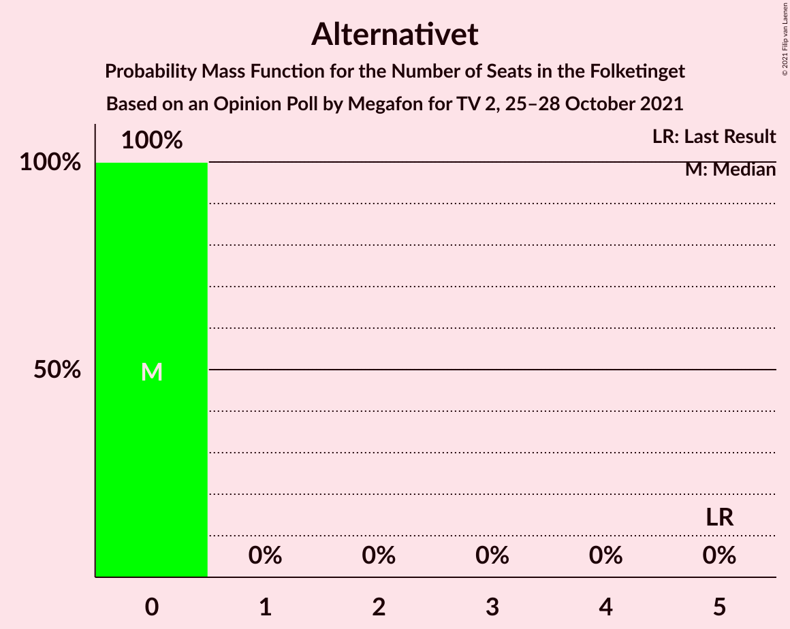

| Number of Seats | Probability | Accumulated | Special Marks |
|:---------------:|:-----------:|:-----------:|:-------------:|
| 0 | 100% | 100% | Median |
| 1 | 0% | 0% |  |
| 2 | 0% | 0% |  |
| 3 | 0% | 0% |  |
| 4 | 0% | 0% |  |
| 5 | 0% | 0% | Last Result |

### Veganerpartiet

*For a full overview of the results for this party, see the [Veganerpartiet](party-veganerpartiet.html) page.*

| Number of Seats | Probability | Accumulated | Special Marks |
|:---------------:|:-----------:|:-----------:|:-------------:|
| 0 | 100% | 100% | Last Result, Median |

## Coalitions

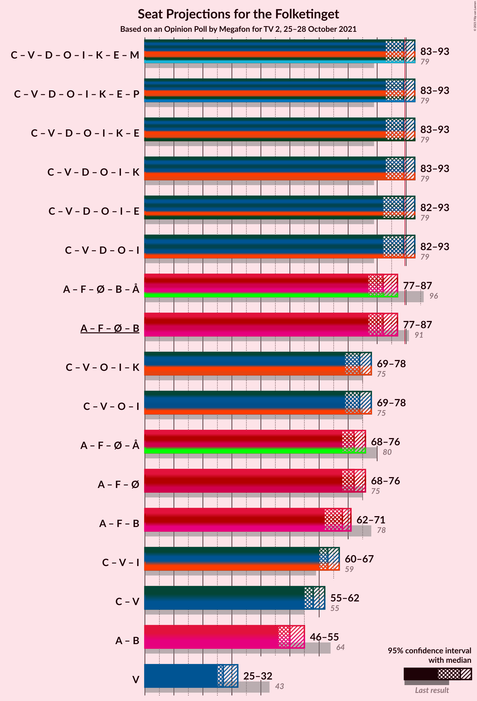

### Confidence Intervals

| Coalition | Last Result | Median | Majority? | 80% Confidence Interval | 90% Confidence Interval | 95% Confidence Interval | 99% Confidence Interval |
|:---------:|:-----------:|:------:|:---------:|:-----------------------:|:-----------------------:|:-----------------------:|:-----------------------:|
| Det Konservative Folkeparti – Venstre – Nye Borgerlige – Dansk Folkeparti – Liberal Alliance – Kristendemokraterne | 79 | 89 | 14% | 83–91 | 83–93 | 83–93 | 78–93 |
| Det Konservative Folkeparti – Venstre – Nye Borgerlige – Dansk Folkeparti – Liberal Alliance | 79 | 89 | 14% | 83–91 | 82–93 | 82–93 | 78–93 |
| Socialdemokraterne – Socialistisk Folkeparti – Enhedslisten–De Rød-Grønne – Radikale Venstre – Alternativet | 96 | 82 | 2% | 77–86 | 77–86 | 77–87 | 77–90 |
| Socialdemokraterne – Socialistisk Folkeparti – Enhedslisten–De Rød-Grønne – Radikale Venstre | 91 | 82 | 2% | 77–86 | 77–86 | 77–87 | 77–90 |
| Det Konservative Folkeparti – Venstre – Dansk Folkeparti – Liberal Alliance – Kristendemokraterne | 75 | 74 | 0% | 70–76 | 70–78 | 69–78 | 64–78 |
| Det Konservative Folkeparti – Venstre – Dansk Folkeparti – Liberal Alliance | 75 | 74 | 0% | 70–76 | 70–78 | 69–78 | 64–78 |
| Socialdemokraterne – Socialistisk Folkeparti – Enhedslisten–De Rød-Grønne – Alternativet | 80 | 72 | 0% | 68–76 | 68–76 | 68–76 | 68–78 |
| Socialdemokraterne – Socialistisk Folkeparti – Enhedslisten–De Rød-Grønne | 75 | 72 | 0% | 68–76 | 68–76 | 68–76 | 68–78 |
| Socialdemokraterne – Socialistisk Folkeparti – Radikale Venstre | 78 | 68 | 0% | 65–70 | 64–71 | 62–71 | 62–75 |
| Det Konservative Folkeparti – Venstre – Liberal Alliance | 59 | 63 | 0% | 61–67 | 61–67 | 60–67 | 54–67 |
| Det Konservative Folkeparti – Venstre | 55 | 58 | 0% | 56–62 | 55–62 | 55–62 | 54–64 |
| Socialdemokraterne – Radikale Venstre | 64 | 50 | 0% | 49–55 | 48–55 | 46–55 | 46–56 |
| Venstre | 43 | 27 | 0% | 25–28 | 25–28 | 25–32 | 23–32 |

### Det Konservative Folkeparti – Venstre – Nye Borgerlige – Dansk Folkeparti – Liberal Alliance – Kristendemokraterne

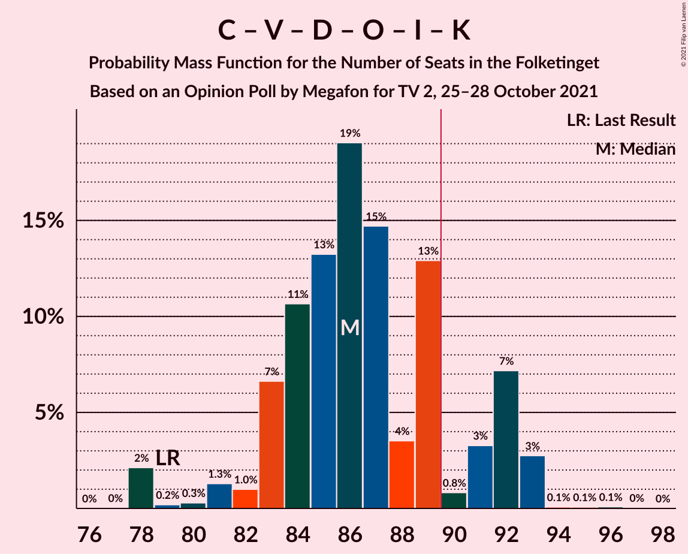

| Number of Seats | Probability | Accumulated | Special Marks |
|:---------------:|:-----------:|:-----------:|:-------------:|
| 78 | 0.9% | 100% |  |
| 79 | 0% | 99.1% | Last Result |
| 80 | 0.6% | 99.1% |  |
| 81 | 0.3% | 98.5% |  |
| 82 | 0.2% | 98% |  |
| 83 | 14% | 98% |  |
| 84 | 2% | 84% |  |
| 85 | 2% | 82% |  |
| 86 | 26% | 80% |  |
| 87 | 0.3% | 53% | Median |
| 88 | 2% | 53% |  |
| 89 | 37% | 51% |  |
| 90 | 0.2% | 14% | Majority |
| 91 | 4% | 14% |  |
| 92 | 1.1% | 10% |  |
| 93 | 9% | 9% |  |
| 94 | 0% | 0.2% |  |
| 95 | 0.2% | 0.2% |  |
| 96 | 0% | 0% |  |

### Det Konservative Folkeparti – Venstre – Nye Borgerlige – Dansk Folkeparti – Liberal Alliance

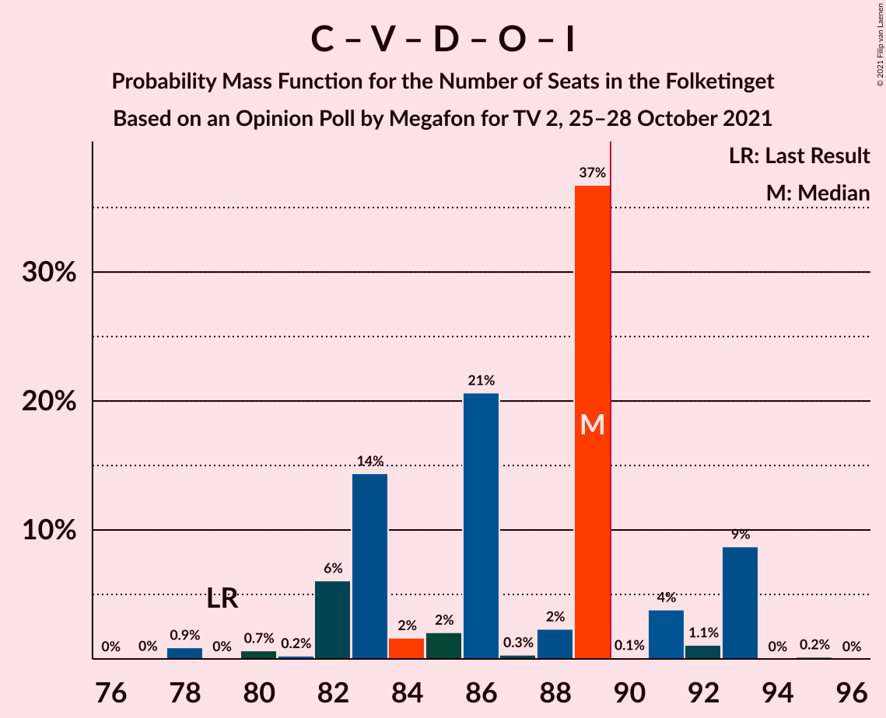

| Number of Seats | Probability | Accumulated | Special Marks |
|:---------------:|:-----------:|:-----------:|:-------------:|
| 77 | 0% | 100% |  |
| 78 | 0.9% | 99.9% |  |
| 79 | 0% | 99.0% | Last Result |
| 80 | 0.7% | 99.0% |  |
| 81 | 0.2% | 98% |  |
| 82 | 6% | 98% |  |
| 83 | 14% | 92% |  |
| 84 | 2% | 78% |  |
| 85 | 2% | 76% |  |
| 86 | 21% | 74% |  |
| 87 | 0.3% | 53% | Median |
| 88 | 2% | 53% |  |
| 89 | 37% | 51% |  |
| 90 | 0.1% | 14% | Majority |
| 91 | 4% | 14% |  |
| 92 | 1.1% | 10% |  |
| 93 | 9% | 9% |  |
| 94 | 0% | 0.2% |  |
| 95 | 0.2% | 0.2% |  |
| 96 | 0% | 0% |  |

### Socialdemokraterne – Socialistisk Folkeparti – Enhedslisten–De Rød-Grønne – Radikale Venstre – Alternativet

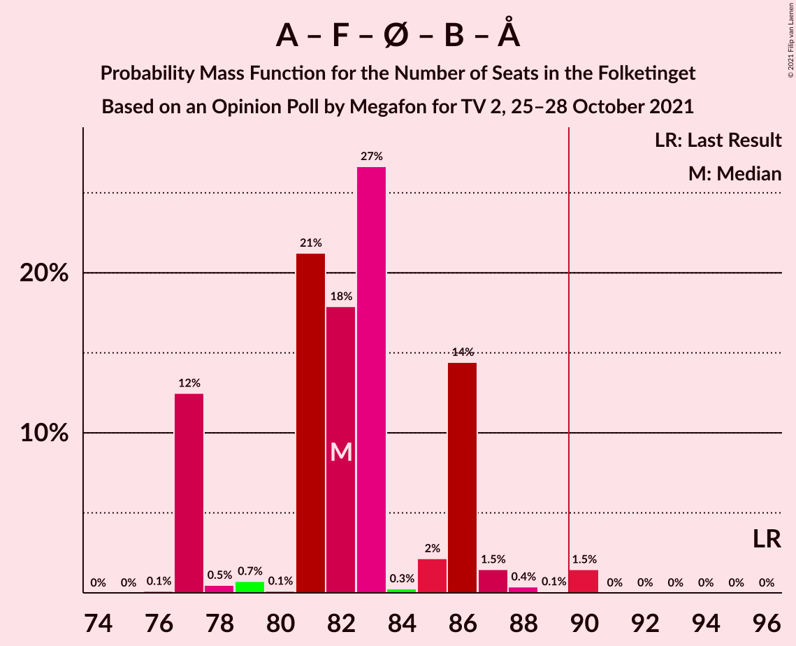

| Number of Seats | Probability | Accumulated | Special Marks |
|:---------------:|:-----------:|:-----------:|:-------------:|
| 76 | 0.1% | 100% |  |
| 77 | 12% | 99.9% |  |
| 78 | 0.5% | 87% |  |
| 79 | 0.7% | 87% |  |
| 80 | 0.1% | 86% |  |
| 81 | 21% | 86% | Median |
| 82 | 18% | 65% |  |
| 83 | 27% | 47% |  |
| 84 | 0.3% | 20% |  |
| 85 | 2% | 20% |  |
| 86 | 14% | 18% |  |
| 87 | 1.5% | 3% |  |
| 88 | 0.4% | 2% |  |
| 89 | 0.1% | 2% |  |
| 90 | 1.5% | 2% | Majority |
| 91 | 0% | 0% |  |
| 92 | 0% | 0% |  |
| 93 | 0% | 0% |  |
| 94 | 0% | 0% |  |
| 95 | 0% | 0% |  |
| 96 | 0% | 0% | Last Result |

### Socialdemokraterne – Socialistisk Folkeparti – Enhedslisten–De Rød-Grønne – Radikale Venstre

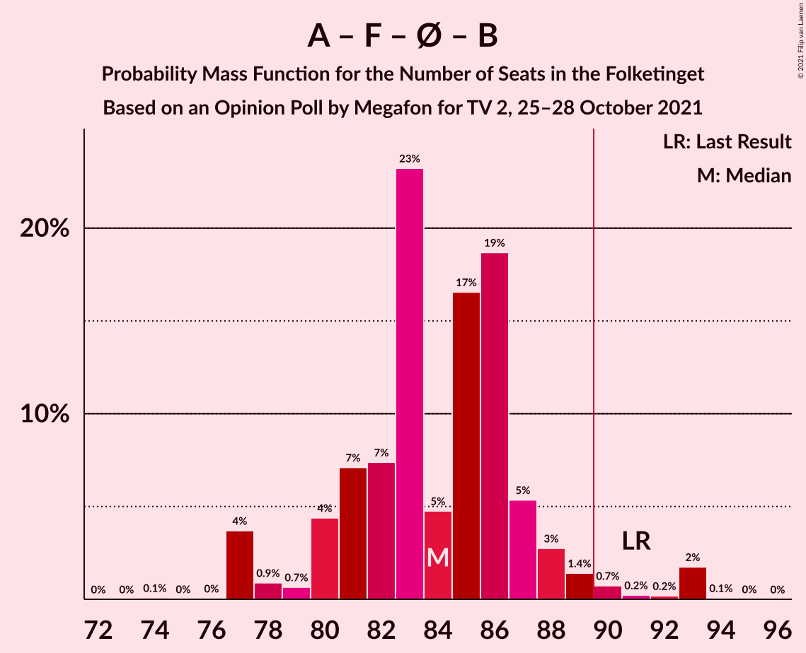

| Number of Seats | Probability | Accumulated | Special Marks |
|:---------------:|:-----------:|:-----------:|:-------------:|
| 76 | 0.1% | 100% |  |
| 77 | 12% | 99.9% |  |
| 78 | 0.5% | 87% |  |
| 79 | 0.7% | 87% |  |
| 80 | 0.1% | 86% |  |
| 81 | 21% | 86% | Median |
| 82 | 18% | 65% |  |
| 83 | 27% | 47% |  |
| 84 | 0.3% | 20% |  |
| 85 | 2% | 20% |  |
| 86 | 14% | 18% |  |
| 87 | 1.5% | 3% |  |
| 88 | 0.4% | 2% |  |
| 89 | 0.1% | 2% |  |
| 90 | 1.5% | 2% | Majority |
| 91 | 0% | 0% | Last Result |

### Det Konservative Folkeparti – Venstre – Dansk Folkeparti – Liberal Alliance – Kristendemokraterne

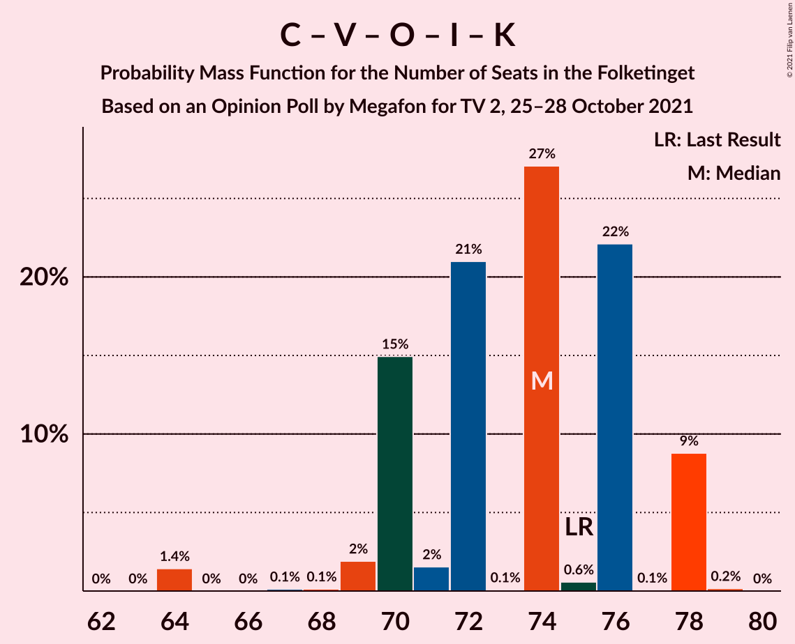

| Number of Seats | Probability | Accumulated | Special Marks |
|:---------------:|:-----------:|:-----------:|:-------------:|
| 64 | 1.4% | 100% |  |
| 65 | 0% | 98.6% |  |
| 66 | 0% | 98.5% |  |
| 67 | 0.1% | 98.5% |  |
| 68 | 0.1% | 98% |  |
| 69 | 2% | 98% |  |
| 70 | 15% | 96% |  |
| 71 | 2% | 81% |  |
| 72 | 21% | 80% |  |
| 73 | 0.1% | 59% | Median |
| 74 | 27% | 59% |  |
| 75 | 0.6% | 32% | Last Result |
| 76 | 22% | 31% |  |
| 77 | 0.1% | 9% |  |
| 78 | 9% | 9% |  |
| 79 | 0.2% | 0.2% |  |
| 80 | 0% | 0% |  |

### Det Konservative Folkeparti – Venstre – Dansk Folkeparti – Liberal Alliance

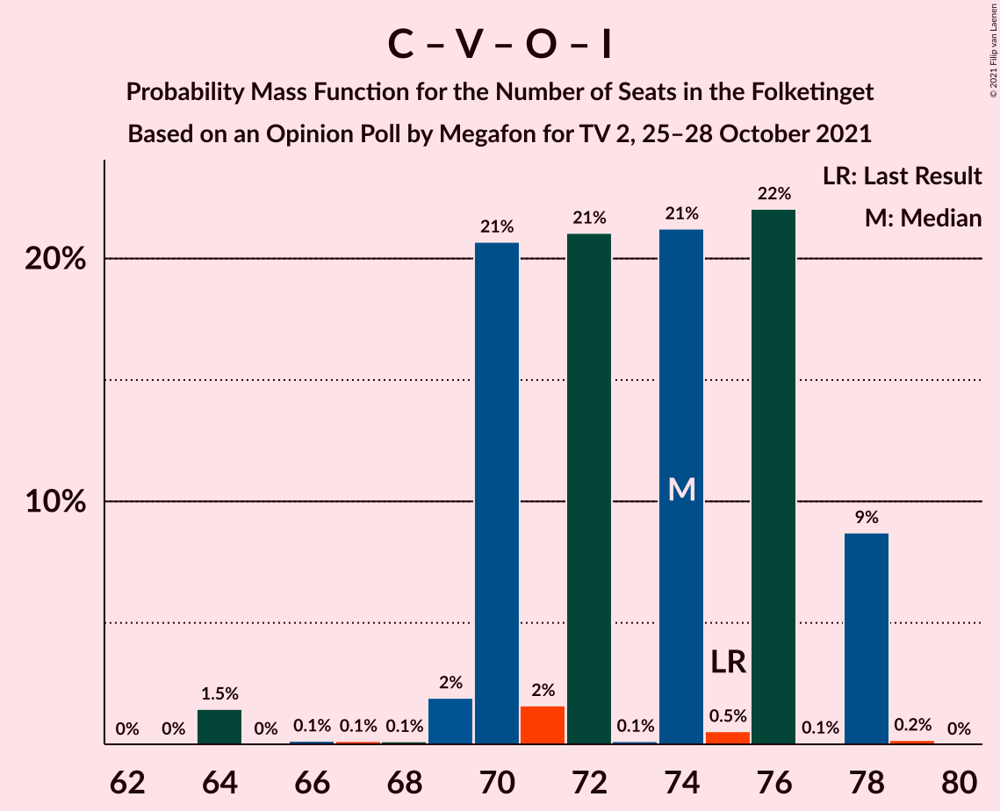

| Number of Seats | Probability | Accumulated | Special Marks |
|:---------------:|:-----------:|:-----------:|:-------------:|
| 64 | 1.5% | 100% |  |
| 65 | 0% | 98.5% |  |
| 66 | 0.1% | 98.5% |  |
| 67 | 0.1% | 98% |  |
| 68 | 0.1% | 98% |  |
| 69 | 2% | 98% |  |
| 70 | 21% | 96% |  |
| 71 | 2% | 76% |  |
| 72 | 21% | 74% |  |
| 73 | 0.1% | 53% | Median |
| 74 | 21% | 53% |  |
| 75 | 0.5% | 32% | Last Result |
| 76 | 22% | 31% |  |
| 77 | 0.1% | 9% |  |
| 78 | 9% | 9% |  |
| 79 | 0.2% | 0.2% |  |
| 80 | 0% | 0% |  |

### Socialdemokraterne – Socialistisk Folkeparti – Enhedslisten–De Rød-Grønne – Alternativet

| Number of Seats | Probability | Accumulated | Special Marks |
|:---------------:|:-----------:|:-----------:|:-------------:|
| 66 | 0.2% | 100% |  |
| 67 | 0.1% | 99.8% |  |
| 68 | 14% | 99.7% |  |
| 69 | 6% | 86% |  |
| 70 | 0.1% | 80% |  |
| 71 | 19% | 80% | Median |
| 72 | 20% | 61% |  |
| 73 | 21% | 41% |  |
| 74 | 2% | 20% |  |
| 75 | 2% | 18% |  |
| 76 | 14% | 16% |  |
| 77 | 0.9% | 2% |  |
| 78 | 0.9% | 1.0% |  |
| 79 | 0% | 0% |  |
| 80 | 0% | 0% | Last Result |

### Socialdemokraterne – Socialistisk Folkeparti – Enhedslisten–De Rød-Grønne

| Number of Seats | Probability | Accumulated | Special Marks |
|:---------------:|:-----------:|:-----------:|:-------------:|
| 66 | 0.2% | 100% |  |
| 67 | 0.1% | 99.8% |  |
| 68 | 14% | 99.7% |  |
| 69 | 6% | 86% |  |
| 70 | 0.1% | 80% |  |
| 71 | 19% | 80% | Median |
| 72 | 20% | 61% |  |
| 73 | 21% | 41% |  |
| 74 | 2% | 20% |  |
| 75 | 2% | 18% | Last Result |
| 76 | 14% | 16% |  |
| 77 | 0.9% | 2% |  |
| 78 | 0.9% | 1.0% |  |
| 79 | 0% | 0% |  |

### Socialdemokraterne – Socialistisk Folkeparti – Radikale Venstre

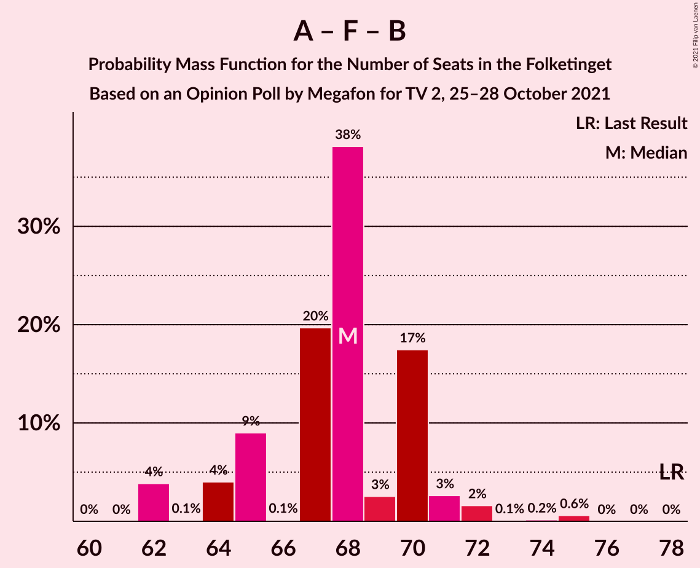

| Number of Seats | Probability | Accumulated | Special Marks |
|:---------------:|:-----------:|:-----------:|:-------------:|
| 62 | 4% | 100% |  |
| 63 | 0.1% | 96% |  |
| 64 | 4% | 96% |  |
| 65 | 9% | 92% |  |
| 66 | 0.1% | 83% |  |
| 67 | 20% | 83% | Median |
| 68 | 38% | 63% |  |
| 69 | 3% | 25% |  |
| 70 | 17% | 23% |  |
| 71 | 3% | 5% |  |
| 72 | 2% | 2% |  |
| 73 | 0.1% | 0.8% |  |
| 74 | 0.2% | 0.8% |  |
| 75 | 0.6% | 0.6% |  |
| 76 | 0% | 0% |  |
| 77 | 0% | 0% |  |
| 78 | 0% | 0% | Last Result |

### Det Konservative Folkeparti – Venstre – Liberal Alliance

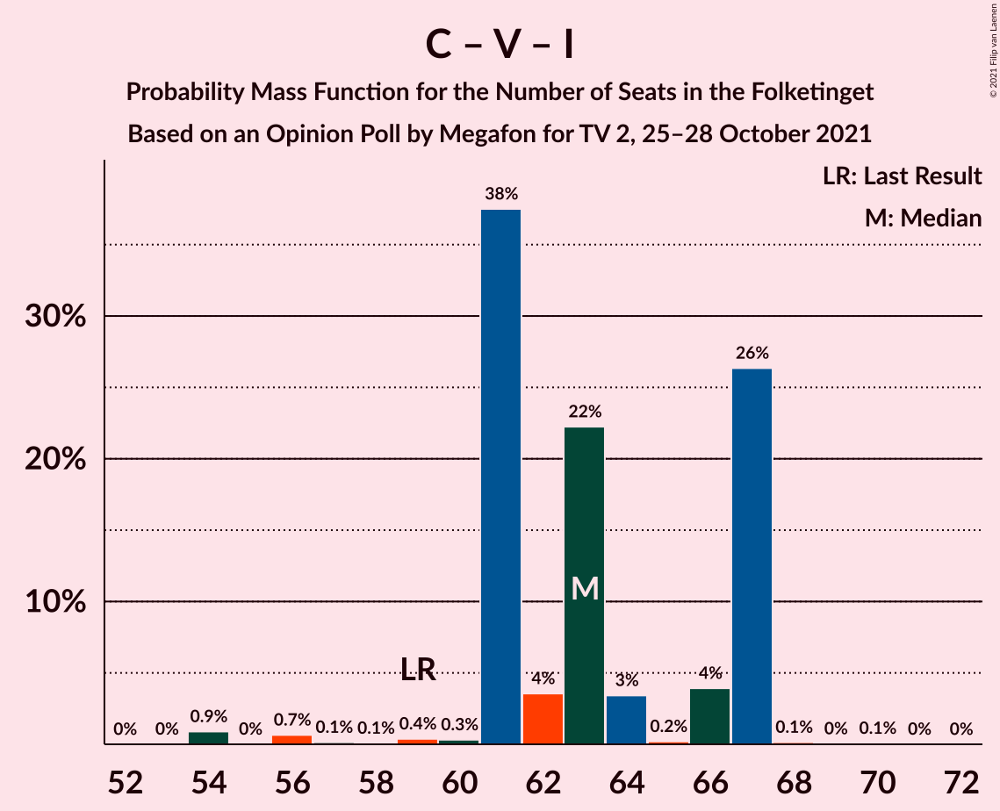

| Number of Seats | Probability | Accumulated | Special Marks |
|:---------------:|:-----------:|:-----------:|:-------------:|
| 54 | 0.9% | 100% |  |
| 55 | 0% | 99.1% |  |
| 56 | 0.7% | 99.1% |  |
| 57 | 0.1% | 98% |  |
| 58 | 0.1% | 98% |  |
| 59 | 0.4% | 98% | Last Result |
| 60 | 0.3% | 98% |  |
| 61 | 38% | 97% |  |
| 62 | 4% | 60% |  |
| 63 | 22% | 56% | Median |
| 64 | 3% | 34% |  |
| 65 | 0.2% | 31% |  |
| 66 | 4% | 31% |  |
| 67 | 26% | 27% |  |
| 68 | 0.1% | 0.3% |  |
| 69 | 0% | 0.1% |  |
| 70 | 0.1% | 0.1% |  |
| 71 | 0% | 0% |  |

### Det Konservative Folkeparti – Venstre

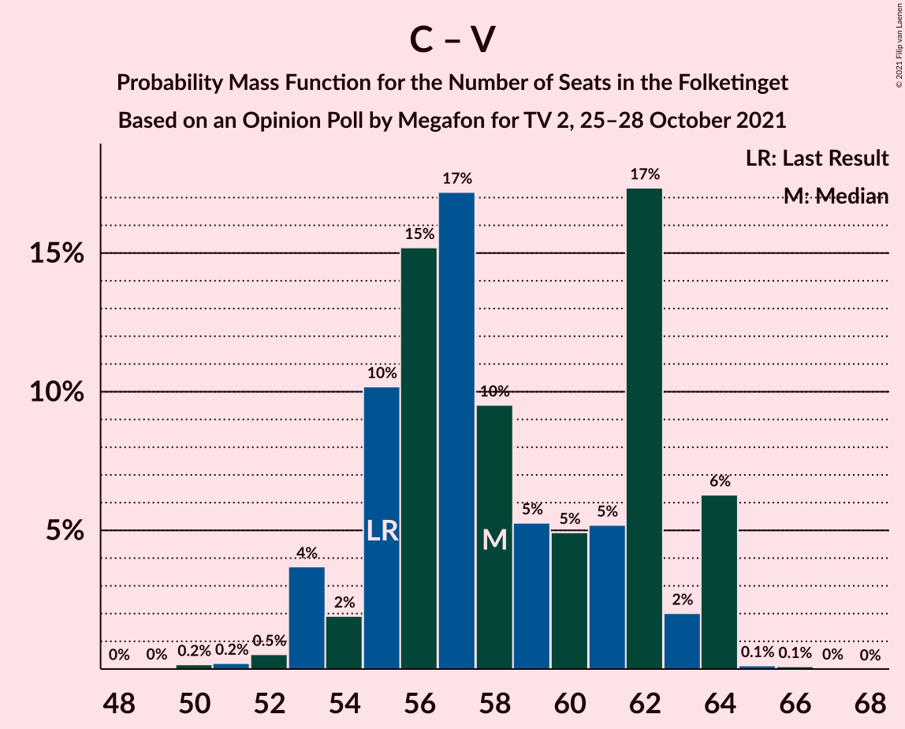

| Number of Seats | Probability | Accumulated | Special Marks |
|:---------------:|:-----------:|:-----------:|:-------------:|
| 52 | 0.2% | 100% |  |
| 53 | 0.2% | 99.8% |  |
| 54 | 1.0% | 99.6% |  |
| 55 | 6% | 98.6% | Last Result |
| 56 | 15% | 92% |  |
| 57 | 23% | 77% |  |
| 58 | 19% | 54% | Median |
| 59 | 3% | 36% |  |
| 60 | 9% | 33% |  |
| 61 | 4% | 24% |  |
| 62 | 19% | 20% |  |
| 63 | 0% | 0.6% |  |
| 64 | 0.5% | 0.6% |  |
| 65 | 0.1% | 0.1% |  |
| 66 | 0% | 0% |  |

### Socialdemokraterne – Radikale Venstre

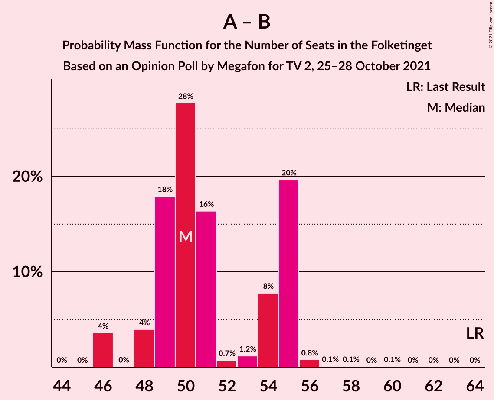

| Number of Seats | Probability | Accumulated | Special Marks |
|:---------------:|:-----------:|:-----------:|:-------------:|
| 46 | 4% | 100% |  |
| 47 | 0% | 96% |  |
| 48 | 4% | 96% |  |
| 49 | 18% | 92% |  |
| 50 | 28% | 74% | Median |
| 51 | 16% | 47% |  |
| 52 | 0.7% | 30% |  |
| 53 | 1.2% | 30% |  |
| 54 | 8% | 28% |  |
| 55 | 20% | 21% |  |
| 56 | 0.8% | 1.0% |  |
| 57 | 0.1% | 0.3% |  |
| 58 | 0.1% | 0.2% |  |
| 59 | 0% | 0.1% |  |
| 60 | 0.1% | 0.1% |  |
| 61 | 0% | 0% |  |
| 62 | 0% | 0% |  |
| 63 | 0% | 0% |  |
| 64 | 0% | 0% | Last Result |

### Venstre

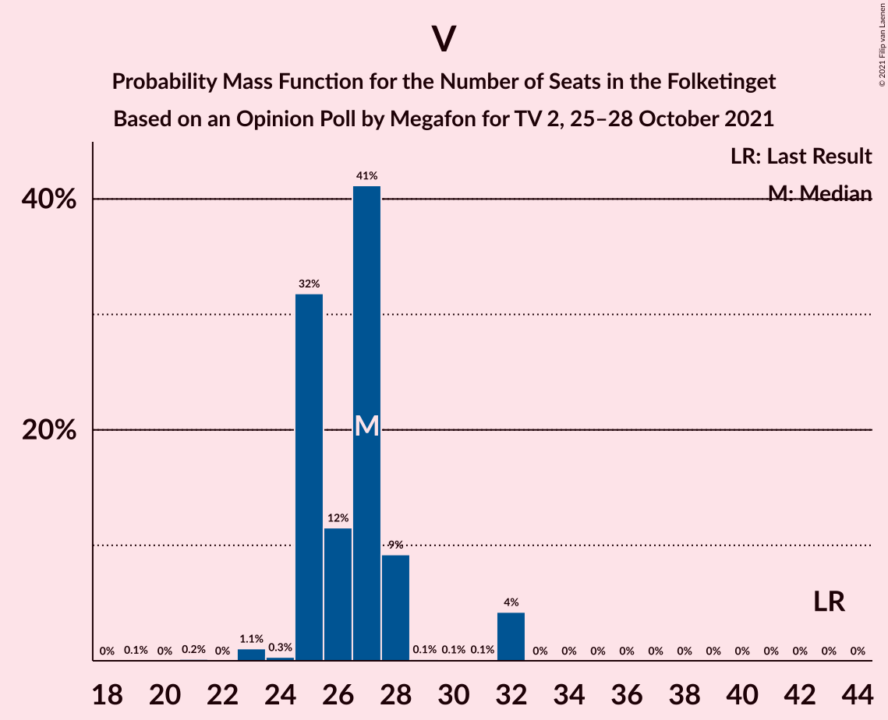

| Number of Seats | Probability | Accumulated | Special Marks |
|:---------------:|:-----------:|:-----------:|:-------------:|
| 19 | 0.1% | 100% |  |
| 20 | 0% | 99.9% |  |
| 21 | 0.2% | 99.9% |  |
| 22 | 0% | 99.8% |  |
| 23 | 1.1% | 99.7% |  |
| 24 | 0.3% | 98.7% |  |
| 25 | 32% | 98% |  |
| 26 | 12% | 67% |  |
| 27 | 41% | 55% | Median |
| 28 | 9% | 14% |  |
| 29 | 0.1% | 5% |  |
| 30 | 0.1% | 4% |  |
| 31 | 0.1% | 4% |  |
| 32 | 4% | 4% |  |
| 33 | 0% | 0% |  |
| 34 | 0% | 0% |  |
| 35 | 0% | 0% |  |
| 36 | 0% | 0% |  |
| 37 | 0% | 0% |  |
| 38 | 0% | 0% |  |
| 39 | 0% | 0% |  |
| 40 | 0% | 0% |  |
| 41 | 0% | 0% |  |
| 42 | 0% | 0% |  |
| 43 | 0% | 0% | Last Result |

## Technical Information

### Opinion Poll

+ **Polling firm:** Megafon
+ **Commissioner(s):** TV 2
+ **Fieldwork period:** 25–28 October 2021

### Calculations

+ **Sample size:** 1034
+ **Simulations done:** 131,072
+ **Error estimate:** 1.97%

