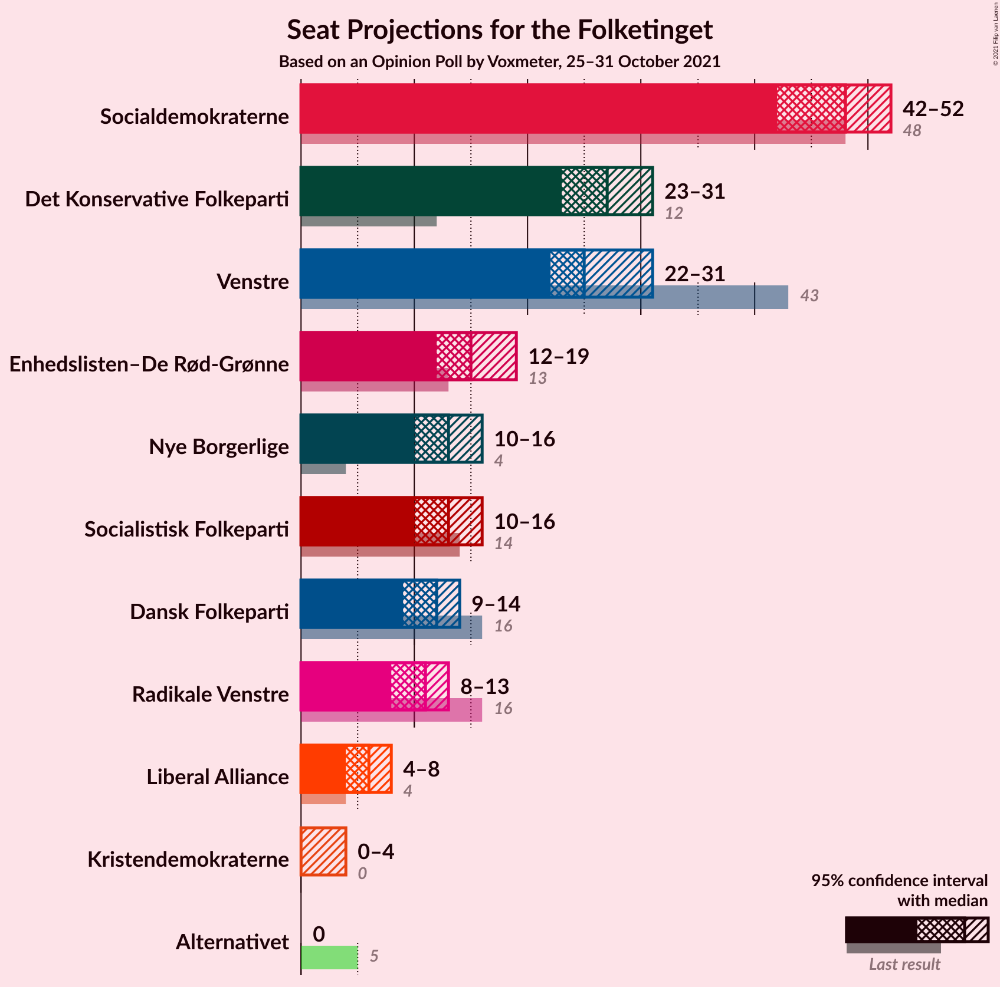
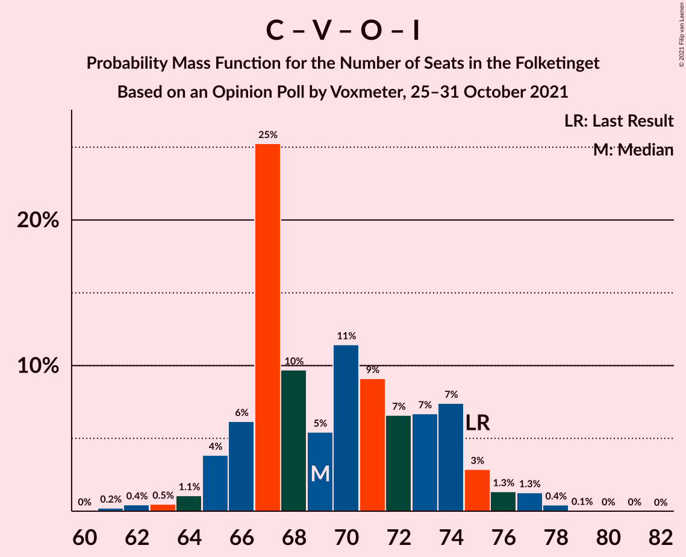
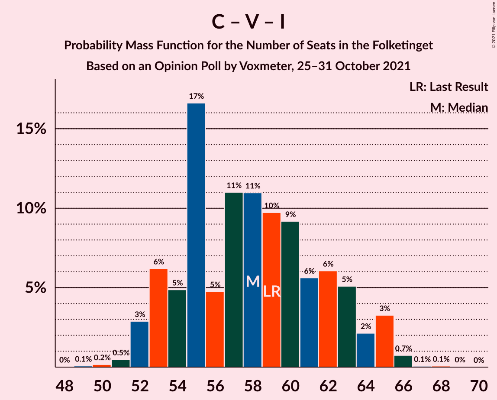

# Opinion Poll by Voxmeter, 25–31 October 2021

<a href="#voting-intentions">Voting Intentions</a> | <a href="#seats">Seats</a> | <a href="#coalitions">Coalitions</a> | <a href="#technical-information">Technical Information</a>

## Voting Intentions

### Confidence Intervals

| Party | Last Result | Poll Result | 80% Confidence Interval | 90% Confidence Interval | 95% Confidence Interval | 99% Confidence Interval |
|:-----:|:-----------:|:-----------:|:-----------------------:|:-----------------------:|:-----------------------:|:-----------------------:|
| Socialdemokraterne | 25.9% | 26.8% | 25.0–28.6% |24.5–29.2% |24.1–29.6% |23.3–30.5% |
| Det Konservative Folkeparti | 6.6% | 15.0% | 13.6–16.5% |13.2–17.0% |12.9–17.3% |12.3–18.1% |
| Venstre | 23.4% | 14.6% | 13.2–16.1% |12.8–16.5% |12.5–16.9% |11.9–17.7% |
| Enhedslisten–De Rød-Grønne | 6.9% | 8.6% | 7.5–9.8% |7.3–10.2% |7.0–10.5% |6.5–11.1% |
| Socialistisk Folkeparti | 7.7% | 7.2% | 6.2–8.4% |6.0–8.7% |5.7–9.0% |5.3–9.6% |
| Nye Borgerlige | 2.4% | 7.1% | 6.1–8.2% |5.9–8.6% |5.7–8.9% |5.2–9.4% |
| Dansk Folkeparti | 8.7% | 6.4% | 5.5–7.5% |5.2–7.8% |5.0–8.1% |4.6–8.7% |
| Radikale Venstre | 8.6% | 5.9% | 5.0–7.0% |4.8–7.3% |4.6–7.5% |4.2–8.1% |
| Liberal Alliance | 2.3% | 3.3% | 2.7–4.1% |2.5–4.4% |2.3–4.6% |2.1–5.0% |
| Kristendemokraterne | 1.7% | 1.4% | 1.0–2.0% |0.9–2.2% |0.8–2.3% |0.7–2.7% |
| Alternativet | 3.0% | 0.6% | 0.4–1.1% |0.3–1.2% |0.3–1.3% |0.2–1.6% |

*Note:* The poll result column reflects the actual value used in the calculations. Published results may vary slightly, and in addition be rounded to fewer digits.

## Seats

### Confidence Intervals

| Party | Last Result | Median | 80% Confidence Interval | 90% Confidence Interval | 95% Confidence Interval | 99% Confidence Interval |
|:-----:|:-----------:|:------:|:-----------------------:|:-----------------------:|:-----------------------:|:-----------------------:|
| <a href="#socialdemokraterne">Socialdemokraterne</a> | 48 | 48 | 44–52 |43–52 |42–52 |41–54 |
| <a href="#det-konservative-folkeparti">Det Konservative Folkeparti</a> | 12 | 27 | 24–29 |23–30 |23–31 |21–31 |
| <a href="#venstre">Venstre</a> | 43 | 25 | 23–29 |22–30 |22–31 |20–32 |
| <a href="#enhedslisten–de-rød-grønne">Enhedslisten–De Rød-Grønne</a> | 13 | 15 | 13–17 |12–18 |12–19 |12–20 |
| <a href="#socialistisk-folkeparti">Socialistisk Folkeparti</a> | 14 | 13 | 11–15 |10–16 |10–16 |9–17 |
| <a href="#nye-borgerlige">Nye Borgerlige</a> | 4 | 13 | 11–15 |10–15 |10–16 |9–17 |
| <a href="#dansk-folkeparti">Dansk Folkeparti</a> | 16 | 12 | 9–14 |9–14 |9–14 |8–16 |
| <a href="#radikale-venstre">Radikale Venstre</a> | 16 | 11 | 9–13 |8–13 |8–13 |7–14 |
| <a href="#liberal-alliance">Liberal Alliance</a> | 4 | 6 | 5–7 |4–8 |4–8 |4–10 |
| <a href="#kristendemokraterne">Kristendemokraterne</a> | 0 | 0 | 0–4 |0–4 |0–4 |0–5 |
| <a href="#alternativet">Alternativet</a> | 5 | 0 | 0 |0 |0 |0 |

### Socialdemokraterne

*For a full overview of the results for this party, see the [Socialdemokraterne](party-socialdemokraterne.html) page.*

| Number of Seats | Probability | Accumulated | Special Marks |
|:---------------:|:-----------:|:-----------:|:-------------:|
| 39 | 0.1% | 100% |  |
| 40 | 0.2% | 99.9% |  |
| 41 | 1.4% | 99.7% |  |
| 42 | 1.1% | 98% |  |
| 43 | 3% | 97% |  |
| 44 | 8% | 94% |  |
| 45 | 11% | 86% |  |
| 46 | 7% | 76% |  |
| 47 | 10% | 68% |  |
| 48 | 21% | 58% | Last Result, Median |
| 49 | 8% | 37% |  |
| 50 | 7% | 29% |  |
| 51 | 7% | 22% |  |
| 52 | 13% | 15% |  |
| 53 | 1.3% | 2% |  |
| 54 | 0.1% | 0.6% |  |
| 55 | 0.3% | 0.5% |  |
| 56 | 0.1% | 0.2% |  |
| 57 | 0.1% | 0.1% |  |
| 58 | 0% | 0% |  |

### Det Konservative Folkeparti

*For a full overview of the results for this party, see the [Det Konservative Folkeparti](party-detkonservativefolkeparti.html) page.*

| Number of Seats | Probability | Accumulated | Special Marks |
|:---------------:|:-----------:|:-----------:|:-------------:|
| 12 | 0% | 100% | Last Result |
| 13 | 0% | 100% |  |
| 14 | 0% | 100% |  |
| 15 | 0% | 100% |  |
| 16 | 0% | 100% |  |
| 17 | 0% | 100% |  |
| 18 | 0% | 100% |  |
| 19 | 0% | 100% |  |
| 20 | 0.1% | 100% |  |
| 21 | 0.5% | 99.9% |  |
| 22 | 0.9% | 99.4% |  |
| 23 | 8% | 98.6% |  |
| 24 | 8% | 91% |  |
| 25 | 14% | 83% |  |
| 26 | 11% | 70% |  |
| 27 | 36% | 59% | Median |
| 28 | 10% | 23% |  |
| 29 | 5% | 13% |  |
| 30 | 5% | 8% |  |
| 31 | 3% | 3% |  |
| 32 | 0.3% | 0.5% |  |
| 33 | 0.1% | 0.2% |  |
| 34 | 0% | 0.1% |  |
| 35 | 0% | 0% |  |

### Venstre

*For a full overview of the results for this party, see the [Venstre](party-venstre.html) page.*

| Number of Seats | Probability | Accumulated | Special Marks |
|:---------------:|:-----------:|:-----------:|:-------------:|
| 19 | 0.2% | 100% |  |
| 20 | 0.4% | 99.8% |  |
| 21 | 1.2% | 99.4% |  |
| 22 | 5% | 98% |  |
| 23 | 19% | 93% |  |
| 24 | 10% | 74% |  |
| 25 | 19% | 64% | Median |
| 26 | 11% | 46% |  |
| 27 | 9% | 34% |  |
| 28 | 10% | 25% |  |
| 29 | 9% | 15% |  |
| 30 | 2% | 6% |  |
| 31 | 3% | 3% |  |
| 32 | 0.6% | 0.8% |  |
| 33 | 0.1% | 0.2% |  |
| 34 | 0% | 0% |  |
| 35 | 0% | 0% |  |
| 36 | 0% | 0% |  |
| 37 | 0% | 0% |  |
| 38 | 0% | 0% |  |
| 39 | 0% | 0% |  |
| 40 | 0% | 0% |  |
| 41 | 0% | 0% |  |
| 42 | 0% | 0% |  |
| 43 | 0% | 0% | Last Result |

### Enhedslisten–De Rød-Grønne

*For a full overview of the results for this party, see the [Enhedslisten–De Rød-Grønne](party-enhedslisten–derød-grønne.html) page.*

| Number of Seats | Probability | Accumulated | Special Marks |
|:---------------:|:-----------:|:-----------:|:-------------:|
| 10 | 0.1% | 100% |  |
| 11 | 0.4% | 99.9% |  |
| 12 | 9% | 99.5% |  |
| 13 | 8% | 91% | Last Result |
| 14 | 26% | 83% |  |
| 15 | 22% | 57% | Median |
| 16 | 11% | 35% |  |
| 17 | 15% | 24% |  |
| 18 | 6% | 9% |  |
| 19 | 2% | 3% |  |
| 20 | 0.7% | 1.0% |  |
| 21 | 0.3% | 0.3% |  |
| 22 | 0% | 0% |  |

### Socialistisk Folkeparti

*For a full overview of the results for this party, see the [Socialistisk Folkeparti](party-socialistiskfolkeparti.html) page.*

| Number of Seats | Probability | Accumulated | Special Marks |
|:---------------:|:-----------:|:-----------:|:-------------:|
| 9 | 2% | 100% |  |
| 10 | 5% | 98% |  |
| 11 | 13% | 92% |  |
| 12 | 22% | 80% |  |
| 13 | 24% | 57% | Median |
| 14 | 23% | 34% | Last Result |
| 15 | 5% | 10% |  |
| 16 | 5% | 6% |  |
| 17 | 0.6% | 0.9% |  |
| 18 | 0.3% | 0.3% |  |
| 19 | 0.1% | 0.1% |  |
| 20 | 0% | 0% |  |

### Nye Borgerlige

*For a full overview of the results for this party, see the [Nye Borgerlige](party-nyeborgerlige.html) page.*

| Number of Seats | Probability | Accumulated | Special Marks |
|:---------------:|:-----------:|:-----------:|:-------------:|
| 4 | 0% | 100% | Last Result |
| 5 | 0% | 100% |  |
| 6 | 0% | 100% |  |
| 7 | 0% | 100% |  |
| 8 | 0.3% | 100% |  |
| 9 | 0.9% | 99.7% |  |
| 10 | 8% | 98.8% |  |
| 11 | 10% | 91% |  |
| 12 | 24% | 81% |  |
| 13 | 24% | 57% | Median |
| 14 | 21% | 33% |  |
| 15 | 7% | 11% |  |
| 16 | 3% | 5% |  |
| 17 | 0.8% | 1.1% |  |
| 18 | 0.3% | 0.3% |  |
| 19 | 0% | 0% |  |

### Dansk Folkeparti

*For a full overview of the results for this party, see the [Dansk Folkeparti](party-danskfolkeparti.html) page.*

| Number of Seats | Probability | Accumulated | Special Marks |
|:---------------:|:-----------:|:-----------:|:-------------:|
| 7 | 0.1% | 100% |  |
| 8 | 0.9% | 99.9% |  |
| 9 | 13% | 99.0% |  |
| 10 | 15% | 86% |  |
| 11 | 15% | 71% |  |
| 12 | 33% | 56% | Median |
| 13 | 8% | 23% |  |
| 14 | 13% | 15% |  |
| 15 | 0.7% | 2% |  |
| 16 | 1.1% | 1.4% | Last Result |
| 17 | 0.3% | 0.3% |  |
| 18 | 0% | 0% |  |

### Radikale Venstre

*For a full overview of the results for this party, see the [Radikale Venstre](party-radikalevenstre.html) page.*

| Number of Seats | Probability | Accumulated | Special Marks |
|:---------------:|:-----------:|:-----------:|:-------------:|
| 7 | 1.1% | 100% |  |
| 8 | 7% | 98.9% |  |
| 9 | 24% | 92% |  |
| 10 | 14% | 68% |  |
| 11 | 22% | 54% | Median |
| 12 | 21% | 32% |  |
| 13 | 10% | 11% |  |
| 14 | 1.0% | 1.2% |  |
| 15 | 0.1% | 0.2% |  |
| 16 | 0.1% | 0.1% | Last Result |
| 17 | 0% | 0% |  |

### Liberal Alliance

*For a full overview of the results for this party, see the [Liberal Alliance](party-liberalalliance.html) page.*

| Number of Seats | Probability | Accumulated | Special Marks |
|:---------------:|:-----------:|:-----------:|:-------------:|
| 0 | 0.2% | 100% |  |
| 1 | 0% | 99.8% |  |
| 2 | 0% | 99.8% |  |
| 3 | 0% | 99.8% |  |
| 4 | 9% | 99.8% | Last Result |
| 5 | 32% | 91% |  |
| 6 | 31% | 59% | Median |
| 7 | 21% | 28% |  |
| 8 | 6% | 7% |  |
| 9 | 0.8% | 2% |  |
| 10 | 0.8% | 0.9% |  |
| 11 | 0% | 0% |  |

### Kristendemokraterne

*For a full overview of the results for this party, see the [Kristendemokraterne](party-kristendemokraterne.html) page.*

| Number of Seats | Probability | Accumulated | Special Marks |
|:---------------:|:-----------:|:-----------:|:-------------:|
| 0 | 88% | 100% | Last Result, Median |
| 1 | 0% | 12% |  |
| 2 | 0% | 12% |  |
| 3 | 0.3% | 12% |  |
| 4 | 10% | 11% |  |
| 5 | 0.9% | 1.0% |  |
| 6 | 0% | 0% |  |

### Alternativet

*For a full overview of the results for this party, see the [Alternativet](party-alternativet.html) page.*

| Number of Seats | Probability | Accumulated | Special Marks |
|:---------------:|:-----------:|:-----------:|:-------------:|
| 0 | 100% | 100% | Median |
| 1 | 0% | 0% |  |
| 2 | 0% | 0% |  |
| 3 | 0% | 0% |  |
| 4 | 0% | 0% |  |
| 5 | 0% | 0% | Last Result |

## Coalitions

### Confidence Intervals

| Coalition | Last Result | Median | Majority? | 80% Confidence Interval | 90% Confidence Interval | 95% Confidence Interval | 99% Confidence Interval |
|:---------:|:-----------:|:------:|:---------:|:-----------------------:|:-----------------------:|:-----------------------:|:-----------------------:|
| Socialdemokraterne – Enhedslisten–De Rød-Grønne – Socialistisk Folkeparti – Radikale Venstre – Alternativet | 96 | 86 | 15% | 82–90 | 81–90 | 80–91 | 78–93 |
| Socialdemokraterne – Enhedslisten–De Rød-Grønne – Socialistisk Folkeparti – Radikale Venstre | 91 | 86 | 15% | 82–90 | 81–90 | 80–91 | 78–93 |
| Det Konservative Folkeparti – Venstre – Nye Borgerlige – Dansk Folkeparti – Liberal Alliance – Kristendemokraterne | 79 | 82 | 2% | 79–87 | 79–88 | 78–89 | 76–90 |
| Det Konservative Folkeparti – Venstre – Nye Borgerlige – Dansk Folkeparti – Liberal Alliance | 79 | 82 | 1.1% | 79–87 | 78–88 | 77–89 | 75–90 |
| Socialdemokraterne – Enhedslisten–De Rød-Grønne – Socialistisk Folkeparti – Alternativet | 80 | 76 | 0% | 71–79 | 71–79 | 70–80 | 68–82 |
| Socialdemokraterne – Enhedslisten–De Rød-Grønne – Socialistisk Folkeparti | 75 | 76 | 0% | 71–79 | 71–79 | 70–80 | 68–82 |
| Det Konservative Folkeparti – Venstre – Dansk Folkeparti – Liberal Alliance – Kristendemokraterne | 75 | 70 | 0% | 67–74 | 66–76 | 65–77 | 63–78 |
| Det Konservative Folkeparti – Venstre – Dansk Folkeparti – Liberal Alliance | 75 | 69 | 0% | 66–74 | 65–75 | 65–76 | 62–78 |
| Socialdemokraterne – Socialistisk Folkeparti – Radikale Venstre | 78 | 72 | 0% | 67–75 | 66–75 | 65–75 | 63–78 |
| Det Konservative Folkeparti – Venstre – Liberal Alliance | 59 | 58 | 0% | 54–63 | 53–64 | 52–65 | 51–66 |
| Socialdemokraterne – Radikale Venstre | 64 | 59 | 0% | 54–61 | 53–62 | 52–64 | 51–65 |
| Det Konservative Folkeparti – Venstre | 55 | 52 | 0% | 49–56 | 47–58 | 47–59 | 45–60 |
| Venstre | 43 | 25 | 0% | 23–29 | 22–30 | 22–31 | 20–32 |

### Socialdemokraterne – Enhedslisten–De Rød-Grønne – Socialistisk Folkeparti – Radikale Venstre – Alternativet

| Number of Seats | Probability | Accumulated | Special Marks |
|:---------------:|:-----------:|:-----------:|:-------------:|
| 77 | 0.1% | 100% |  |
| 78 | 0.6% | 99.8% |  |
| 79 | 0.7% | 99.3% |  |
| 80 | 2% | 98.6% |  |
| 81 | 6% | 97% |  |
| 82 | 2% | 91% |  |
| 83 | 7% | 89% |  |
| 84 | 11% | 82% |  |
| 85 | 11% | 72% |  |
| 86 | 11% | 61% |  |
| 87 | 9% | 49% | Median |
| 88 | 20% | 40% |  |
| 89 | 6% | 21% |  |
| 90 | 11% | 15% | Majority |
| 91 | 3% | 4% |  |
| 92 | 0.4% | 1.5% |  |
| 93 | 0.7% | 1.1% |  |
| 94 | 0.3% | 0.4% |  |
| 95 | 0% | 0.1% |  |
| 96 | 0.1% | 0.1% | Last Result |
| 97 | 0% | 0% |  |

### Socialdemokraterne – Enhedslisten–De Rød-Grønne – Socialistisk Folkeparti – Radikale Venstre

| Number of Seats | Probability | Accumulated | Special Marks |
|:---------------:|:-----------:|:-----------:|:-------------:|
| 77 | 0.1% | 100% |  |
| 78 | 0.6% | 99.8% |  |
| 79 | 0.7% | 99.3% |  |
| 80 | 2% | 98.6% |  |
| 81 | 6% | 97% |  |
| 82 | 2% | 91% |  |
| 83 | 7% | 89% |  |
| 84 | 11% | 82% |  |
| 85 | 11% | 72% |  |
| 86 | 11% | 61% |  |
| 87 | 9% | 49% | Median |
| 88 | 20% | 40% |  |
| 89 | 6% | 21% |  |
| 90 | 11% | 15% | Majority |
| 91 | 3% | 4% | Last Result |
| 92 | 0.4% | 1.5% |  |
| 93 | 0.7% | 1.1% |  |
| 94 | 0.3% | 0.4% |  |
| 95 | 0% | 0.1% |  |
| 96 | 0.1% | 0.1% |  |
| 97 | 0% | 0% |  |

### Det Konservative Folkeparti – Venstre – Nye Borgerlige – Dansk Folkeparti – Liberal Alliance – Kristendemokraterne

| Number of Seats | Probability | Accumulated | Special Marks |
|:---------------:|:-----------:|:-----------:|:-------------:|
| 74 | 0.1% | 100% |  |
| 75 | 0.3% | 99.9% |  |
| 76 | 0.2% | 99.6% |  |
| 77 | 1.2% | 99.4% |  |
| 78 | 1.3% | 98% |  |
| 79 | 10% | 97% | Last Result |
| 80 | 20% | 87% |  |
| 81 | 8% | 67% |  |
| 82 | 9% | 59% |  |
| 83 | 10% | 50% | Median |
| 84 | 12% | 39% |  |
| 85 | 5% | 28% |  |
| 86 | 10% | 23% |  |
| 87 | 6% | 13% |  |
| 88 | 3% | 7% |  |
| 89 | 2% | 4% |  |
| 90 | 1.3% | 2% | Majority |
| 91 | 0.2% | 0.4% |  |
| 92 | 0.1% | 0.2% |  |
| 93 | 0% | 0.1% |  |
| 94 | 0% | 0% |  |

### Det Konservative Folkeparti – Venstre – Nye Borgerlige – Dansk Folkeparti – Liberal Alliance

| Number of Seats | Probability | Accumulated | Special Marks |
|:---------------:|:-----------:|:-----------:|:-------------:|
| 73 | 0% | 100% |  |
| 74 | 0.2% | 99.9% |  |
| 75 | 0.4% | 99.8% |  |
| 76 | 0.4% | 99.3% |  |
| 77 | 2% | 98.9% |  |
| 78 | 4% | 97% |  |
| 79 | 11% | 93% | Last Result |
| 80 | 23% | 83% |  |
| 81 | 9% | 60% |  |
| 82 | 8% | 52% |  |
| 83 | 10% | 43% | Median |
| 84 | 9% | 34% |  |
| 85 | 5% | 24% |  |
| 86 | 8% | 19% |  |
| 87 | 6% | 11% |  |
| 88 | 2% | 5% |  |
| 89 | 2% | 3% |  |
| 90 | 0.9% | 1.1% | Majority |
| 91 | 0.1% | 0.2% |  |
| 92 | 0.1% | 0.1% |  |
| 93 | 0% | 0% |  |

### Socialdemokraterne – Enhedslisten–De Rød-Grønne – Socialistisk Folkeparti – Alternativet

| Number of Seats | Probability | Accumulated | Special Marks |
|:---------------:|:-----------:|:-----------:|:-------------:|
| 66 | 0% | 100% |  |
| 67 | 0.2% | 99.9% |  |
| 68 | 0.5% | 99.8% |  |
| 69 | 2% | 99.3% |  |
| 70 | 2% | 98% |  |
| 71 | 6% | 96% |  |
| 72 | 6% | 90% |  |
| 73 | 8% | 83% |  |
| 74 | 11% | 76% |  |
| 75 | 9% | 64% |  |
| 76 | 11% | 55% | Median |
| 77 | 15% | 44% |  |
| 78 | 7% | 29% |  |
| 79 | 17% | 22% |  |
| 80 | 3% | 5% | Last Result |
| 81 | 1.3% | 2% |  |
| 82 | 0.6% | 1.0% |  |
| 83 | 0.3% | 0.5% |  |
| 84 | 0.1% | 0.2% |  |
| 85 | 0.1% | 0.1% |  |
| 86 | 0% | 0% |  |

### Socialdemokraterne – Enhedslisten–De Rød-Grønne – Socialistisk Folkeparti

| Number of Seats | Probability | Accumulated | Special Marks |
|:---------------:|:-----------:|:-----------:|:-------------:|
| 66 | 0% | 100% |  |
| 67 | 0.2% | 99.9% |  |
| 68 | 0.5% | 99.8% |  |
| 69 | 2% | 99.3% |  |
| 70 | 2% | 98% |  |
| 71 | 6% | 96% |  |
| 72 | 6% | 90% |  |
| 73 | 8% | 83% |  |
| 74 | 11% | 76% |  |
| 75 | 9% | 64% | Last Result |
| 76 | 11% | 55% | Median |
| 77 | 15% | 44% |  |
| 78 | 7% | 29% |  |
| 79 | 17% | 22% |  |
| 80 | 3% | 5% |  |
| 81 | 1.3% | 2% |  |
| 82 | 0.6% | 1.0% |  |
| 83 | 0.3% | 0.5% |  |
| 84 | 0.1% | 0.2% |  |
| 85 | 0.1% | 0.1% |  |
| 86 | 0% | 0% |  |

### Det Konservative Folkeparti – Venstre – Dansk Folkeparti – Liberal Alliance – Kristendemokraterne

| Number of Seats | Probability | Accumulated | Special Marks |
|:---------------:|:-----------:|:-----------:|:-------------:|
| 61 | 0.1% | 100% |  |
| 62 | 0.1% | 99.9% |  |
| 63 | 0.3% | 99.8% |  |
| 64 | 0.7% | 99.5% |  |
| 65 | 2% | 98.7% |  |
| 66 | 6% | 97% |  |
| 67 | 24% | 91% |  |
| 68 | 8% | 67% |  |
| 69 | 6% | 59% |  |
| 70 | 12% | 53% | Median |
| 71 | 10% | 41% |  |
| 72 | 8% | 31% |  |
| 73 | 7% | 24% |  |
| 74 | 8% | 16% |  |
| 75 | 3% | 8% | Last Result |
| 76 | 3% | 5% |  |
| 77 | 2% | 3% |  |
| 78 | 0.6% | 0.8% |  |
| 79 | 0.1% | 0.2% |  |
| 80 | 0.1% | 0.1% |  |
| 81 | 0% | 0.1% |  |
| 82 | 0% | 0% |  |

### Det Konservative Folkeparti – Venstre – Dansk Folkeparti – Liberal Alliance

| Number of Seats | Probability | Accumulated | Special Marks |
|:---------------:|:-----------:|:-----------:|:-------------:|
| 61 | 0.2% | 100% |  |
| 62 | 0.4% | 99.7% |  |
| 63 | 0.5% | 99.3% |  |
| 64 | 1.1% | 98.8% |  |
| 65 | 4% | 98% |  |
| 66 | 6% | 94% |  |
| 67 | 25% | 88% |  |
| 68 | 10% | 62% |  |
| 69 | 5% | 53% |  |
| 70 | 11% | 47% | Median |
| 71 | 9% | 36% |  |
| 72 | 7% | 27% |  |
| 73 | 7% | 20% |  |
| 74 | 7% | 13% |  |
| 75 | 3% | 6% | Last Result |
| 76 | 1.3% | 3% |  |
| 77 | 1.3% | 2% |  |
| 78 | 0.4% | 0.6% |  |
| 79 | 0.1% | 0.1% |  |
| 80 | 0% | 0.1% |  |
| 81 | 0% | 0% |  |

### Socialdemokraterne – Socialistisk Folkeparti – Radikale Venstre

| Number of Seats | Probability | Accumulated | Special Marks |
|:---------------:|:-----------:|:-----------:|:-------------:|
| 61 | 0.1% | 100% |  |
| 62 | 0.1% | 99.9% |  |
| 63 | 0.6% | 99.8% |  |
| 64 | 1.1% | 99.2% |  |
| 65 | 2% | 98% |  |
| 66 | 2% | 96% |  |
| 67 | 6% | 94% |  |
| 68 | 8% | 89% |  |
| 69 | 11% | 80% |  |
| 70 | 7% | 69% |  |
| 71 | 9% | 62% |  |
| 72 | 13% | 53% | Median |
| 73 | 15% | 39% |  |
| 74 | 14% | 25% |  |
| 75 | 8% | 11% |  |
| 76 | 1.2% | 2% |  |
| 77 | 0.6% | 1.3% |  |
| 78 | 0.4% | 0.7% | Last Result |
| 79 | 0.1% | 0.3% |  |
| 80 | 0.1% | 0.2% |  |
| 81 | 0.1% | 0.1% |  |
| 82 | 0% | 0% |  |

### Det Konservative Folkeparti – Venstre – Liberal Alliance

| Number of Seats | Probability | Accumulated | Special Marks |
|:---------------:|:-----------:|:-----------:|:-------------:|
| 49 | 0.1% | 100% |  |
| 50 | 0.2% | 99.9% |  |
| 51 | 0.5% | 99.7% |  |
| 52 | 3% | 99.3% |  |
| 53 | 6% | 96% |  |
| 54 | 5% | 90% |  |
| 55 | 17% | 85% |  |
| 56 | 5% | 69% |  |
| 57 | 11% | 64% |  |
| 58 | 11% | 53% | Median |
| 59 | 10% | 42% | Last Result |
| 60 | 9% | 32% |  |
| 61 | 6% | 23% |  |
| 62 | 6% | 17% |  |
| 63 | 5% | 11% |  |
| 64 | 2% | 6% |  |
| 65 | 3% | 4% |  |
| 66 | 0.7% | 0.9% |  |
| 67 | 0.1% | 0.2% |  |
| 68 | 0.1% | 0.1% |  |
| 69 | 0% | 0% |  |

### Socialdemokraterne – Radikale Venstre

| Number of Seats | Probability | Accumulated | Special Marks |
|:---------------:|:-----------:|:-----------:|:-------------:|
| 49 | 0.1% | 100% |  |
| 50 | 0.3% | 99.9% |  |
| 51 | 0.2% | 99.6% |  |
| 52 | 2% | 99.4% |  |
| 53 | 3% | 97% |  |
| 54 | 8% | 94% |  |
| 55 | 4% | 86% |  |
| 56 | 10% | 83% |  |
| 57 | 9% | 73% |  |
| 58 | 6% | 64% |  |
| 59 | 15% | 58% | Median |
| 60 | 14% | 43% |  |
| 61 | 21% | 29% |  |
| 62 | 4% | 8% |  |
| 63 | 1.4% | 4% |  |
| 64 | 2% | 3% | Last Result |
| 65 | 0.5% | 0.7% |  |
| 66 | 0.1% | 0.3% |  |
| 67 | 0.1% | 0.2% |  |
| 68 | 0.1% | 0.1% |  |
| 69 | 0% | 0% |  |

### Det Konservative Folkeparti – Venstre

| Number of Seats | Probability | Accumulated | Special Marks |
|:---------------:|:-----------:|:-----------:|:-------------:|
| 44 | 0.2% | 100% |  |
| 45 | 0.5% | 99.8% |  |
| 46 | 0.5% | 99.3% |  |
| 47 | 4% | 98.7% |  |
| 48 | 5% | 95% |  |
| 49 | 11% | 90% |  |
| 50 | 15% | 79% |  |
| 51 | 11% | 63% |  |
| 52 | 12% | 53% | Median |
| 53 | 9% | 41% |  |
| 54 | 10% | 32% |  |
| 55 | 8% | 23% | Last Result |
| 56 | 6% | 14% |  |
| 57 | 3% | 9% |  |
| 58 | 2% | 6% |  |
| 59 | 2% | 4% |  |
| 60 | 1.2% | 1.3% |  |
| 61 | 0.1% | 0.2% |  |
| 62 | 0% | 0% |  |

### Venstre

| Number of Seats | Probability | Accumulated | Special Marks |
|:---------------:|:-----------:|:-----------:|:-------------:|
| 19 | 0.2% | 100% |  |
| 20 | 0.4% | 99.8% |  |
| 21 | 1.2% | 99.4% |  |
| 22 | 5% | 98% |  |
| 23 | 19% | 93% |  |
| 24 | 10% | 74% |  |
| 25 | 19% | 64% | Median |
| 26 | 11% | 46% |  |
| 27 | 9% | 34% |  |
| 28 | 10% | 25% |  |
| 29 | 9% | 15% |  |
| 30 | 2% | 6% |  |
| 31 | 3% | 3% |  |
| 32 | 0.6% | 0.8% |  |
| 33 | 0.1% | 0.2% |  |
| 34 | 0% | 0% |  |
| 35 | 0% | 0% |  |
| 36 | 0% | 0% |  |
| 37 | 0% | 0% |  |
| 38 | 0% | 0% |  |
| 39 | 0% | 0% |  |
| 40 | 0% | 0% |  |
| 41 | 0% | 0% |  |
| 42 | 0% | 0% |  |
| 43 | 0% | 0% | Last Result |

## Technical Information

### Opinion Poll

+ **Polling firm:** Voxmeter
+ **Commissioner(s):** —
+ **Fieldwork period:** 25–31 October 2021

### Calculations

+ **Sample size:** 1001
+ **Simulations done:** 1,048,576
+ **Error estimate:** 1.86%

