# Opinion Poll by Megafon, 8–10 November 2021

<a href="#voting-intentions">Voting Intentions</a> | <a href="#seats">Seats</a> | <a href="#coalitions">Coalitions</a> | <a href="#technical-information">Technical Information</a>

## Voting Intentions

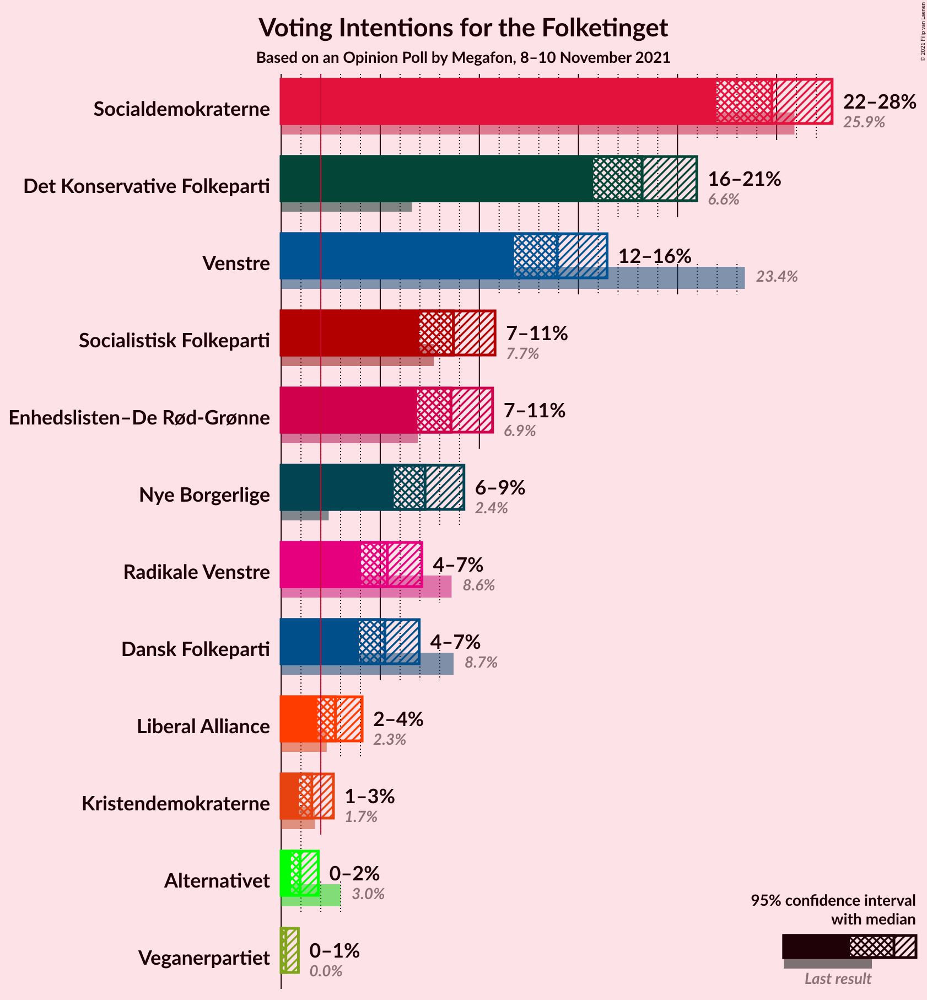

### Confidence Intervals

| Party | Last Result | Poll Result | 80% Confidence Interval | 90% Confidence Interval | 95% Confidence Interval | 99% Confidence Interval |
|:-----:|:-----------:|:-----------:|:-----------------------:|:-----------------------:|:-----------------------:|:-----------------------:|
| Socialdemokraterne | 25.9% | 24.8% | 22.9–26.7% |22.4–27.3% |22.0–27.8% |21.1–28.8% |
| Det Konservative Folkeparti | 6.6% | 18.2% | 16.6–20.0% |16.1–20.5% |15.7–21.0% |15.0–21.9% |
| Venstre | 23.4% | 13.9% | 12.5–15.6% |12.1–16.0% |11.8–16.4% |11.1–17.3% |
| Socialistisk Folkeparti | 7.7% | 8.7% | 7.6–10.1% |7.2–10.5% |7.0–10.8% |6.5–11.5% |
| Enhedslisten–De Rød-Grønne | 6.9% | 8.6% | 7.4–9.9% |7.1–10.3% |6.9–10.7% |6.4–11.4% |
| Nye Borgerlige | 2.4% | 7.3% | 6.2–8.6% |5.9–8.9% |5.7–9.2% |5.2–9.9% |
| Radikale Venstre | 8.6% | 5.4% | 4.5–6.5% |4.2–6.8% |4.0–7.1% |3.6–7.7% |
| Dansk Folkeparti | 8.7% | 5.2% | 4.4–6.4% |4.1–6.7% |3.9–7.0% |3.5–7.5% |
| Liberal Alliance | 2.3% | 2.7% | 2.1–3.6% |2.0–3.9% |1.8–4.1% |1.6–4.5% |
| Kristendemokraterne | 1.7% | 1.5% | 1.1–2.3% |1.0–2.5% |0.9–2.6% |0.7–3.0% |
| Alternativet | 3.0% | 1.0% | 0.6–1.6% |0.5–1.7% |0.5–1.9% |0.4–2.2% |
| Frie Grønne | 0.0% | 0.6% | 0.4–1.1% |0.3–1.2% |0.3–1.4% |0.2–1.7% |
| Veganerpartiet | 0.0% | 0.2% | 0.1–0.6% |0.1–0.7% |0.1–0.9% |0.0–1.1% |

*Note:* The poll result column reflects the actual value used in the calculations. Published results may vary slightly, and in addition be rounded to fewer digits.

## Seats

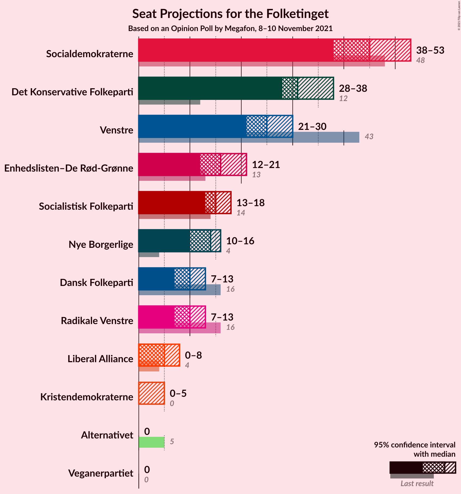

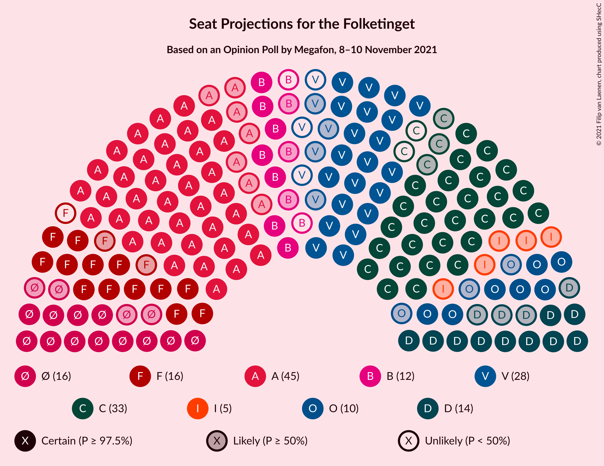

### Confidence Intervals

| Party | Last Result | Median | 80% Confidence Interval | 90% Confidence Interval | 95% Confidence Interval | 99% Confidence Interval |
|:-----:|:-----------:|:------:|:-----------------------:|:-----------------------:|:-----------------------:|:-----------------------:|
| <a href="#socialdemokraterne">Socialdemokraterne</a> | 48 | 44 | 43–44 |42–48 |41–49 |39–52 |
| <a href="#det-konservative-folkeparti">Det Konservative Folkeparti</a> | 12 | 33 | 32–33 |31–35 |30–38 |28–41 |
| <a href="#venstre">Venstre</a> | 43 | 25 | 24–25 |21–27 |20–29 |20–32 |
| <a href="#socialistisk-folkeparti">Socialistisk Folkeparti</a> | 14 | 16 | 14–16 |14–17 |13–18 |12–20 |
| <a href="#enhedslisten–de-rød-grønne">Enhedslisten–De Rød-Grønne</a> | 13 | 13 | 13–17 |13–17 |13–18 |11–22 |
| <a href="#nye-borgerlige">Nye Borgerlige</a> | 4 | 12 | 12–14 |11–15 |11–17 |10–18 |
| <a href="#radikale-venstre">Radikale Venstre</a> | 16 | 10 | 9–10 |9–12 |8–13 |7–14 |
| <a href="#dansk-folkeparti">Dansk Folkeparti</a> | 16 | 11 | 9–11 |9–11 |8–12 |7–13 |
| <a href="#liberal-alliance">Liberal Alliance</a> | 4 | 7 | 4–7 |4–7 |4–7 |0–8 |
| <a href="#kristendemokraterne">Kristendemokraterne</a> | 0 | 0 | 0 |0–4 |0–4 |0–6 |
| <a href="#alternativet">Alternativet</a> | 5 | 0 | 0 |0 |0 |0 |
| <a href="#frie-grønne">Frie Grønne</a> | 0 | 0 | 0 |0 |0 |0 |
| <a href="#veganerpartiet">Veganerpartiet</a> | 0 | 0 | 0 |0 |0 |0 |

### Socialdemokraterne

*For a full overview of the results for this party, see the [Socialdemokraterne](party-socialdemokraterne.html) page.*

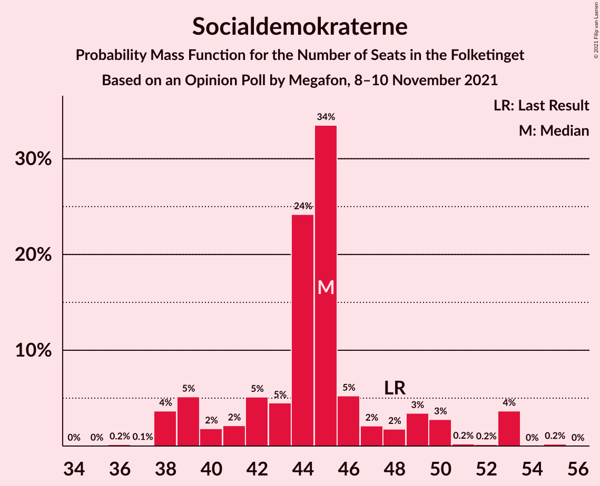

| Number of Seats | Probability | Accumulated | Special Marks |
|:---------------:|:-----------:|:-----------:|:-------------:|
| 37 | 0.2% | 100% |  |
| 38 | 0.1% | 99.8% |  |
| 39 | 1.0% | 99.7% |  |
| 40 | 1.2% | 98.7% |  |
| 41 | 0.4% | 98% |  |
| 42 | 6% | 97% |  |
| 43 | 5% | 91% |  |
| 44 | 77% | 86% | Median |
| 45 | 1.0% | 10% |  |
| 46 | 0.5% | 9% |  |
| 47 | 2% | 8% |  |
| 48 | 3% | 6% | Last Result |
| 49 | 0.7% | 3% |  |
| 50 | 0.9% | 2% |  |
| 51 | 0.5% | 1.3% |  |
| 52 | 0.6% | 0.8% |  |
| 53 | 0.1% | 0.1% |  |
| 54 | 0% | 0.1% |  |
| 55 | 0% | 0% |  |

### Det Konservative Folkeparti

*For a full overview of the results for this party, see the [Det Konservative Folkeparti](party-detkonservativefolkeparti.html) page.*

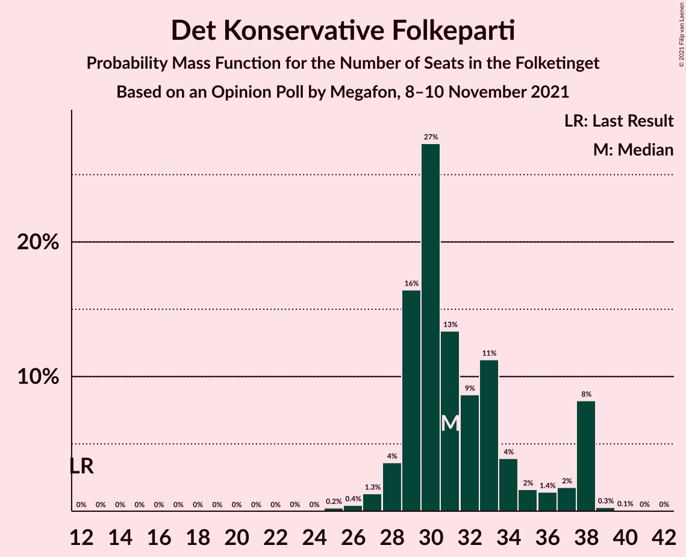

| Number of Seats | Probability | Accumulated | Special Marks |
|:---------------:|:-----------:|:-----------:|:-------------:|
| 12 | 0% | 100% | Last Result |
| 13 | 0% | 100% |  |
| 14 | 0% | 100% |  |
| 15 | 0% | 100% |  |
| 16 | 0% | 100% |  |
| 17 | 0% | 100% |  |
| 18 | 0% | 100% |  |
| 19 | 0% | 100% |  |
| 20 | 0% | 100% |  |
| 21 | 0% | 100% |  |
| 22 | 0% | 100% |  |
| 23 | 0% | 100% |  |
| 24 | 0% | 100% |  |
| 25 | 0% | 100% |  |
| 26 | 0.1% | 100% |  |
| 27 | 0.3% | 99.9% |  |
| 28 | 0.8% | 99.6% |  |
| 29 | 0.8% | 98.7% |  |
| 30 | 1.0% | 98% |  |
| 31 | 4% | 97% |  |
| 32 | 5% | 92% |  |
| 33 | 77% | 87% | Median |
| 34 | 4% | 10% |  |
| 35 | 1.4% | 6% |  |
| 36 | 2% | 5% |  |
| 37 | 0.4% | 3% |  |
| 38 | 1.1% | 3% |  |
| 39 | 0.9% | 1.5% |  |
| 40 | 0% | 0.5% |  |
| 41 | 0.4% | 0.5% |  |
| 42 | 0% | 0.1% |  |
| 43 | 0.1% | 0.1% |  |
| 44 | 0% | 0% |  |

### Venstre

*For a full overview of the results for this party, see the [Venstre](party-venstre.html) page.*

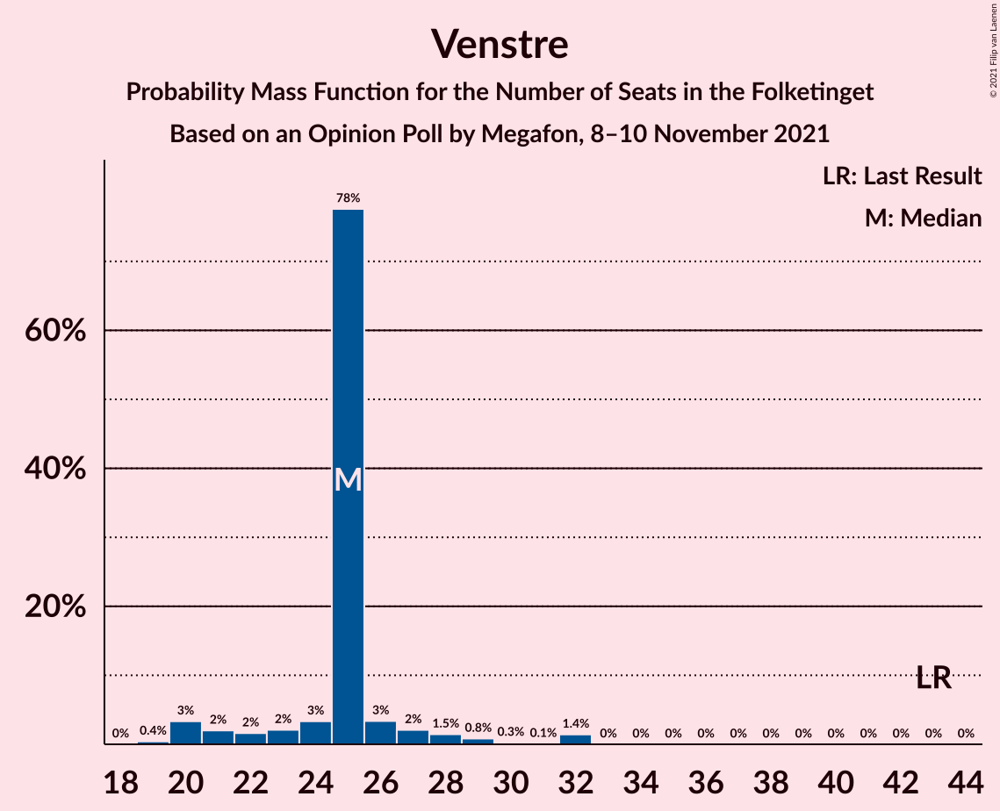

| Number of Seats | Probability | Accumulated | Special Marks |
|:---------------:|:-----------:|:-----------:|:-------------:|
| 19 | 0.4% | 100% |  |
| 20 | 3% | 99.6% |  |
| 21 | 2% | 96% |  |
| 22 | 2% | 94% |  |
| 23 | 2% | 93% |  |
| 24 | 3% | 90% |  |
| 25 | 78% | 87% | Median |
| 26 | 3% | 10% |  |
| 27 | 2% | 6% |  |
| 28 | 1.5% | 4% |  |
| 29 | 0.8% | 3% |  |
| 30 | 0.3% | 2% |  |
| 31 | 0.1% | 2% |  |
| 32 | 1.4% | 1.4% |  |
| 33 | 0% | 0% |  |
| 34 | 0% | 0% |  |
| 35 | 0% | 0% |  |
| 36 | 0% | 0% |  |
| 37 | 0% | 0% |  |
| 38 | 0% | 0% |  |
| 39 | 0% | 0% |  |
| 40 | 0% | 0% |  |
| 41 | 0% | 0% |  |
| 42 | 0% | 0% |  |
| 43 | 0% | 0% | Last Result |

### Socialistisk Folkeparti

*For a full overview of the results for this party, see the [Socialistisk Folkeparti](party-socialistiskfolkeparti.html) page.*

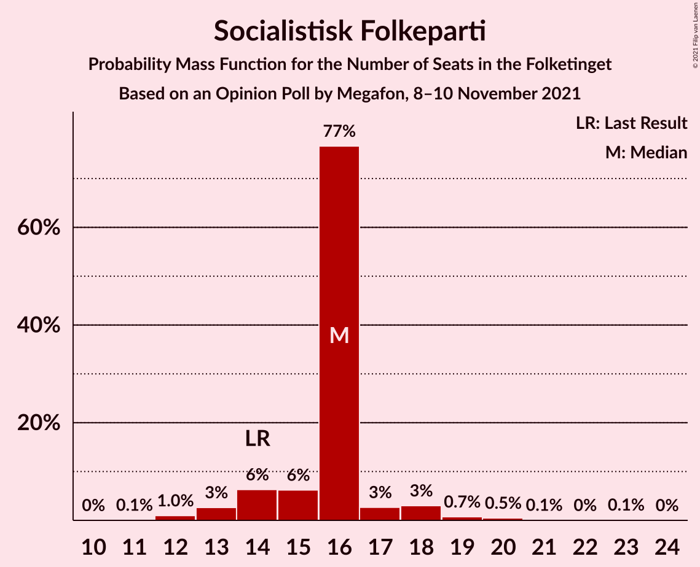

| Number of Seats | Probability | Accumulated | Special Marks |
|:---------------:|:-----------:|:-----------:|:-------------:|
| 11 | 0.1% | 100% |  |
| 12 | 1.0% | 99.9% |  |
| 13 | 3% | 98.9% |  |
| 14 | 6% | 96% | Last Result |
| 15 | 6% | 90% |  |
| 16 | 77% | 84% | Median |
| 17 | 3% | 7% |  |
| 18 | 3% | 4% |  |
| 19 | 0.7% | 1.4% |  |
| 20 | 0.5% | 0.7% |  |
| 21 | 0.1% | 0.2% |  |
| 22 | 0% | 0.1% |  |
| 23 | 0.1% | 0.1% |  |
| 24 | 0% | 0% |  |

### Enhedslisten–De Rød-Grønne

*For a full overview of the results for this party, see the [Enhedslisten–De Rød-Grønne](party-enhedslisten–derød-grønne.html) page.*

| Number of Seats | Probability | Accumulated | Special Marks |
|:---------------:|:-----------:|:-----------:|:-------------:|
| 11 | 0.6% | 100% |  |
| 12 | 1.1% | 99.4% |  |
| 13 | 78% | 98% | Last Result, Median |
| 14 | 3% | 21% |  |
| 15 | 4% | 17% |  |
| 16 | 3% | 14% |  |
| 17 | 7% | 10% |  |
| 18 | 2% | 4% |  |
| 19 | 0.5% | 2% |  |
| 20 | 0.3% | 2% |  |
| 21 | 0.1% | 1.3% |  |
| 22 | 1.2% | 1.2% |  |
| 23 | 0% | 0.1% |  |
| 24 | 0.1% | 0.1% |  |
| 25 | 0% | 0% |  |

### Nye Borgerlige

*For a full overview of the results for this party, see the [Nye Borgerlige](party-nyeborgerlige.html) page.*

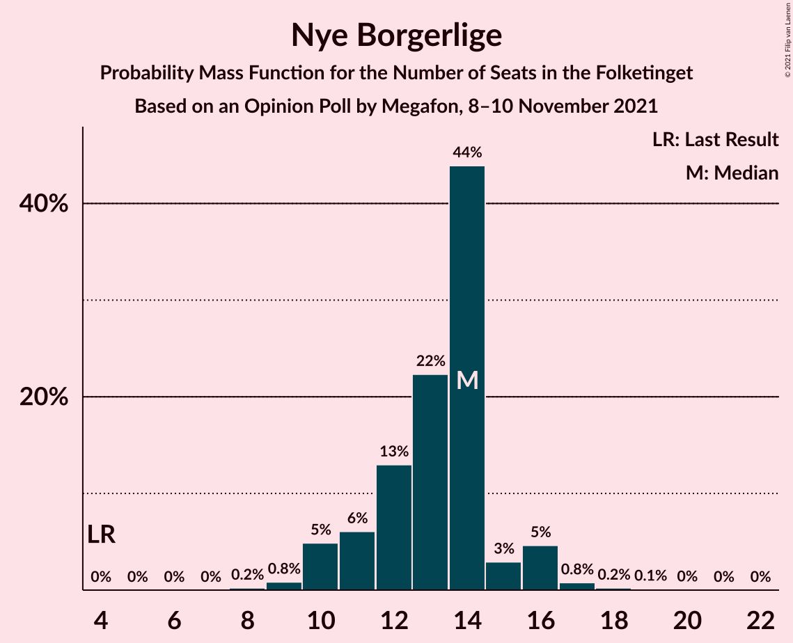

| Number of Seats | Probability | Accumulated | Special Marks |
|:---------------:|:-----------:|:-----------:|:-------------:|
| 4 | 0% | 100% | Last Result |
| 5 | 0% | 100% |  |
| 6 | 0% | 100% |  |
| 7 | 0% | 100% |  |
| 8 | 0.2% | 100% |  |
| 9 | 0.2% | 99.8% |  |
| 10 | 2% | 99.6% |  |
| 11 | 3% | 98% |  |
| 12 | 77% | 95% | Median |
| 13 | 4% | 18% |  |
| 14 | 6% | 13% |  |
| 15 | 3% | 8% |  |
| 16 | 0.7% | 5% |  |
| 17 | 4% | 4% |  |
| 18 | 0.5% | 0.6% |  |
| 19 | 0% | 0.1% |  |
| 20 | 0.1% | 0.1% |  |
| 21 | 0% | 0% |  |

### Radikale Venstre

*For a full overview of the results for this party, see the [Radikale Venstre](party-radikalevenstre.html) page.*

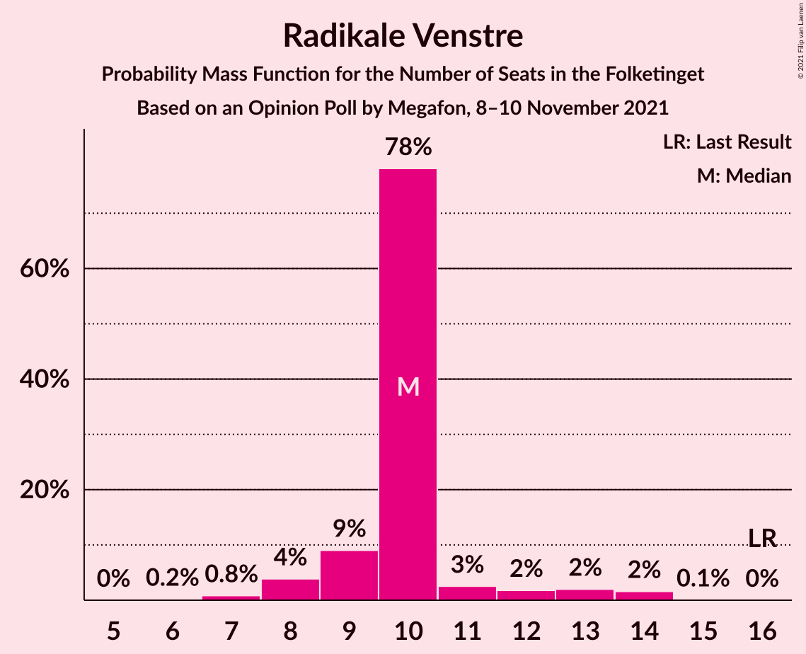

| Number of Seats | Probability | Accumulated | Special Marks |
|:---------------:|:-----------:|:-----------:|:-------------:|
| 6 | 0.2% | 100% |  |
| 7 | 0.8% | 99.8% |  |
| 8 | 4% | 99.0% |  |
| 9 | 9% | 95% |  |
| 10 | 78% | 86% | Median |
| 11 | 3% | 8% |  |
| 12 | 2% | 5% |  |
| 13 | 2% | 4% |  |
| 14 | 2% | 2% |  |
| 15 | 0.1% | 0.1% |  |
| 16 | 0% | 0% | Last Result |

### Dansk Folkeparti

*For a full overview of the results for this party, see the [Dansk Folkeparti](party-danskfolkeparti.html) page.*

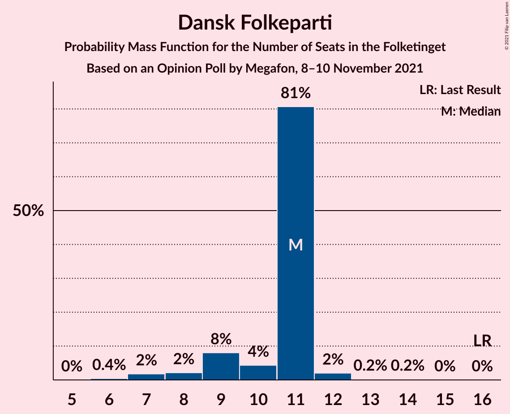

| Number of Seats | Probability | Accumulated | Special Marks |
|:---------------:|:-----------:|:-----------:|:-------------:|
| 6 | 0.4% | 100% |  |
| 7 | 2% | 99.6% |  |
| 8 | 2% | 98% |  |
| 9 | 8% | 96% |  |
| 10 | 4% | 88% |  |
| 11 | 81% | 83% | Median |
| 12 | 2% | 3% |  |
| 13 | 0.2% | 0.5% |  |
| 14 | 0.2% | 0.3% |  |
| 15 | 0% | 0.1% |  |
| 16 | 0% | 0% | Last Result |

### Liberal Alliance

*For a full overview of the results for this party, see the [Liberal Alliance](party-liberalalliance.html) page.*

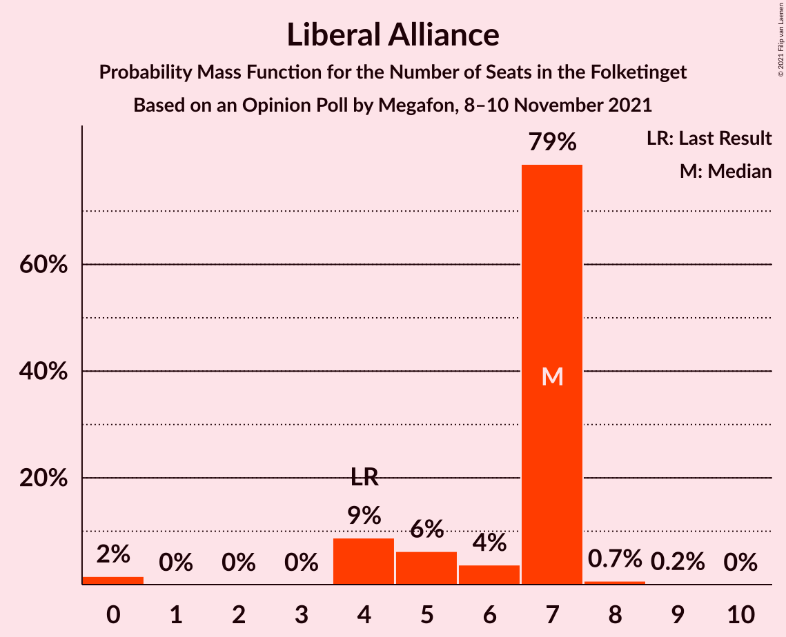

| Number of Seats | Probability | Accumulated | Special Marks |
|:---------------:|:-----------:|:-----------:|:-------------:|
| 0 | 2% | 100% |  |
| 1 | 0% | 98% |  |
| 2 | 0% | 98% |  |
| 3 | 0% | 98% |  |
| 4 | 9% | 98% | Last Result |
| 5 | 6% | 90% |  |
| 6 | 4% | 83% |  |
| 7 | 79% | 80% | Median |
| 8 | 0.7% | 0.9% |  |
| 9 | 0.2% | 0.2% |  |
| 10 | 0% | 0% |  |

### Kristendemokraterne

*For a full overview of the results for this party, see the [Kristendemokraterne](party-kristendemokraterne.html) page.*

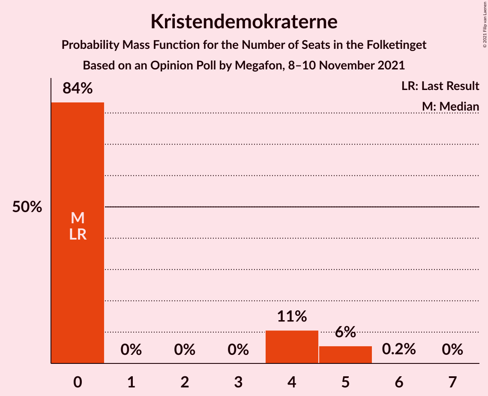

| Number of Seats | Probability | Accumulated | Special Marks |
|:---------------:|:-----------:|:-----------:|:-------------:|
| 0 | 91% | 100% | Last Result, Median |
| 1 | 0% | 9% |  |
| 2 | 0% | 9% |  |
| 3 | 0% | 9% |  |
| 4 | 7% | 9% |  |
| 5 | 0.7% | 2% |  |
| 6 | 2% | 2% |  |
| 7 | 0% | 0% |  |

### Alternativet

*For a full overview of the results for this party, see the [Alternativet](party-alternativet.html) page.*

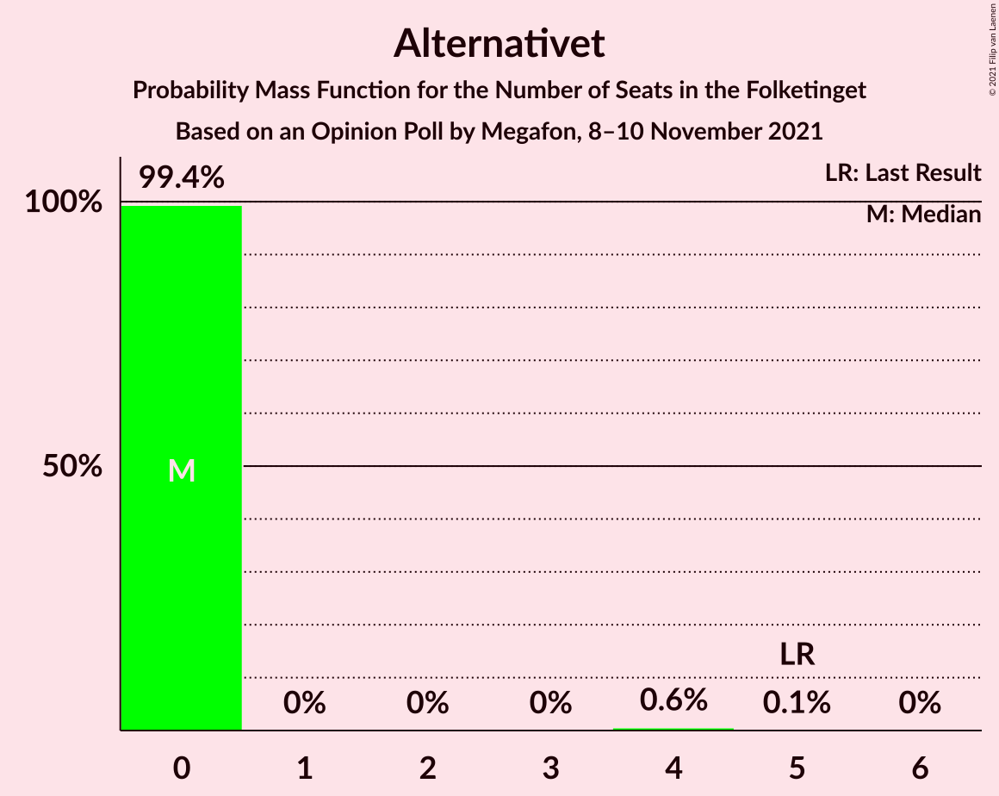

| Number of Seats | Probability | Accumulated | Special Marks |
|:---------------:|:-----------:|:-----------:|:-------------:|
| 0 | 99.7% | 100% | Median |
| 1 | 0% | 0.3% |  |
| 2 | 0% | 0.3% |  |
| 3 | 0% | 0.3% |  |
| 4 | 0.3% | 0.3% |  |
| 5 | 0% | 0% | Last Result |

### Frie Grønne

*For a full overview of the results for this party, see the [Frie Grønne](party-friegrønne.html) page.*

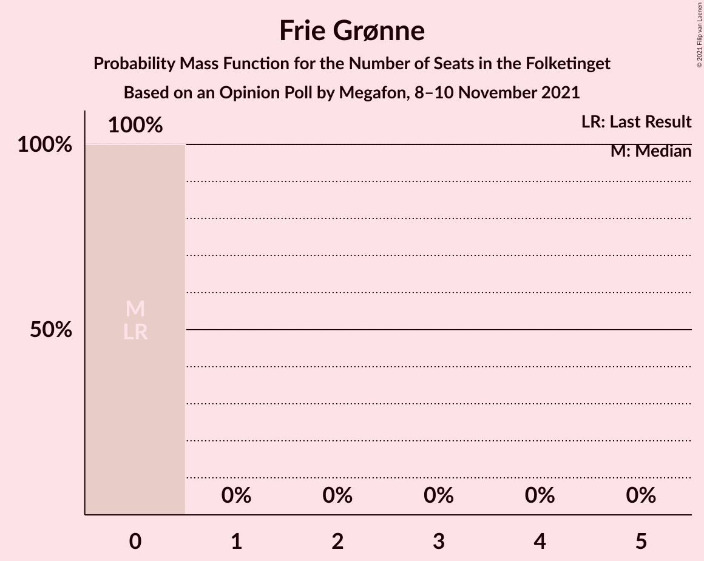

| Number of Seats | Probability | Accumulated | Special Marks |
|:---------------:|:-----------:|:-----------:|:-------------:|
| 0 | 100% | 100% | Last Result, Median |

### Veganerpartiet

*For a full overview of the results for this party, see the [Veganerpartiet](party-veganerpartiet.html) page.*

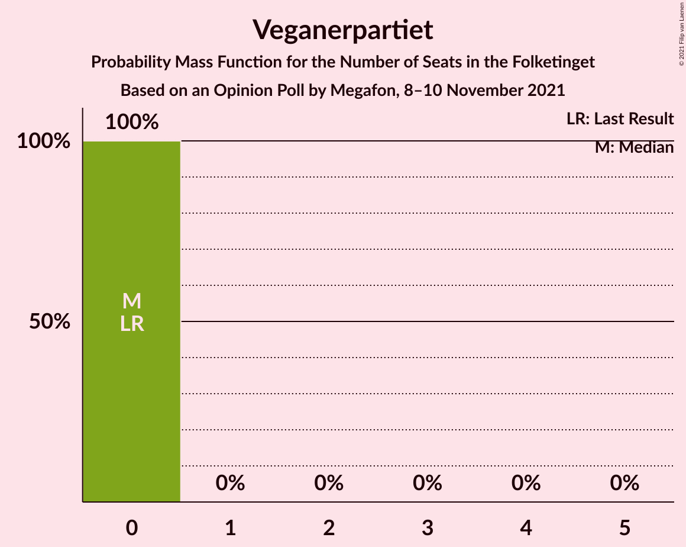

| Number of Seats | Probability | Accumulated | Special Marks |
|:---------------:|:-----------:|:-----------:|:-------------:|
| 0 | 100% | 100% | Last Result, Median |

## Coalitions

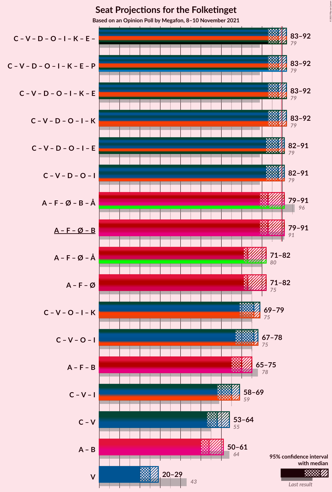

### Confidence Intervals

| Coalition | Last Result | Median | Majority? | 80% Confidence Interval | 90% Confidence Interval | 95% Confidence Interval | 99% Confidence Interval |
|:---------:|:-----------:|:------:|:---------:|:-----------------------:|:-----------------------:|:-----------------------:|:-----------------------:|
| Det Konservative Folkeparti – Venstre – Nye Borgerlige – Dansk Folkeparti – Liberal Alliance – Kristendemokraterne | 79 | 88 | 8% | 86–88 | 84–91 | 83–92 | 80–95 |
| Det Konservative Folkeparti – Venstre – Nye Borgerlige – Dansk Folkeparti – Liberal Alliance | 79 | 88 | 4% | 84–88 | 83–88 | 82–91 | 80–93 |
| Socialdemokraterne – Socialistisk Folkeparti – Enhedslisten–De Rød-Grønne – Radikale Venstre – Alternativet | 96 | 83 | 5% | 83–87 | 83–90 | 79–91 | 77–94 |
| Socialdemokraterne – Socialistisk Folkeparti – Enhedslisten–De Rød-Grønne – Radikale Venstre | 91 | 83 | 5% | 83–87 | 83–90 | 79–91 | 77–94 |
| Socialdemokraterne – Socialistisk Folkeparti – Enhedslisten–De Rød-Grønne – Alternativet | 80 | 73 | 0% | 73–75 | 73–80 | 71–82 | 69–84 |
| Socialdemokraterne – Socialistisk Folkeparti – Enhedslisten–De Rød-Grønne | 75 | 73 | 0% | 73–75 | 73–80 | 71–82 | 68–84 |
| Det Konservative Folkeparti – Venstre – Dansk Folkeparti – Liberal Alliance – Kristendemokraterne | 75 | 76 | 0% | 72–76 | 71–78 | 69–79 | 66–81 |
| Det Konservative Folkeparti – Venstre – Dansk Folkeparti – Liberal Alliance | 75 | 76 | 0% | 72–76 | 67–76 | 67–78 | 66–80 |
| Socialdemokraterne – Socialistisk Folkeparti – Radikale Venstre | 78 | 70 | 0% | 68–71 | 66–74 | 65–75 | 62–77 |
| Det Konservative Folkeparti – Venstre – Liberal Alliance | 59 | 65 | 0% | 61–65 | 58–67 | 58–69 | 55–70 |
| Det Konservative Folkeparti – Venstre | 55 | 58 | 0% | 57–58 | 54–61 | 53–64 | 51–64 |
| Socialdemokraterne – Radikale Venstre | 64 | 54 | 0% | 52–55 | 51–57 | 50–61 | 48–61 |
| Venstre | 43 | 25 | 0% | 24–25 | 21–27 | 20–29 | 20–32 |

### Det Konservative Folkeparti – Venstre – Nye Borgerlige – Dansk Folkeparti – Liberal Alliance – Kristendemokraterne

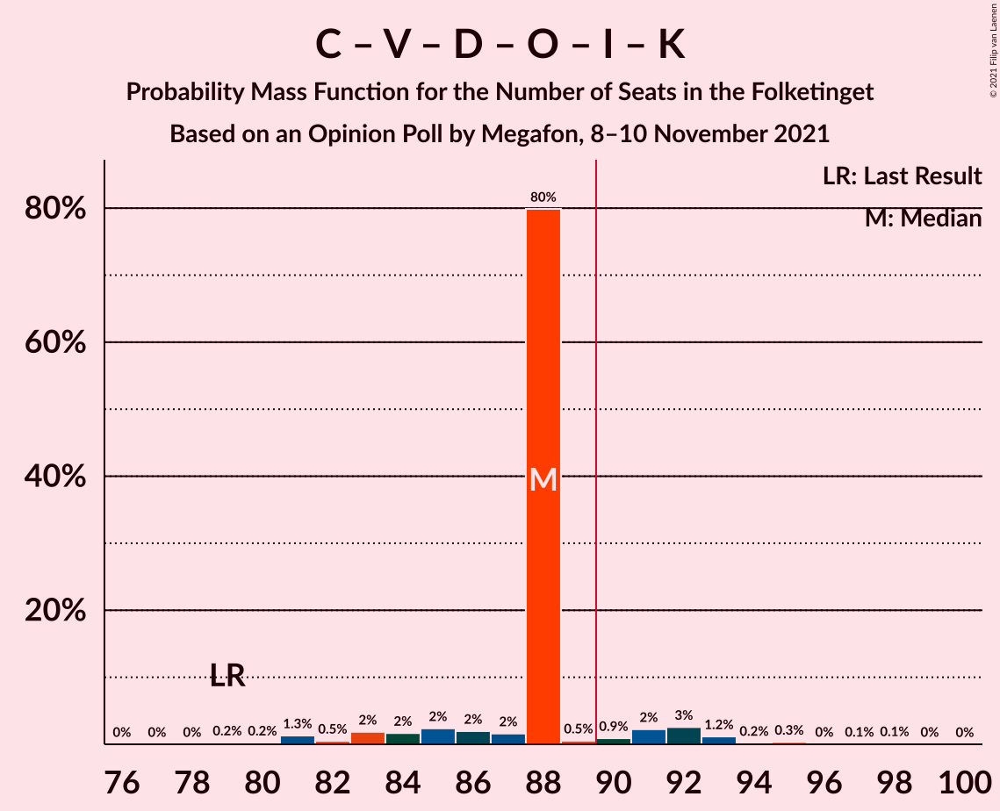

| Number of Seats | Probability | Accumulated | Special Marks |
|:---------------:|:-----------:|:-----------:|:-------------:|
| 77 | 0% | 100% |  |
| 78 | 0% | 99.9% |  |
| 79 | 0.2% | 99.9% | Last Result |
| 80 | 0.2% | 99.7% |  |
| 81 | 1.3% | 99.4% |  |
| 82 | 0.5% | 98% |  |
| 83 | 2% | 98% |  |
| 84 | 2% | 96% |  |
| 85 | 2% | 94% |  |
| 86 | 2% | 92% |  |
| 87 | 2% | 90% |  |
| 88 | 80% | 88% | Median |
| 89 | 0.5% | 8% |  |
| 90 | 0.9% | 8% | Majority |
| 91 | 2% | 7% |  |
| 92 | 3% | 5% |  |
| 93 | 1.2% | 2% |  |
| 94 | 0.2% | 0.8% |  |
| 95 | 0.3% | 0.6% |  |
| 96 | 0% | 0.3% |  |
| 97 | 0.1% | 0.2% |  |
| 98 | 0.1% | 0.2% |  |
| 99 | 0% | 0.1% |  |
| 100 | 0% | 0% |  |

### Det Konservative Folkeparti – Venstre – Nye Borgerlige – Dansk Folkeparti – Liberal Alliance

| Number of Seats | Probability | Accumulated | Special Marks |
|:---------------:|:-----------:|:-----------:|:-------------:|
| 76 | 0% | 100% |  |
| 77 | 0% | 99.9% |  |
| 78 | 0.1% | 99.9% |  |
| 79 | 0.3% | 99.8% | Last Result |
| 80 | 0.3% | 99.5% |  |
| 81 | 2% | 99.2% |  |
| 82 | 1.2% | 98% |  |
| 83 | 2% | 96% |  |
| 84 | 5% | 95% |  |
| 85 | 2% | 90% |  |
| 86 | 3% | 87% |  |
| 87 | 3% | 84% |  |
| 88 | 77% | 81% | Median |
| 89 | 0.5% | 4% |  |
| 90 | 0.7% | 4% | Majority |
| 91 | 0.6% | 3% |  |
| 92 | 0.9% | 2% |  |
| 93 | 1.2% | 1.5% |  |
| 94 | 0.2% | 0.3% |  |
| 95 | 0% | 0.1% |  |
| 96 | 0% | 0.1% |  |
| 97 | 0% | 0.1% |  |
| 98 | 0% | 0% |  |

### Socialdemokraterne – Socialistisk Folkeparti – Enhedslisten–De Rød-Grønne – Radikale Venstre – Alternativet

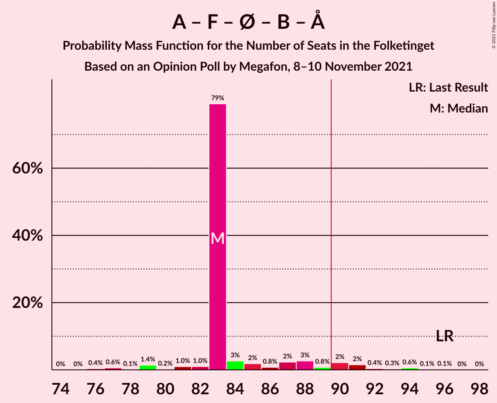

| Number of Seats | Probability | Accumulated | Special Marks |
|:---------------:|:-----------:|:-----------:|:-------------:|
| 76 | 0.4% | 100% |  |
| 77 | 0.6% | 99.6% |  |
| 78 | 0.1% | 99.0% |  |
| 79 | 1.4% | 98.9% |  |
| 80 | 0.2% | 97% |  |
| 81 | 1.0% | 97% |  |
| 82 | 1.0% | 96% |  |
| 83 | 79% | 95% | Median |
| 84 | 3% | 16% |  |
| 85 | 2% | 14% |  |
| 86 | 0.8% | 12% |  |
| 87 | 2% | 11% |  |
| 88 | 3% | 9% |  |
| 89 | 0.8% | 6% |  |
| 90 | 2% | 5% | Majority |
| 91 | 2% | 3% |  |
| 92 | 0.4% | 2% |  |
| 93 | 0.3% | 1.1% |  |
| 94 | 0.6% | 0.9% |  |
| 95 | 0.1% | 0.3% |  |
| 96 | 0.1% | 0.2% | Last Result |
| 97 | 0% | 0% |  |

### Socialdemokraterne – Socialistisk Folkeparti – Enhedslisten–De Rød-Grønne – Radikale Venstre

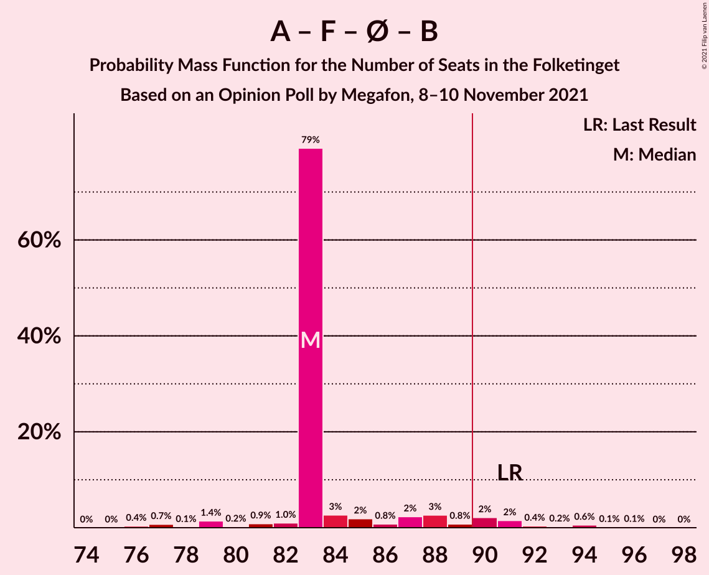

| Number of Seats | Probability | Accumulated | Special Marks |
|:---------------:|:-----------:|:-----------:|:-------------:|
| 76 | 0.4% | 100% |  |
| 77 | 0.7% | 99.6% |  |
| 78 | 0.1% | 98.9% |  |
| 79 | 1.4% | 98.8% |  |
| 80 | 0.2% | 97% |  |
| 81 | 0.9% | 97% |  |
| 82 | 1.0% | 96% |  |
| 83 | 79% | 95% | Median |
| 84 | 3% | 16% |  |
| 85 | 2% | 13% |  |
| 86 | 0.8% | 12% |  |
| 87 | 2% | 11% |  |
| 88 | 3% | 9% |  |
| 89 | 0.8% | 6% |  |
| 90 | 2% | 5% | Majority |
| 91 | 2% | 3% | Last Result |
| 92 | 0.4% | 1.4% |  |
| 93 | 0.2% | 1.1% |  |
| 94 | 0.6% | 0.9% |  |
| 95 | 0.1% | 0.3% |  |
| 96 | 0.1% | 0.2% |  |
| 97 | 0% | 0% |  |

### Socialdemokraterne – Socialistisk Folkeparti – Enhedslisten–De Rød-Grønne – Alternativet

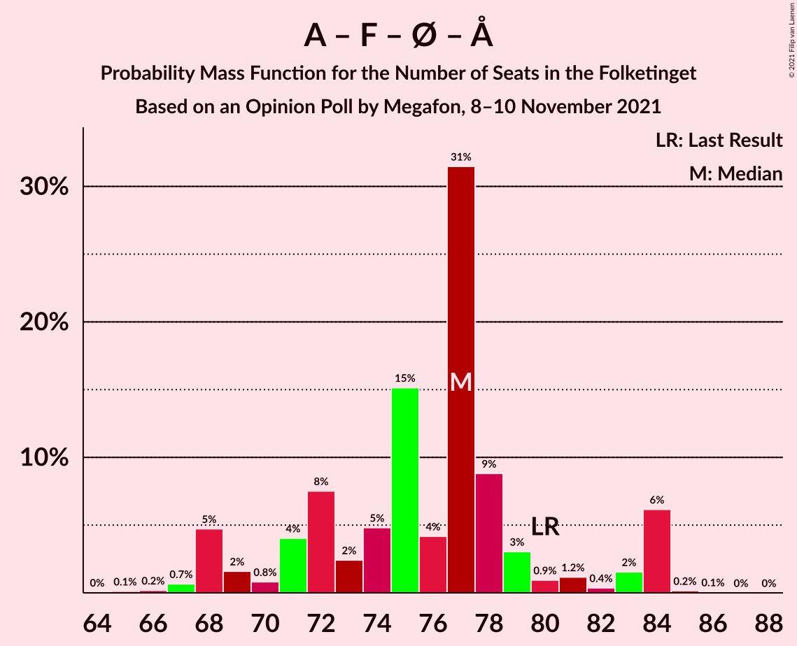

| Number of Seats | Probability | Accumulated | Special Marks |
|:---------------:|:-----------:|:-----------:|:-------------:|
| 66 | 0% | 100% |  |
| 67 | 0.1% | 99.9% |  |
| 68 | 0.2% | 99.8% |  |
| 69 | 0.8% | 99.6% |  |
| 70 | 0.8% | 98.8% |  |
| 71 | 2% | 98% |  |
| 72 | 1.2% | 96% |  |
| 73 | 76% | 95% | Median |
| 74 | 8% | 19% |  |
| 75 | 2% | 11% |  |
| 76 | 0.8% | 9% |  |
| 77 | 0.5% | 8% |  |
| 78 | 2% | 8% |  |
| 79 | 0.9% | 6% |  |
| 80 | 1.0% | 5% | Last Result |
| 81 | 2% | 4% |  |
| 82 | 2% | 3% |  |
| 83 | 0.2% | 1.1% |  |
| 84 | 0.7% | 0.9% |  |
| 85 | 0% | 0.2% |  |
| 86 | 0.1% | 0.2% |  |
| 87 | 0.1% | 0.1% |  |
| 88 | 0% | 0% |  |

### Socialdemokraterne – Socialistisk Folkeparti – Enhedslisten–De Rød-Grønne

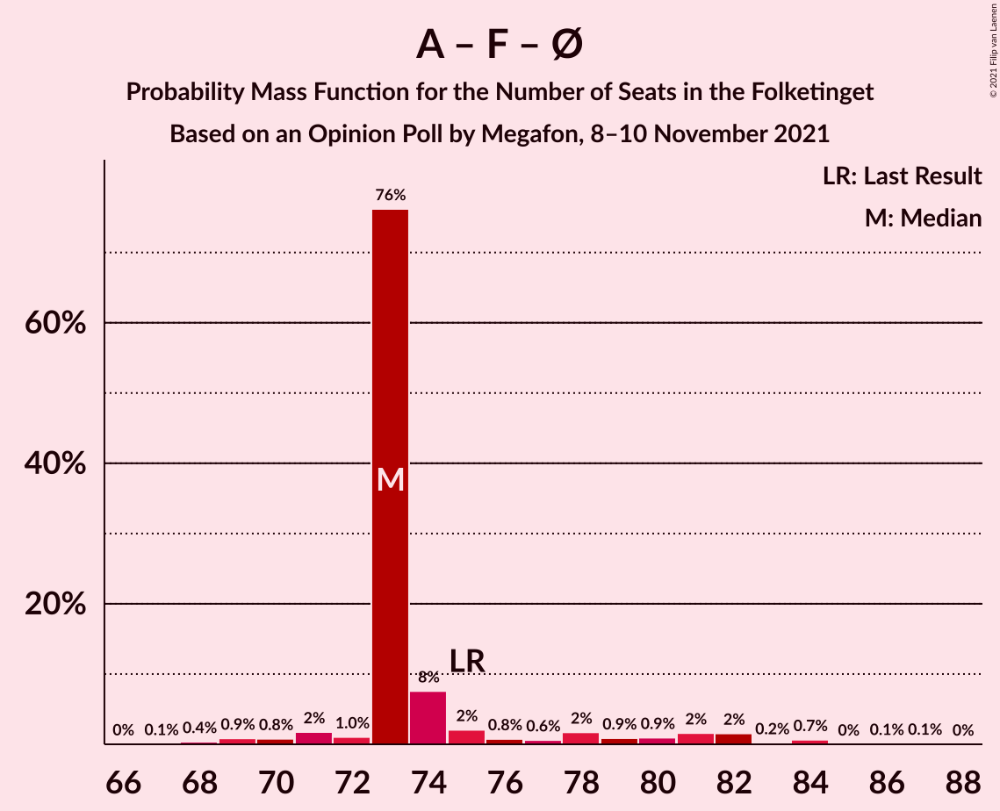

| Number of Seats | Probability | Accumulated | Special Marks |
|:---------------:|:-----------:|:-----------:|:-------------:|
| 66 | 0% | 100% |  |
| 67 | 0.1% | 99.9% |  |
| 68 | 0.4% | 99.8% |  |
| 69 | 0.9% | 99.5% |  |
| 70 | 0.8% | 98.6% |  |
| 71 | 2% | 98% |  |
| 72 | 1.0% | 96% |  |
| 73 | 76% | 95% | Median |
| 74 | 8% | 19% |  |
| 75 | 2% | 11% | Last Result |
| 76 | 0.8% | 9% |  |
| 77 | 0.6% | 8% |  |
| 78 | 2% | 8% |  |
| 79 | 0.9% | 6% |  |
| 80 | 0.9% | 5% |  |
| 81 | 2% | 4% |  |
| 82 | 2% | 3% |  |
| 83 | 0.2% | 1.1% |  |
| 84 | 0.7% | 0.9% |  |
| 85 | 0% | 0.2% |  |
| 86 | 0.1% | 0.2% |  |
| 87 | 0.1% | 0.1% |  |
| 88 | 0% | 0% |  |

### Det Konservative Folkeparti – Venstre – Dansk Folkeparti – Liberal Alliance – Kristendemokraterne

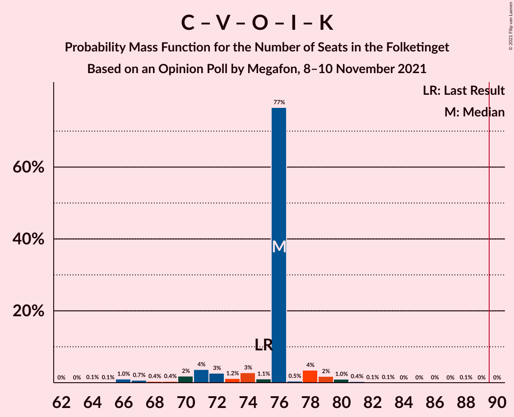

| Number of Seats | Probability | Accumulated | Special Marks |
|:---------------:|:-----------:|:-----------:|:-------------:|
| 64 | 0.1% | 100% |  |
| 65 | 0.1% | 99.9% |  |
| 66 | 1.0% | 99.8% |  |
| 67 | 0.7% | 98.7% |  |
| 68 | 0.4% | 98% |  |
| 69 | 0.4% | 98% |  |
| 70 | 2% | 97% |  |
| 71 | 4% | 95% |  |
| 72 | 3% | 92% |  |
| 73 | 1.2% | 89% |  |
| 74 | 3% | 88% |  |
| 75 | 1.1% | 85% | Last Result |
| 76 | 77% | 84% | Median |
| 77 | 0.5% | 7% |  |
| 78 | 4% | 7% |  |
| 79 | 2% | 3% |  |
| 80 | 1.0% | 2% |  |
| 81 | 0.4% | 0.7% |  |
| 82 | 0.1% | 0.3% |  |
| 83 | 0.1% | 0.2% |  |
| 84 | 0% | 0.1% |  |
| 85 | 0% | 0.1% |  |
| 86 | 0% | 0.1% |  |
| 87 | 0% | 0.1% |  |
| 88 | 0.1% | 0.1% |  |
| 89 | 0% | 0% |  |

### Det Konservative Folkeparti – Venstre – Dansk Folkeparti – Liberal Alliance

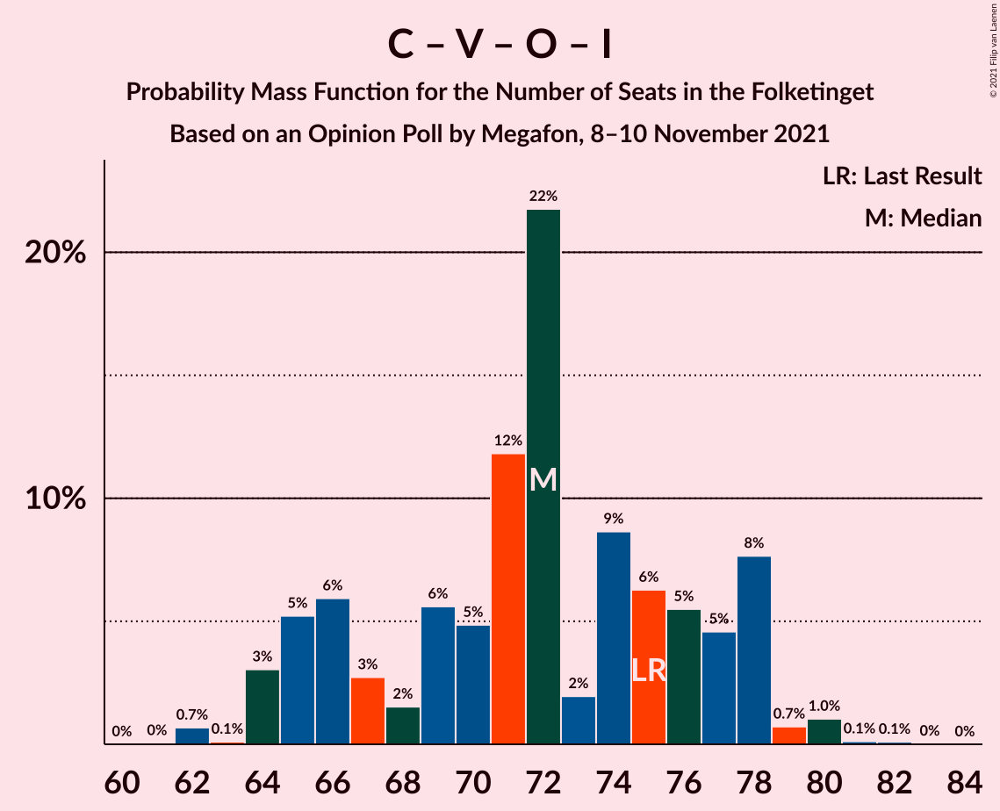

| Number of Seats | Probability | Accumulated | Special Marks |
|:---------------:|:-----------:|:-----------:|:-------------:|
| 63 | 0.1% | 100% |  |
| 64 | 0.1% | 99.9% |  |
| 65 | 0.1% | 99.8% |  |
| 66 | 1.2% | 99.6% |  |
| 67 | 4% | 98% |  |
| 68 | 0.5% | 95% |  |
| 69 | 1.0% | 94% |  |
| 70 | 2% | 93% |  |
| 71 | 0.7% | 91% |  |
| 72 | 5% | 91% |  |
| 73 | 1.1% | 86% |  |
| 74 | 3% | 85% |  |
| 75 | 2% | 82% | Last Result |
| 76 | 75% | 80% | Median |
| 77 | 0.5% | 4% |  |
| 78 | 2% | 4% |  |
| 79 | 0.3% | 1.4% |  |
| 80 | 0.9% | 1.1% |  |
| 81 | 0% | 0.2% |  |
| 82 | 0% | 0.1% |  |
| 83 | 0% | 0.1% |  |
| 84 | 0% | 0.1% |  |
| 85 | 0% | 0% |  |

### Socialdemokraterne – Socialistisk Folkeparti – Radikale Venstre

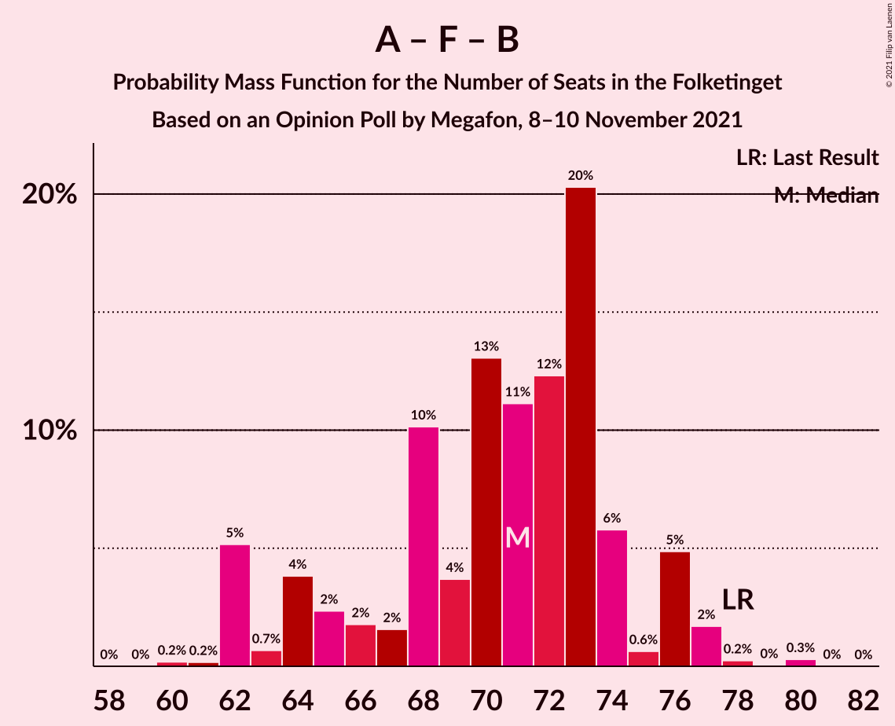

| Number of Seats | Probability | Accumulated | Special Marks |
|:---------------:|:-----------:|:-----------:|:-------------:|
| 60 | 0% | 100% |  |
| 61 | 0% | 99.9% |  |
| 62 | 0.9% | 99.9% |  |
| 63 | 0.3% | 99.0% |  |
| 64 | 0.3% | 98.7% |  |
| 65 | 2% | 98% |  |
| 66 | 3% | 96% |  |
| 67 | 2% | 93% |  |
| 68 | 0.9% | 90% |  |
| 69 | 2% | 89% |  |
| 70 | 76% | 87% | Median |
| 71 | 3% | 11% |  |
| 72 | 1.1% | 8% |  |
| 73 | 0.8% | 7% |  |
| 74 | 1.2% | 6% |  |
| 75 | 3% | 5% |  |
| 76 | 0.2% | 1.4% |  |
| 77 | 0.6% | 1.1% |  |
| 78 | 0.2% | 0.5% | Last Result |
| 79 | 0.2% | 0.3% |  |
| 80 | 0% | 0.1% |  |
| 81 | 0% | 0.1% |  |
| 82 | 0% | 0% |  |

### Det Konservative Folkeparti – Venstre – Liberal Alliance

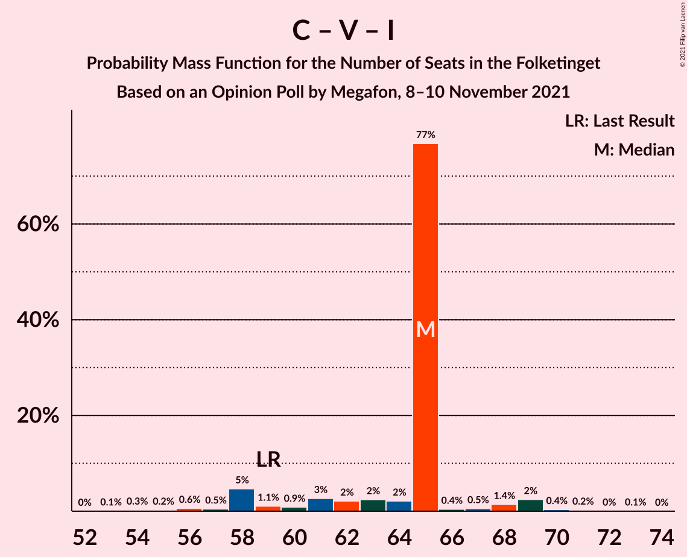

| Number of Seats | Probability | Accumulated | Special Marks |
|:---------------:|:-----------:|:-----------:|:-------------:|
| 53 | 0.1% | 100% |  |
| 54 | 0.3% | 99.9% |  |
| 55 | 0.2% | 99.7% |  |
| 56 | 0.6% | 99.4% |  |
| 57 | 0.5% | 98.8% |  |
| 58 | 5% | 98% |  |
| 59 | 1.1% | 94% | Last Result |
| 60 | 0.9% | 93% |  |
| 61 | 3% | 92% |  |
| 62 | 2% | 89% |  |
| 63 | 2% | 87% |  |
| 64 | 2% | 85% |  |
| 65 | 77% | 82% | Median |
| 66 | 0.4% | 6% |  |
| 67 | 0.5% | 5% |  |
| 68 | 1.4% | 5% |  |
| 69 | 2% | 3% |  |
| 70 | 0.4% | 0.7% |  |
| 71 | 0.2% | 0.4% |  |
| 72 | 0% | 0.1% |  |
| 73 | 0.1% | 0.1% |  |
| 74 | 0% | 0% |  |

### Det Konservative Folkeparti – Venstre

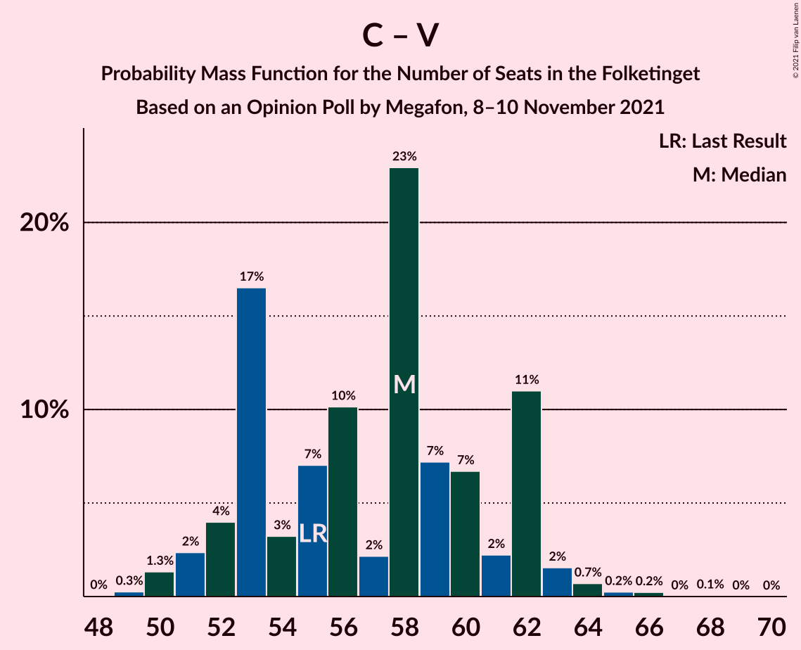

| Number of Seats | Probability | Accumulated | Special Marks |
|:---------------:|:-----------:|:-----------:|:-------------:|
| 47 | 0.1% | 100% |  |
| 48 | 0% | 99.9% |  |
| 49 | 0.2% | 99.9% |  |
| 50 | 0% | 99.7% |  |
| 51 | 0.2% | 99.7% |  |
| 52 | 2% | 99.5% |  |
| 53 | 0.5% | 98% |  |
| 54 | 4% | 97% |  |
| 55 | 1.2% | 93% | Last Result |
| 56 | 2% | 92% |  |
| 57 | 6% | 91% |  |
| 58 | 75% | 85% | Median |
| 59 | 2% | 9% |  |
| 60 | 2% | 8% |  |
| 61 | 1.3% | 6% |  |
| 62 | 1.0% | 5% |  |
| 63 | 0.8% | 4% |  |
| 64 | 2% | 3% |  |
| 65 | 0.3% | 0.5% |  |
| 66 | 0.1% | 0.2% |  |
| 67 | 0% | 0.1% |  |
| 68 | 0% | 0.1% |  |
| 69 | 0% | 0% |  |

### Socialdemokraterne – Radikale Venstre

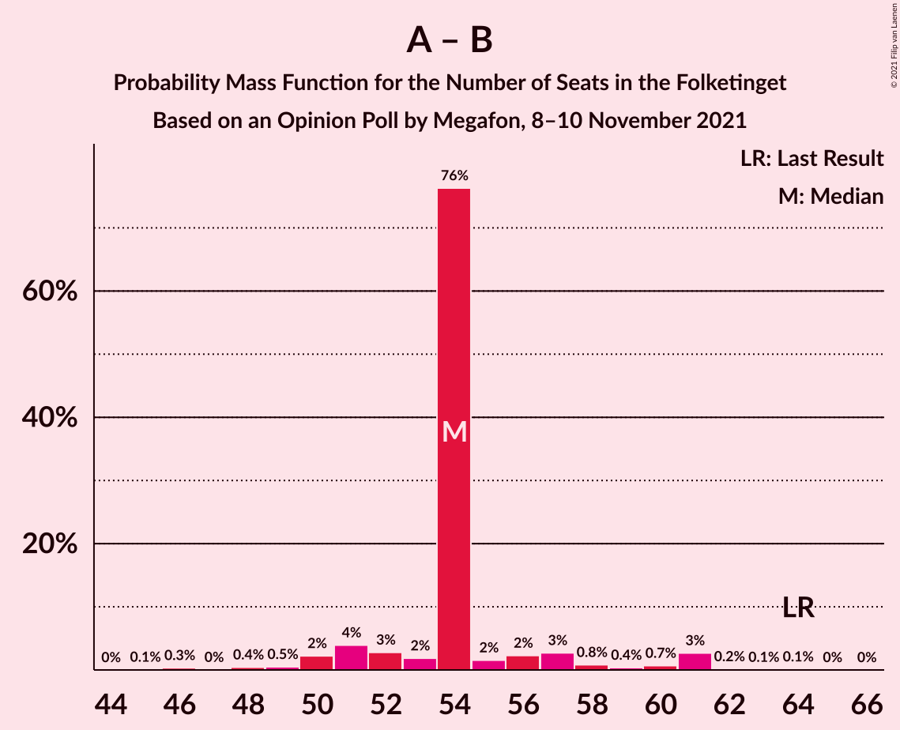

| Number of Seats | Probability | Accumulated | Special Marks |
|:---------------:|:-----------:|:-----------:|:-------------:|
| 45 | 0.1% | 100% |  |
| 46 | 0.3% | 99.9% |  |
| 47 | 0% | 99.6% |  |
| 48 | 0.4% | 99.5% |  |
| 49 | 0.5% | 99.1% |  |
| 50 | 2% | 98.6% |  |
| 51 | 4% | 96% |  |
| 52 | 3% | 92% |  |
| 53 | 2% | 90% |  |
| 54 | 76% | 88% | Median |
| 55 | 2% | 11% |  |
| 56 | 2% | 10% |  |
| 57 | 3% | 8% |  |
| 58 | 0.8% | 5% |  |
| 59 | 0.4% | 4% |  |
| 60 | 0.7% | 4% |  |
| 61 | 3% | 3% |  |
| 62 | 0.2% | 0.3% |  |
| 63 | 0.1% | 0.2% |  |
| 64 | 0.1% | 0.1% | Last Result |
| 65 | 0% | 0% |  |

### Venstre

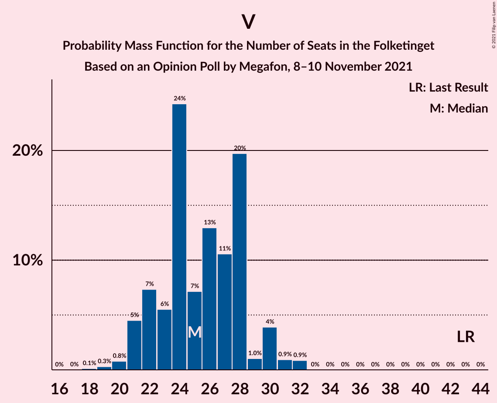

| Number of Seats | Probability | Accumulated | Special Marks |
|:---------------:|:-----------:|:-----------:|:-------------:|
| 19 | 0.4% | 100% |  |
| 20 | 3% | 99.6% |  |
| 21 | 2% | 96% |  |
| 22 | 2% | 94% |  |
| 23 | 2% | 93% |  |
| 24 | 3% | 90% |  |
| 25 | 78% | 87% | Median |
| 26 | 3% | 10% |  |
| 27 | 2% | 6% |  |
| 28 | 1.5% | 4% |  |
| 29 | 0.8% | 3% |  |
| 30 | 0.3% | 2% |  |
| 31 | 0.1% | 2% |  |
| 32 | 1.4% | 1.4% |  |
| 33 | 0% | 0% |  |
| 34 | 0% | 0% |  |
| 35 | 0% | 0% |  |
| 36 | 0% | 0% |  |
| 37 | 0% | 0% |  |
| 38 | 0% | 0% |  |
| 39 | 0% | 0% |  |
| 40 | 0% | 0% |  |
| 41 | 0% | 0% |  |
| 42 | 0% | 0% |  |
| 43 | 0% | 0% | Last Result |

## Technical Information

### Opinion Poll

+ **Polling firm:** Megafon
+ **Commissioner(s):** —
+ **Fieldwork period:** 8–10 November 2021

### Calculations

+ **Sample size:** 840
+ **Simulations done:** 1,048,576
+ **Error estimate:** 3.51%

