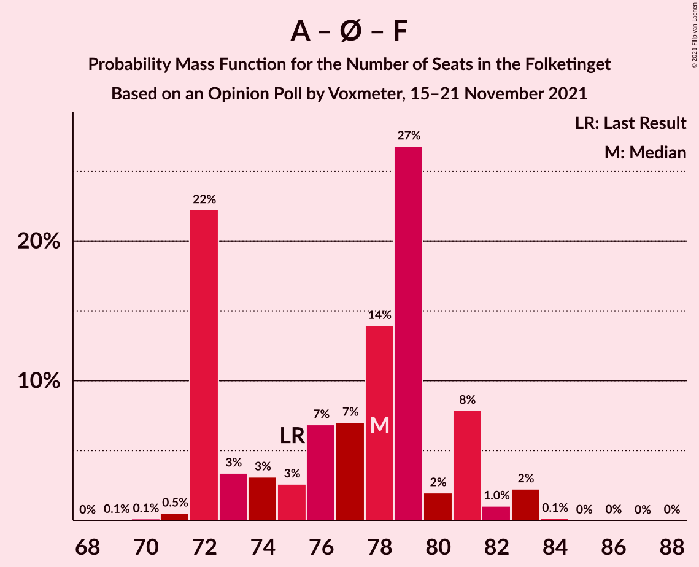

# Opinion Poll by Voxmeter, 15–21 November 2021

<a href="#voting-intentions">Voting Intentions</a> | <a href="#seats">Seats</a> | <a href="#coalitions">Coalitions</a> | <a href="#technical-information">Technical Information</a>

## Voting Intentions

### Confidence Intervals

| Party | Last Result | Poll Result | 80% Confidence Interval | 90% Confidence Interval | 95% Confidence Interval | 99% Confidence Interval |
|:-----:|:-----------:|:-----------:|:-----------------------:|:-----------------------:|:-----------------------:|:-----------------------:|
| Socialdemokraterne | 25.9% | 25.8% | 24.3–27.5% |23.9–27.9% |23.5–28.3% |22.8–29.1% |
| Venstre | 23.4% | 17.5% | 16.2–19.0% |15.8–19.4% |15.5–19.7% |14.9–20.4% |
| Det Konservative Folkeparti | 6.6% | 14.7% | 13.5–16.1% |13.2–16.5% |12.9–16.8% |12.3–17.5% |
| Enhedslisten–De Rød-Grønne | 6.9% | 8.7% | 7.8–9.8% |7.5–10.2% |7.3–10.4% |6.8–11.0% |
| Socialistisk Folkeparti | 7.7% | 8.4% | 7.5–9.5% |7.2–9.8% |7.0–10.1% |6.6–10.6% |
| Nye Borgerlige | 2.4% | 6.3% | 5.5–7.3% |5.3–7.6% |5.1–7.8% |4.7–8.3% |
| Dansk Folkeparti | 8.7% | 5.8% | 5.1–6.8% |4.8–7.1% |4.7–7.3% |4.3–7.8% |
| Radikale Venstre | 8.6% | 5.2% | 4.5–6.1% |4.3–6.4% |4.1–6.6% |3.8–7.0% |
| Liberal Alliance | 2.3% | 3.0% | 2.5–3.8% |2.3–4.0% |2.2–4.1% |2.0–4.5% |
| Kristendemokraterne | 1.7% | 1.7% | 1.3–2.3% |1.2–2.4% |1.1–2.6% |0.9–2.9% |
| Alternativet | 3.0% | 1.5% | 1.2–2.1% |1.1–2.2% |1.0–2.4% |0.8–2.7% |
| Veganerpartiet | 0.0% | 0.1% | 0.0–0.3% |0.0–0.4% |0.0–0.5% |0.0–0.6% |

*Note:* The poll result column reflects the actual value used in the calculations. Published results may vary slightly, and in addition be rounded to fewer digits.

## Seats

### Confidence Intervals

| Party | Last Result | Median | 80% Confidence Interval | 90% Confidence Interval | 95% Confidence Interval | 99% Confidence Interval |
|:-----:|:-----------:|:------:|:-----------------------:|:-----------------------:|:-----------------------:|:-----------------------:|
| <a href="#socialdemokraterne">Socialdemokraterne</a> | 48 | 45 | 43–49 |43–49 |43–51 |41–52 |
| <a href="#venstre">Venstre</a> | 43 | 32 | 31–33 |29–35 |28–36 |26–36 |
| <a href="#det-konservative-folkeparti">Det Konservative Folkeparti</a> | 12 | 26 | 25–28 |25–29 |24–30 |23–31 |
| <a href="#enhedslisten–de-rød-grønne">Enhedslisten–De Rød-Grønne</a> | 13 | 16 | 14–18 |13–18 |13–19 |12–21 |
| <a href="#socialistisk-folkeparti">Socialistisk Folkeparti</a> | 14 | 15 | 14–17 |14–17 |13–17 |12–18 |
| <a href="#nye-borgerlige">Nye Borgerlige</a> | 4 | 12 | 10–13 |9–14 |9–14 |8–14 |
| <a href="#dansk-folkeparti">Dansk Folkeparti</a> | 16 | 10 | 9–12 |9–13 |9–13 |8–14 |
| <a href="#radikale-venstre">Radikale Venstre</a> | 16 | 10 | 8–11 |8–11 |7–12 |6–13 |
| <a href="#liberal-alliance">Liberal Alliance</a> | 4 | 6 | 4–6 |4–7 |0–7 |0–8 |
| <a href="#kristendemokraterne">Kristendemokraterne</a> | 0 | 0 | 0–4 |0–5 |0–5 |0–5 |
| <a href="#alternativet">Alternativet</a> | 5 | 0 | 0–4 |0–4 |0–4 |0–5 |
| <a href="#veganerpartiet">Veganerpartiet</a> | 0 | 0 | 0 |0 |0 |0 |

### Socialdemokraterne

*For a full overview of the results for this party, see the [Socialdemokraterne](party-socialdemokraterne.html) page.*

| Number of Seats | Probability | Accumulated | Special Marks |
|:---------------:|:-----------:|:-----------:|:-------------:|
| 39 | 0.1% | 100% |  |
| 40 | 0% | 99.9% |  |
| 41 | 0.6% | 99.9% |  |
| 42 | 1.5% | 99.3% |  |
| 43 | 23% | 98% |  |
| 44 | 5% | 75% |  |
| 45 | 32% | 69% | Median |
| 46 | 9% | 37% |  |
| 47 | 9% | 28% |  |
| 48 | 7% | 19% | Last Result |
| 49 | 7% | 12% |  |
| 50 | 1.4% | 5% |  |
| 51 | 3% | 3% |  |
| 52 | 0.4% | 0.8% |  |
| 53 | 0.4% | 0.4% |  |
| 54 | 0% | 0.1% |  |
| 55 | 0% | 0% |  |

### Venstre

*For a full overview of the results for this party, see the [Venstre](party-venstre.html) page.*

| Number of Seats | Probability | Accumulated | Special Marks |
|:---------------:|:-----------:|:-----------:|:-------------:|
| 25 | 0.1% | 100% |  |
| 26 | 0.6% | 99.8% |  |
| 27 | 0.7% | 99.3% |  |
| 28 | 2% | 98.6% |  |
| 29 | 2% | 97% |  |
| 30 | 2% | 95% |  |
| 31 | 33% | 92% |  |
| 32 | 37% | 59% | Median |
| 33 | 13% | 22% |  |
| 34 | 3% | 9% |  |
| 35 | 3% | 6% |  |
| 36 | 2% | 3% |  |
| 37 | 0.2% | 0.5% |  |
| 38 | 0.2% | 0.3% |  |
| 39 | 0% | 0% |  |
| 40 | 0% | 0% |  |
| 41 | 0% | 0% |  |
| 42 | 0% | 0% |  |
| 43 | 0% | 0% | Last Result |

### Det Konservative Folkeparti

*For a full overview of the results for this party, see the [Det Konservative Folkeparti](party-detkonservativefolkeparti.html) page.*

| Number of Seats | Probability | Accumulated | Special Marks |
|:---------------:|:-----------:|:-----------:|:-------------:|
| 12 | 0% | 100% | Last Result |
| 13 | 0% | 100% |  |
| 14 | 0% | 100% |  |
| 15 | 0% | 100% |  |
| 16 | 0% | 100% |  |
| 17 | 0% | 100% |  |
| 18 | 0% | 100% |  |
| 19 | 0% | 100% |  |
| 20 | 0% | 100% |  |
| 21 | 0.1% | 100% |  |
| 22 | 0.3% | 99.9% |  |
| 23 | 2% | 99.6% |  |
| 24 | 2% | 98% |  |
| 25 | 11% | 96% |  |
| 26 | 54% | 85% | Median |
| 27 | 13% | 31% |  |
| 28 | 10% | 18% |  |
| 29 | 5% | 9% |  |
| 30 | 2% | 3% |  |
| 31 | 0.7% | 0.9% |  |
| 32 | 0.2% | 0.2% |  |
| 33 | 0% | 0.1% |  |
| 34 | 0% | 0% |  |

### Enhedslisten–De Rød-Grønne

*For a full overview of the results for this party, see the [Enhedslisten–De Rød-Grønne](party-enhedslisten–derød-grønne.html) page.*

| Number of Seats | Probability | Accumulated | Special Marks |
|:---------------:|:-----------:|:-----------:|:-------------:|
| 12 | 1.1% | 100% |  |
| 13 | 5% | 98.9% | Last Result |
| 14 | 28% | 94% |  |
| 15 | 8% | 66% |  |
| 16 | 12% | 57% | Median |
| 17 | 34% | 45% |  |
| 18 | 7% | 12% |  |
| 19 | 2% | 4% |  |
| 20 | 1.4% | 2% |  |
| 21 | 1.0% | 1.1% |  |
| 22 | 0% | 0% |  |

### Socialistisk Folkeparti

*For a full overview of the results for this party, see the [Socialistisk Folkeparti](party-socialistiskfolkeparti.html) page.*

| Number of Seats | Probability | Accumulated | Special Marks |
|:---------------:|:-----------:|:-----------:|:-------------:|
| 11 | 0.2% | 100% |  |
| 12 | 0.6% | 99.8% |  |
| 13 | 3% | 99.2% |  |
| 14 | 19% | 96% | Last Result |
| 15 | 38% | 77% | Median |
| 16 | 6% | 39% |  |
| 17 | 30% | 33% |  |
| 18 | 2% | 2% |  |
| 19 | 0.3% | 0.4% |  |
| 20 | 0.1% | 0.1% |  |
| 21 | 0% | 0% |  |

### Nye Borgerlige

*For a full overview of the results for this party, see the [Nye Borgerlige](party-nyeborgerlige.html) page.*

| Number of Seats | Probability | Accumulated | Special Marks |
|:---------------:|:-----------:|:-----------:|:-------------:|
| 4 | 0% | 100% | Last Result |
| 5 | 0% | 100% |  |
| 6 | 0% | 100% |  |
| 7 | 0% | 100% |  |
| 8 | 1.4% | 100% |  |
| 9 | 5% | 98.6% |  |
| 10 | 12% | 94% |  |
| 11 | 9% | 82% |  |
| 12 | 55% | 73% | Median |
| 13 | 13% | 18% |  |
| 14 | 5% | 6% |  |
| 15 | 0.3% | 0.4% |  |
| 16 | 0.1% | 0.1% |  |
| 17 | 0% | 0% |  |

### Dansk Folkeparti

*For a full overview of the results for this party, see the [Dansk Folkeparti](party-danskfolkeparti.html) page.*

| Number of Seats | Probability | Accumulated | Special Marks |
|:---------------:|:-----------:|:-----------:|:-------------:|
| 7 | 0.2% | 100% |  |
| 8 | 2% | 99.8% |  |
| 9 | 32% | 98% |  |
| 10 | 31% | 66% | Median |
| 11 | 20% | 35% |  |
| 12 | 9% | 15% |  |
| 13 | 4% | 6% |  |
| 14 | 1.0% | 1.4% |  |
| 15 | 0.4% | 0.4% |  |
| 16 | 0% | 0% | Last Result |

### Radikale Venstre

*For a full overview of the results for this party, see the [Radikale Venstre](party-radikalevenstre.html) page.*

| Number of Seats | Probability | Accumulated | Special Marks |
|:---------------:|:-----------:|:-----------:|:-------------:|
| 6 | 0.6% | 100% |  |
| 7 | 2% | 99.4% |  |
| 8 | 15% | 97% |  |
| 9 | 18% | 83% |  |
| 10 | 36% | 65% | Median |
| 11 | 26% | 29% |  |
| 12 | 3% | 3% |  |
| 13 | 0.4% | 0.5% |  |
| 14 | 0.1% | 0.1% |  |
| 15 | 0% | 0% |  |
| 16 | 0% | 0% | Last Result |

### Liberal Alliance

*For a full overview of the results for this party, see the [Liberal Alliance](party-liberalalliance.html) page.*

| Number of Seats | Probability | Accumulated | Special Marks |
|:---------------:|:-----------:|:-----------:|:-------------:|
| 0 | 5% | 100% |  |
| 1 | 0% | 95% |  |
| 2 | 0% | 95% |  |
| 3 | 0% | 95% |  |
| 4 | 6% | 95% | Last Result |
| 5 | 24% | 89% |  |
| 6 | 59% | 65% | Median |
| 7 | 5% | 6% |  |
| 8 | 1.0% | 1.2% |  |
| 9 | 0.2% | 0.2% |  |
| 10 | 0% | 0% |  |

### Kristendemokraterne

*For a full overview of the results for this party, see the [Kristendemokraterne](party-kristendemokraterne.html) page.*

| Number of Seats | Probability | Accumulated | Special Marks |
|:---------------:|:-----------:|:-----------:|:-------------:|
| 0 | 59% | 100% | Last Result, Median |
| 1 | 0% | 41% |  |
| 2 | 0% | 41% |  |
| 3 | 0% | 41% |  |
| 4 | 35% | 41% |  |
| 5 | 5% | 5% |  |
| 6 | 0% | 0% |  |

### Alternativet

*For a full overview of the results for this party, see the [Alternativet](party-alternativet.html) page.*

| Number of Seats | Probability | Accumulated | Special Marks |
|:---------------:|:-----------:|:-----------:|:-------------:|
| 0 | 71% | 100% | Median |
| 1 | 0% | 29% |  |
| 2 | 0% | 29% |  |
| 3 | 0% | 29% |  |
| 4 | 29% | 29% |  |
| 5 | 0.5% | 0.5% | Last Result |
| 6 | 0% | 0% |  |

### Veganerpartiet

*For a full overview of the results for this party, see the [Veganerpartiet](party-veganerpartiet.html) page.*

| Number of Seats | Probability | Accumulated | Special Marks |
|:---------------:|:-----------:|:-----------:|:-------------:|
| 0 | 100% | 100% | Last Result, Median |

## Coalitions

### Confidence Intervals

| Coalition | Last Result | Median | Majority? | 80% Confidence Interval | 90% Confidence Interval | 95% Confidence Interval | 99% Confidence Interval |
|:---------:|:-----------:|:------:|:---------:|:-----------------------:|:-----------------------:|:-----------------------:|:-----------------------:|
| Socialdemokraterne – Enhedslisten–De Rød-Grønne – Socialistisk Folkeparti – Radikale Venstre – Alternativet | 96 | 88 | 32% | 85–90 | 83–91 | 83–92 | 82–94 |
| Venstre – Det Konservative Folkeparti – Nye Borgerlige – Dansk Folkeparti – Liberal Alliance – Kristendemokraterne | 79 | 87 | 15% | 85–90 | 84–91 | 83–92 | 81–93 |
| Socialdemokraterne – Enhedslisten–De Rød-Grønne – Socialistisk Folkeparti – Radikale Venstre | 91 | 87 | 30% | 82–90 | 82–91 | 82–92 | 81–93 |
| Venstre – Det Konservative Folkeparti – Nye Borgerlige – Dansk Folkeparti – Liberal Alliance | 79 | 85 | 4% | 84–88 | 82–89 | 81–91 | 79–92 |
| Socialdemokraterne – Enhedslisten–De Rød-Grønne – Socialistisk Folkeparti – Alternativet | 80 | 78 | 0% | 76–81 | 74–82 | 73–83 | 71–85 |
| Venstre – Det Konservative Folkeparti – Dansk Folkeparti – Liberal Alliance – Kristendemokraterne | 75 | 77 | 0% | 73–78 | 73–82 | 72–82 | 70–83 |
| Socialdemokraterne – Enhedslisten–De Rød-Grønne – Socialistisk Folkeparti | 75 | 78 | 0% | 72–81 | 72–81 | 72–82 | 71–83 |
| Venstre – Det Konservative Folkeparti – Dansk Folkeparti – Liberal Alliance | 75 | 73 | 0% | 73–77 | 72–78 | 71–79 | 67–82 |
| Socialdemokraterne – Socialistisk Folkeparti – Radikale Venstre | 78 | 71 | 0% | 68–73 | 68–74 | 67–76 | 66–78 |
| Venstre – Det Konservative Folkeparti – Liberal Alliance | 59 | 63 | 0% | 62–66 | 61–68 | 60–69 | 57–69 |
| Venstre – Det Konservative Folkeparti | 55 | 58 | 0% | 57–62 | 55–62 | 54–63 | 51–64 |
| Socialdemokraterne – Radikale Venstre | 64 | 56 | 0% | 53–58 | 53–59 | 52–61 | 51–62 |
| Venstre | 43 | 32 | 0% | 31–33 | 29–35 | 28–36 | 26–36 |

### Socialdemokraterne – Enhedslisten–De Rød-Grønne – Socialistisk Folkeparti – Radikale Venstre – Alternativet

| Number of Seats | Probability | Accumulated | Special Marks |
|:---------------:|:-----------:|:-----------:|:-------------:|
| 80 | 0.2% | 100% |  |
| 81 | 0.2% | 99.8% |  |
| 82 | 0.4% | 99.6% |  |
| 83 | 4% | 99.2% |  |
| 84 | 3% | 95% |  |
| 85 | 7% | 91% |  |
| 86 | 25% | 84% | Median |
| 87 | 9% | 60% |  |
| 88 | 9% | 51% |  |
| 89 | 10% | 42% |  |
| 90 | 25% | 32% | Majority |
| 91 | 2% | 7% |  |
| 92 | 3% | 5% |  |
| 93 | 0.5% | 2% |  |
| 94 | 1.0% | 1.2% |  |
| 95 | 0.1% | 0.2% |  |
| 96 | 0.1% | 0.1% | Last Result |
| 97 | 0% | 0% |  |

### Venstre – Det Konservative Folkeparti – Nye Borgerlige – Dansk Folkeparti – Liberal Alliance – Kristendemokraterne

| Number of Seats | Probability | Accumulated | Special Marks |
|:---------------:|:-----------:|:-----------:|:-------------:|
| 78 | 0% | 100% |  |
| 79 | 0.1% | 99.9% | Last Result |
| 80 | 0.1% | 99.8% |  |
| 81 | 1.1% | 99.8% |  |
| 82 | 0.5% | 98.7% |  |
| 83 | 3% | 98% |  |
| 84 | 2% | 95% |  |
| 85 | 25% | 93% |  |
| 86 | 10% | 68% | Median |
| 87 | 9% | 57% |  |
| 88 | 9% | 49% |  |
| 89 | 25% | 40% |  |
| 90 | 7% | 15% | Majority |
| 91 | 3% | 8% |  |
| 92 | 4% | 5% |  |
| 93 | 0.4% | 0.7% |  |
| 94 | 0.2% | 0.4% |  |
| 95 | 0.2% | 0.2% |  |
| 96 | 0% | 0% |  |

### Socialdemokraterne – Enhedslisten–De Rød-Grønne – Socialistisk Folkeparti – Radikale Venstre

| Number of Seats | Probability | Accumulated | Special Marks |
|:---------------:|:-----------:|:-----------:|:-------------:|
| 78 | 0.1% | 100% |  |
| 79 | 0% | 99.9% |  |
| 80 | 0.3% | 99.9% |  |
| 81 | 0.3% | 99.6% |  |
| 82 | 23% | 99.4% |  |
| 83 | 6% | 76% |  |
| 84 | 4% | 71% |  |
| 85 | 9% | 67% |  |
| 86 | 2% | 58% | Median |
| 87 | 8% | 56% |  |
| 88 | 9% | 47% |  |
| 89 | 8% | 39% |  |
| 90 | 25% | 30% | Majority |
| 91 | 2% | 5% | Last Result |
| 92 | 3% | 3% |  |
| 93 | 0.1% | 0.5% |  |
| 94 | 0.3% | 0.4% |  |
| 95 | 0% | 0.1% |  |
| 96 | 0% | 0.1% |  |
| 97 | 0% | 0% |  |

### Venstre – Det Konservative Folkeparti – Nye Borgerlige – Dansk Folkeparti – Liberal Alliance

| Number of Seats | Probability | Accumulated | Special Marks |
|:---------------:|:-----------:|:-----------:|:-------------:|
| 77 | 0% | 100% |  |
| 78 | 0.1% | 99.9% |  |
| 79 | 0.6% | 99.8% | Last Result |
| 80 | 1.3% | 99.2% |  |
| 81 | 1.2% | 98% |  |
| 82 | 2% | 97% |  |
| 83 | 3% | 94% |  |
| 84 | 4% | 92% |  |
| 85 | 49% | 88% |  |
| 86 | 16% | 39% | Median |
| 87 | 8% | 23% |  |
| 88 | 10% | 15% |  |
| 89 | 2% | 5% |  |
| 90 | 0.9% | 4% | Majority |
| 91 | 1.0% | 3% |  |
| 92 | 1.5% | 2% |  |
| 93 | 0.1% | 0.3% |  |
| 94 | 0.1% | 0.2% |  |
| 95 | 0% | 0% |  |

### Socialdemokraterne – Enhedslisten–De Rød-Grønne – Socialistisk Folkeparti – Alternativet

| Number of Seats | Probability | Accumulated | Special Marks |
|:---------------:|:-----------:|:-----------:|:-------------:|
| 70 | 0% | 100% |  |
| 71 | 0.5% | 99.9% |  |
| 72 | 0.1% | 99.4% |  |
| 73 | 3% | 99.3% |  |
| 74 | 2% | 96% |  |
| 75 | 2% | 94% |  |
| 76 | 26% | 92% | Median |
| 77 | 7% | 66% |  |
| 78 | 15% | 59% |  |
| 79 | 27% | 44% |  |
| 80 | 5% | 17% | Last Result |
| 81 | 7% | 13% |  |
| 82 | 1.5% | 5% |  |
| 83 | 3% | 4% |  |
| 84 | 0.2% | 1.3% |  |
| 85 | 0.8% | 1.0% |  |
| 86 | 0.1% | 0.2% |  |
| 87 | 0.1% | 0.1% |  |
| 88 | 0% | 0.1% |  |
| 89 | 0% | 0% |  |

### Venstre – Det Konservative Folkeparti – Dansk Folkeparti – Liberal Alliance – Kristendemokraterne

| Number of Seats | Probability | Accumulated | Special Marks |
|:---------------:|:-----------:|:-----------:|:-------------:|
| 67 | 0.1% | 100% |  |
| 68 | 0.1% | 99.9% |  |
| 69 | 0.2% | 99.8% |  |
| 70 | 0.2% | 99.6% |  |
| 71 | 1.1% | 99.4% |  |
| 72 | 2% | 98% |  |
| 73 | 39% | 96% |  |
| 74 | 2% | 57% | Median |
| 75 | 2% | 55% | Last Result |
| 76 | 3% | 53% |  |
| 77 | 32% | 50% |  |
| 78 | 10% | 18% |  |
| 79 | 0.6% | 8% |  |
| 80 | 0.7% | 7% |  |
| 81 | 1.0% | 7% |  |
| 82 | 5% | 6% |  |
| 83 | 0.6% | 0.7% |  |
| 84 | 0% | 0.1% |  |
| 85 | 0.1% | 0.1% |  |
| 86 | 0% | 0% |  |

### Socialdemokraterne – Enhedslisten–De Rød-Grønne – Socialistisk Folkeparti

| Number of Seats | Probability | Accumulated | Special Marks |
|:---------------:|:-----------:|:-----------:|:-------------:|
| 69 | 0.1% | 100% |  |
| 70 | 0.1% | 99.9% |  |
| 71 | 0.5% | 99.8% |  |
| 72 | 22% | 99.3% |  |
| 73 | 3% | 77% |  |
| 74 | 3% | 74% |  |
| 75 | 3% | 71% | Last Result |
| 76 | 7% | 68% | Median |
| 77 | 7% | 61% |  |
| 78 | 14% | 54% |  |
| 79 | 27% | 40% |  |
| 80 | 2% | 13% |  |
| 81 | 8% | 11% |  |
| 82 | 1.0% | 4% |  |
| 83 | 2% | 2% |  |
| 84 | 0.1% | 0.2% |  |
| 85 | 0% | 0.1% |  |
| 86 | 0% | 0.1% |  |
| 87 | 0% | 0% |  |

### Venstre – Det Konservative Folkeparti – Dansk Folkeparti – Liberal Alliance

| Number of Seats | Probability | Accumulated | Special Marks |
|:---------------:|:-----------:|:-----------:|:-------------:|
| 66 | 0% | 100% |  |
| 67 | 0.4% | 99.9% |  |
| 68 | 0.9% | 99.5% |  |
| 69 | 0.6% | 98.6% |  |
| 70 | 0.2% | 98% |  |
| 71 | 2% | 98% |  |
| 72 | 3% | 96% |  |
| 73 | 63% | 93% |  |
| 74 | 8% | 30% | Median |
| 75 | 2% | 22% | Last Result |
| 76 | 3% | 20% |  |
| 77 | 11% | 17% |  |
| 78 | 4% | 6% |  |
| 79 | 1.0% | 3% |  |
| 80 | 0.1% | 2% |  |
| 81 | 0.2% | 1.5% |  |
| 82 | 1.3% | 1.3% |  |
| 83 | 0% | 0% |  |

### Socialdemokraterne – Socialistisk Folkeparti – Radikale Venstre

| Number of Seats | Probability | Accumulated | Special Marks |
|:---------------:|:-----------:|:-----------:|:-------------:|
| 64 | 0.2% | 100% |  |
| 65 | 0.2% | 99.8% |  |
| 66 | 0.5% | 99.5% |  |
| 67 | 2% | 99.0% |  |
| 68 | 28% | 97% |  |
| 69 | 4% | 69% |  |
| 70 | 10% | 65% | Median |
| 71 | 14% | 54% |  |
| 72 | 7% | 41% |  |
| 73 | 28% | 34% |  |
| 74 | 1.4% | 6% |  |
| 75 | 2% | 5% |  |
| 76 | 2% | 3% |  |
| 77 | 0.1% | 0.6% |  |
| 78 | 0.1% | 0.5% | Last Result |
| 79 | 0.3% | 0.4% |  |
| 80 | 0% | 0.1% |  |
| 81 | 0% | 0% |  |

### Venstre – Det Konservative Folkeparti – Liberal Alliance

| Number of Seats | Probability | Accumulated | Special Marks |
|:---------------:|:-----------:|:-----------:|:-------------:|
| 55 | 0% | 100% |  |
| 56 | 0.1% | 99.9% |  |
| 57 | 1.1% | 99.9% |  |
| 58 | 0.6% | 98.8% |  |
| 59 | 0.7% | 98% | Last Result |
| 60 | 1.1% | 98% |  |
| 61 | 3% | 96% |  |
| 62 | 17% | 94% |  |
| 63 | 27% | 77% |  |
| 64 | 26% | 49% | Median |
| 65 | 11% | 23% |  |
| 66 | 5% | 13% |  |
| 67 | 2% | 8% |  |
| 68 | 2% | 6% |  |
| 69 | 4% | 4% |  |
| 70 | 0.1% | 0.3% |  |
| 71 | 0.1% | 0.2% |  |
| 72 | 0% | 0.1% |  |
| 73 | 0% | 0% |  |

### Venstre – Det Konservative Folkeparti

| Number of Seats | Probability | Accumulated | Special Marks |
|:---------------:|:-----------:|:-----------:|:-------------:|
| 51 | 0.5% | 100% |  |
| 52 | 0.1% | 99.4% |  |
| 53 | 1.1% | 99.3% |  |
| 54 | 2% | 98% |  |
| 55 | 2% | 96% | Last Result |
| 56 | 3% | 94% |  |
| 57 | 34% | 91% |  |
| 58 | 27% | 57% | Median |
| 59 | 4% | 31% |  |
| 60 | 14% | 27% |  |
| 61 | 2% | 13% |  |
| 62 | 8% | 11% |  |
| 63 | 0.2% | 3% |  |
| 64 | 2% | 2% |  |
| 65 | 0.1% | 0.2% |  |
| 66 | 0% | 0.1% |  |
| 67 | 0% | 0% |  |

### Socialdemokraterne – Radikale Venstre

| Number of Seats | Probability | Accumulated | Special Marks |
|:---------------:|:-----------:|:-----------:|:-------------:|
| 49 | 0.2% | 100% |  |
| 50 | 0.2% | 99.8% |  |
| 51 | 2% | 99.6% |  |
| 52 | 1.1% | 98% |  |
| 53 | 30% | 97% |  |
| 54 | 7% | 67% |  |
| 55 | 4% | 60% | Median |
| 56 | 34% | 56% |  |
| 57 | 8% | 22% |  |
| 58 | 8% | 13% |  |
| 59 | 1.2% | 5% |  |
| 60 | 1.3% | 4% |  |
| 61 | 2% | 3% |  |
| 62 | 0.7% | 0.9% |  |
| 63 | 0.1% | 0.2% |  |
| 64 | 0.1% | 0.1% | Last Result |
| 65 | 0% | 0% |  |

### Venstre

| Number of Seats | Probability | Accumulated | Special Marks |
|:---------------:|:-----------:|:-----------:|:-------------:|
| 25 | 0.1% | 100% |  |
| 26 | 0.6% | 99.8% |  |
| 27 | 0.7% | 99.3% |  |
| 28 | 2% | 98.6% |  |
| 29 | 2% | 97% |  |
| 30 | 2% | 95% |  |
| 31 | 33% | 92% |  |
| 32 | 37% | 59% | Median |
| 33 | 13% | 22% |  |
| 34 | 3% | 9% |  |
| 35 | 3% | 6% |  |
| 36 | 2% | 3% |  |
| 37 | 0.2% | 0.5% |  |
| 38 | 0.2% | 0.3% |  |
| 39 | 0% | 0% |  |
| 40 | 0% | 0% |  |
| 41 | 0% | 0% |  |
| 42 | 0% | 0% |  |
| 43 | 0% | 0% | Last Result |

## Technical Information

### Opinion Poll

+ **Polling firm:** Voxmeter
+ **Commissioner(s):** —
+ **Fieldwork period:** 15–21 November 2021

### Calculations

+ **Sample size:** 1250
+ **Simulations done:** 1,048,576
+ **Error estimate:** 1.63%

