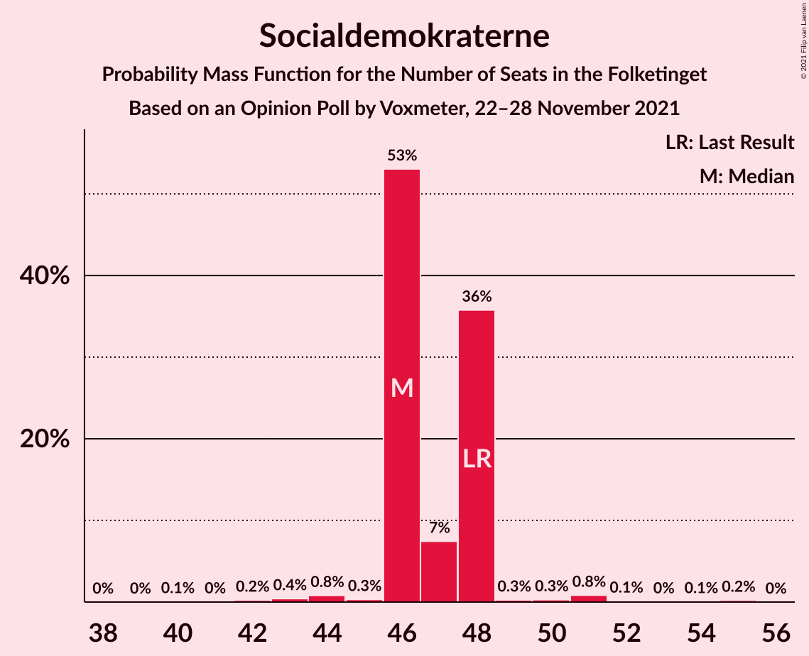
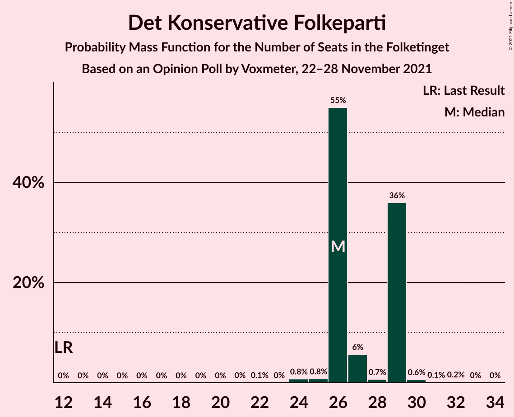
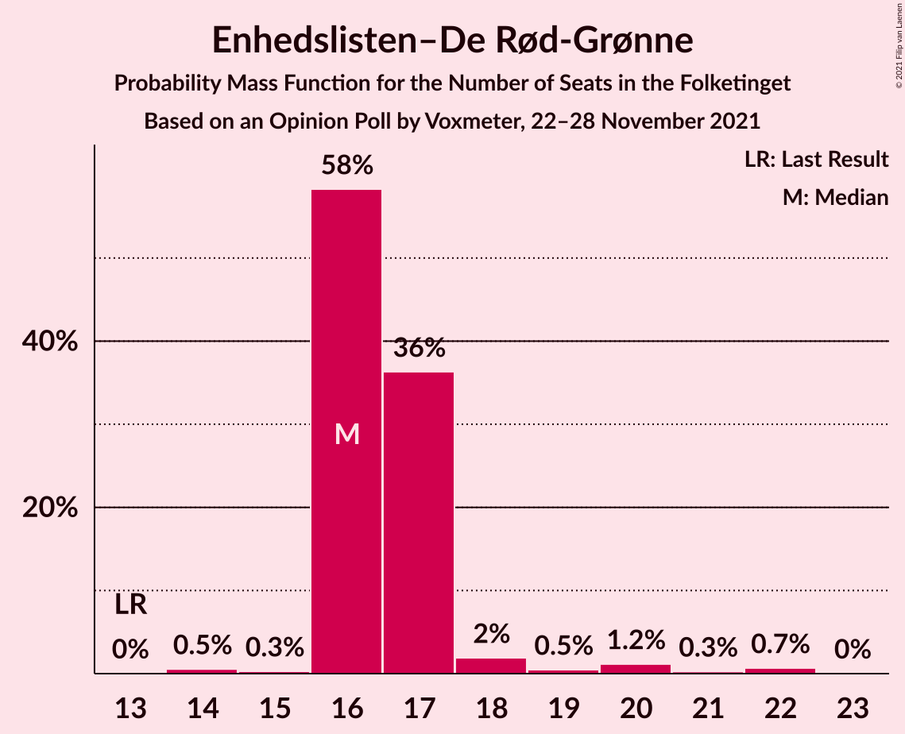
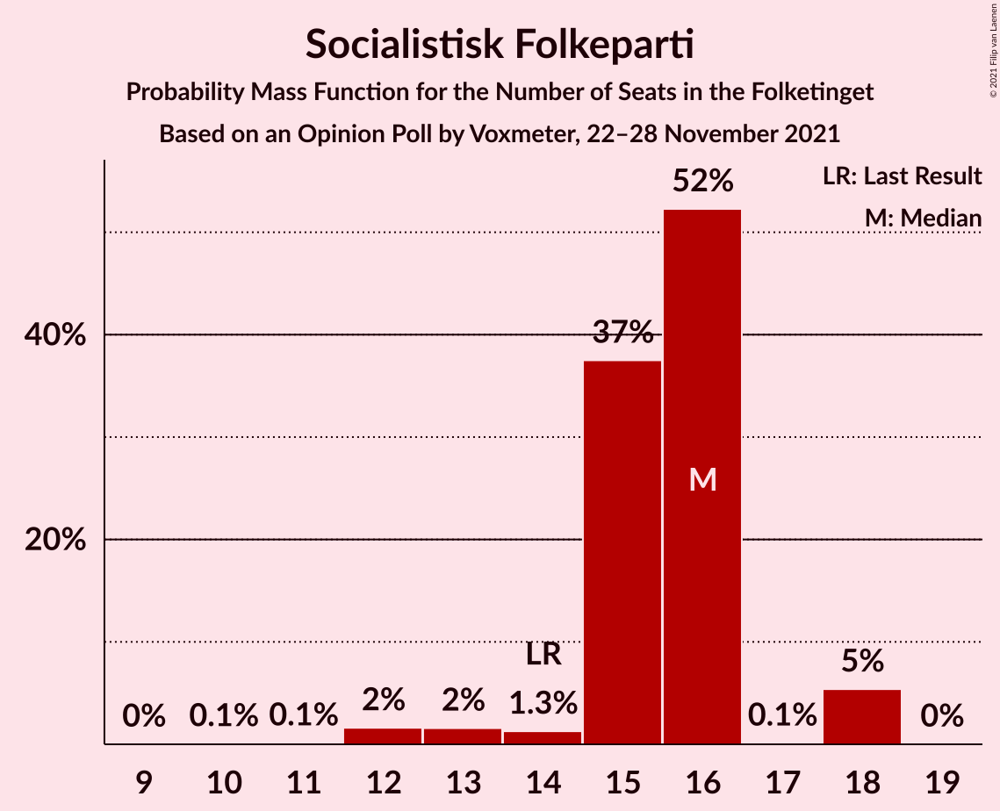
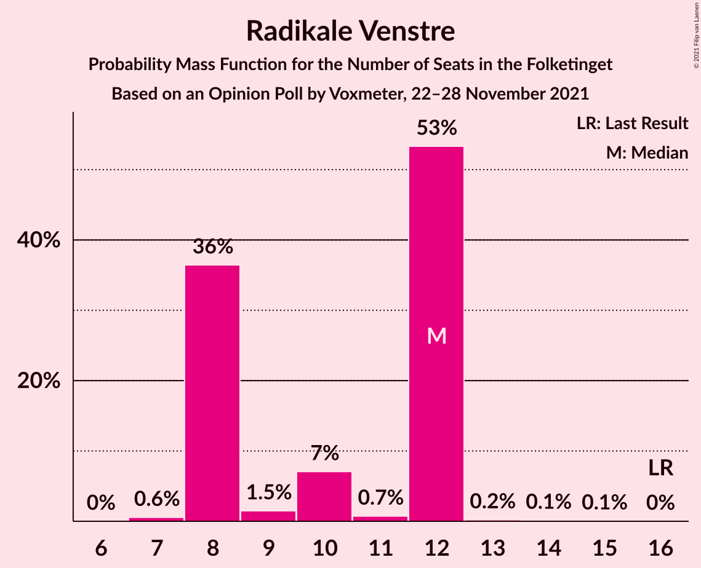
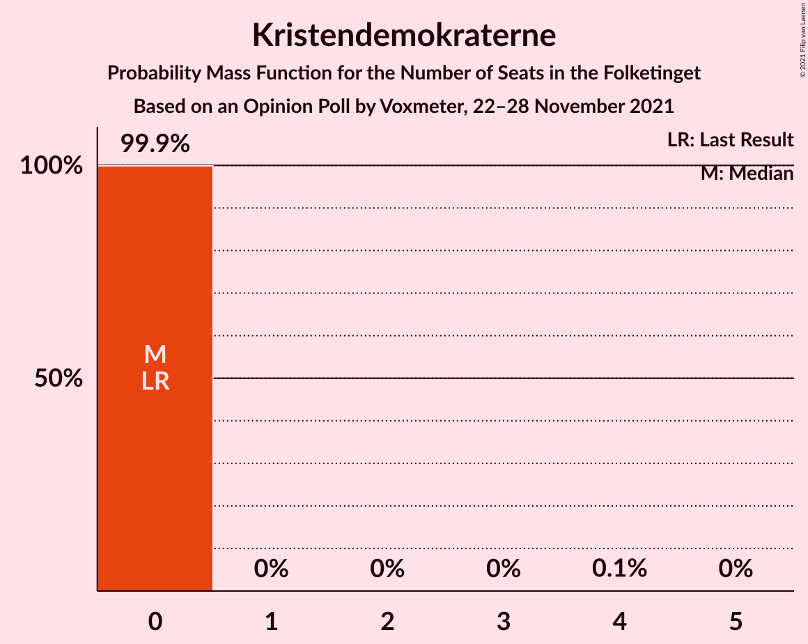

# Opinion Poll by Voxmeter, 22–28 November 2021

<a href="#voting-intentions">Voting Intentions</a> | <a href="#seats">Seats</a> | <a href="#coalitions">Coalitions</a> | <a href="#technical-information">Technical Information</a>

## Voting Intentions

### Confidence Intervals

| Party | Last Result | Poll Result | 80% Confidence Interval | 90% Confidence Interval | 95% Confidence Interval | 99% Confidence Interval |
|:-----:|:-----------:|:-----------:|:-----------------------:|:-----------------------:|:-----------------------:|:-----------------------:|
| Socialdemokraterne | 25.9% | 26.0% | 24.2–27.8% |23.8–28.3% |23.4–28.8% |22.5–29.7% |
| Venstre | 23.4% | 17.0% | 15.6–18.6% |15.2–19.1% |14.8–19.5% |14.1–20.3% |
| Det Konservative Folkeparti | 6.6% | 15.1% | 13.7–16.7% |13.4–17.1% |13.0–17.5% |12.4–18.2% |
| Enhedslisten–De Rød-Grønne | 6.9% | 9.7% | 8.6–11.0% |8.2–11.3% |8.0–11.6% |7.5–12.3% |
| Socialistisk Folkeparti | 7.7% | 7.9% | 6.9–9.1% |6.6–9.4% |6.4–9.7% |5.9–10.3% |
| Dansk Folkeparti | 8.7% | 6.2% | 5.3–7.3% |5.0–7.6% |4.8–7.8% |4.5–8.4% |
| Radikale Venstre | 8.6% | 5.7% | 4.8–6.7% |4.6–7.0% |4.4–7.3% |4.0–7.8% |
| Nye Borgerlige | 2.4% | 5.5% | 4.6–6.5% |4.4–6.8% |4.2–7.1% |3.9–7.6% |
| Liberal Alliance | 2.3% | 3.2% | 2.6–4.0% |2.4–4.3% |2.3–4.5% |2.0–4.9% |
| Kristendemokraterne | 1.7% | 1.1% | 0.8–1.6% |0.7–1.8% |0.6–2.0% |0.5–2.3% |
| Alternativet | 3.0% | 0.9% | 0.6–1.4% |0.5–1.6% |0.5–1.7% |0.4–2.0% |
| Frie Grønne | 0.0% | 0.4% | 0.2–0.8% |0.2–0.9% |0.2–1.0% |0.1–1.2% |
| Veganerpartiet | 0.0% | 0.2% | 0.1–0.5% |0.1–0.6% |0.1–0.7% |0.0–0.9% |

*Note:* The poll result column reflects the actual value used in the calculations. Published results may vary slightly, and in addition be rounded to fewer digits.

## Seats

### Confidence Intervals

| Party | Last Result | Median | 80% Confidence Interval | 90% Confidence Interval | 95% Confidence Interval | 99% Confidence Interval |
|:-----:|:-----------:|:------:|:-----------------------:|:-----------------------:|:-----------------------:|:-----------------------:|
| <a href="#socialdemokraterne">Socialdemokraterne</a> | 48 | 46 | 46–48 |46–48 |46–48 |43–51 |
| <a href="#venstre">Venstre</a> | 43 | 31 | 31–34 |30–34 |30–34 |27–35 |
| <a href="#det-konservative-folkeparti">Det Konservative Folkeparti</a> | 12 | 26 | 26–29 |26–29 |26–29 |24–30 |
| <a href="#enhedslisten–de-rød-grønne">Enhedslisten–De Rød-Grønne</a> | 13 | 16 | 16–17 |16–17 |16–19 |14–22 |
| <a href="#socialistisk-folkeparti">Socialistisk Folkeparti</a> | 14 | 16 | 15–16 |15–18 |13–18 |12–18 |
| <a href="#dansk-folkeparti">Dansk Folkeparti</a> | 16 | 11 | 10–11 |10–11 |10–13 |10–14 |
| <a href="#radikale-venstre">Radikale Venstre</a> | 16 | 12 | 8–12 |8–12 |8–12 |7–12 |
| <a href="#nye-borgerlige">Nye Borgerlige</a> | 4 | 10 | 9–10 |9–11 |9–11 |8–13 |
| <a href="#liberal-alliance">Liberal Alliance</a> | 4 | 7 | 5–7 |5–7 |5–7 |5–8 |
| <a href="#kristendemokraterne">Kristendemokraterne</a> | 0 | 0 | 0 |0 |0 |0 |
| <a href="#alternativet">Alternativet</a> | 5 | 0 | 0 |0 |0 |0 |
| <a href="#frie-grønne">Frie Grønne</a> | 0 | 0 | 0 |0 |0 |0 |
| <a href="#veganerpartiet">Veganerpartiet</a> | 0 | 0 | 0 |0 |0 |0 |

### Socialdemokraterne

*For a full overview of the results for this party, see the [Socialdemokraterne](party-socialdemokraterne.html) page.*

| Number of Seats | Probability | Accumulated | Special Marks |
|:---------------:|:-----------:|:-----------:|:-------------:|
| 40 | 0.1% | 100% |  |
| 41 | 0% | 99.9% |  |
| 42 | 0.2% | 99.9% |  |
| 43 | 0.4% | 99.7% |  |
| 44 | 0.8% | 99.2% |  |
| 45 | 0.3% | 98% |  |
| 46 | 53% | 98% | Median |
| 47 | 7% | 45% |  |
| 48 | 36% | 38% | Last Result |
| 49 | 0.3% | 2% |  |
| 50 | 0.3% | 2% |  |
| 51 | 0.8% | 1.3% |  |
| 52 | 0.1% | 0.4% |  |
| 53 | 0% | 0.3% |  |
| 54 | 0.1% | 0.3% |  |
| 55 | 0.2% | 0.2% |  |
| 56 | 0% | 0% |  |

### Venstre

*For a full overview of the results for this party, see the [Venstre](party-venstre.html) page.*

| Number of Seats | Probability | Accumulated | Special Marks |
|:---------------:|:-----------:|:-----------:|:-------------:|
| 24 | 0% | 100% |  |
| 25 | 0% | 99.9% |  |
| 26 | 0.4% | 99.9% |  |
| 27 | 0.8% | 99.5% |  |
| 28 | 0.8% | 98.7% |  |
| 29 | 0.4% | 98% |  |
| 30 | 6% | 98% |  |
| 31 | 52% | 92% | Median |
| 32 | 0.2% | 39% |  |
| 33 | 1.5% | 39% |  |
| 34 | 37% | 38% |  |
| 35 | 0.8% | 0.8% |  |
| 36 | 0% | 0.1% |  |
| 37 | 0.1% | 0.1% |  |
| 38 | 0% | 0% |  |
| 39 | 0% | 0% |  |
| 40 | 0% | 0% |  |
| 41 | 0% | 0% |  |
| 42 | 0% | 0% |  |
| 43 | 0% | 0% | Last Result |

### Det Konservative Folkeparti

*For a full overview of the results for this party, see the [Det Konservative Folkeparti](party-detkonservativefolkeparti.html) page.*

| Number of Seats | Probability | Accumulated | Special Marks |
|:---------------:|:-----------:|:-----------:|:-------------:|
| 12 | 0% | 100% | Last Result |
| 13 | 0% | 100% |  |
| 14 | 0% | 100% |  |
| 15 | 0% | 100% |  |
| 16 | 0% | 100% |  |
| 17 | 0% | 100% |  |
| 18 | 0% | 100% |  |
| 19 | 0% | 100% |  |
| 20 | 0% | 100% |  |
| 21 | 0% | 100% |  |
| 22 | 0.1% | 100% |  |
| 23 | 0% | 99.9% |  |
| 24 | 0.8% | 99.9% |  |
| 25 | 0.8% | 99.1% |  |
| 26 | 55% | 98% | Median |
| 27 | 6% | 43% |  |
| 28 | 0.7% | 38% |  |
| 29 | 36% | 37% |  |
| 30 | 0.6% | 1.0% |  |
| 31 | 0.1% | 0.3% |  |
| 32 | 0.2% | 0.2% |  |
| 33 | 0% | 0.1% |  |
| 34 | 0% | 0% |  |

### Enhedslisten–De Rød-Grønne

*For a full overview of the results for this party, see the [Enhedslisten–De Rød-Grønne](party-enhedslisten–derød-grønne.html) page.*

| Number of Seats | Probability | Accumulated | Special Marks |
|:---------------:|:-----------:|:-----------:|:-------------:|
| 13 | 0% | 100% | Last Result |
| 14 | 0.5% | 100% |  |
| 15 | 0.3% | 99.4% |  |
| 16 | 58% | 99.1% | Median |
| 17 | 36% | 41% |  |
| 18 | 2% | 5% |  |
| 19 | 0.5% | 3% |  |
| 20 | 1.2% | 2% |  |
| 21 | 0.3% | 1.0% |  |
| 22 | 0.7% | 0.7% |  |
| 23 | 0% | 0% |  |

### Socialistisk Folkeparti

*For a full overview of the results for this party, see the [Socialistisk Folkeparti](party-socialistiskfolkeparti.html) page.*

| Number of Seats | Probability | Accumulated | Special Marks |
|:---------------:|:-----------:|:-----------:|:-------------:|
| 10 | 0.1% | 100% |  |
| 11 | 0.1% | 99.9% |  |
| 12 | 2% | 99.8% |  |
| 13 | 2% | 98% |  |
| 14 | 1.3% | 97% | Last Result |
| 15 | 37% | 95% |  |
| 16 | 52% | 58% | Median |
| 17 | 0.1% | 6% |  |
| 18 | 5% | 5% |  |
| 19 | 0% | 0% |  |

### Dansk Folkeparti

*For a full overview of the results for this party, see the [Dansk Folkeparti](party-danskfolkeparti.html) page.*

| Number of Seats | Probability | Accumulated | Special Marks |
|:---------------:|:-----------:|:-----------:|:-------------:|
| 8 | 0.1% | 100% |  |
| 9 | 0.3% | 99.9% |  |
| 10 | 37% | 99.6% |  |
| 11 | 58% | 62% | Median |
| 12 | 0.3% | 4% |  |
| 13 | 1.4% | 3% |  |
| 14 | 2% | 2% |  |
| 15 | 0.2% | 0.3% |  |
| 16 | 0% | 0% | Last Result |

### Radikale Venstre

*For a full overview of the results for this party, see the [Radikale Venstre](party-radikalevenstre.html) page.*

| Number of Seats | Probability | Accumulated | Special Marks |
|:---------------:|:-----------:|:-----------:|:-------------:|
| 7 | 0.6% | 100% |  |
| 8 | 36% | 99.4% |  |
| 9 | 1.5% | 63% |  |
| 10 | 7% | 62% |  |
| 11 | 0.7% | 54% |  |
| 12 | 53% | 54% | Median |
| 13 | 0.2% | 0.4% |  |
| 14 | 0.1% | 0.2% |  |
| 15 | 0.1% | 0.1% |  |
| 16 | 0% | 0% | Last Result |

### Nye Borgerlige

*For a full overview of the results for this party, see the [Nye Borgerlige](party-nyeborgerlige.html) page.*

| Number of Seats | Probability | Accumulated | Special Marks |
|:---------------:|:-----------:|:-----------:|:-------------:|
| 4 | 0% | 100% | Last Result |
| 5 | 0% | 100% |  |
| 6 | 0% | 100% |  |
| 7 | 0.3% | 100% |  |
| 8 | 2% | 99.7% |  |
| 9 | 37% | 98% |  |
| 10 | 53% | 60% | Median |
| 11 | 6% | 7% |  |
| 12 | 0.6% | 1.2% |  |
| 13 | 0.6% | 0.6% |  |
| 14 | 0% | 0.1% |  |
| 15 | 0% | 0% |  |

### Liberal Alliance

*For a full overview of the results for this party, see the [Liberal Alliance](party-liberalalliance.html) page.*

| Number of Seats | Probability | Accumulated | Special Marks |
|:---------------:|:-----------:|:-----------:|:-------------:|
| 4 | 0.5% | 100% | Last Result |
| 5 | 43% | 99.5% |  |
| 6 | 1.4% | 57% |  |
| 7 | 55% | 55% | Median |
| 8 | 0.3% | 0.7% |  |
| 9 | 0.3% | 0.4% |  |
| 10 | 0% | 0% |  |

### Kristendemokraterne

*For a full overview of the results for this party, see the [Kristendemokraterne](party-kristendemokraterne.html) page.*

| Number of Seats | Probability | Accumulated | Special Marks |
|:---------------:|:-----------:|:-----------:|:-------------:|
| 0 | 99.9% | 100% | Last Result, Median |
| 1 | 0% | 0.1% |  |
| 2 | 0% | 0.1% |  |
| 3 | 0% | 0.1% |  |
| 4 | 0.1% | 0.1% |  |
| 5 | 0% | 0% |  |

### Alternativet

*For a full overview of the results for this party, see the [Alternativet](party-alternativet.html) page.*

| Number of Seats | Probability | Accumulated | Special Marks |
|:---------------:|:-----------:|:-----------:|:-------------:|
| 0 | 99.9% | 100% | Median |
| 1 | 0% | 0.1% |  |
| 2 | 0% | 0.1% |  |
| 3 | 0% | 0.1% |  |
| 4 | 0.1% | 0.1% |  |
| 5 | 0% | 0% | Last Result |

### Frie Grønne

*For a full overview of the results for this party, see the [Frie Grønne](party-friegrønne.html) page.*

| Number of Seats | Probability | Accumulated | Special Marks |
|:---------------:|:-----------:|:-----------:|:-------------:|
| 0 | 100% | 100% | Last Result, Median |

### Veganerpartiet

*For a full overview of the results for this party, see the [Veganerpartiet](party-veganerpartiet.html) page.*

| Number of Seats | Probability | Accumulated | Special Marks |
|:---------------:|:-----------:|:-----------:|:-------------:|
| 0 | 100% | 100% | Last Result, Median |

## Coalitions

### Confidence Intervals

| Coalition | Last Result | Median | Majority? | 80% Confidence Interval | 90% Confidence Interval | 95% Confidence Interval | 99% Confidence Interval |
|:---------:|:-----------:|:------:|:---------:|:-----------------------:|:-----------------------:|:-----------------------:|:-----------------------:|
| Socialdemokraterne – Enhedslisten–De Rød-Grønne – Socialistisk Folkeparti – Radikale Venstre – Alternativet | 96 | 90 | 60% | 88–90 | 88–91 | 86–91 | 84–98 |
| Socialdemokraterne – Enhedslisten–De Rød-Grønne – Socialistisk Folkeparti – Radikale Venstre | 91 | 90 | 60% | 88–90 | 88–91 | 86–91 | 84–98 |
| Venstre – Det Konservative Folkeparti – Dansk Folkeparti – Nye Borgerlige – Liberal Alliance – Kristendemokraterne | 79 | 85 | 0.5% | 85–87 | 84–87 | 84–89 | 77–90 |
| Venstre – Det Konservative Folkeparti – Dansk Folkeparti – Nye Borgerlige – Liberal Alliance | 79 | 85 | 0.5% | 85–87 | 84–87 | 84–89 | 77–90 |
| Socialdemokraterne – Enhedslisten–De Rød-Grønne – Socialistisk Folkeparti – Alternativet | 80 | 78 | 0% | 78–80 | 78–81 | 77–81 | 74–88 |
| Socialdemokraterne – Enhedslisten–De Rød-Grønne – Socialistisk Folkeparti | 75 | 78 | 0% | 78–80 | 78–81 | 77–81 | 74–88 |
| Venstre – Det Konservative Folkeparti – Dansk Folkeparti – Liberal Alliance – Kristendemokraterne | 75 | 75 | 0% | 75–78 | 73–78 | 73–79 | 69–81 |
| Venstre – Det Konservative Folkeparti – Dansk Folkeparti – Liberal Alliance | 75 | 75 | 0% | 75–78 | 73–78 | 73–79 | 69–81 |
| Socialdemokraterne – Socialistisk Folkeparti – Radikale Venstre | 78 | 74 | 0% | 71–74 | 71–75 | 69–75 | 67–76 |
| Venstre – Det Konservative Folkeparti – Liberal Alliance | 59 | 64 | 0% | 64–68 | 62–68 | 62–68 | 58–68 |
| Venstre – Det Konservative Folkeparti | 55 | 57 | 0% | 57–63 | 57–63 | 57–63 | 53–63 |
| Socialdemokraterne – Radikale Venstre | 64 | 58 | 0% | 56–58 | 56–58 | 56–58 | 53–62 |
| Venstre | 43 | 31 | 0% | 31–34 | 30–34 | 30–34 | 27–35 |

### Socialdemokraterne – Enhedslisten–De Rød-Grønne – Socialistisk Folkeparti – Radikale Venstre – Alternativet

| Number of Seats | Probability | Accumulated | Special Marks |
|:---------------:|:-----------:|:-----------:|:-------------:|
| 80 | 0.2% | 100% |  |
| 81 | 0% | 99.8% |  |
| 82 | 0% | 99.8% |  |
| 83 | 0% | 99.7% |  |
| 84 | 0.2% | 99.7% |  |
| 85 | 0.1% | 99.5% |  |
| 86 | 2% | 99.4% |  |
| 87 | 0.8% | 97% |  |
| 88 | 36% | 96% |  |
| 89 | 1.0% | 61% |  |
| 90 | 52% | 60% | Median, Majority |
| 91 | 6% | 7% |  |
| 92 | 0% | 2% |  |
| 93 | 0.4% | 2% |  |
| 94 | 0.3% | 1.1% |  |
| 95 | 0.1% | 0.8% |  |
| 96 | 0% | 0.7% | Last Result |
| 97 | 0.1% | 0.7% |  |
| 98 | 0.6% | 0.6% |  |
| 99 | 0% | 0% |  |

### Socialdemokraterne – Enhedslisten–De Rød-Grønne – Socialistisk Folkeparti – Radikale Venstre

| Number of Seats | Probability | Accumulated | Special Marks |
|:---------------:|:-----------:|:-----------:|:-------------:|
| 80 | 0.2% | 100% |  |
| 81 | 0% | 99.8% |  |
| 82 | 0% | 99.8% |  |
| 83 | 0% | 99.7% |  |
| 84 | 0.2% | 99.7% |  |
| 85 | 0.1% | 99.5% |  |
| 86 | 2% | 99.4% |  |
| 87 | 0.8% | 97% |  |
| 88 | 36% | 96% |  |
| 89 | 1.0% | 61% |  |
| 90 | 52% | 60% | Median, Majority |
| 91 | 6% | 7% | Last Result |
| 92 | 0% | 1.5% |  |
| 93 | 0.4% | 1.4% |  |
| 94 | 0.3% | 1.0% |  |
| 95 | 0% | 0.7% |  |
| 96 | 0% | 0.7% |  |
| 97 | 0.1% | 0.7% |  |
| 98 | 0.6% | 0.6% |  |
| 99 | 0% | 0% |  |

### Venstre – Det Konservative Folkeparti – Dansk Folkeparti – Nye Borgerlige – Liberal Alliance – Kristendemokraterne

| Number of Seats | Probability | Accumulated | Special Marks |
|:---------------:|:-----------:|:-----------:|:-------------:|
| 77 | 0.6% | 100% |  |
| 78 | 0.1% | 99.4% |  |
| 79 | 0% | 99.3% | Last Result |
| 80 | 0.1% | 99.3% |  |
| 81 | 0.5% | 99.2% |  |
| 82 | 0.4% | 98.7% |  |
| 83 | 0.2% | 98% |  |
| 84 | 6% | 98% |  |
| 85 | 52% | 92% | Median |
| 86 | 0.9% | 40% |  |
| 87 | 36% | 39% |  |
| 88 | 0.7% | 3% |  |
| 89 | 2% | 3% |  |
| 90 | 0% | 0.5% | Majority |
| 91 | 0.4% | 0.5% |  |
| 92 | 0% | 0.1% |  |
| 93 | 0% | 0.1% |  |
| 94 | 0% | 0% |  |

### Venstre – Det Konservative Folkeparti – Dansk Folkeparti – Nye Borgerlige – Liberal Alliance

| Number of Seats | Probability | Accumulated | Special Marks |
|:---------------:|:-----------:|:-----------:|:-------------:|
| 77 | 0.6% | 100% |  |
| 78 | 0.1% | 99.4% |  |
| 79 | 0% | 99.3% | Last Result |
| 80 | 0.1% | 99.2% |  |
| 81 | 0.5% | 99.1% |  |
| 82 | 0.4% | 98.6% |  |
| 83 | 0.2% | 98% |  |
| 84 | 6% | 98% |  |
| 85 | 52% | 92% | Median |
| 86 | 0.9% | 40% |  |
| 87 | 36% | 39% |  |
| 88 | 0.7% | 3% |  |
| 89 | 2% | 3% |  |
| 90 | 0% | 0.5% | Majority |
| 91 | 0.4% | 0.5% |  |
| 92 | 0% | 0.1% |  |
| 93 | 0% | 0.1% |  |
| 94 | 0% | 0% |  |

### Socialdemokraterne – Enhedslisten–De Rød-Grønne – Socialistisk Folkeparti – Alternativet

| Number of Seats | Probability | Accumulated | Special Marks |
|:---------------:|:-----------:|:-----------:|:-------------:|
| 71 | 0% | 100% |  |
| 72 | 0.3% | 99.9% |  |
| 73 | 0% | 99.7% |  |
| 74 | 0.3% | 99.7% |  |
| 75 | 0.4% | 99.3% |  |
| 76 | 1.0% | 99.0% |  |
| 77 | 1.0% | 98% |  |
| 78 | 53% | 97% | Median |
| 79 | 0.9% | 44% |  |
| 80 | 36% | 43% | Last Result |
| 81 | 6% | 7% |  |
| 82 | 0.6% | 2% |  |
| 83 | 0.1% | 1.0% |  |
| 84 | 0.2% | 0.9% |  |
| 85 | 0.1% | 0.7% |  |
| 86 | 0% | 0.6% |  |
| 87 | 0.1% | 0.6% |  |
| 88 | 0.5% | 0.5% |  |
| 89 | 0% | 0% |  |

### Socialdemokraterne – Enhedslisten–De Rød-Grønne – Socialistisk Folkeparti

| Number of Seats | Probability | Accumulated | Special Marks |
|:---------------:|:-----------:|:-----------:|:-------------:|
| 71 | 0% | 100% |  |
| 72 | 0.3% | 99.9% |  |
| 73 | 0% | 99.7% |  |
| 74 | 0.3% | 99.6% |  |
| 75 | 0.4% | 99.3% | Last Result |
| 76 | 1.1% | 99.0% |  |
| 77 | 1.0% | 98% |  |
| 78 | 53% | 97% | Median |
| 79 | 0.9% | 44% |  |
| 80 | 36% | 43% |  |
| 81 | 6% | 7% |  |
| 82 | 0.6% | 1.5% |  |
| 83 | 0.1% | 0.9% |  |
| 84 | 0.1% | 0.8% |  |
| 85 | 0.1% | 0.7% |  |
| 86 | 0% | 0.6% |  |
| 87 | 0.1% | 0.6% |  |
| 88 | 0.5% | 0.5% |  |
| 89 | 0% | 0% |  |

### Venstre – Det Konservative Folkeparti – Dansk Folkeparti – Liberal Alliance – Kristendemokraterne

| Number of Seats | Probability | Accumulated | Special Marks |
|:---------------:|:-----------:|:-----------:|:-------------:|
| 68 | 0% | 100% |  |
| 69 | 0.6% | 99.9% |  |
| 70 | 0.6% | 99.3% |  |
| 71 | 0.3% | 98.7% |  |
| 72 | 0.1% | 98% |  |
| 73 | 6% | 98% |  |
| 74 | 0.4% | 93% |  |
| 75 | 52% | 92% | Last Result, Median |
| 76 | 1.1% | 40% |  |
| 77 | 0.3% | 39% |  |
| 78 | 36% | 39% |  |
| 79 | 0.9% | 3% |  |
| 80 | 0.7% | 2% |  |
| 81 | 1.0% | 1.3% |  |
| 82 | 0.2% | 0.3% |  |
| 83 | 0% | 0% |  |

### Venstre – Det Konservative Folkeparti – Dansk Folkeparti – Liberal Alliance

| Number of Seats | Probability | Accumulated | Special Marks |
|:---------------:|:-----------:|:-----------:|:-------------:|
| 68 | 0% | 100% |  |
| 69 | 0.6% | 99.9% |  |
| 70 | 0.6% | 99.3% |  |
| 71 | 0.3% | 98.7% |  |
| 72 | 0.1% | 98% |  |
| 73 | 6% | 98% |  |
| 74 | 0.4% | 93% |  |
| 75 | 52% | 92% | Last Result, Median |
| 76 | 1.1% | 40% |  |
| 77 | 0.3% | 39% |  |
| 78 | 36% | 39% |  |
| 79 | 0.9% | 3% |  |
| 80 | 0.7% | 2% |  |
| 81 | 1.0% | 1.2% |  |
| 82 | 0.2% | 0.2% |  |
| 83 | 0% | 0% |  |

### Socialdemokraterne – Socialistisk Folkeparti – Radikale Venstre

| Number of Seats | Probability | Accumulated | Special Marks |
|:---------------:|:-----------:|:-----------:|:-------------:|
| 62 | 0.2% | 100% |  |
| 63 | 0% | 99.8% |  |
| 64 | 0% | 99.8% |  |
| 65 | 0.1% | 99.8% |  |
| 66 | 0.1% | 99.7% |  |
| 67 | 0.3% | 99.7% |  |
| 68 | 2% | 99.4% |  |
| 69 | 1.1% | 98% |  |
| 70 | 0.3% | 97% |  |
| 71 | 37% | 96% |  |
| 72 | 0.4% | 60% |  |
| 73 | 0.7% | 59% |  |
| 74 | 52% | 59% | Median |
| 75 | 5% | 6% |  |
| 76 | 0.6% | 1.0% |  |
| 77 | 0% | 0.4% |  |
| 78 | 0% | 0.4% | Last Result |
| 79 | 0.1% | 0.3% |  |
| 80 | 0.2% | 0.3% |  |
| 81 | 0.1% | 0.1% |  |
| 82 | 0% | 0% |  |

### Venstre – Det Konservative Folkeparti – Liberal Alliance

| Number of Seats | Probability | Accumulated | Special Marks |
|:---------------:|:-----------:|:-----------:|:-------------:|
| 56 | 0.1% | 100% |  |
| 57 | 0.3% | 99.9% |  |
| 58 | 0.6% | 99.6% |  |
| 59 | 0.4% | 99.1% | Last Result |
| 60 | 0.3% | 98.7% |  |
| 61 | 0.3% | 98% |  |
| 62 | 5% | 98% |  |
| 63 | 0.3% | 93% |  |
| 64 | 52% | 92% | Median |
| 65 | 0.4% | 40% |  |
| 66 | 2% | 40% |  |
| 67 | 1.0% | 37% |  |
| 68 | 36% | 36% |  |
| 69 | 0.3% | 0.5% |  |
| 70 | 0.1% | 0.2% |  |
| 71 | 0% | 0% |  |

### Venstre – Det Konservative Folkeparti

| Number of Seats | Probability | Accumulated | Special Marks |
|:---------------:|:-----------:|:-----------:|:-------------:|
| 51 | 0.3% | 100% |  |
| 52 | 0.1% | 99.6% |  |
| 53 | 0.8% | 99.6% |  |
| 54 | 0.3% | 98.8% |  |
| 55 | 0.2% | 98% | Last Result |
| 56 | 0.2% | 98% |  |
| 57 | 58% | 98% | Median |
| 58 | 0.5% | 40% |  |
| 59 | 2% | 40% |  |
| 60 | 1.3% | 38% |  |
| 61 | 0.3% | 36% |  |
| 62 | 0.2% | 36% |  |
| 63 | 36% | 36% |  |
| 64 | 0.2% | 0.3% |  |
| 65 | 0% | 0% |  |

### Socialdemokraterne – Radikale Venstre

| Number of Seats | Probability | Accumulated | Special Marks |
|:---------------:|:-----------:|:-----------:|:-------------:|
| 50 | 0.2% | 100% |  |
| 51 | 0.1% | 99.8% |  |
| 52 | 0.2% | 99.7% |  |
| 53 | 0.1% | 99.5% |  |
| 54 | 0.6% | 99.4% |  |
| 55 | 0.5% | 98.8% |  |
| 56 | 38% | 98% |  |
| 57 | 5% | 60% |  |
| 58 | 52% | 54% | Median |
| 59 | 0.8% | 2% |  |
| 60 | 0.1% | 1.4% |  |
| 61 | 0.7% | 1.3% |  |
| 62 | 0.1% | 0.6% |  |
| 63 | 0.1% | 0.4% |  |
| 64 | 0% | 0.4% | Last Result |
| 65 | 0.1% | 0.4% |  |
| 66 | 0.1% | 0.3% |  |
| 67 | 0.2% | 0.2% |  |
| 68 | 0% | 0% |  |

### Venstre

| Number of Seats | Probability | Accumulated | Special Marks |
|:---------------:|:-----------:|:-----------:|:-------------:|
| 24 | 0% | 100% |  |
| 25 | 0% | 99.9% |  |
| 26 | 0.4% | 99.9% |  |
| 27 | 0.8% | 99.5% |  |
| 28 | 0.8% | 98.7% |  |
| 29 | 0.4% | 98% |  |
| 30 | 6% | 98% |  |
| 31 | 52% | 92% | Median |
| 32 | 0.2% | 39% |  |
| 33 | 1.5% | 39% |  |
| 34 | 37% | 38% |  |
| 35 | 0.8% | 0.8% |  |
| 36 | 0% | 0.1% |  |
| 37 | 0.1% | 0.1% |  |
| 38 | 0% | 0% |  |
| 39 | 0% | 0% |  |
| 40 | 0% | 0% |  |
| 41 | 0% | 0% |  |
| 42 | 0% | 0% |  |
| 43 | 0% | 0% | Last Result |

## Technical Information

### Opinion Poll

+ **Polling firm:** Voxmeter
+ **Commissioner(s):** —
+ **Fieldwork period:** 22–28 November 2021

### Calculations

+ **Sample size:** 1005
+ **Simulations done:** 1,048,576
+ **Error estimate:** 1.43%

