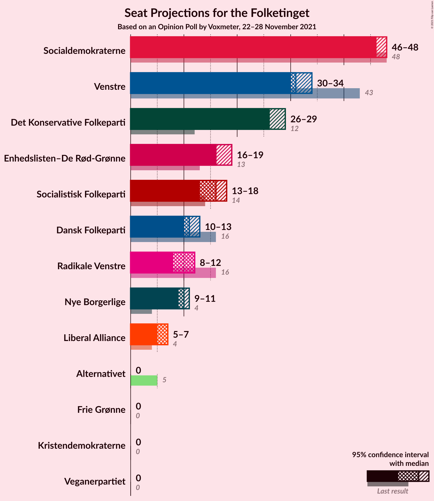
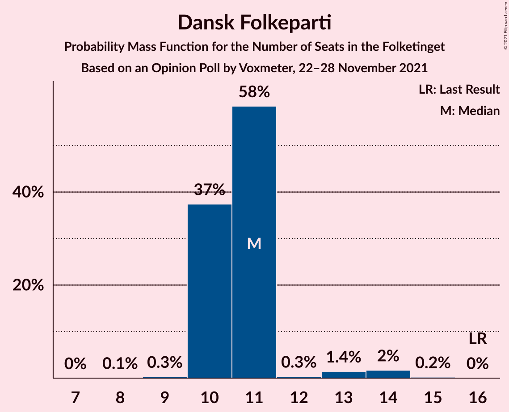
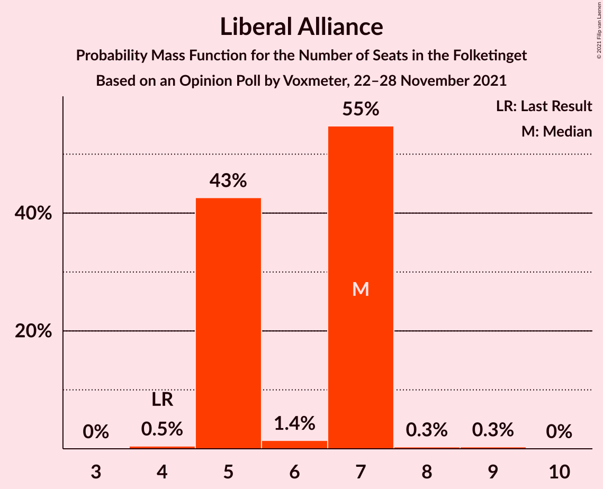
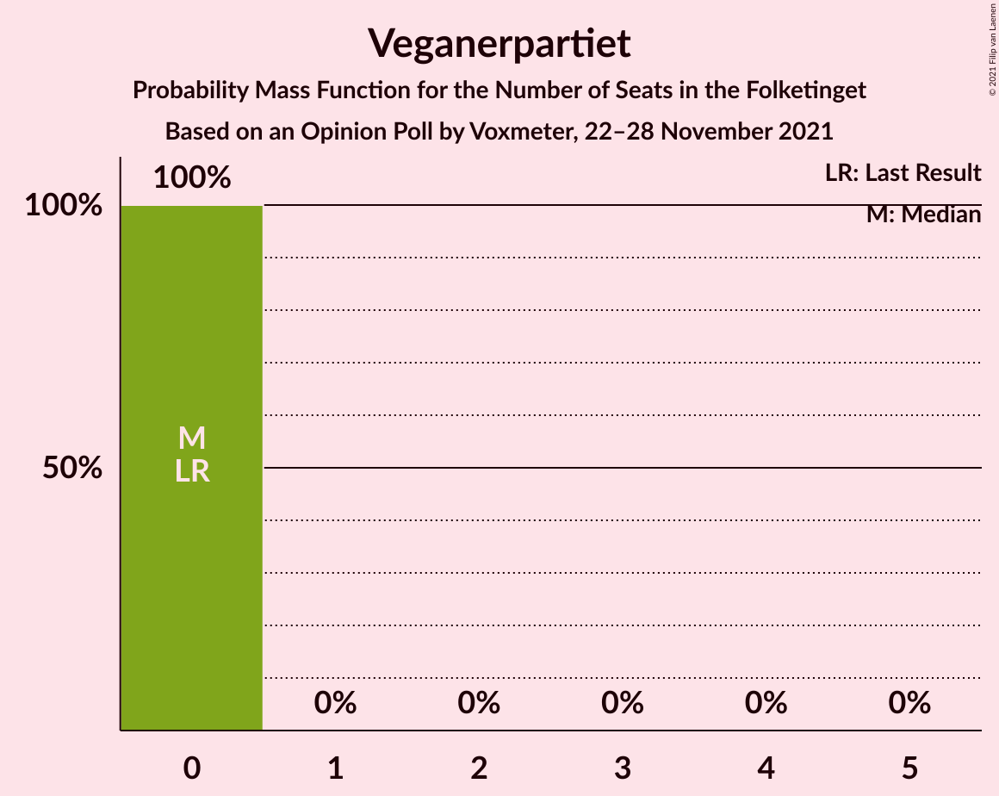
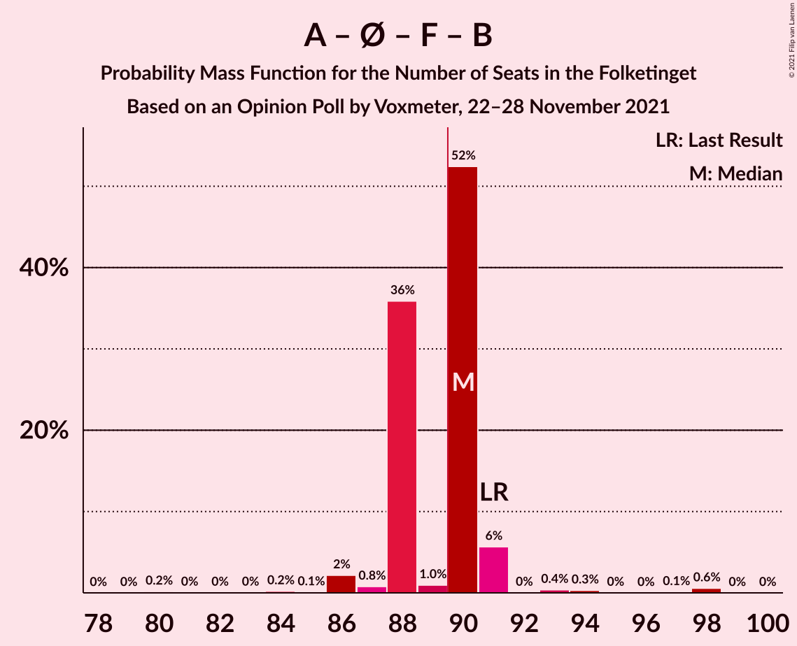
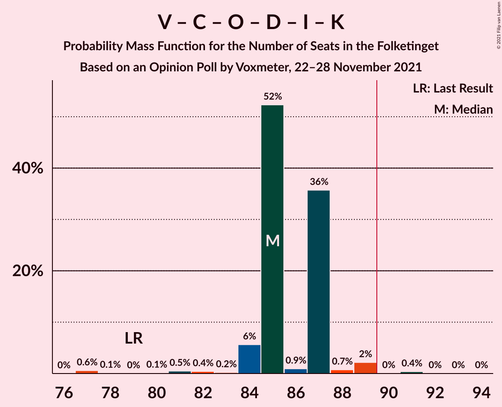
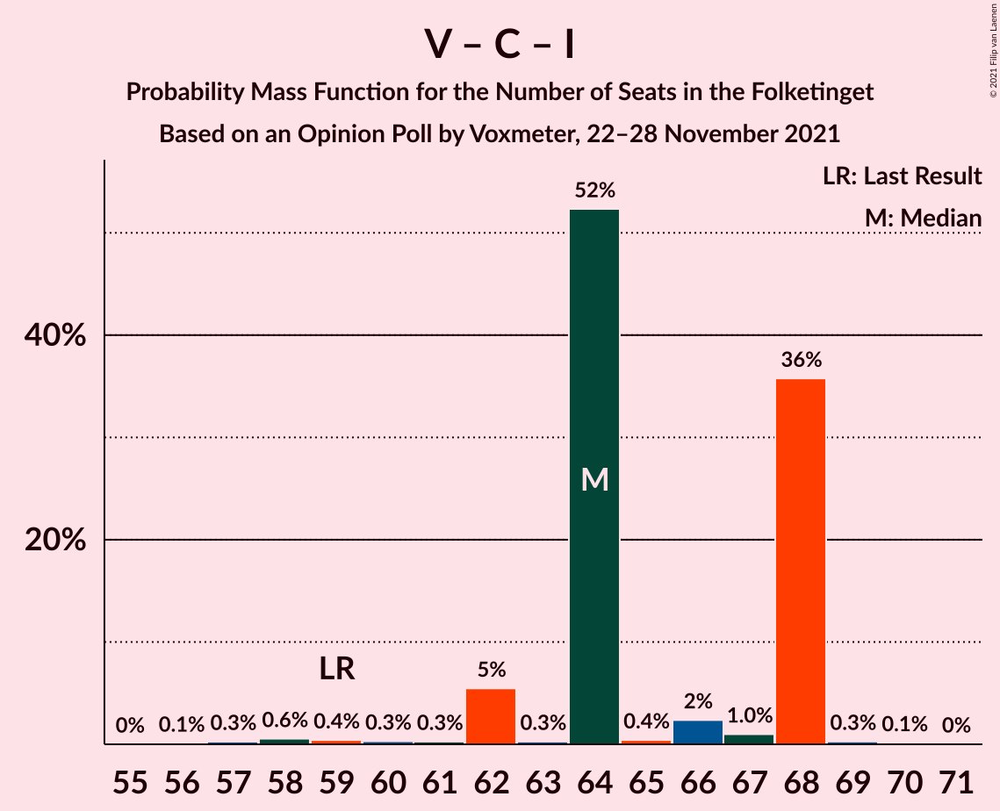

# Opinion Poll by Voxmeter, 22–28 November 2021

<a href="#voting-intentions">Voting Intentions</a> | <a href="#seats">Seats</a> | <a href="#coalitions">Coalitions</a> | <a href="#technical-information">Technical Information</a>

## Voting Intentions

### Confidence Intervals

| Party | Last Result | Poll Result | 80% Confidence Interval | 90% Confidence Interval | 95% Confidence Interval | 99% Confidence Interval |
|:-----:|:-----------:|:-----------:|:-----------------------:|:-----------------------:|:-----------------------:|:-----------------------:|
| Socialdemokraterne | 25.9% | 26.0% | 24.2–27.8% |23.8–28.3% |23.4–28.8% |22.5–29.7% |
| Venstre | 23.4% | 17.0% | 15.6–18.6% |15.2–19.1% |14.8–19.5% |14.1–20.3% |
| Det Konservative Folkeparti | 6.6% | 15.1% | 13.7–16.7% |13.4–17.1% |13.0–17.5% |12.4–18.2% |
| Enhedslisten–De Rød-Grønne | 6.9% | 9.7% | 8.6–11.0% |8.2–11.3% |8.0–11.6% |7.5–12.3% |
| Socialistisk Folkeparti | 7.7% | 7.9% | 6.9–9.1% |6.6–9.4% |6.4–9.7% |5.9–10.3% |
| Dansk Folkeparti | 8.7% | 6.2% | 5.3–7.3% |5.0–7.6% |4.8–7.8% |4.5–8.4% |
| Radikale Venstre | 8.6% | 5.7% | 4.8–6.7% |4.6–7.0% |4.4–7.3% |4.0–7.8% |
| Nye Borgerlige | 2.4% | 5.5% | 4.6–6.5% |4.4–6.8% |4.2–7.1% |3.9–7.6% |
| Liberal Alliance | 2.3% | 3.2% | 2.6–4.0% |2.4–4.3% |2.3–4.5% |2.0–4.9% |
| Kristendemokraterne | 1.7% | 1.1% | 0.8–1.6% |0.7–1.8% |0.6–2.0% |0.5–2.3% |
| Alternativet | 3.0% | 0.9% | 0.6–1.4% |0.5–1.6% |0.5–1.7% |0.4–2.0% |
| Veganerpartiet | 0.0% | 0.2% | 0.1–0.5% |0.1–0.6% |0.1–0.7% |0.0–0.9% |

*Note:* The poll result column reflects the actual value used in the calculations. Published results may vary slightly, and in addition be rounded to fewer digits.

## Seats

### Confidence Intervals

| Party | Last Result | Median | 80% Confidence Interval | 90% Confidence Interval | 95% Confidence Interval | 99% Confidence Interval |
|:-----:|:-----------:|:------:|:-----------------------:|:-----------------------:|:-----------------------:|:-----------------------:|
| <a href="#socialdemokraterne">Socialdemokraterne</a> | 48 | 47 | 44–49 |44–50 |42–50 |41–52 |
| <a href="#venstre">Venstre</a> | 43 | 30 | 27–33 |27–34 |27–35 |26–36 |
| <a href="#det-konservative-folkeparti">Det Konservative Folkeparti</a> | 12 | 28 | 25–31 |24–31 |24–31 |23–32 |
| <a href="#enhedslisten–de-rød-grønne">Enhedslisten–De Rød-Grønne</a> | 13 | 18 | 17–19 |15–19 |14–19 |14–22 |
| <a href="#socialistisk-folkeparti">Socialistisk Folkeparti</a> | 14 | 14 | 12–15 |12–16 |11–16 |11–18 |
| <a href="#dansk-folkeparti">Dansk Folkeparti</a> | 16 | 12 | 9–15 |9–15 |9–15 |8–15 |
| <a href="#radikale-venstre">Radikale Venstre</a> | 16 | 9 | 8–12 |8–12 |8–13 |8–13 |
| <a href="#nye-borgerlige">Nye Borgerlige</a> | 4 | 9 | 9–11 |8–11 |8–12 |7–14 |
| <a href="#liberal-alliance">Liberal Alliance</a> | 4 | 6 | 5–7 |5–8 |5–9 |0–9 |
| <a href="#kristendemokraterne">Kristendemokraterne</a> | 0 | 0 | 0 |0 |0 |0–4 |
| <a href="#alternativet">Alternativet</a> | 5 | 0 | 0 |0 |0 |0 |
| <a href="#veganerpartiet">Veganerpartiet</a> | 0 | 0 | 0 |0 |0 |0 |

### Socialdemokraterne

*For a full overview of the results for this party, see the [Socialdemokraterne](party-socialdemokraterne.html) page.*

| Number of Seats | Probability | Accumulated | Special Marks |
|:---------------:|:-----------:|:-----------:|:-------------:|
| 39 | 0% | 100% |  |
| 40 | 0.3% | 99.9% |  |
| 41 | 0.7% | 99.6% |  |
| 42 | 1.5% | 98.9% |  |
| 43 | 2% | 97% |  |
| 44 | 6% | 95% |  |
| 45 | 4% | 89% |  |
| 46 | 30% | 85% |  |
| 47 | 27% | 55% | Median |
| 48 | 9% | 28% | Last Result |
| 49 | 13% | 19% |  |
| 50 | 6% | 7% |  |
| 51 | 0.3% | 1.0% |  |
| 52 | 0.3% | 0.8% |  |
| 53 | 0.3% | 0.5% |  |
| 54 | 0.2% | 0.2% |  |
| 55 | 0.1% | 0.1% |  |
| 56 | 0% | 0% |  |

### Venstre

*For a full overview of the results for this party, see the [Venstre](party-venstre.html) page.*

| Number of Seats | Probability | Accumulated | Special Marks |
|:---------------:|:-----------:|:-----------:|:-------------:|
| 24 | 0.1% | 100% |  |
| 25 | 0.3% | 99.9% |  |
| 26 | 0.6% | 99.6% |  |
| 27 | 11% | 99.0% |  |
| 28 | 1.2% | 88% |  |
| 29 | 33% | 87% |  |
| 30 | 25% | 54% | Median |
| 31 | 4% | 29% |  |
| 32 | 14% | 26% |  |
| 33 | 5% | 12% |  |
| 34 | 3% | 6% |  |
| 35 | 1.0% | 3% |  |
| 36 | 2% | 2% |  |
| 37 | 0.2% | 0.3% |  |
| 38 | 0.1% | 0.1% |  |
| 39 | 0% | 0% |  |
| 40 | 0% | 0% |  |
| 41 | 0% | 0% |  |
| 42 | 0% | 0% |  |
| 43 | 0% | 0% | Last Result |

### Det Konservative Folkeparti

*For a full overview of the results for this party, see the [Det Konservative Folkeparti](party-detkonservativefolkeparti.html) page.*

| Number of Seats | Probability | Accumulated | Special Marks |
|:---------------:|:-----------:|:-----------:|:-------------:|
| 12 | 0% | 100% | Last Result |
| 13 | 0% | 100% |  |
| 14 | 0% | 100% |  |
| 15 | 0% | 100% |  |
| 16 | 0% | 100% |  |
| 17 | 0% | 100% |  |
| 18 | 0% | 100% |  |
| 19 | 0% | 100% |  |
| 20 | 0% | 100% |  |
| 21 | 0.1% | 100% |  |
| 22 | 0.2% | 99.9% |  |
| 23 | 0.4% | 99.6% |  |
| 24 | 7% | 99.2% |  |
| 25 | 4% | 92% |  |
| 26 | 2% | 88% |  |
| 27 | 30% | 86% |  |
| 28 | 16% | 57% | Median |
| 29 | 9% | 41% |  |
| 30 | 1.0% | 32% |  |
| 31 | 30% | 31% |  |
| 32 | 0.5% | 0.7% |  |
| 33 | 0.1% | 0.2% |  |
| 34 | 0.1% | 0.1% |  |
| 35 | 0% | 0% |  |

### Enhedslisten–De Rød-Grønne

*For a full overview of the results for this party, see the [Enhedslisten–De Rød-Grønne](party-enhedslisten–derød-grønne.html) page.*

| Number of Seats | Probability | Accumulated | Special Marks |
|:---------------:|:-----------:|:-----------:|:-------------:|
| 12 | 0% | 100% |  |
| 13 | 0.2% | 99.9% | Last Result |
| 14 | 3% | 99.7% |  |
| 15 | 3% | 96% |  |
| 16 | 2% | 94% |  |
| 17 | 11% | 91% |  |
| 18 | 58% | 80% | Median |
| 19 | 20% | 22% |  |
| 20 | 1.1% | 2% |  |
| 21 | 0.4% | 1.0% |  |
| 22 | 0.2% | 0.6% |  |
| 23 | 0.3% | 0.4% |  |
| 24 | 0% | 0% |  |

### Socialistisk Folkeparti

*For a full overview of the results for this party, see the [Socialistisk Folkeparti](party-socialistiskfolkeparti.html) page.*

| Number of Seats | Probability | Accumulated | Special Marks |
|:---------------:|:-----------:|:-----------:|:-------------:|
| 10 | 0.1% | 100% |  |
| 11 | 5% | 99.8% |  |
| 12 | 20% | 95% |  |
| 13 | 15% | 75% |  |
| 14 | 48% | 61% | Last Result, Median |
| 15 | 7% | 13% |  |
| 16 | 4% | 6% |  |
| 17 | 0.9% | 2% |  |
| 18 | 0.6% | 1.0% |  |
| 19 | 0.2% | 0.3% |  |
| 20 | 0.1% | 0.1% |  |
| 21 | 0% | 0% |  |

### Dansk Folkeparti

*For a full overview of the results for this party, see the [Dansk Folkeparti](party-danskfolkeparti.html) page.*

| Number of Seats | Probability | Accumulated | Special Marks |
|:---------------:|:-----------:|:-----------:|:-------------:|
| 7 | 0.1% | 100% |  |
| 8 | 0.7% | 99.9% |  |
| 9 | 11% | 99.2% |  |
| 10 | 4% | 88% |  |
| 11 | 9% | 84% |  |
| 12 | 39% | 75% | Median |
| 13 | 2% | 36% |  |
| 14 | 22% | 34% |  |
| 15 | 12% | 12% |  |
| 16 | 0% | 0% | Last Result |

### Radikale Venstre

*For a full overview of the results for this party, see the [Radikale Venstre](party-radikalevenstre.html) page.*

| Number of Seats | Probability | Accumulated | Special Marks |
|:---------------:|:-----------:|:-----------:|:-------------:|
| 6 | 0.1% | 100% |  |
| 7 | 0.2% | 99.9% |  |
| 8 | 11% | 99.7% |  |
| 9 | 40% | 89% | Median |
| 10 | 14% | 49% |  |
| 11 | 10% | 36% |  |
| 12 | 22% | 25% |  |
| 13 | 3% | 4% |  |
| 14 | 0.3% | 0.5% |  |
| 15 | 0.1% | 0.2% |  |
| 16 | 0.1% | 0.1% | Last Result |
| 17 | 0% | 0% |  |

### Nye Borgerlige

*For a full overview of the results for this party, see the [Nye Borgerlige](party-nyeborgerlige.html) page.*

| Number of Seats | Probability | Accumulated | Special Marks |
|:---------------:|:-----------:|:-----------:|:-------------:|
| 4 | 0% | 100% | Last Result |
| 5 | 0% | 100% |  |
| 6 | 0.3% | 100% |  |
| 7 | 0.8% | 99.7% |  |
| 8 | 6% | 98.9% |  |
| 9 | 46% | 93% | Median |
| 10 | 36% | 47% |  |
| 11 | 8% | 11% |  |
| 12 | 2% | 4% |  |
| 13 | 0.9% | 2% |  |
| 14 | 0.7% | 0.7% |  |
| 15 | 0% | 0% |  |

### Liberal Alliance

*For a full overview of the results for this party, see the [Liberal Alliance](party-liberalalliance.html) page.*

| Number of Seats | Probability | Accumulated | Special Marks |
|:---------------:|:-----------:|:-----------:|:-------------:|
| 0 | 0.5% | 100% |  |
| 1 | 0% | 99.5% |  |
| 2 | 0% | 99.5% |  |
| 3 | 0% | 99.5% |  |
| 4 | 2% | 99.5% | Last Result |
| 5 | 26% | 98% |  |
| 6 | 56% | 71% | Median |
| 7 | 8% | 15% |  |
| 8 | 4% | 7% |  |
| 9 | 2% | 3% |  |
| 10 | 0.1% | 0.1% |  |
| 11 | 0% | 0% |  |

### Kristendemokraterne

*For a full overview of the results for this party, see the [Kristendemokraterne](party-kristendemokraterne.html) page.*

| Number of Seats | Probability | Accumulated | Special Marks |
|:---------------:|:-----------:|:-----------:|:-------------:|
| 0 | 98% | 100% | Last Result, Median |
| 1 | 0% | 2% |  |
| 2 | 0% | 2% |  |
| 3 | 0% | 2% |  |
| 4 | 2% | 2% |  |
| 5 | 0.2% | 0.2% |  |
| 6 | 0% | 0% |  |

### Alternativet

*For a full overview of the results for this party, see the [Alternativet](party-alternativet.html) page.*

| Number of Seats | Probability | Accumulated | Special Marks |
|:---------------:|:-----------:|:-----------:|:-------------:|
| 0 | 99.6% | 100% | Median |
| 1 | 0% | 0.4% |  |
| 2 | 0% | 0.4% |  |
| 3 | 0% | 0.4% |  |
| 4 | 0.4% | 0.4% |  |
| 5 | 0% | 0% | Last Result |

### Veganerpartiet

*For a full overview of the results for this party, see the [Veganerpartiet](party-veganerpartiet.html) page.*

| Number of Seats | Probability | Accumulated | Special Marks |
|:---------------:|:-----------:|:-----------:|:-------------:|
| 0 | 100% | 100% | Last Result, Median |

## Coalitions

### Confidence Intervals

| Coalition | Last Result | Median | Majority? | 80% Confidence Interval | 90% Confidence Interval | 95% Confidence Interval | 99% Confidence Interval |
|:---------:|:-----------:|:------:|:---------:|:-----------------------:|:-----------------------:|:-----------------------:|:-----------------------:|
| Socialdemokraterne – Enhedslisten–De Rød-Grønne – Socialistisk Folkeparti – Radikale Venstre – Alternativet | 96 | 89 | 28% | 86–90 | 84–91 | 83–93 | 82–95 |
| Socialdemokraterne – Enhedslisten–De Rød-Grønne – Socialistisk Folkeparti – Radikale Venstre | 91 | 89 | 27% | 86–90 | 84–91 | 83–93 | 82–94 |
| Venstre – Det Konservative Folkeparti – Dansk Folkeparti – Nye Borgerlige – Liberal Alliance – Kristendemokraterne | 79 | 86 | 6% | 83–88 | 82–91 | 81–92 | 78–93 |
| Venstre – Det Konservative Folkeparti – Dansk Folkeparti – Nye Borgerlige – Liberal Alliance | 79 | 86 | 6% | 82–88 | 82–91 | 81–92 | 78–93 |
| Socialdemokraterne – Enhedslisten–De Rød-Grønne – Socialistisk Folkeparti – Alternativet | 80 | 78 | 0% | 76–82 | 74–82 | 73–82 | 71–84 |
| Socialdemokraterne – Enhedslisten–De Rød-Grønne – Socialistisk Folkeparti | 75 | 78 | 0% | 76–81 | 74–82 | 73–82 | 71–84 |
| Venstre – Det Konservative Folkeparti – Dansk Folkeparti – Liberal Alliance – Kristendemokraterne | 75 | 77 | 0% | 73–79 | 72–80 | 71–81 | 68–82 |
| Venstre – Det Konservative Folkeparti – Dansk Folkeparti – Liberal Alliance | 75 | 77 | 0% | 73–79 | 72–80 | 71–81 | 68–82 |
| Socialdemokraterne – Socialistisk Folkeparti – Radikale Venstre | 78 | 71 | 0% | 68–72 | 67–74 | 66–75 | 65–78 |
| Venstre – Det Konservative Folkeparti – Liberal Alliance | 59 | 64 | 0% | 61–66 | 61–68 | 60–70 | 57–70 |
| Venstre – Det Konservative Folkeparti | 55 | 58 | 0% | 56–60 | 56–62 | 54–64 | 52–64 |
| Socialdemokraterne – Radikale Venstre | 64 | 57 | 0% | 54–59 | 54–61 | 52–61 | 51–63 |
| Venstre | 43 | 30 | 0% | 27–33 | 27–34 | 27–35 | 26–36 |

### Socialdemokraterne – Enhedslisten–De Rød-Grønne – Socialistisk Folkeparti – Radikale Venstre – Alternativet

| Number of Seats | Probability | Accumulated | Special Marks |
|:---------------:|:-----------:|:-----------:|:-------------:|
| 79 | 0.1% | 100% |  |
| 80 | 0% | 99.9% |  |
| 81 | 0.2% | 99.9% |  |
| 82 | 0.5% | 99.7% |  |
| 83 | 3% | 99.2% |  |
| 84 | 2% | 96% |  |
| 85 | 2% | 94% |  |
| 86 | 8% | 92% |  |
| 87 | 25% | 84% |  |
| 88 | 5% | 59% | Median |
| 89 | 26% | 54% |  |
| 90 | 20% | 28% | Majority |
| 91 | 4% | 8% |  |
| 92 | 0.7% | 4% |  |
| 93 | 2% | 3% |  |
| 94 | 0.6% | 1.1% |  |
| 95 | 0.3% | 0.5% |  |
| 96 | 0.1% | 0.2% | Last Result |
| 97 | 0% | 0.1% |  |
| 98 | 0% | 0.1% |  |
| 99 | 0% | 0.1% |  |
| 100 | 0% | 0% |  |

### Socialdemokraterne – Enhedslisten–De Rød-Grønne – Socialistisk Folkeparti – Radikale Venstre

| Number of Seats | Probability | Accumulated | Special Marks |
|:---------------:|:-----------:|:-----------:|:-------------:|
| 79 | 0.1% | 100% |  |
| 80 | 0% | 99.9% |  |
| 81 | 0.2% | 99.9% |  |
| 82 | 0.5% | 99.6% |  |
| 83 | 3% | 99.1% |  |
| 84 | 2% | 96% |  |
| 85 | 2% | 94% |  |
| 86 | 8% | 92% |  |
| 87 | 25% | 84% |  |
| 88 | 5% | 59% | Median |
| 89 | 26% | 54% |  |
| 90 | 20% | 27% | Majority |
| 91 | 4% | 8% | Last Result |
| 92 | 0.7% | 3% |  |
| 93 | 2% | 3% |  |
| 94 | 0.5% | 1.0% |  |
| 95 | 0.3% | 0.5% |  |
| 96 | 0.1% | 0.2% |  |
| 97 | 0% | 0.1% |  |
| 98 | 0% | 0.1% |  |
| 99 | 0% | 0% |  |

### Venstre – Det Konservative Folkeparti – Dansk Folkeparti – Nye Borgerlige – Liberal Alliance – Kristendemokraterne

| Number of Seats | Probability | Accumulated | Special Marks |
|:---------------:|:-----------:|:-----------:|:-------------:|
| 75 | 0% | 100% |  |
| 76 | 0.1% | 99.9% |  |
| 77 | 0.1% | 99.8% |  |
| 78 | 0.3% | 99.7% |  |
| 79 | 0.3% | 99.4% | Last Result |
| 80 | 0.9% | 99.1% |  |
| 81 | 1.5% | 98% |  |
| 82 | 6% | 97% |  |
| 83 | 2% | 91% |  |
| 84 | 4% | 89% |  |
| 85 | 25% | 85% | Median |
| 86 | 22% | 60% |  |
| 87 | 4% | 38% |  |
| 88 | 25% | 35% |  |
| 89 | 3% | 10% |  |
| 90 | 0.8% | 6% | Majority |
| 91 | 2% | 5% |  |
| 92 | 3% | 3% |  |
| 93 | 0.4% | 0.6% |  |
| 94 | 0.1% | 0.2% |  |
| 95 | 0% | 0.1% |  |
| 96 | 0.1% | 0.1% |  |
| 97 | 0% | 0% |  |

### Venstre – Det Konservative Folkeparti – Dansk Folkeparti – Nye Borgerlige – Liberal Alliance

| Number of Seats | Probability | Accumulated | Special Marks |
|:---------------:|:-----------:|:-----------:|:-------------:|
| 75 | 0% | 100% |  |
| 76 | 0.1% | 99.9% |  |
| 77 | 0.1% | 99.8% |  |
| 78 | 0.3% | 99.7% |  |
| 79 | 0.6% | 99.4% | Last Result |
| 80 | 1.0% | 98.8% |  |
| 81 | 3% | 98% |  |
| 82 | 6% | 95% |  |
| 83 | 1.3% | 89% |  |
| 84 | 4% | 87% |  |
| 85 | 24% | 84% | Median |
| 86 | 22% | 60% |  |
| 87 | 4% | 38% |  |
| 88 | 25% | 35% |  |
| 89 | 3% | 10% |  |
| 90 | 0.8% | 6% | Majority |
| 91 | 2% | 5% |  |
| 92 | 3% | 3% |  |
| 93 | 0.4% | 0.6% |  |
| 94 | 0.1% | 0.2% |  |
| 95 | 0% | 0.1% |  |
| 96 | 0.1% | 0.1% |  |
| 97 | 0% | 0% |  |

### Socialdemokraterne – Enhedslisten–De Rød-Grønne – Socialistisk Folkeparti – Alternativet

| Number of Seats | Probability | Accumulated | Special Marks |
|:---------------:|:-----------:|:-----------:|:-------------:|
| 69 | 0% | 100% |  |
| 70 | 0.1% | 99.9% |  |
| 71 | 0.4% | 99.9% |  |
| 72 | 0.3% | 99.4% |  |
| 73 | 3% | 99.1% |  |
| 74 | 4% | 96% |  |
| 75 | 1.2% | 92% |  |
| 76 | 7% | 91% |  |
| 77 | 21% | 84% |  |
| 78 | 26% | 64% |  |
| 79 | 8% | 38% | Median |
| 80 | 17% | 29% | Last Result |
| 81 | 2% | 12% |  |
| 82 | 8% | 10% |  |
| 83 | 1.4% | 2% |  |
| 84 | 0.3% | 0.7% |  |
| 85 | 0.2% | 0.4% |  |
| 86 | 0.1% | 0.2% |  |
| 87 | 0% | 0.1% |  |
| 88 | 0.1% | 0.1% |  |
| 89 | 0% | 0% |  |

### Socialdemokraterne – Enhedslisten–De Rød-Grønne – Socialistisk Folkeparti

| Number of Seats | Probability | Accumulated | Special Marks |
|:---------------:|:-----------:|:-----------:|:-------------:|
| 69 | 0.1% | 100% |  |
| 70 | 0.1% | 99.9% |  |
| 71 | 0.4% | 99.8% |  |
| 72 | 0.3% | 99.4% |  |
| 73 | 3% | 99.1% |  |
| 74 | 4% | 96% |  |
| 75 | 1.3% | 92% | Last Result |
| 76 | 7% | 91% |  |
| 77 | 21% | 84% |  |
| 78 | 26% | 64% |  |
| 79 | 9% | 37% | Median |
| 80 | 17% | 29% |  |
| 81 | 2% | 12% |  |
| 82 | 8% | 10% |  |
| 83 | 1.3% | 2% |  |
| 84 | 0.3% | 0.6% |  |
| 85 | 0.1% | 0.3% |  |
| 86 | 0% | 0.2% |  |
| 87 | 0% | 0.1% |  |
| 88 | 0% | 0.1% |  |
| 89 | 0% | 0% |  |

### Venstre – Det Konservative Folkeparti – Dansk Folkeparti – Liberal Alliance – Kristendemokraterne

| Number of Seats | Probability | Accumulated | Special Marks |
|:---------------:|:-----------:|:-----------:|:-------------:|
| 65 | 0% | 100% |  |
| 66 | 0% | 99.9% |  |
| 67 | 0.3% | 99.9% |  |
| 68 | 0.5% | 99.6% |  |
| 69 | 0.3% | 99.1% |  |
| 70 | 0.3% | 98.8% |  |
| 71 | 2% | 98% |  |
| 72 | 2% | 97% |  |
| 73 | 5% | 94% |  |
| 74 | 4% | 89% |  |
| 75 | 4% | 85% | Last Result |
| 76 | 20% | 81% | Median |
| 77 | 25% | 61% |  |
| 78 | 25% | 36% |  |
| 79 | 5% | 10% |  |
| 80 | 1.1% | 6% |  |
| 81 | 3% | 5% |  |
| 82 | 1.5% | 2% |  |
| 83 | 0.1% | 0.3% |  |
| 84 | 0.2% | 0.2% |  |
| 85 | 0% | 0% |  |

### Venstre – Det Konservative Folkeparti – Dansk Folkeparti – Liberal Alliance

| Number of Seats | Probability | Accumulated | Special Marks |
|:---------------:|:-----------:|:-----------:|:-------------:|
| 65 | 0% | 100% |  |
| 66 | 0% | 99.9% |  |
| 67 | 0.4% | 99.9% |  |
| 68 | 0.7% | 99.5% |  |
| 69 | 0.3% | 98.8% |  |
| 70 | 0.4% | 98% |  |
| 71 | 3% | 98% |  |
| 72 | 2% | 95% |  |
| 73 | 6% | 93% |  |
| 74 | 4% | 87% |  |
| 75 | 3% | 83% | Last Result |
| 76 | 19% | 80% | Median |
| 77 | 25% | 61% |  |
| 78 | 25% | 35% |  |
| 79 | 5% | 10% |  |
| 80 | 1.1% | 6% |  |
| 81 | 3% | 5% |  |
| 82 | 1.5% | 2% |  |
| 83 | 0.1% | 0.3% |  |
| 84 | 0.2% | 0.2% |  |
| 85 | 0% | 0% |  |

### Socialdemokraterne – Socialistisk Folkeparti – Radikale Venstre

| Number of Seats | Probability | Accumulated | Special Marks |
|:---------------:|:-----------:|:-----------:|:-------------:|
| 63 | 0.2% | 100% |  |
| 64 | 0.2% | 99.8% |  |
| 65 | 0.7% | 99.6% |  |
| 66 | 3% | 98.9% |  |
| 67 | 3% | 95% |  |
| 68 | 4% | 93% |  |
| 69 | 28% | 89% |  |
| 70 | 1.0% | 60% | Median |
| 71 | 44% | 59% |  |
| 72 | 9% | 16% |  |
| 73 | 0.8% | 7% |  |
| 74 | 2% | 6% |  |
| 75 | 3% | 5% |  |
| 76 | 0.6% | 2% |  |
| 77 | 0.4% | 0.9% |  |
| 78 | 0.1% | 0.5% | Last Result |
| 79 | 0.2% | 0.4% |  |
| 80 | 0.1% | 0.2% |  |
| 81 | 0% | 0.1% |  |
| 82 | 0% | 0% |  |

### Venstre – Det Konservative Folkeparti – Liberal Alliance

| Number of Seats | Probability | Accumulated | Special Marks |
|:---------------:|:-----------:|:-----------:|:-------------:|
| 54 | 0.1% | 100% |  |
| 55 | 0.1% | 99.9% |  |
| 56 | 0.2% | 99.8% |  |
| 57 | 0.3% | 99.6% |  |
| 58 | 0.4% | 99.3% |  |
| 59 | 1.2% | 98.9% | Last Result |
| 60 | 0.6% | 98% |  |
| 61 | 9% | 97% |  |
| 62 | 10% | 88% |  |
| 63 | 18% | 79% |  |
| 64 | 12% | 61% | Median |
| 65 | 13% | 49% |  |
| 66 | 29% | 36% |  |
| 67 | 1.1% | 7% |  |
| 68 | 3% | 6% |  |
| 69 | 0.5% | 3% |  |
| 70 | 2% | 3% |  |
| 71 | 0.4% | 0.5% |  |
| 72 | 0% | 0.1% |  |
| 73 | 0% | 0.1% |  |
| 74 | 0% | 0% |  |

### Venstre – Det Konservative Folkeparti

| Number of Seats | Probability | Accumulated | Special Marks |
|:---------------:|:-----------:|:-----------:|:-------------:|
| 49 | 0.2% | 100% |  |
| 50 | 0.1% | 99.8% |  |
| 51 | 0.2% | 99.7% |  |
| 52 | 0.3% | 99.5% |  |
| 53 | 0.5% | 99.3% |  |
| 54 | 2% | 98.7% |  |
| 55 | 0.9% | 97% | Last Result |
| 56 | 18% | 96% |  |
| 57 | 19% | 78% |  |
| 58 | 10% | 59% | Median |
| 59 | 10% | 48% |  |
| 60 | 30% | 39% |  |
| 61 | 4% | 9% |  |
| 62 | 2% | 5% |  |
| 63 | 0.6% | 3% |  |
| 64 | 2% | 3% |  |
| 65 | 0.3% | 0.4% |  |
| 66 | 0% | 0.1% |  |
| 67 | 0.1% | 0.1% |  |
| 68 | 0% | 0% |  |

### Socialdemokraterne – Radikale Venstre

| Number of Seats | Probability | Accumulated | Special Marks |
|:---------------:|:-----------:|:-----------:|:-------------:|
| 49 | 0.1% | 100% |  |
| 50 | 0.3% | 99.8% |  |
| 51 | 0.8% | 99.5% |  |
| 52 | 1.5% | 98.7% |  |
| 53 | 2% | 97% |  |
| 54 | 7% | 95% |  |
| 55 | 26% | 88% |  |
| 56 | 6% | 63% | Median |
| 57 | 20% | 57% |  |
| 58 | 6% | 37% |  |
| 59 | 23% | 30% |  |
| 60 | 1.5% | 7% |  |
| 61 | 5% | 6% |  |
| 62 | 0.2% | 0.9% |  |
| 63 | 0.5% | 0.7% |  |
| 64 | 0% | 0.3% | Last Result |
| 65 | 0.2% | 0.2% |  |
| 66 | 0.1% | 0.1% |  |
| 67 | 0% | 0% |  |

### Venstre

| Number of Seats | Probability | Accumulated | Special Marks |
|:---------------:|:-----------:|:-----------:|:-------------:|
| 24 | 0.1% | 100% |  |
| 25 | 0.3% | 99.9% |  |
| 26 | 0.6% | 99.6% |  |
| 27 | 11% | 99.0% |  |
| 28 | 1.2% | 88% |  |
| 29 | 33% | 87% |  |
| 30 | 25% | 54% | Median |
| 31 | 4% | 29% |  |
| 32 | 14% | 26% |  |
| 33 | 5% | 12% |  |
| 34 | 3% | 6% |  |
| 35 | 1.0% | 3% |  |
| 36 | 2% | 2% |  |
| 37 | 0.2% | 0.3% |  |
| 38 | 0.1% | 0.1% |  |
| 39 | 0% | 0% |  |
| 40 | 0% | 0% |  |
| 41 | 0% | 0% |  |
| 42 | 0% | 0% |  |
| 43 | 0% | 0% | Last Result |

## Technical Information

### Opinion Poll

+ **Polling firm:** Voxmeter
+ **Commissioner(s):** —
+ **Fieldwork period:** 22–28 November 2021

### Calculations

+ **Sample size:** 1005
+ **Simulations done:** 1,048,576
+ **Error estimate:** 1.72%

