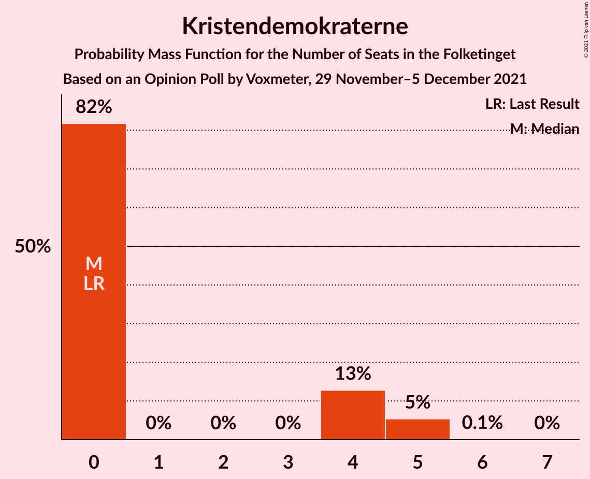
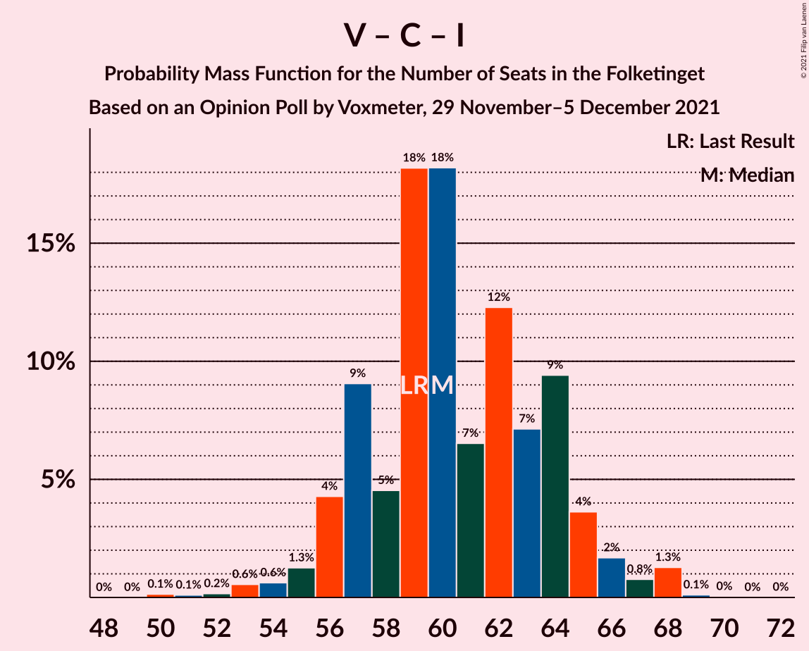

# Opinion Poll by Voxmeter, 29 November–5 December 2021

<a href="#voting-intentions">Voting Intentions</a> | <a href="#seats">Seats</a> | <a href="#coalitions">Coalitions</a> | <a href="#technical-information">Technical Information</a>

## Voting Intentions

### Confidence Intervals

| Party | Last Result | Poll Result | 80% Confidence Interval | 90% Confidence Interval | 95% Confidence Interval | 99% Confidence Interval |
|:-----:|:-----------:|:-----------:|:-----------------------:|:-----------------------:|:-----------------------:|:-----------------------:|
| Socialdemokraterne | 25.9% | 25.7% | 24.0–27.6% |23.5–28.1% |23.1–28.5% |22.3–29.4% |
| Venstre | 23.4% | 16.4% | 14.9–17.9% |14.5–18.4% |14.2–18.8% |13.5–19.6% |
| Det Konservative Folkeparti | 6.6% | 15.1% | 13.7–16.6% |13.3–17.0% |13.0–17.4% |12.3–18.2% |
| Enhedslisten–De Rød-Grønne | 6.9% | 10.3% | 9.1–11.6% |8.8–12.0% |8.5–12.3% |8.0–13.0% |
| Socialistisk Folkeparti | 7.7% | 8.4% | 7.3–9.6% |7.1–10.0% |6.8–10.3% |6.3–10.9% |
| Dansk Folkeparti | 8.7% | 6.6% | 5.7–7.7% |5.4–8.0% |5.2–8.3% |4.8–8.9% |
| Radikale Venstre | 8.6% | 6.4% | 5.5–7.5% |5.2–7.8% |5.0–8.1% |4.6–8.6% |
| Nye Borgerlige | 2.4% | 4.9% | 4.1–5.9% |3.9–6.2% |3.7–6.4% |3.4–6.9% |
| Liberal Alliance | 2.3% | 2.4% | 1.9–3.1% |1.7–3.4% |1.6–3.5% |1.4–3.9% |
| Kristendemokraterne | 1.7% | 1.6% | 1.2–2.2% |1.1–2.4% |1.0–2.6% |0.8–2.9% |
| Alternativet | 3.0% | 1.1% | 0.8–1.7% |0.7–1.8% |0.6–2.0% |0.5–2.3% |

*Note:* The poll result column reflects the actual value used in the calculations. Published results may vary slightly, and in addition be rounded to fewer digits.

## Seats

### Confidence Intervals

| Party | Last Result | Median | 80% Confidence Interval | 90% Confidence Interval | 95% Confidence Interval | 99% Confidence Interval |
|:-----:|:-----------:|:------:|:-----------------------:|:-----------------------:|:-----------------------:|:-----------------------:|
| <a href="#socialdemokraterne">Socialdemokraterne</a> | 48 | 46 | 41–51 |41–53 |41–53 |40–53 |
| <a href="#venstre">Venstre</a> | 43 | 30 | 26–32 |26–33 |25–34 |24–35 |
| <a href="#det-konservative-folkeparti">Det Konservative Folkeparti</a> | 12 | 28 | 25–30 |23–31 |22–32 |22–33 |
| <a href="#enhedslisten–de-rød-grønne">Enhedslisten–De Rød-Grønne</a> | 13 | 19 | 17–21 |16–22 |15–22 |14–24 |
| <a href="#socialistisk-folkeparti">Socialistisk Folkeparti</a> | 14 | 15 | 13–17 |13–18 |13–18 |12–20 |
| <a href="#dansk-folkeparti">Dansk Folkeparti</a> | 16 | 12 | 11–13 |10–14 |10–14 |9–16 |
| <a href="#radikale-venstre">Radikale Venstre</a> | 16 | 12 | 10–14 |9–15 |9–15 |8–16 |
| <a href="#nye-borgerlige">Nye Borgerlige</a> | 4 | 9 | 8–10 |7–11 |7–11 |6–13 |
| <a href="#liberal-alliance">Liberal Alliance</a> | 4 | 4 | 0–6 |0–6 |0–6 |0–7 |
| <a href="#kristendemokraterne">Kristendemokraterne</a> | 0 | 0 | 0–4 |0–5 |0–5 |0–5 |
| <a href="#alternativet">Alternativet</a> | 5 | 0 | 0 |0 |0 |0–4 |

### Socialdemokraterne

*For a full overview of the results for this party, see the [Socialdemokraterne](party-socialdemokraterne.html) page.*

| Number of Seats | Probability | Accumulated | Special Marks |
|:---------------:|:-----------:|:-----------:|:-------------:|
| 39 | 0.2% | 100% |  |
| 40 | 0.9% | 99.8% |  |
| 41 | 10% | 98.9% |  |
| 42 | 10% | 89% |  |
| 43 | 4% | 79% |  |
| 44 | 5% | 75% |  |
| 45 | 4% | 70% |  |
| 46 | 21% | 66% | Median |
| 47 | 4% | 44% |  |
| 48 | 11% | 40% | Last Result |
| 49 | 4% | 29% |  |
| 50 | 2% | 25% |  |
| 51 | 14% | 23% |  |
| 52 | 3% | 10% |  |
| 53 | 7% | 7% |  |
| 54 | 0.3% | 0.4% |  |
| 55 | 0% | 0.1% |  |
| 56 | 0.1% | 0.1% |  |
| 57 | 0% | 0% |  |

### Venstre

*For a full overview of the results for this party, see the [Venstre](party-venstre.html) page.*

| Number of Seats | Probability | Accumulated | Special Marks |
|:---------------:|:-----------:|:-----------:|:-------------:|
| 23 | 0.1% | 100% |  |
| 24 | 0.5% | 99.9% |  |
| 25 | 3% | 99.4% |  |
| 26 | 17% | 96% |  |
| 27 | 2% | 79% |  |
| 28 | 6% | 77% |  |
| 29 | 10% | 71% |  |
| 30 | 15% | 61% | Median |
| 31 | 33% | 46% |  |
| 32 | 6% | 12% |  |
| 33 | 3% | 7% |  |
| 34 | 3% | 4% |  |
| 35 | 0.3% | 0.7% |  |
| 36 | 0.3% | 0.4% |  |
| 37 | 0% | 0.1% |  |
| 38 | 0% | 0% |  |
| 39 | 0% | 0% |  |
| 40 | 0% | 0% |  |
| 41 | 0% | 0% |  |
| 42 | 0% | 0% |  |
| 43 | 0% | 0% | Last Result |

### Det Konservative Folkeparti

*For a full overview of the results for this party, see the [Det Konservative Folkeparti](party-detkonservativefolkeparti.html) page.*

| Number of Seats | Probability | Accumulated | Special Marks |
|:---------------:|:-----------:|:-----------:|:-------------:|
| 12 | 0% | 100% | Last Result |
| 13 | 0% | 100% |  |
| 14 | 0% | 100% |  |
| 15 | 0% | 100% |  |
| 16 | 0% | 100% |  |
| 17 | 0% | 100% |  |
| 18 | 0% | 100% |  |
| 19 | 0% | 100% |  |
| 20 | 0% | 100% |  |
| 21 | 0.2% | 100% |  |
| 22 | 3% | 99.8% |  |
| 23 | 2% | 97% |  |
| 24 | 3% | 95% |  |
| 25 | 3% | 92% |  |
| 26 | 17% | 89% |  |
| 27 | 15% | 72% |  |
| 28 | 27% | 57% | Median |
| 29 | 19% | 30% |  |
| 30 | 5% | 11% |  |
| 31 | 2% | 6% |  |
| 32 | 2% | 4% |  |
| 33 | 1.1% | 1.3% |  |
| 34 | 0.2% | 0.2% |  |
| 35 | 0% | 0% |  |

### Enhedslisten–De Rød-Grønne

*For a full overview of the results for this party, see the [Enhedslisten–De Rød-Grønne](party-enhedslisten–derød-grønne.html) page.*

| Number of Seats | Probability | Accumulated | Special Marks |
|:---------------:|:-----------:|:-----------:|:-------------:|
| 13 | 0.1% | 100% | Last Result |
| 14 | 2% | 99.9% |  |
| 15 | 2% | 98% |  |
| 16 | 5% | 97% |  |
| 17 | 11% | 92% |  |
| 18 | 30% | 81% |  |
| 19 | 16% | 51% | Median |
| 20 | 8% | 35% |  |
| 21 | 22% | 27% |  |
| 22 | 3% | 5% |  |
| 23 | 1.3% | 2% |  |
| 24 | 0.5% | 0.6% |  |
| 25 | 0% | 0% |  |

### Socialistisk Folkeparti

*For a full overview of the results for this party, see the [Socialistisk Folkeparti](party-socialistiskfolkeparti.html) page.*

| Number of Seats | Probability | Accumulated | Special Marks |
|:---------------:|:-----------:|:-----------:|:-------------:|
| 10 | 0.1% | 100% |  |
| 11 | 0.4% | 99.9% |  |
| 12 | 1.2% | 99.5% |  |
| 13 | 9% | 98% |  |
| 14 | 25% | 89% | Last Result |
| 15 | 32% | 64% | Median |
| 16 | 16% | 32% |  |
| 17 | 10% | 16% |  |
| 18 | 5% | 7% |  |
| 19 | 2% | 2% |  |
| 20 | 0.4% | 0.6% |  |
| 21 | 0.1% | 0.1% |  |
| 22 | 0% | 0% |  |

### Dansk Folkeparti

*For a full overview of the results for this party, see the [Dansk Folkeparti](party-danskfolkeparti.html) page.*

| Number of Seats | Probability | Accumulated | Special Marks |
|:---------------:|:-----------:|:-----------:|:-------------:|
| 8 | 0.2% | 100% |  |
| 9 | 2% | 99.8% |  |
| 10 | 8% | 98% |  |
| 11 | 10% | 90% |  |
| 12 | 41% | 80% | Median |
| 13 | 29% | 39% |  |
| 14 | 7% | 9% |  |
| 15 | 0.9% | 2% |  |
| 16 | 1.0% | 1.1% | Last Result |
| 17 | 0.1% | 0.1% |  |
| 18 | 0% | 0% |  |

### Radikale Venstre

*For a full overview of the results for this party, see the [Radikale Venstre](party-radikalevenstre.html) page.*

| Number of Seats | Probability | Accumulated | Special Marks |
|:---------------:|:-----------:|:-----------:|:-------------:|
| 8 | 0.7% | 100% |  |
| 9 | 6% | 99.3% |  |
| 10 | 10% | 93% |  |
| 11 | 19% | 83% |  |
| 12 | 28% | 63% | Median |
| 13 | 25% | 35% |  |
| 14 | 3% | 10% |  |
| 15 | 6% | 7% |  |
| 16 | 0.8% | 0.9% | Last Result |
| 17 | 0.1% | 0.1% |  |
| 18 | 0% | 0% |  |

### Nye Borgerlige

*For a full overview of the results for this party, see the [Nye Borgerlige](party-nyeborgerlige.html) page.*

| Number of Seats | Probability | Accumulated | Special Marks |
|:---------------:|:-----------:|:-----------:|:-------------:|
| 4 | 0% | 100% | Last Result |
| 5 | 0.1% | 100% |  |
| 6 | 2% | 99.9% |  |
| 7 | 6% | 98% |  |
| 8 | 36% | 91% |  |
| 9 | 28% | 55% | Median |
| 10 | 19% | 27% |  |
| 11 | 5% | 7% |  |
| 12 | 1.5% | 2% |  |
| 13 | 0.6% | 0.7% |  |
| 14 | 0.1% | 0.1% |  |
| 15 | 0% | 0% |  |

### Liberal Alliance

*For a full overview of the results for this party, see the [Liberal Alliance](party-liberalalliance.html) page.*

| Number of Seats | Probability | Accumulated | Special Marks |
|:---------------:|:-----------:|:-----------:|:-------------:|
| 0 | 29% | 100% |  |
| 1 | 0% | 71% |  |
| 2 | 0% | 71% |  |
| 3 | 0% | 71% |  |
| 4 | 28% | 70% | Last Result, Median |
| 5 | 30% | 42% |  |
| 6 | 11% | 12% |  |
| 7 | 1.2% | 1.4% |  |
| 8 | 0.2% | 0.3% |  |
| 9 | 0% | 0% |  |

### Kristendemokraterne

*For a full overview of the results for this party, see the [Kristendemokraterne](party-kristendemokraterne.html) page.*

| Number of Seats | Probability | Accumulated | Special Marks |
|:---------------:|:-----------:|:-----------:|:-------------:|
| 0 | 82% | 100% | Last Result, Median |
| 1 | 0% | 18% |  |
| 2 | 0% | 18% |  |
| 3 | 0% | 18% |  |
| 4 | 13% | 18% |  |
| 5 | 5% | 5% |  |
| 6 | 0.1% | 0.1% |  |
| 7 | 0% | 0% |  |

### Alternativet

*For a full overview of the results for this party, see the [Alternativet](party-alternativet.html) page.*

| Number of Seats | Probability | Accumulated | Special Marks |
|:---------------:|:-----------:|:-----------:|:-------------:|
| 0 | 98.8% | 100% | Median |
| 1 | 0% | 1.2% |  |
| 2 | 0% | 1.2% |  |
| 3 | 0% | 1.2% |  |
| 4 | 1.1% | 1.2% |  |
| 5 | 0.1% | 0.1% | Last Result |
| 6 | 0% | 0% |  |

## Coalitions

### Confidence Intervals

| Coalition | Last Result | Median | Majority? | 80% Confidence Interval | 90% Confidence Interval | 95% Confidence Interval | 99% Confidence Interval |
|:---------:|:-----------:|:------:|:---------:|:-----------------------:|:-----------------------:|:-----------------------:|:-----------------------:|
| Socialdemokraterne – Enhedslisten–De Rød-Grønne – Socialistisk Folkeparti – Radikale Venstre – Alternativet | 96 | 93 | 78% | 87–96 | 86–97 | 86–98 | 84–100 |
| Socialdemokraterne – Enhedslisten–De Rød-Grønne – Socialistisk Folkeparti – Radikale Venstre | 91 | 93 | 77% | 87–96 | 86–97 | 86–98 | 84–100 |
| Venstre – Det Konservative Folkeparti – Dansk Folkeparti – Nye Borgerlige – Liberal Alliance – Kristendemokraterne | 79 | 82 | 1.0% | 78–87 | 78–88 | 76–89 | 75–91 |
| Venstre – Det Konservative Folkeparti – Dansk Folkeparti – Nye Borgerlige – Liberal Alliance | 79 | 80 | 0.3% | 78–86 | 77–87 | 76–88 | 74–89 |
| Socialdemokraterne – Enhedslisten–De Rød-Grønne – Socialistisk Folkeparti – Alternativet | 80 | 82 | 0.1% | 76–85 | 75–86 | 74–87 | 72–88 |
| Socialdemokraterne – Enhedslisten–De Rød-Grønne – Socialistisk Folkeparti | 75 | 82 | 0.1% | 76–85 | 75–86 | 74–86 | 72–88 |
| Venstre – Det Konservative Folkeparti – Dansk Folkeparti – Liberal Alliance – Kristendemokraterne | 75 | 73 | 0% | 69–78 | 69–79 | 68–80 | 66–83 |
| Venstre – Det Konservative Folkeparti – Dansk Folkeparti – Liberal Alliance | 75 | 72 | 0% | 69–77 | 69–77 | 67–79 | 65–81 |
| Socialdemokraterne – Socialistisk Folkeparti – Radikale Venstre | 78 | 74 | 0% | 69–78 | 67–79 | 67–79 | 65–81 |
| Venstre – Det Konservative Folkeparti – Liberal Alliance | 59 | 60 | 0% | 57–64 | 56–65 | 55–66 | 53–68 |
| Socialdemokraterne – Radikale Venstre | 64 | 59 | 0% | 53–63 | 53–64 | 52–65 | 50–66 |
| Venstre – Det Konservative Folkeparti | 55 | 57 | 0% | 53–60 | 53–61 | 51–63 | 50–64 |
| Venstre | 43 | 30 | 0% | 26–32 | 26–33 | 25–34 | 24–35 |

### Socialdemokraterne – Enhedslisten–De Rød-Grønne – Socialistisk Folkeparti – Radikale Venstre – Alternativet

| Number of Seats | Probability | Accumulated | Special Marks |
|:---------------:|:-----------:|:-----------:|:-------------:|
| 82 | 0.1% | 100% |  |
| 83 | 0.2% | 99.9% |  |
| 84 | 0.7% | 99.7% |  |
| 85 | 0.2% | 98.9% |  |
| 86 | 5% | 98.7% |  |
| 87 | 5% | 94% |  |
| 88 | 8% | 90% |  |
| 89 | 4% | 81% |  |
| 90 | 7% | 78% | Majority |
| 91 | 7% | 71% |  |
| 92 | 12% | 64% | Median |
| 93 | 4% | 52% |  |
| 94 | 4% | 48% |  |
| 95 | 29% | 44% |  |
| 96 | 6% | 15% | Last Result |
| 97 | 7% | 10% |  |
| 98 | 0.6% | 3% |  |
| 99 | 1.5% | 2% |  |
| 100 | 0.5% | 0.9% |  |
| 101 | 0.2% | 0.4% |  |
| 102 | 0.1% | 0.3% |  |
| 103 | 0.1% | 0.1% |  |
| 104 | 0% | 0% |  |

### Socialdemokraterne – Enhedslisten–De Rød-Grønne – Socialistisk Folkeparti – Radikale Venstre

| Number of Seats | Probability | Accumulated | Special Marks |
|:---------------:|:-----------:|:-----------:|:-------------:|
| 82 | 0.1% | 100% |  |
| 83 | 0.2% | 99.9% |  |
| 84 | 0.8% | 99.7% |  |
| 85 | 0.2% | 98.9% |  |
| 86 | 5% | 98.7% |  |
| 87 | 5% | 94% |  |
| 88 | 8% | 89% |  |
| 89 | 4% | 81% |  |
| 90 | 7% | 77% | Majority |
| 91 | 7% | 71% | Last Result |
| 92 | 12% | 64% | Median |
| 93 | 5% | 52% |  |
| 94 | 4% | 47% |  |
| 95 | 29% | 44% |  |
| 96 | 6% | 15% |  |
| 97 | 7% | 9% |  |
| 98 | 0.6% | 3% |  |
| 99 | 1.4% | 2% |  |
| 100 | 0.2% | 0.6% |  |
| 101 | 0.2% | 0.4% |  |
| 102 | 0.1% | 0.2% |  |
| 103 | 0.1% | 0.1% |  |
| 104 | 0% | 0% |  |

### Venstre – Det Konservative Folkeparti – Dansk Folkeparti – Nye Borgerlige – Liberal Alliance – Kristendemokraterne

| Number of Seats | Probability | Accumulated | Special Marks |
|:---------------:|:-----------:|:-----------:|:-------------:|
| 72 | 0.1% | 100% |  |
| 73 | 0.1% | 99.9% |  |
| 74 | 0.2% | 99.7% |  |
| 75 | 0.7% | 99.5% |  |
| 76 | 1.5% | 98.8% |  |
| 77 | 2% | 97% |  |
| 78 | 7% | 95% |  |
| 79 | 6% | 88% | Last Result |
| 80 | 29% | 83% |  |
| 81 | 3% | 54% |  |
| 82 | 5% | 51% |  |
| 83 | 12% | 46% | Median |
| 84 | 7% | 34% |  |
| 85 | 9% | 28% |  |
| 86 | 3% | 19% |  |
| 87 | 7% | 15% |  |
| 88 | 4% | 8% |  |
| 89 | 3% | 4% |  |
| 90 | 0.1% | 1.0% | Majority |
| 91 | 0.7% | 0.9% |  |
| 92 | 0.1% | 0.2% |  |
| 93 | 0.1% | 0.1% |  |
| 94 | 0% | 0% |  |

### Venstre – Det Konservative Folkeparti – Dansk Folkeparti – Nye Borgerlige – Liberal Alliance

| Number of Seats | Probability | Accumulated | Special Marks |
|:---------------:|:-----------:|:-----------:|:-------------:|
| 72 | 0.1% | 100% |  |
| 73 | 0.3% | 99.8% |  |
| 74 | 0.4% | 99.6% |  |
| 75 | 0.9% | 99.2% |  |
| 76 | 3% | 98% |  |
| 77 | 2% | 96% |  |
| 78 | 9% | 94% |  |
| 79 | 7% | 85% | Last Result |
| 80 | 29% | 78% |  |
| 81 | 6% | 49% |  |
| 82 | 3% | 42% |  |
| 83 | 15% | 39% | Median |
| 84 | 7% | 24% |  |
| 85 | 7% | 18% |  |
| 86 | 2% | 11% |  |
| 87 | 5% | 9% |  |
| 88 | 2% | 3% |  |
| 89 | 1.1% | 1.4% |  |
| 90 | 0.1% | 0.3% | Majority |
| 91 | 0.1% | 0.2% |  |
| 92 | 0% | 0% |  |

### Socialdemokraterne – Enhedslisten–De Rød-Grønne – Socialistisk Folkeparti – Alternativet

| Number of Seats | Probability | Accumulated | Special Marks |
|:---------------:|:-----------:|:-----------:|:-------------:|
| 71 | 0.3% | 100% |  |
| 72 | 0.2% | 99.7% |  |
| 73 | 0.4% | 99.5% |  |
| 74 | 3% | 99.1% |  |
| 75 | 4% | 96% |  |
| 76 | 9% | 92% |  |
| 77 | 6% | 83% |  |
| 78 | 10% | 77% |  |
| 79 | 4% | 66% |  |
| 80 | 5% | 62% | Last Result, Median |
| 81 | 5% | 57% |  |
| 82 | 18% | 52% |  |
| 83 | 20% | 34% |  |
| 84 | 3% | 14% |  |
| 85 | 2% | 12% |  |
| 86 | 7% | 10% |  |
| 87 | 0.8% | 3% |  |
| 88 | 1.5% | 2% |  |
| 89 | 0.2% | 0.2% |  |
| 90 | 0.1% | 0.1% | Majority |
| 91 | 0% | 0% |  |

### Socialdemokraterne – Enhedslisten–De Rød-Grønne – Socialistisk Folkeparti

| Number of Seats | Probability | Accumulated | Special Marks |
|:---------------:|:-----------:|:-----------:|:-------------:|
| 71 | 0.3% | 100% |  |
| 72 | 0.2% | 99.7% |  |
| 73 | 0.4% | 99.5% |  |
| 74 | 3% | 99.1% |  |
| 75 | 4% | 96% | Last Result |
| 76 | 9% | 92% |  |
| 77 | 6% | 83% |  |
| 78 | 11% | 77% |  |
| 79 | 4% | 66% |  |
| 80 | 5% | 62% | Median |
| 81 | 5% | 57% |  |
| 82 | 18% | 52% |  |
| 83 | 20% | 34% |  |
| 84 | 2% | 13% |  |
| 85 | 2% | 11% |  |
| 86 | 7% | 9% |  |
| 87 | 0.5% | 2% |  |
| 88 | 1.4% | 2% |  |
| 89 | 0.1% | 0.2% |  |
| 90 | 0.1% | 0.1% | Majority |
| 91 | 0% | 0% |  |

### Venstre – Det Konservative Folkeparti – Dansk Folkeparti – Liberal Alliance – Kristendemokraterne

| Number of Seats | Probability | Accumulated | Special Marks |
|:---------------:|:-----------:|:-----------:|:-------------:|
| 62 | 0.1% | 100% |  |
| 63 | 0% | 99.9% |  |
| 64 | 0.1% | 99.9% |  |
| 65 | 0.2% | 99.8% |  |
| 66 | 0.5% | 99.6% |  |
| 67 | 0.8% | 99.1% |  |
| 68 | 2% | 98% |  |
| 69 | 10% | 97% |  |
| 70 | 5% | 87% |  |
| 71 | 2% | 82% |  |
| 72 | 28% | 79% |  |
| 73 | 7% | 51% |  |
| 74 | 12% | 44% | Median |
| 75 | 4% | 32% | Last Result |
| 76 | 7% | 27% |  |
| 77 | 9% | 21% |  |
| 78 | 3% | 12% |  |
| 79 | 4% | 9% |  |
| 80 | 3% | 5% |  |
| 81 | 1.1% | 2% |  |
| 82 | 0.2% | 0.7% |  |
| 83 | 0.5% | 0.5% |  |
| 84 | 0% | 0.1% |  |
| 85 | 0% | 0% |  |

### Venstre – Det Konservative Folkeparti – Dansk Folkeparti – Liberal Alliance

| Number of Seats | Probability | Accumulated | Special Marks |
|:---------------:|:-----------:|:-----------:|:-------------:|
| 62 | 0.1% | 100% |  |
| 63 | 0% | 99.9% |  |
| 64 | 0.1% | 99.8% |  |
| 65 | 0.4% | 99.7% |  |
| 66 | 1.0% | 99.3% |  |
| 67 | 1.0% | 98% |  |
| 68 | 2% | 97% |  |
| 69 | 12% | 95% |  |
| 70 | 6% | 83% |  |
| 71 | 4% | 77% |  |
| 72 | 29% | 73% |  |
| 73 | 7% | 45% |  |
| 74 | 16% | 37% | Median |
| 75 | 4% | 22% | Last Result |
| 76 | 8% | 18% |  |
| 77 | 6% | 10% |  |
| 78 | 0.7% | 4% |  |
| 79 | 2% | 3% |  |
| 80 | 0.3% | 1.3% |  |
| 81 | 0.9% | 0.9% |  |
| 82 | 0% | 0.1% |  |
| 83 | 0% | 0.1% |  |
| 84 | 0% | 0% |  |

### Socialdemokraterne – Socialistisk Folkeparti – Radikale Venstre

| Number of Seats | Probability | Accumulated | Special Marks |
|:---------------:|:-----------:|:-----------:|:-------------:|
| 64 | 0.1% | 100% |  |
| 65 | 1.1% | 99.9% |  |
| 66 | 0.8% | 98.8% |  |
| 67 | 3% | 98% |  |
| 68 | 4% | 95% |  |
| 69 | 8% | 91% |  |
| 70 | 2% | 82% |  |
| 71 | 3% | 80% |  |
| 72 | 11% | 77% |  |
| 73 | 9% | 66% | Median |
| 74 | 22% | 57% |  |
| 75 | 3% | 35% |  |
| 76 | 6% | 31% |  |
| 77 | 15% | 25% |  |
| 78 | 1.4% | 11% | Last Result |
| 79 | 8% | 9% |  |
| 80 | 0.3% | 1.0% |  |
| 81 | 0.4% | 0.7% |  |
| 82 | 0.2% | 0.3% |  |
| 83 | 0% | 0.1% |  |
| 84 | 0.1% | 0.1% |  |
| 85 | 0% | 0% |  |

### Venstre – Det Konservative Folkeparti – Liberal Alliance

| Number of Seats | Probability | Accumulated | Special Marks |
|:---------------:|:-----------:|:-----------:|:-------------:|
| 50 | 0.1% | 100% |  |
| 51 | 0.1% | 99.9% |  |
| 52 | 0.2% | 99.7% |  |
| 53 | 0.6% | 99.6% |  |
| 54 | 0.6% | 99.0% |  |
| 55 | 1.3% | 98% |  |
| 56 | 4% | 97% |  |
| 57 | 9% | 93% |  |
| 58 | 5% | 84% |  |
| 59 | 18% | 79% | Last Result |
| 60 | 18% | 61% |  |
| 61 | 7% | 43% |  |
| 62 | 12% | 36% | Median |
| 63 | 7% | 24% |  |
| 64 | 9% | 17% |  |
| 65 | 4% | 8% |  |
| 66 | 2% | 4% |  |
| 67 | 0.8% | 2% |  |
| 68 | 1.3% | 1.4% |  |
| 69 | 0.1% | 0.2% |  |
| 70 | 0% | 0.1% |  |
| 71 | 0% | 0% |  |

### Socialdemokraterne – Radikale Venstre

| Number of Seats | Probability | Accumulated | Special Marks |
|:---------------:|:-----------:|:-----------:|:-------------:|
| 49 | 0.1% | 100% |  |
| 50 | 0.8% | 99.9% |  |
| 51 | 0.3% | 99.2% |  |
| 52 | 4% | 98.8% |  |
| 53 | 9% | 95% |  |
| 54 | 4% | 86% |  |
| 55 | 3% | 83% |  |
| 56 | 9% | 80% |  |
| 57 | 12% | 71% |  |
| 58 | 5% | 59% | Median |
| 59 | 20% | 54% |  |
| 60 | 7% | 34% |  |
| 61 | 2% | 27% |  |
| 62 | 3% | 25% |  |
| 63 | 13% | 22% |  |
| 64 | 6% | 9% | Last Result |
| 65 | 0.4% | 3% |  |
| 66 | 2% | 2% |  |
| 67 | 0.2% | 0.4% |  |
| 68 | 0.2% | 0.2% |  |
| 69 | 0% | 0% |  |

### Venstre – Det Konservative Folkeparti

| Number of Seats | Probability | Accumulated | Special Marks |
|:---------------:|:-----------:|:-----------:|:-------------:|
| 48 | 0.1% | 100% |  |
| 49 | 0.3% | 99.9% |  |
| 50 | 0.5% | 99.6% |  |
| 51 | 2% | 99.2% |  |
| 52 | 2% | 97% |  |
| 53 | 6% | 95% |  |
| 54 | 15% | 89% |  |
| 55 | 4% | 74% | Last Result |
| 56 | 10% | 70% |  |
| 57 | 11% | 60% |  |
| 58 | 15% | 49% | Median |
| 59 | 9% | 34% |  |
| 60 | 19% | 25% |  |
| 61 | 2% | 6% |  |
| 62 | 1.4% | 4% |  |
| 63 | 0.5% | 3% |  |
| 64 | 2% | 2% |  |
| 65 | 0% | 0.1% |  |
| 66 | 0% | 0.1% |  |
| 67 | 0% | 0% |  |

### Venstre

| Number of Seats | Probability | Accumulated | Special Marks |
|:---------------:|:-----------:|:-----------:|:-------------:|
| 23 | 0.1% | 100% |  |
| 24 | 0.5% | 99.9% |  |
| 25 | 3% | 99.4% |  |
| 26 | 17% | 96% |  |
| 27 | 2% | 79% |  |
| 28 | 6% | 77% |  |
| 29 | 10% | 71% |  |
| 30 | 15% | 61% | Median |
| 31 | 33% | 46% |  |
| 32 | 6% | 12% |  |
| 33 | 3% | 7% |  |
| 34 | 3% | 4% |  |
| 35 | 0.3% | 0.7% |  |
| 36 | 0.3% | 0.4% |  |
| 37 | 0% | 0.1% |  |
| 38 | 0% | 0% |  |
| 39 | 0% | 0% |  |
| 40 | 0% | 0% |  |
| 41 | 0% | 0% |  |
| 42 | 0% | 0% |  |
| 43 | 0% | 0% | Last Result |

## Technical Information

### Opinion Poll

+ **Polling firm:** Voxmeter
+ **Commissioner(s):** —
+ **Fieldwork period:** 29 November–5 December 2021

### Calculations

+ **Sample size:** 1003
+ **Simulations done:** 1,048,576
+ **Error estimate:** 3.35%

