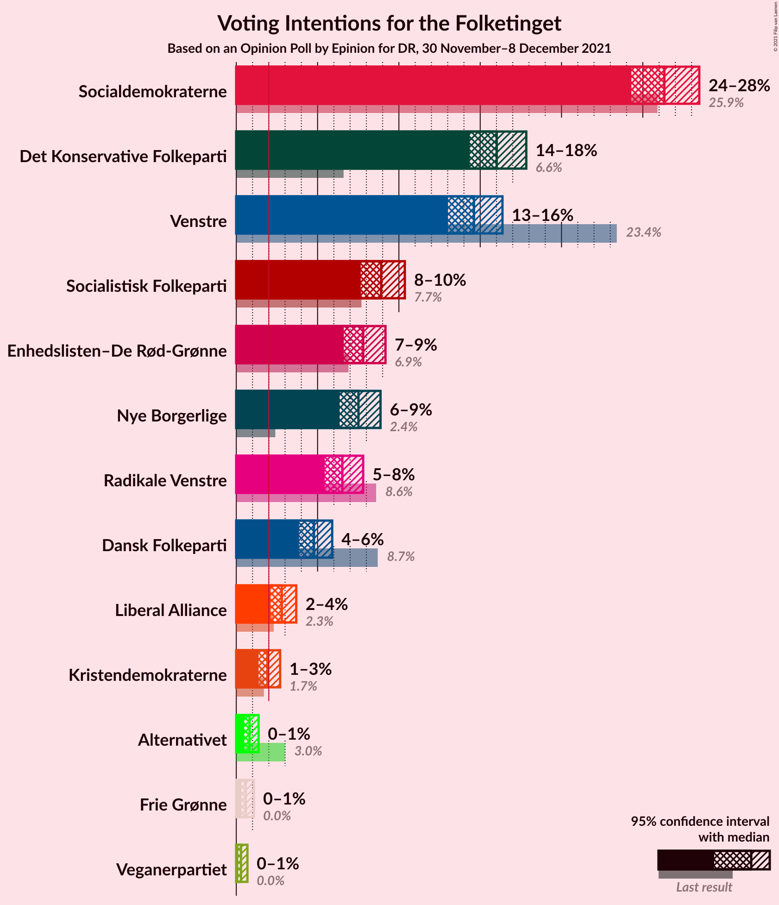
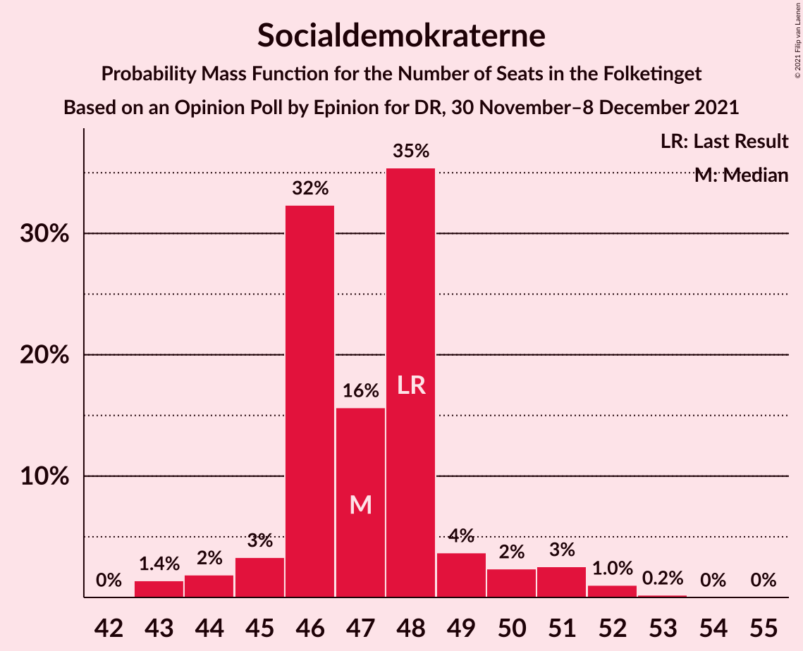
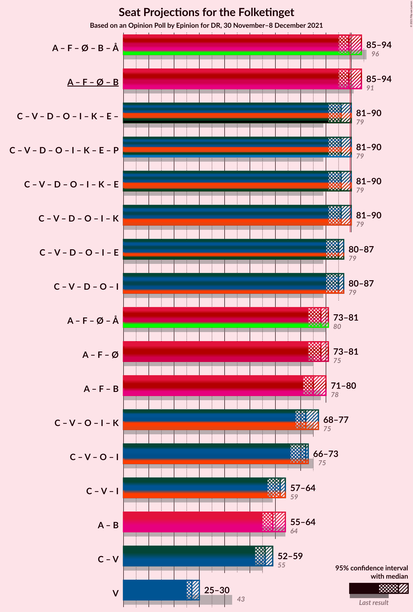

# Opinion Poll by Epinion for DR, 30 November–8 December 2021

<a href="#voting-intentions">Voting Intentions</a> | <a href="#seats">Seats</a> | <a href="#coalitions">Coalitions</a> | <a href="#technical-information">Technical Information</a>

## Voting Intentions

### Confidence Intervals

| Party | Last Result | Poll Result | 80% Confidence Interval | 90% Confidence Interval | 95% Confidence Interval | 99% Confidence Interval |
|:-----:|:-----------:|:-----------:|:-----------------------:|:-----------------------:|:-----------------------:|:-----------------------:|
| Socialdemokraterne | 25.9% | 26.3% | 25.0–27.7% |24.6–28.1% |24.3–28.5% |23.7–29.1% |
| Det Konservative Folkeparti | 6.6% | 16.0% | 14.9–17.2% |14.6–17.5% |14.4–17.8% |13.8–18.4% |
| Venstre | 23.4% | 14.6% | 13.6–15.8% |13.3–16.1% |13.0–16.4% |12.5–16.9% |
| Socialistisk Folkeparti | 7.7% | 8.9% | 8.1–9.9% |7.8–10.1% |7.7–10.4% |7.3–10.8% |
| Enhedslisten–De Rød-Grønne | 6.9% | 7.8% | 7.0–8.7% |6.8–9.0% |6.6–9.2% |6.3–9.6% |
| Nye Borgerlige | 2.4% | 7.5% | 6.8–8.4% |6.5–8.6% |6.4–8.9% |6.0–9.3% |
| Radikale Venstre | 8.6% | 6.5% | 5.8–7.4% |5.6–7.6% |5.4–7.8% |5.1–8.2% |
| Dansk Folkeparti | 8.7% | 4.8% | 4.2–5.5% |4.0–5.7% |3.9–5.9% |3.6–6.3% |
| Liberal Alliance | 2.3% | 2.8% | 2.3–3.4% |2.2–3.6% |2.1–3.7% |1.9–4.0% |
| Kristendemokraterne | 1.7% | 1.9% | 1.6–2.4% |1.4–2.6% |1.4–2.7% |1.2–3.0% |
| Alternativet | 3.0% | 0.8% | 0.6–1.2% |0.5–1.3% |0.5–1.4% |0.4–1.6% |
| Frie Grønne | 0.0% | 0.6% | 0.4–0.9% |0.4–1.0% |0.3–1.1% |0.2–1.2% |
| Veganerpartiet | 0.0% | 0.3% | 0.2–0.5% |0.1–0.6% |0.1–0.7% |0.1–0.8% |

*Note:* The poll result column reflects the actual value used in the calculations. Published results may vary slightly, and in addition be rounded to fewer digits.

## Seats

### Confidence Intervals

| Party | Last Result | Median | 80% Confidence Interval | 90% Confidence Interval | 95% Confidence Interval | 99% Confidence Interval |
|:-----:|:-----------:|:------:|:-----------------------:|:-----------------------:|:-----------------------:|:-----------------------:|
| <a href="#socialdemokraterne">Socialdemokraterne</a> | 48 | 47 | 46–48 |45–50 |44–51 |43–52 |
| <a href="#det-konservative-folkeparti">Det Konservative Folkeparti</a> | 12 | 28 | 27–29 |26–30 |26–32 |25–32 |
| <a href="#venstre">Venstre</a> | 43 | 27 | 25–30 |25–30 |25–30 |23–31 |
| <a href="#socialistisk-folkeparti">Socialistisk Folkeparti</a> | 14 | 17 | 16–17 |15–17 |14–18 |13–18 |
| <a href="#enhedslisten–de-rød-grønne">Enhedslisten–De Rød-Grønne</a> | 13 | 13 | 12–15 |12–15 |12–16 |11–17 |
| <a href="#nye-borgerlige">Nye Borgerlige</a> | 4 | 14 | 13–14 |12–15 |12–15 |12–17 |
| <a href="#radikale-venstre">Radikale Venstre</a> | 16 | 11 | 10–14 |10–14 |10–15 |10–15 |
| <a href="#dansk-folkeparti">Dansk Folkeparti</a> | 16 | 9 | 8–11 |8–11 |7–11 |7–12 |
| <a href="#liberal-alliance">Liberal Alliance</a> | 4 | 5 | 5–6 |5–6 |4–6 |4–7 |
| <a href="#kristendemokraterne">Kristendemokraterne</a> | 0 | 4 | 0–4 |0–4 |0–4 |0–5 |
| <a href="#alternativet">Alternativet</a> | 5 | 0 | 0 |0 |0 |0 |
| <a href="#frie-grønne">Frie Grønne</a> | 0 | 0 | 0 |0 |0 |0 |
| <a href="#veganerpartiet">Veganerpartiet</a> | 0 | 0 | 0 |0 |0 |0 |

### Socialdemokraterne

*For a full overview of the results for this party, see the [Socialdemokraterne](party-socialdemokraterne.html) page.*

| Number of Seats | Probability | Accumulated | Special Marks |
|:---------------:|:-----------:|:-----------:|:-------------:|
| 42 | 0% | 100% |  |
| 43 | 1.4% | 99.9% |  |
| 44 | 2% | 98.6% |  |
| 45 | 3% | 97% |  |
| 46 | 32% | 93% |  |
| 47 | 16% | 61% | Median |
| 48 | 35% | 45% | Last Result |
| 49 | 4% | 10% |  |
| 50 | 2% | 6% |  |
| 51 | 3% | 4% |  |
| 52 | 1.0% | 1.3% |  |
| 53 | 0.2% | 0.3% |  |
| 54 | 0% | 0.1% |  |
| 55 | 0% | 0% |  |

### Det Konservative Folkeparti

*For a full overview of the results for this party, see the [Det Konservative Folkeparti](party-detkonservativefolkeparti.html) page.*

| Number of Seats | Probability | Accumulated | Special Marks |
|:---------------:|:-----------:|:-----------:|:-------------:|
| 12 | 0% | 100% | Last Result |
| 13 | 0% | 100% |  |
| 14 | 0% | 100% |  |
| 15 | 0% | 100% |  |
| 16 | 0% | 100% |  |
| 17 | 0% | 100% |  |
| 18 | 0% | 100% |  |
| 19 | 0% | 100% |  |
| 20 | 0% | 100% |  |
| 21 | 0% | 100% |  |
| 22 | 0% | 100% |  |
| 23 | 0% | 100% |  |
| 24 | 0% | 100% |  |
| 25 | 1.3% | 100% |  |
| 26 | 4% | 98.7% |  |
| 27 | 15% | 95% |  |
| 28 | 41% | 80% | Median |
| 29 | 33% | 39% |  |
| 30 | 3% | 6% |  |
| 31 | 0.3% | 3% |  |
| 32 | 3% | 3% |  |
| 33 | 0.1% | 0.2% |  |
| 34 | 0% | 0.1% |  |
| 35 | 0% | 0% |  |

### Venstre

*For a full overview of the results for this party, see the [Venstre](party-venstre.html) page.*

| Number of Seats | Probability | Accumulated | Special Marks |
|:---------------:|:-----------:|:-----------:|:-------------:|
| 21 | 0.1% | 100% |  |
| 22 | 0.2% | 99.9% |  |
| 23 | 0.5% | 99.8% |  |
| 24 | 1.0% | 99.3% |  |
| 25 | 8% | 98% |  |
| 26 | 3% | 90% |  |
| 27 | 42% | 87% | Median |
| 28 | 5% | 45% |  |
| 29 | 5% | 40% |  |
| 30 | 34% | 35% |  |
| 31 | 1.1% | 1.1% |  |
| 32 | 0% | 0% |  |
| 33 | 0% | 0% |  |
| 34 | 0% | 0% |  |
| 35 | 0% | 0% |  |
| 36 | 0% | 0% |  |
| 37 | 0% | 0% |  |
| 38 | 0% | 0% |  |
| 39 | 0% | 0% |  |
| 40 | 0% | 0% |  |
| 41 | 0% | 0% |  |
| 42 | 0% | 0% |  |
| 43 | 0% | 0% | Last Result |

### Socialistisk Folkeparti

*For a full overview of the results for this party, see the [Socialistisk Folkeparti](party-socialistiskfolkeparti.html) page.*

| Number of Seats | Probability | Accumulated | Special Marks |
|:---------------:|:-----------:|:-----------:|:-------------:|
| 13 | 0.5% | 100% |  |
| 14 | 3% | 99.5% | Last Result |
| 15 | 2% | 96% |  |
| 16 | 9% | 94% |  |
| 17 | 81% | 84% | Median |
| 18 | 3% | 4% |  |
| 19 | 0.3% | 0.3% |  |
| 20 | 0.1% | 0.1% |  |
| 21 | 0% | 0% |  |

### Enhedslisten–De Rød-Grønne

*For a full overview of the results for this party, see the [Enhedslisten–De Rød-Grønne](party-enhedslisten–derød-grønne.html) page.*

| Number of Seats | Probability | Accumulated | Special Marks |
|:---------------:|:-----------:|:-----------:|:-------------:|
| 10 | 0% | 100% |  |
| 11 | 2% | 99.9% |  |
| 12 | 29% | 98% |  |
| 13 | 51% | 69% | Last Result, Median |
| 14 | 6% | 19% |  |
| 15 | 9% | 13% |  |
| 16 | 1.1% | 4% |  |
| 17 | 2% | 2% |  |
| 18 | 0.1% | 0.1% |  |
| 19 | 0% | 0% |  |

### Nye Borgerlige

*For a full overview of the results for this party, see the [Nye Borgerlige](party-nyeborgerlige.html) page.*

| Number of Seats | Probability | Accumulated | Special Marks |
|:---------------:|:-----------:|:-----------:|:-------------:|
| 4 | 0% | 100% | Last Result |
| 5 | 0% | 100% |  |
| 6 | 0% | 100% |  |
| 7 | 0% | 100% |  |
| 8 | 0% | 100% |  |
| 9 | 0% | 100% |  |
| 10 | 0% | 100% |  |
| 11 | 0.3% | 100% |  |
| 12 | 5% | 99.7% |  |
| 13 | 42% | 95% |  |
| 14 | 45% | 52% | Median |
| 15 | 5% | 7% |  |
| 16 | 0.9% | 2% |  |
| 17 | 0.9% | 0.9% |  |
| 18 | 0% | 0% |  |

### Radikale Venstre

*For a full overview of the results for this party, see the [Radikale Venstre](party-radikalevenstre.html) page.*

| Number of Seats | Probability | Accumulated | Special Marks |
|:---------------:|:-----------:|:-----------:|:-------------:|
| 9 | 0.2% | 100% |  |
| 10 | 14% | 99.8% |  |
| 11 | 68% | 86% | Median |
| 12 | 3% | 18% |  |
| 13 | 4% | 15% |  |
| 14 | 6% | 11% |  |
| 15 | 5% | 5% |  |
| 16 | 0% | 0% | Last Result |

### Dansk Folkeparti

*For a full overview of the results for this party, see the [Dansk Folkeparti](party-danskfolkeparti.html) page.*

| Number of Seats | Probability | Accumulated | Special Marks |
|:---------------:|:-----------:|:-----------:|:-------------:|
| 7 | 3% | 100% |  |
| 8 | 8% | 97% |  |
| 9 | 46% | 89% | Median |
| 10 | 29% | 43% |  |
| 11 | 13% | 14% |  |
| 12 | 1.4% | 1.4% |  |
| 13 | 0% | 0% |  |
| 14 | 0% | 0% |  |
| 15 | 0% | 0% |  |
| 16 | 0% | 0% | Last Result |

### Liberal Alliance

*For a full overview of the results for this party, see the [Liberal Alliance](party-liberalalliance.html) page.*

| Number of Seats | Probability | Accumulated | Special Marks |
|:---------------:|:-----------:|:-----------:|:-------------:|
| 0 | 0.1% | 100% |  |
| 1 | 0% | 99.9% |  |
| 2 | 0% | 99.9% |  |
| 3 | 0% | 99.9% |  |
| 4 | 5% | 99.9% | Last Result |
| 5 | 52% | 95% | Median |
| 6 | 42% | 43% |  |
| 7 | 2% | 2% |  |
| 8 | 0% | 0% |  |

### Kristendemokraterne

*For a full overview of the results for this party, see the [Kristendemokraterne](party-kristendemokraterne.html) page.*

| Number of Seats | Probability | Accumulated | Special Marks |
|:---------------:|:-----------:|:-----------:|:-------------:|
| 0 | 49% | 100% | Last Result |
| 1 | 0% | 51% |  |
| 2 | 0% | 51% |  |
| 3 | 0% | 51% |  |
| 4 | 49% | 51% | Median |
| 5 | 2% | 2% |  |
| 6 | 0% | 0% |  |

### Alternativet

*For a full overview of the results for this party, see the [Alternativet](party-alternativet.html) page.*

| Number of Seats | Probability | Accumulated | Special Marks |
|:---------------:|:-----------:|:-----------:|:-------------:|
| 0 | 100% | 100% | Median |
| 1 | 0% | 0% |  |
| 2 | 0% | 0% |  |
| 3 | 0% | 0% |  |
| 4 | 0% | 0% |  |
| 5 | 0% | 0% | Last Result |

### Frie Grønne

*For a full overview of the results for this party, see the [Frie Grønne](party-friegrønne.html) page.*

| Number of Seats | Probability | Accumulated | Special Marks |
|:---------------:|:-----------:|:-----------:|:-------------:|
| 0 | 100% | 100% | Last Result, Median |

### Veganerpartiet

*For a full overview of the results for this party, see the [Veganerpartiet](party-veganerpartiet.html) page.*

| Number of Seats | Probability | Accumulated | Special Marks |
|:---------------:|:-----------:|:-----------:|:-------------:|
| 0 | 100% | 100% | Last Result, Median |

## Coalitions

### Confidence Intervals

| Coalition | Last Result | Median | Majority? | 80% Confidence Interval | 90% Confidence Interval | 95% Confidence Interval | 99% Confidence Interval |
|:---------:|:-----------:|:------:|:---------:|:-----------------------:|:-----------------------:|:-----------------------:|:-----------------------:|
| Socialdemokraterne – Socialistisk Folkeparti – Enhedslisten–De Rød-Grønne – Radikale Venstre – Alternativet | 96 | 89 | 19% | 86–92 | 86–93 | 85–94 | 83–96 |
| Socialdemokraterne – Socialistisk Folkeparti – Enhedslisten–De Rød-Grønne – Radikale Venstre | 91 | 89 | 19% | 86–92 | 86–93 | 85–94 | 83–96 |
| Det Konservative Folkeparti – Venstre – Nye Borgerlige – Dansk Folkeparti – Liberal Alliance – Kristendemokraterne | 79 | 86 | 5% | 82–89 | 82–89 | 81–90 | 79–92 |
| Det Konservative Folkeparti – Venstre – Nye Borgerlige – Dansk Folkeparti – Liberal Alliance | 79 | 85 | 0.1% | 82–86 | 81–86 | 80–87 | 77–88 |
| Socialdemokraterne – Socialistisk Folkeparti – Enhedslisten–De Rød-Grønne – Alternativet | 80 | 78 | 0% | 75–80 | 74–80 | 73–81 | 72–82 |
| Socialdemokraterne – Socialistisk Folkeparti – Enhedslisten–De Rød-Grønne | 75 | 78 | 0% | 75–80 | 74–80 | 73–81 | 72–82 |
| Socialdemokraterne – Socialistisk Folkeparti – Radikale Venstre | 78 | 75 | 0% | 74–78 | 74–80 | 71–80 | 70–81 |
| Det Konservative Folkeparti – Venstre – Dansk Folkeparti – Liberal Alliance – Kristendemokraterne | 75 | 72 | 0% | 69–76 | 68–76 | 68–77 | 65–79 |
| Det Konservative Folkeparti – Venstre – Dansk Folkeparti – Liberal Alliance | 75 | 72 | 0% | 68–72 | 67–72 | 66–73 | 65–74 |
| Det Konservative Folkeparti – Venstre – Liberal Alliance | 59 | 62 | 0% | 59–63 | 59–63 | 57–64 | 57–65 |
| Socialdemokraterne – Radikale Venstre | 64 | 59 | 0% | 57–61 | 57–62 | 55–64 | 54–64 |
| Det Konservative Folkeparti – Venstre | 55 | 56 | 0% | 54–58 | 53–58 | 52–59 | 51–60 |
| Venstre | 43 | 27 | 0% | 25–30 | 25–30 | 25–30 | 23–31 |

### Socialdemokraterne – Socialistisk Folkeparti – Enhedslisten–De Rød-Grønne – Radikale Venstre – Alternativet

| Number of Seats | Probability | Accumulated | Special Marks |
|:---------------:|:-----------:|:-----------:|:-------------:|
| 82 | 0.1% | 100% |  |
| 83 | 2% | 99.9% |  |
| 84 | 0% | 98% |  |
| 85 | 2% | 98% |  |
| 86 | 25% | 95% |  |
| 87 | 15% | 70% |  |
| 88 | 2% | 55% | Median |
| 89 | 33% | 52% |  |
| 90 | 0.8% | 19% | Majority |
| 91 | 4% | 18% |  |
| 92 | 5% | 14% |  |
| 93 | 7% | 10% |  |
| 94 | 2% | 3% |  |
| 95 | 0.1% | 1.0% |  |
| 96 | 0.8% | 0.9% | Last Result |
| 97 | 0.1% | 0.1% |  |
| 98 | 0% | 0% |  |

### Socialdemokraterne – Socialistisk Folkeparti – Enhedslisten–De Rød-Grønne – Radikale Venstre

| Number of Seats | Probability | Accumulated | Special Marks |
|:---------------:|:-----------:|:-----------:|:-------------:|
| 82 | 0.1% | 100% |  |
| 83 | 2% | 99.9% |  |
| 84 | 0% | 98% |  |
| 85 | 2% | 98% |  |
| 86 | 25% | 95% |  |
| 87 | 15% | 70% |  |
| 88 | 2% | 55% | Median |
| 89 | 33% | 52% |  |
| 90 | 0.8% | 19% | Majority |
| 91 | 4% | 18% | Last Result |
| 92 | 5% | 14% |  |
| 93 | 7% | 10% |  |
| 94 | 2% | 3% |  |
| 95 | 0.1% | 1.0% |  |
| 96 | 0.8% | 0.9% |  |
| 97 | 0.1% | 0.1% |  |
| 98 | 0% | 0% |  |

### Det Konservative Folkeparti – Venstre – Nye Borgerlige – Dansk Folkeparti – Liberal Alliance – Kristendemokraterne

| Number of Seats | Probability | Accumulated | Special Marks |
|:---------------:|:-----------:|:-----------:|:-------------:|
| 78 | 0.1% | 100% |  |
| 79 | 0.8% | 99.9% | Last Result |
| 80 | 0.4% | 99.1% |  |
| 81 | 2% | 98.7% |  |
| 82 | 7% | 97% |  |
| 83 | 5% | 90% |  |
| 84 | 3% | 85% |  |
| 85 | 0.8% | 82% |  |
| 86 | 33% | 81% |  |
| 87 | 2% | 48% | Median |
| 88 | 15% | 45% |  |
| 89 | 25% | 30% |  |
| 90 | 2% | 5% | Majority |
| 91 | 0% | 2% |  |
| 92 | 2% | 2% |  |
| 93 | 0.1% | 0.1% |  |
| 94 | 0% | 0% |  |

### Det Konservative Folkeparti – Venstre – Nye Borgerlige – Dansk Folkeparti – Liberal Alliance

| Number of Seats | Probability | Accumulated | Special Marks |
|:---------------:|:-----------:|:-----------:|:-------------:|
| 76 | 0% | 100% |  |
| 77 | 0.4% | 99.9% |  |
| 78 | 0.3% | 99.5% |  |
| 79 | 2% | 99.2% | Last Result |
| 80 | 2% | 98% |  |
| 81 | 2% | 95% |  |
| 82 | 7% | 94% |  |
| 83 | 6% | 86% | Median |
| 84 | 16% | 80% |  |
| 85 | 26% | 64% |  |
| 86 | 36% | 39% |  |
| 87 | 2% | 3% |  |
| 88 | 1.1% | 1.2% |  |
| 89 | 0% | 0.1% |  |
| 90 | 0% | 0.1% | Majority |
| 91 | 0% | 0% |  |

### Socialdemokraterne – Socialistisk Folkeparti – Enhedslisten–De Rød-Grønne – Alternativet

| Number of Seats | Probability | Accumulated | Special Marks |
|:---------------:|:-----------:|:-----------:|:-------------:|
| 71 | 0.1% | 100% |  |
| 72 | 2% | 99.9% |  |
| 73 | 3% | 98% |  |
| 74 | 3% | 95% |  |
| 75 | 26% | 92% |  |
| 76 | 0.5% | 67% |  |
| 77 | 15% | 66% | Median |
| 78 | 39% | 51% |  |
| 79 | 1.0% | 12% |  |
| 80 | 6% | 11% | Last Result |
| 81 | 3% | 5% |  |
| 82 | 2% | 2% |  |
| 83 | 0.1% | 0.3% |  |
| 84 | 0.1% | 0.2% |  |
| 85 | 0.1% | 0.1% |  |
| 86 | 0% | 0% |  |

### Socialdemokraterne – Socialistisk Folkeparti – Enhedslisten–De Rød-Grønne

| Number of Seats | Probability | Accumulated | Special Marks |
|:---------------:|:-----------:|:-----------:|:-------------:|
| 71 | 0.1% | 100% |  |
| 72 | 2% | 99.9% |  |
| 73 | 3% | 98% |  |
| 74 | 3% | 95% |  |
| 75 | 26% | 92% | Last Result |
| 76 | 0.5% | 67% |  |
| 77 | 15% | 66% | Median |
| 78 | 39% | 51% |  |
| 79 | 1.0% | 12% |  |
| 80 | 6% | 11% |  |
| 81 | 3% | 5% |  |
| 82 | 2% | 2% |  |
| 83 | 0.1% | 0.3% |  |
| 84 | 0.1% | 0.2% |  |
| 85 | 0.1% | 0.1% |  |
| 86 | 0% | 0% |  |

### Socialdemokraterne – Socialistisk Folkeparti – Radikale Venstre

| Number of Seats | Probability | Accumulated | Special Marks |
|:---------------:|:-----------:|:-----------:|:-------------:|
| 70 | 2% | 100% |  |
| 71 | 0.8% | 98% |  |
| 72 | 0.2% | 97% |  |
| 73 | 0.6% | 97% |  |
| 74 | 44% | 96% |  |
| 75 | 3% | 53% | Median |
| 76 | 35% | 49% |  |
| 77 | 2% | 14% |  |
| 78 | 6% | 12% | Last Result |
| 79 | 0.6% | 6% |  |
| 80 | 4% | 6% |  |
| 81 | 1.0% | 1.1% |  |
| 82 | 0% | 0.1% |  |
| 83 | 0% | 0.1% |  |
| 84 | 0.1% | 0.1% |  |
| 85 | 0% | 0% |  |

### Det Konservative Folkeparti – Venstre – Dansk Folkeparti – Liberal Alliance – Kristendemokraterne

| Number of Seats | Probability | Accumulated | Special Marks |
|:---------------:|:-----------:|:-----------:|:-------------:|
| 65 | 0.8% | 100% |  |
| 66 | 1.1% | 99.2% |  |
| 67 | 0.3% | 98% |  |
| 68 | 5% | 98% |  |
| 69 | 4% | 92% |  |
| 70 | 4% | 88% |  |
| 71 | 2% | 83% |  |
| 72 | 34% | 81% |  |
| 73 | 5% | 48% | Median |
| 74 | 0.9% | 43% |  |
| 75 | 13% | 42% | Last Result |
| 76 | 25% | 29% |  |
| 77 | 2% | 4% |  |
| 78 | 1.0% | 2% |  |
| 79 | 1.2% | 1.3% |  |
| 80 | 0.1% | 0.1% |  |
| 81 | 0% | 0% |  |

### Det Konservative Folkeparti – Venstre – Dansk Folkeparti – Liberal Alliance

| Number of Seats | Probability | Accumulated | Special Marks |
|:---------------:|:-----------:|:-----------:|:-------------:|
| 63 | 0.1% | 100% |  |
| 64 | 0.3% | 99.9% |  |
| 65 | 1.1% | 99.6% |  |
| 66 | 3% | 98% |  |
| 67 | 0.9% | 95% |  |
| 68 | 5% | 94% |  |
| 69 | 8% | 89% | Median |
| 70 | 4% | 80% |  |
| 71 | 13% | 77% |  |
| 72 | 59% | 63% |  |
| 73 | 2% | 4% |  |
| 74 | 2% | 2% |  |
| 75 | 0.3% | 0.3% | Last Result |
| 76 | 0% | 0.1% |  |
| 77 | 0% | 0% |  |

### Det Konservative Folkeparti – Venstre – Liberal Alliance

| Number of Seats | Probability | Accumulated | Special Marks |
|:---------------:|:-----------:|:-----------:|:-------------:|
| 54 | 0.1% | 100% |  |
| 55 | 0.1% | 99.9% |  |
| 56 | 0.2% | 99.8% |  |
| 57 | 2% | 99.6% |  |
| 58 | 2% | 97% |  |
| 59 | 8% | 95% | Last Result |
| 60 | 15% | 88% | Median |
| 61 | 7% | 73% |  |
| 62 | 29% | 65% |  |
| 63 | 33% | 37% |  |
| 64 | 3% | 3% |  |
| 65 | 0.3% | 0.5% |  |
| 66 | 0.1% | 0.2% |  |
| 67 | 0% | 0.1% |  |
| 68 | 0% | 0.1% |  |
| 69 | 0% | 0% |  |

### Socialdemokraterne – Radikale Venstre

| Number of Seats | Probability | Accumulated | Special Marks |
|:---------------:|:-----------:|:-----------:|:-------------:|
| 54 | 1.3% | 100% |  |
| 55 | 2% | 98.6% |  |
| 56 | 0.2% | 97% |  |
| 57 | 40% | 97% |  |
| 58 | 2% | 57% | Median |
| 59 | 37% | 55% |  |
| 60 | 5% | 17% |  |
| 61 | 5% | 13% |  |
| 62 | 3% | 8% |  |
| 63 | 0.2% | 4% |  |
| 64 | 4% | 4% | Last Result |
| 65 | 0.3% | 0.4% |  |
| 66 | 0% | 0.1% |  |
| 67 | 0.1% | 0.1% |  |
| 68 | 0% | 0% |  |

### Det Konservative Folkeparti – Venstre

| Number of Seats | Probability | Accumulated | Special Marks |
|:---------------:|:-----------:|:-----------:|:-------------:|
| 49 | 0.1% | 100% |  |
| 50 | 0.1% | 99.9% |  |
| 51 | 1.1% | 99.7% |  |
| 52 | 1.5% | 98.6% |  |
| 53 | 3% | 97% |  |
| 54 | 21% | 95% |  |
| 55 | 3% | 74% | Last Result, Median |
| 56 | 29% | 71% |  |
| 57 | 6% | 42% |  |
| 58 | 33% | 36% |  |
| 59 | 2% | 3% |  |
| 60 | 1.1% | 1.3% |  |
| 61 | 0.2% | 0.3% |  |
| 62 | 0.1% | 0.1% |  |
| 63 | 0% | 0% |  |

### Venstre

| Number of Seats | Probability | Accumulated | Special Marks |
|:---------------:|:-----------:|:-----------:|:-------------:|
| 21 | 0.1% | 100% |  |
| 22 | 0.2% | 99.9% |  |
| 23 | 0.5% | 99.8% |  |
| 24 | 1.0% | 99.3% |  |
| 25 | 8% | 98% |  |
| 26 | 3% | 90% |  |
| 27 | 42% | 87% | Median |
| 28 | 5% | 45% |  |
| 29 | 5% | 40% |  |
| 30 | 34% | 35% |  |
| 31 | 1.1% | 1.1% |  |
| 32 | 0% | 0% |  |
| 33 | 0% | 0% |  |
| 34 | 0% | 0% |  |
| 35 | 0% | 0% |  |
| 36 | 0% | 0% |  |
| 37 | 0% | 0% |  |
| 38 | 0% | 0% |  |
| 39 | 0% | 0% |  |
| 40 | 0% | 0% |  |
| 41 | 0% | 0% |  |
| 42 | 0% | 0% |  |
| 43 | 0% | 0% | Last Result |

## Technical Information

### Opinion Poll

+ **Polling firm:** Epinion
+ **Commissioner(s):** DR
+ **Fieldwork period:** 30 November–8 December 2021

### Calculations

+ **Sample size:** 1717
+ **Simulations done:** 1,048,576
+ **Error estimate:** 1.19%

