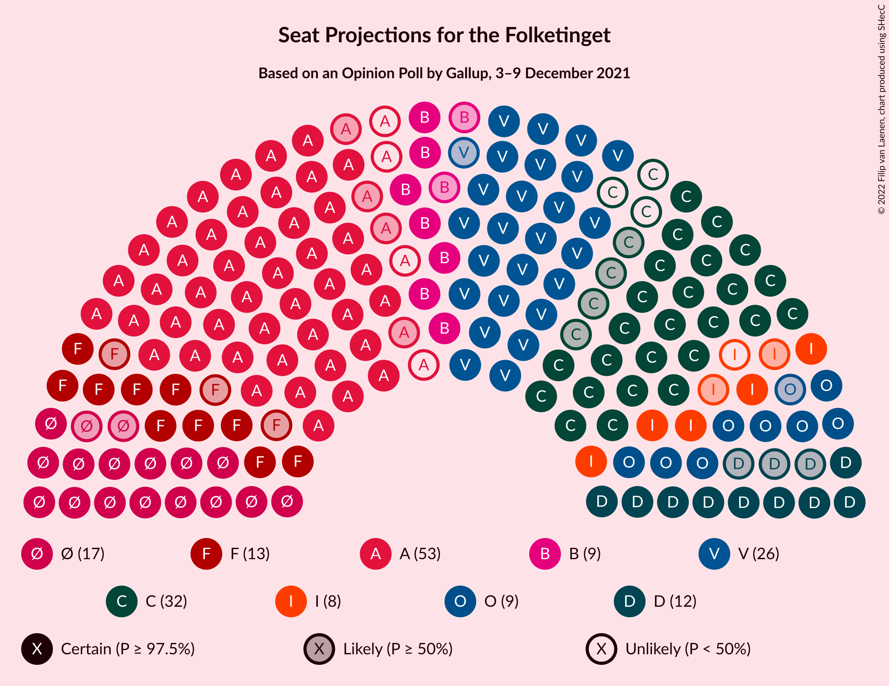

# Opinion Poll by Gallup, 3–9 December 2021

<a href="#voting-intentions">Voting Intentions</a> | <a href="#seats">Seats</a> | <a href="#coalitions">Coalitions</a> | <a href="#technical-information">Technical Information</a>

## Voting Intentions

### Confidence Intervals

| Party | Last Result | Poll Result | 80% Confidence Interval | 90% Confidence Interval | 95% Confidence Interval | 99% Confidence Interval |
|:-----:|:-----------:|:-----------:|:-----------------------:|:-----------------------:|:-----------------------:|:-----------------------:|
| Socialdemokraterne | 25.9% | 26.7% | 25.4–28.2% |25.0–28.6% |24.6–29.0% |24.0–29.7% |
| Det Konservative Folkeparti | 6.6% | 16.4% | 15.3–17.7% |15.0–18.0% |14.7–18.3% |14.2–18.9% |
| Venstre | 23.4% | 15.3% | 14.2–16.5% |13.8–16.8% |13.6–17.1% |13.1–17.7% |
| Enhedslisten–De Rød-Grønne | 6.9% | 9.4% | 8.5–10.4% |8.3–10.7% |8.1–10.9% |7.7–11.4% |
| Socialistisk Folkeparti | 7.7% | 7.3% | 6.5–8.2% |6.3–8.4% |6.1–8.7% |5.8–9.1% |
| Nye Borgerlige | 2.4% | 6.0% | 5.3–6.8% |5.1–7.1% |4.9–7.3% |4.6–7.7% |
| Radikale Venstre | 8.6% | 5.4% | 4.8–6.2% |4.6–6.5% |4.4–6.7% |4.1–7.1% |
| Dansk Folkeparti | 8.7% | 5.3% | 4.6–6.1% |4.5–6.3% |4.3–6.5% |4.0–6.9% |
| Liberal Alliance | 2.3% | 3.6% | 3.0–4.3% |2.9–4.5% |2.8–4.6% |2.5–5.0% |
| Kristendemokraterne | 1.7% | 1.7% | 1.4–2.2% |1.3–2.4% |1.2–2.5% |1.1–2.8% |
| Moderaterne | N/A | 1.7% | 1.4–2.2% |1.3–2.4% |1.2–2.5% |1.1–2.8% |
| Alternativet | 3.0% | 0.6% | 0.4–1.0% |0.4–1.1% |0.3–1.1% |0.3–1.3% |
| Veganerpartiet | 0.0% | 0.2% | 0.1–0.4% |0.1–0.5% |0.1–0.5% |0.0–0.7% |

*Note:* The poll result column reflects the actual value used in the calculations. Published results may vary slightly, and in addition be rounded to fewer digits.

## Seats

### Confidence Intervals

| Party | Last Result | Median | 80% Confidence Interval | 90% Confidence Interval | 95% Confidence Interval | 99% Confidence Interval |
|:-----:|:-----------:|:------:|:-----------------------:|:-----------------------:|:-----------------------:|:-----------------------:|
| <a href="#socialdemokraterne">Socialdemokraterne</a> | 48 | 50 | 46–50 |46–50 |44–51 |44–54 |
| <a href="#det-konservative-folkeparti">Det Konservative Folkeparti</a> | 12 | 29 | 29–30 |27–30 |27–31 |26–33 |
| <a href="#venstre">Venstre</a> | 43 | 26 | 26–29 |26–29 |25–29 |24–30 |
| <a href="#enhedslisten–de-rød-grønne">Enhedslisten–De Rød-Grønne</a> | 13 | 16 | 16–19 |16–19 |16–19 |15–19 |
| <a href="#socialistisk-folkeparti">Socialistisk Folkeparti</a> | 14 | 12 | 12–13 |12–14 |11–14 |11–15 |
| <a href="#nye-borgerlige">Nye Borgerlige</a> | 4 | 11 | 10–11 |10–11 |9–11 |8–13 |
| <a href="#radikale-venstre">Radikale Venstre</a> | 16 | 11 | 10–12 |10–12 |10–12 |9–12 |
| <a href="#dansk-folkeparti">Dansk Folkeparti</a> | 16 | 10 | 9–10 |9–10 |9–10 |8–11 |
| <a href="#liberal-alliance">Liberal Alliance</a> | 4 | 6 | 5–6 |5–7 |5–8 |4–8 |
| <a href="#kristendemokraterne">Kristendemokraterne</a> | 0 | 0 | 0 |0–4 |0–4 |0–4 |
| <a href="#moderaterne">Moderaterne</a> | N/A | 4 | 0–4 |0–4 |0–5 |0–5 |
| <a href="#alternativet">Alternativet</a> | 5 | 0 | 0 |0 |0 |0 |
| <a href="#veganerpartiet">Veganerpartiet</a> | 0 | 0 | 0 |0 |0 |0 |

