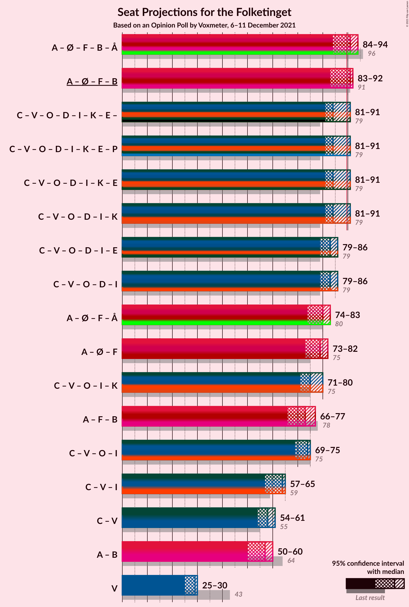
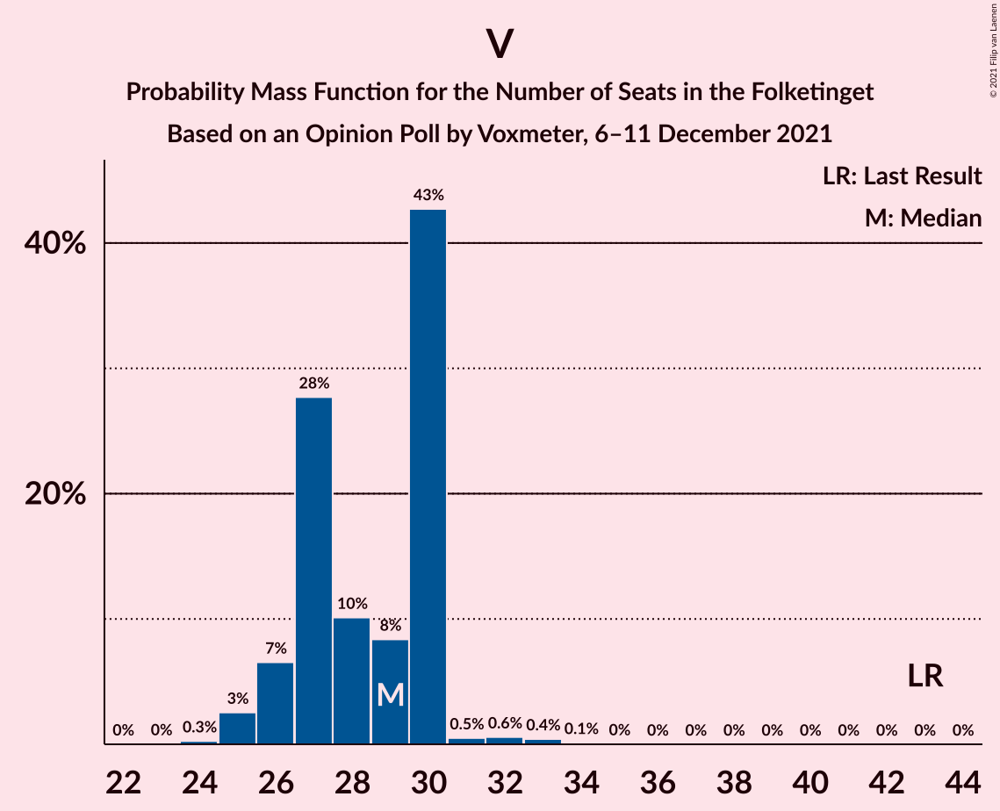

# Opinion Poll by Voxmeter, 6–11 December 2021

<a href="#voting-intentions">Voting Intentions</a> | <a href="#seats">Seats</a> | <a href="#coalitions">Coalitions</a> | <a href="#technical-information">Technical Information</a>

## Voting Intentions

### Confidence Intervals

| Party | Last Result | Poll Result | 80% Confidence Interval | 90% Confidence Interval | 95% Confidence Interval | 99% Confidence Interval |
|:-----:|:-----------:|:-----------:|:-----------------------:|:-----------------------:|:-----------------------:|:-----------------------:|
| Socialdemokraterne | 25.9% | 24.3% | 22.8–26.0% |22.3–26.5% |21.9–26.9% |21.2–27.7% |
| Det Konservative Folkeparti | 6.6% | 16.3% | 15.0–17.8% |14.6–18.2% |14.3–18.6% |13.7–19.3% |
| Venstre | 23.4% | 15.8% | 14.5–17.3% |14.1–17.7% |13.8–18.1% |13.2–18.8% |
| Enhedslisten–De Rød-Grønne | 6.9% | 9.7% | 8.6–10.9% |8.3–11.2% |8.1–11.5% |7.6–12.1% |
| Socialistisk Folkeparti | 7.7% | 9.1% | 8.1–10.3% |7.8–10.7% |7.6–10.9% |7.1–11.5% |
| Dansk Folkeparti | 8.7% | 6.3% | 5.5–7.4% |5.3–7.7% |5.1–7.9% |4.7–8.4% |
| Radikale Venstre | 8.6% | 6.0% | 5.2–7.0% |5.0–7.3% |4.8–7.5% |4.4–8.0% |
| Nye Borgerlige | 2.4% | 5.6% | 4.8–6.5% |4.6–6.8% |4.4–7.1% |4.0–7.5% |
| Liberal Alliance | 2.3% | 2.5% | 2.0–3.2% |1.9–3.4% |1.8–3.6% |1.5–4.0% |
| Kristendemokraterne | 1.7% | 2.1% | 1.6–2.7% |1.5–2.9% |1.4–3.1% |1.2–3.4% |
| Alternativet | 3.0% | 1.4% | 1.0–2.0% |0.9–2.1% |0.9–2.3% |0.7–2.6% |
| Veganerpartiet | 0.0% | 0.1% | 0.0–0.4% |0.0–0.4% |0.0–0.5% |0.0–0.7% |

*Note:* The poll result column reflects the actual value used in the calculations. Published results may vary slightly, and in addition be rounded to fewer digits.

## Seats

### Confidence Intervals

| Party | Last Result | Median | 80% Confidence Interval | 90% Confidence Interval | 95% Confidence Interval | 99% Confidence Interval |
|:-----:|:-----------:|:------:|:-----------------------:|:-----------------------:|:-----------------------:|:-----------------------:|
| <a href="#socialdemokraterne">Socialdemokraterne</a> | 48 | 46 | 41–46 |41–46 |40–47 |39–49 |
| <a href="#det-konservative-folkeparti">Det Konservative Folkeparti</a> | 12 | 29 | 27–31 |26–31 |26–32 |24–34 |
| <a href="#venstre">Venstre</a> | 43 | 29 | 27–30 |26–30 |25–30 |25–33 |
| <a href="#enhedslisten–de-rød-grønne">Enhedslisten–De Rød-Grønne</a> | 13 | 17 | 16–18 |15–19 |15–20 |14–21 |
| <a href="#socialistisk-folkeparti">Socialistisk Folkeparti</a> | 14 | 17 | 16–19 |15–19 |13–19 |12–20 |
| <a href="#dansk-folkeparti">Dansk Folkeparti</a> | 16 | 11 | 10–12 |10–13 |10–14 |9–15 |
| <a href="#radikale-venstre">Radikale Venstre</a> | 16 | 11 | 10–11 |9–12 |8–13 |8–14 |
| <a href="#nye-borgerlige">Nye Borgerlige</a> | 4 | 10 | 8–12 |8–12 |8–13 |7–13 |
| <a href="#liberal-alliance">Liberal Alliance</a> | 4 | 5 | 4–5 |0–6 |0–6 |0–6 |
| <a href="#kristendemokraterne">Kristendemokraterne</a> | 0 | 0 | 0–5 |0–5 |0–5 |0–6 |
| <a href="#alternativet">Alternativet</a> | 5 | 0 | 0 |0–4 |0–4 |0–4 |
| <a href="#veganerpartiet">Veganerpartiet</a> | 0 | 0 | 0 |0 |0 |0 |

### Socialdemokraterne

*For a full overview of the results for this party, see the [Socialdemokraterne](party-socialdemokraterne.html) page.*

| Number of Seats | Probability | Accumulated | Special Marks |
|:---------------:|:-----------:|:-----------:|:-------------:|
| 37 | 0.1% | 100% |  |
| 38 | 0.1% | 99.9% |  |
| 39 | 0.7% | 99.8% |  |
| 40 | 4% | 99.1% |  |
| 41 | 6% | 95% |  |
| 42 | 3% | 89% |  |
| 43 | 6% | 86% |  |
| 44 | 24% | 80% |  |
| 45 | 3% | 57% |  |
| 46 | 49% | 54% | Median |
| 47 | 3% | 5% |  |
| 48 | 1.0% | 2% | Last Result |
| 49 | 1.0% | 1.2% |  |
| 50 | 0.2% | 0.2% |  |
| 51 | 0% | 0% |  |

### Det Konservative Folkeparti

*For a full overview of the results for this party, see the [Det Konservative Folkeparti](party-detkonservativefolkeparti.html) page.*

| Number of Seats | Probability | Accumulated | Special Marks |
|:---------------:|:-----------:|:-----------:|:-------------:|
| 12 | 0% | 100% | Last Result |
| 13 | 0% | 100% |  |
| 14 | 0% | 100% |  |
| 15 | 0% | 100% |  |
| 16 | 0% | 100% |  |
| 17 | 0% | 100% |  |
| 18 | 0% | 100% |  |
| 19 | 0% | 100% |  |
| 20 | 0% | 100% |  |
| 21 | 0% | 100% |  |
| 22 | 0% | 100% |  |
| 23 | 0.2% | 100% |  |
| 24 | 0.3% | 99.8% |  |
| 25 | 1.4% | 99.4% |  |
| 26 | 6% | 98% |  |
| 27 | 2% | 92% |  |
| 28 | 2% | 90% |  |
| 29 | 48% | 88% | Median |
| 30 | 22% | 40% |  |
| 31 | 15% | 18% |  |
| 32 | 1.5% | 3% |  |
| 33 | 0.9% | 2% |  |
| 34 | 0.5% | 0.9% |  |
| 35 | 0.3% | 0.4% |  |
| 36 | 0.1% | 0.1% |  |
| 37 | 0% | 0% |  |

### Venstre

*For a full overview of the results for this party, see the [Venstre](party-venstre.html) page.*

| Number of Seats | Probability | Accumulated | Special Marks |
|:---------------:|:-----------:|:-----------:|:-------------:|
| 23 | 0% | 100% |  |
| 24 | 0.3% | 99.9% |  |
| 25 | 3% | 99.7% |  |
| 26 | 7% | 97% |  |
| 27 | 28% | 91% |  |
| 28 | 10% | 63% |  |
| 29 | 8% | 53% | Median |
| 30 | 43% | 44% |  |
| 31 | 0.5% | 2% |  |
| 32 | 0.6% | 1.2% |  |
| 33 | 0.4% | 0.6% |  |
| 34 | 0.1% | 0.2% |  |
| 35 | 0% | 0% |  |
| 36 | 0% | 0% |  |
| 37 | 0% | 0% |  |
| 38 | 0% | 0% |  |
| 39 | 0% | 0% |  |
| 40 | 0% | 0% |  |
| 41 | 0% | 0% |  |
| 42 | 0% | 0% |  |
| 43 | 0% | 0% | Last Result |

### Enhedslisten–De Rød-Grønne

*For a full overview of the results for this party, see the [Enhedslisten–De Rød-Grønne](party-enhedslisten–derød-grønne.html) page.*

| Number of Seats | Probability | Accumulated | Special Marks |
|:---------------:|:-----------:|:-----------:|:-------------:|
| 13 | 0.1% | 100% | Last Result |
| 14 | 2% | 99.8% |  |
| 15 | 3% | 98% |  |
| 16 | 43% | 95% |  |
| 17 | 23% | 52% | Median |
| 18 | 22% | 28% |  |
| 19 | 2% | 6% |  |
| 20 | 3% | 4% |  |
| 21 | 0.8% | 1.0% |  |
| 22 | 0.1% | 0.2% |  |
| 23 | 0% | 0% |  |

### Socialistisk Folkeparti

*For a full overview of the results for this party, see the [Socialistisk Folkeparti](party-socialistiskfolkeparti.html) page.*

| Number of Seats | Probability | Accumulated | Special Marks |
|:---------------:|:-----------:|:-----------:|:-------------:|
| 12 | 0.6% | 100% |  |
| 13 | 2% | 99.4% |  |
| 14 | 2% | 97% | Last Result |
| 15 | 3% | 95% |  |
| 16 | 32% | 93% |  |
| 17 | 13% | 60% | Median |
| 18 | 5% | 48% |  |
| 19 | 41% | 43% |  |
| 20 | 2% | 2% |  |
| 21 | 0.4% | 0.4% |  |
| 22 | 0% | 0% |  |

### Dansk Folkeparti

*For a full overview of the results for this party, see the [Dansk Folkeparti](party-danskfolkeparti.html) page.*

| Number of Seats | Probability | Accumulated | Special Marks |
|:---------------:|:-----------:|:-----------:|:-------------:|
| 8 | 0.1% | 100% |  |
| 9 | 2% | 99.9% |  |
| 10 | 32% | 98% |  |
| 11 | 50% | 66% | Median |
| 12 | 10% | 16% |  |
| 13 | 2% | 6% |  |
| 14 | 3% | 4% |  |
| 15 | 0.5% | 0.6% |  |
| 16 | 0% | 0.1% | Last Result |
| 17 | 0% | 0% |  |

### Radikale Venstre

*For a full overview of the results for this party, see the [Radikale Venstre](party-radikalevenstre.html) page.*

| Number of Seats | Probability | Accumulated | Special Marks |
|:---------------:|:-----------:|:-----------:|:-------------:|
| 8 | 3% | 100% |  |
| 9 | 3% | 97% |  |
| 10 | 20% | 94% |  |
| 11 | 65% | 74% | Median |
| 12 | 6% | 10% |  |
| 13 | 3% | 4% |  |
| 14 | 0.7% | 0.8% |  |
| 15 | 0.1% | 0.1% |  |
| 16 | 0% | 0% | Last Result |

### Nye Borgerlige

*For a full overview of the results for this party, see the [Nye Borgerlige](party-nyeborgerlige.html) page.*

| Number of Seats | Probability | Accumulated | Special Marks |
|:---------------:|:-----------:|:-----------:|:-------------:|
| 4 | 0% | 100% | Last Result |
| 5 | 0% | 100% |  |
| 6 | 0% | 100% |  |
| 7 | 1.2% | 100% |  |
| 8 | 42% | 98.7% |  |
| 9 | 6% | 56% |  |
| 10 | 29% | 50% | Median |
| 11 | 5% | 21% |  |
| 12 | 11% | 16% |  |
| 13 | 4% | 5% |  |
| 14 | 0.5% | 0.5% |  |
| 15 | 0% | 0% |  |

### Liberal Alliance

*For a full overview of the results for this party, see the [Liberal Alliance](party-liberalalliance.html) page.*

| Number of Seats | Probability | Accumulated | Special Marks |
|:---------------:|:-----------:|:-----------:|:-------------:|
| 0 | 6% | 100% |  |
| 1 | 0% | 94% |  |
| 2 | 0% | 94% |  |
| 3 | 0% | 94% |  |
| 4 | 10% | 94% | Last Result |
| 5 | 77% | 85% | Median |
| 6 | 7% | 7% |  |
| 7 | 0.3% | 0.4% |  |
| 8 | 0.1% | 0.1% |  |
| 9 | 0% | 0% |  |

### Kristendemokraterne

*For a full overview of the results for this party, see the [Kristendemokraterne](party-kristendemokraterne.html) page.*

| Number of Seats | Probability | Accumulated | Special Marks |
|:---------------:|:-----------:|:-----------:|:-------------:|
| 0 | 51% | 100% | Last Result, Median |
| 1 | 0% | 49% |  |
| 2 | 0% | 49% |  |
| 3 | 0% | 49% |  |
| 4 | 32% | 49% |  |
| 5 | 16% | 17% |  |
| 6 | 1.4% | 1.4% |  |
| 7 | 0% | 0% |  |

### Alternativet

*For a full overview of the results for this party, see the [Alternativet](party-alternativet.html) page.*

| Number of Seats | Probability | Accumulated | Special Marks |
|:---------------:|:-----------:|:-----------:|:-------------:|
| 0 | 95% | 100% | Median |
| 1 | 0% | 5% |  |
| 2 | 0% | 5% |  |
| 3 | 0% | 5% |  |
| 4 | 5% | 5% |  |
| 5 | 0.3% | 0.3% | Last Result |
| 6 | 0% | 0% |  |

### Veganerpartiet

*For a full overview of the results for this party, see the [Veganerpartiet](party-veganerpartiet.html) page.*

| Number of Seats | Probability | Accumulated | Special Marks |
|:---------------:|:-----------:|:-----------:|:-------------:|
| 0 | 100% | 100% | Last Result, Median |

## Coalitions

### Confidence Intervals

| Coalition | Last Result | Median | Majority? | 80% Confidence Interval | 90% Confidence Interval | 95% Confidence Interval | 99% Confidence Interval |
|:---------:|:-----------:|:------:|:---------:|:-----------------------:|:-----------------------:|:-----------------------:|:-----------------------:|
| Socialdemokraterne – Enhedslisten–De Rød-Grønne – Socialistisk Folkeparti – Radikale Venstre – Alternativet | 96 | 91 | 56% | 86–92 | 84–92 | 84–94 | 82–96 |
| Socialdemokraterne – Enhedslisten–De Rød-Grønne – Socialistisk Folkeparti – Radikale Venstre | 91 | 91 | 56% | 84–92 | 84–92 | 83–92 | 81–95 |
| Det Konservative Folkeparti – Venstre – Dansk Folkeparti – Nye Borgerlige – Liberal Alliance – Kristendemokraterne | 79 | 84 | 9% | 83–89 | 83–91 | 81–91 | 79–93 |
| Det Konservative Folkeparti – Venstre – Dansk Folkeparti – Nye Borgerlige – Liberal Alliance | 79 | 83 | 0.5% | 81–86 | 80–86 | 79–86 | 77–89 |
| Socialdemokraterne – Enhedslisten–De Rød-Grønne – Socialistisk Folkeparti – Alternativet | 80 | 80 | 0% | 76–81 | 74–81 | 74–83 | 71–85 |
| Socialdemokraterne – Enhedslisten–De Rød-Grønne – Socialistisk Folkeparti | 75 | 79 | 0% | 74–81 | 73–81 | 73–82 | 71–85 |
| Det Konservative Folkeparti – Venstre – Dansk Folkeparti – Liberal Alliance – Kristendemokraterne | 75 | 75 | 0% | 74–79 | 71–79 | 71–80 | 69–83 |
| Socialdemokraterne – Socialistisk Folkeparti – Radikale Venstre | 78 | 73 | 0% | 67–76 | 67–76 | 66–77 | 64–77 |
| Det Konservative Folkeparti – Venstre – Dansk Folkeparti – Liberal Alliance | 75 | 74 | 0% | 71–75 | 70–75 | 69–75 | 68–79 |
| Det Konservative Folkeparti – Venstre – Liberal Alliance | 59 | 64 | 0% | 60–64 | 58–64 | 57–65 | 56–67 |
| Det Konservative Folkeparti – Venstre | 55 | 58 | 0% | 55–59 | 55–59 | 54–61 | 52–62 |
| Socialdemokraterne – Radikale Venstre | 64 | 57 | 0% | 51–57 | 51–58 | 50–60 | 50–60 |
| Venstre | 43 | 29 | 0% | 27–30 | 26–30 | 25–30 | 25–33 |

### Socialdemokraterne – Enhedslisten–De Rød-Grønne – Socialistisk Folkeparti – Radikale Venstre – Alternativet

| Number of Seats | Probability | Accumulated | Special Marks |
|:---------------:|:-----------:|:-----------:|:-------------:|
| 80 | 0.4% | 100% |  |
| 81 | 0.1% | 99.6% |  |
| 82 | 0.6% | 99.6% |  |
| 83 | 0.2% | 99.0% |  |
| 84 | 6% | 98.8% |  |
| 85 | 2% | 93% |  |
| 86 | 4% | 91% |  |
| 87 | 5% | 87% |  |
| 88 | 5% | 83% |  |
| 89 | 21% | 78% |  |
| 90 | 4% | 56% | Majority |
| 91 | 5% | 53% | Median |
| 92 | 44% | 47% |  |
| 93 | 0.7% | 3% |  |
| 94 | 0.8% | 3% |  |
| 95 | 1.4% | 2% |  |
| 96 | 0.3% | 0.6% | Last Result |
| 97 | 0% | 0.2% |  |
| 98 | 0.2% | 0.2% |  |
| 99 | 0% | 0% |  |

### Socialdemokraterne – Enhedslisten–De Rød-Grønne – Socialistisk Folkeparti – Radikale Venstre

| Number of Seats | Probability | Accumulated | Special Marks |
|:---------------:|:-----------:|:-----------:|:-------------:|
| 80 | 0.4% | 100% |  |
| 81 | 0.1% | 99.6% |  |
| 82 | 0.6% | 99.5% |  |
| 83 | 4% | 98.9% |  |
| 84 | 6% | 95% |  |
| 85 | 2% | 90% |  |
| 86 | 4% | 88% |  |
| 87 | 2% | 84% |  |
| 88 | 5% | 82% |  |
| 89 | 21% | 77% |  |
| 90 | 4% | 56% | Majority |
| 91 | 5% | 51% | Last Result, Median |
| 92 | 44% | 46% |  |
| 93 | 0.5% | 2% |  |
| 94 | 0.4% | 2% |  |
| 95 | 1.2% | 2% |  |
| 96 | 0.3% | 0.3% |  |
| 97 | 0% | 0.1% |  |
| 98 | 0% | 0% |  |

### Det Konservative Folkeparti – Venstre – Dansk Folkeparti – Nye Borgerlige – Liberal Alliance – Kristendemokraterne

| Number of Seats | Probability | Accumulated | Special Marks |
|:---------------:|:-----------:|:-----------:|:-------------:|
| 77 | 0.2% | 100% |  |
| 78 | 0% | 99.8% |  |
| 79 | 0.3% | 99.8% | Last Result |
| 80 | 1.4% | 99.4% |  |
| 81 | 0.8% | 98% |  |
| 82 | 0.7% | 97% |  |
| 83 | 44% | 97% |  |
| 84 | 5% | 53% | Median |
| 85 | 4% | 47% |  |
| 86 | 21% | 44% |  |
| 87 | 5% | 22% |  |
| 88 | 5% | 17% |  |
| 89 | 4% | 13% |  |
| 90 | 2% | 9% | Majority |
| 91 | 6% | 7% |  |
| 92 | 0.2% | 1.2% |  |
| 93 | 0.6% | 1.0% |  |
| 94 | 0.1% | 0.4% |  |
| 95 | 0.4% | 0.4% |  |
| 96 | 0% | 0% |  |

### Det Konservative Folkeparti – Venstre – Dansk Folkeparti – Nye Borgerlige – Liberal Alliance

| Number of Seats | Probability | Accumulated | Special Marks |
|:---------------:|:-----------:|:-----------:|:-------------:|
| 73 | 0.1% | 100% |  |
| 74 | 0% | 99.9% |  |
| 75 | 0.1% | 99.9% |  |
| 76 | 0.2% | 99.8% |  |
| 77 | 0.4% | 99.6% |  |
| 78 | 0.8% | 99.2% |  |
| 79 | 2% | 98% | Last Result |
| 80 | 3% | 96% |  |
| 81 | 4% | 93% |  |
| 82 | 23% | 89% |  |
| 83 | 43% | 66% |  |
| 84 | 11% | 23% | Median |
| 85 | 2% | 12% |  |
| 86 | 8% | 10% |  |
| 87 | 0.6% | 2% |  |
| 88 | 0.4% | 1.2% |  |
| 89 | 0.3% | 0.8% |  |
| 90 | 0% | 0.5% | Majority |
| 91 | 0.4% | 0.4% |  |
| 92 | 0% | 0.1% |  |
| 93 | 0% | 0% |  |

### Socialdemokraterne – Enhedslisten–De Rød-Grønne – Socialistisk Folkeparti – Alternativet

| Number of Seats | Probability | Accumulated | Special Marks |
|:---------------:|:-----------:|:-----------:|:-------------:|
| 69 | 0.4% | 100% |  |
| 70 | 0% | 99.6% |  |
| 71 | 0.6% | 99.6% |  |
| 72 | 0.1% | 99.0% |  |
| 73 | 0.8% | 98.8% |  |
| 74 | 6% | 98% |  |
| 75 | 2% | 92% |  |
| 76 | 2% | 90% |  |
| 77 | 4% | 89% |  |
| 78 | 27% | 84% |  |
| 79 | 6% | 57% |  |
| 80 | 5% | 51% | Last Result, Median |
| 81 | 42% | 46% |  |
| 82 | 0.5% | 3% |  |
| 83 | 1.2% | 3% |  |
| 84 | 0.9% | 2% |  |
| 85 | 0.4% | 0.8% |  |
| 86 | 0.4% | 0.4% |  |
| 87 | 0% | 0% |  |

### Socialdemokraterne – Enhedslisten–De Rød-Grønne – Socialistisk Folkeparti

| Number of Seats | Probability | Accumulated | Special Marks |
|:---------------:|:-----------:|:-----------:|:-------------:|
| 69 | 0.4% | 100% |  |
| 70 | 0% | 99.6% |  |
| 71 | 0.7% | 99.6% |  |
| 72 | 0.1% | 98.9% |  |
| 73 | 4% | 98.8% |  |
| 74 | 6% | 95% |  |
| 75 | 2% | 89% | Last Result |
| 76 | 2% | 86% |  |
| 77 | 1.1% | 84% |  |
| 78 | 27% | 83% |  |
| 79 | 6% | 56% |  |
| 80 | 5% | 50% | Median |
| 81 | 42% | 45% |  |
| 82 | 0.7% | 3% |  |
| 83 | 1.0% | 2% |  |
| 84 | 0.7% | 1.3% |  |
| 85 | 0.4% | 0.6% |  |
| 86 | 0.2% | 0.2% |  |
| 87 | 0% | 0% |  |

### Det Konservative Folkeparti – Venstre – Dansk Folkeparti – Liberal Alliance – Kristendemokraterne

| Number of Seats | Probability | Accumulated | Special Marks |
|:---------------:|:-----------:|:-----------:|:-------------:|
| 67 | 0% | 100% |  |
| 68 | 0.2% | 99.9% |  |
| 69 | 1.1% | 99.8% |  |
| 70 | 0.2% | 98.6% |  |
| 71 | 4% | 98% |  |
| 72 | 2% | 94% |  |
| 73 | 1.2% | 92% |  |
| 74 | 6% | 91% | Median |
| 75 | 43% | 85% | Last Result |
| 76 | 19% | 42% |  |
| 77 | 6% | 23% |  |
| 78 | 6% | 17% |  |
| 79 | 7% | 10% |  |
| 80 | 0.6% | 3% |  |
| 81 | 1.2% | 2% |  |
| 82 | 0.7% | 1.2% |  |
| 83 | 0.1% | 0.5% |  |
| 84 | 0.1% | 0.4% |  |
| 85 | 0% | 0.4% |  |
| 86 | 0.4% | 0.4% |  |
| 87 | 0% | 0% |  |

### Socialdemokraterne – Socialistisk Folkeparti – Radikale Venstre

| Number of Seats | Probability | Accumulated | Special Marks |
|:---------------:|:-----------:|:-----------:|:-------------:|
| 63 | 0.1% | 100% |  |
| 64 | 0.4% | 99.9% |  |
| 65 | 0.2% | 99.5% |  |
| 66 | 4% | 99.3% |  |
| 67 | 7% | 96% |  |
| 68 | 1.2% | 89% |  |
| 69 | 5% | 88% |  |
| 70 | 3% | 83% |  |
| 71 | 22% | 80% |  |
| 72 | 4% | 58% |  |
| 73 | 4% | 54% |  |
| 74 | 5% | 50% | Median |
| 75 | 0.7% | 45% |  |
| 76 | 41% | 44% |  |
| 77 | 3% | 3% |  |
| 78 | 0.3% | 0.4% | Last Result |
| 79 | 0% | 0.1% |  |
| 80 | 0% | 0.1% |  |
| 81 | 0.1% | 0.1% |  |
| 82 | 0% | 0% |  |

### Det Konservative Folkeparti – Venstre – Dansk Folkeparti – Liberal Alliance

| Number of Seats | Probability | Accumulated | Special Marks |
|:---------------:|:-----------:|:-----------:|:-------------:|
| 65 | 0.2% | 100% |  |
| 66 | 0.1% | 99.8% |  |
| 67 | 0.1% | 99.7% |  |
| 68 | 2% | 99.7% |  |
| 69 | 2% | 98% |  |
| 70 | 3% | 96% |  |
| 71 | 7% | 93% |  |
| 72 | 26% | 87% |  |
| 73 | 3% | 61% |  |
| 74 | 13% | 58% | Median |
| 75 | 43% | 45% | Last Result |
| 76 | 0.4% | 2% |  |
| 77 | 0.3% | 1.4% |  |
| 78 | 0.5% | 1.1% |  |
| 79 | 0.1% | 0.6% |  |
| 80 | 0% | 0.5% |  |
| 81 | 0% | 0.4% |  |
| 82 | 0.4% | 0.4% |  |
| 83 | 0% | 0% |  |

### Det Konservative Folkeparti – Venstre – Liberal Alliance

| Number of Seats | Probability | Accumulated | Special Marks |
|:---------------:|:-----------:|:-----------:|:-------------:|
| 54 | 0.1% | 100% |  |
| 55 | 0.3% | 99.9% |  |
| 56 | 0.3% | 99.6% |  |
| 57 | 4% | 99.3% |  |
| 58 | 2% | 96% |  |
| 59 | 2% | 93% | Last Result |
| 60 | 6% | 91% |  |
| 61 | 9% | 85% |  |
| 62 | 20% | 76% |  |
| 63 | 5% | 56% | Median |
| 64 | 49% | 52% |  |
| 65 | 0.9% | 3% |  |
| 66 | 1.1% | 2% |  |
| 67 | 0.4% | 0.6% |  |
| 68 | 0.1% | 0.2% |  |
| 69 | 0.1% | 0.1% |  |
| 70 | 0.1% | 0.1% |  |
| 71 | 0% | 0% |  |

### Det Konservative Folkeparti – Venstre

| Number of Seats | Probability | Accumulated | Special Marks |
|:---------------:|:-----------:|:-----------:|:-------------:|
| 51 | 0.4% | 100% |  |
| 52 | 0.6% | 99.5% |  |
| 53 | 1.2% | 99.0% |  |
| 54 | 2% | 98% |  |
| 55 | 7% | 95% | Last Result |
| 56 | 3% | 89% |  |
| 57 | 27% | 85% |  |
| 58 | 8% | 58% | Median |
| 59 | 46% | 50% |  |
| 60 | 0.5% | 4% |  |
| 61 | 1.5% | 3% |  |
| 62 | 1.2% | 1.5% |  |
| 63 | 0.2% | 0.3% |  |
| 64 | 0% | 0.1% |  |
| 65 | 0% | 0.1% |  |
| 66 | 0% | 0% |  |

### Socialdemokraterne – Radikale Venstre

| Number of Seats | Probability | Accumulated | Special Marks |
|:---------------:|:-----------:|:-----------:|:-------------:|
| 48 | 0.1% | 100% |  |
| 49 | 0.3% | 99.9% |  |
| 50 | 4% | 99.6% |  |
| 51 | 10% | 96% |  |
| 52 | 0.9% | 86% |  |
| 53 | 3% | 85% |  |
| 54 | 5% | 82% |  |
| 55 | 19% | 77% |  |
| 56 | 5% | 58% |  |
| 57 | 48% | 53% | Median |
| 58 | 2% | 5% |  |
| 59 | 0.4% | 3% |  |
| 60 | 3% | 3% |  |
| 61 | 0.3% | 0.4% |  |
| 62 | 0% | 0.1% |  |
| 63 | 0% | 0% |  |
| 64 | 0% | 0% | Last Result |

### Venstre

| Number of Seats | Probability | Accumulated | Special Marks |
|:---------------:|:-----------:|:-----------:|:-------------:|
| 23 | 0% | 100% |  |
| 24 | 0.3% | 99.9% |  |
| 25 | 3% | 99.7% |  |
| 26 | 7% | 97% |  |
| 27 | 28% | 91% |  |
| 28 | 10% | 63% |  |
| 29 | 8% | 53% | Median |
| 30 | 43% | 44% |  |
| 31 | 0.5% | 2% |  |
| 32 | 0.6% | 1.2% |  |
| 33 | 0.4% | 0.6% |  |
| 34 | 0.1% | 0.2% |  |
| 35 | 0% | 0% |  |
| 36 | 0% | 0% |  |
| 37 | 0% | 0% |  |
| 38 | 0% | 0% |  |
| 39 | 0% | 0% |  |
| 40 | 0% | 0% |  |
| 41 | 0% | 0% |  |
| 42 | 0% | 0% |  |
| 43 | 0% | 0% | Last Result |

## Technical Information

### Opinion Poll

+ **Polling firm:** Voxmeter
+ **Commissioner(s):** —
+ **Fieldwork period:** 6–11 December 2021

### Calculations

+ **Sample size:** 1150
+ **Simulations done:** 1,048,576
+ **Error estimate:** 1.77%

