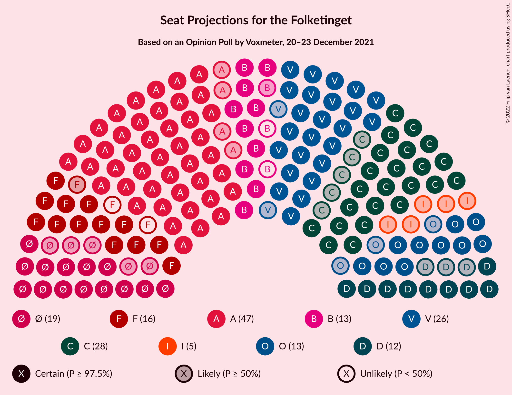
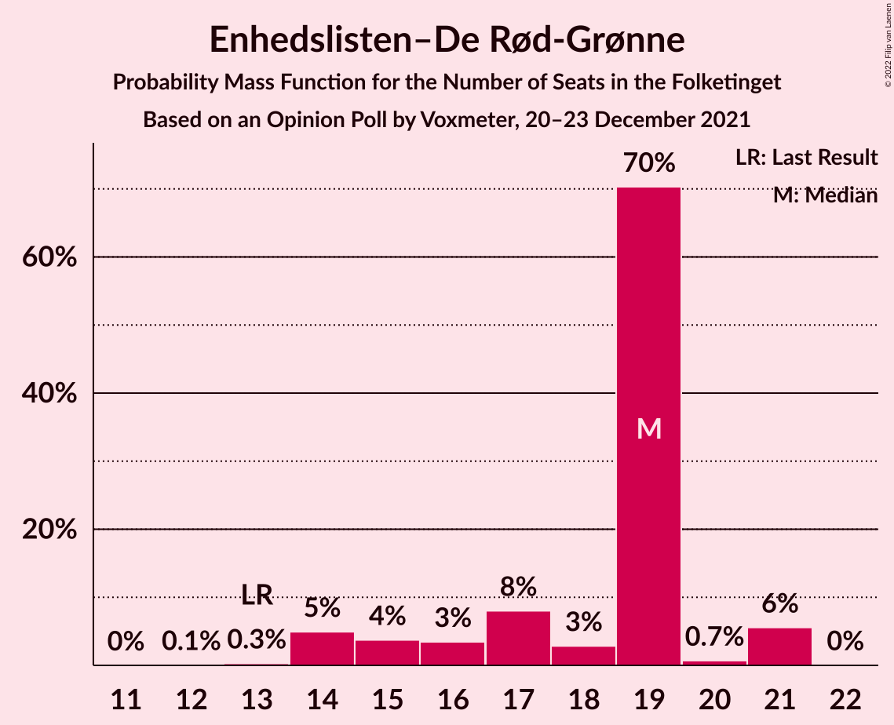
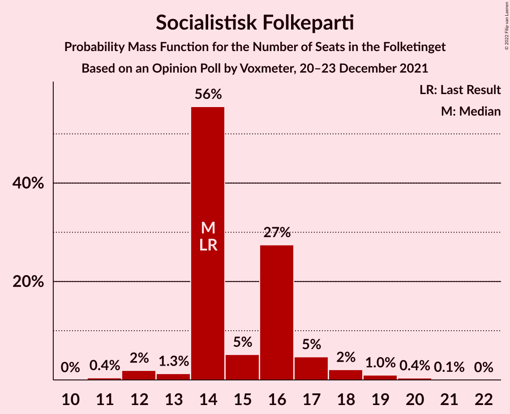
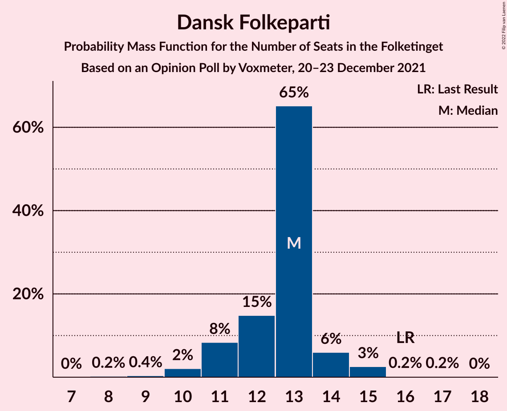
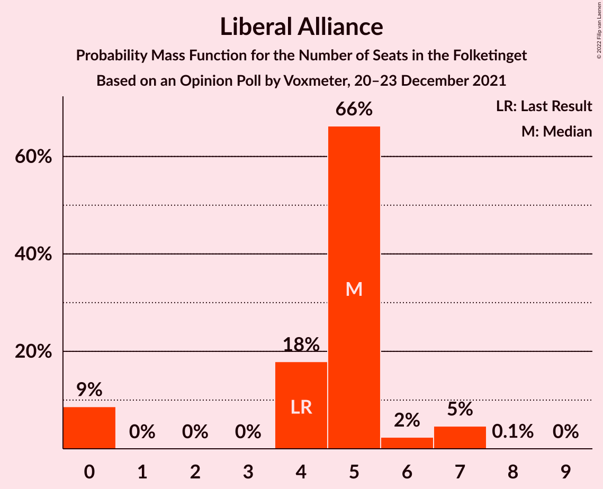
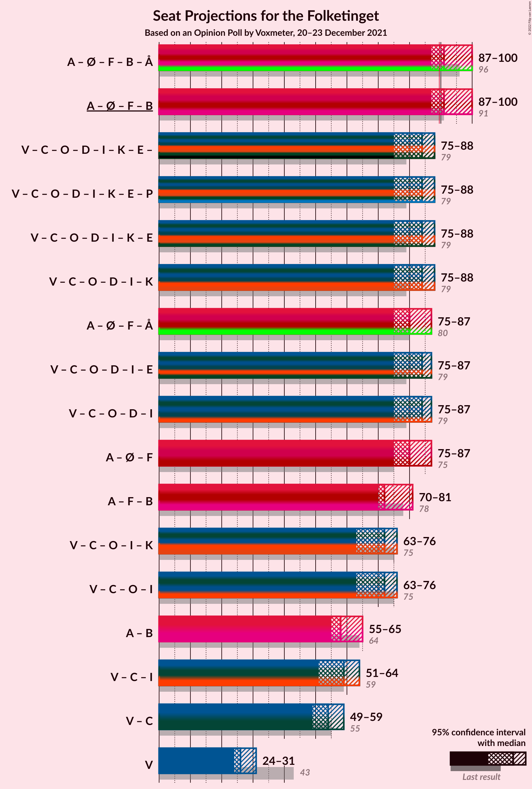
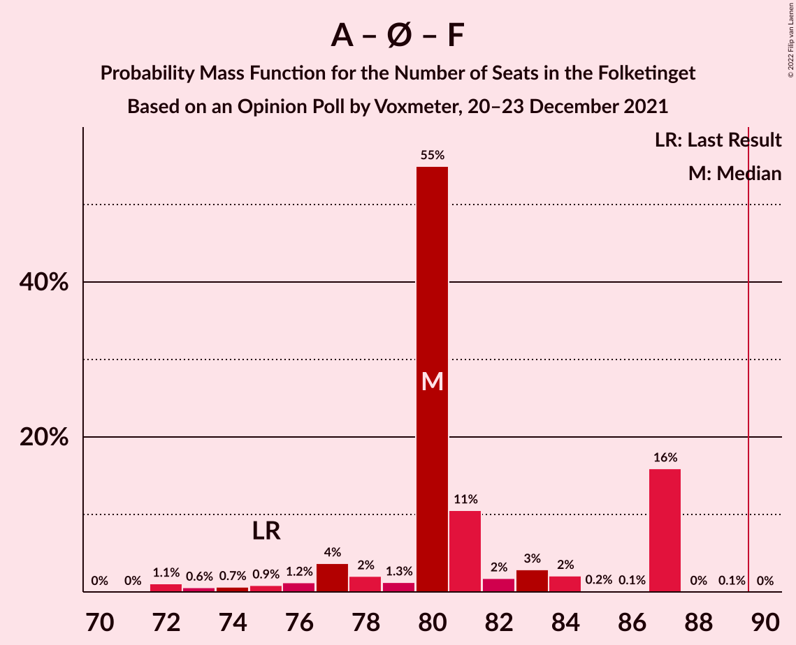

# Opinion Poll by Voxmeter, 20–23 December 2021

<a href="#voting-intentions">Voting Intentions</a> | <a href="#seats">Seats</a> | <a href="#coalitions">Coalitions</a> | <a href="#technical-information">Technical Information</a>

## Voting Intentions

### Confidence Intervals

| Party | Last Result | Poll Result | 80% Confidence Interval | 90% Confidence Interval | 95% Confidence Interval | 99% Confidence Interval |
|:-----:|:-----------:|:-----------:|:-----------------------:|:-----------------------:|:-----------------------:|:-----------------------:|
| Socialdemokraterne | 25.9% | 26.3% | 24.5–28.1% |24.1–28.6% |23.6–29.1% |22.8–29.9% |
| Venstre | 23.4% | 15.2% | 13.8–16.7% |13.4–17.2% |13.1–17.6% |12.5–18.3% |
| Det Konservative Folkeparti | 6.6% | 14.5% | 13.2–16.0% |12.8–16.4% |12.5–16.8% |11.9–17.6% |
| Enhedslisten–De Rød-Grønne | 6.9% | 9.1% | 8.0–10.3% |7.7–10.7% |7.5–11.0% |7.0–11.6% |
| Socialistisk Folkeparti | 7.7% | 8.6% | 7.5–9.8% |7.3–10.2% |7.0–10.5% |6.5–11.1% |
| Dansk Folkeparti | 8.7% | 6.9% | 6.0–8.0% |5.7–8.4% |5.5–8.6% |5.1–9.2% |
| Radikale Venstre | 8.6% | 6.5% | 5.6–7.6% |5.4–7.9% |5.2–8.2% |4.8–8.8% |
| Nye Borgerlige | 2.4% | 6.4% | 5.5–7.5% |5.3–7.8% |5.1–8.1% |4.7–8.7% |
| Liberal Alliance | 2.3% | 2.6% | 2.0–3.3% |1.9–3.6% |1.8–3.7% |1.5–4.1% |
| Kristendemokraterne | 1.7% | 1.6% | 1.2–2.2% |1.1–2.4% |1.0–2.6% |0.8–2.9% |
| Alternativet | 3.0% | 1.3% | 0.9–1.9% |0.8–2.0% |0.7–2.2% |0.6–2.5% |
| Frie Grønne | 0.0% | 0.2% | 0.1–0.5% |0.1–0.6% |0.1–0.7% |0.0–0.9% |

*Note:* The poll result column reflects the actual value used in the calculations. Published results may vary slightly, and in addition be rounded to fewer digits.

## Seats

### Confidence Intervals

| Party | Last Result | Median | 80% Confidence Interval | 90% Confidence Interval | 95% Confidence Interval | 99% Confidence Interval |
|:-----:|:-----------:|:------:|:-----------------------:|:-----------------------:|:-----------------------:|:-----------------------:|
| <a href="#socialdemokraterne">Socialdemokraterne</a> | 48 | 47 | 46–52 |44–52 |43–52 |41–53 |
| <a href="#venstre">Venstre</a> | 43 | 26 | 25–29 |25–30 |24–31 |24–33 |
| <a href="#det-konservative-folkeparti">Det Konservative Folkeparti</a> | 12 | 28 | 23–28 |23–28 |23–29 |22–31 |
| <a href="#enhedslisten–de-rød-grønne">Enhedslisten–De Rød-Grønne</a> | 13 | 19 | 16–19 |14–21 |14–21 |14–21 |
| <a href="#socialistisk-folkeparti">Socialistisk Folkeparti</a> | 14 | 14 | 14–16 |14–17 |13–18 |12–19 |
| <a href="#dansk-folkeparti">Dansk Folkeparti</a> | 16 | 13 | 11–13 |11–14 |10–15 |9–15 |
| <a href="#radikale-venstre">Radikale Venstre</a> | 16 | 11 | 11–13 |11–14 |10–14 |8–15 |
| <a href="#nye-borgerlige">Nye Borgerlige</a> | 4 | 12 | 10–12 |10–13 |9–13 |8–14 |
| <a href="#liberal-alliance">Liberal Alliance</a> | 4 | 5 | 4–5 |0–6 |0–7 |0–7 |
| <a href="#kristendemokraterne">Kristendemokraterne</a> | 0 | 0 | 0 |0 |0–4 |0–5 |
| <a href="#alternativet">Alternativet</a> | 5 | 0 | 0 |0 |0–4 |0–5 |
| <a href="#frie-grønne">Frie Grønne</a> | 0 | 0 | 0 |0 |0 |0 |

### Socialdemokraterne

*For a full overview of the results for this party, see the [Socialdemokraterne](party-socialdemokraterne.html) page.*

| Number of Seats | Probability | Accumulated | Special Marks |
|:---------------:|:-----------:|:-----------:|:-------------:|
| 40 | 0.1% | 100% |  |
| 41 | 1.3% | 99.8% |  |
| 42 | 0.5% | 98.5% |  |
| 43 | 0.8% | 98% |  |
| 44 | 4% | 97% |  |
| 45 | 1.4% | 94% |  |
| 46 | 9% | 92% |  |
| 47 | 53% | 84% | Median |
| 48 | 3% | 31% | Last Result |
| 49 | 4% | 28% |  |
| 50 | 6% | 24% |  |
| 51 | 5% | 18% |  |
| 52 | 11% | 13% |  |
| 53 | 1.3% | 1.4% |  |
| 54 | 0% | 0.1% |  |
| 55 | 0% | 0.1% |  |
| 56 | 0% | 0% |  |

### Venstre

*For a full overview of the results for this party, see the [Venstre](party-venstre.html) page.*

| Number of Seats | Probability | Accumulated | Special Marks |
|:---------------:|:-----------:|:-----------:|:-------------:|
| 22 | 0.1% | 100% |  |
| 23 | 0.3% | 99.9% |  |
| 24 | 2% | 99.6% |  |
| 25 | 7% | 97% |  |
| 26 | 58% | 90% | Median |
| 27 | 12% | 31% |  |
| 28 | 6% | 19% |  |
| 29 | 5% | 13% |  |
| 30 | 4% | 8% |  |
| 31 | 3% | 4% |  |
| 32 | 1.0% | 2% |  |
| 33 | 0.3% | 0.7% |  |
| 34 | 0.1% | 0.3% |  |
| 35 | 0.2% | 0.3% |  |
| 36 | 0% | 0% |  |
| 37 | 0% | 0% |  |
| 38 | 0% | 0% |  |
| 39 | 0% | 0% |  |
| 40 | 0% | 0% |  |
| 41 | 0% | 0% |  |
| 42 | 0% | 0% |  |
| 43 | 0% | 0% | Last Result |

### Det Konservative Folkeparti

*For a full overview of the results for this party, see the [Det Konservative Folkeparti](party-detkonservativefolkeparti.html) page.*

| Number of Seats | Probability | Accumulated | Special Marks |
|:---------------:|:-----------:|:-----------:|:-------------:|
| 12 | 0% | 100% | Last Result |
| 13 | 0% | 100% |  |
| 14 | 0% | 100% |  |
| 15 | 0% | 100% |  |
| 16 | 0% | 100% |  |
| 17 | 0% | 100% |  |
| 18 | 0% | 100% |  |
| 19 | 0% | 100% |  |
| 20 | 0% | 100% |  |
| 21 | 0.1% | 100% |  |
| 22 | 1.2% | 99.9% |  |
| 23 | 14% | 98.6% |  |
| 24 | 7% | 85% |  |
| 25 | 4% | 78% |  |
| 26 | 7% | 74% |  |
| 27 | 9% | 67% |  |
| 28 | 55% | 58% | Median |
| 29 | 2% | 4% |  |
| 30 | 1.3% | 2% |  |
| 31 | 0.1% | 0.5% |  |
| 32 | 0.2% | 0.4% |  |
| 33 | 0.2% | 0.2% |  |
| 34 | 0.1% | 0.1% |  |
| 35 | 0% | 0% |  |

### Enhedslisten–De Rød-Grønne

*For a full overview of the results for this party, see the [Enhedslisten–De Rød-Grønne](party-enhedslisten–derød-grønne.html) page.*

| Number of Seats | Probability | Accumulated | Special Marks |
|:---------------:|:-----------:|:-----------:|:-------------:|
| 12 | 0.1% | 100% |  |
| 13 | 0.3% | 99.9% | Last Result |
| 14 | 5% | 99.6% |  |
| 15 | 4% | 95% |  |
| 16 | 3% | 91% |  |
| 17 | 8% | 88% |  |
| 18 | 3% | 79% |  |
| 19 | 70% | 77% | Median |
| 20 | 0.7% | 6% |  |
| 21 | 6% | 6% |  |
| 22 | 0% | 0% |  |

### Socialistisk Folkeparti

*For a full overview of the results for this party, see the [Socialistisk Folkeparti](party-socialistiskfolkeparti.html) page.*

| Number of Seats | Probability | Accumulated | Special Marks |
|:---------------:|:-----------:|:-----------:|:-------------:|
| 11 | 0.4% | 100% |  |
| 12 | 2% | 99.6% |  |
| 13 | 1.3% | 98% |  |
| 14 | 56% | 96% | Last Result, Median |
| 15 | 5% | 41% |  |
| 16 | 27% | 36% |  |
| 17 | 5% | 8% |  |
| 18 | 2% | 4% |  |
| 19 | 1.0% | 1.5% |  |
| 20 | 0.4% | 0.5% |  |
| 21 | 0.1% | 0.1% |  |
| 22 | 0% | 0% |  |

### Dansk Folkeparti

*For a full overview of the results for this party, see the [Dansk Folkeparti](party-danskfolkeparti.html) page.*

| Number of Seats | Probability | Accumulated | Special Marks |
|:---------------:|:-----------:|:-----------:|:-------------:|
| 8 | 0.2% | 100% |  |
| 9 | 0.4% | 99.8% |  |
| 10 | 2% | 99.4% |  |
| 11 | 8% | 97% |  |
| 12 | 15% | 89% |  |
| 13 | 65% | 74% | Median |
| 14 | 6% | 9% |  |
| 15 | 3% | 3% |  |
| 16 | 0.2% | 0.4% | Last Result |
| 17 | 0.2% | 0.2% |  |
| 18 | 0% | 0% |  |

### Radikale Venstre

*For a full overview of the results for this party, see the [Radikale Venstre](party-radikalevenstre.html) page.*

| Number of Seats | Probability | Accumulated | Special Marks |
|:---------------:|:-----------:|:-----------:|:-------------:|
| 8 | 0.6% | 100% |  |
| 9 | 1.3% | 99.4% |  |
| 10 | 1.4% | 98% |  |
| 11 | 67% | 97% | Median |
| 12 | 12% | 30% |  |
| 13 | 10% | 18% |  |
| 14 | 6% | 8% |  |
| 15 | 1.4% | 2% |  |
| 16 | 0.2% | 0.2% | Last Result |
| 17 | 0% | 0.1% |  |
| 18 | 0% | 0% |  |

### Nye Borgerlige

*For a full overview of the results for this party, see the [Nye Borgerlige](party-nyeborgerlige.html) page.*

| Number of Seats | Probability | Accumulated | Special Marks |
|:---------------:|:-----------:|:-----------:|:-------------:|
| 4 | 0% | 100% | Last Result |
| 5 | 0% | 100% |  |
| 6 | 0% | 100% |  |
| 7 | 0% | 100% |  |
| 8 | 0.9% | 100% |  |
| 9 | 2% | 99.1% |  |
| 10 | 17% | 97% |  |
| 11 | 9% | 80% |  |
| 12 | 61% | 70% | Median |
| 13 | 8% | 10% |  |
| 14 | 1.1% | 1.4% |  |
| 15 | 0.2% | 0.3% |  |
| 16 | 0.1% | 0.1% |  |
| 17 | 0% | 0% |  |

### Liberal Alliance

*For a full overview of the results for this party, see the [Liberal Alliance](party-liberalalliance.html) page.*

| Number of Seats | Probability | Accumulated | Special Marks |
|:---------------:|:-----------:|:-----------:|:-------------:|
| 0 | 9% | 100% |  |
| 1 | 0% | 91% |  |
| 2 | 0% | 91% |  |
| 3 | 0% | 91% |  |
| 4 | 18% | 91% | Last Result |
| 5 | 66% | 73% | Median |
| 6 | 2% | 7% |  |
| 7 | 5% | 5% |  |
| 8 | 0.1% | 0.1% |  |
| 9 | 0% | 0% |  |

### Kristendemokraterne

*For a full overview of the results for this party, see the [Kristendemokraterne](party-kristendemokraterne.html) page.*

| Number of Seats | Probability | Accumulated | Special Marks |
|:---------------:|:-----------:|:-----------:|:-------------:|
| 0 | 96% | 100% | Last Result, Median |
| 1 | 0% | 4% |  |
| 2 | 0% | 4% |  |
| 3 | 0% | 4% |  |
| 4 | 4% | 4% |  |
| 5 | 0.5% | 0.5% |  |
| 6 | 0% | 0% |  |

### Alternativet

*For a full overview of the results for this party, see the [Alternativet](party-alternativet.html) page.*

| Number of Seats | Probability | Accumulated | Special Marks |
|:---------------:|:-----------:|:-----------:|:-------------:|
| 0 | 97% | 100% | Median |
| 1 | 0% | 3% |  |
| 2 | 0% | 3% |  |
| 3 | 0% | 3% |  |
| 4 | 2% | 3% |  |
| 5 | 1.0% | 1.0% | Last Result |
| 6 | 0% | 0% |  |

### Frie Grønne

*For a full overview of the results for this party, see the [Frie Grønne](party-friegrønne.html) page.*

| Number of Seats | Probability | Accumulated | Special Marks |
|:---------------:|:-----------:|:-----------:|:-------------:|
| 0 | 100% | 100% | Last Result, Median |

## Coalitions

### Confidence Intervals

| Coalition | Last Result | Median | Majority? | 80% Confidence Interval | 90% Confidence Interval | 95% Confidence Interval | 99% Confidence Interval |
|:---------:|:-----------:|:------:|:---------:|:-----------------------:|:-----------------------:|:-----------------------:|:-----------------------:|
| Socialdemokraterne – Enhedslisten–De Rød-Grønne – Socialistisk Folkeparti – Radikale Venstre – Alternativet | 96 | 91 | 93% | 91–98 | 89–100 | 87–100 | 84–100 |
| Socialdemokraterne – Enhedslisten–De Rød-Grønne – Socialistisk Folkeparti – Radikale Venstre | 91 | 91 | 93% | 91–98 | 89–100 | 87–100 | 84–100 |
| Venstre – Det Konservative Folkeparti – Dansk Folkeparti – Nye Borgerlige – Liberal Alliance – Kristendemokraterne | 79 | 84 | 1.4% | 77–84 | 75–86 | 75–88 | 75–91 |
| Socialdemokraterne – Enhedslisten–De Rød-Grønne – Socialistisk Folkeparti – Alternativet | 80 | 80 | 0% | 79–87 | 77–87 | 75–87 | 72–87 |
| Venstre – Det Konservative Folkeparti – Dansk Folkeparti – Nye Borgerlige – Liberal Alliance | 79 | 84 | 1.2% | 77–84 | 75–86 | 75–87 | 75–91 |
| Socialdemokraterne – Enhedslisten–De Rød-Grønne – Socialistisk Folkeparti | 75 | 80 | 0% | 78–87 | 77–87 | 75–87 | 72–87 |
| Socialdemokraterne – Socialistisk Folkeparti – Radikale Venstre | 78 | 72 | 0% | 72–79 | 72–79 | 70–81 | 68–81 |
| Venstre – Det Konservative Folkeparti – Dansk Folkeparti – Liberal Alliance – Kristendemokraterne | 75 | 72 | 0% | 67–73 | 63–75 | 63–76 | 63–79 |
| Venstre – Det Konservative Folkeparti – Dansk Folkeparti – Liberal Alliance | 75 | 72 | 0% | 67–72 | 63–74 | 63–76 | 63–79 |
| Socialdemokraterne – Radikale Venstre | 64 | 58 | 0% | 58–63 | 56–64 | 55–65 | 53–65 |
| Venstre – Det Konservative Folkeparti – Liberal Alliance | 59 | 59 | 0% | 54–59 | 51–61 | 51–64 | 51–64 |
| Venstre – Det Konservative Folkeparti | 55 | 54 | 0% | 50–55 | 50–57 | 49–59 | 48–60 |
| Venstre | 43 | 26 | 0% | 25–29 | 25–30 | 24–31 | 24–33 |

### Socialdemokraterne – Enhedslisten–De Rød-Grønne – Socialistisk Folkeparti – Radikale Venstre – Alternativet

| Number of Seats | Probability | Accumulated | Special Marks |
|:---------------:|:-----------:|:-----------:|:-------------:|
| 83 | 0.1% | 100% |  |
| 84 | 0.9% | 99.9% |  |
| 85 | 0.3% | 98.9% |  |
| 86 | 0.5% | 98.6% |  |
| 87 | 1.0% | 98% |  |
| 88 | 2% | 97% |  |
| 89 | 2% | 95% |  |
| 90 | 2% | 93% | Majority |
| 91 | 53% | 91% | Median |
| 92 | 1.2% | 38% |  |
| 93 | 9% | 37% |  |
| 94 | 3% | 28% |  |
| 95 | 5% | 26% |  |
| 96 | 3% | 20% | Last Result |
| 97 | 1.3% | 18% |  |
| 98 | 11% | 16% |  |
| 99 | 0.2% | 6% |  |
| 100 | 5% | 6% |  |
| 101 | 0.1% | 0.1% |  |
| 102 | 0% | 0% |  |

### Socialdemokraterne – Enhedslisten–De Rød-Grønne – Socialistisk Folkeparti – Radikale Venstre

| Number of Seats | Probability | Accumulated | Special Marks |
|:---------------:|:-----------:|:-----------:|:-------------:|
| 83 | 0.1% | 100% |  |
| 84 | 0.9% | 99.8% |  |
| 85 | 0.4% | 98.9% |  |
| 86 | 0.5% | 98% |  |
| 87 | 1.1% | 98% |  |
| 88 | 2% | 97% |  |
| 89 | 2% | 95% |  |
| 90 | 3% | 93% | Majority |
| 91 | 53% | 90% | Last Result, Median |
| 92 | 1.3% | 37% |  |
| 93 | 10% | 35% |  |
| 94 | 2% | 26% |  |
| 95 | 5% | 23% |  |
| 96 | 2% | 18% |  |
| 97 | 0.4% | 17% |  |
| 98 | 11% | 16% |  |
| 99 | 0.1% | 5% |  |
| 100 | 5% | 5% |  |
| 101 | 0.1% | 0.1% |  |
| 102 | 0% | 0% |  |

### Venstre – Det Konservative Folkeparti – Dansk Folkeparti – Nye Borgerlige – Liberal Alliance – Kristendemokraterne

| Number of Seats | Probability | Accumulated | Special Marks |
|:---------------:|:-----------:|:-----------:|:-------------:|
| 74 | 0.1% | 100% |  |
| 75 | 5% | 99.9% |  |
| 76 | 0.2% | 94% |  |
| 77 | 11% | 94% |  |
| 78 | 1.3% | 84% |  |
| 79 | 3% | 82% | Last Result |
| 80 | 5% | 80% |  |
| 81 | 3% | 74% |  |
| 82 | 9% | 72% |  |
| 83 | 1.2% | 63% |  |
| 84 | 53% | 62% | Median |
| 85 | 2% | 9% |  |
| 86 | 2% | 6% |  |
| 87 | 2% | 4% |  |
| 88 | 0.9% | 3% |  |
| 89 | 0.5% | 2% |  |
| 90 | 0.3% | 1.4% | Majority |
| 91 | 0.9% | 1.1% |  |
| 92 | 0.1% | 0.1% |  |
| 93 | 0% | 0% |  |

### Socialdemokraterne – Enhedslisten–De Rød-Grønne – Socialistisk Folkeparti – Alternativet

| Number of Seats | Probability | Accumulated | Special Marks |
|:---------------:|:-----------:|:-----------:|:-------------:|
| 72 | 1.0% | 100% |  |
| 73 | 0.6% | 98.9% |  |
| 74 | 0.5% | 98% |  |
| 75 | 0.4% | 98% |  |
| 76 | 1.1% | 97% |  |
| 77 | 4% | 96% |  |
| 78 | 2% | 93% |  |
| 79 | 2% | 90% |  |
| 80 | 54% | 89% | Last Result, Median |
| 81 | 10% | 35% |  |
| 82 | 2% | 25% |  |
| 83 | 3% | 23% |  |
| 84 | 2% | 21% |  |
| 85 | 2% | 18% |  |
| 86 | 0.1% | 17% |  |
| 87 | 16% | 16% |  |
| 88 | 0.3% | 0.3% |  |
| 89 | 0.1% | 0.1% |  |
| 90 | 0% | 0% | Majority |

### Venstre – Det Konservative Folkeparti – Dansk Folkeparti – Nye Borgerlige – Liberal Alliance

| Number of Seats | Probability | Accumulated | Special Marks |
|:---------------:|:-----------:|:-----------:|:-------------:|
| 73 | 0% | 100% |  |
| 74 | 0.1% | 99.9% |  |
| 75 | 6% | 99.8% |  |
| 76 | 0.2% | 94% |  |
| 77 | 11% | 94% |  |
| 78 | 2% | 82% |  |
| 79 | 2% | 81% | Last Result |
| 80 | 5% | 79% |  |
| 81 | 4% | 73% |  |
| 82 | 9% | 69% |  |
| 83 | 1.3% | 61% |  |
| 84 | 53% | 59% | Median |
| 85 | 0.8% | 6% |  |
| 86 | 2% | 6% |  |
| 87 | 2% | 4% |  |
| 88 | 0.5% | 2% |  |
| 89 | 0.4% | 2% |  |
| 90 | 0.1% | 1.2% | Majority |
| 91 | 0.9% | 1.0% |  |
| 92 | 0.1% | 0.1% |  |
| 93 | 0% | 0% |  |

### Socialdemokraterne – Enhedslisten–De Rød-Grønne – Socialistisk Folkeparti

| Number of Seats | Probability | Accumulated | Special Marks |
|:---------------:|:-----------:|:-----------:|:-------------:|
| 71 | 0% | 100% |  |
| 72 | 1.1% | 99.9% |  |
| 73 | 0.6% | 98.9% |  |
| 74 | 0.7% | 98% |  |
| 75 | 0.9% | 98% | Last Result |
| 76 | 1.2% | 97% |  |
| 77 | 4% | 96% |  |
| 78 | 2% | 92% |  |
| 79 | 1.3% | 90% |  |
| 80 | 55% | 89% | Median |
| 81 | 11% | 34% |  |
| 82 | 2% | 23% |  |
| 83 | 3% | 21% |  |
| 84 | 2% | 18% |  |
| 85 | 0.2% | 16% |  |
| 86 | 0.1% | 16% |  |
| 87 | 16% | 16% |  |
| 88 | 0% | 0.1% |  |
| 89 | 0.1% | 0.1% |  |
| 90 | 0% | 0% | Majority |

### Socialdemokraterne – Socialistisk Folkeparti – Radikale Venstre

| Number of Seats | Probability | Accumulated | Special Marks |
|:---------------:|:-----------:|:-----------:|:-------------:|
| 66 | 0.2% | 100% |  |
| 67 | 0.2% | 99.8% |  |
| 68 | 1.2% | 99.6% |  |
| 69 | 0.6% | 98% |  |
| 70 | 2% | 98% |  |
| 71 | 0.8% | 96% |  |
| 72 | 53% | 95% | Median |
| 73 | 0.9% | 42% |  |
| 74 | 9% | 41% |  |
| 75 | 3% | 32% |  |
| 76 | 4% | 29% |  |
| 77 | 0.8% | 26% |  |
| 78 | 2% | 25% | Last Result |
| 79 | 18% | 22% |  |
| 80 | 0.3% | 4% |  |
| 81 | 3% | 4% |  |
| 82 | 0.3% | 0.5% |  |
| 83 | 0.1% | 0.2% |  |
| 84 | 0.1% | 0.1% |  |
| 85 | 0% | 0% |  |

### Venstre – Det Konservative Folkeparti – Dansk Folkeparti – Liberal Alliance – Kristendemokraterne

| Number of Seats | Probability | Accumulated | Special Marks |
|:---------------:|:-----------:|:-----------:|:-------------:|
| 63 | 5% | 100% |  |
| 64 | 0.3% | 95% |  |
| 65 | 0% | 94% |  |
| 66 | 0.5% | 94% |  |
| 67 | 14% | 94% |  |
| 68 | 2% | 80% |  |
| 69 | 5% | 78% |  |
| 70 | 5% | 73% |  |
| 71 | 5% | 67% |  |
| 72 | 51% | 62% | Median |
| 73 | 2% | 11% |  |
| 74 | 3% | 9% |  |
| 75 | 1.1% | 6% | Last Result |
| 76 | 2% | 5% |  |
| 77 | 0.4% | 2% |  |
| 78 | 0.2% | 2% |  |
| 79 | 1.3% | 2% |  |
| 80 | 0.1% | 0.3% |  |
| 81 | 0% | 0.1% |  |
| 82 | 0.1% | 0.1% |  |
| 83 | 0% | 0% |  |

### Venstre – Det Konservative Folkeparti – Dansk Folkeparti – Liberal Alliance

| Number of Seats | Probability | Accumulated | Special Marks |
|:---------------:|:-----------:|:-----------:|:-------------:|
| 63 | 5% | 100% |  |
| 64 | 0.4% | 95% |  |
| 65 | 0.1% | 94% |  |
| 66 | 0.6% | 94% |  |
| 67 | 14% | 93% |  |
| 68 | 2% | 79% |  |
| 69 | 6% | 77% |  |
| 70 | 6% | 71% |  |
| 71 | 5% | 65% |  |
| 72 | 53% | 61% | Median |
| 73 | 2% | 8% |  |
| 74 | 2% | 6% |  |
| 75 | 0.9% | 4% | Last Result |
| 76 | 1.1% | 3% |  |
| 77 | 0.3% | 2% |  |
| 78 | 0.2% | 2% |  |
| 79 | 1.2% | 1.4% |  |
| 80 | 0% | 0.1% |  |
| 81 | 0% | 0.1% |  |
| 82 | 0.1% | 0.1% |  |
| 83 | 0% | 0% |  |

### Socialdemokraterne – Radikale Venstre

| Number of Seats | Probability | Accumulated | Special Marks |
|:---------------:|:-----------:|:-----------:|:-------------:|
| 51 | 0.2% | 100% |  |
| 52 | 0% | 99.8% |  |
| 53 | 2% | 99.7% |  |
| 54 | 0.5% | 98% |  |
| 55 | 1.1% | 98% |  |
| 56 | 2% | 97% |  |
| 57 | 2% | 94% |  |
| 58 | 59% | 92% | Median |
| 59 | 2% | 33% |  |
| 60 | 3% | 31% |  |
| 61 | 2% | 28% |  |
| 62 | 4% | 26% |  |
| 63 | 17% | 22% |  |
| 64 | 2% | 5% | Last Result |
| 65 | 4% | 4% |  |
| 66 | 0.1% | 0.1% |  |
| 67 | 0% | 0.1% |  |
| 68 | 0% | 0% |  |

### Venstre – Det Konservative Folkeparti – Liberal Alliance

| Number of Seats | Probability | Accumulated | Special Marks |
|:---------------:|:-----------:|:-----------:|:-------------:|
| 51 | 5% | 100% |  |
| 52 | 0.1% | 95% |  |
| 53 | 0.7% | 94% |  |
| 54 | 13% | 94% |  |
| 55 | 1.4% | 81% |  |
| 56 | 5% | 80% |  |
| 57 | 1.3% | 75% |  |
| 58 | 10% | 74% |  |
| 59 | 54% | 64% | Last Result, Median |
| 60 | 3% | 10% |  |
| 61 | 2% | 7% |  |
| 62 | 1.2% | 4% |  |
| 63 | 0.5% | 3% |  |
| 64 | 2% | 3% |  |
| 65 | 0.2% | 0.4% |  |
| 66 | 0% | 0.2% |  |
| 67 | 0.2% | 0.2% |  |
| 68 | 0% | 0% |  |

### Venstre – Det Konservative Folkeparti

| Number of Seats | Probability | Accumulated | Special Marks |
|:---------------:|:-----------:|:-----------:|:-------------:|
| 47 | 0.1% | 100% |  |
| 48 | 1.1% | 99.9% |  |
| 49 | 2% | 98.8% |  |
| 50 | 12% | 97% |  |
| 51 | 7% | 85% |  |
| 52 | 4% | 79% |  |
| 53 | 9% | 75% |  |
| 54 | 54% | 65% | Median |
| 55 | 2% | 11% | Last Result |
| 56 | 2% | 9% |  |
| 57 | 3% | 6% |  |
| 58 | 0.8% | 3% |  |
| 59 | 1.5% | 3% |  |
| 60 | 0.8% | 1.1% |  |
| 61 | 0.1% | 0.3% |  |
| 62 | 0.2% | 0.2% |  |
| 63 | 0% | 0% |  |

### Venstre

| Number of Seats | Probability | Accumulated | Special Marks |
|:---------------:|:-----------:|:-----------:|:-------------:|
| 22 | 0.1% | 100% |  |
| 23 | 0.3% | 99.9% |  |
| 24 | 2% | 99.6% |  |
| 25 | 7% | 97% |  |
| 26 | 58% | 90% | Median |
| 27 | 12% | 31% |  |
| 28 | 6% | 19% |  |
| 29 | 5% | 13% |  |
| 30 | 4% | 8% |  |
| 31 | 3% | 4% |  |
| 32 | 1.0% | 2% |  |
| 33 | 0.3% | 0.7% |  |
| 34 | 0.1% | 0.3% |  |
| 35 | 0.2% | 0.3% |  |
| 36 | 0% | 0% |  |
| 37 | 0% | 0% |  |
| 38 | 0% | 0% |  |
| 39 | 0% | 0% |  |
| 40 | 0% | 0% |  |
| 41 | 0% | 0% |  |
| 42 | 0% | 0% |  |
| 43 | 0% | 0% | Last Result |

## Technical Information

### Opinion Poll

+ **Polling firm:** Voxmeter
+ **Commissioner(s):** —
+ **Fieldwork period:** 20–23 December 2021

### Calculations

+ **Sample size:** 1013
+ **Simulations done:** 1,048,576
+ **Error estimate:** 1.27%

