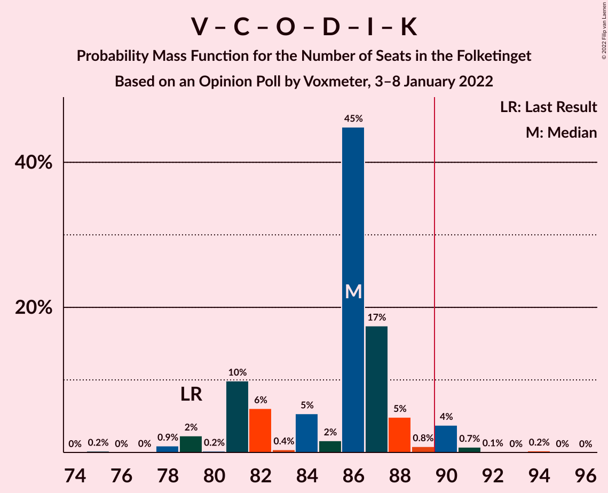

# Opinion Poll by Voxmeter, 3–8 January 2022

<a href="#voting-intentions">Voting Intentions</a> | <a href="#seats">Seats</a> | <a href="#coalitions">Coalitions</a> | <a href="#technical-information">Technical Information</a>

## Voting Intentions

### Confidence Intervals

| Party | Last Result | Poll Result | 80% Confidence Interval | 90% Confidence Interval | 95% Confidence Interval | 99% Confidence Interval |
|:-----:|:-----------:|:-----------:|:-----------------------:|:-----------------------:|:-----------------------:|:-----------------------:|
| Socialdemokraterne | 25.9% | 25.0% | 23.4–26.9% |22.9–27.4% |22.5–27.8% |21.7–28.7% |
| Venstre | 23.4% | 16.5% | 15.0–18.1% |14.6–18.5% |14.3–18.9% |13.6–19.7% |
| Det Konservative Folkeparti | 6.6% | 15.0% | 13.6–16.5% |13.2–16.9% |12.9–17.3% |12.3–18.1% |
| Enhedslisten–De Rød-Grønne | 6.9% | 8.9% | 7.8–10.1% |7.5–10.5% |7.3–10.8% |6.8–11.4% |
| Socialistisk Folkeparti | 7.7% | 8.6% | 7.5–9.8% |7.2–10.2% |7.0–10.5% |6.5–11.1% |
| Radikale Venstre | 8.6% | 7.2% | 6.2–8.4% |6.0–8.7% |5.7–9.0% |5.3–9.5% |
| Dansk Folkeparti | 8.7% | 6.2% | 5.3–7.3% |5.1–7.6% |4.8–7.9% |4.5–8.4% |
| Nye Borgerlige | 2.4% | 6.0% | 5.1–7.1% |4.9–7.4% |4.7–7.6% |4.3–8.2% |
| Liberal Alliance | 2.3% | 2.5% | 2.0–3.3% |1.8–3.5% |1.7–3.7% |1.5–4.1% |
| Kristendemokraterne | 1.7% | 1.8% | 1.4–2.5% |1.2–2.7% |1.1–2.8% |1.0–3.2% |
| Alternativet | 3.0% | 1.2% | 0.9–1.8% |0.8–1.9% |0.7–2.1% |0.5–2.4% |
| Frie Grønne | 0.0% | 0.1% | 0.0–0.4% |0.0–0.5% |0.0–0.6% |0.0–0.7% |

*Note:* The poll result column reflects the actual value used in the calculations. Published results may vary slightly, and in addition be rounded to fewer digits.

## Seats

### Confidence Intervals

| Party | Last Result | Median | 80% Confidence Interval | 90% Confidence Interval | 95% Confidence Interval | 99% Confidence Interval |
|:-----:|:-----------:|:------:|:-----------------------:|:-----------------------:|:-----------------------:|:-----------------------:|
| <a href="#socialdemokraterne">Socialdemokraterne</a> | 48 | 46 | 44–48 |43–48 |42–48 |39–51 |
| <a href="#venstre">Venstre</a> | 43 | 30 | 28–32 |27–33 |27–33 |24–36 |
| <a href="#det-konservative-folkeparti">Det Konservative Folkeparti</a> | 12 | 28 | 25–29 |24–29 |24–31 |22–32 |
| <a href="#enhedslisten–de-rød-grønne">Enhedslisten–De Rød-Grønne</a> | 13 | 16 | 14–17 |14–19 |13–19 |13–20 |
| <a href="#socialistisk-folkeparti">Socialistisk Folkeparti</a> | 14 | 15 | 14–17 |14–18 |14–19 |12–20 |
| <a href="#radikale-venstre">Radikale Venstre</a> | 16 | 12 | 11–15 |10–15 |10–16 |10–16 |
| <a href="#dansk-folkeparti">Dansk Folkeparti</a> | 16 | 12 | 10–13 |9–13 |9–15 |8–15 |
| <a href="#nye-borgerlige">Nye Borgerlige</a> | 4 | 10 | 9–12 |9–13 |9–13 |8–15 |
| <a href="#liberal-alliance">Liberal Alliance</a> | 4 | 5 | 0–6 |0–6 |0–6 |0–7 |
| <a href="#kristendemokraterne">Kristendemokraterne</a> | 0 | 0 | 0–4 |0–4 |0–4 |0–5 |
| <a href="#alternativet">Alternativet</a> | 5 | 0 | 0 |0 |0 |0–4 |
| <a href="#frie-grønne">Frie Grønne</a> | 0 | 0 | 0 |0 |0 |0 |

### Socialdemokraterne

*For a full overview of the results for this party, see the [Socialdemokraterne](party-socialdemokraterne.html) page.*

| Number of Seats | Probability | Accumulated | Special Marks |
|:---------------:|:-----------:|:-----------:|:-------------:|
| 37 | 0% | 100% |  |
| 38 | 0.1% | 99.9% |  |
| 39 | 0.7% | 99.8% |  |
| 40 | 0.7% | 99.1% |  |
| 41 | 0.8% | 98% |  |
| 42 | 2% | 98% |  |
| 43 | 2% | 95% |  |
| 44 | 12% | 93% |  |
| 45 | 13% | 81% |  |
| 46 | 52% | 67% | Median |
| 47 | 4% | 16% |  |
| 48 | 10% | 11% | Last Result |
| 49 | 0.3% | 1.2% |  |
| 50 | 0.3% | 0.8% |  |
| 51 | 0.4% | 0.6% |  |
| 52 | 0.1% | 0.2% |  |
| 53 | 0.1% | 0.1% |  |
| 54 | 0% | 0% |  |

### Venstre

*For a full overview of the results for this party, see the [Venstre](party-venstre.html) page.*

| Number of Seats | Probability | Accumulated | Special Marks |
|:---------------:|:-----------:|:-----------:|:-------------:|
| 23 | 0.1% | 100% |  |
| 24 | 0.6% | 99.9% |  |
| 25 | 0.6% | 99.3% |  |
| 26 | 0.6% | 98.7% |  |
| 27 | 3% | 98% |  |
| 28 | 6% | 95% |  |
| 29 | 8% | 89% |  |
| 30 | 54% | 81% | Median |
| 31 | 13% | 26% |  |
| 32 | 6% | 14% |  |
| 33 | 6% | 8% |  |
| 34 | 0.8% | 2% |  |
| 35 | 0.3% | 1.2% |  |
| 36 | 0.9% | 0.9% |  |
| 37 | 0% | 0% |  |
| 38 | 0% | 0% |  |
| 39 | 0% | 0% |  |
| 40 | 0% | 0% |  |
| 41 | 0% | 0% |  |
| 42 | 0% | 0% |  |
| 43 | 0% | 0% | Last Result |

### Det Konservative Folkeparti

*For a full overview of the results for this party, see the [Det Konservative Folkeparti](party-detkonservativefolkeparti.html) page.*

| Number of Seats | Probability | Accumulated | Special Marks |
|:---------------:|:-----------:|:-----------:|:-------------:|
| 12 | 0% | 100% | Last Result |
| 13 | 0% | 100% |  |
| 14 | 0% | 100% |  |
| 15 | 0% | 100% |  |
| 16 | 0% | 100% |  |
| 17 | 0% | 100% |  |
| 18 | 0% | 100% |  |
| 19 | 0% | 100% |  |
| 20 | 0% | 100% |  |
| 21 | 0% | 100% |  |
| 22 | 0.4% | 99.9% |  |
| 23 | 1.1% | 99.5% |  |
| 24 | 4% | 98% |  |
| 25 | 10% | 95% |  |
| 26 | 9% | 84% |  |
| 27 | 13% | 75% |  |
| 28 | 13% | 62% | Median |
| 29 | 44% | 49% |  |
| 30 | 1.5% | 5% |  |
| 31 | 2% | 3% |  |
| 32 | 2% | 2% |  |
| 33 | 0.1% | 0.1% |  |
| 34 | 0% | 0% |  |

### Enhedslisten–De Rød-Grønne

*For a full overview of the results for this party, see the [Enhedslisten–De Rød-Grønne](party-enhedslisten–derød-grønne.html) page.*

| Number of Seats | Probability | Accumulated | Special Marks |
|:---------------:|:-----------:|:-----------:|:-------------:|
| 11 | 0.1% | 100% |  |
| 12 | 0.3% | 99.9% |  |
| 13 | 4% | 99.6% | Last Result |
| 14 | 17% | 96% |  |
| 15 | 5% | 78% |  |
| 16 | 53% | 74% | Median |
| 17 | 13% | 21% |  |
| 18 | 1.3% | 8% |  |
| 19 | 6% | 6% |  |
| 20 | 0.4% | 0.6% |  |
| 21 | 0.1% | 0.2% |  |
| 22 | 0.1% | 0.1% |  |
| 23 | 0% | 0% |  |

### Socialistisk Folkeparti

*For a full overview of the results for this party, see the [Socialistisk Folkeparti](party-socialistiskfolkeparti.html) page.*

| Number of Seats | Probability | Accumulated | Special Marks |
|:---------------:|:-----------:|:-----------:|:-------------:|
| 11 | 0.1% | 100% |  |
| 12 | 0.7% | 99.9% |  |
| 13 | 2% | 99.2% |  |
| 14 | 16% | 98% | Last Result |
| 15 | 53% | 82% | Median |
| 16 | 18% | 29% |  |
| 17 | 6% | 12% |  |
| 18 | 3% | 6% |  |
| 19 | 2% | 3% |  |
| 20 | 0.6% | 1.1% |  |
| 21 | 0.4% | 0.4% |  |
| 22 | 0% | 0% |  |

### Radikale Venstre

*For a full overview of the results for this party, see the [Radikale Venstre](party-radikalevenstre.html) page.*

| Number of Seats | Probability | Accumulated | Special Marks |
|:---------------:|:-----------:|:-----------:|:-------------:|
| 9 | 0.3% | 100% |  |
| 10 | 5% | 99.7% |  |
| 11 | 7% | 95% |  |
| 12 | 56% | 87% | Median |
| 13 | 19% | 31% |  |
| 14 | 2% | 12% |  |
| 15 | 8% | 10% |  |
| 16 | 2% | 3% | Last Result |
| 17 | 0.2% | 0.4% |  |
| 18 | 0.2% | 0.2% |  |
| 19 | 0% | 0% |  |

### Dansk Folkeparti

*For a full overview of the results for this party, see the [Dansk Folkeparti](party-danskfolkeparti.html) page.*

| Number of Seats | Probability | Accumulated | Special Marks |
|:---------------:|:-----------:|:-----------:|:-------------:|
| 8 | 0.7% | 100% |  |
| 9 | 6% | 99.3% |  |
| 10 | 4% | 93% |  |
| 11 | 10% | 89% |  |
| 12 | 54% | 79% | Median |
| 13 | 21% | 26% |  |
| 14 | 1.1% | 5% |  |
| 15 | 4% | 4% |  |
| 16 | 0.1% | 0.1% | Last Result |
| 17 | 0% | 0% |  |

### Nye Borgerlige

*For a full overview of the results for this party, see the [Nye Borgerlige](party-nyeborgerlige.html) page.*

| Number of Seats | Probability | Accumulated | Special Marks |
|:---------------:|:-----------:|:-----------:|:-------------:|
| 4 | 0% | 100% | Last Result |
| 5 | 0% | 100% |  |
| 6 | 0% | 100% |  |
| 7 | 0.1% | 100% |  |
| 8 | 2% | 99.9% |  |
| 9 | 10% | 98% |  |
| 10 | 51% | 88% | Median |
| 11 | 19% | 36% |  |
| 12 | 11% | 17% |  |
| 13 | 5% | 6% |  |
| 14 | 0.3% | 0.9% |  |
| 15 | 0.4% | 0.5% |  |
| 16 | 0.2% | 0.2% |  |
| 17 | 0% | 0% |  |

### Liberal Alliance

*For a full overview of the results for this party, see the [Liberal Alliance](party-liberalalliance.html) page.*

| Number of Seats | Probability | Accumulated | Special Marks |
|:---------------:|:-----------:|:-----------:|:-------------:|
| 0 | 17% | 100% |  |
| 1 | 0% | 83% |  |
| 2 | 0% | 83% |  |
| 3 | 0% | 83% |  |
| 4 | 12% | 83% | Last Result |
| 5 | 61% | 71% | Median |
| 6 | 9% | 10% |  |
| 7 | 0.6% | 0.9% |  |
| 8 | 0.3% | 0.3% |  |
| 9 | 0% | 0% |  |

### Kristendemokraterne

*For a full overview of the results for this party, see the [Kristendemokraterne](party-kristendemokraterne.html) page.*

| Number of Seats | Probability | Accumulated | Special Marks |
|:---------------:|:-----------:|:-----------:|:-------------:|
| 0 | 77% | 100% | Last Result, Median |
| 1 | 0% | 23% |  |
| 2 | 0% | 23% |  |
| 3 | 0% | 23% |  |
| 4 | 22% | 23% |  |
| 5 | 2% | 2% |  |
| 6 | 0.1% | 0.2% |  |
| 7 | 0% | 0% |  |

### Alternativet

*For a full overview of the results for this party, see the [Alternativet](party-alternativet.html) page.*

| Number of Seats | Probability | Accumulated | Special Marks |
|:---------------:|:-----------:|:-----------:|:-------------:|
| 0 | 98.5% | 100% | Median |
| 1 | 0% | 1.5% |  |
| 2 | 0% | 1.5% |  |
| 3 | 0% | 1.5% |  |
| 4 | 1.4% | 1.4% |  |
| 5 | 0% | 0% | Last Result |

### Frie Grønne

*For a full overview of the results for this party, see the [Frie Grønne](party-friegrønne.html) page.*

| Number of Seats | Probability | Accumulated | Special Marks |
|:---------------:|:-----------:|:-----------:|:-------------:|
| 0 | 100% | 100% | Last Result, Median |

## Coalitions

### Confidence Intervals

| Coalition | Last Result | Median | Majority? | 80% Confidence Interval | 90% Confidence Interval | 95% Confidence Interval | 99% Confidence Interval |
|:---------:|:-----------:|:------:|:---------:|:-----------------------:|:-----------------------:|:-----------------------:|:-----------------------:|
| Socialdemokraterne – Enhedslisten–De Rød-Grønne – Socialistisk Folkeparti – Radikale Venstre – Alternativet | 96 | 89 | 22% | 87–91 | 86–94 | 85–96 | 84–97 |
| Socialdemokraterne – Enhedslisten–De Rød-Grønne – Socialistisk Folkeparti – Radikale Venstre | 91 | 89 | 22% | 87–91 | 85–94 | 85–96 | 83–97 |
| Venstre – Det Konservative Folkeparti – Dansk Folkeparti – Nye Borgerlige – Liberal Alliance – Kristendemokraterne | 79 | 86 | 5% | 81–88 | 81–89 | 79–90 | 78–91 |
| Venstre – Det Konservative Folkeparti – Dansk Folkeparti – Nye Borgerlige – Liberal Alliance | 79 | 86 | 0.4% | 80–87 | 78–87 | 78–88 | 75–89 |
| Socialdemokraterne – Enhedslisten–De Rød-Grønne – Socialistisk Folkeparti – Alternativet | 80 | 77 | 0% | 75–79 | 74–81 | 73–83 | 70–85 |
| Socialdemokraterne – Enhedslisten–De Rød-Grønne – Socialistisk Folkeparti | 75 | 77 | 0% | 75–78 | 74–80 | 73–82 | 70–85 |
| Venstre – Det Konservative Folkeparti – Dansk Folkeparti – Liberal Alliance – Kristendemokraterne | 75 | 76 | 0% | 71–77 | 70–79 | 68–80 | 66–80 |
| Socialdemokraterne – Socialistisk Folkeparti – Radikale Venstre | 78 | 73 | 0% | 71–76 | 69–77 | 69–79 | 67–80 |
| Venstre – Det Konservative Folkeparti – Dansk Folkeparti – Liberal Alliance | 75 | 76 | 0% | 69–76 | 67–77 | 67–77 | 63–80 |
| Venstre – Det Konservative Folkeparti – Liberal Alliance | 59 | 64 | 0% | 58–64 | 55–64 | 55–65 | 52–70 |
| Socialdemokraterne – Radikale Venstre | 64 | 58 | 0% | 55–60 | 54–61 | 53–62 | 51–64 |
| Venstre – Det Konservative Folkeparti | 55 | 59 | 0% | 55–59 | 55–59 | 52–61 | 51–65 |
| Venstre | 43 | 30 | 0% | 28–32 | 27–33 | 27–33 | 24–36 |

### Socialdemokraterne – Enhedslisten–De Rød-Grønne – Socialistisk Folkeparti – Radikale Venstre – Alternativet

| Number of Seats | Probability | Accumulated | Special Marks |
|:---------------:|:-----------:|:-----------:|:-------------:|
| 81 | 0.2% | 100% |  |
| 82 | 0% | 99.7% |  |
| 83 | 0.2% | 99.7% |  |
| 84 | 0.7% | 99.5% |  |
| 85 | 4% | 98.8% |  |
| 86 | 1.0% | 95% |  |
| 87 | 5% | 94% |  |
| 88 | 17% | 89% |  |
| 89 | 50% | 72% | Median |
| 90 | 8% | 22% | Majority |
| 91 | 5% | 15% |  |
| 92 | 0.4% | 9% |  |
| 93 | 1.4% | 9% |  |
| 94 | 4% | 7% |  |
| 95 | 0.2% | 4% |  |
| 96 | 2% | 4% | Last Result |
| 97 | 0.9% | 1.2% |  |
| 98 | 0% | 0.3% |  |
| 99 | 0% | 0.2% |  |
| 100 | 0.2% | 0.2% |  |
| 101 | 0% | 0% |  |

### Socialdemokraterne – Enhedslisten–De Rød-Grønne – Socialistisk Folkeparti – Radikale Venstre

| Number of Seats | Probability | Accumulated | Special Marks |
|:---------------:|:-----------:|:-----------:|:-------------:|
| 81 | 0.2% | 100% |  |
| 82 | 0.1% | 99.7% |  |
| 83 | 0.2% | 99.6% |  |
| 84 | 0.8% | 99.4% |  |
| 85 | 4% | 98.7% |  |
| 86 | 1.0% | 95% |  |
| 87 | 5% | 94% |  |
| 88 | 17% | 89% |  |
| 89 | 49% | 71% | Median |
| 90 | 8% | 22% | Majority |
| 91 | 5% | 14% | Last Result |
| 92 | 1.0% | 9% |  |
| 93 | 1.4% | 8% |  |
| 94 | 4% | 7% |  |
| 95 | 0.1% | 3% |  |
| 96 | 2% | 3% |  |
| 97 | 0.9% | 1.1% |  |
| 98 | 0% | 0.2% |  |
| 99 | 0% | 0.2% |  |
| 100 | 0.1% | 0.1% |  |
| 101 | 0% | 0% |  |

### Venstre – Det Konservative Folkeparti – Dansk Folkeparti – Nye Borgerlige – Liberal Alliance – Kristendemokraterne

| Number of Seats | Probability | Accumulated | Special Marks |
|:---------------:|:-----------:|:-----------:|:-------------:|
| 75 | 0.2% | 100% |  |
| 76 | 0% | 99.8% |  |
| 77 | 0% | 99.7% |  |
| 78 | 0.9% | 99.7% |  |
| 79 | 2% | 98.8% | Last Result |
| 80 | 0.2% | 96% |  |
| 81 | 10% | 96% |  |
| 82 | 6% | 86% |  |
| 83 | 0.4% | 80% |  |
| 84 | 5% | 80% |  |
| 85 | 2% | 75% | Median |
| 86 | 45% | 73% |  |
| 87 | 17% | 28% |  |
| 88 | 5% | 11% |  |
| 89 | 0.8% | 6% |  |
| 90 | 4% | 5% | Majority |
| 91 | 0.7% | 1.2% |  |
| 92 | 0.1% | 0.4% |  |
| 93 | 0% | 0.3% |  |
| 94 | 0.2% | 0.3% |  |
| 95 | 0% | 0% |  |

### Venstre – Det Konservative Folkeparti – Dansk Folkeparti – Nye Borgerlige – Liberal Alliance

| Number of Seats | Probability | Accumulated | Special Marks |
|:---------------:|:-----------:|:-----------:|:-------------:|
| 75 | 0.5% | 100% |  |
| 76 | 0.2% | 99.4% |  |
| 77 | 0.2% | 99.2% |  |
| 78 | 6% | 99.1% |  |
| 79 | 2% | 93% | Last Result |
| 80 | 2% | 91% |  |
| 81 | 10% | 88% |  |
| 82 | 1.2% | 79% |  |
| 83 | 8% | 77% |  |
| 84 | 5% | 69% |  |
| 85 | 2% | 64% | Median |
| 86 | 48% | 62% |  |
| 87 | 10% | 14% |  |
| 88 | 3% | 4% |  |
| 89 | 0.7% | 1.1% |  |
| 90 | 0.1% | 0.4% | Majority |
| 91 | 0.3% | 0.3% |  |
| 92 | 0% | 0% |  |

### Socialdemokraterne – Enhedslisten–De Rød-Grønne – Socialistisk Folkeparti – Alternativet

| Number of Seats | Probability | Accumulated | Special Marks |
|:---------------:|:-----------:|:-----------:|:-------------:|
| 69 | 0% | 100% |  |
| 70 | 0.4% | 99.9% |  |
| 71 | 0.5% | 99.5% |  |
| 72 | 0.4% | 99.0% |  |
| 73 | 2% | 98.6% |  |
| 74 | 7% | 97% |  |
| 75 | 6% | 90% |  |
| 76 | 16% | 84% |  |
| 77 | 56% | 68% | Median |
| 78 | 2% | 13% |  |
| 79 | 4% | 10% |  |
| 80 | 0.5% | 6% | Last Result |
| 81 | 1.3% | 5% |  |
| 82 | 1.5% | 4% |  |
| 83 | 0.7% | 3% |  |
| 84 | 1.3% | 2% |  |
| 85 | 0.4% | 0.7% |  |
| 86 | 0% | 0.3% |  |
| 87 | 0.2% | 0.2% |  |
| 88 | 0% | 0% |  |

### Socialdemokraterne – Enhedslisten–De Rød-Grønne – Socialistisk Folkeparti

| Number of Seats | Probability | Accumulated | Special Marks |
|:---------------:|:-----------:|:-----------:|:-------------:|
| 69 | 0.1% | 100% |  |
| 70 | 0.5% | 99.9% |  |
| 71 | 0.6% | 99.4% |  |
| 72 | 0.6% | 98.8% |  |
| 73 | 2% | 98% |  |
| 74 | 7% | 97% |  |
| 75 | 6% | 90% | Last Result |
| 76 | 16% | 84% |  |
| 77 | 56% | 68% | Median |
| 78 | 2% | 12% |  |
| 79 | 4% | 10% |  |
| 80 | 1.1% | 6% |  |
| 81 | 1.3% | 5% |  |
| 82 | 1.4% | 3% |  |
| 83 | 0.7% | 2% |  |
| 84 | 0.5% | 1.1% |  |
| 85 | 0.4% | 0.6% |  |
| 86 | 0% | 0.2% |  |
| 87 | 0.1% | 0.1% |  |
| 88 | 0% | 0% |  |

### Venstre – Det Konservative Folkeparti – Dansk Folkeparti – Liberal Alliance – Kristendemokraterne

| Number of Seats | Probability | Accumulated | Special Marks |
|:---------------:|:-----------:|:-----------:|:-------------:|
| 62 | 0.1% | 100% |  |
| 63 | 0% | 99.9% |  |
| 64 | 0% | 99.9% |  |
| 65 | 0.1% | 99.9% |  |
| 66 | 0.3% | 99.8% |  |
| 67 | 1.3% | 99.4% |  |
| 68 | 2% | 98% |  |
| 69 | 0.5% | 96% |  |
| 70 | 0.8% | 96% |  |
| 71 | 8% | 95% |  |
| 72 | 10% | 87% |  |
| 73 | 0.7% | 77% |  |
| 74 | 2% | 76% |  |
| 75 | 11% | 74% | Last Result, Median |
| 76 | 52% | 64% |  |
| 77 | 5% | 12% |  |
| 78 | 1.0% | 7% |  |
| 79 | 4% | 6% |  |
| 80 | 2% | 3% |  |
| 81 | 0.1% | 0.4% |  |
| 82 | 0.2% | 0.3% |  |
| 83 | 0.1% | 0.1% |  |
| 84 | 0% | 0% |  |

### Socialdemokraterne – Socialistisk Folkeparti – Radikale Venstre

| Number of Seats | Probability | Accumulated | Special Marks |
|:---------------:|:-----------:|:-----------:|:-------------:|
| 64 | 0% | 100% |  |
| 65 | 0.1% | 99.9% |  |
| 66 | 0.2% | 99.8% |  |
| 67 | 0.1% | 99.6% |  |
| 68 | 0.8% | 99.5% |  |
| 69 | 4% | 98.7% |  |
| 70 | 2% | 94% |  |
| 71 | 4% | 92% |  |
| 72 | 4% | 88% |  |
| 73 | 54% | 84% | Median |
| 74 | 18% | 30% |  |
| 75 | 1.3% | 12% |  |
| 76 | 1.3% | 11% |  |
| 77 | 5% | 10% |  |
| 78 | 2% | 4% | Last Result |
| 79 | 1.1% | 3% |  |
| 80 | 1.1% | 1.5% |  |
| 81 | 0.2% | 0.4% |  |
| 82 | 0% | 0.1% |  |
| 83 | 0.1% | 0.1% |  |
| 84 | 0% | 0% |  |

### Venstre – Det Konservative Folkeparti – Dansk Folkeparti – Liberal Alliance

| Number of Seats | Probability | Accumulated | Special Marks |
|:---------------:|:-----------:|:-----------:|:-------------:|
| 62 | 0.1% | 100% |  |
| 63 | 0.4% | 99.9% |  |
| 64 | 0% | 99.5% |  |
| 65 | 0.2% | 99.5% |  |
| 66 | 0.5% | 99.2% |  |
| 67 | 6% | 98.8% |  |
| 68 | 2% | 93% |  |
| 69 | 0.6% | 91% |  |
| 70 | 1.2% | 90% |  |
| 71 | 6% | 89% |  |
| 72 | 17% | 83% |  |
| 73 | 0.7% | 66% |  |
| 74 | 3% | 65% |  |
| 75 | 12% | 62% | Last Result, Median |
| 76 | 44% | 50% |  |
| 77 | 5% | 6% |  |
| 78 | 0.1% | 1.1% |  |
| 79 | 0.3% | 1.0% |  |
| 80 | 0.7% | 0.7% |  |
| 81 | 0% | 0.1% |  |
| 82 | 0% | 0% |  |

### Venstre – Det Konservative Folkeparti – Liberal Alliance

| Number of Seats | Probability | Accumulated | Special Marks |
|:---------------:|:-----------:|:-----------:|:-------------:|
| 51 | 0.4% | 100% |  |
| 52 | 0.1% | 99.5% |  |
| 53 | 0% | 99.4% |  |
| 54 | 0.1% | 99.4% |  |
| 55 | 5% | 99.3% |  |
| 56 | 2% | 94% |  |
| 57 | 2% | 92% |  |
| 58 | 1.5% | 91% |  |
| 59 | 10% | 89% | Last Result |
| 60 | 6% | 79% |  |
| 61 | 7% | 73% |  |
| 62 | 13% | 66% |  |
| 63 | 2% | 54% | Median |
| 64 | 48% | 52% |  |
| 65 | 2% | 4% |  |
| 66 | 0.2% | 2% |  |
| 67 | 0.8% | 2% |  |
| 68 | 0.1% | 0.8% |  |
| 69 | 0% | 0.7% |  |
| 70 | 0.7% | 0.7% |  |
| 71 | 0% | 0% |  |

### Socialdemokraterne – Radikale Venstre

| Number of Seats | Probability | Accumulated | Special Marks |
|:---------------:|:-----------:|:-----------:|:-------------:|
| 49 | 0% | 100% |  |
| 50 | 0.1% | 99.9% |  |
| 51 | 0.8% | 99.9% |  |
| 52 | 0.1% | 99.1% |  |
| 53 | 3% | 99.0% |  |
| 54 | 1.4% | 96% |  |
| 55 | 6% | 95% |  |
| 56 | 1.2% | 89% |  |
| 57 | 7% | 87% |  |
| 58 | 55% | 81% | Median |
| 59 | 8% | 25% |  |
| 60 | 11% | 17% |  |
| 61 | 4% | 6% |  |
| 62 | 0.9% | 3% |  |
| 63 | 1.1% | 2% |  |
| 64 | 0.4% | 0.8% | Last Result |
| 65 | 0.4% | 0.4% |  |
| 66 | 0% | 0.1% |  |
| 67 | 0% | 0% |  |

### Venstre – Det Konservative Folkeparti

| Number of Seats | Probability | Accumulated | Special Marks |
|:---------------:|:-----------:|:-----------:|:-------------:|
| 48 | 0.1% | 100% |  |
| 49 | 0% | 99.9% |  |
| 50 | 0.1% | 99.9% |  |
| 51 | 2% | 99.8% |  |
| 52 | 1.2% | 98% |  |
| 53 | 0.7% | 97% |  |
| 54 | 0.6% | 96% |  |
| 55 | 6% | 95% | Last Result |
| 56 | 19% | 89% |  |
| 57 | 3% | 70% |  |
| 58 | 5% | 67% | Median |
| 59 | 58% | 62% |  |
| 60 | 1.1% | 4% |  |
| 61 | 0.4% | 3% |  |
| 62 | 0.1% | 2% |  |
| 63 | 1.1% | 2% |  |
| 64 | 0.2% | 0.9% |  |
| 65 | 0.6% | 0.7% |  |
| 66 | 0% | 0.1% |  |
| 67 | 0% | 0% |  |

### Venstre

| Number of Seats | Probability | Accumulated | Special Marks |
|:---------------:|:-----------:|:-----------:|:-------------:|
| 23 | 0.1% | 100% |  |
| 24 | 0.6% | 99.9% |  |
| 25 | 0.6% | 99.3% |  |
| 26 | 0.6% | 98.7% |  |
| 27 | 3% | 98% |  |
| 28 | 6% | 95% |  |
| 29 | 8% | 89% |  |
| 30 | 54% | 81% | Median |
| 31 | 13% | 26% |  |
| 32 | 6% | 14% |  |
| 33 | 6% | 8% |  |
| 34 | 0.8% | 2% |  |
| 35 | 0.3% | 1.2% |  |
| 36 | 0.9% | 0.9% |  |
| 37 | 0% | 0% |  |
| 38 | 0% | 0% |  |
| 39 | 0% | 0% |  |
| 40 | 0% | 0% |  |
| 41 | 0% | 0% |  |
| 42 | 0% | 0% |  |
| 43 | 0% | 0% | Last Result |

## Technical Information

### Opinion Poll

+ **Polling firm:** Voxmeter
+ **Commissioner(s):** —
+ **Fieldwork period:** 3–8 January 2022

### Calculations

+ **Sample size:** 1002
+ **Simulations done:** 1,048,576
+ **Error estimate:** 1.60%

